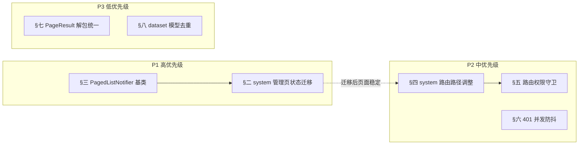

# Flutter 前端架构改造计划

> 本文档聚焦 dehaze_flutter 在**代码架构层面**的实际问题与改造方向，供后续重构参考。架构文档失真问题（结构遗漏、存储依赖虚假、核心功能不完整等）已在 [05-Flutter架构文档.md](../04-项目实现/前端/05-Flutter架构文档.md) 修复中处理，本文不重复。
>
> 前置说明：Flutter 端已完成首轮架构重构（Riverpod 引入、Dio 拦截器、GoRouter、日志模块），基础设施层质量良好。本计划针对的是**首轮重构未覆盖到的遗留债务**，主要集中在状态管理范式统一、路由权限守卫、并发场景健壮性三方面。

> **实施状态（2026-08-09）**：本文档 7 项问题已全部修复并通过 `flutter analyze`（零 issue）。核心成果：新增 `core/state/paged_list_notifier.dart`（`PagedListNotifier` 基类 + `LoadMoreListener`）、`PageResult.fromResponse`、`ErrorInterceptor` 401 防抖、14 个 system 管理页状态范式统一、`dataset_provider` 去冗余映射、路由路径 `system/`→`admin/` + 路由权限守卫。以下问题分析保留作为历史记录。

## 一、问题总览

| # | 问题 | 类别 | 优先级 | 影响范围 |
|---|------|------|:------:|----------|
| 1 | 状态管理范式割裂：14 个 system 管理页绕开 Riverpod，用 setState + 私有字段 | 可维护性 | P1 | `pages/system/*` |
| 2 | 分页列表状态重复：14 个管理页的 `_fetchData/_loading/_error` 样板代码高度雷同 | 可维护性 | P1 | `pages/system/*` |
| 3 | system 路由路径语义不当：14 个管理页挂在 `/profile/system/*` 下 | 可维护性 | P2 | `router/config.dart` |
| 4 | 路由层无权限守卫：仅检查登录态，不检查 `hasPerm` | 安全/健壮性 | P2 | `router/config.dart` |
| 5 | 401 并发防抖缺失：并发请求同时 401 会多次触发 `onAuthError` | 健壮性 | P2 | `core/network/interceptors/error_interceptor.dart` |
| 6 | PageResult 解包逻辑重复：25 个 service 分页接口手写 `data['list']/data['total']` | 可维护性 | P3 | `services/*` |
| 7 | dataset_provider 存在冗余模型映射：本地 DatasetModel 与全局 Dataset 重复定义 | 可维护性 | P3 | `pages/dataset/` |

## 二、P1：状态管理范式割裂

### 2.1 现状

Flutter 端存在**三种并存的状态管理范式**：

| 范式 | 使用位置 | 特征 |
|------|---------|------|
| `StateNotifier<状态对象>` | `auth_provider`、`processing_provider` | 自定义 State 类 + Notifier，状态字段显式 |
| `StateNotifier<AsyncValue<T>>` | `dataset_provider` | Riverpod 推荐的现代范式，内置 loading/error/data |
| `ConsumerStatefulWidget + setState + 私有字段` | `pages/system/*` 14 个管理页 | **完全绕开 Riverpod 状态管理**，仅用 ref.read 取 service |

`pages/system/` 下 14 个管理页（user/role/menu/dept/dict/algorithm/dataset/task/member/package/order/feedback/message/recommend）全部采用第三种范式，典型模式如下（以 [user_page.dart](../../../dehaze_flutter/lib/pages/system/user_page.dart) 为例）：

```dart
class _UserManagePageState extends ConsumerState<UserManagePage> {
  List<UserPageVO> _items = [];
  int _total = 0;
  int _pageNum = 1;
  bool _loading = false;
  String? _error;

  Future<void> _fetchData({bool reset = false}) async {
    setState(() { _loading = true; _error = null; });
    try {
      final result = await ref.read(userServiceProvider).getPage(...);
      setState(() { _items.addAll(result.list); _loading = false; });
    } catch (e) {
      setState(() { _error = extractErrorMessage(e); _loading = false; });
    }
  }
}
```

经 grep 统计，`pages/system/` 下 14 个文件共 87 处 `setState` 调用，**无一处 `StateNotifierProvider`**。

### 2.2 影响

- **范式割裂**：新成员面对同一项目需理解三种状态管理范式，认知负担高；选择范式时无明确依据
- **样板代码重复**：14 个管理页的 `_fetchData`、`_loading`、`_error`、`_pageNum` 逻辑几乎完全相同，约 420 行重复代码（14 页 × 30 行）
- **状态不可共享**：管理页状态局部于 Widget，无法跨页面监听（如某页删除数据后另一页列表需刷新）
- **测试困难**：状态逻辑内嵌于 Widget State，无法独立单元测试
- **丢失 Riverpod 核心价值**：状态不可被 Provider 依赖追踪，无法做自动刷新（`ref.watch` → 自动重建）
- **build 内触发副作用**：部分管理页在 `build`/`_buildList` 内执行分页加载副作用，如 [user_page.dart](../../../dehaze_flutter/lib/pages/system/user_page.dart) line 240-242 在 `index >= _items.length` 时执行 `_pageNum++; _fetchData()`，build 内调用异步副作用有重复触发风险（同一帧多次 rebuild 会多次发起请求）

### 2.3 改造方案

**目标**：system 管理页统一采用 `StateNotifier<AsyncValue<PagedList<T>>>` 范式，与 `dataset_provider` 对齐。

**步骤**：

1. 抽象分页列表状态基类（见 §三），消除 14 页重复的 `_fetchData/_loading/_error` 逻辑
2. 每个管理页迁移为 `StateNotifierProvider<XxxNotifier, AsyncValue<PagedList<XxxVO>>>`
3. 页面 Widget 从 `ConsumerStatefulWidget` 改为 `ConsumerWidget`，通过 `ref.watch` 订阅状态
4. 删除页面内的私有状态字段与 `setState` 调用

**迁移示例**（以 user_page 为例）：

```dart
// 迁移前：ConsumerStatefulWidget + setState + 7 个私有字段 + _fetchData/_deleteUser 内嵌业务

// 迁移后：
final userManageProvider = StateNotifierProvider<UserManageNotifier, AsyncValue<PagedList<UserPageVO>>>(
  (ref) => UserManageNotifier(ref.watch(userServiceProvider)),
);

class UserManagePage extends ConsumerWidget {
  @override
  Widget build(BuildContext context, WidgetRef ref) {
    final state = ref.watch(userManageProvider);
    return state.when(
      loading: () => const LoadingIndicator(),
      error: (e, _) => ErrorView(message: extractErrorMessage(e), onRetry: () => ref.read(userManageProvider.notifier).refresh()),
      data: (page) => UserListView(items: page.items, onLoadMore: () => ref.read(userManageProvider.notifier).loadMore()),
    );
  }
}
```

### 2.4 验收标准

- `pages/system/` 下 14 个管理页无 `setState` 调用（grep 零命中）
- 无 `ConsumerStatefulWidget`（除非页面有 TextEditingController 等需生命周期管理的资源）
- 每个管理页均有对应的 `StateNotifierProvider`，状态为 `AsyncValue<PagedList<T>>`
- 现有功能行为不变（分页加载、搜索、删除后刷新）
- 消除 build 内异步副作用：分页加载触发移至 `loadMore` 显式调用，不在 `build` 内调用 `_fetchData`（如 user_page line 240-242 的 `_pageNum++; _fetchData()` 模式）

## 三、P1：分页列表状态抽象

### 3.1 现状

14 个管理页的 `_fetchData` 方法结构完全一致，仅 service 方法名与模型类型不同：

```dart
// user_page.dart、role_page.dart、dept_page.dart 等 14 个文件中重复
Future<void> _fetchData({bool reset = false}) async {
  if (reset) _pageNum = 1;
  setState(() { _loading = true; _error = null; });
  try {
    final result = await ref.read(xxxServiceProvider).getPage(XxxQuery(pageNum: _pageNum, pageSize: 10, keywords: _searchController.text));
    setState(() { reset ? _items = result.list : _items.addAll(result.list); _total = result.total; _loading = false; });
  } catch (e) {
    setState(() { _error = extractErrorMessage(e); _loading = false; });
  }
}
```

### 3.2 改造方案

在 `lib/core/state/` 新增 `paged_list_notifier.dart`：

```dart
class PagedList<T> {
  const PagedList({this.items = const [], this.total = 0, this.pageNum = 1, this.pageSize = 10});
  final List<T> items;
  final int total;
  final int pageNum;
  final int pageSize;
  bool get hasMore => items.length < total;
}

abstract class PagedListNotifier<T, Q> extends StateNotifier<AsyncValue<PagedList<T>>> {
  PagedListNotifier(this._fetch) : super(const AsyncValue.loading());
  final Future<PageResult<T>> Function(Q query) _fetch;

  String _keyword = '';

  Future<void> search(String keyword) async {
    _keyword = keyword;
    state = const AsyncValue.loading();
    try {
      final result = await _fetch(buildQuery(1, _keyword));
      state = AsyncValue.data(PagedList(items: result.list, total: result.total, pageNum: 1));
    } catch (e, st) { state = AsyncValue.error(e, st); }
  }

  Future<void> loadMore() async { /* 增量加载 */ }
  Future<void> refresh() async { /* 重新加载 */ }
  Q buildQuery(int pageNum, String keyword); // 子类实现
}
```

各管理页 Notifier 继承基类，仅实现 `buildQuery`：

```dart
class UserManageNotifier extends PagedListNotifier<UserPageVO, UserQuery> {
  UserManageNotifier(UserService service) : super(service.getPage);
  @override
  UserQuery buildQuery(int pageNum, String keyword) => UserQuery(pageNum: pageNum, pageSize: 10, keywords: keyword);
}
```

> 说明：上述 `buildQuery` 仅含 `keyword`，为最小示例。实际部分管理页存在复杂筛选：dict 页按 `typeCode` 过滤（[dict_page.dart](../../../dehaze_flutter/lib/pages/system/dict_page.dart) line 281）、task 页 Query 支持 `status/taskType/taskCategory`（[task_model.dart](../../../dehaze_flutter/lib/models/task_model.dart) line 178-185）。这些子类需在 Notifier 内维护额外筛选状态字段，并重写 `buildQuery` 或扩展 `search` 签名以携带筛选条件，Notifier 行数会超过最小示例。

### 3.3 验收标准

- `paged_list_notifier.dart` 基类覆盖 search/loadMore/refresh 三个操作
- 14 个管理页 Notifier 仅含构造 + `buildQuery`（及必要的筛选状态字段），不含分页/加载/错误样板
- 消除 `_items/_total/_pageNum/_loading/_error` 五个私有字段的重复定义
- 含复杂筛选的子类（dict、task 等）通过 Notifier 字段承载筛选条件，不回退到 `setState` 样板

## 四、P2：system 路由路径语义不当

### 4.1 现状

[router/config.dart](../../../dehaze_flutter/lib/router/config.dart) 中 14 个管理页路径全部挂在 `/profile/system/*` 下：

```dart
GoRoute(path: 'system/user-manage', ...),
GoRoute(path: 'system/role-manage', ...),
// ... 共 14 个，均挂载在 /profile 分支内
```

### 4.2 问题

- `/profile` 语义为"个人中心"，`/profile/system/user-manage` 暗示"个人中心的系统用户管理"，语义混乱
- 管理页与个人中心子页（settings/favorites/orders 等）混在同一 Tab 分支，无层级边界
- 桌面端侧边栏菜单无法按语义分组（个人功能 vs 系统管理）

### 4.3 改造方案

将 14 个管理页路径从 `/profile/system/*` 迁移到独立的 `/system/*` 顶层分支：

- 方案 A（推荐）：复用 `profile` Tab 内已有的 `dashboard` 入口（[config.dart](../../../dehaze_flutter/lib/router/config.dart) line 340-343 已存在 `dashboard` 路由与 `DashboardPage`），管理页路径改为 `/profile/admin/user-manage` 等，语义为"个人中心 → 管理后台 → 用户管理"
- 方案 B：管理页作为独立的 ShellRoute 外页面（无 Tab 框架），路径 `/system/user-manage`

**推荐方案 A**：管理页保留在 profile Tab 内便于从个人中心进入管理后台，但路径前缀改为 `admin/` 明确语义边界。现有 `dashboard` 页作为管理后台首页，提供管理功能导航。

### 4.4 验收标准

- 路由路径前缀从 `system/` 改为 `admin/`（或选定的方案）
- 路由常量 `AppRouterConfig` 同步更新
- 所有 `context.go` / `context.push` 调用点同步修改路径

## 五、P2：路由层权限守卫缺失

### 5.1 现状

[router/config.dart](../../../dehaze_flutter/lib/router/config.dart) 的 `redirect` 仅检查登录态：

```dart
redirect: (context, state) {
  final isLoggedIn = authState.isAuthenticated;
  final isPublicRoute = AppRouterConfig.publicRoutes.contains(state.matchedLocation);
  if (!isLoggedIn && !isPublicRoute && !isGoingToAuthPage) return AppRouterConfig.login;
  if (isLoggedIn && isGoingToAuthPage) return AppRouterConfig.home;
  return null;
}
```

14 个管理页虽在代码注释中标注"权限：sys:user:*"，且 build 内均有 `hasPerm` 检查（如 [user_page.dart](../../../dehaze_flutter/lib/pages/system/user_page.dart) line 158，无权限时直接渲染"无权限访问"），但**路由层无权限拦截**，权限检查样板分散在各页面内部。

### 5.2 影响

- 14 个管理页 build 内均已实现 `hasPerm` 检查（如 user_page line 158），无权限时直接渲染"无权限访问"，**不会触发 403**；但该检查样板在 14 页内逐字重复，权限标识硬编码于页面
- 无权限用户访问 URL 时，页面框架（Scaffold/AppBar）仍会先渲染再被 `hasPerm` 分支替换，存在短暂闪烁
- 权限控制分散在各页面内部，无统一入口，新增管理页需复制同一段样板

### 5.3 改造方案

在 `redirect` 中增加权限守卫：

```dart
redirect: (context, state) {
  // ... 现有登录态检查 ...

  // 权限守卫
  final requiredPerm = _routePermissions[state.matchedLocation];
  if (requiredPerm != null && !authState.hasPerm(requiredPerm)) {
    return AppRouterConfig.home; // 或专门的 403 页面
  }
  return null;
}

// 路由 → 权限标识映射
static const Map<String, String> _routePermissions = {
  '/profile/admin/user-manage': 'sys:user:list',
  '/profile/admin/role-manage': 'sys:role:list',
  // ... 14 个管理页
};
```

### 5.4 验收标准

- 无权限用户访问管理页 URL 时被重定向，不进入页面
- 权限映射表覆盖全部 14 个管理页
- 权限标识与后端 `sys_menu.perms` 字段对齐
- 守卫落地后，14 个管理页 build 内的 `hasPerm` 样板（如 user_page line 158-163）删除，无权限分支交由路由层统一处理

## 六、P2：401 并发防抖缺失

### 6.1 现状

[error_interceptor.dart](../../../dehaze_flutter/lib/core/network/interceptors/error_interceptor.dart) 在两处触发 `onAuthError`：

1. 业务错误 `ApiException.isAuthError`（A02xx）时
2. HTTP 401 时

```dart
if (apiError.isAuthError && onAuthError != null) { onAuthError!(); }
// ...
if (statusCode == 401) { if (onAuthError != null) onAuthError!(); ... }
```

### 6.2 问题

当 Token 过期时，页面常有多个并发请求同时返回 401，每个都会调用 `onAuthError!()` → `authProvider.onAuthError()` → `clearTokens()` + 状态切换。多次触发导致：

- 多次 `clearTokens()` 调用（虽然 SharedPreferences 写入幂等，但状态多次切换会触发多次 UI 重建）
- 若未来扩展为 Token 刷新机制，会发起多次刷新请求

### 6.3 改造方案

在 `ErrorInterceptor` 内增加防抖窗口：

```dart
class ErrorInterceptor extends Interceptor {
  DateTime? _lastAuthErrorTime;
  static const _authErrorDebounce = Duration(seconds: 2);

  void _triggerAuthError() {
    final now = DateTime.now();
    if (_lastAuthErrorTime != null && now.difference(_lastAuthErrorTime) < _authErrorDebounce) return;
    _lastAuthErrorTime = now;
    onAuthError?.call();
  }
  // 原 onAuthError!() 调用改为 _triggerAuthError()
}
```

### 6.4 验收标准

- 并发 401 场景下 `onAuthError` 仅触发一次（2s 窗口内）
- 单次 401 行为不变
- 防抖窗口可配置

## 七、P3：PageResult 解包逻辑重复

### 7.1 现状

25 个 service 中分页接口重复以下解包模式（grep 确认 15+ 处）：

```dart
final data = response.data!['data'] as Map<String, dynamic>;
return PageResult(
  list: (data['list'] as List<dynamic>).map((e) => XxxVO.fromJson(e as Map<String, dynamic>)).toList(),
  total: data['total'] as int,
);
```

### 7.2 改造方案

在 `PageResult` 增加工厂方法：

```dart
class PageResult<T> {
  static PageResult<T> fromResponse<T>(Map<String, dynamic> data, T Function(Map<String, dynamic>) fromJson) {
    return PageResult(
      list: (data['list'] as List<dynamic>).map((e) => fromJson(e as Map<String, dynamic>)).toList(),
      total: data['total'] as int,
    );
  }
}
```

各 service 调用简化为：

```dart
return PageResult.fromResponse(response.data!['data'] as Map<String, dynamic>, UserPageVO.fromJson);
```

### 7.3 验收标准

- 25 个 service 中分页接口统一使用 `PageResult.fromResponse`
- 消除 `data['list'] / data['total']` 字面量散落

## 八、P3：dataset_provider 冗余模型映射

### 8.1 现状

[dataset_provider.dart](../../../dehaze_flutter/lib/pages/dataset/providers/dataset_provider.dart) 定义了 `_datasetToModel` 函数，将 `models/dataset_model.dart` 的全局 `Dataset` 映射为 `pages/dataset/models/dataset_model.dart` 的本地 `DatasetModel`：

```dart
DatasetModel _datasetToModel(g.Dataset d) {
  return DatasetModel(
    id: d.id, parentId: d.parentId, name: d.name, ...
    usageCount: null, createBy: null, updateBy: null, // 多个字段强制 null
  );
}
```

两个模型字段高度重叠，本地模型额外有 `usageCount/createBy/updateBy` 字段但强制置 null。

### 8.2 改造方案

本地 `pages/dataset/models/dataset_model.dart` 含 4 个类型，删除整个文件不可行——`DatasetItemModel`/`ItemImageModel`/`ImageModel` 被 `image_provider`/`image_grid`/`index.dart` 使用，全局无完全对应类型。需分别处理：

| 本地类型 | 全局对应 | 处理方式 |
|---------|---------|---------|
| `DatasetModel` | `Dataset`（[models/dataset_model.dart](../../../dehaze_flutter/lib/models/dataset_model.dart) line 106） | 删除本地定义，`dataset_provider` 直接使用全局 `Dataset` |
| `DatasetItemModel` | `DatasetItemVO`（全局 line 244） | 单独评估：保留或映射全局类型 |
| `ItemImageModel` | `ImageUrlVO`（全局 line 342） | 单独评估：保留或映射全局类型 |
| `ImageModel` | 无全局对应 | 保留（前端展示模型，无冗余） |

具体步骤：

1. 仅删除本地 `DatasetModel` 类定义，保留 `DatasetItemModel`/`ItemImageModel`/`ImageModel`/`ImageType`
2. `dataset_provider` 状态类型从 `AsyncValue<List<DatasetModel>>` 改为 `AsyncValue<List<g.Dataset>>`，删除 `_datasetToModel` 映射函数
3. `selectedDatasetProvider` 类型同步改为 `g.Dataset?`
4. `DatasetItemModel`/`ItemImageModel` 的去重作为后续评估项，不在本次改造范围（需确认 `image_provider`/`image_grid`/`index.dart` 的字段依赖）

### 8.3 验收标准

- 无 `_datasetToModel` 映射函数
- `dataset_provider` 状态类型为 `AsyncValue<List<Dataset>>`（全局类型）
- 本地 `dataset_model.dart` 仅保留 `DatasetItemModel`/`ItemImageModel`/`ImageModel`/`ImageType`，不再定义 `DatasetModel`
- 数据集列表/搜索/选中功能不变

## 九、实施时序与依赖



**关键依赖**：

- §三（PagedListNotifier 基类）必须先于 §二（管理页迁移），否则迁移无目标范式
- §四（路由路径调整）应先于 §五（权限守卫），权限映射表需引用最终路径
- §二（管理页迁移）完成后，§四、§五的改造风险更低（页面已无 setState，路由调整不影响局部状态）

**并行策略**：

- §六（401 防抖）、§七（PageResult 解包）、§八（dataset 模型去重）相互独立，可并行
- P1 与 P2 的 §六可并行

## 十、不在本计划范围内（评估后排除）

以下问题经评估后**不纳入改造**，避免过度设计：

| 排除项 | 原因 |
|--------|------|
| `extractErrorMessage` 全局函数位置 | 当前定义在 `api_result.dart` 与 `ApiException` 同文件，虽属 UI 层工具但被 25 个文件引用，迁移收益低、改动面大 |
| Dio 拦截器顺序调整 | 当前顺序（Trace → Auth → Response → Error）正确，`ResponseInterceptor.reject` 抛出的 `DioException` 由 `ErrorInterceptor.onError` 接管，链路清晰 |
| ErrorInterceptor 中 401 重复处理 | `ResponseInterceptor` 仅处理业务 code（`code != "00000"`），HTTP 401 由 `ErrorInterceptor` 统一处理，两者职责分明无冗余 |
| 全局 `AsyncValue` 范式统一至 `auth_provider` | `AuthState` 自定义状态类比 `AsyncValue<UserModel>` 语义更清晰（含 `AuthStatus.initial/loading/authenticated/unauthenticated/error` 五态），`AsyncValue` 无法表达 `initial` 态 |
| Riverpod 升级至 3.x（Notifier API） | 当前 `StateNotifier` + `StateNotifierProvider` 在 Riverpod 2.x 中稳定，3.x 为重大版本升级，需全局评估，非本计划范围 |

## 十一、文档同步清单

改造实施后需同步更新的文档：

| 文档 | 同步内容 |
|------|---------|
| [05-Flutter架构文档.md](../04-项目实现/前端/05-Flutter架构文档.md) | §6.1 Provider 分层表更新（页面级 Provider 列表扩展至 14 个管理页）；§5.1 路由结构表更新路径；§5.2 新增权限守卫规则 |
| [03-模块设计/基础模块/各模块/前端实现.md] | system 管理页状态管理范式描述同步更新 |
| [近期改造计划总览](./近期改造计划总览.md) | 登记本改造项的状态与优先级 |
