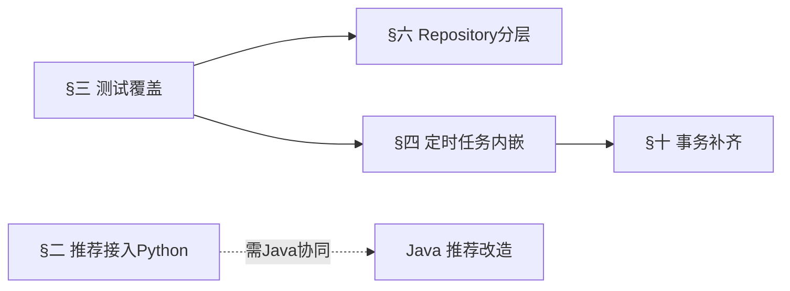

# Go 后端架构改造计划

> 本文档聚焦 dehaze-go 在**代码架构层面**的实际问题与改造方向，供后续重构参考。文档失真问题（服务虚构、路径错误、配额机制描述失实等）已在 [02-Go架构文档.md](../04-项目实现/后端/02-Go架构文档.md) 修复中处理，本文不重复。
>
> 三端对照结论：dehaze-go 与 dehaze-java 在 XxlJob 覆盖上接近对齐（Go 14 个、Java 15 个，Java 多 `processDelayedPush`）、MQ 拓扑（`task.export` + `feedback.low_rating` + DLX）、错误码体系上已对齐；dehaze-python 业务 Job 落后（仅 5 个）。推荐模块伪特征是 **Java + Go 共有** 债务，Python 端已实现真实图像分析服务但未被两端调用。

## 一、问题总览

| # | 问题 | 类别 | 优先级 | 三端是否共有 |
|---|------|------|:------:|:----------:|
| 1 | 推荐模块伪特征（MD5 哈希），Python 真实图像分析服务未被调用 | 功能/架构 | P1 | Java + Go 共有 |
| 2 | 核心业务逻辑零测试覆盖 | 质量 | P1 | Go 独有 |
| 3 | 定时任务逻辑内嵌业务 Service（关注点未分离） | 可维护性 | P2 | 需核实 Java |
| 4 | 异步 goroutine 无 context 取消，优雅关闭可能丢数据 | 可靠性 | P2 | Go 独有 |
| 5 | Repository 分层泄漏，9+ 服务直接使用 gorm.DB | 分层 | P2 | Go 独有 |
| 6 | 缓存键散落为字面量，失效逻辑重复 | 可维护性 | P2 | Go 独有 |
| 7 | Algorithm 配置无 validate 标签，启动时不校验 ServiceURL | 健壮性 | P2 | Go 独有 |
| 8 | 去雾预测状态表与 Java 端不一致（sys_pred_log vs sys_input_history） | 跨端一致性 | P3 | Java + Go 分歧 |
| 9 | CancelExpiredOrders 订单+优惠券更新无事务 | 数据一致性 | P3 | Go 独有 |

## 二、P1：推荐模块伪特征

### 2.1 现状

Go 端 `RecommendationService.Analyze`（`internal/service/recommendation/recommendation_service.go:56-80`）基于图片 URL 的 MD5 哈希生成确定性"伪特征"：`seed := int(math.Abs(float64(hashCode(hash))))`，随后用 `seed % len(...)` 在固定枚举中取值（雾浓度/场景类型/光照/分辨率/噪声等级）。特征值与图像内容完全无关，同一 URL 永远生成相同但无意义的特征。

`NewRecommendationService`（行 48）构造时**未注入算法客户端**，`pkg/algorithm` 的 `Client` 现有导出方法为 `Predict`、`GetPredTaskStatus`、`Evaluate`、`GetEvalTaskStatus`，**无图像特征分析接口**，需新增。

### 2.2 三端对比

| 端 | 图像特征分析实现 | 是否调用 Python |
|----|----------------|:---:|
| Python | 真实实现：PyTorch 场景分类 + OpenCV 暗通道/边缘/直方图（架构文档 §3.8） | 本端即实现 |
| Java | **MD5 伪特征**（`RecommendationServiceImpl.java:70-73`，注释明确"实际生产环境应调用 Python 算法服务提取真实特征"） | 否 |
| Go | **MD5 伪特征**（同 Java 实现一致） | 否 |

Python 端架构文档 §3.8 声称"Java/Go 后端的 ImageAnalysisService 通过 HTTP 调用此服务"，但 Java 与 Go 代码均**未调用**——Python 端图像分析服务目前是未被调用的死基础设施。

### 2.3 影响

- 推荐结果基于虚假特征，场景匹配（urban/landscape/building 等）纯随机，推荐无业务价值，与推荐管理模块需求规格（F-REC-001 图像特征分析）背离。
- 三端业务"对等"承诺失效：Python 端真实分析 vs Java/Go 端 mock，同一图片在三端得到不同推荐质量。

### 2.4 改造方案

1. 在 `pkg/algorithm/client.go` 新增 `AnalyzeImage(ctx, imageURL)` 方法，HTTP 调用 Python 图像特征分析接口，复用现有连接池/重试/熔断/幂等机制。
2. `NewRecommendationService` 注入 `*algorithm.Client`，`Analyze` 改为调用 Python 服务，移除 MD5 伪特征逻辑。
3. Python 服务不可用时降级策略：返回错误（推荐模块不可用）而非伪特征，避免误导用户。
4. **同步 Java 端**：Java `RecommendationServiceImpl.analyze` 需同样改造为调用 Python 服务（Java 改造计划未列入此项，需补充）。
5. 修正 Python 架构文档 §3.8 关于"Java/Go 已调用"的失实描述，待两端接入后再如实记录。

### 2.5 验收标准

- Go/Java 端 `Analyze` 返回真实图像特征，与 Python 端直接调用特征分析服务结果一致
- Python 服务不可用时返回明确错误，不返回伪特征
- 推荐管理模块测试用例覆盖真实特征输入

## 三、P1：核心业务逻辑零测试覆盖

### 3.1 现状

全项目仅 7 个测试文件，集中在 auth、import_export、database、client_log，**核心业务零覆盖**：

| 服务 | 行数 | 测试 |
|------|------|:---:|
| `member_service.go`（配额/签到/成长值/等级） | 1233 | 无 |
| `order_service.go`（支付/退款/自动续费） | 1382 | 无 |
| `prediction_service.go`（异步轮询/配额扣减/缓存） | - | 无 |
| `recommendation_service.go`（伪特征/规则匹配） | - | 无 |
| `payment/`（支付宝/微信/余额） | - | 无 |

项目已存在 `internal/repository/mocks/`、`internal/service/mocks/` Mock 基础设施但未使用。

### 3.2 影响

支付、退款、配额扣减等资金/权益相关逻辑无回归保护，任何重构（含本计划其他项）风险极高。与"生产就绪"定位不符。

### 3.3 改造方案

1. 优先补齐资金/权益链路测试：`MemberService.CheckAndDeductQuota`/`RefundQuota`（并发扣减边界）、`OrderService.completePaymentInTx`（支付+订单+优惠券+会员事务）、`PredictionService.RefundQuota`（失败回补）。
2. 复用已有 Mock 基础设施，覆盖正常/边界/异常路径。
3. 设定核心服务测试覆盖率基线（如 ≥60%），纳入 CI。

### 3.4 验收标准

- 资金/权益链路核心方法有单元测试，覆盖并发与失败回补场景
- CI 强制核心服务测试覆盖率达标

## 四、P2：定时任务逻辑内嵌业务 Service

### 4.1 现状

**MemberService**（`member_service.go`，1233 行）与 **OrderService**（`order_service.go`，1382 行）均将**定时任务逻辑直接内嵌**为 Service 方法：`ResetMonthlyQuota`/`ProcessExpiredMembers`/`SendExpireReminders`/`CancelExpiredOrders`/`ProcessAutoRenewals`/`ExpireUserCoupons`/`RetryFailedRefunds` 等，由 `pkg/job/` 包装层调用。

### 4.2 影响

定时任务逻辑与业务 CRUD 耦合，调度策略无法独立演进；Service 文件膨胀、定位困难。

### 4.3 改造方案

1. 将定时任务方法从 MemberService/OrderService 抽出，下沉为独立 `JobHandler`（`pkg/job/` 下），handler 仅做编排（调用 Service 的可复用业务方法），不持业务状态。
2. **不拆分 Service 本身**：MemberService/OrderService 虽行数较多，但职责内聚于单一业务域（会员/订单），按子域拆分会引入跨服务调用复杂度（如签到扣配额、支付回调更新等级），违背最小必要复杂度原则。文件行数不作为硬性约束。

### 4.4 验收标准

- 定时任务 handler 仅做编排，业务逻辑在可测试的 Service 方法内
- Service 不再持有仅服务于定时调度的入口方法

## 五、P2：异步 goroutine 无生命周期管理

### 5.1 现状

| 异步任务 | 位置 | context |
|---------|------|---------|
| 预测执行 | `prediction_service.go:114` `go s.executeAsync(...)` | `context.Background()`（行 124） |
| 配额异步落库 | `member_service.go:840` `go s.asyncPersistQuotaUsed(...)` | `context.Background()`（行 861） |
| 审计日志 | `audit_log_service.go:42` `go func(){...}()` | 无 |

均无 context 取消机制，无 goroutine 数量上限。

### 5.2 影响

优雅关闭（`app.go` shutdown）时正在执行的预测、配额落库、审计写入可能被中断，导致数据不一致（如配额已 DECR 扣减但未落库）。高并发下无 goroutine 上限可能泄漏。预测 goroutine 虽有 5min 轮询超时，但服务关闭无法主动取消。

### 5.3 三端对比

Java 用线程池 + `@PreDestroy` 优雅关闭；Python 用 TaskTracker 统一注册与等待（Python 改造计划 §3 正补齐推理任务注册）。Go 裸 goroutine 无生命周期管理。

### 5.4 改造方案

1. 引入应用级 `context.Context`（在 `app.go` 启动时创建，shutdown 时 cancel），异步 goroutine 改为派生该 context，关闭时自动取消。
2. 关键异步任务（配额落库）在 shutdown 时等待完成或落盘标记，避免丢失。
3. 评估引入 worker pool 限制并发 goroutine 数量。

### 5.5 验收标准

- shutdown 时异步任务被取消或等待完成，无静默丢失
- 配额落库在关闭前完成或可恢复

## 六、P2：Repository 分层泄漏

### 6.1 现状

Go 有完整 Repository 层（`internal/repository/` 按域组织），但多个服务直接注入 `*gorm.DB` 绕过 Repository：

| 服务 | 泄漏处 | 说明 |
|------|--------|------|
| `algorithm_select_service.go` | 9 处 `s.db.WithContext` | 复杂聚合查询未走 Repository |
| `recommendation_service.go` | 行 106-110,140-142,355 | 直接查 sys_recommendation/sys_algorithm |
| `auth_service.go` | 行 195,216,221,225,229 | 注册流程直接 Create/Where，绕过 UserService/MemberService |
| `favorite_service.go` | 行 79,87,95 | 直接 Count 做存在性校验 |
| `order_service.go` | 行 1324-1328 | 直接查 sys_user |
| `feedback_service.go` / `low_rating_alert_service.go` / `pkgsale/coupon_service.go` | 多处 | 直接 `s.db` 查询 |

### 6.2 影响

分层边界模糊，SQL 散落 Service 层难以复用与测试。`auth_service.go` 注册流程直接操作 DB 创建用户/角色关联/查权益，完全绕过 UserService/MemberService，职责边界混乱。

### 6.3 改造方案

1. 将散落的查询下沉到对应 Repository（如 algorithm_select 的聚合查询入 `algorithm` Repository）。
2. `auth_service.go` 注册流程改为调用 `UserService` + `MemberService`，不在 auth 层直接操作用户/会员表。
3. 短期内无法全量下沉的，至少禁止新增直接 `s.db` 用法，新代码强制走 Repository。

### 6.4 验收标准

- Service 层不再直接 `s.db` 操作业务表（聚合查询可下沉为 Repository 方法）
- 注册流程通过 UserService/MemberService 完成

## 七、P2：缓存键散落与失效逻辑重复

### 7.1 现状

缓存键以字符串字面量散落各服务，无集中管理：`member:profile:%d`、`member:quota:%d:%s`、`order:detail:%s`、`order:create:lock:%d:%d`、`job:member:quota:reset:lock` 等均为字面量（仅 `prediction:`/`msg:unread:`/`anti_repeat:` 已常量化）。

**失效逻辑重复**：`order_service.go:300-309` 的 `invalidateMemberCacheAfterPayment` 与 `member_service.go:185-197` 的 `invalidateMemberCache` 重复实现相同的会员缓存失效，且 `order_service.go:307-308` 硬编码 `"dehaze"`/`"evaluate"` 而非使用 `QuotaTypeDehaze`/`QuotaTypeEvaluate` 常量。

### 7.2 影响

修改任一缓存键格式需跨文件搜索，易遗漏；失效逻辑重复导致两处可能不同步。

### 7.3 改造方案

1. 集中缓存键常量（按域分组，如 `member/keys.go`、`order/keys.go`）。
2. 会员缓存失效逻辑收敛到 MemberService 单一方法，OrderService 调用而非复制。
3. 硬编码配额类型字符串改为常量引用。

### 7.4 验收标准

- 缓存键全部常量化，无字面量散落
- 会员缓存失效逻辑单一实现

## 八、P2：Algorithm 配置无启动校验

### 8.1 现状

`pkg/config/options/algorithm.go` 的 `ServiceURL` 字段**无 `validate:"required"` 标签**。DB 配置校验完善（`oneof=mysql postgres sqlite` 等），但 Algorithm 配置完全无校验。

### 8.2 影响

未配置 `serviceUrl` 时 `NewClient` 创建 baseURL 为空的客户端，启动不报错，延迟到首次预测调用时才在运行时失败，违反快速失败原则。

### 8.3 改造方案

1. `Algorithm.ServiceURL` 添加 `validate:"required,url"`（生产环境）或至少 `validate:"required"`。
2. `NewClient` 在 baseURL 为空时返回 error，由 `app.go` 在启动阶段捕获。
3. 排查 payment/xxljob/rabbitmq 等配置是否同样缺失校验。

### 8.4 验收标准

- 缺失 `serviceUrl` 时启动立即失败并给出明确错误
- 关键配置均有 validate 标签

## 九、P3：去雾预测状态表跨端不一致

### 9.1 现状

- **Go**：预测状态存于 `sys_pred_log.status`（`prediction_service.go` 写入 processing/completed/failed），`sys_input_history` 仅做输入历史 CRUD，`sys_task` 仅用于导入导出异步任务。
- **Java**：预测状态存于 `sys_input_history.status`（Java 改造计划 §1.2 记录此分歧），`SysInputHistoryService` 同时承载历史 CRUD 与状态机。

Java 改造计划 §1.2 原曾错误声称"Go 端存在同样分叉"，经核实 Go 端 `input_history_service.go` 仅做输入历史 CRUD、不承载预测状态，该描述已修正；Java 端为独立债务。

### 9.2 影响

两端预测状态查询走不同表（Go: sys_pred_log / Java: sys_input_history），跨端运维与数据对账困难，状态语义不统一。

### 9.3 改造方案

- 评估统一状态存储表：建议 Java 端向 Go 端设计靠拢（状态归 sys_pred_log，sys_input_history 退化为纯历史视图），即 Java 改造计划 §1.2 方案 A 的目标态。
- 同步修正 Java 改造计划 §1.2 对 Go 的失实描述。
- 此项主体在 Java 端改造，Go 端无需代码变更，但需在三端对照中如实标注当前分歧。

## 十、P3：其他

| 问题 | 现状 | 改造 |
|------|------|------|
| CancelExpiredOrders 无事务 | `order_service.go:916-925` 订单状态更新与优惠券恢复未包裹事务 | 用 `db.Transaction` 包裹，保证一致性 |

## 十一、改造优先级与建议时序

| 优先级 | 改造项 | 主体端 | 建议时序 | 依赖 |
|--------|--------|--------|----------|------|
| P1 | §三 核心业务测试覆盖 | Go | 最先，为后续重构提供安全网 | 无 |
| P1 | §二 推荐伪特征接入 Python | Go + Java | 近期，需两端协同 + Python 接口确认 | 无 |
| P2 | §五 异步 goroutine 生命周期 | Go | 近期，可靠性收益高 | 无 |
| P2 | §八 Algorithm 配置校验 | Go | 立即，改动小、低风险 | 无 |
| P2 | §七 缓存键集中管理 | Go | 立即，纯重构、低风险 | 无 |
| P2 | §六 Repository 分层泄漏 | Go | 中期，需测试覆盖保护 | §三 |
| P2 | §四 定时任务内嵌 | Go | 中期，需测试覆盖保护 | §三 |
| P3 | §九 预测状态表统一 | Java（Go 无需改） | 与 Java §1.2 协同 | - |
| P3 | §十 事务补齐 | Go | 随 §四 一并处理 | §四 |

## 十二、不纳入本计划的事项

- **文档失真修复**：已在 [02-Go架构文档.md](../04-项目实现/后端/02-Go架构文档.md) 修复中完成
- **Java/Python 端代码架构问题**：见 [Java 后端架构改造计划](./Java后端架构改造计划.md) / [Python 后端改造计划](./Python后端改造计划.md)，本计划仅在影响三端一致性时提及
- **业务功能扩展**：见 [产品拓展升级规划](./产品拓展升级规划.md)

## 十三、文档同步清单

| 改造项 | 同步文档 |
|--------|---------|
| §二 推荐接入 Python | [02-Go架构文档 §3.11](../04-项目实现/后端/02-Go架构文档.md)、[03-Python架构文档 §3.8](../04-项目实现/后端/03-Python算法服务架构文档.md)（修正"已调用"失实）、[推荐管理/后端实现](../03-模块设计/基础模块/推荐管理/后端实现.md) |
| §九 预测状态表统一 | [Java 改造计划 §1.2](./Java后端架构改造计划.md)（修正对 Go 的失实描述）、[去雾处理/后端实现](../03-模块设计/核心模块/去雾处理/后端实现.md) |
| §五 goroutine 生命周期 | [02-Go架构文档 §五应用生命周期](../04-项目实现/后端/02-Go架构文档.md) |
