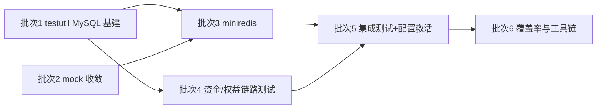

# Go 后端测试规范化改造计划

> 本文档是 dehaze-go 测试体系的规范化改造计划，对齐 2026-08-23 三端测试基础设施决策：**dehaze-python 因 SQLite 方言漂移（DECIMAL 精度/外键/行锁/UPSERT/collation）否决内存库方案，改用真实 MySQL 测试库 `dehaze_test`**（schema/种子数据同源于根目录 `config/sql/`，见 `dehaze-doc/docs/02-系统架构/05-测试架构.md` §6.4 与 `dehaze-python/tests/conftest.py`）。dehaze-go 当前正在踩同款坑且测试基建缺失，本文档给出完整规范与分阶段实施计划。
>
> 与 [Go后端架构改造计划](./Go后端架构改造计划.md) §二的关系：该节记录的"核心业务零测试覆盖"问题由本计划承接并升级方案（原方案仅复用 Mock 基础设施，本计划确立真实 MySQL + mock 收敛的完整体系），其资金/权益链路用例清单继续有效。

## 一、现状问题总览

| # | 问题 | 现状证据 | 类别 | 优先级 |
|---|------|---------|------|:------:|
| 1 | `config.test.yaml` 是死配置 | 全仓库无代码加载它；唯一下游 `pkg/config/viper.go` 的 `getConfigName()` 在 `gin.TestMode` 时选择 `config.test` 文件名，但无任何测试调用 `config.Init()`；现有测试全部绕过（手工构造 `AppConfig` / 手工开 SQLite） | 基建缺失 | P0 |
| 2 | SQLite `:memory:` + `AutoMigrate` 测业务 SQL | `internal/service/import_export/handlers/handlers_user_test.go:68-75`；与 Python 否决理由同源：方言漂移 + AutoMigrate 产物与 `config/sql` 事实来源不一致 + 无种子数据 | 测试可信度 | P0 |
| 3 | Mock 体系双重失控 | `.mockery.yaml` 登记在 `config/` 目录（`../internal/...` 相对路径，须 `cd config && mockery`）；仅覆盖 9 个 repository 域，`app.go` 实际 wire 约 30 个；测试手写 mock struct（`handlers_user_test.go` 的 `mockDeptRepo` 手写 15 个方法、`service_test.go` 的 `mockTaskService`），生成物已存在却不用 | 工程规范 | P0 |
| 4 | 缺 Redis 内存替身 | `go.mod` 无 miniredis（fakeredis 的 Go 对应物）；单测要么手写假 cache 要么触达真实 Redis | 基建缺失 | P1 |
| 5 | 测试分层无全局约定 | 仅 `pkg/database/database_test.go:178` 一处 `testing.Short()` 跳过，无统一运行约定 | 工程规范 | P2 |
| 6 | 核心业务零覆盖 | 7 个测试文件 95 个用例，集中在 auth/import_export/database/client_log；member/order/payment/prediction 等 30+ service 域无测试 | 质量 | P1 |
| 7 | 文档失真 | [05-测试架构.md](../02-系统架构/05-测试架构.md) §3.1 写 "SQLite 内存库（Go）"，与 `config.test.yaml` 已指向 MySQL `dehaze_test` 的内容矛盾 | 文档 | P2 |

### 根因补充：`config.test.yaml` 为什么加载不到

`viper.go` 的 `godotenv.Load("../.env")` 与 `AddConfigPath(".")`/`AddConfigPath("./config")` 均基于**进程工作目录**，而 `go test ./internal/service/auth` 的 CWD 是包目录 `internal/service/auth/`，`.env` 与配置文件均解析失败。任何走 `config.Init()` 的包内测试在当前机制下都拿不到 `config.test.yaml`——这是死配置的技术根因，规范落地时必须解决（见 §3.7）。

## 二、目标规范

### 2.1 核心原则

1. **只替身外部世界**：MySQL 用真实 `dehaze_test` 执行真实 SQL；Redis 单测用 miniredis（真实协议实现）；只有真第三方（外部 HTTP、MQ broker）才 mock。
2. **断言行为而非实现**：断言返回值与数据状态变化，不断言 mock 调用序列。
3. **构造注入优先于全局替换**：`app.go` 是显式构造注入 wiring（`NewXxxRepository(db *gorm.DB)` 形态），测试直接注入测试 DB / mock 依赖，**不需要** Python 那套 monkeypatch 接管全局 factory——这是 Go 端的结构优势，规范必须利用而非绕开。
4. **禁止手写接口 mock**，一律 mockery 生成 + `EXPECT()`。
5. **测试是资产不是补丁**：新增测试落入被测模块对应测试文件，禁止补丁式堆积。

### 2.2 测试分层与运行方式

| 层次 | 运行方式 | 外部依赖 | 占比目标 |
|------|---------|---------|---------|
| 单元测试（默认） | `go test ./...` | 真实 MySQL `dehaze_test`（事务回滚隔离）+ miniredis + mockery mock | 绝大多数 |
| 集成测试 | `go test -tags=integration ./...`（build tag `//go:build integration`） | 真实中间件：Redis db=4 / Mongo `dehaze_test` / MQ | 少量 |
| 契约测试 | 归入单元测试，`httptest` + `gin.CreateTestContext` | 同单元测试 | 每路由组 1 个文件 |

- **废弃 `testing.Short()` 分散跳过约定**，统一 build tag（与 Python 的 pytest marker 分层语义对齐）。
- 单元测试默认连真实 MySQL 是可行的：与开发同实例、事务回滚零污染，Python 已验证。
- 质量门禁增加 `go test -race ./...`（Go 特有并发检查项）与覆盖率（新增代码 ≥80%、整体 ≥60%，对齐 [05-测试架构.md](../02-系统架构/05-测试架构.md) §5.1）。

### 2.3 数据库：真实 MySQL 测试库（核心条款）

新建 `internal/testutil` 包，提供三件套：

1. **进程级一次重建**（`sync.Once`）：DROP + CREATE `dehaze_test` → 导入根目录 `config/sql/`（schema + data 全量脚本），与开发库构建方式完全同源。SQL 语句分割器必须处理 COMMENT 字符串内的分号（Python 已踩过的坑，算法移植自 `dehaze-python/tests/conftest.py` 的 `_split_statements`）。MySQL 不可达或脚本失败时 **fail-fast**，错误信息带完整连接参数与 `.env` 凭证指引。
2. **每测试事务回滚**：`NewTestDB(t)` 开 `tx := db.Begin()`，`t.Cleanup(func() { tx.Rollback() })`，返回 `tx.Session(&gorm.Session{})` 注入 repository 构造函数；被测代码内部的 `db.Transaction()` 在事务上下文中自动降级为 SAVEPOINT，不真正落库，种子数据零污染。
3. **凭证与 CWD 解耦**：用 `runtime.Caller` 定位仓库根读取 `.env`（`MYSQL_HOST`/`MYSQL_PORT`/`MYSQL_USERNAME`/`MYSQL_PASSWORD`），不依赖测试运行目录。

**禁止项**：

- SQLite `:memory:` + `AutoMigrate` 测业务 SQL 语义（存量 `handlers_user_test.go` 需迁移）
- 手写 gorm.DB 假件 / Session 桩
- SQLite/Postgres 相关测试仅保留在 `pkg/database` 自身（DSN 构造/工厂注册/配置校验，现有形式合理）

### 2.4 Redis：miniredis

- 引入 `github.com/alicebob/miniredis/v2`（真实协议实现，fakeredis 的 Go 对应物）。
- service 单测经 `ICache` 构造注入：测缓存真实语义时用基于 miniredis 构造的真实 cache 实例，只关心交互契约时用 `MockICache`。
- **单元测试一律不触达真实 Redis**；真实 Redis（db=4）仅在集成测试使用。

### 2.5 MongoDB：接口 mock + 集成验证

Go 生态无成熟 mongomock（Python 用 mongomock-motor 的方案不可移植）。依赖 Mongo 的模块（登录日志/审计日志）：

- 单测层：经接口抽象 + mockery mock（repository 层已隔离时天然满足）
- 真实读写语义：放集成测试（`dehaze_test` 库，build tag 控制）

### 2.6 Mock：mockery 收敛

1. `.mockery.yaml` **移至 dehaze-go 仓库根目录**，`dir` 改为 `internal/repository/mocks`、`internal/service/mocks` 正规相对路径，`cd dehaze-go && mockery` 直接执行。
2. **补全 `app.go` 实际 wire 的全部 repository/service 接口**（当前缺 api_key/audit_log/eval_log/favorite/feedback/input_history/login_log/member/message/order/pkgsale/pred_log/preset/recommendation/algorithm_favorite 等约 20 个域）。
3. 新增接口落地时同步 `.mockery.yaml` 重新生成，Makefile 提供 `make mocks` 固化入口。
4. 删除测试中的手写 mock struct（`mockDeptRepo`/`mockTaskService` 等），改用生成物。
5. 生成器统一 mockery v2 testify 风格（`EXPECT()`），`go.uber.org/mock` 保持 indirect（quic-go 传入），不混用两套 mock 体系。

### 2.7 配置：救活 `config.test.yaml`

- **单元测试不走 viper 全量加载**：将 `auth_service_test.go` 的手工 `AppConfig` 构造规范化为 `testutil.NewTestConfig()`，各包 `TestMain` 调用（含 `gin.SetMode(gin.TestMode)`、zap 静音）。
- **集成测试才走全量配置**：`testutil` 基于仓库根显式 `viper.SetConfigFile` 加载 `config.test.yaml` + 显式加载根 `.env`，绕开 CWD 问题（§一根因）。
- `config.test.yaml` 的 `system.port: 8990` 与开发端口相同，集成测试起真实 server 会端口冲突——测试内用 `httptest.Server` 或配置改用独立端口。

### 2.8 命名与结构

- 沿用 Go 惯例：测试与源码**同包** `*_test.go`（与 [05-测试架构.md](../02-系统架构/05-测试架构.md) §6.2 一致，不学 Python 的独立 `tests/` 目录）。
- 命名 `Test[方法]_[场景]`（§6.3 已定义）；保留表驱动 + `t.Run` 子测试风格。
- 每包 `TestMain` 负责环境构造（gin 测试模式、日志静音、配置注入），公共部分下沉 `testutil`。
- 数据工厂：`testutil` 提供确定性构造函数（固定值或固定 seed），对齐 Python 的 factory + seed 要求。
- **测试语料标准**：import_export（Excel/CSV 解析）等入口模块必须包含对抗性脏语料（BOM/GBK 编码/零宽字符/CRLF-LF 混排/空表头/超长无分隔行），不接受规整人造数据（与三端统一的质量要求一致）。

### 2.9 反面清单（禁止项汇总）

| 反模式 | 替代 |
|--------|------|
| SQLite `:memory:` + `AutoMigrate` 测业务 SQL | `testutil.NewTestDB(t)`（真实 MySQL + 事务回滚） |
| 手写接口 mock struct | mockery 生成物 + `EXPECT()` |
| 手写 gorm.DB / cache 假件 | 真实测试 DB / miniredis / `MockICache` |
| 单测触达真实 Redis / Mongo | miniredis / 接口 mock；真实中间件仅限集成测试 |
| `testing.Short()` 分散跳过 | build tag `//go:build integration` |
| 测试内手工构造零散 `AppConfig` | `testutil.NewTestConfig()` |
| `.mockery.yaml` 新增接口不登记 | 新接口同步配置重新生成（`make mocks`） |

## 三、分阶段实施计划

| 优先级 | 批次 | 内容 | 验收标准 | 状态 |
|--------|------|------|---------|------|
| P0 | 批次 1：testutil MySQL 基建 | `internal/testutil`（Once 重建 + 事务回滚 + fail-fast + `.env` 解析）；`handlers_user_test.go` 迁移为首个示范消费者 | 迁移后测试连 `dehaze_test` 跑真实 SQL；MySQL 停机时测试 fail-fast 且报错可定位 | ✅ 完成（2026-08-23） |
| P0 | 批次 2：mock 收敛 | `.mockery.yaml` 移根目录 + 补全约 30 个域接口 + 重新生成；删除 `mockDeptRepo`/`mockTaskService` 手写 mock；Makefile `make mocks` | `cd dehaze-go && mockery` 全量生成成功；测试无手写接口 mock | ✅ 完成（2026-08-23，repository 22 域 + service 10 接口 + `import_export.TaskService`/`member.IMemberService`；`audit_log`/`login_log` 包无接口定义未登记） |
| P1 | 批次 3：Redis 替身 + auth 域补全 | 引入 miniredis；`ICache` 注入模式确立；auth 域测试补全（已有 8 用例基础上） | auth 域单测不触达真实 Redis | ✅ 完成（2026-08-23，auth 25 用例） |
| P1 | 批次 4：资金/权益链路测试 | `MemberService.CheckAndDeductQuota`/`RefundQuota`（并发扣减边界）、`OrderService.completePaymentInTx`（事务完整性）、`PredictionService.RefundQuota`（失败回补） | 资金/权益核心方法有测试，覆盖并发与失败回补 | ✅ 完成（2026-08-23，member 21 用例 + order 5 + prediction 5，全量含 `-race` 绿） |
| P2 | 批次 5：集成测试 + 配置救活 | build tag 机制；`testutil` 配置解析（显式 `SetConfigFile` + `.env`）；契约测试模板（httptest 验证 `{code,msg,data}` 信封）；`config.test.yaml` 端口冲突处理 | `go test -tags=integration ./...` 可运行真实中间件用例；单测/集成分层清晰 | ✅ 完成（2026-08-23，`testutil.LoadTestConfig` 救活 config.test.yaml（端口改 8998）；契约模板 `internal/api/auth_controller_test.go` 12 用例；集成模板 `internal/service/auth/integration_test.go` 5 用例（真实 Redis db=4，含 db 隔离交叉验证）；默认/集成/-race 三模式全绿） |
| P3 | 批次 6：覆盖率与工具链收敛 | 覆盖率纳入门禁（新增 ≥80%/整体 ≥60%）；`-race` 门禁；Makefile 补 `test`/`test-integration`/`cover` targets | CI 门禁生效 | 待实施（Makefile targets 已随批次 2 落地） |

### 实施中发现的新增源码缺陷（2026-08-23 测试固化发现，已全部修复，见下方修复记录）

| # | 缺陷 | 现状证据（测试用例） | 风险 |
|---|------|--------------------|------|
| 1 | 配额回补无下限保护 | `IncrementQuotaUsed(userID, type, -1)` 的 SQL 无 `WHERE used > 0`，重复回补会把 `monthly_*_used` 减为负数 | 凭空制造额度 |
| 2 | 支付流水在事务外创建 | `HandlePaymentCallback` 中段失败回滚时支付流水已落库、订单未支付 | 流水/订单不一致窗口 |
| 3 | 配额扣减无行级余额保护 | `CheckAndDeductQuota` 校验在应用层（非 `WHERE used < quota`），高并发依赖缓存计数器兜底 | 极端并发下超扣 |
| 4 | 扣减路径不失效配额缓存计数器 | 扣减成功只 Get/Set/Decr 不 `cache.Delete`，缓存与 DB 存在不一致隐患 | 缓存漂移 |
| 5 | 空请求体被兜底为系统错误 | `ShouldBind` 对空 body/非法 JSON/缺 Content-Type 的绑定失败不走 `PARAM_ERROR`(A0400) 分支，被 `HandleError` 兜底成 `SYSTEM_EXECUTION_ERROR`(B0001)，客户端参数错误被误报为系统错误（批次 5 契约测试发现） | 错误码语义失真，前端无法按 A 类码提示 |

修复时须同步更新固化上述现状的测试用例（`member_service_quota_test.go`、`order_service_test.go`、`prediction_service_test.go`）。

### 修复记录（2026-08-23，5 个缺陷全部修复，测试同步改写）

| # | 修复方式（SQL/代码要点） | 同步改写的测试用例 |
|---|------------------------|-------------------|
| 1 | `IncrementQuotaUsed` 减方向（delta<0）追加 `WHERE used > 0` 下限条件：used=0 时回补更新 0 行（no-op、不报错），`monthly_*_used` 永不为负；加方向（扣减 +1）不受约束 | member：`TestRefundQuota_Repeated_SecondRefundNoOp`（原 NotIdempotent）、`TestRefundQuota_ZeroUsedRefund_NoOp`（原 NoLowerBoundGuard_UsedGoesNegative）；prediction：`TestRefundQuota_DoubleRefund_NoOp`（原 DoubleRefund_DecrementsBelowZero） |
| 2 | 成功回调的流水创建移入 `completePaymentInTx` 事务闭包开头（`NewPaymentRecordRepository(tx)`），中段失败与订单/优惠券/会员一并回滚；失败回调流水仍独立落库（记录失败支付尝试，无回滚语义）；Redis 幂等锁保持在事务外，接口签名不变 | `TestHandlePaymentCallback_Rollback_WhenMemberMissing`（断言流水随事务回滚为空，删除原"流水不受回滚保护"标注）；成功链路流水断言保持 |
| 3 | 新增 repository 方法 `DeductQuotaIfAvailable`：`UPDATE ... SET used = used + 1 WHERE user_id = ? AND used < quota`（原子行级条件），affected rows=0 → `QUOTA_EXCEEDED`；`CheckAndDeductQuota` DB 路径改用该权威扣减，应用层预校验仅作快速失败 | `TestCheckAndDeductQuota_Concurrent_QuotaLessThanWorkers_NoOversell`（原 AccountingConserved，加强断言 success ≤ 配额）；新增 `TestDeductQuotaIfAvailable_Concurrent_RowLevelGuard_NoOversell`（绕过应用层预校验直接并发扣减） |
| 4 | DB 权威扣减成功后 `cache.Set` 写入 DB 精确剩余值（quota - 回读 newUsed），不再依赖 Delete（避免缓存击穿/重建风暴）；缓存写失败仅告警，账目以 DB 为准。缓存成功路径（DECR 即权威计数器）保持不重构 | `TestCheckAndDeductQuota_CachePath_DecrError_FallsBackToDB`（补充 DB 扣减后缓存对齐 Set 断言）；`NoDeleteOnSuccess` 保留并更新注释（缓存成功路径不 Delete） |
| 5 | `ContextErrorHandler` 在 validator 分支后新增 `isRequestBindingError` 判定：`*json.SyntaxError`/`io.EOF`（空 body）/`*json.UnmarshalTypeError`（类型不匹配）映射 `PARAM_ERROR`(A0400)；不确定的错误保持 B0001（宁缺毋滥）。属实现对齐 [04-API规范.md](../02-系统架构/04-API规范.md) §5.3.1 A0400「参数错误」语义 | 契约测试 `Login_InvalidJSON`/`Login_WrongContentType`/`Login_EmptyBody` 断言 B0001→A0400；新增 `Login_TypeMismatch`、`Login_HugeInvalidBody` 变体 |

## 四、文档同步清单

| 改造批次 | 同步文档 |
|---------|---------|
| 批次 1（testutil 落地） | [05-测试架构.md](../02-系统架构/05-测试架构.md) §3.1（"SQLite 内存库（Go）"改为"真实 MySQL 测试库 dehaze_test，schema 同源 config/sql"）；[02-Go架构文档](../04-项目实现/后端/02-Go架构文档.md) 测试章节 |
| 批次 2（mock 收敛） | [02-Go架构文档](../04-项目实现/后端/02-Go架构文档.md) Mock 基建说明 |
| 全部完成后 | 在 `dehaze-go/` 内落测试规范 README（对标 `dehaze-doc/docs/02-系统架构/05-测试架构.md` §6.4 体例），作为 Go 端测试的事实文档 |
| - | [Go后端架构改造计划](./Go后端架构改造计划.md) §二（本次已更新为指向本计划） |

## 五、不纳入本计划的事项

- **业务代码架构问题**（Repository 分层泄漏、goroutine 生命周期等）：见 [Go后端架构改造计划](./Go后端架构改造计划.md)，其中 §五/§三 依赖本计划的测试安全网
- **Java/Python 端测试规范**：Python 已落地（见 `dehaze-doc/docs/02-系统架构/05-测试架构.md` §6.4）；Java 已落地（`dehaze-java/src/test/README.md`）
- **SDK/前端测试**：见 [05-测试架构.md](../02-系统架构/05-测试架构.md) §1.2 范围表
