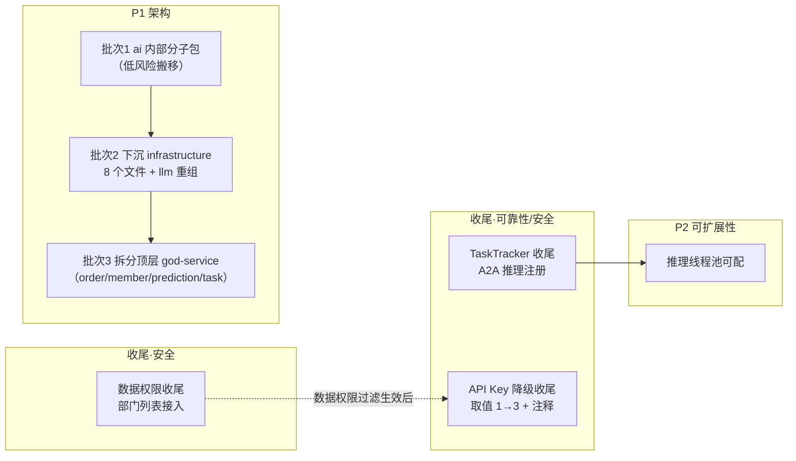

# Python 后端改造计划

> 本文档聚焦 dehaze-python 在**代码架构层面**与 Java/Go 端存在的差距与可靠性缺口，供后续改造与重构参考。每项问题均经代码核实并标注三端对比，不包含已沉淀至事实文档的已完成项。改造项的统筹编排见 [近期改造计划总览](./近期改造计划总览.md)。

## 1. 问题总览

| # | 问题 | 类别 | 优先级 | 状态 |
|---|------|------|:------:|:----:|
| 1 | 行级数据权限（DataScope）：核心已实现，剩余部门列表收尾 | 安全 | P0 | 收尾中 |
| 2 | asyncio 后台任务纳入 TaskTracker：核心已注册，剩余 A2A 推理 | 可靠性 | P1 | 收尾中 |
| 3 | API Key 中间件 Redis 降级：方向已修正，取值/注释待收尾 | 安全 | P1 | 收尾中 |
| 4 | 推理线程池并发数硬编码 | 可扩展性 | P2 | 待改造 |
| 5 | 服务层架构治理（`service/ai` 职责混装 + 顶层 god-service） | 架构 | P1 | 待改造 |

> 说明：以下问题均为 Python 端独有，经代码核实后 §2-§4 的核心问题已解决，仅剩低成本收尾（详见各节）；§5-§6 仍待改造。改造后需保证三端 API 契约一致下的安全与可靠性语义一致。

## 2. 行级数据权限（DataScope）：核心已实现，剩余部门列表收尾

### 2.1 已实现范围（代码核实）

`app/repository/data_scope.py` 提供 `apply_data_scope` 显式过滤助手，取值与 Java/Go 对齐（`0` 全部 / `1` 部门及子部门 / `2` 本部门 / `3` 仅本人，ROOT 跳过，未知取值保守返回空集），并有单元测试 `tests/repository/test_data_scope.py`。已接入：

- `user_repository` 用户分页
- `order_repository` 订单分页

### 2.2 三端对齐现状

| 端 | 实现方式 | 生效范围 |
|----|---------|---------|
| Java | MyBatis-Plus `DataPermissionInterceptor` + `@DataPermission` | 用户列表、**部门列表** |
| Go | GORM Plugin `dataScopeCallback` | 用户、**部门**（tree_path 树过滤） |
| Python | `apply_data_scope` 显式调用 | 用户、订单（**部门列表未接入**） |

### 2.3 剩余收尾（低成本）

1. **部门列表未接入**：`dept_repository.get_dept_list` / `get_dept_options_tree` 无 `apply_data_scope`，而 Java（`SysDeptMapper.selectList`）与 Go 均过滤部门列表——三端对齐缺口，复用现有工具函数即可

### 2.4 验收标准

- `dept_repository` 两个部门查询接入 `apply_data_scope`，与 Java/Go 过滤范围一致

## 3. asyncio 后台任务纳入 TaskTracker：核心已注册，剩余 A2A 推理

### 3.1 已实现范围（代码核实）

三个核心推理服务均已注册 TaskTracker（`task_id` 复用日志主键，注册失败 try/except 降级为日志告警，不影响主流程）：

| 服务 | 提交位置 | task_id |
|------|---------|---------|
| `task_service`（导出/下载） | `task_service.py` L379 | 原 task_id |
| `prediction_service`（去雾推理） | `prediction_service.py` L230 | `pred:{log_id}` |
| `evaluation_service`（评估指标） | `evaluation_service.py` L131 | `eval:{log_id}` |
| `compare_service`（对比报告） | `compare_service.py` L86 | `compare:{task_id}` |

### 3.2 剩余收尾（低成本）

1. **A2A 后台推理未注册**：`a2a_server.py` `_message_send`（L140）的 `_run_inference` 用 `self._running` 字典自行管理，未注册 TaskTracker——A2A 推理同属推理链路，优雅关闭时不被 `wait_for_completion` 等待。参照 prediction 模式注册（`task_id` 复用 `taskId`）
2. （记录不改造）AI 会话侧后台任务（`agent_hooks` 记忆提取/标题更新、`reasoning_service` ES 同步/推荐、`step_summarizer`、`ai_feedback_service` 沉淀）以 `_pending_tasks` 集合自行管理、无全局视图；非核心推理链路，如无全局监控诉求可维持现状

### 3.3 验收标准

- A2A 推理任务注册 TaskTracker，优雅关闭日志中可见被等待完成或取消

## 4. API Key 中间件 Redis 降级：方向已修正，取值与注释待收尾

### 4.1 已实现范围（代码核实）

`api_key_auth.py` L143 已改为 `else 1`，Redis 不可用时 `data_scope` 按**最小权限方向**降级（原始 bug `else 0` = 全部数据已修复），与 `perms` 降级为空集方向一致：

```python
data_scope = await role_repository.get_maximum_data_scope(db, roles) if redis else 1
```

### 4.2 剩余收尾（低成本）

1. **降级取值未达最小**：`else 1` 语义为"部门及子部门"（DataScopeDeptTree），最小权限应为 `3`（仅本人，DataScopeSelf）——`apply_data_scope` 对 `scope=3` 仅需 `creator_field`，API Key 场景可满足
2. **注释修正**：L141-142 注释 "data_scope=1（仅本人）" 语义错误，随取值一并改为 `3`

### 4.3 验收标准

- Redis 不可用时 API Key 请求的 `data_scope=3`（仅本人），注释与取值一致
- 单元测试覆盖 Redis 可用/不可用两种场景的 `data_scope` 取值

## 5. P2：推理线程池并发数硬编码

### 5.1 现状

`prediction_service.py` L57：

```python
_inference_executor = ThreadPoolExecutor(max_workers=2, thread_name_prefix="algo-inference")
```

GPU 推理专用线程池并发数硬编码为 2，不可通过配置调整。

### 5.2 影响

- 不同部署环境（单卡 / 多卡 / CPU 回退）的合理并发数差异大，硬编码导致无法按硬件调优
- 多任务类型扩展后（去雨/去雪/超分等），算法数量增长，固定 2 并发可能成为吞吐瓶颈，但也可能因显存不足需要降到 1
- [近期改造计划总览 §3.2](./近期改造计划总览.md) 已指出"推理线程池 2 worker 串行"作为现状，但未列为改造项

### 5.3 改造方案

1. 在 `config.py` 新增 `INFERENCE_THREAD_POOL_SIZE: int = 2` 配置项，按环境可调
2. `prediction_service.py` 读取 `settings.INFERENCE_THREAD_POOL_SIZE` 替换硬编码
3. 生产环境可根据 GPU 显存配置该值（如 24GB 显存单卡建议 1-2，避免显存溢出）

### 5.4 验收标准

- 推理线程池大小通过环境变量/配置文件可调
- 默认值保持 2，不破坏现有部署

## 6. P1：服务层架构治理

### 6.1 现状

`app/service/` 存在两类结构问题：

**1. 大模块（ai）内部职责混杂**：`service/ai/` 平铺 53 个 `.py` 文件（另有 `paradigms/`、`skills/` 两个子目录），混装了 6 种不同职责（外部客户端、协议转换、中间件、构建器、策略规则、业务编排），仅靠文件名前缀（`mcp_`/`web_`/`paradigm_`/`tool_` 等）勉强区分，模块可读性与可维护性差。

**2. 顶层 god-service**：`app/service/` 顶层平铺 44 个 `.py` 文件，多个单文件超 500 行：

| 文件 | 行数 | 问题 |
|------|------|------|
| `order_service.py` | 1138 | god class（订单+支付+退款+超时全塞一个文件） |
| `member_service.py` | 931 | god class（会员+成长值+等级+到期） |
| `prediction_service.py` | 881 | god class（预测管线+缓存+拦截器链） |
| `task_service.py` | 748 | god class |

### 6.2 职责边界判定（按架构文档 §3.11）

[Python 后端架构文档 §3.11](../04-项目实现/后端/03-Python算法服务架构文档.md) 已定义边界：`infrastructure` 回答"**如何**与外部技术资源对话"（协议转换、子进程、Key 轮换），`service` 回答"业务上**该用哪个**模型、失败如何降级"（路由决策）；service 禁止直接持有协议转换/子进程管理实现。

按此标准，`service/ai/` 中以下文件**不属于 service 层职责**，应下沉 `app/infrastructure/`：

| 文件 | 实际职责 | 违反的边界 | 下沉位置 |
|------|---------|-----------|---------|
| `mcp_gateway_client.py` | MCP 网关 JSON-RPC 客户端 | 外部技术资源对话（协议转换） | `infrastructure/clients/`（新建） |
| `web_search_client.py` | 外部 HTTP 搜索客户端 | 外部技术资源对话 | `infrastructure/clients/`（新建） |
| `code_sandbox.py` | 子进程执行沙箱 | 文档明确点名"子进程管理"属 infra | `infrastructure/sandbox/`（新建） |
| `checkpoint_manager.py` | langgraph RedisSaver 适配 | 基础设施适配 | `infrastructure/cache/`（已有） |
| `sse_event_converter.py` | SSE 事件协议转换 | 协议转换 | `infrastructure/sse/`（已有） |
| `dehaze_chat_model.py` | langchain LLM 模型适配 | 与 `infrastructure/llm/` 职责重叠 | `infrastructure/llm/client/`（重组后，见 §6.4） |
| `a2a_server.py` | A2A 协议服务端 | 协议层（且 `router/a2a.py` 已存在） | `infrastructure/a2a/`（新建，聚拢） |
| `a2a_task_mapper.py` | A2A 协议对象 ↔ dehaze 对象映射 | 随 `a2a_server` 下沉（协议对象映射） | `infrastructure/a2a/`（新建，聚拢） |

**同时发现 `infrastructure/llm/` 自身职责混装**（14 个平铺文件混 7 类职责），随批次 2 一并重组：`a2a_client`/`a2a_protocol` 本属 A2A 协议层却埋在 `llm/` 下，`model_registry`/`provider_key_selector`/`provider_health_service` 是**跨模态**（LLM/Embedding/TTS 共用）供应商能力却被 embedding/rerank 反向引用 `llm/` 子包——重组方案见 §6.4。

**保留在 service 层的判断**：除上述 8 个外，其余 43 个模块均为业务编排或推理链内部逻辑。注意以下易误判项：
- `memory_es_service.py` / `conversation_search_service.py`：docstring 自述"CQRS 读模型编排层"，底层读写原语已由 `infrastructure/es/` 提供，二者承载的是**聚合/过滤策略（业务决策）**，保留在 service
- `knowledge_base_tool.py`：调用内部 `service/kb/search_service`（业务服务）而非外部资源，是 Agent 工具适配，保留在 service
- `interrupt_handler.py`：虽"仅负责 Redis 存取"，但承载推理中断语义（confirm/quota/async_wait），与 `async_resume` 同属中断链路，保留在 middleware；Redis 调用属正常基础设施依赖，不违反"协议转换/子进程"边界

### 6.3 业界最佳实践

组合策略：**外层分层（Layered）+ 大模块内再分域（Package-by-feature）**，遵循业界共识：

1. **Ports & Adapters（六边形架构）**：外部技术资源对话永远放适配器层（infrastructure），业务决策层只依赖抽象。当前 `mcp_gateway_client`/`web_search_client` 放 service 就是适配器混入用例层
2. **单一职责文件**：文件超 ~300-500 行即拆（业界普遍阈值），`order_service.py` 1138 行是不可维护的反模式
3. **包内可见性控制**：子包通过 `__init__.py` 白名单导出公开 API，内部模块用 `_` 前缀或子包隔离，防止跨包随意引用
4. **"先搬后拆"演进**：大模块先按职责分子包（纯搬移、不动逻辑、import 全局替换），再逐步把 god class 拆成多文件——搬移风险远低于重写

### 6.4 目标结构

**`service/ai/` 重组后**（43 个模块按职责归位，`__init__.py` 白名单导出）：

```
app/service/
├── ai/
│   ├── __init__.py
│   ├── service/                        # 业务编排层：推理用例 + 领域服务
│   │   ├── __init__.py
│   │   ├── reasoning_service.py        # 推理主链路编排（build_context→astream→finalize）
│   │   ├── ai_schedule_service.py      # 定时调度服务（任务 CRUD + 触发）
│   │   ├── ai_schedule_executor.py     # 调度执行引擎（无人值守执行链路）
│   │   ├── ai_schedule_notify.py       # 调度结果站内信通知
│   │   ├── algorithm_recommend_service.py
│   │   ├── batch_process_service.py    # 批量处理调度
│   │   ├── compatible_api_service.py   # 第三方兼容 API（OpenAI/Anthropic 适配）
│   │   ├── compatible_governance.py    # 兼容 API 接入治理（Key 配额/白名单）
│   │   ├── compatible_audit.py         # 兼容 API 调用审计
│   │   ├── conversation_search_service.py  # 会话 ES 读模型编排（CQRS）
│   │   ├── memory_es_service.py        # 记忆 ES 读模型编排（CQRS）
│   │   ├── memory_extraction.py        # 长期记忆提取
│   │   ├── memory_injection.py         # 长期记忆注入
│   │   ├── summary_service.py          # 自动摘要压缩
│   │   ├── suggestion_service.py       # 类似问题推荐
│   │   ├── step_summarizer.py          # 步骤摘要
│   │   ├── credits_service.py          # Token 统计与积分换算
│   │   ├── eval_runner.py              # 评测执行器
│   │   ├── provider_connectivity_service.py  # 供应商连通性测试
│   │   ├── skill_manager.py            # Skills 管理器（DB 播种 + 指令加载）
│   │   └── agent_state.py              # AgentState（LangGraph 状态定义）
│   ├── builders/                       # 图/工具/上下文构建
│   │   ├── __init__.py
│   │   ├── deep_agent_builder.py       # deepagents 图组装
│   │   ├── team_builder.py             # Team 团队图组装
│   │   ├── dehaze_tools_builder.py     # 业务工具装载为 LangChain Tool
│   │   ├── context_manager.py          # 上下文消息组装
│   │   └── knowledge_base_tool.py      # 知识库检索工具
│   ├── middleware/                     # 推理链横切（hooks/护栏/恢复）
│   │   ├── __init__.py
│   │   ├── agent_hooks.py              # 生命周期钩子框架
│   │   ├── dehaze_hooks_middleware.py  # 钩子具体实现（安全/审计/计费/记忆注入点）
│   │   ├── guardrail_middleware.py     # 安全护栏
│   │   ├── paradigm_middleware.py      # 推理范式
│   │   ├── tool_failure_guard.py       # 连续失败保护
│   │   ├── tool_recovery.py            # 工具错误分类与恢复
│   │   ├── capability_constraints.py   # VFS 容量/任务清单约束
│   │   ├── mcp_namespace_prefilter.py  # MCP 工具命名空间预筛选
│   │   ├── async_resume.py             # async_wait 中断自动恢复
│   │   └── interrupt_handler.py        # 中断点管理（confirm/quota/async_wait）
│   ├── strategies/                     # 策略/规则/模板
│   │   ├── __init__.py
│   │   ├── complexity_evaluator.py     # 复杂度评估
│   │   ├── quota_recall.py             # 配额召回
│   │   ├── prompt_composer.py          # 提示词组合
│   │   ├── scene_templates.py          # 场景化提示词模板
│   │   └── agent_config_resolver.py    # Agent 配置三级合并解析
│   ├── paradigms/                      # 推理范式（已有，保持）
│   │   ├── __init__.py
│   │   ├── plan_execute.py
│   │   └── reflexion.py
│   └── skills/                         # Skill 内置工作流（已有，保持）
│       └── image_dehaze_workflow.md
├── kb/                                 # 已按域拆分（正确示范）
├── billing/                            # 已按域拆分
└── ...                                 # 其余保留平铺
```

**`app/infrastructure/` 重组后**（8 个文件从 service 下沉 + `llm/` 按职责拆分）：

```
app/infrastructure/
├── __init__.py
├── logging.py
├── clients/                            # 新建：外部服务客户端
│   ├── __init__.py
│   ├── mcp_gateway_client.py           # ← 从 service/ai 下沉
│   └── web_search_client.py            # ← 从 service/ai 下沉
├── sandbox/                            # 新建：子进程执行沙箱
│   ├── __init__.py
│   └── code_sandbox.py                 # ← 从 service/ai 下沉
├── a2a/                                # 新建：A2A 协议层（聚拢 + 下沉）
│   ├── __init__.py
│   ├── a2a_protocol.py                 # ← 从 infrastructure/llm 移入
│   ├── a2a_client.py                   # ← 从 infrastructure/llm 移入
│   ├── a2a_server.py                   # ← 从 service/ai 下沉
│   └── a2a_task_mapper.py              # ← 从 service/ai 下沉
├── provider/                           # 新建：跨模态供应商能力（上提自 llm/）
│   ├── __init__.py
│   ├── model_registry.py               # ← 从 infrastructure/llm 上提（模型→候选路由）
│   ├── provider_key_selector.py        # ← 从 infrastructure/llm 上提（Key 轮换/冷却/日额度）
│   └── provider_health_service.py      # ← 从 infrastructure/llm 上提（健康/熔断）
├── llm/                                # 重组：LLM 协议适配 + 韧性调用 + 本地模型
│   ├── __init__.py
│   ├── client/                         # 协议适配（工厂 + 供应商实现）
│   │   ├── __init__.py
│   │   ├── model_client.py             # 统一接口与工厂（openai_compat/anthropic 分发）
│   │   ├── openai_compat_client.py
│   │   ├── anthropic_client.py
│   │   └── dehaze_chat_model.py        # ← 从 service/ai 下沉（langchain 适配）
│   ├── call/                           # 韧性调用编排
│   │   ├── __init__.py
│   │   └── llm_client.py               # 候选路由序列 + 逐 Key 重试
│   └── local/                          # 本地模型
│       ├── __init__.py
│       ├── local_llm_manager.py        # 子进程生命周期
│       ├── local_llm_model.py          # 模型文件下载
│       ├── local_llm_server.py         # 本地推理服务
│       └── model_seeder.py             # 本地模型幂等播种
├── embedding/                          # 已有
│   └── embedding_client.py             # 引用 provider/（跨模态 Key 共用）
├── voice/                              # 已有（FunASR/Piper）
├── cache/                              # 已有 + 下沉
│   ├── cache.py
│   ├── local_cache.py
│   ├── redis_fallback.py
│   ├── redis_lock.py
│   └── checkpoint_manager.py           # ← 从 service/ai 下沉（langgraph RedisSaver）
├── sse/                                # 已有 + 下沉
│   ├── sse_emitter_manager.py
│   └── sse_event_converter.py          # ← 从 service/ai 下沉
├── crypto/                             # 已有
├── es/                                 # 已有
├── job/                                # 已有
├── metrics/                            # 已有
├── mq/                                 # 已有
└── storage/                            # 已有
```

**重组原则**：
- **A2A 协议层聚拢**：`a2a_protocol`/`a2a_client`（原埋在 `llm/`）+ `a2a_server`/`a2a_task_mapper`（下沉）合并为 `infrastructure/a2a/`，与 `router/a2a.py` 对应
- **跨模态能力上提**：`model_registry`/`provider_key_selector`/`provider_health_service` 是 LLM/Embedding/TTS 共用能力（`embedding_client` 已反向引用 `llm/provider_key_selector`），上提为 `infrastructure/provider/`，消除"embedding 引用 llm 子包"的跨模态错位
- **`llm/` 收窄为 LLM 专属**：`client/`（协议适配）→ `call/`（韧性调用）→ `local/`（本地模型），`llm_client` 是唯一对外编排入口（架构文档 3.11 图将其画在 Service 侧属文档与代码不一致，本次修正为 infra 归属）

### 6.5 分批改造方案与任务分配

**分工原则**：
- **用户执行（PyCharm 重构）**：文件/目录的**移动与重命名**。本改造的"纯搬移"（不改内容、只改位置）一律用 PyCharm `Refactor → Move`（拖拽文件/目录到目标包），IDE 自动同步全部 import 引用。已勘察确认：app 内均为静态 import（无 `importlib`/`__import__` 动态加载），Move 可自动覆盖 router / middleware / infrastructure / service / lifecycle / tests 共 72 个引用文件，无需手工替换
- **AI 执行**：内容修改类工作——新建/改写 `__init__.py` 白名单导出、god-service 拆分的逻辑重构、下沉后的适配调整、文档与测试同步、全局验证

**协作流程**：每批先由用户用 PyCharm 完成 Move/Rename，再交由 AI 补齐剩余工作（新建 `__init__.py`、同步文档与测试、grep 验证无遗留旧 import、跑全量测试）。

**批次 1：`ai/` 内部分子包（纯搬移，风险低）**

| 工作项 | 执行者 | 工具/方式 |
|--------|--------|-----------|
| 43 个模块移入 `service/`、`builders/`、`middleware/`、`strategies/` 子包（目标结构见 §6.4） | **用户** | PyCharm Move，自动更新 app 内 25 处 + tests 全部引用 |
| 新建 4 个子包 `__init__.py` 白名单导出 | AI | 内容编写 |
| 调整 `service/ai/__init__.py` 导出 | AI | 内容编写 |
| 同步 [Python 后端架构文档](../04-项目实现/后端/03-Python算法服务架构文档.md) 分层描述 + 模块设计文档 import 路径 | AI | 内容修改 |
| grep 验证无 `from app.service.ai.xxx` 旧引用 + 跑全量测试 | AI | 验证 |

**批次 2：下沉 infrastructure + `llm/` 重组（风险中，依赖批次 1 的 import 稳定）**

| 工作项 | 执行者 | 工具/方式 |
|--------|--------|-----------|
| 8 个文件从 `service/ai` 下沉：`mcp_gateway_client`/`web_search_client` → `clients/`、`code_sandbox` → `sandbox/`、`checkpoint_manager` → `cache/`、`sse_event_converter` → `sse/`、`dehaze_chat_model` → `llm/client/`、`a2a_server`/`a2a_task_mapper` → `a2a/` | **用户** | PyCharm Move，自动更新 router / service 侧引用 |
| `llm/` 重组：`a2a_protocol`/`a2a_client` → `a2a/`；`model_registry`/`provider_key_selector`/`provider_health_service` → `provider/`；`model_client`/`openai_compat_client`/`anthropic_client` → `client/`；`llm_client` → `call/`；`local_llm_*` ×4 → `local/` | **用户** | PyCharm Move，embedding/rerank 等跨模态引用的 import 由 IDE 自动改写为 `provider/` |
| 新建 `clients/`、`sandbox/`、`a2a/`、`provider/` 及 `llm` 子包 `__init__.py` 白名单导出 | AI | 内容编写 |
| `dehaze_chat_model` 下沉后与 `client/` 的适配调整（如有内容耦合） | AI | 内容修改 |
| 修正架构文档 §3.11 mermaid 图（`llm_client` 归 infra 侧、补 `provider/`/`a2a/`）+ 模块设计 import 路径 | AI | 内容修改 |
| 同步测试引用 + grep 验证无 `llm.a2a_*`/`llm.provider_*` 旧 import + 全量测试 | AI | 修改 + 验证 |

**批次 3：拆分顶层 god-service（风险高，逻辑重构非搬移）**

| 工作项 | 执行者 | 工具/方式 |
|--------|--------|-----------|
| `order_service.py`(1138 行)/`member_service.py`(931)/`prediction_service.py`(881)/`task_service.py`(748) 按子域拆分为多文件 | AI | 内容重构（抽取子域类；PyCharm Extract 仅可辅助局部抽取，域拆分与逻辑梳理由 AI 完成） |
| 同步单元测试 | AI | 内容修改 |
| 文档同步 | AI | 内容修改 |

每批完成后（用户 Move + AI 收尾）均需更新 [Python 后端架构文档](../04-项目实现/后端/03-Python算法服务架构文档.md) 的分层描述与模块设计文档 import 路径，并跑全量测试（按"同步所有受影响位置"规则）。tests 测试架构的配套改造与协同方式（import 零手工改动、tests 目录滞后对齐、内容改造有序推进、验收闸门）见 [tests/README.md §11](../../../dehaze-python/tests/README.md)。

### 6.6 验收标准

- `service/ai/` 平铺文件数降到可维护水平，职责按子包归类，`__init__.py` 白名单导出
- 批次 2 完成后，service 层不再持有协议转换/子进程管理实现
- `infrastructure/llm/` 平铺 14 个文件收敛为 `client/`/`call/`/`local/` 三分组；`a2a_*` 四件聚拢于 `infrastructure/a2a/`；`embedding`/`rerank` 不再反向引用 `llm/` 子包（改引用 `provider/`）
- 全代码库无遗留旧 import 路径（`from app.service.ai.xxx`、`from app.infrastructure.llm.a2a_*`、`from app.infrastructure.llm.provider_*` 等迁移至新路径）
- 三端测试全部通过（含 dehaze-python 单元测试）

## 7. 实施时序



**依赖关系**：
- §2 部门列表收尾与 §4 取值/注释收尾有协同（共用 `apply_data_scope` 取值语义），可同批实施
- §3 A2A 收尾与 §5（线程池）无依赖，可并行
- §6 批次间串行（先搬移后下沉再拆分），与 §2-§5 无交叉依赖，可并行推进；批次 3 需在批次 1/2 的 import 替换稳定后进行

**建议顺序**：§2/§4 收尾（低成本，先清）→ §3 A2A 收尾 → §5，§6 按批次 1 → 2 → 3 穿插推进

## 8. 文档同步清单

改造完成后需同步更新的文档：

| 改造项 | 同步文档 |
|--------|---------|
| §2 数据权限 | [Python 后端架构文档 §五安全认证](../04-项目实现/后端/03-Python算法服务架构文档.md)（补充数据权限章节）、[总体架构设计 §5.2](../02-系统架构/01-总体架构设计.md) |
| §3 TaskTracker | [Python 后端架构文档 §3.3算法管线](../04-项目实现/后端/03-Python算法服务架构文档.md)（补充后台任务追踪）、[任务管理/后端实现](../03-模块设计/基础模块/任务管理/后端实现.md) |
| §4 API Key 降级 | [认证管理/后端实现](../03-模块设计/基础模块/认证管理/后端实现.md) |
| §5 线程池可配 | [Python 后端架构文档 §3.3算法管线](../04-项目实现/后端/03-Python算法服务架构文档.md) |
| §6 服务层架构治理 | [Python 后端架构文档 §3.11基础设施分层](../04-项目实现/后端/03-Python算法服务架构文档.md)（更新 service/infrastructure 分层与目录结构；修正 3.11 mermaid 图中 `llm_client` 归属为 infra 侧、补充 `provider/` 跨模态层与 `a2a/` 协议层）、AI 模块相关 [模块设计文档](../03-模块设计/)（import 路径变更） |
