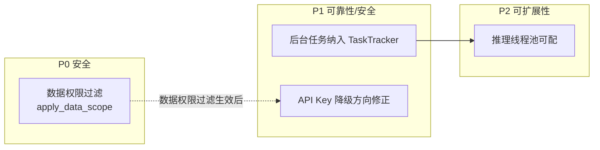

# Python 后端改造计划

> 本文档聚焦 dehaze-python 在**代码架构层面**与 Java/Go 端存在的差距与可靠性缺口，供后续改造与重构参考。每项问题均经代码核实并标注三端对比，不包含已沉淀至事实文档的已完成项。改造项的统筹编排见 [近期改造计划总览](./近期改造计划总览.md)。

## 1. 问题总览

| # | 问题 | 类别 | 优先级 | 三端是否共有 |
|---|------|------|:------:|:----------:|
| 1 | 行级数据权限（DataScope）未实现 | 安全 | P0 | Python 独有 |
| 2 | asyncio 后台任务未纳入 TaskTracker | 可靠性 | P1 | Python 独有 |
| 3 | API Key 中间件 Redis 降级方向不安全 | 安全 | P1 | Python 独有 |
| 4 | 推理线程池并发数硬编码 | 可扩展性 | P2 | Python 独有 |

> 说明：以下问题均为 Python 端独有。Java/Go 端已实现对应能力，Python 端因异步 ORM 与中间件模型差异未对齐，需补齐以保证三端 API 契约一致下的安全与可靠性语义一致。

## 2. P0：行级数据权限未实现

### 2.1 现状

Python 端在登录（`auth_service.py`）、API Key 认证（`api_key_auth.py`）时计算 `data_scope` 并存入 Session / `request.state.user_context`，但**查询层无任何拦截器应用行级过滤**。`data_scope` 字段在全代码库的引用（登录态存取、角色 CRUD、序列化、取值计算等）均为元数据管理，没有任何一处根据 `data_scope` 对用户列表、订单、反馈等业务查询追加 `WHERE dept_id = ?` 或 `WHERE create_by = ?` 条件。

### 2.2 三端对比

| 端 | 实现方式 | 生效位置 |
|----|---------|---------|
| Java | MyBatis-Plus `DataPermissionInterceptor` + `@DataPermission` 注解 | Mapper 查询自动追加条件 |
| Go | GORM Plugin `dataScopeCallback`（`Before("gorm:query")`/`Before("gorm:row")`） | Repository 查询自动过滤 |
| Python | 仅存 `data_scope` 到上下文，**无查询拦截** | 不生效 |

### 2.3 影响

三端 API 契约完全一致，但 Python 端任何已认证用户（包括 `data_scope=1` 仅本人权限的角色）均可查到全量数据（用户列表、订单、反馈、数据集等），构成**越权访问漏洞**。在 Python 端单独承载业务部署时，该漏洞直接暴露。

### 2.4 改造方案

Python 采用 SQLAlchemy 2.0 异步 ORM，无法像 MyBatis-Plus 那样以拦截器自动改写 SQL。建议采用**显式过滤 + 查询助手**方案，避免引入侵入式 SQL 改写：

1. 在 `repository/base.py` 或新建 `repository/data_scope.py` 提供 `apply_data_scope(query, user_context, dept_field="dept_id", creator_field="create_by")` 工具函数，按 `data_scope` 值返回附加条件的 Query：
   - `0` 全部数据 → 原样返回
   - `1` 仅本人 → `WHERE creator_field == user_id`
   - `2` 本部门 → `WHERE dept_field == user_dept_id`
   - `3` 本部门及下级 → `WHERE dept_field IN (dept_tree.descendants(user_dept_id))`
   - `5` 自定义 → `WHERE dept_field IN (configured_dept_ids)`
2. 在需要数据权限的 Repository 查询方法（用户分页、订单列表、反馈列表等）显式调用 `apply_data_scope`，与 Java/Go 的过滤范围逐方法对齐
3. ROOT 用户（`data_scope IS NULL` 或角色标记 `is_root`）跳过过滤，与 Java/Go 一致

**不采用 SQLAlchemy event 自动改写**的原因：异步 Session 下 event 难以获取当前请求的用户上下文（ContextVar 在 event 回调中不可靠），显式调用更可控、可测。

### 2.5 验收标准

- 列出需应用数据权限的查询清单（用户/订单/反馈/数据集等），逐个接入 `apply_data_scope`
- 单元测试覆盖 5 种 `data_scope` 取值的过滤结果
- 与 Java/Go 端相同测试数据下，同一角色查询结果集一致

## 3. P1：asyncio 后台任务未纳入 TaskTracker

### 3.1 现状

Python 端长耗时异步任务通过 `asyncio.create_task` / `loop.create_task` 提交后台执行。当前仅 `task_service.py`（导出/下载等任务管理模块的任务）在创建后台任务后调用 `tracker.register(...)` 注册到 `TaskTracker`；而**核心推理链路的后台任务均未注册**：

| 服务 | 提交位置 | 是否注册 TaskTracker |
|------|---------|:---:|
| `task_service`（导出/下载） | `task_service.py` L372 | 是 |
| `prediction_service`（去雾推理） | `prediction_service.py` L194 | 否 |
| `evaluation_service`（评估指标） | `evaluation_service.py` L111 | 否 |
| `compare_service`（对比报告） | `compare_service.py` L76 | 否 |

### 3.2 影响

- **进程崩溃丢失**：uvicorn Worker 崩溃或被 OOM Kill 时，未注册的后台任务静默终止，`sys_pred_log` / `sys_eval_log` 永久停留在 `processing`，用户端看到"处理中"永不结束
- **优雅关闭不等待**：`TaskTracker.initiate_shutdown()` 仅取消已注册任务，未注册的推理任务在 30s 超时窗口内不被等待，可能在关闭途中被强杀导致结果文件半写入
- **无全局视图**：`TaskTracker.get_global_running_tasks()` 无法反映推理任务，监控与运维盲区

### 3.3 三端对比

Java 端异步任务（`@Async`）通过任务表终态校验保证最终一致：任务记录落库为 `processing`，完成后更新终态，崩溃后由 `cleanupStuckTasks` 定时任务将超时 `processing` 标记为 `failed`。Go 端同理。Python 端虽有 `cleanupStuckPredEvalLogs` 定时任务清理过期日志，但**未与 TaskTracker 联动**——TaskTracker 不感知这些任务的存在，无法在优雅关闭时协调。

### 3.4 改造方案

1. 在 `prediction_service._execute_async`、`evaluation_service._execute_async`、`compare_service._generate_async` 提交处，参照 `task_service.py` L378-388 模式，调用 `get_task_tracker().register(task_id=..., task=background_task, task_type="prediction"/"evaluation"/"compare", metadata={...})`
2. `task_type` 复用现有日志表主键（`log_id` / `taskId`）作为 `task_id`，便于与日志状态联动
3. 优雅关闭时 `TaskTracker` 已有的 `wait_for_completion` 逻辑自动覆盖这些任务，无需额外改造
4. 注册失败不影响主流程（与 `task_service` 一致，`try/except` 降级为日志告警）

### 3.5 验收标准

- 三个核心推理服务后台任务均注册到 TaskTracker
- 模拟 Worker 崩溃后，`get_global_running_tasks` 不再出现孤儿推理任务
- 优雅关闭日志中可见推理任务被等待完成或取消

## 4. P1：API Key 中间件 Redis 降级方向不安全

### 4.1 现状

`api_key_auth.py` L78：

```python
data_scope = await role_repository.get_maximum_data_scope(db, roles) if redis else 0
```

Redis 不可用时，`data_scope` 被设为 `0`（全部数据范围）。同行的权限标识 `perms` 在 Redis 不可用时设为空集（`set()`）——降级方向是"最小权限"。两者降级方向矛盾。

### 4.2 影响

Redis 故障期间，通过 API Key 认证的请求获得**最大数据权限**（`data_scope=0` = 全部数据），同时**无任何操作权限**（`perms` 为空）。虽然权限为空会阻止大部分写操作，但纯查询类接口（如用户列表、订单列表）若仅校验登录不校验细粒度权限，则 Redis 故障期间 API Key 用户可查全量数据，与 §2 数据权限缺口叠加放大风险。

### 4.3 改造方案

将 Redis 降级时的 `data_scope` 改为**最小权限**方向：

```python
data_scope = await role_repository.get_maximum_data_scope(db, roles) if redis else 1  # 1=仅本人
```

与 `perms` 降级为空集保持一致的"最小权限"降级策略。若 Redis 不可用且无法获取角色权限，API Key 请求应仅能访问本人数据，或直接拒绝（返回 503）。

### 4.4 验收标准

- Redis Mock 故障场景下，API Key 请求的 `data_scope` 为 `1`（仅本人）或请求被拒绝
- 单元测试覆盖 Redis 可用/不可用两种场景的 `data_scope` 取值

## 5. P2：推理线程池并发数硬编码

### 5.1 现状

`prediction_service.py` L57：

```python
_inference_executor = ThreadPoolExecutor(max_workers=2, thread_name_prefix="algo-inference")
```

GPU 推理专用线程池并发数硬编码为 2，不可通过配置调整。

### 5.2 影响

- 不同部署环境（单卡 / 多卡 / CPU 回退）的合理并发数差异大，硬编码导致无法按硬件调优
- 多任务类型扩展后（去雨/去雪/超分等），算法数量增长，固定 2 并发可能成为吞吐瓶颈，但也可能因显存不足需要降到 1
- [近期改造计划总览 §3.2](./近期改造计划总览.md) 已指出"推理线程池 2 worker 串行"作为现状，但未列为改造项

### 5.3 改造方案

1. 在 `config.py` 新增 `INFERENCE_THREAD_POOL_SIZE: int = 2` 配置项，按环境可调
2. `prediction_service.py` 读取 `settings.INFERENCE_THREAD_POOL_SIZE` 替换硬编码
3. 生产环境可根据 GPU 显存配置该值（如 24GB 显存单卡建议 1-2，避免显存溢出）

### 5.4 验收标准

- 推理线程池大小通过环境变量/配置文件可调
- 默认值保持 2，不破坏现有部署

## 6. 实施时序



**依赖关系**：
- §2（数据权限）与 §4（API Key 降级）有协同：数据权限过滤生效后，API Key 降级方向的危害才被收敛，建议先做 §2
- §3（TaskTracker）与 §5（线程池）无依赖，可并行
- §3 改造范围小、收益高，建议优先于 §2 实施（§2 工作量最大）

**建议顺序**：§3 → §4 → §2 → §5

## 7. 文档同步清单

改造完成后需同步更新的文档：

| 改造项 | 同步文档 |
|--------|---------|
| §2 数据权限 | [Python 后端架构文档 §五安全认证](../04-项目实现/后端/03-Python算法服务架构文档.md)（补充数据权限章节）、[总体架构设计 §5.2](../02-系统架构/01-总体架构设计.md) |
| §3 TaskTracker | [Python 后端架构文档 §3.3算法管线](../04-项目实现/后端/03-Python算法服务架构文档.md)（补充后台任务追踪）、[任务管理/后端实现](../03-模块设计/基础模块/任务管理/后端实现.md) |
| §4 API Key 降级 | [认证管理/后端实现](../03-模块设计/基础模块/认证管理/后端实现.md) |
| §5 线程池可配 | [Python 后端架构文档 §3.3算法管线](../04-项目实现/后端/03-Python算法服务架构文档.md) |
