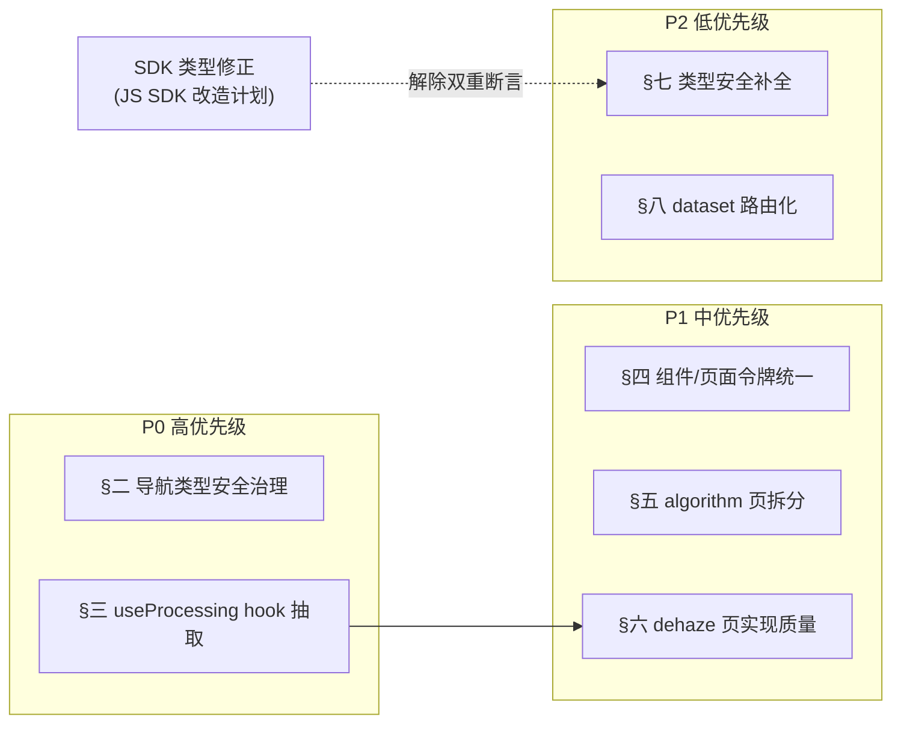

# React Native 前端架构改造计划

> ✅ **实施状态：已完成**。§二导航类型安全治理、§三 useProcessing 抽取、§四令牌统一、§五 algorithm 拆分、§六 dehaze 实现质量、§七 any 清理、§八 dataset 路由化均已落地至 `dehaze-react-native`，相关文档已同步（见 §十一）。本文保留原始改造方案供追溯。

> 本文档聚焦 `dehaze-react-native` 在**代码架构层面**的实际问题与改造方向，供后续重构参考。架构文档遗漏页面（algorithm/dataset）与迭代叙事问题已在 [04-ReactNative架构文档.md](../04-项目实现/前端/04-ReactNative架构文档.md) 修复中处理，本文不重复。

> 前置说明：RN 端基础设施质量良好——zustand + persist 持久化、@react-navigation v7 嵌套 Stack、SDK 拦截器、theme 令牌定义均到位。本计划针对的是**导航类型安全**与**处理流程复用**两类核心债务，以及组件/页面的实现质量问题。

## 一、问题总览

| # | 问题 | 类别 | 优先级 | 影响范围 |
|---|------|------|:------:|----------|
| 1 | `RootStackParamList` 交叉类型使路由类型安全完全失效，跨 Stack 导航大量 `as any` | 类型安全/健壮性 | P0 | routes/types.ts + 8 个页面（dehaze/processing/batch/home/tools/messages 等） |
| 2 | dehaze 与 processing 页处理流程逻辑重复，未抽取复用 hook | 可维护性 | P0 | `pages/dehaze/index.tsx`、`pages/processing/index.tsx` |
| 3 | 组件与页面硬编码颜色，绕过 theme 令牌 | 设计系统一致性 | P1 | components/（Badge/Modal/EmptyState/ImageLoader）、pages/algorithm、AppHeader |
| 4 | algorithm 详情页单文件 1102 行，内联组件与样式未拆分 | 可维护性 | P1 | `pages/algorithm/index.tsx` |
| 5 | dehaze 页入口用 mock 图片且未复用已存在的 SliderControl | 业务完整性/复用 | P1 | `pages/dehaze/index.tsx` |
| 6 | `any` / `as any` 溢用 28+ 处 | 类型安全 | P2 | dashboard/register/system/*/messages/dehaze 等 |
| 7 | dataset list/detail 用 state 切换而非路由，破坏返回键与深链 | 导航/可维护性 | P2 | `pages/dataset/index.tsx`、`pages/dataset-browse/index.tsx` |

## 二、P0：导航类型安全失效

### 2.1 现状

[routes/types.ts:147](../../../dehaze-react-native/src/routes/types.ts) 定义 `RootStackParamList = AuthStackParamList & TabParamList & HomeStackParamList & ...`，将 6 个 Stack 的 ParamList 做交叉（`&`）。交叉类型使所有路由名在任何上下文都可用，类型安全形同虚设。

由此，跨 Stack 导航全部用 `as any` 绕过：

| 页面 | 位置 | 模式 |
|------|------|------|
| processing | [index.tsx:208,214,216](../../../dehaze-react-native/src/pages/processing/index.tsx) | `navigation.navigate(...) as any` |
| dehaze | [index.tsx:143](../../../dehaze-react-native/src/pages/dehaze/index.tsx) | `as any` |
| batch | [index.tsx:203](../../../dehaze-react-native/src/pages/batch/index.tsx) | `as any` |
| home | [index.tsx:41-101](../../../dehaze-react-native/src/pages/home/index.tsx) | `navigation.getParent() ?? navigation` 后 `as any`（9 处） |
| tools | [index.tsx:65,71](../../../dehaze-react-native/src/pages/tools/index.tsx) | `as any` |
| messages | [index.tsx:121](../../../dehaze-react-native/src/pages/messages/index.tsx) | `as any` |

注释标明"兼容旧版（过渡期）"，但实际被广泛依赖，过渡期未结束。

### 2.2 影响

- 路由名拼错编译期无法发现，运行时才报错
- 导航参数完全无类型校验，`navigate('Algorithm', { wrongParam })` 可通过编译
- 跨 Stack 共享页面的类型契约丢失

### 2.3 改造方案

**目标**：废弃 `RootStackParamList` 交叉类型，恢复各 Stack 独立 ParamList 的类型安全。

**步骤**：

1. 删除 [types.ts:147](../../../dehaze-react-native/src/routes/types.ts) 的 `RootStackParamList` 交叉定义
2. 各页面使用所属 Stack 的 `NativeStackNavigationProp<XxxStackParamList>` 而非 `NavigationProp<RootStackParamList>`
3. 跨 Stack 导航改用 `navigation.getParent<NavigationProp<...>>()?.navigate(...)` 或通过 Tab 父导航跳转，保留类型约束
4. 共享页面（algorithm-select/algorithm-browse/algorithm/batch/dataset/processing/task）在多个 Stack 注册时，各 Stack 的 ParamList 中为该页声明相同参数类型，导航时无需 `as any`
5. 移除全部 `as any` 导航断言

**迁移示例**：

```ts
// 迁移前：navigation.navigate('Algorithm', { algorithmId }) as any

// 迁移后：共享页面用 CompositeNavigationProp 组合其注册的多个 Stack
import { CompositeNavigationProp } from '@react-navigation/native';
import { NativeStackNavigationProp } from '@react-navigation/native-stack';

type AlgorithmScreenNav = CompositeNavigationProp<
  NativeStackNavigationProp<ToolsStackParamList, 'Algorithm'>,
  NativeStackNavigationProp<DehazeStackParamList, 'Algorithm'>
>;
const navigation = useNavigation<AlgorithmScreenNav>();
navigation.navigate('Algorithm', { algorithmId }); // 类型安全
```

### 2.4 验收标准

- `routes/types.ts` 无 `RootStackParamList` 交叉定义
- 全项目 `navigation.navigate` 调用无 `as any`（grep 零命中）
- 路由名拼错或参数类型不符时编译期报错
- 各端导航功能不变

## 三、P0：处理流程逻辑重复

### 3.1 现状

[pages/dehaze/index.tsx](../../../dehaze-react-native/src/pages/dehaze/index.tsx)（345 行）与 [pages/processing/index.tsx](../../../dehaze-react-native/src/pages/processing/index.tsx)（581 行）实现了几乎相同的处理流程：

| 重复逻辑 | dehaze 位置 | processing 位置 |
|---------|------------|----------------|
| `Phase` 类型定义 | `:33` | `:49` |
| `cancelSignalRef` + `predictSingle` + `setProgress` + `setResult` 调用链 | `:110-132` | `:94-148` |
| 取消确认弹窗 | `:134-139` | `:174-185` |
| 失败重试逻辑 | 同结构 | 同结构 |

### 3.2 影响

- 处理流程逻辑复制粘贴，改一处需同步两处，易遗漏
- 取消信号、进度更新、结果处理的协同逻辑分散，难以单独测试

### 3.3 改造方案

抽取 `useProcessing` 自定义 hook，**仅封装两页真正同源的核心调用链**：`predict`/`cancel`/`retry` 三个操作与 `cancelSignalRef` 的协同逻辑。两页差异明显——processing 完成后写 `historyStorage`、有"确认开始"弹窗、用 `ProcessingProgress`/`ResultPreview` 组件；dehaze 是 5-step 状态机内联渲染。若把 `historyStorage` 写入与确认弹窗也纳入 hook，需引入大量配置项区分行为，造成配置项爆炸。因此这两部分留在页面，hook 不接管。

```ts
// src/hooks/useProcessing.ts
interface ProcessingState {
  phase: 'config' | 'processing' | 'done' | 'failed';
  progress: number;
  result: PredictionResult | null;
  predict: (image: ProcessImage, algorithm: AlgorithmMeta) => Promise<void>;
  cancel: () => Promise<void>;
  retry: () => Promise<void>;
}
export function useProcessing(): ProcessingState;
```

dehaze 页与 processing 页改为消费 hook 的 predict/cancel/retry 与进度/结果状态；各自的 `historyStorage` 写入、"确认开始"弹窗、UI 渲染（5-step 状态机 vs `ProcessingProgress`/`ResultPreview`）保留在页面内。

### 3.4 验收标准

- `useProcessing` hook 仅覆盖 predict/cancel/retry 三个操作，内部管理 cancelSignalRef
- dehaze 与 processing 页无 `Phase` 类型重复定义、无 `predictSingle` 调用链重复
- `historyStorage` 写入与"确认开始"弹窗保留在 processing 页内，未下沉到 hook
- 处理流程功能不变（实时进度、取消、重试）

## 四、P1：组件与页面硬编码颜色

### 4.1 现状

`src/theme/` 令牌定义完整，但组件与页面大量硬编码颜色绕过：

| 组件/页面 | 位置 | 问题 |
|----------|------|------|
| Badge | [index.tsx:20-36](../../../dehaze-react-native/src/components/Badge/index.tsx) | 6 个 variant 颜色全硬编码，且 `clear` 与 `primary`、`annotated` 与 `success` 颜色重复 |
| Modal | [index.tsx:55-108](../../../dehaze-react-native/src/components/Modal/index.tsx) | 6 处硬编码 `#6b7280`/`#ffffff`/`#1f2937`/`#f3f4f6`/`#f9fafb`，完全未引用 theme |
| EmptyState | [index.tsx:18-56](../../../dehaze-react-native/src/components/EmptyState/index.tsx) | 硬编码 `#d1d5db`/`#6b7280`/`#9ca3af` |
| ImageLoader | [index.tsx:49-110](../../../dehaze-react-native/src/components/ImageLoader/index.tsx) | 硬编码 `#3b82f6`/`#f3f4f6`/`#e5e7eb` |
| algorithm 页 | [index.tsx:52-62](../../../dehaze-react-native/src/pages/algorithm/index.tsx) | `ALGORITHM_STATUS_MAP` 硬编码 6 组颜色；`:302,602` 硬编码 `['#3B82F6','#6366F1']`，而 `theme.gradient.primary` 已定义相同值 |
| AppHeader | [index.tsx:63,68](../../../dehaze-react-native/src/layout/components/AppHeader.tsx) | 硬编码 `#6366f1`/`#fff` |
| LoadingSpinner | [index.tsx:14](../../../dehaze-react-native/src/components/LoadingSpinner/index.tsx) | 默认色 `#14b8a6`（secondary）而非 primary，语义混乱 |

### 4.2 改造方案

1. 组件颜色一律引用 `theme.colors`（如 `colors.primary`、`colors.text.muted`）
2. `ALGORITHM_STATUS_MAP` 的色值直接在 algorithm 页内联引用 theme 令牌（仅该页使用，不抽独立 `theme/algorithmStatus.ts` 文件，避免违反"禁止定义复用度不高的常量"）
3. `LoadingSpinner` 默认色改为 `colors.primary`
4. Badge 直接删除零调用的 `clear`/`annotated` 两个 variant（全项目 grep `variant="clear"`/`variant="annotated"` 零命中，按"不保留已废弃旧代码"原则删除，而非合并）
5. **前置：统一 success 色板**。Badge 当前 success 色 `#10b981` 与 theme `colors.status.success` `#4caf50` 不一致，直接改引用会导致 Badge 视觉变色。需先决策统一 success 色板（以 theme 令牌为准或调整令牌），再执行上述引用替换，否则引入视觉回归

### 4.3 验收标准

- 组件与页面无业务色值硬编码（grep `#[0-9a-fA-F]{6}` 仅限非样式场景）
- Badge 已删除 `clear`/`annotated` variant，仅保留 `primary`/`secondary`/`success`/`warning`/`info`/`foggy`
- success 色板已统一（Badge 与 theme `colors.status.success` 一致），无视觉回归

## 五、P1：algorithm 详情页过长

### 5.1 现状

[pages/algorithm/index.tsx](../../../dehaze-react-native/src/pages/algorithm/index.tsx) 单文件 1102 行，包含：数据加载、章节锚点滚动测量、收藏、分享、`SectionTitle`/`InfoRow`/`MetricBar` 三个内联组件 + 400+ 行样式。

### 5.2 改造方案

1. 将 `SectionTitle`/`InfoRow`/`MetricBar` 拆分到 `pages/algorithm/components/`
2. 样式拆分到 `pages/algorithm/styles.ts`（或保留 StyleSheet.create 但抽离到独立文件）
3. 章节锚点滚动测量逻辑抽取为 `useSectionScroll` hook
4. 主文件聚焦数据加载与页面组装，目标 < 400 行

### 5.3 验收标准

- `pages/algorithm/index.tsx` < 400 行
- 内联组件拆分到 `components/` 子目录
- 页面功能与视觉不变

## 六、P1：dehaze 页实现质量问题

### 6.1 现状

[pages/dehaze/index.tsx](../../../dehaze-react-native/src/pages/dehaze/index.tsx) 存在两个问题：

1. **未复用 SliderControl**（`:232-258`）：内联实现 slider（track+fill+marks 按钮），而 [components/SliderControl](../../../dehaze-react-native/src/components/SliderControl) 已存在且功能更完整（含 PanResponder 拖拽）。两套 slider 实现并存。同源论据：[processing/components/ParamsPanel.tsx:18,112](../../../dehaze-react-native/src/pages/processing/components/ParamsPanel.tsx) 已复用 `SliderControl` 做同类算法参数调节，dehaze 页参数场景一致，理应同源复用。
2. **入口用 mock 图片**（`:88-99`）：`handlePickImage` 仅 Alert 提示并塞入 `https://picsum.photos/800/600` 硬编码样例图，无真实上传/相册入口。作为去雾 Tab 核心入口，业务功能缺失。

### 6.2 改造方案

1. dehaze 页的 slider 改为复用 `SliderControl` 组件，删除内联实现
2. `handlePickImage` 接入真实图片选择能力（`react-native-image-picker` 或现有图片选择方案），删除 picsum 硬编码
3. 若 dehaze 页定位为流程引导入口而非完整处理页，应将图片选择跳转到 image-input 页，而非在 dehaze 内 mock

### 6.3 验收标准

- dehaze 页无内联 slider 实现，复用 `SliderControl`
- 无 `picsum.photos` 硬编码 URL
- 图片选择功能真实可用

## 七、P2：any 溢用与类型定义

### 7.1 现状

除路由相关（§二）外，`any`/`as any`/`@ts-ignore` 还有 20+ 处：

- [dashboard/index.tsx:159,185](../../../dehaze-react-native/src/pages/dashboard/index.tsx)：Ionicons `name as any`（Icon 组件 name 是 string）
- [register/index.tsx:179](../../../dehaze-react-native/src/pages/register/index.tsx)：同上
- [system/user/form.tsx:69](../../../dehaze-react-native/src/pages/system/user/form.tsx)：`value: any`
- [system/menu/form.tsx:21](../../../dehaze-react-native/src/pages/system/menu/form.tsx)：`type: 1 as any`
- [messages/index.tsx:66,69](../../../dehaze-react-native/src/pages/messages/index.tsx)：`Record<string, any>` 参数 + `res.list as unknown as MessageVO[]` 双重断言（SDK 类型与实际不符，与 Taro 端同源问题）
- [system/member/index.tsx:48](../../../dehaze-react-native/src/pages/system/member/index.tsx)：`{ status: newStatus as any }`
- [system/message/index.tsx:39,42](../../../dehaze-react-native/src/pages/system/message/index.tsx)：`entry.route as any`、`entry.icon as any`（Ionicons name）

### 7.2 改造方案

1. Ionicons `name` 类型问题：扩展 Icon 组件的 `name` 属性类型为 `keyof typeof Ionicons.glyphMap`，移除 `as any`
2. 表单 value 按字段类型联合约束
3. messages 的双重断言：根因在 SDK 的 `MessageVO` 类型与后端返回不符，协同 SDK 侧修正（见 [JS SDK 架构改造计划](./JS%20SDK架构改造计划.md)）

### 7.3 验收标准

- 除 SDK 类型不符的断言外，无业务 `as any`（grep `as any` 清零，覆盖 dashboard/register/system/user/form、system/menu/form、system/member、system/message、messages 等全部列出的位置）
- Ionicons name 有类型约束（dashboard/register/system/message 的 `icon as any` 均消除）

## 八、P2：dataset list/detail 用 state 切换

### 8.1 现状

[pages/dataset/index.tsx:11-24](../../../dehaze-react-native/src/pages/dataset/index.tsx) 用 `currentView` state 在 list/detail 间切换，而非路由导航。[pages/dataset-browse/index.tsx:38-39](../../../dehaze-react-native/src/pages/dataset-browse/index.tsx) 同样用 `currentView` state 切换 list/detail，与本文完全同源。

### 8.2 影响

- 返回键无法从 detail 返回 list（系统返回直接退出页面）
- 深度链接无法直达 detail
- 浏览器历史/导航栈不记录视图切换

### 8.3 改造方案

将 list 与 detail 拆为独立路由页面（或同 Stack 内两个 Screen），detail 通过路由参数接收 `datasetId`。**dataset-browse 同源问题必须同步处理**，否则两个数据集页面风格分裂：

```ts
// MainTabs.tsx 的 ToolsStack / ProfileStack 内
<Stack.Screen name="Dataset" component={DatasetListScreen} />
<Stack.Screen name="DatasetDetail" component={DatasetDetailScreen} />
// list 内 navigate('DatasetDetail', { datasetId })
```

dataset-browse 按相同模式拆分 list/detail 路由，与 dataset 页保持一致。

### 8.4 验收标准

- list/detail 为独立路由，返回键可从 detail 返回 list
- 深度链接可直达 detail
- dataset-browse 同步完成路由化，与 dataset 页风格一致

## 九、实施时序



**关键依赖**：
- §三（useProcessing）先于 §六（dehaze 页实现质量），因 dehaze 页改造时需消费 hook
- §二的导航类型治理独立，可与 §三并行
- §七的 messages 双重断言依赖 SDK 类型修正

**并行策略**：§四（令牌统一）、§五（algorithm 拆分）、§八（dataset 路由化）相互独立，可并行。

## 十、不在本计划范围内（评估后排除）

| 排除项 | 原因 |
|--------|------|
| session 状态双源（zustand sessionId + tokenStore 模块变量） | tokenStore 供 axios 拦截器同步读取是合理设计，强行合并为 zustand 单源会引入异步读取问题，当前 login/logout 同步两处已足够 |
| `src/enums/` 目录仅含 CacheEnum 单 key | 属命名组织偏好，影响极小，日常整理即可 |
| EmptyState 与 CompareEmptyState 功能重叠 | 属风格统一，非架构问题，且两者使用场景略有差异 |
| store/hooks/layout 导出入口不全 | 日常修复即可，非架构债务 |
| auth store 合并 auth+user+perm 职责 | 移动端合并认证与用户信息是常见做法，职责尚可接受，未过度膨胀 |
| Platform.OS 在 login/register 重复判断 KeyboardAvoidingView behavior | 仅 2 处，抽取收益低，随 §六 dehaze 改造顺带处理 |

## 十一、文档同步清单

改造实施后需同步更新的文档：

| 文档 | 同步内容 |
|------|---------|
| [04-ReactNative架构文档.md](../04-项目实现/前端/04-ReactNative架构文档.md) | §3 导航架构补充「各 Stack 独立 ParamList，无 RootStackParamList 交叉」；§11 关键技术决策补充「useProcessing hook」；§2 项目结构补充 `hooks/useProcessing.ts` |
| [03-模块设计/核心模块/去雾处理/前端实现.md] | 处理流程的 hook 复用描述同步更新 |
| [近期改造计划总览](./近期改造计划总览.md) | 登记本改造项的状态与优先级 |
