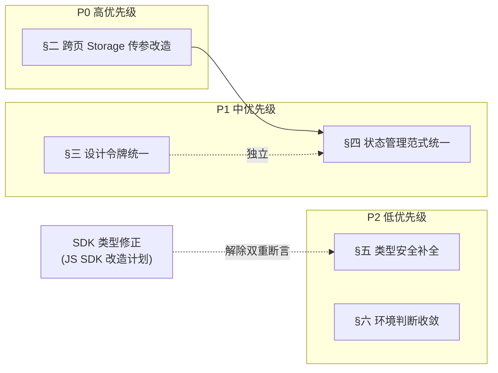

# Taro 前端架构改造计划

> 本文档聚焦 `dehaze-taro` 在**代码架构层面**的实际问题与改造方向，供后续重构参考。架构文档失真问题（zustand 状态管理未反映、PermissionGuard 虚构、目录结构错误等）已在 [03-Taro架构文档.md](../04-项目实现/前端/03-Taro架构文档.md) 修复中处理，本文不重复。

## 一、问题总览

| # | 问题 | 类别 | 优先级 | 影响范围 |
|---|------|------|:------:|----------|
| 1 | 跨页面业务数据通过全局 Storage 字符串 key 传递，绕过路由参数与状态管理 | 数据流/可维护性 | P0 | image-input / algorithm-select / processing / dehaze / task / algorithm / dashboard / home 等 10 个文件 20+ 处 |
| 2 | 设计令牌被大规模绕过，且混入第二套色板（ANTD 色值） | 设计系统一致性 | P1 | components/ 与 pages/ 共 41 处 ANTD 色值 + 100+ 处其他硬编码颜色 |
| 3 | 页面级状态用 Context + Reducer，与全局 zustand 范式割裂 | 状态管理 | P1 | `pages/dataset/store/`、`pages/image-input/store/` |
| 4 | `any` 溢用且无 `*.d.ts` 类型声明，SDK 响应靠双重断言绕过类型 | 类型安全 | P2 | system 管理页、personal 页、dataset store 等 30+ 处 |
| 5 | `process.env.TARO_ENV` 环境判断散落各模块未收敛 | 工程化 | P2 | utils/、config/、pages/filter/、components/compare/ 共 6 处 |

## 二、P0：跨页面全局 Storage 传参

### 2.1 现状

去雾主流程（选图 → 选算法 → 处理 → 对比）通过 `Taro.setStorageSync` / `getStorageSync` 以散落字符串 key 在页面间传递业务数据，共 20+ 处（10 个文件）：

| 字面量 key | 写入点 | 读取点 |
|-----------|--------|--------|
| `current_image` | [imageInputStore.tsx:391-401](../../../dehaze-taro/src/pages/image-input/store/imageInputStore.tsx) | [algorithm-select/index.tsx:119](../../../dehaze-taro/src/pages/algorithm-select/index.tsx)、[processing/index.tsx:110](../../../dehaze-taro/src/pages/processing/index.tsx) |
| `selected_algorithm` | [algorithm-select/index.tsx:241](../../../dehaze-taro/src/pages/algorithm-select/index.tsx)、[algorithm-select/index.tsx:667](../../../dehaze-taro/src/pages/algorithm-select/index.tsx)、[algorithm/components/AlgorithmDetailPopup/index.tsx:81](../../../dehaze-taro/src/pages/algorithm/components/AlgorithmDetailPopup/index.tsx) | [processing/index.tsx:123](../../../dehaze-taro/src/pages/processing/index.tsx) |
| `prediction_result` | [processing/index.tsx:180](../../../dehaze-taro/src/pages/processing/index.tsx) | [task/index.tsx:74](../../../dehaze-taro/src/pages/task/index.tsx)、[compare/types.ts:60](../../../dehaze-taro/src/components/compare/types.ts) |

此外 [dehaze/index.tsx:280](../../../dehaze-taro/src/pages/dehaze/index.tsx)、[algorithm/index.tsx:100](../../../dehaze-taro/src/pages/algorithm/index.tsx)、[dashboard/index.tsx:177](../../../dehaze-taro/src/pages/dashboard/index.tsx)、[home/WorkflowSection.tsx:28](../../../dehaze-taro/src/pages/home/components/WorkflowSection.tsx) 也参与读写这些 key，部分位置甚至用其判断业务状态。

### 2.2 影响

- **数据流不可追踪**：页面间依赖通过全局字符串 key 隐式耦合，无法从路由声明看出页面所需入参，新增页面难以发现契约
- **脏数据残留**：Storage 无 TTL，用户退出后再进入流程可能读到上次遗留的 `current_image`，导致展示错误图片
- **key 散落未收敛**：`current_image` / `selected_algorithm` / `prediction_result` 为字面量，无统一常量定义，改名需全局搜索
- **违背单向数据流**：业务数据应随状态管理或路由流转，通过全局 Storage 旁路了 zustand，形成第二数据通道

### 2.3 改造方案

**目标**：消除业务数据经 Storage 跨页传递，改为「zustand store 管理流程态 + 路由参数传 ID」。

**步骤**：

1. 新增 `src/stores/process.ts`（zustand store），管理去雾流程的会话态：

```ts
// 管理当前处理流程的临时态（非持久化）
interface ProcessState {
  selectedImage: ProcessImage | null   // 选中的待处理图片
  selectedAlgorithm: AlgorithmMeta | null
  result: PredictionResult | null
  set image/v/result 的 action
  reset: () => void  // 流程结束或退出时清理
}
```

2. image-input / algorithm-select / processing 页面改为读写 `useProcessStore`，删除 `setStorageSync('current_image')` 等调用
3. 跨页跳转仅传必要 ID 作为路由参数（如 `algorithm-select?algorithmId=xxx`），大对象（图片 base64、算法配置）由 store 承载
4. `prediction_result` 同样进 store；对比页从 store 读取，无需 storage 中转
5. Storage 仅保留两类用途：认证 token（已有）、用户偏好持久化（如主题），业务流程态一律不落 Storage

### 2.4 验收标准

- 全项目 `grep` 不到 `current_image` / `selected_algorithm` / `prediction_result` 字面量 key
- `Taro.setStorageSync` 调用仅剩认证 token 与明确持久化偏好两类（`filter/index.tsx` 的 `custom_filter_presets` 自定义滤镜预设属偏好类，应保留）
- 去雾主流程功能不变：选图 → 选算法 → 处理 → 对比全链路数据正确传递
- 退出流程后再次进入不出现脏数据

## 三、P1：设计令牌绕过与第二套色板

### 3.1 现状

`app.less` 定义了完整 CSS 变量令牌（`--color-primary: #3b82f6` 等），但 tsx 内硬编码颜色 100+ 处（实测 114 处遍布 39 个文件），且存在两套不一致色板：

| 来源 | 色值 | 位置 |
|------|------|------|
| 令牌色板 | `#3b82f6` / `#f59e0b` / `#9ca3af` | `app.less:6-15` |
| 混入的 ANTD 色板 | `#1890ff` / `#52c41a` / `#722ed1` / `#fa8c16` | 41 处，蔓延至 dashboard / filter / algorithm / profile / magnifier / system 管理页（menu/dept/dict/role/algorithm）/ components（compare/ErrorState）等 |
| 重复令牌值的硬编码 | `#f59e0b` / `#9ca3af` | [FavoriteButton/index.tsx:38-40](../../../dehaze-taro/src/components/favorite/FavoriteButton/index.tsx)、[RecommendationWidget/index.tsx:48-55](../../../dehaze-taro/src/components/recommend/RecommendationWidget/index.tsx) |
| HAZE_LEVEL_COLORS 整表硬编码 | 6 组色值 | 定义在 [RecommendationWidget/index.tsx:48-55](../../../dehaze-taro/src/components/recommend/RecommendationWidget/index.tsx)，引用处在 201-202 |

### 3.2 影响

- 令牌形同虚设，主题切换不可能
- 两套色板（令牌 `#3b82f6` 与 ANTD `#1890ff`）视觉不一致，dashboard/filter 页面与其他页面蓝色调不统一
- 同色值散落多处，调整需全局搜索替换

### 3.3 改造方案

1. tsx 内颜色一律引用 `app.less` CSS 变量（Taro 支持 `style={{ color: 'var(--color-primary)' }}`）；less 文件内直接用变量
2. 删除 ANTD 第二套色板，dashboard 统计图、filter 页统一改用令牌色（`#1890ff` → `var(--color-primary)`）
3. `HAZE_LEVEL_COLORS` 等映射表的色值改为引用令牌（ts 侧维护一份与令牌同源的常量，不引入 less 变量映射的额外链路）
4. `FavoriteButton` 等组件的硬编码色值替换为令牌引用

### 3.4 验收标准

- tsx 内 `grep '#[0-9a-fA-F]{6}'` 无业务色值硬编码（仅保留图片 URL 中的色值等非样式场景）
- 无 `#1890ff` / `#52c41a` / `#722ed1` / `#fa8c16` 等 ANTD 色值
- 视觉效果一致，无回归

## 四、P1：页面级状态管理范式割裂

### 4.1 现状

全局状态用 zustand（[stores/global.tsx](../../../dehaze-taro/src/stores/global.tsx)），但两个复杂页面用 Context + Reducer 模式，且实现臃肿：

| 文件 | 行数 | 问题 |
|------|------|------|
| [datasetStore.tsx](../../../dehaze-taro/src/pages/dataset/store/datasetStore.tsx) | 612 | 26 个 action 类型的巨型 reducer；`datasets` 与 `images` 两套 loading/error/page/hasMore 状态切片重复编写（行 156-177 vs 223-244） |
| [imageInputStore.tsx](../../../dehaze-taro/src/pages/image-input/store/imageInputStore.tsx) | 445 | 同样的 Context + Reducer 模式，样板代码多 |

### 4.2 影响

- 范式割裂：新成员面对同一项目需理解两种状态管理范式
- 样板重复：loading/error/page/hasMore 分页状态在两文件内各写一遍，约 400 行重复
- 与全局 store 风格不一致，无法复用 zustand 的选择器订阅能力

### 4.3 改造方案

1. 将 `datasetStore` 与 `imageInputStore` 迁移为 zustand store（`pages/dataset/store/useDatasetStore.ts` 等）
2. 在 store 内规范分页列表字段（loading/error/page/hasMore），消除两套重复编写（全项目仅 dataset/imageInput 两处使用，不单独抽取 `createPagedListSlice` factory，避免过度抽象）
3. 页面组件用 `useXxxStore(s => s.xxx)` 选择器订阅
4. 删除 Context Provider 包裹与 Reducer 样板

### 4.4 验收标准

- `pages/dataset/` 与 `pages/image-input/` 下无 `createContext` / `useReducer` 调用
- 全项目状态管理范式统一为 zustand
- 分页列表的 loading/error/page/hasMore 逻辑不再重复编写
- 数据集与图像输入页面功能不变

## 五、P2：any 溢用与类型定义缺失

### 5.1 现状

- 全项目无 `*.d.ts` 类型声明文件（Glob 零命中）
- `any` 滥用 30+ 处，典型模式：
  - `params: any = { pageNum, pageSize }` 在 5 个管理页重复（[system/feedback/index.tsx:57](../../../dehaze-taro/src/pages/system/feedback/index.tsx)、[system/member/index.tsx:42](../../../dehaze-taro/src/pages/system/member/index.tsx)、[system/package/index.tsx:49](../../../dehaze-taro/src/pages/system/package/index.tsx)、[system/order/index.tsx:53](../../../dehaze-taro/src/pages/system/order/index.tsx)、[system/message/index.tsx:76](../../../dehaze-taro/src/pages/system/message/index.tsx)），本应使用 SDK 的分页查询类型
  - `handleFieldChange = (field: keyof UserForm, value: any)` 在 user/dept/role 三个详情页重复
  - `Tag color={... as any}` 在 feedback/message 页绕过 Taroify Tag 类型
  - `HAZE_LEVEL_COLORS as any` 索引签名缺失
- SDK 响应类型与实际不匹配，靠双重断言绕过：[datasetStore.tsx:355](../../../dehaze-taro/src/pages/dataset/store/datasetStore.tsx) `(response.list as unknown as Dataset[])`、[datasetStore.tsx:528](../../../dehaze-taro/src/pages/dataset/store/datasetStore.tsx) `(response.list as unknown as DatasetItemVO[])`

### 5.2 影响

- 类型安全失效，字段名拼错编译期无法发现
- SDK 类型与后端实际不符（双重断言是信号），根因在 SDK 类型定义，Taro 侧消费方被迫绕过

### 5.3 改造方案

1. 管理页分页查询统一使用 SDK 的 `PageQuery` 类型，删除 `params: any`
2. 表单 `handleFieldChange` 的 value 按字段类型联合约束（或用泛型）
3. `HAZE_LEVEL_COLORS` 补充索引签名类型 `Record<string, string>`
4. SDK 双重断言问题：根因在 [dehaze-sdk-js](../../../dehaze-sdk-js/) 的 `Dataset` 类型定义与后端返回不符，需协同 SDK 侧修正类型定义后，Taro 侧移除断言（见 [JS SDK 架构改造计划](./JS%20SDK架构改造计划.md)）

### 5.4 验收标准

- 管理页分页参数无 `any`，统一使用 SDK 查询类型
- `as unknown as` 双重断言消除（依赖 SDK 类型修正）
- 无 `as any` 绕过组件库类型（Taroify Tag 等）

## 六、P2：环境判断散落未收敛

### 6.1 现状

`process.env.TARO_ENV` 判断散落 6 处：[utils/saveImage.ts:30](../../../dehaze-taro/src/utils/saveImage.ts)、[config/upload.ts:95](../../../dehaze-taro/src/config/upload.ts)、[filter/index.tsx:175](../../../dehaze-taro/src/pages/filter/index.tsx)、[filter/index.tsx:212](../../../dehaze-taro/src/pages/filter/index.tsx)、[filter/index.tsx:370](../../../dehaze-taro/src/pages/filter/index.tsx)、[CompareToolbar/index.tsx:61](../../../dehaze-taro/src/components/compare/CompareToolbar/index.tsx)。

### 6.2 改造方案

抽取统一环境判断工具 `src/utils/platform.ts`，集中收敛 `isH5` 常量：

```ts
export const isH5 = process.env.TARO_ENV === 'h5';
```

业务代码引用 `isH5`，不直接判断 `TARO_ENV`。6 处判断均为简单的端名判断，无 camera/touch-gesture 等能力探测语义，不引入额外能力标识抽象。

### 6.3 验收标准

- 业务代码无直接 `process.env.TARO_ENV` 判断（仅 `utils/platform.ts` 内集中）
- 各端行为不变

## 七、实施时序



**关键依赖**：
- §二（Storage 传参改造）需先建立 `process store`，与 §四（状态管理范式统一）的 zustand 迁移方向一致，建议先做 §二再统一推进 §四
- §五的 SDK 双重断言依赖 [JS SDK 架构改造计划](./JS%20SDK架构改造计划.md) 中 SDK 类型修正，Taro 侧可先行补全本地类型，断言移除待 SDK 修正

**并行策略**：§三（令牌统一）与 §六（环境收敛）相互独立，可并行；§四与§五不冲突可并行。

## 八、不在本计划范围内（评估后排除）

| 排除项 | 原因 |
|--------|------|
| `request.ts:100` 的 `config.headers = {} as any` | 单点小瑕疵，改用 `AxiosHeaders` 类型即可，非架构问题，日常修复即可 |
| `package.json` 中 `webpack5-runner` 与 `vite-runner` 并存 | 需结合 Taro 4 构建配置确认是否为实验性引入，盲目删除可能影响构建，不在架构改造范围 |
| 错误处理风格不统一（`getErrorMessage` 工具已存在但未全量使用） | 工具已具备，推广使用属日常重构非架构改造，收益有限 |
| `catch (error: any)` 与 `catch (error: unknown)` 混用 | 随 §五类型安全补全自然收敛，不单列 |

## 九、文档同步清单

改造实施后需同步更新的文档：

| 文档 | 同步内容 |
|------|---------|
| [03-Taro架构文档.md](../04-项目实现/前端/03-Taro架构文档.md) | §10 关键技术决策表补充「跨页数据流：zustand process store + 路由参数」；§3 项目结构补充 `stores/process.ts` |
| [03-模块设计/各模块/前端实现.md] | 去雾处理流程、图像输入流程的数据流描述同步更新（Storage 传参改为 store） |
| [近期改造计划总览](./近期改造计划总览.md) | 登记本改造项的状态与优先级 |
