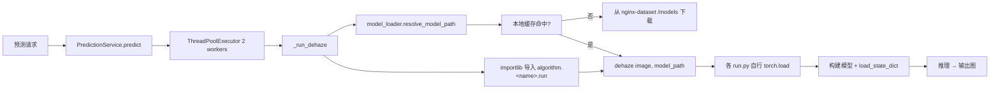
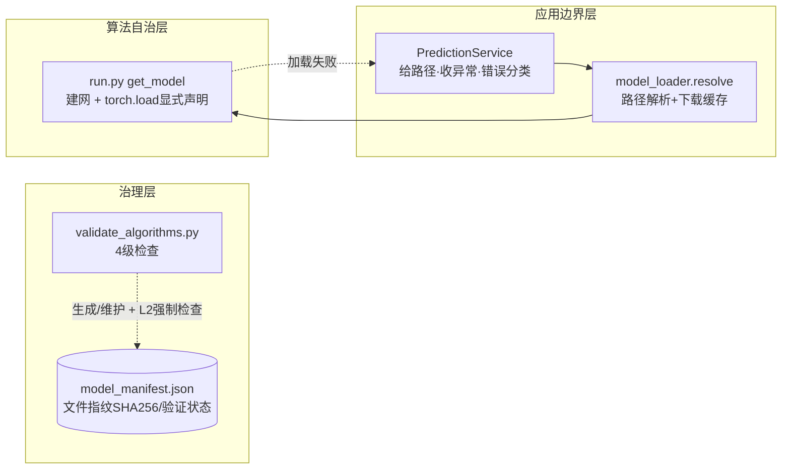

# 算法模型加载架构改造计划

> 状态：待评审（已确认关键决策，见文末「评审结论」）
> 创建：2026-08-05
> 关联文档：[Python算法服务架构文档](../04-项目实现/后端/03-Python算法服务架构文档.md)、[去雾处理/后端实现](../03-模块设计/核心模块/去雾处理/后端实现.md)、[算法管理/后端实现](../03-模块设计/核心模块/算法管理/后端实现.md)

## 一、背景与问题

### 1.1 现状

当前 Python 算法服务的模型加载链路：



各环节现状：

| 环节 | 实现 | 说明 |
|------|------|------|
| 路径解析 | `model_loader.resolve_model_path()` | 本地缓存优先，未命中从 nginx 下载；按路径加锁防并发重复下载 |
| 算法契约 | 各 `run.py` 导出 `dehaze(haze_image, model_path)` | 签名统一，无权重算法（如 DCP）忽略 model_path |
| 权重加载 | 各 `run.py` 内直接 `torch.load(model_path)` | **50 处调用、分散在 30+ 算法模块**，格式各异 |
| 执行隔离 | `ThreadPoolExecutor(max_workers=2)` | 推理不阻塞 asyncio 事件循环 |

### 1.2 现状合理性评估

**合理且值得保留的部分：**

1. `model_loader` 已把「路径解析 + 下载 + 缓存」收敛为一个基础设施模块，具备单一职责雏形。
2. 线程池隔离推理与事件循环，防止 CPU 密集型推理阻塞异步框架。
3. 算法模块统一 `dehaze()` 函数签名，上层无需感知各算法内部实现。

**不合理/待改进的部分（问题清单）：**

| 编号 | 维度 | 问题 | 影响 |
|------|------|------|------|
| P1 | 加载一致性 | 50 处 `torch.load` 散落各算法模块，加载格式各异（`['model']`/`['params']`/`['state_dict']`、DataParallel 包装、map_location 不同） | 无统一入口，兼容性修复只能逐个碰或全局 patch |
| P2 | 兼容性反模式 | 为兼容 PyTorch 2.6 `weights_only` 默认值，在 `prediction_service` 导入时全局 patch `torch.load` | 全局静默副作用；安全降级无信任边界；归属错误（模型加载关注点落在业务流程模块） |
| P3 | 匹配性 | 权重与模型结构**无预检**，运行时报 `state_dict` 不匹配（AECRNet 实测：权重含 mix4/mix5，代码只有 mix1/mix2） | 推理失败暴露给用户，难定位是代码还是资产问题 |
| P4 | 可靠性 | **117 个预置算法权重从未逐个验证**，权重缺失/路径错误/格式不兼容/结构错配比例未知 | 已发布算法点了不能用，可信度低 |
| P5 | 性能 | **每次推理都重新 torch.load + 重建模型**，无实例复用；大权重（D4 1.6GB、daclip 1.6GB）加载耗时占比高 | 2 worker 串行推理下吞吐受加载瓶颈拖累 |
| P6 | 错误处理 | 模型加载失败抛原始异常（英文/堆栈/绝对路径），无业务错误码封装 | 前端展示差，泄露内部结构 |
| P7 | 资产治理 | 无模型元数据（版本、SHA256、来源、验证状态）；种子 `path` 与权重文件对应关系无校验（path 写错 → 下载 404） | 无法审计、无法追溯、无法增量验证 |

### 1.3 设计目标

1. **算法自治 + 显式声明**：算法 `run.py` 加载点自行显式声明兼容参数（`weights_only=False`），不引入共享加载 API；一致性靠文档约定 + 验证工具 L2 强制检查。
2. **显式优于隐式**：废除全局 patch，兼容决策在**每个算法加载点显式声明**，由验证工具强制检查保证，而非共享代码。
3. **可预检、可验证**：模型与代码的匹配可离线验证，117 个预置算法建立可信基线。
4. **资源复用**：大模型实例进程内复用，控制内存预算。
5. **资产有元数据**：权重文件可追溯、可审计、可持续验证。

---

## 二、目标设计

### 2.1 目标架构



### 2.2 核心原则

1. **算法自治**：算法 `run.py` 保持自治——接收 `(image, model_path)`，内部自行加载权重（显式 `weights_only=False`）、建网、取键、`load_state_dict`。**不依赖任何应用层/共享加载 API**。
2. **显式优于隐式**：删除全局 patch；兼容决策在**每个算法加载点显式声明**，由文档约定 + 验证工具 L2 强制检查保证一致性，而非共享代码。
3. **应用层只做边界事**：`prediction_service` 负责给路径（`resolve_model_path`）、catch 算法异常并映射业务错误码（`B0100`），不干预算法内部加载实现。
4. **辅助权重不强制迁移**：算法内部 backbone/VGG 等第三方子模块的 `torch.load` 同样要求显式声明（或由验证工具标记按需处理），不引入共享加载器。
5. **验证驱动**：117 个权重的验证既是交付物，也是兼容性整改的推进器（验证时本就逐个触碰 run.py）。
6. **资产清单为文件层唯一真相**：权重文件的指纹/来源/验证状态全部收敛到 `model_manifest.json`，**不改表结构**，DB 不存模型元数据，避免与部署资产双源漂移。
7. **缓存是优化而非必选**：模型实例缓存（P1）需先确认内存预算与线程安全模型，不做过度设计。

### 2.3 关键设计点

#### 2.3.1 模型加载约定（算法自治，不做共享加载 API）

`model_loader` 保持单一职责——仅保留 `resolve_model_path`（路径解析 + 下载缓存），**不提供算法侧加载 API**。加载兼容通过「算法显式声明 + 约定 + 强制检查」保证：

**算法侧约定**：主链路 `run.py` 的 `torch.load` 显式声明兼容参数：

```python
# 信任依据：权重来自自建模型库（nginx /models），非用户输入
net.load_state_dict(torch.load(model_path, weights_only=False, map_location=Config.DEVICE))
```

- 各算法保留取键/建网差异（`['model']`/`['state_dict']`/`['params']` 等），不统一、不强改。
- 辅助权重（backbone/VGG 等）加载点同样要求显式声明，或由验证工具标记按需处理。

**应用层边界**：

```python
# prediction_service
model_path = resolve_model_path(relative_path)      # 缺文件在此暴露
try:
    result = dehaze_fn(image_bytes, model_path)     # 算法内部自行加载
except Exception as e:
    raise BusinessException(ResultCode.SYSTEM_EXECUTION_ERROR,
                            f"算法执行失败: {e}")     # 不泄露绝对路径，截取摘要
```

**一致性保障（不靠共享代码）**：验证工具 L2 扫描每个 `run.py` 的 `torch.load` 是否显式声明 `weights_only=False`，未声明即标记失败并列入整改清单。

- 错误分类边界：缺文件/路径错在 `resolve_model_path` 阶段暴露；加载/结构/推理失败统一由应用层 catch 映射为业务错误码（如 `B0100`）。
- 删除 `prediction_service` 中的全局 patch。

#### 2.3.2 模型实例缓存（P1，可选优化）

- 方案：进程内 LRU，key = `(algorithm_id, model_path, sha256 前缀)`，value = 已加载模型实例。
- 前提约束：
  - 推理线程池 2 worker 串行，同一模型并发推理需加锁或按模型串行化。
  - 内存预算：缓存容量按模型大小配额（如总预算 4GB，按文件大小逐出），大模型（>1GB）默认不缓存或仅缓存 1 份。
- 收益：重复推理免去加载耗时；风险：模型常驻内存、开发期权重热更新失效（用校验和作 key 规避）。

#### 2.3.3 模型资产清单（P2，治理增强）

**决策：不改表结构**，权重文件的指纹/来源/验证状态收敛到文件清单 `models/model_manifest.json`，由验证工具生成与维护，DB 不存模型元数据。

manifest 结构（按 `relative_path` 索引）：

```json
{
  "AECR-Net/NH_train.pk": {
    "sha256": "…",
    "file_size": 36823040,
    "source": "预置权重包",
    "verified_status": "unverified | verified | failed",
    "verified_at": null,
    "algorithm_ids": [1]
  }
}
```

要点：
- **单一来源**：manifest 与 nginx `/models` 部署内容一致，作为「文件层真相」；种子 `sys_algorithm.sql` 的 `path` 与 manifest 的交叉校验由验证工具完成，不改 SQL 结构。
- **校验时机**：SHA256 不随每次加载计算（大文件成本高）。校验点收敛为：首次下载后、验证工具巡检、文件大小/修改时间变化时（兜底检测）；运行时信任靠「nginx 只读 + 文件不可变」约定。
- **演进路径**：未来若出现「一个算法多模型版本/可回滚」的真实需求，再将 manifest 演进为独立表 `sys_algorithm_model`，`verified_status` 字段可直接转移，无损失。

---

## 三、117 个预置算法权重验证计划

### 3.1 4 级检查

新建 `dehaze-python/scripts/validate_algorithms.py`（独立 CLI，复用 `model_loader.resolve_model_path`；L2 含对 `run.py` 源码的显式声明扫描），对每个 `status=4` 算法依次执行：

| 级别 | 检查项 | 验证内容 | 暴露问题 |
|------|--------|---------|---------|
| L1 | 存在性 | `resolve_model_path` 可解析（本地缓存/可下载） | 权重缺失、path 写错 |
| L2 | 可加载 + 显式声明 | 权重可反序列化；`run.py` 的 `torch.load` 是否显式 `weights_only=False` | 兼容问题、文件损坏、未按约定声明 |
| L3 | 结构匹配 | checkpoint 键与 `run.py` 模型定义比对 | 权重/代码版本错配（AECRNet 类） |
| L4 | 冒烟推理 | 固定测试图跑 `dehaze()`，校验输出尺寸/通道 | 推理期异常（显存、逻辑） |

L3 的实现要点：对每个算法 `importlib` 导入 `run.py`，从其 `get_model`/构建逻辑中拿到 `state_dict` 键集合，与 checkpoint 键做子集比对（容忍 `module.` 前缀差异），不要求逐层完全一致（部分算法 load_state_dict 带 strict=False）。

### 3.2 输出与分类

按算法输出报告并归类：

| 分类 | 处理策略 |
|------|---------|
| ✅ 通过（L1-L4） | manifest 标记 `verified`，进入可信基线 |
| ❌ 权重缺失/路径错误 | 修正种子 `path` 或补齐权重 |
| ❌ 格式不兼容 | 确认加载点是否已显式声明 `weights_only=False`；未声明则补声明后重跑 L2 |
| ❌ 结构不匹配 | 人工决策：替换匹配权重 / 回写对应模型代码 / 临时下架（改状态为非发布） |
| ❌ 推理异常 | 逐算法排查 |

### 3.3 推进方式

1. 先跑 L1+L2（纯文件层，无模型推理），快速得出「可用性」粗基线。
2. 再跑 L3（结构比对，需要导入算法模块）。
3. L4 冒烟推理按算法类型分批（去雾→去雨→去模糊…），避免一次性占用资源。
4. 结果回写 `model_manifest.json`，形成可交付的验证清单，逐项消解。

---

## 四、实施路线（里程碑）

| 里程碑 | 内容 | 依赖 | 交付物 |
|--------|------|------|--------|
| M0（已部分完成） | 状态修复：已发布算法可被选择（前端映射 + 数据迁移） | - | tree/search/detail 返回真实算法 |
| **M1（P0）** | 兼容整改：删除全局 patch；首批算法 `torch.load` 显式声明 `weights_only=False`；应用层补异常包装为业务错误 | - | 无全局副作用；加载失败报业务错误 |
| **M2（P1）** | 验证工具 `validate_algorithms.py`：L1-L4（含显式声明强制检查）+ 报告 | M1 | 117 算法基线报告 + 问题清单 |
| **M3（P1）** | 全量显式声明整改（按验证清单逐算法过 L2/L4）；模型实例缓存（按预算约束） | M1、M2 | 所有算法加载点显式声明；重复推理免加载 |
| **M4（P2）** | 治理增强：`model_manifest.json` 生成/维护 + SHA256 校验接入下载/巡检流程（首次下载后、文件变化检测）；SDK 集成测试按算法冒烟 | M2 | 可持续回归的可信基线 |

> M2 的验证报告将驱动 M3 的迁移顺序（从已验证算法优先迁移，风险最低）。

## 五、风险与权衡

| 风险 | 说明 | 应对 |
|------|------|------|
| 模型实例缓存引入内存/线程问题 | 大模型常驻内存、并发推理竞争 | 缓存为 P1 可选；先确认预算与锁设计；不做则维持现状（每次加载） |
| 结构预检误判 | L3 比对容忍度设置不当导致误报 | 预检为 P2 可选；验证工具中先人工校准样本算法 |
| 迁移 run.py 引入回归 | 30+ 文件逐个改动 | 随验证逐个迁移，每个算法迁移后跑 L4 冒烟确认 |
| 权重替换/下架影响业务 | 结构不匹配算法可能需临时下架 | 先出报告再决策，避免擅自改数据 |
| 全局 patch 删除时机 | 若仍有未迁移算法调用裸 torch.load 会回归 | 仅在全部 run.py 迁移完成后删除，并用 L2 验证回归兜底 |

## 六、评审结论

已确认的关键决策（2026-08-05）：

| 决策项 | 结论 |
|--------|------|
| load_checkpoint 信任边界 | **算法自治 + 显式声明**：不引入共享加载 API；算法 `run.py` 加载点自行显式 `weights_only=False`，一致性靠文档约定 + 验证工具 L2 强制检查；应用层只做给路径 + 异常包装；删除全局 patch |
| 模型资产治理 | **纯文件清单（不改表结构）**：文件指纹/来源/验证状态收敛到 `models/model_manifest.json`，DB 不存模型元数据，避免双源漂移 |

仍待确认的开放项：

1. **模型实例缓存（P1）**：是否值得投入？内存预算/线程安全约束下如何取舍？
2. **验证工具归属**：独立 CLI 放 `dehaze-python/scripts/` 是否合适？L3 结构比对（容忍 `module.` 前缀、strict=False）的容忍策略是否合理？
3. **117 算法中结构不匹配/权重缺失的处置**：默认下架（改非发布）还是补齐资产？
