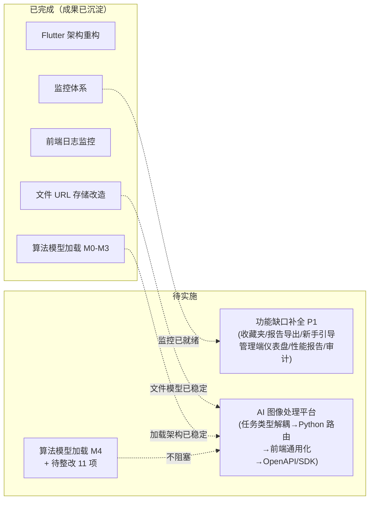

# 近期改造计划总览

> 本文档是近期改造的**编排视图**：统筹各项改造的目标、状态、依赖与实施时序，详细方案在各专项文档与事实文档中维护，本文档不复制。远期规划见 [远期改造计划总览](./远期改造计划总览.md)。

## 1. 近期改造目标

系统已完成「做深去雾」阶段（处理历史、进度反馈、用户评分、VIP 体系、文件存储、监控日志等基础设施均已落地），近期目标是从单一去雾工具演进为**AI 图像处理平台**：

- **产品主线**：横向扩展同类退化（去雨、去雪、低光增强）与通用图像处理（超分辨率、去噪、图像修复），任务系统与具体算法解耦，OpenAPI 对外开放并自动生成多端 SDK
- **功能补全**：补齐去雾体验闭环（收藏夹、对比报告导出、新手引导）与管理端运营能力（监控仪表盘、算法性能报告、操作审计）
- **技术收尾**：算法模型加载架构的待整改项与治理增强

## 2. 改造项总览

### 2.1 已完成项（成果已沉淀至事实文档，中间过程文档已清理）

| 改造项 | 成果沉淀位置 |
|--------|-------------|
| Flutter 端架构与 API 调用重构 | [Flutter 架构文档](../04-项目实现/前端/05-Flutter架构文档.md) |
| 监控体系（业务指标对齐、告警、ELK、Exporter） | [部署架构 §7](../02-系统架构/06-部署架构.md) |
| 前端日志监控（trace_id 透传、Logger 多 transport、移动端崩溃捕获） | [日志架构设计 §3.5](../02-系统架构/07-日志架构设计.md)、[08-SDK架构文档](../04-项目实现/前端/08-SDK架构文档.md) |
| 文件 URL 存储设计（object_name + storage，URL 运行时拼接） | [数据库设计](../02-系统架构/03-数据库设计.md)、[文件管理后端实现](../03-模块设计/基础模块/文件管理/后端实现.md) |
| 算法模型加载架构 M0-M3（显式声明、验证工具、缺失算法补齐） | [算法管理后端实现 §6.3](../03-模块设计/核心模块/算法管理/后端实现.md) |
| Taro 前端架构治理（跨页 Storage 传参改 zustand process store、设计令牌统一、页面级状态迁移 zustand、any 清理、TARO_ENV 收敛） | [03-Taro架构文档](../04-项目实现/前端/03-Taro架构文档.md) |
| React Native 前端架构治理（导航类型安全、useProcessing hook、令牌统一、algorithm 拆分、dehaze 实现质量、dataset 路由化） | [04-ReactNative架构文档](../04-项目实现/前端/04-ReactNative架构文档.md) |
| Flutter 前端架构治理（状态范式统一 + 路由权限守卫） | [Flutter 架构文档](../04-项目实现/前端/05-Flutter架构文档.md) |
| Android 前端架构治理（请求取消生命周期、异常处理收敛、个人侧 VM 化、分页范式收敛、BaseActivity） | [06-Android架构文档](../04-项目实现/前端/06-Android架构文档.md) |
| Uniapp 前端架构治理（uview-plus 残留清理、死路由修正、处理主链路收敛、CRUD 抽象、权限补全、设计令牌落地、安全区去重、上传链路会话一致性） | [07-Uniapp架构文档](../04-项目实现/前端/07-Uniapp架构文档.md) |
| Python 后端改造（行级数据权限收尾、TaskTracker 全覆盖、API Key 降级最小权限、推理线程池可配、服务层架构治理） | [Python算法服务架构文档](../04-项目实现/后端/03-Python算法服务架构文档.md) |

### 2.2 待实施项

| 改造项 | 类别 | 优先级 | 详细方案 |
|--------|------|--------|---------|
| AI 图像处理平台（多任务类型 + OpenAPI/SDK） | 产品主线 | P0 | [产品拓展升级规划 §3.3](./产品拓展升级规划.md) |
| 功能缺口补全（用户端 + 管理端） | 功能补全 | P1 | [产品拓展升级规划 §功能缺口补全计划](./产品拓展升级规划.md) |
| 算法模型加载 M4 + 待整改项 | 技术收尾 | P2 | 本文 §5 |
| JS SDK 架构治理（ERROR 去重补实现、trace_id 并发安全、OpenAPI 生成目录边界） | 技术收尾 | P0-P1 | [JS SDK 架构改造计划](./JS SDK架构改造计划.md) |
| Go 后端测试规范化（真实 MySQL 测试库 `dehaze_test` + mockery 收敛 + miniredis + 资金/权益链路测试） | 技术收尾 | P0-P1 | [Go后端测试规范化改造计划](./Go后端测试规范化改造计划.md) |

## 3. 产品主线：AI 图像处理平台

详细扩展可行性评估、兼容性判断、分阶段路径见 [产品拓展升级规划](./产品拓展升级规划.md)。本节补充该文档未覆盖的**关键实现设计**。

### 3.1 任务类型路由

当前系统隐含「去雾」单一语义，改造目标是任务系统与具体算法解耦，按任务类型分发。**需区分两个同名概念**：算法维度 `task_type`（`sys_algorithm.task_type`，枚举 `dehaze`/`derain`/`desnow`/`lowlight`/`super_resolution`/`denoise`/`inpaint`）与任务维度 `task_type`（`sys_task.task_type`，已存在，取值 `user_export`/`image_processing` 等"模块+操作"格式，本次新增 `image_processing` 类型）。

**数据层**：
- `sys_task.task_type` 已存在（模块+操作格式），本次新增 `image_processing` 任务类型；图像处理的具体算法场景经创建参数 `params.taskType` 承载（与 `sys_algorithm.task_type` 取值对齐），任务按 `params.taskType` 路由到对应算法集合
- `sys_algorithm` 新增 `task_type` 维度，算法按任务类型归类

**Python 算法服务**：
- 当前 `importlib` 导入 `algorithm.<name>.run`，改为按算法 `task_type` 路由到对应算法集合
- 算法目录结构维持平铺（`algorithm/<name>/run.py`），通过 `sys_algorithm.task_type` 字段标识归类，不按任务类型物理分目录——避免目录重构带来的迁移成本，算法归类是数据层而非文件层职责

**后端任务系统**（三端同步）：
- 任务创建/分发按 `params.taskType` 路由到对应算法集合
- 算法选择模块的树形结构、搜索筛选增加任务类型维度

**前端**：
- 「去雾处理」页面抽象为通用「图像处理」页面，通过 `taskType` 参数区分
- 上传提示、参数配置、效果评估指标按任务类型独立配置（配置驱动，非硬编码）

### 3.2 多模型权重加载策略

产品拓展升级规划提到「模型权重按需加载，避免多模型同时占用 GPU 显存」。当前算法模型加载架构（M0-M3 已完成）的状态：

- 每次推理重新 `torch.load` + 重建模型，无实例复用
- 推理线程池 2 worker 串行，同一模型并发推理需排队

多任务类型引入后，算法数量增长，**维持现状（每次加载）** 还是推进**模型实例缓存（进程内 LRU）** 需在 M4 阶段决策（见 §5）。关键约束：缓存容量按模型大小配额，大模型（>1GB）默认不缓存或仅缓存 1 份。

### 3.3 OpenAPI + 多端 SDK 生成链路

OpenAPI 对外开放（文档生成、访问地址、API Key 鉴权、多端 SDK 自动生成、与手写 SDK 的关系）已落地到 [API 规范 §9.2](../02-系统架构/04-API规范.md)，实现前按该规范执行，不再此处重复定义。

## 4. 功能缺口补全

详细清单见 [产品拓展升级规划 §功能缺口补全计划](./产品拓展升级规划.md)。优先级与批次归属：

| 功能 | 优先级 | 依赖 | 备注 |
|------|--------|------|------|
| 新手引导 | P1 | 前端独立实现 | 首次使用 Tutorial，完成率 >90% |
| 算法性能报告 | P1 | 算法管理模块 | 各算法 PSNR 均值、使用频次、失败率 |

## 5. 算法模型加载待收尾项

M0-M3 成果（显式声明 `weights_only=False`、删除全局 patch、`validate_algorithms.py` 验证工具、缺失算法补齐）已沉淀至 [算法管理后端实现 §6.3](../03-模块设计/核心模块/算法管理/后端实现.md)。以下为未完成项：

### 5.1 待整改算法（11 项）

全量 L1-L4 验证中 71/82 叶子通过，11 项待整改：

| 算法 | 问题 | 处置方向 |
|------|------|---------|
| AECR-NET (1) | checkpoint 含 `module.mix4/mix5`，代码模型仅 `mix1/mix2`，结构错配 | 替换匹配权重或回写模型代码 |
| PSD-MSBDN (99) / PSD-FFANET (100) | 64px 冒烟图下采样到 1x1，InstanceNorm 报错 | 小图最小尺寸约束，真实图片无此问题，待确认容忍策略 |
| PSD-GCANET (101) | `in_c=4` 但冒烟输入 3 通道 | 代码 in_c 与输入通道不符，待处理 |
| RIDCP (102) | `deform_conv` CUDA 扩展编译失败 | 环境依赖，部署环境需预编译扩展 |
| WPXNet 系 (112-117) | 缺 `natten` 依赖 | 环境依赖，部署环境需安装匹配 natten |

### 5.2 M4：治理增强（P2，待排期）

- `model_manifest.json` 生成/维护：权重文件指纹（SHA256）、来源、验证状态收敛到文件清单，DB 不存模型元数据
- SHA256 校验接入下载/巡检流程：首次下载后、文件大小/修改时间变化时校验
- SDK 集成测试按算法冒烟

### 5.3 开放决策

| 决策项 | 说明 |
|--------|------|
| 模型实例缓存（P1） | 进程内 LRU（key=算法+权重+SHA256 前缀），需先确认内存预算与线程安全模型；不做则维持每次加载 |
| 验证工具归属 | `validate_algorithms.py` 独立 CLI 放 `dehaze-python/scripts/`，L3 键比对容忍策略（已降级为提示）是否收敛为正式规则 |

## 6. 实施时序与依赖

**关键路径**：文件 URL 存储改造（✅ 已完成）→ AI 图像处理平台（产品主线）。文件模型已稳定，产品主线无阻塞，可直接启动。

**并行策略**：
- 功能缺口补全（P1）与产品主线无强依赖，可并行推进；管理端 P1 功能复用已完成的监控体系
- 算法模型加载 M4（P2）与产品主线并行，不阻塞

## 7. 文档同步清单

产品主线（AI 图像处理平台）进入实现前，需按文档层级同步更新设计文档（系统架构层 / 模块设计层 / 产品设计层 / 项目实现层 / SDK 层），详细清单见 [产品拓展升级规划 §B](./产品拓展升级规划.md)。
