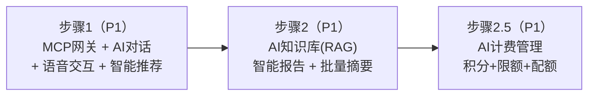

# 远期改造计划总览

> 本文档是远期改造（AI 工作平台）的编排视图：战略定位、能力分层、模块拆分、实施时序。详细设计在各模块需求规格中维护，本文档不重复。近期改造计划见 [近期改造计划总览](./近期改造计划总览.md)。

## 1. 战略定位

**核心定位**：以专业图像处理能力为根基，融入通用大语言模型（LLM）作为统一交互中枢与能力扩展底座，从"专业图像处理工具"升级为"具备通用 AI 助手潜力的智能工作平台"。

**演进思路**：
- 近期阶段沉淀的专业图像处理能力（多任务类型算法、量化评估）是平台的差异化壁垒，先建立专业认知再通用化，避免与通用助手陷入同质化竞争
- 远期阶段在多模态交互基础上引入通用大语言模型，图像处理不再是唯一能力，而是通用 AI 助手的一项专业长板
- 平台以"专业长板 + 通用底座"的融合形态，具备向通用 AI 大语言模型演进的能力储备与用户基础

**为什么在近期阶段之后引入**：近期阶段完成后，文件管理、任务队列、算法管理（多任务类型）等核心模块已稳定，可承载大模型交互的复杂性；用户基数与处理数据积累为多模态模型与大模型微调提供素材；专业壁垒已建立，避免被通用助手降维覆盖。

## 2. 能力分层架构

远期平台按四个能力层次落地：

### 2.1 通用对话层（LLM 中枢）

- 接入通用大语言模型，提供开放式对话能力（问答、写作、翻译、代码、推理等）
- 系统已有 API 通过 MCP 协议暴露为工具，模型可代用户调用图像处理、指标评估等能力
- 支持上下文记忆、多轮对话、知识检索增强（RAG）

### 2.2 输入层（语音 / 文档理解）

- 语音指令控制：上传、选算法、调参数等操作可通过语音完成
- 自然语言描述处理需求：如"帮我把这张夜景照片变亮"
- 文档理解：读取处理需求说明书，解析为可执行的处理任务

### 2.3 交互层（多模态融合）

- 上传图片 + 文字描述的组合交互
- 处理参数的自然语言调整（如"再调亮一点"）
- 处理过程中的智能对话引导

### 2.4 输出层（智能反馈）

- 处理结果的智能解读：参考基准效果指标，结合模型多模态能力综合生成处理报告与指标分析
- 批量处理结果的摘要总结
- 处理建议的自然语言反馈

### 2.5 调度闭环示例

用户上传图片 + 文字描述"帮我去雾并评估效果"：

1. LLM 理解意图 → 通过 MCP 调用算法选择工具，结合各算法特点智能选算法
2. 通过 MCP 调用图像处理工具发起处理（异步任务队列）
3. 处理完成后通过 MCP 调用指标评估工具，计算 PSNR/SSIM
4. 参考基准效果指标，结合模型多模态能力综合给出处理结果的智能解读（报告 + 指标分析）

## 3. 架构与模块拆分

采用两层架构，AI 对话模块的 LangGraph Agent 统一编排所有推理与执行流程：

| 层 | 职责 | 适用场景 |
|----|------|---------|
| 对话推理与执行层 | 开放式对话的多步推理（子任务分解、反思重试、人工中断），同时编排确定性多步骤任务的执行（去雾→评估→条件分支） | 用户意图不确定时 LLM 理解并分解；用户明确任务步骤时 AI 对话调度工具流水线执行 |
| 能力层 | 将系统已有 API 自动发现并暴露为模型可调用工具（MCP 工具）和知识源（知识库 RAG） | LLM 调度系统能力的统一契约 |

> 不再区分"对话推理"和"工作流编排"两层——LangGraph 的 Plan-and-Execute 范式和条件路由已原生支持确定性多步骤编排（如"去雾→评估→PSNR<30→换算法重试"），无需独立的可视化工作流引擎。

### 3.1 远期新增模块

| 模块 | 类别 | 核心职责 | 需求规格 |
|------|------|---------|---------|
| AI 对话 | 核心模块 | 通用对话、多步推理、上下文管理、智能算法推荐、批量摘要 | [AI对话/需求规格](../03-模块设计/核心模块/AI对话/需求规格.md) |
| MCP 能力网关 | 核心模块 | API 自动发现（OpenAPI→MCP tool）、认证复用 API Key、请求响应转换 | [MCP能力网关/需求规格](../03-模块设计/核心模块/MCP能力网关/需求规格.md) |
| AI 知识库 | 基础模块 | 知识内容管理、向量索引构建、RAG 检索注入 | [AI知识库/需求规格](../03-模块设计/基础模块/AI知识库/需求规格.md) |
| 语音交互 | 基础模块 | 语音识别（ASR）、语音合成（TTS） | [语音交互/需求规格](../03-模块设计/基础模块/语音交互/需求规格.md) |
| AI 计费管理 | 基础模块 | 积分计量（模型换算）、限额分层（日/月）、配额扣减 | [AI计费管理/需求规格](../03-模块设计/基础模块/AI计费管理/需求规格.md) |

### 3.2 现有模块扩展

| 模块 | 扩展内容 |
|------|---------|
| 算法选择 | 叠加自然语言交互，LLM 智能选算法 |
| 图像处理 | 多模态输入支持 |
| 效果对比 | 自然语言解读对比报告、智能报告生成 |
| 任务管理 | 新增任务完成回调机制（支持对话推理异步恢复） |
| 会员管理 | `sys_member_benefit` 新增 AI 对话积分日限额/月限额字段（计费逻辑见 AI 计费管理模块） |

## 4. 实施时序

| 步骤 | 核心交付物 | 依赖 | 优先级 |
|------|-----------|------|--------|
| 1 | MCP 能力网关（API 自动发现）、AI 对话（多步推理 + 上下文管理）、语音交互（ASR/TTS/指令）、智能算法推荐 | 近期改造完成（多任务类型、文件存储、监控日志、API Key 认证） | P1 |
| 2 | AI 知识库（RAG 检索增强）、效果对比智能报告、批量处理摘要 | 步骤 1（对话推理 + MCP 基础设施） | P1 |
| 2.5 | AI 计费管理（积分计量、限额分层、配额扣减） | 步骤 1（对话执行产生消耗） | P1 |

## 5. 用户价值场景

1. **通用对话场景**：用户通过统一对话入口完成问答、写作、翻译等通用任务，同时可一句话调度图像处理能力
2. **语音操作场景**：用户通过语音完成上传、选算法、调参数、发起处理等操作，无需手动打字
3. **批量处理场景**：用户上传多张图片后，通过自然语言描述统一处理需求，减少重复操作
4. **专业报告场景**：处理完成后自动生成包含技术指标、处理参数、效果对比的专业报告
5. **企业自动化场景**：通过 AI 对话的定时调度 + Agent 编排实现"定时拉取图片→自动处理→自动分发"的端到端自动化

## 6. 文档同步清单

远期阶段进入实现前，需按以下清单同步更新设计文档。

### 6.1 系统架构层（修改）

| 文档 | 操作 | 主要内容 |
|------|------|---------|
| `02-系统架构/01-总体架构设计.md` | 修改 | 新增 AI 对话推理层、MCP 能力层 |
| `02-系统架构/03-数据库设计.md` | 修改 | 新增对话会话、知识库、AI 计费明细等表 |
| `02-系统架构/04-API规范.md` | 修改 | 新增对话 API 规范 |
| `02-系统架构/06-部署架构.md` | 修改 | 大模型服务（外部 API）、语音服务（ASR/TTS）依赖 |
| `02-系统架构/07-日志架构设计.md` | 修改 | AI 对话日志、MCP 工具调用链路追踪 |
| `02-系统架构/05-测试架构.md` | 修改 | AI 对话测试策略、MCP 工具 mock |

### 6.2 模块设计层（新增 + 修改）

| 文档 | 操作 | 主要内容 |
|------|------|---------|
| `03-模块设计/核心模块/AI对话/` | 新增 | 通用对话、多步推理、上下文管理、智能推荐、批量摘要 |
| `03-模块设计/核心模块/MCP能力网关/` | 新增 | API 自动发现、认证复用 API Key、请求响应转换 |
| `03-模块设计/基础模块/AI知识库/` | 新增 | 知识内容管理、向量索引、RAG 检索注入 |
| `03-模块设计/基础模块/语音交互/` | 新增 | 语音识别、语音合成 |
| `03-模块设计/基础模块/AI计费管理/` | 新增 | 积分计量、模型换算、限额分层、配额扣减 |
| `03-模块设计/核心模块/算法选择/` | 修改 | 叠加自然语言交互、LLM 智能选算法 |
| `03-模块设计/核心模块/图像处理/` | 修改 | 多模态输入支持 |
| `03-模块设计/核心模块/效果对比/` | 修改 | 智能报告生成 |
| `03-模块设计/基础模块/任务管理/` | 修改 | 任务完成回调机制 |
| `03-模块设计/基础模块/会员管理/` | 修改 | `sys_member_benefit` 新增 AI 对话积分限额字段 |

### 6.3 产品设计层（修改）

| 文档 | 操作 | 主要内容 |
|------|------|---------|
| `01-产品设计/01-产品概述.md` | 修改 | 远期阶段 AI 对话功能概述 |
| `01-产品设计/05-菜单与页面层级规划.md` | 修改 | 新增对话页 |
| `01-产品设计/06-文案与术语规范.md` | 修改 | AI 对话、MCP 等术语 |

### 6.4 项目实现层（修改）

| 文档 | 操作 | 主要内容 |
|------|------|---------|
| `04-项目实现/后端/` 各架构文档 | 修改 | 对话管理、MCP 网关、AI 计费后端实现 |
| `04-项目实现/前端/` 各架构文档 | 修改 | 统一对话入口 UI、语音交互 |
