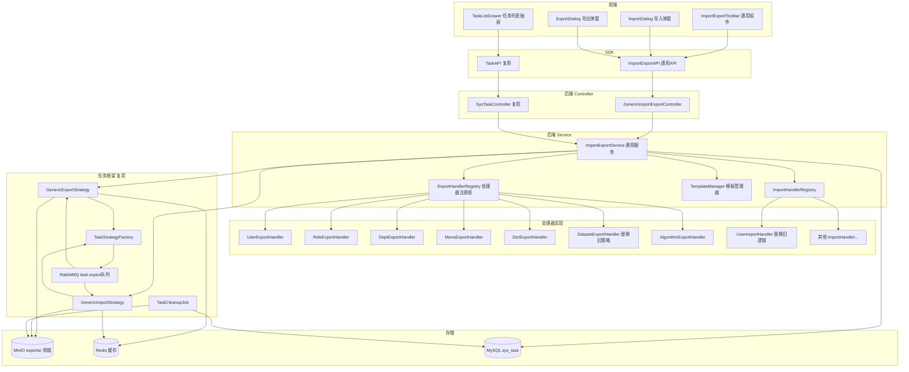
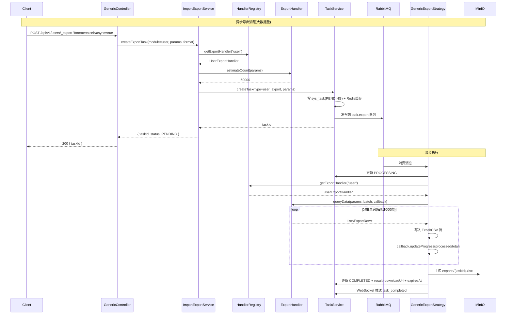
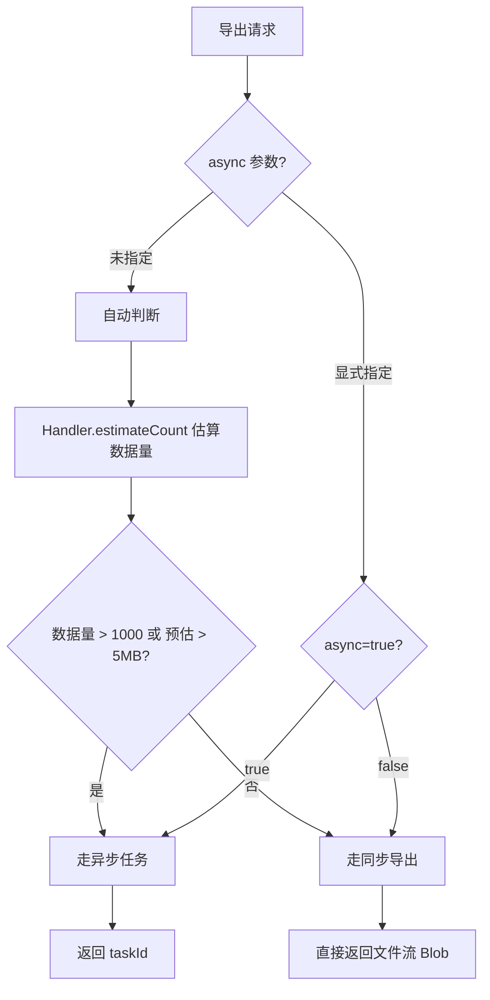

# 通用导入导出改造方案

> **状态**:待评审
> **作者**:系统
> **创建时间**:2026-07-26
> **关联文档**:
> - [02-系统架构/04-API规范.md](../02-系统架构/04-API规范.md) §8.2 通用CRUD接口模板
> - [02-系统架构/03-数据库设计.md](../02-系统架构/03-数据库设计.md) sys_task 表
> - [03-模块设计/基础模块/任务管理/后端实现.md](../03-模块设计/基础模块/任务管理/后端实现.md) 异步任务策略模式
> - [03-模块设计/基础模块/文件管理/后端实现.md](../03-模块设计/基础模块/文件管理/后端实现.md) MinIO存储
> - [05-改造计划/预测评估异步化改造.md](./预测评估异步化改造.md) 异步任务参考

---

## 1. 文档概述

### 1.1 背景

当前系统的导入导出能力分散且不统一:

| 模块 | 导出 | 导入 | 模板 | 实现方式 |
|------|------|------|------|---------|
| 用户管理 | ✅ 同步 Excel | ✅ 同步 Excel | ✅ 静态文件 | EasyExcel / openpyxl / excelize |
| 算法管理 | ✅ 同步 JSON | ✅ 同步 JSON | ❌ | 文件流 |
| 数据集导出 | ✅ 异步任务(ZIP) | ❌ | ❌ | sys_task + DatasetExportStrategy |
| 角色/部门/菜单/字典 | ❌ | ❌ | ❌ | 无 |

**存在的问题**:
1. 同步导入导出在大数据量下阻塞请求线程,可能导致接口超时
2. 用户/算法模块的导入导出逻辑各自实现,代码重复
3. 角色/部门/菜单/字典等模块缺失导入导出能力
4. 无统一的任务列表查看导入导出进度
5. 无CSV格式支持,无批量/部分导入模式选择

### 1.2 改造目标

为所有列表页面提供**统一的导入导出能力**,通过通用框架减少重复代码:

1. **导出**:支持 Excel(.xlsx)和 CSV 两种格式,大数据量走异步任务
2. **导入**:支持 Excel 和 CSV 上传,含格式校验和结果反馈,支持全量/部分两种模式
3. **任务列表**:统一展示所有导入导出任务,支持筛选、取消、过期清理
4. **界面统一**:各列表页面统一位置放置导入/导出按钮,实时状态更新
5. **性能**:单次导出最大 10 万条,文件上传 20MB 限制
6. **安全**:文件类型验证、魔数校验、权限校验、导出文件 7 天有效期

### 1.3 设计原则

| 原则 | 说明 |
|------|------|
| **复用优先** | 复用 sys_task 表、TaskStrategy 策略模式、RabbitMQ 拓扑、MinIO 存储,不新增任务表 |
| **通用框架** | 通过处理器接口(Handler)+ 通用策略(GenericStrategy)实现复用,各模块只实现 Handler |
| **同步异步自适应** | 小数据量(≤1000 条或预估≤5MB)同步返回文件流;大数据量走异步任务返回 taskId |
| **注解驱动** | 字段映射通过注解(@ExportField/@ImportField)定义,Handler 可动态覆盖 |
| **三端对齐** | Java/Python/Go 三端实现完全对齐,API 行为一致 |
| **直接替换** | 舍弃现有用户/算法同步导入导出接口和旧实现,直接以通用框架替换,不保留向后兼容 |

### 1.4 改造范围

**本次改造覆盖的列表页面**:

| 模块 | 列表类型 | 导入可行性 | 导出可行性 | 备注 |
|------|---------|-----------|-----------|------|
| 用户管理(user) | 分页 | ✅ | ✅ | 已有同步实现,改造为通用框架 |
| 角色管理(role) | 分页 | ✅ | ✅ | 新增 |
| 部门管理(dept) | 树形 | ✅ | ✅ | 新增,树形导出为扁平结构 |
| 菜单管理(menu) | 树形 | ✅ | ✅ | 新增,树形导出为扁平结构 |
| 字典管理(dict) | 分页 | ✅ | ✅ | 新增(字典类型+字典数据) |
| 数据集管理(dataset) | 树形 | ❌ | ✅ | **删除**旧 DatasetExportStrategy,替换为通用框架 |
| 算法管理(algorithm) | 树形 | ✅ | ✅ | **删除** JSON 导入导出,统一为 Excel/CSV(含元数据,不含权重文件) |

> **注**:数据集和算法的导入涉及文件/权重上传,复杂度高,本期数据集仅支持导出;算法的权重文件导入不在本次范围,仅支持 Excel/CSV 元数据导入导出。

---

## 2. 整体架构设计

### 2.1 架构总览



### 2.2 核心设计:处理器模式 + 通用策略

通用化的核心是**将模块特定逻辑抽象为 Handler 接口**,通用策略通过注册表查找对应 Handler 执行:



### 2.3 同步/异步自适应策略



---

## 3. 数据库设计

### 3.1 复用 sys_task 表

**不新增表**。完全复用现有 `sys_task` 表,通过 `task_type` 字段区分不同模块的导入导出任务。

新增的任务类型标识:

| task_type | 说明 | params 结构 |
|-----------|------|------------|
| `user_export` | 用户导出 | `{ "query": {...}, "format": "excel\|csv", "fields": [...] }` |
| `role_export` | 角色导出 | 同上 |
| `dept_export` | 部门导出 | 同上 |
| `menu_export` | 菜单导出 | 同上 |
| `dict_export` | 字典导出 | 同上 |
| `dataset_export` | 数据集导出(替换旧策略) | `{ "query": {...}, "format": "excel", "options": { "includeTypes": [...], "structure": "by_item\|flat", "includeThumbnail": true } }` |
| `algorithm_export` | 算法导出 | `{ "query": {...}, "format": "excel\|csv", "fields": [...] }` |
| `user_import` | 用户导入 | `{ "fileObjectName": "...", "mode": "all\|partial", "deptId": 1 }` |
| `role_import` | 角色导入 | 同上 |
| `dept_import` | 部门导入 | 同上 |
| `menu_import` | 菜单导入 | 同上 |
| `dict_import` | 字典导入 | 同上 |
| `algorithm_import` | 算法导入 | 同上 |

### 3.2 导入结果存储

导入任务的 `result` 字段(JSON 字符串)存储导入结果摘要:

```json
{
  "totalRows": 100,
  "successCount": 95,
  "failureCount": 5,
  "skippedCount": 0,
  "errors": [
    { "row": 3, "field": "username", "message": "用户名已存在" },
    { "row": 7, "field": "email", "message": "邮箱格式不正确" }
  ],
  "errorReportObjectName": "imports/{taskId}_errors.xlsx"
}
```

> 错误明细较多时,单独生成错误报告文件上传到 MinIO 的 `imports/` 前缀下,通过 `errorReportObjectName` 引用。

### 3.3 导出文件存储路径

遵循文件管理模块的路径规则:

| 文件类型 | 路径格式 | 示例 |
|---------|---------|------|
| 导出结果文件 | `exports/{taskId}.{ext}` | `exports/550e8400-xxxx.xlsx` |
| 导入错误报告 | `imports/{taskId}_errors.{ext}` | `imports/550e8400-xxxx_errors.xlsx` |
| 导入上传文件(临时) | `temp/imports/{taskId}/{originalName}` | `temp/imports/550e8400-xxxx/users.xlsx` |

---

## 4. API 接口设计

### 4.1 接口清单

所有接口遵循 [02-系统架构/04-API规范.md](../02-系统架构/04-API规范.md) 的通用 CRUD 模板。

#### 4.1.1 导出接口(每模块统一)

| 路径 | 方法 | 功能 | 权限标识 | 同步/异步 |
|------|------|------|---------|----------|
| `GET /api/v1/{module}/_export` | GET | 导出数据 | `{module}:export` | 自适应 |
| `POST /api/v1/{module}/_export` | POST | 导出数据(复杂查询条件) | `{module}:export` | 自适应 |
| `GET /api/v1/{module}/template` | GET | 下载导入模板 | `{module}:import` | 同步 |

> **说明**:GET 导出用于简单查询条件(如列表页当前的筛选参数);POST 导出用于复杂查询条件(请求体传递)。两者内部调用同一 Service 方法。

**GET 导出请求参数**:

| 参数 | 类型 | 必填 | 说明 |
|------|------|------|------|
| format | string | 否 | 文件格式:`excel`(默认) / `csv` |
| async | boolean | 否 | 是否强制异步:`true` / `false` / 不传(自动判断) |
| fields | string | 否 | 导出字段,逗号分隔(不传则导出全部字段) |
| + 模块特定查询参数 | - | 否 | 各模块列表查询参数(如 keywords/status/pageNum 等,但导出忽略分页参数) |

**GET 导出响应**:

- **同步模式**(数据量小):直接返回文件流
  ```
  Content-Type: application/vnd.openxmlformats-officedocument.spreadsheetml.sheet
  Content-Disposition: attachment; filename="users_20260726_153000.xlsx"
  Body: <文件二进制流>
  ```

- **异步模式**(数据量大):返回 JSON
  ```json
  {
    "code": "00000",
    "msg": "导出任务已创建",
    "data": {
      "taskId": "550e8400-e29b-41d4-a716-446655440000",
      "status": "PENDING",
      "estimatedCount": 50000
    }
  }
  ```

#### 4.1.2 导入接口(每模块统一)

| 路径 | 方法 | 功能 | 权限标识 |
|------|------|------|---------|
| `POST /api/v1/{module}/_import` | POST | 导入数据 | `{module}:import` |

**导入请求参数**:

| 参数 | 类型 | 必填 | 说明 |
|------|------|------|------|
| file | File | 是 | 上传的文件(Excel/CSV),≤20MB |
| mode | string | 否 | 导入模式:`all`(全量,默认) / `partial`(部分) |
| async | boolean | 否 | 是否异步:`true` / `false` / 不传(数据量>1000行自动异步) |
| + 模块特定参数 | - | 否 | 如用户导入的 `deptId`、角色导入的 `defaultDataScope` 等 |

**导入响应**:

- **同步模式**(数据量小):返回导入结果
  ```json
  {
    "code": "00000",
    "msg": "导入完成",
    "data": {
      "totalRows": 100,
      "successCount": 95,
      "failureCount": 5,
      "skippedCount": 0,
      "errors": [
        { "row": 3, "field": "username", "message": "用户名已存在" }
      ],
      "errorReportUrl": null
    }
  }
  ```

- **异步模式**(数据量大):返回 taskId
  ```json
  {
    "code": "00000",
    "msg": "导入任务已创建",
    "data": {
      "taskId": "550e8400-xxxx",
      "status": "PENDING"
    }
  }
  ```

#### 4.1.3 模板下载接口

| 路径 | 方法 | 功能 | 权限标识 |
|------|------|------|---------|
| `GET /api/v1/{module}/template` | GET | 下载导入模板 | `{module}:import` |
| `GET /api/v1/{module}/template?format=csv` | GET | 下载CSV模板 | `{module}:import` |

**响应**:直接返回文件流(动态生成,包含表头和示例数据)。

#### 4.1.4 任务接口(复用现有)

完全复用 [任务管理 API接口.md](../03-模块设计/基础模块/任务管理/API接口.md) 中已定义的 5 个接口:

| 路径 | 方法 | 功能 |
|------|------|------|
| `POST /api/v1/tasks` | POST | 创建任务(已支持) |
| `GET /api/v1/tasks/{taskId}` | GET | 查询任务状态(已支持) |
| `GET /api/v1/tasks/{taskId}/download` | GET | 下载任务结果(已支持) |
| `POST /api/v1/tasks/{taskId}/cancel` | POST | 取消任务(已支持) |
| `GET /api/v1/tasks` | GET | 任务列表(已支持) |

**任务列表查询增强**:

`TaskQuery` 新增可选参数:

| 参数 | 类型 | 说明 |
|------|------|------|
| taskType | string | 按任务类型筛选(支持逗号分隔多个) |
| taskCategory | string | 按任务类别筛选:`import` / `export`(新增,便于分类查看) |

### 4.2 业务错误码

新增错误码遵循 [02-系统架构/04-API规范.md](../02-系统架构/04-API规范.md) §6 状态码体系:

| 错误码 | 说明 | 触发场景 |
|--------|------|---------|
| A0701 | 文件格式不支持 | 上传非 Excel/CSV 文件 |
| A0702 | 文件大小超限 | 上传文件 > 20MB |
| A0703 | 文件内容为空 | 上传空文件或无数据行 |
| A0704 | 文件解析失败 | Excel/CSV 格式错误 |
| A0705 | 模板字段不匹配 | 导入文件表头与模板不一致 |
| A0706 | 必填字段为空 | 导入数据缺少必填字段 |
| A0707 | 数据校验失败 | 字段格式/唯一性校验不通过 |
| A0708 | 导入数据超出限制 | 单次导入超过 10 万行 |
| A0709 | 导出行数超出限制 | 单次导出超过 10 万行 |
| A0710 | 不支持该模块导入 | 数据集等不支持导入的模块 |
| B0308 | 导出任务并发超限 | 单用户导入导出任务并发数超限 |

---

## 5. 后端实现设计

### 5.1 Java 实现

#### 5.1.1 核心接口定义

**ExportHandler 导出处理器接口**:

```java
public interface ExportHandler {
    String getModule();
    long estimateCount(Map<String, Object> queryParams);
    void export(ExportContext ctx, ProgressCallback callback) throws Exception;
    List<ExportFieldConfig> getFieldConfigs();
    default List<ExportFieldConfig> getDynamicFieldConfigs(Map<String, Object> queryParams) {
        return getFieldConfigs();
    }
}
```

**ImportHandler 导入处理器接口**:

```java
public interface ImportHandler {
    String getModule();
    List<ImportFieldConfig> getFieldConfigs();
    default List<ImportFieldConfig> getDynamicFieldConfigs() {
        return getFieldConfigs();
    }
    ImportResult importBatch(List<Map<String, Object>> rows, ImportOptions options, ProgressCallback callback);
    List<Map<String, Object>> getTemplateSampleData();
}
```

**字段配置类**:

```java
@Data
@Builder
public class ExportFieldConfig {
    private String field;
    private String label;
    private int order;
    private String dateFormat;
    private String dictType;
    private boolean hidden;
}

@Data
@Builder
public class ImportFieldConfig {
    private String field;
    private String label;
    private boolean required;
    private String dateFormat;
    private String dictType;
    private String regex;
    private Integer maxLength;
    private String defaultValue;
}
```

#### 5.1.2 ExportContext 上下文

```java
@Data
public class ExportContext {
    private String taskId;
    private String module;
    private String format;
    private List<String> selectedFields;
    private Map<String, Object> queryParams;
    private OutputStream outputStream;
    private long totalCount;
}
```

#### 5.1.3 通用服务层

**ImportExportService**:

```java
@Service
@RequiredArgsConstructor
public class ImportExportService {
    private final ExportHandlerRegistry exportHandlerRegistry;
    private final ImportHandlerRegistry importHandlerRegistry;
    private final TemplateManager templateManager;
    private final TaskService taskService;

    public Object export(String module, Map<String, Object> params, String format,
                         Boolean async, List<String> fields, HttpServletResponse response) {
        ExportHandler handler = exportHandlerRegistry.getHandler(module);
        long count = handler.estimateCount(params);
        boolean shouldAsync = async != null ? async : count > 1000;

        if (shouldAsync) {
            String taskId = taskService.createTask(buildExportTaskType(module), buildParams(params, format, fields));
            return ExportTaskVO.builder().taskId(taskId).status("PENDING").estimatedCount(count).build();
        }
        writeSyncExport(handler, params, format, fields, response);
        return null;
    }

    public Object importData(String module, MultipartFile file, String mode,
                             Boolean async, Map<String, Object> extraParams) {
        validateFile(file);
        ImportHandler handler = importHandlerRegistry.getHandler(module);
        long rowCount = countRows(file);
        boolean shouldAsync = async != null ? async : rowCount > 1000;

        if (shouldAsync) {
            String objectName = uploadImportFile(file);
            String taskId = taskService.createTask(buildImportTaskType(module),
                    buildImportParams(objectName, mode, extraParams));
            return ImportTaskVO.builder().taskId(taskId).status("PENDING").build();
        }
        return executeSyncImport(handler, file, mode, extraParams);
    }

    public void downloadTemplate(String module, String format, HttpServletResponse response) {
        ImportHandler handler = importHandlerRegistry.getHandler(module);
        templateManager.generateTemplate(handler, format, response);
    }
}
```

#### 5.1.4 处理器注册表

```java
@Component
@RequiredArgsConstructor
public class ExportHandlerRegistry {
    private final Map<String, ExportHandler> handlers;
    private final List<ExportHandler> handlerList;

    @PostConstruct
    public void init() {
        handlerList.forEach(h -> handlers.put(h.getModule(), h));
    }

    public ExportHandler getHandler(String module) {
        ExportHandler handler = handlers.get(module);
        if (handler == null) {
            throw new BusinessException(ResultCode.A0710, "模块 " + module + " 不支持导出");
        }
        return handler;
    }
}
```

#### 5.1.5 通用策略类

**GenericExportStrategy**(注册为多个 taskType):

```java
@Component
public class GenericExportStrategy implements TaskStrategy {
    private final ExportHandlerRegistry registry;
    private final ImportExportFileGenerator fileGenerator;
    private final StorageService storageService;
    private final TaskService taskService;

    @Override
    public List<String> getTaskTypes() {
        return List.of("user_export", "role_export", "dept_export", "menu_export",
                "dict_export", "dataset_export", "algorithm_export");
    }

    @Override
    public void execute(SysTask task, Map<String, Object> params, ProgressCallback callback) {
        String module = (String) params.get("module");
        ExportHandler handler = registry.getHandler(module);
        ExportContext ctx = buildContext(task, params);

        try (ByteArrayOutputStream baos = new ByteArrayOutputStream()) {
            ctx.setOutputStream(baos);
            handler.export(ctx, callback);

            String objectName = "exports/" + task.getTaskId() + "." + ctx.getFormat();
            String downloadUrl = storageService.upload(objectName, new ByteArrayInputStream(baos.toByteArray()),
                    (long) baos.size(), getContentType(ctx.getFormat()));

            taskService.updateTaskCompleted(task.getTaskId(), downloadUrl,
                    LocalDateTime.now().plusDays(7));
        }
    }
}
```

> **注**:`TaskStrategy` 接口的 `getTaskType()` 返回单个值,无法满足一个通用策略类处理多个 taskType(user_export/role_export 等)的需求。直接修改接口,删除 `getTaskType()`,改为 `getTaskTypes()` 返回 `List<String>`,工厂按多个 key 注册同一策略。所有现有策略实现(`DatasetExportStrategy` 等将被删除,不影响)同步修改为 `getTaskTypes()`。

**GenericImportStrategy**:

```java
@Component
public class GenericImportStrategy implements TaskStrategy {
    @Override
    public List<String> getTaskTypes() {
        return List.of("user_import", "role_import", "dept_import", "menu_import",
                "dict_import", "algorithm_import");
    }

    @Override
    public void execute(SysTask task, Map<String, Object> params, ProgressCallback callback) {
        String module = (String) params.get("module");
        ImportHandler handler = importHandlerRegistry.getHandler(module);
        String fileObjectName = (String) params.get("fileObjectName");
        String mode = (String) params.get("mode");

        try (InputStream is = storageService.download(fileObjectName)) {
            List<Map<String, Object>> rows = fileParser.parse(is, handler.getFieldConfigs());
            ImportResult result = handler.importBatch(rows, ImportOptions.of(mode), callback);

            String resultJson = JsonUtils.toJson(result);
            String errorReportUrl = null;
            if (result.getFailureCount() > 0) {
                errorReportUrl = generateErrorReport(task.getTaskId(), result.getErrors());
            }
            taskService.updateTaskCompleted(task.getTaskId(), resultJson, errorReportUrl,
                    LocalDateTime.now().plusDays(7));
        }
    }
}
```

#### 5.1.6 文件生成器

**ImportExportFileGenerator**(封装 EasyExcel/CSV 写入):

```java
@Component
public class ImportExportFileGenerator {
    public void writeExcel(OutputStream os, List<ExportFieldConfig> fields,
                           ExportDataProvider dataProvider) {
        ExcelWriter writer = EasyExcel.write(os)
                .head(buildHead(fields))
                .registerWriteHandler(defaultStyle())
                .build();
        WriteSheet sheet = writer.writeSheet().build();
        int pageNum = 1;
        while (true) {
            List<List<Object>> batch = dataProvider.fetchBatch(pageNum++, 1000);
            if (batch.isEmpty()) break;
            writer.write(batch, sheet);
        }
        writer.finish();
    }

    public void writeCsv(OutputStream os, List<ExportFieldConfig> fields,
                         ExportDataProvider dataProvider) {
        try (OutputStreamWriter osw = new OutputStreamWriter(os, StandardCharsets.UTF_8);
             CSVPrinter printer = new CSVPrinter(osw, CSVFormat.DEFAULT
                     .withHeader(fields.stream().map(ExportFieldConfig::getLabel).toArray(String[]::new)))) {
            osw.write('\ufeff');
            int pageNum = 1;
            while (true) {
                List<List<Object>> batch = dataProvider.fetchBatch(pageNum++, 1000);
                if (batch.isEmpty()) break;
                for (List<Object> row : batch) {
                    printer.printRecord(row);
                }
            }
        }
    }
}
```

#### 5.1.7 Controller

```java
@RestController
@RequestMapping("/api/v1")
@RequiredArgsConstructor
public class GenericImportExportController {
    private final ImportExportService importExportService;

    @GetMapping("/{module}/_export")
    @PreAuthorize("@securityService.hasPermission(#module + ':export')")
    public Object export(@PathVariable String module, ExportRequest req, HttpServletResponse response) {
        return importExportService.export(module, req.toQueryParams(), req.getFormat(),
                req.getAsync(), req.getFields(), response);
    }

    @PostMapping("/{module}/_import")
    @PreAuthorize("@securityService.hasPermission(#module + ':import')")
    public Object importData(@PathVariable String module, @RequestParam MultipartFile file,
                             ImportRequest req) {
        return importExportService.importData(module, file, req.getMode(),
                req.getAsync(), req.toExtraParams());
    }

    @GetMapping("/{module}/template")
    @PreAuthorize("@securityService.hasPermission(#module + ':import')")
    public void downloadTemplate(@PathVariable String module,
                                 @RequestParam(defaultValue = "excel") String format,
                                 HttpServletResponse response) {
        importExportService.downloadTemplate(module, format, response);
    }
}
```

#### 5.1.8 模块处理器实现示例(UserExportHandler)

```java
@Component
@RequiredArgsConstructor
public class UserExportHandler implements ExportHandler {
    private final SysUserService userService;
    private final SysDictService dictService;

    @Override
    public String getModule() { return "user"; }

    @Override
    public long estimateCount(Map<String, Object> params) {
        return userService.countByQuery(UserPageQuery.of(params));
    }

    @Override
    public void export(ExportContext ctx, ProgressCallback callback) {
        List<ExportFieldConfig> fields = ctx.getSelectedFields() != null
                ? filterFields(getFieldConfigs(), ctx.getSelectedFields())
                : getFieldConfigs();
        fileGenerator.writeExcel(ctx.getOutputStream(), fields, pageNum -> {
            List<UserExportVO> batch = userService.listExportBatch(UserPageQuery.of(ctx.getQueryParams()), pageNum, 1000);
            callback.onProgress(pageNum * 1000L / ctx.getTotalCount());
            return batch.stream().map(this::toRow).collect(Collectors.toList());
        });
    }

    @Override
    public List<ExportFieldConfig> getFieldConfigs() {
        return List.of(
            ExportFieldConfig.builder().field("username").label("用户名").order(1).build(),
            ExportFieldConfig.builder().field("nickname").label("昵称").order(2).build(),
            ExportFieldConfig.builder().field("deptName").label("部门").order(3).build(),
            ExportFieldConfig.builder().field("gender").label("性别").order(4).dictType("gender").build(),
            ExportFieldConfig.builder().field("mobile").label("手机号").order(5).build(),
            ExportFieldConfig.builder().field("email").label("邮箱").order(6).build(),
            ExportFieldConfig.builder().field("status").label("状态").order(7).dictType("status").build(),
            ExportFieldConfig.builder().field("createTime").label("创建时间").order(8).dateFormat("yyyy-MM-dd HH:mm:ss").build()
        );
    }
}
```

#### 5.1.9 整合现有 DatasetExportStrategy

删除现有 `DatasetExportStrategy`(及其相关的 `ItemDownloadStrategy`、`BatchDownloadStrategy`、`CustomExportStrategy`),将 ZIP 打包逻辑迁移到 `DatasetExportHandler` 中,统一由通用框架调度:

```java
@Component
@RequiredArgsConstructor
public class DatasetExportHandler implements ExportHandler {
    private final SysDatasetService datasetService;
    private final ImportExportFileGenerator fileGenerator;
    private final StorageService storageService;

    @Override
    public String getModule() { return "dataset"; }

    @Override
    public void export(ExportContext ctx, ProgressCallback callback) {
        ExportOptions options = ExportOptions.from(ctx.getQueryParams());
        try (ZipOutputStream zos = new ZipOutputStream(ctx.getOutputStream())) {
            datasetService.streamDatasetForExport(ctx.getQueryParams(), options, (item, files) -> {
                addFilesToZip(zos, item, files);
                callback.onProgress(increment());
            });
        }
    }
}
```

同时删除旧的 `AbstractExportStrategy`、`ExportTaskCreateForm`、`ExportOptions` 中的旧字段,相关参数统一由 `ExportContext.queryParams` 承载。

### 5.2 Python 实现

Python 端实现完全对齐 Java,核心组件:

| 组件 | 文件路径 |
|------|---------|
| 路由 | `app/router/import_export.py` |
| 服务 | `app/service/import_export_service.py` |
| 处理器注册表 | `app/service/import_export/registry.py` |
| 导出处理器 | `app/service/import_export/handlers/{user,role,dept,menu,dict,algorithm}_export.py` |
| 导入处理器 | `app/service/import_export/handlers/{user,role,dept,menu,dict,algorithm}_import.py` |
| 通用策略 | `app/service/task/strategies/generic_export.py`、`generic_import.py` |
| 文件生成器 | `app/service/import_export/file_generator.py`(openpyxl + csv) |

**关键差异**:
- 使用 `openpyxl` 生成 Excel
- 使用 Python 标准库 `csv` 生成 CSV
- 异步通过 `asyncio.create_task`(MQ 不可用时)或 RabbitMQ
- 处理器注册通过模块加载时自动注册到全局 registry

### 5.3 Go 实现

Go 端实现完全对齐,核心组件:

| 组件 | 文件路径 |
|------|---------|
| API | `internal/api/import_export.go` |
| 服务 | `internal/service/import_export/service.go` |
| 处理器接口 | `internal/service/import_export/handler.go` |
| 处理器注册表 | `internal/service/import_export/registry.go` |
| 导出处理器 | `internal/service/import_export/handlers/{user,role,dept,menu,dict,algorithm}_export.go` |
| 导入处理器 | `internal/service/import_export/handlers/{user,role,dept,menu,dict,algorithm}_import.go` |
| 通用策略 | `internal/service/task/strategies/generic_export.go`、`generic_import.go` |
| 文件生成器 | `internal/service/import_export/file_generator.go`(excelize + encoding/csv) |

**关键差异**:
- 使用 `xuri/excelize/v2` 生成 Excel
- 使用标准库 `encoding/csv` 生成 CSV
- 异步通过 goroutine(MQ 不可用时)或 RabbitMQ
- 处理器通过 `init()` 函数注册到全局 registry
- **需补齐 `custom_export` 任务类型**(目前 Go 端缺失,借此改造一并补齐)

### 5.4 三端对齐要点

本次改造需同步修复的现有三端差异:

| 项 | 当前差异 | 改造目标 |
|----|---------|---------|
| Redis 缓存前缀 | Java/Python `task:` vs Go `export:task:` | 统一为 `task:` |
| 进度节流参数 | Java 2s/5%、Python 5s/5%、Go 无节流 | 统一为 2s/5% |
| 取消标志 TTL | Java/Go 5min、Python 1h | 统一为 5min |
| 重试时 retryCount | Java +1、Python 重置0、Go 不变 | 统一为 +1(递增) |
| Go 缺 custom_export | Go 端缺失 | 补齐 |
| 任务类型枚举 | 三端枚举值不一致 | 统一扩展,包含所有新任务类型 |

---

## 6. SDK 设计(dehaze-sdk-js)

### 6.1 新增 ImportExportAPI 通用类

**文件**:`dehaze-sdk-js/src/api/import-export/index.ts` + `model.ts`

```typescript
export class ImportExportAPI {
  static export(module: string, params: ExportRequest): Promise<ResponseData<ExportResult> | Blob> {
    return request({ url: `/api/v1/${module}/_export`, method: "get", params, responseType: "auto" });
  }

  static exportByPost(module: string, data: ExportRequest): Promise<ResponseData<ExportResult> | Blob> {
    return request({ url: `/api/v1/${module}/_export`, method: "post", data, responseType: "auto" });
  }

  static import(module: string, params: ImportRequest, file: File): Promise<ResponseData<ImportResult>> {
    const formData = new FormData();
    formData.append("file", file);
    Object.entries(params).forEach(([k, v]) => formData.append(k, String(v)));
    return request({ url: `/api/v1/${module}/_import`, method: "post", data: formData,
                     headers: { "Content-Type": "multipart/form-data" } });
  }

  static downloadTemplate(module: string, format: "excel" | "csv" = "excel"): Promise<Blob> {
    return request({ url: `/api/v1/${module}/template`, method: "get", params: { format },
                     responseType: "blob" });
  }
}
```

### 6.2 类型定义

**文件**:`dehaze-sdk-js/src/api/import-export/model.ts`

```typescript
export interface ExportRequest {
  format?: "excel" | "csv";
  async?: boolean;
  fields?: string[];
  [key: string]: any;
}

export type ExportResult = {
  taskId: string;
  status: "PENDING";
  estimatedCount: number;
};

export interface ImportRequest {
  mode?: "all" | "partial";
  async?: boolean;
  [key: string]: any;
}

export interface ImportResult {
  totalRows: number;
  successCount: number;
  failureCount: number;
  skippedCount: number;
  errors: ImportError[];
  errorReportUrl?: string | null;
}

export interface ImportError {
  row: number;
  field?: string;
  message: string;
}

export type ExportModule = "user" | "role" | "dept" | "menu" | "dict" | "dataset" | "algorithm";
export type ImportModule = "user" | "role" | "dept" | "menu" | "dict" | "algorithm";
```

### 6.3 TaskType 扩展

**文件**:`dehaze-sdk-js/src/api/task/model.ts`

```typescript
export type TaskType =
  | "dataset_export" | "item_download" | "batch_download" | "custom_export"
  | "user_export" | "role_export" | "dept_export" | "menu_export" | "dict_export" | "algorithm_export"
  | "user_import" | "role_import" | "dept_import" | "menu_import" | "dict_import" | "algorithm_import";

export type TaskCategory = "import" | "export" | "download";

export interface TaskQuery extends PageQuery {
  status?: TaskStatus;
  taskType?: string;
  taskCategory?: TaskCategory;
}
```

### 6.4 旧接口清理

**删除**以下旧 SDK 方法,前端调用方同步迁移到 `ImportExportAPI`:

| 删除的方法 | 替换为 |
|-----------|--------|
| `UserAPI.downloadTemplate()` | `ImportExportAPI.downloadTemplate("user")` |
| `UserAPI.import(deptId, file)` | `ImportExportAPI.import("user", { deptId }, file)` |
| `UserAPI.export(queryParams)` | `ImportExportAPI.export("user", queryParams)` |
| `AlgorithmAPI.exportAlgorithm(id)` | `ImportExportAPI.export("algorithm", { id })` |
| `AlgorithmAPI.batchExport(ids)` | `ImportExportAPI.export("algorithm", { ids })` |
| `AlgorithmAPI.validateImport(file)` | 删除(校验逻辑合并到 `ImportExportAPI.import` 内部) |
| `AlgorithmAPI.importAlgorithm(file)` | `ImportExportAPI.import("algorithm", {}, file)` |

**删除**后端旧的 Controller 方法、Service 方法、ExcelUtils、UserImportListener、UserImportVO、UserExportVO、静态模板文件 `excel-templates/用户导入模板.xlsx`,全部由通用框架替代。

---

## 7. 前端实现设计

### 7.1 通用组件设计

#### 7.1.1 ImportExportToolbar 工具栏组件

**职责**:在列表页面统一位置渲染"导入"/"导出"按钮,通过 props 配置模块名和权限。

**Props**:

```typescript
interface ImportExportToolbarProps {
  module: ExportModule;              // 模块标识
  importable?: boolean;              // 是否支持导入,默认 true
  queryParams: Record<string, any>;  // 当前列表查询参数(用于导出)
  onImportComplete?: () => void;     // 导入完成回调(刷新列表)
  extraImportParams?: Record<string, any>; // 模块特定导入参数(如 deptId)
}
```

**渲染逻辑**:
- 下载模板按钮(下拉:Excel/CSV)
- 导入按钮(打开 ImportDialog)
- 导出按钮(下拉:Excel/CSV,打开 ExportDialog 或直接导出)

#### 7.1.2 ImportDialog 导入弹窗

**功能**:
1. 文件上传(支持拖拽,限制 .xlsx/.xls/.csv,≤20MB)
2. 导入模式选择(全量/部分)
3. 模板下载链接
4. 导入结果展示(成功/失败数量,错误明细表格,错误报告下载)
5. 异步任务提示(数据量大时显示"已创建导入任务,可在任务列表查看")

#### 7.1.3 ExportDialog 导出弹窗

**功能**:
1. 文件格式选择(Excel/CSV)
2. 字段选择(勾选要导出的字段)
3. 导出范围(全部/当前筛选条件)
4. 异步提示("预计导出 N 条数据,数据量较大将创建异步任务")

#### 7.1.4 TaskListDrawer 任务列表抽屉

**功能**:
1. 任务列表(复用现有任务列表逻辑)
2. 默认筛选当前模块的导入导出任务
3. 实时状态更新(轮询/WebSocket)
4. 下载、取消操作
5. 导入结果查看(展开显示成功/失败统计)

### 7.2 Vue 项目实现(dehaze-front-vue)

**新增文件**:

| 文件路径 | 说明 |
|---------|------|
| `src/components/ImportExportToolbar/index.vue` | 工具栏组件 |
| `src/components/ImportExportToolbar/ImportDialog.vue` | 导入弹窗 |
| `src/components/ImportExportToolbar/ExportDialog.vue` | 导出弹窗 |
| `src/components/ImportExportToolbar/TaskListDrawer.vue` | 任务列表抽屉 |
| `src/components/ImportExportToolbar/ImportResultPanel.vue` | 导入结果面板 |
| `src/composables/useImportExport.ts` | 导入导出逻辑 Hook |

**列表页面改造**(统一添加工具栏):

```vue
<!-- 在各列表页面的 table-container header 中 -->
<template #header>
  <div class="toolbar">
    <el-button type="success" @click="openFormDialog('add')">新增</el-button>
    <el-button type="danger" :disabled="!ids.length" @click="handleDelete">删除</el-button>
    <ImportExportToolbar
      module="user"
      :query-params="queryParams"
      :extra-import-params="{ deptId: selectedDeptId }"
      @import-complete="handleQuery"
    />
  </div>
</template>
```

**需改造的列表页面**:

| 页面 | 文件路径 |
|------|---------|
| 用户列表 | `src/views/system/user/index.vue` |
| 角色列表 | `src/views/system/role/index.vue` |
| 部门列表 | `src/views/system/dept/index.vue` |
| 菜单列表 | `src/views/system/menu/index.vue` |
| 字典列表 | `src/views/system/dict/index.vue` |
| 数据集列表 | `src/views/dataset/list/index.vue` |
| 算法列表 | `src/views/algorithm/list/index.vue` |

**任务列表页面增强**:`src/views/task/list/index.vue`
- 新增"任务类别"筛选(导入/导出/下载)
- 任务类型映射表扩展所有新类型
- 导入任务行支持"查看导入结果"

### 7.3 React 项目实现(dehaze-front-react)

**新增文件**:

| 文件路径 | 说明 |
|---------|------|
| `src/components/ImportExportToolbar/index.tsx` | 工具栏组件 |
| `src/components/ImportExportToolbar/ImportDialog.tsx` | 导入弹窗 |
| `src/components/ImportExportToolbar/ExportDialog.tsx` | 导出弹窗 |
| `src/components/ImportExportToolbar/TaskListDrawer.tsx` | 任务列表抽屉 |
| `src/hooks/useImportExport.ts` | 导入导出逻辑 Hook |

**列表页面改造**:同 Vue,在 `<Space>` 按钮组中添加 `<ImportExportToolbar module="xxx" />`。

### 7.4 移动端项目

**移动端定位**:移动端不实现完整的导入导出功能(操作不便),仅支持:
- **任务列表查看**:查看导入导出任务状态和下载结果
- **简单导出**:从列表页触发导出任务(复用桌面端任务机制)

| 项目 | 改造内容 |
|------|---------|
| dehaze-taro | 任务列表页新增"导入导出"分类筛选 |
| dehaze-react-native | 任务列表页新增"导入导出"分类筛选 |
| dehaze-uniapp | 任务列表页新增"导入导出"分类筛选 |
| dehaze_flutter | 任务列表页新增"导入导出"分类筛选 |

### 7.5 实时状态更新

复用现有任务列表的轮询机制:
- **轮询**:有进行中任务时,3 秒间隔轮询(已有)
- **WebSocket**:任务状态变更时推送 `task_progress` / `task_completed` 事件(已有)
- **页面可见性优化**:页面切到后台时暂停轮询(已有)

---

## 8. 任务列表增强

### 8.1 任务列表字段

| 字段 | 说明 | 展示 |
|------|------|------|
| taskId | 任务ID | 复制按钮 |
| taskName | 任务名称(自动生成,如"用户导出-20260726") | 文本 |
| taskType | 任务类型 | Tag 标签(模块+操作) |
| status | 状态 | Tag + 进度条 |
| progress | 进度 | 百分比 + 条形图 |
| fileSize | 文件大小 | 友好显示(KB/MB) |
| totalRows | 总行数 | 文本(导入/导出) |
| successCount | 成功数 | 文本(导入) |
| failureCount | 失败数 | 文本(导入) |
| createTime | 创建时间 | 时间 |
| completedAt | 完成时间 | 时间 |
| expiresAt | 过期时间 | 时间 + 倒计时 |
| 操作 | - | 下载/取消/查看结果/删除 |

### 8.2 筛选功能

| 筛选项 | 说明 |
|--------|------|
| 任务类别 | 全部 / 导入 / 导出 / 下载 |
| 任务类型 | 按模块筛选(用户/角色/部门...) |
| 任务状态 | 全部 / 处理中 / 已完成 / 失败 / 已取消 |
| 创建时间 | 日期范围 |

### 8.3 过期任务清理

复用现有 `TaskCleanupJob`,调整清理策略:

| 任务状态 | 保留时长 | 清理动作 |
|---------|---------|---------|
| COMPLETED | 7 天 | 物理删除记录 + 删除 MinIO 文件 |
| CANCELLED | 7 天 | 物理删除记录 + 删除 MinIO 文件 |
| FAILED | 30 天 | 物理删除记录 |
| PENDING(超时) | 24 小时未开始 | 标记 FAILED |
| PROCESSING(超时) | 30 分钟无进度更新 | 标记 FAILED |

**配置项调整**:

```yaml
task:
  expire:
    hours: 168              # 导出文件有效期(7天)
  cleanup:
    completed-retention-days: 7      # 完成任务保留天数
    cancelled-retention-days: 7      # 取消任务保留天数
    failed-retention-days: 30        # 失败任务保留天数
    stuck-pending-hours: 24          # PENDING 超时阈值
    stuck-processing-minutes: 30     # PROCESSING 超时阈值
  max:
    concurrent-per-user: 5           # 单用户最大并发任务数
  import:
    max-rows: 100000                 # 单次导入最大行数
    max-file-size-mb: 20             # 导入文件最大大小
  export:
    max-rows: 100000                 # 单次导出最大行数
    sync-threshold: 1000             # 同步导出阈值
    batch-size: 1000                 # 分批查询批次大小
```

---

## 9. 安全设计

### 9.1 文件类型验证

**上传文件验证流程**:

1. **扩展名校验**:白名单 `.xlsx`、`.xls`、`.csv`
2. **Content-Type 校验**:匹配 `application/vnd.openxmlformats-officedocument.spreadsheetml.sheet` 等
3. **魔数校验**(Magic Number):
   - `.xlsx`/`.xls`:文件头 `50 4B 03 04`(ZIP)或 `D0 CF 11 E0`(OLE2)
   - `.csv`:前几行是否为合法文本(UTF-8/GBK 可解码)
4. **文件大小校验**:≤20MB

### 9.2 病毒扫描

**方案**:预留接口,按环境配置启用:

| 环境 | 扫描方式 |
|------|---------|
| 开发环境 | 仅魔数校验(不接入病毒扫描) |
| 生产环境 | 接入 ClamAV(通过 `clamdscan` 命令行或 socket) |

```java
public interface VirusScanner {
    boolean scan(InputStream is);
    boolean isEnabled();
}

@Service
@ConditionalOnProperty(value = "security.virus-scanner.enabled", havingValue = "true")
public class ClamAvVirusScanner implements VirusScanner { ... }

@Service
@ConditionalOnMissingBean(VirusScanner.class)
public class NoOpVirusScanner implements VirusScanner {
    public boolean scan(InputStream is) { return true; }
    public boolean isEnabled() { return false; }
}
```

### 9.3 权限校验

| 操作 | 权限标识 | 校验时机 |
|------|---------|---------|
| 导出 | `{module}:export` | API 入口 `@PreAuthorize` |
| 导入 | `{module}:import` | API 入口 `@PreAuthorize` |
| 下载模板 | `{module}:import` | API 入口 `@PreAuthorize` |
| 查看任务 | 无(用户只能看自己的任务) | Service 层按 `createBy` 过滤 |
| 下载任务结果 | 任务归属校验 | `taskService.downloadResult` 校验 `createBy` |
| 取消任务 | 任务归属校验 | `taskService.cancelTask` 校验 `createBy` |

**数据权限**:导出数据时,Handler 的 `queryData` 必须走当前用户的数据权限过滤(如用户只能导出自己部门的数据),复用现有 `@DataScope` 注解机制。

### 9.4 导入数据安全

1. **SQL 注入防护**:使用 MyBatis-Plus/GORM/SQLAlchemy 参数化查询,导入数据作为参数绑定
2. **XSS 防护**:导入的文本字段经过 `XssUtils.clean()`(已有)后再入库
3. **敏感字段处理**:密码字段导入时不支持直接赋值,统一使用默认密码(配置项 `import.default-password`)
4. **重复数据检测**:Handler 的 `importBatch` 中实现唯一键校验(如用户名、角色编码、字典编码)

### 9.5 导出文件安全

1. **有效期**:7 天后自动删除(MinIO 文件 + DB 记录)
2. **访问控制**:下载接口校验任务归属(只有创建者可下载)
3. **敏感数据脱敏**:手机号、邮箱等字段可选脱敏导出(Handler 配置)

---

## 10. 性能设计

### 10.1 大数据量导出

| 策略 | 说明 |
|------|------|
| 分批查询 | 每次查询 1000 条,避免一次性加载到内存 |
| 流式写入 | EasyExcel/Excelize 支持流式写入,CSV 直接追加写 |
| 内存控制 | 单批次处理完后立即 GC,峰值内存控制在 100MB 以内 |
| 进度回调 | 每批次更新进度,节流 2s/5% |
| 取消检测 | 每批次检查 Redis 取消标志位 |

### 10.2 大数据量导入

| 策略 | 说明 |
|------|------|
| 流式读取 | EasyExcel 的 `AnalysisEventListener` 逐行读取,不一次性加载 |
| 批量插入 | 每 500 行批量 INSERT,避免逐条插入 |
| 事务粒度 | 部分模式:每批 500 行一个事务;全量模式:整体一个事务(数据量大时可能超时,建议≤5000行用全量) |
| 错误收集 | 校验失败的行收集到错误列表,部分模式跳过继续 |
| 进度回调 | 每批次更新进度 |

### 10.3 异步任务隔离

- 导入导出任务通过 RabbitMQ 在独立消费者线程池执行,不占用 Web 请求线程
- MQ 消费者并发数配置:`task.rabbitmq.concurrency: 2`(已有)
- 单用户并发任务数限制:5(已有,`task.max.concurrent.per.user`)

### 10.4 数据库压力控制

- 导出查询走只读副本(如有主从配置)
- 导出查询使用 `LIMIT offset, size` 分页,避免 `COUNT` 大表
- 导入批量 INSERT 使用 `INSERT ... VALUES (...), (...), ...` 合并语句

---

## 11. 测试计划

### 11.1 后端单元测试

**Java**(`dehaze-java/src/test/`):

| 测试类 | 测试内容 |
|--------|---------|
| `ImportExportServiceTest` | 同步/异步判断、文件验证、Handler 路由 |
| `GenericExportStrategyTest` | 策略执行、进度更新、文件上传 |
| `GenericImportStrategyTest` | 策略执行、批量插入、错误收集 |
| `ExportHandlerRegistryTest` | Handler 注册和查找 |
| `TemplateManagerTest` | 模板动态生成 |
| `FileGeneratorTest` | Excel/CSV 生成(字段映射、字典转换、日期格式) |
| 各模块 `XxxExportHandlerTest` | 模块特定导出逻辑 |
| 各模块 `XxxImportHandlerTest` | 模块特定导入逻辑、校验规则 |

**Python**(`dehaze-python/tests/`):对应测试文件

**Go**(`dehaze-go/internal/service/import_export/`):对应 `_test.go` 文件

### 11.2 SDK 接口测试

**文件**:`dehaze-sdk-js/test/modules/import-export/`

| 测试文件 | 测试内容 |
|---------|---------|
| `export.test.ts` | 各模块导出(同步/异步)、格式切换、字段选择 |
| `import.test.ts` | 各模块导入(同步/异步)、模式切换、错误反馈 |
| `template.test.ts` | 模板下载(Excel/CSV) |
| `task-list.test.ts` | 任务列表筛选(类别/类型/状态) |

**测试数据工厂**:

| 文件 | 内容 |
|------|------|
| `factories/import-export.ts` | ExportRequest/ImportRequest 工厂方法、测试文件生成 |

### 11.3 测试场景覆盖

| 场景 | 预期 |
|------|------|
| 导出 100 条(同步) | 直接返回文件流,Content-Type 正确 |
| 导出 50000 条(异步) | 返回 taskId,任务完成后可下载 |
| 导出 100000 条(异步) | 成功导出,内存峰值 < 100MB |
| 导出超过 100000 条 | 返回 A0709 错误 |
| 导入 100 行(同步) | 返回导入结果,含成功/失败统计 |
| 导入 50000 行(异步) | 返回 taskId,任务完成后查看结果 |
| 导入超 100000 行 | 返回 A0708 错误 |
| 导入非 Excel/CSV 文件 | 返回 A0701 错误 |
| 导入 25MB 文件 | 返回 A0702 错误 |
| 导入表头不匹配 | 返回 A0705 错误 |
| 全量模式有错误行 | 整体回滚,successCount=0 |
| 部分模式有错误行 | 跳过错误行,successCount>0,errors 列表记录 |
| 无导出权限 | 返回 A03xx 错误 |
| 取消进行中任务 | 状态变更为 CANCELLED,中间文件清理 |
| 下载 7 天前任务 | 文件已删除,返回 B0305 |
| 并发 6 个任务 | 第 6 个返回 B0307 |

---

## 12. 实施步骤

### 阶段一:后端通用框架(基础)

1. **数据库**:无变更(复用 sys_task)
2. **Java**:
   - 定义核心接口(ExportHandler/ImportHandler/ExportContext/ImportResult)
   - 实现 ImportExportService、HandlerRegistry、TemplateManager、FileGenerator
   - 实现 GenericExportStrategy、GenericImportStrategy
   - 修改 TaskStrategy 接口支持多 taskType 注册
   - 实现 GenericImportExportController
   - 实现 UserExportHandler、UserImportHandler(直接替换旧逻辑)
3. **Python**:对齐 Java 实现
4. **Go**:对齐 Java 实现,补齐 custom_export
5. **三端对齐**:统一 Redis 缓存前缀、进度节流、取消标志 TTL、重试 retryCount 逻辑

### 阶段二:各模块处理器实现 + 旧代码删除

1. 各模块 ExportHandler 实现(role/dept/menu/dict/algorithm)
2. 各模块 ImportHandler 实现(role/dept/menu/dict/algorithm)
3. 将数据集 ZIP 打包逻辑迁移到 `DatasetExportHandler`,删除旧的 `DatasetExportStrategy`、`ItemDownloadStrategy`、`BatchDownloadStrategy`、`CustomExportStrategy`、`AbstractExportStrategy`
4. **删除后端旧代码**:
   - 删除 `SysUserController` 的 `/template`、`/_import`、`/_export` 方法
   - 删除 `SysAlgorithmController` 的 `/_export`、`/_import/validate`、`/_import` 方法(改为通用框架)
   - 删除 `ExcelUtils`、`UserImportListener`、`MyAnalysisEventListener`、`UserImportVO`、`UserExportVO`
   - 删除静态模板文件 `excel-templates/用户导入模板.xlsx`
   - 删除 `SysUserService` 中的旧导入导出方法(importUsers/exportUsers/generateImportTemplate 等)
   - 同步修改所有调用方

### 阶段三:SDK 与前端(同步删除旧接口)

1. SDK 新增 ImportExportAPI 和类型定义
2. TaskType 枚举扩展
3. **删除 SDK 旧方法**:`UserAPI.downloadTemplate/import/export`、`AlgorithmAPI.exportAlgorithm/batchExport/validateImport/importAlgorithm`,同步修改所有前端调用方迁移到 `ImportExportAPI`
4. Vue 通用组件实现(ImportExportToolbar/ImportDialog/ExportDialog/TaskListDrawer)
5. React 通用组件实现
6. 各列表页面接入 ImportExportToolbar,删除页面内旧的导入导出按钮和逻辑
7. 任务列表页面增强(类别筛选、新任务类型映射)
8. 移动端任务列表筛选增强

### 阶段四:测试与文档

1. 后端单元测试(三端,替换旧的测试用例)
2. SDK 接口测试(替换 `user.test.ts`、`algorithm-new.test.ts` 中的旧导入导出测试)
3. 前端组件测试
4. 文档更新(见第 13 节)

### 阶段五:性能优化

1. 性能压测(10 万条导出/导入)
2. 内存占用优化
3. 数据库查询索引优化

---

## 13. 文档更新清单

本次改造需同步更新的文档:

| 文档路径 | 更新内容 |
|---------|---------|
| `02-系统架构/04-API规范.md` | §8.2 通用CRUD模板补充导入导出参数说明;§6 新增 A07xx 错误码 |
| `02-系统架构/03-数据库设计.md` | sys_task 表 task_type 枚举值补充 |
| `03-模块设计/基础模块/任务管理/需求规格.md` | 任务类型新增导入导出类型;任务列表新增类别筛选 |
| `03-模块设计/基础模块/任务管理/后端实现.md` | 新增 GenericExportStrategy/GenericImportStrategy 说明;TaskStrategy 接口变更(多 taskType 支持);三端对齐说明 |
| `03-模块设计/基础模块/任务管理/API接口.md` | TaskQuery 新增 taskCategory 字段 |
| `03-模块设计/基础模块/文件管理/后端实现.md` | 存储路径新增 `imports/` 前缀说明 |
| `03-模块设计/基础模块/用户管理/API接口.md` | 标注导入导出接口由通用框架实现 |
| `03-模块设计/基础模块/用户管理/后端实现.md` | UserExportHandler/UserImportHandler 说明 |
| `03-模块设计/基础模块/角色管理/` | 新增导入导出 API 和后端实现说明 |
| `03-模块设计/基础模块/部门管理/` | 新增导入导出 API 和后端实现说明 |
| `03-模块设计/基础模块/菜单管理/` | 新增导入导出 API 和后端实现说明 |
| `03-模块设计/基础模块/字典管理/` | 新增导入导出 API 和后端实现说明 |
| `03-模块设计/核心模块/数据集管理/后端实现.md` | 标注导出整合到通用框架 |
| `03-模块设计/核心模块/算法管理/后端实现.md` | 新增 Excel/CSV 导出说明 |
| `04-项目实现/前端/01-Vue架构文档.md` | 新增 ImportExportToolbar 组件说明 |
| `04-项目实现/前端/02-React架构文档.md` | 新增 ImportExportToolbar 组件说明 |
| `04-项目实现/后端/01-Java架构文档.md` | 新增导入导出通用框架章节 |
| `04-项目实现/后端/04-Go架构文档.md` | 同上 |
| `04-项目实现/后端/05-Python算法服务架构文档.md` | 同上 |

---

## 14. 影响范围清单

### 14.1 后端(三端同步)

| 项目 | 改动范围 |
|------|---------|
| dehaze-java | 新增 import-export 模块(Controller/Service/Handler/Strategy);修改 TaskStrategy 接口;**删除**现有用户/数据集/算法的旧导入导出代码,替换为通用框架 |
| dehaze-python | 同上 |
| dehaze-go | 同上 + 补齐 custom_export |

### 14.2 SDK

| 项目 | 改动范围 |
|------|---------|
| dehaze-sdk-js | 新增 import-export 模块;扩展 TaskType/TaskQuery 类型;**删除** UserAPI/AlgorithmAPI 中的旧导入导出方法;新增测试 |

### 14.3 前端

| 项目 | 改动范围 |
|------|---------|
| dehaze-front-vue | 新增 ImportExportToolbar 组件;7 个列表页面接入;**删除**用户/算法列表页旧的导入导出按钮和逻辑;任务列表页增强 |
| dehaze-front-react | 同上 |
| dehaze-taro | 任务列表页筛选增强 |
| dehaze-react-native | 任务列表页筛选增强 |
| dehaze-uniapp | 任务列表页筛选增强 |
| dehaze_flutter | 任务列表页筛选增强 |

### 14.4 配置与SQL

| 文件 | 改动 |
|------|------|
| `config/sql/schema.sql` | 无变更(复用 sys_task) |
| `dehaze-java/src/main/resources/application-*.yml` | 新增导入导出配置项 |
| `dehaze-go/config/config.yaml` | 同上 |
| `dehaze-python/app/config.py` | 同上 |

### 14.5 文档

见第 13 节文档更新清单。

---

## 15. 风险与应对

| 风险 | 影响 | 应对 |
|------|------|------|
| EasyExcel 大文件 OOM | 导出失败 | 使用流式写入 SXSSFWorkbook;限制单次 10 万条 |
| 导入事务过大导致锁表 | 系统性能下降 | 部分模式分批提交;全量模式限制≤5000行 |
| RabbitMQ 宕机导致任务积压 | 异步任务无法执行 | Fallback 同步执行(Java/Python);Go 端任务保持 PENDING 由清理任务回收后重试 |
| MinIO 存储空间不足 | 文件上传失败 | 监控告警;定期清理过期文件(已有 TaskCleanupJob) |
| 三端实现不一致 | 行为差异 | 严格对齐测试;SDK 测试覆盖三端 |
| 旧接口删除影响调用方 | 前端编译失败 | 阶段二/三一次性同步删除后端和前端所有调用方,不留过渡期 |

---

## 16. 待确认事项

以下设计决策需评审确认:

1. **同步/异步阈值**:同步导出阈值设为 1000 条或预估 5MB 是否合适?同步导入阈值设为 1000 行是否合适?

2. **全量模式事务粒度**:全量导入时,数据量 > 5000 行是否强制改为部分模式(避免大事务)?

3. **CSV 编码**:CSV 文件统一使用 UTF-8 with BOM(兼容 Excel 直接打开)还是纯 UTF-8?

4. **移动端范围**:移动端是否仅支持任务列表查看,不需要完整的导入导出功能?

5. **病毒扫描**:开发环境是否需要集成 ClamAV,还是仅生产环境?

6. **敏感字段脱敏**:手机号/邮箱导出时是否需要默认脱敏(如 `138****1234`)?

7. **数据集导入**:数据集是否需要支持 Excel 元数据导入(仅元数据,不含图片文件)?
