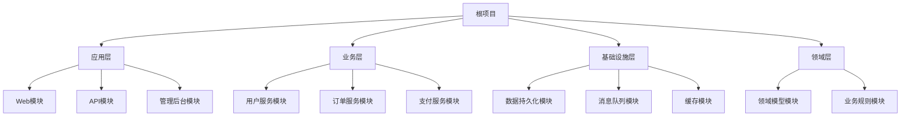
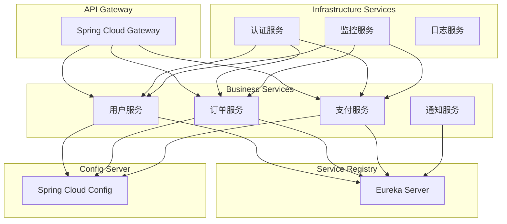
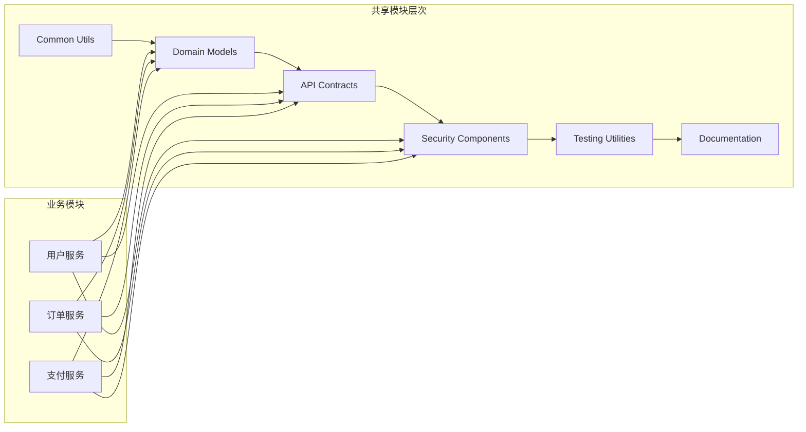
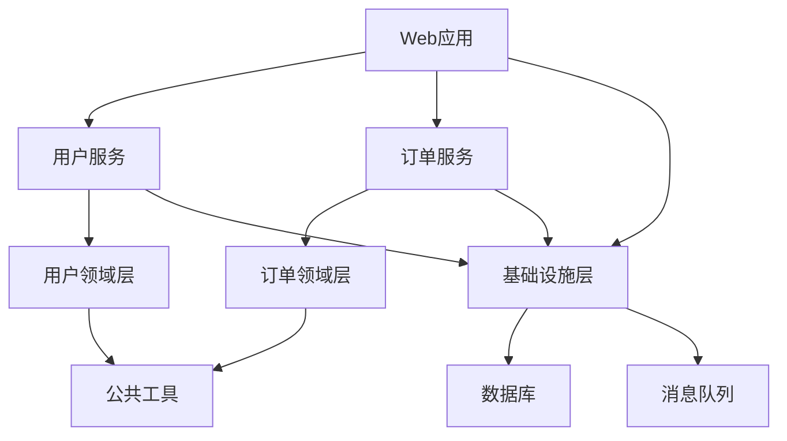

# 第7章：多项目构建

## 7.1 多项目架构设计

### 7.1.1 单体应用模块化策略

**模块化架构原则：**

在企业级应用开发中，单体应用的模块化是提高代码可维护性和团队协作效率的重要策略。与Maven的多模块项目相比，Gradle提供了更灵活的模块化方案。



**单体应用模块化示例：**

```groovy
// settings.gradle - 单体应用模块化配置
rootProject.name = 'enterprise-monolith'

// 应用层模块
include 'application:web'
include 'application:api'
include 'application:admin'
include 'application:batch'

// 业务层模块
include 'service:user'
include 'service:order'
include 'service:payment'
include 'service:notification'

// 基础设施层模块
include 'infrastructure:persistence'
include 'infrastructure:messaging'
include 'infrastructure:cache'
include 'infrastructure:security'

// 领域层模块
include 'domain:core'
include 'domain:user'
include 'domain:order'
include 'domain:payment'

// 工具库模块
include 'common:utils'
include 'common:validation'
include 'common:exception'

// 测试支持模块
include 'test:integration'
include 'test:performance'
```

```groovy
// build.gradle (根项目) - 模块化架构配置

// 1. 依赖版本管理
dependencyManagement {
    imports {
        mavenBom 'org.springframework.boot:spring-boot-dependencies:3.2.0'
        mavenBom 'org.springframework.cloud:spring-cloud-dependencies:2023.0.0'
    }
}

// 2. 模块依赖策略
subprojects { subproject ->
    // 所有模块的基础配置
    apply plugin: 'java-library'
    apply plugin: 'groovy'

    java {
        sourceCompatibility = JavaVersion.VERSION_17
        withSourcesJar()
        withJavadocJar()
    }

    repositories {
        mavenCentral()
    }

    dependencies {
        // 通用依赖
        implementation 'org.slf4j:slf4j-api'
        implementation 'org.apache.commons:commons-lang3'

        // 测试依赖
        testImplementation 'org.junit.jupiter:junit-jupiter'
        testImplementation 'org.mockito:mockito-core'
        testImplementation 'org.spockframework:spock-core'
    }
}

// 3. 架构层次依赖规则
configure(subprojects.findAll { it.path.startsWith(':domain') }) { domainModule ->
    group = 'com.example.enterprise.domain'

    dependencies {
        // 领域层不依赖任何其他业务层
        // 只依赖基础设施和工具库
        implementation project(':common:utils')
        implementation project(':common:exception')

        compileOnly 'org.projectlombok:lombok'
        annotationProcessor 'org.projectlombok:lombok'
    }
}

configure(subprojects.findAll { it.path.startsWith(':infrastructure') }) { infraModule ->
    group = 'com.example.enterprise.infrastructure'

    dependencies {
        // 基础设施层依赖领域层
        implementation project(':domain:core')

        if (infraModule.name == 'persistence') {
            implementation 'org.springframework.boot:spring-boot-starter-data-jpa'
            implementation 'org.springframework.boot:spring-boot-starter-data-redis'
            runtimeOnly 'mysql:mysql-connector-java'
            runtimeOnly 'com.h2database:h2'
        }

        if (infraModule.name == 'messaging') {
            implementation 'org.springframework.boot:spring-boot-starter-amqp'
            implementation 'org.springframework.kafka:spring-kafka'
        }

        if (infraModule.name == 'cache') {
            implementation 'org.springframework.boot:spring-boot-starter-cache'
            implementation 'org.springframework.boot:spring-boot-starter-data-redis'
        }

        if (infraModule.name == 'security') {
            implementation 'org.springframework.boot:spring-boot-starter-security'
            implementation 'org.springframework.boot:spring-boot-starter-oauth2-resource-server'
        }
    }
}

configure(subprojects.findAll { it.path.startsWith(':service') }) { serviceModule ->
    group = 'com.example.enterprise.service'

    dependencies {
        // 服务层依赖领域层和基础设施层
        implementation project(':domain:core')
        implementation project(':infrastructure:persistence')
        implementation project(':infrastructure:messaging')

        // Spring Boot依赖
        implementation 'org.springframework.boot:spring-boot-starter'
        implementation 'org.springframework.boot:spring-boot-starter-actuator'

        // 特定服务依赖
        if (serviceModule.name == 'user') {
            implementation project(':domain:user')
        }

        if (serviceModule.name == 'order') {
            implementation project(':domain:order')
            implementation project(':infrastructure:cache')
        }

        if (serviceModule.name == 'payment') {
            implementation project(':domain:payment')
            implementation 'org.springframework.boot:spring-boot-starter-validation'
        }
    }
}

configure(subprojects.findAll { it.path.startsWith(':application') }) { appModule ->
    group = 'com.example.enterprise.application'

    apply plugin: 'org.springframework.boot'

    dependencies {
        // 应用层依赖服务层
        implementation project(':service:user')
        implementation project(':service:order')
        implementation project(':service:payment')

        // Web相关依赖
        if (appModule.name == 'web') {
            implementation 'org.springframework.boot:spring-boot-starter-web'
            implementation 'org.springframework.boot:spring-boot-starter-thymeleaf'
            developmentOnly 'org.springframework.boot:spring-boot-devtools'
        }

        if (appModule.name == 'api') {
            implementation 'org.springframework.boot:spring-boot-starter-web'
            implementation 'org.springdoc:springdoc-openapi-starter-webmvc-ui:2.2.0'
        }

        if (appModule.name == 'admin') {
            implementation 'org.springframework.boot:spring-boot-starter-web'
            implementation 'org.springframework.boot:spring-boot-starter-security'
        }

        if (appModule.name == 'batch') {
            implementation 'org.springframework.boot:spring-boot-starter-batch'
        }
    }
}
```

### 7.1.2 微服务项目组织

**微服务架构设计：**



**微服务项目结构：**

```groovy
// settings.gradle - 微服务项目配置
rootProject.name = 'microservices-platform'

// 基础设施服务
include 'infrastructure:eureka-server'
include 'infrastructure:config-server'
include 'infrastructure:api-gateway'
include 'infrastructure:auth-service'

// 业务服务
include 'service:user-service'
include 'service:order-service'
include 'service:payment-service'
include 'service:notification-service'

// 支撑服务
include 'support:monitoring-service'
include 'support:logging-service'

// 共享库
include 'shared:common-api'
include 'shared:security'
include 'shared:testing'
include 'shared:documentation'

// 部署配置
include 'deployment:docker-compose'
include 'deployment:kubernetes'
```

```groovy
// build.gradle (根项目) - 微服务构建配置

// 1. 版本统一管理
ext {
    set('springCloudVersion', '2023.0.0')
    set('testContainersVersion', '1.19.3')
    set('otelVersion', '1.32.0')
}

// 2. 微服务通用配置
subprojects { subproject ->
    apply plugin: 'java-library'
    apply plugin: 'org.springframework.boot'
    apply plugin: 'io.spring.dependency-management'

    java {
        sourceCompatibility = JavaVersion.VERSION_17
    }

    configurations {
        compileOnly {
            extendsFrom annotationProcessor
        }
    }

    repositories {
        mavenCentral()
    }

    dependencyManagement {
        imports {
            mavenBom "org.springframework.cloud:spring-cloud-dependencies:${springCloudVersion}"
            mavenBom "org.testcontainers:testcontainers-bom:${testContainersVersion}"
        }
    }

    dependencies {
        // Spring Boot基础
        implementation 'org.springframework.boot:spring-boot-starter'
        implementation 'org.springframework.boot:spring-boot-starter-actuator'

        // 配置客户端
        implementation 'org.springframework.cloud:spring-cloud-starter-config'

        // 服务注册
        implementation 'org.springframework.cloud:spring-cloud-starter-netflix-eureka-client'

        // 负载均衡
        implementation 'org.springframework.cloud:spring-cloud-starter-loadbalancer'

        // 链路追踪
        implementation 'io.opentelemetry:opentelemetry-api'
        implementation 'io.opentelemetry:opentelemetry-sdk'

        // 通用工具
        compileOnly 'org.projectlombok:lombok'
        annotationProcessor 'org.projectlombok:lombok'

        // 测试
        testImplementation 'org.springframework.boot:spring-boot-starter-test'
        testImplementation 'org.testcontainers:junit-jupiter'
        testImplementation 'org.testcontainers:testcontainers'
    }

    // 测试配置
    test {
        useJUnitPlatform()

        systemProperty 'spring.profiles.active', 'test'
        systemProperty 'spring.cloud.config.enabled', 'false'
        systemProperty 'eureka.client.enabled', 'false'

        testLogging {
            events 'passed', 'skipped', 'failed'
        }
    }
}

// 3. 服务特定配置
configure([
    project(':service:user-service'),
    project(':service:order-service'),
    project(':service:payment-service')
]) { serviceProject ->

    dependencies {
        // Web支持
        implementation 'org.springframework.boot:spring-boot-starter-web'

        // 数据访问
        implementation 'org.springframework.boot:spring-boot-starter-data-jpa'
        runtimeOnly 'mysql:mysql-connector-java'
        runtimeOnly 'com.h2database:h2' // 测试用

        // 缓存
        implementation 'org.springframework.boot:spring-boot-starter-data-redis'

        // 消息队列
        implementation 'org.springframework.boot:spring-boot-starter-amqp'

        // 验证
        implementation 'org.springframework.boot:spring-boot-starter-validation'

        // API文档
        implementation 'org.springdoc:springdoc-openapi-starter-webmvc-ui:2.2.0'
    }

    // Docker镜像构建
    bootBuildImage {
        imageName = "${project.name}:${project.version}"
    }
}

// 4. 基础设施服务配置
configure([
    project(':infrastructure:eureka-server'),
    project(':infrastructure:config-server'),
    project(':infrastructure:auth-service')
]) { infraProject ->

    dependencies {
        implementation 'org.springframework.boot:spring-boot-starter-web'
        implementation 'org.springframework.cloud:spring-cloud-starter-netflix-eureka-server'
    }

    if (infraProject.name == 'config-server') {
        dependencies {
            implementation 'org.springframework.cloud:spring-cloud-config-server'
            implementation 'org.springframework.boot:spring-boot-starter-security'
        }
    }

    if (infraProject.name == 'auth-service') {
        dependencies {
            implementation 'org.springframework.boot:spring-boot-starter-security'
            implementation 'org.springframework.boot:spring-boot-starter-oauth2-authorization-server'
            implementation 'org.springframework.boot:spring-boot-starter-data-jpa'
            runtimeOnly 'mysql:mysql-connector-java'
        }
    }
}

// 5. 共享库配置
configure(subprojects.findAll { it.path.startsWith(':shared') }) { sharedProject ->

    dependencies {
        // 不依赖Spring Boot，只提供基础功能
        implementation 'org.apache.commons:commons-lang3'
        implementation 'com.fasterxml.jackson.core:jackson-databind'

        compileOnly 'org.projectlombok:lombok'
        annotationProcessor 'org.projectlombok:lombok'
    }

    if (sharedProject.name == 'common-api') {
        dependencies {
            implementation 'jakarta.validation:jakarta.validation-api'
            implementation 'org.springdoc:springdoc-openapi-starter-common:2.2.0'
        }
    }

    if (sharedProject.name == 'security') {
        dependencies {
            implementation 'org.springframework.security:spring-security-core'
            implementation 'io.jsonwebtoken:jjwt-api:0.12.3'
            runtimeOnly 'io.jsonwebtoken:jjwt-impl:0.12.3'
            runtimeOnly 'io.jsonwebtoken:jjwt-jackson:0.12.3'
        }
    }

    if (sharedProject.name == 'testing') {
        dependencies {
            testImplementation 'org.springframework.boot:spring-boot-starter-test'
            testImplementation 'org.testcontainers:junit-jupiter'
            testImplementation 'org.testcontainers:mysql'
            testImplementation 'org.testcontainers:rabbitmq'
        }
    }
}
```

### 7.1.3 共享模块设计

**共享模块架构：**



**共享模块实现：**

```groovy
// settings.gradle - 共享模块配置
include 'common:core-utils'
include 'common:domain-events'
include 'common:api-contracts'
include 'common:security'
include 'common:validation'
include 'common:testing-support'
include 'common:migration-scripts'

// build.gradle (common目录) - 共享模块配置
subprojects { subproject ->
    apply plugin: 'java-library'
    apply plugin: 'maven-publish'

    group = 'com.example.microservices.common'
    version = '1.0.0-SNAPSHOT'

    java {
        sourceCompatibility = JavaVersion.VERSION_17
        withSourcesJar()
        withJavadocJar()
    }

    repositories {
        mavenCentral()
    }

    // 发布到私有仓库
    publishing {
        publications {
            maven(MavenPublication) {
                from components.java

                pom {
                    name.set('Microservices Common Library - ' + project.name)
                    description.set('Shared components for microservices platform')
                }
            }
        }

        repositories {
            maven {
                name = 'CompanyRepo'
                url = 'https://repo.company.com/maven2'
                credentials {
                    username = System.getenv('MAVEN_REPO_USER')
                    password = System.getenv('MAVEN_REPO_PASSWORD')
                }
            }
        }
    }
}

// 1. 核心工具模块
project(':common:core-utils') {
    description = 'Core utility classes and helpers'

    dependencies {
        implementation 'org.apache.commons:commons-lang3'
        implementation 'org.apache.commons:commons-collections4'
        implementation 'com.fasterxml.jackson.core:jackson-core'
        implementation 'com.fasterxml.jackson.core:jackson-databind'
        implementation 'com.fasterxml.jackson.datatype:jackson-datatype-jsr310'

        compileOnly 'org.projectlombok:lombok'
        annotationProcessor 'org.projectlombok:lombok'
    }
}

// 2. 领域事件模块
project(':common:domain-events') {
    description = 'Domain event framework'

    dependencies {
        implementation project(':common:core-utils')
        implementation 'org.springframework:spring-context'
        implementation 'org.springframework:spring-messaging'

        compileOnly 'org.projectlombok:lombok'
        annotationProcessor 'org.projectlombok:lombok'
    }
}

// 3. API契约模块
project(':common:api-contracts') {
    description = 'API contracts and DTOs'

    dependencies {
        implementation project(':common:core-utils')
        implementation 'jakarta.validation:jakarta.validation-api'
        implementation 'jakarta.servlet:jakarta.servlet-api'
        implementation 'org.springdoc:springdoc-openapi-starter-common:2.2.0'

        compileOnly 'org.projectlombok:lombok'
        annotationProcessor 'org.projectlombok:lombok'
    }
}

// 4. 安全模块
project(':common:security') {
    description = 'Security components and utilities'

    dependencies {
        implementation project(':common:core-utils')
        implementation 'org.springframework.security:spring-security-core'
        implementation 'org.springframework.security:spring-security-web'
        implementation 'io.jsonwebtoken:jjwt-api:0.12.3'
        runtimeOnly 'io.jsonwebtoken:jjwt-impl:0.12.3'
        runtimeOnly 'io.jsonwebtoken:jjwt-jackson:0.12.3'

        compileOnly 'org.projectlombok:lombok'
        annotationProcessor 'org.projectlombok:lombok'
    }
}

// 5. 验证模块
project(':common:validation') {
    description = 'Validation utilities and custom validators'

    dependencies {
        implementation project(':common:core-utils')
        implementation 'jakarta.validation:jakarta.validation-api'
        implementation 'org.hibernate.validator:hibernate-validator'

        compileOnly 'org.projectlombok:lombok'
        annotationProcessor 'org.projectlombok:lombok'
    }
}

// 6. 测试支持模块
project(':common:testing-support') {
    description = 'Testing utilities and fixtures'

    dependencies {
        implementation project(':common:core-utils')
        implementation project(':common:api-contracts')

        testImplementation 'org.springframework.boot:spring-boot-starter-test'
        testImplementation 'org.testcontainers:testcontainers'
        testImplementation 'org.testcontainers:junit-jupiter'
        testImplementation 'org.testcontainers:mysql'
        testImplementation 'org.testcontainers:rabbitmq'
        testImplementation 'org.mockito:mockito-core'
        testImplementation 'com.h2database:h2'
    }
}
```

## 7.2 settings.gradle配置

### 7.2.1 项目包含配置

**项目包含策略：**

```groovy
// settings.gradle - 高级项目包含配置

// 1. 基础项目声明
rootProject.name = 'multi-module-enterprise'

// 2. 标准模块包含
include 'common:utils'
include 'common:domain'
include 'common:security'
include 'infrastructure:persistence'
include 'infrastructure:messaging'
include 'application:web'
include 'application:api'
include 'application:batch'

// 3. 条件化模块包含
if (file('modules/admin').exists()) {
    include 'modules:admin'
}

// 4. 环境特定模块包含
if (System.getenv('ENVIRONMENT') == 'development') {
    include 'tools:dev-support'
    include 'tools:data-generator'
}

// 5. 实验性模块包含
if (project.hasProperty('enableExperimental')) {
    include 'experimental:new-feature'
    include 'experimental:prototype'
}

// 6. 外部模块包含（共享库）
if (file('../shared-libs').exists()) {
    includeBuild '../shared-libs'
}

// 7. 动态模块发现
fileTree(projectDir) {
    include '**/build.gradle'
    exclude '**/buildSrc/**'
    exclude '**/gradle/**'
}.visit { fileDetails ->
    if (fileDetails.isDirectory() && fileDetails.name != 'src') {
        def relativePath = fileDetails.path.replace('\\', '/')
        def moduleName = relativePath.replace('/', ':')

        if (!rootProject.childProjects.containsKey(moduleName)) {
            include moduleName
        }
    }
}
```

### 7.2.2 项目命名策略

**项目命名规范：**

```groovy
// settings.gradle - 项目命名策略配置

// 1. 根项目命名
rootProject.name = 'enterprise-platform'

// 2. 层次化命名
include 'layer:presentation:web'
include 'layer:presentation:api'
include 'layer:business:service'
include 'layer:business:domain'
include 'layer:infrastructure:database'
include 'layer:infrastructure:messaging'

// 3. 功能模块命名
include 'feature:user-management'
include 'feature:order-processing'
include 'feature:payment-gateway'
include 'feature:notification-service'

// 4. 模块重命名
project(':layer:presentation:web').name = 'web-presentation'
project(':layer:business:service').name = 'business-service'
project(':feature:user-management').name = 'user-management-feature'

// 5. 标准化命名函数
def standardizeProjectName(projectName) {
    return projectName.replaceAll(/[:]/, '-').replaceAll(/[_]/, '-')
}

// 应用标准化命名
rootProject.children.each { child ->
    child.name = standardizeProjectName(child.name)
}

// 6. 命名规则验证
gradle.projectsLoaded {
    rootProject.allprojects { project ->
        def namePattern = /^[a-z][a-z0-9-]*$/
        if (!(project.name =~ namePattern)) {
            logger.warn("Project name '${project.name}' does not follow naming convention: $namePattern")
        }
    }
}
```

### 7.2.3 项目元数据配置

**项目元数据管理：**

```groovy
// settings.gradle - 项目元数据配置

// 1. 项目基础信息
gradle.projectsLoaded { gradle ->
    rootProject.allprojects { project ->
        // 设置项目描述
        if (project.name == 'web-presentation') {
            project.description = 'Web presentation layer with Spring MVC'
        } else if (project.name == 'business-service') {
            project.description = 'Business logic and service layer'
        } else if (project.name == 'user-management-feature') {
            project.description = 'User management feature module'
        }

        // 设置项目URL
        project.ext.url = "https://github.com/company/${rootProject.name}/tree/main/${project.projectDir.relativeTo(rootProject.projectDir)}"
    }
}

// 2. 版本信息管理
def loadVersionInfo() {
    def versionFile = file('version.properties')
    if (versionFile.exists()) {
        def properties = new Properties()
        versionFile.withInputStream { properties.load(it) }
        return properties['version'] ?: '1.0.0-SNAPSHOT'
    } else {
        return '1.0.0-SNAPSHOT'
    }
}

// 应用版本信息
rootProject.version = loadVersionInfo()

// 3. 构建信息
gradle.buildFinished { result ->
    def buildInfo = [
        projectName: rootProject.name,
        version: rootProject.version,
        buildTime: new Date().format('yyyy-MM-dd HH:mm:ss'),
        gradleVersion: gradle.gradleVersion,
        javaVersion: System.getProperty('java.version'),
        buildNumber: System.getenv('BUILD_NUMBER') ?: 'LOCAL',
        gitCommit: getGitCommit()
    ]

    def buildInfoFile = file("$rootProject.buildDir/build-info.json")
    buildInfoFile.parentFile.mkdirs()
    buildInfoFile.text = groovy.json.JsonBuilder(buildInfo).toPrettyString()
}

// 获取Git提交信息
def getGitCommit() {
    try {
        def gitFolder = file('.git')
        if (gitFolder.exists()) {
            def headFile = file('.git/HEAD')
            if (headFile.exists()) {
                def ref = headFile.text.trim()
                def refPath = ref.replace('ref: ', '')
                def commitFile = file(".git/$refPath")
                if (commitFile.exists()) {
                    return commitFile.text.trim()
                }
            }
        }
    } catch (Exception e) {
        logger.debug("Failed to get git commit: ${e.message}")
    }
    return 'unknown'
}
```

## 7.3 子项目配置

### 7.3.1 subprojects配置

**通用子项目配置：**

```groovy
// build.gradle - subprojects通用配置

// 1. 所有子项目基础配置
subprojects { subproject ->
    // 应用基础插件
    apply plugin: 'java-library'
    apply plugin: 'groovy'
    apply plugin: 'maven-publish'
    apply plugin: 'signing'

    // Java配置
    java {
        sourceCompatibility = JavaVersion.VERSION_17
        targetCompatibility = JavaVersion.VERSION_17

        withSourcesJar()
        withJavadocJar()
    }

    // 组ID和版本
    group = 'com.example.enterprise'
    version = rootProject.version

    // 仓库配置
    repositories {
        mavenCentral()
        maven {
            name = 'CompanyMaven'
            url = 'https://repo.company.com/maven2'
            credentials {
                username = System.getenv('MAVEN_USERNAME')
                password = System.getenv('MAVEN_PASSWORD')
            }
        }
    }

    // 依赖管理
    dependencyManagement {
        imports {
            mavenBom 'org.springframework.boot:spring-boot-dependencies:3.2.0'
            mavenBom 'org.springframework.cloud:spring-cloud-dependencies:2023.0.0'
            mavenBom 'org.testcontainers:testcontainers-bom:1.19.3'
        }

        dependencies {
            dependency 'org.apache.commons:commons-lang3:3.13.0'
            dependency 'com.google.guava:guava:32.1.3-jre'
            dependency 'org.slf4j:slf4j-api:2.0.9'
        }
    }

    // 通用依赖
    dependencies {
        // 编译时依赖
        api 'org.slf4j:slf4j-api'
        implementation 'org.apache.commons:commons-lang3'

        // 注解处理
        compileOnly 'org.projectlombok:lombok'
        annotationProcessor 'org.projectlombok:lombok'
        testCompileOnly 'org.projectlombok:lombok'
        testAnnotationProcessor 'org.projectlombok:lombok'

        // 测试依赖
        testImplementation 'org.junit.jupiter:junit-jupiter'
        testImplementation 'org.mockito:mockito-core'
        testImplementation 'org.assertj:assertj-core'
        testImplementation 'org.spockframework:spock-core:2.4-M1-groovy-4.0'
    }

    // 测试配置
    test {
        useJUnitPlatform()

        // JVM参数
        jvmArgs = [
            '-Dspring.profiles.active=test',
            '-Dfile.encoding=UTF-8',
            '-Djava.awt.headless=true'
        ]

        // 系统属性
        systemProperty 'test.groups', System.getProperty('test.groups', '')
        systemProperty 'test.timeout', System.getProperty('test.timeout', '300')

        // 测试日志
        testLogging {
            events 'passed', 'skipped', 'failed'
            exceptionFormat 'full'
            showStandardStreams = false
        }

        // 并行测试
        maxParallelForks = Runtime.runtime.availableProcessors().intdiv(2) ?: 1

        // 内存配置
        maxHeapSize = '1g'
    }

    // 编译配置
    tasks.withType(JavaCompile).configureEach {
        options.encoding = 'UTF-8'
        options.compilerArgs += [
            '-Xlint:unchecked',
            '-Xlint:deprecation',
            '-parameters'
        ]
        options.incremental = true
    }

    // 发布配置
    publishing {
        publications {
            mavenJava(MavenPublication) {
                from components.java

                pom {
                    name.set(project.name)
                    description.set(project.description ?: 'Enterprise platform module')
                    url.set('https://github.com/company/enterprise-platform')

                    licenses {
                        license {
                            name.set('The Apache License, Version 2.0')
                            url.set('http://www.apache.org/licenses/LICENSE-2.0.txt')
                        }
                    }

                    developers {
                        developer {
                            id.set('enterprise-team')
                            name.set('Enterprise Platform Team')
                            email.set('enterprise@example.com')
                        }
                    }

                    scm {
                        connection.set('scm:git:git://github.com/company/enterprise-platform.git')
                        developerConnection.set('scm:git:ssh://github.com:company/enterprise-platform.git')
                        url.set('https://github.com/company/enterprise-platform/tree/main')
                    }
                }
            }
        }
    }

    // 签名配置（发布时）
    signing {
        required { project.hasProperty('signing.keyId') }
        sign publishing.publications.mavenJava
    }
}

// 2. 条件化子项目配置
subprojects { subproject ->
    // 根据项目路径配置
    if (subproject.path.startsWith(':common')) {
        // 公共模块配置
        subproject.dependencies {
            // 公共模块不依赖Spring Boot
            // 只提供基础功能
        }
    }

    if (subproject.path.startsWith(':infrastructure')) {
        // 基础设施模块配置
        subproject.dependencies {
            implementation 'org.springframework.boot:spring-boot-starter'
            implementation 'org.springframework.boot:spring-boot-starter-actuator'
        }
    }

    if (subproject.path.startsWith(':application')) {
        // 应用模块配置
        subproject.apply plugin: 'org.springframework.boot'

        subproject.dependencies {
            implementation 'org.springframework.boot:spring-boot-starter-web'
            developmentOnly 'org.springframework.boot:spring-boot-devtools'
        }
    }
}
```

### 7.3.2 allprojects配置

**全局项目配置：**

```groovy
// build.gradle - allprojects全局配置

// 1. 所有项目（包括根项目）的基础配置
allprojects { project ->
    // 项目基础信息
    group = 'com.example.enterprise'
    version = rootProject.version

    // 扩展属性
    ext {
        // 构建信息
        buildTimestamp = new Date().format('yyyy-MM-dd HH:mm:ss')
        buildNumber = System.getenv('BUILD_NUMBER') ?: 'LOCAL'
        gitCommit = getGitCommit()

        // 版本信息
        springBootVersion = '3.2.0'
        springCloudVersion = '2023.0.0'
        javaVersion = JavaVersion.VERSION_17

        // 仓库配置
        mavenRepoUrl = System.getenv('MAVEN_REPO_URL') ?: 'https://repo.company.com/maven2'

        // 测试配置
        testContainersVersion = '1.19.3'
    }

    // 仓库配置
    repositories {
        mavenCentral()
        maven {
            name = 'CompanyMaven'
            url = project.mavenRepoUrl
            credentials {
                username = System.getenv('MAVEN_USERNAME')
                password = System.getenv('MAVEN_PASSWORD')
            }
        }

        // 快照仓库
        maven {
            name = 'CompanySnapshots'
            url = "${project.mavenRepoUrl}-snapshots"
            credentials {
                username = System.getenv('MAVEN_USERNAME')
                password = System.getenv('MAVEN_PASSWORD')
            }
        }
    }

    // 任务配置
    tasks.withType(Test).configureEach {
        // 系统属性
        systemProperty 'build.timestamp', project.buildTimestamp
        systemProperty 'build.number', project.buildNumber
        systemProperty 'git.commit', project.gitCommit

        // 环境变量
        environment 'BUILD_TIMESTAMP', project.buildTimestamp
        environment 'BUILD_NUMBER', project.buildNumber
    }

    // 清理任务扩展
    clean {
        doLast {
            println "Cleaned project: ${project.name}"
        }
    }
}

// 2. 全局任务定义
allprojects {
    // 项目信息任务
    task showProjectInfo {
        group = 'help'
        description = 'Show project information'

        doLast {
            println """
            === Project Information ===
            Name: ${project.name}
            Group: ${project.group}
            Version: ${project.version}
            Description: ${project.description ?: 'No description'}
            Path: ${project.path}
            Directory: ${project.projectDir}
            Build Timestamp: ${project.buildTimestamp}
            Build Number: ${project.buildNumber}
            Git Commit: ${project.gitCommit}
            ===========================
            """
        }
    }

    // 依赖树任务
    task showDependencyTree {
        group = 'help'
        description = 'Show dependency tree'

        doLast {
            if (project.hasProperty('configurations')) {
                configurations.each { config ->
                    if (config.canBeResolved) {
                        println "=== ${config.name} ==="
                        config.incoming.resolutionResult.allDependencies.each { dep ->
                            if (dep instanceof ResolvedDependencyResult) {
                                println "  ${dep.selected.moduleGroup}:${dep.selected.moduleName}:${dep.selected.moduleVersion}"
                            }
                        }
                        println ""
                    }
                }
            }
        }
    }
}

// 3. 构建生命周期钩子
gradle.projectsLoaded { gradle ->
    println "=== Projects Loaded ==="
    println "Root project: ${gradle.rootProject.name}"
    println "Total projects: ${gradle.rootProject.subprojects.size()}"
    println ""
}

gradle.taskGraph.whenReady { graph ->
    println "=== Task Graph Ready ==="
    println "Requested tasks: ${graph.entryTasks.collect { it.name }}"
    println "Total tasks to execute: ${graph.allTasks.size()}"
    println ""
}

gradle.buildFinished { result ->
    println "=== Build Finished ==="
    println "Result: ${result.failure ? 'FAILED' : 'SUCCESS'}"
    println "Build time: ${new Date().format('yyyy-MM-dd HH:mm:ss')}"

    if (result.failure) {
        println "Failure: ${result.failure}"
    }
}

// 4. 全局工具方法
def getGitCommit() {
    try {
        def gitFolder = file('.git')
        if (gitFolder.exists()) {
            def headFile = file('.git/HEAD')
            if (headFile.exists()) {
                def ref = headFile.text.trim()
                def refPath = ref.replace('ref: ', '')
                def commitFile = file(".git/$refPath")
                if (commitFile.exists()) {
                    return commitFile.text.trim().take(8)
                }
            }
        }
    } catch (Exception e) {
        logger.debug("Failed to get git commit: ${e.message}")
    }
    return 'unknown'
}
```

### 7.3.3 项目特定配置

**分层项目特定配置：**

```groovy
// build.gradle - 项目特定配置示例

// 1. 公共模块配置
configure(subprojects.findAll { it.path.startsWith(':common') }) { commonModule ->
    dependencies {
        // 公共模块只依赖基础库
        api 'org.apache.commons:commons-lang3'
        api 'com.google.guava:guava'
        api 'org.slf4j:slf4j-api'

        compileOnly 'org.projectlombok:lombok'
        annotationProcessor 'org.projectlombok:lombok'
    }

    // 测试配置
    test {
        // 公共模块测试不依赖Spring
        useJUnitPlatform()

        // 测试覆盖率要求
        jacoco {
            toolVersion = "0.8.8"
            reportsDirectory = layout.buildDirectory.dir('reports/jacoco')
        }
    }
}

// 2. 领域层配置
configure(subprojects.findAll { it.path.startsWith(':domain') }) { domainModule ->
    dependencies {
        // 领域层依赖公共模块
        implementation project(':common:utils')
        implementation project(':common:validation')

        // 不依赖基础设施层
        compileOnly 'org.projectlombok:lombok'
        annotationProcessor 'org.projectlombok:lombok'
    }

    // 领域层特定任务
    task generateDomainEvents {
        description = 'Generate domain event documentation'
        group = 'documentation'

        doLast {
            def domainDir = file('src/main/java')
            def eventFiles = fileTree(domainDir) {
                include '**/*Event.java'
            }

            def reportFile = file("$buildDir/reports/domain-events.md")
            reportFile.parentFile.mkdirs()

            reportFile.text = "# Domain Events\n\n"
            eventFiles.each { file ->
                def className = file.name.replace('.java', '')
                reportFile.text += "## $className\n"
                reportFile.text += "File: ${file.path}\n\n"
            }

            println "Domain events documentation generated: ${reportFile.absolutePath}"
        }
    }
}

// 3. 基础设施层配置
configure(subprojects.findAll { it.path.startsWith(':infrastructure') }) { infraModule ->
    dependencies {
        // 基础设施层依赖领域层
        implementation project(':domain:core')
        implementation project(':common:utils')

        // Spring Boot依赖
        implementation 'org.springframework.boot:spring-boot-starter'
        implementation 'org.springframework.boot:spring-boot-starter-actuator'

        // 特定基础设施依赖
        if (infraModule.name == 'persistence') {
            implementation 'org.springframework.boot:spring-boot-starter-data-jpa'
            runtimeOnly 'mysql:mysql-connector-java'
            runtimeOnly 'com.h2database:h2'

            // Flyway数据库迁移
            implementation 'org.flywaydb:flyway-core'
            implementation 'org.flywaydb:flyway-mysql'
        }

        if (infraModule.name == 'messaging') {
            implementation 'org.springframework.boot:spring-boot-starter-amqp'
            implementation 'org.springframework.kafka:spring-kafka'
        }

        if (infraModule.name == 'cache') {
            implementation 'org.springframework.boot:spring-boot-starter-cache'
            implementation 'org.springframework.boot:spring-boot-starter-data-redis'
        }
    }

    // 基础设施层特定任务
    if (infraModule.name == 'persistence') {
        // 数据库迁移任务
        task migrateDatabase(type: JavaExec) {
            group = 'database'
            description = 'Run database migrations'

            classpath = sourceSets.main.runtimeClasspath
            mainClass.set('org.flywaydb.commandline.Main')

            args = [
                '-url', 'jdbc:mysql://localhost:3306/mydb',
                '-user', 'root',
                '-password', 'password',
                'migrate'
            ]
        }

        // 数据库文档生成
        task generateDatabaseDoc {
            description = 'Generate database documentation'
            group = 'documentation'

            doLast {
                // 使用SchemaSpy等工具生成数据库文档
                println "Database documentation generation task"
            }
        }
    }
}

// 4. 应用层配置
configure(subprojects.findAll { it.path.startsWith(':application') }) { appModule ->
    apply plugin: 'org.springframework.boot'

    dependencies {
        // 应用层依赖业务层
        implementation project(':service:user')
        implementation project(':service:order')
        implementation project(':infrastructure:persistence')
        implementation project(':common:security')

        // Web依赖
        implementation 'org.springframework.boot:spring-boot-starter-web'
        implementation 'org.springframework.boot:spring-boot-starter-validation'

        // 开发工具
        developmentOnly 'org.springframework.boot:spring-boot-devtools'
        annotationProcessor 'org.springframework.boot:spring-boot-configuration-processor'

        // API文档
        implementation 'org.springdoc:springdoc-openapi-starter-webmvc-ui:2.2.0'
    }

    // 应用层特定任务
    bootRun {
        // 开发环境配置
        args = ['--spring.profiles.active=dev']
        jvmArgs = [
            '-Dspring.devtools.restart.enabled=true',
            '-Dspring.devtools.livereload.enabled=true'
        ]

        // 环境变量
        environment 'APP_ENV', 'development'
    }

    // Docker镜像构建
    bootBuildImage {
        imageName = "${project.name}:${project.version}"

        builder = 'paketobuildpacks/builder:base'

        environment = [
            'BP_JVM_VERSION': '17',
            'BP_JVM_TYPE': 'JRE'
        ]
    }

    // 健康检查
    task healthCheck(type: JavaExec) {
        group = 'application'
        description = 'Check application health'

        classpath = sourceSets.main.runtimeClasspath
        mainClass.set('org.springframework.boot.loader.JarLauncher')

        args = ['--spring.profiles.active=test']

        doLast {
            // 执行健康检查逻辑
            println "Health check completed"
        }
    }
}

// 5. 测试模块配置
configure(subprojects.findAll { it.path.startsWith(':test') }) { testModule ->
    dependencies {
        // 测试模块依赖应用模块
        implementation project(':application:web')
        implementation project(':application:api')

        // 测试依赖
        testImplementation 'org.springframework.boot:spring-boot-starter-test'
        testImplementation 'org.testcontainers:junit-jupiter'
        testImplementation 'org.testcontainers:mysql'
        testImplementation 'org.testcontainers:rabbitmq'
        testImplementation 'com.github.tomakehurst:wiremock-jre8:2.35.0'

        // 性能测试
        testImplementation 'org.gatling:gatling-core:3.9.5'
        testImplementation 'org.gatling:gatling-http:3.9.5'
    }

    // 集成测试配置
    task integrationTest(type: Test) {
        description = 'Run integration tests'
        group = 'verification'

        testClassesDirs = sourceSets.test.output.classesDirs
        classpath = sourceSets.test.runtimeClasspath

        useJUnitPlatform()

        include '**/*IntegrationTest.class'
        exclude '**/*UnitTest.class'

        // TestContainers配置
        systemProperty 'testcontainers.reuse.enable', 'true'

        // 并行执行
        maxParallelForks = 2
    }

    // 性能测试
    task performanceTest(type: JavaExec) {
        description = 'Run performance tests'
        group = 'verification'

        classpath = sourceSets.test.runtimeClasspath
        mainClass.set('io.gatling.app.Gatling')

        args = [
            '-s', 'src/test/gatling/simulations',
            '-rf', 'build/reports/gatling'
        ]
    }
}
```

## 7.4 项目间依赖管理

### 7.4.1 项目依赖声明

**项目依赖最佳实践：**



```groovy
// build.gradle - 项目依赖管理

// 1. 基础项目依赖声明
dependencies {
    // 依赖同项目的其他模块
    implementation project(':common:utils')
    implementation project(':common:security')

    // 依赖特定配置的项目依赖
    testImplementation project(path: ':common:test-utils', configuration: 'testArtifacts')

    // 条件化项目依赖
    if (project.hasProperty('includeApiModule')) {
        implementation project(':application:api')
    }
}

// 2. 项目依赖配置示例
project(':application:web') {
    dependencies {
        // Web应用依赖服务层
        implementation project(':service:user')
        implementation project(':service:order')
        implementation project(':service:payment')

        // 依赖基础设施层
        implementation project(':infrastructure:persistence')
        implementation project(':infrastructure:messaging')

        // 依赖公共模块
        implementation project(':common:security')
        implementation project(':common:validation')

        // 开发时依赖
        developmentOnly project(':tools:dev-support')

        // 测试时依赖
        testImplementation project(':test:integration')
    }
}

// 3. 服务层依赖配置
project(':service:user') {
    dependencies {
        // 服务层依赖领域层
        implementation project(':domain:user')
        implementation project(':domain:core')

        // 依赖基础设施层
        implementation project(':infrastructure:persistence')
        implementation project(':infrastructure:messaging')
        implementation project(':infrastructure:cache')

        // 依赖公共模块
        implementation project(':common:utils')
        implementation project(':common:validation')
    }
}

// 4. 领域层依赖配置
project(':domain:user') {
    dependencies {
        // 领域层只依赖公共模块
        implementation project(':common:core')
        implementation project(':common:validation')

        // 编译时依赖
        compileOnly 'org.projectlombok:lombok'
        annotationProcessor 'org.projectlombok:lombok'

        // 领域层不依赖任何基础设施
        // 保持纯粹性
    }
}

// 5. 依赖冲突解决
subprojects { subproject ->
    configurations.all {
        resolutionStrategy {
            // 强制统一版本
            force 'com.fasterxml.jackson.core:jackson-core'
            force 'com.fasterxml.jackson.core:jackson-databind'

            // 依赖替换
            dependencySubstitution {
                substitute module('commons-logging:commons-logging')
                    with module('org.slf4j:jcl-over-slf4j')
            }

            // 项目依赖优先
            eachDependency { details ->
                if (details.requested.group == 'com.example.enterprise') {
                    details.useVersion subproject.version
                }
            }
        }
    }
}

// 6. 依赖可视化任务
task visualizeDependencies {
    description 'Generate dependency graph'
    group = 'documentation'

    doLast {
        def dotFile = file("$buildDir/dependencies.dot")
        dotFile.parentFile.mkdirs()

        dotFile.text = "digraph dependencies {\n"
        dotFile.text += "    rankdir=TB;\n"
        dotFile.text += "    node [shape=box];\n\n"

        // 添加项目节点
        rootProject.subprojects.each { project ->
            dotFile.text += "    \"${project.name}\";\n"
        }

        dotFile.text += "\n"

        // 添加依赖关系
        rootProject.subprojects.each { project ->
            if (project.hasProperty('configurations')) {
                project.configurations.implementation.dependencies.each { dep ->
                    if (dep instanceof ProjectDependency) {
                        dotFile.text += "    \"${project.name}\" -> \"${dep.dependencyProject.name}\";\n"
                    }
                }
            }
        }

        dotFile.text += "}\n"

        println "Dependency graph generated: ${dotFile.absolutePath}"
        println "Use 'dot -Tpng dependencies.dot -o dependencies.png' to generate image"
    }
}
```

### 7.4.2 依赖传递控制

**传递依赖管理策略：**

```groovy
// build.gradle - 传递依赖控制

// 1. 全局传递依赖配置
subprojects { subproject ->
    configurations {
        implementation {
            // 控制传递依赖
            transitive = true

            // 排除特定传递依赖
            exclude group: 'org.springframework.boot', module: 'spring-boot-starter-tomcat'
            exclude group: 'org.apache.logging.log4j', module: 'log4j-to-slf4j'
        }

        api {
            // API依赖的传递性
            transitive = true
        }

        compileOnly {
            // 编译时依赖不传递
            transitive = false
        }

        runtimeOnly {
            // 运行时依赖
            transitive = true
        }

        testImplementation {
            // 测试依赖排除
            exclude group: 'org.junit.vintage', module: 'junit-vintage-engine'
        }
    }
}

// 2. 项目依赖传递控制
project(':application:web') {
    dependencies {
        // 明确的项目依赖声明
        implementation project(':service:user')
        implementation project(':service:order')

        // 控制项目依赖的传递性
        implementation(project(':infrastructure:persistence')) {
            // 排除特定的传递依赖
            exclude group: 'org.hibernate', module: 'hibernate-validator'

            // 强制版本
            force = true
        }

        // 非传递性依赖
        compileOnly project(':common:annotations') {
            transitive = false
        }
    }
}

// 3. 传递依赖分析任务
task analyzeTransitiveDependencies {
    description 'Analyze transitive dependencies'
    group = 'analysis'

    doLast {
        rootProject.subprojects.each { project ->
            println "=== ${project.name} Transitive Dependencies ==="

            project.configurations.implementation.resolvedConfiguration.firstLevelModuleDependencies.each { dep ->
                println "${dep.moduleGroup}:${dep.moduleName}:${dep.moduleVersion}"

                dep.children.each { child ->
                    println "  └── ${child.moduleGroup}:${child.moduleName}:${child.moduleVersion}"

                    child.children.each { grandChild ->
                        println "      └── ${grandChild.moduleGroup}:${grandChild.moduleName}:${grandChild.moduleVersion}"
                    }
                }
            }
            println ""
        }
    }
}

// 4. 依赖冲突检测任务
task detectDependencyConflicts {
    description 'Detect and report dependency conflicts'
    group = 'analysis'

    doLast {
        def conflicts = [:]

        rootProject.subprojects.each { project ->
            project.configurations.implementation.resolvedConfiguration.lenientConfiguration.allDependencies.each { dep ->
                if (dep instanceof ResolvedDependencyResult) {
                    def key = "${dep.selected.moduleGroup}:${dep.selected.moduleName}"
                    if (!conflicts.containsKey(key)) {
                        conflicts[key] = []
                    }
                    conflicts[key] << [
                        version: dep.selected.moduleVersion,
                        project: project.name,
                        configuration: 'implementation'
                    ]
                }
            }
        }

        println "=== Dependency Conflicts ==="
        conflicts.each { key, versions ->
            if (versions.size() > 1) {
                println "Conflict in $key:"
                versions.each { version ->
                    println "  - ${version.version} in ${version.project}:${version.configuration}"
                }
                println ""
            }
        }
    }
}

// 5. 依赖优化建议
task suggestDependencyOptimizations {
    description 'Suggest dependency optimizations'
    group = 'optimization'

    doLast {
        def suggestions = []

        rootProject.subprojects.each { project ->
            // 检查未使用的依赖
            def usedDependencies = [] as Set
            def declaredDependencies = [] as Set

            project.configurations.implementation.dependencies.each { dep ->
                declaredDependencies << "${dep.group}:${dep.name}"
            }

            // 简化的使用检测（实际项目中可能需要更复杂的分析）
            project.sourceSets.main.allJava.each { sourceFile ->
                sourceFile.text.eachLine { line ->
                    if (line.contains('import ')) {
                        def importMatch = line =~ /import\s+([\w.]+)\.*/
                        if (importMatch.find()) {
                            def pkg = importMatch[0][1]
                            declaredDependencies.each { dep ->
                                if (dep.startsWith(pkg)) {
                                    usedDependencies << dep
                                }
                            }
                        }
                    }
                }
            }

            def unusedDependencies = declaredDependencies - usedDependencies
            if (!unusedDependencies.isEmpty()) {
                suggestions << "Project ${project.name} has potentially unused dependencies: ${unusedDependencies}"
            }

            // 检查重复的依赖声明
            def duplicateDeps = declaredDependencies.groupBy { it }.findAll { k, v -> v.size() > 1 }
            if (!duplicateDeps.isEmpty()) {
                suggestions << "Project ${project.name} has duplicate dependency declarations: ${duplicateDeps.keySet()}"
            }
        }

        if (suggestions) {
            println "=== Dependency Optimization Suggestions ==="
            suggestions.each { suggestion ->
                println "- $suggestion"
            }
        } else {
            println "No obvious dependency optimization opportunities found."
        }
    }
}
```

### 7.4.3 依赖替换功能

**依赖替换策略：**

```groovy
// build.gradle - 依赖替换功能

// 1. 全局依赖替换配置
subprojects { subproject ->
    configurations {
        all {
            resolutionStrategy {
                dependencySubstitution {
                    // 日志实现替换
                    substitute module('commons-logging:commons-logging')
                        with module('org.slf4j:jcl-over-slf4j')

                    // JSON库替换
                    substitute module('org.json:json')
                        with module('com.google.code.gson:gson')

                    // HTTP客户端替换
                    substitute module('org.apache.httpcomponents:httpclient')
                        with module('org.apache.httpcomponents.client5:httpclient5')

                    // 项目依赖替换（开发时）
                    if (project.hasProperty('useLocalModules')) {
                        substitute project(':common:utils')
                            with module('com.example:common-utils:1.0.0-SNAPSHOT')
                    }
                }
            }
        }
    }
}

// 2. 环境特定依赖替换
if (project.hasProperty('profile')) {
    if (profile == 'test') {
        subprojects {
            dependencies {
                // 测试环境替换生产依赖
                implementation('com.h2database:h2') {
                    substitute module('mysql:mysql-connector-java') with module('com.h2database:h2')
                }

                // 内存消息队列替换真实消息队列
                implementation('org.springframework.boot:spring-boot-starter-amqp') {
                    substitute module('org.springframework.amqp:spring-rabbit')
                        with module('org.springframework:spring-jms')
                }
            }
        }
    }
}

// 3. 版本兼容性替换
subprojects { subproject ->
    configurations.all {
        resolutionStrategy {
            eachDependency { details ->
                // Spring Boot版本兼容性
                if (details.requested.group == 'org.springframework' &&
                    details.requested.name.startsWith('spring-')) {
                    if (details.requested.version.startsWith('5.')) {
                        details.useVersion '6.1.0'
                        println "Upgraded Spring dependency ${details.requested.name} from ${details.requested.version} to 6.1.0 for compatibility"
                    }
                }

                // Java版本兼容性
                if (details.requested.group == 'org.hibernate' &&
                    details.requested.name == 'hibernate-core') {
                    if (details.requested.version.startsWith('5.')) {
                        details.useVersion '6.4.0.Final'
                        println "Upgraded Hibernate from ${details.requested.version} to 6.4.0.Final for Java 17 compatibility"
                    }
                }
            }
        }
    }
}

// 4. 依赖替换报告任务
task reportDependencySubstitutions {
    description 'Report all dependency substitutions'
    group = 'reporting'

    doLast {
        def reportFile = file("$buildDir/reports/dependency-substitutions.txt")
        reportFile.parentFile.mkdirs()

        reportFile.text = "Dependency Substitution Report\n"
        reportFile.text += "Generated: ${new Date()}\n\n"

        rootProject.subprojects.each { project ->
            reportFile.text += "Project: ${project.name}\n"
            reportFile.text += "=================================\n"

            project.configurations.each { config ->
                if (config.canBeResolved) {
                    reportFile.text += "Configuration: ${config.name}\n"

                    config.incoming.resolutionResult.allDependencies.each { dep ->
                        if (dep instanceof UnresolvedDependencyResult) {
                            reportFile.text += "  Attempted: ${dep.attempted}\n"
                            reportFile.text += "  Failure: ${dep.failure}\n"
                        }
                    }
                }
            }

            reportFile.text += "\n"
        }

        println "Dependency substitution report generated: ${reportFile.absolutePath}"
    }
}

// 5. 动态依赖替换
task applyDynamicSubstitutions {
    description 'Apply dynamic dependency substitutions based on conditions'
    group = 'configuration'

    doLast {
        def substitutionRules = [:]

        // 从配置文件加载替换规则
        def rulesFile = file('gradle/substitution-rules.properties')
        if (rulesFile.exists()) {
            def properties = new Properties()
            rulesFile.withInputStream { properties.load(it) }

            properties.each { key, value ->
                def (group, name) = key.split(':')
                def (newGroup, newName) = value.split(':')

                substitutionRules["${group}:${name}"] = "${newGroup}:${newName}"
            }
        }

        // 应用替换规则
        subprojects { subproject ->
            subproject.configurations.all {
                resolutionStrategy {
                    dependencySubstitution {
                        substitutionRules.each { from, to ->
                            substitute module(from) with module(to)
                            println "Applied substitution: $from -> $to in project ${subproject.name}"
                        }
                    }
                }
            }
        }
    }
}
```

通过本章的学习，您应该已经掌握了Gradle多项目构建的各个方面，包括架构设计、配置管理、依赖控制等。多项目构建是企业级应用开发的核心技能，Gradle在这方面提供了比Maven更强大和灵活的能力。在下一章中，我们将探讨构建性能优化，这对于大型项目的开发效率至关重要。