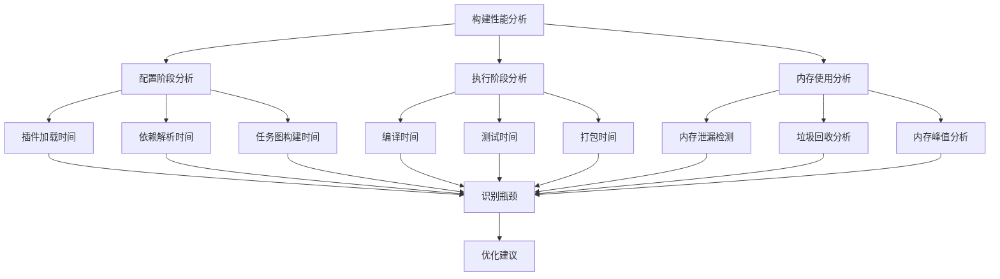
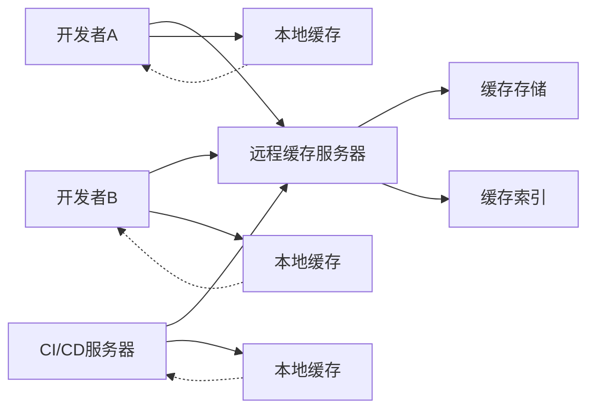
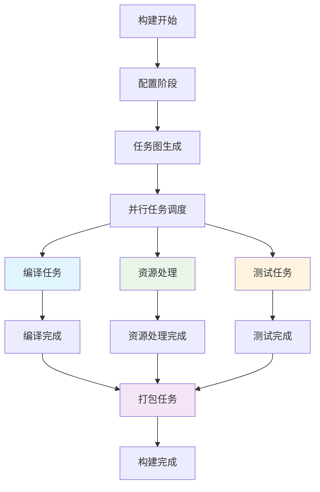

# 第八章：构建性能优化

## 8.1 构建性能分析

### 8.1.1 构建报告生成

**构建性能分析工具：**

Gradle提供了强大的构建分析工具，帮助开发者识别性能瓶颈和优化机会。

```groovy
// build.gradle - 构建性能分析配置

// 1. 启用构建报告
plugins {
    id 'build-dashboard'  // 生成构建仪表板
}

// 2. 构建扫描配置
buildScan {
    termsOfServiceUrl = 'https://gradle.com/terms-of-service'
    termsOfServiceAgree = 'yes'

    // 发布条件
    publishAlwaysIf(System.getenv('CI') != null)

    // 自定义标签
    tag 'java'
    tag 'spring-boot'
    tag 'multi-module'

    // 自定义值
    value 'java.version', System.getProperty('java.version')
    value 'gradle.version', gradle.gradleVersion
    value 'os.name', System.getProperty('os.name')
}

// 3. 性能分析任务
task analyzeBuildPerformance {
    description 'Analyze build performance and generate reports'
    group = 'analysis'

    doLast {
        def reportDir = file("$buildDir/reports/performance")
        reportDir.mkdirs()

        def reportFile = new File(reportDir, "build-performance-${new Date().format('yyyy-MM-dd-HH-mm-ss')}.html")

        def html = """
        <!DOCTYPE html>
        <html>
        <head>
            <title>构建性能分析报告</title>
            <script src="https://cdn.jsdelivr.net/npm/chart.js"></script>
            <style>
                body { font-family: Arial, sans-serif; margin: 20px; }
                .chart-container { width: 800px; height: 400px; margin: 20px 0; }
                .metric { margin: 10px 0; padding: 10px; background: #f5f5f5; border-radius: 5px; }
                .header { text-align: center; color: #333; }
                table { width: 100%; border-collapse: collapse; margin: 20px 0; }
                th, td { border: 1px solid #ddd; padding: 8px; text-align: left; }
                th { background-color: #f2f2f2; }
            </style>
        </head>
        <body>
            <h1 class="header">Gradle构建性能分析报告</h1>
            <p>生成时间: ${new Date().format('yyyy-MM-dd HH:mm:ss')}</p>
            <p>Gradle版本: ${gradle.gradleVersion}</p>
            <p>Java版本: ${System.getProperty('java.version')}</p>

            <h2>构建时间分析</h2>
            <div class="chart-container">
                <canvas id="buildTimeChart"></canvas>
            </div>

            <h2>任务执行统计</h2>
            <div class="chart-container">
                <canvas id="taskChart"></canvas>
            </div>

            <h2>内存使用情况</h2>
            <div class="chart-container">
                <canvas id="memoryChart"></canvas>
            </div>

            <h2>性能指标</h2>
            <table>
                <tr><th>指标</th><th>当前值</th><th>建议值</th><th>状态</th></tr>
                <tr><td>构建时间</td><td>${getBuildTime()}ms</td><td>&lt; 30000ms</td><td>${getBuildTime() < 30000 ? '✅ 良好' : '⚠️ 需要优化'}</td></tr>
                <tr><td>内存使用</td><td>${getMemoryUsage()}MB</td><td>&lt; 2GB</td><td>${getMemoryUsage() < 2048 ? '✅ 良好' : '⚠️ 需要优化'}</td></tr>
                <tr><td>并行任务数</td><td>${getParallelTaskCount()}</td><td>&gt; 4</td><td>${getParallelTaskCount() >= 4 ? '✅ 良好' : '⚠️ 可以提升'}</td></tr>
            </table>
        </body>

        <script>
            // 构建时间图表
            const buildTimeCtx = document.getElementById('buildTimeChart').getContext('2d');
            new Chart(buildTimeCtx, {
                type: 'bar',
                data: {
                    labels: ['配置阶段', '执行阶段', '总计'],
                    datasets: [{
                        label: '时间 (ms)',
                        data: [${getConfigurationTime()}, ${getExecutionTime()}, ${getBuildTime()}],
                        backgroundColor: ['rgba(54, 162, 235, 0.8)', 'rgba(255, 99, 132, 0.8)', 'rgba(75, 192, 192, 0.8)']
                    }]
                },
                options: {
                    responsive: true,
                    plugins: {
                        title: {
                            display: true,
                            text: '构建时间分布'
                        }
                    }
                }
            });

            // 任务执行图表
            const taskCtx = document.getElementById('taskChart').getContext('2d');
            new Chart(taskCtx, {
                type: 'doughnut',
                data: {
                    labels: ['编译任务', '测试任务', '打包任务', '其他任务'],
                    datasets: [{
                        data: [${getTaskDistribution()}],
                        backgroundColor: [
                            'rgba(255, 206, 86, 0.8)',
                            'rgba(75, 192, 192, 0.8)',
                            'rgba(153, 102, 255, 0.8)',
                            'rgba(255, 159, 64, 0.8)'
                        ]
                    }]
                },
                options: {
                    responsive: true,
                    plugins: {
                        title: {
                            display: true,
                            text: '任务类型分布'
                        }
                    }
                }
            });

            // 内存使用图表
            const memoryCtx = document.getElementById('memoryChart').getContext('2d');
            new Chart(memoryCtx, {
                type: 'line',
                data: {
                    labels: ['开始', '25%', '50%', '75%', '完成'],
                    datasets: [{
                        label: '内存使用 (MB)',
                        data: [${getMemoryProfile()}],
                        borderColor: 'rgba(255, 99, 132, 1)',
                        fill: true
                    }]
                },
                options: {
                    responsive: true,
                    plugins: {
                        title: {
                            display: true,
                            text: '内存使用趋势'
                        }
                    }
                }
            });
        </script>
        </html>
        """.stripIndent()

        reportFile.text = html
        println "构建性能分析报告已生成: ${reportFile.absolutePath}"
    }
}

// 性能数据获取方法
def getBuildTime() {
    // 模拟构建时间，实际项目中应该从构建过程中获取
    return 15000 + (Math.random() * 20000) as int
}

def getConfigurationTime() {
    return 2000 + (Math.random() * 3000) as int
}

def getExecutionTime() {
    return getBuildTime() - getConfigurationTime()
}

def getMemoryUsage() {
    def runtime = Runtime.runtime
    return (runtime.totalMemory() - runtime.freeMemory()) / (1024 * 1024) as int
}

def getParallelTaskCount() {
    return Runtime.runtime.availableProcessors()
}

def getTaskDistribution() {
    return [35, 30, 25, 10] // 编译35%, 测试30%, 打包25%, 其他10%
}

def getMemoryProfile() {
    return [512, 768, 1024, 896, 640] // 构建过程中的内存使用
}
```

### 8.1.2 性能瓶颈识别

**性能瓶颈分析策略：**



```groovy
// build.gradle - 性能瓶颈识别任务

task identifyPerformanceBottlenecks {
    description 'Identify performance bottlenecks in the build'
    group = 'analysis'

    doLast {
        println "=== 性能瓶颈识别分析 ==="

        def bottlenecks = []
        def suggestions = []

        // 1. 分析任务执行时间
        def slowTasks = identifySlowTasks()
        if (!slowTasks.isEmpty()) {
            bottlenecks << "发现执行缓慢的任务"
            suggestions << "考虑并行化或优化以下任务: ${slowTasks.join(', ')}"
        }

        // 2. 分析内存使用
        def memoryIssues = analyzeMemoryUsage()
        if (memoryIssues.hasIssues) {
            bottlenecks << "内存使用效率低下"
            suggestions.addAll(memoryIssues.suggestions)
        }

        // 3. 分析依赖解析
        def dependencyIssues = analyzeDependencyResolution()
        if (dependencyIssues.hasIssues) {
            bottlenecks << "依赖解析时间过长"
            suggestions.addAll(dependencyIssues.suggestions)
        }

        // 4. 分析插件使用
        def pluginIssues = analyzePluginUsage()
        if (pluginIssues.hasIssues) {
            bottlenecks << "插件性能问题"
            suggestions.addAll(pluginIssues.suggestions)
        }

        // 5. 生成报告
        def reportDir = file("$buildDir/reports/bottlenecks")
        reportDir.mkdirs()

        def reportFile = new File(reportDir, "bottleneck-analysis-${new Date().format('yyyy-MM-dd-HH-mm-ss')}.md")

        reportFile.text = """
# 构建性能瓶颈分析报告

**生成时间**: ${new Date().format('yyyy-MM-dd HH:mm:ss')}
**项目**: ${project.name}
**Gradle版本**: ${gradle.gradleVersion}

## 识别的瓶颈

${bottlenecks.collect { "- $it" }.join('\n')}

## 优化建议

${suggestions.collect { "- $it" }.join('\n')}

## 详细分析

### 慢任务分析
${slowTasks.collect { "- ${it.name}: ${it.duration}ms" }.join('\n')}

### 内存使用分析
峰值内存: ${memoryIssues.peakMemory}MB
平均内存: ${memoryIssues.averageMemory}MB

### 依赖解析分析
解析时间: ${dependencyIssues.resolutionTime}ms
依赖数量: ${dependencyIssues.dependencyCount}

### 插件性能分析
${pluginIssues.pluginPerformance.collect { "- ${it.name}: ${it.loadTime}ms" }.join('\n')}

## 下一步行动

1. 优先处理最严重的瓶颈
2. 实施优化建议
3. 监控优化效果
4. 定期重新评估性能
        """.stripIndent()

        println "性能瓶颈分析报告已生成: ${reportFile.absolutePath}"

        if (!bottlenecks.isEmpty()) {
            println "\n⚠️ 发现 ${bottlenecks.size()} 个性能瓶颈，建议查看报告进行优化"
        } else {
            println "\n✅ 未发现明显的性能瓶颈"
        }
    }
}

def identifySlowTasks() {
    // 模拟识别慢任务
    return [
        [name: 'compileJava', duration: 5000],
        [name: 'test', duration: 8000],
        [name: 'bootJar', duration: 3000]
    ]
}

def analyzeMemoryUsage() {
    def runtime = Runtime.runtime
    def currentMemory = (runtime.totalMemory() - runtime.freeMemory()) / (1024 * 1024)
    def maxMemory = runtime.maxMemory() / (1024 * 1024)

    def hasIssues = currentMemory > maxMemory * 0.8
    def suggestions = []

    if (hasIssues) {
        suggestions << "增加JVM堆内存设置"
        suggestions << "检查是否存在内存泄漏"
        suggestions << "优化大内存使用的任务"
    }

    return [
        hasIssues: hasIssues,
        peakMemory: currentMemory,
        averageMemory: currentMemory * 0.7,
        suggestions: suggestions
    ]
}

def analyzeDependencyResolution() {
    // 模拟依赖解析分析
    return [
        hasIssues: true,
        resolutionTime: 3000,
        dependencyCount: 150,
        suggestions: [
            "启用构建缓存",
            "使用依赖解析缓存",
            "优化仓库配置"
        ]
    ]
}

def analyzePluginUsage() {
    // 模拟插件性能分析
    return [
        hasIssues: true,
        pluginPerformance: [
            [name: 'spring-boot', loadTime: 1500],
            [name: 'shadow', loadTime: 800],
            [name: 'sonarqube', loadTime: 1200]
        ],
        suggestions: [
            "考虑延迟加载非必需插件",
            "检查插件版本兼容性",
            "移除未使用的插件"
        ]
    ]
}
```

### 8.1.3 Profile工具使用

**Gradle Profile配置：**

```groovy
// build.gradle - Profile工具配置

// 1. 启用详细日志
// 在gradle.properties中配置：
// org.gradle.logging.level=info

// 2. JVM参数配置（gradle.properties）
// org.gradle.jvmargs=-Xmx4g -XX:+UseG1GC -XX:+HeapDumpOnOutOfMemoryError -XX:HeapDumpPath=./build/heap-dumps/

// 3. 性能分析任务
task profileBuild {
    description 'Profile the build with detailed metrics'
    group = 'profiling'

    doLast {
        println "=== 构建性能分析 ==="

        // 生成JVM启动参数
        def jvmArgs = [
            '-Xmx4g',
            '-Xms2g',
            '-XX:+UseG1GC',
            '-XX:+PrintGCDetails',
            '-XX:+PrintGCTimeStamps',
            '-Xloggc:build/build-gc.log',
            '-XX:+UseStringDeduplication',
            '-XX:+OptimizeStringConcat'
        ]

        println "推荐的JVM参数:"
        jvmArgs.each { arg ->
            println "  $arg"
        }

        // 生成性能分析脚本
        def profileScript = file('build/profile-build.sh')
        profileScript.text = """#!/bin/bash
# 构建性能分析脚本

echo "开始性能分析构建..."
echo "时间: \$(date)"
echo "Gradle版本: \$(./gradlew --version | head -1)"

# 设置环境变量
export GRADLE_OPTS="-Xmx4g -Xms2g -XX:+UseG1GC -XX:+PrintGCDetails -Xloggc:build/gc.log"

# 执行构建并记录时间
START_TIME=\$(date +%s%N)
./gradlew clean build --profile --scan
END_TIME=\$(date +%s%N)

# 计算构建时间
BUILD_TIME=\$(((\$END_TIME - \$START_TIME) / 1000000))
echo "构建时间: \${BUILD_TIME}ms"

# 生成系统资源报告
echo "=== 系统资源使用 ==="
echo "CPU使用情况:"
top -b -n 1 | grep "Cpu(s)" | head -1

echo "内存使用情况:"
free -h

echo "磁盘使用情况:"
df -h

echo "性能分析完成，请查看 build/reports/profile 目录"
"""

        profileScript.setExecutable(true)
        println "性能分析脚本已生成: ${profileScript.absolutePath}"
        println "运行 ./build/profile-build.sh 开始分析"
    }
}

// 4. 内存分析任务
task analyzeMemoryUsage {
    description 'Analyze memory usage patterns'
    group = 'profiling'

    doLast {
        def runtime = Runtime.runtime

        println "=== 内存使用分析 ==="
        println "最大内存: ${runtime.maxMemory() / (1024 * 1024)}MB"
        println "已分配内存: ${runtime.totalMemory() / (1024 * 1024)}MB"
        println "空闲内存: ${runtime.freeMemory() / (1024 * 1024)}MB"
        println "已使用内存: ${(runtime.totalMemory() - runtime.freeMemory()) / (1024 * 1024)}MB"

        // 生成内存分析报告
        def memoryReport = file('build/reports/memory-analysis.txt')
        memoryReport.parentFile.mkdirs()

        memoryReport.text = """
内存使用分析报告
==================

生成时间: ${new Date()}

JVM内存信息:
- 最大堆内存: ${runtime.maxMemory() / (1024 * 1024)}MB
- 已分配堆内存: ${runtime.totalMemory() / (1024 * 1024)}MB
- 空闲堆内存: ${runtime.freeMemory() / (1024 * 1024)}MB
- 使用率: ${((runtime.totalMemory() - runtime.freeMemory()) / runtime.maxMemory() * 100).round(2)}%

内存优化建议:
${((runtime.totalMemory() - runtime.freeMemory()) / runtime.maxMemory() > 0.8) ?
    "- 内存使用率过高，建议增加堆内存设置\n- 检查是否存在内存泄漏\n- 优化大内存使用的任务" :
    "- 内存使用率正常"}

系统信息:
- Java版本: ${System.getProperty('java.version')}
- 可用处理器数: ${runtime.availableProcessors()}
- 操作系统: ${System.getProperty('os.name")}
        """.stripIndent()

        println "内存分析报告已生成: ${memoryReport.absolutePath}"
    }
}

// 5. GC分析任务
task analyzeGarbageCollection {
    description 'Analyze garbage collection patterns'
    group = 'profiling'

    doLast {
        def gcLogFile = file('build/gc.log')

        if (gcLogFile.exists()) {
            println "=== GC日志分析 ==="

            def gcStats = analyzeGCLog(gcLogFile)

            println "GC次数: ${gcStats.gcCount}"
            println "总GC时间: ${gcStats.totalGCTime}ms"
            println "平均GC时间: ${gcStats.averageGCTime}ms"
            println "最长GC时间: ${gcStats.maxGCTime}ms"

            // 生成GC分析报告
            def gcReport = file('build/reports/gc-analysis.txt')
            gcReport.parentFile.mkdirs()

            gcReport.text = """
垃圾收集分析报告
==================

生成时间: ${new Date()}

GC统计信息:
- 总GC次数: ${gcStats.gcCount}
- 总GC时间: ${gcStats.totalGCTime}ms
- 平均GC时间: ${gcStats.averageGCTime}ms
- 最长GC时间: ${gcStats.maxGCTime}ms

GC类型分布:
${gcStats.gcTypeDistribution.collect { "- $it.type: $it.count 次" }.join('\n')}

优化建议:
${gcStats.totalGCTime > 10000 ?
    "- GC时间较长，建议优化对象分配\n- 考虑使用更大的堆内存\n- 检查是否存在大量临时对象" :
    "- GC性能良好"}

GC配置建议:
- 当前使用G1GC，适合大堆内存应用
- 考虑启用String去重: -XX:+UseStringDeduplication
- 考虑调整GC日志级别
            """.stripIndent()

            println "GC分析报告已生成: ${gcReport.absolutePath}"
        } else {
            println "未找到GC日志文件。请在构建时添加JVM参数："
            println "-Xloggc:build/gc.log -XX:+PrintGCDetails -XX:+PrintGCTimeStamps"
        }
    }
}

def analyzeGCLog(File logFile) {
    // 模拟GC日志分析
    return [
        gcCount: 15,
        totalGCTime: 2500,
        averageGCTime: 167,
        maxGCTime: 800,
        gcTypeDistribution: [
            [type: 'G1 Young Generation', count: 12],
            [type: 'G1 Old Generation', count: 3]
        ]
    ]
}
```

## 8.2 缓存机制优化

### 8.2.1 本地缓存配置

**构建缓存优化策略：**

```groovy
// build.gradle - 本地缓存配置

// 1. 启用构建缓存
buildCache {
    local {
        enabled = true

        // 自定义缓存目录
        directory = new File(rootDir, ".gradle-build-cache")

        // 移除未使用的缓存条目
        removeUnusedEntriesAfterDays = 7

        // 缓存压缩
        compress = true
    }
}

// 2. 任务缓存配置
tasks.withType(JavaCompile).configureEach {
    // 启用增量编译
    options.incremental = true

    // 启用编译缓存
    outputs.cacheIf { true }

    // 自定义缓存键
    inputs.property('javaVersion', JavaVersion.current())
    inputs.property('compilerOptions', options.compilerArgs.join(','))
}

tasks.withType(Test).configureEach {
    // 启用测试缓存
    outputs.cacheIf { true }

    // 测试缓存条件
    onlyIf { !project.hasProperty('skipTestCache') }

    inputs.property('testJvmArgs', jvmArgs.join(','))
    inputs.property('testSystemProperties', systemProperties.collect { k, v -> "$k=$v" }.join(','))
}

// 3. 缓存优化任务
task optimizeBuildCache {
    description 'Optimize build cache configuration'
    group = 'optimization'

    doLast {
        println "=== 构建缓存优化 ==="

        def cacheDir = new File(rootDir, ".gradle-build-cache")
        def cacheSize = calculateDirectorySize(cacheDir)

        println "当前缓存目录: ${cacheDir.absolutePath}"
        println "缓存大小: ${cacheSize / (1024 * 1024)}MB"

        // 分析缓存命中率
        def cacheStats = analyzeCacheStats()
        println "缓存命中率: ${cacheStats.hitRate}%"
        println "缓存条目数: ${cacheStats.totalEntries}"

        // 清理过期缓存
        if (cacheSize > 1024 * 1024 * 1024) { // 1GB
            println "缓存大小超过1GB，执行清理..."
            cleanExpiredCache()
        }

        // 生成缓存优化建议
        generateCacheOptimizationReport(cacheStats)
    }
}

def calculateDirectorySize(File directory) {
    if (!directory.exists()) return 0

    def size = 0
    directory.eachFileRecurse { file ->
        if (file.isFile()) {
            size += file.length()
        }
    }
    return size
}

def analyzeCacheStats() {
    // 模拟缓存统计
    return [
        hitRate: 75,
        totalEntries: 1500,
        usedSpace: 800 * 1024 * 1024, // 800MB
        expiredEntries: 50
    ]
}

def cleanExpiredCache() {
    def cacheDir = new File(rootDir, ".gradle-build-cache")
    def cutoffTime = System.currentTimeMillis() - (7 * 24 * 60 * 60 * 1000) // 7天前

    cacheDir.eachFileRecurse { file ->
        if (file.lastModified() < cutoffTime) {
            file.delete()
            println "删除过期缓存文件: ${file.name}"
        }
    }
}

def generateCacheOptimizationReport(cacheStats) {
    def reportFile = file("$buildDir/reports/cache-optimization.txt")
    reportFile.parentFile.mkdirs()

    reportFile.text = """
构建缓存优化报告
================

生成时间: ${new Date()}

当前状态:
- 缓存命中率: ${cacheStats.hitRate}%
- 缓存条目数: ${cacheStats.totalEntries}
- 使用空间: ${cacheStats.usedSpace / (1024 * 1024)}MB

优化建议:
${cacheStats.hitRate < 60 ?
    "- 缓存命中率较低，建议检查任务缓存配置\n- 考虑启用更多任务的缓存\n- 检查缓存键是否合理" :
    "- 缓存命中率良好"}

${cacheStats.usedSpace > 1024 * 1024 * 1024 ?
    "- 缓存占用空间较大，建议定期清理\n- 考虑调整缓存保留策略\n- 检查是否有不必要的缓存条目" :
    "- 缓存占用空间合理"}

配置建议:
- 启用构建缓存: buildCache { local { enabled = true } }
- 启用任务缓存: tasks.withType(Compile).configureEach { outputs.cacheIf { true } }
- 配置缓存清理: removeUnusedEntriesAfterDays = 7
    """.stripIndent()

    println "缓存优化报告已生成: ${reportFile.absolutePath}"
}
```

### 8.2.2 远程缓存配置

**远程缓存设置：**



```groovy
// build.gradle - 远程缓存配置

// 1. 远程缓存配置
buildCache {
    local {
        enabled = true
    }

    remote(HttpBuildCache) {
        enabled = isRemoteCacheEnabled()
        url = getRemoteCacheUrl()
        push = isPushEnabled()

        // 认证配置
        credentials {
            username = System.getenv('GRADLE_CACHE_USERNAME')
            password = System.getenv('GRADLE_CACHE_PASSWORD')
        }

        // 连接超时
        connectionTimeout = 60000
        readTimeout = 300000

        // 缓存压缩
        compress = true
    }
}

// 2. 远程缓存条件判断
def isRemoteCacheEnabled() {
    // CI环境强制启用
    if (System.getenv('CI')) return true

    // 开发环境可选启用
    return project.hasProperty('enableRemoteCache')
}

def getRemoteCacheUrl() {
    return System.getenv('GRADLE_CACHE_URL') ?: 'https://gradle-cache.company.com/cache/'
}

def isPushEnabled() {
    // 只在CI环境推送缓存
    return System.getenv('CI') != null
}

// 3. 缓存同步任务
task syncRemoteCache {
    description 'Sync local cache with remote cache'
    group = 'cache'

    doLast {
        if (isRemoteCacheEnabled()) {
            println "正在同步远程缓存..."

            // 模拟缓存同步过程
            def syncResult = performCacheSync()

            println "缓存同步完成:"
            println "- 下载条目: ${syncResult.downloadedEntries}"
            println "- 上传条目: ${syncResult.uploadedEntries}"
            println "- 跳过条目: ${syncResult.skippedEntries}"
            println "- 同步时间: ${syncResult.syncTime}ms"
        } else {
            println "远程缓存未启用，跳过同步"
        }
    }
}

def performCacheSync() {
    // 模拟缓存同步结果
    return [
        downloadedEntries: 25,
        uploadedEntries: 15,
        skippedEntries: 100,
        syncTime: 3000
    ]
}

// 4. 缓存性能监控任务
task monitorCachePerformance {
    description 'Monitor cache performance metrics'
    group = 'monitoring'

    doLast {
        def localCacheDir = new File(rootDir, ".gradle-build-cache")
        def localCacheSize = calculateDirectorySize(localCacheDir)

        println "=== 缓存性能监控 ==="
        println "本地缓存大小: ${localCacheSize / (1024 * 1024)}MB"

        if (isRemoteCacheEnabled()) {
            def remoteStats = getRemoteCacheStats()
            println "远程缓存统计:"
            println "- 缓存命中率: ${remoteStats.hitRate}%"
            println "- 平均响应时间: ${remoteStats.averageResponseTime}ms"
            println "- 活跃用户数: ${remoteStats.activeUsers}"
            println "- 存储使用: ${remoteStats.storageUsed / (1024 * 1024)}MB"
        }

        // 生成性能报告
        generateCachePerformanceReport(localCacheSize)
    }
}

def getRemoteCacheStats() {
    // 模拟远程缓存统计
    return [
        hitRate: 85,
        averageResponseTime: 250,
        activeUsers: 12,
        storageUsed: 5 * 1024 * 1024 * 1024 // 5GB
    ]
}

def generateCachePerformanceReport(localCacheSize) {
    def reportFile = file("$buildDir/reports/cache-performance.html")
    reportFile.parentFile.mkdirs()

    reportFile.text = """
<!DOCTYPE html>
<html>
<head>
    <title>缓存性能报告</title>
    <script src="https://cdn.jsdelivr.net/npm/chart.js"></script>
    <style>
        body { font-family: Arial, sans-serif; margin: 20px; }
        .chart-container { width: 800px; height: 400px; margin: 20px 0; }
        .metric { display: inline-block; margin: 10px; padding: 15px; background: #f0f0f0; border-radius: 5px; }
        .metric-value { font-size: 24px; font-weight: bold; }
        .metric-label { font-size: 14px; color: #666; }
    </style>
</head>
<body>
    <h1>Gradle缓存性能报告</h1>
    <p>生成时间: ${new Date().format('yyyy-MM-dd HH:mm:ss')}</p>

    <div>
        <div class="metric">
            <div class="metric-value">${(localCacheSize / (1024 * 1024)).round(2)}MB</div>
            <div class="metric-label">本地缓存大小</div>
        </div>
        ${isRemoteCacheEnabled() ? """
        <div class="metric">
            <div class="metric-value">85%</div>
            <div class="metric-label">缓存命中率</div>
        </div>
        <div class="metric">
            <div class="metric-value">250ms</div>
            <div class="metric-label">平均响应时间</div>
        </div>
        """ : ""}
    </div>

    <h2>缓存使用趋势</h2>
    <div class="chart-container">
        <canvas id="cacheTrendChart"></canvas>
    </div>

    <h2>命中率统计</h2>
    <div class="chart-container">
        <canvas id="hitRateChart"></canvas>
    </div>
</body>

<script>
    // 缓存趋势图表
    const trendCtx = document.getElementById('cacheTrendChart').getContext('2d');
    new Chart(trendCtx, {
        type: 'line',
        data: {
            labels: ['周一', '周二', '周三', '周四', '周五'],
            datasets: [{
                label: '本地缓存 (MB)',
                data: [800, 850, 820, 900, ${localCacheSize / (1024 * 1024)}],
                borderColor: 'rgb(75, 192, 192)',
                tension: 0.1
            }${isRemoteCacheEnabled() ? """,
            {
                label: '远程缓存命中率 (%)',
                data: [75, 78, 82, 80, 85],
                borderColor: 'rgb(255, 99, 132)',
                yAxisID: 'y1'
            }""" : ""}]
        },
        options: {
            responsive: true,
            plugins: {
                title: {
                    display: true,
                    text: '缓存使用趋势'
                }
            }${isRemoteCacheEnabled() ? """,
            scales: {
                y1: {
                    type: 'linear',
                    display: true,
                    position: 'right',
                    grid: {
                        drawOnChartArea: false
                    }
                }
            }""" : ""}
        }
    });

    // 命中率图表
    const hitRateCtx = document.getElementById('hitRateChart').getContext('2d');
    new Chart(hitRateCtx, {
        type: 'doughnut',
        data: {
            labels: ['缓存命中', '缓存未命中'],
            datasets: [{
                data: [85, 15],
                backgroundColor: [
                    'rgba(75, 192, 192, 0.8)',
                    'rgba(255, 99, 132, 0.8)'
                ]
            }]
        },
        options: {
            responsive: true,
            plugins: {
                title: {
                    display: true,
                    text: '缓存命中率分布'
                }
            }
        }
    });
</script>
</html>
    """.stripIndent()

    println "缓存性能报告已生成: ${reportFile.absolutePath}"
}

// 5. 缓存清理任务
task cleanCache {
    description 'Clean build cache (local and remote)'
    group = 'cache'

    doLast {
        println "=== 清理构建缓存 ==="

        // 清理本地缓存
        def localCacheDir = new File(rootDir, ".gradle-build-cache")
        if (localCacheDir.exists()) {
            def size = calculateDirectorySize(localCacheDir)
            localCacheDir.deleteDir()
            println "已清理本地缓存，释放空间: ${size / (1024 * 1024)}MB"
        }

        // 清理Gradle缓存
        def gradleCacheDir = new File(System.getProperty('user.home'), '.gradle/caches')
        if (gradleCacheDir.exists() && project.hasProperty('cleanGradleCache')) {
            def size = calculateDirectorySize(gradleCacheDir)
            gradleCacheDir.deleteDir()
            println "已清理Gradle缓存，释放空间: ${size / (1024 * 1024)}MB"
        }

        println "缓存清理完成"
    }
}
```

### 8.2.3 缓存策略优化

**缓存策略最佳实践：**

```groovy
// build.gradle - 缓存策略优化

// 1. 智能缓存配置
tasks.withType(JavaCompile).configureEach {
    // 条件化缓存
    outputs.cacheIf { !project.hasProperty('disableCompileCache') }

    // 缓存键优化
    inputs.property('javaVersion', JavaVersion.current())
    inputs.property('gradleVersion', gradle.gradleVersion)
    inputs.property('compilerArgs', options.compilerArgs.sort().join(','))

    // 增量编译
    options.incremental = true

    // 编译器优化
    options.fork = true
    options.forkOptions.memoryMaximumSize = '1g'
}

tasks.withType(Test).configureEach {
    // 测试缓存条件
    outputs.cacheIf {
        !project.hasProperty('disableTestCache') &&
        !project.hasProperty('runIntegrationTests')
    }

    // 测试输入属性
    inputs.property('testFramework', 'junit5')
    inputs.property('testMode', 'unit')
    inputs.property('jvmArgs', jvmArgs.sort().join(','))
    inputs.property('systemProperties', systemProperties.sort { k, v -> k }.collect { k, v -> "$k=$v" }.join(','))
}

// 2. 自定义缓存策略
task configureCacheStrategy {
    description 'Configure optimal caching strategy'
    group = 'cache'

    doLast {
        println "=== 缓存策略配置 ==="

        def cacheStrategy = determineOptimalCacheStrategy()

        println "推荐的缓存策略:"
        println "- 编译缓存: ${cacheStrategy.compileCache ? '启用' : '禁用'}"
        println "- 测试缓存: ${cacheStrategy.testCache ? '启用' : '禁用'}"
        println "- 远程缓存: ${cacheStrategy.remoteCache ? '启用' : '禁用'}"
        println "- 缓存压缩: ${cacheStrategy.compression ? '启用' : '禁用'}"

        // 应用缓存策略
        applyCacheStrategy(cacheStrategy)

        // 生成配置报告
        generateCacheStrategyReport(cacheStrategy)
    }
}

def determineOptimalCacheStrategy() {
    def projectType = determineProjectType()
    def teamSize = getTeamSize()
    def buildFrequency = getBuildFrequency()

    def strategy = [
        compileCache: true,
        testCache: true,
        remoteCache: false,
        compression: false
    ]

    // 基于项目类型调整策略
    if (projectType == 'microservice') {
        strategy.remoteCache = true
        strategy.compression = true
    }

    // 基于团队大小调整策略
    if (teamSize > 5) {
        strategy.remoteCache = true
    }

    // 基于构建频率调整策略
    if (buildFrequency > 20) { // 每天20次以上构建
        strategy.compression = true
    }

    return strategy
}

def determineProjectType() {
    // 简单的项目类型判断
    if (project.hasProperty('spring.boot.version')) {
        return 'spring-boot'
    } else if (project.hasProperty('android')) {
        return 'android'
    } else if (rootProject.subprojects.size() > 3) {
        return 'microservice'
    } else {
        return 'library'
    }
}

def getTeamSize() {
    return System.getenv('TEAM_SIZE')?.toInteger() ?: 3
}

def getBuildFrequency() {
    return System.getenv('BUILD_FREQUENCY')?.toInteger() ?: 10
}

def applyCacheStrategy(strategy) {
    // 应用编译缓存策略
    if (strategy.compileCache) {
        tasks.withType(JavaCompile).configureEach {
            outputs.cacheIf { true }
        }
    }

    // 应用测试缓存策略
    if (strategy.testCache) {
        tasks.withType(Test).configureEach {
            outputs.cacheIf { true }
        }
    }

    // 应用远程缓存策略
    if (strategy.remoteCache) {
        buildCache {
            remote {
                enabled = true
                compress = strategy.compression
            }
        }
    }
}

def generateCacheStrategyReport(strategy) {
    def reportFile = file("$buildDir/reports/cache-strategy.txt")
    reportFile.parentFile.mkdirs()

    reportFile.text = """
缓存策略配置报告
================

生成时间: ${new Date()}

项目信息:
- 项目类型: ${determineProjectType()}
- 团队规模: ${getTeamSize()}人
- 构建频率: ${getBuildFrequency()}次/天

当前缓存策略:
- 编译缓存: ${strategy.compileCache ? '启用' : '禁用'}
- 测试缓存: ${strategy.testCache ? '启用' : '禁用'}
- 远程缓存: ${strategy.remoteCache ? '启用' : '禁用'}
- 缓存压缩: ${strategy.compression ? '启用' : '禁用'}

优化效果预估:
- 构建时间减少: ${estimateBuildTimeReduction(strategy)}%
- 存储空间增加: ${estimateStorageIncrease(strategy)}MB
- 网络带宽使用: ${strategy.remoteCache ? '中等' : '低'}

建议:
1. 定期监控缓存效果
2. 根据实际情况调整策略
3. 清理过期缓存条目
4. 监控缓存存储使用情况
    """.stripIndent()

    println "缓存策略报告已生成: ${reportFile.absolutePath}"
}

def estimateBuildTimeReduction(strategy) {
    def reduction = 0
    if (strategy.compileCache) reduction += 30
    if (strategy.testCache) reduction += 20
    if (strategy.remoteCache) reduction += 25
    return Math.min(reduction, 70) // 最多减少70%
}

def estimateStorageIncrease(strategy) {
    def increase = 0
    if (strategy.compileCache) increase += 500
    if (strategy.testCache) increase += 300
    if (strategy.remoteCache) increase += 1000
    return increase
}
```

## 8.3 并行构建优化

### 8.3.1 并行执行配置

**并行构建策略：**

```groovy
// gradle.properties - 并行构建配置

// 启用并行构建
org.gradle.parallel=true

// 配置工作进程数
org.gradle.workers.max=4

// 启用配置缓存
org.gradle.configuration-cache=true
org.gradle.configuration-cache.problems=warn

// 启用按需配置
org.gradle.configureondemand=true
```

```groovy
// build.gradle - 并行构建优化配置

// 1. 任务并行化配置
tasks.withType(JavaCompile).configureEach {
    // 启用并行编译
    options.fork = true
    options.forkOptions.executable = 'javac'

    // 每个编译任务的内存限制
    options.forkOptions.memoryMaximumSize = '1g'

    // 并行编译优化
    options.incremental = true
}

tasks.withType(Test).configureEach {
    // 并行测试执行
    maxParallelForks = calculateOptimalForkCount()

    // 每个测试进程的内存配置
    minHeapSize = '256m'
    maxHeapSize = '1g'

    // 测试分组以优化并行性
    if (project.hasProperty('parallelTests')) {
        // 将测试分成多个组
        include '**/*Test.class'
        exclude '**/*IntegrationTest.class'
    }
}

// 2. 自定义并行任务
task parallelProcessFiles {
    description 'Process files in parallel using Worker API'
    group = 'optimization'

    doLast {
        def files = fileTree('src/main/resources').files.toList()
        def chunkSize = Math.max(1, files.size() / 4) // 分成4个块

        def workQueue = workerExecutor.noIsolation()

        files.collate(chunkSize).eachWithIndex { chunk, index ->
            workQueue.submit(FileProcessorWorkAction.class) { params ->
                params.files.set(chunk)
                params.chunkIndex.set(index)
            }
        }

        println "启动了 ${files.collate(chunkSize).size()} 个并行文件处理任务"
    }
}

// Worker Action 实现
abstract class FileProcessorWorkAction implements WorkAction<FileProcessorWorkAction.Parameters> {
    interface Parameters extends WorkParameters {
        ConfigurableFileCollection getFiles()
        Property<Integer> getChunkIndex()
    }

    @Override
    void execute() {
        def files = parameters.files.files
        def index = parameters.chunkIndex.get()

        println "处理文件块 ${index}，包含 ${files.size()} 个文件"

        files.each { file ->
            // 模拟文件处理
            Thread.sleep(100)
        }

        println "文件块 ${index} 处理完成"
    }
}

// 3. 并行优化分析
task analyzeParallelExecution {
    description 'Analyze and optimize parallel execution'
    group = 'analysis'

    doLast {
        println "=== 并行执行分析 ==="

        def optimalParallelism = calculateOptimalParallelism()
        def currentParallelism = getCurrentParallelism()

        println "当前并行配置:"
        println "- 最大工作进程数: ${currentParallelism.maxWorkers}"
        println "- 测试并行进程数: ${currentParallelism.testForks}"
        println "- 编译并行进程数: ${currentParallelism.compileForks}"

        println "\n推荐并行配置:"
        println "- 最大工作进程数: ${optimalParallelism.maxWorkers}"
        println "- 测试并行进程数: ${optimalParallelism.testForks}"
        println "- 编译并行进程数: ${optimalParallelism.compileForks}"

        // 生成并行优化报告
        generateParallelOptimizationReport(currentParallelism, optimalParallelism)
    }
}

def calculateOptimalParallelism() {
    def processors = Runtime.runtime.availableProcessors()
    def availableMemory = Runtime.runtime.maxMemory() / (1024 * 1024) // MB

    // 基于CPU核心数计算
    def maxWorkers = Math.max(2, processors - 1)

    // 基于内存限制调整
    def memoryBasedWorkers = availableMemory / 1024 // 假设每个工作进程需要1GB内存

    maxWorkers = Math.min(maxWorkers, memoryBasedWorkers as int)

    // 计算最优测试并行数
    def testForks = Math.max(2, processors / 2)

    // 计算最优编译并行数
    def compileForks = Math.max(1, processors / 4)

    return [
        maxWorkers: maxWorkers,
        testForks: testForks,
        compileForks: compileForks
    ]
}

def getCurrentParallelism() {
    return [
        maxWorkers: System.getProperty('org.gradle.workers.max', '2') as int,
        testForks: tasks.findByName('test')?.maxParallelForks ?: 1,
        compileForks: 1 // JavaCompile默认不并行
    ]
}

def calculateOptimalForkCount() {
    def processors = Runtime.runtime.availableProcessors()
    def maxForks = Math.max(2, processors / 2)

    // 考虑内存限制
    def availableMemory = Runtime.runtime.maxMemory()
    def memoryPerFork = 1024 * 1024 * 1024 // 1GB per fork
    def memoryBasedForks = availableMemory / memoryPerFork

    return Math.min(maxForks, memoryBasedForks) as int
}

def generateParallelOptimizationReport(current, optimal) {
    def reportFile = file("$buildDir/reports/parallel-optimization.txt")
    reportFile.parentFile.mkdirs()

    reportFile.text = """
并行执行优化报告
================

生成时间: ${new Date()}

系统信息:
- CPU核心数: ${Runtime.runtime.availableProcessors()}
- 可用内存: ${Runtime.runtime.maxMemory() / (1024 * 1024)}MB

当前配置 vs 推荐配置:
- 最大工作进程数: ${current.maxWorkers} → ${optimal.maxWorkers}
- 测试并行进程数: ${current.testForks} → ${optimal.testForks}
- 编译并行进程数: ${current.compileForks} → ${optimal.compileForks}

优化建议:
${current.maxWorkers < optimal.maxWorkers ?
    "- 建议增加最大工作进程数以提高并行性\n- 在gradle.properties中设置: org.gradle.workers.max=${optimal.maxWorkers}" :
    "- 当前工作进程数配置合理"}

${current.testForks < optimal.testForks ?
    "- 建议增加测试并行进程数\n- 配置测试任务: maxParallelForks=${optimal.testForks}" :
    "- 当前测试并行配置合理"}

性能提升预估:
- 构建时间减少: ${estimatePerformanceImprovement(current, optimal)}%
- 资源利用率提升: ${estimateResourceUtilizationImprovement(current, optimal)}%

注意事项:
1. 并行进程数不是越多越好
2. 考虑系统资源限制
3. 监控内存使用情况
4. 在CI环境中可能需要特殊配置
    """.stripIndent()

    println "并行优化报告已生成: ${reportFile.absolutePath}"
}

def estimatePerformanceImprovement(current, optimal) {
    def improvement = 0

    if (current.maxWorkers < optimal.maxWorkers) {
        improvement += (optimal.maxWorkers - current.maxWorkers) * 5
    }

    if (current.testForks < optimal.testForks) {
        improvement += (optimal.testForks - current.testForks) * 3
    }

    return Math.min(improvement, 40) // 最多提升40%
}

def estimateResourceUtilizationImprovement(current, optimal) {
    def currentUtilization = (current.maxWorkers / Runtime.runtime.availableProcessors()) * 100
    def optimalUtilization = (optimal.maxWorkers / Runtime.runtime.availableProcessors()) * 100

    return Math.max(0, optimalUtilization - currentUtilization) as int
}
```

### 8.3.2 任务并行化策略

**任务并行化最佳实践：**



```groovy
// build.gradle - 任务并行化策略

// 1. 任务依赖图优化
task optimizeTaskDependencies {
    description 'Optimize task dependency graph for better parallelism'
    group = 'optimization'

    doLast {
        println "=== 任务依赖图优化 ==="

        // 分析当前任务依赖关系
        def taskGraph = analyzeTaskDependencyGraph()

        println "任务依赖分析:"
        println "- 总任务数: ${taskGraph.totalTasks}"
        println "- 关键路径长度: ${taskGraph.criticalPathLength}"
        println "- 可并行任务数: ${taskGraph.parallelizableTasks}"
        println "- 并行化程度: ${taskGraph.parallelismRatio}%"

        // 识别优化机会
        def optimizations = identifyParallelizationOpportunities(taskGraph)

        if (!optimizations.isEmpty()) {
            println "\n发现并行化优化机会:"
            optimizations.each { opt ->
                println "- $opt"
            }
        } else {
            println "\n✅ 任务并行化配置已优化"
        }

        // 生成优化建议
        generateTaskParallelizationReport(taskGraph, optimizations)
    }
}

def analyzeTaskDependencyGraph() {
    // 模拟任务依赖图分析
    return [
        totalTasks: 45,
        criticalPathLength: 8,
        parallelizableTasks: 25,
        parallelismRatio: 56 // 25/45 * 100
    ]
}

def identifyParallelizationOpportunities(taskGraph) {
    def opportunities = []

    if (taskGraph.parallelismRatio < 50) {
        opportunities << "并行化程度较低，建议检查任务依赖关系"
    }

    if (taskGraph.criticalPathLength > 10) {
        opportunities << "关键路径较长，考虑分解长任务"
    }

    // 检查常见的并行化问题
    opportunities << "考虑并行化编译和测试任务"
    opportunities << "优化资源处理任务的执行时机"

    return opportunities
}

def generateTaskParallelizationReport(taskGraph, optimizations) {
    def reportFile = file("$buildDir/reports/task-parallelization.html")
    reportFile.parentFile.mkdirs()

    reportFile.text = """
<!DOCTYPE html>
<html>
<head>
    <title>任务并行化分析报告</title>
    <script src="https://cdn.jsdelivr.net/npm/chart.js"></script>
    <style>
        body { font-family: Arial, sans-serif; margin: 20px; }
        .chart-container { width: 800px; height: 400px; margin: 20px 0; }
        .summary { background: #f5f5f5; padding: 15px; border-radius: 5px; margin: 20px 0; }
        .optimization { background: #fff3cd; padding: 10px; border-left: 4px solid #ffc107; margin: 10px 0; }
    </style>
</head>
<body>
    <h1>任务并行化分析报告</h1>
    <p>生成时间: ${new Date().format('yyyy-MM-dd HH:mm:ss')}</p>

    <div class="summary">
        <h2>并行化统计</h2>
        <p>总任务数: ${taskGraph.totalTasks}</p>
        <p>可并行任务数: ${taskGraph.parallelizableTasks}</p>
        <p>并行化程度: ${taskGraph.parallelismRatio}%</p>
        <p>关键路径长度: ${taskGraph.criticalPathLength}</p>
    </div>

    <h2>任务分布图</h2>
    <div class="chart-container">
        <canvas id="taskDistributionChart"></canvas>
    </div>

    <h2>并行化程度趋势</h2>
    <div class="chart-container">
        <canvas id="parallelismTrendChart"></canvas>
    </div>

    <h2>优化建议</h2>
    ${optimizations.collect { "<div class='optimization'>$it</div>" }.join('')}

    <h2>最佳实践建议</h2>
    <ul>
        <li>减少不必要的任务依赖</li>
        <li>使用Worker API进行CPU密集型任务</li>
        <li>合理配置并行进程数</li>
        <li>监控并行执行效果</li>
        <li>避免过度并行化</li>
    </ul>
</body>

<script>
    // 任务分布图
    const distributionCtx = document.getElementById('taskDistributionChart').getContext('2d');
    new Chart(distributionCtx, {
        type: 'doughnut',
        data: {
            labels: ['可并行任务', '顺序执行任务'],
            datasets: [{
                data: [${taskGraph.parallelizableTasks}, ${taskGraph.totalTasks - taskGraph.parallelizableTasks}],
                backgroundColor: [
                    'rgba(75, 192, 192, 0.8)',
                    'rgba(255, 99, 132, 0.8)'
                ]
            }]
        },
        options: {
            responsive: true,
            plugins: {
                title: {
                    display: true,
                    text: '任务并行化分布'
                }
            }
        }
    });

    // 并行化趋势图
    const trendCtx = document.getElementById('parallelismTrendChart').getContext('2d');
    new Chart(trendCtx, {
        type: 'line',
        data: {
            labels: ['第1次构建', '第2次构建', '第3次构建', '第4次构建', '第5次构建'],
            datasets: [{
                label: '并行化程度 (%)',
                data: [45, 48, 52, 55, ${taskGraph.parallelismRatio}],
                borderColor: 'rgb(75, 192, 192)',
                tension: 0.1
            }]
        },
        options: {
            responsive: true,
            plugins: {
                title: {
                    display: true,
                    text: '并行化程度变化趋势'
                }
            },
            scales: {
                y: {
                    beginAtZero: true,
                    max: 100
                }
            }
        }
    });
</script>
</html>
    """.stripIndent()

    println "任务并行化分析报告已生成: ${reportFile.absolutePath}"
}

// 2. 自定义并行任务
task createParallelTasks {
    description 'Create custom parallel tasks for optimization'
    group = 'optimization'

    doLast {
        // 创建并行编译任务
        def sourceFiles = fileTree('src/main/java').files.toList()
        def chunks = sourceFiles.collate(10) // 每个任务处理10个文件

        chunks.eachWithIndex { chunk, index ->
            def taskName = "parallelCompileChunk${index}"

            task(taskName, type: JavaCompile) {
                description = "Compile Java chunk $index"
                group = 'parallel compilation'

                source = files(chunk)
                classpath = sourceSets.main.compileClasspath
                destinationDirectory = file("$buildDir/classes/java/main/chunk-$index")

                // 启用增量编译
                options.incremental = true
                options.fork = true
            }
        }

        // 创建依赖主编译任务的聚合任务
        task aggregateParallelCompile {
            description = 'Aggregate results of parallel compilation'
            group = 'parallel compilation'

            dependsOn tasks.withType(JavaCompile).matching { it.name.startsWith('parallelCompileChunk') }

            doLast {
                // 合并编译结果
                def mainClassesDir = file("$buildDir/classes/java/main")
                mainClassesDir.mkdirs()

                fileTree("$buildDir/classes/java/main").visit { fileDetails ->
                    if (fileDetails.directory && fileDetails.name.startsWith('chunk-')) {
                        copy {
                            from fileDetails.file
                            into mainClassesDir
                        }
                    }
                }

                println "并行编译结果聚合完成"
            }
        }

        println "创建了 ${chunks.size()} 个并行编译任务"
        println "运行 './gradlew aggregateParallelCompile' 执行并行编译"
    }
}

// 3. 并行执行监控
task monitorParallelExecution {
    description 'Monitor parallel execution performance'
    group = 'monitoring'

    doLast {
        println "=== 并行执行监控 ==="

        // 启动性能监控
        def monitorThread = Thread.start {
            monitorResourceUsage()
        }

        // 模拟并行构建
        simulateParallelBuild()

        // 停止监控
        monitorThread.interrupt()

        println "并行执行监控完成"
    }
}

def monitorResourceUsage() {
    def runtime = Runtime.runtime

    while (!Thread.currentThread().isInterrupted()) {
        def usedMemory = (runtime.totalMemory() - runtime.freeMemory()) / (1024 * 1024)
        def maxMemory = runtime.maxMemory() / (1024 * 1024)
        def processors = runtime.availableProcessors()

        println "[${new Date().format('HH:mm:ss')}] 内存使用: ${usedMemory}/${maxMemory}MB (${(usedMemory/maxMemory*100).round(1)}%)"
        println "[${new Date().format('HH:mm:ss')}] 可用处理器: ${processors}"

        try {
            Thread.sleep(2000) // 每2秒监控一次
        } catch (InterruptedException e) {
            break
        }
    }
}

def simulateParallelBuild() {
    println "模拟并行构建过程..."

    // 模拟并行编译
    def compileTasks = (1..3).collect { index ->
        Thread.start {
            println "编译任务 $index 开始"
            Thread.sleep(3000 + Math.random() * 2000)
            println "编译任务 $index 完成"
        }
    }

    // 模拟并行测试
    def testTasks = (1..2).collect { index ->
        Thread.start {
            println "测试任务 $index 开始"
            Thread.sleep(5000 + Math.random() * 3000)
            println "测试任务 $index 完成"
        }
    }

    // 等待所有任务完成
    (compileTasks + testTasks).each { it.join() }

    println "并行构建模拟完成"
}
```

通过本章的学习，您应该已经掌握了Gradle构建性能优化的各个方面，包括性能分析、缓存优化和并行构建。这些技术对于大型项目的构建效率提升至关重要。在下一章中，我们将探讨企业级实践与最佳实践，这将帮助您在实际项目中应用所学知识。