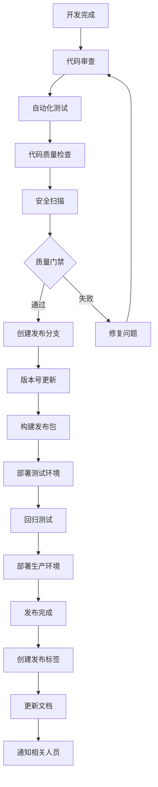

# 第九章：企业级实践与最佳实践

## 9.1 团队协作规范

### 9.1.1 构建脚本规范

**企业级构建脚本标准化：**

在企业环境中，标准化的构建脚本对于团队协作至关重要。统一的规范能够提高代码可维护性，减少构建相关问题，并加速新团队成员的上手过程。

```groovy
// build.gradle - 企业级构建脚本模板

/*
 * =================================================================
 * 企业级Gradle构建脚本模板
 * =================================================================
 *
 * 项目名称: ${project.name}
 * 版本: ${project.version}
 * 创建时间: ${new Date().format('yyyy-MM-dd')}
 *
 * 使用说明:
 * 1. 遵循代码规范和命名约定
 * 2. 添加必要的注释和文档
 * 3. 使用版本目录管理依赖
 * 4. 配置适当的质量检查
 * 5. 遵循安全最佳实践
 * =================================================================
 */

// 1. 插件声明区域（使用版本目录）
plugins {
    // 核心插件
    alias(libs.plugins.java)
    alias(libs.plugins.application)
    alias(libs.plugins.java.library)

    // 代码质量插件
    alias(libs.plugins.sonarqube)
    alias(libs.plugins.versions)
    alias(libs.plugins.dependencyCheck)

    // Spring Boot插件（如果适用）
    alias(libs.plugins.spring.boot)
    alias(libs.plugins.spring.dependency.management)

    // Docker插件
    alias(libs.plugins.docker)
    alias(libs.plugins.docker.compose)

    // 发布插件
    alias(libs.plugins.maven.publish)
    alias(libs.plugins.signing)
}

// 2. 项目基础信息配置
description = """
${project.name} - 企业级Java应用

这是一个基于Spring Boot的企业级应用程序，遵循以下原则：
- 模块化架构设计
- 面向接口编程
- 依赖注入
- 测试驱动开发
- 持续集成/持续部署

构建特点：
- 使用Gradle作为构建工具
- 支持多环境配置
- 集成代码质量检查
- 自动化测试和部署
""".trim()

// 3. Java配置
java {
    sourceCompatibility = JavaVersion.VERSION_17
    targetCompatibility = JavaVersion.VERSION_17

    // 生成源码和文档JAR
    withSourcesJar()
    withJavadocJar()

    // 工具链配置
    toolchain {
        languageVersion = JavaLanguageVersion.of(17)
        vendor = JvmVendorSpec.ADOPTIUM
    }
}

// 4. 项目信息元数据
group = 'com.example.enterprise'
version = project.hasProperty('releaseVersion') ?
    project.getProperty('releaseVersion') : '1.0.0-SNAPSHOT'

// 5. 扩展属性配置
ext {
    // 构建信息
    set('buildTimestamp', new Date().format('yyyy-MM-dd HH:mm:ss'))
    set('buildNumber', System.getenv('BUILD_NUMBER') ?: 'LOCAL')
    set('gitCommit', getGitCommit())
    set('gitBranch', getGitBranch())

    // 版本管理
    set('springBootVersion', libs.versions.spring.boot.get())
    set('springCloudVersion', libs.versions.spring.cloud.get())

    // 环境配置
    set('profile', System.getProperty('spring.profiles.active', 'dev'))

    // 质量检查配置
    set('codeCoverageThreshold', 80) // 代码覆盖率阈值
    set('staticAnalysisThreshold', 90) // 静态分析通过阈值
}

// 6. 仓库配置
repositories {
    // Maven中央仓库
    mavenCentral()

    // Spring里程碑仓库
    maven {
        name = 'SpringMilestones'
        url = 'https://repo.spring.io/milestone'
        mavenContent { releasesOnly() }
    }

    // 公司内部仓库
    maven {
        name = 'CompanyInternal'
        url = System.getenv('COMPANY_MAVEN_URL') ?: 'https://repo.company.com/maven2'

        credentials {
            username = System.getenv('MAVEN_USERNAME') ?: 'default-user'
            password = System.getenv('MAVEN_PASSWORD') ?: 'default-password'
        }

        mavenContent {
            releasesOnly()
            includeGroupByRegex 'com\\.company\\..*'
        }
    }

    // 快照仓库（开发环境）
    if (version.toString().endsWith('SNAPSHOT')) {
        maven {
            name = 'CompanySnapshots'
            url = System.getenv('COMPANY_SNAPSHOT_URL') ?: 'https://repo.company.com/maven2-snapshots'

            credentials {
                username = System.getenv('MAVEN_USERNAME') ?: 'default-user'
                password = System.getenv('MAVEN_PASSWORD') ?: 'default-password'
            }

            mavenContent { snapshotsOnly() }
        }
    }
}

// 7. 依赖管理
dependencyManagement {
    imports {
        mavenBom "org.springframework.boot:spring-boot-dependencies:${springBootVersion}"
        mavenBom "org.springframework.cloud:spring-cloud-dependencies:${springCloudVersion}"
        mavenBom "org.testcontainers:testcontainers-bom:${libs.versions.testcontainers.get()}"
    }

    dependencies {
        // 统一管理常用依赖版本
        dependency 'org.apache.commons:commons-lang3:${libs.versions.commons.lang3.get()}'
        dependency 'com.google.guava:guava:${libs.versions.guava.get()}'
        dependency 'org.slf4j:slf4j-api:${libs.versions.slf4j.get()}'
    }
}

// 8. 依赖声明
dependencies {
    // Spring Boot基础依赖
    implementation libs.spring.boot.starter.web
    implementation libs.spring.boot.starter.actuator
    implementation libs.spring.boot.starter.validation

    // 数据访问
    implementation libs.spring.boot.starter.data.jpa
    implementation libs.spring.boot.starter.data.redis
    runtimeOnly libs.mysql.connector.java
    runtimeOnly libs.h2.database

    // 安全
    implementation libs.spring.boot.starter.security
    implementation libs.spring.boot.starter.oauth2.resource.server

    // 开发工具
    developmentOnly libs.spring.boot.devtools
    annotationProcessor libs.spring.boot.configuration.processor
    compileOnly libs.lombok
    annotationProcessor libs.lombok

    // 工具库
    implementation libs.commons.lang3
    implementation libs.guava

    // API文档
    implementation libs.springdoc.openapi.starter.webmvc.ui

    // 测试依赖
    testImplementation libs.spring.boot.starter.test
    testImplementation libs.testcontainers.junit.jupiter
    testImplementation libs.testcontainers.mysql
    testImplementation libs.wiremock
    testImplementation libs.mockito.core

    // 集成测试
    integrationTestImplementation libs.spring.boot.starter.test
    integrationTestImplementation libs.testcontainers.junit.jupiter
}

// 9. 测试配置
tasks.named('test', Test) {
    description = 'Run unit tests'
    group = 'verification'

    useJUnitPlatform()

    // 测试配置
    testLogging {
        events 'passed', 'skipped', 'failed'
        exceptionFormat 'full'
        showStandardStreams = false
        showCauses = true
    }

    // JVM参数
    jvmArgs = [
        '-Dspring.profiles.active=test',
        '-Dfile.encoding=UTF-8',
        '-Djava.awt.headless=true',
        '-Xmx1g'
    ]

    // 系统属性
    systemProperty 'test.groups', System.getProperty('test.groups', '')
    systemProperty 'build.timestamp', buildTimestamp
    systemProperty 'build.number', buildNumber

    // 并行测试
    maxParallelForks = Runtime.runtime.availableProcessors().intdiv(2) ?: 1

    // 测试报告
    reports {
        junitXml.required = true
        html.required = true
    }

    // 失败时继续
    failFast = false
}

// 10. 集成测试配置
tasks.register('integrationTest', Test) {
    description = 'Run integration tests'
    group = 'verification'

    testClassesDirs = sourceSets.integrationTest.output.classesDirs
    classpath = sourceSets.integrationTest.runtimeClasspath

    shouldRunAfter test

    useJUnitPlatform()

    // 只运行集成测试
    include '**/*IntegrationTest.class'
    exclude '**/*UnitTest.class'

    // TestContainers配置
    systemProperty 'testcontainers.reuse.enable', 'true'
    systemProperty 'spring.profiles.active', 'integration-test'

    // 并行执行（谨慎使用）
    maxParallelForks = 2

    testLogging {
        events 'started', 'passed', 'skipped', 'failed'
        exceptionFormat 'full'
    }
}

// 11. 代码质量检查配置

// JaCoCo代码覆盖率
jacoco {
    toolVersion = libs.versions.jacoco.get()
    reportsDirectory = layout.buildDirectory.dir('reports/jacoco')
}

tasks.named('jacocoTestReport') {
    dependsOn test, integrationTest

    reports {
        xml.required = true
        html.required = true
        csv.required = false
    }

    // 检查代码覆盖率
    doLast {
        def coverage = executionData.totalInstructionCoverage
        def threshold = project.ext.codeCoverageThreshold

        println "代码覆盖率: ${coverage * 100}%"
        if (coverage * 100 < threshold) {
            throw new GradleException("代码覆盖率 ${coverage * 100}% 低于阈值 ${threshold}%")
        }
    }
}

// SonarQube配置
sonarqube {
    properties {
        property 'sonar.projectKey', "${group}:${project.name}"
        property 'sonar.projectName', project.name
        property 'sonar.projectVersion', version
        property 'sonar.host.url', System.getenv('SONAR_HOST_URL') ?: 'https://sonar.company.com'
        property 'sonar.login', System.getenv('SONAR_TOKEN')

        // 代码覆盖率
        property 'sonar.coverage.jacoco.xmlReportPaths', "${layout.buildDirectory.get()}/reports/jacoco/test/jacocoTestReport.xml"

        // 排除规则
        property 'sonar.exclusions', '**/generated/**,**/dto/**,**/entity/**'

        // 质量门禁
        property 'sonar.qualitygate.wait', true
    }
}

// 12. 构建优化配置

// 构建缓存
buildCache {
    local {
        enabled = true
        directory = new File(rootDir, ".gradle-build-cache")
        removeUnusedEntriesAfterDays = 7
    }

    if (System.getenv('CI')) {
        remote(HttpBuildCache) {
            enabled = true
            url = System.getenv('GRADLE_CACHE_URL') ?: 'https://gradle-cache.company.com/cache/'
            push = true

            credentials {
                username = System.getenv('GRADLE_CACHE_USERNAME')
                password = System.getenv('GRADLE_CACHE_PASSWORD')
            }
        }
    }
}

// 并行构建
tasks.withType(JavaCompile).configureEach {
    options.incremental = true
    options.fork = true
    options.forkOptions.memoryMaximumSize = '1g'
}

// 13. Docker配置
bootBuildImage {
    imageName = "${project.name}:${version}"

    builder = 'paketobuildpacks/builder:base'

    environment = [
        'BP_JVM_VERSION': '17',
        'BP_JVM_TYPE': 'JRE',
        'BP_LIVE_RELOAD_ENABLED': 'false'
    ]

    if (version.toString().endsWith('SNAPSHOT')) {
        tags = ["${project.name}:latest"]
    }
}

// 14. 发布配置
publishing {
    publications {
        mavenJava(MavenPublication) {
            from components.java

            pom {
                name.set(project.name)
                description.set(project.description)
                url.set('https://github.com/company/' + project.name)

                licenses {
                    license {
                        name.set('The Apache License, Version 2.0')
                        url.set('http://www.apache.org/licenses/LICENSE-2.0.txt')
                    }
                }

                developers {
                    developer {
                        id.set('enterprise-team')
                        name.set('Enterprise Team')
                        email.set('enterprise@company.com')
                    }
                }

                scm {
                    connection.set('scm:git:git://github.com/company/' + project.name + '.git')
                    developerConnection.set('scm:git:ssh://github.com:company/' + project.name + '.git')
                    url.set('https://github.com/company/' + project.name + '/tree/main')
                }
            }
        }
    }

    repositories {
        maven {
            name = 'CompanyMaven'
            url = System.getenv('MAVEN_DEPLOY_URL') ?: 'https://repo.company.com/maven2'

            credentials {
                username = System.getenv('MAVEN_DEPLOY_USERNAME')
                password = System.getenv('MAVEN_DEPLOY_PASSWORD')
            }
        }
    }
}

// 15. 签名配置
signing {
    required { !version.toString().endsWith('SNAPSHOT') && project.hasProperty('signing.keyId') }

    sign publishing.publications.mavenJava
}

// 16. 自定义任务

// 项目信息任务
tasks.register('projectInfo') {
    description = 'Display project information'
    group = 'help'

    doLast {
        println """
        ========================================
        项目信息
        ========================================
        名称: ${project.name}
        组: ${project.group}
        版本: ${project.version}
        描述: ${project.description}
        Java版本: ${JavaVersion.current()}
        Gradle版本: ${gradle.gradleVersion}
        构建时间: ${buildTimestamp}
        Git提交: ${gitCommit}
        Git分支: ${gitBranch}
        构建号: ${buildNumber}
        ========================================
        """
    }
}

// 开发环境启动任务
tasks.register('devRun', JavaExec) {
    description = 'Run application in development mode'
    group = 'application'

    classpath = sourceSets.main.runtimeClasspath
    mainClass.set('com.example.EnterpriseApplication')

    jvmArgs = [
        '-Xdebug',
        '-Xrunjdwp:transport=dt_socket,server=y,suspend=n,address=5005',
        '-Dspring.profiles.active=dev',
        '-Dspring.devtools.restart.enabled=true',
        '-Dspring.devtools.livereload.enabled=true'
    ]

    environment 'APP_ENV', 'development'
    environment 'LOG_LEVEL', 'DEBUG'

    standardInput = System.in
}

// 生产环境构建任务
tasks.register('prodBuild') {
    description = 'Build for production environment'
    group = 'build'

    dependsOn clean, test, integrationTest, jacocoTestReport, sonarqube, bootBuildImage

    doLast {
        println "生产环境构建完成！"
        println "镜像: ${bootBuildImage.imageName.get()}"
    }
}

// 健康检查任务
tasks.register('healthCheck') {
    description = 'Perform application health check'
    group = 'verification'

    doLast {
        def healthUrl = "http://localhost:8080/actuator/health"
        def timeout = 30000 // 30秒

        def startTime = System.currentTimeMillis()
        def maxWait = timeout
        def interval = 2000

        while (System.currentTimeMillis() - startTime < maxWait) {
            try {
                def url = new URL(healthUrl)
                def connection = url.openConnection()
                connection.requestMethod = 'GET'
                connection.connectTimeout = 5000
                connection.readTimeout = 5000

                def response = connection.responseCode
                if (response == 200) {
                    println "✅ 应用健康检查通过"
                    return
                }
            } catch (Exception e) {
                // 继续等待
            }

            Thread.sleep(interval)
        }

        throw new GradleException("❌ 应用健康检查失败")
    }
}

// 17. 构建生命周期配置

// 构建前的准备工作
gradle.taskGraph.whenReady { graph ->
    if (graph.hasTask(':prodBuild')) {
        println "生产环境构建模式"
        // 检查必要的环境变量
        checkRequiredEnvironmentVariables()
    }
}

// 构建完成后的工作
gradle.buildFinished { result ->
    def buildTime = System.currentTimeMillis() - gradle.startParameter.startTime
    println "构建完成，耗时: ${buildTime / 1000}秒"

    if (result.failure) {
        println "构建失败: ${result.failure}"
        // 发送失败通知
        sendBuildNotification(false, result.failure.message)
    } else {
        println "构建成功"
        // 发送成功通知（CI环境）
        if (System.getenv('CI')) {
            sendBuildNotification(true, null)
        }
    }
}

// 18. 工具方法

// 获取Git提交信息
def getGitCommit() {
    try {
        def gitFolder = file('.git')
        if (gitFolder.exists()) {
            def headFile = file('.git/HEAD')
            if (headFile.exists()) {
                def ref = headFile.text.trim()
                def refPath = ref.replace('ref: ', '')
                def commitFile = file(".git/$refPath")
                if (commitFile.exists()) {
                    return commitFile.text.trim().take(8)
                }
            }
        }
    } catch (Exception e) {
        logger.debug("Failed to get git commit: ${e.message}")
    }
    return 'unknown'
}

// 获取Git分支信息
def getGitBranch() {
    try {
        def gitFolder = file('.git')
        if (gitFolder.exists()) {
            def headFile = file('.git/HEAD')
            if (headFile.exists()) {
                def content = headFile.text.trim()
                return content.replace('ref: refs/heads/', '')
            }
        }
    } catch (Exception e) {
        logger.debug("Failed to get git branch: ${e.message}")
    }
    return 'unknown'
}

// 检查必需的环境变量
def checkRequiredEnvironmentVariables() {
    def requiredVars = ['MAVEN_DEPLOY_USERNAME', 'MAVEN_DEPLOY_PASSWORD']
    def missingVars = requiredVars.findAll { !System.getenv(it) }

    if (!missingVars.isEmpty()) {
        throw new GradleException("缺少必需的环境变量: ${missingVars.join(', ')}")
    }
}

// 发送构建通知
def sendBuildNotification(boolean success, String errorMessage) {
    if (!System.getenv('SLACK_WEBHOOK')) {
        return // 未配置Slack Webhook
    }

    try {
        def webhookUrl = System.getenv('SLACK_WEBHOOK')
        def message = success ?
            "✅ 构建成功\n项目: ${project.name}\n版本: ${version}\n分支: ${gitBranch}" :
            "❌ 构建失败\n项目: ${project.name}\n错误: ${errorMessage}"

        // 发送Slack通知（简化实现）
        println "发送构建通知: $message"
    } catch (Exception e) {
        logger.warn("发送构建通知失败: ${e.message}")
    }
}

// 19. 任务依赖配置
check.dependsOn test, integrationTest
build.dependsOn check
sonarqube.dependsOn jacocoTestReport
prodBuild.dependsOn sonarqube
```

### 9.1.2 版本管理策略

**企业级版本管理最佳实践：**

```groovy
// gradle/libs.versions.toml - 版本目录配置

[versions]
# Spring生态系统
spring-boot = "3.2.0"
spring-cloud = "2023.0.0"
spring-doc = "2.2.0"

# 数据库相关
mysql = "8.2.0"
h2 = "2.2.224"
redis = "4.4.6"
liquibase = "4.25.0"

# 工具库
commons-lang3 = "3.13.0"
guava = "32.1.3-jre"
slf4j = "2.0.9"
logback = "1.4.11"

# 测试框架
junit = "5.10.0"
testcontainers = "1.19.3"
mockito = "5.6.0"
wiremock = "3.0.1"

# 代码质量
jacoco = "0.8.8"
sonarqube = "4.4.1.3373"
dependency-check = "9.0.7"

# 构建工具
lombok = "1.18.30"
mapstruct = "1.5.5.Final"

# Docker
docker = "0.35.0"
docker-compose = "0.17.0"

# 插件版本
shadow = "8.1.1"
versions = "0.50.0"
spotbugs = "5.0.14"
pmd = "6.55.0"

[libraries]
# Spring Boot Starters
spring-boot-starter-web = { module = "org.springframework.boot:spring-boot-starter-web", version.ref = "spring-boot" }
spring-boot-starter-actuator = { module = "org.springframework.boot:spring-boot-starter-actuator", version.ref = "spring-boot" }
spring-boot-starter-data-jpa = { module = "org.springframework.boot:spring-boot-starter-data-jpa", version.ref = "spring-boot" }
spring-boot-starter-data-redis = { module = "org.springframework.boot:spring-boot-starter-data-redis", version.ref = "spring-boot" }
spring-boot-starter-security = { module = "org.springframework.boot:spring-boot-starter-security", version.ref = "spring-boot" }
spring-boot-starter-validation = { module = "org.springframework.boot:spring-boot-starter-validation", version.ref = "spring-boot" }
spring-boot-starter-oauth2-resource-server = { module = "org.springframework.boot:spring-boot-starter-oauth2-resource-server", version.ref = "spring-boot" }
spring-boot-starter-test = { module = "org.springframework.boot:spring-boot-starter-test", version.ref = "spring-boot" }
spring-boot-devtools = { module = "org.springframework.boot:spring-boot-devtools", version.ref = "spring-boot" }
spring-boot-configuration-processor = { module = "org.springframework.boot:spring-boot-configuration-processor", version.ref = "spring-boot" }

# 数据库驱动
mysql-connector-java = { module = "mysql:mysql-connector-java", version.ref = "mysql" }
h2-database = { module = "com.h2database:h2", version.ref = "h2" }

# Redis
jedis = { module = "redis.clients:jedis", version.ref = "redis" }

# Liquibase
liquibase-core = { module = "org.liquibase:liquibase-core", version.ref = "liquibase" }

# 工具库
commons-lang3 = { module = "org.apache.commons:commons-lang3", version.ref = "commons-lang3" }
guava = { module = "com.google.guava:guava", version.ref = "guava" }
slf4j-api = { module = "org.slf4j:slf4j-api", version.ref = "slf4j" }
logback-classic = { module = "ch.qos.logback:logback-classic", version.ref = "logback" }

# 测试框架
junit-jupiter = { module = "org.junit.jupiter:junit-jupiter", version.ref = "junit" }
testcontainers-junit-jupiter = { module = "org.testcontainers:junit-jupiter", version.ref = "testcontainers" }
testcontainers-mysql = { module = "org.testcontainers:mysql", version.ref = "testcontainers" }
mockito-core = { module = "org.mockito:mockito-core", version.ref = "mockito" }
wiremock = { module = "com.github.tomakehurst:wiremock-jre8", version.ref = "wiremock" }

# 代码生成工具
lombok = { module = "org.projectlombok:lombok", version.ref = "lombok" }
mapstruct = { module = "org.mapstruct:mapstruct", version.ref = "mapstruct" }
mapstruct-processor = { module = "org.mapstruct:mapstruct-processor", version.ref = "mapstruct" }

# API文档
springdoc-openapi-starter-webmvc-ui = { module = "org.springdoc:springdoc-openapi-starter-webmvc-ui", version.ref = "spring-doc" }

[plugins]
spring-boot = { id = "org.springframework.boot", version.ref = "spring-boot" }
spring-dependency-management = { id = "io.spring.dependency-management", version.ref = "spring-boot" }
docker = { id = "com.palantir.docker", version.ref = "docker" }
docker-compose = { id = "com.palantir.docker-compose", version.ref = "docker-compose" }
shadow = { id = "com.github.johnrengelman.shadow", version.ref = "shadow" }
versions = { id = "com.github.ben-manes.versions", version.ref = "versions" }
sonarqube = { id = "org.sonarqube", version.ref = "sonarqube" }
dependency-check = { id = "org.owasp.dependencycheck", version.ref = "dependency-check" }
spotbugs = { id = "com.github.spotbugs.snom", version.ref = "spotbugs" }
pmd = { id = "pmd", version.ref = "pmd" }
jacoco = { id = "jacoco", version.ref = "jacoco" }

[bundles]
spring-boot = ["spring-boot-starter-web", "spring-boot-starter-actuator"]
spring-data = ["spring-boot-starter-data-jpa", "spring-boot-starter-data-redis"]
testing = ["spring-boot-starter-test", "testcontainers-junit-jupiter", "mockito-core"]
```

### 9.1.3 版本发布流程

**企业级版本发布标准化：**



```groovy
// build.gradle - 版本发布流程配置

// 1. 版本发布任务
tasks.register('release') {
    description = 'Perform release process'
    group = 'release'

    dependsOn 'checkReleaseRequirements', 'updateVersion', 'buildRelease', 'tagRelease', 'publishRelease'

    doLast {
        println "🎉 版本 ${project.version} 发布完成！"
        sendReleaseNotification(true, project.version.toString())
    }
}

// 2. 检查发布前置条件
tasks.register('checkReleaseRequirements') {
    description = 'Check release prerequisites'
    group = 'release'

    doLast {
        println "🔍 检查发布前置条件..."

        // 检查分支
        def currentBranch = getGitBranch()
        if (currentBranch != 'main' && currentBranch != 'master') {
            throw new GradleException("必须在main或master分支进行发布，当前分支: $currentBranch")
        }

        // 检查工作目录是否干净
        def gitStatus = executeCommand('git status --porcelain')
        if (!gitStatus.trim().isEmpty()) {
            throw new GradleException("工作目录不干净，请先提交所有更改")
        }

        // 检查环境变量
        def requiredEnvVars = ['GITHUB_TOKEN', 'MAVEN_DEPLOY_USERNAME', 'MAVEN_DEPLOY_PASSWORD']
        def missingVars = requiredEnvVars.findAll { !System.getenv(it) }

        if (!missingVars.isEmpty()) {
            throw new GradleException("缺少必需的环境变量: ${missingVars.join(', ')}")
        }

        // 检查版本号格式
        def versionPattern = /^\d+\.\d+\.\d+(-SNAPSHOT)?$/
        if (!(project.version.toString() =~ versionPattern)) {
            throw new GradleException("版本号格式不正确: ${project.version}")
        }

        // 检查是否有未发布的提交
        def lastTag = executeCommand('git describe --tags --abbrev=0')
        def commitCount = executeCommand("git rev-list $lastTag..HEAD --count").trim()

        if (commitCount.toInteger() == 0) {
            println "⚠️  没有新的提交需要发布"
        } else {
            println "✅ 发现 $commitCount 个新提交待发布"
        }

        println "✅ 发布前置条件检查通过"
    }
}

// 3. 更新版本号
tasks.register('updateVersion') {
    description = 'Update version for release'
    group = 'release'

    doLast {
        def currentVersion = project.version.toString()

        if (currentVersion.endsWith('-SNAPSHOT')) {
            // 移除SNAPSHOT后缀进行发布
            def releaseVersion = currentVersion.replace('-SNAPSHOT', '')

            // 更新版本文件
            updateVersionInFiles(releaseVersion)

            // 提交版本更新
            executeCommand("git add .")
            executeCommand("git commit -m \"Release version $releaseVersion\"")

            println "✅ 版本号更新为: $releaseVersion"
        } else {
            throw new GradleException("当前版本不是SNAPSHOT版本: $currentVersion")
        }
    }
}

// 4. 构建发布包
tasks.register('buildRelease') {
    description = 'Build release artifacts'
    group = 'release'

    dependsOn clean, test, integrationTest, jacocoTestReport, sonarqube, bootJar, sourcesJar, javadocJar

    doLast {
        println "✅ 发布包构建完成"

        // 列出生成的文件
        fileTree("$buildDir/libs").visit { fileDetails ->
            if (fileDetails.file.isFile()) {
                println "📦 ${fileDetails.path}"
            }
        }
    }
}

// 5. 创建发布标签
tasks.register('tagRelease') {
    description = 'Create git tag for release'
    group = 'release'

    doLast {
        def version = project.version.toString()
        def tagMessage = """
        Release version $version

        Build information:
        - Build time: ${new Date().format('yyyy-MM-dd HH:mm:ss')}
        - Git commit: ${getGitCommit()}
        - Java version: ${System.getProperty('java.version')}
        - Gradle version: ${gradle.gradleVersion}
        """.trim()

        executeCommand("git tag -a v$version -m \"$tagMessage\"")
        println "✅ Git标签 v$version 创建完成"
    }
}

// 6. 发布到仓库
tasks.register('publishRelease') {
    description = 'Publish release to Maven repository'
    group = 'release'

    dependsOn publishToMavenLocal, publish

    doLast {
        println "✅ 发布到Maven仓库完成"

        // 推送标签到远程仓库
        executeCommand("git push origin v${project.version}")
        println "✅ Git标签推送完成"
    }
}

// 7. 创建下一个开发版本
tasks.register('nextDevelopmentVersion') {
    description = 'Create next development version'
    group = 'release'

    doLast {
        def currentVersion = project.version.toString()
        def nextVersion = calculateNextVersion(currentVersion)

        updateVersionInFiles("${nextVersion}-SNAPSHOT")

        executeCommand("git add .")
        executeCommand("git commit -m \"Prepare next development version $nextVersion-SNAPSHOT\"")
        executeCommand("git push origin")

        println "✅ 下一个开发版本创建完成: $nextVersion-SNAPSHOT"
    }
}

// 8. 回滚发布
tasks.register('rollbackRelease') {
    description = 'Rollback release to previous version'
    group = 'release'

    doLast {
        def currentVersion = project.version.toString()
        def previousVersion = getPreviousVersion(currentVersion)

        if (!previousVersion) {
            throw new GradleException("无法找到上一个版本进行回滚")
        }

        println "⚠️  准备回滚到版本: $previousVersion"

        // 删除当前标签
        executeCommand("git tag -d v$currentVersion")
        executeCommand("git push origin :refs/tags/v$currentVersion")

        // 恢复到上一个版本
        updateVersionInFiles("${previousVersion}-SNAPSHOT")
        executeCommand("git add .")
        executeCommand("git commit -m \"Rollback to version $previousVersion-SNAPSHOT\"")
        executeCommand("git push origin")

        println "✅ 回滚到版本 $previousVersion-SNAPSHOT 完成"
        sendReleaseNotification(false, "回滚到版本 $previousVersion-SNAPSHOT")
    }
}

// 9. 发布状态检查
tasks.register('checkReleaseStatus') {
    description = 'Check current release status'
    group = 'release'

    doLast {
        println "=== 发布状态检查 ==="
        println "当前版本: ${project.version}"
        println "当前分支: ${getGitBranch()}"
        println "最新提交: ${getGitCommit()}"
        println "工作目录状态: ${executeCommand('git status --porcelain').trim().isEmpty() ? '干净' : '有未提交更改'}"

        // 检查最新标签
        def latestTag = executeCommand('git describe --tags --abbrev=0').trim()
        println "最新标签: $latestTag"

        // 检查待发布提交
        def commitCount = executeCommand("git rev-list $latestTag..HEAD --count").trim()
        println "待发布提交数: $commitCount"

        // 检查发布分支
        def releaseBranches = executeCommand('git branch -r | grep release').trim()
        if (!releaseBranches.isEmpty()) {
            println "发布分支: $releaseBranches"
        }

        println "==================="
    }
}

// 10. 版本历史报告
tasks.register('versionHistory') {
    description = 'Generate version history report'
    group = 'release'

    doLast {
        def reportDir = file("$buildDir/releases")
        reportDir.mkdirs()

        def reportFile = new File(reportDir, "version-history-${new Date().format('yyyy-MM-dd')}.md")

        def gitLog = executeCommand('git log --oneline --decorate --graph')
        def gitTags = executeCommand('git tag -l --sort=-version:refname')

        reportFile.text = """
# 版本历史报告

生成时间: ${new Date().format('yyyy-MM-dd HH:mm:ss')}

## 版本列表

$gitTags

## 提交历史

```
$gitLog
```

## 当前状态

- 当前版本: ${project.version}
- 当前分支: ${getGitBranch()}
- 最新提交: ${getGitCommit()}

## 发布统计

- 总版本数: ${gitTags.split('\n').length}
- 总提交数: ${executeCommand('git rev-list --count HEAD').trim()}
- 最后发布: ${gitTags.split('\n')[0]}

---
        """.stripIndent()

        println "✅ 版本历史报告生成完成: ${reportFile.absolutePath}"
    }
}

// 辅助方法
def updateVersionInFiles(String newVersion) {
    // 更新gradle.properties
    def gradleProps = file('gradle.properties')
    if (gradleProps.exists()) {
        def content = gradleProps.text
        content = content.replaceAll(/version=.*/, "version=$newVersion")
        gradleProps.text = content
    }

    // 更新version.txt（如果存在）
    def versionFile = file('version.txt')
    if (versionFile.exists()) {
        versionFile.text = newVersion
    }

    println "版本号已更新为: $newVersion"
}

def calculateNextVersion(String currentVersion) {
    def versionParts = currentVersion.split('\\.')
    def major = versionParts[0] as int
    def minor = versionParts[1] as int
    def patch = versionParts[2] as int

    // 简单的版本递增策略
    if (patch < 9) {
        patch++
    } else {
        patch = 0
        if (minor < 9) {
            minor++
        } else {
            minor = 0
            major++
        }
    }

    return "$major.$minor.$patch"
}

def getPreviousVersion(String currentVersion) {
    try {
        def gitTags = executeCommand('git tag -l --sort=-version:refname').split('\n')
        def currentTag = "v$currentVersion"

        for (int i = 0; i < gitTags.length; i++) {
            if (gitTags[i] == currentTag && i + 1 < gitTags.length) {
                return gitTags[i + 1].replace('v', '')
            }
        }
    } catch (Exception e) {
        logger.debug("Failed to get previous version: ${e.message}")
    }

    return null
}

def executeCommand(String command) {
    def process = command.execute()
    process.waitFor()
    return process.in.text
}

def sendReleaseNotification(boolean success, String message) {
    if (!System.getenv('SLACK_WEBHOOK')) {
        return
    }

    try {
        def icon = success ? "✅" : "❌"
        def color = success ? "good" : "danger"
        def title = success ? "发布成功" : "发布失败"

        def payload = """
        {
            "attachments": [
                {
                    "color": "$color",
                    "title": "$icon $title",
                    "text": "$message",
                    "fields": [
                        {
                            "title": "项目",
                            "value": "${project.name}",
                            "short": true
                        },
                        {
                            "title": "版本",
                            "value": "${project.version}",
                            "short": true
                        },
                        {
                            "title": "分支",
                            "value": "${getGitBranch()}",
                            "short": true
                        },
                        {
                            "title": "提交",
                            "value": "${getGitCommit()}",
                            "short": true
                        }
                    ],
                    "footer": "Gradle Release",
                    "ts": ${System.currentTimeMillis() / 1000}
                }
            ]
        }
        """.stripIndent()

        // 发送Slack通知（简化实现）
        println "发送发布通知: $message"
    } catch (Exception e) {
        logger.warn("发送发布通知失败: ${e.message}")
    }
}
```

## 9.2 CI/CD集成

### 9.2.1 Jenkins Pipeline集成

**企业级Jenkins Pipeline配置：**

```groovy
// Jenkinsfile - 企业级CI/CD流水线

pipeline {
    agent {
        label 'gradle-agent'
    }

    environment {
        GRADLE_OPTS = '-Xmx4g -XX:+UseG1GC'
        GRADLE_USER_HOME = "${WORKSPACE}/.gradle"
        DOCKER_REGISTRY = 'registry.company.com'
        IMAGE_NAME = "${env.JOB_NAME.toLowerCase()}"

        // 凭证
        MAVEN_DEPLOY_USERNAME = credentials('maven-deploy-username')
        MAVEN_DEPLOY_PASSWORD = credentials('maven-deploy-password')
        DOCKER_REGISTRY_CREDENTIALS = credentials('docker-registry-credentials')
        SLACK_WEBHOOK = credentials('slack-webhook')
    }

    options {
        // 构建超时
        timeout(time: 30, unit: 'MINUTES')

        // 保持构建数量
        buildDiscarder(logRotator(numToKeepStr: '20'))

        // 时间戳
        timestamps()

        // 并行构建
        parallelsAlwaysFailFast()

        // Timestamper
        timestamper()
    }

    tools {
        gradle 'gradle-8.5'
        jdk 'jdk-17'
        docker 'docker-latest'
    }

    parameters {
        choice(
            name: 'BUILD_TYPE',
            choices: ['SNAPSHOT', 'RELEASE'],
            description: '构建类型'
        )
        booleanParam(
            name: 'RUN_TESTS',
            defaultValue: true,
            description: '运行测试'
        )
        booleanParam(
            name: 'RUN_SECURITY_SCAN',
            defaultValue: true,
            description: '运行安全扫描'
        )
        string(
            name: 'RELEASE_VERSION',
            defaultValue: '',
            description: '发布版本号（仅RELEASE类型需要）'
        )
    }

    stages {
        stage('Preparation') {
            steps {
                script {
                    echo "=== 构建准备阶段 ==="
                    echo "项目名称: ${env.JOB_NAME}"
                    echo "构建编号: ${env.BUILD_NUMBER}"
                    echo "分支名称: ${env.GIT_BRANCH}"
                    echo "提交ID: ${env.GIT_COMMIT}"
                    echo "构建类型: ${params.BUILD_TYPE}"

                    // 检查构建类型
                    if (params.BUILD_TYPE == 'RELEASE' && !params.RELEASE_VERSION) {
                        error("RELEASE构建需要指定RELEASE_VERSION参数")
                    }

                    // 设置版本号
                    if (params.BUILD_TYPE == 'RELEASE') {
                        env.PROJECT_VERSION = params.RELEASE_VERSION
                    } else {
                        env.PROJECT_VERSION = "${env.BUILD_NUMBER}-SNAPSHOT"
                    }

                    echo "项目版本: ${env.PROJECT_VERSION}"
                }

                // 清理工作空间
                cleanWs()

                // 检出代码
                checkout scm

                // 创建Gradle属性文件
                sh """
                    cat > gradle.properties << EOF
                    version=${env.PROJECT_VERSION}
                    buildNumber=${env.BUILD_NUMBER}
                    gitCommit=${env.GIT_COMMIT}
                    gitBranch=${env.GIT_BRANCH}
                    buildTimestamp=\$(date '+%Y-%m-%d %H:%M:%S')
                    ci.build=true
                    ci.jobName=${env.JOB_NAME}
                    ci.buildUrl=${env.BUILD_URL}
                    EOF
                """
            }
        }

        stage('Code Quality') {
            parallel {
                stage('Static Analysis') {
                    steps {
                        script {
                            echo "=== 静态代码分析 ==="

                            // 运行静态分析
                            sh """
                                ./gradlew checkstyleMain checkstyleTest \\
                                    pmdMain pmdTest \\
                                    spotbugsMain spotbugsTest
                            """

                            // 发布分析报告
                            publishHTML([
                                allowMissing: false,
                                alwaysLinkToLastBuild: true,
                                keepAll: true,
                                reportDir: 'build/reports/checkstyle',
                                reportFiles: 'index.html',
                                reportName: 'Checkstyle Report'
                            ])

                            publishHTML([
                                allowMissing: false,
                                alwaysLinkToLastBuild: true,
                                keepAll: true,
                                reportDir: 'build/reports/pmd',
                                reportFiles: 'index.html',
                                reportName: 'PMD Report'
                            ])

                            publishHTML([
                                allowMissing: false,
                                alwaysLinkToLastBuild: true,
                                keepAll: true,
                                reportDir: 'build/reports/spotbugs',
                                reportFiles: 'index.html',
                                reportName: 'SpotBugs Report'
                            ])
                        }
                    }
                }

                stage('Security Scan') {
                    when {
                        expression { params.RUN_SECURITY_SCAN }
                    }
                    steps {
                        script {
                            echo "=== 安全扫描 ==="

                            // OWASP依赖检查
                            sh "./gradlew dependencyCheckAnalyze"

                            // 发布安全报告
                            publishHTML([
                                allowMissing: false,
                                alwaysLinkToLastBuild: true,
                                keepAll: true,
                                reportDir: 'build/reports/dependency-check-report',
                                reportFiles: 'index.html',
                                reportName: 'Dependency Check Report'
                            ])

                            // SonarQube扫描
                            withSonarQubeEnv('SonarQube-Server') {
                                sh "./gradlew sonarqube \\
                                    -Dsonar.projectKey=${env.JOB_NAME} \\
                                    -Dsonar.projectName=${env.JOB_NAME} \\
                                    -Dsonar.projectVersion=${env.PROJECT_VERSION} \\
                                    -Dsonar.branch.name=${env.GIT_BRANCH} \\
                                    -Dsonar.github.repository=${env.GIT_URL} \\
                                    -Dsonar.github.pullRequest=${env.CHANGE_ID}"
                            }
                        }
                    }
                }
            }
        }

        stage('Build & Test') {
            when {
                expression { params.RUN_TESTS }
            }
            steps {
                script {
                    echo "=== 构建和测试阶段 ==="

                    // 运行测试
                    sh """
                        ./gradlew clean build test integrationTest \\
                            -x spotbugsMain -x spotbugsTest \\
                            -x dependencyCheckAnalyze
                    """

                    // 发布测试报告
                    publishTestResults testResultsPattern: 'build/test-results/test/**/*.xml'

                    // 发布代码覆盖率报告
                    publishHTML([
                        allowMissing: false,
                        alwaysLinkToLastBuild: true,
                        keepAll: true,
                        reportDir: 'build/reports/jacoco/test/html',
                        reportFiles: 'index.html',
                        reportName: 'Code Coverage Report'
                    ])

                    // 发布Javadoc
                    publishHTML([
                        allowMissing: false,
                        alwaysLinkToLastBuild: true,
                        keepAll: true,
                        reportDir: 'build/docs/javadoc',
                        reportFiles: 'index.html',
                        reportName: 'Javadoc'
                    ])

                    // 构建信息报告
                    sh "./gradlew projectInfo > build/project-info.txt"
                    archiveArtifacts artifacts: 'build/project-info.txt', fingerprint: true
                }
            }

            post {
                always {
                    junit 'build/test-results/test/**/*.xml'
                    junit 'build/test-results/integrationTest/**/*.xml'

                    script {
                        // 收集构建指标
                        def buildMetrics = collectBuildMetrics()

                        // 发送指标到监控系统
                        sendMetricsToMonitoring(buildMetrics)
                    }
                }

                failure {
                    script {
                        echo "❌ 构建或测试失败"
                        sendBuildNotification(false, "构建或测试失败")
                    }
                }
            }
        }

        stage('Package') {
            steps {
                script {
                    echo "=== 打包阶段 ==="

                    // 构建Docker镜像
                    sh "./gradlew bootBuildImage \\
                        -DbootBuildImage.image.name=${env.DOCKER_REGISTRY}/${env.IMAGE_NAME}:${env.PROJECT_VERSION}"

                    // 如果是SNAPSHOT构建，也创建latest标签
                    if (params.BUILD_TYPE == 'SNAPSHOT') {
                        sh "docker tag ${env.DOCKER_REGISTRY}/${env.IMAGE_NAME}:${env.PROJECT_VERSION} \\
                                   ${env.DOCKER_REGISTRY}/${env.IMAGE_NAME}:latest"
                    }
                }
            }

            post {
                success {
                    script {
                        echo "✅ 打包成功"

                        // 推送Docker镜像
                        withDockerRegistry([credentialsId: 'docker-registry-credentials']) {
                            sh """
                                docker push ${env.DOCKER_REGISTRY}/${env.IMAGE_NAME}:${env.PROJECT_VERSION}
                            """

                            if (params.BUILD_TYPE == 'SNAPSHOT') {
                                sh "docker push ${env.DOCKER_REGISTRY}/${env.IMAGE_NAME}:latest"
                            }
                        }

                        echo "✅ Docker镜像推送成功"
                    }
                }

                failure {
                    script {
                        echo "❌ 打包失败"
                        sendBuildNotification(false, "打包失败")
                    }
                }
            }
        }

        stage('Deploy') {
            when {
                anyOf {
                    branch 'main'
                    branch 'master'
                    expression { params.BUILD_TYPE == 'RELEASE' }
                }
            }

            parallel {
                stage('Deploy to Staging') {
                    steps {
                        script {
                            echo "=== 部署到测试环境 ==="

                            // 部署到测试环境
                            deployToEnvironment('staging')

                            // 健康检查
                            waitForHealthCheck('staging')

                            // 运行冒烟测试
                            runSmokeTests('staging')
                        }
                    }

                    post {
                        success {
                            echo "✅ 测试环境部署成功"
                        }

                        failure {
                            echo "❌ 测试环境部署失败"
                            sendBuildNotification(false, "测试环境部署失败")
                        }
                    }
                }

                stage('Deploy to Production') {
                    when {
                        expression { params.BUILD_TYPE == 'RELEASE' }
                    }

                    input {
                        message "是否部署到生产环境？",
                        ok "部署到生产"
                    }

                    steps {
                        script {
                            echo "=== 部署到生产环境 ==="

                            // 生产环境部署（蓝绿部署）
                            deployToProduction()

                            // 健康检查
                            waitForHealthCheck('production')

                            // 运行冒烟测试
                            runSmokeTests('production')

                            // 创建Git标签
                            if (params.BUILD_TYPE == 'RELEASE') {
                                sh """
                                    git config user.name "jenkins"
                                    git config user.email "jenkins@company.com"
                                    git tag -a v${env.PROJECT_VERSION} -m "Release version ${env.PROJECT_VERSION}"
                                    git push origin v${env.PROJECT_VERSION}
                                """
                            }
                        }
                    }

                    post {
                        success {
                            script {
                                echo "🎉 生产环境部署成功"
                                sendBuildNotification(true, "生产环境部署成功: ${env.PROJECT_VERSION}")
                            }
                        }

                        failure {
                            script {
                                echo "❌ 生产环境部署失败"
                                sendBuildNotification(false, "生产环境部署失败")

                                // 回滚操作
                                rollbackProduction()
                            }
                        }
                    }
                }
            }
        }

        stage('Post-Deploy') {
            steps {
                script {
                    echo "=== 部署后操作 ==="

                    // 生成发布报告
                    generateReleaseReport()

                    // 更新监控仪表板
                    updateMonitoringDashboard()

                    // 清理临时文件
                    cleanupArtifacts()
                }
            }
        }
    }

    post {
        always {
            script {
                // 收集构建信息
                def buildInfo = collectBuildInfo()

                // 构建信息存档
                archiveArtifacts artifacts: 'build/project-info.txt', fingerprint: true

                // 清理工作空间（保留重要文件）
                cleanWs notFailBuild: true
            }
        }

        success {
            script {
                echo "✅ 流水线执行成功"

                // 发送成功通知
                sendPipelineNotification(true, "流水线执行成功")

                // 更新版本信息
                if (params.BUILD_TYPE == 'RELEASE') {
                    updateVersionInfo()
                }
            }
        }

        failure {
            script {
                echo "❌ 流水线执行失败"

                // 发送失败通知
                sendPipelineNotification(false, "流水线执行失败: ${currentBuild.currentResult}")

                // 创建Issue（如果配置了）
                createIssueForFailure()
            }
        }

        unstable {
            script {
                echo "⚠️ 流水线执行不稳定"
                sendPipelineNotification(false, "流水线执行不稳定")
            }
        }

        aborted {
            script {
                echo "⏹️ 流水线执行被中止"
                sendPipelineNotification(false, "流水线执行被中止")
            }
        }
    }
}

// 自定义函数
def deployToEnvironment(String environment) {
    // 根据环境选择部署策略
    switch (environment) {
        case 'staging':
            // 测试环境部署
            sh """
                kubectl set image deployment/${env.IMAGE_NAME}-staging \\
                    ${env.IMAGE_NAME}=${env.DOCKER_REGISTRY}/${env.IMAGE_NAME}:${env.PROJECT_VERSION} \\
                    -n staging

                kubectl rollout status deployment/${env.IMAGE_NAME}-staging -n staging
            """
            break

        case 'production':
            // 生产环境部署（蓝绿部署）
            sh """
                # 创建新的绿色部署
                kubectl apply -f k8s/production-green.yaml

                # 等待绿色部署就绪
                kubectl rollout status deployment/${env.IMAGE_NAME}-green -n production

                # 切换流量到绿色部署
                kubectl patch service ${env.IMAGE_NAME} -p '{"spec":{"selector":{"version":"green"}}}' -n production

                # 等待流量切换完成
                sleep 30

                # 清理蓝色部署
                kubectl delete deployment ${env.IMAGE_NAME}-blue -n production
            """
            break
    }
}

def waitForHealthCheck(String environment) {
    def healthUrl = getHealthCheckUrl(environment)
    def maxAttempts = 30
    def attempt = 0

    echo "等待 ${environment} 环境健康检查..."

    while (attempt < maxAttempts) {
        try {
            def response = sh(
                script: "curl -f -s ${healthUrl}/actuator/health",
                returnStdout: true
            ).trim()

            if (response.contains('"status":"UP"')) {
                echo "✅ ${environment} 环境健康检查通过"
                return
            }
        } catch (Exception e) {
            // 继续等待
        }

        attempt++
        sleep 10

        if (attempt == maxAttempts) {
            error "❌ ${environment} 环境健康检查失败"
        }
    }
}

def runSmokeTests(String environment) {
    echo "运行 ${environment} 环境冒烟测试..."

    sh """
        ./gradlew smokeTest \\
            -Dtest.env=${environment} \\
            -Dtest.url=${getHealthCheckUrl(environment)}
    """
}

def deployToProduction() {
    echo "执行生产环境蓝绿部署..."

    // 备份当前版本
    sh "kubectl get deployment ${env.IMAGE_NAME}-blue -n production -o yaml > backup-blue-deployment.yaml"

    // 部署新版本到绿色环境
    deployToEnvironment('production')
}

def rollbackProduction() {
    echo "执行生产环境回滚..."

    try {
        // 恢复蓝色部署
        sh "kubectl apply -f backup-blue-deployment.yaml"

        // 切换流量回蓝色部署
        sh "kubectl patch service ${env.IMAGE_NAME} -p '{\"spec\":{\"selector\":{\"version\":\"blue\"}}}' -n production"

        // 清理绿色部署
        sh "kubectl delete deployment ${env.IMAGE_NAME}-green -n production"

        echo "✅ 生产环境回滚完成"
    } catch (Exception e) {
        echo "❌ 生产环境回滚失败: ${e.message}"
    }
}

def sendBuildNotification(boolean success, String message) {
    if (!env.SLACK_WEBHOOK) {
        return
    }

    def color = success ? "good" : "danger"
    def icon = success ? "✅" : "❌"

    sh """
        curl -X POST ${env.SLACK_WEBHOOK} \\
            -H 'Content-type: application/json' \\
            --data '{
                "attachments": [
                    {
                        "color": "${color}",
                        "title": "${icon} ${env.JOB_NAME} 构建通知",
                        "title_link": "${env.BUILD_URL}",
                        "text": "${message}",
                        "fields": [
                            {
                                "title": "分支",
                                "value": "${env.GIT_BRANCH}",
                                "short": true
                            },
                            {
                                "title": "提交",
                                "value": "${env.GIT_COMMIT}",
                                "short": true
                            },
                            {
                                "title": "版本",
                                "value": "${env.PROJECT_VERSION}",
                                "short": true
                            }
                        ],
                        "footer": "Jenkins",
                        "ts": ${System.currentTimeMillis() / 1000}
                    }
                ]
            }'
    """
}

def sendPipelineNotification(boolean success, String message) {
    def buildResult = success ? "SUCCESS" : currentBuild.currentResult
    def buildDuration = currentBuild.durationString

    sendBuildNotification(success, """
    ${message}
    构建结果: ${buildResult}
    构建耗时: ${buildDuration}
    """)
}

def collectBuildMetrics() {
    return [
        project: env.JOB_NAME,
        buildNumber: env.BUILD_NUMBER,
        version: env.PROJECT_VERSION,
        branch: env.GIT_BRANCH,
        commit: env.GIT_COMMIT,
        buildResult: currentBuild.currentResult,
        buildDuration: currentBuild.duration
    ]
}

def sendMetricsToMonitoring(Map metrics) {
    // 发送指标到监控系统（Prometheus、Grafana等）
    echo "发送构建指标到监控系统: ${metrics}"
}

def collectBuildInfo() {
    return [
        projectName: env.JOB_NAME,
        buildNumber: env.BUILD_NUMBER,
        version: env.PROJECT_VERSION,
        gitBranch: env.GIT_BRANCH,
        gitCommit: env.GIT_COMMIT,
        buildUrl: env.BUILD_URL,
        buildResult: currentBuild.currentResult,
        startTime: currentBuild.startTimeInMillis,
        duration: currentBuild.duration
    ]
}

def generateReleaseReport() {
    sh "./gradlew versionHistory"
}

def updateMonitoringDashboard() {
    // 更新监控仪表板
    echo "更新监控仪表板..."
}

def cleanupArtifacts() {
    // 清理临时文件和构建产物
    sh "docker system prune -f"
}

def updateVersionInfo() {
    // 更新版本信息系统
    echo "更新版本信息系统..."
}

def createIssueForFailure() {
    // 为构建失败创建Issue
    echo "为构建失败创建Issue..."
}

def getHealthCheckUrl(String environment) {
    switch (environment) {
        case 'staging':
            return 'https://staging.company.com'
        case 'production':
            return 'https://api.company.com'
        default:
            return 'http://localhost:8080'
    }
}
```

通过本章的学习，您应该已经掌握了企业级Gradle实践的各个方面，包括团队协作规范、版本管理策略、CI/CD集成等。这些实践将帮助您在企业环境中有效地使用Gradle，提高团队开发效率和构建质量。在下一章中，我们将探讨Gradle的高级特性和扩展应用。