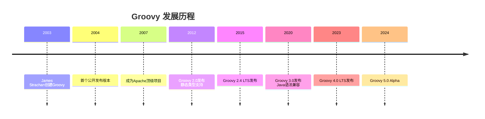

# 第一章：Groovy简介和环境搭建

> 对于精通Java的开发者来说，Groovy就像是一个熟悉的老朋友，既保持了Java的强大，又带来了更简洁优雅的语法。

## 1.1 什么是Groovy？

### 1.1.1 Groovy的历史和背景

Groovy是一个面向Java平台的敏捷动态语言。它最初由James Strachan于2003年创建，目标是创建一种更加Pythonic的Java语言。2007年，Groovy成为Apache软件基金会的顶级项目，这标志着它在企业级应用中的重要地位得到了认可。



### 1.1.2 Groovy的核心特性

**动态性与静态性并存**
```groovy
// 动态类型 - 脚本风格
def dynamicVar = "Hello"
dynamicVar = 123  // 运行时类型改变

// 静态类型 - Java风格
@CompileStatic
String staticMethod(String input) {
    return "Hello, ${input}"  // 编译时类型检查
}
```

**无缝Java互操作性**
```groovy
// 直接使用Java类和库
import java.util.List
import java.util.ArrayList

List<String> list = new ArrayList<>()
list.add("Groovy")
list.add("Java")

// Groovy语法糖增强
println list.join(", ")  // 直接打印，无需System.out.println
```

**闭包支持**
```groovy
// Groovy的闭包比Java 8的Lambda更强大
def numbers = [1, 2, 3, 4, 5]

def evenNumbers = numbers.findAll { number ->
    number % 2 == 0
}

// 闭可以作为参数传递
def applyOperation = { operation, x, y ->
    operation(x, y)
}

def sum = { a, b -> a + b }
def result = applyOperation(sum, 10, 20)
```

## 1.2 为什么选择Groovy？

### 1.2.1 与Java的对比优势

| 特性 | Java | Groovy |
|------|------|--------|
| 代码简洁性 | 冗长 | 简洁 |
| 学习曲线 | 陡峭（对新手） | 平缓（对Java开发者） |
| 动态特性 | 有限 | 丰富 |
| DSL支持 | 有限 | 强大 |
| 性能 | 通常更快 | 略慢但可优化 |
| 调试难度 | 较容易 | 动态特性增加复杂度 |

### 1.2.2 实际应用场景

**1. 构建脚本领域**
```groovy
// Gradle构建脚本是Groovy最成功的应用
plugins {
    id 'java'
}

repositories {
    mavenCentral()
}

dependencies {
    implementation 'org.springframework:spring-core:5.3.0'
}

task customTask {
    doLast {
        println "Custom task execution"
    }
}
```

**2. 测试框架**
```groovy
// Spock测试框架示例
class UserServiceSpec extends Specification {
    def "should create user successfully"() {
        given: "a user service"
        def service = new UserService()

        when: "creating a new user"
        def user = service.createUser("john.doe", "password123")

        then: "user should be created"
        user.username == "john.doe"
        user.id != null
    }
}
```

**3. 脚本自动化**
```groovy
// 数据库迁移脚本
@Grab('org.postgresql:postgresql:42.2.18')
import groovy.sql.Sql

def sql = Sql.newInstance("jdbc:postgresql://localhost:5432/mydb",
                         "user", "password", "org.postgresql.Driver")

sql.execute """
    CREATE TABLE IF NOT EXISTS users (
        id SERIAL PRIMARY KEY,
        username VARCHAR(50) NOT NULL,
        created_at TIMESTAMP DEFAULT CURRENT_TIMESTAMP
    )
"""
```

## 1.3 环境搭建

### 1.3.1 系统要求

- **Java版本**：Java 8或更高版本（推荐Java 11+）
- **内存要求**：至少512MB可用内存
- **磁盘空间**：约100MB用于Groovy安装

### 1.3.2 安装方式

**方式一：SDKMAN安装（推荐）**
```bash
# 安装SDKMAN
curl -s "https://get.sdkman.io" | bash
source "$HOME/.sdkman/bin/sdkman-init.sh"

# 安装Groovy
sdk install groovy

# 验证安装
groovy --version
```

**方式二：官方包下载**
```bash
# 下载解压（以Linux/Mac为例）
wget https://groovy.jfrog.io/artifactory/dist-release-local/groovy-zips/apache-groovy-binary-4.0.15.zip
unzip apache-groovy-binary-4.0.15.zip

# 配置环境变量
export GROOVY_HOME=/path/to/groovy-4.0.15
export PATH=$PATH:$GROOVY_HOME/bin

# 验证安装
groovy -v
```

**方式三：包管理器安装**
```bash
# Ubuntu/Debian
sudo apt-get install groovy

# macOS (Homebrew)
brew install groovy

# Windows (Chocolatey)
choco install groovy
```

### 1.3.3 IDE配置

**IntelliJ IDEA配置**
1. 安装Groovy插件（通常已内置）
2. 创建Groovy项目：
   ```groovy
   // build.gradle.kts
   plugins {
       groovy
   }

   repositories {
       mavenCentral()
   }

   dependencies {
       implementation("org.apache.groovy:groovy-all:4.0.15")
       testImplementation("org.spockframework:spock-core:2.4-M1-groovy-4.0")
   }
   ```

**VS Code配置**
1. 安装扩展：
   - Groovy Language Support
   - Code Runner

2. 配置settings.json：
   ```json
   {
       "groovy.home": "/path/to/groovy",
       "files.associations": {
           "*.groovy": "groovy"
       }
   }
   ```

## 1.4 第一个Groovy程序

### 1.4.1 命令行方式

创建文件`HelloWorld.groovy`：
```groovy
// 最简单的Groovy程序
println "Hello, Groovy!"

// 脚本风格的变量声明
def name = "World"
println "Hello, ${name}!"

// Java风格的类定义
class Greeter {
    String message

    String greet(String who) {
        "${message}, ${who}!"
    }
}

def greeter = new Greeter(message: "Welcome")
println greeter.greet("Java Developer")
```

运行程序：
```bash
groovy HelloWorld.groovy
```

### 1.4.2 编译运行方式

编译和运行分离：
```bash
# 编译
groovyc HelloWorld.groovy

# 运行
groovy HelloWorld
```

或者使用java命令：
```bash
java -cp $GROOVY_HOME/embeddable/groovy-all-4.0.15.jar:. HelloWorld
```

## 1.5 Groovy脚本基础

### 1.5.1 脚本vs类

**脚本文件（Script.groovy）**
```groovy
// 脚本级别的代码会被包装在main方法中
println "Script start"

def scriptVariable = "I'm in script"

// 定义的方法会成为脚本类的方法
def scriptMethod() {
    println "Method in script: ${scriptVariable}"
}

scriptMethod()

println "Script end"
```

**类文件（ClassExample.groovy）**
```groovy
// 显式的类定义
class Calculator {
    def add(a, b) { a + b }
    def multiply(a, b) { a * b }
}

// 类外代码（脚本部分）
def calc = new Calculator()
println "2 + 3 = ${calc.add(2, 3)}"
```

### 1.5.2 Groovy Shell交互式开发

启动Groovy Shell：
```bash
groovysh
```

交互式示例：
```groovy
groovy> def list = [1, 2, 3, 4, 5]
groovy> list.sum()
===> 15
groovy> list.collect { it * 2 }
===> [2, 4, 6, 8, 10]
```

## 1.6 依赖管理

### 1.6.1 @Grab注解

Groovy内置的依赖管理：
```groovy
@Grab('org.apache.commons:commons-lang3:3.12.0')
import org.apache.commons.lang3.StringUtils

def text = "  Hello Groovy  "
println StringUtils.capitalize(text.trim())
```

多依赖示例：
```groovy
@Grapes([
    @Grab('org.apache.commons:commons-lang3:3.12.0'),
    @Grab('com.google.guava:guava:31.1-jre'),
    @Grab('org.slf4j:slf4j-api:1.7.36')
])

import org.apache.commons.lang3.StringUtils
import com.google.common.collect.Lists

def words = ["hello", "world", "groovy"]
def capitalized = words.collect { StringUtils.capitalize(it) }
println Lists.newArrayList(capitalized)
```

### 1.6.2 Grape配置

自定义Grape仓库：
```groovy
@GrabResolver(name='aliyun', root='https://maven.aliyun.com/repository/public')
@Grab('org.springframework:spring-core:5.3.20')
import org.springframework.util.StringUtils

println StringUtils.hasText("Hello")
```

## 1.7 调试和性能分析

### 1.7.1 调试配置

**IntelliJ IDEA调试**
1. 设置断点
2. 以Debug模式运行Groovy脚本
3. 查看变量值和调用栈

**命令行调试**
```bash
# 启用调试模式
groovy -Dgroovy.debug=true HelloWorld.groovy

# 查看AST结构
groovy -ast HelloWorld.groovy
```

### 1.7.2 性能分析

```groovy
// 使用@Time注解测量执行时间
import groovy.transform.ASTTest
import groovy.transform.Field

@Field def startTime = System.currentTimeMillis()

def expensiveOperation() {
    Thread.sleep(1000)  // 模拟耗时操作
    return "Operation completed"
}

def result = expensiveOperation()
def duration = System.currentTimeMillis() - startTime
println "Result: ${result}"
println "Duration: ${duration}ms"
```

## 1.8 常见问题和解决方案

### 1.8.1 类路径问题

**问题**：ClassNotFoundException
```groovy
// 解决方案：明确指定类路径
@Grab('mysql:mysql-connector-java:8.0.28')
import groovy.sql.Sql

@GrabConfig(systemClassLoader=true)
def sql = Sql.newInstance("jdbc:mysql://localhost:3306/test",
                         "user", "password", "com.mysql.cj.jdbc.Driver")
```

### 1.8.2 版本兼容性问题

```groovy
// 检查Groovy版本
println "Groovy version: ${GroovySystem.getVersion()}"

// 版本兼容性检查
if (GroovySystem.version >= "3.0") {
    // 使用新特性
    println "Using Groovy 3.x features"
} else {
    // 兼容旧版本
    println "Using legacy features"
}
```

## 1.9 下一步学习路径

通过本章的学习，您应该：

✅ **理解Groovy的核心价值**：简洁语法、动态特性、Java兼容性
✅ **搭建开发环境**：IDE配置、依赖管理、调试设置
✅ **编写基本程序**：脚本、类、交互式开发
✅ **掌握基础工具**：Groovy Shell、依赖管理、性能分析

下一章我们将深入探讨Groovy与Java的语法差异，帮助您快速从Java开发思维转换到Groovy开发思维。

---

## 本章小结

Groovy为Java开发者提供了一个渐进式的学习和使用路径。您可以从简单的脚本开始，逐步利用Groovy的动态特性，最终掌握DSL开发的高级技巧。记住，Groovy不是要取代Java，而是要增强Java平台的能力。

**关键要点回顾**：
- Groovy与Java无缝互操作，可以混合使用
- 环境搭建简单，IDE支持完善
- 支持脚本化和面向对象两种开发方式
- 内置依赖管理，方便快速开发
- 适合构建脚本、测试框架、DSL开发等场景

现在，让我们在下一章探索Groovy的语法之美！