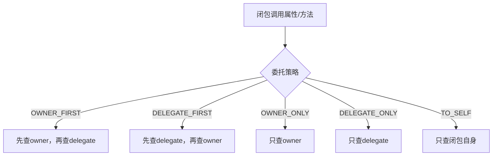

# 第三章：闭包（Closure）详解

> 闭包是Groovy中最强大、最核心的特性。它不仅是函数式编程的工具，更是DSL开发的基石。理解闭包，就掌握了Groovy的灵魂。

## 3.1 闭包的概念和原理

### 3.1.1 什么是闭包？

闭包是一个**代码块**，它有三个核心特性：
1. **可以像方法一样被调用**
2. **可以访问外部作用域的变量**
3. **可以作为参数传递给方法**

```groovy
// 基础闭包定义
def simpleClosure = {
    println "Hello from closure!"
}

// 调用闭包
simpleClosure()
simpleClosure.call()  // 另一种调用方式

// 带参数的闭包
def greeting = { name ->
    println "Hello, ${name}!"
}

greeting("Alice")
greeting.call("Bob")

// 带返回值的闭包
def add = { a, b -> a + b }
def result = add(5, 3)
println "5 + 3 = ${result}"
```

### 3.1.2 闭包 vs Java Lambda表达式

| 特性 | Groovy闭包 | Java Lambda |
|------|------------|-------------|
| 语法 | `{ params -> statements }` | `(params) -> expression` |
| 类型推断 | 完全动态 | 需要函数式接口 |
| 外部变量访问 | 可修改（需@Shared） | 只读（effectively final） |
| 闭包委托 | 支持（this、owner、delegate） | 不支持 |
| 方法调用 | `closure.call()`或`closure()` | 接口方法调用 |

```groovy
// Java Lambda风格
Comparator<String> javaStyle = (a, b) -> a.compareTo(b)

// Groovy闭包风格
def comparator = { a, b -> a <=> b }

// Groovy闭包更强大 - 可以修改外部变量
def counter = 0
def increment = {
    counter++  // 可以修改外部变量
    return counter
}

println increment()  // 1
println increment()  // 2
println counter      // 2
```

## 3.2 闭包的语法和调用

### 3.2.1 闭包定义语法

**完整的闭包定义**
```groovy
// 完整语法
def fullClosure = { String param1, int param2 ->
    // 闭包体
    println "Received: ${param1}, ${param2}"
    return "Result"
}

// 省略return关键字
def noReturn = { a, b ->
    // 最后一个表达式自动返回
    a * b
}

// 单参数闭包（隐式it参数）
def singleParam = {
    it.toUpperCase()  // it是默认参数名
}

// 无参数闭包
def noParams = { ->
    println "No parameters"
}

def implicitNoParams = {
    println "No parameters (implicit)"
}
```

**闭包参数的类型声明**
```groovy
// 显式类型声明
def typedClosure = { String name, int age ->
    "${name} is ${age} years old"
}

// 混合类型声明
def mixedClosure = { String text, number ->
    text * number  // 字符串重复
}

// 可变参数
def varArgsClosure = { String... names ->
    names.join(", ")
}
```

### 3.2.2 闭包调用方式

```groovy
def multiply = { a, b -> a * b }

// 方式1：直接调用
println multiply(3, 4)

// 方式2：call方法
println multiply.call(3, 4)

// 方式3：使用括号
def result = multiply(2, 5)
println result

// 闭包作为方法参数
def executeOperation(a, b, operation) {
    operation(a, b)
}

def sum = executeOperation(10, 20, { x, y -> x + y })
def product = executeOperation(10, 20, { x, y -> x * y })
```

## 3.3 闭包的上下文：this、owner、delegate

### 3.3.1 三个关键对象解析

闭包有三个重要的上下文对象，理解它们的区别是掌握闭包委托的关键：

```groovy
class OuterClass {
    def outerMethod() {
        def closure = {
            println "this: ${this.getClass().simpleName}"
            println "owner: ${owner.getClass().simpleName}"
            println "delegate: ${delegate.getClass().simpleName}"
        }
        closure()
    }
}

def outer = new OuterClass()
outer.outerMethod()
```

**this、owner、delegate的区别**

| 对象 | 含义 | 默认指向 |
|------|------|----------|
| `this` | 闭包定义所在的类实例 | 定义闭包的类 |
| `owner` | 闭包的直接所有者 | 定义闭包的对象或闭包 |
| `delegate` | 闭包的委托对象 | 默认同owner，可自定义 |

```groovy
class ContextExample {
    def outerVariable = "outer"

    def createClosure() {
        def innerVariable = "inner"

        def outerClosure = {
            println "Outer closure - this: ${this.class.simpleName}"
            println "Outer closure - owner: ${owner.class.simpleName}"
            println "Outer closure - delegate: ${delegate.class.simpleName}"
            println "Accessing outerVariable: ${outerVariable}"

            // 嵌套闭包
            def innerClosure = {
                println "Inner closure - this: ${this.class.simpleName}"
                println "Inner closure - owner: ${owner.class.simpleName}"
                println "Inner closure - delegate: ${delegate.class.simpleName}"
                println "Accessing outerVariable: ${outerVariable}"
                println "Accessing innerVariable: ${innerVariable}"
            }
            innerClosure()
        }
        return outerClosure
    }
}

def example = new ContextExample()
def closure = example.createClosure()
closure()
```

### 3.3.2 委托策略详解



```groovy
class Person {
    String name
    int age

    def introduce() {
        "I'm ${name}, ${age} years old"
    }
}

class Employee {
    String name = "Employee"
    String company = "Tech Corp"

    def getJobInfo() {
        "Works at ${company}"
    }
}

def person = new Person(name: "Alice", age: 30)
def employee = new Employee()

def closure = {
    println "Name: ${name}"
    println "Age: ${age}"
    println "Company: ${company}"
    println "Intro: ${introduce()}"
    println "Job: ${getJobInfo()}"
}

// 默认策略：OWNER_FIRST
closure.delegate = employee
println "=== OWNER_FIRST (default) ==="
closure.resolveStrategy = Closure.OWNER_FIRST
closure()  // 使用person的属性，employee的getJobInfo

println "\n=== DELEGATE_FIRST ==="
closure.resolveStrategy = Closure.DELEGATE_FIRST
closure()  // 优先使用employee的属性和方法

println "\n=== OWNER_ONLY ==="
closure.resolveStrategy = Closure.OWNER_ONLY
// closure()  // 会抛出MissingPropertyException，因为找不到company

println "\n=== DELEGATE_ONLY ==="
closure.resolveStrategy = Closure.DELEGATE_ONLY
closure()  // 只使用employee的属性和方法
```

## 3.4 闭包委托策略

### 3.4.1 委托策略选择指南

```groovy
class DatabaseConfig {
    String host = "localhost"
    int port = 3306
    String database = "myapp"
}

class ApplicationConfig {
    String environment = "development"
    boolean debug = true
}

// 构建器模式中使用委托
class ConfigBuilder {
    def config = [:]

    def propertyMissing(String name, value) {
        config[name] = value
    }

    def database(Closure closure) {
        def dbConfig = new DatabaseConfig()
        closure.delegate = dbConfig
        closure.resolveStrategy = Closure.DELEGATE_FIRST
        closure()
        config.database = dbConfig
        return this
    }

    def application(Closure closure) {
        def appConfig = new ApplicationConfig()
        closure.delegate = appConfig
        closure.resolveStrategy = Closure.DELEGATE_FIRST
        closure()
        config.application = appConfig
        return this
    }

    def build() {
        return config
    }
}

def builder = new ConfigBuilder()
def config = builder.database {
    host = "prod-db.example.com"
    port = 5432
    database = "production"
}.application {
    environment = "production"
    debug = false
}.build()

println config
```

### 3.4.2 动态委托和静态委托

```groovy
// 静态委托（编译时确定）
def staticDelegateClosure = { ->
    // 委托对象在编译时就确定了
    delegate.toString()
}

// 动态委托（运行时改变）
def dynamicDelegateClosure = { ->
    // 可以在运行时改变委托对象
    "Current delegate: ${delegate?.class?.simpleName}"
}

class FirstDelegate {
    String toString() { "First Delegate" }
}

class SecondDelegate {
    String toString() { "Second Delegate" }
}

def closure = dynamicDelegateClosure
closure.delegate = new FirstDelegate()
println closure()

closure.delegate = new SecondDelegate()
println closure()
```

## 3.5 在集合处理中的应用

### 3.5.1 函数式集合操作

```groovy
def numbers = [1, 2, 3, 4, 5, 6, 7, 8, 9, 10]

// map - 转换每个元素
def squares = numbers.collect { it * it }
println "Squares: ${squares}"

// findAll - 过滤元素
def evens = numbers.findAll { it % 2 == 0 }
println "Even numbers: ${evens}"

// find - 查找第一个匹配的元素
def firstMultipleOf3 = numbers.find { it % 3 == 0 }
println "First multiple of 3: ${firstMultipleOf3}"

// any/every - 条件判断
def hasEven = numbers.any { it % 2 == 0 }
def allPositive = numbers.every { it > 0 }
println "Has even: ${hasEven}, All positive: ${allPositive}"

// groupBy - 分组
def byModulo3 = numbers.groupBy { it % 3 }
println "Grouped by modulo 3: ${byModulo3}"

// inject - 累积操作
def sum = numbers.inject(0) { acc, val -> acc + val }
def factorial = (1..5).inject(1) { acc, val -> acc * val }
println "Sum: ${sum}, 5! = ${factorial}"
```

### 3.5.2 复杂数据处理

```groovy
def people = [
    [name: "Alice", age: 25, city: "Beijing", salary: 8000],
    [name: "Bob", age: 30, city: "Shanghai", salary: 12000],
    [name: "Charlie", age: 35, city: "Beijing", salary: 15000],
    [name: "Diana", age: 28, city: "Shenzhen", salary: 10000]
]

// 复杂数据处理管道
def result = people
    .findAll { person -> person.age >= 25 && person.age <= 35 }  // 年龄筛选
    .findAll { person -> person.salary >= 10000 }              // 薪资筛选
    .groupBy { it.city }                                        // 按城市分组
    .collectEntries { city, persons ->
        def avgSalary = persons.salary.sum() / persons.size()
        [city, [
            count: persons.size(),
            avgSalary: avgSalary,
            totalPeople: persons.collect { it.name }
        ]]
    }

println result

// 多级处理
def processedData = people
    .collect { person ->
        person + [
            ageGroup: person.age < 30 ? "Young" : "Senior",
            salaryLevel: person.salary < 10000 ? "Normal" : "High"
        ]
    }
    .groupBy { [city: it.city, ageGroup: it.ageGroup] }
    .collectMany { group, persons ->
        persons.collect { person ->
            [
                name: person.name,
                group: "${group.city}-${group.ageGroup}",
                salaryRank: persons.salary.indexOf(person.salary) + 1
            ]
        }
    }

println processedData
```

## 3.6 函数式编程特性

### 3.6.1 高阶函数

```groovy
// 函数作为一等公民
def createMultiplier = { factor ->
    return { number -> number * factor }  // 返回另一个闭包
}

def double = createMultiplier(2)
def triple = createMultiplier(3)

println double(5)   // 10
println triple(5)   // 15

// 函数组合
def compose = { f, g ->
    return { x -> f(g(x)) }
}

def add5 = { x -> x + 5 }
def multiply3 = { x -> x * 3 }

def addThenMultiply = compose(multiply3, add5)
def multiplyThenAdd = compose(add5, multiply3)

println addThenMultiply(10)  // (10 + 5) * 3 = 45
println multiplyThenAdd(10)  // 10 * 3 + 5 = 35
```

### 3.6.2 柯里化和偏应用

```groovy
// 柯里化 - 将多参数函数转换为单参数函数链
def curriedAdd = { a ->
    return { b ->
        return { c ->
            a + b + c
        }
    }
}

def add5 = curriedAdd(5)
def add5And3 = add5(3)
def result = add5And3(2)  // 5 + 3 + 2 = 10

// 偏应用 - 预设部分参数
def partialApply = { closure, *args ->
    return { *remainingArgs ->
        closure(*args, *remainingArgs)
    }
}

def add = { a, b, c -> a + b + c }
def add1and2 = partialApply(add, 1, 2)
println add1and2(3)  // 1 + 2 + 3 = 6
```

## 3.7 闭包的内存管理和性能

### 3.7.1 闭包与内存泄漏

```groovy
class ResourceManager {
    def resources = []

    def addResource(String resource) {
        resources << resource
    }

    def createProcessor() {
        // 潜在的内存泄漏：闭包持有this引用
        def processor = {
            // 这个闭包会隐式持有ResourceManager实例的引用
            resources.each { println "Processing: ${it}" }
        }
        return processor
    }

    // 更好的做法：使用弱引用
    def createWeakProcessor() {
        def weakRef = new java.lang.ref.WeakReference(this)
        def localResources = resources.clone()

        return {
            def manager = weakRef.get()
            if (manager) {
                localResources.each { println "Processing: ${it}" }
            }
        }
    }
}

// 使用闭包时的内存考虑
def manager = new ResourceManager()
manager.addResource("File1")
manager.addResource("File2")

def processor = manager.createProcessor()
// 此时manager无法被垃圾回收，因为processor持有引用
```

### 3.7.2 闭包性能优化

```groovy
// 性能测试
def performanceTest() {
    def largeList = (1..100000).toList()

    // 方法1：传统循环（最快）
    def startTime = System.currentTimeMillis()
    def sum1 = 0
    for (int i = 0; i < largeList.size(); i++) {
        sum1 += largeList[i]
    }
    def time1 = System.currentTimeMillis() - startTime

    // 方法2：each闭包（较慢）
    startTime = System.currentTimeMillis()
    def sum2 = 0
    largeList.each { sum2 += it }
    def time2 = System.currentTimeMillis() - startTime

    // 方法3：collect + sum（最慢但最简洁）
    startTime = System.currentTimeMillis()
    def sum3 = largeList.sum()
    def time3 = System.currentTimeMillis() - startTime

    println "Loop: ${time1}ms, Each: ${time2}ms, Sum: ${time3}ms"
}

// 使用静态编译优化
@CompileStatic
def optimizedSum(List<Integer> numbers) {
    numbers.sum { it }  // 静态编译后性能接近原生循环
}

// 闭缓存
def memoizedClosure = { n ->
    Thread.sleep(100)  // 模拟耗时操作
    n * n
}.memoize()

println memoizedClosure(5)  // 第一次调用，耗时
println memoizedClosure(5)  // 第二次调用，从缓存获取
```

## 3.8 闭包在实际项目中的应用

### 3.8.1 模板方法模式

```groovy
abstract class ReportGenerator {
    def generate() {
        def header = createHeader()
        def body = createBody()
        def footer = createFooter()

        return "${header}\n${body}\n${footer}"
    }

    protected abstract String createHeader()
    protected abstract String createBody()
    protected abstract String createFooter()
}

// 使用闭包简化模板方法
class FlexibleReportGenerator {
    def generate(Closure header, Closure body, Closure footer) {
        "${header()}\n${body()}\n${footer()}"
    }

    // 更灵活的版本
    def generateWithConfig(Closure config) {
        def reportConfig = [:]
        config.delegate = reportConfig
        config.resolveStrategy = Closure.DELEGATE_FIRST
        config()

        return buildReport(reportConfig)
    }

    private def buildReport(config) {
        def header = config.header ? config.header() : "Default Header"
        def body = config.body ? config.body() : "Default Body"
        def footer = config.footer ? config.footer() : "Default Footer"

        return "${header}\n${body}\n${footer}"
    }
}

def generator = new FlexibleReportGenerator()

// 使用闭包定制报告
def report = generator.generateWithConfig {
    header = { "=== Sales Report ===" }
    body = {
        """
        |Total Sales: \$100,000
        |Growth: +15%
        |Top Product: Groovy DSL
        """.stripMargin()
    }
    footer = { "Generated on ${new Date()}" }
}

println report
```

### 3.8.2 策略模式实现

```groovy
class PaymentProcessor {
    private Map<String, Closure> strategies = [:]

    def registerStrategy(String name, Closure strategy) {
        strategies[name] = strategy
    }

    def process(String strategyName, Map paymentData) {
        def strategy = strategies[strategyName]
        if (!strategy) {
            throw new IllegalArgumentException("Unknown strategy: ${strategyName}")
        }
        return strategy(paymentData)
    }
}

// 注册支付策略
def processor = new PaymentProcessor()

processor.registerStrategy("credit_card") { data ->
    // 信用卡支付逻辑
    println "Processing credit card payment for ${data.amount}"
    "SUCCESS"
}

processor.registerStrategy("paypal") { data ->
    // PayPal支付逻辑
    println "Processing PayPal payment for ${data.amount}"
    "SUCCESS"
}

processor.registerStrategy("bank_transfer") { data ->
    // 银行转账逻辑
    println "Processing bank transfer for ${data.amount}"
    "SUCCESS"
}

// 使用策略
def result1 = processor.process("credit_card", [amount: 1000, cardNumber: "1234"])
def result2 = processor.process("paypal", [amount: 500, email: "user@example.com"])
```

## 3.9 闭包与DSL开发

### 3.9.1 构建器模式DSL

```groovy
class HtmlBuilder {
    def output = new StringBuilder()

    def html(Closure closure) {
        output.append("<html>\n")
        closure.delegate = new BodyBuilder(output: output)
        closure.resolveStrategy = Closure.DELEGATE_FIRST
        closure()
        output.append("</html>")
        return output.toString()
    }
}

class BodyBuilder {
    StringBuilder output

    def body(Closure closure) {
        output.append("  <body>\n")
        closure.delegate = new ElementBuilder(output: output, indent: "    ")
        closure.resolveStrategy = Closure.DELEGATE_FIRST
        closure()
        output.append("  </body>\n")
    }

    def head(Closure closure) {
        output.append("  <head>\n")
        closure.delegate = new ElementBuilder(output: output, indent: "    ")
        closure.resolveStrategy = Closure.DELEGATE_FIRST
        closure()
        output.append("  </head>\n")
    }
}

class ElementBuilder {
    StringBuilder output
    String indent

    def title(String text) {
        output.append("${indent}<title>${text}</title>\n")
    }

    def h1(String text) {
        output.append("${indent}<h1>${text}</h1>\n")
    }

    def p(String text) {
        output.append("${indent}<p>${text}</p>\n")
    }

    def div(Closure closure) {
        output.append("${indent}<div>\n")
        def childBuilder = new ElementBuilder(output: output, indent: indent + "  ")
        closure.delegate = childBuilder
        closure.resolveStrategy = Closure.DELEGATE_FIRST
        closure()
        output.append("${indent}</div>\n")
    }
}

// 使用DSL构建HTML
def builder = new HtmlBuilder()
def html = builder.html {
    head {
        title("Groovy DSL Example")
    }
    body {
        h1("Welcome to Groovy DSL")
        p("This is generated using closures and delegation.")
        div {
            p("Nested content")
            p("More nested content")
        }
    }
}

println html
```

## 3.10 闭包调试和错误处理

### 3.10.1 闭包调试技巧

```groovy
// 获取闭包信息
def debugClosure = { a, b ->
    println "Called with: ${a}, ${b}"
    println "this: ${this.class.simpleName}"
    println "owner: ${owner.class.simpleName}"
    println "delegate: ${delegate.class.simpleName}"
    println "resolveStrategy: ${resolveStrategy}"
    a + b
}

// 检查闭包参数
def inspectClosure = { Closure closure ->
    println "Parameter count: ${closure.getMaximumNumberOfParameters()}"
    println "Parameter types: ${closure.getParameterTypes()}"
}

inspectClosure(debugClosure)

// 闭包堆栈跟踪
def traceClosure = { ->
    def stackTrace = Thread.currentThread().stackTrace
    stackTrace[0..3].each { trace ->
        println "${trace.className}.${trace.methodName}:${trace.lineNumber}"
    }
}
```

### 3.10.2 闭包中的异常处理

```groovy
// 安全的闭包执行
def safeExecute = { Closure closure, defaultValue = null ->
    try {
        closure.call()
    } catch (Exception e) {
        println "Closure execution failed: ${e.message}"
        return defaultValue
    }
}

def riskyClosure = {
    def x = 10
    def y = 0
    return x / y  // 会抛出异常
}

def result = safeExecute(riskyClosure, "Default Value")
println result

// 闭包超时处理
def timeoutExecute = { Closure closure, long timeoutMs ->
    def future = closure.callAsync()
    try {
        return future.get(timeoutMs, TimeUnit.MILLISECONDS)
    } catch (TimeoutException e) {
        future.cancel(true)
        throw new RuntimeException("Closure execution timed out after ${timeoutMs}ms")
    }
}
```

## 本章小结

闭包是Groovy最强大的特性，它为函数式编程和DSL开发提供了坚实的基础。

### 核心概念回顾

1. **闭包定义**：`{ params -> statements }`
2. **三大对象**：`this`、`owner`、`delegate`
3. **委托策略**：`OWNER_FIRST`、`DELEGATE_FIRST`等
4. **集合处理**：`collect`、`findAll`、`inject`等
5. **函数式编程**：高阶函数、柯里化、偏应用

### 实战应用

✅ **掌握闭包语法**：定义、调用、参数处理
✅ **理解委托机制**：this/owner/delegate的区别和应用
✅ **函数式编程**：使用闭包进行数据处理和转换
✅ **DSL开发基础**：构建器模式、策略模式
✅ **性能优化**：理解闭包的内存和性能影响

### 最佳实践

- **合理使用委托策略**，避免过度复杂化
- **注意内存泄漏**，特别是长生命周期的闭包
- **平衡简洁性和可读性**，不要过度使用闭包嵌套
- **在性能敏感的场景**，考虑使用静态编译

下一章我们将探索Groovy的元编程能力，这是Groovy另一个令人惊叹的特性，也是DSL开发的进阶基础。