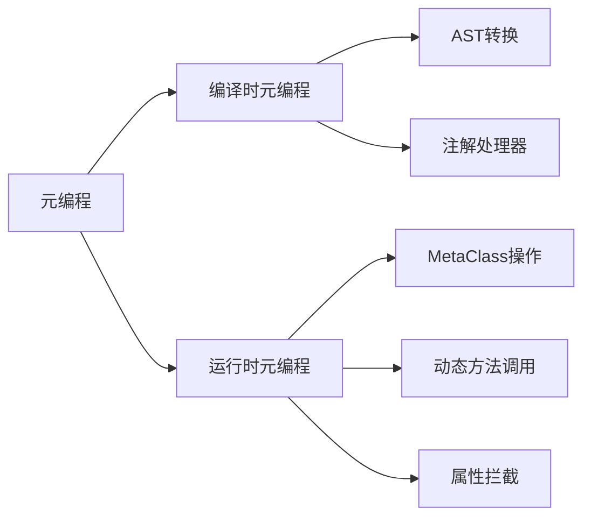

# 第四章：元编程基础

> 元编程是Groovy最神奇的特性。它让程序能够在运行时修改自身的结构和行为，为DSL开发提供了无限可能。掌握元编程，就掌握了Groovy的魔法。

## 4.1 理解元编程

### 4.1.1 什么是元编程？

元编程是指**编写能够操作其他程序的程序**。在Groovy中，元编程允许：

- 在运行时动态添加方法和属性
- 拦截方法调用和属性访问
- 修改类的行为
- 生成新的类和方法

```groovy
// 静态编程
class Person {
    String name
    int age

    def introduce() {
        "I'm ${name}, ${age} years old"
    }
}

def person = new Person(name: "Alice", age: 25)
println person.introduce()

// 元编程 - 运行时添加方法
Person.metaClass.sayHello = { ->
    "Hello, I'm ${delegate.name}"
}

println person.sayHello()  // 动态添加的方法
```

### 4.1.2 编译时 vs 运行时元编程



**编译时元编程**
```groovy
// 使用AST转换注解（编译时）
@ToString(includeNames=true)
@EqualsAndHashCode
class User {
    String name
    int age

    // 这些方法在编译时自动生成
}

// 自定义AST转换（高级）
@AnnotationWithElementTransformation
class MyClass {
    // 类在编译时被修改
}
```

**运行时元编程**
```groovy
// 运行时动态添加方法
String.metaClass.isPalindrome = {
    delegate == delegate.reverse()
}

println "level".isPalindrome()  // true
println "hello".isPalindrome()  // false

// 运行时拦截方法调用
class InterceptorExample {
    def invokeMethod(String name, args) {
        println "Calling method: ${name} with args: ${args}"
        return "Method intercepted!"
    }
}

def interceptor = new InterceptorExample()
println interceptor.someMethod(1, 2, 3)  // 方法不存在，但被拦截
```

## 4.2 MetaClass和MetaObject协议

### 4.2.1 MetaClass概念

每个Groovy对象都有一个MetaClass，它是元编程的核心：

```groovy
class SimpleClass {
    def existingMethod() {
        "Existing method"
    }
}

def obj = new SimpleClass()

// 获取MetaClass
def metaClass = obj.metaClass
println "MetaClass class: ${metaClass.class.simpleName}"
println "Class MetaClass: ${SimpleClass.metaClass.class.simpleName}"

// 检查方法是否存在
println "Has existingMethod: ${metaClass.respondsTo('existingMethod')}"
println "Has nonExistingMethod: ${metaClass.respondsTo('nonExistingMethod')}"

// 获取所有方法
def methods = metaClass.methods*.name.sort()
println "Methods: ${methods.take(10)}..."  // 显示前10个方法
```

### 4.2.2 MetaClass层次结构

```groovy
// 对象MetaClass vs 类MetaClass
class BaseClass {
    def baseMethod() { "Base method" }
}

class DerivedClass extends BaseClass {
    def derivedMethod() { "Derived method" }
}

def obj1 = new BaseClass()
def obj2 = new DerivedClass()

println "obj1 MetaClass: ${obj1.metaClass.theClass}"
println "obj2 MetaClass: ${obj2.metaClass.theClass}"

// 修改对象的MetaClass（只影响该对象）
obj1.metaClass.objectSpecificMethod = { -> "Only for obj1" }

println obj1.objectSpecificMethod()  // 可以调用
// println obj2.objectSpecificMethod()  // 抛出MissingMethodException

// 修改类的MetaClass（影响所有实例）
BaseClass.metaClass.classWideMethod = { -> "For all BaseClass instances" }

println obj1.classWideMethod()
println obj2.classWideMethod()  // 继承自BaseClass
```

## 4.3 动态方法调用

### 4.3.1 invokeMethod和方法拦截

```groovy
class MethodInterceptor {
    // 拦截所有不存在的方法调用
    def invokeMethod(String name, args) {
        println "Method '${name}' not found, but intercepted!"
        println "Arguments: ${args}"

        // 根据方法名执行不同逻辑
        switch(name) {
            case ~/get.+/:
                def propertyName = name.substring(3).uncapitalize()
                return "Getting property: ${propertyName}"
            case ~/set.+/:
                def propertyName = name.substring(3).uncapitalize()
                return "Setting property: ${propertyName} to ${args[0]}"
            default:
                return "Unknown method: ${name}"
        }
    }

    def existingMethod() {
        "This method exists normally"
    }
}

def interceptor = new MethodInterceptor()

// 存在的方法正常调用
println interceptor.existingMethod()

// 不存在的方法被拦截
println interceptor.getUserName()
println interceptor.setAge(25)
println interceptor.doSomething("param1", "param2")
```

### 4.3.2 methodMissing动态方法生成

```groovy
class DynamicMethodGenerator {
    // methodMissing只在第一次调用时触发，可以动态创建方法
    def methodMissing(String name, args) {
        println "Creating method: ${name}"

        // 动态创建方法
        def newMethod = { varArgs ->
            println "Dynamically created method '${name}' called with: ${varArgs}"
            return "Result from ${name}"
        }

        // 将方法添加到MetaClass
        metaClass."${name}" = newMethod

        // 调用新创建的方法
        return newMethod(args)
    }
}

def generator = new DynamicMethodGenerator()

// 第一次调用，方法被创建
println generator.doSomething(1, 2, 3)
println generator.doSomething("a", "b")

// 第二次调用，方法已存在，不会触发methodMissing
println generator.doAnotherThing("test")

// 检查方法是否已创建
println generator.metaClass.respondsTo('doSomething')
println generator.metaClass.respondsTo('doAnotherThing')
```

## 4.4 propertyMissing和methodMissing

### 4.4.1 propertyMissing属性拦截

```groovy
class DynamicPropertyHandler {
    def properties = [:]

    // 拦截属性读取
    def propertyMissing(String name) {
        println "Getting missing property: ${name}"
        return properties.get(name, "Property '${name}' not found")
    }

    // 拦截属性设置
    def propertyMissing(String name, value) {
        println "Setting missing property: ${name} = ${value}"
        properties[name] = value
    }

    def existingProperty = "I exist!"
}

def handler = new DynamicPropertyHandler()

// 存在的属性正常访问
println handler.existingProperty

// 不存在的属性被拦截
println handler.missingProperty
handler.newProperty = "Dynamic value"
println handler.newProperty

println handler.properties
```

### 4.4.2 实际应用：动态配置对象

```groovy
class Configuration {
    private def config = [:]

    // 支持点号访问
    def propertyMissing(String name) {
        config[name]
    }

    def propertyMissing(String name, value) {
        config[name] = value
    }

    // 支持Map式访问
    def getAt(String key) {
        config[key]
    }

    def putAt(String key, value) {
        config[key] = value
    }

    // 支持嵌套配置
    def section(String name, Closure closure) {
        def sectionConfig = config.get(name, [:])
        def builder = new Configuration()
        builder.config = sectionConfig

        closure.delegate = builder
        closure.resolveStrategy = Closure.DELEGATE_FIRST
        closure()

        config[name] = builder.config
        return this
    }
}

// 使用动态配置
def config = new Configuration()

config.server.host = "localhost"
config.server.port = 8080
config.server.ssl.enabled = true

// 嵌套配置
config.section("database") {
    url = "jdbc:mysql://localhost:3306/myapp"
    username = "root"
    password = "password"
    pool {
        maxConnections = 20
        timeout = 30000
    }
}

println config.server.host
println config["database.url"]
println config.database.pool.maxConnections
```

## 4.5 ExpandoMetaClass的使用

### 4.5.1 ExpandoMetaClass基础

```groovy
// 为现有类添加方法
String.metaClass.shout = { ->
    delegate.toUpperCase() + "!"
}

println "hello world".shout()

// 为现有类添加静态方法
String.metaClass.static.createRandom = { length ->
    def chars = 'ABCDEFGHIJKLMNOPQRSTUVWXYZabcdefghijklmnopqrstuvwxyz0123456789'
    new Random().with {
        (1..length).collect { chars.charAt(nextInt(chars.length())) }.join()
    }
}

println String.createRandom(10)

// 为现有类添加属性
String.metaClass.getUppercaseCount = { ->
    delegate.count { Character.isUpperCase(it) }
}

println "HelloWorld".uppercaseCount
```

### 4.5.2 ExpandoMetaClass高级应用

```groovy
// 添加构造函数
List.metaClass.constructor << { Collection collection ->
    def newList = new ArrayList()
    newList.addAll(collection)
    newList
}

// 添加运算符重载
class Money {
    BigDecimal amount
    String currency

    Money(amount, currency = "USD") {
        this.amount = amount
        this.currency = currency
    }

    String toString() { "${amount} ${currency}" }
}

Money.metaClass.plus = { Money other ->
    if (currency != other.currency) {
        throw new IllegalArgumentException("Currency mismatch")
    }
    new Money(amount + other.amount, currency)
}

Money.metaClass.next = { ->
    new Money(amount + 1, currency)
}

def money1 = new Money(100.50)
def money2 = new Money(50.25)

println money1 + money2
println money1.next()
```

## 4.6 类的动态修改

### 4.6.1 运行时类修改

```groovy
// 原始类
class Animal {
    String name

    def speak() {
        "${name} makes a sound"
    }
}

// 动态添加行为
Animal.metaClass.age = 0
Animal.metaClass.getAgeInHumanYears = { ->
    delegate.age * 7
}

Animal.metaClass.constructor << { String name, int age ->
    def animal = new Animal()
    animal.name = name
    animal.age = age
    animal
}

// 使用增强后的类
def dog = new Animal("Buddy", 3)
println dog.speak()
println "Age in human years: ${dog.ageInHumanYears}"

// 动态添加方法，模拟mixins
class Flyable {
    def fly() {
        "${delegate.name} is flying!"
    }
}

class Swimmable {
    def swim() {
        "${delegate.name} is swimming!"
    }
}

// 将mixin方法添加到Animal
Animal.metaClass.fly = new Flyable().&fly
Animal.metaClass.swim = new Swimmable().&swim

def duck = new Animal("Donald", 2)
println duck.fly()
println duck.swim()
```

### 4.6.2 Mixin模式实现

```groovy
// 定义Mixin
trait Serializable {
    def serialize() {
        def properties = delegate.metaClass.properties.findAll {
            it.name != "class" && it.name != "metaClass"
        }.collectEntries { [it.name, it.getProperty(delegate)] }

        properties.toString()
    }
}

trait Validatable {
    def validate() {
        def errors = []

        delegate.metaClass.properties.each { prop ->
            def value = prop.getProperty(delegate)
            if (value == null || value == "") {
                errors << "${prop.name} cannot be empty"
            }
        }

        errors
    }
}

// 使用mixin
class User implements Serializable, Validatable {
    String name
    String email
    int age

    User(name, email, age) {
        this.name = name
        this.email = email
        this.age = age
    }
}

def user = new User("Alice", "alice@example.com", 25)
println user.serialize()

def invalidUser = new User("", "", 0)
println invalidUser.validate()
```

## 4.7 运行时类型检查

### 4.7.1 动态类型检查

```groovy
// 类型检查装饰器
def typeCheckedClosure = { Closure closure ->
    return { args ->
        // 运行时类型检查
        args.eachWithIndex { arg, index ->
            if (arg == null) {
                throw new IllegalArgumentException("Argument ${index} cannot be null")
            }
        }

        // 执行原闭包
        closure(*args)
    }
}

// 类型检查的方法添加
def addTypedMethod = { Class clazz, String methodName, List<Class> paramTypes, Closure implementation ->
    clazz.metaClass."${methodName}" = { Object[] args ->
        // 检查参数数量
        if (args.size() != paramTypes.size()) {
            throw new IllegalArgumentException("Expected ${paramTypes.size()} arguments, got ${args.size()}")
        }

        // 检查参数类型
        args.eachWithIndex { arg, index ->
            def expectedType = paramTypes[index]
            if (arg != null && !expectedType.isAssignableFrom(arg.getClass())) {
                throw new IllegalArgumentException("Argument ${index} should be ${expectedType.simpleName}, got ${arg.getClass().simpleName}")
            }
        }

        // 执行实现
        implementation(*args)
    }
}

// 为String类添加类型安全的方法
addTypedMethod(String, "safeAppend", [Integer, String]) { count, suffix ->
    delegate + suffix * count
}

println "Hello".safeAppend(3, "!")
// println "Hello".safeAppend("3", "!")  // 类型错误
```

### 4.7.2 强类型和弱类型的平衡

```groovy
// 混合模式：部分静态编译
class MixedTypeExample {
    // 静态编译的方法
    @CompileStatic
    def staticAdd(int a, int b) {
        a + b
    }

    // 动态方法
    def dynamicAdd(a, b) {
        a + b
    }

    // 条件编译
    def conditionalCompile(a, b) {
        // 在静态编译环境中使用动态特性
        @CompileDynamic
        def dynamicResult = a + b

        return dynamicResult
    }
}

def example = new MixedTypeExample()
println example.staticAdd(5, 3)
println example.dynamicAdd("Hello", "World")
println example.conditionalCompile("Test", 123)
```

## 4.8 元编程实战案例

### 4.8.1 构建DSL框架

```groovy
// DSL构建器基类
class DSLBuilder {
    def properties = [:]

    def propertyMissing(String name, value = null) {
        if (value != null) {
            properties[name] = value
        } else {
            properties[name]
        }
    }

    def propertyMissing(String name) {
        // 如果属性不存在，创建子构建器
        def childBuilder = new DSLBuilder()
        properties[name] = childBuilder
        childBuilder
    }

    def build() {
        properties.collectEntries { key, value ->
            [key, value instanceof DSLBuilder ? value.build() : value]
        }
    }
}

// 特定领域的DSL构建器
class WebConfigBuilder extends DSLBuilder {
    def server(Closure closure) {
        def serverBuilder = new DSLBuilder()
        closure.delegate = serverBuilder
        closure.resolveStrategy = Closure.DELEGATE_FIRST
        closure()
        properties.server = serverBuilder.build()
    }

    def database(Closure closure) {
        def dbBuilder = new DSLBuilder()
        closure.delegate = dbBuilder
        closure.resolveStrategy = Closure.DELEGATE_FIRST
        closure()
        properties.database = dbBuilder.build()
    }

    def caching(Closure closure) {
        def cacheBuilder = new DSLBuilder()
        closure.delegate = cacheBuilder
        closure.resolveStrategy = Closure.DELEGATE_FIRST
        closure()
        properties.caching = cacheBuilder.build()
    }
}

// 使用DSL
def config = new WebConfigBuilder()

config {
    server {
        host = "localhost"
        port = 8080
        ssl.enabled = true
        ssl.port = 8443
    }

    database {
        url = "jdbc:mysql://localhost:3306/myapp"
        username = "root"
        password = "password"
        pool {
            maxConnections = 20
            minConnections = 5
            timeout = 30000
        }
    }

    caching {
        enabled = true
        provider = "redis"
        redis {
            host = "localhost"
            port = 6379
            ttl = 3600
        }
    }
}

println config.build()
```

### 4.8.2 动态代理模式

```groovy
// 动态代理生成器
class DynamicProxyGenerator {
    static def createProxy(Object target, Map interceptors = [:]) {
        def proxyClass = new GroovyClassLoader().parseClass('''
            class DynamicProxy {
                def target
                def interceptors = [:]

                def methodMissing(String name, args) {
                    def beforeInterceptor = interceptors["before_${name}"]
                    def afterInterceptor = interceptors["after_${name}"]

                    // 前置拦截
                    if (beforeInterceptor) {
                        beforeInterceptor(name, args)
                    }

                    // 执行目标方法
                    def result
                    try {
                        result = target."$name"(*args)
                    } catch (Exception e) {
                        def errorInterceptor = interceptors["error_${name}"]
                        if (errorInterceptor) {
                            errorInterceptor(name, args, e)
                        } else {
                            throw e
                        }
                        return
                    }

                    // 后置拦截
                    if (afterInterceptor) {
                        afterInterceptor(name, args, result)
                    }

                    return result
                }
            }
        ''')

        def proxy = proxyClass.newInstance()
        proxy.target = target
        proxy.interceptors = interceptors
        return proxy
    }
}

// 实际服务
class UserService {
    def createUser(String name, String email) {
        println "Creating user: ${name}, ${email}"
        return "User created successfully"
    }

    def deleteUser(String userId) {
        println "Deleting user: ${userId}"
        return "User deleted successfully"
    }
}

// 创建代理
def userService = new UserService()
def proxy = DynamicProxyGenerator.createProxy(userService, [
    before_createUser: { name, args ->
        println "Before creating user: ${args}"
    },
    after_createUser: { name, args, result ->
        println "After creating user: ${result}"
    },
    before_deleteUser: { name, args ->
        println "Logging deletion attempt: ${args}"
    }
])

proxy.createUser("Alice", "alice@example.com")
proxy.deleteUser("123")
```

## 4.9 性能考虑和最佳实践

### 4.9.1 元编程性能影响

```groovy
// 性能测试
class PerformanceTest {
    def normalMethod(int x) {
        x * 2
    }

    def dynamicMethod(int x) {
        x * 2
    }
}

def test = new PerformanceTest()

// 添加动态方法
PerformanceTest.metaClass.addedMethod = { int x -> x * 2 }

// 性能比较
def iterations = 100000

// 原生方法性能
def start = System.currentTimeMillis()
iterations.times { test.normalMethod(it) }
def normalTime = System.currentTimeMillis() - start

// 动态方法性能
start = System.currentTimeMillis()
iterations.times { test.dynamicMethod(it) }
def dynamicTime = System.currentTimeMillis() - start

// 添加的方法性能
start = System.currentTimeMillis()
iterations.times { test.addedMethod(it) }
def addedTime = System.currentTimeMillis() - start

println "Normal method: ${normalTime}ms"
println "Dynamic method: ${dynamicTime}ms"
println "Added method: ${addedTime}ms"
```

### 4.9.2 元编程最佳实践

```groovy
// 好的实践：谨慎使用元编程
class GoodMetaProgramming {
    // 1. 使用ExpandoMetaClass修改类，而不是对象
    // 2. 提供清晰的文档说明动态行为
    // 3. 考虑静态编译替代方案

    // 推荐：使用AST转换（编译时）
    @CompileStatic
    def safeMethod(String input) {
        // 静态编译提供类型安全
        input?.toUpperCase()
    }

    // 避免：过度使用动态特性
    def avoidOveruse() {
        // 不要在性能敏感路径使用过多的元编程
        // 避免在生产环境中频繁修改MetaClass
    }
}

// 元编程使用指南
def metaProgrammingGuidelines = [
    "只在确实需要时使用元编程",
    "优先使用编译时元编程（AST转换）",
    "为动态行为编写测试",
    "考虑性能影响",
    "提供清晰的文档",
    "避免在生产环境中频繁修改MetaClass",
    "使用类型检查减少运行时错误"
]

metaProgrammingGuidelines.each { println "- ${it}" }
```

## 4.10 调试元编程代码

### 4.10.1 元编程调试技巧

```groovy
// MetaClass调试工具
class MetaClassDebugger {
    static def inspectObject(Object obj) {
        println "=== Object Inspection ==="
        println "Class: ${obj.class.name}"
        println "MetaClass: ${obj.metaClass.class.name}"

        println "\n=== Methods ==="
        def methods = obj.metaClass.methods.findAll { !it.declaringClass.name.startsWith('java.') }
        methods.take(10).each { method ->
            println "- ${method.name}(${method.parameterTypes.collect { it.simpleName }.join(', ')})"
        }
        println "... and ${methods.size() - 10} more methods"

        println "\n=== Properties ==="
        def properties = obj.metaClass.properties.findAll { !it.type.name.startsWith('java.') }
        properties.each { prop ->
            println "- ${prop.name}: ${prop.type.simpleName}"
        }
    }

    static def traceMethodCalls(Object obj, String methodName) {
        def originalMethod = obj.metaClass.getMetaMethod(methodName)

        obj.metaClass."${methodName}" = { Object[] args ->
            println "Calling ${methodName} with args: ${args}"
            def result = originalMethod.invoke(delegate, args)
            println "${methodName} returned: ${result}"
            return result
        }
    }
}

// 使用调试器
class SampleClass {
    def normalMethod(String param) {
        "Result: ${param}"
    }
}

def sample = new SampleClass()
MetaClassDebugger.inspectObject(sample)
MetaClassDebugger.traceMethodCalls(sample, 'normalMethod')
sample.normalMethod("test")
```

## 本章小结

元编程是Groovy最强大的特性之一，它为动态语言特性的实现和DSL开发提供了基础。

### 核心概念回顾

1. **MetaClass系统**：每个对象都有MetaClass，用于控制行为
2. **方法拦截**：`invokeMethod`和`methodMissing`
3. **属性拦截**：`propertyMissing`
4. **ExpandoMetaClass**：运行时修改类行为
5. **性能权衡**：动态特性的性能影响

### 实战应用

✅ **掌握MetaClass操作**：添加方法和属性
✅ **理解方法拦截机制**：`invokeMethod`和`methodMissing`
✅ **学会动态对象创建**：Expando和ExpandoMetaClass
✅ **实现DSL基础**：动态属性和方法支持
✅ **性能意识**：了解元编程的性能影响

### 最佳实践

- **适度使用**：不要过度依赖元编程
- **文档化**：为动态行为提供清晰说明
- **测试覆盖**：动态行为需要充分测试
- **性能考虑**：在关键路径避免过度使用
- **编译时优化**：优先考虑AST转换

下一章我们将探索Groovy的集合处理能力，这是日常开发中最常用的功能之一。

---

**元编程的威力在于它能够突破静态语言的限制，让程序真正"活"起来。但记住，能力越大，责任越大。**