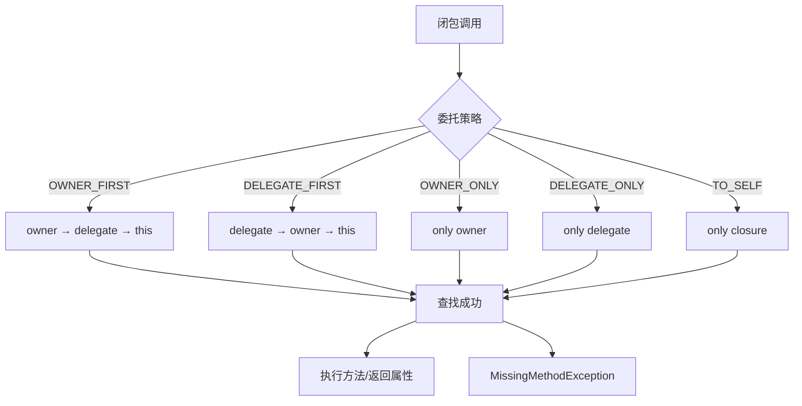
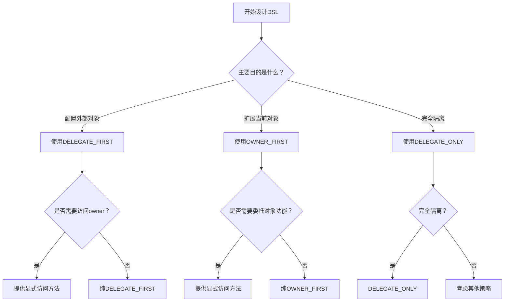

# 第十二章：闭包委托策略

> 闭包委托策略是Groovy DSL开发的核心机制。理解委托策略的工作原理，能够帮助开发者创建更加优雅和强大的DSL。本章将深入探讨Groovy的委托机制和最佳实践。

## 12.1 委托策略基础

### 12.1.1 三大对象：this、owner、delegate

在Groovy闭包中，有三个关键对象决定了方法和属性的解析顺序：



**this对象**：
- 指向定义闭包的类实例
- 在闭包中直接访问`this`总是返回闭包定义所在的对象

**owner对象**：
- 指向包含闭包的最近对象
- 如果闭包定义在类中，owner等于this
- 如果闭包定义在其他闭包中，owner指向外层闭包

**delegate对象**：
- 默认等于owner
- 可以被自定义设置
- 主要用于DSL中的方法解析

```groovy
// 委托对象详解
class OuterClass {
    String outerProperty = "Outer Class Property"

    def outerMethod() {
        println "Called from OuterClass: ${outerProperty}"
    }

    def createNestedClosure() {
        def nestedClosure = {
            println "This: ${this.class.simpleName} - ${this.outerProperty}"
            println "Owner: ${owner.class.simpleName} - ${owner.outerProperty}"
            println "Delegate: ${delegate.class.simpleName} - ${delegate.outerProperty}"
        }

        return nestedClosure
    }
}

def outer = new OuterClass()
def closure = outer.createNestedClosure()
closure()

// 闭包中的嵌套闭包
def outerClosure = {
    def innerProperty = "Inner Property"

    def innerClosure = {
        println "This: ${this.class.simpleName} - ${this.outerProperty ?: 'undefined'}"
        println "Owner: ${owner.class.simpleName} - ${owner.innerProperty}"
        println "Delegate: ${delegate.class.simpleName} - ${delegate.innerProperty ?: 'undefined'}"
    }

    innerClosure()
}

outerClosure()
```

### 12.1.2 委托策略详解

Groovy提供了五种委托策略，每种策略都有不同的解析顺序：

```groovy
// 委托策略对比示例
class TargetObject {
    String name = "Target Object"

    def greet() {
        "Hello from Target: ${name}"
    }

    def sayGoodbye() {
        "Goodbye from Target: ${name}"
    }
}

class OwnerObject {
    String name = "Owner Object"

    def greet() {
        "Hello from Owner: ${name}"
    }

    def sayHello() {
        "Hello from Owner: ${name}"
    }
}

class DelegateTester {
    private TargetObject target = new TargetObject()
    private OwnerObject owner = new OwnerObject()

    def testOwnerFirst() {
        def closure = {
            println "Strategy: OWNER_FIRST"
            println "greet(): ${greet()}"  // 来自owner
            println "sayHello(): ${sayHello()}"  // 来自owner
            println "sayGoodbye(): ${sayGoodbye()}"  // 来自delegate
            println "name: ${name}"  // 来自owner
        }

        closure.delegate = target
        closure.resolveStrategy = Closure.OWNER_FIRST
        closure()
    }

    def testDelegateFirst() {
        def closure = {
            println "Strategy: DELEGATE_FIRST"
            println "greet(): ${greet()}"  // 来自delegate
            println "sayHello(): ${sayHello()}"  // 来自owner
            println "sayGoodbye(): ${sayGoodbye()}"  // 来自delegate
            println "name: ${name}"  // 来自delegate
        }

        closure.delegate = target
        closure.resolveStrategy = Closure.DELEGATE_FIRST
        closure()
    }

    def testOwnerOnly() {
        def closure = {
            println "Strategy: OWNER_ONLY"
            println "greet(): ${greet()}"  // 来自owner
            println "sayHello(): ${sayHello()}"  // 来自owner
            // println "sayGoodbye(): ${sayGoodbye()}"  // 会抛出MissingMethodException
        }

        closure.delegate = target
        closure.resolveStrategy = Closure.OWNER_ONLY
        closure()
    }

    def testDelegateOnly() {
        def closure = {
            println "Strategy: DELEGATE_ONLY"
            println "greet(): ${greet()}"  // 来自delegate
            println "sayGoodbye(): ${sayGoodbye()}"  // 来自delegate
            // println "sayHello(): ${sayHello()}"  // 会抛出MissingMethodException
        }

        closure.delegate = target
        closure.resolveStrategy = Closure.DELEGATE_ONLY
        closure()
    }
}

def tester = new DelegateTester()

tester.testOwnerFirst()
println()
tester.testDelegateFirst()
println()
tester.testOwnerOnly()
println()
tester.testDelegateOnly()
```

## 12.2 DELEGATE_FIRST策略

### 12.2.1 基本用法

DELEGATE_FIRST是最常用的委托策略，优先在delegate对象中查找方法和属性。

```groovy
// DELEGATE_FIRST策略示例
class WebServerConfig {
    String host = "localhost"
    int port = 8080
    Map<String, String> headers = [:]

    def host(String host) {
        this.host = host
        println "Setting host to: ${host}"
    }

    def port(int port) {
        this.port = port
        println "Setting port to: ${port}"
    }

    def header(String name, String value) {
        headers[name] = value
        println "Setting header: ${name} = ${value}"
    }

    String toString() {
        "WebServer(host=${host}, port=${port}, headers=${headers})"
    }
}

class ApplicationConfig {
    WebServerConfig server = new WebServerConfig()
    String appName = "My App"

    def configure(Closure closure) {
        closure.delegate = server
        closure.resolveStrategy = Closure.DELEGATE_FIRST
        closure()
        return this
    }

    def name(String name) {
        this.appName = name
        println "Setting app name to: ${name}"
    }

    String toString() {
        "Application(name=${appName}, server=${server})"
    }
}

// 使用DELEGATE_FIRST策略
def appConfig = new ApplicationConfig()

appConfig.configure {
    // 这些方法调用会被委托给server对象
    host "api.example.com"
    port 443
    header "Content-Type", "application/json"
    header "X-API-Version", "1.0"

    // 如果要访问owner对象的方法，需要显式指定
    owner.name "My Application"  // 或者使用this.name
}

println appConfig
```

### 12.2.2 实际应用：构建器DSL

```groovy
// 构建器DSL使用DELEGATE_FIRST
class DatabaseConfig {
    String url
    String username
    String password
    int maxConnections = 10
    int timeout = 30000
    boolean sslEnabled = false

    def url(String url) {
        this.url = url
        println "Database URL: ${url}"
    }

    def credentials(String username, String password) {
        this.username = username
        this.password = password
        println "Database credentials set for user: ${username}"
    }

    def pool(Closure closure) {
        def poolConfig = new PoolConfig()
        closure.delegate = poolConfig
        closure.resolveStrategy = Closure.DELEGATE_FIRST
        closure()
        this.maxConnections = poolConfig.maxConnections
        this.timeout = poolConfig.timeout
    }

    def ssl(boolean enabled) {
        this.sslEnabled = enabled
        println "SSL enabled: ${enabled}"
    }

    String toString() {
        """DatabaseConfig[
            url=${url},
            username=${username},
            maxConnections=${maxConnections},
            timeout=${timeout},
            ssl=${sslEnabled}
        ]"""
    }
}

class PoolConfig {
    int maxConnections = 10
    int timeout = 30000

    def maxConnections(int count) {
        this.maxConnections = count
        println "Max connections: ${count}"
    }

    def timeout(int ms) {
        this.timeout = ms
        println "Connection timeout: ${ms}ms"
    }
}

class ApplicationBuilder {
    DatabaseConfig database = new DatabaseConfig()
    List<String> features = []

    def database(Closure closure) {
        closure.delegate = database
        closure.resolveStrategy = Closure.DELEGATE_FIRST
        closure()
        return this
    }

    def features(Closure closure) {
        closure.delegate = new FeaturesBuilder(features)
        closure.resolveStrategy = Closure.DELEGATE_FIRST
        closure()
        return this
    }

    def build() {
        println "Building application configuration..."
        return new Application(database, features)
    }
}

class FeaturesBuilder {
    private List<String> features

    FeaturesBuilder(List<String> features) {
        this.features = features
    }

    def enable(String feature) {
        features.add(feature)
        println "Feature enabled: ${feature}"
    }

    def methodMissing(String name, args) {
        if (name.startsWith('enable')) {
            def feature = name.substring(6).uncapitalize()
            enable(feature)
        } else {
            throw new MissingMethodException(name, this.class, args)
        }
    }
}

class Application {
    DatabaseConfig database
    List<String> features

    Application(DatabaseConfig database, List<String> features) {
        this.database = database
        this.features = features
    }

    String toString() {
        """Application[
            database=${database},
            features=${features}
        ]"""
    }
}

// 使用构建器DSL
def builder = new ApplicationBuilder()

def app = builder.database {
    url "jdbc:mysql://prod-db:3306/myapp"
    credentials "appuser", "apppassword"
    ssl true
    pool {
        maxConnections 50
        timeout 60000
    }
}.features {
    enableAuthentication
    enableLogging
    enableCaching
    enableMonitoring
}.build()

println app
```

## 12.3 OWNER_FIRST策略

### 12.1.1 基本用法

OWNER_FIRST策略优先在owner对象中查找方法和属性。

```groovy
// OWNER_FIRST策略示例
class BaseConfig {
    String name = "Base Config"
    String description = "Base Description"

    def name(String name) {
        this.name = name
        println "Base config name set to: ${name}"
    }

    def common() {
        "Common method from BaseConfig"
    }
}

class ExtendedConfig extends BaseConfig {
    String extendedProperty = "Extended Property"

    def extendedProperty(String value) {
        this.extendedProperty = value
        println "Extended property set to: ${value}"
    }

    def common() {
        "Common method from ExtendedConfig"
    }
}

class ConfigBuilder {
    BaseConfig config

    ConfigBuilder(BaseConfig config) {
        this.config = config
    }

    def configure(Closure closure) {
        closure.delegate = config
        closure.resolveStrategy = Closure.OWNER_FIRST
        closure()
        return this
    }

    def special(String value) {
        println "Special configuration: ${value}"
    }
}

// 使用OWNER_FIRST策略
def extendedConfig = new ExtendedConfig()
def builder = new ConfigBuilder(extendedConfig)

builder.configure {
    // 这些调用会优先在owner（ConfigBuilder）中查找
    // 如果找不到，再到delegate（ExtendedConfig）中查找

    name "My Extended Config"  // 来自BaseConfig（继承的）
    extendedProperty "Custom Value"  // 来自ExtendedConfig
    special "Custom Setting"  // 来自ConfigBuilder（owner）

    println "Common method: ${common()}"  // 来自ExtendedConfig
}

println "Final config: ${extendedConfig.name}"
println "Extended property: ${extendedConfig.extendedProperty}"
```

### 12.3.2 实际应用：混合配置DSL

```groovy
// 混合配置DSL使用OWNER_FIRST
class SecurityConfig {
    boolean authenticationEnabled = true
    boolean sslEnabled = false
    Map<String, String> users = [:]

    def authentication(boolean enabled) {
        this.authenticationEnabled = enabled
        println "Authentication: ${enabled}"
    }

    def ssl(boolean enabled) {
        this.sslEnabled = enabled
        println "SSL: ${enabled}"
    }

    def user(String username, String password) {
        users[username] = password
        println "User added: ${username}"
    }

    String toString() {
        """SecurityConfig[
            auth=${authenticationEnabled},
            ssl=${sslEnabled},
            users=${users.keySet()}
        ]"""
    }
}

class LoggingConfig {
    String level = "INFO"
    boolean consoleEnabled = true
    boolean fileEnabled = false

    def level(String level) {
        this.level = level
        println "Log level: ${level}"
    }

    def console(boolean enabled) {
        this.consoleEnabled = enabled
        println "Console logging: ${enabled}"
    }

    def file(boolean enabled) {
        this.fileEnabled = enabled
        println "File logging: ${enabled}"
    }

    String toString() {
        """LoggingConfig[
            level=${level},
            console=${consoleEnabled},
            file=${fileEnabled}
        ]"""
    }
}

class ApplicationSetup {
    SecurityConfig security = new SecurityConfig()
    LoggingConfig logging = new LoggingConfig()
    List<String> modules = []

    // OWNER_FIRST策略的配置方法
    def security(Closure closure) {
        closure.delegate = security
        closure.resolveStrategy = Closure.OWNER_FIRST
        closure()
        return this
    }

    def logging(Closure closure) {
        closure.delegate = logging
        closure.resolveStrategy = Closure.OWNER_FIRST
        closure()
        return this
    }

    def modules(Closure closure) {
        def moduleBuilder = new ModuleBuilder(modules)
        closure.delegate = moduleBuilder
        closure.resolveStrategy = Closure.OWNER_FIRST
        closure()
        return this
    }

    // 这些方法属于owner对象
    def environment(String env) {
        println "Environment: ${env}"
        if (env == "production") {
            // 可以调整其他配置
            security.authentication = true
            security.ssl = true
            logging.level = "WARN"
            logging.console = false
            logging.file = true
        }
        return this
    }

    def debug(boolean enabled) {
        println "Debug mode: ${enabled}"
        if (enabled) {
            logging.level = "DEBUG"
            logging.console = true
        }
        return this
    }

    def complete() {
        println "Application setup completed!"
        return new ApplicationConfig(security, logging, modules)
    }
}

class ModuleBuilder {
    private List<String> modules

    ModuleBuilder(List<String> modules) {
        this.modules = modules
    }

    def enable(String... moduleNames) {
        moduleNames.each { name ->
            modules.add(name)
            println "Module enabled: ${name}"
        }
    }

    def disable(String... moduleNames) {
        moduleNames.each { name ->
            modules.remove(name)
            println "Module disabled: ${name}"
        }
    }

    def methodMissing(String name, args) {
        if (name.startsWith('enable') || name.startsWith('disable')) {
            def action = name.startsWith('enable') ? 'enable' : 'disable'
            def module = name.substring(action.length()).uncapitalize()
            "${action}"(module)
        } else {
            throw new MissingMethodException(name, this.class, args)
        }
    }
}

class ApplicationConfig {
    SecurityConfig security
    LoggingConfig logging
    List<String> modules

    ApplicationConfig(SecurityConfig security, LoggingConfig logging, List<String> modules) {
        this.security = security
        this.logging = logging
        this.modules = modules
    }

    String toString() {
        """ApplicationConfig[
            ${security},
            ${logging},
            modules=${modules}
        ]"""
    }
}

// 使用混合配置DSL
def setup = new ApplicationSetup()

def config = setup.environment("production")
    .debug(false)
    .security {
        authentication true
        ssl true
        user "admin", "securePassword"
        user "api", "apiKey"
    }
    .logging {
        level "ERROR"
        console false
        file true
    }
    .modules {
        enable "authentication"
        enable "userManagement"
        enable "reporting"
        disable "debugTools"
        enablePerformanceMonitoring
    }
    .complete()

println config
```

## 12.4 委托策略选择指南

### 12.4.1 策略选择决策树



### 12.4.2 实际选择场景

```groovy
// 场景1：纯配置DSL - DELEGATE_FIRST
class DatabaseBuilder {
    def build(Closure closure) {
        def config = new DatabaseConfig()
        closure.delegate = config
        closure.resolveStrategy = Closure.DELEGATE_FIRST
        closure()
        return config
    }
}

// 使用：纯粹的配置，不需要访问builder
def dbConfig = new DatabaseBuilder().build {
    url "jdbc:mysql://localhost:3306/db"
    username "user"
    password "pass"
}

// 场景2：混合功能DSL - OWNER_FIRST
class ServiceBuilder {
    List<String> features = []

    def build(Closure closure) {
        def service = new ServiceConfig()
        closure.delegate = service
        closure.resolveStrategy = Closure.OWNER_FIRST
        closure()
        service.features = features
        return service
    }

    def enableFeature(String feature) {
        features.add(feature)
        println "Feature enabled globally: ${feature}"
    }
}

// 使用：既能配置service，又能使用builder的功能
def serviceConfig = new ServiceBuilder().build {
    enableFeature "caching"  // 来自owner
    enableFeature "monitoring"  // 来自owner

    name "UserService"  // 来自delegate
    timeout 5000  // 来自delegate
}

// 场景3：隔离DSL - DELEGATE_ONLY
class WorkflowBuilder {
    def createStep(String stepName, Closure closure) {
        def step = new WorkflowStep(name: stepName)
        closure.delegate = step
        closure.resolveStrategy = Closure.DELEGATE_ONLY
        closure()
        return step
    }
}

// 使用：完全隔离，避免命名冲突
def step1 = new WorkflowBuilder().createStep("validate") {
    action { println "Validating..." }  // 只能使用step的方法
    timeout 30000  // 只能使用step的属性
    // enableFeature "debug"  // 这会失败，因为使用了DELEGATE_ONLY
}
```

## 12.5 委托陷阱和最佳实践

### 12.5.1 常见陷阱

**陷阱1：意外的命名冲突**

```groovy
// 命名冲突陷阱
class Config {
    String name = "Config"
    String value = "Default"

    def name(String name) {
        this.name = name
        println "Config name set: ${name}"
    }

    def value(String value) {
        this.value = value
        println "Config value set: ${value}"
    }
}

class Builder {
    String name = "Builder"
    Config config = new Config()

    def configure(Closure closure) {
        closure.delegate = config
        closure.resolveStrategy = Closure.DELEGATE_FIRST
        closure()
    }

    def name(String name) {
        this.name = name
        println "Builder name set: ${name}"
    }
}

// 问题：name()方法的冲突
def builder = new Builder()
builder.configure {
    name "Config Name"  // 这会调用Config.name()，而不是Builder.name()
    // 如果想调用builder的方法，需要显式指定
    owner.name "Builder Name"  // 调用Builder.name()
}
```

**解决方案：使用清晰的方法命名**

```groovy
class ImprovedBuilder {
    String builderName = "Builder"
    Config config = new Config()

    def configure(Closure closure) {
        closure.delegate = config
        closure.resolveStrategy = Closure.DELEGATE_FIRST
        closure()
    }

    def setBuilderName(String name) {
        this.builderName = name
        println "Builder name set: ${name}"
    }
}

def improvedBuilder = new ImprovedBuilder()
improvedBuilder.setBuilderName("My Builder")
improvedBuilder.configure {
    name "Config Name"  // 没有冲突
    value "Config Value"
}
```

**陷阱2：闭包嵌套的委托混乱**

```groovy
// 嵌套闭包的委托问题
class OuterBuilder {
    String outerProperty = "Outer"

    def outerMethod() {
        println "Outer method: ${outerProperty}"
    }

    def nested(Closure closure) {
        closure.delegate = this
        closure.resolveStrategy = Closure.DELEGATE_FIRST
        closure()
    }
}

class InnerBuilder {
    String innerProperty = "Inner"

    def innerMethod() {
        println "Inner method: ${innerProperty}"
    }

    def furtherNested(Closure closure) {
        closure.delegate = this
        closure.resolveStrategy = Closure.DELEGATE_FIRST
        closure()
    }
}

// 问题：嵌套闭包中的委托混乱
def outer = new OuterBuilder()
def inner = new InnerBuilder()

outer.nested {
    println "This: ${this.outerProperty}"  // 可以访问
    innerMethod()  // 找不到，因为delegate是outer

    furtherNested {
        // 现在delegate是inner，但owner可能不清晰
        innerMethod()  // 可以访问
        outerMethod()  // 可能访问不到
    }
}
```

**解决方案：明确的委托链**

```groovy
class ImprovedOuterBuilder {
    String outerProperty = "Outer"
    InnerBuilder innerBuilder = new InnerBuilder()

    def nested(Closure closure) {
        // 创建一个特殊的闭包，同时支持outer和inner
        def compositeDelegate = new CompositeDelegate(this, innerBuilder)
        closure.delegate = compositeDelegate
        closure.resolveStrategy = Closure.DELEGATE_FIRST
        closure()
    }
}

class CompositeDelegate {
    private Object primary
    private Object secondary

    CompositeDelegate(Object primary, Object secondary) {
        this.primary = primary
        this.secondary = secondary
    }

    def methodMissing(String name, args) {
        if (primary.metaClass.respondsTo(primary, name, args)) {
            return primary.invokeMethod(name, args)
        } else if (secondary.metaClass.respondsTo(secondary, name, args)) {
            return secondary.invokeMethod(name, args)
        } else {
            throw new MissingMethodException(name, this.class, args)
        }
    }

    def propertyMissing(String name) {
        if (primary.metaClass.hasProperty(primary, name)) {
            return primary.getProperty(name)
        } else if (secondary.metaClass.hasProperty(secondary, name)) {
            return secondary.getProperty(name)
        } else {
            throw new MissingPropertyException(name, this.class)
        }
    }
}
```

### 12.5.2 最佳实践指南

**1. 清晰的委托意图**

```groovy
// 好的实践：明确的委托意图
class GoodDslExample {
    def configure(Closure closure) {
        def config = new Configuration()

        // 明确设置委托和策略
        closure.delegate = config
        closure.resolveStrategy = Closure.DELEGATE_FIRST

        // 提供上下文信息
        closure.setResolveStrategy(Closure.DELEGATE_FIRST)

        try {
            closure()
        } catch (Exception e) {
            throw new ConfigurationException("DSL configuration failed", e)
        }

        return config
    }
}
```

**2. 适当的错误处理**

```groovy
// 好的实践：提供友好的错误信息
class ErrorHandlingDsl {
    def configure(Closure closure) {
        def config = new Configuration()

        try {
            closure.delegate = config
            closure.resolveStrategy = Closure.DELEGATE_FIRST
            closure()
        } catch (MissingMethodException e) {
            throw new DslConfigurationException(
                "Unknown configuration option '${e.method}'. " +
                "Available options: ${config.getAvailableOptions()}", e)
        } catch (MissingPropertyException e) {
            throw new DslConfigurationException(
                "Unknown property '${e.property}'. " +
                "Available properties: ${config.getAvailableProperties()}", e)
        }

        return config
    }
}

class DslConfigurationException extends RuntimeException {
    DslConfigurationException(String message, Throwable cause = null) {
        super(message, cause)
    }
}
```

**3. 类型安全检查**

```groovy
// 好的实践：类型安全检查
class TypeSafeDsl {
    def configure(Closure closure) {
        def config = new Configuration()

        // 使用类型安全的委托
        closure.delegate = new TypeSafeDelegate(config)
        closure.resolveStrategy = Closure.DELEGATE_FIRST

        closure()

        // 验证配置
        config.validate()

        return config
    }
}

class TypeSafeDelegate {
    private Configuration config

    TypeSafeDelegate(Configuration config) {
        this.config = config
    }

    def methodMissing(String name, args) {
        // 检查是否是有效的配置方法
        if (config.isValidMethod(name)) {
            try {
                return config.invokeMethod(name, args)
            } catch (Exception e) {
                throw new DslConfigurationException(
                    "Error calling ${name}: ${e.message}", e)
            }
        } else {
            throw new DslConfigurationException(
                "Unknown configuration method '${name}'. " +
                "Valid methods: ${config.getValidMethods()}")
        }
    }

    def propertyMissing(String name) {
        if (config.isValidProperty(name)) {
            return config.getProperty(name)
        } else {
            throw new DslConfigurationException(
                "Unknown configuration property '${name}'. " +
                "Valid properties: ${config.getValidProperties()}")
        }
    }
}
```

## 本章小结

闭包委托策略是Groovy DSL开发的核心机制，理解和正确使用委托策略对于创建优雅的DSL至关重要。

### 核心概念回顾

1. **三大对象**：this、owner、delegate的关系和区别
2. **五种策略**：OWNER_FIRST、DELEGATE_FIRST、OWNER_ONLY、DELEGATE_ONLY、TO_SELF
3. **策略选择**：根据具体需求选择合适的委托策略
4. **实际应用**：在不同场景中应用委托策略
5. **陷阱规避**：识别和避免常见的委托问题

### 实战应用

✅ **理解委托机制**：掌握this、owner、delegate的工作原理
✅ **掌握策略选择**：根据场景选择合适的委托策略
✅ **学会实际应用**：在DSL中灵活运用委托策略
✅ **避免常见陷阱**：识别和解决委托相关的问题
✅ **实现最佳实践**：创建健壮和易用的DSL

### 设计原则

- **明确委托意图**：清晰地表达DSL的行为意图
- **提供友好错误**：给出清晰的错误信息和解决建议
- **保持一致性**：在整个DSL中使用一致的委托策略
- **类型安全**：尽可能提供编译时类型检查
- **文档完整**：为DSL提供详细的使用文档

### 最佳实践

- **策略选择**：根据DSL的用途选择最合适的委托策略
- **错误处理**：提供友好的错误信息和调试支持
- **命名约定**：避免方法名和属性名的冲突
- **嵌套处理**：正确处理嵌套闭包的委托链
- **性能考虑**：注意委托策略对性能的影响

下一章我们将探讨命令链和动态方法，这将是DSL设计原理部分的最后一章。