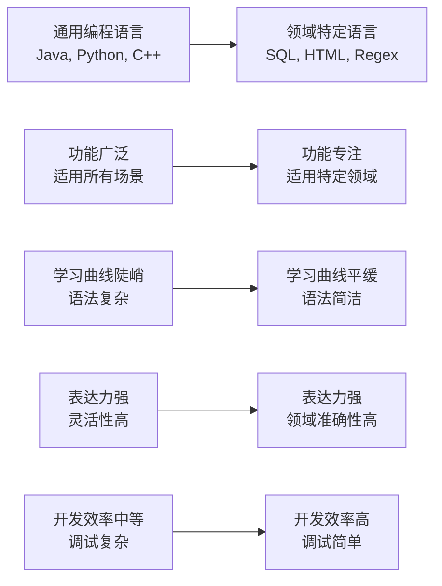
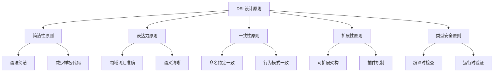

# 第十章：DSL概念和分类

> 领域特定语言（DSL）是Groovy最强大的应用领域。理解DSL的概念、分类和设计原则，是掌握Groovy DSL开发的关键。本章将深入探讨DSL的核心概念，为后续的实战开发打下理论基础。

## 10.1 什么是DSL？

### 10.1.1 DSL的定义和价值

**DSL（Domain-Specific Language）** 是一种专门针对特定问题领域的编程语言。与通用编程语言（GPL）不同，DSL专注于解决某一特定领域的复杂问题。



**DSL的核心价值**：

1. **提高表达力**：用领域专家的语言编写代码
2. **降低复杂度**：抽象出通用的复杂性
3. **提升可维护性**：代码更易理解和修改
4. **加速开发**：减少样板代码，专注于业务逻辑
5. **减少错误**：领域约束降低了编程错误的可能性

### 10.1.2 DSL vs 通用语言对比

```groovy
// 传统Java方式：XML配置
// web.xml
<servlet>
    <servlet-name>HelloServlet</servlet-name>
    <servlet-class>com.example.HelloServlet</servlet-class>
    <init-param>
        <param-name>encoding</param-name>
        <param-value>UTF-8</param-value>
    </init-param>
</servlet>
<servlet-mapping>
    <servlet-name>HelloServlet</servlet-name>
    <url-pattern>/hello</url-pattern>
</servlet-mapping>

// DSL方式：Groovy配置
servlet {
    name 'HelloServlet'
    className 'com.example.HelloServlet'
    initParam encoding: 'UTF-8'
}

mapping {
    servlet 'HelloServlet'
    urlPattern '/hello'
}

// 数据库查询对比
// 传统JDBC方式（Java）
Connection conn = DriverManager.getConnection(url, user, password);
Statement stmt = conn.createStatement();
ResultSet rs = stmt.executeQuery("SELECT * FROM users WHERE age > 18");
List<User> users = new ArrayList<>();
while (rs.next()) {
    User user = new User();
    user.setId(rs.getInt("id"));
    user.setName(rs.getString("name"));
    user.setAge(rs.getInt("age"));
    users.add(user);
}

// DSL方式（类似SQL的DSL）
def users = database.select {
    from 'users'
    where age > 18
    result { id, name, age ->
        [id: id, name: name, age: age]
    }
}

// 构建配置对比
// 传统XML方式（Maven）
<project>
    <dependencies>
        <dependency>
            <groupId>org.springframework</groupId>
            <artifactId>spring-core</artifactId>
            <version>5.3.20</version>
        </dependency>
    </dependencies>
    <build>
        <plugins>
            <plugin>
                <groupId>org.apache.maven.plugins</groupId>
                <artifactId>maven-compiler-plugin</artifactId>
                <version>3.8.1</version>
                <configuration>
                    <source>1.8</source>
                    <target>1.8</target>
                </configuration>
            </plugin>
        </plugins>
    </build>
</project>

// DSL方式（Gradle）
dependencies {
    implementation 'org.springframework:spring-core:5.3.20'
}

plugins {
    id 'java'
    id 'maven-compiler-plugin'
}

java {
    sourceCompatibility = JavaVersion.VERSION_1_8
    targetCompatibility = JavaVersion.VERSION_1_8
}
```

## 10.2 DSL的分类

### 10.2.1 内部DSL vs 外部DSL

**内部DSL（Internal DSL）**：在宿主语言中实现的DSL，利用宿主语言的语法特性。

```groovy
// 内部DSL示例：HTML构建器
def html = {
    head {
        title "Groovy DSL Example"
        style {
            """
            body { font-family: Arial; }
            .header { background: #f0f0f0; }
            """
        }
    }
    body {
        div(class: 'header') {
            h1 "Welcome to Groovy DSL"
            p "This is an internal DSL example"
        }
        div(class: 'content') {
            ul {
                li "Simple syntax"
                li "Type safety"
                li "IDE support"
            }
        }
    }
}

// 使用DSL
def htmlBuilder = new HtmlBuilder()
println htmlBuilder.build(html)
```

**外部DSL（External DSL）**：独立的编程语言，有自己的语法解析器。

```groovy
// 外部DSL示例：自定义配置语言
// config.dsl
server {
    host = "localhost"
    port = 8080
    ssl {
        enabled = true
        keystore = "server.jks"
    }
}

database {
    url = "jdbc:mysql://localhost:3306/myapp"
    username = "user"
    password = "password"
    pool {
        maxConnections = 20
        timeout = 30000
    }
}

// 外部DSL解析器
class ConfigParser {
    def parse(File file) {
        def content = file.text
        // 这里需要实现自定义的解析逻辑
        // 可以使用ANTLR等解析器生成工具
        parseConfig(content)
    }

    private def parseConfig(String content) {
        // 简化的解析实现
        def config = [:]

        // 解析server配置
        if (content.contains('server {')) {
            config.server = [
                host: extractValue(content, 'host'),
                port: extractValue(content, 'port')?.toInteger(),
                ssl: [
                    enabled: extractValue(content, 'enabled')?.toBoolean(),
                    keystore: extractValue(content, 'keystore')
                ]
            ]
        }

        config
    }

    private String extractValue(String content, String key) {
        def matcher = content =~ /${key}\s*=\s*["']([^"']+)["']/
        matcher.find() ? matcher[0][1] : null
    }
}
```

### 10.2.2 按用途分类

**1. 声明式DSL**：描述"是什么"，而不是"怎么做"

```groovy
// UI布局DSL（声明式）
def layout = {
    verticalLayout {
        label {
            text "用户名"
            style "font-weight: bold"
        }
        textField {
            id "username"
            placeholder "请输入用户名"
            required true
        }
        label {
            text "密码"
            style "font-weight: bold"
        }
        passwordField {
            id "password"
            placeholder "请输入密码"
            required true
        }
        button {
            text "登录"
            onClick { /* 登录逻辑 */ }
        }
    }
}

// 数据验证DSL（声明式）
def userValidation = {
    field "username" {
        required true
        minLength 3
        maxLength 20
        pattern /^[a-zA-Z0-9_]+$/
        message "用户名只能包含字母、数字和下划线"
    }

    field "email" {
        required true
        email true
        message "请输入有效的邮箱地址"
    }

    field "age" {
        required true
        range 18..120
        message "年龄必须在18-120之间"
    }
}
```

**2. 命令式DSL**：描述"怎么做"，包含执行逻辑

```groovy
// 构建流程DSL（命令式）
pipeline {
    stage "checkout" {
        git {
            url "https://github.com/example/project.git"
            branch "main"
        }
    }

    stage "build" {
        maven {
            goals "clean compile"
            options "-DskipTests"
        }
    }

    stage "test" {
        parallel {
            maven { goals "test" }
            maven { goals "integration-test" }
        }
    }

    stage "deploy" {
        when {
            branch "main"
        }
        docker {
            image "myapp:${buildNumber}"
            registry "docker.example.com"
        }
    }
}

// 数据处理流程DSL（命令式）
def dataFlow = {
    source "csv" {
        file "input.csv"
        delimiter ","
        header true
    }

    transform {
        filter { row -> row.age > 18 }
        map { row ->
            [name: row.name.toUpperCase(), email: row.email.toLowerCase()]
        }
        groupBy "department"
        aggregate { group ->
            [
                department: group.key,
                count: group.size(),
                avgAge: group.collect { it.age }.sum() / group.size()
            ]
        }
    }

    sink "json" {
        file "output.json"
        prettyPrint true
    }
}
```

**3. 查询式DSL**：专门用于数据查询和检索

```groovy
// 数据查询DSL
def query = {
    select "name", "email", "department"
    from "employees"
    where {
        age > 25
        and { department == "Engineering" }
        or { department == "Product" }
    }
    orderBy "name", "ASC"
    limit 10
    offset 20
}

// 搜索DSL
def search = {
    index "products"
    query {
        match "name", "laptop"
        filter {
            range "price" {
                gte 500
                lte 2000
            }
            term "category", "electronics"
            term "available", true
        }
    }
    highlight "name", "description"
    sort {
        "price" "ASC"
        "_score" "DESC"
    }
}
```

## 10.3 DSL设计原则

### 10.3.1 设计原则概述



**1. 简洁性原则**

DSL应该尽可能简洁，减少不必要的语法噪音。

```groovy
// 不好的设计：冗长的语法
configuration {
    addServer {
        setHost "localhost"
        setPort 8080
        setProtocol "HTTP"
        enableSSL true
    }

    addDatabase {
        setDriver "com.mysql.jdbc.Driver"
        setURL "jdbc:mysql://localhost:3306/mydb"
        setUsername "user"
        setPassword "password"
    }
}

// 好的设计：简洁的语法
configuration {
    server {
        host "localhost"
        port 8080
        protocol "HTTP"
        ssl true
    }

    database {
        driver "com.mysql.jdbc.Driver"
        url "jdbc:mysql://localhost:3306/mydb"
        username "user"
        password "password"
    }
}

// 更好的设计：更进一步简化
config {
    server "localhost:8080" {
        ssl true
    }

    database "mysql://localhost:3306/mydb" {
        username "user"
        password "password"
    }
}
```

**2. 表达力原则**

DSL应该能够清晰地表达领域概念和业务逻辑。

```groovy
// 不好的设计：通用性过强，缺乏领域特色
process {
    step "validate"
    step "transform"
    step "persist"
}

// 好的设计：具有领域特色
orderProcessing {
    validateOrder {
        checkCustomerStatus
        checkInventory
        calculatePrice
    }

    processPayment {
        selectPaymentMethod
        authorizePayment
        capturePayment
    }

    fulfillOrder {
        reserveInventory
        arrangeShipping
        sendConfirmation
    }
}
```

**3. 一致性原则**

DSL的设计应该保持一致性，包括命名约定、语法结构等。

```groovy
// 一致性设计示例
webServer {
    // 命名一致：使用动词-名词模式
    enable SSL
    configure compression
    set timeout 30
    add logger "access.log"

    // 结构一致：所有配置项使用相同的语法
    SSL {
        certificate "server.crt"
        key "server.key"
        protocol "TLSv1.2"
    }

    compression {
        type "gzip"
        level 6
    }

    logging {
        file "access.log"
        level "INFO"
        format "combined"
    }
}
```

### 10.3.2 反模式识别

**1. 过度抽象反模式**

```groovy
// 反模式：过度抽象，难以理解
abstractConfiguration {
    entity "server" {
        attribute "host" {
            type String
            required true
            default "localhost"
        }
        attribute "port" {
            type Integer
            required true
            default 8080
        }
    }

    entity "database" {
        attribute "url" {
            type String
            required true
        }
    }
}

// 改进：直接明了的配置
configuration {
    server {
        host "localhost"
        port 8080
    }

    database {
        url "jdbc:mysql://localhost:3306/mydb"
    }
}
```

**2. 隐式魔法反模式**

```groovy
// 反模式：隐藏了重要的逻辑
magic {
    "server"  // 这里的"server"到底做了什么？
    "database"
}

// 改进：明确表达意图
configure {
    startServer {
        type "web"
        port 8080
    }

    connectDatabase {
        type "mysql"
        url "jdbc:mysql://localhost:3306/mydb"
    }
}
```

**3. 不一致的反模式**

```groovy
// 反模式：不一致的命名和结构
inconsistent {
    server {
        host "localhost"
        port 8080
        // 使用下划线命名
        max_connections 100
    }

    db {  // 缩写不一致
        url "jdbc:mysql://localhost:3306/mydb"
        // 使用驼峰命名
        maxConnections 50
    }
}

// 改进：保持一致性
consistent {
    server {
        host "localhost"
        port 8080
        maxConnections 100
    }

    database {
        url "jdbc:mysql://localhost:3306/mydb"
        maxConnections 50
    }
}
```

## 10.4 常见DSL案例分析

### 10.4.1 Gradle构建DSL

```groovy
// Gradle DSL案例分析
plugins {
    id 'java'
    id 'application'
}

repositories {
    mavenCentral()
}

dependencies {
    implementation 'org.springframework.boot:spring-boot-starter-web'
    testImplementation 'org.junit.jupiter:junit-jupiter'
}

application {
    mainClass = 'com.example.Application'
}

// Gradle DSL的特点分析：
// 1. 使用Groovy的闭包和委托机制
// 2. 嵌套配置结构
// 3. 类型安全的属性访问
// 4. 扩展性强的插件机制
```

### 10.4.2 Spock测试DSL

```groovy
// Spock测试DSL案例分析
import spock.lang.*

class UserServiceSpec extends Specification {
    def "should create user successfully"() {
        given: "a user service"
        def service = new UserService()

        when: "creating a new user"
        def user = service.createUser("alice", "alice@example.com")

        then: "user should be created with correct properties"
        user.name == "alice"
        user.email == "alice@example.com"
        user.id != null

        and: "user should be in active status"
        user.status == UserStatus.ACTIVE
    }

    def "should handle duplicate email"() {
        given: "an existing user"
        def service = new UserService()
        service.createUser("alice", "alice@example.com")

        when: "creating user with same email"
        service.createUser("bob", "alice@example.com")

        then: "should throw exception"
        thrown(DuplicateEmailException)
    }

    @Unroll
    def "should validate email format: #email"() {
        when: "validating email"
        def isValid = EmailValidator.isValid(email)

        then: "result should be #expected"
        isValid == expected

        where:
        email                    | expected
        "valid@example.com"      | true
        "invalid@domain"         | false
        "invalid-email"          | false
    }
}

// Spock DSL的特点分析：
// 1. 使用given-when-then结构
// 2. 自然语言般的测试描述
// 3. 强大的数据驱动测试支持
// 4. 丰富的断言和匹配器
```

### 10.4.3 Geb Web自动化DSL

```groovy
// Geb Web自动化DSL案例分析
import geb.Page
import geb.Module
import geb.spock.GebSpec

class LoginPage extends Page {
    static url = "https://example.com/login"
    static at = { title == "Login" }

    static content = {
        usernameField { $("input[name='username']") }
        passwordField { $("input[name='password']") }
        loginButton { $("button[type='submit']") }
        errorMessage { $(".error-message") }
    }
}

class UserModule extends Module {
    static content = {
        name { $(".user-name") }
        email { $(".user-email") }
        editButton { $(".edit-button") }
        deleteButton { $(".delete-button") }
    }
}

class UserListPage extends Page {
    static url = "/users"
    static at = { title == "User List" }

    static content = {
        userList { $(".user-list") }
        userModule { index -> $(".user-item", index).module(UserModule) }
        addUserButton { $("#add-user") }
    }
}

class UserManagementSpec extends GebSpec {
    def "should login successfully"() {
        when: "navigating to login page"
        to LoginPage

        and: "entering valid credentials"
        usernameField = "testuser"
        passwordField = "password"
        loginButton.click()

        then: "should be redirected to dashboard"
        at UserListPage
    }

    def "should display user list"() {
        given: "logged in user"
        to UserListPage

        when: "viewing user list"
        // 页面已加载

        then: "should display user information"
        userList.displayed
        userModule(0).name == "Alice"
        userModule(0).email == "alice@example.com"
    }
}

// Geb DSL的特点分析：
// 1. 页面对象模式
// 2. 模块化组件设计
// 3. JQuery式的选择器语法
// 4. 自然语言的操作描述
```

### 10.4.4 自定义业务DSL示例

```groovy
// 工作流引擎DSL
class WorkflowEngine {
    def workflows = [:]

    def workflow(String name, Closure closure) {
        def builder = new WorkflowBuilder()
        closure.delegate = builder
        closure()
        workflows[name] = builder.build()
    }

    def execute(String workflowName, Map context = [:]) {
        def workflow = workflows[workflowName]
        if (!workflow) {
            throw new IllegalArgumentException("Workflow not found: ${workflowName}")
        }
        workflow.execute(context)
    }
}

class WorkflowBuilder {
    def steps = []
    def variables = [:]

    def variable(String name, Object value) {
        variables[name] = value
    }

    def step(String name, Closure closure) {
        def builder = new StepBuilder(name)
        closure.delegate = builder
        closure()
        steps.add(builder.build())
    }

    def parallel(Closure closure) {
        def builder = new ParallelBuilder()
        closure.delegate = builder
        closure()
        steps.add(builder.build())
    }

    def conditional(String condition, Closure closure) {
        def builder = new ConditionalBuilder(condition)
        closure.delegate = builder
        closure()
        steps.add(builder.build())
    }

    def build() {
        new Workflow(variables, steps)
    }
}

// 使用DSL定义工作流
def engine = new WorkflowEngine()

engine.workflow "user-registration" {
    variable "welcomeEmailTemplate", "welcome-template.html"

    step "validate-user-data" {
        action { context ->
            def userData = context.userData
            if (!userData.email || !userData.password) {
                throw new ValidationException("Email and password are required")
            }
            context.validated = true
        }

        onError { error ->
            log.error "Validation failed: ${error.message}"
            context.error = error.message
        }
    }

    step "create-user-account" {
        precondition { context.validated }

        action { context ->
            def user = userService.create(context.userData)
            context.user = user
            log.info "User account created: ${user.id}"
        }
    }

    step "send-welcome-email" {
        precondition { context.user }

        action { context ->
            emailService.send(
                template: context.welcomeEmailTemplate,
                to: context.user.email,
                data: [user: context.user]
            )
        }

        onError { error ->
            log.warn "Failed to send welcome email: ${error.message}"
            // 不影响主流程
        }
    }

    parallel {
        step "update-user-statistics" {
            action { context ->
                statisticsService.incrementUserCount()
            }
        }

        step "create-user-profile" {
            action { context ->
                profileService.create(context.user)
            }
        }
    }
}

// 执行工作流
def context = [
    userData: [
        email: "newuser@example.com",
        password: "securepassword",
        name: "New User"
    ]
]

def result = engine.execute("user-registration", context)

println "Workflow execution completed: ${result.success}"
if (result.user) {
    println "User created with ID: ${result.user.id}"
}
```

## 10.5 何时使用DSL

### 10.5.1 使用DSL的适用场景

**1. 领域复杂性高**

当业务逻辑复杂，传统编程语言难以清晰表达时。

```groovy
// 复杂的业务规则配置
businessRules {
    rule "VIP用户折扣" {
        when { user.vip && user.membershipYears >= 2 }
        then { cart -> cart.applyDiscount(0.15, "VIP长期会员折扣") }
    }

    rule "新用户首单优惠" {
        when { user.firstOrder && !user.vip }
        then { cart -> cart.applyDiscount(0.10, "新用户首单优惠") }
    }

    rule "满额免运费" {
        when { cart.subtotal >= 299 }
        then { cart -> cart.setShippingCost(0) }
    }

    rule "节假日促销" {
        when { isHoliday() }
        then { cart -> cart.applyDiscount(0.08, "节假日特惠") }
    }
}
```

**2. 需要频繁变化的配置**

当配置需要经常修改，且修改者是业务人员而非程序员时。

```groovy
// 营销活动配置
marketingCampaign {
    campaign "双11促销" {
        startDate "2024-11-01"
        endDate "2024-11-11"
        targetAudience "registered_users"

        promotion "满减优惠" {
            condition { cart -> cart.subtotal >= 200 }
            discount { cart -> cart.amount -= 50 }
            maxUses 1000
        }

        promotion "折扣券" {
            condition { cart -> cart.hasCoupon("DOUBLE11") }
            discount { cart -> cart.applyDiscount(0.3) }
            validPerUser 1
        }

        channel "mobile_app" { multiplier 1.2 }
        channel "web_site" { multiplier 1.0 }
    }
}
```

**3. 需要声明式表达的场景**

当需要描述"是什么"而不是"怎么做"时。

```groovy
// 数据转换管道
dataPipeline {
    source "user_behavior_logs" {
        type "kafka"
        topic "user_events"
        format "json"
    }

    transform {
        filter { event -> event.type in ["click", "view", "purchase"] }
        map { event ->
            [
                userId: event.userId,
                action: event.type,
                timestamp: event.timestamp,
                value: event.amount ?: 1
            ]
        }
        window "1h"
        aggregate { events ->
            [
                userId: events.first().userId,
                actions: events.size(),
                totalValue: events.sum { it.value },
                avgValue: events.sum { it.value } / events.size()
            ]
        }
    }

    sink "user_metrics" {
        type "elasticsearch"
        index "user_metrics"
        refreshInterval "5m"
    }
}
```

### 10.5.2 不适合使用DSL的场景

**1. 通用性强的算法**

```groovy
// 不适合：通用排序算法
def sortDsl {
    algorithm "quickSort"  // 过于复杂，不适合用DSL表达
    data [3, 1, 4, 1, 5]
    comparator { a, b -> a <=> b }
}

// 更适合：直接使用编程语言
def result = quickSort([3, 1, 4, 1, 5], { a, b -> a <=> b })
```

**2. 性能要求极高的场景**

```groovy
// 不适合：DSL会引入额外开销
def performanceCriticalDsl {
    process { item ->
        // 复杂计算逻辑
    }
}

// 更适合：直接使用优化过的代码
def optimizedProcess(List items) {
    // 直接实现，避免DSL开销
}
```

**3. 一次性脚本**

```groovy
// 不适合：为一次性脚本创建DSL
def oneTimeScript {
    step "do this"
    step "do that"
    step "do something else"
}

// 更适合：直接编写脚本
doThis()
doThat()
doSomethingElse()
```

## 本章小结

DSL（领域特定语言）是Groovy最强大的应用领域之一。通过本章的学习，我们了解了DSL的核心概念和设计原则。

### 核心概念回顾

1. **DSL定义**：针对特定领域的专用语言
2. **DSL分类**：内部DSL vs 外部DSL，声明式 vs 命令式
3. **设计原则**：简洁性、表达力、一致性、扩展性、类型安全
4. **常见反模式**：过度抽象、隐式魔法、不一致性
5. **使用场景**：高复杂度、频繁变化、声明式需求

### 实战应用

✅ **理解DSL价值**：提高表达力、降低复杂度、提升可维护性
✅ **掌握分类方法**：了解不同类型DSL的特点和适用场景
✅ **学会设计原则**：遵循简洁、一致、可扩展的设计原则
✅ **识别反模式**：避免常见的DSL设计错误
✅ **判断适用场景**：知道何时使用DSL，何时避免使用

### 设计DSL的关键要点

- **以用户为中心**：考虑DSL使用者的背景和需求
- **平衡简洁性和表达力**：既易于使用又能表达复杂概念
- **保持一致性**：命名、结构、行为的一致性
- **提供良好的错误信息**：帮助用户快速定位问题
- **支持IDE和工具**：考虑IDE支持和文档生成

下一章我们将深入探讨Groovy DSL的设计模式，学习如何实现各种常见的DSL模式。