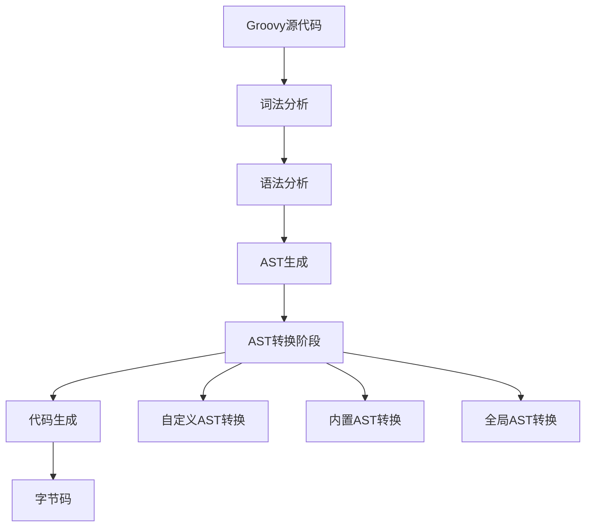

# 第七章：AST转换

> AST（抽象语法树）转换是Groovy编译时元编程的核心技术。它允许在编译阶段修改和增强代码，是实现高级DSL和框架的关键工具。

## 7.1 AST（抽象语法树）概念

### 7.1.1 什么是AST？

AST（Abstract Syntax Tree）是源代码的树形结构表示，编译器通过解析源代码生成AST，然后对其进行转换和优化。



```groovy
// 示例代码
class Person {
    String name
    int age

    def greet() {
        "Hello, ${name}!"
    }
}

// 对应的简化AST结构
/*
ClassNode(Person)
├── FieldNode(name, String)
├── FieldNode(age, int)
└── MethodNode(greet)
    ├── ReturnStatement
    └── GStringExpression
        ├── ConstantString("Hello, ")
        └── VariableExpression(name)
*/
```

### 7.1.2 查看AST结构

```groovy
// 使用Groovy工具查看AST
@Grab('org.codehaus.groovy:groovy-tools:4.0.15')
import org.codehaus.groovy.control.*
import org.codehaus.groovy.ast.*
import org.codehaus.groovy.ast.expr.*
import org.codehaus.groovy.ast.stmt.*

class ASTInspector {
    static void inspectClass(String className) {
        def config = new CompilerConfiguration()
        def ast = new AstBuilder().buildFromString(
            CompilePhase.SEMANTIC_ANALYSIS,
            false,
            """
            class SampleClass {
                String field1
                int field2

                def method1(String param) {
                    return param + " processed"
                }

                static def staticMethod() {
                    "static result"
                }
            }
            """
        )[0]

        printAST(ast)
    }

    static void printAST(ASTNode node, String indent = "") {
        println "${indent}${node.class.simpleName}: ${node}"

        if (node instanceof ClassNode) {
            ClassNode classNode = (ClassNode) node
            println "${indent}  Name: ${classNode.name}"
            println "${indent}  Methods: ${classNode.methods*.name}"
            println "${indent}  Fields: ${classNode.fields*.name}"
        }

        node.visit(new GroovyClassVisitor() {
            void visitMethod(MethodNode method) {
                println "${indent}  Method: ${method.name}(${method.parameters*.type*.name})"
                printAST(method.code, indent + "    ")
            }

            void visitField(FieldNode field) {
                println "${indent}  Field: ${field.name}: ${field.type.name}"
            }
        })
    }
}

// 查看AST
ASTInspector.inspectClass("SampleClass")
```

## 7.2 常用AST转换注解

### 7.2.1 代码生成注解

**@ToString - 自动生成toString方法**
```groovy
// 基础用法
@ToString
class User {
    String name
    int age
    String email
}

def user = new User(name: "Alice", age: 30, email: "alice@example.com")
println user.toString()  // User(18e56447)

// 高级配置
@ToString(includeNames = true, includeFields = true, includeSuper = true, excludes = ["password"])
class AdvancedUser {
    String name
    int age
    String email
    private String password = "secret"
    Date created = new Date()

    def getFullName() { name }
}

def advUser = new AdvancedUser(name: "Bob", age: 25, email: "bob@example.com")
println advUser.toString()
// AdvancedUser(name=Bob, age=25, email=bob@example.com, created=Tue Jan 01 12:00:00 UTC 2024)
```

**@EqualsAndHashCode - 自动生成equals和hashCode**
```groovy
@EqualsAndHashCode
class Product {
    String id
    String name
    double price

    // 只比较特定字段
    @EqualsAndHashCode(includes = ["id"])
    class StrictProduct {
        String id
        String name
        double price
        Date lastModified  // 不参与比较
    }
}

def p1 = new Product(id: "P001", name: "Laptop", price: 999.99)
def p2 = new Product(id: "P001", name: "Notebook", price: 899.99)

println p1.equals(p2)  // true (基于所有字段)
```

**@TupleConstructor - 自动生成构造函数**
```groovy
@TupleConstructor
class Point {
    int x
    int y
}

def point = new Point(10, 20)
println "Point: (${point.x}, ${point.y})"

// 使用前缀和排除字段
@TupleConstructor(includeFields = true, excludes = "id", includeSuper = true,
                 pre = { super(it[0]); int id = it[0] })
class ExtendedPoint extends Point {
    private int id
    String label
}

def extPoint = new ExtendedPoint(1, 10, 20, "Origin")
println "Extended point: (${extPoint.x}, ${extPoint.y}), label: ${extPoint.label}"
```

**@Canonical - 组合多个注解**
```groovy
@Canonical  // 等同于 @ToString @EqualsAndHashCode @TupleConstructor
class Employee {
    String name
    int age
    String department
}

def emp = new Employee("Alice", 30, "Engineering")
println emp  // Employee(Alice, 30, Engineering)

def emp2 = new Employee("Alice", 30, "Engineering")
println emp.equals(emp2)  // true
```

### 7.2.2 方法增强注解

**@Memoized - 方法结果缓存**
```groovy
class MathUtils {
    @Memoized
    static int fibonacci(int n) {
        if (n <= 1) return n
        return fibonacci(n - 1) + fibonacci(n - 2)
    }

    @Memoized(maxCacheSize = 100)
    def expensiveOperation(String input) {
        println "Performing expensive operation for: ${input}"
        Thread.sleep(1000)  // 模拟耗时操作
        return "Result for ${input}"
    }
}

// 第一次调用会执行计算
println MathUtils.fibonacci(10)  // 55
// 第二次调用直接从缓存获取
println MathUtils.fibonacci(10)  // 55 (立即返回)

def utils = new MathUtils()
println utils.expensiveOperation("test1")  // 执行计算
println utils.expensiveOperation("test1")  // 从缓存获取
println utils.expensiveOperation("test2")  // 执行新计算
```

**@Synchronized - 方法同步**
```groovy
class Counter {
    private int count = 0

    @Synchronized
    def increment() {
        count++
        return count
    }

    @Synchronized("lock")  // 使用指定锁对象
    def decrement() {
        count--
        return count
    }

    private final Object lock = new Object()
}

// 多线程安全使用
def counter = new Counter()
(1..10).collect { Thread.start { println counter.increment() } }*.join()
```

**@TimedInterrupt - 方法执行时间限制**
```groovy
class TimeSensitiveOperations {
    @TimedInterrupt(value = 5L, unit = TimeUnit.SECONDS)
    def longRunningOperation() {
        // 如果超过5秒会抛出InterruptedException
        Thread.sleep(6000)  // 会超时
        return "Completed"
    }

    @TimedInterrupt(value = 1L, unit = TimeUnit.SECONDS, applyToAllMembers = false)
    def quickOperation() {
        Thread.sleep(500)
        return "Quick result"
    }
}

try {
    def ops = new TimeSensitiveOperations()
    println ops.longRunningOperation()
} catch (InterruptedException e) {
    println "Operation timed out: ${e.message}"
}
```

### 7.2.3 类型和变异注解

**@Immutable - 不可变对象**
```groovy
@Immutable
final class ImmutablePerson {
    String name
    int age
    List<String> hobbies
}

// 创建后不可修改
def person = new ImmutablePerson("Alice", 30, ["reading", "coding"])
// person.age = 31  // 会抛出异常
// person.hobbies << "swimming"  // 会抛出异常

def person2 = new ImmutablePerson(age: 31, name: "Bob", hobbies: ["sports"])
println person2  // ImmutablePerson(Bob, 31, [sports])
```

**@Singleton - 单例模式**
```groovy
@Singleton
class DatabaseConnection {
    private boolean connected = false

    def connect() {
        if (!connected) {
            println "Establishing database connection..."
            connected = true
        }
        println "Database connected: ${connected}"
    }

    def disconnect() {
        if (connected) {
            println "Closing database connection..."
            connected = false
        }
    }
}

// 获取单例实例
def db1 = DatabaseConnection.instance
def db2 = DatabaseConnection.instance
println "Same instance: ${db1.is(db2)}"  // true

db1.connect()
db2.connect()  // 不会重新连接
```

**@Lazy - 延迟初始化**
```groovy
class LazyInitialization {
    @Lazy
    private List<String> expensiveList = {
        println "Initializing expensive list..."
        (1..1000).collect { "Item ${it}" }
    }()

    @Lazy(soft = true)  // 软引用，内存不足时可以被GC
    private Map<String, Object> cache = [:]

    def getItem(int index) {
        println "Accessing item ${index}"
        return expensiveList[index]
    }

    def cacheData(String key, Object value) {
        cache[key] = value
    }
}

def lazy = new LazyInitialization()
println lazy.getItem(100)  // 触发列表初始化
println lazy.getItem(200)  // 直接访问，不会重新初始化
```

## 7.3 自定义AST转换开发

### 7.3.1 本地AST转换

```groovy
// 自定义AST转换注解
import org.codehaus.groovy.transform.*
import org.codehaus.groovy.ast.*
import org.codehaus.groovy.ast.expr.*
import org.codehaus.groovy.ast.stmt.*
import org.codehaus.groovy.control.*
import org.codehaus.groovy.control.messages.*

// 定义注解
@GroovyASTTransformation(phase = CompilePhase.SEMANTIC_ANALYSIS)
@interface Logging {
    String level() default "INFO"
    boolean includeReturnValue() default false
}

// 实现AST转换
@GroovyASTTransformation(phase = CompilePhase.SEMANTIC_ANALYSIS)
class LoggingTransformation implements ASTTransformation {
    void visit(ASTNode[] nodes, SourceUnit sourceUnit) {
        def annotationNode = nodes[0]
        def annotatedNode = nodes[1]

        if (annotatedNode instanceof MethodNode) {
            transformMethod((MethodNode) annotatedNode, annotationNode, sourceUnit)
        }
    }

    private void transformMethod(MethodNode methodNode, AnnotationNode annotationNode, SourceUnit sourceUnit) {
        def level = annotationNode.getMember("level")?.text ?: "INFO"
        def includeReturnValue = annotationNode.getMember("includeReturnValue")?.value ?: false

        // 获取方法信息
        def methodName = methodNode.name
        def parameters = methodNode.parameters.collect { "${it.type.name} ${it.name}" }.join(", ")

        // 创建日志语句
        def logStatement = createLogStatement("Entering ${methodName}(${parameters})", level)

        // 修改方法体
        def originalStatements = methodNode.code.statements
        def newStatements = [logStatement]

        if (includeReturnValue) {
            // 包装原方法体以捕获返回值
            def returnValue = new VariableExpression("__return__")
            def assignStatement = new ExpressionStatement(
                new DeclarationExpression(
                    returnValue,
                    new Token(Types.EQUALS, "=", -1, -1),
                    methodNode.code
                )
            )

            def exitLogStatement = createLogStatement(
                "Exiting ${methodName} with return value: \${__return__}", level
            )

            newStatements.addAll([
                assignStatement,
                exitLogStatement,
                new ReturnStatement(returnValue)
            ])
        } else {
            newStatements.addAll(originalStatements)
        }

        methodNode.code = new BlockStatement(newStatements, new VariableScope())
    }

    private Statement createLogStatement(String message, String level) {
        def logMethod = new ConstantExpression(level.toLowerCase())
        def messageExpr = new GStringExpression(
            message,
            [],
            []
        )

        def logCall = new MethodCallExpression(
            new VariableExpression("this"),
            new ConstantExpression("log"),
            new ArgumentListExpression([logMethod, messageExpr])
        )

        return new ExpressionStatement(logCall)
    }
}

// 测试自定义AST转换
class LoggingExample {
    def log(String level, String message) {
        println "[${level}] ${message}"
    }

    @Logging(level = "DEBUG", includeReturnValue = true)
    def calculate(int a, int b) {
        Thread.sleep(100)  // 模拟计算时间
        return a * b
    }

    @Logging
    def processData(String data) {
        return "Processed: ${data.toUpperCase()}"
    }
}

def example = new LoggingExample()
def result1 = example.calculate(5, 3)
def result2 = example.processData("hello world")
```

### 7.3.2 全局AST转换

```groovy
// 全局AST转换配置文件
// META-INF/services/org.codehaus.groovy.transform.ASTTransformation
/*
com.example.MyGlobalTransformation
*/

// 全局AST转换实现
@GroovyASTTransformation(phase = CompilePhase.CONVERSION)
class PerformanceMonitoringTransformation implements ASTTransformation {
    void visit(ASTNode[] nodes, SourceUnit sourceUnit) {
        def moduleNode = sourceUnit.AST

        moduleNode.classes.each { classNode ->
            classNode.methods.each { methodNode ->
                if (!methodNode.isSynthetic() && !methodNode.isAbstract()) {
                    addPerformanceMonitoring(methodNode)
                }
            }
        }
    }

    private void addPerformanceMonitoring(MethodNode methodNode) {
        def startTime = new VariableExpression("__startTime__")
        def endTime = new VariableExpression("__endTime__")

        def startStatement = new ExpressionStatement(
            new DeclarationExpression(
                startTime,
                new Token(Types.EQUALS, "=", -1, -1),
                new MethodCallExpression(
                    new ClassExpression(new ClassNode(System.class)),
                    new ConstantExpression("currentTimeMillis"),
                    ArgumentListExpression.EMPTY_ARGUMENTS
                )
            )
        )

        def endStatement = new ExpressionStatement(
            new DeclarationExpression(
                endTime,
                new Token(Types.EQUALS, "=", -1, -1),
                new MethodCallExpression(
                    new ClassExpression(new ClassNode(System.class)),
                    new ConstantExpression("currentTimeMillis"),
                    ArgumentListExpression.EMPTY_ARGUMENTS
                )
            )
        )

        def duration = new BinaryExpression(
            new VariableExpression(endTime),
            new Token(Types.MINUS, "-", -1, -1),
            new VariableExpression(startTime)
        )

        def logStatement = new ExpressionStatement(
            new MethodCallExpression(
                new VariableExpression("this"),
                new ConstantExpression("logPerformance"),
                new ArgumentListExpression([
                    new ConstantExpression(methodNode.name),
                    duration
                ])
            )
        )

        def originalStatements = methodNode.code.statements
        def newStatements = [startStatement] + originalStatements + [endStatement, logStatement]

        methodNode.code = new BlockStatement(newStatements, new VariableScope())
    }
}

// 应用全局转换的类
class MonitoredService {
    def logPerformance(String methodName, long duration) {
        println "Method ${methodName} took ${duration}ms"
    }

    def slowMethod() {
        Thread.sleep(500)
        return "slow result"
    }

    def fastMethod() {
        return "fast result"
    }
}

def service = new MonitoredService()
service.slowMethod()
service.fastMethod()
```

## 7.4 编译时代码生成

### 7.4.1 代码生成模式

```groovy
// 属性访问器生成
@Grab('org.codehaus.groovy:groovy-all:4.0.15')
import org.codehaus.groovy.ast.*

@Retention(RetentionPolicy.SOURCE)
@Target([ElementType.TYPE, ElementType.FIELD])
@interface PropertyAccessors {
    boolean generateGetter() default true
    boolean generateSetter() default true
    boolean generateIsMethod() default false
}

@GroovyASTTransformation(phase = CompilePhase.SEMANTIC_ANALYSIS)
class PropertyAccessorsTransformation implements ASTTransformation {
    void visit(ASTNode[] nodes, SourceUnit sourceUnit) {
        def annotationNode = nodes[0]
        def annotatedNode = nodes[1]

        if (annotatedNode instanceof ClassNode) {
            generateAccessorsForClass((ClassNode) annotatedNode, annotationNode)
        } else if (annotatedNode instanceof FieldNode) {
            generateAccessorsForField((FieldNode) annotatedNode, annotationNode)
        }
    }

    private void generateAccessorsForClass(ClassNode classNode, AnnotationNode annotation) {
        classNode.fields.each { field ->
            if (field.isSynthetic() || field.isStatic()) return
            generateAccessorsForField(field, annotation)
        }
    }

    private void generateAccessorsForField(FieldNode field, AnnotationNode annotation) {
        def generateGetter = annotation.getMember("generateGetter")?.value ?: true
        def generateSetter = annotation.getMember("generateSetter")?.value ?: true
        def generateIsMethod = annotation.getMember("generateIsMethod")?.value ?: false

        def fieldName = field.name
        def capitalizedField = fieldName.capitalize()
        def fieldType = field.type

        if (generateGetter) {
            addGetterMethod(field.declaringClass, fieldName, capitalizedField, fieldType)
        }

        if (generateSetter) {
            addSetterMethod(field.declaringClass, fieldName, capitalizedField, fieldType)
        }

        if (generateIsMethod && fieldType.name == "boolean") {
            addIsMethod(field.declaringClass, fieldName, capitalizedField)
        }
    }

    private void addGetterMethod(ClassNode classNode, String fieldName, String capitalizedField, ClassNode fieldType) {
        def methodName = "get${capitalizedField}"

        def method = new MethodNode(
            methodName,
            ACC_PUBLIC,
            fieldType,
            [] as Parameter[],
            [] as ClassNode[],
            new ReturnStatement(new VariableExpression(fieldName))
        )

        classNode.addMethod(method)
    }

    private void addSetterMethod(ClassNode classNode, String fieldName, String capitalizedField, ClassNode fieldType) {
        def methodName = "set${capitalizedField}"
        def param = new Parameter(fieldType, "value")

        def method = new MethodNode(
            methodName,
            ACC_PUBLIC,
            ClassHelper.VOID_TYPE,
            [param] as Parameter[],
            [] as ClassNode[],
            new ExpressionStatement(
                new BinaryExpression(
                    new VariableExpression(fieldName),
                    new Token(Types.EQUALS, "=", -1, -1),
                    new VariableExpression("value")
                )
            )
        )

        classNode.addMethod(method)
    }

    private void addIsMethod(ClassNode classNode, String fieldName, String capitalizedField) {
        def methodName = "is${capitalizedField}"

        def method = new MethodNode(
            methodName,
            ACC_PUBLIC,
            ClassHelper.boolean_TYPE,
            [] as Parameter[],
            [] as ClassNode[],
            new ReturnStatement(new VariableExpression(fieldName))
        )

        classNode.addMethod(method)
    }
}

// 使用自定义属性访问器
@PropertyAccessors
class Person {
    String name
    int age
    boolean active
}

def person = new Person()
person.setName("Alice")
person.setAge(30)
person.setActive(true)

println person.getName()  // Alice
println person.getAge()  // 30
println person.isActive()  // true
```

### 7.4.2 构建器模式生成

```groovy
// 自动生成构建器模式
@Retention(RetentionPolicy.SOURCE)
@Target(ElementType.TYPE)
@interface Builder {
    String prefix() default "with"
    boolean fluent() default true
}

@GroovyASTTransformation(phase = CompilePhase.SEMANTIC_ANALYSIS)
class BuilderTransformation implements ASTTransformation {
    void visit(ASTNode[] nodes, SourceUnit sourceUnit) {
        def annotationNode = nodes[0]
        def classNode = nodes[1] as ClassNode

        def prefix = annotationNode.getMember("prefix")?.text ?: "with"
        def fluent = annotationNode.getMember("fluent")?.value ?: true

        generateBuilderClass(classNode, prefix, fluent)
        generateBuilderMethods(classNode, prefix, fluent)
    }

    private void generateBuilderClass(ClassNode classNode, String prefix, boolean fluent) {
        def builderClassName = "${classNode.nameWithoutPackage}Builder"
        def builderClass = new ClassNode(
            classNode.packageName,
            builderClassName,
            ACC_PUBLIC,
            ClassHelper.OBJECT_TYPE
        )

        // 添加字段
        classNode.fields.each { field ->
            if (field.isStatic() || field.isSynthetic()) return

            builderClass.addField(
                field.name,
                ACC_PUBLIC,
                field.type,
                null
            )
        }

        // 添加with方法
        classNode.fields.each { field ->
            if (field.isStatic() || field.isSynthetic()) return

            def methodName = "${prefix}${field.name.capitalize()}"
            def param = new Parameter(field.type, field.name)

            def body = new BlockStatement([
                new ExpressionStatement(
                    new BinaryExpression(
                        new VariableExpression(field.name),
                        new Token(Types.EQUALS, "=", -1, -1),
                        new VariableExpression(field.name)
                    )
                ),
                fluent ?
                    new ReturnStatement(new VariableExpression("this")) :
                    new ExpressionStatement(new ConstantExpression(null))
            ], new VariableScope())

            def method = new MethodNode(
                methodName,
                ACC_PUBLIC,
                fluent ? builderClass : ClassHelper.VOID_TYPE,
                [param] as Parameter[],
                [] as ClassNode[],
                body
            )

            builderClass.addMethod(method)
        }

        // 添加build方法
        def buildMethod = new MethodNode(
            "build",
            ACC_PUBLIC,
            classNode,
            [] as Parameter[],
            [] as ClassNode[],
            new ReturnStatement(
                new ConstructorCallExpression(
                    classNode,
                    classNode.fields.findAll { !it.isStatic() && !it.isSynthetic() }
                        .collect { new VariableExpression(it.name) } as Expression[]
                )
            )
        )

        builderClass.addMethod(buildMethod)

        sourceUnit.AST.addClass(builderClass)
    }

    private void generateBuilderMethods(ClassNode classNode, String prefix, boolean fluent) {
        // 添加静态builder方法
        def builderMethod = new MethodNode(
            "builder",
            ACC_PUBLIC | ACC_STATIC,
            new ClassNode("${classNode.nameWithoutPackage}Builder", classNode.packageName, 0, ClassHelper.OBJECT_TYPE),
            [] as Parameter[],
            [] as ClassNode[],
            new ReturnStatement(
                new ConstructorCallExpression(
                    new ClassNode("${classNode.nameWithoutPackage}Builder", classNode.packageName, 0, ClassHelper.OBJECT_TYPE),
                    [] as Expression[]
                )
            )
        )

        classNode.addMethod(builderMethod)
    }
}

// 使用构建器模式
@Builder
class Product {
    String name
    double price
    String category
    boolean available

    // 构造函数
    Product(name, price, category, available) {
        this.name = name
        this.price = price
        this.category = category
        this.available = available
    }
}

// 使用生成的构建器
def product = Product.builder()
    .withName("Laptop")
    .withPrice(999.99)
    .withCategory("Electronics")
    .withAvailable(true)
    .build()

println product  // Product(Laptop, 999.99, Electronics, true)
```

## 7.5 AST转换性能优化

### 7.5.1 转换时机选择

```groovy
// 不同编译阶段的性能对比
enum CompilationPhase {
    INITIALIZATION,        // 初始化阶段 - 最快，但AST不完整
    PARSING,              // 解析阶段 - 快，可修改基本结构
    CONVERSION,           // 转换阶段 - 中等速度，支持完整语法
    SEMANTIC_ANALYSIS,    // 语义分析阶段 - 较慢，类型信息完整
    CANONICALIZATION,     // 规范化阶段 - 较慢，优化机会多
    INSTRUCTION_SELECTION, // 指令选择阶段 - 慢，接近字节码
    CLASS_GENERATION,     // 类生成阶段 - 最慢，影响字节码
    OUTPUT,               // 输出阶段 - 最慢，生成最终文件
    FINALIZATION          // 完成阶段 - 最慢，最后清理
}

// 阶段选择指南
def phaseGuide = [
    "INITIALIZATION": "用于简单的语法糖转换",
    "PARSING": "用于AST结构修改",
    "CONVERSION": "用于大多数AST转换",
    "SEMANTIC_ANALYSIS": "用于需要类型信息的转换",
    "CANONICALIZATION": "用于性能优化转换",
    "FINALIZATION": "用于最后的清理工作"
]

phaseGuide.each { phase, description ->
    println "${phase}: ${description}"
}
```

### 7.5.2 性能优化技巧

```groovy
// 优化的AST转换实现
@GroovyASTTransformation(phase = CompilePhase.SEMANTIC_ANALYSIS)
class OptimizedASTTransformation implements ASTTransformation {
    void visit(ASTNode[] nodes, SourceUnit sourceUnit) {
        def annotationNode = nodes[0]
        def annotatedNode = nodes[1]

        // 缓存常用类型
        def stringClass = ClassHelper.STRING_TYPE
        def objectClass = ClassHelper.OBJECT_TYPE
        def voidClass = ClassHelper.VOID_TYPE

        // 重用Token
        def equalsToken = new Token(Types.EQUALS, "=", -1, -1)
        def returnToken = new Token(Types.RETURN, "return", -1, -1)

        // 批量处理，减少遍历次数
        if (annotatedNode instanceof ClassNode) {
            optimizeClass((ClassNode) annotatedNode, sourceUnit)
        }
    }

    private void optimizeClass(ClassNode classNode, SourceUnit sourceUnit) {
        // 预先收集所有需要处理的方法
        def methodsToProcess = classNode.methods.findAll {
            !it.isSynthetic() && !it.isAbstract()
        }

        // 批量添加优化
        methodsToProcess.each { method ->
            optimizeMethod(method, sourceUnit)
        }
    }

    private void optimizeMethod(MethodNode methodNode, SourceUnit sourceUnit) {
        // 避免重复处理
        if (methodNode.getNodeMetaData("optimized")) {
            return
        }

        // 标记为已优化
        methodNode.setNodeMetaData("optimized", true)

        // 应用优化逻辑
        applyOptimizations(methodNode)
    }

    private void applyOptimizations(MethodNode methodNode) {
        // 内联简单的getter方法
        if (isSimpleGetter(methodNode)) {
            inlineGetter(methodNode)
        }

        // 缓存常量表达式
        cacheConstants(methodNode)

        // 优化循环结构
        optimizeLoops(methodNode)
    }

    private boolean isSimpleGetter(MethodNode methodNode) {
        return methodNode.name.startsWith("get") &&
               methodNode.parameters.length == 0 &&
               methodNode.code.statements.size() == 1 &&
               methodNode.code.statements[0] instanceof ReturnStatement
    }

    private void inlineGetter(MethodNode methodNode) {
        def returnStatement = methodNode.code.statements[0] as ReturnStatement
        if (returnStatement.expression instanceof VariableExpression) {
            def fieldName = returnStatement.expression.variableName

            // 将getter方法标记为内联
            methodNode.putNodeMetaData("inline", true)
            methodNode.putNodeMetaData("fieldName", fieldName)
        }
    }
}
```

## 7.6 AST转换调试和测试

### 7.6.1 AST转换调试

```groovy
// AST转换调试工具
class ASTTransformationDebugger {
    static void debugTransformation(ASTNode[] nodes, SourceUnit sourceUnit, String transformationName) {
        println "=== ${transformationName} Transformation Debug ==="
        println "Source: ${sourceUnit.name}"
        println "Nodes: ${nodes.size()}"

        nodes.eachWithIndex { node, index ->
            println "\nNode ${index}:"
            println "  Type: ${node.class.simpleName}"
            println "  Location: line ${node.lineNumber}, column ${node.columnNumber}"

            if (node instanceof AnnotatedNode) {
                println "  Annotations: ${node.annotations*.class.simpleName}"
            }

            if (node instanceof ClassNode) {
                debugClassNode((ClassNode) node)
            } else if (node instanceof MethodNode) {
                debugMethodNode((MethodNode) node)
            }
        }
    }

    static void debugClassNode(ClassNode classNode) {
        println "  Class: ${classNode.name}"
        println "  Superclass: ${classNode.superClass?.name}"
        println "  Interfaces: ${classNode.interfaces*.name}"
        println "  Fields: ${classNode.fields*.name}"
        println "  Methods: ${classNode.methods*.name}"
    }

    static void debugMethodNode(MethodNode methodNode) {
        println "  Method: ${methodNode.name}"
        println "  Return type: ${methodNode.returnType.name}"
        println "  Parameters: ${methodNode.parameters.collect { "${it.type.name} ${it.name}" }}"
        println "  Modifiers: ${methodNode.modifiers}"

        if (methodNode.code) {
            println "  Statements: ${methodNode.code.statements.size()}"
        }
    }

    static void printAST(ASTNode node, String indent = "") {
        println "${indent}${node.class.simpleName}: ${node.toString().take(100)}"

        if (node instanceof ClassNode) {
            ((ClassNode) node).fields.each { field ->
                printAST(field, indent + "  ")
            }
            ((ClassNode) node).methods.each { method ->
                printAST(method, indent + "  ")
            }
        }
    }
}

// 使用调试器的AST转换
@GroovyASTTransformation(phase = CompilePhase.SEMANTIC_ANALYSIS)
class DebuggableTransformation implements ASTTransformation {
    void visit(ASTNode[] nodes, SourceUnit sourceUnit) {
        ASTTransformationDebugger.debugTransformation(nodes, sourceUnit, "Debuggable")

        // 执行转换逻辑
        // ...
    }
}
```

### 7.6.2 AST转换测试

```groovy
// AST转换测试框架
class ASTTransformationTest extends GroovyTestCase {
    void testToStringTransformation() {
        def source = '''
            @ToString(includeNames = true)
            class TestClass {
                String name
                int age
            }
        '''

        def config = new CompilerConfiguration()
        config.addCompilationCustomizers(new ASTTransformationCustomizer(ToString.class))

        def shell = new GroovyShell(config)
        def clazz = shell.evaluate(source)

        def instance = clazz.newInstance(name: "Alice", age: 30)
        def result = instance.toString()

        assertEquals("TestClass(name=Alice, age=30)", result)
    }

    void testCustomTransformation() {
        def source = '''
            @Logging
            def testMethod(String input) {
                return "processed: ${input}"
            }
        '''

        def config = new CompilerConfiguration()
        config.addCompilationCustomizers(new ASTTransformationCustomizer(LoggingTransformation))

        def shell = new GroovyShell(config)
        def closure = shell.evaluate(source)

        // 测试转换后的行为
        def result = closure("test")
        assertNotNull(result)
    }

    // 性能测试
    void testTransformationPerformance() {
        def iterations = 1000
        def source = '''
            @Singleton
            class PerformanceTest {
                def method() { "result" }
            }
        '''

        def config = new CompilerConfiguration()
        config.addCompilationCustomizers(new ASTTransformationCustomizer(Singleton.class))

        def startTime = System.currentTimeMillis()
        iterations.times {
            new GroovyShell(config).evaluate(source)
        }
        def duration = System.currentTimeMillis() - startTime

        println "Compilation time: ${duration}ms for ${iterations} iterations"
        assertTrue("Compilation should be reasonably fast", duration < 10000)
    }
}
```

## 7.7 实际项目应用案例

### 7.7.1 验证框架AST转换

```groovy
// 自动生成验证逻辑的AST转换
@Retention(RetentionPolicy.SOURCE)
@Target(ElementType.TYPE)
@interface Validated {
    boolean validateOnConstruction() default true
}

@Retention(RetentionPolicy.SOURCE)
@Target(ElementType.FIELD)
@interface Validate {
    String pattern() default ""
    int minLength() default -1
    int maxLength() default -1
    boolean required() default false
}

@GroovyASTTransformation(phase = CompilePhase.SEMANTIC_ANALYSIS)
class ValidationTransformation implements ASTTransformation {
    void visit(ASTNode[] nodes, SourceUnit sourceUnit) {
        def annotationNode = nodes[0]
        def classNode = nodes[1] as ClassNode

        def validateOnConstruction = annotationNode.getMember("validateOnConstruction")?.value ?: true

        // 收集需要验证的字段
        def validationFields = classNode.fields.findAll { field ->
            field.annotations.any { it.classNode.name == Validate.class.name }
        }

        if (validationFields) {
            generateValidationMethod(classNode, validationFields)

            if (validateOnConstruction) {
                modifyConstructors(classNode, validationFields)
            }
        }
    }

    private void generateValidationMethod(ClassNode classNode, List<FieldNode> validationFields) {
        def errorsVar = new VariableExpression("__validationErrors__")
        def fieldErrorsVar = new VariableExpression("__fieldErrors__")

        // 生成验证逻辑
        def validationStatements = [
            new ExpressionStatement(
                new DeclarationExpression(
                    errorsVar,
                    new Token(Types.EQUALS, "=", -1, -1),
                    new ConstructorCallExpression(
                        new ClassNode(LinkedHashMap),
                        ArgumentListExpression.EMPTY_ARGUMENTS
                    )
                )
            )
        ]

        validationFields.each { field ->
            def fieldName = field.name
            def validationAnnotation = field.annotations.find {
                it.classNode.name == Validate.class.name
            }

            // 生成字段验证逻辑
            def fieldValidations = generateFieldValidations(fieldName, validationAnnotation)
            validationStatements.addAll(fieldValidations)
        }

        // 生成抛出异常的逻辑
        validationStatements.add(
            new IfStatement(
                new BinaryExpression(
                    new MethodCallExpression(errorsVar, "isEmpty", ArgumentListExpression.EMPTY_ARGUMENTS),
                    new Token(Types.NOT_EQUAL, "!=", -1, -1),
                    new ConstantExpression(true)
                ),
                new ThrowStatement(
                    new ConstructorCallExpression(
                        new ClassNode("ValidationException"),
                        new ArgumentListExpression([errorsVar])
                    )
                ),
                new ExpressionStatement(new ConstantExpression(null))
            )
        )

        def validationMethod = new MethodNode(
            "validate",
            ACC_PRIVATE,
            ClassHelper.VOID_TYPE,
            [] as Parameter[],
            [] as ClassNode[],
            new BlockStatement(validationStatements, new VariableScope())
        )

        classNode.addMethod(validationMethod)
    }

    private List<Statement> generateFieldValidations(String fieldName, AnnotationNode validationAnnotation) {
        def statements = []
        def fieldValue = new VariableExpression(fieldName)

        // 必填验证
        def required = validationAnnotation.getMember("required")?.value ?: false
        if (required) {
            statements.add(
                new IfStatement(
                    new BinaryExpression(
                        fieldValue,
                        new Token(Types.EQUALS, "==", -1, -1),
                        new ConstantExpression(null)
                    ),
                    new ExpressionStatement(
                        new MethodCallExpression(
                            new VariableExpression("__validationErrors__"),
                            "put",
                            new ArgumentListExpression([
                                new ConstantExpression("${fieldName}.required"),
                                new ConstantExpression("${fieldName} is required")
                            ])
                        )
                    ),
                    new ExpressionStatement(new ConstantExpression(null))
                )
            )
        }

        // 长度验证
        def minLength = validationAnnotation.getMember("minLength")?.value
        if (minLength && minLength > -1) {
            statements.add(
                new IfStatement(
                    new BinaryExpression(
                        new MethodCallExpression(fieldValue, "size", ArgumentListExpression.EMPTY_ARGUMENTS),
                        new Token(Types.LESS_THAN, "<", -1, -1),
                        new ConstantExpression(minLength)
                    ),
                    new ExpressionStatement(
                        new MethodCallExpression(
                            new VariableExpression("__validationErrors__"),
                            "put",
                            new ArgumentListExpression([
                                new ConstantExpression("${fieldName}.minLength"),
                                new ConstantExpression("${fieldName} must be at least ${minLength} characters")
                            ])
                        )
                    ),
                    new ExpressionStatement(new ConstantExpression(null))
                )
            )
        }

        // 正则表达式验证
        def pattern = validationAnnotation.getMember("pattern")?.value
        if (pattern) {
            statements.add(
                new IfStatement(
                    new NotExpression(
                        new MethodCallExpression(
                            fieldValue,
                            "matches",
                            new ArgumentListExpression([new ConstantExpression(pattern.toString())])
                        )
                    ),
                    new ExpressionStatement(
                        new MethodCallExpression(
                            new VariableExpression("__validationErrors__"),
                            "put",
                            new ArgumentListExpression([
                                new ConstantExpression("${fieldName}.pattern"),
                                new ConstantExpression("${fieldName} does not match required pattern")
                            ])
                        )
                    ),
                    new ExpressionStatement(new ConstantExpression(null))
                )
            )
        }

        return statements
    }

    private void modifyConstructors(ClassNode classNode, List<FieldNode> validationFields) {
        classNode.declaredConstructors.each { constructor ->
            def originalStatements = constructor.code.statements

            // 在构造函数末尾添加验证调用
            def validationCall = new ExpressionStatement(
                new MethodCallExpression(
                    new VariableExpression("this"),
                    "validate",
                    ArgumentListExpression.EMPTY_ARGUMENTS
                )
            )

            constructor.code = new BlockStatement(
                originalStatements + [validationCall],
                new VariableScope()
            )
        }
    }
}

// 使用验证框架
@Validated
class UserProfile {
    @Validate(required = true, minLength = 2)
    String name

    @Validate(required = true, pattern = /^[a-zA-Z0-9._%+-]+@[a-zA-Z0-9.-]+\.[a-zA-Z]{2,}$/)
    String email

    @Validate(minLength = 8)
    String password

    int age
}

try {
    def profile = new UserProfile(
        name: "A",  // 太短
        email: "invalid-email",  // 格式错误
        password: "123",  // 太短
        age: 30
    )
} catch (ValidationException e) {
    println "Validation failed: ${e.errors}"
}
```

## 本章小结

AST转换是Groovy编译时元编程的强大工具，它让开发者能够在编译阶段修改和增强代码。

### 核心概念回顾

1. **AST概念**：抽象语法树是代码的树形结构表示
2. **内置AST转换**：Groovy提供了丰富的内置AST转换注解
3. **自定义AST转换**：可以开发自己的编译时代码生成逻辑
4. **转换时机**：不同编译阶段有不同的性能和功能特点
5. **调试和测试**：AST转换需要专门的调试和测试技巧

### 实战应用

✅ **理解AST结构**：掌握Groovy代码的AST表示方法
✅ **使用内置转换**：熟练应用常用AST转换注解
✅ **开发自定义转换**：创建符合特定需求的AST转换
✅ **性能优化**：选择合适的转换时机和优化技巧
✅ **测试验证**：确保AST转换的正确性

### 最佳实践

- **选择合适的转换阶段**：根据需求选择最佳的编译时机
- **关注性能影响**：AST转换会显著增加编译时间
- **充分的测试**：AST转换的Bug会影响到所有使用的地方
- **清晰的文档**：为自定义AST转换提供详细说明
- **避免过度使用**：只在真正需要时使用AST转换

下一章我们将探讨Gradle构建脚本，这是Groovy在实际项目中最重要的应用场景之一。