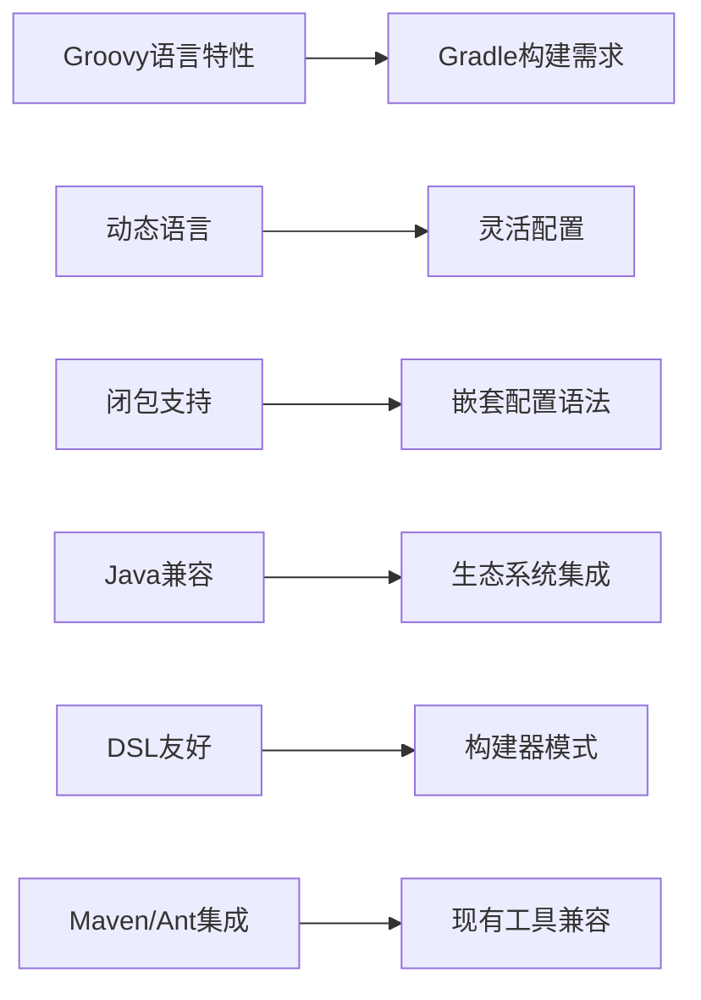

# 第八章：Gradle构建脚本基础

> Gradle是Groovy最成功的应用场景之一。作为现代构建工具，Gradle使用Groovy DSL提供了强大而灵活的构建配置能力。掌握Gradle，就是掌握Groovy在实际项目中的应用。

## 8.1 Gradle与Groovy的关系

### 8.1.1 为什么选择Groovy？

Gradle选择Groovy作为DSL语言的几个关键原因：



```groovy
// Gradle构建脚本是可执行的Groovy代码
// build.gradle 示例

apply plugin: 'java'

// 直接使用Groovy语法
def version = "1.0.0"
def projectName = "my-application"

// 使用闭包进行配置
repositories {
    mavenCentral()
    maven {
        url "https://plugins.gradle.org/m2/"
    }
}

// 使用Groovy的集合操作
def frameworks = ["Spring", "Hibernate", "JUnit"]

dependencies {
    frameworks.each { framework ->
        implementation "org.${framework.toLowerCase()}:${framework}:5.0+"
    }
}

// 自定义任务，完全使用Groovy编程
task printInfo {
    doLast {
        println "Project: ${projectName}"
        println "Version: ${version}"
        println "Gradle version: ${gradle.gradleVersion}"
        println "Java version: ${System.getProperty('java.version')}"
    }
}

// 使用Groovy的GString
task createConfig {
    doLast {
        def configFile = file("src/main/resources/config.properties")
        configFile.parentFile.mkdirs()
        configFile.text = """
            app.name=${projectName}
            app.version=${version}
            build.timestamp=${new Date().format('yyyy-MM-dd HH:mm:ss')}
        """.stripIndent()
        println "Configuration file created: ${configFile.absolutePath}"
    }
}
```

### 8.1.2 Gradle脚本执行环境

```groovy
// Gradle脚本的执行环境
println "=== Gradle Script Execution Environment ==="

// 1. Project对象 - 当前构建项目
println "Project name: ${project.name}"
println "Project directory: ${project.projectDir}"
println "Build directory: ${project.buildDir}"

// 2. Gradle对象 - 全局Gradle环境
println "Gradle home: ${gradle.gradleHomeDir}"
println "Gradle user home: ${gradle.gradleUserHomeDir}"
println "Gradle version: ${gradle.gradleVersion}"

// 3. Settings对象 - 多项目配置
println "Settings directory: ${settingsDir}"

// 4. AntBuilder - Ant集成
ant.echo(message: "Hello from AntBuilder")

// 5. 任务执行上下文
task checkEnvironment {
    doLast {
        println "Current task: ${it.name}"
        println "Execution path: ${it.path}"
        println "Project: ${it.project.name}"
    }
}

// 6. 脚本类实例
println "Script class: ${this.class.name}"
println "Script binding variables: ${binding.variables.keySet()}"
```

## 8.2 构建脚本语法

### 8.2.1 项目配置

```groovy
// build.gradle 基础配置

// 插件应用
plugins {
    id 'java'                    // Java插件
    id 'application'             // 应用插件
    id 'war'                     // WAR插件
    id 'org.springframework.boot' version '2.7.0'  // 带版本的插件
}

// 项目信息
group 'com.example'
version '1.0.0'
description 'A sample Groovy Gradle project'

// Java配置
java {
    sourceCompatibility = JavaVersion.VERSION_11
    targetCompatibility = JavaVersion.VERSION_11
}

// 应用配置
application {
    mainClass = 'com.example.Application'
    applicationName = 'myapp'
}

// 项目扩展属性
ext {
    springVersion = '5.3.20'
    jacksonVersion = '2.13.3'
    buildTime = new Date().format('yyyy-MM-dd HH:mm:ss')
}

// 动态配置源代码
sourceSets {
    main {
        java {
            srcDirs = ['src/main/java']
        }
        resources {
            srcDirs = ['src/main/resources']
        }
    }
    test {
        java {
            srcDirs = ['src/test/java']
        }
        resources {
            srcDirs = ['src/test/resources']
        }
    }
    integrationTest {
        java {
            srcDirs = ['src/integration-test/java']
        }
        compileClasspath += sourceSets.main.output
        runtimeClasspath += sourceSets.main.output
    }
}

// 配置依赖解析
configurations {
    compileOnly {
        extendsFrom annotationProcessor
    }

    integrationTestImplementation.extendsFrom testImplementation
    integrationTestRuntimeOnly.extendsFrom testRuntimeOnly
}
```

### 8.2.2 依赖管理

```groovy
// 依赖仓库配置
repositories {
    mavenCentral()  // Maven中央仓库

    // 自定义Maven仓库
    maven {
        name 'CustomRepo'
        url 'https://maven.example.com/repo'
        credentials {
            username = System.getenv('MAVEN_USER')
            password = System.getenv('MAVEN_PASSWORD')
        }
    }

    // 本地Maven仓库
    mavenLocal()

    // Ivy仓库
    ivy {
        url 'https://ivy.example.com/repo'
        layout 'pattern', {
            artifact '[module]/[revision]/[type]/[artifact]-[revision].[ext]'
        }
    }

    // 平面目录仓库
    flatDir {
        dirs 'libs'
    }
}

// 依赖声明
dependencies {
    // 标准依赖格式
    implementation 'org.springframework:spring-core:5.3.20'

    // 使用GString动态版本
    implementation "org.springframework:spring-context:${springVersion}"

    // 带分类器的依赖
    implementation 'com.google.guava:guava:31.1-jre'

    // 文件依赖
    implementation files('libs/some-local.jar')

    // 目录依赖
    implementation fileTree(dir: 'libs', include: ['*.jar'])

    // 测试依赖
    testImplementation 'org.junit.jupiter:junit-jupiter:5.8.2'
    testImplementation 'org.mockito:mockito-core:4.5.1'

    // 编译时依赖
    compileOnly 'org.projectlombok:lombok:1.18.24'
    annotationProcessor 'org.projectlombok:lombok:1.18.24'

    // 运行时依赖
    runtimeOnly 'mysql:mysql-connector-java:8.0.29'

    // 依赖排除
    implementation('org.springframework.boot:spring-boot-starter-web') {
        exclude group: 'org.springframework.boot', module: 'spring-boot-starter-tomcat'
    }

    // 强制版本
    implementation('org.slf4j:slf4j-api') {
        force = true
    }
}

// 依赖解析策略
configurations.all {
    resolutionStrategy {
        // 强制指定版本
        force 'org.slf4j:slf4j-api:1.7.36'

        // 排除传递依赖
        dependencySubstitution {
            substitute module('commons-logging:commons-logging') with module('org.slf4j:jcl-over-slf4j:1.7.36')
        }

        // 缓存动态版本
        cacheDynamicVersionsFor 10, 'minutes'
        cacheChangingModulesFor 0, 'seconds'
    }
}
```

### 8.2.3 任务定义和依赖

```groovy
// 基础任务定义
task hello {
    doLast {
        println 'Hello, Gradle!'
    }
}

// 带配置的任务
task copyConfig(type: Copy) {
    from 'src/main/resources'
    into 'build/config'
    include '**/*.properties'
    exclude '**/*.xml'
}

// 动态任务创建
['compile', 'test', 'package'].each { phase ->
    task "${phase}Project" {
        group 'Build'
        description "Execute ${phase} phase"

        doLast {
            println "Executing ${phase} phase..."
        }
    }
}

// 任务依赖关系
task compileJava {
    doLast {
        println 'Compiling Java source files...'
    }
}

task processResources {
    doLast {
        println 'Processing resources...'
    }
}

task buildClasses {
    dependsOn compileJava, processResources

    doLast {
        println 'Building classes...'
    }
}

// 任务依赖类型
task first {
    doLast {
        println 'First task'
    }
}

task second {
    dependsOn first
    doLast {
        println 'Second task'
    }
}

task third {
    mustRunAfter second
    doLast {
        println 'Third task (must run after second)'
    }
}

task fourth {
    shouldRunAfter third
    doLast {
        println 'Fourth task (should run after third)'
    }
}

task finalizeTask {
    doLast {
        println 'Finalization task'
    }
}

buildClasses.finalizedBy finalizeTask

// 条件任务执行
task conditionalTask {
    onlyIf {
        project.hasProperty('runConditional') && project.property('runConditional') == 'true'
    }

    doLast {
        println 'Conditional task executed'
    }
}

// 任务的输入输出
task processTemplate(type: Copy) {
    inputs.property('version', project.version)
    inputs.files('templates/app.template')

    outputs.file('build/application.properties')

    from 'templates'
    into 'build'
    rename 'app.template', 'application.properties'

    expand(version: project.version)

    doLast {
        println 'Template processed with version ' + project.version
    }
}

// 增量构建任务
task incrementalProcess(type: IncrementalTask) {
    // 输入目录
    @InputDirectory
    File inputDir = file('src/main/resources')

    // 输出目录
    @OutputDirectory
    File outputDir = file('build/processed-resources')

    @TaskAction
    void execute(InputChanges inputChanges) {
        println 'Processing incremental changes...'

        inputChanges.getFileChanges(inputDir).each { change ->
            println "Change: ${change.changeType} - ${change.file.name}"

            if (change.changeType == ChangeType.ADDED || change.changeType == ChangeType.MODIFIED) {
                // 处理新增或修改的文件
                processFile(change.file)
            }
        }
    }

    def processFile(File file) {
        def outputFile = new File(outputDir, file.name)
        outputFile.parentFile.mkdirs()
        outputFile.text = "Processed: ${file.text}"
        println "Processed ${file.name}"
    }
}
```

## 8.3 插件开发基础

### 8.3.1 自定义插件结构

```groovy
// 自定义插件实现
package com.example.gradle

import org.gradle.api.Plugin
import org.gradle.api.Project
import org.gradle.api.tasks.JavaExec
import org.gradle.api.tasks.compile.JavaCompile
import org.gradle.api.plugins.JavaPlugin
import org.gradle.api.plugins.ApplicationPlugin

class CustomPlugin implements Plugin<Project> {
    void apply(Project project) {
        // 应用基础插件
        project.plugins.apply(JavaPlugin)
        project.plugins.apply(ApplicationPlugin)

        // 创建扩展
        def extension = project.extensions.create('customConfig', CustomExtension)

        // 配置依赖
        project.dependencies {
            implementation 'org.apache.commons:commons-lang3:3.12.0'
            testImplementation 'org.junit.jupiter:junit-jupiter:5.8.2'
        }

        // 添加任务
        project.task('customTask') {
            group 'Custom'
            description 'Custom task from plugin'

            doLast {
                println "Custom task executed with config: ${extension.message}"
                println "Feature enabled: ${extension.enableFeature}"
                println "Timeout: ${extension.timeout}ms"
            }
        }

        // 配置Java编译
        project.tasks.withType(JavaCompile) {
            options.encoding = 'UTF-8'
            options.compilerArgs += ['-Xlint:unchecked']

            if (extension.enablePreview) {
                options.compilerArgs += ['--enable-preview']
            }
        }

        // 配置应用插件
        project.application {
            mainClass.set(extension.mainClass)
            applicationDefaultJvmArgs = extension.jvmArgs
        }

        // 在项目评估后执行配置
        project.afterEvaluate {
            println "Project evaluated for ${project.name}"

            // 根据配置添加额外依赖
            if (extension.includeDatabase) {
                project.dependencies {
                    implementation 'org.springframework.boot:spring-boot-starter-data-jpa'
                    runtimeOnly 'com.h2database:h2'
                }
            }
        }
    }
}

// 插件扩展类
class CustomExtension {
    String message = "Default message"
    boolean enableFeature = false
    long timeout = 5000
    boolean enablePreview = false
    String mainClass = 'com.example.Application'
    List<String> jvmArgs = []
    boolean includeDatabase = false

    // 配置方法
    def message(String message) {
        this.message = message
    }

    def enableFeature(boolean enabled = true) {
        this.enableFeature = enabled
    }

    def timeout(long timeout) {
        this.timeout = timeout
    }

    def mainClass(String mainClass) {
        this.mainClass = mainClass
    }

    def jvmArgs(String... args) {
        this.jvmArgs.addAll(args)
    }

    def includeDatabase(boolean include = true) {
        this.includeDatabase = include
    }
}

// 插件应用脚本
// build.gradle
plugins {
    id 'java'
    id 'application'
}

// 应用自定义插件
apply plugin: com.example.gradle.CustomPlugin

// 配置插件扩展
customConfig {
    message 'Hello from custom plugin!'
    enableFeature true
    timeout 10000
    mainClass 'com.example.MyApplication'
    jvmArgs '-Xmx512m', '-Xms256m'
    includeDatabase true
}

// 测试插件任务
task testPlugin {
    dependsOn customTask
    doLast {
        println 'Plugin test completed'
    }
}
```

### 8.3.2 高级插件功能

```groovy
// 高级插件功能实现
package com.example.gradle

import org.gradle.api.Plugin
import org.gradle.api.Project
import org.gradle.api.artifacts.Configuration
import org.gradle.api.publish.PublishingExtension
import org.gradle.api.publish.maven.MavenPublication
import org.gradle.api.tasks.SourceSet
import org.gradle.api.tasks.compile.JavaCompile
import org.gradle.api.tasks.testing.Test

class AdvancedPlugin implements Plugin<Project> {
    void apply(Project project) {
        // 应用基础插件
        project.plugins.apply('java')
        project.plugins.apply('maven-publish')
        project.plugins.apply('signing')

        // 创建扩展
        def extension = project.extensions.create('advancedConfig', AdvancedExtension)

        // 配置多项目构建
        configureMultiProject(project, extension)

        // 配置发布
        configurePublishing(project, extension)

        // 配置测试
        configureTesting(project, extension)

        // 配置代码质量
        configureCodeQuality(project, extension)

        // 配置Docker支持
        configureDocker(project, extension)
    }

    private void configureMultiProject(Project project, AdvancedExtension extension) {
        // 配置子项目
        project.subprojects { subproject ->
            subproject.plugins.apply('java')

            subproject.repositories {
                mavenCentral()
            }

            subproject.dependencies {
                implementation 'org.slf4j:slf4j-api:1.7.36'
                testImplementation 'org.junit.jupiter:junit-jupiter:5.8.2'
            }

            subproject.java {
                sourceCompatibility = extension.javaVersion
                targetCompatibility = extension.javaVersion
            }
        }

        // 配置根项目依赖
        project.dependencies {
            subprojects.each { subproject ->
                implementation subproject
            }
        }
    }

    private void configurePublishing(Project project, AdvancedExtension extension) {
        // 配置发布
        project.publishing {
            publications {
                mavenJava(MavenPublication) {
                    from project.components.java

                    pom {
                        name = project.name
                        description = project.description ?: 'A sample Gradle project'
                        url = 'https://github.com/example/project'

                        licenses {
                            license {
                                name = 'The Apache License, Version 2.0'
                                url = 'http://www.apache.org/licenses/LICENSE-2.0.txt'
                            }
                        }

                        developers {
                            developer {
                                id = 'developer'
                                name = 'Developer Name'
                                email = 'developer@example.com'
                            }
                        }

                        scm {
                            connection = 'scm:git:git://github.com/example/project.git'
                            developerConnection = 'scm:git:ssh://github.com:example/project.git'
                            url = 'https://github.com/example/project/tree/main'
                        }
                    }
                }
            }

            repositories {
                maven {
                    name = 'GitHubPackages'
                    url = 'https://maven.pkg.github.com/example/project'
                    credentials {
                        username = project.findProperty('gpr.user') ?: System.getenv('USERNAME')
                        password = project.findProperty('gpr.key') ?: System.getenv('PASSWORD')
                    }
                }
            }
        }

        // 配置签名
        project.signing {
            sign project.publishing.publications.mavenJava
        }
    }

    private void configureTesting(Project project, AdvancedExtension extension) {
        // 配置测试任务
        project.tasks.withType(Test) {
            useJUnitPlatform()

            maxHeapSize = '1g'

            testLogging {
                events 'passed', 'skipped', 'failed'
                exceptionFormat 'full'
            }

            // 并行测试
            maxParallelForks = Runtime.runtime.availableProcessors()

            // 测试报告
            reports {
                html.enabled = true
                junitXml.enabled = true
            }
        }

        // 集成测试
        project.sourceSets {
            integrationTest {
                compileClasspath += project.sourceSets.main.output
                runtimeClasspath += project.sourceSets.main.output
            }
        }

        project.configurations {
            integrationTestImplementation.extendsFrom testImplementation
            integrationTestRuntimeOnly.extendsFrom testRuntimeOnly
        }

        project.task('integrationTest', type: Test) {
            testClassesDirs = project.sourceSets.integrationTest.output.classesDirs
            classpath = project.sourceSets.integrationTest.runtimeClasspath

            shouldRunAfter project.test
        }

        project.check.dependsOn project.integrationTest
    }

    private void configureCodeQuality(Project project, AdvancedExtension extension) {
        if (extension.enableCodeQuality) {
            // Checkstyle
            project.apply plugin: 'checkstyle'
            project.checkstyle {
                toolVersion = '10.3'
                configFile = project.rootProject.file('config/checkstyle/checkstyle.xml')
            }

            // PMD
            project.apply plugin: 'pmd'
            project.pmd {
                toolVersion = '6.44.0'
                ruleSetFiles = project.rootProject.files('config/pmd/ruleset.xml')
            }

            // SpotBugs
            project.apply plugin: 'com.github.spotbugs'
            project.spotbugs {
                toolVersion = '4.6.0'
            }

            // JaCoCo（代码覆盖率）
            project.apply plugin: 'jacoco'
            project.jacoco {
                toolVersion = '0.8.8'
            }

            project.test {
                finalizedBy project.jacocoTestReport
            }
        }
    }

    private void configureDocker(Project project, AdvancedExtension extension) {
        if (extension.enableDocker) {
            project.apply plugin: 'com.bmuschko.docker-remote-api'
            project.import 'com.bmuschko.gradle.docker.tasks.image.*'

            project.task('buildImage', type: DockerBuildImage) {
                inputDir = project.file('build/docker')
                images.add("${project.group}/${project.name}:${project.version}")
                buildArgs = ['JAR_FILE': "${project.jar.archiveFileName.get()}"]
            }

            project.task('pushImage', type: DockerPushImage) {
                dependsOn project.buildImage
                images.add("${project.group}/${project.name}:${project.version}")
            }
        }
    }
}

// 高级扩展类
class AdvancedExtension {
    JavaVersion javaVersion = JavaVersion.VERSION_11
    boolean enableCodeQuality = false
    boolean enableDocker = false
    String dockerRegistry = ''
    Map<String, String> dockerTags = [:]

    def javaVersion(String version) {
        this.javaVersion = JavaVersion.toVersion(version)
    }

    def enableCodeQuality(boolean enabled = true) {
        this.enableCodeQuality = enabled
    }

    def enableDocker(boolean enabled = true) {
        this.enableDocker = enabled
    }

    def dockerRegistry(String registry) {
        this.dockerRegistry = registry
    }

    def dockerTag(String name, String version) {
        this.dockerTags[name] = version
    }
}
```

## 8.4 配置DSL设计

### 8.4.1 构建器模式DSL

```groovy
// 构建器模式配置DSL
project.extensions.create('serverConfig', ServerExtension)

// ServerExtension实现
class ServerExtension {
    String host = 'localhost'
    int port = 8080
    String contextPath = '/'
    boolean sslEnabled = false
    Map<String, Object> properties = [:]
    List<DatabaseConfig> databases = []

    // 嵌套配置
    DatabaseConfig database(Closure closure) {
        def dbConfig = new DatabaseConfig()
        closure.delegate = dbConfig
        closure.resolveStrategy = Closure.DELEGATE_FIRST
        closure()
        databases.add(dbConfig)
        return dbConfig
    }

    // 配置方法
    def host(String host) {
        this.host = host
    }

    def port(int port) {
        this.port = port
    }

    def contextPath(String contextPath) {
        this.contextPath = contextPath
    }

    def ssl(boolean enabled = true) {
        this.sslEnabled = enabled
    }

    def properties(Closure closure) {
        def builder = new PropertiesBuilder()
        closure.delegate = builder
        closure.resolveStrategy = Closure.DELEGATE_FIRST
        properties.putAll(builder.properties)
    }

    // 嵌套SSL配置
    def ssl(Closure closure) {
        def sslConfig = new SSLConfig()
        closure.delegate = sslConfig
        closure.resolveStrategy = Closure.DELEGATE_FIRST
        closure()
        this.sslEnabled = true
        properties.put('ssl.enabled', true)
        properties.putAll(sslConfig.toMap())
    }
}

// 数据库配置类
class DatabaseConfig {
    String name
    String url
    String username
    String password
    String driver = 'com.mysql.cj.jdbc.Driver'
    Map<String, Object> poolProperties = [:]

    def url(String url) {
        this.url = url
    }

    def username(String username) {
        this.username = username
    }

    def password(String password) {
        this.password = password
    }

    def driver(String driver) {
        this.driver = driver
    }

    def pool(Closure closure) {
        def builder = new PropertiesBuilder()
        closure.delegate = builder
        closure.resolveStrategy = Closure.DELEGATE_FIRST
        poolProperties.putAll(builder.properties)
    }
}

// SSL配置类
class SSLConfig {
    String keystorePath
    String keystorePassword
    String keyAlias = 'server'

    def keystore(String path, String password) {
        this.keystorePath = path
        this.keystorePassword = password
    }

    def keyAlias(String alias) {
        this.keyAlias = alias
    }

    Map<String, Object> toMap() {
        return [
            'ssl.keystore.path': keystorePath,
            'ssl.keystore.password': keystorePassword,
            'ssl.key.alias': keyAlias
        ]
    }
}

// 属性构建器
class PropertiesBuilder {
    Map<String, Object> properties = [:]

    def methodMissing(String name, args) {
        if (args.length == 1) {
            properties[name] = args[0]
        }
    }
}

// 使用DSL配置
serverConfig {
    host '0.0.0.0'
    port 8443
    contextPath '/api'

    ssl {
        keystore 'server.jks', 'changeit'
        keyAlias 'api-server'
    }

    properties {
        sessionTimeout 1800
        maxConnections 200
        compressionEnabled true
        'cors.allowedOrigins' '*'
    }

    database {
        url 'jdbc:mysql://localhost:3306/app'
        username 'appuser'
        password 'apppassword'

        pool {
            maxActive 20
            maxIdle 10
            minIdle 5
            testOnBorrow true
        }
    }

    database {
        url 'jdbc:postgresql://localhost:5432/analytics'
        username 'analytics'
        password 'analytics123'
        driver 'org.postgresql.Driver'
    }
}

// 生成配置文件的任务
task generateConfig {
    doLast {
        def config = project.serverConfig
        def configFile = file('build/application.properties')

        def properties = new Properties()
        properties['server.host'] = config.host
        properties['server.port'] = config.port as String
        properties['server.contextPath'] = config.contextPath
        properties.putAll(config.properties)

        // 添加数据库配置
        config.databases.eachWithIndex { db, index ->
            properties["database.${index}.name"] = db.name ?: "database${index}"
            properties["database.${index}.url"] = db.url
            properties["database.${index}.username"] = db.username
            properties["database.${index}.driver"] = db.driver

            db.poolProperties.each { key, value ->
                properties["database.${index}.pool.${key}"] = value.toString()
            }
        }

        configFile.parentFile.mkdirs()
        configFile.withOutputStream { stream ->
            properties.store(stream, 'Generated by Gradle')
        }

        println "Configuration file generated: ${configFile.absolutePath}"
        println "Configuration: ${config.dump()}"
    }
}
```

### 8.4.2 复杂配置DSL

```groovy
// 微服务配置DSL
project.extensions.create('microservice', MicroserviceExtension)

class MicroserviceExtension {
    String name
    String version
    String description
    List<ServiceConfig> services = []
    List<EnvironmentConfig> environments = []
    DeploymentConfig deployment = new DeploymentConfig()

    def service(Closure closure) {
        def service = new ServiceConfig()
        closure.delegate = service
        closure.resolveStrategy = Closure.DELEGATE_FIRST
        services.add(service)
        return service
    }

    def environment(String name, Closure closure) {
        def env = new EnvironmentConfig(name: name)
        closure.delegate = env
        closure.resolveStrategy = Closure.DELEGATE_FIRST
        environments.add(env)
        return env
    }

    def deployment(Closure closure) {
        closure.delegate = deployment
        closure.resolveStrategy = Closure.DELEGATE_FIRST
        closure()
    }

    // 配置信息导出
    Map<String, Object> toMap() {
        return [
            name: name,
            version: version,
            description: description,
            services: services.collect { it.toMap() },
            environments: environments.collect { it.toMap() },
            deployment: deployment.toMap()
        ]
    }
}

class ServiceConfig {
    String name
    String port
    String basePath
    Map<String, String> dependencies = [:]
    List<String> features = []
    HealthCheckConfig healthCheck = new HealthCheckConfig()

    def port(String port) {
        this.port = port
    }

    def basePath(String path) {
        this.basePath = path
    }

    def dependsOn(String service, String version = null) {
        dependencies[service] = version ?: 'latest'
    }

    def feature(String... features) {
        this.features.addAll(features)
    }

    def healthCheck(Closure closure) {
        closure.delegate = healthCheck
        closure.resolveStrategy = Closure.DELEGATE_FIRST
        closure()
    }

    Map<String, Object> toMap() {
        return [
            name: name,
            port: port,
            basePath: basePath,
            dependencies: dependencies,
            features: features,
            healthCheck: healthCheck.toMap()
        ]
    }
}

class HealthCheckConfig {
    String path = '/health'
    int interval = 30
    int timeout = 5
    List<String> checks = []

    def path(String path) {
        this.path = path
    }

    def interval(int seconds) {
        this.interval = seconds
    }

    def timeout(int seconds) {
        this.timeout = seconds
    }

    def check(String... checks) {
        this.checks.addAll(checks)
    }

    Map<String, Object> toMap() {
        return [
            path: path,
            interval: interval,
            timeout: timeout,
            checks: checks
        ]
    }
}

class EnvironmentConfig {
    String name
    Map<String, String> variables = [:]
    List<ServerConfig> servers = []
    ResourceConfig resources = new ResourceConfig()

    EnvironmentConfig(String name) {
        this.name = name
    }

    def variable(String name, String value) {
        variables[name] = value
    }

    def server(Closure closure) {
        def server = new ServerConfig()
        closure.delegate = server
        closure.resolveStrategy = Closure.DELEGATE_FIRST
        servers.add(server)
        return server
    }

    def resources(Closure closure) {
        closure.delegate = resources
        closure.resolveStrategy = Closure.DELEGATE_FIRST
        closure()
    }

    Map<String, Object> toMap() {
        return [
            name: name,
            variables: variables,
            servers: servers.collect { it.toMap() },
            resources: resources.toMap()
        ]
    }
}

class ServerConfig {
    String host
    int port
    Map<String, Object> config = [:]

    def host(String host) {
        this.host = host
    }

    def port(int port) {
        this.port = port
    }

    def config(String key, Object value) {
        config[key] = value
    }

    Map<String, Object> toMap() {
        return [
            host: host,
            port: port,
            config: config
        ]
    }
}

class ResourceConfig {
    Map<String, String> limits = [:]
    Map<String, String> requests = [:]

    def limit(String resource, String value) {
        limits[resource] = value
    }

    def request(String resource, String value) {
        requests[resource] = value
    }

    Map<String, Object> toMap() {
        return [
            limits: limits,
            requests: requests
        ]
    }
}

class DeploymentConfig {
    String strategy = 'RollingUpdate'
    int replicas = 3
    Map<String, Object> annotations = [:]
    List<String> initContainers = []

    def strategy(String strategy) {
        this.strategy = strategy
    }

    def replicas(int count) {
        this.replicas = count
    }

    def annotation(String key, String value) {
        annotations[key] = value
    }

    def initContainer(String container) {
        initContainers.add(container)
    }

    Map<String, Object> toMap() {
        return [
            strategy: strategy,
            replicas: replicas,
            annotations: annotations,
            initContainers: initContainers
        ]
    }
}

// 使用微服务DSL
microservice {
    name 'user-service'
    version '1.0.0'
    description 'User management microservice'

    service {
        name 'user-api'
        port '8080'
        basePath '/api/v1'

        dependsOn 'auth-service', '1.2.0'
        dependsOn 'notification-service'

        feature 'caching', 'rate-limiting', 'monitoring'

        healthCheck {
            path '/actuator/health'
            interval 15
            timeout 3
            check 'database', 'redis', 'external-api'
        }
    }

    service {
        name 'user-admin'
        port '8081'
        basePath '/admin'

        dependsOn 'user-api'
        feature 'admin-panel', 'audit-log'
    }

    environment 'development' {
        variable 'DB_URL', 'jdbc:h2:mem:testdb'
        variable 'REDIS_URL', 'redis://localhost:6379'

        server {
            host 'localhost'
            port 8080
        }

        resources {
            limit 'memory', '512Mi'
            request 'cpu', '250m'
        }
    }

    environment 'production' {
        variable 'DB_URL', 'jdbc:mysql://prod-db:3306/users'
        variable 'REDIS_URL', 'redis://prod-redis:6379'

        server {
            host 'user-service-prod'
            port 8080
        }

        server {
            host 'user-service-prod-2'
            port 8080
        }

        resources {
            limit 'memory', '1Gi'
            limit 'cpu', '500m'
            request 'memory', '512Mi'
            request 'cpu', '250m'
        }
    }

    deployment {
        strategy 'RollingUpdate'
        replicas 3

        annotation 'prometheus.io/scrape', 'true'
        annotation 'prometheus.io/port', '8080'

        initContainer 'migration-runner'
        initContainer 'config-loader'
    }
}

// 生成部署配置的任务
task generateDeploymentConfig {
    doLast {
        def config = project.microservice
        def configDir = file('build/deployment')
        configDir.mkdirs()

        // 生成主配置
        def mainConfig = new File(configDir, 'microservice-config.json')
        mainConfig.text = groovy.json.JsonBuilder(config.toMap()).toPrettyString()

        // 生成各环境的配置
        config.environments.each { env ->
            def envConfig = new File(configDir, "${env.name}-config.json")
            envConfig.text = groovy.json.JsonBuilder(env.toMap()).toPrettyString()
        }

        // 生成Docker Compose文件
        def dockerCompose = generateDockerCompose(config)
        def dockerFile = new File(configDir, 'docker-compose.yml')
        dockerFile.text = dockerCompose

        println "Deployment configurations generated:"
        println "- ${mainConfig.absolutePath}"
        println "- ${dockerFile.absolutePath}"
        config.environments.each { env ->
            println "- ${new File(configDir, "${env.name}-config.json").absolutePath}"
        }
    }
}

def generateDockerCompose(MicroserviceExtension config) {
    def services = [:]

    config.services.each { service ->
        services[service.name] = [
            'image': "${config.name}:${config.version}",
            'ports': ["${service.port}:${service.port}"],
            'environment': [
                'SERVICE_NAME': service.name,
                'SERVICE_PORT': service.port,
                'BASE_PATH': service.basePath ?: '/'
            ],
            'healthcheck': [
                'test': ["CMD", "curl", "-f", "http://localhost:${service.port}${service.healthCheck.path}"],
                'interval': "${service.healthCheck.interval}s",
                'timeout': "${service.healthCheck.timeout}s"
            ]
        ]
    }

    return groovy.json.JsonBuilder([
        version: '3.8',
        services: services
    ]).toPrettyString()
}
```

## 8.5 多项目构建

### 8.1.1 项目层次结构

```groovy
// settings.gradle
rootProject.name = 'multi-module-project'

include 'common'
include 'service-core'
include 'user-service'
include 'order-service'
include 'notification-service'
include 'api-gateway'
include 'web-ui'

// 项目间依赖关系
project(':user-service') {
    project.dependencies.add('implementation', project(':common'))
    project.dependencies.add('implementation', project(':service-core'))
}

project(':order-service') {
    project.dependencies.add('implementation', project(':common'))
    project.dependencies.add('implementation', project(':service-core'))
}

// 根项目 build.gradle
plugins {
    id 'java'
    id 'org.springframework.boot' version '2.7.0' apply false
    id 'io.spring.dependency-management' version '1.0.11.RELEASE'
}

// 依赖管理
dependencyManagement {
    imports {
        mavenBom "org.springframework.boot:spring-boot-dependencies:2.7.0"
        mavenBom "org.springframework.cloud:spring-cloud-dependencies:2021.0.3"
        mavenBom "org.testcontainers:testcontainers-bom:1.17.1"
    }
}

// 所有子项目的通用配置
subprojects {
    apply plugin: 'java'
    apply plugin: 'org.springframework.boot'
    apply plugin: 'io.spring.dependency-management'

    group = 'com.example'
    version = '1.0.0'
    sourceCompatibility = '11'

    repositories {
        mavenCentral()
    }

    dependencies {
        implementation 'org.springframework.boot:spring-boot-starter-logging'
        implementation 'org.springframework.boot:spring-boot-starter-actuator'
        testImplementation 'org.springframework.boot:spring-boot-starter-test'
        testImplementation 'org.testcontainers:junit-jupiter'
    }

    test {
        useJUnitPlatform()
    }
}

// 特定项目的配置
project(':common') {
    dependencies {
        implementation 'org.apache.commons:commons-lang3:3.12.0'
        implementation 'com.fasterxml.jackson.core:jackson-databind'
    }
}

project(':service-core') {
    dependencies {
        implementation project(':common')
        implementation 'org.springframework.boot:spring-boot-starter-data-jpa'
        implementation 'org.springframework.boot:spring-boot-starter-validation'
    }
}

// 配置所有微服务项目
configure(subprojects.findAll { it.name.endsWith('-service') }) {
    dependencies {
        implementation project(':service-core')
        implementation 'org.springframework.boot:spring-boot-starter-web'
        implementation 'org.springframework.cloud:spring-cloud-starter-config'
        implementation 'org.springframework.cloud:spring-cloud-starter-netflix-eureka-client'
    }

    // 统一的任务配置
    bootJar {
        archiveFileName.set("${project.name}.jar")
    }

    // 统一的Docker镜像构建
    task dockerImage(type: Exec) {
        commandLine 'docker', 'build', '-t', "${project.group}/${project.name}:${project.version}", '.'
    }
}

// 自定义任务：构建所有服务
task buildAllServices {
    dependsOn subprojects.findAll { it.name.endsWith('-service') }.collect { "${it.path}:bootJar" }

    doLast {
        println "All microservices built successfully"

        subprojects.findAll { it.name.endsWith('-service') }.each { service ->
            def jarFile = service.tasks.named('bootJar').get().archiveFile.get().asFile
            println "- ${service.name}: ${jarFile.absolutePath}"
        }
    }
}

// 自定义任务：启动所有服务
task startAllServices {
    dependsOn buildAllServices

    doLast {
        println "Starting all microservices..."

        def processes = [:]

        subprojects.findAll { it.name.endsWith('-service') }.each { service ->
            def jarFile = service.tasks.named('bootJar').get().archiveFile.get().asFile

            def process = "java -jar ${jarFile.absolutePath}".execute()
            processes[service.name] = process

            println "Started ${service.name} (PID: ${process.pid()})"
        }

        // 等待服务启动
        sleep(10000)

        println "All services started"
        processes.each { name, process ->
            println "- ${name}: ${process.alive ? 'Running' : 'Failed'}"
        }
    }
}

// 生成服务发现配置
task generateServiceRegistry {
    doLast {
        def registry = [:]

        subprojects.findAll { it.name.endsWith('-service') }.each { service ->
            registry[service.name] = [
                host: 'localhost',
                port: 8080,
                healthPath: '/actuator/health'
            ]
        }

        def registryFile = file('build/service-registry.json')
        registryFile.parentFile.mkdirs()
        registryFile.text = groovy.json.JsonBuilder(registry).toPrettyString()

        println "Service registry generated: ${registryFile.absolutePath}"
    }
}
```

## 8.6 实际应用案例

### 8.6.1 CI/CD集成

```groovy
// CI/CD集成配置
plugins {
    id 'java'
    id 'jacoco'
    id 'com.github.kt3k.coveralls' version '2.12.0'
    id 'org.sonarqube' version '3.3'
}

// 代码覆盖率
jacoco {
    toolVersion = '0.8.8'
}

jacocoTestReport {
    reports {
        xml.enabled true
        html.enabled true
    }

    // 包含所有子项目
    def sourceSets = project.sourceSets + subprojects.collect { it.sourceSets }
    additionalSourceDirs.from sourceSets*.allSource.srcDirs
    additionalClassDirs.from sourceSets*.output

    subprojects.each { subproject ->
        additionalSourceDirs.from subproject.sourceSets*.allSource.srcDirs
        additionalClassDirs.from subproject.sourceSets*.output
    }
}

// SonarQube配置
sonarqube {
    properties {
        property 'sonar.projectKey', 'my-project'
        property 'sonar.projectName', 'My Project'
        property 'sonar.host.url', 'https://sonarcloud.io'
        property 'sonar.organization', 'my-org'

        // 包含所有子项目
        property 'sonar.sources', subprojects.collect { "${it.projectDir}/src/main/java" }.join(',')
        property 'sonar.tests', subprojects.collect { "${it.projectDir}/src/test/java" }.join(',')
        property 'sonar.java.binaries', subprojects.collect { "${it.buildDir}/classes/java/main" }.join(',')
        property 'sonar.junit.reportPaths', subprojects.collect { "${it.buildDir}/test-results/test" }.join(',')

        property 'sonar.coverage.jacoco.xmlReportPaths', 'build/reports/jacoco/test/jacocoTestReport.xml'
    }
}

// Docker构建
task buildDockerImage(type: Exec) {
    dependsOn bootJar

    def imageName = "${project.group}/${project.name}:${project.version}"

    commandLine 'docker', 'build', '-t', imageName, '.'

    doLast {
        println "Docker image built: ${imageName}"
    }
}

// Docker推送
task pushDockerImage(type: Exec) {
    dependsOn buildDockerImage

    def imageName = "${project.group}/${project.name}:${project.version}"
    def registryUrl = project.findProperty('docker.registry.url') ?: 'https://index.docker.io/v1/'
    def registryUser = project.findProperty('docker.registry.user') ?: System.getenv('DOCKER_USER')
    def registryPassword = project.findProperty('docker.registry.password') ?: System.getenv('DOCKER_PASSWORD')

    doFirst {
        // 登录到Docker registry
        exec {
            commandLine 'docker', 'login', '-u', registryUser, '-p', registryPassword, registryUrl
            ignoreExitValue = true
        }
    }

    commandLine 'docker', 'push', imageName

    doLast {
        println "Docker image pushed: ${imageName}"
    }
}

// 版本发布
task releaseVersion {
    doLast {
        def currentVersion = project.version.toString()

        if (currentVersion.endsWith('-SNAPSHOT')) {
            def releaseVersion = currentVersion.replace('-SNAPSHOT', '')
            def nextSnapshot = "${releaseVersion.split('\\.')[0]}.${(releaseVersion.split('\\.')[1] as int) + 1}.0-SNAPSHOT"

            println "Current version: ${currentVersion}"
            println "Release version: ${releaseVersion}"
            println "Next snapshot: ${nextSnapshot}"

            // 更新版本文件
            def buildGradleFile = file('build.gradle')
            def content = buildGradleFile.text
            content = content.replace("version = '${currentVersion}'", "version = '${releaseVersion}'")
            buildGradleFile.text = content

            // Git提交和标签
            exec {
                commandLine 'git', 'add', 'build.gradle'
            }

            exec {
                commandLine 'git', 'commit', '-m', "Release version ${releaseVersion}"
            }

            exec {
                commandLine 'git', 'tag', "v${releaseVersion}"
            }

            exec {
                commandLine 'git', 'push', 'origin', 'main'
            }

            exec {
                commandLine 'git', 'push', 'origin', "v${releaseVersion}"
            }

            println "Release ${releaseVersion} completed successfully!"
        } else {
            println "Current version is not a SNAPSHOT: ${currentVersion}"
        }
    }
}

// 部署到不同环境
task deployToDev {
    dependsOn build, pushDockerImage

    doLast {
        def imageName = "${project.group}/${project.name}:${project.version}"
        def environment = 'dev'

        // 使用kubectl部署到Kubernetes
        exec {
            commandLine 'kubectl', 'set', 'image', "deployment/${project.name}-dev",
                      "${project.name}-dev=${imageName}", '-n', environment
        }

        println "Deployed to ${environment} environment"
    }
}

task deployToStaging {
    dependsOn build, pushDockerImage

    doLast {
        def imageName = "${project.group}/${project.name}:${project.version}"
        def environment = 'staging'

        // 等待健康检查
        exec {
            commandLine 'kubectl', 'rollout', 'status', "deployment/${project.name}-staging",
                      '-n', environment, '--timeout=300s'
        }

        println "Deployed to ${environment} environment"
    }
}

task deployToProd {
    dependsOn build, pushDockerImage

    doLast {
        def imageName = "${project.group}/${project.name}:${project.version}"
        def environment = 'production'

        // 生产环境部署（需要额外确认）
        def userInput = System.console().readLine "Deploy to production? (yes/no): "
        if (userInput.toLowerCase() == 'yes') {
            exec {
                commandLine 'kubectl', 'set', 'image', "deployment/${project.name}-prod",
                          "${project.name}-prod=${imageName}", '-n', environment
            }

            println "Deployed to ${environment} environment"
        } else {
            println "Production deployment cancelled"
        }
    }
}

// 集成测试
task integrationTest(type: Test) {
    dependsOn subprojects.collect { "${it.path}:build" }

    testClassesDirs = subprojects.collect { it.sourceSets.test.output.classesDirs }
    classpath = subprojects.collect { it.sourceSets.test.runtimeClasspath }.flatten()

    useJUnitPlatform()

    testLogging {
        events 'passed', 'skipped', 'failed'
        exceptionFormat 'full'
    }

    // 设置测试环境变量
    environment 'TEST_ENV', 'integration'
    environment 'SPRING_PROFILES_ACTIVE', 'test'
}
```

## 本章小结

Gradle构建脚本展示了Groovy DSL在实际项目中的强大应用能力。

### 核心概念回顾

1. **Gradle与Groovy的关系**：Groovy为Gradle提供了灵活的DSL能力
2. **构建脚本语法**：项目配置、依赖管理、任务定义
3. **插件开发**：创建可复用的构建逻辑
4. **配置DSL**：设计优雅的配置语法
5. **多项目构建**：大型项目的模块化管理

### 实战应用

✅ **理解Gradle脚本结构**：掌握项目、任务、插件等核心概念
✅ **掌握依赖管理**：仓库配置、依赖声明、版本管理
✅ **学会任务定义**：自定义任务、依赖关系、增量构建
✅ **开发插件**：创建可复用的构建组件
✅ **设计配置DSL**：构建器模式、嵌套配置

### 最佳实践

- **保持脚本简洁**：复杂逻辑移到插件中
- **使用约定优于配置**：减少必要的配置
- **模块化设计**：大型项目采用多模块结构
- **增量构建**：充分利用Gradle的增量特性
- **CI/CD集成**：与持续集成流程无缝集成

下一章我们将探讨Groovy在Android开发中的应用，这是另一个重要的实践领域。
