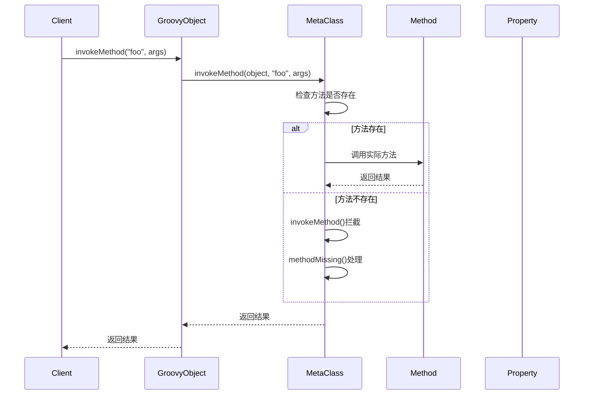

# 第六章：MOP（元对象协议）深入

> 元对象协议（MOP）是Groovy元编程的核心机制，它定义了方法调用、属性访问的完整流程。掌握MOP，就掌握了Groovy动态特性的本质。

## 6.1 MOP概念和原理

### 6.1.1 什么是MOP？

MOP（Meta-Object Protocol）是一套规则，定义了对象如何响应方法调用和属性访问。在Groovy中，每个对象都有一个MetaObject来管理其行为。



```groovy
// 基础MOP演示
class MOPExample {
    def normalMethod() {
        "Normal method result"
    }
}

def example = new MOPExample()

// 查看MetaClass
println "MetaClass: ${example.metaClass.class.name}"
println "The Class: ${example.metaClass.theClass.name}"

// 方法调用流程
println "Has normalMethod: ${example.metaClass.respondsTo('normalMethod')}"
println "Has missingMethod: ${example.metaClass.respondsTo('missingMethod')}"
```

### 6.1.2 MOP的方法调用流程

Groovy的方法调用遵循以下优先级顺序：

1. **直接方法调用**：类中定义的普通方法
2. **MetaClass方法**：通过元编程添加的方法
3. **invokeMethod拦截**：`GroovyObject.invokeMethod()`
4. **methodMissing处理**：`GroovyObject.methodMissing()`
5. **抛出MissingMethodException**

```groovy
class MethodCallFlow {
    // 1. 直接方法
    def directMethod() {
        "Direct method called"
    }

    // 3. invokeMethod拦截
    def invokeMethod(String name, args) {
        println "invokeMethod: ${name}(${args})"
        if (name.startsWith('intercept_')) {
            return "Intercepted: ${name.substring(10)}"
        }
        throw new MissingMethodException(name, this.class, args)
    }

    // 4. methodMissing处理
    def methodMissing(String name, args) {
        println "methodMissing: ${name}(${args})"

        // 动态创建方法
        metaClass."${name}" = { varArgs ->
            "Dynamically created ${name} called with ${varArgs}"
        }

        // 调用新创建的方法
        metaClass.invokeMethod(this, name, args)
    }
}

def flow = new MethodCallFlow()

// 测试调用流程
println flow.directMethod()                    // 1. 直接方法
println flow.intercept_hello("world")           // 3. invokeMethod拦截
println flow.dynamic_method("test")             // 4. methodMissing
println flow.dynamic_method("second_call")      // 现在是直接方法
```

## 6.2 GroovyObject接口详解

### 6.2.1 GroovyObject核心方法

```groovy
// GroovyObject接口的实现
class CustomGroovyObject implements GroovyObject {
    MetaClass metaClass
    def properties = [:]

    CustomGroovyObject() {
        this.metaClass = new ExpandoMetaClass(this.class)
        this.metaClass.initialize()
    }

    // 核心方法实现
    Object invokeMethod(String name, Object args) {
        println "Custom invokeMethod: ${name}, args: ${args}"

        def method = metaClass.getMetaMethod(name, args as Object[])
        if (method) {
            return method.invoke(this, args as Object[])
        }

        return methodMissing(name, args)
    }

    Object getProperty(String propertyName) {
        println "Getting property: ${propertyName}"
        return properties.get(propertyName)
    }

    void setProperty(String propertyName, Object newValue) {
        println "Setting property: ${propertyName} = ${newValue}"
        properties[propertyName] = newValue
    }

    MetaClass getMetaClass() {
        return metaClass
    }

    void setMetaClass(MetaClass metaClass) {
        this.metaClass = metaClass
    }

    Object methodMissing(String name, args) {
        throw new MissingMethodException(name, this.class, args as Object[])
    }
}

// 使用自定义GroovyObject
def custom = new CustomGroovyObject()
custom.name = "Test Object"
println custom.name
```

### 6.2.2 GroovyInterceptable接口

```groovy
// 实现GroovyInterceptable拦截所有方法调用
class AllMethodInterceptor implements GroovyInterceptable {
    def message = "Original message"

    def normalMethod() {
        "Normal method result"
    }

    // 拦截所有方法调用（包括已存在的方法）
    def invokeMethod(String name, args) {
        println "Intercepting method: ${name}"
        println "Arguments: ${args}"

        // 根据方法名执行不同逻辑
        switch(name) {
            case 'normalMethod':
                return "Intercepted normal method"
            case ~/get.+/:
                def propName = name.substring(3).uncapitalize()
                return "Getting property: ${propName} = ${properties.get(propName)}"
            case ~/set.+/:
                def propName = name.substring(3).uncapitalize()
                properties[propName] = args[0]
                return "Setting property: ${propName}"
            default:
                return "Unknown method: ${name}"
        }
    }

    // 属性拦截
    def getProperty(String propertyName) {
        println "Getting property: ${propertyName}"
        return "Intercepted ${propertyName}"
    }

    def setProperty(String propertyName, newValue) {
        println "Setting property: ${propertyName} = ${newValue}"
        this.@"${propertyName}" = newValue
    }

    private def properties = [:]
}

def interceptor = new AllMethodInterceptor()

// 所有的方法调用都会被拦截
println interceptor.normalMethod()           // 被拦截
println interceptor.message                  // 被拦截
interceptor.newProperty = "New value"        // 被拦截
println interceptor.getNewProp()              // 被拦截
```

## 6.3 方法调度机制

### 6.3.1 方法查找算法

```groovy
// 演示Groovy的方法查找算法
class MethodLookup {
    def explicitMethod() {
        "Explicit method"
    }

    def methodWithArgs(String arg1, Integer arg2) {
        "Method with args: ${arg1}, ${arg2}"
    }

    // 重载方法
    def overloadedMethod(String s) {
        "String version: ${s}"
    }

    def overloadedMethod(Integer i) {
        "Integer version: ${i}"
    }

    def overloadedMethod(Object o) {
        "Object version: ${o}"
    }
}

def lookup = new MethodLookup()

// 添加动态方法
lookup.dynamicMethod = { -> "Dynamic method" }

// 方法查找测试
println lookup.explicitMethod()              // 1. 显式方法
println lookup.dynamicMethod()               // 2. 动态方法

// 重载方法解析
println lookup.overloadedMethod("hello")     // 最具体的匹配
println lookup.overloadedMethod(42)
println lookup.overloadedMethod(true)        // 匹配Object版本

// 方法签名匹配
println "Method exists: ${lookup.metaClass.respondsTo('explicitMethod')}"
println "Method with signature: ${lookup.metaClass.respondsTo('methodWithArgs', String.class, Integer.class)}"

// 获取方法信息
def methods = lookup.metaClass.methods.findAll { it.name == 'overloadedMethod' }
methods.each { method ->
    println "Method: ${method.name}, Parameters: ${method.parameterTypes*.name}"
}
```

### 6.3.2 动态方法调度

```groovy
// 动态方法调度示例
class DynamicDispatcher {
    private def dispatchTable = [:]

    // 注册处理方法
    def registerHandler(String type, Closure handler) {
        dispatchTable[type] = handler
    }

    // 动态调度
    def process(String type, Object data) {
        def handler = dispatchTable[type]
        if (handler) {
            return handler(data)
        }
        throw new IllegalArgumentException("No handler for type: ${type}")
    }

    // 使用invokeMethod实现更灵活的调度
    def invokeMethod(String name, args) {
        if (name.startsWith('process_')) {
            def type = name.substring(8)
            return process(type, args[0])
        }
        throw new MissingMethodException(name, this.class, args as Object[])
    }
}

def dispatcher = new DynamicDispatcher()

// 注册不同类型的处理器
dispatcher.registerHandler('user') { user ->
    "Processing user: ${user.name}, age: ${user.age}"
}

dispatcher.registerHandler('order') { order ->
    "Processing order: ${order.id}, amount: ${order.amount}"
}

dispatcher.registerHandler('payment') { payment ->
    "Processing payment: ${payment.method}, \$${payment.amount}"
}

// 使用动态调度
println dispatcher.process('user', [name: 'Alice', age: 30])
println dispatcher.process('order', [id: 'ORD-001', amount: 299.99])

// 使用方法调用形式
println dispatcher.process_user([name: 'Bob', age: 25])
println dispatcher.process_order([id: 'ORD-002', amount: 199.99])
```

## 6.4 自定义MetaClass

### 6.4.1 创建自定义MetaClass

```groovy
// 自定义MetaClass实现
class ValidationMetaClass extends DelegatingMetaClass {
    ValidationMetaClass(Class theClass) {
        super(theClass)
    }

    // 初始化时添加验证方法
    void initialize() {
        super.initialize()

        // 添加验证相关方法
        addValidationMethods()
    }

    private void addValidationMethods() {
        // 动态添加验证方法
        theClass.metaClass.validateEmail = { String email ->
            email ==~ /^[a-zA-Z0-9._%+-]+@[a-zA-Z0-9.-]+\.[a-zA-Z]{2,}$/
        }

        theClass.metaClass.validatePhone = { String phone ->
            phone ==~ /^\+?[\d\s-()]+$/
        }

        theClass.metaClass.validateNotEmpty = { String value ->
            value != null && !value.trim().isEmpty()
        }

        // 批量验证
        theClass.metaClass.validate = { Map validations ->
            def errors = [:]

            validations.each { field, rules ->
                def value = delegate."${field}"

                if (rules.required && !value) {
                    errors[field] = "${field} is required"
                } else if (value) {
                    if (rules.email && !delegate.validateEmail(value)) {
                        errors[field] = "${field} is not a valid email"
                    }
                    if (rules.phone && !delegate.validatePhone(value)) {
                        errors[field] = "${field} is not a valid phone number"
                    }
                    if (rules.minLength && value.length() < rules.minLength) {
                        errors[field] = "${field} must be at least ${rules.minLength} characters"
                    }
                }
            }

            return errors.isEmpty() ? null : errors
        }
    }
}

// 使用自定义MetaClass
class UserProfile {
    String name
    String email
    String phone
    int age
}

// 应用自定义MetaClass
def validationMetaClass = new ValidationMetaClass(UserProfile)
UserProfile.metaClass = validationMetaClass

def profile = new UserProfile(
    name: "Alice Johnson",
    email: "alice@example.com",
    phone: "+1-555-123-4567",
    age: 30
)

// 验证用户资料
def validationRules = [
    name: [required: true, minLength: 2],
    email: [required: true, email: true],
    phone: [phone: true],
    age: [required: true]
]

def errors = profile.validate(validationRules)
if (errors) {
    println "Validation errors: ${errors}"
} else {
    println "Profile is valid!"
}

// 测试各种验证方法
println "Valid email: ${profile.validateEmail('test@example.com')}"
println "Valid phone: ${profile.validatePhone('+86-138-0013-8000')}"
println "Not empty: ${profile.validateNotEmpty('Hello')}"
```

### 6.4.2 MetaClass装饰器模式

```groovy
// MetaClass装饰器：在原有功能基础上添加新功能
class LoggingMetaClass extends DelegatingMetaClass {
    LoggingMetaClass(MetaClass delegate) {
        super(delegate)
    }

    Object invokeMethod(Object object, String methodName, Object[] arguments) {
        def startTime = System.currentTimeMillis()
        println "Calling ${object.class.simpleName}.${methodName}(${arguments.join(', ')})"

        try {
            def result = super.invokeMethod(object, methodName, arguments)
            def duration = System.currentTimeMillis() - startTime
            println "${methodName} completed in ${duration}ms, result: ${result}"
            return result
        } catch (Exception e) {
            def duration = System.currentTimeMillis() - startTime
            println "${methodName} failed in ${duration}ms, error: ${e.message}"
            throw e
        }
    }

    Object getProperty(Object object, String propertyName) {
        println "Getting property: ${object.class.simpleName}.${propertyName}"
        def result = super.getProperty(object, propertyName)
        println "Property value: ${result}"
        return result
    }

    void setProperty(Object object, String propertyName, Object newValue) {
        println "Setting property: ${object.class.simpleName}.${propertyName} = ${newValue}"
        super.setProperty(object, propertyName, newValue)
        println "Property set successfully"
    }
}

// 应用日志装饰器
class DataService {
    def findUser(String id) {
        Thread.sleep(100)  // 模拟数据库查询
        return [id: id, name: "User ${id}", email: "${id}@example.com"]
    }

    def saveUser(user) {
        Thread.sleep(50)   // 模拟保存操作
        return true
    }
}

// 包装原有MetaClass
def originalMetaClass = DataService.metaClass
def loggingMetaClass = new LoggingMetaClass(originalMetaClass)
DataService.metaClass = loggingMetaClass

def service = new DataService()
def user = service.findUser("123")
service.saveUser(user)
```

## 6.5 动态接口实现

### 6.5.1 运行时接口实现

```groovy
// 定义接口
interface Drawable {
    void draw()
    double getArea()
}

interface Movable {
    void move(double dx, double dy)
    double getX()
    double getY()
}

// 动态实现接口
class DynamicShape implements GroovyObject {
    def properties = [:]
    def methods = [:]

    DynamicShape() {
        // 默认实现
        methods.draw = { println "Drawing shape at (${x}, ${y})" }
        methods.getArea = { -> width * height }
        methods.move = { dx, dy ->
            x += dx
            y += dy
        }
    }

    Object invokeMethod(String name, Object args) {
        def method = methods[name]
        if (method) {
            return method(*args)
        }
        throw new MissingMethodException(name, this.class, args as Object[])
    }

    Object getProperty(String name) {
        properties[name]
    }

    void setProperty(String name, Object value) {
        properties[name] = value
    }

    MetaClass getMetaClass() {
        // 返回支持接口的MetaClass
        return new InterfaceSupportingMetaClass(this.class, this)
    }

    void setMetaClass(MetaClass metaClass) {
        // 忽略MetaClass设置
    }
}

// 支持接口的MetaClass
class InterfaceSupportingMetaClass extends ExpandoMetaClass {
    def target

    InterfaceSupportingMetaClass(Class theClass, target) {
        super(theClass)
        this.target = target
        initialize()
    }

    boolean implementsInterface(Class iface) {
        // 动态检查是否实现了接口
        def ifaceMethods = iface.methods.collect { it.name }
        def targetMethods = target.methods.keySet()

        return ifaceMethods.every { targetMethods.contains(it) }
    }

    Object invokeMethod(Object object, String name, Object[] args) {
        // 委托给目标对象
        target.invokeMethod(name, args)
    }
}

// 使用动态接口实现
def shape = new DynamicShape()
shape.x = 10
shape.y = 20
shape.width = 100
shape.height = 50

// 检查接口实现
println "Implements Drawable: ${shape.metaClass.implementsInterface(Drawable)}"
println "Implements Movable: ${shape.metaClass.implementsInterface(Movable)}"

// 通过接口调用
def drawable = shape as Drawable
drawable.draw()
println "Area: ${drawable.getArea()}"

def movable = shape as Movable
movable.move(5, 10)
println "New position: (${movable.getX()}, ${movable.getY()})"
```

### 6.5.2 代理模式实现

```groovy
// 通用代理类
class GroovyProxy implements InvocationHandler {
    def target
    def interceptors = [:]

    GroovyProxy(Object target) {
        this.target = target
    }

    def addInterceptor(String methodName, Closure interceptor) {
        interceptors[methodName] = interceptor
    }

    Object invoke(Object proxy, Method method, Object[] args) throws Throwable {
        def methodName = method.name

        // 前置拦截
        def beforeInterceptor = interceptors["before_${methodName}"]
        if (beforeInterceptor) {
            beforeInterceptor(args)
        }

        def result
        try {
            // 执行目标方法
            result = method.invoke(target, args)

            // 后置拦截
            def afterInterceptor = interceptors["after_${methodName}"]
            if (afterInterceptor) {
                def modifiedResult = afterInterceptor(result, args)
                if (modifiedResult != null) {
                    result = modifiedResult
                }
            }

            return result
        } catch (Exception e) {
            // 异常拦截
            def errorInterceptor = interceptors["error_${methodName}"]
            if (errorInterceptor) {
                errorInterceptor(e, args)
            }
            throw e
        }
    }
}

// 使用代理
class Calculator {
    def add(a, b) { a + b }
    def subtract(a, b) { a - b }
    def multiply(a, b) { a * b }
    def divide(a, b) {
        if (b == 0) throw new IllegalArgumentException("Division by zero")
        a / b
    }
}

// 创建代理
def calculator = new Calculator()
def proxy = new GroovyProxy(calculator)

// 添加拦截器
proxy.addInterceptor("before_add") { args ->
    println "About to add: ${args[0]} + ${args[1]}"
}

proxy.addInterceptor("after_multiply") { result, args ->
    println "Multiplication result: ${result}"
    return result * 2  // 修改结果
}

proxy.addInterceptor("error_divide") { error, args ->
    println "Error during division: ${error.message}"
}

// 创建代理实例
def proxyInstance = Proxy.newProxyInstance(
    Calculator.classLoader,
    [Calculator.class] as Class[],
    proxy
)

// 使用代理
println "Add result: ${proxyInstance.add(5, 3)}"
println "Multiply result: ${proxyInstance.multiply(4, 6)}"

try {
    proxyInstance.divide(10, 0)
} catch (Exception e) {
    println "Caught exception: ${e.message}"
}
```

## 6.6 MOP实战案例

### 6.6.1 动态API客户端

```groovy
// 动态API客户端，自动适配不同的REST API
class DynamicAPIClient {
    def baseUrl
    def httpClient = new HTTPClient()  // 假设的HTTP客户端

    DynamicAPIClient(String baseUrl) {
        this.baseUrl = baseUrl
    }

    def invokeMethod(String name, args) {
        // 解析方法名为API操作
        def parts = name.split('_')
        def action = parts[0]
        def resource = parts[1..-1].join('/')

        switch(action) {
            case 'get':
                return getResource(resource, args[0])
            case 'post':
                return createResource(resource, args[0])
            case 'put':
                return updateResource(resource, args[0], args[1])
            case 'delete':
                return deleteResource(resource, args[0])
            default:
                throw new IllegalArgumentException("Unknown action: ${action}")
        }
    }

    private def getResource(String resource, String id = null) {
        def url = "${baseUrl}/${resource}${id ? "/${id}" : ""}"
        println "GET ${url}"
        return httpClient.get(url)
    }

    private def createResource(String resource, Map data) {
        def url = "${baseUrl}/${resource}"
        println "POST ${url} with data: ${data}"
        return httpClient.post(url, data)
    }

    private def updateResource(String resource, String id, Map data) {
        def url = "${baseUrl}/${resource}/${id}"
        println "PUT ${url} with data: ${data}"
        return httpClient.put(url, data)
    }

    private def deleteResource(String resource, String id) {
        def url = "${baseUrl}/${resource}/${id}"
        println "DELETE ${url}"
        return httpClient.delete(url)
    }
}

// 模拟HTTP客户端
class HTTPClient {
    def get(url) { [status: 200, data: "GET ${url}"] }
    def post(url, data) { [status: 201, data: "POST ${url}: ${data}"] }
    def put(url, data) { [status: 200, data: "PUT ${url}: ${data}"] }
    def delete(url) { [status: 204, data: "DELETE ${url}"] }
}

// 使用动态API客户端
def client = new DynamicAPIClient("https://api.example.com")

// 动态生成API方法调用
def users = client.get_users()                    // GET /users
def user = client.get_user("123")                 // GET /users/123
def newUser = client.post_user([name: "Alice", email: "alice@example.com"])  // POST /users
def updatedUser = client.put_user("123", [name: "Alice Smith"])              // PUT /users/123
def deleted = client.delete_user("123")           // DELETE /users/123

// 可以支持不同的资源
def orders = client.get_orders()
def products = client.get_products()
```

### 6.6.2 动态配置管理器

```groovy
// 动态配置管理器，支持多种配置源
class DynamicConfigManager {
    def configs = [:]
    def configSources = []

    DynamicConfigManager() {
        // 添加默认配置源
        addConfigSource(new SystemPropertySource())
        addConfigSource(new EnvironmentVariableSource())
        addConfigSource(new FilePropertySource())
    }

    def addConfigSource(configSource) {
        configSources.add(configSource)
    }

    def getProperty(String propertyName) {
        // 按优先级查找配置值
        for (source in configSources) {
            def value = source.getProperty(propertyName)
            if (value != null) {
                return value
            }
        }
        return null
    }

    def setProperty(String propertyName, Object value) {
        configs[propertyName] = value
    }

    def invokeMethod(String name, args) {
        if (name.startsWith('get_') && args.size() == 1) {
            def propertyName = args[0]
            def defaultValue = name.substring(4)
            return getProperty(propertyName) ?: defaultValue
        }

        if (name.startsWith('set_') && args.size() == 1) {
            def propertyName = args[0]
            setProperty(propertyName, name.substring(4))
            return
        }

        throw new MissingMethodException(name, this.class, args as Object[])
    }
}

// 配置源接口
interface ConfigSource {
    Object getProperty(String propertyName)
}

// 系统属性源
class SystemPropertySource implements ConfigSource {
    Object getProperty(String propertyName) {
        System.getProperty(propertyName)
    }
}

// 环境变量源
class EnvironmentVariableSource implements ConfigSource {
    Object getProperty(String propertyName) {
        def envName = propertyName.toUpperCase().replace('.', '_')
        System.getenv(envName)
    }
}

// 文件属性源
class FilePropertySource implements ConfigSource {
    def properties = [:]

    FilePropertySource() {
        // 模拟从文件加载配置
        properties = [
            'database.url': 'jdbc:mysql://localhost:3306/myapp',
            'database.username': 'root',
            'database.password': 'password',
            'cache.timeout': '300',
            'service.max.connections': '100'
        ]
    }

    Object getProperty(String propertyName) {
        properties[propertyName]
    }
}

// 使用动态配置管理器
def config = new DynamicConfigManager()

// 动态获取配置值
println "Database URL: ${config.getProperty('database.url')}"
println "Cache timeout: ${config.getProperty('cache.timeout', 60)}"

// 动态设置默认值
def dbUrl = config.get_defaultValue('database.url', 'jdbc:h2:mem:testdb')
def timeout = config.get_defaultValue('cache.timeout', '120')

// 动态设置配置
config.setProperty('new.feature.enabled', true)
config.set_localhost('server.host')

println "New feature enabled: ${config.getProperty('new.feature.enabled')}"
println "Server host: ${config.getProperty('server.host')}"
```

## 6.7 性能优化和最佳实践

### 6.7.1 MOP性能优化

```groovy
// MOP性能测试和优化
class MOPPerformanceTest {
    // 原生方法（最快）
    def nativeMethod(int x) {
        x * 2
    }

    // 添加到MetaClass的方法（稍慢）
    def addMetaClassMethod() {
        this.metaClass.metaMethod = { int x -> x * 2 }
    }

    // invokeMethod拦截（最慢）
    def invokeMethod(String name, args) {
        if (name == 'interceptedMethod') {
            return ((args[0] as int) * 2)
        }
        throw new MissingMethodException(name, this.class, args as Object[])
    }

    static void runPerformanceTest() {
        def test = new MOPPerformanceTest()
        test.addMetaClassMethod()

        def iterations = 1000000

        // 测试原生方法
        def start = System.currentTimeMillis()
        iterations.times { test.nativeMethod(5) }
        def nativeTime = System.currentTimeMillis() - start

        // 测试MetaClass方法
        start = System.currentTimeMillis()
        iterations.times { test.metaMethod(5) }
        def metaClassTime = System.currentTimeMillis() - start

        // 测试invokeMethod
        start = System.currentTimeMillis()
        iterations.times { test.interceptedMethod(5) }
        def invokeTime = System.currentTimeMillis() - start

        println "Performance Test (${iterations} iterations):"
        println "Native method: ${nativeTime}ms"
        println "MetaClass method: ${metaClassTime}ms (${metaClassTime / nativeTime}x slower)"
        println "invokeMethod: ${invokeTime}ms (${invokeTime / nativeTime}x slower)"
    }
}

// 运行性能测试
MOPPerformanceTest.runPerformanceTest()

// 性能优化技巧
class OptimizedMOP {
    // 使用@CompileStatic避免动态调用
    @CompileStatic
    def staticOptimized(int x) {
        x * 2
    }

    // 缓存方法引用
    def cachedMethod
    def initializeCachedMethod() {
        cachedMethod = this.metaClass.getMetaMethod('targetMethod', Integer)
    }

    def targetMethod(int x) {
        x * 2
    }

    def fastInvoke(int x) {
        cachedMethod.invoke(this, x)
    }

    // 使用方法句柄
    def methodHandle
    def initializeMethodHandle() {
        methodHandle = this.&targetMethod
    }

    def veryFastInvoke(int x) {
        methodHandle(x)
    }
}
```

### 6.7.2 MOP最佳实践

```groovy
// MOP最佳实践指南
class MOPBestPractices {

    // 1. 优先使用编译时特性
    @CompileStatic
    def compileTimeMethod(String input) {
        // 编译时类型检查，性能更好
        input.toUpperCase()
    }

    // 2. 谨慎使用invokeMethod
    def safeInvokeMethod(String name, args) {
        // 添加类型检查和错误处理
        if (name.startsWith('process_')) {
            def data = args[0]
            if (data instanceof Map) {
                return processData(name.substring(8), data)
            }
        }
        throw new IllegalArgumentException("Invalid method: ${name}")
    }

    // 3. 缓存MetaClass查找结果
    private def methodCache = [:]

    def getCachedMethod(String methodName, Class[] parameterTypes) {
        def cacheKey = "${methodName}_${parameterTypes*.name.join('_')}"
        if (!methodCache.containsKey(cacheKey)) {
            methodCache[cacheKey] = metaClass.getMetaMethod(methodName, parameterTypes)
        }
        return methodCache[cacheKey]
    }

    // 4. 使用装饰器模式增强MetaClass
    def wrapMetaClass(Closure enhancement) {
        def original = metaClass
        metaClass = new ExpandoMetaClass(theClass) {
            def invokeMethod(Object obj, String name, Object[] args) {
                // 应用增强
                enhancement.delegate = delegate
                enhancement(name, args)

                // 调用原始方法
                original.invokeMethod(obj, name, args)
            }
        }
        metaClass.initialize()
    }

    // 5. 提供文档和示例
    /**
     * 动态处理数据的方法
     * @param data 要处理的数据Map
     * @return 处理结果
     * @example
     * def result = process_user([name: "Alice", age: 30])
     */
    def processData(String type, Map data) {
        // 处理逻辑
        "Processed ${type}: ${data}"
    }

    // 6. 避免过度使用元编程
    def simpleMethod(String input) {
        // 简单的方法不需要元编程
        input.trim()
    }
}

// MOP使用检查清单
def mopChecklist = [
    "是否真正需要动态行为？",
    "是否有编译时的替代方案？",
    "是否考虑了性能影响？",
    "是否提供了充分的测试？",
    "是否有清晰的文档说明？",
    "是否处理了错误情况？",
    "是否遵循了团队约定？"
]

println "MOP Usage Checklist:"
mopChecklist.eachWithIndex { item, index ->
    println "${index + 1}. ${item}"
}
```

## 本章小结

MOP是Groovy动态特性的核心机制，掌握MOP能够让我们深入理解Groovy的工作原理。

### 核心概念回顾

1. **MOP原理**：定义了方法调用和属性访问的完整流程
2. **GroovyObject接口**：所有Groovy对象的基础接口
3. **方法调度**：动态方法查找和调用机制
4. **自定义MetaClass**：扩展对象行为的能力
5. **动态接口实现**：运行时实现接口的功能

### 实战应用

✅ **理解MOP流程**：从方法调用到结果返回的完整过程
✅ **掌握GroovyObject**：实现自定义的动态行为
✅ **学会自定义MetaClass**：增强现有类的功能
✅ **掌握动态接口**：运行时实现接口的方法
✅ **性能意识**：了解MOP的性能影响和优化技巧

### 最佳实践

- **合理使用**：只在确实需要时使用MOP特性
- **性能考虑**：了解不同MOP机制的性能差异
- **文档化**：为动态行为提供清晰的说明
- **测试覆盖**：确保动态行为的正确性
- **错误处理**：提供友好的错误信息

下一章我们将探讨AST转换，这是Groovy编译时元编程的重要工具。