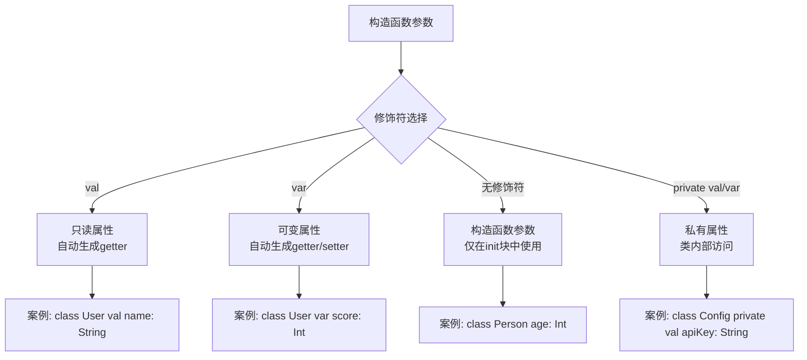
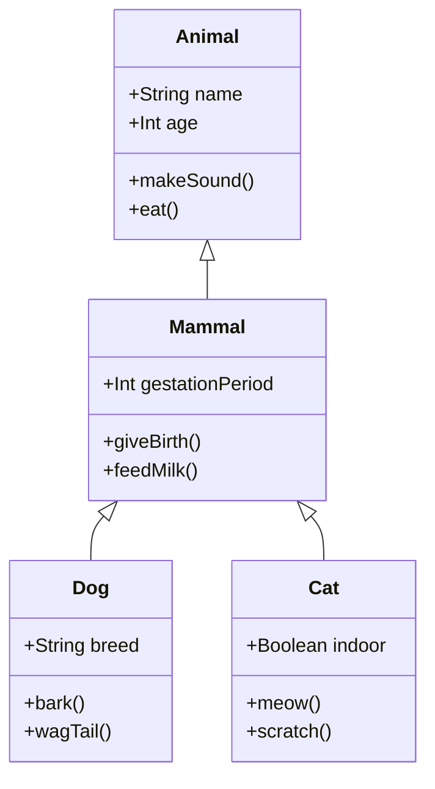
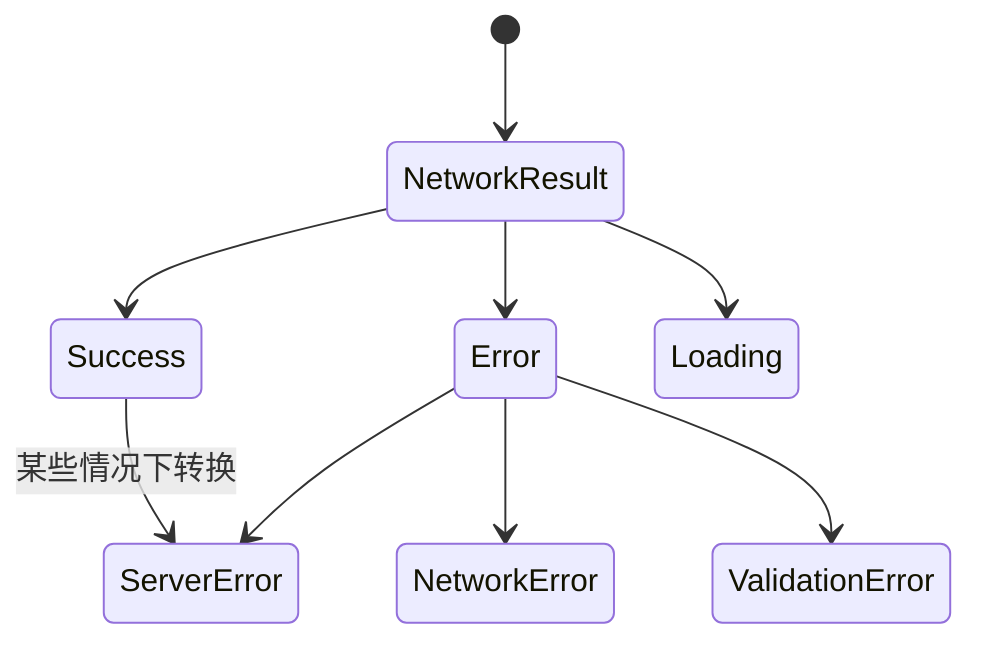
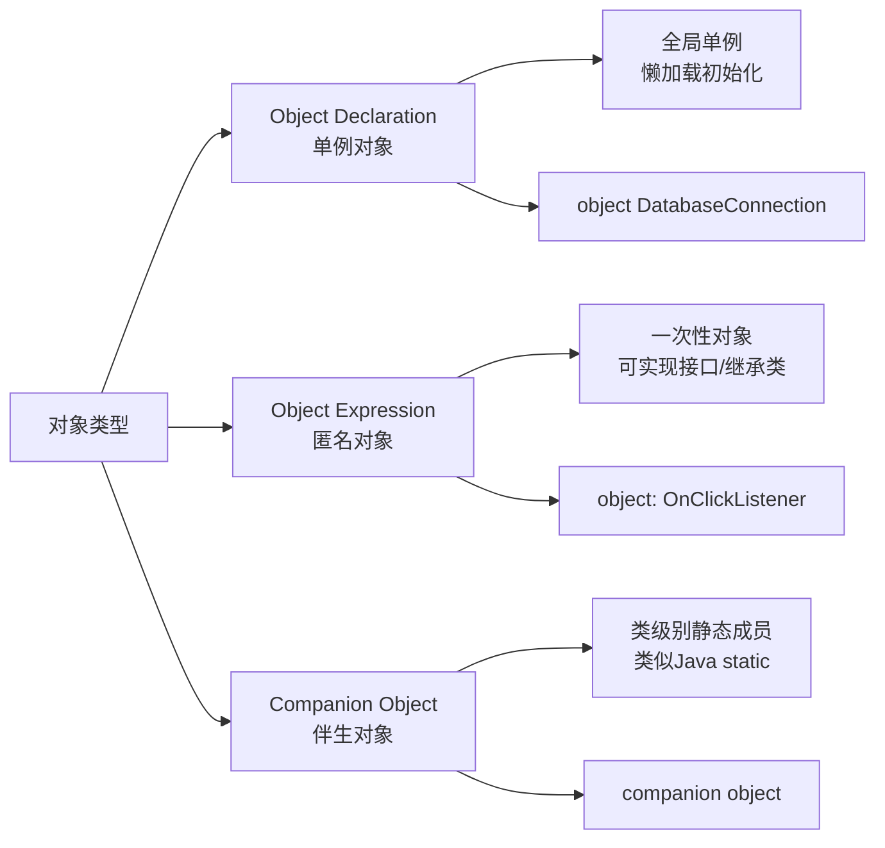

# 第2章：面向对象编程进阶

## 📖 章节概述

本章将深入探讨Kotlin的面向对象编程特性。作为Java开发者，您已经熟悉了OOP的基本概念，本章将重点展示Kotlin如何在保持OOP核心思想的同时，通过语法糖和语言特性让代码更加简洁、安全和表达力更强。

**学习时长**: 约3-4天
**核心目标**: 掌握Kotlin的高级OOP特性，能够设计优雅的Kotlin类结构

---

## 2.1 类与构造函数

### 2.1.1 主构造函数 vs 次构造函数

Kotlin简化了构造函数的写法，将主构造函数直接写在类声明中：

```kotlin
// Kotlin - 主构造函数
class User(val name: String, val age: Int) {
    fun introduce(): String = "我叫$name，今年$age岁"
}

// 等价的Java代码
public class User {
    private final String name;
    private final int age;

    public User(String name, int age) {
        this.name = name;
        this.age = age;
    }

    public String introduce() {
        return "我叫" + name + "，今年" + age + "岁";
    }

    public String getName() { return name; }
    public int getAge() { return age; }
}
```

### 2.1.2 主构造函数中的初始化代码

```kotlin
class Person(val name: String, age: Int) {
    // age不是val/var，只能在init块中使用
    val adult: Boolean

    // 初始化块
    init {
        require(name.isNotBlank()) { "姓名不能为空" }
        adult = age >= 18
        println("Person $name 已创建，成年状态：$adult")
    }

    // 次构造函数
    constructor(name: String) : this(name, 0) {
        println("调用次构造函数，年龄默认为0")
    }
}
```

### 2.1.3 构造函数的参数修饰符对比



### 2.1.4 复杂构造函数示例

```kotlin
// 复杂的用户类
class AdvancedUser(
    val id: String,
    val name: String,
    email: String?,
    age: Int = 0,
    private val secret: String = ""
) {
    // 属性初始化
    val formattedEmail: String = email ?: "未设置邮箱"
    val isAdult: Boolean = age >= 18
    val displayName: String = name.trim().ifEmpty { "匿名用户" }

    // 验证逻辑
    init {
        require(id.isNotBlank()) { "用户ID不能为空" }
        require(name.isNotBlank()) { "用户名不能为空" }
        if (secret.isNotBlank()) {
            require(secret.length >= 8) { "密码长度至少8位" }
        }
    }

    // 次构造函数
    constructor(id: String, name: String, email: String) :
            this(id, name, email, 18) {
        println("创建成年用户：$name")
    }

    // 构造函数权限控制
    private constructor(id: String) : this(id, "系统用户", null) {
        // 私有构造函数，用于创建系统用户
    }

    companion object {
        fun createSystemUser(id: String): AdvancedUser {
            return AdvancedUser(id)
        }
    }
}
```

---

## 2.2 属性与字段

### 2.2.1 自动生成的Getter和Setter

Kotlin自动为属性生成访问器，但可以自定义：

```kotlin
class SmartDevice {
    var volume: Int = 50
        set(value) {
            if (value in 0..100) {
                field = value
                onVolumeChanged(value)
            } else {
                throw IllegalArgumentException("音量必须在0-100之间")
            }
        }
        get() {
            println("获取当前音量：$field")
            return field
        }

    private fun onVolumeChanged(newVolume: Int) {
        println("音量已调整至：$newVolume")
    }

    // 计算属性
    val isMuted: Boolean
        get() = volume == 0

    // 延迟初始化属性
    lateinit var networkStatus: String

    // 懒加载属性
    val systemInfo: String by lazy {
        "设备型号：${android.os.Build.MODEL}\n系统版本：${android.os.Build.VERSION.RELEASE}"
    }
}
```

### 2.2.2 属性可见性修饰符

```kotlin
class VisibilityExample {
    // public - 默认，任何地方都可访问
    val publicProperty: String = "公开属性"

    // private - 仅类内部可访问
    private val privateProperty: String = "私有属性"

    // protected - 类及其子类可访问
    protected val protectedProperty: String = "受保护属性"

    // internal - 同模块内可访问
    internal val internalProperty: String = "模块内属性"

    // 私有setter，公开getter
    var writableProperty: String = "可写属性"
        private set

    fun demonstrateAccess() {
        println(publicProperty)      // ✅ 可访问
        println(privateProperty)     // ✅ 可访问
        println(protectedProperty)   // ✅ 可访问
        writableProperty = "新值"     // ✅ 可访问
    }
}
```

### 2.2.3 属性委托

Kotlin支持属性委托，这是一种强大的模式：

```kotlin
import kotlin.properties.Delegates

class UserProfile {
    // 可观察属性
    var name: String by Delegates.observable("<未设置>") {
        _, old, new ->
        println("用户名从 '$old' 更改为 '$new'")
    }

    // 可否决属性
    var age: Int by Delegates.vetoable(0) { _, _, new ->
        val valid = new in 0..150
        if (!valid) println("年龄 $new 无效，保持原值")
        valid
    }

    // 延迟属性
    val expensiveCalculation: Double by lazy {
        println("执行昂贵计算...")
        Thread.sleep(1000) // 模拟耗时操作
        Math.random() * 1000
    }

    // 自定义属性委托
    var logMessage: String by LoggingDelegate()
}

class LoggingDelegate {
    private var _value: String = ""

    operator fun getValue(thisRef: Any?, property: KProperty<*>): String {
        println("读取属性 ${property.name}: $_value")
        return _value
    }

    operator fun setValue(thisRef: Any?, property: KProperty<*>, value: String) {
        println("设置属性 ${property.name}: $value")
        _value = value
    }
}
```

---

## 2.3 继承与接口的改进语法

### 2.3.1 类继承



```kotlin
// 基类需要标记为open才能被继承
open class Animal(val name: String, var age: Int) {
    // open方法才能被子类重写
    open fun makeSound(): String = "动物发出声音"

    open fun eat(): String = "$name 正在进食"

    // final方法不能被重写
    fun sleep(): String = "$name 正在睡觉"
}

// 抽象类
abstract class Mammal(name: String, age: Int,
                     val gestationPeriod: Int) : Animal(name, age) {

    // 抽象方法必须被子类实现
    abstract fun giveBirth(): String
    abstract fun feedMilk(): String

    // 重写父类方法
    override fun makeSound(): String = "哺乳动物的声音"
}

// 具体实现类
class Dog(name: String, age: Int, val breed: String) :
    Mammal(name, age, 63) {

    // 实现抽象方法
    override fun giveBirth(): String = "$breed 正在分娩"
    override fun feedMilk(): String = "$name 正在哺乳幼崽"

    // 重写父类方法
    override fun makeSound(): String = "汪汪汪"

    // 新增方法
    fun bark(): String = "$breed 在吠叫"
    fun wagTail(): String = "$name 摇尾巴表示高兴"
}

class Cat(name: String, age: Int, val indoor: Boolean) :
    Mammal(name, age, 65) {

    override fun giveBirth(): String = "猫咪正在分娩"
    override fun feedMilk(): String = "$name 正在哺乳小猫"

    override fun makeSound(): String = "喵喵喵"

    fun meow(): String = if (indoor) "室内猫在喵喵叫" else "流浪猫在喵喵叫"
    fun scratch(): String = "$name 在抓挠"
}
```

### 2.3.2 接口定义与实现

```kotlin
// 接口定义
interface Flyable {
    // 抽象属性
    val flightSpeed: Double

    // 具体属性（需要get实现）
    val canFly: Boolean get() = flightSpeed > 0

    // 抽象方法
    fun fly(): String

    // 默认实现方法
    fun takeOff(): String = "准备起飞"
    fun land(): String = "准备降落"
}

interface Swimmable {
    val swimmingSpeed: Double
    fun swim(): String
}

interface Diver : Flyable, Swimmable {
    fun dive(): String {
        return "${fly()}然后${swim()}"
    }
}

// 多接口实现
class Duck(name: String, age: Int) : Animal(name, age),
    Flyable, Swimmable, Diver {

    override val flightSpeed: Double = 88.0
    override val swimmingSpeed: Double = 5.0

    override fun fly(): String = "$name 拍打翅膀飞行"
    override fun swim(): String = "$name 在水中游泳"

    // 可以重写接口的默认实现
    override fun takeOff(): String = "$name 从水面起飞"
}

class Fish(name: String, age: Int) : Animal(name, age), Swimmable {
    override val swimmingSpeed: Double = 20.0

    override fun eat(): String = "$name 正在吃水草"
    override fun swim(): String = "$name 在水中畅游"

    // 不能实现Flyable接口，因为鱼不会飞
    // class Fish : Animal(name, age), Flyable, Swimmable // 编译错误
}
```

### 2.3.3 接口的默认实现和冲突解决

```kotlin
interface A {
    fun commonMethod(): String = "接口A的实现"
    fun methodA(): String = "只有A有"
}

interface B {
    fun commonMethod(): String = "接口B的实现"
    fun methodB(): String = "只有B有"
}

// 解决接口实现冲突
class ConflictedClass : A, B {
    // 必须明确指定使用哪个接口的实现
    override fun commonMethod(): String {
        return super<A>.commonMethod() + " + " + super<B>.commonMethod()
    }

    override fun methodA(): String = "类重写了A的方法"
    override fun methodB(): String = "类重写了B的方法"
}

// 接口中的属性冲突
interface X {
    val value: String get() = "接口X的值"
}

interface Y {
    val value: String get() = "接口Y的值"
}

class ConflictResolver : X, Y {
    // 必须明确指定属性实现
    override val value: String = "类的自己的值"
}
```

---

## 2.4 数据类、密封类、枚举类

### 2.4.1 数据类（Data Class）

数据类是Kotlin的明星特性，自动生成样板代码：

```kotlin
// 数据类定义
data class User(
    val id: String,
    val name: String,
    val email: String,
    val age: Int = 18,
    val isActive: Boolean = true
) {
    // 可以添加额外的方法
    fun getDisplayName(): String = if (isActive) name else "$name (已禁用)"

    // 可以有次构造函数
    constructor(id: String, name: String, email: String) :
            this(id, name, email, 18, true)
}

// 数据类自动生成的方法：
// equals(), hashCode(), toString(), componentN(), copy()

val user1 = User("001", "张三", "zhangsan@example.com", 25)
val user2 = User("001", "张三", "zhangsan@example.com", 25)

println(user1 == user2)        // true - 自动生成的equals
println(user1.hashCode() == user2.hashCode()) // true - 自动生成的hashCode
println(user1)                 // User(id=001, name=张三, email=zhangsan@example.com, age=25, isActive=true)

// 解构声明
val (id, name, email, age, active) = user1
println("ID: $id, 姓名: $name")

// copy方法创建副本
val user3 = user1.copy(age = 26, isActive = false)
println(user3) // User(id=001, name=张三, email=zhangsan@example.com, age=26, isActive=false)

// Java对比 - 需要手动编写大量样板代码
public class User {
    private final String id;
    private final String name;
    private final String email;
    private final int age;
    private final boolean isActive;

    public User(String id, String name, String email, int age, boolean isActive) {
        this.id = id;
        this.name = name;
        this.email = email;
        this.age = age;
        this.isActive = isActive;
    }

    // 需要手动实现equals, hashCode, toString, 等等...
    @Override
    public boolean equals(Object o) { /* 大量样板代码 */ }

    @Override
    public int hashCode() { /* 大量样板代码 */ }

    @Override
    public String toString() { /* 大量样板代码 */ }

    // 需要手动实现getter方法和copy功能
}
```

### 2.4.2 密封类（Sealed Class）

密封类用于表示受限的类层次结构：



```kotlin
// 密封类定义
sealed class NetworkResult<out T> {
    // 成功结果
    data class Success<T>(val data: T) : NetworkResult<T>()

    // 加载状态
    object Loading : NetworkResult<Nothing>()

    // 错误基类（可以是密封类）
    sealed class Error(val message: String) : NetworkResult<Nothing>() {
        // 网络错误
        data class NetworkError(
            val exception: Throwable,
            override val message: String = "网络连接失败: ${exception.message}"
        ) : Error(message)

        // 服务器错误
        data class ServerError(
            val code: Int,
            override val message: String = "服务器错误 ($code)"
        ) : Error(message)

        // 验证错误
        data class ValidationError(
            val field: String,
            override val message: String = "字段 '$field' 验证失败"
        ) : Error(message)
    }
}

// 使用密封类
fun handleNetworkResult(result: NetworkResult<String>) {
    when (result) {
        is NetworkResult.Success -> {
            println("请求成功: ${result.data}")
        }
        is NetworkResult.Loading -> {
            println("正在加载...")
        }
        is NetworkResult.Error.NetworkError -> {
            println("网络错误: ${result.message}")
        }
        is NetworkResult.Error.ServerError -> {
            println("服务器错误: ${result.message} (错误码: ${result.code})")
        }
        is NetworkResult.Error.ValidationError -> {
            println("验证错误: ${result.message}")
        }
        // 不需要else分支，编译器确保所有情况都已覆盖
    }
}

// 复杂的密封类层次结构示例
sealed class ApiResponse<T> {
    data class Success<T>(val data: T, val timestamp: Long = System.currentTimeMillis()) : ApiResponse<T>()
    data class Error<T>(val code: String, val message: String, val originalData: T? = null) : ApiResponse<T>()
    object Timeout : ApiResponse<Nothing>()

    // 嵌套密封类
    sealed class Pending<T> : ApiResponse<T>() {
        object Queued : Pending<Nothing>()
        data class Processing(val progress: Int) : Pending<Nothing>()
        object Retrying : Pending<Nothing>()
    }
}
```

### 2.4.3 枚举类（Enum Class）

Kotlin的枚举类更加功能强大：

```kotlin
// 基础枚举定义
enum class Priority {
    LOW, MEDIUM, HIGH, URGENT
}

// 带属性和方法的枚举
enum class Status(val code: Int, val displayName: String) {
    PENDING(1, "待处理"),
    IN_PROGRESS(2, "进行中"),
    COMPLETED(3, "已完成"),
    CANCELLED(4, "已取消"),
    FAILED(5, "失败");

    fun isActive(): Boolean = this in setOf(PENDING, IN_PROGRESS)

    fun canTransitionTo(newStatus: Status): Boolean {
        return when (this) {
            PENDING -> newStatus in setOf(IN_PROGRESS, CANCELLED)
            IN_PROGRESS -> newStatus in setOf(COMPLETED, FAILED, CANCELLED)
            else -> false
        }
    }
}

// 抽象方法的枚举
enum class Operation(val symbol: String) {
    ADD("+") {
        override fun apply(a: Double, b: Double): Double = a + b
    },
    SUBTRACT("-") {
        override fun apply(a: Double, b: Double): Double = a - b
    },
    MULTIPLY("*") {
        override fun apply(a: Double, b: Double): Double = a * b
    },
    DIVIDE("/") {
        override fun apply(a: Double, b: Double): Double = if (b != 0.0) a / b else throw ArithmeticException("除零错误")
    };

    abstract fun apply(a: Double, b: Double): Double
}

// 枚举使用示例
fun processTask(status: Status) {
    println("当前状态: ${status.displayName} (代码: ${status.code})")

    if (status.isActive()) {
        println("任务处于活跃状态")
    }

    when (status) {
        Status.PENDING -> println("任务等待处理")
        Status.IN_PROGRESS -> println("任务正在执行")
        Status.COMPLETED -> println("任务已完成")
        Status.CANCELLED -> println("任务已取消")
        Status.FAILED -> println("任务执行失败")
    }
}

// 枚举的高级用法
enum class DayOfWeek(val dayNumber: Int) {
    MONDAY(1) {
        override fun isWeekend(): Boolean = false
        override fun getGreeting(): String = "新的一周开始了！"
    },
    TUESDAY(2) {
        override fun isWeekend(): Boolean = false
        override fun getGreeting(): String = "保持专注！"
    },
    WEDNESDAY(3) {
        override fun isWeekend(): Boolean = false
        override fun getGreeting(): String = "周三了，加油！"
    },
    THURSDAY(4) {
        override fun isWeekend(): Boolean = false
        override fun getGreeting(): String = "周末快到了！"
    },
    FRIDAY(5) {
        override fun isWeekend(): Boolean = false
        override fun getGreeting(): String = "TGIF！感谢上帝，是周五！"
    },
    SATURDAY(6) {
        override fun isWeekend(): Boolean = true
        override fun getGreeting(): String = "周末愉快！"
    },
    SUNDAY(7) {
        override fun isWeekend(): Boolean = true
        override fun getGreeting(): String = "好好休息！"
    };

    abstract fun isWeekend(): Boolean
    abstract fun getGreeting(): String

    companion object {
        fun fromDayNumber(dayNumber: Int): DayOfWeek {
            return values().find { it.dayNumber == dayNumber }
                ?: throw IllegalArgumentException("无效的日期数字: $dayNumber")
        }
    }
}
```

---

## 2.5 object关键字和伴生对象

### 2.5.1 单例对象（Object Declaration）

```kotlin
// 单例对象定义
object DatabaseConnection {
    private var connection: Connection? = null
    private var isConnected = false

    // 初始化块
    init {
        println("数据库连接单例初始化")
    }

    fun connect(): Boolean {
        if (!isConnected) {
            try {
                // 模拟数据库连接
                connection = createConnection()
                isConnected = true
                println("数据库连接成功")
                return true
            } catch (e: Exception) {
                println("数据库连接失败: ${e.message}")
                return false
            }
        }
        return true
    }

    fun disconnect() {
        connection?.close()
        connection = null
        isConnected = false
        println("数据库连接已关闭")
    }

    fun executeQuery(sql: String): ResultSet? {
        return if (isConnected) {
            connection?.createStatement()?.executeQuery(sql)
        } else {
            println("数据库未连接，无法执行查询")
            null
        }
    }

    private fun createConnection(): Connection {
        // 模拟连接创建
        return MockConnection()
    }
}

// 使用单例
fun databaseExample() {
    DatabaseConnection.connect()
    DatabaseConnection.executeQuery("SELECT * FROM users")
    DatabaseConnection.disconnect()

    // 直接使用，无需实例化
    val connectionStatus = DatabaseConnection.isConnected // 注意：需要暴露属性
}
```

### 2.5.2 匿名对象（Object Expression）

```kotlin
// 匿名对象实现接口
val clickListener = object : View.OnClickListener {
    override fun onClick(v: View?) {
        println("视图被点击: $v")
    }
}

// 匿名对象继承类
val specialButton = object : Button() {
    init {
        text = "特殊按钮"
        setOnClickListener {
            showSpecialDialog()
        }
    }

    private fun showSpecialDialog() {
        println("显示特殊对话框")
    }
}

// 匿名对象可以访问外部变量
fun setupUI() {
    val context = this
    val adapter = object : BaseAdapter() {
        override fun getCount(): Int = 10

        override fun getItem(position: Int): Any = "Item $position"

        override fun getItemId(position: Int): Long = position.toLong()

        override fun getView(position: Int, convertView: View?, parent: ViewGroup?): View {
            val view = convertView ?: LayoutInflater.from(context).inflate(android.R.layout.simple_list_item_1, parent, false)
            val textView = view.findViewById<TextView>(android.R.id.text1)
            textView.text = getItem(position) as String
            return view
        }
    }

    listView.adapter = adapter
}

// 复杂的匿名对象示例
interface DataProcessor<T> {
    fun process(data: T): String
    fun validate(data: T): Boolean
}

fun <T> createProcessor(): DataProcessor<T> = object : DataProcessor<T> {
    override fun process(data: T): String {
        return "处理数据: $data"
    }

    override fun validate(data: T): Boolean {
        return data != null
    }
}
```

### 2.5.3 伴生对象（Companion Object）

```kotlin
class UserRepository {
    // 私有构造函数，防止直接实例化
    private constructor() {
        println("UserRepository实例创建")
    }

    // 伴生对象 - 类似Java的静态成员
    companion object {
        // 静态属性
        private var instance: UserRepository? = null
        const val MAX_USERS = 1000
        val DATABASE_NAME = "users.db"

        // 静态方法 - 单例模式
        fun getInstance(): UserRepository {
            return instance ?: synchronized(this) {
                instance ?: UserRepository().also { instance = it }
            }
        }

        // 工厂方法
        fun createWithConfig(config: Config): UserRepository {
            val repo = getInstance()
            repo.configure(config)
            return repo
        }

        // 验证方法
        fun validateEmail(email: String): Boolean {
            return email.matches(Regex("[a-zA-Z0-9._%+-]+@[a-zA-Z0-9.-]+\\.[a-zA-Z]{2,}"))
        }

        // 实用方法
        fun generateUserId(): String {
            return "user_${System.currentTimeMillis()}_${(1000..9999).random()}"
        }
    }

    // 实例属性和方法
    private val users = mutableMapOf<String, User>()
    private lateinit var config: Config

    private fun configure(config: Config) {
        this.config = config
    }

    fun addUser(user: User): Boolean {
        return if (users.size < MAX_USERS && validateEmail(user.email)) {
            users[user.id] = user
            true
        } else {
            false
        }
    }

    fun getUser(id: String): User? = users[id]

    fun getAllUsers(): List<User> = users.values.toList()
}

// 伴生对象的使用
fun companionObjectExample() {
    // 通过类名直接访问伴生对象成员
    println("最大用户数: ${UserRepository.MAX_USERS}")
    println("数据库名称: ${UserRepository.DATABASE_NAME}")

    // 验证邮箱
    val isValid = UserRepository.validateEmail("user@example.com")
    println("邮箱有效性: $isValid")

    // 获取单例实例
    val repo = UserRepository.getInstance()
    val user = User(UserRepository.generateUserId(), "张三", "zhangsan@example.com")
    repo.addUser(user)
}

// 伴生对象可以实现接口
interface Serializer {
    fun serialize(obj: Any): String
    fun deserialize(json: String): Any
}

class User private constructor(val id: String, val name: String, val email: String) {
    companion object : Serializer {
        override fun serialize(obj: Any): String {
            if (obj is User) {
                return "{\"id\":\"${obj.id}\",\"name\":\"${obj.name}\",\"email\":\"${obj.email}\"}"
            }
            throw IllegalArgumentException("只能序列化User对象")
        }

        override fun deserialize(json: String): User {
            // 简化的反序列化实现
            return User("001", "张三", "zhangsan@example.com")
        }

        // 工厂方法
        fun fromJson(json: String): User = deserialize(json) as User
    }
}
```

### 2.5.4 对象声明的对比



---

## 2.6 可见性修饰符的扩展

### 2.6.1 可见性修饰符详解

```kotlin
// 可见性修饰符的访问级别对比

// 包级别
// public.kt
public val publicVar = "公共变量"
internal val internalVar = "模块内变量"
private val privateVar = "文件内变量"
// protected 不能用于包级别

// 类级别
open class VisibilityDemo {
    public val publicProp = "公共属性"
    internal val internalProp = "模块内属性"
    protected val protectedProp = "受保护属性"
    private val privateProp = "私有属性"

    public fun publicMethod() = "公共方法"
    internal fun internalMethod() = "模块内方法"
    protected fun protectedMethod() = "受保护方法"
    private fun privateMethod() = "私有方法"

    // 内部类可以访问外部类的所有成员
    inner class InnerClass {
        fun accessOuter() {
            println(publicProp)    // ✅ 可访问
            println(internalProp)  // ✅ 可访问
            println(protectedProp) // ✅ 可访问
            println(privateProp)   // ✅ 可访问
        }
    }

    // 嵌套类（非inner）不能访问外部类实例成员
    class NestedClass {
        fun accessOuter() {
            // println(publicProp)  // ❌ 不能访问外部类实例成员
            // 但可以访问外部类的companion object成员
        }
    }
}

class ChildClass : VisibilityDemo() {
    fun accessParent() {
        println(publicProp)    // ✅ 可访问
        println(internalProp)  // ✅ 同模块可访问
        println(protectedProp) // ✅ 子类可访问
        // println(privateProp) // ❌ 不能访问私有成员
    }
}

// 外部访问
fun externalAccess() {
    val demo = VisibilityDemo()
    println(demo.publicProp)    // ✅ 可访问
    // println(demo.internalProp) // ❌ 跨模块不能访问
    // println(demo.protectedProp) // ❌ 外部不能访问protected
    // println(demo.privateProp)   // ❌ 不能访问私有成员
}
```

### 2.6.2 模块化可见性实战

```kotlin
// 模块A (app module)
package com.example.app

// 在模块A中定义的internal类
internal class AppRepository {
    internal val appData = "应用数据"

    internal fun processData(): String {
        return "处理$appData"
    }
}

// 模块B (core module) - 同一模块
package com.example.core

import com.example.app.AppRepository

class CoreService {
    private val repository = AppRepository() // ✅ 同模块可访问internal

    fun serviceMethod(): String {
        return repository.processData() // ✅ 同模块可访问
    }
}

// 模块C (network module) - 不同模块
package com.example.network

// 不能访问模块A的internal成员
class NetworkService {
    // private val repository = AppRepository() // ❌ 不同模块不能访问internal

    // 必须通过公共API访问
    fun fetchData(): String {
        return "从网络获取数据"
    }
}
```

### 2.6.3 构造函数的可见性

```kotlin
class VisibilityConstructor {
    // 公共主构造函数
    public constructor(name: String) {
        println("公共构造函数: $name")
    }

    // 私有主构造函数
    private constructor(age: Int) {
        println("私有构造函数: $age")
    }

    // 受保护构造函数
    protected constructor(id: String, token: String) {
        println("受保护构造函数: $id")
    }

    // 模块内构造函数
    internal constructor(config: Config) {
        println("模块内构造函数")
    }

    companion object {
        // 工厂方法调用私有构造函数
        fun createFromAge(age: Int): VisibilityConstructor {
            return VisibilityConstructor(age)
        }

        // 工厂方法调用模块内构造函数
        fun createFromConfig(config: Config): VisibilityConstructor {
            return VisibilityConstructor(config)
        }
    }
}

class ChildConstructor : VisibilityConstructor {
    constructor(id: String, token: String) : super(id, token) {
        // 调用父类的protected构造函数
    }
}

// 使用示例
fun constructorExample() {
    val obj1 = VisibilityConstructor("张三") // ✅ 调用public构造函数
    // val obj2 = VisibilityConstructor(25)   // ❌ 不能调用private构造函数
    // val obj3 = VisibilityConstructor("id", "token") // ❌ 不能调用protected构造函数

    val obj2 = VisibilityConstructor.createFromAge(25) // ✅ 通过工厂方法
    val obj3 = VisibilityConstructor.createFromConfig(Config()) // ✅ 通过工厂方法
}
```

---

## 2.7 设计模式在Kotlin中的实现

### 2.7.1 单例模式

```kotlin
// 方式1：使用object关键字（推荐）
object Logger {
    private val logFile = File("app.log")

    fun log(message: String) {
        val timestamp = SimpleDateFormat("yyyy-MM-dd HH:mm:ss").format(Date())
        val logEntry = "[$timestamp] $message\n"
        logFile.appendText(logEntry)
        println(logEntry)
    }

    fun error(message: String) {
        log("[ERROR] $message")
    }

    fun info(message: String) {
        log("[INFO] $message")
    }
}

// 方式2：使用伴生对象实现懒加载单例
class DatabaseManager private constructor() {
    private val connectionPool = mutableMapOf<String, Connection>()

    companion object {
        @Volatile private var instance: DatabaseManager? = null

        fun getInstance(): DatabaseManager {
            return instance ?: synchronized(this) {
                instance ?: DatabaseManager().also { instance = it }
            }
        }
    }

    fun getConnection(url: String): Connection {
        return connectionPool.getOrPut(url) {
            createConnection(url)
        }
    }

    private fun createConnection(url: String): Connection {
        println("创建数据库连接: $url")
        return MockConnection(url)
    }
}

// 方式3：使用属性委托实现单例
class ConfigurationManager private constructor() {
    val properties = mutableMapOf<String, String>()

    companion object {
        val instance: ConfigurationManager by lazy {
            ConfigurationManager()
        }
    }
}
```

### 2.7.2 工厂模式

```kotlin
// 抽象产品
interface Vehicle {
    val brand: String
    val model: String
    fun drive(): String
    fun stop(): String
}

// 具体产品
class Car(override val brand: String, override val model: String) : Vehicle {
    override fun drive(): String = "$brand $model 开始行驶"
    override fun stop(): String = "$brand $model 停止"
}

class Motorcycle(override val brand: String, override val model: String) : Vehicle {
    override fun drive(): String = "$brand $model 摩托车启动"
    override fun stop(): String = "$brand $model 摩托车停止"
}

class Truck(override val brand: String, override val model: String, val capacity: Int) : Vehicle {
    override fun drive(): String = "$brand $model 卡车载重$capacity吨开始行驶"
    override fun stop(): String = "$brand $model 卡车停止"
}

// 抽象工厂
abstract class VehicleFactory {
    abstract fun createCar(brand: String, model: String): Car
    abstract fun createMotorcycle(brand: String, model: String): Motorcycle
    abstract fun createTruck(brand: String, model: String, capacity: Int): Truck
}

// 具体工厂
class ToyotaFactory : VehicleFactory() {
    override fun createCar(brand: String, model: String): Car {
        return Car("Toyota", model)
    }

    override fun createMotorcycle(brand: String, model: String): Motorcycle {
        return Motorcycle("Toyota", model)
    }

    override fun createTruck(brand: String, model: String, capacity: Int): Truck {
        return Truck("Toyota", model, capacity)
    }
}

class BmwFactory : VehicleFactory() {
    override fun createCar(brand: String, model: String): Car {
        return Car("BMW", model)
    }

    override fun createMotorcycle(brand: String, model: String): Motorcycle {
        return Motorcycle("BMW", model)
    }

    override fun createTruck(brand: String, model: String, capacity: Int): Truck {
        throw UnsupportedOperationException("BMW不生产卡车")
    }
}

// 简单工厂
object SimpleVehicleFactory {
    fun createVehicle(type: VehicleType, brand: String, model: String): Vehicle {
        return when (type) {
            VehicleType.CAR -> Car(brand, model)
            VehicleType.MOTORCYCLE -> Motorcycle(brand, model)
            VehicleType.TRUCK -> Truck(brand, model, 5000)
        }
    }
}

enum class VehicleType { CAR, MOTORCYCLE, TRUCK }

// 工厂使用示例
fun factoryExample() {
    // 使用具体工厂
    val toyotaFactory = ToyotaFactory()
    val toyotaCar = toyotaFactory.createCar("Toyota", "Camry")
    println(toyotaCar.drive())

    val bmwFactory = BmwFactory()
    val bmwMotorcycle = bmwFactory.createMotorcycle("BMW", "R1250")
    println(bmwMotorcycle.drive())

    // 使用简单工厂
    val car = SimpleVehicleFactory.createVehicle(VehicleType.CAR, "Honda", "Civic")
    println(car.drive())
}
```

### 2.7.3 观察者模式

```kotlin
// 观察者接口
interface Observer<T> {
    fun update(data: T)
}

// 被观察者接口
interface Observable<T> {
    fun addObserver(observer: Observer<T>)
    fun removeObserver(observer: Observer<T>)
    fun notifyObservers(data: T)
}

// 具体实现
class EventManager<T> : Observable<T> {
    private val observers = mutableSetOf<Observer<T>>()

    override fun addObserver(observer: Observer<T>) {
        observers.add(observer)
    }

    override fun removeObserver(observer: Observer<T>) {
        observers.remove(observer)
    }

    override fun notifyObservers(data: T) {
        observers.forEach { it.update(data) }
    }

    fun clearObservers() {
        observers.clear()
    }
}

// 使用场景：股票价格监控
data class StockPrice(val symbol: String, val price: Double, val change: Double)

class StockMonitor {
    private val priceEventManager = EventManager<StockPrice>()

    fun addPriceObserver(observer: Observer<StockPrice>) {
        priceEventManager.addObserver(observer)
    }

    fun updatePrice(stockPrice: StockPrice) {
        priceEventManager.notifyObservers(stockPrice)
    }
}

// 具体观察者
class PriceAlert(private val alertThreshold: Double) : Observer<StockPrice> {
    override fun update(data: StockPrice) {
        if (data.price <= alertThreshold) {
            println("价格警报：${data.symbol} 价格跌至 $${data.price}，低于阈值 $${alertThreshold}")
        }
    }
}

class PriceLogger : Observer<StockPrice> {
    override fun update(data: StockPrice) {
        println("日志记录：${data.symbol} = $${data.price} (${if (data.change >= 0) "+" else ""}${data.change}%)")
    }
}

// 使用示例
fun observerExample() {
    val monitor = StockMonitor()

    val alert = PriceAlert(100.0)
    val logger = PriceLogger()

    monitor.addPriceObserver(alert)
    monitor.addPriceObserver(logger)

    monitor.updatePrice(StockPrice("AAPL", 150.25, 2.5))
    monitor.updatePrice(StockPrice("AAPL", 98.75, -1.25))
}
```

---

## 2.8 实战项目：设计一个业务模型系统

### 2.8.1 需求分析

让我们设计一个电商平台的业务模型，包含：

1. 用户管理（注册、登录、个人信息）
2. 商品管理（商品信息、分类、库存）
3. 订单管理（订单创建、状态跟踪）
4. 支付系统（多种支付方式）

### 2.8.2 核心模型设计

```kotlin
// 用户模型
data class User(
    val id: String,
    val username: String,
    val email: String,
    val phone: String,
    val registrationDate: Long = System.currentTimeMillis(),
    val status: UserStatus = UserStatus.ACTIVE,
    val addresses: List<Address> = emptyList()
) {
    fun isValid(): Boolean {
        return email.matches(Regex("[a-zA-Z0-9._%+-]+@[a-zA-Z0-9.-]+\\.[a-zA-Z]{2,}")) &&
               phone.matches(Regex("^1[3-9]\\d{9}$")) &&
               username.isNotBlank()
    }

    fun getPrimaryAddress(): Address? = addresses.firstOrNull { it.isPrimary }
}

sealed class UserStatus {
    object ACTIVE : UserStatus()
    object INACTIVE : UserStatus()
    object SUSPENDED : UserStatus()
    data class BANNED(val reason: String, val until: Long?) : UserStatus()
}

data class Address(
    val id: String,
    val street: String,
    val city: String,
    val province: String,
    val postalCode: String,
    val isPrimary: Boolean = false,
    val coordinate: Coordinate? = null
)

data class Coordinate(val latitude: Double, val longitude: Double)

// 商品模型
data class Product(
    val id: String,
    val name: String,
    val description: String,
    val price: BigDecimal,
    val originalPrice: BigDecimal? = null,
    val category: Category,
    val brand: String,
    val images: List<ProductImage> = emptyList(),
    val specifications: Map<String, String> = emptyMap(),
    val stock: Int = 0,
    val status: ProductStatus = ProductStatus.AVAILABLE,
    val rating: Double = 0.0,
    val reviewCount: Int = 0
) {
    val discount: Double
        get() = if (originalPrice != null && originalPrice!! > price) {
            ((originalPrice!! - price) / originalPrice!! * 100).toInt().toDouble()
        } else 0.0

    val isAvailable: Boolean
        get() = status == ProductStatus.AVAILABLE && stock > 0

    val hasDiscount: Boolean
        get() = discount > 0
}

enum class ProductStatus {
    AVAILABLE,    // 可用
    OUT_OF_STOCK, // 缺货
    DISCONTINUED, // 停产
    HIDDEN        // 隐藏
}

data class Category(
    val id: String,
    val name: String,
    val parentId: String? = null,
    val level: Int = 1,
    val isActive: Boolean = true
) {
    val isRoot: Boolean get() = parentId == null
    val isLeaf: Boolean get() = true // 实际业务中需要查询子分类
}

data class ProductImage(
    val url: String,
    val alt: String? = null,
    val order: Int = 0,
    val isMain: Boolean = false
)

// 订单模型
data class Order(
    val id: String,
    val userId: String,
    val items: List<OrderItem>,
    val shippingAddress: Address,
    val status: OrderStatus = OrderStatus.PENDING,
    val paymentMethod: PaymentMethod,
    val createdAt: Long = System.currentTimeMillis(),
    val updatedAt: Long = System.currentTimeMillis(),
    val notes: String? = null,
    val couponCode: String? = null
) {
    val totalAmount: BigDecimal
        get() = items.sumOf { it.subtotal }

    val shippingFee: BigDecimal
        get() = if (totalAmount >= BigDecimal(100)) BigDecimal.ZERO else BigDecimal(10)

    val finalAmount: BigDecimal
        get() = totalAmount + shippingFee

    fun canCancel(): Boolean = status in setOf(
        OrderStatus.PENDING, OrderStatus.CONFIRMED, OrderStatus.PACKED
    )

    fun canTrack(): Boolean = status in setOf(
        OrderStatus.SHIPPED, OrderStatus.DELIVERING
    )
}

data class OrderItem(
    val productId: String,
    val productName: String,
    val productImage: String,
    val price: BigDecimal,
    val quantity: Int,
    val specifications: Map<String, String> = emptyMap()
) {
    val subtotal: BigDecimal get() = price.multiply(BigDecimal(quantity))
}

sealed class OrderStatus {
    object PENDING : OrderStatus()                    // 待确认
    object CONFIRMED : OrderStatus()                  // 已确认
    object PACKED : OrderStatus()                     // 已打包
    object SHIPPED : OrderStatus()                    // 已发货
    object DELIVERING : OrderStatus()                 // 配送中
    object DELIVERED : OrderStatus()                  // 已送达
    object COMPLETED : OrderStatus()                  // 已完成
    object CANCELLED : OrderStatus()                  // 已取消

    sealed class Refund : OrderStatus() {
        object REQUESTED : Refund()                   // 退款申请中
        object PROCESSING : Refund()                  // 退款处理中
        object COMPLETED : Refund()                   // 退款已完成
        object REJECTED : Refund()                    // 退款被拒绝
    }
}

// 支付模型
sealed class PaymentMethod {
    abstract val displayName: String
    abstract val icon: String

    object Alipay : PaymentMethod() {
        override val displayName = "支付宝"
        override val icon = "alipay_icon"
    }

    object WeChatPay : PaymentMethod() {
        override val displayName = "微信支付"
        override val icon = "wechat_pay_icon"
    }

    object BankCard : PaymentMethod() {
        override val displayName = "银行卡"
        override val icon = "bank_card_icon"
    }

    data class DigitalWallet(
        val provider: String,
        val account: String
    ) : PaymentMethod() {
        override val displayName = "$provider 钱包"
        override val icon = "wallet_icon"
    }
}

data class Payment(
    val orderId: String,
    val amount: BigDecimal,
    val method: PaymentMethod,
    val transactionId: String? = null,
    val status: PaymentStatus = PaymentStatus.PENDING,
    val createdAt: Long = System.currentTimeMillis(),
    val completedAt: Long? = null
)

enum class PaymentStatus {
    PENDING,    // 待支付
    PROCESSING, // 处理中
    SUCCESS,    // 支付成功
    FAILED,     // 支付失败
    CANCELLED,  // 取消支付
    REFUNDED    // 已退款
}
```

### 2.8.3 业务逻辑层

```kotlin
// 用户服务
class UserService private constructor() {
    private val users = mutableMapOf<String, User>()
    private val emailIndex = mutableMapOf<String, String>()

    companion object {
        val instance: UserService by lazy { UserService() }
    }

    fun register(
        username: String,
        email: String,
        phone: String,
        address: Address? = null
    ): Result<User> {
        return try {
            // 验证输入
            if (username.isBlank() || email.isBlank() || phone.isBlank()) {
                return Result.failure(IllegalArgumentException("用户信息不能为空"))
            }

            // 检查邮箱是否已注册
            if (emailIndex.containsKey(email)) {
                return Result.failure(IllegalArgumentException("邮箱已被注册"))
            }

            val userId = generateUserId()
            val user = User(
                id = userId,
                username = username,
                email = email,
                phone = phone,
                addresses = if (address != null) listOf(address) else emptyList()
            )

            users[userId] = user
            emailIndex[email] = userId

            Result.success(user)
        } catch (e: Exception) {
            Result.failure(e)
        }
    }

    fun login(emailOrPhone: String, password: String): Result<User> {
        // 实际实现需要密码验证
        val user = users.values.find {
            it.email == emailOrPhone || it.phone == emailOrPhone
        }

        return if (user != null) {
            Result.success(user)
        } else {
            Result.failure(IllegalArgumentException("用户不存在"))
        }
    }

    fun getUserById(userId: String): User? = users[userId]

    fun updateUserAddress(userId: String, newAddress: Address): Result<User> {
        return users[userId]?.let { user ->
            val updatedAddresses = user.addresses.map {
                if (it.id == newAddress.id) newAddress else it
            }

            if (!updatedAddresses.any { it.id == newAddress.id }) {
                // 新地址
                val addressesWithNew = updatedAddresses + newAddress
                val updatedUser = user.copy(addresses = addressesWithNew)
                users[userId] = updatedUser
                Result.success(updatedUser)
            } else {
                // 更新现有地址
                val updatedUser = user.copy(addresses = updatedAddresses)
                users[userId] = updatedUser
                Result.success(updatedUser)
            }
        } ?: Result.failure(IllegalArgumentException("用户不存在"))
    }

    private fun generateUserId(): String = "user_${System.currentTimeMillis()}_${(1000..9999).random()}"
}

// 订单服务
class OrderService private constructor() {
    private val orders = mutableMapOf<String, Order>()
    private val productStock = mutableMapOf<String, Int>()

    companion object {
        val instance: OrderService by lazy { OrderService() }
    }

    fun createOrder(
        userId: String,
        items: List<CreateOrderItem>,
        shippingAddress: Address,
        paymentMethod: PaymentMethod,
        notes: String? = null
    ): Result<Order> {
        return try {
            // 验证用户
            val user = UserService.instance.getUserById(userId)
                ?: return Result.failure(IllegalArgumentException("用户不存在"))

            // 验证商品和库存
            val orderItems = items.mapNotNull { createItem ->
                productStock[createItem.productId]?.let { stock ->
                    if (stock >= createItem.quantity) {
                        OrderItem(
                            productId = createItem.productId,
                            productName = createItem.productName,
                            productImage = createItem.productImage,
                            price = createItem.price,
                            quantity = createItem.quantity,
                            specifications = createItem.specifications
                        )
                    } else null
                }
            }

            if (orderItems.size != items.size) {
                return Result.failure(IllegalArgumentException("商品库存不足"))
            }

            // 扣减库存
            orderItems.forEach { item ->
                productStock[item.productId] = (productStock[item.productId] ?: 0) - item.quantity
            }

            // 创建订单
            val orderId = generateOrderId()
            val order = Order(
                id = orderId,
                userId = userId,
                items = orderItems,
                shippingAddress = shippingAddress,
                paymentMethod = paymentMethod,
                notes = notes
            )

            orders[orderId] = order
            Result.success(order)
        } catch (e: Exception) {
            Result.failure(e)
        }
    }

    fun updateOrderStatus(orderId: String, newStatus: OrderStatus): Result<Order> {
        return orders[orderId]?.let { order ->
            val updatedOrder = order.copy(
                status = newStatus,
                updatedAt = System.currentTimeMillis()
            )
            orders[orderId] = updatedOrder
            Result.success(updatedOrder)
        } ?: Result.failure(IllegalArgumentException("订单不存在"))
    }

    fun cancelOrder(orderId: String): Result<Order> {
        return orders[orderId]?.let { order ->
            if (!order.canCancel()) {
                return Result.failure(IllegalStateException("订单状态不允许取消"))
            }

            // 恢复库存
            order.items.forEach { item ->
                productStock[item.productId] = (productStock[item.productId] ?: 0) + item.quantity
            }

            val updatedOrder = order.copy(
                status = OrderStatus.CANCELLED,
                updatedAt = System.currentTimeMillis()
            )
            orders[orderId] = updatedOrder
            Result.success(updatedOrder)
        } ?: Result.failure(IllegalArgumentException("订单不存在"))
    }

    fun getUserOrders(userId: String): List<Order> {
        return orders.values.filter { it.userId == userId }
    }

    fun getOrderById(orderId: String): Order? = orders[orderId]

    private fun generateOrderId(): String = "order_${System.currentTimeMillis()}_${(10000..99999).random()}"
}

data class CreateOrderItem(
    val productId: String,
    val productName: String,
    val productImage: String,
    val price: BigDecimal,
    val quantity: Int,
    val specifications: Map<String, String> = emptyMap()
)
```

### 2.8.4 使用示例

```kotlin
fun e-commerceDemo() {
    val userService = UserService.instance
    val orderService = OrderService.instance

    // 用户注册
    val address = Address(
        id = "addr_001",
        street = "中关村大街1号",
        city = "北京",
        province = "北京市",
        postalCode = "100000",
        isPrimary = true
    )

    val registrationResult = userService.register(
        username = "张三",
        email = "zhangsan@example.com",
        phone = "13800138000",
        address = address
    )

    registrationResult.onSuccess { user ->
        println("用户注册成功: ${user.username}")

        // 创建订单
        val orderItems = listOf(
            CreateOrderItem(
                productId = "prod_001",
                productName = "iPhone 15 Pro",
                productImage = "iphone15_pro.jpg",
                price = BigDecimal("7999.00"),
                quantity = 1,
                specifications = mapOf("颜色" to "钛金属", "存储" to "256GB")
            ),
            CreateOrderItem(
                productId = "prod_002",
                productName = "AirPods Pro",
                productImage = "airpods_pro.jpg",
                price = BigDecimal("1899.00"),
                quantity = 1
            )
        )

        val orderResult = orderService.createOrder(
            userId = user.id,
            items = orderItems,
            shippingAddress = address,
            paymentMethod = PaymentMethod.Alipay,
            notes = "请尽快发货"
        )

        orderResult.onSuccess { order ->
            println("订单创建成功:")
            println("订单号: ${order.id}")
            println("订单金额: ¥${order.finalAmount}")
            println("商品数量: ${order.items.size}")
            println("支付方式: ${order.paymentMethod.displayName}")

            // 更新订单状态
            orderService.updateOrderStatus(order.id, OrderStatus.CONFIRMED)
                .onSuccess { confirmedOrder ->
                    println("订单已确认")
                }

        }.onFailure { error ->
            println("订单创建失败: ${error.message}")
        }

    }.onFailure { error ->
        println("用户注册失败: ${error.message}")
    }
}
```

---

## 2.9 本章小结

### ✅ 核心概念掌握

通过本章学习，您已经掌握了Kotlin面向对象编程的进阶特性：

1. **构造函数系统**
   - 主构造函数的简洁语法
   - init初始化块的使用
   - 次构造函数的重载
   - 可见性控制

2. **属性系统**
   - 自定义getter/setter
   - 属性委托模式
   - 计算属性和延迟属性
   - 可观察属性

3. **继承与接口**
   - open/abstract/sealed关键字
   - 接口的默认实现
   - 多重接口实现冲突解决
   - 委托模式

4. **特殊类类型**
   - 数据类的样板代码消除
   - 密封类的类型安全
   - 枚举类的功能增强
   - object关键字的多重用途

### ✅ 相比Java的改进

| 特性 | Java | Kotlin | 改进程度 |
|------|------|--------|----------|
| 数据类 | 需要手写equals/hashCode/toString | @data class自动生成 | ⭐⭐⭐⭐⭐ |
| 构造函数 | 构造方法重载复杂 | 主次构造函数清晰分离 | ⭐⭐⭐⭐ |
| 属性访问 | 必须通过getter/setter方法 | 直接属性访问语法 | ⭐⭐⭐⭐ |
| 单例模式 | 多种实现方式，易出错 | object关键字一行搞定 | ⭐⭐⭐⭐⭐ |
| 静态成员 | static关键字 | companion object更灵活 | ⭐⭐⭐ |
| 密封类 | 枚举扩展有限 | 强大的密封类系统 | ⭐⭐⭐⭐ |

### ✅ 实战要点

1. **设计原则**
   - 优先使用data class而非传统POJO
   - 善用sealed class保证类型安全
   - 合理使用companion object组织静态成员
   - 利用属性委托简化样板代码

2. **最佳实践**
   - 数据类使用val属性确保不可变性
   - 枚举类包含业务逻辑和状态
   - object实现真正的单例模式
   - 接口提供默认实现减少重复代码

3. **性能考虑**
   - 避免数据类的copy操作过于频繁
   - 延迟属性适合复杂初始化场景
   - 属性委托有少量性能开销
   - sealed class编译时优化性能

### 📚 下一步学习

下一章我们将探索Kotlin的函数式编程特性，包括：
- Lambda表达式和函数类型
- 高阶函数的使用
- 集合的函数式操作
- 内联函数优化
- 标准函数（let、run、with、apply、also）

这将帮助您编写更加简洁、表达力强的函数式代码！

---

## 📝 章节练习

### 基础练习
1. 设计一个银行账户系统，包含：
   - 账户类（Account）支持存款、取款、转账
   - 银行类（Bank）使用单例模式管理所有账户
   - 不同账户类型（储蓄账户、信用卡账户）
   - 使用sealed class表示交易类型

2. 将以下Java代码转换为Kotlin并优化：
```java
public class Product {
    private String id;
    private String name;
    private double price;
    private int stock;

    public Product(String id, String name, double price, int stock) {
        this.id = id;
        this.name = name;
        this.price = price;
        this.stock = stock;
    }

    // getter/setter方法...
    // equals/hashCode/toString方法...
}
```

### 进阶练习
1. 实现一个事件总线系统：
   - 使用泛型和接口设计
   - 支持事件注册、发布、取消订阅
   - 使用伴生对象管理实例
   - 支持不同类型的事件处理

2. 创建一个简单的ORM框架：
   - 使用注解和反射
   - 支持基本CRUD操作
   - 使用属性委托简化字段映射
   - 支持数据类和实体转换

### 挑战练习
1. 实现一个状态机框架：
   - 使用密封类定义状态
   - 支持状态转换规则
   - 提供转换回调机制
   - 支持状态历史记录

2. 设计一个插件系统：
   - 使用接口定义插件契约
   - 支持插件的动态加载和卸载
   - 使用伴生对象管理插件注册
   - 支持插件依赖管理

---

**恭喜完成Kotlin面向对象编程的学习！您现在已经掌握了Kotlin的OOP精髓，可以开始探索函数式编程的魅力了！**