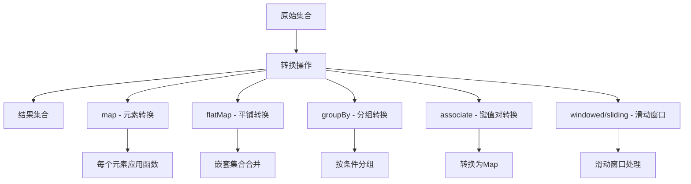
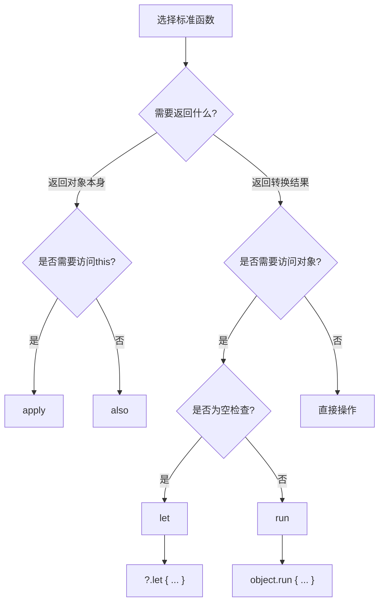

# 第3章：函数式编程与高阶函数

## 📖 章节概述

函数式编程是Kotlin的核心特性之一，也是相比Java最大的优势。本章将深入探讨Kotlin的函数式编程特性，包括Lambda表达式、高阶函数、内联函数、集合操作等。作为Java开发者，您将学习到如何编写更简洁、更表达性更强的函数式代码。

**学习时长**: 约4-5天
**核心目标**: 掌握Kotlin函数式编程精髓，能够熟练使用高阶函数和集合操作

---

## 3.1 函数类型与Lambda表达式

### 3.1.1 函数类型基础

在Kotlin中，函数是一等公民，可以像变量一样传递和使用：

```kotlin
// 函数类型定义语法：(参数列表) -> 返回类型
val sum: (Int, Int) -> Int = { a, b -> a + b }
val multiply: (Int, Int) -> Int = { a, b -> a * b }
val isEven: (Int) -> Boolean = { it % 2 == 0 }

// 使用函数类型
fun calculate(a: Int, b: Int, operation: (Int, Int) -> Int): Int {
    return operation(a, b)
}

// 调用示例
val result1 = calculate(5, 3, sum)        // 8
val result2 = calculate(5, 3, multiply)    // 15
val result3 = calculate(10, 4) { a, b -> a - b }  // 6

// Java对比 - 需要接口定义
interface Operation {
    int apply(int a, int b);
}

public static int calculate(int a, int b, Operation operation) {
    return operation.apply(a, b);
}

// 使用Lambda
calculate(5, 3, (a, b) -> a + b);
```

### 3.1.2 Lambda表达式详解

```kotlin
// Lambda表达式的完整语法
val fullLambda: (String, Int) -> String = { name: String, age: Int ->
    "姓名: $name, 年龄: $age"
}

// 类型推断简化
val simplifiedLambda = { name: String, age: Int ->
    "姓名: $name, 年龄: $age"
}

// 单参数Lambda使用it关键字
val singleParam: (String) -> String = { name ->
    "Hello, $name"
}

// 可以进一步简化为
val singleParamSimplified: (String) -> String = { "Hello, $it" }

// 无参数Lambda
val noParam: () -> String = {
    "无参数Lambda"
}

// Lambda的返回值（最后一个表达式的值）
val calculateGrade: (Int) -> String = { score ->
    when {
        score >= 90 -> "A"
        score >= 80 -> "B"
        score >= 70 -> "C"
        score >= 60 -> "D"
        else -> "F"
    }
}
```

### 3.1.3 函数引用和方法引用

```kotlin
// 定义普通函数
fun greet(name: String): String = "Hello, $name"
fun add(a: Int, b: Int): Int = a + b

// 函数引用
val greetRef: (String) -> String = ::greet
val addRef: (Int, Int) -> Int = ::add

// 使用函数引用
val message = greetRef("张三")  // "Hello, 张三"
val sum = addRef(3, 4)         // 7

// 成员函数引用
class Calculator {
    fun multiply(a: Int, b: Int): Int = a * b
    fun power(base: Int, exponent: Int): Double = base.toDouble().pow(exponent.toDouble())
}

val calc = Calculator()
val multiplyRef: (Int, Int) -> Int = calc::multiply
val powerRef: (Int, Int) -> Double = calc::power

// 扩展函数引用
fun String.reverse(): String = this.reversed()
val reverseRef: (String) -> String = String::reverse

// 构造函数引用
data class Person(val name: String, val age: Int)
val personConstructor: (String, Int) -> Person = ::Person
val person = personConstructor("李四", 25)
```

### 3.1.4 Lambda的参数捕获

```kotlin
// Lambda可以捕获外部变量
fun createCounter(): () -> Int {
    var count = 0
    return {
        count++
    }
}

val counter1 = createCounter()
println(counter1()) // 1
println(counter1()) // 2

val counter2 = createCounter()
println(counter2()) // 1 (独立的计数器)

// 修改捕获的变量
fun createMultiplier(factor: Int): (Int) -> Int {
    return { input ->
        input * factor
    }
}

val double = createMultiplier(2)
val triple = createMultiplier(3)

println(double(5)) // 10
println(triple(5)) // 15
```

---

## 3.2 高阶函数详解

### 3.2.1 常用高阶函数模式

```kotlin
// 重复执行函数
fun repeat(n: Int, action: (Int) -> Unit) {
    for (i in 0 until n) {
        action(i)
    }
}

// 使用示例
repeat(3) { index ->
    println("第${index + 1}次执行")
}

// 条件执行函数
fun <T> T.letIf(condition: (T) -> Boolean, transform: (T) -> T): T {
    return if (condition(this)) {
        transform(this)
    } else {
        this
    }
}

// 使用示例
val text = "Hello Kotlin"
val result = text.letIf({ it.length > 10 }) { "$text!" }
println(result) // "Hello Kotlin!"

// 安全操作函数
inline fun <T, R> T?.mapNotNull(transform: (T) -> R): R? {
    return this?.let(transform)
}

// 使用示例
val nullableValue: String? = "test"
val length = nullableValue.mapNotNull { it.length }
println(length) // 4
```

### 3.2.2 集合处理高阶函数

```kotlin
// map函数：转换集合中的每个元素
val numbers = listOf(1, 2, 3, 4, 5)
val squared = numbers.map { it * it } // [1, 4, 9, 16, 25]
val stringNumbers = numbers.map { "数字$it" } // ["数字1", "数字2", ...]

// flatMap函数：将嵌套集合平铺
val nestedLists = listOf(
    listOf(1, 2, 3),
    listOf(4, 5, 6),
    listOf(7, 8, 9)
)
val flattened = nestedLists.flatMap { it } // [1, 2, 3, 4, 5, 6, 7, 8, 9]

// filter函数：过滤元素
val evenNumbers = numbers.filter { it % 2 == 0 } // [2, 4]
val longStrings = listOf("a", "bb", "ccc", "dddd").filter { it.length >= 3 } // ["ccc", "dddd"]

// reduce函数：将集合元素聚合成一个值
val sum = numbers.reduce { acc, num -> acc + num } // 15
val product = numbers.reduce { acc, num -> acc * num } // 120
val maxNumber = numbers.reduce { acc, num -> if (num > acc) num else acc } // 5

// fold函数：带初始值的聚合
val sumWithInitial = numbers.fold(10) { acc, num -> acc + num } // 25 (10 + 15)
val productWithInitial = numbers.fold(2) { acc, num -> acc * num } // 240 (2 * 120)

// groupBy函数：按条件分组
data class Student(val name: String, val grade: Char)
val students = listOf(
    Student("张三", 'A'),
    Student("李四", 'B'),
    Student("王五", 'A'),
    Student("赵六", 'C')
)

val studentsByGrade = students.groupBy { it.grade }
// Map{
//   'A' -> [Student("张三", 'A'), Student("王五", 'A')],
//   'B' -> [Student("李四", 'B')],
//   'C' -> [Student("赵六", 'C')]
// }

// sortedBy和sortedWith函数
val sortedStudents = students.sortedBy { it.name } // 按姓名排序
val sortedByGrade = students.sortedWith(compareBy { it.grade }.thenBy { it.name })
```

### 3.2.3 自定义高阶函数

```kotlin
// 自定义过滤函数
inline fun <T> Collection<T>.myFilter(predicate: (T) -> Boolean): List<T> {
    val result = mutableListOf<T>()
    for (item in this) {
        if (predicate(item)) {
            result.add(item)
        }
    }
    return result
}

// 自定义map函数
inline fun <T, R> Collection<T>.myMap(transform: (T) -> R): List<R> {
    val result = mutableListOf<R>()
    for (item in this) {
        result.add(transform(item))
    }
    return result
}

// 组合函数
fun <A, B, C> compose(f: (B) -> C, g: (A) -> B): (A) -> C {
    return { a -> f(g(a)) }
}

// 使用示例
val toString: (Int) -> String = { it.toString() }
val toLength: (String) -> Int = { it.length }
val lengthOfNumber = compose(toLength, toString)
println(lengthOfNumber(12345)) // 5

// 柯里化函数
fun curryAddition(a: Int): (Int) -> Int {
    return { b -> a + b }
}

val add5 = curryAddition(5)
println(add5(3)) // 8
println(add5(10)) // 15

// 函数管道
infix fun <P1, P2, R> Function1<P1, P2>.then(next: (P2) -> R): (P1) -> R {
    return { p1 -> next(this(p1)) }
}

val pipeline = { x: Int -> x * 2 } then { it + 10 } then { it.toString() }
println(pipeline(5)) // "20"
```

---

## 3.3 内联函数优化

### 3.3.1 内联函数基础

内联函数可以消除Lambda的性能开销，将函数调用直接替换为函数体：

```kotlin
// 普通函数会创建额外的对象
fun normalOperation(numbers: List<Int>, operation: (Int) -> Int): List<Int> {
    return numbers.map(operation)
}

// 内联函数优化
inline fun inlineOperation(numbers: List<Int>, operation: (Int) -> Int): List<Int> {
    return numbers.map(operation)
}

// 性能对比测试
fun performanceTest() {
    val numbers = (1..1000000).toList()
    val operation = { it * 2 }

    // 普通函数调用会产生额外开销
    val startTime = System.currentTimeMillis()
    repeat(1000) {
        normalOperation(numbers, operation)
    }
    val normalTime = System.currentTimeMillis() - startTime

    // 内联函数调用几乎没有额外开销
    val inlineStartTime = System.currentTimeMillis()
    repeat(1000) {
        inlineOperation(numbers, operation)
    }
    val inlineTime = System.currentTimeMillis() - inlineStartTime

    println("普通函数耗时: ${normalTime}ms")
    println("内联函数耗时: ${inlineTime}ms")
}
```

### 3.3.2 noinline和crossinline

```kotlin
// noinline: 禁止内联特定参数
inline fun mixedInline(
    inlineable: (String) -> Unit,
    noinline nonInlineable: (String) -> Unit
) {
    inlineable("这个会被内联")
    nonInlineable("这个不会被内联")
}

// crossinline: 允许内联参数在非局部返回中使用
inline fun executeWithCrossinline(crossinline action: () -> Unit) {
    Thread {
        // crossinline允许在lambda中包含return
        action()
    }.start()
}

// 实际应用示例
inline fun <T> withLock(lock: Any, action: () -> T): T {
    lock.lock()
    try {
        return action()
    } finally {
        lock.unlock()
    }
}

// 使用示例
val mutex = Any()
val result = withLock(mutex) {
    // 临界区代码
    "受保护的代码执行结果"
}
```

### 3.3.3 实用的内联函数

```kotlin
// 安全执行函数
inline fun <T> safeExecute(
    defaultValue: T,
    action: () -> T
): T {
    return try {
        action()
    } catch (e: Exception) {
        e.printStackTrace()
        defaultValue
    }
}

// 使用示例
val result1 = safeExecute(0) {
    val numbers = listOf(1, 2, 3)
    numbers[10] // 会抛出异常
}
println(result1) // 0

val result2 = safeExecute(0) {
    val numbers = listOf(1, 2, 3)
    numbers.sum()
}
println(result2) // 6

// 计时函数
inline fun <T> measureTime(action: () -> T): Pair<T, Long> {
    val startTime = System.currentTimeMillis()
    val result = action()
    val elapsed = System.currentTimeMillis() - startTime
    return Pair(result, elapsed)
}

// 使用示例
val (sum, time) = measureTime {
    (1..1000000).sum()
}
println("计算结果: $sum, 耗时: ${time}ms")

// 条件执行函数
inline fun <T> T.letIf(predicate: (T) -> Boolean, block: (T) -> Unit): T {
    if (predicate(this)) {
        block(this)
    }
    return this
}

// 使用示例
val message = "Hello World"
message.letIf({ it.length > 5 }) {
    println("消息较长: $it")
}

// 记忆化函数（缓存结果）
fun <T, R> memoize(function: (T) -> R): (T) -> R {
    val cache = mutableMapOf<T, R>()
    return { input ->
        cache.getOrPut(input) { function(input) }
    }
}

// 使用示例
val fibonacci = memoize { n: Int ->
    if (n <= 1) n else fibonacci(n - 1) + fibonacci(n - 2)
}

println(fibonacci(35)) // 快速计算，因为有缓存
```

---

## 3.4 集合函数式API深度解析

### 3.4.1 转换操作符



```kotlin
// map系列操作符
data class Product(val name: String, val price: Double, val category: String)
val products = listOf(
    Product("iPhone", 799.0, "手机"),
    Product("MacBook", 1299.0, "电脑"),
    Product("iPad", 499.0, "平板"),
    Product("AirPods", 159.0, "耳机")
)

// 基本map转换
val productNames = products.map { it.name }
// ["iPhone", "MacBook", "iPad", "AirPods"]

val pricesWithTax = products.map { it.price * 1.1 }
// [878.9, 1428.9, 548.9, 174.9]

// mapIndexed - 带索引的转换
val indexedProducts = products.mapIndexed { index, product ->
    "${index + 1}. ${product.name}: $${product.price}"
}
// ["1. iPhone: $799.0", "2. MacBook: $1299.0", ...]

// mapNotNull - 过滤null值
val nullableList = listOf(1, null, 3, null, 5)
val nonNullSquared = nullableList.mapNotNull { it?.let { it * it } }
// [1, 9, 25]

// flatMap - 扁平化映射
val categoriesWithProducts = products.flatMap { product ->
    product.category.split(" ").map { category ->
        "$category: ${product.name}"
    }
}
// ["手机: iPhone", "电脑: MacBook", "平板: iPad", "耳机: AirPods"]

// groupBy - 分组操作
val productsByCategory = products.groupBy { it.category }
// Map{
//   "手机" -> [Product("iPhone", 799.0, "手机")],
//   "电脑" -> [Product("MacBook", 1299.0, "电脑")],
//   "平板" -> [Product("iPad", 499.0, "平板")],
//   "耳机" -> [Product("AirPods", 159.0, "耳机")]
// }

// groupingBy - 按条件分组并聚合
val categoryStats = products.groupingBy { it.category }
    .aggregate { _, accumulator: Double?, element, _ ->
        (accumulator ?: 0.0) + element.price
    }
// Map{"手机" -> 799.0, "电脑" -> 1299.0, "平板" -> 499.0, "耳机" -> 159.0}

// associate - 转换为Map
val productMap = products.associate { it.name to it.price }
// Map{"iPhone" -> 799.0, "MacBook" -> 1299.0, ...}

// associateWith - 键值对转换（值为计算结果）
val productLengths = products.map { it.name }.associateWith { it.length }
// Map{"iPhone" -> 6, "MacBook" -> 7, "iPad" -> 4, "AirPods" -> 7}
```

### 3.4.2 过滤操作符

```kotlin
// filter - 基本过滤
val expensiveProducts = products.filter { it.price > 500.0 }
// [Product("iPhone", 799.0, "手机"), Product("MacBook", 1299.0, "电脑")]

// filterNot - 反向过滤
val cheapProducts = products.filterNot { it.price > 500.0 }
// [Product("iPad", 499.0, "平板"), Product("AirPods", 159.0, "耳机")]

// filterIndexed - 带索引过滤
val firstTwoProducts = products.filterIndexed { index, _ -> index < 2 }
// [Product("iPhone", 799.0, "手机"), Product("MacBook", 1299.0, "电脑")]

// filterIsInstance - 类型过滤
val mixedList = listOf(1, "hello", 3.14, true, "world")
val stringsOnly = mixedList.filterIsInstance<String>()
// ["hello", "world"]

// takeWhile - 满足条件时取元素
val numbers = listOf(1, 2, 3, 1, 2, 3)
val takeWhileResult = numbers.takeWhile { it < 3 }
// [1, 2]

// dropWhile - 满足条件时丢弃元素
val dropWhileResult = numbers.dropWhile { it < 3 }
// [3, 1, 2, 3]

// slice - 范围过滤
val sliceResult = products.slice(1..3)
// [Product("MacBook", 1299.0, "电脑"), Product("iPad", 499.0, "平板"), Product("AirPods", 159.0, "耳机")]
```

### 3.4.3 排序操作符

```kotlin
// sortedBy - 单字段排序
val productsByName = products.sortedBy { it.name }
// [Product("AirPods", 159.0, "耳机"), Product("iPad", 499.0, "平板"), ...]

// sortedByDescending - 降序排序
val expensiveFirst = products.sortedByDescending { it.price }
// [Product("MacBook", 1299.0, "电脑"), Product("iPhone", 799.0, "手机"), ...]

// sortedWith - 多字段排序
val multiSort = products.sortedWith(
    compareBy<Product> { it.category }
        .thenBy { it.price }
        .thenBy { it.name }
)

// 自定义排序
val customSort = products.sortedWith { a, b ->
    when {
        a.category != b.category -> a.category.compareTo(b.category)
        a.price != b.price -> b.price.compareTo(a.price) // 价格降序
        else -> a.name.compareTo(b.name)
    }
}
```

### 3.4.4 聚合操作符

```kotlin
// fold/foldRight - 带初始值的聚合
val totalPrice = products.fold(0.0) { acc, product -> acc + product.price }
// 2756.0

// joinToString - 字符串连接
val productNames = products.joinToString(
    separator = ", ",
    prefix = "产品列表: ",
    postfix = ".",
    limit = 3,
    truncated = "..."
) { it.name }
// "产品列表: iPhone, MacBook, iPad, ..."

// reduce/reduceRight - 简单聚合
val mostExpensive = products.reduce { acc, product ->
    if (product.price > acc.price) product else acc
}
// Product("MacBook", 1299.0, "电脑")

// runningReduce - 累积聚合
val runningSums = listOf(1, 2, 3, 4).runningReduce { acc, num -> acc + num }
// [1, 3, 6, 10]

// partition - 分割集合
val (expensive, cheap) = products.partition { it.price > 500.0 }
// expensive: [iPhone, MacBook]
// cheap: [iPad, AirPods]

// zip - 合并集合
val numbers = listOf(1, 2, 3)
val letters = listOf("A", "B", "C")
val zipped = numbers.zip(letters) { num, letter -> "$num$letter" }
// ["1A", "2B", "3C"]

// unzip - 解压集合
val pairs = listOf(1 to "A", 2 to "B", 3 to "C")
val (numbersUnzipped, lettersUnzipped) = pairs.unzip()
// numbersUnzipped: [1, 2, 3]
// lettersUnzipped: ["A", "B", "C"]
```

### 3.4.5 序列（Sequence）操作

```kotlin
// 序列的优点：惰性计算，避免中间集合创建
val largeList = (1..1000000).toList()

// 非序列操作：创建多个中间集合
val nonSequenceResult = largeList
    .filter { it % 2 == 0 }           // 创建新集合
    .map { it * it }                  // 创建新集合
    .take(100)                        // 创建新集合
    .sum()

// 序列操作：惰性计算，无中间集合
val sequenceResult = largeList
    .asSequence()
    .filter { it % 2 == 0 }           // 不创建中间集合
    .map { it * it }                  // 不创建中间集合
    .take(100)                        // 不创建中间集合
    .sum()                            // 最终计算

// 自定义序列
val fibonacciSequence = sequence {
    var a = 0
    var b = 1
    while (true) {
        yield(a)
        val temp = a + b
        a = b
        b = temp
    }
}

val fibonacciNumbers = fibonacciSequence.take(10).toList()
// [0, 1, 1, 2, 3, 5, 8, 13, 21, 34]

// 序列的generate函数
val randomNumbers = generateSequence {
    (Math.random() * 100).toInt()
}.take(5).toList()
// [23, 67, 12, 89, 45]
```

---

## 3.5 扩展函数与标准函数

### 3.5.1 扩展函数

```kotlin
// 为String添加扩展函数
fun String.isEmail(): Boolean {
    return this.matches(Regex("[a-zA-Z0-9._%+-]+@[a-zA-Z0-9.-]+\\.[a-zA-Z]{2,}"))
}

fun String.capitalizeWords(): String {
    return this.split(" ").joinToString(" ") {
        it.replaceFirstChar { char -> char.uppercase() }
    }
}

// 为Int添加扩展函数
fun Int.isPrime(): Boolean {
    if (this <= 1) return false
    if (this <= 3) return true
    if (this % 2 == 0 || this % 3 == 0) return false

    var i = 5
    while (i * i <= this) {
        if (this % i == 0 || this % (i + 2) == 0) return false
        i += 6
    }
    return true
}

fun Int.formatAsCurrency(): String {
    return "¥${String.format("%,.2f", this.toDouble())}"
}

// 为集合添加扩展函数
fun <T> List<T>.findDuplicate(): T? {
    return this.groupBy { it }.entries.find { it.value.size > 1 }?.key
}

fun <T> List<T>.takeRandom(n: Int): List<T> {
    return this.shuffled().take(n)
}

// 使用示例
val email = "user@example.com"
println(email.isEmail()) // true

val text = "hello world kotlin"
println(text.capitalizeWords()) // "Hello World Kotlin"

val number = 17
println("$number 是质数: ${number.isPrime()}") // "17 是质数: true"
println(12345.formatAsCurrency()) // "¥12,345.00"

val numbers = listOf(1, 2, 3, 2, 4, 5, 3)
println("重复元素: ${numbers.findDuplicate()}") // "重复元素: 2"

val randomSample = numbers.takeRandom(3)
println("随机抽样: $randomSample") // 随机3个元素
```

### 3.5.2 标准函数详解

```kotlin
data class User(var name: String, var age: Int, var email: String?)

// let函数 - 对象转换和空安全处理
val user = User("张三", 25, "zhangsan@example.com")

// let用于链式调用
val userEmail = user.email?.let { email ->
    if (email.isEmail()) {
        email.uppercase()
    } else {
        "无效邮箱"
    }
}

// also函数 - 配置对象
val newUser = User("李四", 30, null).also {
    it.name = "李四修改"
    it.age = 31
    it.email = "lisi@example.com"
}

// apply函数 - 对象配置并返回对象本身
val configuredUser = User("王五", 28, null).apply {
    name = "王五配置"
    age = 29
    email = "wangwu@example.com"
}

// run函数 - 对象配置和计算结果
val userInfo = user.run {
    "$name ($age岁) - ${email ?: "无邮箱"}"
}

// with函数 - 对多个操作进行分组
val userReport = with(user) {
    val basicInfo = "姓名: $name, 年龄: $age"
    val contactInfo = "邮箱: ${email ?: "未设置"}"
    "$basicInfo\n$contactInfo"
}

// 使用场景对比
class StringBuilder {
    private val parts = mutableListOf<String>()

    fun addPart(part: String): StringBuilder {
        parts.add(part)
        return this
    }

    fun build(): String = parts.joinToString(" ")
}

// 使用let进行链式转换
val result = StringBuilder()
    .addPart("Hello")
    .addPart("World")
    .let { builder ->
        builder.addPart("Kotlin")
        builder.build()
    }

// 使用also进行副作用操作
val builder = StringBuilder().also {
    println("创建StringBuilder: $it")
    it.addPart("Part1")
    it.addPart("Part2")
}

// 使用apply配置对象
val finalBuilder = builder.apply {
    addPart("Part3")
    addPart("Part4")
}

val finalResult = finalBuilder.build()
println("最终结果: $finalResult")
```

### 3.5.3 标准函数选择指南



```kotlin
// 实际应用示例
fun processUser(user: User?) {
    // 1. 空安全处理 - 使用let
    user?.let {
        println("处理用户: ${it.name}")
        // 安全操作用户对象
    } ?: run {
        println("用户为空，创建默认用户")
        val defaultUser = User("默认用户", 0, null)
        processUser(defaultUser)
        return
    }

    // 2. 对象配置 - 使用apply
    val configuredUser = user.apply {
        name = name.trim()
        if (email?.isEmail() == false) {
            email = null
        }
    }

    // 3. 副作用操作 - 使用also
    configuredUser.also {
        println("用户配置完成: ${it.name}")
        logUserChange(it)
    }

    // 4. 计算结果 - 使用run
    val userStatus = configuredUser.run {
        when {
            age < 18 -> "未成年"
            age < 65 -> "成年"
            else -> "老年"
        }
    }

    // 5. 批量操作 - 使用with
    val userReport = with(configuredUser) {
        val header = "=== 用户报告 ==="
        val basic = "姓名: $name, 年龄: $age"
        val contact = "邮箱: ${email ?: "未设置"}"
        val status = "状态: $userStatus"

        "$header\n$basic\n$contact\n$status"
    }

    println(userReport)
}

private fun logUserChange(user: User) {
    // 记录用户变化的日志
    println("日志: 用户信息已更新")
}
```

---

## 3.6 尾递归优化

### 3.6.1 递归vs尾递归

```kotlin
// 普通递归 - 容易栈溢出
fun factorialRecursive(n: Int): Long {
    return if (n <= 1) 1L else n * factorialRecursive(n - 1)
}

// 尾递归 - 编译器优化为循环
tailrec fun factorialTailRecursive(n: Int, accumulator: Long = 1L): Long {
    return if (n <= 1) accumulator else factorialTailRecursive(n - 1, n * accumulator)
}

// 斐波那契数列递归实现
fun fibonacciRecursive(n: Int): Int {
    return if (n <= 1) n else fibonacciRecursive(n - 1) + fibonacciRecursive(n - 2)
}

// 斐波那契数列尾递归实现
tailrec fun fibonacciTailRecursive(n: Int, a: Int = 0, b: Int = 1): Int {
    return if (n == 0) a else fibonacciTailRecursive(n - 1, b, a + b)
}

// 使用示例和性能对比
fun recursionPerformanceTest() {
    val n = 30

    // 普通递归
    val startTime1 = System.currentTimeMillis()
    val result1 = factorialRecursive(n)
    val time1 = System.currentTimeMillis() - startTime1

    // 尾递归
    val startTime2 = System.currentTimeMillis()
    val result2 = factorialTailRecursive(n)
    val time2 = System.currentTimeMillis() - startTime2

    println("普通递归结果: $result1, 耗时: ${time1}ms")
    println("尾递归结果: $result2, 耗时: ${time2}ms")

    // 斐波那契测试
    val fibStartTime1 = System.currentTimeMillis()
    val fibResult1 = fibonacciRecursive(40)
    val fibTime1 = System.currentTimeMillis() - fibStartTime1

    val fibStartTime2 = System.currentTimeMillis()
    val fibResult2 = fibonacciTailRecursive(40)
    val fibTime2 = System.currentTimeMillis() - fibStartTime2

    println("斐波那契普通递归结果: $fibResult1, 耗时: ${fibTime1}ms")
    println("斐波那契尾递归结果: $fibResult2, 耗时: ${fibTime2}ms")
}
```

### 3.6.2 尾递归的实际应用

```kotlin
// 树遍历的尾递归实现
data class TreeNode<T>(
    val value: T,
    val left: TreeNode<T>?,
    val right: TreeNode<T>?
)

// 深度优先搜索 - 尾递归版本
tailrec fun <T> dfsTailRecursive(
    nodes: List<TreeNode<T>>,
    predicate: (T) -> Boolean,
    accumulator: List<T> = emptyList()
): List<T> {
    if (nodes.isEmpty()) return accumulator.reversed()

    val current = nodes.first()
    val remaining = nodes.drop(1)
    val newAccumulator = if (predicate(current.value)) {
        listOf(current.value) + accumulator
    } else {
        accumulator
    }

    val nextNodes = listOfNotNull(current.left, current.right) + remaining
    return dfsTailRecursive(nextNodes, predicate, newAccumulator)
}

// 列表处理的尾递归
tailrec fun <T, R> mapTailRecursive(
    list: List<T>,
    transform: (T) -> R,
    accumulator: List<R> = emptyList()
): List<R> {
    return if (list.isEmpty()) {
        accumulator.reversed()
    } else {
        val head = list.first()
        val tail = list.drop(1)
        mapTailRecursive(tail, transform, listOf(transform(head)) + accumulator)
    }
}

// 集合过滤的尾递归
tailrec fun <T> filterTailRecursive(
    list: List<T>,
    predicate: (T) -> Boolean,
    accumulator: List<T> = emptyList()
): List<T> {
    return if (list.isEmpty()) {
        accumulator.reversed()
    } else {
        val head = list.first()
        val tail = list.drop(1)
        val newAccumulator = if (predicate(head)) {
            listOf(head) + accumulator
        } else {
            accumulator
        }
        filterTailRecursive(tail, predicate, newAccumulator)
    }
}

// 使用示例
fun tailRecursionDemo() {
    // 创建树结构
    val tree = TreeNode(
        value = 10,
        left = TreeNode(
            value = 5,
            left = TreeNode(2, null, null),
            right = TreeNode(7, null, null)
        ),
        right = TreeNode(
            value = 15,
            left = TreeNode(12, null, null),
            right = TreeNode(20, null, null)
        )
    )

    // 查找偶数节点
    val evenNumbers = dfsTailRecursive(listOf(tree)) { it.value % 2 == 0 }
        .map { it.value }
    println("偶数节点: $evenNumbers") // [2, 10, 20]

    // 列表映射
    val numbers = (1..10).toList()
    val squared = mapTailRecursive(numbers) { it * it }
    println("平方数: $squared") // [1, 4, 9, 16, 25, 36, 49, 64, 81, 100]

    // 列表过滤
    val evenNumbersList = filterTailRecursive(numbers) { it % 2 == 0 }
    println("偶数列表: $evenNumbersList") // [2, 4, 6, 8, 10]
}
```

---

## 3.7 函数式编程实战模式

### 3.7.1 函数式数据管道

```kotlin
// 数据处理管道构建器
class DataPipeline<T> {
    private val operations = mutableListOf<(List<T>) -> List<T>>()

    fun filter(predicate: (T) -> Boolean): DataPipeline<T> {
        operations.add { list -> list.filter(predicate) }
        return this
    }

    fun <R> map(transform: (T) -> R): DataPipeline<R> {
        @Suppress("UNCHECKED_CAST")
        operations.add { list -> (list as List<T>).map(transform) } as (List<R>) -> List<R>
        return DataPipeline<R>().also { newPipeline ->
            newPipeline.operations.addAll(this.operations as List<(List<R>) -> List<R>>)
            newPipeline.operations.add { list -> (list as List<T>).map(transform) } as (List<R>) -> List<R>
        }
    }

    fun take(n: Int): DataPipeline<T> {
        operations.add { list -> list.take(n) }
        return this
    }

    fun sortedBy(selector: (T) -> Comparable<*>): DataPipeline<T> {
        operations.add { list -> list.sortedBy(selector) }
        return this
    }

    fun execute(input: List<T>): List<T> {
        return operations.fold(input) { data, operation -> operation(data) }
    }
}

// 使用管道
data class Transaction(val id: String, val amount: Double, val category: String, val date: String)

fun transactionPipelineDemo() {
    val transactions = listOf(
        Transaction("1", 100.0, "餐饮", "2024-01-01"),
        Transaction("2", 50.0, "交通", "2024-01-01"),
        Transaction("3", 200.0, "购物", "2024-01-02"),
        Transaction("4", 75.0, "餐饮", "2024-01-02"),
        Transaction("5", 150.0, "娱乐", "2024-01-03"),
        Transaction("6", 80.0, "交通", "2024-01-03")
    )

    val result = DataPipeline<Transaction>()
        .filter { it.amount > 60.0 }
        .sortedByDescending { it.amount }
        .take(3)
        .execute(transactions)

    println("大额交易:")
    result.forEach { println("${it.category}: ¥${it.amount}") }
}
```

### 3.7.2 函数式错误处理

```kotlin
// 函数式结果类型
sealed class Result<out T> {
    data class Success<T>(val value: T) : Result<T>()
    data class Error(val exception: Throwable, val message: String = exception.message ?: "未知错误") : Result<Nothing>()

    val isSuccess: Boolean get() = this is Success
    val isError: Boolean get() = this is Error

    fun getOrNull(): T? = if (this is Success) value else null
    fun getOrThrow(): T = when (this) {
        is Success -> value
        is Error -> throw exception
    }

    inline fun <R> map(transform: (T) -> R): Result<R> = when (this) {
        is Success -> Success(transform(value))
        is Error -> this
    }

    inline fun <R> flatMap(transform: (T) -> Result<R>): Result<R> = when (this) {
        is Success -> transform(value)
        is Error -> this
    }

    inline fun onFailure(action: (Error) -> Unit): Result<T> {
        if (this is Error) action(this)
        return this
    }

    inline fun onSuccess(action: (Success<T>) -> Unit): Result<T> {
        if (this is Success) action(this)
        return this
    }
}

// 函数式try-catch
inline fun <T> safeCall(action: () -> T): Result<T> {
    return try {
        Result.Success(action())
    } catch (e: Exception) {
        Result.Error(e)
    }
}

// 链式验证
data class UserInput(
    val name: String?,
    val email: String?,
    val age: String?
)

fun validateName(name: String?): Result<String> {
    return if (name.isNullOrBlank()) {
        Result.Error(IllegalArgumentException("姓名不能为空"), "姓名不能为空")
    } else if (name.length < 2) {
        Result.Error(IllegalArgumentException("姓名至少2个字符"), "姓名至少2个字符")
    } else {
        Result.Success(name.trim())
    }
}

fun validateEmail(email: String?): Result<String> {
    return if (email.isNullOrBlank()) {
        Result.Error(IllegalArgumentException("邮箱不能为空"), "邮箱不能为空")
    } else if (!email.matches(Regex("[a-zA-Z0-9._%+-]+@[a-zA-Z0-9.-]+\\.[a-zA-Z]{2,}"))) {
        Result.Error(IllegalArgumentException("邮箱格式错误"), "邮箱格式错误")
    } else {
        Result.Success(email.trim().lowercase())
    }
}

fun validateAge(age: String?): Result<Int> {
    return if (age.isNullOrBlank()) {
        Result.Error(IllegalArgumentException("年龄不能为空"), "年龄不能为空")
    } else {
        val ageInt = age.toIntOrNull()
        if (ageInt == null) {
            Result.Error(IllegalArgumentException("年龄必须是数字"), "年龄必须是数字")
        } else if (ageInt < 0 || ageInt > 150) {
            Result.Error(IllegalArgumentException("年龄必须在0-150之间"), "年龄必须在0-150之间")
        } else {
            Result.Success(ageInt)
        }
    }
}

// 组合验证函数
fun validateUserInput(input: UserInput): Result<Triple<String, String, Int>> {
    return validateName(input.name)
        .flatMap { name ->
            validateEmail(input.email).flatMap { email ->
                validateAge(input.age).map { age ->
                    Triple(name, email, age)
                }
            }
        }
}

// 使用示例
fun functionalValidationDemo() {
    val testInputs = listOf(
        UserInput("张三", "zhangsan@example.com", "25"),
        UserInput("", "invalid-email", "abc"),
        UserInput("李", "lisi@example.com", "30"),
        UserInput("王五", "wangwu@example.com", "200")
    )

    testInputs.forEach { input ->
        println("\n验证输入: $input")

        validateUserInput(input)
            .onSuccess { (name, email, age) ->
                println("✅ 验证成功: $name, $email, $age岁")
            }
            .onFailure { error ->
                println("❌ 验证失败: ${error.message}")
            }
    }
}
```

### 3.7.3 函数式状态管理

```kotlin
// 状态管理的函数式方法
data class State<T>(val value: T, val history: List<T> = emptyList()) {
    fun update(newValue: T): State<T> = State(newValue, history + value)
    fun undo(): State<T>? = if (history.isNotEmpty()) {
        State(history.last(), history.dropLast(1))
    } else null

    fun canUndo(): Boolean = history.isNotEmpty()
}

// 状态机
sealed class AppState {
    object Loading : AppState()
    data class Success<T>(val data: T) : AppState()
    data class Error(val message: String) : AppState()
}

// 状态转换器
class StateReducer<T> {
    private var currentState: State<T>

    constructor(initialState: T) {
        this.currentState = State(initialState)
    }

    fun transition(transform: (T) -> T): State<T> {
        currentState = currentState.update(transform(currentState.value))
        return currentState
    }

    fun undo(): State<T>? {
        currentState = currentState.undo() ?: currentState
        return currentState
    }

    fun getCurrentState(): T = currentState.value
    fun canUndo(): Boolean = currentState.canUndo()
}

// 计数器状态管理示例
class CounterState {
    private val stateReducer = StateReducer(0)

    fun increment(): Int = stateReducer.transition { it + 1 }.value
    fun decrement(): Int = stateReducer.transition { it - 1 }.value
    fun reset(): Int = stateReducer.transition { 0 }.value
    fun undo(): Int? = stateReducer.undo()?.value
    fun getCount(): Int = stateReducer.getCurrentState()
    fun canUndo(): Boolean = stateReducer.canUndo()
}

// 使用示例
fun functionalStateDemo() {
    val counter = CounterState()

    println("初始值: ${counter.getCount()}") // 0

    counter.increment()
    counter.increment()
    counter.increment()
    println("三次递增后: ${counter.getCount()}") // 3

    counter.decrement()
    println("一次递减后: ${counter.getCount()}") // 2

    counter.undo()?.let { println("撤销后: $it") } // 3

    if (counter.canUndo()) {
        counter.undo()?.let { println("再次撤销后: $it") } // 2
    }
}
```

---

## 3.8 函数式编程与Java Stream API对比

### 3.8.1 语法简洁性对比

```kotlin
// Kotlin函数式操作
val numbers = listOf(1, 2, 3, 4, 5, 6, 7, 8, 9, 10)

val kotlinResult = numbers
    .filter { it % 2 == 0 }           // 过滤偶数
    .map { it * it }                  // 平方
    .sorted()                         // 排序
    .take(3)                          // 取前3个
    .sum()                            // 求和

// Java Stream API
import java.util.stream.Collectors

val javaList = numbers
val javaResult = javaList.stream()
    .filter { it % 2 == 0 }           // Predicate
    .map { it * it }                  // Function
    .sorted()                         // Comparator
    .limit(3)                         // LongSupplier
    .mapToInt { it }                  // ToIntFunction
    .sum()                            // 终止操作

// 复杂数据处理对比
data class Order(val id: Int, val amount: Double, val category: String)
val orders = listOf(
    Order(1, 100.0, "A"),
    Order(2, 200.0, "B"),
    Order(3, 150.0, "A"),
    Order(4, 300.0, "C"),
    Order(5, 250.0, "B")
)

// Kotlin版本
val kotlinOrders = orders
    .groupBy { it.category }                        // 按分类分组
    .mapValues { (_, orders) ->                     // 计算每组的统计信息
        Triple(
            orders.size,                            // 订单数量
            orders.sumOf { it.amount },              // 总金额
            orders.averageOf { it.amount }           // 平均金额
        )
    }
    .toSortedMap()                                   // 按键排序

// Java版本
val javaOrders = javaList.stream()
    .collect(Collectors.groupingBy(
        { it.category },
        Collectors.collectingAndThen(
            Collectors.toList(),
            { orders ->
                Triple(
                    orders.size,
                    orders.stream().mapToDouble { it.amount }.sum(),
                    orders.stream().mapToDouble { it.amount }.average().orElse(0.0)
                )
            }
        )
    ))
    .toSortedMap()
```

### 3.8.2 性能对比

```kotlin
// 性能测试函数
fun performanceComparison() {
    val largeList = (1..1_000_000).toList()
    val iterations = 100

    // Kotlin序列操作
    val kotlinStartTime = System.currentTimeMillis()
    repeat(iterations) {
        largeList.asSequence()
            .filter { it % 2 == 0 }
            .map { it * it }
            .take(100)
            .sum()
    }
    val kotlinTime = System.currentTimeMillis() - kotlinStartTime

    // 模拟Java Stream操作（在Kotlin中）
    val javaStartTime = System.currentTimeMillis()
    repeat(iterations) {
        largeList
            .filter { it % 2 == 0 }
            .map { it * it }
            .take(100)
            .sum()
    }
    val javaTime = System.currentTimeMillis() - javaStartTime

    println("Kotlin序列操作耗时: ${kotlinTime}ms")
    println("Kotlin集合操作耗时: ${javaTime}ms")
    println("序列操作效率提升: ${((javaTime - kotlinTime).toDouble() / javaTime * 100).toInt()}%")
}
```

### 3.8.3 功能对比表

| 功能特性 | Kotlin | Java Stream API | 优势对比 |
|---------|--------|-----------------|----------|
| 空安全处理 | `?.let`, `?:` | 需要`Optional`包装 | Kotlin更自然 |
| 函数类型 | `(A) -> B` | `Function<A,B>` | Kotlin语法更简洁 |
| 扩展函数 | 原生支持 | 需要静态工具类 | Kotlin更灵活 |
| 序列操作 | `asSequence()` | `stream()` | 两者相当 |
| 自定义操作符 | 易于实现 | 需要复杂的Collector | Kotlin更简单 |
| 类型推断 | 强大的类型推断 | 类型推断有限 | Kotlin更智能 |
| 集合创建 | `listOf()`, `mapOf()` | `Arrays.asList()` | Kotlin更一致 |
| 空集合处理 | `emptyList()` | `Collections.emptyList()` | Kotlin更简洁 |

---

## 3.9 实战项目：函数式数据处理系统

### 3.9.1 项目需求

构建一个数据分析系统，能够：
- 处理大型数据集
- 支持多种数据转换和分析
- 提供函数式的错误处理
- 实现可重用的数据处理管道

### 3.9.2 数据模型定义

```kotlin
// 基础数据模型
data class SalesRecord(
    val id: String,
    val productId: String,
    val productName: String,
    val category: String,
    val price: Double,
    val quantity: Int,
    val date: String, // YYYY-MM-DD格式
    val region: String,
    val salesperson: String
) {
    val totalAmount: Double get() = price * quantity
    val year: Int get() = date.substring(0, 4).toInt()
    val month: Int get() = date.substring(5, 7).toInt()
}

// 分析结果模型
sealed class AnalysisResult<T> {
    data class Success<T>(val data: T, val processingTime: Long) : AnalysisResult<T>()
    data class Error(val exception: Throwable, val message: String) : AnalysisResult<Nothing>()
}

// 统计摘要
data class StatisticsSummary(
    val totalRecords: Int,
    val totalAmount: Double,
    val averageOrderValue: Double,
    val topCategories: List<CategoryStats>,
    val topProducts: List<ProductStats>,
    val regionalStats: List<RegionStats>
)

data class CategoryStats(
    val category: String,
    val totalAmount: Double,
    val recordCount: Int,
    val averagePrice: Double
)

data class ProductStats(
    val productName: String,
    val totalAmount: Double,
    val quantity: Int,
    val recordCount: Int
)

data class RegionStats(
    val region: String,
    val totalAmount: Double,
    val recordCount: Int,
    val averageOrderValue: Double
)
```

### 3.9.3 数据处理管道

```kotlin
// 函数式数据处理管道
class DataProcessor<T> {
    private val processingSteps = mutableListOf<(List<T>) -> Result<List<T>>>()

    fun filter(predicate: (T) -> Boolean, stepName: String = "Filter"): DataProcessor<T> {
        processingSteps.add { data ->
            safeCall {
                data.filter(predicate)
            }.mapError { exception ->
                IllegalStateException("$stepName failed: ${exception.message}", exception)
            }
        }
        return this
    }

    fun <R> map(transform: (T) -> R, stepName: String = "Map"): DataProcessor<R> {
        @Suppress("UNCHECKED_CAST")
        return DataProcessor<R>().also { newProcessor ->
            // 复制当前步骤并转换类型
            newProcessor.processingSteps.addAll(this.processingSteps as List<(List<R>) -> Result<List<R>>>)

            // 添加新的映射步骤
            newProcessor.processingSteps.add { data ->
                safeCall {
                    @Suppress("UNCHECKED_CAST")
                    (data as List<T>).map(transform)
                }.mapError { exception ->
                    IllegalStateException("$stepName failed: ${exception.message}", exception)
                }
            }
        }
    }

    fun sortBy(comparator: Comparator<T>, stepName: String = "Sort"): DataProcessor<T> {
        processingSteps.add { data ->
            safeCall {
                data.sortedWith(comparator)
            }.mapError { exception ->
                IllegalStateException("$stepName failed: ${exception.message}", exception)
            }
        }
        return this
    }

    fun take(n: Int, stepName: String = "Take"): DataProcessor<T> {
        processingSteps.add { data ->
            safeCall {
                data.take(n)
            }.mapError { exception ->
                IllegalStateException("$stepName failed: ${exception.message}", exception)
            }
        }
        return this
    }

    fun execute(input: List<T>): Result<List<T>> {
        return processingSteps.fold(Result.Success(input)) { currentResult, step ->
            currentResult.flatMap { data ->
                step(data)
            }
        }
    }
}

// 扩展Result以支持错误映射
inline fun <T, R> Result<T>.mapError(transform: (Throwable) -> Throwable): Result<R> {
    return when (this) {
        is Result.Success -> @Suppress("UNCHECKED_CAST") Result.Success<R>(this.value as R)
        is Result.Error -> Result.Error(transform(this.exception), this.message)
    }
}

// 安全调用包装器
inline fun <T> safeCall(action: () -> T): Result<T> {
    return try {
        Result.Success(action())
    } catch (e: Exception) {
        Result.Error(e)
    }
}
```

### 3.9.4 数据分析功能

```kotlin
// 数据分析器
class SalesAnalyzer {
    private val dataProcessor = DataProcessor<SalesRecord>()

    // 基础数据清理和过滤
    private fun cleanData(records: List<SalesRecord>): Result<List<SalesRecord>> {
        return DataProcessor<SalesRecord>()
            .filter { it.productId.isNotBlank() }
            .filter { it.price > 0 && it.quantity > 0 }
            .filter { try { it.year in 2020..2024 } catch (e: Exception) { false } }
            .execute(records)
    }

    // 生成统计摘要
    fun generateStatistics(records: List<SalesRecord>): Result<StatisticsSummary> {
        val startTime = System.currentTimeMillis()

        return cleanData(records)
            .flatMap { cleanRecords ->
                safeCall {
                    val totalRecords = cleanRecords.size
                    val totalAmount = cleanRecords.sumOf { it.totalAmount }
                    val averageOrderValue = if (totalRecords > 0) totalAmount / totalRecords else 0.0

                    // 按分类统计
                    val topCategories = cleanRecords
                        .groupBy { it.category }
                        .map { (category, categoryRecords) ->
                            CategoryStats(
                                category = category,
                                totalAmount = categoryRecords.sumOf { it.totalAmount },
                                recordCount = categoryRecords.size,
                                averagePrice = categoryRecords.averageOf { it.price }
                            )
                        }
                        .sortedByDescending { it.totalAmount }
                        .take(5)

                    // 按产品统计
                    val topProducts = cleanRecords
                        .groupBy { it.productId }
                        .map { (productId, productRecords) ->
                            val firstRecord = productRecords.first()
                            ProductStats(
                                productName = firstRecord.productName,
                                totalAmount = productRecords.sumOf { it.totalAmount },
                                quantity = productRecords.sumOf { it.quantity },
                                recordCount = productRecords.size
                            )
                        }
                        .sortedByDescending { it.totalAmount }
                        .take(10)

                    // 按区域统计
                    val regionalStats = cleanRecords
                        .groupBy { it.region }
                        .map { (region, regionRecords) ->
                            RegionStats(
                                region = region,
                                totalAmount = regionRecords.sumOf { it.totalAmount },
                                recordCount = regionRecords.size,
                                averageOrderValue = if (regionRecords.isNotEmpty()) {
                                    regionRecords.sumOf { it.totalAmount } / regionRecords.size
                                } else 0.0
                            )
                        }
                        .sortedByDescending { it.totalAmount }

                    StatisticsSummary(
                        totalRecords = totalRecords,
                        totalAmount = totalAmount,
                        averageOrderValue = averageOrderValue,
                        topCategories = topCategories,
                        topProducts = topProducts,
                        regionalStats = regionalStats
                    )
                }
            }
            .map { summary ->
                val processingTime = System.currentTimeMillis() - startTime
                AnalysisResult.Success(summary, processingTime)
            }
            .mapError { exception ->
                AnalysisResult.Error(exception, "统计分析失败")
            }

    // 时间序列分析
    fun analyzeTimeSeries(records: List<SalesRecord>, period: String = "monthly"): Result<Map<String, Double>> {
        return cleanData(records).flatMap { cleanRecords ->
            safeCall {
                when (period.lowercase()) {
                    "daily" -> cleanRecords.groupBy { it.date }
                    "weekly" -> cleanRecords.groupBy { record ->
                        val date = LocalDate.parse(record.date)
                        val weekStart = date.minusDays(date.dayOfWeek.value - 1L)
                        weekStart.toString()
                    }
                    "monthly" -> cleanRecords.groupBy { "${it.year}-${it.month.toString().padStart(2, '0')}" }
                    "quarterly" -> cleanRecords.groupBy {
                        val quarter = (it.month - 1) / 3 + 1
                        "${it.year}-Q$quarter"
                    }
                    "yearly" -> cleanRecords.groupBy { it.year.toString() }
                    else -> throw IllegalArgumentException("不支持的周期: $period")
                }.mapValues { (_, records) ->
                    records.sumOf { it.totalAmount }
                }.toSortedMap()
            }
        }
    }

    // 销售人员绩效分析
    fun analyzeSalespersonPerformance(records: List<SalesRecord>): Result<Map<String, SalespersonStats>> {
        return cleanData(records).flatMap { cleanRecords ->
            safeCall {
                cleanRecords.groupBy { it.salesperson }.mapValues { (_, salespersonRecords) ->
                    val totalAmount = salespersonRecords.sumOf { it.totalAmount }
                    val recordCount = salespersonRecords.size
                    val averageOrderValue = if (recordCount > 0) totalAmount / recordCount else 0.0
                    val categoriesSold = salespersonRecords.map { it.category }.distinct().size
                    val regionsServed = salespersonRecords.map { it.region }.distinct().size

                    SalespersonStats(
                        totalAmount = totalAmount,
                        recordCount = recordCount,
                        averageOrderValue = averageOrderValue,
                        categoriesSold = categoriesSold,
                        regionsServed = regionsServed,
                        performanceScore = calculatePerformanceScore(
                            totalAmount, recordCount, categoriesSold, regionsServed
                        )
                    )
                }
            }
        }
    }

    private fun calculatePerformanceScore(
        totalAmount: Double,
        recordCount: Int,
        categoriesSold: Int,
        regionsServed: Int
    ): Double {
        val amountScore = (totalAmount / 10000.0).coerceAtMost(10.0)
        val volumeScore = (recordCount / 10.0).coerceAtMost(5.0)
        val diversityScore = ((categoriesSold + regionsServed) / 2.0).coerceAtMost(5.0)
        return (amountScore + volumeScore + diversityScore) * 10
    }
}

data class SalespersonStats(
    val totalAmount: Double,
    val recordCount: Int,
    val averageOrderValue: Double,
    val categoriesSold: Int,
    val regionsServed: Int,
    val performanceScore: Double
)
```

### 3.9.5 使用示例

```kotlin
// 示例数据生成
fun generateSampleData(): List<SalesRecord> {
    val products = listOf(
        ProductData("P001", "iPhone 15", "手机"),
        ProductData("P002", "MacBook Pro", "电脑"),
        ProductData("P003", "iPad Air", "平板"),
        ProductData("P004", "AirPods Pro", "耳机"),
        ProductData("P005", "Apple Watch", "手表")
    )

    val regions = listOf("北京", "上海", "广州", "深圳", "杭州")
    val salespeople = listOf("张三", "李四", "王五", "赵六", "钱七")

    return (1..1000).map { id ->
        val product = products.random()
        val region = regions.random()
        val salesperson = salespeople.random()
        val price = (100..2000).random().toDouble()
        val quantity = (1..10).random()
        val year = 2022 + (0..2).random()
        val month = (1..12).random().toString().padStart(2, '0')
        val day = (1..28).random().toString().padStart(2, '0')

        SalesRecord(
            id = "R$id",
            productId = product.id,
            productName = product.name,
            category = product.category,
            price = price,
            quantity = quantity,
            date = "$year-$month-$day",
            region = region,
            salesperson = salesperson
        )
    }
}

data class ProductData(val id: String, val name: String, val category: String)

// 主函数演示
fun functionalDataAnalysisDemo() {
    val analyzer = SalesAnalyzer()
    val sampleData = generateSampleData()

    println("=== 销售数据分析系统 ===")
    println("数据记录数: ${sampleData.size}")

    // 生成统计摘要
    analyzer.generateStatistics(sampleData)
        .onSuccess { (data, processingTime) ->
            println("\n✅ 分析完成，耗时: ${processingTime}ms")
            println("总记录数: ${data.totalRecords}")
            println("总销售额: ¥${data.totalAmount.format(2)}")
            println("平均订单价值: ¥${data.averageOrderValue.format(2)}")

            println("\n🏆 热门分类 (前5):")
            data.topCategories.forEachIndexed { index, category ->
                println("${index + 1}. ${category.category}: ¥${category.totalAmount.format(2)} (${category.recordCount}笔)")
            }

            println("\n📦 热门产品 (前10):")
            data.topProducts.forEachIndexed { index, product ->
                println("${index + 1}. ${product.productName}: ¥${product.totalAmount.format(2)} (${product.quantity}件)")
            }

            println("\n🌍 区域销售统计:")
            data.regionalStats.forEach { region ->
                println("${region.region}: ¥${region.totalAmount.format(2)} (${region.recordCount}笔)")
            }
        }
        .onFailure { error ->
            println("\n❌ 分析失败: ${error.message}")
        }

    // 时间序列分析
    analyzer.analyzeTimeSeries(sampleData, "monthly")
        .onSuccess { monthlyData ->
            println("\n📈 月度销售趋势:")
            monthlyData.forEach { (period, amount) ->
                println("$period: ¥${amount.format(2)}")
            }
        }

    // 销售人员绩效分析
    analyzer.analyzeSalespersonPerformance(sampleData)
        .onSuccess { performanceData ->
            println("\n👥 销售人员绩效:")
            performanceData.entries
                .sortedByDescending { it.value.performanceScore }
                .forEach { (name, stats) ->
                    println("$name: 销售额¥${stats.totalAmount.format(2)}, 绩效得分${stats.performanceScore.toInt()}")
                }
        }
}

// 扩展函数用于格式化
fun Double.format(digits: Int): String = String.format("%.${digits}f", this)
```

---

## 3.10 本章小结

### ✅ 核心概念掌握

通过本章学习，您已经掌握了Kotlin函数式编程的精髓：

1. **函数类型与Lambda**
   - 函数类型定义和语法
   - Lambda表达式的简化写法
   - 函数引用和方法引用
   - 参数捕获和闭包

2. **高阶函数**
   - 自定义高阶函数的设计
   - 常用函数式操作符
   - 集合处理函数链
   - 函数组合和管道

3. **内联函数优化**
   - 内联函数的性能优势
   - noinline和crossinline的使用
   - 实用的内联函数模式
   - 内存优化技巧

4. **集合函数式API**
   - 转换操作符的深入应用
   - 过滤和排序的高级用法
   - 聚合操作的灵活运用
   - 序列的惰性计算优势

5. **函数式编程模式**
   - 函数式数据管道
   - 错误处理的函数式方法
   - 状态管理的函数式实现
   - 尾递归优化

### ✅ 相比Java的优势

| 特性 | Java | Kotlin | 改进程度 |
|------|------|--------|----------|
| Lambda语法 | `(params) -> expr` | `{ params -> expr }` | ⭐⭐⭐ |
| 函数类型 | 函数式接口 | 原生函数类型 | ⭐⭐⭐⭐⭐ |
| 空安全处理 | Optional包装 | 内置空安全操作符 | ⭐⭐⭐⭐⭐ |
| 扩展函数 | 静态工具类 | 原生扩展函数 | ⭐⭐⭐⭐⭐ |
| 集合操作 | Stream API | 原生集合操作 | ⭐⭐⭐⭐ |
| 类型推断 | 有限推断 | 强大类型推断 | ⭐⭐⭐⭐ |

### ✅ 实战要点

1. **函数式设计原则**
   - 优先使用不可变数据结构
   - 避免副作用，函数应该是纯函数
   - 使用组合而非继承来构建复杂功能
   - 善用函数式操作符链

2. **性能优化建议**
   - 大数据集使用序列操作
   - 合理使用内联函数
   - 避免过度的函数嵌套
   - 使用尾递归替代深度递归

3. **代码质量**
   - 函数式代码易于测试
   - 减少样板代码，提高可读性
   - 利用类型系统避免错误
   - 使用标准函数简化代码

### 📚 下一步学习

下一章我们将探索Kotlin最重要的特性之一：**协程与异步编程**，包括：
- 协程的核心概念和原理
- CoroutineScope和Context的使用
- 结构化并发和异常处理
- Flow响应式编程
- 实战：异步网络请求和数据库操作

这将帮助您掌握现代异步编程的核心技能！

---

## 📝 章节练习

### 基础练习
1. 实现一个函数式计算器：
   - 支持基本运算（加减乘除）
   - 支持函数组合和管道操作
   - 提供错误处理机制
   - 使用高阶函数设计

2. 重构以下Java代码为Kotlin函数式风格：
```java
public List<Integer> processNumbers(List<Integer> numbers) {
    List<Integer> result = new ArrayList<>();
    for (Integer num : numbers) {
        if (num > 0 && num % 2 == 0) {
            result.add(num * num);
        }
    }
    Collections.sort(result);
    return result.subList(0, Math.min(5, result.size()));
}
```

### 进阶练习
1. 创建一个函数式日志系统：
   - 支持不同级别的日志（DEBUG、INFO、WARN、ERROR）
   - 支持日志过滤器
   - 支持多种输出格式
   - 使用函数式配置

2. 实现一个函数式缓存系统：
   - 支持LRU淘汰策略
   - 支持异步加载
   - 支持缓存键的函数式生成
   - 提供缓存统计功能

### 挑战练习
1. 构建一个函数式事件系统：
   - 支持事件发布订阅
   - 支持事件转换和过滤
   - 支持事件聚合
   - 支持事件存储和回放

2. 设计一个函数式状态机框架：
   - 支持状态转换规则定义
   - 支持条件转换和动作执行
   - 支持状态历史记录
   - 支持状态持久化

---

**恭喜完成函数式编程与高阶函数的学习！您现在已经掌握了Kotlin函数式编程的核心技术，可以编写简洁、高效、表达性强的函数式代码了！**