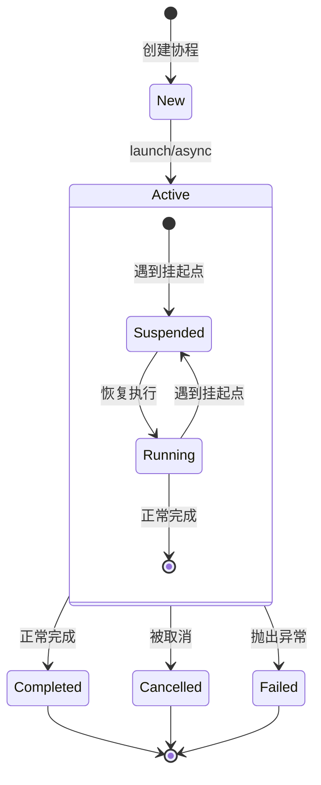
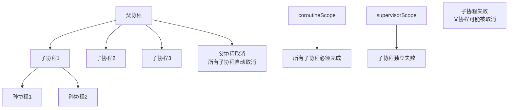

# 第4章：协程与异步编程

## 📖 章节概述

协程是Kotlin最重要的特性之一，也是现代异步编程的核心技术。本章将深入探讨Kotlin协程的原理、使用方法和最佳实践。作为Java开发者，您将学习到如何使用协程替代传统的回调和线程池，编写更简洁、更高效的异步代码。

**学习时长**: 约5-6天
**核心目标**: 掌握Kotlin协程的核心概念和实际应用，能够进行高效的异步编程

---

## 4.1 协程核心概念

### 4.1.1 协程 vs 线程

```kotlin
// 传统线程方式 - Java风格
fun traditionalThreadApproach() {
    val thread = Thread {
        try {
            // 模拟耗时操作
            Thread.sleep(1000)
            println("线程任务完成: ${Thread.currentThread().name}")
        } catch (e: InterruptedException) {
            Thread.currentThread().interrupt()
        }
    }
    thread.start()
    thread.join() // 等待线程完成
}

// 协程方式 - Kotlin风格
suspend fun coroutineApproach() {
    coroutineScope {
        launch {
            delay(1000) // 挂起函数，不阻塞线程
            println("协程任务完成: ${Thread.currentThread().name}")
        }
    }
}

// 性能对比示例
suspend fun performanceComparison() {
    val iterations = 10000

    // 线程方式（会很快耗尽线程资源）
    val threadStartTime = System.currentTimeMillis()
    val threadJobs = mutableListOf<Thread>()
    repeat(iterations) {
        Thread {
            Thread.sleep(1) // 模拟短暂阻塞
        }.also { thread ->
            threadJobs.add(thread)
            thread.start()
        }
    }
    threadJobs.forEach { it.join() }
    val threadTime = System.currentTimeMillis() - threadStartTime

    // 协程方式（高效的线程复用）
    val coroutineStartTime = System.currentTimeMillis()
    runBlocking {
        repeat(iterations) {
            launch {
                delay(1) // 挂起函数
            }
        }
    }
    val coroutineTime = System.currentTimeMillis() - coroutineStartTime

    println("线程方式耗时: ${threadTime}ms")
    println("协程方式耗时: ${coroutineTime}ms")
    println("协程效率提升: ${((threadTime - coroutineTime).toDouble() / threadTime * 100).toInt()}%")
}
```

### 4.1.2 挂起函数原理

```kotlin
// 挂起函数的定义 - 使用suspend关键字
suspend fun fetchDataFromNetwork(url: String): String {
    // 模拟网络请求
    delay(1000)
    return "从$url 获取的数据"
}

// 挂起函数可以被其他挂起函数调用
suspend fun processUserData(userId: String): UserProfile {
    val userInfo = fetchDataFromNetwork("https://api.example.com/users/$userId")
    val userSettings = fetchDataFromNetwork("https://api.example.com/settings/$userId")

    return UserProfile(
        id = userId,
        info = userInfo,
        settings = userSettings
    )
}

// 普通函数不能调用挂起函数
fun normalFunction() {
    // fetchDataFromNetwork("test") // 编译错误：不能在普通函数中调用挂起函数
}

// 挂起函数只能在协程或其他挂起函数中调用
suspend fun caller() {
    val data = fetchDataFromNetwork("test") // ✅ 正确
}

// 挂起函数的反编译原理（概念性）
suspend fun exampleFunction() {
    println("开始")
    delay(1000)
    println("结束")
}

// 编译器大致转换为：
fun exampleFunction(continuation: Continuation<Any?>): Any? {
    return when (continuation.label) {
        0 -> {
            continuation.label = 1
            println("开始")
            // 返回一个特殊的COROUTINE_SUSPENDED标志
            delay(1000, continuation)
            COROUTINE_SUSPENDED
        }
        1 -> {
            println("结束")
            Unit
        }
        else -> error("Already completed")
    }
}
```

### 4.1.3 协程的生命周期



```kotlin
// 协程生命周期监控
fun monitorCoroutineLifecycle() = runBlocking {
    val job = launch {
        println("协程开始: ${currentTime}")
        delay(500)
        println("协程执行中: ${currentTime}")
        delay(500)
        println("协程即将完成: ${currentTime}")
    }

    // 监控协程状态
    job.invokeOnCompletion { throwable ->
        if (throwable == null) {
            println("协程正常完成: ${currentTime}")
        } else {
            println("协程异常完成: $throwable")
        }
    }

    job.join()
    println("协程生命周期结束: ${currentTime}")
}

private fun currentTime() = System.currentTimeMillis()
```

---

## 4.2 CoroutineScope与Context

### 4.2.1 CoroutineScope详解

```kotlin
// 全局作用域 - 慎用！可能导致内存泄漏
val globalScopeExample = GlobalScope.launch {
    delay(1000)
    println("GlobalScope协程执行: ${Thread.currentThread().name}")
}

// 运行阻塞作用域 - 主要用于测试和演示
fun runBlockingExample() {
    runBlocking {
        println("runBlocking开始")
        launch {
            delay(1000)
            println("内部协程完成")
        }
        println("runBlocking结束")
    }
}

// MainScope - 用于Android UI相关的协程
val mainScope = MainScope()

fun androidStyleExample() {
    mainScope.launch {
        val data = fetchDataFromNetwork("https://api.example.com/data")
        updateUI(data) // 更新UI（需要在Main线程）
    }
}

fun updateUI(data: String) {
    println("更新UI: $data")
}

// 自定义CoroutineScope
class UserRepository {
    // 创建自己的作用域
    private val scope = CoroutineScope(Dispatchers.IO + SupervisorJob())

    fun loadUsers() {
        scope.launch {
            val users = fetchUsersFromDatabase()
            println("加载用户: ${users.size}")
        }
    }

    fun cleanup() {
        scope.cancel() // 取消所有子协程
    }

    private suspend fun fetchUsersFromDatabase(): List<User> {
        delay(500) // 模拟数据库查询
        return listOf(User("1", "张三"), User("2", "李四"))
    }
}

data class User(val id: String, val name: String)
```

### 4.2.2 CoroutineContext元素

```kotlin
// CoroutineContext的基本组成
fun contextElementsDemo() = runBlocking {
    // 1. Job - 协程的句柄
    val job = Job()

    // 2. Dispatcher - 协程的调度器
    val dispatcher = Dispatchers.IO

    // 3. CoroutineName - 协程的名称
    val name = CoroutineName("MyCoroutine")

    // 4. CoroutineExceptionHandler - 异常处理器
    val exceptionHandler = CoroutineExceptionHandler { _, exception ->
        println("捕获异常: $exception")
    }

    // 组合Context
    val combinedContext = job + dispatcher + name + exceptionHandler

    launch(combinedContext) {
        println("协程执行: ${Thread.currentThread().name}")
        println("协程名称: ${currentCoroutineContext()[CoroutineName]?.name}")
    }
}

// 不同调度器的使用
fun dispatcherComparison() = runBlocking {
    // Default调度器 - CPU密集型任务
    launch(Dispatchers.Default) {
        println("Default调度器: ${Thread.currentThread().name}")
        // 执行计算密集型任务
        val result = (1..1000000).map { it * it }.sum()
        println("计算完成: $result")
    }

    // IO调度器 - IO密集型任务
    launch(Dispatchers.IO) {
        println("IO调度器: ${Thread.currentThread().name}")
        // 模拟网络请求
        delay(1000)
        println("网络请求完成")
    }

    // Unconfined调度器 - 不指定特定线程
    launch(Dispatchers.Unconfined) {
        println("Unconfined开始: ${Thread.currentThread().name}")
        delay(100)
        println("Unconfined继续: ${Thread.currentThread().name}")
    }

    // 使用Main调度器（需要特定环境）
    // launch(Dispatchers.Main) {
    //     // 更新UI等操作
    // }
}
```

### 4.2.3 结构化并发



```kotlin
// coroutineScope - 结构化并发的基本构建块
suspend fun structuredConcurrencyExample() = coroutineScope {
    println("父协程开始")

    val child1 = launch {
        delay(1000)
        println("子协程1完成")
    }

    val child2 = launch {
        delay(500)
        println("子协程2完成")
    }

    val child3 = async {
        delay(800)
        "子协程3结果"
    }

    // 等待所有子协程完成
    child1.join()
    child2.join()
    val result3 = child3.await()
    println("子协程3结果: $result3")

    println("父协程完成")
}

// supervisorScope - 子协程独立失败
suspend fun supervisorScopeExample() = supervisorScope {
    println("SupervisorScope开始")

    // 即使某些子协程失败，其他子协程继续执行
    val child1 = launch {
        delay(500)
        println("子协程1成功完成")
    }

    val child2 = launch {
        delay(300)
        throw RuntimeException("子协程2失败")
    }

    val child3 = launch {
        delay(700)
        println("子协程3成功完成")
    }

    // 处理子协程的异常
    child2.invokeOnCompletion { throwable ->
        if (throwable != null) {
            println("子协程2失败: $throwable")
        }
    }

    // 等待成功的子协程
    child1.join()
    child3.join()

    println("SupervisorScope完成")
}

// 父子协程的取消传播
fun cancellationPropagationDemo() = runBlocking {
    val parentJob = launch {
        println("父协程开始")

        val child1 = launch {
            repeat(10) { i ->
                delay(100)
                println("子协程1: $i")
            }
        }

        val child2 = launch {
            repeat(10) { i ->
                delay(150)
                println("子协程2: $i")
            }
        }

        delay(300)
        println("父协程取消子协程")

        // 取消父协程会自动取消所有子协程
        this.cancel()
    }

    parentJob.invokeOnCompletion {
        println("父协程完成")
    }

    parentJob.join()
}
```

---

## 4.3 协程构建器

### 4.3.1 launch vs async vs runBlocking

```kotlin
// launch - 火发射，不返回结果
fun launchDemo() = runBlocking {
    println("主线程: ${Thread.currentThread().name}")

    val job = launch(Dispatchers.Default) {
        println("launch开始: ${Thread.currentThread().name}")
        delay(1000)
        println("launch完成")
    }

    println("launch已启动")
    job.join() // 等待协程完成
    println("launch已结束")
}

// async - 异步执行，返回Deferred<T>
suspend fun asyncDemo() = coroutineScope {
    println("开始并行任务")

    val deferred1 = async(Dispatchers.Default) {
        println("任务1开始: ${Thread.currentThread().name}")
        delay(1000)
        42 // 返回结果
    }

    val deferred2 = async(Dispatchers.Default) {
        println("任务2开始: ${Thread.currentThread().name}")
        delay(800)
        "Hello" // 返回结果
    }

    val deferred3 = async(Dispatchers.Default) {
        println("任务3开始: ${Thread.currentThread().name}")
        delay(600)
        listOf(1, 2, 3, 4, 5) // 返回结果
    }

    // 等待所有任务完成
    val result1 = deferred1.await()
    val result2 = deferred2.await()
    val result3 = deferred3.await()

    println("所有任务完成: $result1, $result2, $result3")
}

// runBlocking - 阻塞当前线程直到协程完成
fun runBlockingDemo() {
    println("主线程开始: ${Thread.currentThread().name}")

    runBlocking {
        launch {
            delay(1000)
            println("内部协程: ${Thread.currentThread().name}")
        }

        delay(500)
        println("runBlocking中间: ${Thread.currentThread().name}")
    }

    println("主线程结束: ${Thread.currentThread().name}")
}

// 并行vs串行执行对比
suspend fun parallelVsSerialDemo() {
    val time = measureTimeMillis {
        // 串行执行
        val result1 = fetchData("source1")
        val result2 = fetchData("source2")
        val result3 = fetchData("source3")
        println("串行结果: $result1, $result2, $result3")
    }
    println("串行耗时: ${time}ms")

    val parallelTime = measureTimeMillis {
        // 并行执行
        coroutineScope {
            val deferred1 = async { fetchData("source1") }
            val deferred2 = async { fetchData("source2") }
            val deferred3 = async { fetchData("source3") }

            val result1 = deferred1.await()
            val result2 = deferred2.await()
            val result3 = deferred3.await()
            println("并行结果: $result1, $result2, $result3")
        }
    }
    println("并行耗时: ${parallelTime}ms")
}

suspend fun fetchData(source: String): String {
    delay(1000) // 模拟网络请求
    return "数据从$source"
}

fun measureTimeMillis(block: suspend () -> Unit): Long {
    var result = 0L
    runBlocking {
        val startTime = System.currentTimeMillis()
        block()
        result = System.currentTimeMillis() - startTime
    }
    return result
}
```

### 4.3.2 协程构建器的实际应用场景

```kotlin
// 应用场景1：批量数据处理
data class Product(val id: String, val name: String, val price: Double)

class ProductRepository {
    // 模拟数据库查询
    suspend fun getProductById(id: String): Product {
        delay(100) // 模拟数据库查询延迟
        return Product(id, "Product_$id", 99.99)
    }

    // 使用async并行获取多个产品
    suspend fun getProductsParallel(ids: List<String>): List<Product> = coroutineScope {
        ids.map { id ->
            async { getProductById(id) }
        }.awaitAll() // 等待所有async完成
    }

    // 使用launch处理非关键任务（如日志记录）
    fun logProductAccess(productId: String) {
        GlobalScope.launch(Dispatchers.IO) {
            delay(50) // 模拟日志写入
            println("访问日志: 产品ID $productId")
        }
    }
}

// 应用场景2：网络请求组合
suspend fun fetchUserDataAndPosts(userId: String): UserWithPosts {
    return coroutineScope {
        // 并行获取用户信息和帖子
        val userDeferred = async { fetchUserInfo(userId) }
        val postsDeferred = async { fetchUserPosts(userId) }
        val commentsDeferred = async { fetchUserComments(userId) }

        // 等待所有请求完成
        val user = userDeferred.await()
        val posts = postsDeferred.await()
        val comments = commentsDeferred.await()

        UserWithPosts(user, posts, comments)
    }
}

suspend fun fetchUserInfo(userId: String): User {
    delay(800) // 模拟网络请求
    return User(userId, "用户_$userId")
}

suspend fun fetchUserPosts(userId: String): List<Post> {
    delay(600) // 模拟网络请求
    return listOf(Post("1", "标题1"), Post("2", "标题2"))
}

suspend fun fetchUserComments(userId: String): List<Comment> {
    delay(400) // 模拟网络请求
    return listOf(Comment("1", "评论1"))
}

data class User(val id: String, val name: String)
data class Post(val id: String, val title: String)
data class Comment(val id: String, val content: String)
data class UserWithPosts(val user: User, val posts: List<Post>, val comments: List<Comment>)

// 应用场景3：超时和重试
suspend fun fetchWithTimeoutAndRetry(
    maxRetries: Int = 3,
    timeoutMs: Long = 3000L
): String = retry(maxRetries) {
    withTimeout(timeoutMs) {
        fetchDataFromNetwork("https://api.example.com/data")
    }
}

// 重试机制
suspend fun <T> retry(
    times: Int,
    initialDelayMs: Long = 100,
    maxDelayMs: Long = 1000,
    factor: Double = 2.0,
    block: suspend () -> T
): T {
    var currentDelay = initialDelayMs
    repeat(times - 1) {
        try {
            return block()
        } catch (e: Exception) {
            println("重试 ${it + 1}: ${e.message}")
            delay(currentDelay)
            currentDelay = (currentDelay * factor).toLong().coerceAtMost(maxDelayMs)
        }
    }
    return block() // 最后一次尝试
}

// 应用场景演示
fun coroutineBuildersDemo() = runBlocking {
    val repository = ProductRepository()

    // 并行获取产品
    val startTime = System.currentTimeMillis()
    val products = repository.getProductsParallel(listOf("1", "2", "3", "4", "5"))
    val time = System.currentTimeMillis() - startTime

    println("获取${products.size}个产品，耗时: ${time}ms")
    products.forEach { println(it) }

    // 非阻塞日志记录
    repository.logProductAccess("123")
    println("日志记录已启动（非阻塞）")

    // 组合网络请求
    val userWithPosts = fetchUserDataAndPosts("user123")
    println("用户数据: ${userWithPosts.user.name}")
    println("帖子数量: ${userWithPosts.posts.size}")

    // 带重试的数据获取
    try {
        val data = fetchWithTimeoutAndRetry()
        println("数据获取成功: $data")
    } catch (e: Exception) {
        println("数据获取最终失败: ${e.message}")
    }
}
```

---

## 4.4 异常处理机制

### 4.4.1 协程异常传播规则

```kotlin
// 协程异常传播的基本规则
fun exceptionPropagationDemo() = runBlocking {
    // 规则1：协程中的异常会传播到父协程
    val parentJob = launch {
        println("父协程开始")

        val childJob = launch {
            println("子协程开始")
            delay(100)
            throw RuntimeException("子协程异常")
        }

        // 子协程的异常会取消父协程
        try {
            delay(200)
            println("这行不会执行")
        } catch (e: Exception) {
            println("父协程捕获异常: $e")
        }
    }

    parentJob.invokeOnCompletion { throwable ->
        if (throwable != null) {
            println("父协程因子协程异常而取消: $throwable")
        } else {
            println("父协程正常完成")
        }
    }

    parentJob.join()
}

// supervisorScope中的异常处理
suspend fun supervisorScopeExceptionHandling() = supervisorScope {
    println("SupervisorScope开始")

    // 在supervisorScope中，子协程的异常不会影响其他子协程
    val job1 = launch {
        try {
            delay(500)
            println("子协程1成功完成")
        } catch (e: Exception) {
            println("子协程1异常: $e")
        }
    }

    val job2 = launch {
        delay(300)
        throw RuntimeException("子协程2失败")
    }

    val job3 = launch {
        delay(700)
        println("子协程3成功完成")
    }

    // 为每个子协程单独处理异常
    job2.invokeOnCompletion { throwable ->
        if (throwable != null) {
            println("子协程2异常处理: $throwable")
        }
    }

    // 等待成功的协程
    job1.join()
    job3.join()

    println("SupervisorScope结束")
}

// CoroutineExceptionHandler的使用
fun exceptionHandlerDemo() = runBlocking {
    val exceptionHandler = CoroutineExceptionHandler { _, exception ->
        println("全局异常处理器: $exception")
        println("异常线程: ${Thread.currentThread().name}")
    }

    val job = launch(exceptionHandler) {
        println("协程开始执行")
        throw IllegalStateException("自定义异常")
    }

    job.join()
    println("主协程继续执行")
}

// async异常的特殊处理
suspend fun asyncExceptionHandling() = coroutineScope {
    // async的异常只有在调用await()时才会抛出
    val deferred = async {
        delay(100)
        throw RuntimeException("async中的异常")
    }

    try {
        val result = deferred.await() // 异常在这里抛出
        println("结果: $result")
    } catch (e: Exception) {
        println("捕获async异常: $e")
    }

    // 多个async的异常处理
    val deferred1 = async {
        delay(200)
        "成功结果1"
    }

    val deferred2 = async {
        delay(100)
        throw RuntimeException("async2异常")
    }

    val deferred3 = async {
        delay(300)
        "成功结果3"
    }

    try {
        // awaitAll()会抛出第一个遇到的异常
        val results = listOf(deferred1, deferred2, deferred3).awaitAll()
        println("所有结果: $results")
    } catch (e: Exception) {
        println("awaitAll异常: $e")

        // 单独处理每个Deferred
        deferred1.invokeOnCompletion { throwable ->
            if (throwable != null) {
                println("deferred1异常: $throwable")
            } else {
                println("deferred1成功: ${deferred1.getCompleted()}")
            }
        }

        deferred3.invokeOnCompletion { throwable ->
            if (throwable != null) {
                println("deferred3异常: $throwable")
            } else {
                println("deferred3成功: ${deferred3.getCompleted()}")
            }
        }
    }
}
```

### 4.4.2 结构化异常处理最佳实践

```kotlin
// 实用的异常处理工具类
object CoroutineErrorHandler {

    // 安全执行，返回Result
    suspend fun <T> safeCall(
        dispatcher: CoroutineDispatcher = Dispatchers.IO,
        block: suspend () -> T
    ): Result<T> {
        return withContext(dispatcher) {
            try {
                Result.success(block())
            } catch (e: Exception) {
                Result.failure(e)
            }
        }
    }

    // 带重试的安全执行
    suspend fun <T> safeCallWithRetry(
        retries: Int = 3,
        delayMs: Long = 1000,
        dispatcher: CoroutineDispatcher = Dispatchers.IO,
        block: suspend () -> T
    ): Result<T> {
        repeat(retries) { attempt ->
            try {
                return withContext(dispatcher) {
                    Result.success(block())
                }
            } catch (e: Exception) {
                if (attempt == retries - 1) {
                    return Result.failure(e)
                }
                println("第${attempt + 1}次尝试失败: ${e.message}, ${delayMs}ms后重试")
                delay(delayMs)
            }
        }
        return Result.failure(Exception("所有重试都失败"))
    }

    // 超时处理
    suspend fun <T> safeCallWithTimeout(
        timeoutMs: Long = 5000,
        dispatcher: CoroutineDispatcher = Dispatchers.IO,
        block: suspend () -> T
    ): Result<T> {
        return try {
            withContext(dispatcher) {
                withTimeout(timeoutMs) {
                    Result.success(block())
                }
            }
        } catch (e: TimeoutCancellationException) {
            Result.failure(Exception("操作超时 (${timeoutMs}ms)", e))
        } catch (e: Exception) {
            Result.failure(e)
        }
    }
}

// 实际应用示例
class NetworkService {
    private val serviceScope = CoroutineScope(Dispatchers.IO + SupervisorJob())

    suspend fun fetchUserData(userId: String): Result<UserData> {
        return CoroutineErrorHandler.safeCallWithRetry(
            retries = 3,
            delayMs = 1000
        ) {
            // 模拟网络请求
            delay(500)
            if (Math.random() < 0.3) {
                throw IOException("网络连接失败")
            }
            UserData(userId, "用户_$userId", "email@example.com")
        }
    }

    suspend fun fetchUserPreferences(userId: String): Result<UserPreferences> {
        return CoroutineErrorHandler.safeCallWithTimeout(
            timeoutMs = 3000
        ) {
            delay(2000)
            UserPreferences(theme = "dark", language = "zh")
        }
    }

    fun fetchAllUserData(userId: String, callback: (Result<CompleteUserData>) -> Unit) {
        serviceScope.launch {
            val userDataResult = fetchUserData(userId)
            val preferencesResult = fetchUserPreferences(userId)

            // 处理两个请求的结果
            val result = when {
                userDataResult.isFailure -> Result.failure(userDataResult.exceptionOrNull()!!)
                preferencesResult.isFailure -> Result.failure(preferencesResult.exceptionOrNull()!!)
                else -> {
                    val userData = userDataResult.getOrThrow()
                    val preferences = preferencesResult.getOrThrow()
                    Result.success(CompleteUserData(userData, preferences))
                }
            }

            callback(result)
        }
    }

    fun cleanup() {
        serviceScope.cancel()
    }
}

data class UserData(val id: String, val name: String, val email: String)
data class UserPreferences(val theme: String, val language: String)
data class CompleteUserData(val userData: UserData, val preferences: UserPreferences)

// 使用示例
suspend fun exceptionHandlingDemo() {
    val service = NetworkService()

    // 单次请求
    val userDataResult = service.fetchUserData("user123")
    userDataResult.onSuccess { userData ->
        println("用户数据: ${userData.name}")
    }.onFailure { error ->
        println("获取用户数据失败: ${error.message}")
    }

    // 组合请求
    service.fetchAllUserData("user123") { result ->
        result.onSuccess { completeData ->
            println("完整用户数据: ${completeData.userData.name}, 主题: ${completeData.preferences.theme}")
        }.onFailure { error ->
            println("获取完整用户数据失败: ${error.message}")
        }
    }

    delay(3000) // 等待异步操作完成
    service.cleanup()
}
```

---

## 4.5 Flow响应式编程

### 4.5.1 Flow基础概念

```kotlin
// 基本Flow创建
fun basicFlowDemo() = runBlocking {
    // 创建简单的Flow
    val simpleFlow = flow {
        println("Flow开始发射数据")
        emit(1)
        delay(100)
        emit(2)
        delay(100)
        emit(3)
        println("Flow数据发射完成")
    }

    // 收集Flow中的数据
    println("开始收集Flow数据")
    simpleFlow.collect { value ->
        println("接收到数据: $value")
    }
    println("Flow收集完成")
}

// Flow的操作符
suspend fun flowOperatorsDemo() {
    // 创建Flow
    val numbersFlow = (1..10).asFlow()

    // map操作符 - 转换数据
    val squaredFlow = numbersFlow.map { it * it }
    println("平方数:")
    squaredFlow.collect { print("$it ") }

    // filter操作符 - 过滤数据
    val evenFlow = numbersFlow.filter { it % 2 == 0 }
    println("\n偶数:")
    evenFlow.collect { print("$it ") }

    // take操作符 - 限制数量
    val firstFive = numbersFlow.take(5)
    println("\n前5个数:")
    firstFive.collect { print("$it ") }

    // 操作符链式调用
    val processedFlow = numbersFlow
        .filter { it % 2 == 1 }  // 奇数
        .map { it * it }         // 平方
        .take(3)                 // 前3个

    println("\n处理后的数据:")
    processedFlow.collect { print("$it ") }
}

// Flow的背压处理
suspend fun backpressureDemo() = runBlocking {
    // 快速发射数据的Flow
    val fastFlow = flow {
        repeat(100) { i ->
            emit(i)
            println("发射: $i")
        }
    }

    // 慢速收集数据
    val startTime = System.currentTimeMillis()
    fastFlow.buffer(10) // 缓冲区大小为10
        .collect { value ->
            delay(50) // 模拟慢速处理
            println("收集: $value (${System.currentTimeMillis() - startTime}ms)")
        }
}

// Flow的异常处理
suspend fun flowExceptionHandling() = runBlocking {
    // 带异常的Flow
    val flowWithException = flow {
        emit(1)
        emit(2)
        throw RuntimeException("Flow异常")
        emit(3) // 这行不会执行
    }

    // 使用catch操作符处理异常
    flowWithException
        .catch { exception ->
            println("捕获Flow异常: $exception")
            emit(0) // 发射默认值
        }
        .collect { value ->
            println("接收值: $value")
        }

    // 使用onCompletion操作符
    flowWithException
        .onCompletion { exception ->
            if (exception != null) {
                println("Flow因异常完成: $exception")
            } else {
                println("Flow正常完成")
            }
        }
        .catch { exception ->
            println("在onCompletion后捕获: $exception")
        }
        .collect { value ->
            println("第二次收集: $value")
        }
}
```

### 4.5.2 Flow的高级特性

```kotlin
// Flow的上下文和线程切换
suspend fun flowContextDemo() = runBlocking {
    // Flow默认在收集者的上下文中执行
    val flow = flow {
        println("Flow发射线程: ${Thread.currentThread().name}")
        emit("数据")
    }.flowOn(Dispatchers.IO) // 在IO线程发射数据

    flow.collect { value ->
        println("Flow收集线程: ${Thread.currentThread().name}")
        println("值: $value")
    }
}

// StateFlow - 状态Flow
class CounterViewModel {
    private val _counter = MutableStateFlow(0)
    val counter: StateFlow<Int> = _counter.asStateFlow()

    fun increment() {
        _counter.value++
    }

    fun decrement() {
        _counter.value--
    }
}

suspend fun stateFlowDemo() {
    val viewModel = CounterViewModel()

    // 收集StateFlow
    val job = launch {
        viewModel.counter.collect { count ->
            println("计数器: $count")
        }
    }

    // 修改状态
    viewModel.increment()
    delay(100)
    viewModel.increment()
    delay(100)
    viewModel.decrement()
    delay(100)

    job.cancel()
}

// SharedFlow - 事件Flow
class EventBus {
    private val _events = MutableSharedFlow<Event>()
    val events: SharedFlow<Event> = _events.asSharedFlow()

    fun sendEvent(event: Event) {
        _events.tryEmit(event)
    }
}

sealed class Event {
    data class UserLoggedIn(val userId: String) : Event()
    data class DataUpdated(val dataType: String) : Event()
    object NetworkError : Event()
}

suspend fun sharedFlowDemo() = runBlocking {
    val eventBus = EventBus()

    // 订阅事件
    val subscriber1 = launch {
        eventBus.events.collect { event ->
            println("订阅者1收到事件: $event")
        }
    }

    val subscriber2 = launch {
        eventBus.events.collect { event ->
            println("订阅者2收到事件: $event")
        }
    }

    // 发送事件
    delay(100)
    eventBus.sendEvent(Event.UserLoggedIn("user123"))

    delay(100)
    eventBus.sendEvent(Event.DataUpdated("posts"))

    delay(100)
    eventBus.sendEvent(Event.NetworkError)

    delay(200)
    subscriber1.cancel()
    subscriber2.cancel()
}

// Flow的组合操作
suspend fun flowCombinationDemo() = runBlocking {
    // 合并多个Flow
    val flow1 = flowOf(1, 2, 3)
    val flow2 = flowOf(4, 5, 6)

    val mergedFlow = flow1.merge(flow2)
    println("合并Flow:")
    mergedFlow.collect { print("$it ") }

    // 拉链组合
    val flow3 = flowOf("A", "B", "C")
    val zippedFlow = flow1.zip(flow3) { number, letter -> "$number$letter" }
    println("\n拉链Flow:")
    zippedFlow.collect { print("$it ") }

    // 组合最新值
    val stateFlow1 = MutableStateFlow(10)
    val stateFlow2 = MutableStateFlow(20)

    val combinedFlow = stateFlow1.combine(stateFlow2) { a, b -> a + b }

    println("\n组合最新值:")
    val job = launch {
        combinedFlow.collect { sum ->
            println("当前和: $sum")
        }
    }

    stateFlow1.value = 15
    delay(100)
    stateFlow2.value = 25
    delay(100)

    job.cancel()
}

// 冷Flow vs 热Flow
suspend fun coldVsHotFlowDemo() = runBlocking {
    // 冷Flow - 每个收集者都会重新执行
    val coldFlow = flow {
        println("冷Flow开始发射")
        emit(1)
        delay(100)
        emit(2)
        delay(100)
        emit(3)
        println("冷Flow发射完成")
    }

    println("第一个收集者:")
    coldFlow.collect { println("收集者1: $it") }

    println("第二个收集者:")
    coldFlow.collect { println("收集者2: $it") }

    // 热Flow - 数据共享
    val hotFlow = MutableSharedFlow<Int>()

    // 启动发射者
    launch {
        println("热Flow开始发射")
        repeat(3) { i ->
            delay(100)
            println("发射: $i")
            hotFlow.emit(i)
        }
    }

    // 第一个收集者
    delay(50)
    val collector1 = launch {
        hotFlow.collect { println("热收集者1: $it") }
    }

    // 第二个收集者（稍晚一些）
    delay(150)
    val collector2 = launch {
        hotFlow.collect { println("热收集者2: $it") }
    }

    delay(300)
    collector1.cancel()
    collector2.cancel()
}
```

### 4.5.3 实际Flow应用场景

```kotlin
// 场景1：实时数据更新
class UserRepository {
    private val _users = MutableStateFlow<List<User>>(emptyList())
    val users: StateFlow<List<User>> = _users.asStateFlow()

    private val _isLoading = MutableStateFlow(false)
    val isLoading: StateFlow<Boolean> = _isLoading.asStateFlow()

    suspend fun refreshUsers() {
        _isLoading.value = true
        try {
            val newUsers = fetchUsersFromNetwork()
            _users.value = newUsers
        } catch (e: Exception) {
            println("获取用户列表失败: $e")
        } finally {
            _isLoading.value = false
        }
    }

    private suspend fun fetchUsersFromNetwork(): List<User> {
        delay(1000)
        return listOf(
            User("1", "张三"),
            User("2", "李四"),
            User("3", "王五")
        )
    }
}

// 场景2：搜索防抖
class SearchRepository {
    private val _searchQuery = MutableStateFlow("")
    private val _searchResults = MutableStateFlow<List<SearchResult>>(emptyList())

    val searchResults: StateFlow<List<SearchResult>> = _searchResults.asStateFlow()

    init {
        // 对搜索查询进行防抖处理
        _searchQuery
            .debounce(300) // 300ms防抖
            .distinctUntilChanged() // 去重
            .mapLatest { query -> // 取消之前的请求
                if (query.isBlank()) {
                    emptyList()
                } else {
                    performSearch(query)
                }
            }
            .catch { exception ->
                println("搜索失败: $exception")
                emit(emptyList())
            }
            .onEach { results ->
                _searchResults.value = results
            }
            .launchIn(CoroutineScope(Dispatchers.IO))
    }

    fun updateSearchQuery(query: String) {
        _searchQuery.value = query
    }

    private suspend fun performSearch(query: String): List<SearchResult> {
        delay(500) // 模拟网络请求
        return listOf(
            SearchResult("1", "$query的结果1"),
            SearchResult("2", "$query的结果2"),
            SearchResult("3", "$query的结果3")
        )
    }
}

data class SearchResult(val id: String, val title: String)

// 场景3：网络状态监控
class NetworkMonitor {
    private val _connectionState = MutableStateFlow(ConnectionState.DISCONNECTED)
    val connectionState: StateFlow<ConnectionState> = _connectionState.asStateFlow()

    private val _networkSpeed = MutableSharedFlow<NetworkSpeed>()
    val networkSpeed: SharedFlow<NetworkSpeed> = _networkSpeed.asSharedFlow()

    private val monitoringScope = CoroutineScope(Dispatchers.IO + SupervisorJob())

    fun startMonitoring() {
        monitoringScope.launch {
            while (isActive) {
                try {
                    val state = checkConnectionState()
                    _connectionState.value = state

                    if (state == ConnectionState.CONNECTED) {
                        val speed = measureNetworkSpeed()
                        _networkSpeed.emit(speed)
                    }

                    delay(5000) // 每5秒检查一次
                } catch (e: Exception) {
                    _connectionState.value = ConnectionState.ERROR
                }
            }
        }
    }

    fun stopMonitoring() {
        monitoringScope.cancel()
    }

    private suspend fun checkConnectionState(): ConnectionState {
        delay(100) // 模拟网络检查
        return if (Math.random() > 0.1) {
            ConnectionState.CONNECTED
        } else {
            ConnectionState.DISCONNECTED
        }
    }

    private suspend fun measureNetworkSpeed(): NetworkSpeed {
        delay(200) // 模拟速度测试
        val downloadSpeed = (10..100).random().toDouble()
        val uploadSpeed = (5..50).random().toDouble()
        return NetworkSpeed(downloadSpeed, uploadSpeed)
    }
}

enum class ConnectionState {
    CONNECTED, DISCONNECTED, ERROR
}

data class NetworkSpeed(val download: Double, val upload: Double)

// 使用示例
suspend fun flowApplicationsDemo() = runBlocking {
    // 用户列表管理
    val userRepository = UserRepository()

    // 启动用户列表观察
    val userObserver = launch {
        combine(userRepository.users, userRepository.isLoading) { users, loading ->
            Pair(users, loading)
        }.collect { (users, loading) ->
            if (loading) {
                println("加载中...")
            } else {
                println("用户列表 (${users.size}个):")
                users.forEach { println("  - ${it.name}") }
            }
        }
    }

    userRepository.refreshUsers()
    delay(1500)

    // 搜索功能
    val searchRepository = SearchRepository()
    val searchObserver = launch {
        searchRepository.searchResults.collect { results ->
            if (results.isNotEmpty()) {
                println("搜索结果:")
                results.forEach { println("  - ${it.title}") }
            }
        }
    }

    searchRepository.updateSearchQuery("Kotlin")
    delay(500)
    searchRepository.updateSearchQuery("协程")
    delay(500)

    // 网络监控
    val networkMonitor = NetworkMonitor()
    networkMonitor.startMonitoring()

    val networkObserver = launch {
        networkMonitor.connectionState.collect { state ->
            println("网络状态: $state")
        }
    }

    val speedObserver = launch {
        networkMonitor.networkSpeed.collect { speed ->
            println("网络速度: 下载${speed.download}Mbps, 上传${speed.upload}Mbps")
        }
    }

    delay(12000) // 监控12秒
    networkMonitor.stopMonitoring()

    // 清理观察者
    userObserver.cancel()
    searchObserver.cancel()
    networkObserver.cancel()
    speedObserver.cancel()
}
```

---

## 4.6 实战：网络请求与数据库操作

### 4.6.1 网络请求封装

```kotlin
// 统一的HTTP响应封装
sealed class ApiResponse<out T> {
    data class Success<T>(val data: T) : ApiResponse<T>()
    data class Error(val exception: Throwable, val message: String = exception.message ?: "未知错误") : ApiResponse<Nothing>()
    object Loading : ApiResponse<Nothing>()

    val isLoading: Boolean get() = this is Loading
    val isSuccess: Boolean get() = this is Success
    val isError: Boolean get() = this is Error
}

// 网络请求配置
data class NetworkConfig(
    val baseUrl: String,
    val connectTimeoutMs: Long = 10000,
    val readTimeoutMs: Long = 10000,
    val writeTimeoutMs: Long = 10000,
    val retryCount: Int = 3,
    val retryDelayMs: Long = 1000
)

// 网络客户端
class NetworkClient(private val config: NetworkConfig) {
    private val clientScope = CoroutineScope(Dispatchers.IO + SupervisorJob())

    // GET请求
    suspend fun <T> get(
        endpoint: String,
        responseType: Class<T>,
        headers: Map<String, String> = emptyMap()
    ): ApiResponse<T> {
        return executeRequest {
            // 模拟HTTP GET请求
            delay(500) // 模拟网络延迟
            if (Math.random() < 0.1) {
                throw IOException("网络连接失败")
            }

            // 模拟返回数据
            when (responseType.simpleName) {
                "User" -> createMockUser()
                "List" -> createMockUserList()
                else -> throw IllegalArgumentException("不支持的响应类型")
            } as T
        }
    }

    // POST请求
    suspend fun <T, R> post(
        endpoint: String,
        requestBody: T,
        responseType: Class<R>,
        headers: Map<String, String> = emptyMap()
    ): ApiResponse<R> {
        return executeRequest {
            delay(800) // 模拟网络延迟
            if (Math.random() < 0.15) {
                throw IOException("请求超时")
            }

            when (responseType.simpleName) {
                "User" -> createMockUser()
                "String" -> "创建成功" as R
                else -> throw IllegalArgumentException("不支持的响应类型")
            }
        }
    }

    // 并发请求
    suspend fun <T> executeParallel(
        requests: List<suspend () -> T>
    ): List<ApiResponse<T>> {
        return try {
            val results = requests.map { request ->
                async {
                    try {
                        ApiResponse.Success(request())
                    } catch (e: Exception) {
                        ApiResponse.Error(e)
                    }
                }
            }.awaitAll()
            results
        } catch (e: Exception) {
            requests.map { ApiResponse.Error<T>(e) }
        }
    }

    private suspend fun <T> executeRequest(
        block: suspend () -> T
    ): ApiResponse<T> {
        repeat(config.retryCount) { attempt ->
            try {
                val result = withTimeout(config.connectTimeoutMs) {
                    block()
                }
                return ApiResponse.Success(result)
            } catch (e: Exception) {
                if (attempt == config.retryCount - 1) {
                    return ApiResponse.Error(e, "请求失败，已重试${config.retryCount}次")
                }
                println("第${attempt + 1}次请求失败: ${e.message}, ${config.retryDelayMs}ms后重试")
                delay(config.retryDelayMs * (attempt + 1)) // 指数退避
            }
        }
        return ApiResponse.Error(Exception("未知错误"))
    }

    private fun createMockUser(): User {
        val ids = listOf("user001", "user002", "user003")
        val names = listOf("张三", "李四", "王五", "赵六", "钱七")
        return User(
            id = ids.random(),
            name = names.random(),
            email = "user${(100..999).random()}@example.com"
        )
    }

    @Suppress("UNCHECKED_CAST")
    private fun createMockUserList(): List<User> {
        return (1..5).map { createMockUser() }
    }

    fun cleanup() {
        clientScope.cancel()
    }
}

// API接口定义
class UserApi(private val networkClient: NetworkClient) {
    suspend fun getUserById(userId: String): ApiResponse<User> {
        return networkClient.get("/users/$userId", User::class.java)
    }

    suspend fun getAllUsers(): ApiResponse<List<User>> {
        return networkClient.get("/users", List::class.java) as ApiResponse<List<User>>
    }

    suspend fun createUser(user: CreateUserRequest): ApiResponse<User> {
        return networkClient.post("/users", user, User::class.java)
    }

    suspend fun updateUser(userId: String, user: UpdateUserRequest): ApiResponse<User> {
        return networkClient.post("/users/$userId", user, User::class.java)
    }
}

data class CreateUserRequest(val name: String, val email: String)
data class UpdateUserRequest(val name: String?, val email: String?)
```

### 4.6.2 数据库操作封装

```kotlin
// 数据库操作基类
abstract class DatabaseRepository<T, ID> {
    protected abstract val dao: Dao<T, ID>

    // 基础CRUD操作
    suspend fun getById(id: ID): T? = dao.findById(id)

    suspend fun getAll(): List<T> = dao.findAll()

    suspend fun save(entity: T): T = dao.save(entity)

    suspend fun saveAll(entities: List<T>): List<T> = dao.saveAll(entities)

    suspend fun update(entity: T): T = dao.update(entity)

    suspend fun delete(entity: T): Unit = dao.delete(entity)

    suspend fun deleteById(id: ID): Unit = dao.deleteById(id)

    suspend fun existsById(id: ID): Boolean = dao.existsById(id)

    suspend fun count(): Long = dao.count()

    // 批量操作
    suspend fun deleteAll(entities: List<T>): Unit = dao.deleteAll(entities)

    suspend fun deleteAll(): Unit = dao.deleteAll()

    // 事务操作
    suspend fun <R> inTransaction(block: suspend () -> R): R {
        return dao.inTransaction(block)
    }
}

// DAO接口定义
interface Dao<T, ID> {
    suspend fun findById(id: ID): T?
    suspend fun findAll(): List<T>
    suspend fun save(entity: T): T
    suspend fun saveAll(entities: List<T>): List<T>
    suspend fun update(entity: T): T
    suspend fun delete(entity: T)
    suspend fun deleteById(id: ID)
    suspend fun existsById(id: ID): Boolean
    suspend fun count(): Long
    suspend fun deleteAll(entities: List<T>)
    suspend fun deleteAll()
    suspend fun <R> inTransaction(block: suspend () -> R): R
}

// 用户DAO实现
class UserDaoImpl : Dao<User, String> {
    // 模拟数据库存储
    private val users = mutableMapOf<String, User>()

    override suspend fun findById(id: String): User? {
        delay(50) // 模拟数据库查询延迟
        return users[id]
    }

    override suspend fun findAll(): List<User> {
        delay(100) // 模拟数据库查询延迟
        return users.values.toList()
    }

    override suspend fun save(entity: User): User {
        delay(80) // 模拟数据库写入延迟
        users[entity.id] = entity
        return entity
    }

    override suspend fun saveAll(entities: List<User>): List<User> {
        delay(200) // 模拟批量写入延迟
        entities.forEach { user ->
            users[user.id] = user
        }
        return entities
    }

    override suspend fun update(entity: User): User {
        return save(entity)
    }

    override suspend fun delete(entity: User) {
        delay(50)
        users.remove(entity.id)
    }

    override suspend fun deleteById(id: String) {
        delay(50)
        users.remove(id)
    }

    override suspend fun existsById(id: String): Boolean {
        delay(30)
        return users.containsKey(id)
    }

    override suspend fun count(): Long {
        delay(30)
        return users.size.toLong()
    }

    override suspend fun deleteAll(entities: List<User>) {
        delay(150)
        entities.forEach { user ->
            users.remove(user.id)
        }
    }

    override suspend fun deleteAll() {
        delay(100)
        users.clear()
    }

    override suspend fun <R> inTransaction(block: suspend () -> R): R {
        // 简单的事务实现
        return try {
            val result = block()
            result
        } catch (e: Exception) {
            throw RuntimeException("事务失败", e)
        }
    }
}

// 用户仓库实现
class UserRepository(private val userDao: Dao<User, String>) : DatabaseRepository<User, String>() {
    override val dao: Dao<User, String> = userDao

    // 自定义查询方法
    suspend fun findByNameContaining(name: String): List<User> {
        return findAll().filter { it.name.contains(name, ignoreCase = true) }
    }

    suspend fun findByEmailContaining(email: String): List<User> {
        return findAll().filter { it.email.contains(email, ignoreCase = true) }
    }

    // 统计方法
    suspend fun countByName(name: String): Long {
        return findByNameContaining(name).size.toLong()
    }

    // 批量更新
    suspend fun updateNames(userIds: List<String>, newName: String): List<User> {
        return inTransaction {
            userIds.mapNotNull { userId ->
                findById(userId)?.let { user ->
                    update(user.copy(name = newName))
                }
            }
        }
    }

    // 复杂查询：获取用户统计信息
    suspend fun getUserStatistics(): UserStatistics {
        val allUsers = findAll()
        return UserStatistics(
            totalUsers = allUsers.size,
            uniqueDomains = allUsers.map { it.email.substringAfter('@') }.distinct().size,
            averageNameLength = allUsers.map { it.name.length }.average()
        )
    }
}

data class UserStatistics(
    val totalUsers: Int,
    val uniqueDomains: Int,
    val averageNameLength: Double
)
```

### 4.6.3 网络与数据库集成

```kotlin
// 数据同步策略
enum class SyncStrategy {
    CACHE_FIRST,    // 优先使用缓存
    NETWORK_FIRST,  // 优先使用网络
    CACHE_ONLY,     // 仅使用缓存
    NETWORK_ONLY,   // 仅使用网络
    SMART           // 智能同步
}

// 数据同步管理器
class DataSyncManager<T : Any, ID>(
    private val networkApi: suspend (ID) -> ApiResponse<T>,
    private val localRepository: DatabaseRepository<T, ID>,
    private val syncStrategy: SyncStrategy = SyncStrategy.SMART,
    private val cacheExpiryMs: Long = 5 * 60 * 1000 // 5分钟缓存过期
) {
    private val cacheTimestamps = mutableMapOf<ID, Long>()

    suspend fun getData(id: ID): ApiResponse<T> {
        return when (syncStrategy) {
            SyncStrategy.CACHE_FIRST -> cacheFirstStrategy(id)
            SyncStrategy.NETWORK_FIRST -> networkFirstStrategy(id)
            SyncStrategy.CACHE_ONLY -> cacheOnlyStrategy(id)
            SyncStrategy.NETWORK_ONLY -> networkOnlyStrategy(id)
            SyncStrategy.SMART -> smartStrategy(id)
        }
    }

    private suspend fun cacheFirstStrategy(id: ID): ApiResponse<T> {
        val cachedData = localRepository.getById(id)
        return if (cachedData != null && !isCacheExpired(id)) {
            ApiResponse.Success(cachedData)
        } else {
            refreshFromNetwork(id)
        }
    }

    private suspend fun networkFirstStrategy(id: ID): ApiResponse<T> {
        val networkResult = networkApi(id)
        return when (networkResult) {
            is ApiResponse.Success -> {
                localRepository.save(networkResult.data)
                updateCacheTimestamp(id)
                networkResult
            }
            is ApiResponse.Error -> {
                // 网络失败时尝试使用缓存
                val cachedData = localRepository.getById(id)
                if (cachedData != null) {
                    ApiResponse.Success(cachedData)
                } else {
                    networkResult
                }
            }
            else -> networkResult
        }
    }

    private suspend fun cacheOnlyStrategy(id: ID): ApiResponse<T> {
        val cachedData = localRepository.getById(id)
        return if (cachedData != null) {
            ApiResponse.Success(cachedData)
        } else {
            ApiResponse.Error(Exception("缓存中没有数据"))
        }
    }

    private suspend fun networkOnlyStrategy(id: ID): ApiResponse<T> {
        return networkApi(id)
    }

    private suspend fun smartStrategy(id: ID): ApiResponse<T> {
        val cachedData = localRepository.getById(id)
        val cacheExpired = isCacheExpired(id)

        return when {
            cachedData == null -> {
                // 没有缓存，直接从网络获取
                refreshFromNetwork(id)
            }
            !cacheExpired -> {
                // 缓存未过期，直接使用缓存
                ApiResponse.Success(cachedData)
            }
            else -> {
                // 缓存过期，后台刷新，前台先返回缓存
                refreshInBackground(id, cachedData)
            }
        }
    }

    private suspend fun refreshFromNetwork(id: ID): ApiResponse<T> {
        val networkResult = networkApi(id)
        when (networkResult) {
            is ApiResponse.Success -> {
                localRepository.save(networkResult.data)
                updateCacheTimestamp(id)
            }
            is ApiResponse.Error -> {
                println("刷新数据失败: ${networkResult.message}")
            }
            else -> {}
        }
        return networkResult
    }

    private suspend fun refreshInBackground(id: ID, cachedData: T): ApiResponse<T> {
        // 后台刷新，前台立即返回缓存数据
        CoroutineScope(Dispatchers.IO).launch {
            refreshFromNetwork(id)
        }
        return ApiResponse.Success(cachedData)
    }

    private fun isCacheExpired(id: ID): Boolean {
        val timestamp = cacheTimestamps[id] ?: return true
        return System.currentTimeMillis() - timestamp > cacheExpiryMs
    }

    private fun updateCacheTimestamp(id: ID) {
        cacheTimestamps[id] = System.currentTimeMillis()
    }

    // 强制刷新
    suspend fun forceRefresh(id: ID): ApiResponse<T> {
        cacheTimestamps.remove(id) // 移除缓存时间戳
        return refreshFromNetwork(id)
    }

    // 预加载数据
    suspend fun preloadData(ids: List<ID>) {
        CoroutineScope(Dispatchers.IO).launch {
            ids.forEach { id ->
                if (isCacheExpired(id)) {
                    refreshFromNetwork(id)
                }
            }
        }
    }

    // 清除所有缓存
    suspend fun clearAllCache() {
        cacheTimestamps.clear()
        localRepository.deleteAll()
    }
}

// 统一的数据服务
class UnifiedUserService {
    private val networkClient = NetworkClient(NetworkConfig("https://api.example.com"))
    private val userApi = UserApi(networkClient)
    private val userDao = UserDaoImpl()
    private val userRepository = UserRepository(userDao)

    // 不同策略的数据同步管理器
    private val cacheFirstManager = DataSyncManager(
        networkApi = { userApi.getUserById(it) },
        localRepository = userRepository,
        syncStrategy = SyncStrategy.CACHE_FIRST
    )

    private val networkFirstManager = DataSyncManager(
        networkApi = { userApi.getUserById(it) },
        localRepository = userRepository,
        syncStrategy = SyncStrategy.NETWORK_FIRST
    )

    private val smartManager = DataSyncManager(
        networkApi = { userApi.getUserById(it) },
        localRepository = userRepository,
        syncStrategy = SyncStrategy.SMART,
        cacheExpiryMs = 30 * 1000 // 30秒缓存
    )

    // 获取用户信息（智能策略）
    suspend fun getUserSmart(userId: String): ApiResponse<User> {
        return smartManager.getData(userId)
    }

    // 获取用户信息（缓存优先）
    suspend fun getUserFromCache(userId: String): ApiResponse<User> {
        return cacheFirstManager.getData(userId)
    }

    // 获取用户信息（网络优先）
    suspend fun getUserFromNetwork(userId: String): ApiResponse<User> {
        return networkFirstManager.getData(userId)
    }

    // 获取所有用户信息
    suspend fun getAllUsers(): ApiResponse<List<User>> {
        return try {
            // 先从网络获取最新数据
            val networkResult = userApi.getAllUsers()
            when (networkResult) {
                is ApiResponse.Success -> {
                    // 保存到本地数据库
                    userRepository.saveAll(networkResult.data)
                    networkResult
                }
                is ApiResponse.Error -> {
                    // 网络失败时使用本地数据
                    val localUsers = userRepository.getAll()
                    if (localUsers.isNotEmpty()) {
                        ApiResponse.Success(localUsers)
                    } else {
                        networkResult
                    }
                }
                else -> networkResult
            }
        } catch (e: Exception) {
            ApiResponse.Error(e)
        }
    }

    // 创建用户
    suspend fun createUser(request: CreateUserRequest): ApiResponse<User> {
        return when (val networkResult = userApi.createUser(request)) {
            is ApiResponse.Success -> {
                // 同时保存到本地数据库
                userRepository.save(networkResult.data)
                networkResult
            }
            is ApiResponse.Error -> networkResult
            else -> ApiResponse.Error(Exception("未知错误"))
        }
    }

    // 批量预加载用户
    suspend fun preloadUsers(userIds: List<String>) {
        smartManager.preloadData(userIds)
    }

    // 搜索用户（本地搜索）
    suspend fun searchUsers(query: String): List<User> {
        return try {
            // 先在本地搜索
            val localResults = userRepository.findByNameContaining(query)
            if (localResults.isNotEmpty()) {
                localResults
            } else {
                // 本地没有结果，从网络获取并保存
                when (val networkResult = userApi.getAllUsers()) {
                    is ApiResponse.Success -> {
                        userRepository.saveAll(networkResult.data)
                        networkResult.data.filter { it.name.contains(query, ignoreCase = true) }
                    }
                    else -> emptyList()
                }
            }
        } catch (e: Exception) {
            emptyList()
        }
    }

    // 获取用户统计信息
    suspend fun getUserStatistics(): UserStatistics {
        return userRepository.getUserStatistics()
    }

    // 清理资源
    fun cleanup() {
        networkClient.cleanup()
    }
}

// 使用示例
suspend fun networkDatabaseIntegrationDemo() = runBlocking {
    val userService = UnifiedUserService()

    // 场景1：智能获取用户数据
    println("=== 智能获取用户数据 ===")
    val userId = "user001"

    // 第一次获取（从网络）
    when (val result1 = userService.getUserSmart(userId)) {
        is ApiResponse.Success -> println("获取成功: ${result1.data.name}")
        is ApiResponse.Error -> println("获取失败: ${result1.message}")
    }

    // 第二次获取（从缓存）
    when (val result2 = userService.getUserSmart(userId)) {
        is ApiResponse.Success -> println("缓存获取成功: ${result2.data.name}")
        is ApiResponse.Error -> println("缓存获取失败: ${result2.message}")
    }

    // 场景2：批量操作
    println("\n=== 批量操作 ===")
    val userIds = listOf("user002", "user003", "user004")

    // 预加载用户数据
    userService.preloadUsers(userIds)
    delay(1000) // 等待预加载完成

    // 快速获取预加载的数据
    userIds.forEach { id ->
        when (val result = userService.getUserSmart(id)) {
            is ApiResponse.Success -> println("预加载用户: ${result.data.name}")
            else -> println("用户 $id 获取失败")
        }
    }

    // 场景3：创建新用户
    println("\n=== 创建新用户 ===")
    val createRequest = CreateUserRequest("新用户", "newuser@example.com")
    when (val createResult = userService.createUser(createRequest)) {
        is ApiResponse.Success -> {
            println("创建成功: ${createResult.data}")
            // 立即验证创建的用户
            when (val verifyResult = userService.getUserSmart(createResult.data.id)) {
                is ApiResponse.Success -> println("验证成功: ${verifyResult.data}")
                else -> println("验证失败")
            }
        }
        is ApiResponse.Error -> println("创建失败: ${createResult.message}")
    }

    // 场景4：搜索用户
    println("\n=== 搜索用户 ===")
    val searchResults = userService.searchUsers("用户")
    println("搜索结果 (${searchResults.size}个):")
    searchResults.forEach { user ->
        println("  - ${user.name} (${user.email})")
    }

    // 场景5：获取统计信息
    println("\n=== 用户统计 ===")
    val stats = userService.getUserStatistics()
    println("总用户数: ${stats.totalUsers}")
    println("唯一域名数: ${stats.uniqueDomains}")
    println("平均姓名长度: ${"%.2f".format(stats.averageNameLength)}")

    // 场景6：并发请求处理
    println("\n=== 并发请求处理 ===")
    val concurrentUserIds = listOf("user005", "user006", "user007")
    val concurrentResults = networkClient.executeParallel(
        concurrentUserIds.map { userId ->
            suspend {
                when (val result = userService.getUserSmart(userId)) {
                    is ApiResponse.Success -> result.data
                    else -> null
                }
            }
        }
    )

    println("并发请求结果:")
    concurrentResults.forEachIndexed { index, result ->
        when (result) {
            is ApiResponse.Success -> println("  用户${index + 1}: ${result.data.name}")
            is ApiResponse.Error -> println("  用户${index + 1}: 失败 - ${result.message}")
        }
    }

    delay(1000) // 等待所有异步操作完成
    userService.cleanup()
}
```

---

## 4.7 协程调试与性能监控

### 4.7.1 协程调试工具

```kotlin
// 协程调试配置
object CoroutineDebugger {
    // 启用协程调试
    fun enableDebugging() {
        System.setProperty("kotlinx.coroutines.debug", "on")
    }

    // 禁用协程调试
    fun disableDebugging() {
        System.setProperty("kotlinx.coroutines.debug", "off")
    }

    // 获取协程堆栈信息
    fun getCoroutineStackTrace(): String {
        return Thread.currentThread().stackTrace.joinToString("\n") {
            "    at ${it.className}.${it.methodName}(${it.fileName}:${it.lineNumber})"
        }
    }

    // 打印协程信息
    fun printCoroutineInfo(coroutineName: String = "Unknown") {
        val currentThread = Thread.currentThread()
        println("协程信息:")
        println("  名称: $coroutineName")
        println("  线程: ${currentThread.name} (${currentThread.id})")
        println("  是否守护线程: ${currentThread.isDaemon}")
        println("  协程上下文: ${currentCoroutineContext()}")
    }
}

// 协程监控器
class CoroutineMonitor {
    private val _activeJobs = mutableMapOf<String, Job>()
    private val _jobMetrics = mutableMapOf<String, JobMetrics>()
    private val monitoringScope = CoroutineScope(Dispatchers.IO + SupervisorJob())

    data class JobMetrics(
        val name: String,
        val startTime: Long,
        val endTime: Long = 0,
        val duration: Long get() = if (endTime > 0) endTime - startTime else System.currentTimeMillis() - startTime,
        var exception: Throwable? = null,
        val isCompleted: Boolean get() = endTime > 0
    )

    // 监控协程
    fun monitorJob(name: String, job: Job): Job {
        _activeJobs[name] = job
        _jobMetrics[name] = JobMetrics(name, System.currentTimeMillis())

        job.invokeOnCompletion { throwable ->
            val metrics = _jobMetrics[name]
            if (metrics != null) {
                val endTime = System.currentTimeMillis()
                val finalMetrics = metrics.copy(endTime = endTime, exception = throwable)
                _jobMetrics[name] = finalMetrics

                println("协程监控: $name 完成，耗时: ${endTime - metrics.startTime}ms")
                if (throwable != null) {
                    println("协程监控: $name 异常: $throwable")
                }
            }
            _activeJobs.remove(name)
        }

        return job
    }

    // 获取活跃协程信息
    fun getActiveJobs(): Map<String, Job> = _activeJobs.toMap()

    // 获取所有协程指标
    fun getAllJobMetrics(): Map<String, JobMetrics> = _jobMetrics.toMap()

    // 获取性能报告
    fun getPerformanceReport(): PerformanceReport {
        val metrics = _jobMetrics.values.toList()
        val completedJobs = metrics.filter { it.isCompleted }
        val failedJobs = completedJobs.filter { it.exception != null }

        return PerformanceReport(
            totalJobs = metrics.size,
            activeJobs = _activeJobs.size,
            completedJobs = completedJobs.size,
            failedJobs = failedJobs.size,
            averageDuration = if (completedJobs.isNotEmpty()) {
                completedJobs.map { it.duration }.average()
            } else 0.0,
            maxDuration = if (completedJobs.isNotEmpty()) {
                completedJobs.maxOfOrNull { it.duration } ?: 0L
            } else 0L
        )
    }

    // 清理历史数据
    fun clearHistory() {
        val currentTime = System.currentTimeMillis()
        _jobMetrics.entries.removeAll { (_, metrics) ->
            metrics.isCompleted && (currentTime - metrics.endTime) > 60_000 // 1分钟前的历史数据
        }
    }

    // 打印性能报告
    fun printPerformanceReport() {
        val report = getPerformanceReport()
        println("=== 协程性能报告 ===")
        println("总协程数: ${report.totalJobs}")
        println("活跃协程数: ${report.activeJobs}")
        println("已完成协程数: ${report.completedJobs}")
        println("失败协程数: ${report.failedJobs}")
        println("平均耗时: ${"%.2f".format(report.averageDuration)}ms")
        println("最大耗时: ${report.maxDuration}ms")
    }
}

data class PerformanceReport(
    val totalJobs: Int,
    val activeJobs: Int,
    val completedJobs: Int,
    val failedJobs: Int,
    val averageDuration: Double,
    val maxDuration: Long
)

// 协程性能分析器
class CoroutineProfiler {
    private val _profiles = mutableMapOf<String, Profile>()

    data class Profile(
        val name: String,
        var executionCount: Int = 0,
        var totalDuration: Long = 0,
        var minDuration: Long = Long.MAX_VALUE,
        var maxDuration: Long = 0,
        var averageDuration: Double get() = if (executionCount > 0) totalDuration.toDouble() / executionCount else 0.0
    )

    // 分析协程执行
    suspend fun <T> profile(
        name: String,
        block: suspend () -> T
    ): T {
        val startTime = System.nanoTime()
        val profile = _profiles.getOrPut(name) { Profile(name) }

        return try {
            val result = block()
            val duration = System.nanoTime() - startTime
            updateProfile(profile, duration)
            result
        } catch (e: Exception) {
            val duration = System.nanoTime() - startTime
            updateProfile(profile, duration)
            throw e
        }
    }

    private fun updateProfile(profile: Profile, durationNanos: Long) {
        profile.executionCount++
        profile.totalDuration += durationNanos
        profile.minDuration = minOf(profile.minDuration, durationNanos)
        profile.maxDuration = maxOf(profile.maxDuration, durationNanos)
    }

    // 获取性能统计
    fun getProfileStats(): Map<String, Profile> = _profiles.toMap()

    // 打印性能统计
    fun printProfileStats() {
        println("=== 协程性能统计 ===")
        _profiles.values.sortedByDescending { it.totalDuration }.forEach { profile ->
            println("${profile.name}:")
            println("  执行次数: ${profile.executionCount}")
            println("  总耗时: ${"%.3f".format(profile.totalDuration / 1_000_000.0)}ms")
            println("  平均耗时: ${"%.3f".format(profile.averageDuration / 1_000_000.0)}ms")
            println("  最小耗时: ${"%.3f".format(profile.minDuration / 1_000_000.0)}ms")
            println("  最大耗时: ${"%.3f".format(profile.maxDuration / 1_000_000.0)}ms")
            println()
        }
    }

    // 重置统计
    fun reset() {
        _profiles.clear()
    }
}
```

### 4.7.2 实际应用中的调试技巧

```kotlin
// 协程调试的实际应用示例
class DebuggableNetworkService {
    private val monitor = CoroutineMonitor()
    private val profiler = CoroutineProfiler()
    private val scope = CoroutineScope(Dispatchers.IO + SupervisorJob())

    // 带调试的网络请求
    suspend fun fetchUserDataWithDebugging(userId: String): User? {
        return profiler.profile("fetchUserData") {
            CoroutineDebugger.printCoroutineInfo("fetchUserData-$userId")

            monitor.monitorJob("fetchUserData-$userId") {
                try {
                    delay((500..1500).random().toLong()) // 模拟网络延迟
                    if (Math.random() < 0.1) {
                        throw IOException("网络请求失败: $userId")
                    }
                    User(userId, "用户$userId")
                } catch (e: Exception) {
                    println("异常堆栈: ${e.stackTraceToString()}")
                    null
                }
            }
        }
    }

    // 并发获取多个用户数据
    suspend fun fetchMultipleUsersWithDebugging(userIds: List<String>): List<User> {
        return profiler.profile("fetchMultipleUsers") {
            monitor.monitorJob("fetchMultipleUsers") {
                val jobs = userIds.map { userId ->
                    scope.async {
                        fetchUserDataWithDebugging(userId)
                    }
                }

                val results = jobs.awaitAll()
                results.filterNotNull()
            }
        }
    }

    // 性能测试
    suspend fun performanceTest(userIds: List<String>) {
        println("开始性能测试，用户数: ${userIds.size}")

        val testStartTime = System.currentTimeMillis()

        repeat(5) { iteration ->
            println("\n--- 第${iteration + 1}次测试 ---")

            val testStart = System.currentTimeMillis()
            val users = fetchMultipleUsersWithDebugging(userIds)
            val testDuration = System.currentTimeMillis() - testStart

            println("获取到 ${users.size} 个用户，耗时: ${testDuration}ms")

            // 打印当前性能报告
            profiler.printProfileStats()
            monitor.printPerformanceReport()
        }

        val totalTestTime = System.currentTimeMillis() - testStartTime
        println("\n总测试时间: ${totalTestTime}ms")

        // 最终报告
        println("\n=== 最终性能报告 ===")
        profiler.printProfileStats()
        monitor.printPerformanceReport()
    }

    // 清理资源
    fun cleanup() {
        scope.cancel()
        monitor.clearHistory()
    }
}

// 内存泄漏检测
class MemoryLeakDetector {
    private val scope = CoroutineScope(Dispatchers.Default + SupervisorJob())

    // 检测协程内存泄漏
    fun detectLeak() {
        scope.launch {
            while (isActive) {
                delay(10_000) // 每10秒检查一次

                val activeThreads = Thread.getAllStackTraces().keys
                val coroutineThreads = activeThreads.filter {
                    it.name.contains("Coroutine") || it.name.contains("DefaultDispatcher")
                }

                if (coroutineThreads.size > 100) { // 阈值可调整
                    println("⚠️ 检测到可能内存泄漏: ${coroutineThreads.size} 个协程线程")
                    coroutineThreads.take(5).forEach { thread ->
                        println("  线程: ${thread.name}, 状态: ${thread.state}")
                    }
                }
            }
        }
    }

    fun stop() {
        scope.cancel()
    }
}

// 协程调试使用示例
suspend fun debuggingAndMonitoringDemo() = runBlocking {
    // 启用协程调试
    CoroutineDebugger.enableDebugging()

    val service = DebuggableNetworkService()
    val memoryDetector = MemoryLeakDetector()

    // 启动内存泄漏检测
    memoryDetector.detectLeak()

    val userIds = (1..20).map { "user$it" }

    try {
        // 执行性能测试
        service.performanceTest(userIds)

        // 模拟长时间运行的应用
        println("\n=== 模拟长时间运行 ===")
        repeat(10) { iteration ->
            delay(2000)
            println("应用运行中... (${iteration + 1}/10)")

            // 定期清理监控历史
            if (iteration % 3 == 0) {
                service.monitor.clearHistory()
            }
        }

    } finally {
        // 清理资源
        service.cleanup()
        memoryDetector.stop()
        CoroutineDebugger.disableDebugging()

        println("调试和监控演示完成")
    }
}
```

---

## 4.8 本章小结

### ✅ 核心概念掌握

通过本章学习，您已经掌握了Kotlin协程的完整体系：

1. **协程基础原理**
   - 协程与线程的区别和优势
   - 挂起函数的工作机制
   - 协程的生命周期管理
   - 协程的内部实现原理

2. **CoroutineScope与Context**
   - 不同类型的作用域
   - CoroutineContext的组成元素
   - 调度器的选择和使用
   - 结构化并发的最佳实践

3. **协程构建器**
   - launch、async、runBlocking的区别
   - 并行和串行执行模式
   - 协程的取消机制
   - 实际应用场景选择

4. **异常处理机制**
   - 异常传播规则
   - supervisorScope的使用
   - CoroutineExceptionHandler
   - 结构化异常处理最佳实践

5. **Flow响应式编程**
   - 冷Flow和热Flow的区别
   - StateFlow和SharedFlow的应用
   - Flow的操作符和背压处理
   - 实际业务场景应用

### ✅ 相比传统异步编程的优势

| 特性 | Java传统方式 | Kotlin协程 | 优势程度 |
|------|-------------|-----------|----------|
| 代码可读性 | 回调地狱，难理解 | 顺序式代码，易读 | ⭐⭐⭐⭐⭐ |
| 错误处理 | 复杂的异常传播 | 结构化异常处理 | ⭐⭐⭐⭐ |
| 资源管理 | 手动线程管理 | 自动资源管理 | ⭐⭐⭐⭐⭐ |
| 取消操作 | 复杂的取消逻辑 | 结构化取消 | ⭐⭐⭐⭐⭐ |
| 并发控制 | 复杂的同步机制 | 结构化并发 | ⭐⭐⭐⭐ |
| 内存效率 | 线程开销大 | 轻量级协程 | ⭐⭐⭐⭐⭐ |
| 调试支持 | 调试困难 | 内置调试支持 | ⭐⭐⭐⭐ |

### ✅ 实战要点

1. **协程设计原则**
   - 优先使用结构化并发
   - 合理选择协程作用域
   - 正确处理协程取消
   - 避免全局协程的使用

2. **性能优化建议**
   - 使用合适的调度器
   - 避免阻塞协程
   - 合理使用缓冲和背压
   - 及时清理协程资源

3. **错误处理策略**
   - 使用supervisorScope处理独立任务
   - 实现重试和超时机制
   - 做好异常日志记录
   - 提供用户友好的错误信息

4. **调试和监控**
   - 启用协程调试功能
   - 使用性能分析工具
   - 监控协程生命周期
   - 防止内存泄漏

### 📚 下一步学习

下一章我们将探索**Kotlin标准库与集合框架**，包括：
- Kotlin标准库的概览和使用
- 集合类型和操作详解
- 扩展函数和标准函数
- 时间和日期处理
- 字符串处理和正则表达式

这将帮助您更高效地使用Kotlin的标准工具库！

---

## 📝 章节练习

### 基础练习
1. 创建一个简单的协程应用：
   - 使用launch和async实现并发任务
   - 实现协程取消和超时处理
   - 使用supervisorScope处理独立任务
   - 添加异常处理机制

2. 重构以下回调代码为协程：
```java
// Java回调风格
interface Callback {
    void onSuccess(String result);
    void onFailure(Exception error);
}

void fetchData(Callback callback) {
    new Thread(() -> {
        try {
            // 模拟网络请求
            Thread.sleep(1000);
            callback.onSuccess("数据");
        } catch (Exception e) {
            callback.onFailure(e);
        }
    }).start();
}
```

### 进阶练习
1. 实现一个协程任务调度器：
   - 支持任务优先级
   - 支持任务依赖关系
   - 实现任务重试机制
   - 提供任务状态监控

2. 创建一个响应式数据流系统：
   - 使用Flow实现数据流处理
   - 实现数据缓存和同步
   - 支持数据流的背压处理
   - 添加错误恢复机制

### 挑战练习
1. 构建一个协程池管理系统：
   - 实现自定义协程调度器
   - 支持动态资源分配
   - 实现协程负载均衡
   - 提供性能监控和调优

2. 设计一个分布式协程通信系统：
   - 支持跨进程协程通信
   - 实现协程消息传递
   - 支持协程远程调用
   - 添加故障转移机制

---

**恭喜完成协程与异步编程的学习！您现在已经掌握了现代异步编程的核心技术，可以编写高效、可靠的异步应用程序了！**