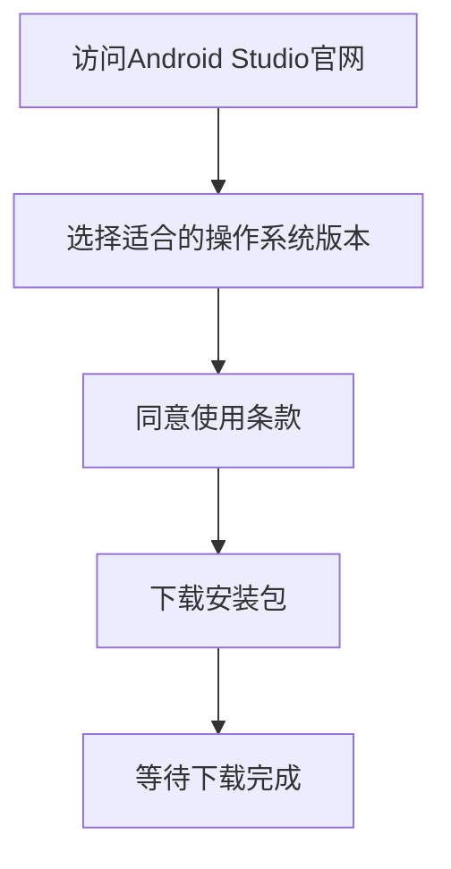
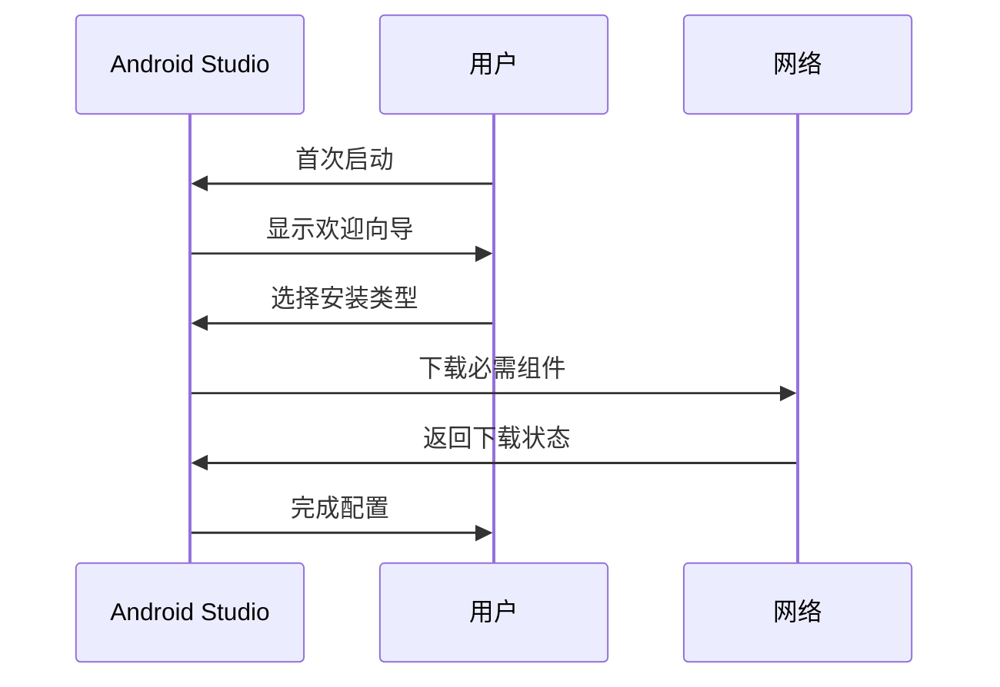
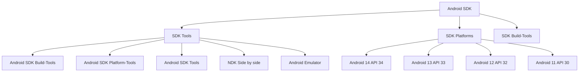
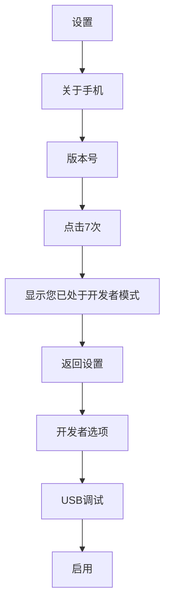

# 第1章：Android开发环境搭建

## 📖 章节概述

本章将详细介绍如何搭建完整的Android开发环境，包括Android Studio的安装配置、SDK管理、模拟器创建、真机调试等核心内容。通过本章学习，您将拥有一个功能完善的Android开发环境，为后续的开发工作奠定坚实基础。

## 🎯 学习目标

- 掌握Android Studio的下载、安装和配置方法
- 理解Android SDK的组成和管理方式
- 学会创建和管理Android虚拟设备(AVD)
- 掌握真机调试的配置和连接方法
- 了解常用的开发插件和工具推荐
- 能够独立排查和解决常见的环境配置问题

## 📋 环境要求

### 系统要求

| 操作系统 | 最低要求 | 推荐配置 |
|---------|---------|---------|
| Windows | Windows 10 (64位) | Windows 11 (64位) |
| macOS | macOS 10.15 (Catalina) | macOS 12.0+ |
| Linux | 64位发行版 | Ubuntu 20.04+ |

### 硬件要求

- **内存(RAM)**：最低8GB，推荐16GB以上
- **存储空间**：至少20GB可用空间
- **处理器**：支持64位的CPU，推荐多核处理器
- **网络**：稳定的互联网连接（用于下载SDK和依赖）

### 软件要求

- **Java Development Kit (JDK)**：JDK 11或更高版本
- **Android Studio**：最新稳定版本
- **Android SDK**：Android 13 (API 33)及以上平台

## 🔧 安装步骤详解

### 1. 下载Android Studio

Android Studio是Google官方推荐的Android开发IDE，基于IntelliJ IDEA构建，提供了完整的开发工具链。



**官方下载地址**：https://developer.android.com/studio

### 2. 安装Android Studio

#### Windows系统安装

1. 运行下载的`.exe`安装文件
2. 选择安装路径（建议不使用中文路径）
3. 选择需要安装的组件：
   - **Android Studio**：主程序
   - **Android Virtual Device (AVD)**：虚拟设备
   - **Android SDK**：软件开发工具包
   - **Performance (Intel® HAXM)**：硬件加速（Intel处理器）

4. 配置开始菜单文件夹
5. 完成安装并启动Android Studio

#### macOS系统安装

1. 打开下载的`.dmg`文件
2. 将Android Studio拖拽到Applications文件夹
3. 从Launchpad或Applications文件夹启动Android Studio

#### Linux系统安装

```bash
# 解压下载的zip文件
unzip android-studio-ide-*.zip

# 移动到opt目录
sudo mv android-studio /opt/

# 创建启动脚本
sudo ln -sf /opt/android-studio/bin/studio.sh /usr/local/bin/android-studio
```

### 3. 首次启动配置

启动Android Studio后，会进入初始化向导：



#### 安装类型选择

1. **Standard（标准安装）**
   - 自动下载最新的Android SDK
   - 配置推荐的Android虚拟设备
   - 适合初学者和大多数开发者

2. **Custom（自定义安装）**
   - 手动选择SDK版本和组件
   - 自定义虚拟设备配置
   - 适合有特定需求的开发者

#### 主题和UI设置

- **Darcula**：深色主题，适合长时间编程
- **IntelliJ Light**：浅色主题，适合明亮环境

## 📱 Android SDK配置

### SDK Manager详解

SDK Manager是管理Android软件开发工具包的核心工具，包含以下主要组件：



### 推荐SDK配置

#### 必需组件

1. **Android SDK Platform-Tools**
   - 包含adb、fastboot等重要工具
   - 用于设备通信和调试

2. **Android SDK Build-Tools**
   - 包含构建应用所需的工具
   - 建议安装多个版本以兼容不同项目

3. **Android Emulator**
   - 用于创建和管理虚拟设备
   - 支持多种Android版本和设备配置

#### 推荐平台版本

- **Android 14 (API 34)**：最新版本，用于测试新特性
- **Android 13 (API 33)**：当前主流版本
- **Android 11 (API 30)**：广泛应用版本

### SDK环境变量配置

在开发过程中，有时需要手动配置环境变量：

#### Windows系统

```cmd
# 设置ANDROID_HOME环境变量
setx ANDROID_HOME "C:\Users\YourName\AppData\Local\Android\Sdk"

# 添加到Path环境变量
setx Path "%Path%;%ANDROID_HOME%\platform-tools"
setx Path "%Path%;%ANDROID_HOME%\tools"
```

#### macOS/Linux系统

```bash
# 编辑shell配置文件
nano ~/.zshrc  # 或 ~/.bashrc

# 添加以下内容
export ANDROID_HOME=$HOME/Library/Android/sdk
export PATH=$PATH:$ANDROID_HOME/emulator
export PATH=$PATH:$ANDROID_HOME/tools
export PATH=$PATH:$ANDROID_HOME/tools/bin
export PATH=$PATH:$ANDROID_HOME/platform-tools

# 重新加载配置
source ~/.zshrc
```

## 🖥️ Android虚拟设备(AVD)创建

### AVD Manager使用

AVD Manager是创建和管理Android虚拟设备的工具：


### 硬件配置选择

| 设备类型 | 屏幕尺寸 | 分辨率 | 推荐用途 |
|---------|---------|--------|---------|
| Phone | 5.0-7.0英寸 | 1080p-4K | 通用应用开发 |
| Tablet | 8.0-12.9英寸 | 1080p-4K | 平板适配开发 |
| Wear OS | 1.2-1.4英寸 | 圆形/方形 | 可穿戴设备开发 |
| TV | 1920x1080+ | 大屏幕 | 电视应用开发 |
| Automotive | 各种尺寸 | 各种分辨率 | 车载系统开发 |

### 系统镜像下载

根据开发需求选择合适的系统镜像：

- **Google APIs**：包含Google Play服务API
- **Google Play**：完整的Google Play商店环境
- **Android TV**：电视系统镜像
- **Wear OS**：可穿戴设备系统镜像

### 高级AVD配置

#### 启用硬件加速

```xml
<!-- 在config.ini文件中配置 -->
hw.gpu.enabled = yes
hw.gpu.mode = auto
```

#### 自定义设备配置

可以通过编辑`config.ini`文件来自定义设备属性：

```ini
# 基本配置
hw.lcd.density = 420
hw.lcd.height = 1920
hw.lcd.width = 1080
hw.ramSize = 4096

# 网络配置
hw.camera.back = emulated
hw.camera.front = emulated
hw.gps = yes

# 性能配置
vm.heapSize = 256
hw.cpu.ncore = 4
```

## 📱 真机调试配置

### 开发者选项启用

#### 启用步骤

1. 打开设备**设置**
2. 进入**关于手机**
3. 连续点击**版本号**7次
4. 返回设置主页面，找到**开发者选项**
5. 启用**USB调试**选项



### USB驱动安装

#### Windows系统

1. 连接Android设备到电脑
2. 设备管理器中识别设备
3. 右键选择**更新驱动程序**
4. 浏览到Android SDK的`extras\google\usb_driver`目录
5. 安装驱动程序

#### macOS/Linux系统

通常无需额外安装驱动，系统会自动识别设备。

### 设备连接验证

#### adb命令验证

```bash
# 检查设备连接状态
adb devices

# 输出示例
List of devices attached
emulator-5554	device
1234567890abcdef	device
```

#### Android Studio设备检测

1. 打开Android Studio
2. 查看工具栏的设备选择器
3. 确认目标设备已显示在列表中

## 🛠️ 开发环境优化

### 性能优化设置

#### IDE性能调优

在`studio.exe.vmoptions`文件中配置JVM参数：

```ini
# 内存配置
-Xms2048m
-Xmx4096m
-XX:ReservedCodeCacheSize=1024m

# 垃圾回收优化
-XX:+UseG1GC
-XX:MaxGCPauseMillis=100

# 编译优化
-XX:+UseStringDeduplication
-XX:+UseCompressedOops
```

#### 模拟器性能优化

1. **启用硬件加速**
   - Intel处理器：Intel HAXM
   - AMD处理器：AMD Hyper-V

2. **内存和存储配置**
   ```xml
   <!-- 在AVD配置中 -->
   hw.ramSize = 4096
   hw.disk.cacheSize = 1024
   ```

3. **图形渲染设置**
   - 选择**硬件 - GLES 2.0**选项
   - 启用**使用主机GPU**选项

### 必备插件推荐

#### 开发效率插件

1. **Key Promoter X**
   - 显示鼠标操作的快捷键
   - 帮助学习IDE快捷方式

2. **Rainbow Brackets**
   - 为代码括号添加不同颜色
   - 提高代码可读性

3. **GitToolBox**
   - 增强Git集成功能
   - 显示文件状态和分支信息

#### 代码质量插件

1. **SonarLint**
   - 实时代码质量检查
   - 提供优化建议

2. **CheckStyle-IDEA**
   - 代码风格检查
   - 支持自定义规则

#### UI设计插件

1. **Android Drawable Preview**
   - 预览drawable资源文件
   - 支持多种屏幕尺寸

2. **Material Theme Icons**
   - 更新UI图标为Material Design风格

### 代码模板配置

#### 自定义Live Templates

1. 打开**设置 → Editor → Live Templates**
2. 创建新的模板组
3. 添加常用代码模板

示例模板：

```java
// Log.d模板
private static final String TAG = "$CLASS_NAME$";
Log.d(TAG, "$MESSAGE$");

//findViewById模板
$TYPE$ $VAR$ = findViewById($RES_ID$);
```

## 🔍 常见问题排查

### 安装问题

#### 1. 下载速度慢

**问题**：SDK下载速度缓慢或失败

**解决方案**：
```bash
# 配置HTTP代理
# 在gradle.properties中添加
systemProp.http.proxyHost=mirrors.neusoft.edu.cn
systemProp.http.proxyPort=80
systemProp.https.proxyHost=mirrors.neusoft.edu.cn
systemProp.https.proxyPort=80
```

#### 2. HAXM安装失败

**问题**：Intel HAXM无法安装或工作

**解决方案**：
```bash
# 手动安装HAXM
cd %ANDROID_HOME%\extras\intel\Hardware_Accelerated_Execution_Manager
intelhaxm-android.exe
```

#### 3. JDK版本冲突

**问题**：系统存在多个JDK版本导致冲突

**解决方案**：
```bash
# 检查当前JDK版本
java -version
javac -version

# 设置JAVA_HOME环境变量
export JAVA_HOME=/path/to/jdk-11
```

### 运行问题

#### 1. 模拟器启动缓慢

**问题**：AVD启动时间过长

**解决方案**：
- 启用BIOS中的虚拟化技术
- 使用x86系统镜像而非ARM
- 增加AVD内存配置

#### 2. ADB连接失败

**问题**：adb devices命令无响应

**解决方案**：
```bash
# 重启ADB服务
adb kill-server
adb start-server

# 检查端口占用
netstat -ano | findstr :5037
```

#### 3. Gradle同步失败

**问题**：项目Gradle同步失败

**解决方案**：
```gradle
// 在build.gradle中配置国内镜像
repositories {
    maven { url 'https://maven.aliyun.com/repository/google' }
    maven { url 'https://maven.aliyun.com/repository/public' }
    google()
    mavenCentral()
}
```

## 📊 环境验证清单

### 基础环境检查

- [ ] Android Studio成功安装并启动
- [ ] JDK版本符合要求（JDK 11+）
- [ ] Android SDK下载完成
- [ ] 必需的SDK组件已安装
- [ ] 环境变量配置正确

### 开发工具检查

- [ ] ADB命令可用
- [ ] AVD Manager正常工作
- [ ] 至少创建了一个可用的虚拟设备
- [ ] 真机USB调试已启用
- [ ] 设备驱动安装完成

### 性能优化检查

- [ ] IDE内存配置合理
- [ ] 硬件加速已启用
- [ ] 必要插件已安装
- [ ] 代码模板已配置
- [ ] 网络代理设置正确

## 🎯 小结

本章详细介绍了Android开发环境的搭建过程，包括：

1. **环境准备**：了解系统要求和硬件配置
2. **安装配置**：Android Studio安装和初始配置
3. **SDK管理**：Android SDK的下载和管理
4. **设备配置**：模拟器和真机的调试配置
5. **环境优化**：性能调优和插件推荐
6. **问题排查**：常见问题的诊断和解决

通过本章学习，您应该能够：
- 独立完成Android开发环境的搭建
- 管理Android SDK和相关组件
- 创建和配置Android虚拟设备
- 进行真机调试和开发
- 优化开发环境提高效率
- 解决常见的环境配置问题

下一章将回顾Java语言的核心概念，为Android开发编程奠定基础。

## 📚 延伸阅读

- [Android Studio官方用户指南](https://developer.android.com/studio/intro)
- [Android SDK Manager使用文档](https://developer.android.com/studio/releases/sdk-tools)
- [ADB命令行工具指南](https://developer.android.com/studio/command-line/adb)
- [Gradle构建系统文档](https://developer.android.com/studio/build)