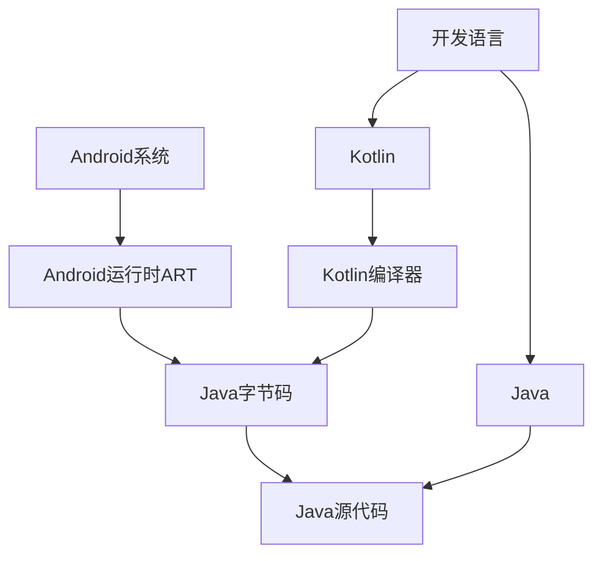
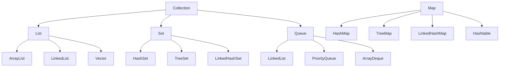
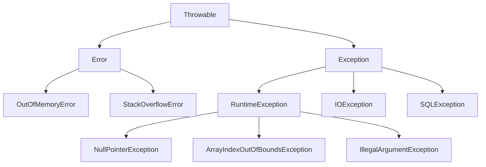

# 第2章：Java语言基础回顾

## 📖 章节概述

本章将系统回顾Java语言的核心概念和特性，重点讲解在Android开发中常用的Java语法和编程模式。通过本章学习，您将巩固Java编程基础，为后续Android应用开发做好准备。

## 🎯 学习目标

- 掌握Java基础语法和数据类型
- 理解面向对象编程的核心概念
- 熟练使用Java集合框架
- 掌握异常处理机制
- 了解Java 8+新特性在Android中的应用
- 能够编写结构清晰、性能良好的Java代码

## 🏗️ Java语言体系结构

### Java在Android中的地位



Java作为Android开发的传统语言，具有以下优势：
- **成熟稳定**：拥有20多年的发展历史
- **生态丰富**：海量的开源库和工具
- **跨平台**：一次编写，到处运行
- **性能优秀**：经过ART优化的JIT编译

## 🔤 Java基础语法

### 数据类型和变量

#### 基本数据类型

```java
public class DataTypeDemo {
    // 整数类型
    byte    byteVar = 127;           // 8位，-128到127
    short   shortVar = 32767;        // 16位，-32768到32767
    int     intVar = 2147483647;     // 32位，常用整数类型
    long    longVar = 9223372036854775807L; // 64位，注意L后缀

    // 浮点类型
    float   floatVar = 3.14f;        // 32位，注意f后缀
    double  doubleVar = 3.141592653589793; // 64位，默认浮点类型

    // 字符和布尔类型
    char    charVar = 'A';           // 16位Unicode字符
    boolean boolVar = true;          // 布尔值，true或false
}
```

#### 引用数据类型

```java
public class ReferenceTypeDemo {
    // 字符串类型（不可变）
    String str1 = "Hello Android";
    String str2 = new String("Hello Android");

    // 数组类型
    int[] intArray = {1, 2, 3, 4, 5};
    String[] stringArray = new String[10];

    // 自定义类对象
    MyClass myObject = new MyClass();

    // 集合类型
    List<String> list = new ArrayList<>();
    Map<String, Integer> map = new HashMap<>();
}
```

#### 变量命名规范

```java
public class NamingConvention {
    // 类名：大驼峰命名法
    public class AndroidActivity {
        // 常量：全大写，下划线分隔
        private static final int MAX_RETRY_COUNT = 3;
        private static final String DEFAULT_URL = "https://api.example.com";

        // 成员变量：小驼峰命名法
        private String userName;
        private int userAge;
        private boolean isCompleted;

        // 方法名：小驼峰命名法，动词开头
        public void setUserName(String name) {
            this.userName = name;
        }

        public String getUserName() {
            return userName;
        }

        public boolean isValidUser() {
            return userName != null && !userName.isEmpty();
        }
    }
}
```

### 运算符和表达式

#### 算术运算符

```java
public class ArithmeticOperators {
    public static void main(String[] args) {
        int a = 10, b = 3;

        // 基本算术运算
        int sum = a + b;        // 13，加法
        int diff = a - b;       // 7，减法
        int product = a * b;    // 30，乘法
        int quotient = a / b;   // 3，整数除法
        int remainder = a % b;  // 1，取余

        // 自增自减
        int x = 5;
        int y = ++x;  // x先增1，再赋值给y，x=6, y=6
        int z = x++;  // 先赋值给z，再增1，x=7, z=6

        // 类型转换
        double result = (double) a / b;  // 3.333...
    }
}
```

#### 关系和逻辑运算符

```java
public class LogicalOperators {
    public static void main(String[] args) {
        int age = 25;
        boolean hasLicense = true;
        boolean hasCar = false;

        // 关系运算符
        boolean isAdult = age >= 18;           // true
        boolean isTeenager = age < 20;          // false
        boolean ageEquals25 = age == 25;        // true

        // 逻辑运算符
        boolean canDrive = isAdult && hasLicense;  // true，逻辑与
        boolean canBuyCar = hasLicense || hasCar;   // true，逻辑或
        boolean cannotDrive = !isAdult;             // false，逻辑非

        // 短路求值
        String userName = null;
        boolean isValid = userName != null && userName.length() > 0; // 安全检查
    }
}
```

## 🏛️ 面向对象编程

### 类和对象

#### 类的定义

```java
/**
 * 用户实体类
 * 演示类的基本结构和成员
 */
public class User {
    // 私有成员变量
    private long id;
    private String username;
    private String email;
    private int age;

    // 静态变量（类变量）
    private static long nextId = 1;
    public static final int MIN_AGE = 0;
    public static final int MAX_AGE = 150;

    // 构造方法
    public User() {
        this.id = nextId++;
    }

    public User(String username, String email, int age) {
        this.id = nextId++;
        this.username = username;
        this.email = email;
        this.age = age;
    }

    // Getter和Setter方法
    public long getId() {
        return id;
    }

    public String getUsername() {
        return username;
    }

    public void setUsername(String username) {
        this.username = username;
    }

    public String getEmail() {
        return email;
    }

    public void setEmail(String email) {
        this.email = email;
    }

    public int getAge() {
        return age;
    }

    public void setAge(int age) {
        if (age >= MIN_AGE && age <= MAX_AGE) {
            this.age = age;
        } else {
            throw new IllegalArgumentException("年龄必须在" + MIN_AGE + "到" + MAX_AGE + "之间");
        }
    }

    // 实例方法
    public void printInfo() {
        System.out.println("用户ID: " + id);
        System.out.println("用户名: " + username);
        System.out.println("邮箱: " + email);
        System.out.println("年龄: " + age);
    }

    // 静态方法
    public static long getNextId() {
        return nextId;
    }

    // 重写toString方法
    @Override
    public String toString() {
        return "User{id=" + id + ", username='" + username + "', email='" + email + "', age=" + age + "}";
    }

    // 重写equals方法
    @Override
    public boolean equals(Object obj) {
        if (this == obj) return true;
        if (obj == null || getClass() != obj.getClass()) return false;
        User user = (User) obj;
        return id == user.id;
    }

    // 重写hashCode方法
    @Override
    public int hashCode() {
        return Long.hashCode(id);
    }
}
```

### 封装、继承和多态

#### 继承关系

```java
// 基类：动物
public class Animal {
    protected String name;
    protected int age;

    public Animal(String name, int age) {
        this.name = name;
        this.age = age;
    }

    public void eat() {
        System.out.println(name + "正在吃东西");
    }

    public void sleep() {
        System.out.println(name + "正在睡觉");
    }

    // 虚方法，子类可以重写
    public void makeSound() {
        System.out.println(name + "发出了声音");
    }

    public String getInfo() {
        return "动物[name=" + name + ", age=" + age + "]";
    }
}

// 子类：狗
public class Dog extends Animal {
    private String breed; // 品种

    public Dog(String name, int age, String breed) {
        super(name, age); // 调用父类构造方法
        this.breed = breed;
    }

    // 重写父类方法
    @Override
    public void makeSound() {
        System.out.println(name + "汪汪叫");
    }

    // 新增方法
    public void wagTail() {
        System.out.println(name + "摇尾巴");
    }

    @Override
    public String getInfo() {
        return super.getInfo() + ", breed=" + breed;
    }
}

// 子类：猫
public class Cat extends Animal {
    private boolean isIndoor;

    public Cat(String name, int age, boolean isIndoor) {
        super(name, age);
        this.isIndoor = isIndoor;
    }

    @Override
    public void makeSound() {
        System.out.println(name + "喵喵叫");
    }

    public void climb() {
        System.out.println(name + "爬树");
    }

    @Override
    public String getInfo() {
        return super.getInfo() + ", isIndoor=" + isIndoor;
    }
}
```

#### 多态示例

```java
public class PolymorphismDemo {
    public static void main(String[] args) {
        // 多态：父类引用指向子类对象
        Animal[] animals = {
            new Dog("小黑", 3, "拉布拉多"),
            new Cat("小白", 2, true),
            new Dog("大黄", 5, "金毛")
        };

        // 统一处理，体现多态
        for (Animal animal : animals) {
            System.out.println(animal.getInfo());
            animal.makeSound(); // 根据实际对象调用相应方法

            // 类型判断和方法调用
            if (animal instanceof Dog) {
                Dog dog = (Dog) animal;
                dog.wagTail();
            } else if (animal instanceof Cat) {
                Cat cat = (Cat) animal;
                cat.climb();
            }
            System.out.println("---");
        }
    }
}
```

### 接口和抽象类

#### 接口定义

```java
// 可飞行接口
public interface Flyable {
    // 常量
    double MAX_ALTITUDE = 10000.0;

    // 抽象方法
    void fly();
    void land();

    // 默认方法（Java 8+）
    default void takeOff() {
        System.out.println("准备起飞...");
        fly();
    }

    // 静态方法（Java 8+）
    static void printFlightRules() {
        System.out.println("飞行规则：最高高度" + MAX_ALTITUDE + "米");
    }
}

// 可游泳接口
public interface Swimmable {
    void swim();
    void dive();
}

// 实现多个接口的类
public class Duck extends Animal implements Flyable, Swimmable {

    public Duck(String name, int age) {
        super(name, age);
    }

    @Override
    public void makeSound() {
        System.out.println(name + "嘎嘎叫");
    }

    @Override
    public void fly() {
        System.out.println(name + "在空中飞行");
    }

    @Override
    public void land() {
        System.out.println(name + "降落");
    }

    @Override
    public void swim() {
        System.out.println(name + "在水中游泳");
    }

    @Override
    public void dive() {
        System.out.println(name + "潜入水中");
    }
}
```

#### 抽象类

```java
// 抽象基类：图形
public abstract class Shape {
    protected String color;

    public Shape(String color) {
        this.color = color;
    }

    // 具体方法
    public void setColor(String color) {
        this.color = color;
    }

    public String getColor() {
        return color;
    }

    // 抽象方法，子类必须实现
    public abstract double getArea();
    public abstract double getPerimeter();

    // 模板方法
    public void printInfo() {
        System.out.println("图形颜色: " + color);
        System.out.println("面积: " + getArea());
        System.out.println("周长: " + getPerimeter());
    }
}

// 具体子类：圆形
public class Circle extends Shape {
    private double radius;

    public Circle(String color, double radius) {
        super(color);
        this.radius = radius;
    }

    @Override
    public double getArea() {
        return Math.PI * radius * radius;
    }

    @Override
    public double getPerimeter() {
        return 2 * Math.PI * radius;
    }
}
```

## 📦 集合框架

### 集合体系结构



### List集合

```java
import java.util.*;

public class ListDemo {
    public static void main(String[] args) {
        // ArrayList: 动态数组，查询快，增删慢
        List<String> arrayList = new ArrayList<>();
        arrayList.add("Apple");
        arrayList.add("Banana");
        arrayList.add("Orange");
        arrayList.add(1, "Grape"); // 在指定位置插入

        System.out.println("ArrayList: " + arrayList);
        System.out.println("元素个数: " + arrayList.size());
        System.out.println("第2个元素: " + arrayList.get(1));

        // LinkedList: 双向链表，增删快，查询慢
        List<Integer> linkedList = new LinkedList<>();
        linkedList.add(10);
        linkedList.add(20);
        linkedList.add(30);

        // 遍历List的多种方式
        System.out.println("\n遍历方式:");

        // 1. 传统for循环
        System.out.println("1. for循环:");
        for (int i = 0; i < arrayList.size(); i++) {
            System.out.println(arrayList.get(i));
        }

        // 2. 增强for循环
        System.out.println("2. 增强for循环:");
        for (String fruit : arrayList) {
            System.out.println(fruit);
        }

        // 3. Iterator迭代器
        System.out.println("3. Iterator:");
        Iterator<String> iterator = arrayList.iterator();
        while (iterator.hasNext()) {
            System.out.println(iterator.next());
        }

        // 4. Lambda表达式（Java 8+）
        System.out.println("4. Lambda表达式:");
        arrayList.forEach(System.out::println);

        // List常用操作
        Collections.sort(arrayList); // 排序
        Collections.reverse(arrayList); // 反转
        Collections.shuffle(arrayList); // 随机打乱

        System.out.println("排序后: " + arrayList);
    }
}
```

### Set集合

```java
import java.util.*;

public class SetDemo {
    public static void main(String[] args) {
        // HashSet: 无序，不重复，查询快
        Set<String> hashSet = new HashSet<>();
        hashSet.add("Java");
        hashSet.add("Python");
        hashSet.add("JavaScript");
        hashSet.add("Java"); // 重复元素不会被添加

        System.out.println("HashSet: " + hashSet);

        // TreeSet: 有序（自然排序），不重复
        Set<Integer> treeSet = new TreeSet<>();
        treeSet.add(30);
        treeSet.add(10);
        treeSet.add(20);
        treeSet.add(30); // 重复元素

        System.out.println("TreeSet: " + treeSet); // 自动排序：[10, 20, 30]

        // LinkedHashSet: 插入顺序，不重复
        Set<String> linkedHashSet = new LinkedHashSet<>();
        linkedHashSet.add("First");
        linkedHashSet.add("Second");
        linkedHashSet.add("Third");

        System.out.println("LinkedHashSet: " + linkedHashSet);

        // Set常用操作
        Set<Integer> set1 = new HashSet<>(Arrays.asList(1, 2, 3, 4, 5));
        Set<Integer> set2 = new HashSet<>(Arrays.asList(4, 5, 6, 7, 8));

        // 并集
        Set<Integer> union = new HashSet<>(set1);
        union.addAll(set2);
        System.out.println("并集: " + union);

        // 交集
        Set<Integer> intersection = new HashSet<>(set1);
        intersection.retainAll(set2);
        System.out.println("交集: " + intersection);

        // 差集
        Set<Integer> difference = new HashSet<>(set1);
        difference.removeAll(set2);
        System.out.println("差集: " + difference);
    }
}
```

### Map集合

```java
import java.util.*;

public class MapDemo {
    public static void main(String[] args) {
        // HashMap: 键值对，无序，键不能重复
        Map<String, Integer> hashMap = new HashMap<>();
        hashMap.put("张三", 25);
        hashMap.put("李四", 30);
        hashMap.put("王五", 28);
        hashMap.put("张三", 26); // 覆盖之前的值

        System.out.println("HashMap: " + hashMap);

        // 基本操作
        System.out.println("张三的年龄: " + hashMap.get("张三"));
        System.out.println("是否包含李四: " + hashMap.containsKey("李四"));
        System.out.println("键的集合: " + hashMap.keySet());
        System.out.println("值的集合: " + hashMap.values());
        System.out.println("键值对集合: " + hashMap.entrySet());

        // 遍历Map的多种方式
        System.out.println("\n遍历Map:");

        // 1. 遍历键
        System.out.println("1. 遍历键:");
        for (String key : hashMap.keySet()) {
            System.out.println(key + ": " + hashMap.get(key));
        }

        // 2. 遍历键值对
        System.out.println("2. 遍历键值对:");
        for (Map.Entry<String, Integer> entry : hashMap.entrySet()) {
            System.out.println(entry.getKey() + ": " + entry.getValue());
        }

        // 3. Lambda表达式（Java 8+）
        System.out.println("3. Lambda表达式:");
        hashMap.forEach((key, value) -> System.out.println(key + ": " + value));

        // TreeMap: 按键排序
        Map<String, String> treeMap = new TreeMap<>();
        treeMap.put("Orange", "橙色");
        treeMap.put("Apple", "红色");
        treeMap.put("Banana", "黄色");

        System.out.println("\nTreeMap: " + treeMap); // 按键排序

        // LinkedHashMap: 保持插入顺序
        Map<Integer, String> linkedHashMap = new LinkedHashMap<>();
        linkedHashMap.put(3, "Three");
        linkedHashMap.put(1, "One");
        linkedHashMap.put(2, "Two");

        System.out.println("LinkedHashMap: " + linkedHashMap); // 保持插入顺序
    }
}
```

## ⚠️ 异常处理

### 异常体系结构



### 异常处理机制

```java
import java.io.*;
import java.util.Scanner;

public class ExceptionHandling {

    // try-catch-finally示例
    public static void divideNumbers() {
        Scanner scanner = new Scanner(System.in);

        try {
            System.out.print("请输入被除数: ");
            int dividend = scanner.nextInt();

            System.out.print("请输入除数: ");
            int divisor = scanner.nextInt();

            int result = dividend / divisor;
            System.out.println("结果: " + result);

        } catch (InputMismatchException e) {
            System.out.println("输入错误，请输入整数");
        } catch (ArithmeticException e) {
            System.out.println("算术异常：除数不能为零");
        } catch (Exception e) {
            System.out.println("发生异常: " + e.getMessage());
        } finally {
            scanner.close(); // 确保资源被释放
            System.out.println("程序结束");
        }
    }

    // 自定义异常
    public static class InvalidAgeException extends Exception {
        public InvalidAgeException(String message) {
            super(message);
        }
    }

    // 抛出异常的示例
    public static void setAge(int age) throws InvalidAgeException {
        if (age < 0 || age > 150) {
            throw new InvalidAgeException("年龄必须在0到150之间");
        }
        System.out.println("年龄设置成功: " + age);
    }

    // try-with-resources示例（Java 7+）
    public static void readFile(String fileName) {
        try (FileInputStream fis = new FileInputStream(fileName);
             BufferedReader reader = new BufferedReader(new InputStreamReader(fis))) {

            String line;
            while ((line = reader.readLine()) != null) {
                System.out.println(line);
            }

        } catch (FileNotFoundException e) {
            System.out.println("文件未找到: " + fileName);
        } catch (IOException e) {
            System.out.println("读取文件时发生错误: " + e.getMessage());
        }
        // 自动关闭资源，无需手动close
    }

    // 多异常捕获（Java 7+）
    public static void handleMultipleExceptions() {
        try {
            // 可能抛出多种异常的代码
            String str = null;
            int length = str.length(); // NullPointerException
            int[] array = new int[5];
            int value = array[10]; // ArrayIndexOutOfBoundsException

        } catch (NullPointerException | ArrayIndexOutOfBoundsException e) {
            System.out.println("空指针或数组越界异常: " + e.getMessage());
        }
    }

    public static void main(String[] args) {
        divideNumbers();

        try {
            setAge(-5);
        } catch (InvalidAgeException e) {
            System.out.println("自定义异常: " + e.getMessage());
        }

        handleMultipleExceptions();
    }
}
```

## 🚀 Java 8+ 新特性

### Lambda表达式

```java
import java.util.*;
import java.util.function.*;

public class LambdaExpressions {

    // 传统方式实现接口
    public static void traditionalApproach() {
        Runnable runnable = new Runnable() {
            @Override
            public void run() {
                System.out.println("传统方式创建线程");
            }
        };
        new Thread(runnable).start();
    }

    // Lambda方式实现接口
    public static void lambdaApproach() {
        Runnable runnable = () -> System.out.println("Lambda方式创建线程");
        new Thread(runnable).start();

        // 更简洁的写法
        new Thread(() -> System.out.println("更简洁的Lambda")).start();
    }

    // 自定义函数式接口
    @FunctionalInterface
    interface MathOperation {
        int operation(int a, int b);
    }

    public static void functionalInterface() {
        // 加法
        MathOperation addition = (a, b) -> a + b;
        System.out.println("5 + 3 = " + addition.operation(5, 3));

        // 乘法
        MathOperation multiplication = (a, b) -> a * b;
        System.out.println("5 * 3 = " + multiplication.operation(5, 3));
    }

    // 集合操作中的Lambda
    public static void collectionWithLambda() {
        List<String> names = Arrays.asList("张三", "李四", "王五", "赵六", "钱七");

        // 传统排序
        Collections.sort(names, new Comparator<String>() {
            @Override
            public int compare(String a, String b) {
                return a.compareTo(b);
            }
        });

        // Lambda排序
        Collections.sort(names, (a, b) -> a.compareTo(b));

        // 更简洁的方法引用
        Collections.sort(names, String::compareTo);

        // 遍历
        names.forEach(name -> System.out.println(name));
        names.forEach(System.out::println);

        // 过滤
        names.stream()
             .filter(name -> name.startsWith("张"))
             .forEach(System.out::println);
    }

    // 内置函数式接口
    public static void builtInFunctionalInterfaces() {
        // Predicate<T>: 断言型接口
        Predicate<Integer> isPositive = x -> x > 0;
        System.out.println("5是正数: " + isPositive.test(5));
        System.out.println("-3是正数: " + isPositive.test(-3));

        // Consumer<T>: 消费型接口
        Consumer<String> printer = str -> System.out.println("打印: " + str);
        printer.accept("Hello Lambda");

        // Supplier<T>: 供给型接口
        Supplier<Double> randomSupplier = () -> Math.random();
        System.out.println("随机数: " + randomSupplier.get());

        // Function<T, R>: 函数型接口
        Function<String, Integer> stringLength = String::length;
        System.out.println("字符串长度: " + stringLength.apply("Hello World"));

        // UnaryOperator<T>: 一元操作符
        UnaryOperator<Integer> square = x -> x * x;
        System.out.println("5的平方: " + square.apply(5));

        // BinaryOperator<T>: 二元操作符
        BinaryOperator<Integer> add = (a, b) -> a + b;
        System.out.println("3 + 7 = " + add.apply(3, 7));
    }

    public static void main(String[] args) {
        traditionalApproach();
        lambdaApproach();
        functionalInterface();
        collectionWithLambda();
        builtInFunctionalInterfaces();
    }
}
```

### Stream API

```java
import java.util.*;
import java.util.stream.*;

public class StreamAPI {

    public static void streamBasics() {
        List<String> names = Arrays.asList("张三", "李四", "王五", "赵六", "钱七", "张三丰");

        // 创建Stream
        Stream<String> stream1 = names.stream(); // 顺序流
        Stream<String> stream2 = names.parallelStream(); // 并行流

        // 中间操作
        System.out.println("过滤以'张'开头的名字:");
        names.stream()
             .filter(name -> name.startsWith("张"))
             .forEach(System.out::println);

        System.out.println("\n转换为大写:");
        names.stream()
             .map(String::toUpperCase)
             .forEach(System.out::println);

        System.out.println("\n去重后:");
        names.stream()
             .distinct()
             .forEach(System.out::println);

        System.out.println("\n限制前3个:");
        names.stream()
             .limit(3)
             .forEach(System.out::println);

        System.out.println("\n跳过前2个:");
        names.stream()
             .skip(2)
             .forEach(System.out::println);

        System.out.println("\n排序:");
        names.stream()
             .sorted()
             .forEach(System.out::println);
    }

    public static void numericStreams() {
        // 数值流
        IntStream intStream = IntStream.range(1, 10); // 1-9
        DoubleStream doubleStream = DoubleStream.of(1.1, 2.2, 3.3, 4.4);
        LongStream longStream = LongStream.rangeClosed(1, 10); // 1-10

        // 数值流操作
        System.out.println("1-9的和: " + IntStream.range(1, 10).sum());
        System.out.println("平均值: " + IntStream.range(1, 10).average().orElse(0));
        System.out.println("最大值: " + IntStream.range(1, 10).max().orElse(0));
        System.out.println("最小值: " + IntStream.range(1, 10).min().orElse(0));
        System.out.println("个数: " + IntStream.range(1, 10).count());

        // 生成随机数
        Random random = new Random();
        random.ints(10, 1, 100) // 生成10个1-99的随机数
              .forEach(System.out::println);
    }

    public static void streamCollectors() {
        List<Person> people = Arrays.asList(
            new Person("张三", 25, "北京"),
            new Person("李四", 30, "上海"),
            new Person("王五", 25, "北京"),
            new Person("赵六", 35, "广州"),
            new Person("钱七", 30, "上海")
        );

        // 收集到List
        List<String> names = people.stream()
                                  .map(Person::getName)
                                  .collect(Collectors.toList());
        System.out.println("姓名列表: " + names);

        // 收集到Set
        Set<Integer> ages = people.stream()
                                .map(Person::getAge)
                                .collect(Collectors.toSet());
        System.out.println("年龄集合: " + ages);

        // 按城市分组
        Map<String, List<Person>> byCity = people.stream()
                                                .collect(Collectors.groupingBy(Person::getCity));
        System.out.println("按城市分组: " + byCity);

        // 按年龄分组
        Map<Integer, List<Person>> byAge = people.stream()
                                               .collect(Collectors.groupingBy(Person::getAge));
        System.out.println("按年龄分组: " + byAge);

        // 分区（分为两组）
        Map<Boolean, List<Person>> partitionByAge = people.stream()
                                                        .collect(Collectors.partitioningBy(p -> p.getAge() >= 30));
        System.out.println("按年龄>=30分区: " + partitionByAge);

        // 字符串连接
        String nameString = people.stream()
                                .map(Person::getName)
                                .collect(Collectors.joining(", ", "[", "]"));
        System.out.println("姓名连接: " + nameString);

        // 统计信息
        IntSummaryStatistics ageStats = people.stream()
                                            .mapToInt(Person::getAge)
                                            .summaryStatistics();
        System.out.println("年龄统计: " + ageStats);
    }

    static class Person {
        private String name;
        private int age;
        private String city;

        public Person(String name, int age, String city) {
            this.name = name;
            this.age = age;
            this.city = city;
        }

        // Getters
        public String getName() { return name; }
        public int getAge() { return age; }
        public String getCity() { return city; }

        @Override
        public String toString() {
            return String.format("%s(%d,%s)", name, age, city);
        }
    }

    public static void main(String[] args) {
        streamBasics();
        System.out.println("\n=== 数值流 ===");
        numericStreams();
        System.out.println("\n=== 收集器 ===");
        streamCollectors();
    }
}
```

### Optional类

```java
import java.util.*;

public class OptionalDemo {

    public static void optionalBasics() {
        // 创建Optional
        Optional<String> optional1 = Optional.of("Hello"); // 非空
        Optional<String> optional2 = Optional.ofNullable(null); // 可空
        Optional<String> optional3 = Optional.empty(); // 空

        // 检查值是否存在
        System.out.println("optional1有值: " + optional1.isPresent());
        System.out.println("optional2有值: " + optional2.isPresent());
        System.out.println("optional3有值: " + optional3.isPresent());

        // 获取值
        if (optional1.isPresent()) {
            System.out.println("值: " + optional1.get());
        }

        // orElse提供默认值
        System.out.println("optional2的值或默认值: " + optional2.orElse("默认值"));
        System.out.println("optional3的值或默认值: " + optional3.orElse("默认值"));

        // orElseGet延迟计算
        System.out.println("optional2的值或计算默认值: " +
            optional2.orElseGet(() -> "计算默认值"));

        // orElseThrow抛出异常
        try {
            optional3.orElseThrow(() -> new RuntimeException("值为空"));
        } catch (RuntimeException e) {
            System.out.println("捕获异常: " + e.getMessage());
        }
    }

    public static void optionalOperations() {
        Optional<String> optional = Optional.of("Hello World");

        // map转换
        Optional<Integer> length = optional.map(String::length);
        System.out.println("字符串长度: " + length.orElse(0));

        // flatMap扁平化
        Optional<String> upperCase = optional.flatMap(s ->
            Optional.of(s.toUpperCase()));
        System.out.println("大写: " + upperCase.orElse(""));

        // filter过滤
        Optional<String> filtered = optional.filter(s -> s.contains("World"));
        System.out.println("包含World: " + filtered.orElse("不包含"));

        // ifPresent消费
        optional.ifPresent(System.out::println);
        optional.ifPresentOrElse(
            System.out::println,
            () -> System.out.println("值为空")
        );
    }

    // 实际应用示例
    public static class User {
        private String name;
        private Address address;

        public User(String name, Address address) {
            this.name = name;
            this.address = address;
        }

        public String getName() { return name; }
        public Optional<Address> getAddress() {
            return Optional.ofNullable(address);
        }
    }

    public static class Address {
        private String city;
        private String street;

        public Address(String city, String street) {
            this.city = city;
            this.street = street;
        }

        public String getCity() { return city; }
        public String getStreet() { return street; }
    }

    public static void practicalExample() {
        User user = new User("张三", new Address("北京", "中关村大街"));
        User userWithoutAddress = new User("李四", null);

        // 安全获取城市信息
        String city = user.getAddress()
                         .map(Address::getCity)
                         .orElse("未知城市");
        System.out.println("用户城市: " + city);

        String city2 = userWithoutAddress.getAddress()
                                         .map(Address::getCity)
                                         .orElse("未知城市");
        System.out.println("用户城市2: " + city2);

        // 链式Optional操作
        Optional<String> street = user.getAddress()
                                     .map(Address::getStreet)
                                     .filter(s -> s.contains("大街"));

        System.out.println("街道信息: " + street.orElse("无街道信息"));
    }

    public static void main(String[] args) {
        optionalBasics();
        System.out.println("\n=== Optional操作 ===");
        optionalOperations();
        System.out.println("\n=== 实际应用 ===");
        practicalExample();
    }
}
```

## 📱 Java在Android中的应用

### 常用Android API示例

```java
import android.app.Activity;
import android.os.Bundle;
import android.widget.*;
import android.view.View;
import java.util.*;

public class AndroidJavaExamples extends Activity {

    private ListView listView;
    private ArrayAdapter<String> adapter;
    private List<String> dataList;

    @Override
    protected void onCreate(Bundle savedInstanceState) {
        super.onCreate(savedInstanceState);
        setContentView(R.layout.activity_main);

        listView = findViewById(R.id.listView);

        // 使用集合存储数据
        dataList = new ArrayList<>();
        dataList.add("Android");
        dataList.add("Java");
        dataList.add("Kotlin");

        // 使用Adapter连接数据和UI
        adapter = new ArrayAdapter<>(
            this,
            android.R.layout.simple_list_item_1,
            dataList
        );
        listView.setAdapter(adapter);

        // Lambda表达式设置监听器（API 24+）
        Button addButton = findViewById(R.id.addButton);
        addButton.setOnClickListener(v -> {
            dataList.add("新项目 " + (dataList.size() + 1));
            adapter.notifyDataSetChanged();
        });

        // 传统方式设置监听器
        listView.setOnItemClickListener((parent, view, position, id) -> {
            String item = dataList.get(position);
            Toast.makeText(this, "选择了: " + item, Toast.LENGTH_SHORT).show();
        });
    }

    // 异步任务示例
    private class DataLoadTask extends android.os.AsyncTask<Void, Integer, List<String>> {

        @Override
        protected List<String> doInBackground(Void... voids) {
            List<String> data = new ArrayList<>();

            // 模拟耗时操作
            for (int i = 1; i <= 10; i++) {
                try {
                    Thread.sleep(500);
                    data.add("数据项 " + i);
                    publishProgress(i * 10); // 更新进度
                } catch (InterruptedException e) {
                    e.printStackTrace();
                }
            }

            return data;
        }

        @Override
        protected void onProgressUpdate(Integer... values) {
            ProgressBar progressBar = findViewById(R.id.progressBar);
            progressBar.setProgress(values[0]);
        }

        @Override
        protected void onPostExecute(List<String> result) {
            dataList.addAll(result);
            adapter.notifyDataSetChanged();

            ProgressBar progressBar = findViewById(R.id.progressBar);
            progressBar.setVisibility(View.GONE);
        }
    }
}
```

## 🎯 小结

本章系统回顾了Java语言的核心概念和在Android开发中的应用，主要包括：

### 核心内容总结

1. **基础语法**
   - 数据类型和变量声明
   - 运算符和表达式
   - 控制流程语句

2. **面向对象编程**
   - 类和对象的定义与使用
   - 封装、继承、多态三大特性
   - 接口和抽象类的应用

3. **集合框架**
   - List、Set、Map的使用场景
   - 集合的遍历和操作方法
   - Collections工具类的应用

4. **异常处理**
   - 异常体系结构
   - try-catch-finally机制
   - 自定义异常和异常链

5. **Java 8+新特性**
   - Lambda表达式和函数式编程
   - Stream API数据处理
   - Optional空值处理

6. **Android应用**
   - Java在Android开发中的实际应用
   - 常用Android API的Java实现
   - 异步任务和事件处理

### 学习要点

- 掌握Java语法基础是Android开发的前提
- 面向对象思想是理解Android框架的关键
- 集合框架是数据处理的重要工具
- 异常处理确保应用的稳定性
- Java 8+新特性提高开发效率
- 实际练习巩固理论知识

下一章将介绍如何创建第一个Android应用，将Java知识应用到实际开发中。

## 📚 延伸阅读

- [Oracle Java官方文档](https://docs.oracle.com/en/java/)
- [Java 8官方教程](https://docs.oracle.com/javase/tutorial/java8TOC.html)
- [Effective Java中文版](https://book.douban.com/subject/30412517/)
- [Android开发者Java指南](https://developer.android.com/guide/topics/oop)