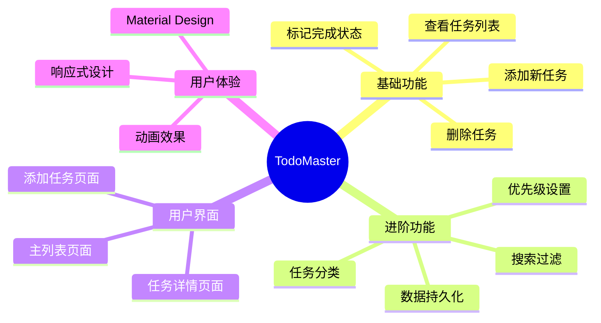
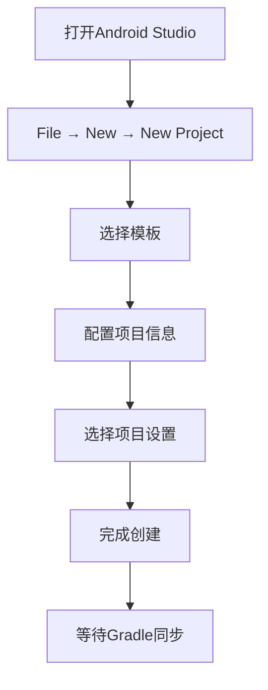
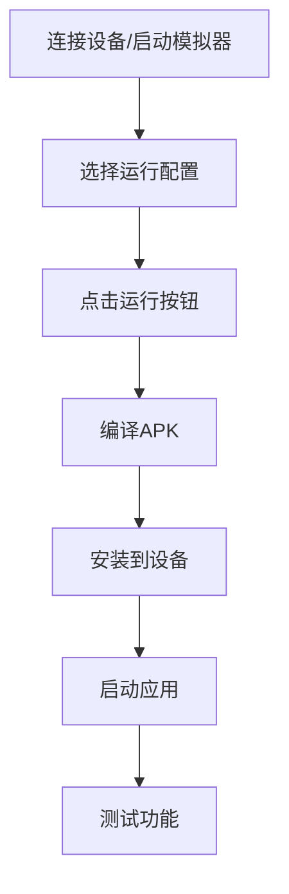

# 第3章：创建第一个Android应用

## 📖 章节概述

本章将带领您从零开始创建第一个完整的Android应用，通过实际项目学习Android开发的核心流程。我们将创建一个功能丰富的待办事项应用，涵盖UI设计、事件处理、数据持久化等关键概念。

## 🎯 学习目标

- 掌握Android项目的创建和配置方法
- 理解Android应用的基本架构和组件
- 学会使用XML布局文件设计用户界面
- 掌握Activity的生命周期和事件处理
- 了解Android应用的打包和发布流程
- 能够独立创建并运行一个简单的Android应用

## 🏗️ 项目规划

### 应用功能设计

我们将创建一个**待办事项管理应用(TodoMaster)**，具备以下功能：



### 技术栈选择

- **开发语言**：Java
- **最低SDK版本**：API 21 (Android 5.0)
- **目标SDK版本**：API 34 (Android 14)
- **架构模式**：MVP (Model-View-Presenter)
- **数据存储**：SharedPreferences + 文件存储
- **UI框架**：原生Android Views + Material Design

## 🚀 创建新项目

### 使用Android Studio创建项目



#### 详细步骤

1. **启动Android Studio**
   - 点击"File" → "New" → "New Project"
   - 或者直接点击欢迎界面的"New Project"

2. **选择项目模板**
   - 选择"Empty Views Activity"模板
   - 点击"Next"继续

3. **配置项目信息**
   ```
   Name: TodoMaster
   Package name: com.example.todomaster
   Save location: 选择合适的项目路径
   Language: Java
   Minimum SDK: API 21: Android 5.0 (Lollipop)
   Build configuration language: Groovy DSL
   ```

4. **完成项目创建**
   - 点击"Finish"
   - 等待Gradle同步完成

### 项目文件结构概览

```
TodoMaster/
├── app/
│   ├── build.gradle              # 应用级构建配置
│   ├── src/
│   │   ├── main/
│   │   │   ├── java/
│   │   │   │   └── com/
│   │   │   │       └── example/
│   │   │   │           └── todomaster/
│   │   │   │               ├── MainActivity.java
│   │   │   ├── res/
│   │   │   │   ├── layout/
│   │   │   │   │   └── activity_main.xml
│   │   │   │   ├── values/
│   │   │   │   │   ├── strings.xml
│   │   │   │   │   ├── colors.xml
│   │   │   │   │   └── themes.xml
│   │   │   │   └── drawable/
│   │   │   └── AndroidManifest.xml
│   │   └── test/
│   └── build/
├── build.gradle                  # 项目级构建配置
├── gradle/
├── settings.gradle
└── gradle.properties
```

## 🎨 设计用户界面

### 主界面布局设计

首先，我们设计主界面的布局文件 `activity_main.xml`：

```xml
<?xml version="1.0" encoding="utf-8"?>
<androidx.coordinatorlayout.widget.CoordinatorLayout
    xmlns:android="http://schemas.android.com/apk/res/android"
    xmlns:app="http://schemas.android.com/apk/res-auto"
    xmlns:tools="http://schemas.android.com/tools"
    android:layout_width="match_parent"
    android:layout_height="match_parent"
    tools:context=".MainActivity">

    <!-- 应用栏 -->
    <com.google.android.material.appbar.AppBarLayout
        android:layout_width="match_parent"
        android:layout_height="wrap_content"
        android:theme="@style/Theme.TodoMaster.AppBarOverlay">

        <com.google.android.material.appbar.MaterialToolbar
            android:id="@+id/toolbar"
            android:layout_width="match_parent"
            android:layout_height="?attr/actionBarSize"
            android:background="?attr/colorPrimary"
            app:title="TodoMaster"
            app:titleTextColor="@android:color/white"
            app:popupTheme="@style/Theme.TodoMaster.PopupOverlay" />

    </com.google.android.material.appbar.AppBarLayout>

    <!-- 主内容区域 -->
    <androidx.constraintlayout.widget.ConstraintLayout
        android:layout_width="match_parent"
        android:layout_height="match_parent"
        android:layout_marginTop="?attr/actionBarSize"
        android:padding="16dp">

        <!-- 搜索框 -->
        <com.google.android.material.textfield.TextInputLayout
            android:id="@+id/searchLayout"
            android:layout_width="0dp"
            android:layout_height="wrap_content"
            android:layout_marginEnd="8dp"
            app:layout_constraintStart_toStartOf="parent"
            app:layout_constraintEnd_toStartOf="@+id/filterButton"
            app:layout_constraintTop_toTopOf="parent"
            app:hintEnabled="true"
            app:hint="搜索任务...">

            <com.google.android.material.textfield.TextInputEditText
                android:id="@+id/searchEditText"
                android:layout_width="match_parent"
                android:layout_height="wrap_content"
                android:inputType="text"
                android:maxLines="1" />

        </com.google.android.material.textfield.TextInputLayout>

        <!-- 过滤按钮 -->
        <com.google.android.material.button.MaterialButton
            android:id="@+id/filterButton"
            android:layout_width="48dp"
            android:layout_height="48dp"
            android:layout_marginEnd="8dp"
            app:layout_constraintEnd_toStartOf="@+id/addButton"
            app:layout_constraintTop_toTopOf="@id/searchLayout"
            app:layout_constraintBottom_toBottomOf="@id/searchLayout"
            app:icon="@drawable/ic_filter_list"
            app:iconTint="?attr/colorOnSurface"
            style="@style/Widget.Material3.Button.IconButton" />

        <!-- 添加按钮 -->
        <com.google.android.material.floatingactionbutton.FloatingActionButton
            android:id="@+id/addButton"
            android:layout_width="wrap_content"
            android:layout_height="wrap_content"
            android:layout_marginEnd="16dp"
            app:layout_constraintEnd_toEndOf="parent"
            app:layout_constraintTop_toTopOf="@id/searchLayout"
            app:layout_constraintBottom_toBottomOf="@id/searchLayout"
            app:srcCompat="@drawable/ic_add"
            app:tint="@android:color/white" />

        <!-- 任务统计信息 -->
        <TextView
            android:id="@+id/statsTextView"
            android:layout_width="0dp"
            android:layout_height="wrap_content"
            android:layout_marginTop="16dp"
            android:text="总任务: 0 | 已完成: 0 | 待完成: 0"
            android:textSize="14sp"
            android:textColor="?attr/colorOnSurfaceVariant"
            android:gravity="center"
            app:layout_constraintStart_toStartOf="parent"
            app:layout_constraintEnd_toEndOf="parent"
            app:layout_constraintTop_toBottomOf="@id/searchLayout" />

        <!-- 任务列表 -->
        <androidx.recyclerview.widget.RecyclerView
            android:id="@+id/tasksRecyclerView"
            android:layout_width="0dp"
            android:layout_height="0dp"
            android:layout_marginTop="16dp"
            android:clipToPadding="false"
            android:paddingBottom="80dp"
            app:layout_constraintStart_toStartOf="parent"
            app:layout_constraintEnd_toEndOf="parent"
            app:layout_constraintTop_toBottomOf="@id/statsTextView"
            app:layout_constraintBottom_toBottomOf="parent"
            tools:listitem="@layout/item_task" />

        <!-- 空状态视图 -->
        <LinearLayout
            android:id="@+id/emptyStateLayout"
            android:layout_width="wrap_content"
            android:layout_height="wrap_content"
            android:orientation="vertical"
            android:gravity="center"
            android:visibility="gone"
            app:layout_constraintStart_toStartOf="parent"
            app:layout_constraintEnd_toEndOf="parent"
            app:layout_constraintTop_toTopOf="parent"
            app:layout_constraintBottom_toBottomOf="parent">

            <ImageView
                android:layout_width="120dp"
                android:layout_height="120dp"
                android:src="@drawable/ic_empty_state"
                android:alpha="0.3"
                app:tint="?attr/colorOnSurfaceVariant" />

            <TextView
                android:layout_width="wrap_content"
                android:layout_height="wrap_content"
                android:layout_marginTop="16dp"
                android:text="还没有任务"
                android:textSize="18sp"
                android:textColor="?attr/colorOnSurfaceVariant"
                android:textStyle="bold" />

            <TextView
                android:layout_width="wrap_content"
                android:layout_height="wrap_content"
                android:layout_marginTop="8dp"
                android:text="点击添加按钮创建第一个任务"
                android:textSize="14sp"
                android:textColor="?attr/colorOnSurfaceVariant" />

        </LinearLayout>

    </androidx.constraintlayout.widget.ConstraintLayout>

</androidx.coordinatorlayout.widget.CoordinatorLayout>
```

### 任务项布局设计

创建 `res/layout/item_task.xml` 文件：

```xml
<?xml version="1.0" encoding="utf-8"?>
<com.google.android.material.card.MaterialCardView
    xmlns:android="http://schemas.android.com/apk/res/android"
    xmlns:app="http://schemas.android.com/apk/res-auto"
    xmlns:tools="http://schemas.android.com/tools"
    android:layout_width="match_parent"
    android:layout_height="wrap_content"
    android:layout_marginHorizontal="0dp"
    android:layout_marginVertical="4dp"
    app:cardCornerRadius="8dp"
    app:cardElevation="2dp"
    android:clickable="true"
    android:focusable="true"
    android:foreground="?attr/selectableItemBackground">

    <androidx.constraintlayout.widget.ConstraintLayout
        android:layout_width="match_parent"
        android:layout_height="wrap_content"
        android:padding="16dp">

        <!-- 完成状态复选框 -->
        <com.google.android.material.checkbox.MaterialCheckBox
            android:id="@+id/completedCheckBox"
            android:layout_width="wrap_content"
            android:layout_height="wrap_content"
            android:buttonTint="?attr/colorPrimary"
            app:layout_constraintStart_toStartOf="parent"
            app:layout_constraintTop_toTopOf="parent"
            app:layout_constraintBottom_toBottomOf="parent" />

        <!-- 任务标题 -->
        <TextView
            android:id="@+id/titleTextView"
            android:layout_width="0dp"
            android:layout_height="wrap_content"
            android:layout_marginStart="16dp"
            android:layout_marginEnd="48dp"
            android:text="任务标题"
            android:textSize="16sp"
            android:textColor="?attr/colorOnSurface"
            android:maxLines="2"
            android:ellipsize="end"
            app:layout_constraintStart_toEndOf="@id/completedCheckBox"
            app:layout_constraintEnd_toEndOf="parent"
            app:layout_constraintTop_toTopOf="parent" />

        <!-- 任务描述 -->
        <TextView
            android:id="@+id/descriptionTextView"
            android:layout_width="0dp"
            android:layout_height="wrap_content"
            android:layout_marginTop="4dp"
            android:text="任务描述信息"
            android:textSize="14sp"
            android:textColor="?attr/colorOnSurfaceVariant"
            android:maxLines="2"
            android:ellipsize="end"
            android:visibility="gone"
            app:layout_constraintStart_toStartOf="@id/titleTextView"
            app:layout_constraintEnd_toEndOf="@id/titleTextView"
            app:layout_constraintTop_toBottomOf="@id/titleTextView" />

        <!-- 任务元信息 -->
        <LinearLayout
            android:id="@+id/metaInfoLayout"
            android:layout_width="0dp"
            android:layout_height="wrap_content"
            android:layout_marginTop="8dp"
            android:orientation="horizontal"
            android:gravity="center_vertical"
            app:layout_constraintStart_toStartOf="@id/titleTextView"
            app:layout_constraintEnd_toEndOf="@id/titleTextView"
            app:layout_constraintTop_toBottomOf="@id/descriptionTextView">

            <!-- 优先级指示器 -->
            <View
                android:id="@+id/priorityIndicator"
                android:layout_width="8dp"
                android:layout_height="8dp"
                android:background="@drawable/priority_indicator"
                android:layout_marginEnd="8dp" />

            <!-- 类别标签 -->
            <TextView
                android:id="@+id/categoryTextView"
                android:layout_width="wrap_content"
                android:layout_height="wrap_content"
                android:text="工作"
                android:textSize="12sp"
                android:textColor="?attr/colorPrimary"
                android:background="@drawable/category_background"
                android:paddingHorizontal="8dp"
                android:paddingVertical="2dp"
                android:layout_marginEnd="8dp" />

            <!-- 创建时间 -->
            <TextView
                android:id="@+id/timeTextView"
                android:layout_width="0dp"
                android:layout_height="wrap_content"
                android:layout_weight="1"
                android:text="2024-01-01"
                android:textSize="12sp"
                android:textColor="?attr/colorOnSurfaceVariant"
                android:gravity="end" />

        </LinearLayout>

        <!-- 更多操作按钮 -->
        <ImageButton
            android:id="@+id/moreButton"
            android:layout_width="48dp"
            android:layout_height="48dp"
            android:src="@drawable/ic_more_vert"
            android:background="?attr/selectableItemBackgroundBorderless"
            app:tint="?attr/colorOnSurfaceVariant"
            app:layout_constraintEnd_toEndOf="parent"
            app:layout_constraintTop_toTopOf="parent"
            app:layout_constraintBottom_toBottomOf="parent" />

    </androidx.constraintlayout.widget.ConstraintLayout>

</com.google.android.material.card.MaterialCardView>
```

## 📱 添加/编辑任务对话框

创建 `res/layout/dialog_add_task.xml`：

```xml
<?xml version="1.0" encoding="utf-8"?>
<LinearLayout
    xmlns:android="http://schemas.android.com/apk/res/android"
    xmlns:app="http://schemas.android.com/apk/res-auto"
    android:layout_width="match_parent"
    android:layout_height="wrap_content"
    android:orientation="vertical"
    android:padding="24dp">

    <!-- 标题 -->
    <TextView
        android:layout_width="match_parent"
        android:layout_height="wrap_content"
        android:text="添加新任务"
        android:textSize="20sp"
        android:textColor="?attr/colorOnSurface"
        android:textStyle="bold"
        android:layout_marginBottom="16dp" />

    <!-- 任务标题输入 -->
    <com.google.android.material.textfield.TextInputLayout
        android:id="@+id/titleInputLayout"
        android:layout_width="match_parent"
        android:layout_height="wrap_content"
        android:layout_marginBottom="12dp"
        app:hintEnabled="true"
        app:hint="任务标题"
        app:boxStrokeColor="?attr/colorPrimary"
        app:helperText="必填项">

        <com.google.android.material.textfield.TextInputEditText
            android:id="@+id/titleEditText"
            android:layout_width="match_parent"
            android:layout_height="wrap_content"
            android:inputType="textCapWords"
            android:maxLines="2" />

    </com.google.android.material.textfield.TextInputLayout>

    <!-- 任务描述输入 -->
    <com.google.android.material.textfield.TextInputLayout
        android:id="@+id/descriptionInputLayout"
        android:layout_width="match_parent"
        android:layout_height="wrap_content"
        android:layout_marginBottom="12dp"
        app:hintEnabled="true"
        app:hint="任务描述"
        app:helperText="可选">

        <com.google.android.material.textfield.TextInputEditText
            android:id="@+id/descriptionEditText"
            android:layout_width="match_parent"
            android:layout_height="wrap_content"
            android:inputType="textMultiLine"
            android:maxLines="4"
            android:minLines="2" />

    </com.google.android.material.textfield.TextInputLayout>

    <!-- 类别选择 -->
    <com.google.android.material.textfield.TextInputLayout
        android:id="@+id/categoryInputLayout"
        android:layout_width="match_parent"
        android:layout_height="wrap_content"
        android:layout_marginBottom="12dp"
        style="@style/Widget.Material3.TextInputLayout.ExposedDropdownMenu"
        app:hintEnabled="true"
        app:hint="选择类别">

        <AutoCompleteTextView
            android:id="@+id/categoryAutoCompleteTextView"
            android:layout_width="match_parent"
            android:layout_height="wrap_content"
            android:inputType="none" />

    </com.google.android.material.textfield.TextInputLayout>

    <!-- 优先级选择 -->
    <TextView
        android:layout_width="match_parent"
        android:layout_height="wrap_content"
        android:text="优先级"
        android:textSize="14sp"
        android:textColor="?attr/colorOnSurface"
        android:layout_marginBottom="8dp" />

    <RadioGroup
        android:id="@+id/priorityRadioGroup"
        android:layout_width="match_parent"
        android:layout_height="wrap_content"
        android:orientation="horizontal"
        android:layout_marginBottom="16dp">

        <com.google.android.material.radiobutton.MaterialRadioButton
            android:id="@+id/lowPriorityRadio"
            android:layout_width="0dp"
            android:layout_height="wrap_content"
            android:layout_weight="1"
            android:text="低"
            android:textSize="12sp" />

        <com.google.android.material.radiobutton.MaterialRadioButton
            android:id="@+id/mediumPriorityRadio"
            android:layout_width="0dp"
            android:layout_height="wrap_content"
            android:layout_weight="1"
            android:text="中"
            android:textSize="12sp"
            android:checked="true" />

        <com.google.android.material.radiobutton.MaterialRadioButton
            android:id="@+id/highPriorityRadio"
            android:layout_width="0dp"
            android:layout_height="wrap_content"
            android:layout_weight="1"
            android:text="高"
            android:textSize="12sp" />

    </RadioGroup>

    <!-- 操作按钮 -->
    <LinearLayout
        android:layout_width="match_parent"
        android:layout_height="wrap_content"
        android:orientation="horizontal"
        android:gravity="end">

        <com.google.android.material.button.MaterialButton
            android:id="@+id/cancelButton"
            android:layout_width="wrap_content"
            android:layout_height="wrap_content"
            android:layout_marginEnd="8dp"
            android:text="取消"
            style="@style/Widget.Material3.Button.TextButton" />

        <com.google.android.material.button.MaterialButton
            android:id="@+id/saveButton"
            android:layout_width="wrap_content"
            android:layout_height="wrap_content"
            android:text="保存" />

    </LinearLayout>

</LinearLayout>
```

## 🎨 资源文件配置

### 颜色资源 `res/values/colors.xml`

```xml
<?xml version="1.0" encoding="utf-8"?>
<resources>
    <color name="purple_200">#FFBB86FC</color>
    <color name="purple_500">#FF6200EE</color>
    <color name="purple_700">#FF3700B3</color>
    <color name="teal_200">#FF03DAC5</color>
    <color name="teal_700">#FF018786</color>
    <color name="black">#FF000000</color>
    <color name="white">#FFFFFFFF</color>

    <!-- 应用主题色 -->
    <color name="primary">#1976D2</color>
    <color name="primary_variant">#1565C0</color>
    <color name="secondary">#03DAC6</color>
    <color name="secondary_variant">#018786</color>

    <!-- 优先级颜色 -->
    <color name="priority_high">#FF5252</color>
    <color name="priority_medium">#FFC107</color>
    <color name="priority_low">#4CAF50</color>

    <!-- 类别颜色 -->
    <color name="category_work">#2196F3</color>
    <color name="category_personal">#9C27B0</color>
    <color name="category_study">#FF9800</color>
    <color name="category_health">#4CAF50</color>
    <color name="category_other">#607D8B</color>
</resources>
```

### 字符串资源 `res/values/strings.xml`

```xml
<?xml version="1.0" encoding="utf-8"?>
<resources>
    <string name="app_name">TodoMaster</string>

    <!-- 主界面 -->
    <string name="app_title">待办事项管理</string>
    <string name="search_hint">搜索任务...</string>
    <string name="stats_format">总任务: %1$d | 已完成: %2$d | 待完成: %3$d</string>
    <string name="empty_state_title">还没有任务</string>
    <string name="empty_state_subtitle">点击添加按钮创建第一个任务</string>

    <!-- 添加任务对话框 -->
    <string name="add_task_title">添加新任务</string>
    <string name="edit_task_title">编辑任务</string>
    <string name="task_title_hint">任务标题</string>
    <string name="task_title_required">任务标题为必填项</string>
    <string name="task_description_hint">任务描述</string>
    <string name="task_category_hint">选择类别</string>
    <string name="task_priority_label">优先级</string>
    <string name="priority_low">低</string>
    <string name="priority_medium">中</string>
    <string name="priority_high">高</string>

    <!-- 操作按钮 -->
    <string name="add">添加</string>
    <string name="save">保存</string>
    <string name="cancel">取消</string>
    <string name="delete">删除</string>
    <string name="edit">编辑</string>
    <string name="mark_completed">标记完成</string>
    <string name="mark_uncompleted">标记未完成</string>

    <!-- 类别 -->
    <string name="category_work">工作</string>
    <string name="category_personal">个人</string>
    <string name="category_study">学习</string>
    <string name="category_health">健康</string>
    <string name="category_other">其他</string>

    <!-- 消息 -->
    <string name="task_added_success">任务添加成功</string>
    <string name="task_updated_success">任务更新成功</string>
    <string name="task_deleted_success">任务删除成功</string>
    <string name="task_completed">任务已完成</string>
    <string name="task_uncompleted">任务未完成</string>

    <!-- 菜单 -->
    <string name="menu_filter_all">全部</string>
    <string name="menu_filter_completed">已完成</string>
    <string name="menu_filter_uncompleted">未完成</string>
    <string name="menu_sort_by_date">按日期排序</string>
    <string name="menu_sort_by_priority">按优先级排序</string>
</resources>
```

## 💻 Java代码实现

### 数据模型类

创建 `Task.java`：

```java
package com.example.todomaster.model;

import java.io.Serializable;
import java.text.SimpleDateFormat;
import java.util.Date;
import java.util.Locale;

/**
 * 任务数据模型
 */
public class Task implements Serializable {
    private long id;
    private String title;
    private String description;
    private String category;
    private Priority priority;
    private boolean isCompleted;
    private long createdAt;
    private long updatedAt;

    public enum Priority {
        LOW(1, "低", R.color.priority_low),
        MEDIUM(2, "中", R.color.priority_medium),
        HIGH(3, "高", R.color.priority_high);

        private final int value;
        private final String displayName;
        private final int colorRes;

        Priority(int value, String displayName, int colorRes) {
            this.value = value;
            this.displayName = displayName;
            this.colorRes = colorRes;
        }

        public int getValue() { return value; }
        public String getDisplayName() { return displayName; }
        public int getColorRes() { return colorRes; }

        public static Priority fromValue(int value) {
            for (Priority priority : values()) {
                if (priority.value == value) {
                    return priority;
                }
            }
            return MEDIUM;
        }
    }

    public Task() {
        this.createdAt = System.currentTimeMillis();
        this.updatedAt = System.currentTimeMillis();
        this.priority = Priority.MEDIUM;
        this.isCompleted = false;
    }

    public Task(String title, String description, String category, Priority priority) {
        this();
        this.title = title;
        this.description = description;
        this.category = category;
        this.priority = priority;
    }

    // Getters and Setters
    public long getId() { return id; }
    public void setId(long id) { this.id = id; }

    public String getTitle() { return title; }
    public void setTitle(String title) {
        this.title = title;
        this.updatedAt = System.currentTimeMillis();
    }

    public String getDescription() { return description; }
    public void setDescription(String description) {
        this.description = description;
        this.updatedAt = System.currentTimeMillis();
    }

    public String getCategory() { return category; }
    public void setCategory(String category) {
        this.category = category;
        this.updatedAt = System.currentTimeMillis();
    }

    public Priority getPriority() { return priority; }
    public void setPriority(Priority priority) {
        this.priority = priority;
        this.updatedAt = System.currentTimeMillis();
    }

    public boolean isCompleted() { return isCompleted; }
    public void setCompleted(boolean completed) {
        isCompleted = completed;
        this.updatedAt = System.currentTimeMillis();
    }

    public long getCreatedAt() { return createdAt; }
    public long getUpdatedAt() { return updatedAt; }

    // 工具方法
    public String getFormattedCreatedAt() {
        SimpleDateFormat sdf = new SimpleDateFormat("yyyy-MM-dd HH:mm", Locale.getDefault());
        return sdf.format(new Date(createdAt));
    }

    public String getFormattedDate() {
        SimpleDateFormat sdf = new SimpleDateFormat("yyyy-MM-dd", Locale.getDefault());
        return sdf.format(new Date(createdAt));
    }

    public void toggleCompleted() {
        this.isCompleted = !this.isCompleted;
        this.updatedAt = System.currentTimeMillis();
    }

    @Override
    public String toString() {
        return "Task{" +
                "id=" + id +
                ", title='" + title + '\'' +
                ", category='" + category + '\'' +
                ", priority=" + priority +
                ", isCompleted=" + isCompleted +
                '}';
    }

    @Override
    public boolean equals(Object o) {
        if (this == o) return true;
        if (o == null || getClass() != o.getClass()) return false;
        Task task = (Task) o;
        return id == task.id;
    }

    @Override
    public int hashCode() {
        return Long.hashCode(id);
    }
}
```

### 数据管理类

创建 `TaskManager.java`：

```java
package com.example.todomaster.utils;

import android.content.Context;
import android.content.SharedPreferences;
import android.util.Log;
import com.example.todomaster.model.Task;
import com.google.gson.Gson;
import com.google.gson.reflect.TypeToken;
import java.lang.reflect.Type;
import java.util.ArrayList;
import java.util.Collections;
import java.util.Comparator;
import java.util.List;

/**
 * 任务数据管理类
 * 负责任务的增删改查和持久化
 */
public class TaskManager {
    private static final String TAG = "TaskManager";
    private static final String PREFS_NAME = "tasks_prefs";
    private static final String TASKS_KEY = "tasks_list";
    private static final String NEXT_ID_KEY = "next_id";

    private SharedPreferences sharedPreferences;
    private Gson gson;
    private long nextId;

    private static TaskManager instance;

    public static synchronized TaskManager getInstance(Context context) {
        if (instance == null) {
            instance = new TaskManager(context.getApplicationContext());
        }
        return instance;
    }

    private TaskManager(Context context) {
        sharedPreferences = context.getSharedPreferences(PREFS_NAME, Context.MODE_PRIVATE);
        gson = new Gson();
        nextId = sharedPreferences.getLong(NEXT_ID_KEY, 1);
    }

    /**
     * 获取所有任务
     */
    public List<Task> getAllTasks() {
        try {
            String json = sharedPreferences.getString(TASKS_KEY, "[]");
            Type listType = new TypeToken<ArrayList<Task>>() {}.getType();
            List<Task> tasks = gson.fromJson(json, listType);
            return tasks != null ? tasks : new ArrayList<>();
        } catch (Exception e) {
            Log.e(TAG, "获取任务列表失败", e);
            return new ArrayList<>();
        }
    }

    /**
     * 保存所有任务
     */
    private void saveTasks(List<Task> tasks) {
        try {
            String json = gson.toJson(tasks);
            sharedPreferences.edit()
                    .putString(TASKS_KEY, json)
                    .putLong(NEXT_ID_KEY, nextId)
                    .apply();
        } catch (Exception e) {
            Log.e(TAG, "保存任务列表失败", e);
        }
    }

    /**
     * 添加新任务
     */
    public Task addTask(Task task) {
        if (task == null || task.getTitle() == null || task.getTitle().trim().isEmpty()) {
            throw new IllegalArgumentException("任务标题不能为空");
        }

        task.setId(nextId++);
        List<Task> tasks = getAllTasks();
        tasks.add(task);
        saveTasks(tasks);

        Log.d(TAG, "添加任务: " + task.getTitle());
        return task;
    }

    /**
     * 更新任务
     */
    public boolean updateTask(Task task) {
        if (task == null || task.getId() <= 0) {
            return false;
        }

        List<Task> tasks = getAllTasks();
        for (int i = 0; i < tasks.size(); i++) {
            if (tasks.get(i).getId() == task.getId()) {
                tasks.set(i, task);
                saveTasks(tasks);
                Log.d(TAG, "更新任务: " + task.getTitle());
                return true;
            }
        }
        return false;
    }

    /**
     * 删除任务
     */
    public boolean deleteTask(long taskId) {
        List<Task> tasks = getAllTasks();
        for (int i = 0; i < tasks.size(); i++) {
            if (tasks.get(i).getId() == taskId) {
                Task deletedTask = tasks.remove(i);
                saveTasks(tasks);
                Log.d(TAG, "删除任务: " + deletedTask.getTitle());
                return true;
            }
        }
        return false;
    }

    /**
     * 根据ID获取任务
     */
    public Task getTaskById(long taskId) {
        List<Task> tasks = getAllTasks();
        for (Task task : tasks) {
            if (task.getId() == taskId) {
                return task;
            }
        }
        return null;
    }

    /**
     * 切换任务完成状态
     */
    public boolean toggleTaskCompleted(long taskId) {
        Task task = getTaskById(taskId);
        if (task != null) {
            task.toggleCompleted();
            return updateTask(task);
        }
        return false;
    }

    /**
     * 获取任务统计信息
     */
    public TaskStats getTaskStats() {
        List<Task> tasks = getAllTasks();
        int total = tasks.size();
        int completed = 0;

        for (Task task : tasks) {
            if (task.isCompleted()) {
                completed++;
            }
        }

        return new TaskStats(total, completed, total - completed);
    }

    /**
     * 搜索任务
     */
    public List<Task> searchTasks(String query) {
        List<Task> allTasks = getAllTasks();
        List<Task> result = new ArrayList<>();

        if (query == null || query.trim().isEmpty()) {
            return allTasks;
        }

        String searchQuery = query.toLowerCase().trim();
        for (Task task : allTasks) {
            if (task.getTitle().toLowerCase().contains(searchQuery) ||
                (task.getDescription() != null &&
                 task.getDescription().toLowerCase().contains(searchQuery)) ||
                (task.getCategory() != null &&
                 task.getCategory().toLowerCase().contains(searchQuery))) {
                result.add(task);
            }
        }

        return result;
    }

    /**
     * 按类别过滤任务
     */
    public List<Task> filterByCategory(String category) {
        List<Task> allTasks = getAllTasks();
        if (category == null || category.trim().isEmpty()) {
            return allTasks;
        }

        List<Task> result = new ArrayList<>();
        for (Task task : allTasks) {
            if (category.equals(task.getCategory())) {
                result.add(task);
            }
        }
        return result;
    }

    /**
     * 按完成状态过滤任务
     */
    public List<Task> filterByCompleted(boolean isCompleted) {
        List<Task> allTasks = getAllTasks();
        List<Task> result = new ArrayList<>();

        for (Task task : allTasks) {
            if (task.isCompleted() == isCompleted) {
                result.add(task);
            }
        }
        return result;
    }

    /**
     * 排序任务
     */
    public List<Task> sortTasks(List<Task> tasks, SortType sortType) {
        List<Task> sortedTasks = new ArrayList<>(tasks);

        switch (sortType) {
            case BY_DATE_ASC:
                Collections.sort(sortedTasks, Comparator.comparing(Task::getCreatedAt));
                break;
            case BY_DATE_DESC:
                Collections.sort(sortedTasks, (a, b) -> Long.compare(b.getCreatedAt(), a.getCreatedAt()));
                break;
            case BY_PRIORITY_ASC:
                Collections.sort(sortedTasks, Comparator.comparing(task -> task.getPriority().getValue()));
                break;
            case BY_PRIORITY_DESC:
                Collections.sort(sortedTasks, (a, b) ->
                    Integer.compare(b.getPriority().getValue(), a.getPriority().getValue()));
                break;
            case BY_TITLE:
                Collections.sort(sortedTasks, Comparator.comparing(Task::getTitle));
                break;
        }

        return sortedTasks;
    }

    /**
     * 清空所有任务
     */
    public void clearAllTasks() {
        sharedPreferences.edit()
                .remove(TASKS_KEY)
                .apply();
        nextId = 1;
        Log.d(TAG, "清空所有任务");
    }

    /**
     * 任务统计信息
     */
    public static class TaskStats {
        public final int total;
        public final int completed;
        public final int pending;

        public TaskStats(int total, int completed, int pending) {
            this.total = total;
            this.completed = completed;
            this.pending = pending;
        }

        public double getCompletionRate() {
            return total > 0 ? (double) completed / total : 0;
        }
    }

    /**
     * 排序类型
     */
    public enum SortType {
        BY_DATE_ASC,      // 按日期升序
        BY_DATE_DESC,     // 按日期降序
        BY_PRIORITY_ASC,  // 按优先级升序
        BY_PRIORITY_DESC, // 按优先级降序
        BY_TITLE          // 按标题
    }
}
```

### RecyclerView适配器

创建 `TaskAdapter.java`：

```java
package com.example.todomaster.adapter;

import android.content.Context;
import android.graphics.Color;
import android.view.LayoutInflater;
import android.view.View;
import android.view.ViewGroup;
import android.widget.ImageButton;
import android.widget.TextView;
import androidx.annotation.NonNull;
import androidx.recyclerview.widget.RecyclerView;
import com.example.todomaster.R;
import com.example.todomaster.model.Task;
import com.google.android.material.card.MaterialCardView;
import com.google.android.material.checkbox.MaterialCheckBox;
import java.util.ArrayList;
import java.util.List;

/**
 * 任务列表适配器
 */
public class TaskAdapter extends RecyclerView.Adapter<TaskAdapter.TaskViewHolder> {

    private List<Task> tasks = new ArrayList<>();
    private OnTaskClickListener listener;
    private Context context;

    public interface OnTaskClickListener {
        void onTaskClick(Task task);
        void onTaskLongClick(Task task);
        void onTaskCompletedChanged(Task task, boolean isCompleted);
        void onTaskMoreClick(Task task, View anchor);
    }

    public TaskAdapter(Context context, OnTaskClickListener listener) {
        this.context = context;
        this.listener = listener;
    }

    @NonNull
    @Override
    public TaskViewHolder onCreateViewHolder(@NonNull ViewGroup parent, int viewType) {
        View view = LayoutInflater.from(context).inflate(R.layout.item_task, parent, false);
        return new TaskViewHolder(view);
    }

    @Override
    public void onBindViewHolder(@NonNull TaskViewHolder holder, int position) {
        Task task = tasks.get(position);
        holder.bind(task);
    }

    @Override
    public int getItemCount() {
        return tasks.size();
    }

    public void updateTasks(List<Task> newTasks) {
        this.tasks.clear();
        this.tasks.addAll(newTasks);
        notifyDataSetChanged();
    }

    public Task getTaskAt(int position) {
        return tasks.get(position);
    }

    class TaskViewHolder extends RecyclerView.ViewHolder {
        private MaterialCardView cardView;
        private MaterialCheckBox completedCheckBox;
        private TextView titleTextView;
        private TextView descriptionTextView;
        private TextView categoryTextView;
        private TextView timeTextView;
        private View priorityIndicator;
        private ImageButton moreButton;
        private View metaInfoLayout;

        public TaskViewHolder(@NonNull View itemView) {
            super(itemView);
            cardView = itemView.findViewById(R.id.cardView);
            completedCheckBox = itemView.findViewById(R.id.completedCheckBox);
            titleTextView = itemView.findViewById(R.id.titleTextView);
            descriptionTextView = itemView.findViewById(R.id.descriptionTextView);
            categoryTextView = itemView.findViewById(R.id.categoryTextView);
            timeTextView = itemView.findViewById(R.id.timeTextView);
            priorityIndicator = itemView.findViewById(R.id.priorityIndicator);
            moreButton = itemView.findViewById(R.id.moreButton);
            metaInfoLayout = itemView.findViewById(R.id.metaInfoLayout);

            // 设置点击事件
            cardView.setOnClickListener(v -> {
                int position = getAdapterPosition();
                if (position != RecyclerView.NO_POSITION && listener != null) {
                    listener.onTaskClick(tasks.get(position));
                }
            });

            cardView.setOnLongClickListener(v -> {
                int position = getAdapterPosition();
                if (position != RecyclerView.NO_POSITION && listener != null) {
                    listener.onTaskLongClick(tasks.get(position));
                    return true;
                }
                return false;
            });

            completedCheckBox.setOnCheckedChangeListener((buttonView, isChecked) -> {
                int position = getAdapterPosition();
                if (position != RecyclerView.NO_POSITION && listener != null) {
                    listener.onTaskCompletedChanged(tasks.get(position), isChecked);
                }
            });

            moreButton.setOnClickListener(v -> {
                int position = getAdapterPosition();
                if (position != RecyclerView.NO_POSITION && listener != null) {
                    listener.onTaskMoreClick(tasks.get(position), v);
                }
            });
        }

        public void bind(Task task) {
            // 基本信息设置
            titleTextView.setText(task.getTitle());

            // 完成状态
            completedCheckBox.setChecked(task.isCompleted());

            // 根据完成状态调整UI
            if (task.isCompleted()) {
                titleTextView.setTextColor(Color.GRAY);
                descriptionTextView.setTextColor(Color.LTGRAY);
            } else {
                titleTextView.setTextColor(context.getColor(R.color.design_default_color_on_surface));
                descriptionTextView.setTextColor(context.getColor(R.color.design_default_color_on_surface_variant));
            }

            // 描述信息
            if (task.getDescription() != null && !task.getDescription().trim().isEmpty()) {
                descriptionTextView.setText(task.getDescription());
                descriptionTextView.setVisibility(View.VISIBLE);
            } else {
                descriptionTextView.setVisibility(View.GONE);
            }

            // 类别信息
            if (task.getCategory() != null && !task.getCategory().trim().isEmpty()) {
                categoryTextView.setText(task.getCategory());
                categoryTextView.setVisibility(View.VISIBLE);
                setCategoryColor(task.getCategory());
            } else {
                categoryTextView.setVisibility(View.GONE);
            }

            // 时间信息
            timeTextView.setText(task.getFormattedDate());

            // 优先级指示器
            setPriorityIndicator(task.getPriority());

            // 显示/隐藏元信息布局
            boolean hasMetaInfo = (task.getCategory() != null && !task.getCategory().trim().isEmpty());
            metaInfoLayout.setVisibility(hasMetaInfo ? View.VISIBLE : View.GONE);
        }

        private void setPriorityIndicator(Task.Priority priority) {
            int colorRes = priority.getColorRes();
            priorityIndicator.setBackgroundColor(context.getColor(colorRes));
        }

        private void setCategoryColor(String category) {
            int colorRes;
            switch (category) {
                case "工作":
                    colorRes = R.color.category_work;
                    break;
                case "个人":
                    colorRes = R.color.category_personal;
                    break;
                case "学习":
                    colorRes = R.color.category_study;
                    break;
                case "健康":
                    colorRes = R.color.category_health;
                    break;
                default:
                    colorRes = R.color.category_other;
                    break;
            }
            categoryTextView.setBackgroundColor(context.getColor(colorRes));
        }
    }
}
```

### 主Activity实现

创建 `MainActivity.java`：

```java
package com.example.todomaster;

import android.app.AlertDialog;
import android.os.Bundle;
import android.text.Editable;
import android.text.TextWatcher;
import android.view.LayoutInflater;
import android.view.View;
import android.widget.AdapterView;
import android.widget.ArrayAdapter;
import android.widget.AutoCompleteTextView;
import android.widget.Button;
import android.widget.EditText;
import android.widget.LinearLayout;
import android.widget.RadioGroup;
import android.widget.TextView;
import android.widget.Toast;
import androidx.appcompat.app.AppCompatActivity;
import androidx.appcompat.widget.PopupMenu;
import androidx.recyclerview.widget.LinearLayoutManager;
import androidx.recyclerview.widget.RecyclerView;
import com.example.todomaster.adapter.TaskAdapter;
import com.example.todomaster.model.Task;
import com.example.todomaster.utils.TaskManager;
import com.google.android.material.floatingactionbutton.FloatingActionButton;
import com.google.android.material.textfield.TextInputEditText;
import com.google.android.material.textfield.TextInputLayout;
import java.util.Arrays;
import java.util.List;

/**
 * 主Activity - 任务管理界面
 */
public class MainActivity extends AppCompatActivity implements TaskAdapter.OnTaskClickListener {

    private static final String TAG = "MainActivity";

    // UI组件
    private RecyclerView tasksRecyclerView;
    private TextView statsTextView;
    private TextView emptyStateTextView;
    private EditText searchEditText;
    private FloatingActionButton addButton;

    // 数据和适配器
    private TaskManager taskManager;
    private TaskAdapter taskAdapter;
    private List<Task> currentTasks;

    // 当前过滤状态
    private String currentSearchQuery = "";
    private String currentCategory = "";
    private TaskManager.SortType currentSortType = TaskManager.SortType.BY_DATE_DESC;

    @Override
    protected void onCreate(Bundle savedInstanceState) {
        super.onCreate(savedInstanceState);
        setContentView(R.layout.activity_main);

        initViews();
        initTaskManager();
        setupRecyclerView();
        setupClickListeners();
        loadTasks();
    }

    private void initViews() {
        tasksRecyclerView = findViewById(R.id.tasksRecyclerView);
        statsTextView = findViewById(R.id.statsTextView);
        emptyStateTextView = findViewById(R.id.emptyStateTextView);
        searchEditText = findViewById(R.id.searchEditText);
        addButton = findViewById(R.id.addButton);
    }

    private void initTaskManager() {
        taskManager = TaskManager.getInstance(this);
    }

    private void setupRecyclerView() {
        taskAdapter = new TaskAdapter(this, this);
        tasksRecyclerView.setLayoutManager(new LinearLayoutManager(this));
        tasksRecyclerView.setAdapter(taskAdapter);
    }

    private void setupClickListeners() {
        // 添加任务按钮
        addButton.setOnClickListener(v -> showAddTaskDialog());

        // 搜索框文本变化监听
        searchEditText.addTextChangedListener(new TextWatcher() {
            @Override
            public void beforeTextChanged(CharSequence s, int start, int count, int after) {}

            @Override
            public void onTextChanged(CharSequence s, int start, int before, int count) {
                currentSearchQuery = s.toString();
                filterAndSortTasks();
            }

            @Override
            public void afterTextChanged(Editable s) {}
        });
    }

    private void loadTasks() {
        currentTasks = taskManager.getAllTasks();
        filterAndSortTasks();
        updateStats();
        updateEmptyState();
    }

    private void filterAndSortTasks() {
        List<Task> filteredTasks = currentTasks;

        // 搜索过滤
        if (!currentSearchQuery.trim().isEmpty()) {
            filteredTasks = taskManager.searchTasks(currentSearchQuery);
        }

        // 类别过滤
        if (!currentCategory.trim().isEmpty()) {
            filteredTasks = taskManager.filterByCategory(currentCategory);
        }

        // 排序
        filteredTasks = taskManager.sortTasks(filteredTasks, currentSortType);

        // 更新适配器
        taskAdapter.updateTasks(filteredTasks);
        updateEmptyState();
    }

    private void updateStats() {
        TaskManager.TaskStats stats = taskManager.getTaskStats();
        String statsText = getString(R.string.stats_format,
            stats.total, stats.completed, stats.pending);
        statsTextView.setText(statsText);
    }

    private void updateEmptyState() {
        boolean isEmpty = taskAdapter.getItemCount() == 0;
        emptyStateTextView.setVisibility(isEmpty ? View.VISIBLE : View.GONE);
        tasksRecyclerView.setVisibility(isEmpty ? View.GONE : View.VISIBLE);
    }

    private void showAddTaskDialog() {
        showTaskDialog(null);
    }

    private void showTaskDialog(Task task) {
        boolean isEdit = task != null;

        AlertDialog.Builder builder = new AlertDialog.Builder(this);
        LayoutInflater inflater = getLayoutInflater();
        View dialogView = inflater.inflate(R.layout.dialog_add_task, null);

        // 初始化对话框组件
        TextInputLayout titleInputLayout = dialogView.findViewById(R.id.titleInputLayout);
        TextInputEditText titleEditText = dialogView.findViewById(R.id.titleEditText);
        TextInputEditText descriptionEditText = dialogView.findViewById(R.id.descriptionEditText);
        AutoCompleteTextView categoryAutoCompleteTextView = dialogView.findViewById(R.id.categoryAutoCompleteTextView);
        RadioGroup priorityRadioGroup = dialogView.findViewById(R.id.priorityRadioGroup);
        Button cancelButton = dialogView.findViewById(R.id.cancelButton);
        Button saveButton = dialogView.findViewById(R.id.saveButton);

        // 设置标题
        if (isEdit) {
            titleEditText.setText(task.getTitle());
            descriptionEditText.setText(task.getDescription());
            categoryAutoCompleteTextView.setText(task.getCategory(), false);

            // 设置优先级
            switch (task.getPriority()) {
                case LOW:
                    priorityRadioGroup.check(R.id.lowPriorityRadio);
                    break;
                case MEDIUM:
                    priorityRadioGroup.check(R.id.mediumPriorityRadio);
                    break;
                case HIGH:
                    priorityRadioGroup.check(R.id.highPriorityRadio);
                    break;
            }
        }

        // 设置类别选项
        String[] categories = {"工作", "个人", "学习", "健康", "其他"};
        ArrayAdapter<String> categoryAdapter = new ArrayAdapter<>(this,
            android.R.layout.simple_dropdown_item_1line, categories);
        categoryAutoCompleteTextView.setAdapter(categoryAdapter);

        // 创建对话框
        AlertDialog dialog = builder.setView(dialogView).create();

        // 设置按钮事件
        cancelButton.setOnClickListener(v -> dialog.dismiss());

        saveButton.setOnClickListener(v -> {
            String title = titleEditText.getText().toString().trim();
            String description = descriptionEditText.getText().toString().trim();
            String category = categoryAutoCompleteTextView.getText().toString().trim();

            if (title.isEmpty()) {
                titleInputLayout.setError(getString(R.string.task_title_required));
                return;
            }

            Task.Priority priority;
            int checkedId = priorityRadioGroup.getCheckedRadioButtonId();
            if (checkedId == R.id.lowPriorityRadio) {
                priority = Task.Priority.LOW;
            } else if (checkedId == R.id.highPriorityRadio) {
                priority = Task.Priority.HIGH;
            } else {
                priority = Task.Priority.MEDIUM;
            }

            if (isEdit) {
                task.setTitle(title);
                task.setDescription(description);
                task.setCategory(category);
                task.setPriority(priority);
                taskManager.updateTask(task);
                Toast.makeText(this, getString(R.string.task_updated_success), Toast.LENGTH_SHORT).show();
            } else {
                Task newTask = new Task(title, description, category, priority);
                taskManager.addTask(newTask);
                Toast.makeText(this, getString(R.string.task_added_success), Toast.LENGTH_SHORT).show();
            }

            loadTasks();
            dialog.dismiss();
        });

        dialog.show();
    }

    private void showTaskMoreMenu(Task task, View anchor) {
        PopupMenu popup = new PopupMenu(this, anchor);
        popup.getMenuInflater().inflate(R.menu.task_more_menu, popup.getMenu());

        popup.setOnMenuItemClickListener(item -> {
            int itemId = item.getItemId();
            if (itemId == R.id.action_edit) {
                showTaskDialog(task);
                return true;
            } else if (itemId == R.id.action_delete) {
                showDeleteConfirmationDialog(task);
                return true;
            } else if (itemId == R.id.action_toggle_completed) {
                boolean newCompletedState = !task.isCompleted();
                taskManager.toggleTaskCompleted(task.getId());
                loadTasks();
                Toast.makeText(this,
                    newCompletedState ? getString(R.string.task_completed) : getString(R.string.task_uncompleted),
                    Toast.LENGTH_SHORT).show();
                return true;
            }
            return false;
        });

        popup.show();
    }

    private void showDeleteConfirmationDialog(Task task) {
        new AlertDialog.Builder(this)
            .setTitle("删除任务")
            .setMessage("确定要删除任务 \"" + task.getTitle() + "\" 吗？")
            .setPositiveButton("删除", (dialog, which) -> {
                taskManager.deleteTask(task.getId());
                loadTasks();
                Toast.makeText(this, getString(R.string.task_deleted_success), Toast.LENGTH_SHORT).show();
            })
            .setNegativeButton("取消", null)
            .show();
    }

    // TaskAdapter.OnTaskClickListener 实现
    @Override
    public void onTaskClick(Task task) {
        // 点击任务显示详情或编辑
        showTaskDialog(task);
    }

    @Override
    public void onTaskLongClick(Task task) {
        // 长按任务显示更多操作
        showTaskMoreMenu(task, tasksRecyclerView.findViewById(taskAdapter.getPosition(task)));
    }

    @Override
    public void onTaskCompletedChanged(Task task, boolean isCompleted) {
        taskManager.toggleTaskCompleted(task.getId());
        updateStats();
        filterAndSortTasks();
        Toast.makeText(this,
            isCompleted ? getString(R.string.task_completed) : getString(R.string.task_uncompleted),
            Toast.LENGTH_SHORT).show();
    }

    @Override
    public void onTaskMoreClick(Task task, View anchor) {
        showTaskMoreMenu(task, anchor);
    }
}
```

## 📱 运行和测试应用

### 运行应用



### 功能测试清单

- [ ] 应用启动正常，界面显示完整
- [ ] 能够添加新任务
- [ ] 能够编辑现有任务
- [ ] 能够删除任务
- [ ] 能够标记任务完成状态
- [ ] 搜索功能正常工作
- [ ] 任务列表正确显示
- [ ] 空状态界面显示正确
- [ ] 任务统计信息准确
- [ ] 数据持久化正常

## 🎯 小结

本章通过创建一个完整的待办事项应用，详细介绍了Android应用开发的完整流程：

### 完成内容

1. **项目创建**
   - Android Studio项目创建流程
   - 项目结构和配置文件
   - Gradle构建系统基础

2. **UI设计**
   - XML布局文件编写
   - Material Design组件使用
   - 响应式设计原则

3. **功能实现**
   - RecyclerView列表展示
   - 自定义适配器开发
   - 对话框和菜单处理
   - 数据持久化方案

4. **代码架构**
   - MVP架构模式应用
   - 数据模型设计
   - 工具类封装
   - 事件处理机制

### 学习要点

- **布局设计**：掌握XML布局文件的结构和常用组件
- **事件处理**：理解Android事件分发机制和处理方式
- **数据管理**：学会使用SharedPreferences进行数据持久化
- **UI组件**：熟悉RecyclerView、Dialog等常用组件的使用
- **Material Design**：应用Material Design设计规范

### 下一步

下一章将详细介绍Android项目的文件结构和组织方式，帮助您更好地理解和管理大型Android项目。

## 📚 延伸阅读

- [Android Developers官方教程](https://developer.android.com/guide)
- [Material Design设计规范](https://material.io/design/)
- [RecyclerView官方指南](https://developer.android.com/guide/topics/ui/layout/recyclerview)
- [对话框设计最佳实践](https://developer.android.com/guide/topics/ui/dialogs)