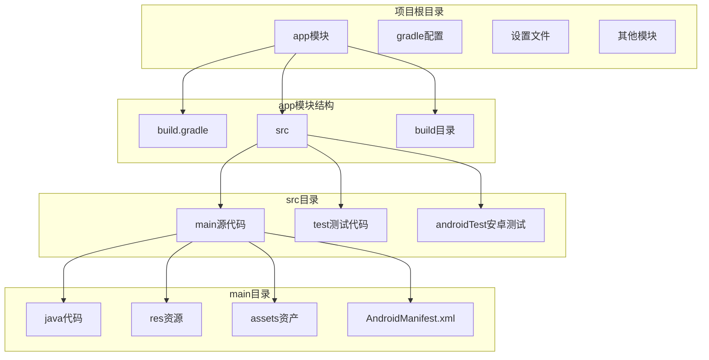

# 第4章：Android项目结构详解

## 📖 章节概述

本章将深入解析Android项目的文件结构和组织方式，详细介绍各个目录和文件的作用，帮助您理解Android应用的架构设计。通过本章学习，您将掌握Android项目的最佳组织方式和模块化开发思想。

## 🎯 学习目标

- 理解Android项目的标准目录结构
- 掌握Manifest文件的作用和配置方法
- 学会合理组织资源文件和代码结构
- 了解Gradle构建系统的配置和使用
- 掌握模块化开发的基本概念
- 能够设计清晰、可维护的项目结构

## 🏗️ Android项目整体架构

### 项目结构概览



### 典型Android项目结构

```
TodoMaster/
├── .gradle/                     # Gradle缓存目录
├── .idea/                       # IDE配置目录
├── app/                         # 主应用模块
│   ├── build/                   # 构建输出目录
│   ├── libs/                    # 本地库文件
│   ├── src/                     # 源代码目录
│   │   ├── main/                # 主要源代码
│   │   │   ├── java/            # Java源代码
│   │   │   │   └── com/example/todomaster/
│   │   │   │       ├── MainActivity.java
│   │   │   │       ├── model/
│   │   │   │       ├── adapter/
│   │   │   │       ├── utils/
│   │   │   │       └── ...
│   │   │   ├── res/             # 资源文件
│   │   │   │   ├── drawable/    # 图片资源
│   │   │   │   ├── layout/      # 布局文件
│   │   │   │   ├── values/      # 值资源
│   │   │   │   ├── mipmap/      # 应用图标
│   │   │   │   └── ...          # 其他资源
│   │   │   └── AndroidManifest.xml  # 清单文件
│   │   ├── test/                # 单元测试
│   │   │   └── java/
│   │   └── androidTest/         # Android测试
│   │       └── java/
│   ├── build.gradle             # 模块构建脚本
│   └── proguard-rules.pro       # 代码混淆规则
├── gradle/                      # Gradle包装器
├── build.gradle                 # 项目构建脚本
├── settings.gradle              # 项目设置
├── gradle.properties           # Gradle属性
├── local.properties            # 本地属性
└── .gitignore                  # Git忽略文件
```

## 📋 核心配置文件详解

### AndroidManifest.xml

AndroidManifest.xml是每个Android应用的必需文件，包含了应用的基本信息和组件声明。

```xml
<?xml version="1.0" encoding="utf-8"?>
<manifest xmlns:android="http://schemas.android.com/apk/res/android"
    xmlns:tools="http://schemas.android.com/tools">

    <!-- 权限声明 -->
    <uses-permission android:name="android.permission.INTERNET" />
    <uses-permission android:name="android.permission.READ_EXTERNAL_STORAGE" />
    <uses-permission android:name="android.permission.WRITE_EXTERNAL_STORAGE"
        android:maxSdkVersion="28" />

    <!-- 硬件特性声明 -->
    <uses-feature
        android:name="android.hardware.camera"
        android:required="false" />

    <!-- 应用级别配置 -->
    <application
        android:name=".TodoApplication"
        android:allowBackup="true"
        android:dataExtractionRules="@xml/data_extraction_rules"
        android:fullBackupContent="@xml/backup_rules"
        android:icon="@mipmap/ic_launcher"
        android:label="@string/app_name"
        android:roundIcon="@mipmap/ic_launcher_round"
        android:supportsRtl="true"
        android:theme="@style/Theme.TodoMaster"
        android:requestLegacyExternalStorage="true"
        tools:targetApi="31">

        <!-- Activity声明 -->
        <activity
            android:name=".MainActivity"
            android:exported="true"
            android:theme="@style/Theme.TodoMaster.NoActionBar"
            android:screenOrientation="portrait"
            android:launchMode="singleTop">
            <intent-filter>
                <action android:name="android.intent.action.MAIN" />
                <category android:name="android.intent.category.LAUNCHER" />
            </intent-filter>
        </activity>

        <activity
            android:name=".TaskDetailActivity"
            android:exported="false"
            android:parentActivityName=".MainActivity" />

        <!-- Service声明 -->
        <service
            android:name=".service.TaskNotificationService"
            android:enabled="true"
            android:exported="false" />

        <!-- BroadcastReceiver声明 -->
        <receiver
            android:name=".receiver.TaskAlarmReceiver"
            android:enabled="true"
            android:exported="false" />

        <!-- ContentProvider声明 -->
        <provider
            android:name=".provider.TaskProvider"
            android:authorities="${applicationId}.provider"
            android:exported="false"
            android:multiprocess="true" />

        <!-- 元数据 -->
        <meta-data
            android:name="com.google.android.gms.version"
            android:value="@integer/google_play_services_version" />

        <!-- 应用快捷方式 -->
        <meta-data
            android:name="android.app.shortcuts"
            android:resource="@xml/shortcuts" />

    </application>

    <!-- 查询权限 (Android 11+) -->
    <queries>
        <package android:name="com.google.android.apps.maps" />
        <intent>
            <action android:name="android.intent.action.VIEW" />
            <data android:scheme="http" />
        </intent>
    </queries>

</manifest>
```

#### Manifest文件主要元素说明

1. **<manifest>**：根元素，包含包名和版本信息
2. **<uses-permission>**：声明应用所需的权限
3. **<uses-feature>**：声明应用使用的硬件特性
4. **<application>**：应用级别的配置
5. **<activity>**：Activity组件声明
6. **<service>**：Service组件声明
7. **<receiver>**：BroadcastReceiver组件声明
8. **<provider>**：ContentProvider组件声明

### Gradle构建系统

#### 项目级build.gradle

```gradle
// Top-level build file where you can add configuration options common to all sub-projects/modules.
buildscript {
    ext {
        // 定义版本变量
        compose_version = '1.5.4'
        kotlin_version = '1.9.10'
        hilt_version = '2.48'
    }

    dependencies {
        // Android Gradle插件
        classpath 'com.android.tools.build:gradle:8.1.2'
        classpath "org.jetbrains.kotlin:kotlin-gradle-plugin:$kotlin_version"

        // Hilt依赖注入插件
        classpath "com.google.dagger:hilt-android-gradle-plugin:$hilt_version"

        // Google服务插件
        classpath 'com.google.gms:google-services:4.4.0'
    }
}

plugins {
    id 'com.android.application' version '8.1.2' apply false
    id 'com.android.library' version '8.1.2' apply false
    id 'org.jetbrains.kotlin.android' version '1.9.10' apply false
}

allprojects {
    repositories {
        google()
        mavenCentral()
        // 添加阿里云镜像
        maven { url 'https://maven.aliyun.com/repository/google' }
        maven { url 'https://maven.aliyun.com/repository/public' }
    }
}

task clean(type: Delete) {
    delete rootProject.buildDir
}
```

#### 应用级build.gradle

```gradle
plugins {
    id 'com.android.application'
    id 'org.jetbrains.kotlin.android'
    id 'kotlin-kapt'
    id 'dagger.hilt.android.plugin'
}

android {
    namespace 'com.example.todomaster'
    compileSdk 34

    defaultConfig {
        applicationId "com.example.todomaster"
        minSdk 21
        targetSdk 34
        versionCode 1
        versionName "1.0.0"

        testInstrumentationRunner "androidx.test.runner.AndroidJUnitRunner"

        // 多渠道配置
        flavorDimensions "version"
        productFlavors {
            free {
                dimension "version"
                applicationIdSuffix ".free"
                versionNameSuffix "-free"
            }
            pro {
                dimension "version"
                applicationIdSuffix ".pro"
                versionNameSuffix "-pro"
            }
        }
    }

    buildTypes {
        debug {
            minifyEnabled false
            debuggable true
            applicationIdSuffix ".debug"
            versionNameSuffix "-debug"

            buildConfigField "boolean", "DEBUG_MODE", "true"
            buildConfigField "String", "API_BASE_URL", '"https://api-dev.example.com"'
        }

        release {
            minifyEnabled true
            shrinkResources true
            debuggable false
            proguardFiles getDefaultProguardFile('proguard-android-optimize.txt'), 'proguard-rules.pro'

            buildConfigField "boolean", "DEBUG_MODE", "false"
            buildConfigField "String", "API_BASE_URL", '"https://api.example.com"'

            // 签名配置
            signingConfigs {
                release {
                    storeFile file('../keystore/release.keystore')
                    storePassword 'your_store_password'
                    keyAlias 'your_key_alias'
                    keyPassword 'your_key_password'
                }
            }
        }
    }

    compileOptions {
        sourceCompatibility JavaVersion.VERSION_1_8
        targetCompatibility JavaVersion.VERSION_1_8
    }

    kotlinOptions {
        jvmTarget = '1.8'
    }

    buildFeatures {
        viewBinding true
        dataBinding true
        buildConfig true
    }

    packagingOptions {
        exclude 'META-INF/DEPENDENCIES'
        exclude 'META-INF/LICENSE'
        exclude 'META-INF/LICENSE.txt'
        exclude 'META-INF/license.txt'
        exclude 'META-INF/NOTICE'
        exclude 'META-INF/NOTICE.txt'
        exclude 'META-INF/notice.txt'
        exclude 'META-INF/ASL2.0'
    }

    // 数据库版本管理
    sourceSets {
        main {
            java.srcDirs = ['src/main/java', 'src/main/java-gen']
        }
    }
}

dependencies {
    // Android核心库
    implementation 'androidx.core:core-ktx:1.12.0'
    implementation 'androidx.appcompat:appcompat:1.6.1'
    implementation 'com.google.android.material:material:1.10.0'
    implementation 'androidx.constraintlayout:constraintlayout:2.1.4'

    // Fragment和Activity
    implementation 'androidx.fragment:fragment-ktx:1.6.2'
    implementation 'androidx.activity:activity-ktx:1.8.1'

    // 生命周期组件
    implementation 'androidx.lifecycle:lifecycle-viewmodel-ktx:2.7.0'
    implementation 'androidx.lifecycle:lifecycle-livedata-ktx:2.7.0'
    implementation 'androidx.lifecycle:lifecycle-runtime-ktx:2.7.0'

    // Room数据库
    implementation 'androidx.room:room-runtime:2.6.1'
    implementation 'androidx.room:room-ktx:2.6.1'
    kapt 'androidx.room:room-compiler:2.6.1'

    // 网络请求
    implementation 'com.squareup.retrofit2:retrofit:2.9.0'
    implementation 'com.squareup.retrofit2:converter-gson:2.9.0'
    implementation 'com.squareup.okhttp3:logging-interceptor:4.12.0'

    // 图片加载
    implementation 'com.github.bumptech.glide:glide:4.16.0'
    kapt 'com.github.bumptech.glide:compiler:4.16.0'

    // 依赖注入
    implementation "com.google.dagger:hilt-android:2.48"
    kapt "com.google.dagger:hilt-compiler:2.48"

    // 协程
    implementation 'org.jetbrains.kotlinx:kotlinx-coroutines-android:1.7.3'

    // 日志
    implementation 'com.jakewharton.timber:timber:5.0.1'

    // 测试依赖
    testImplementation 'junit:junit:4.13.2'
    testImplementation 'androidx.room:room-testing:2.6.1'
    testImplementation 'org.mockito:mockito-core:5.7.0'
    testImplementation 'androidx.arch.core:core-testing:2.2.0'

    androidTestImplementation 'androidx.test.ext:junit:1.1.5'
    androidTestImplementation 'androidx.test.espresso:espresso-core:3.5.1'
    androidTestImplementation "com.google.dagger:hilt-android-testing:2.48"
    kaptAndroidTest "com.google.dagger:hilt-compiler:2.48"
}
```

### Gradle配置文件

#### settings.gradle

```gradle
pluginManagement {
    repositories {
        google()
        mavenCentral()
        gradlePluginPortal()
    }
}
dependencyResolutionManagement {
    repositoriesMode.set(RepositoriesMode.FAIL_ON_PROJECT_REPOS)
    repositories {
        google()
        mavenCentral()
        maven { url 'https://maven.aliyun.com/repository/google' }
        maven { url 'https://maven.aliyun.com/repository/public' }
    }
}

rootProject.name = "TodoMaster"
include ':app'
// 如果有其他模块
include ':data'
include ':domain'
include ':common'
```

#### gradle.properties

```properties
# Project-wide Gradle settings.
org.gradle.jvmargs=-Xmx2048m -Dfile.encoding=UTF-8
org.gradle.parallel=true
org.gradle.caching=true
org.gradle.configureondemand=true

# Android-specific properties
android.useAndroidX=true
android.enableJetifier=true
android.enableBuildCache=true
android.nonTransitiveRClass=true

# R8 full mode
android.enableR8.fullMode=true

# Kotlin code style for this project: "official" or "obsolete":
kotlin.code.style=official

# Enable experimental features
android.experimental.enableArtProfiles=true
```

## 📁 源代码组织结构

### Java源代码目录结构

```
src/main/java/com/example/todomaster/
├── TodoApplication.java              # Application类
├── MainActivity.java                 # 主Activity
├── BaseActivity.java                 # 基础Activity
├── ui/                              # UI相关类
│   ├── main/                        # 主界面相关
│   │   ├── MainActivity.java
│   │   ├── MainFragment.java
│   │   └── MainViewModel.java
│   ├── task/                        # 任务相关
│   │   ├── TaskListFragment.java
│   │   ├── TaskDetailFragment.java
│   │   ├── AddTaskDialog.java
│   │   └── TaskViewModel.java
│   └── adapter/                     # 适配器
│       ├── TaskAdapter.java
│       ├── CategoryAdapter.java
│       └── PriorityAdapter.java
├── data/                            # 数据层
│   ├── model/                       # 数据模型
│   │   ├── Task.java
│   │   ├── Category.java
│   │   └── User.java
│   ├── repository/                  # 仓库层
│   │   ├── TaskRepository.java
│   │   └── UserRepository.java
│   ├── local/                       # 本地数据源
│   │   ├── database/
│   │   │   ├── AppDatabase.java
│   │   │   ├── TaskDao.java
│   │   │   └── converters/
│   │   ├── preferences/
│   │   │   └── PreferencesManager.java
│   │   └── files/
│   │       └── FileManager.java
│   └── remote/                      # 远程数据源
│       ├── api/
│       │   ├── ApiService.java
│       │   └── dto/
│       └── network/
│           ├── NetworkModule.java
│           └── RequestInterceptor.java
├── domain/                          # 业务逻辑层
│   ├── usecase/                     # 用例
│   │   ├── GetTasksUseCase.java
│   │   ├── AddTaskUseCase.java
│   │   └── DeleteTaskUseCase.java
│   └── repository/                  # 仓库接口
│       ├── TaskRepository.java
│       └── UserRepository.java
├── utils/                           # 工具类
│   ├── DateUtils.java
│   ├── StringUtils.java
│   ├── NetworkUtils.java
│   ├── FileUtils.java
│   └── Constants.java
├── service/                         # 服务类
│   ├── TaskNotificationService.java
│   ├── TaskSyncService.java
│   └── LocationService.java
├── receiver/                        # 广播接收器
│   ├── TaskAlarmReceiver.java
│   └── NetworkChangeReceiver.java
├── provider/                        # 内容提供者
│   ├── TaskProvider.java
│   └── TaskContract.java
├── di/                             # 依赖注入
│   ├── AppModule.java
│   ├── DatabaseModule.java
│   ├── NetworkModule.java
│   └── RepositoryModule.java
└── common/                         # 通用组件
    ├── base/
    │   ├── BaseActivity.java
    │   ├── BaseFragment.java
    │   ├── BaseViewModel.java
    │   └── BaseAdapter.java
    ├── view/
    │   ├── CustomProgressBar.java
    │   ├── CircleImageView.java
    │   └── MaterialEditText.java
    └── extension/
        ├── ContextExtension.java
        └── ViewExtension.java
```

### Application类的实现

```java
package com.example.todomaster;

import android.app.Application;
import android.content.Context;
import androidx.appcompat.app.AppCompatDelegate;
import com.example.todomaster.di.AppModule;
import com.example.todomaster.di.DatabaseModule;
import com.example.todomaster.di.NetworkModule;
import com.example.todomaster.di.RepositoryModule;
import com.example.todomaster.utils.CrashHandler;
import com.example.todomaster.utils.NotificationUtils;
import javax.inject.Inject;
import dagger.hilt.android.HiltAndroidApp;

/**
 * 自定义Application类
 * 负责应用级别的初始化和全局配置
 */
@HiltAndroidApp
public class TodoApplication extends Application {

    @Inject
    NotificationUtils notificationUtils;

    private static TodoApplication instance;

    @Override
    public void onCreate() {
        super.onCreate();
        instance = this;

        // 初始化全局配置
        initializeApp();

        // 设置异常处理器
        setupCrashHandler();

        // 初始化通知渠道
        setupNotificationChannels();

        // 设置主题模式
        setupThemeMode();
    }

    private void initializeApp() {
        // 初始化日志系统
        initializeLogging();

        // 初始化数据库
        initializeDatabase();

        // 初始化网络配置
        initializeNetwork();

        // 初始化第三方库
        initializeThirdPartyLibraries();
    }

    private void initializeLogging() {
        // 配置Timber日志库
        if (BuildConfig.DEBUG_MODE) {
            // 开发环境启用详细日志
            Timber.plant(new Timber.DebugTree());
        } else {
            // 生产环境启用崩溃日志
            Timber.plant(new CrashReportingTree());
        }
    }

    private void initializeDatabase() {
        // Room数据库会自动初始化
        // 这里可以执行数据库迁移等操作
    }

    private void initializeNetwork() {
        // 配置网络请求
        // 设置网络缓存、拦截器等
    }

    private void initializeThirdPartyLibraries() {
        // 初始化其他第三方库
        // 例如：图片加载库、统计分析库等
    }

    private void setupCrashHandler() {
        // 设置全局异常处理器
        Thread.setDefaultUncaughtExceptionHandler(new CrashHandler(this));
    }

    private void setupNotificationChannels() {
        // 创建通知渠道（Android 8.0+）
        notificationUtils.createNotificationChannels();
    }

    private void setupThemeMode() {
        // 根据用户设置或系统设置决定主题模式
        if (isDarkModeEnabled()) {
            AppCompatDelegate.setDefaultNightMode(AppCompatDelegate.MODE_NIGHT_YES);
        } else {
            AppCompatDelegate.setDefaultNightMode(AppCompatDelegate.MODE_NIGHT_NO);
        }
    }

    private boolean isDarkModeEnabled() {
        // 从SharedPreferences获取用户设置
        return getSharedPreferences("app_settings", Context.MODE_PRIVATE)
                .getBoolean("dark_mode", false);
    }

    public static TodoApplication getInstance() {
        return instance;
    }

    /**
     * 生产环境日志树，只记录警告和错误
     */
    private static class CrashReportingTree extends Timber.Tree {
        @Override
        protected void log(int priority, String tag, String message, Throwable t) {
            if (priority == Log.VERBOSE || priority == Log.DEBUG) {
                return;
            }

            // 将日志发送到远程服务器或本地文件
            Log.println(priority, tag, message);

            if (t != null) {
                // 上传崩溃信息
            }
        }
    }
}
```

## 🎨 资源文件组织

### 资源目录结构

```
src/main/res/
├── anim/                           # 动画资源
│   ├── fade_in.xml
│   ├── fade_out.xml
│   ├── slide_in_right.xml
│   └── slide_out_left.xml
├── animator/                       # 属性动画
│   ├── button_scale.xml
│   └── progress_rotate.xml
├── color/                          # 颜色资源
│   ├── primary_colors.xml
│   ├── secondary_colors.xml
│   └── selector_colors.xml
├── drawable/                       # 图片资源
│   ├── ic_launcher.xml
│   ├── ic_add.xml
│   ├── ic_task.xml
│   ├── background_gradient.xml
│   ├── button_background.xml
│   └── task_item_background.xml
├── layout/                         # 布局文件
│   ├── activity_main.xml
│   ├── fragment_task_list.xml
│   ├── dialog_add_task.xml
│   └── item_task.xml
├── layout-land/                    # 横屏布局
│   ├── activity_main.xml
│   └── fragment_task_list.xml
├── layout-w600dp/                  # 平板布局
│   └── activity_main.xml
├── menu/                           # 菜单资源
│   ├── main_menu.xml
│   ├── task_more_menu.xml
│   └── context_menu.xml
├── mipmap/                         # 应用图标
│   ├── ic_launcher/
│   ├── ic_launcher_round/
│   └── ic_launcher_background/
├── navigation/                     # 导航图
│   └── mobile_navigation.xml
├── raw/                           # 原始资源
│   ├── notification_sound.mp3
│   └── intro_video.mp4
├── values/                        # 值资源
│   ├── strings.xml
│   ├── colors.xml
│   ├── dimens.xml
│   ├── styles.xml
│   ├── themes.xml
│   └── attrs.xml
├── values-night/                  # 夜间主题
│   ├── colors.xml
│   └── themes.xml
├── values-zh/                     # 中文资源
│   └── strings.xml
├── values-zh-rTW/                 # 繁体中文
│   └── strings.xml
└── xml/                          # XML资源
    ├── backup_rules.xml
    ├── data_extraction_rules.xml
    ├── network_security_config.xml
    ├── provider_paths.xml
    └── shortcuts.xml
```

### 颜色资源组织

#### res/values/colors.xml

```xml
<?xml version="1.0" encoding="utf-8"?>
<resources>
    <!-- Material Design 3 Color Scheme -->

    <!-- Primary Colors -->
    <color name="md_theme_light_primary">#6750A4</color>
    <color name="md_theme_light_onPrimary">#FFFFFF</color>
    <color name="md_theme_light_primaryContainer">#EADDFF</color>
    <color name="md_theme_light_onPrimaryContainer">#21005D</color>
    <color name="md_theme_light_secondary">#625B71</color>
    <color name="md_theme_light_onSecondary">#FFFFFF</color>
    <color name="md_theme_light_secondaryContainer">#E8DEF8</color>
    <color name="md_theme_light_onSecondaryContainer">#1D192B</color>

    <!-- Dark Theme Colors -->
    <color name="md_theme_dark_primary">#D0BCFF</color>
    <color name="md_theme_dark_onPrimary">#381E72</color>
    <color name="md_theme_dark_primaryContainer">#4F378B</color>
    <color name="md_theme_dark_onPrimaryContainer">#EADDFF</color>
    <color name="md_theme_dark_secondary">#CCC2DC</color>
    <color name="md_theme_dark_onSecondary">#332D41</color>
    <color name="md_theme_dark_secondaryContainer">#494458</color>
    <color name="md_theme_dark_onSecondaryContainer">#E8DEF8</color>

    <!-- Custom App Colors -->
    <color name="app_primary">@color/md_theme_light_primary</color>
    <color name="app_primary_container">@color/md_theme_light_primaryContainer</color>
    <color name="app_secondary">@color/md_theme_light_secondary</color>
    <color name="app_secondary_container">@color/md_theme_light_secondaryContainer</color>

    <!-- Semantic Colors -->
    <color name="task_priority_high">#FF5252</color>
    <color name="task_priority_medium">#FFC107</color>
    <color name="task_priority_low">#4CAF50</color>
    <color name="task_completed_bg">#E8F5E8</color>
    <color name="task_overdue_bg">#FFEBEE</color>

    <!-- Category Colors -->
    <color name="category_work">#2196F3</color>
    <color name="category_personal">#9C27B0</color>
    <color name="category_study">#FF9800</color>
    <color name="category_health">#4CAF50</color>
    <color name="category_shopping">#F44336</color>
    <color name="category_other">#607D8B</color>

    <!-- Status Colors -->
    <color name="success">#4CAF50</color>
    <color name="warning">#FFC107</color>
    <color name="error">#F44336</color>
    <color name="info">#2196F3</color>

    <!-- Common Colors -->
    <color name="white">#FFFFFF</color>
    <color name="black">#000000</color>
    <color name="transparent">#00000000</color>
    <color name="divider">#E0E0E0</color>
    <color name="background">#FAFAFA</color>
    <color name="surface">#FFFFFF</color>
    <color name="surface_variant">#F5F5F5</color>
</resources>
```

### 字符串资源组织

#### res/values/strings.xml

```xml
<?xml version="1.0" encoding="utf-8"?>
<resources>
    <!-- App Information -->
    <string name="app_name">TodoMaster</string>
    <string name="app_version">版本 %1$s</string>
    <string name="app_description">强大的待办事项管理应用</string>

    <!-- Navigation -->
    <string name="nav_tasks">任务</string>
    <string name="nav_calendar">日历</string>
    <string name="nav_statistics">统计</string>
    <string name="nav_settings">设置</string>

    <!-- Common Actions -->
    <string name="action_add">添加</string>
    <string name="action_save">保存</string>
    <string name="action_cancel">取消</string>
    <string name="action_delete">删除</string>
    <string name="action_edit">编辑</string>
    <string name="action_done">完成</string>
    <string name="action_undo">撤销</string>
    <string name="action_search">搜索</string>
    <string name="action_filter">筛选</string>
    <string name="action_sort">排序</string>
    <string name="action_refresh">刷新</string>
    <string name="action_more">更多</string>
    <string name="action_share">分享</string>
    <string name="action_export">导出</string>
    <string name="action_import">导入</string>

    <!-- Task Management -->
    <string name="task_title_hint">任务标题</string>
    <string name="task_description_hint">任务描述</string>
    <string name="task_category_hint">选择类别</string>
    <string name="task_due_date_hint">截止日期</string>
    <string name="task_reminder_hint">提醒时间</string>

    <string name="task_add_title">添加新任务</string>
    <string name="task_edit_title">编辑任务</string>
    <string name="task_detail_title">任务详情</string>

    <string name="task_priority_low">低优先级</string>
    <string name="task_priority_medium">中优先级</string>
    <string name="task_priority_high">高优先级</string>

    <string name="task_status_pending">待完成</string>
    <string name="task_status_in_progress">进行中</string>
    <string name="task_status_completed">已完成</string>
    <string name="task_status_cancelled">已取消</string>

    <!-- Categories -->
    <string name="category_work">工作</string>
    <string name="category_personal">个人</string>
    <string name="category_study">学习</string>
    <string name="category_health">健康</string>
    <string name="category_shopping">购物</string>
    <string name="category_entertainment">娱乐</string>
    <string name="category_family">家庭</string>
    <string name="category_other">其他</string>

    <!-- Date and Time -->
    <string name="today">今天</string>
    <string name="tomorrow">明天</string>
    <string name="yesterday">昨天</string>
    <string name="this_week">本周</string>
    <string name="this_month">本月</string>
    <string name="overdue">已过期</string>

    <!-- Statistics -->
    <string name="stats_total_tasks">总任务数</string>
    <string name="stats_completed_tasks">已完成</string>
    <string name="stats_pending_tasks">待完成</string>
    <string name="stats_overdue_tasks">已过期</string>
    <string name="stats_completion_rate">完成率</string>

    <string name="stats_today">今日统计</string>
    <string name="stats_this_week">本周统计</string>
    <string name="stats_this_month">本月统计</string>

    <!-- Messages -->
    <string name="message_task_added_success">任务添加成功</string>
    <string name="message_task_updated_success">任务更新成功</string>
    <string name="message_task_deleted_success">任务删除成功</string>
    <string name="message_task_completed">任务已完成</string>
    <string name="message_no_tasks">暂无任务</string>
    <string name="message_no_internet">网络连接不可用</string>
    <string name="message_loading">加载中...</string>
    <string name="message_error_occurred">发生错误，请重试</string>

    <!-- Validation -->
    <string name="error_required_field">此字段为必填项</string>
    <string name="error_invalid_date">日期格式不正确</string>
    <string name="error_past_date">不能选择过去的日期</string>
    <string name="error_network">网络错误</string>

    <!-- Dialogs -->
    <string name="dialog_delete_title">删除确认</string>
    <string name="dialog_delete_message">确定要删除这个任务吗？</string>
    <string name="dialog_delete_confirm">删除</string>
    <string name="dialog_delete_cancel">取消</string>

    <!-- Settings -->
    <string name="settings_general">通用设置</string>
    <string name="settings_notifications">通知设置</string>
    <string name="settings_appearance">外观设置</string>
    <string name="settings_backup">备份与恢复</string>
    <string name="settings_about">关于应用</string>

    <string name="setting_dark_mode">深色模式</string>
    <string name="setting_notification_enabled">启用通知</string>
    <string name="setting_auto_backup">自动备份</string>
    <string name="setting_language">语言设置</string>

    <!-- Content Descriptions (Accessibility) -->
    <string name="cd_add_task">添加新任务</string>
    <string name="cd_task_checkbox">任务完成状态</string>
    <string name="cd_task_priority">任务优先级</string>
    <string name="cd_more_options">更多选项</string>
    <string name="cd_search">搜索任务</string>
    <string name="cd_filter">筛选任务</string>
    <string name="cd_sort">排序任务</string>

    <!-- Plurals -->
    <plurals name="task_count">
        <item quantity="zero">没有任务</item>
        <item quantity="one">1个任务</item>
        <item quantity="other">%d个任务</item>
    </plurals>

    <plurals name="day_remaining">
        <item quantity="zero">已过期</item>
        <item quantity="one">剩余1天</item>
        <item quantity="other">剩余%d天</item>
    </plurals>

    <!-- Format Strings -->
    <string name="format_date">%1$s年%2$s月%3$s日</string>
    <string name="format_time">%1$s:%2$s</string>
    <string name="format_datetime">%1$s %2$s</string>
    <string name="format_percentage">%1$d%%</string>
</resources>
```

### 尺寸资源组织

#### res/values/dimens.xml

```xml
<?xml version="1.0" encoding="utf-8"?>
<resources>
    <!-- Spacing -->
    <dimen name="spacing_xs">4dp</dimen>
    <dimen name="spacing_sm">8dp</dimen>
    <dimen name="spacing_md">16dp</dimen>
    <dimen name="spacing_lg">24dp</dimen>
    <dimen name="spacing_xl">32dp</dimen>
    <dimen name="spacing_xxl">48dp</dimen>

    <!-- Margins -->
    <dimen name="margin_xs">4dp</dimen>
    <dimen name="margin_sm">8dp</dimen>
    <dimen name="margin_md">16dp</dimen>
    <dimen name="margin_lg">24dp</dimen>
    <dimen name="margin_xl">32dp</dimen>

    <!-- Padding -->
    <dimen name="padding_xs">4dp</dimen>
    <dimen name="padding_sm">8dp</dimen>
    <dimen name="padding_md">16dp</dimen>
    <dimen name="padding_lg">24dp</dimen>
    <dimen name="padding_xl">32dp</dimen>

    <!-- Typography -->
    <dimen name="text_size_xs">12sp</dimen>
    <dimen name="text_size_sm">14sp</dimen>
    <dimen name="text_size_md">16sp</dimen>
    <dimen name="text_size_lg">18sp</dimen>
    <dimen name="text_size_xl">20sp</dimen>
    <dimen name="text_size_xxl">24sp</dimen>
    <dimen name="text_size_huge">32sp</dimen>

    <!-- Component Heights -->
    <dimen name="button_height_sm">36dp</dimen>
    <dimen name="button_height_md">48dp</dimen>
    <dimen name="button_height_lg">56dp</dimen>
    <dimen name="toolbar_height">56dp</dimen>
    <dimen name="bottom_nav_height">56dp</dimen>
    <dimen name="list_item_height">72dp</dimen>

    <!-- Border Radius -->
    <dimen name="corner_radius_xs">4dp</dimen>
    <dimen name="corner_radius_sm">8dp</dimen>
    <dimen name="corner_radius_md">12dp</dimen>
    <dimen name="corner_radius_lg">16dp</dimen>
    <dimen name="corner_radius_xl">24dp</dimen>

    <!-- Elevation -->
    <dimen name="elevation_xs">2dp</dimen>
    <dimen name="elevation_sm">4dp</dimen>
    <dimen name="elevation_md">8dp</dimen>
    <dimen name="elevation_lg">12dp</dimen>
    <dimen name="elevation_xl">16dp</dimen>

    <!-- Icon Sizes -->
    <dimen name="icon_size_xs">16dp</dimen>
    <dimen name="icon_size_sm">20dp</dimen>
    <dimen name="icon_size_md">24dp</dimen>
    <dimen name="icon_size_lg">32dp</dimen>
    <dimen name="icon_size_xl">48dp</dimen>

    <!-- Specific Component Sizes -->
    <dimen name="fab_size">56dp</dimen>
    <dimen name="avatar_size_sm">32dp</dimen>
    <dimen name="avatar_size_md">48dp</dimen>
    <dimen name="avatar_size_lg">64dp</dimen>
    <dimen name="divider_thickness">1dp</dimen>
    <dimen name="stroke_width">1dp</dimen>
    <dimen name="stroke_width_thick">2dp</dimen>
</resources>
```

## 🧪 测试代码组织

### 测试目录结构

```
src/
├── test/                          # 单元测试
│   └── java/com/example/todomaster/
│       ├── model/                 # 模型测试
│       │   ├── TaskTest.java
│       │   └── UserTest.java
│       ├── repository/            # 仓库测试
│       │   ├── TaskRepositoryTest.java
│       │   └── UserRepositoryTest.java
│       ├── usecase/               # 用例测试
│       │   ├── GetTasksUseCaseTest.java
│       │   └── AddTaskUseCaseTest.java
│       ├── utils/                 # 工具类测试
│       │   ├── DateUtilsTest.java
│       │   └── StringUtilsTest.java
│       └── viewmodel/             # ViewModel测试
│           ├── TaskListViewModelTest.java
│           └── TaskDetailViewModelTest.java
└── androidTest/                   # Android测试
    └── java/com/example/todomaster/
        ├── ui/                     # UI测试
        │   ├── MainActivityTest.java
        │   ├── TaskListFragmentTest.java
        │   └── AddTaskDialogTest.java
        ├── database/               # 数据库测试
        │   ├── AppDatabaseTest.java
        │   └── TaskDaoTest.java
        ├── service/                # 服务测试
        │   ├── TaskNotificationServiceTest.java
        │   └── TaskSyncServiceTest.java
        └── integration/            # 集成测试
            ├── TaskFlowIntegrationTest.java
            └── DataSyncIntegrationTest.java
```

### 单元测试示例

#### TaskTest.java

```java
package com.example.todomaster.model;

import org.junit.Before;
import org.junit.Test;
import org.junit.runner.RunWith;
import org.junit.runners.JUnit4;

import static org.junit.Assert.*;

/**
 * Task模型的单元测试
 */
@RunWith(JUnit4.class)
public class TaskTest {

    private Task task;

    @Before
    public void setUp() {
        task = new Task("测试任务", "测试描述", "工作", Task.Priority.HIGH);
    }

    @Test
    public void testTaskCreation() {
        assertNotNull("任务ID应该被自动设置", task.getId());
        assertEquals("任务标题应该正确", "测试任务", task.getTitle());
        assertEquals("任务描述应该正确", "测试描述", task.getDescription());
        assertEquals("任务类别应该正确", "工作", task.getCategory());
        assertEquals("任务优先级应该正确", Task.Priority.HIGH, task.getPriority());
        assertFalse("新任务应该未完成", task.isCompleted());
        assertTrue("创建时间应该大于0", task.getCreatedAt() > 0);
        assertTrue("更新时间应该大于0", task.getUpdatedAt() > 0);
    }

    @Test
    public void testTaskCompletionToggle() {
        assertFalse("初始状态应该是未完成", task.isCompleted());

        task.toggleCompleted();
        assertTrue("切换后应该是已完成", task.isCompleted());

        task.toggleCompleted();
        assertFalse("再次切换后应该是未完成", task.isCompleted());
    }

    @Test
    public void testTaskPriorityValues() {
        Task.Priority lowPriority = Task.Priority.LOW;
        Task.Priority mediumPriority = Task.Priority.MEDIUM;
        Task.Priority highPriority = Task.Priority.HIGH;

        assertEquals("低优先级值应该为1", 1, lowPriority.getValue());
        assertEquals("中优先级值应该为2", 2, mediumPriority.getValue());
        assertEquals("高优先级值应该为3", 3, highPriority.getValue());

        assertEquals("从值1应该得到低优先级", lowPriority, Task.Priority.fromValue(1));
        assertEquals("从值2应该得到中优先级", mediumPriority, Task.Priority.fromValue(2));
        assertEquals("从值3应该得到高优先级", highPriority, Task.Priority.fromValue(3));
        assertEquals("无效值应该返回中优先级", mediumPriority, Task.Priority.fromValue(99));
    }

    @Test
    public void testTaskDateFormatting() {
        String formattedDate = task.getFormattedDate();
        assertNotNull("格式化日期不应该为null", formattedDate);
        assertTrue("格式化日期应该包含年份", formattedDate.contains("202"));

        String formattedDateTime = task.getFormattedCreatedAt();
        assertNotNull("格式化日期时间不应该为null", formattedDateTime);
        assertTrue("格式化日期时间应该包含时间", formattedDateTime.contains(":"));
    }

    @Test
    public void testTaskEqualsAndHashCode() {
        Task anotherTask = new Task("测试任务", "测试描述", "工作", Task.Priority.HIGH);
        anotherTask.setId(task.getId());

        assertEquals("相同ID的任务应该相等", task, anotherTask);
        assertEquals("相同ID的任务hashCode应该相等", task.hashCode(), anotherTask.hashCode());

        anotherTask.setId(999L);
        assertNotEquals("不同ID的任务不应该相等", task, anotherTask);
    }
}
```

## 🏗️ 模块化开发

### 多模块项目结构

```
TodoMaster/
├── app/                           # 主应用模块
├── core/                          # 核心模块
│   ├── common/                    # 通用模块
│   │   ├── utils/
│   │   ├── extensions/
│   │   └── base/
│   ├── data/                      # 数据模块
│   │   ├── local/
│   │   ├── remote/
│   │   └── repository/
│   └── domain/                    # 领域模块
│       ├── model/
│       ├── repository/
│       └── usecase/
├── feature/                       # 功能模块
│   ├── tasks/                     # 任务功能
│   │   ├── implementation/
│   │   └── api/
│   ├── calendar/                  # 日历功能
│   └── statistics/                # 统计功能
└── shared/                        # 共享模块
    ├── ui/                        # UI组件
    ├── navigation/                # 导航组件
    └── resources/                 # 资源文件
```

### 模块build.gradle示例

#### core/data/build.gradle

```gradle
plugins {
    id 'com.android.library'
    id 'org.jetbrains.kotlin.android'
    id 'kotlin-kapt'
    id 'dagger.hilt.android.plugin'
}

android {
    namespace 'com.example.todomaster.core.data'
    compileSdk 34

    defaultConfig {
        minSdk 21
        targetSdk 34
        testInstrumentationRunner "androidx.test.runner.AndroidJUnitRunner"
        consumerProguardFiles "consumer-rules.pro"
    }

    buildTypes {
        release {
            minifyEnabled false
            proguardFiles getDefaultProguardFile('proguard-android-optimize.txt'), 'proguard-rules.pro'
        }
    }

    compileOptions {
        sourceCompatibility JavaVersion.VERSION_1_8
        targetCompatibility JavaVersion.VERSION_1_8
    }

    kotlinOptions {
        jvmTarget = '1.8'
    }
}

dependencies {
    implementation project(':core:common')
    implementation project(':core:domain')

    // Room数据库
    implementation 'androidx.room:room-runtime:2.6.1'
    implementation 'androidx.room:room-ktx:2.6.1'
    kapt 'androidx.room:room-compiler:2.6.1'

    // 网络请求
    implementation 'com.squareup.retrofit2:retrofit:2.9.0'
    implementation 'com.squareup.retrofit2:converter-gson:2.9.0'
    implementation 'com.squareup.okhttp3:logging-interceptor:4.12.0'

    // 依赖注入
    implementation "com.google.dagger:hilt-android:2.48"
    kapt "com.google.dagger:hilt-compiler:2.48"

    // 测试
    testImplementation 'junit:junit:4.13.2'
    testImplementation 'androidx.room:room-testing:2.6.1'
    androidTestImplementation 'androidx.test.ext:junit:1.1.5'
}
```

## 🎯 项目结构最佳实践

### 1. 包命名规范

```java
// 公司域名反向 + 应用名 + 模块名
com.example.todomaster
├── ui                            // UI层
├── data                          // 数据层
├── domain                        // 领域层
├── di                            // 依赖注入
├── utils                         // 工具类
├── service                       // 服务类
├── receiver                      // 广播接收器
├── provider                      // 内容提供者
└── common                        // 通用组件
```

### 2. 文件命名规范

```java
// Activity: 功能名 + Activity
MainActivity, TaskDetailActivity

// Fragment: 功能名 + Fragment
TaskListFragment, AddTaskFragment

// Adapter: 实体名 + Adapter
TaskAdapter, CategoryAdapter

// ViewModel: 功能名 + ViewModel
TaskListViewModel, TaskDetailViewModel

// Repository: 实体名 + Repository
TaskRepository, UserRepository

// Utility: 功能名 + Utils
DateUtils, StringUtils, NetworkUtils
```

### 3. 资源命名规范

```xml
<!-- Layout: 功能_组件.xml -->
activity_main.xml
fragment_task_list.xml
dialog_add_task.xml
item_task.xml

<!-- Drawable: 功能_描述.xml -->
ic_add_task.xml
bg_task_item.xml
selector_button_primary.xml

<!-- String: 功能_描述 -->
task_add_title
task_edit_title
error_required_field

<!-- Color: 功能_描述 -->
task_priority_high
category_work_color
primary_color

<!-- Dimen: 功能_描述 -->
task_item_height
button_corner_radius
spacing_medium
```

### 4. 版本控制最佳实践

```gitignore
# Android项目.gitignore示例

# Built application files
*.apk
*.ap_
*.aab

# Files for the ART/Dalvik VM
*.dex

# Java class files
*.class

# Generated files
bin/
gen/
out/
build/

# Gradle files
.gradle/
build/

# Local configuration file (sdk path, etc)
local.properties

# Proguard folder generated by Eclipse
proguard/

# Log Files
*.log

# Android Studio Navigation editor temp files
.navigation/

# Android Studio captures folder
captures/

# IntelliJ
*.iml
.idea/workspace.xml
.idea/tasks.xml
.idea/gradle.xml
.idea/assetWizardSettings.xml
.idea/dictionaries
.idea/libraries
.idea/caches
.idea/modules.xml
.idea/.name
.idea/compiler.xml
.idea/copyright/profiles_settings.xml
.idea/encodings.xml
.idea/misc.xml
.idea/modules.xml
.idea/scopes/scope_settings.xml
.idea/vcs.xml
.idea/jsLibraryMappings.xml
.idea/datasources.xml
.idea/dataSources.ids
.idea/dataSources.local.xml
.idea/sqlDataSources.xml
.idea/dynamic.xml
.idea/uiDesigner.xml

# OS-specific files
.DS_Store
.DS_Store?
._*
.Spotlight-V100
.Trashes
ehthumbs.db
Thumbs.db

# Keystore files
*.jks
*.p8
*.p12
*.key
*.pem

# External libraries
/captures
```

## 🎯 小结

本章详细介绍了Android项目的文件结构和组织方式，主要内容包括：

### 核心内容总结

1. **项目整体架构**
   - 标准Android项目目录结构
   - 各目录和文件的作用说明
   - 模块化开发的思想

2. **配置文件详解**
   - AndroidManifest.xml的作用和配置
   - Gradle构建系统的使用
   - 构建变体和多渠道配置

3. **源代码组织**
   - Java包的最佳组织方式
   - MVC/MVP/MVVM架构实现
   - 依赖注入和模块化设计

4. **资源文件管理**
   - 各类资源的组织方式
   - 多语言和多屏幕适配
   - Material Design资源规范

5. **测试代码结构**
   - 单元测试和Android测试
   - 测试驱动开发实践
   - 持续集成和自动化测试

6. **最佳实践**
   - 命名规范和代码组织
   - 版本控制和团队协作
   - 项目结构演进策略

### 学习要点

- **结构清晰**：合理的目录结构提高代码可读性
- **模块化设计**：按功能模块组织代码，便于维护和扩展
- **资源管理**：合理组织资源文件，支持多语言和多设备
- **测试驱动**：完善的测试结构保证代码质量
- **版本控制**：合理的.gitignore配置避免不必要的文件提交

### 下一步

下一部分将深入探讨Android用户界面开发，学习View系统和布局设计的核心概念。

## 📚 延伸阅读

- [Android Developers官方文档 - 应用架构](https://developer.android.com/jetpack/guide)
- [Gradle用户手册](https://docs.gradle.org/current/userguide/userguide.html)
- [Android Material Design设计规范](https://material.io/design/)
- [代码规范最佳实践](https://source.android.com/setup/contribute/code-style)