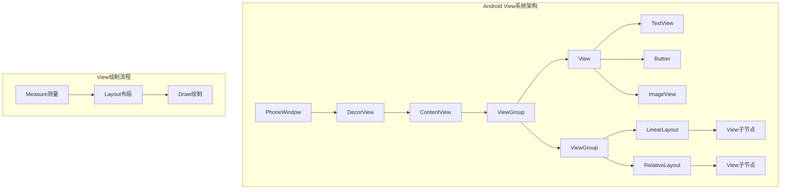

# 第5章：View和布局系统基础

## 📖 章节概述

本章将深入介绍Android View系统的核心概念和布局机制。通过学习View层次结构、布局原理和常用布局容器的使用，您将掌握构建Android用户界面的基础知识，为后续的高级UI开发奠定坚实基础。

## 🎯 学习目标

- 理解Android View系统的核心架构
- 掌握View的测量、布局、绘制三大流程
- 熟练使用各种常用布局容器
- 了解布局优化技巧和性能考虑
- 掌握响应式设计和多屏幕适配
- 能够设计和实现复杂的用户界面布局

## 🏗️ View系统架构

### View层次结构



### View和ViewGroup的关系

```java
/**
 * View和ViewGroup类层次关系
 */
public abstract class View {
    // View是所有UI组件的基类
    // 负责绘制、事件处理、测量等基础功能
}

public abstract class ViewGroup extends View {
    // ViewGroup继承自View
    // 作为容器管理子View的布局和事件分发
    private View[] mChildren;

    // 添加子View
    public void addView(View child) {
        addView(child, -1);
    }

    // 移除子View
    public void removeView(View child) {
        removeViewInternal(child);
    }
}

// 具体的布局容器实现
public class LinearLayout extends ViewGroup {
    // 线性布局实现
    @Override
    protected void onMeasure(int widthMeasureSpec, int heightMeasureSpec) {
        // 测量所有子View
    }

    @Override
    protected void onLayout(boolean changed, int l, int t, int r, int b) {
        // 布局所有子View
    }
}
```

## 📏 View的三大核心流程

### 测量流程 (Measure)

测量流程确定View及其子View的尺寸。Android提供了三种测量模式：

```java
/**
 * View测量模式和规格
 */
public class View {
    // 测量模式常量
    public static final int UNSPECIFIED = 0;  // 未指定：父View不限制子View大小
    public static final int EXACTLY = 1;       // 精确值：子View必须使用指定的大小
    public static final int AT_MOST = 2;       // 最大值：子View不能超过指定的大小

    /**
     * 测量View的尺寸
     * @param widthMeasureSpec 宽度测量规格
     * @param heightMeasureSpec 高度测量规格
     */
    protected void onMeasure(int widthMeasureSpec, int heightMeasureSpec) {
        setMeasuredDimension(
            getDefaultSize(getSuggestedMinimumWidth(), widthMeasureSpec),
            getDefaultSize(getSuggestedMinimumHeight(), heightMeasureSpec)
        );
    }

    /**
     * 解析测量规格
     * @param measureSpec 测量规格
     * @return 模式和大小
     */
    public static int getMode(int measureSpec) {
        return (measureSpec & MODE_MASK);
    }

    public static int getSize(int measureSpec) {
        return (measureSpec & ~MODE_MASK);
    }
}
```

#### 自定义View测量示例

```java
/**
 * 自定义方形View的测量实现
 */
public class SquareView extends View {

    public SquareView(Context context) {
        super(context);
    }

    public SquareView(Context context, AttributeSet attrs) {
        super(context, attrs);
    }

    @Override
    protected void onMeasure(int widthMeasureSpec, int heightMeasureSpec) {
        super.onMeasure(widthMeasureSpec, heightMeasureSpec);

        // 获取宽度的测量模式
        int widthMode = MeasureSpec.getMode(widthMeasureSpec);
        int widthSize = MeasureSpec.getSize(widthMeasureSpec);

        // 获取高度的测量模式
        int heightMode = MeasureSpec.getMode(heightMeasureSpec);
        int heightSize = MeasureSpec.getSize(heightMeasureSpec);

        // 选择较小的尺寸作为最终尺寸（确保是正方形）
        int size = Math.min(widthSize, heightSize);

        // 根据测量模式调整最终尺寸
        if (widthMode == MeasureSpec.EXACTLY) {
            size = widthSize;
        } else if (heightMode == MeasureSpec.EXACTLY) {
            size = heightSize;
        } else if (widthMode == MeasureSpec.AT_MOST && heightMode == MeasureSpec.AT_MOST) {
            size = Math.min(widthSize, heightSize);
        }

        // 设置最终测量尺寸
        setMeasuredDimension(size, size);
    }
}
```

### 布局流程 (Layout)

布局流程确定View在屏幕上的位置：

```java
/**
 * ViewGroup的布局流程实现
 */
public abstract class ViewGroup extends View {

    /**
     * 布局所有子View
     */
    @Override
    protected void onLayout(boolean changed, int l, int t, int r, int b) {
        // 抽象方法，由具体实现类重写
    }

    /**
     * 布局单个子View
     */
    public void layout(int l, int t, int r, int b) {
        // 设置View的四个边界
        boolean changed = setFrame(l, t, r, b);

        if (changed || (mPrivateFlags & PFLAG_LAYOUT_REQUIRED) == PFLAG_LAYOUT_REQUIRED) {
            onLayout(changed, l, t, r, b);
            // 标记布局完成
            mPrivateFlags &= ~PFLAG_LAYOUT_REQUIRED;
        }
    }
}

/**
 * LinearLayout的布局实现（简化版）
 */
public class LinearLayout extends ViewGroup {

    @Override
    protected void onLayout(boolean changed, int l, int t, int r, int b) {
        if (mOrientation == VERTICAL) {
            layoutVertical(l, t, r, b);
        } else {
            layoutHorizontal(l, t, r, b);
        }
    }

    void layoutVertical(int l, int t, int r, int b) {
        final int paddingLeft = mPaddingLeft;
        final int paddingRight = mPaddingRight;
        final int paddingTop = mPaddingTop;

        int childTop = paddingTop;
        int childLeft = paddingLeft;

        // 布局所有子View
        for (int i = 0; i < getChildCount(); i++) {
            View child = getChildAt(i);

            if (child.getVisibility() != GONE) {
                int childWidth = child.getMeasuredWidth();
                int childHeight = child.getMeasuredHeight();

                // 布局子View
                child.layout(
                    childLeft,
                    childTop,
                    childLeft + childWidth,
                    childTop + childHeight
                );

                // 更新下一个子View的位置
                childTop += childHeight + mVerticalSpacing;
            }
        }
    }
}
```

### 绘制流程 (Draw)

绘制流程负责将View显示到屏幕上：

```java
/**
 * View的绘制流程
 */
public class View {

    /**
     * 绘制入口方法
     */
    public void draw(Canvas canvas) {
        // 1. 绘制背景
        if (!dirtyOpaque) {
            drawBackground(canvas);
        }

        // 2. 如果需要，保存画布层
        int saveCount = canvas.getSaveCount();
        if (drawForwards) {
            canvas.save();
        }

        // 3. 绘制内容
        onDraw(canvas);

        // 4. 绘制子View
        dispatchDraw(canvas);

        // 5. 绘制前景（如滚动条）
        if (drawForwards) {
            onDrawForeground(canvas);
        }

        // 6. 恢复画布层
        if (drawForwards) {
            canvas.restoreToCount(saveCount);
        }
    }

    /**
     * 绘制View内容 - 需要重写的方法
     */
    protected void onDraw(Canvas canvas) {
        // 默认实现为空
        // 自定义View在这里实现绘制逻辑
    }

    /**
     * 绘制背景
     */
    private void drawBackground(Canvas canvas) {
        if (mBackground != null) {
            mBackground.draw(canvas);
        }
    }

    /**
     * 绘制子View - ViewGroup重写此方法
     */
    protected void dispatchDraw(Canvas canvas) {
        // ViewGroup实现绘制所有子View
    }
}
```

#### 自定义View绘制示例

```java
/**
 * 自定义圆形进度条View
 */
public class CircleProgressBar extends View {
    private Paint mPaint;
    private Paint mTextPaint;
    private int mProgress = 0;
    private int mMaxProgress = 100;
    private int mCircleColor = Color.BLUE;
    private int mProgressColor = Color.GREEN;

    public CircleProgressBar(Context context) {
        super(context);
        init();
    }

    public CircleProgressBar(Context context, AttributeSet attrs) {
        super(context, attrs);
        init();
    }

    private void init() {
        // 初始化画笔
        mPaint = new Paint(Paint.ANTI_ALIAS_FLAG);
        mPaint.setStyle(Paint.Style.STROKE);
        mPaint.setStrokeWidth(20f);

        mTextPaint = new Paint(Paint.ANTI_ALIAS_FLAG);
        mTextPaint.setColor(Color.BLACK);
        mTextPaint.setTextSize(48f);
        mTextPaint.setTextAlign(Paint.Align.CENTER);
    }

    @Override
    protected void onDraw(Canvas canvas) {
        super.onDraw(canvas);

        // 获取View中心点
        int centerX = getWidth() / 2;
        int centerY = getHeight() / 2;
        int radius = Math.min(centerX, centerY) - 40;

        // 绘制背景圆环
        mPaint.setColor(mCircleColor);
        canvas.drawCircle(centerX, centerY, radius, mPaint);

        // 绘制进度圆弧
        mPaint.setColor(mProgressColor);
        RectF rectF = new RectF(
            centerX - radius, centerY - radius,
            centerX + radius, centerY + radius
        );

        float sweepAngle = (float) mProgress / mMaxProgress * 360f;
        canvas.drawArc(rectF, -90f, sweepAngle, false, mPaint);

        // 绘制进度文字
        String progressText = mProgress + "%";
        canvas.drawText(progressText, centerX, centerY, mTextPaint);
    }

    // 设置进度
    public void setProgress(int progress) {
        mProgress = Math.max(0, Math.min(progress, mMaxProgress));
        invalidate(); // 重绘View
    }

    public void setMaxProgress(int maxProgress) {
        mMaxProgress = maxProgress;
        invalidate();
    }
}
```

## 📦 常用布局容器详解

### LinearLayout（线性布局）

LinearLayout按照垂直或水平方向排列子View：

```xml
<?xml version="1.0" encoding="utf-8"?>
<LinearLayout
    xmlns:android="http://schemas.android.com/apk/res/android"
    android:layout_width="match_parent"
    android:layout_height="match_parent"
    android:orientation="vertical"
    android:padding="16dp">

    <!-- 水平线性布局 -->
    <LinearLayout
        android:layout_width="match_parent"
        android:layout_height="wrap_content"
        android:orientation="horizontal"
        android:gravity="center_vertical"
        android:layout_marginBottom="16dp">

        <TextView
            android:layout_width="0dp"
            android:layout_height="wrap_content"
            android:layout_weight="1"
            android:text="用户名："
            android:textSize="16sp" />

        <EditText
            android:layout_width="0dp"
            android:layout_height="wrap_content"
            android:layout_weight="2"
            android:hint="请输入用户名"
            android:inputType="text" />

    </LinearLayout>

    <!-- 垂直线性布局 -->
    <LinearLayout
        android:layout_width="match_parent"
        android:layout_height="wrap_content"
        android:orientation="vertical"
        android:layout_marginBottom="16dp">

        <TextView
            android:layout_width="match_parent"
            android:layout_height="wrap_content"
            android:text="个人简介："
            android:textSize="16sp"
            android:layout_marginBottom="8dp" />

        <EditText
            android:layout_width="match_parent"
            android:layout_height="120dp"
            android:gravity="top"
            android:hint="请输入个人简介"
            android:inputType="textMultiLine" />

    </LinearLayout>

    <!-- 按钮组 -->
    <LinearLayout
        android:layout_width="match_parent"
        android:layout_height="wrap_content"
        android:orientation="horizontal"
        android:gravity="end">

        <Button
            android:layout_width="wrap_content"
            android:layout_height="wrap_content"
            android:layout_marginEnd="8dp"
            android:text="取消" />

        <Button
            android:layout_width="wrap_content"
            android:layout_height="wrap_content"
            android:text="确认" />

    </LinearLayout>

</LinearLayout>
```

#### LinearLayout动态创建示例

```java
/**
 * 动态创建LinearLayout
 */
public class LinearLayoutExample extends Activity {

    @Override
    protected void onCreate(Bundle savedInstanceState) {
        super.onCreate(savedInstanceState);

        // 创建主布局
        LinearLayout mainLayout = new LinearLayout(this);
        mainLayout.setOrientation(LinearLayout.VERTICAL);
        mainLayout.setPadding(32, 32, 32, 32);

        // 添加标题
        TextView titleView = new TextView(this);
        titleView.setText("动态布局示例");
        titleView.setTextSize(24f);
        titleView.setGravity(Gravity.CENTER);
        LinearLayout.LayoutParams titleParams = new LinearLayout.LayoutParams(
            ViewGroup.LayoutParams.MATCH_PARENT,
            ViewGroup.LayoutParams.WRAP_CONTENT
        );
        titleParams.setMargins(0, 0, 0, 32);
        mainLayout.addView(titleView, titleParams);

        // 创建水平布局容器
        LinearLayout horizontalLayout = new LinearLayout(this);
        horizontalLayout.setOrientation(LinearLayout.HORIZONTAL);
        horizontalLayout.setGravity(Gravity.CENTER_VERTICAL);

        // 添加标签
        TextView labelView = new TextView(this);
        labelView.setText("输入：");
        LinearLayout.LayoutParams labelParams = new LinearLayout.LayoutParams(
            0, ViewGroup.LayoutParams.WRAP_CONTENT, 1f
        );
        horizontalLayout.addView(labelView, labelParams);

        // 添加输入框
        EditText editText = new EditText(this);
        editText.setHint("请输入内容");
        LinearLayout.LayoutParams editParams = new LinearLayout.LayoutParams(
            0, ViewGroup.LayoutParams.WRAP_CONTENT, 2f
        );
        horizontalLayout.addView(editText, editParams);

        // 添加水平布局到主布局
        LinearLayout.LayoutParams horizontalParams = new LinearLayout.LayoutParams(
            ViewGroup.LayoutParams.MATCH_PARENT,
            ViewGroup.LayoutParams.WRAP_CONTENT
        );
        horizontalParams.setMargins(0, 0, 0, 16);
        mainLayout.addView(horizontalLayout, horizontalParams);

        // 添加按钮
        Button button = new Button(this);
        button.setText("提交");
        button.setOnClickListener(v -> {
            String input = editText.getText().toString();
            Toast.makeText(this, "输入内容：" + input, Toast.LENGTH_SHORT).show();
        });

        LinearLayout.LayoutParams buttonParams = new LinearLayout.LayoutParams(
            ViewGroup.LayoutParams.WRAP_CONTENT,
            ViewGroup.LayoutParams.WRAP_CONTENT
        );
        buttonParams.gravity = Gravity.END;
        mainLayout.addView(button, buttonParams);

        setContentView(mainLayout);
    }
}
```

### RelativeLayout（相对布局）

RelativeLayout允许子View相对于父容器或其他子View定位：

```xml
<?xml version="1.0" encoding="utf-8"?>
<RelativeLayout
    xmlns:android="http://schemas.android.com/apk/res/android"
    android:layout_width="match_parent"
    android:layout_height="match_parent"
    android:padding="16dp">

    <!-- 头像图片 - 相对于父布局居中 -->
    <ImageView
        android:id="@+id/avatarImageView"
        android:layout_width="100dp"
        android:layout_height="100dp"
        android:layout_centerHorizontal="true"
        android:layout_marginTop="32dp"
        android:src="@drawable/ic_avatar"
        android:scaleType="centerCrop"
        android:background="@drawable/circle_background" />

    <!-- 用户名 - 相对于头像下方 -->
    <TextView
        android:id="@+id/usernameTextView"
        android:layout_width="wrap_content"
        android:layout_height="wrap_content"
        android:layout_below="@id/avatarImageView"
        android:layout_centerHorizontal="true"
        android:layout_marginTop="16dp"
        android:text="张三"
        android:textSize="20sp"
        android:textStyle="bold" />

    <!-- 邮箱 - 相对于用户名下方 -->
    <TextView
        android:id="@+id/emailTextView"
        android:layout_width="wrap_content"
        android:layout_height="wrap_content"
        android:layout_below="@id/usernameTextView"
        android:layout_centerHorizontal="true"
        android:layout_marginTop="8dp"
        android:text="zhangsan@example.com"
        android:textSize="14sp"
        android:textColor="@color/text_secondary" />

    <!-- 关注按钮 - 相对于邮箱下方，左对齐 -->
    <Button
        android:id="@+id/followButton"
        android:layout_width="120dp"
        android:layout_height="wrap_content"
        android:layout_below="@id/emailTextView"
        android:layout_alignStart="@id/usernameTextView"
        android:layout_marginTop="24dp"
        android:text="关注"
        android:backgroundTint="@color/primary" />

    <!-- 私信按钮 - 相对于关注按钮右侧 -->
    <Button
        android:id="@+id/messageButton"
        android:layout_width="120dp"
        android:layout_height="wrap_content"
        android:layout_below="@id/emailTextView"
        android:layout_alignEnd="@id/usernameTextView"
        android:layout_marginTop="24dp"
        android:text="私信"
        style="@style/Widget.Material3.Button.OutlinedButton" />

    <!-- 个人简介 - 相对于私信按钮下方，填充剩余宽度 -->
    <TextView
        android:id="@id/bioTextView"
        android:layout_width="match_parent"
        android:layout_height="wrap_content"
        android:layout_below="@id/followButton"
        android:layout_alignStart="@id/followButton"
        android:layout_alignEnd="@id/messageButton"
        android:layout_marginTop="32dp"
        android:text="这是用户的个人简介，可以包含多行文本内容，描述用户的兴趣爱好、职业背景等信息。"
        android:textSize="14sp"
        android:lineSpacingExtra="4dp"
        android:gravity="center" />

    <!-- 底部操作栏 - 相对于父布局底部 -->
    <LinearLayout
        android:layout_width="match_parent"
        android:layout_height="wrap_content"
        android:layout_alignParentBottom="true"
        android:layout_marginBottom="16dp"
        android:orientation="horizontal"
        android:gravity="center">

        <TextView
            android:layout_width="wrap_content"
            android:layout_height="wrap_content"
            android:text="关注者："
            android:textSize="12sp"
            android:textColor="@color/text_secondary" />

        <TextView
            android:id="@+id/followersCount"
            android:layout_width="wrap_content"
            android:layout_height="wrap_content"
            android:layout_marginStart="4dp"
            android:text="1,234"
            android:textSize="12sp"
            android:textStyle="bold" />

        <TextView
            android:layout_width="wrap_content"
            android:layout_height="wrap_content"
            android:layout_marginStart="16dp"
            android:text="关注："
            android:textSize="12sp"
            android:textColor="@color/text_secondary" />

        <TextView
            android:id="@+id/followingCount"
            android:layout_width="wrap_content"
            android:layout_height="wrap_content"
            android:layout_marginStart="4dp"
            android:text="567"
            android:textSize="12sp"
            android:textStyle="bold" />

    </LinearLayout>

</RelativeLayout>
```

### ConstraintLayout（约束布局）

ConstraintLayout是现代Android开发的首选布局，提供灵活的约束系统：

```xml
<?xml version="1.0" encoding="utf-8"?>
<androidx.constraintlayout.widget.ConstraintLayout
    xmlns:android="http://schemas.android.com/apk/res/android"
    xmlns:app="http://schemas.android.com/apk/res-auto"
    xmlns:tools="http://schemas.android.com/tools"
    android:layout_width="match_parent"
    android:layout_height="match_parent"
    android:padding="16dp">

    <!-- 应用图标 - 约束到顶部中心 -->
    <ImageView
        android:id="@+id/logoImageView"
        android:layout_width="80dp"
        android:layout_height="80dp"
        android:src="@drawable/ic_app_logo"
        app:layout_constraintStart_toStartOf="parent"
        app:layout_constraintEnd_toEndOf="parent"
        app:layout_constraintTop_toTopOf="parent"
        app:layout_constraintBottom_toTopOf="@+id/titleTextView"
        app:layout_constraintVertical_chainStyle="packed" />

    <!-- 应用标题 - 约束到图标下方 -->
    <TextView
        android:id="@+id/titleTextView"
        android:layout_width="wrap_content"
        android:layout_height="wrap_content"
        android:text="TodoMaster"
        android:textSize="28sp"
        android:textStyle="bold"
        android:layout_marginTop="16dp"
        app:layout_constraintStart_toStartOf="parent"
        app:layout_constraintEnd_toEndOf="parent"
        app:layout_constraintTop_toBottomOf="@id/logoImageView"
        app:layout_constraintBottom_toTopOf="@+id/subtitleTextView" />

    <!-- 应用副标题 - 约束到标题下方 -->
    <TextView
        android:id="@+id/subtitleTextView"
        android:layout_width="wrap_content"
        android:layout_height="wrap_content"
        android:text="强大的待办事项管理工具"
        android:textSize="16sp"
        android:textColor="@color/text_secondary"
        android:layout_marginTop="8dp"
        app:layout_constraintStart_toStartOf="parent"
        app:layout_constraintEnd_toEndOf="parent"
        app:layout_constraintTop_toBottomOf="@id/titleTextView"
        app:layout_constraintBottom_toTopOf="@+id/guideline" />

    <!-- 水平分割线 -->
    <androidx.constraintlayout.widget.Guideline
        android:id="@+id/guideline"
        android:layout_width="wrap_content"
        android:layout_height="wrap_content"
        android:orientation="horizontal"
        app:layout_constraintGuide_percent="0.4" />

    <!-- 登录表单区域 -->
    <com.google.android.material.textfield.TextInputLayout
        android:id="@+id/usernameInputLayout"
        android:layout_width="0dp"
        android:layout_height="wrap_content"
        android:layout_marginTop="32dp"
        android:hint="用户名"
        app:layout_constraintStart_toStartOf="parent"
        app:layout_constraintEnd_toEndOf="parent"
        app:layout_constraintTop_toBottomOf="@id/guideline">

        <com.google.android.material.textfield.TextInputEditText
            android:id="@+id/usernameEditText"
            android:layout_width="match_parent"
            android:layout_height="wrap_content"
            android:inputType="text" />

    </com.google.android.material.textfield.TextInputLayout>

    <!-- 密码输入框 - 约束到用户名下方 -->
    <com.google.android.material.textfield.TextInputLayout
        android:id="@+id/passwordInputLayout"
        android:layout_width="0dp"
        android:layout_height="wrap_content"
        android:layout_marginTop="16dp"
        android:hint="密码"
        app:passwordToggleEnabled="true"
        app:layout_constraintStart_toStartOf="parent"
        app:layout_constraintEnd_toEndOf="parent"
        app:layout_constraintTop_toBottomOf="@id/usernameInputLayout">

        <com.google.android.material.textfield.TextInputEditText
            android:id="@+id/passwordEditText"
            android:layout_width="match_parent"
            android:layout_height="wrap_content"
            android:inputType="textPassword" />

    </com.google.android.material.textfield.TextInputLayout>

    <!-- 忘记密码链接 - 约束到密码输入框右侧 -->
    <TextView
        android:id="@+id/forgotPasswordTextView"
        android:layout_width="wrap_content"
        android:layout_height="wrap_content"
        android:text="忘记密码？"
        android:textColor="@color/primary"
        android:layout_marginTop="8dp"
        app:layout_constraintEnd_toEndOf="parent"
        app:layout_constraintTop_toBottomOf="@id/passwordInputLayout" />

    <!-- 登录按钮 - 约束到忘记密码链接下方 -->
    <com.google.android.material.button.MaterialButton
        android:id="@+id/loginButton"
        android:layout_width="0dp"
        android:layout_height="56dp"
        android:layout_marginTop="24dp"
        android:text="登录"
        android:textSize="16sp"
        app:cornerRadius="28dp"
        app:layout_constraintStart_toStartOf="parent"
        app:layout_constraintEnd_toEndOf="parent"
        app:layout_constraintTop_toBottomOf="@id/forgotPasswordTextView" />

    <!-- 注册链接 - 约束到登录按钮下方 -->
    <TextView
        android:id="@+id/registerTextView"
        android:layout_width="wrap_content"
        android:layout_height="wrap_content"
        android:text="还没有账号？立即注册"
        android:textColor="@color/primary"
        android:layout_marginTop="16dp"
        app:layout_constraintStart_toStartOf="parent"
        app:layout_constraintEnd_toEndOf="parent"
        app:layout_constraintTop_toBottomOf="@id/loginButton" />

    <!-- 第三方登录区域 -->
    <LinearLayout
        android:id="@+id/socialLoginLayout"
        android:layout_width="0dp"
        android:layout_height="wrap_content"
        android:orientation="horizontal"
        android:gravity="center"
        android:layout_marginTop="32dp"
        app:layout_constraintStart_toStartOf="parent"
        app:layout_constraintEnd_toEndOf="parent"
        app:layout_constraintTop_toBottomOf="@id/registerTextView">

        <ImageButton
            android:layout_width="48dp"
            android:layout_height="48dp"
            android:layout_marginHorizontal="16dp"
            android:src="@drawable/ic_google"
            android:background="@drawable/circle_background"
            app:tint="@null" />

        <ImageButton
            android:layout_width="48dp"
            android:layout_height="48dp"
            android:layout_marginHorizontal="16dp"
            android:src="@drawable/ic_facebook"
            android:background="@drawable/circle_background"
            app:tint="@null" />

        <ImageButton
            android:layout_width="48dp"
            android:layout_height="48dp"
            android:layout_marginHorizontal="16dp"
            android:src="@drawable/ic_twitter"
            android:background="@drawable/circle_background"
            app:tint="@null" />

    </LinearLayout>

</androidx.constraintlayout.widget.ConstraintLayout>
```

#### ConstraintLayout约束关系详解

```java
/**
 * ConstraintLayout约束关系演示
 */
public class ConstraintLayoutExample extends Activity {

    @Override
    protected void onCreate(Bundle savedInstanceState) {
        super.onCreate(savedInstanceState);

        ConstraintLayout constraintLayout = new ConstraintLayout(this);
        constraintLayout.setLayoutParams(new ViewGroup.LayoutParams(
            ViewGroup.LayoutParams.MATCH_PARENT,
            ViewGroup.LayoutParams.MATCH_PARENT
        ));

        // 创建中心View
        View centerView = new View(this);
        centerView.setBackgroundColor(Color.BLUE);

        ConstraintLayout.LayoutParams centerParams = new ConstraintLayout.LayoutParams(
            100, 100
        );

        // 设置约束：居中
        centerParams.startToStart = ConstraintLayout.LayoutParams.PARENT_ID;
        centerParams.endToEnd = ConstraintLayout.LayoutParams.PARENT_ID;
        centerParams.topToTop = ConstraintLayout.LayoutParams.PARENT_ID;
        centerParams.bottomToBottom = ConstraintLayout.LayoutParams.PARENT_ID;

        constraintLayout.addView(centerView, centerParams);

        // 创建左上角View
        View topLeftView = new View(this);
        topLeftView.setBackgroundColor(Color.RED);

        ConstraintLayout.LayoutParams topLeftParams = new ConstraintLayout.LayoutParams(
            80, 80
        );

        // 设置约束：相对于中心View
        topLeftParams.endToStart = centerView.getId();
        topLeftParams.topToTop = centerView.getId();
        topLeftParams.marginEnd = 32;
        topLeftParams.marginTop = 32;

        constraintLayout.addView(topLeftView, topLeftParams);

        // 创建右下角View
        View bottomRightView = new View(this);
        bottomRightView.setBackgroundColor(Color.GREEN);

        ConstraintLayout.LayoutParams bottomRightParams = new ConstraintLayout.LayoutParams(
            80, 80
        );

        // 设置约束：相对于中心View
        bottomRightParams.startToEnd = centerView.getId();
        bottomRightParams.bottomToBottom = centerView.getId();
        bottomRightParams.marginStart = 32;
        bottomRightParams.marginBottom = 32;

        constraintLayout.addView(bottomRightView, bottomRightParams);

        setContentView(constraintLayout);
    }
}
```

### FrameLayout（帧布局）

FrameLayout将子View叠加显示，通常用于显示单个子View或实现层叠效果：

```xml
<?xml version="1.0" encoding="utf-8"?>
<FrameLayout
    xmlns:android="http://schemas.android.com/apk/res/android"
    android:layout_width="match_parent"
    android:layout_height="match_parent">

    <!-- 背景图片 -->
    <ImageView
        android:layout_width="match_parent"
        android:layout_height="match_parent"
        android:src="@drawable/background_image"
        android:scaleType="centerCrop" />

    <!-- 半透明遮罩 -->
    <View
        android:layout_width="match_parent"
        android:layout_height="match_parent"
        android:background="#80000000" />

    <!-- 内容区域 -->
    <LinearLayout
        android:layout_width="match_parent"
        android:layout_height="match_parent"
        android:orientation="vertical"
        android:gravity="center"
        android:padding="32dp">

        <ImageView
            android:layout_width="120dp"
            android:layout_height="120dp"
            android:src="@drawable/ic_logo"
            android:layout_marginBottom="24dp" />

        <TextView
            android:layout_width="wrap_content"
            android:layout_height="wrap_content"
            android:text="欢迎回来"
            android:textSize="32sp"
            android:textColor="@android:color/white"
            android:textStyle="bold"
            android:layout_marginBottom="16dp" />

        <TextView
            android:layout_width="wrap_content"
            android:layout_height="wrap_content"
            android:text="登录您的账户以继续使用"
            android:textSize="16sp"
            android:textColor="@android:color/white"
            android:gravity="center"
            android:layout_marginBottom="48dp" />

        <Button
            android:layout_width="match_parent"
            android:layout_height="56dp"
            android:text="登录"
            android:textSize="16sp"
            android:backgroundTint="@android:color/white"
            android:textColor="@color/primary" />

    </LinearLayout>

    <!-- 悬浮按钮 -->
    <com.google.android.material.floatingactionbutton.FloatingActionButton
        android:layout_width="wrap_content"
        android:layout_height="wrap_content"
        android:layout_gravity="bottom|end"
        android:layout_margin="16dp"
        android:src="@drawable/ic_help"
        app:backgroundTint="@android:color/white"
        app:tint="@color/primary" />

</FrameLayout>
```

## 🎨 布局优化技巧

### 布局性能优化

#### 1. 减少布局层次

```xml
<!-- 不推荐：过深的布局层次 -->
<LinearLayout>
    <LinearLayout>
        <LinearLayout>
            <LinearLayout>
                <TextView />
            </LinearLayout>
        </LinearLayout>
    </LinearLayout>
</LinearLayout>

<!-- 推荐：扁平化布局 -->
<ConstraintLayout>
    <TextView app:layout_constraint... />
</ConstraintLayout>
```

#### 2. 使用ConstraintLayout替代嵌套布局

```xml
<!-- 旧方式：多层嵌套 -->
<LinearLayout>
    <RelativeLayout>
        <LinearLayout>
            <FrameLayout>
                <TextView />
            </FrameLayout>
        </LinearLayout>
    </RelativeLayout>
</LinearLayout>

<!-- 新方式：单层ConstraintLayout -->
<androidx.constraintlayout.widget.ConstraintLayout>
    <TextView
        app:layout_constraintStart_toStartOf="parent"
        app:layout_constraintTop_toTopOf="parent"
        app:layout_constraintEnd_toEndOf="parent"
        app:layout_constraintBottom_toBottomOf="parent" />
</androidx.constraintlayout.widget.ConstraintLayout>
```

#### 3. 使用merge标签减少层次

```xml
<!-- 父布局 -->
<LinearLayout xmlns:android="http://schemas.android.com/apk/res/android"
    android:orientation="vertical"
    android:layout_width="match_parent"
    android:layout_height="match_parent">

    <!-- 使用merge标签避免额外的布局层次 -->
    <include layout="@layout/item_content" />

</LinearLayout>

<!-- item_content.xml 使用merge -->
<merge xmlns:android="http://schemas.android.com/apk/res/android">
    <TextView
        android:layout_width="match_parent"
        android:layout_height="wrap_content"
        android:text="内容" />
    <ImageView
        android:layout_width="wrap_content"
        android:layout_height="wrap_content"
        android:src="@drawable/icon" />
</merge>
```

#### 4. ViewStub延迟加载

```xml
<LinearLayout
    android:layout_width="match_parent"
    android:layout_height="match_parent"
    android:orientation="vertical">

    <!-- 主要内容 -->
    <TextView
        android:layout_width="match_parent"
        android:layout_height="wrap_content"
        android:text="主要内容" />

    <!-- 使用ViewStub延迟加载次要内容 -->
    <ViewStub
        android:id="@+id/secondaryContentStub"
        android:layout_width="match_parent"
        android:layout_height="wrap_content"
        android:layout="@layout/secondary_content"
        android:inflatedId="@+id/secondaryContent" />

</LinearLayout>
```

```java
// 在需要时加载ViewStub
ViewStub stub = findViewById(R.id.secondaryContentStub);
if (stub != null) {
    View inflatedView = stub.inflate();
    // 现在可以使用加载后的View
}
```

### 响应式设计

#### 使用ConstraintLayout实现响应式布局

```xml
<androidx.constraintlayout.widget.ConstraintLayout
    xmlns:android="http://schemas.android.com/apk/res/android"
    xmlns:app="http://schemas.android.com/apk/res-auto"
    android:layout_width="match_parent"
    android:layout_height="match_parent">

    <!-- 在大屏幕上显示的侧边栏 -->
    <LinearLayout
        android:id="@+id/sidebar"
        android:layout_width="0dp"
        android:layout_height="0dp"
        android:orientation="vertical"
        android:background="@color/sidebar_background"
        app:layout_constraintStart_toStartOf="parent"
        app:layout_constraintTop_toTopOf="parent"
        app:layout_constraintBottom_toBottomOf="parent"
        app:layout_constraintWidth_percent="0.3">

        <!-- 侧边栏内容 -->
        <TextView
            android:layout_width="match_parent"
            android:layout_height="wrap_content"
            android:text="菜单项1" />
        <TextView
            android:layout_width="match_parent"
            android:layout_height="wrap_content"
            android:text="菜单项2" />

    </LinearLayout>

    <!-- 主内容区域 -->
    <LinearLayout
        android:id="@+id/mainContent"
        android:layout_width="0dp"
        android:layout_height="0dp"
        android:orientation="vertical"
        app:layout_constraintStart_toEndOf="@id/sidebar"
        app:layout_constraintEnd_toEndOf="parent"
        app:layout_constraintTop_toTopOf="parent"
        app:layout_constraintBottom_toBottomOf="parent"
        app:layout_constraintWidth_percent="0.7">

        <!-- 主内容 -->
        <TextView
            android:layout_width="match_parent"
            android:layout_height="wrap_content"
            android:text="主要内容区域" />

    </LinearLayout>

    <!-- 使用Guideline创建响应式分割 -->
    <androidx.constraintlayout.widget.Guideline
        android:id="@+id/verticalGuideline"
        android:layout_width="wrap_content"
        android:layout_height="wrap_content"
        android:orientation="vertical"
        app:layout_constraintGuide_percent="0.3" />

</androidx.constraintlayout.widget.ConstraintLayout>
```

#### 使用ConstraintSet动态修改约束

```java
/**
 * 动态修改约束实现响应式布局
 */
public class ResponsiveLayoutActivity extends AppCompatActivity {

    private ConstraintLayout constraintLayout;
    private boolean isTabletLayout = false;

    @Override
    protected void onCreate(Bundle savedInstanceState) {
        super.onCreate(savedInstanceState);
        setContentView(R.layout.activity_responsive);

        constraintLayout = findViewById(R.id.constraintLayout);

        // 根据屏幕尺寸决定布局方式
        if (isTablet()) {
            setupTabletLayout();
        } else {
            setupPhoneLayout();
        }
    }

    private boolean isTablet() {
        Configuration config = getResources().getConfiguration();
        return (config.smallestScreenWidthDp >= 600);
    }

    private void setupPhoneLayout() {
        ConstraintSet constraintSet = new ConstraintSet();
        constraintSet.clone(constraintLayout);

        // 手机布局：垂直排列
        constraintSet.connect(R.id.headerView, ConstraintSet.START,
                             ConstraintSet.PARENT_ID, ConstraintSet.START);
        constraintSet.connect(R.id.headerView, ConstraintSet.END,
                             ConstraintSet.PARENT_ID, ConstraintSet.END);
        constraintSet.connect(R.id.headerView, ConstraintSet.TOP,
                             ConstraintSet.PARENT_ID, ConstraintSet.TOP);

        constraintSet.connect(R.id.contentView, ConstraintSet.START,
                             ConstraintSet.PARENT_ID, ConstraintSet.START);
        constraintSet.connect(R.id.contentView, ConstraintSet.END,
                             ConstraintSet.PARENT_ID, ConstraintSet.END);
        constraintSet.connect(R.id.contentView, ConstraintSet.TOP,
                             R.id.headerView, ConstraintSet.BOTTOM);

        constraintSet.applyTo(constraintLayout);
        isTabletLayout = false;
    }

    private void setupTabletLayout() {
        ConstraintSet constraintSet = new ConstraintSet();
        constraintSet.clone(constraintLayout);

        // 平板布局：左右分栏
        constraintSet.connect(R.id.headerView, ConstraintSet.START,
                             ConstraintSet.PARENT_ID, ConstraintSet.START);
        constraintSet.connect(R.id.headerView, ConstraintSet.TOP,
                             ConstraintSet.PARENT_ID, ConstraintSet.TOP);
        constraintSet.connect(R.id.headerView, ConstraintSet.BOTTOM,
                             ConstraintSet.PARENT_ID, ConstraintSet.BOTTOM);
        constraintSet.constrainDefaultWidth(R.id.headerView, ConstraintSet.MATCH_CONSTRAINT_WRAP);
        constraintSet.constrainPercentWidth(R.id.headerView, 0.3f);

        constraintSet.connect(R.id.contentView, ConstraintSet.START,
                             R.id.headerView, ConstraintSet.END);
        constraintSet.connect(R.id.contentView, ConstraintSet.END,
                             ConstraintSet.PARENT_ID, ConstraintSet.END);
        constraintSet.connect(R.id.contentView, ConstraintSet.TOP,
                             ConstraintSet.PARENT_ID, ConstraintSet.TOP);
        constraintSet.connect(R.id.contentView, ConstraintSet.BOTTOM,
                             ConstraintSet.PARENT_ID, ConstraintSet.BOTTOM);

        constraintSet.applyTo(constraintLayout);
        isTabletLayout = true;
    }

    @Override
    public void onConfigurationChanged(Configuration newConfig) {
        super.onConfigurationChanged(newConfig);

        // 配置改变时重新设置布局
        if (isTablet()) {
            setupTabletLayout();
        } else {
            setupPhoneLayout();
        }
    }
}
```

## 🎯 小结

本章详细介绍了Android View系统的核心概念和布局机制，主要内容包括：

### 核心内容总结

1. **View系统架构**
   - View和ViewGroup的层次关系
   - View树的构建和管理
   - 事件分发机制基础

2. **View三大核心流程**
   - 测量流程（Measure）：确定View尺寸
   - 布局流程（Layout）：确定View位置
   - 绘制流程（Draw）：将View显示到屏幕

3. **常用布局容器**
   - LinearLayout：线性布局的使用
   - RelativeLayout：相对布局的定位方式
   - ConstraintLayout：现代约束布局系统
   - FrameLayout：帧布局的层叠显示

4. **自定义View开发**
   - 重写onMeasure实现自定义测量
   - 重写onLayout实现自定义布局
   - 重写onDraw实现自定义绘制

5. **布局优化技巧**
   - 减少布局层次深度
   - 使用merge和ViewStub
   - 选择合适的布局容器
   - 性能监控和分析

6. **响应式设计**
   - 多屏幕适配策略
   - 使用ConstraintLayout实现响应式布局
   - 动态修改约束关系
   - 横竖屏适配

### 学习要点

- **理解原理**：掌握View系统的底层工作原理
- **熟练使用**：能够灵活使用各种布局容器
- **性能优化**：了解布局性能优化的最佳实践
- **响应式设计**：能够创建适配多种屏幕的布局
- **自定义开发**：具备开发自定义View和布局的能力

### 下一步

下一章将学习Android常用UI组件的详细使用，包括TextView、Button、ImageView等基础组件和RecyclerView等高级组件。

## 📚 延伸阅读

- [Android Developers官方文档 - Layouts](https://developer.android.com/guide/topics/ui/declaring-layout)
- [ConstraintLayout官方指南](https://developer.android.com/training/constraint-layout)
- [Android性能优化指南](https://developer.android.com/topic/performance)
- [Material Design布局规范](https://material.io/design/layout/)