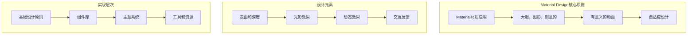

# 第7章：Material Design设计规范

## 📖 章节概述

本章将深入介绍Google的Material Design设计系统，这是Android应用设计的标准规范。通过学习Material Design的核心原则、组件库使用、主题定制和设计实现，您将能够创建现代、美观且一致的用户界面。

## 🎯 学习目标

- 理解Material Design的设计理念和核心原则
- 掌握Material Components组件库的使用
- 学会创建和定制Material Design主题
- 了解颜色、字体、间距等设计系统的应用
- 掌握响应式设计和自适应布局
- 能够实现符合Material Design规范的完整应用

## 🎨 Material Design概述

### 设计理念

Material Design是Google在2014年推出的一套全面的设计规范，其核心理念基于现实世界的纸张和墨水隐喻：



### Material Design 3.0新特性

Material Design 3.0（You）是最新版本，引入了以下重要特性：

1. **动态颜色系统**：基于用户壁纸自动生成配色方案
2. **个性化定制**：更多样化的设计选择
3. **改进的组件**：重新设计的UI组件库
4. **更好的可访问性**：增强的无障碍支持

## 🎨 颜色系统

### 颜色角色定义

Material Design 3.0使用颜色角色系统，每个角色都有特定的用途：

```xml
<!-- res/values/colors.xml -->
<?xml version="1.0" encoding="utf-8"?>
<resources>
    <!-- Material Design 3.0 颜色系统 -->

    <!-- Primary Colors -->
    <color name="md_theme_light_primary">#6750A4</color>
    <color name="md_theme_light_onPrimary">#FFFFFF</color>
    <color name="md_theme_light_primaryContainer">#EADDFF</color>
    <color name="md_theme_light_onPrimaryContainer">#21005D</color>

    <!-- Secondary Colors -->
    <color name="md_theme_light_secondary">#625B71</color>
    <color name="md_theme_light_onSecondary">#FFFFFF</color>
    <color name="md_theme_light_secondaryContainer">#E8DEF8</color>
    <color name="md_theme_light_onSecondaryContainer">#1D192B</color>

    <!-- Tertiary Colors -->
    <color name="md_theme_light_tertiary">#7D5260</color>
    <color name="md_theme_light_onTertiary">#FFFFFF</color>
    <color name="md_theme_light_tertiaryContainer">#FFD8E4</color>
    <color name="md_theme_light_onTertiaryContainer">#31111D</color>

    <!-- Error Colors -->
    <color name="md_theme_light_error">#BA1A1A</color>
    <color name="md_theme_light_onError">#FFFFFF</color>
    <color name="md_theme_light_errorContainer">#FFDAD6</color>
    <color name="md_theme_light_onErrorContainer">#410002</color>

    <!-- Background Colors -->
    <color name="md_theme_light_background">#FFFBFE</color>
    <color name="md_theme_light_onBackground">#1C1B1F</color>
    <color name="md_theme_light_surface">#FFFBFE</color>
    <color name="md_theme_light_onSurface">#1C1B1F</color>

    <!-- Surface Variants -->
    <color name="md_theme_light_surfaceVariant">#E7E0EC</color>
    <color name="md_theme_light_onSurfaceVariant">#49454F</color>
    <color name="md_theme_light_outline">#79747E</color>
    <color name="md_theme_light_outlineVariant">#CAC4D0</color>

    <!-- Dark Theme Colors -->
    <color name="md_theme_dark_primary">#D0BCFF</color>
    <color name="md_theme_dark_onPrimary">#381E72</color>
    <color name="md_theme_dark_primaryContainer">#4F378B</color>
    <color name="md_theme_dark_onPrimaryContainer">#EADDFF</color>

    <color name="md_theme_dark_secondary">#CCC2DC</color>
    <color name="md_theme_dark_onSecondary">#332D41</color>
    <color name="md_theme_dark_secondaryContainer">#494458</color>
    <color name="md_theme_dark_onSecondaryContainer">#E8DEF8</color>

    <color name="md_theme_dark_background">#1C1B1F</color>
    <color name="md_theme_dark_onBackground">#E6E1E5</color>
    <color name="md_theme_dark_surface">#1C1B1F</color>
    <color name="md_theme_dark_onSurface">#E6E1E5</color>

    <!-- Semantic Colors - 用于特定UI元素 -->
    <color name="surface_bright">#FFF8FD</color>
    <color name="surface_dim">#DDD8DD</color>
    <color name="surface_container_lowest">#FFFFFF</color>
    <color name="surface_container_low">#F7F2FA</color>
    <color name="surface_container">#F1ECF4</color>
    <color name="surface_container_high">#ECE6F0</color>
    <color name="surface_container_highest">#E6E0E9</color>

</resources>
```

### 动态颜色实现

```java
/**
 * 动态颜色系统实现
 */
public class DynamicColorUtils {

    /**
     * 检查设备是否支持动态颜色
     */
    public static boolean isDynamicColorAvailable() {
        return Build.VERSION.SDK_INT >= Build.VERSION_CODES.S;
    }

    /**
     * 应用动态颜色到主题
     */
    public static void applyDynamicColor(Activity activity) {
        if (isDynamicColorAvailable()) {
            Context context = activity;

            // 获取系统颜色方案
            int primaryColor = ContextCompat.getColor(context,
                com.google.android.material.R.color.material_dynamic_primary70);
            int secondaryColor = ContextCompat.getColor(context,
                com.google.android.material.R.color.material_dynamic_secondary70);
            int tertiaryColor = ContextCompat.getColor(context,
                com.google.android.material.R.color.material_dynamic_tertiary70);

            // 应用到状态栏
            Window window = activity.getWindow();
            window.setStatusBarColor(primaryColor);
            window.setNavigationBarColor(context.getColor(android.R.color.transparent));
            window.setNavigationBarContrastEnforced(false);
        }
    }

    /**
     * 从WallpaperManager获取壁纸颜色
     */
    @RequiresApi(api = Build.VERSION_CODES.S)
    public static void extractColorsFromWallpaper(Context context, OnColorsExtractedListener listener) {
        WallpaperManager wallpaperManager = WallpaperManager.getInstance(context);
        if (wallpaperManager.isWallpaperSupported()) {
            wallpaperManager.getWallpaperColors(WallpaperManager.FLAG_SYSTEM,
                context.getMainExecutor(), colors -> {
                    if (colors != null && colors.getPrimaryColor() != null) {
                        listener.onColorsExtracted(colors);
                    }
                });
        }
    }

    public interface OnColorsExtractedListener {
        void onColorsExtracted(WallpaperColors colors);
    }
}
```

## 🎭 主题系统

### 主题配置

```xml
<!-- res/values/themes.xml -->
<resources xmlns:tools="http://schemas.android.com/tools">
    <!-- Base application theme -->
    <style name="Theme.TodoMaster" parent="Theme.Material3.DayNight.NoActionBar">
        <!-- Primary brand color -->
        <item name="colorPrimary">@color/md_theme_light_primary</item>
        <item name="colorOnPrimary">@color/md_theme_light_onPrimary</item>
        <item name="colorPrimaryContainer">@color/md_theme_light_primaryContainer</item>
        <item name="colorOnPrimaryContainer">@color/md_theme_light_onPrimaryContainer</item>

        <!-- Secondary brand color -->
        <item name="colorSecondary">@color/md_theme_light_secondary</item>
        <item name="colorOnSecondary">@color/md_theme_light_onSecondary</item>
        <item name="colorSecondaryContainer">@color/md_theme_light_secondaryContainer</item>
        <item name="colorOnSecondaryContainer">@color/md_theme_light_onSecondaryContainer</item>

        <!-- Tertiary brand color -->
        <item name="colorTertiary">@color/md_theme_light_tertiary</item>
        <item name="colorOnTertiary">@color/md_theme_light_onTertiary</item>
        <item name="colorTertiaryContainer">@color/md_theme_light_tertiaryContainer</item>
        <item name="colorOnTertiaryContainer">@color/md_theme_light_onTertiaryContainer</item>

        <!-- Custom colors -->
        <item name="colorError">@color/md_theme_light_error</item>
        <item name="colorOnError">@color/md_theme_light_onError</item>
        <item name="colorErrorContainer">@color/md_theme_light_errorContainer</item>
        <item name="colorOnErrorContainer">@color/md_theme_light_onErrorContainer</item>

        <!-- Surface colors -->
        <item name="android:colorBackground">@color/md_theme_light_background</item>
        <item name="colorOnBackground">@color/md_theme_light_onBackground</item>
        <item name="colorSurface">@color/md_theme_light_surface</item>
        <item name="colorOnSurface">@color/md_theme_light_onSurface</item>
        <item name="colorSurfaceVariant">@color/md_theme_light_surfaceVariant</item>
        <item name="colorOnSurfaceVariant">@color/md_theme_light_onSurfaceVariant</item>
        <item name="colorOutline">@color/md_theme_light_outline</item>
        <item name="colorOutlineVariant">@color/md_theme_light_outlineVariant</item>

        <!-- Status bar -->
        <item name="android:statusBarColor">@android:color/transparent</item>
        <item name="android:windowLightStatusBar">true</item>

        <!-- Navigation bar -->
        <item name="android:navigationBarColor">@android:color/transparent</item>
        <item name="android:windowLightNavigationBar">true</item>

        <!-- Enable edge-to-edge display -->
        <item name="android:windowDrawsSystemBarBackgrounds">true</item>
        <item name="android:fitsSystemWindows">false</item>

        <!-- Typography -->
        <item name="textAppearanceHeadlineLarge">@style/TextAppearance.TodoMaster.HeadlineLarge</item>
        <item name="textAppearanceHeadlineMedium">@style/TextAppearance.TodoMaster.HeadlineMedium</item>
        <item name="textAppearanceHeadlineSmall">@style/TextAppearance.TodoMaster.HeadlineSmall</item>
        <item name="textAppearanceTitleLarge">@style/TextAppearance.TodoMaster.TitleLarge</item>
        <item name="textAppearanceTitleMedium">@style/TextAppearance.TodoMaster.TitleMedium</item>
        <item name="textAppearanceTitleSmall">@style/TextAppearance.TodoMaster.TitleSmall</item>
        <item name="textAppearanceBodyLarge">@style/TextAppearance.TodoMaster.BodyLarge</item>
        <item name="textAppearanceBodyMedium">@style/TextAppearance.TodoMaster.BodyMedium</item>
        <item name="textAppearanceBodySmall">@style/TextAppearance.TodoMaster.BodySmall</item>
        <item name="textAppearanceLabelLarge">@style/TextAppearance.TodoMaster.LabelLarge</item>
        <item name="textAppearanceLabelMedium">@style/TextAppearance.TodoMaster.LabelMedium</item>
        <item name="textAppearanceLabelSmall">@style/TextAppearance.TodoMaster.LabelSmall</item>

        <!-- Shape -->
        <item name="shapeAppearanceSmallComponent">@style/ShapeAppearance.TodoMaster.SmallComponent</item>
        <item name="shapeAppearanceMediumComponent">@style/ShapeAppearance.TodoMaster.MediumComponent</item>
        <item name="shapeAppearanceLargeComponent">@style/ShapeAppearance.TodoMaster.LargeComponent</item>
    </style>

    <!-- NoActionBar theme for activities without toolbar -->
    <style name="Theme.TodoMaster.NoActionBar" parent="Theme.TodoMaster">
        <item name="windowActionBar">false</item>
        <item name="windowNoTitle">true</item>
    </style>

    <!-- Splash screen theme -->
    <style name="Theme.TodoMaster.Splash" parent="Theme.SplashScreen">
        <item name="windowSplashScreenBackground">@color/md_theme_light_primary</item>
        <item name="windowSplashScreenAnimatedIcon">@drawable/ic_launcher_foreground</item>
        <item name="windowSplashScreenAnimationDuration">1000</item>
        <item name="postSplashScreenTheme">@style/Theme.TodoMaster</item>
    </style>
</resources>
```

### 字体系统

```xml
<!-- res/values/styles.xml -->
<resources>
    <!-- Typography Styles -->
    <style name="TextAppearance.TodoMaster.HeadlineLarge" parent="TextAppearance.Material3.HeadlineLarge">
        <item name="android:textSize">32sp</item>
        <item name="android:fontFamily">@font/roboto_bold</item>
        <item name="android:letterSpacing">0</item>
        <item name="android:textColor">?attr/colorOnSurface</item>
    </style>

    <style name="TextAppearance.TodoMaster.HeadlineMedium" parent="TextAppearance.Material3.HeadlineMedium">
        <item name="android:textSize">28sp</item>
        <item name="android:fontFamily">@font/roboto_bold</item>
        <item name="android:letterSpacing">0</item>
        <item name="android:textColor">?attr/colorOnSurface</item>
    </style>

    <style name="TextAppearance.TodoMaster.HeadlineSmall" parent="TextAppearance.Material3.HeadlineSmall">
        <item name="android:textSize">24sp</item>
        <item name="android:fontFamily">@font/roboto_bold</item>
        <item name="android:letterSpacing">0</item>
        <item name="android:textColor">?attr/colorOnSurface</item>
    </style>

    <style name="TextAppearance.TodoMaster.TitleLarge" parent="TextAppearance.Material3.TitleLarge">
        <item name="android:textSize">22sp</item>
        <item name="android:fontFamily">@font/roboto_medium</item>
        <item name="android:letterSpacing">0</item>
        <item name="android:textColor">?attr/colorOnSurface</item>
    </style>

    <style name="TextAppearance.TodoMaster.TitleMedium" parent="TextAppearance.Material3.TitleMedium">
        <item name="android:textSize">16sp</item>
        <item name="android:fontFamily">@font/roboto_medium</item>
        <item name="android:letterSpacing">0.1</item>
        <item name="android:textColor">?attr/colorOnSurface</item>
    </style>

    <style name="TextAppearance.TodoMaster.TitleSmall" parent="TextAppearance.Material3.TitleSmall">
        <item name="android:textSize">14sp</item>
        <item name="android:fontFamily">@font/roboto_medium</item>
        <item name="android:letterSpacing">0.1</item>
        <item name="android:textColor">?attr/colorOnSurface</item>
    </style>

    <style name="TextAppearance.TodoMaster.BodyLarge" parent="TextAppearance.Material3.BodyLarge">
        <item name="android:textSize">16sp</item>
        <item name="android:fontFamily">@font/roboto_regular</item>
        <item name="android:letterSpacing">0.5</item>
        <item name="android:textColor">?attr/colorOnSurface</item>
    </style>

    <style name="TextAppearance.TodoMaster.BodyMedium" parent="TextAppearance.Material3.BodyMedium">
        <item name="android:textSize":14sp</item>
        <item name="android:fontFamily">@font/roboto_regular</item>
        <item name="android:letterSpacing">0.25</item>
        <item name="android:textColor">?attr/colorOnSurface</item>
    </style>

    <style name="TextAppearance.TodoMaster.BodySmall" parent="TextAppearance.Material3.BodySmall">
        <item name="android:textSize">12sp</item>
        <item name="android:fontFamily">@font/roboto_regular</item>
        <item name="android:letterSpacing">0.4</item>
        <item name="android:textColor">?attr/colorOnSurfaceVariant</item>
    </style>

    <style name="TextAppearance.TodoMaster.LabelLarge" parent="TextAppearance.Material3.LabelLarge">
        <item name="android:textSize">14sp</item>
        <item name="android:fontFamily">@font/roboto_medium</item>
        <item name="android:letterSpacing">0.1</item>
        <item name="android:textColor">?attr/colorOnSurfaceVariant</item>
    </style>

    <style name="TextAppearance.TodoMaster.LabelMedium" parent="TextAppearance.Material3.LabelMedium">
        <item name="android:textSize">12sp</item>
        <item name="android:fontFamily">@font/roboto_medium</item>
        <item name="android:letterSpacing">0.5</item>
        <item name="android:textColor">?attr/colorOnSurfaceVariant</item>
    </style>

    <style name="TextAppearance.TodoMaster.LabelSmall" parent="TextAppearance.Material3.LabelSmall">
        <item name="android:textSize">11sp</item>
        <item name="android:fontFamily">@font/roboto_medium</item>
        <item name="android:letterSpacing">0.5</item>
        <item name="android:textColor">?attr/colorOnSurfaceVariant</item>
    </style>
</resources>
```

### 形状系统

```xml
<!-- res/values/styles.xml -->
<resources>
    <!-- Shape Styles -->
    <style name="ShapeAppearance.TodoMaster.SmallComponent" parent="ShapeAppearance.Material3.SmallComponent">
        <item name="cornerFamily">rounded</item>
        <item name="cornerSize">4dp</item>
    </style>

    <style name="ShapeAppearance.TodoMaster.MediumComponent" parent="ShapeAppearance.Material3.MediumComponent">
        <item name="cornerFamily">rounded</item>
        <item name="cornerSize">8dp</item>
    </style>

    <style name="ShapeAppearance.TodoMaster.LargeComponent" parent="ShapeAppearance.Material3.LargeComponent">
        <item name="cornerFamily">rounded</item>
        <item name="cornerSize">16dp</item>
    </style>

    <!-- Custom shape styles -->
    <style name="ShapeAppearance.TodoMaster.CornerCut" parent="">
        <item name="cornerFamily">cut</item>
        <item name="cornerSize">8dp</item>
    </style>

    <style name="ShapeAppearance.TodoMaster.Circle" parent="">
        <item name="cornerFamily">rounded</item>
        <item name="cornerSize">50%</item>
    </style>
</resources>
```

## 🎨 Material Components组件库

### 按钮组件

Material Design提供了多种按钮样式：

```xml
<!-- 基础按钮样式 -->
<com.google.android.material.button.MaterialButton
    android:layout_width="wrap_content"
    android:layout_height="wrap_content"
    android:text="Filled Button"
    app:cornerRadius="8dp"
    app:strokeWidth="0dp"
    app:rippleColor="?attr/colorPrimary"
    app:icon="@drawable/ic_add"
    app:iconGravity="textStart" />

<!-- 轮廓按钮 -->
<com.google.android.material.button.MaterialButton
    android:layout_width="wrap_content"
    android:layout_height="wrap_content"
    android:text="Outlined Button"
    style="@style/Widget.Material3.Button.OutlinedButton"
    app:strokeColor="?attr/colorPrimary"
    app:strokeWidth="1dp"
    app:cornerRadius="8dp" />

<!-- 文本按钮 -->
<com.google.android.material.button.MaterialButton
    android:layout_width="wrap_content"
    android:layout_height="wrap_content"
    android:text="Text Button"
    style="@style/Widget.Material3.Button.TextButton"
    android:textColor="?attr/colorPrimary" />

<!-- 切换按钮组 -->
<com.google.android.material.button.MaterialButtonToggleGroup
    android:layout_width="wrap_content"
    android:layout_height="wrap_content"
    android:orientation="horizontal"
    app:selectionRequired="true"
    app:singleSelection="true">

    <com.google.android.material.button.MaterialButton
        android:layout_width="wrap_content"
        android:layout_height="wrap_content"
        android:text="选项1"
        style="@style/Widget.Material3.Button.OutlinedButton" />

    <com.google.android.material.button.MaterialButton
        android:layout_width="wrap_content"
        android:layout_height="wrap_content"
        android:text="选项2"
        style="@style/Widget.Material3.Button.OutlinedButton" />

</com.google.android.material.button.MaterialButtonToggleGroup>
```

### 卡片组件

```xml
<!-- 基础卡片 -->
<com.google.android.material.card.MaterialCardView
    android:layout_width="match_parent"
    android:layout_height="wrap_content"
    android:layout_margin="16dp"
    app:cardCornerRadius="12dp"
    app:cardElevation="4dp"
    app:cardBackgroundColor="?attr/colorSurface"
    app:rippleColor="?attr/colorPrimary"
    android:clickable="true"
    android:focusable="true">

    <LinearLayout
        android:layout_width="match_parent"
        android:layout_height="wrap_content"
        android:orientation="vertical"
        android:padding="16dp">

        <TextView
            android:layout_width="match_parent"
            android:layout_height="wrap_content"
            android:text="卡片标题"
            android:textAppearance="?attr/textAppearanceTitleLarge" />

        <TextView
            android:layout_width="match_parent"
            android:layout_height="wrap_content"
            android:layout_marginTop="8dp"
            android:text="这是卡片的内容描述，可以包含多行文本。"
            android:textAppearance="?attr/textAppearanceBodyMedium" />

        <Button
            android:layout_width="wrap_content"
            android:layout_height="wrap_content"
            android:layout_marginTop="16dp"
            android:text="操作按钮"
            style="@style/Widget.Material3.Button.TextButton" />

    </LinearLayout>

</com.google.android.material.card.MaterialCardView>

<!-- 带图片的卡片 -->
<com.google.android.material.card.MaterialCardView
    android:layout_width="match_parent"
    android:layout_height="wrap_content"
    android:layout_margin="16dp"
    app:cardCornerRadius="12dp"
    app:cardElevation="6dp">

    <LinearLayout
        android:layout_width="match_parent"
        android:layout_height="wrap_content"
        android:orientation="vertical">

        <ImageView
            android:layout_width="match_parent"
            android:layout_height="200dp"
            android:src="@drawable/sample_image"
            android:scaleType="centerCrop" />

        <LinearLayout
            android:layout_width="match_parent"
            android:layout_height="wrap_content"
            android:orientation="vertical"
            android:padding="16dp">

            <TextView
                android:layout_width="match_parent"
                android:layout_height="wrap_content"
                android:text="带图片的卡片标题"
                android:textAppearance="?attr/textAppearanceTitleLarge" />

            <TextView
                android:layout_width="match_parent"
                android:layout_height="wrap_content"
                android:layout_marginTop="8dp"
                android:text="这是包含图片的卡片内容描述。"
                android:textAppearance="?attr/textAppearanceBodyMedium" />

        </LinearLayout>

    </LinearLayout>

</com.google.android.material.card.MaterialCardView>
```

### 输入组件

```xml
<!-- 文本输入框 -->
<com.google.android.material.textfield.TextInputLayout
    android:layout_width="match_parent"
    android:layout_height="wrap_content"
    android:layout_margin="16dp"
    android:hint="用户名"
    app:hintEnabled="true"
    app:hintTextColor="?attr/colorPrimary"
    app:boxStrokeColor="?attr/colorPrimary"
    app:boxStrokeWidth="2dp"
    app:boxCornerRadiusTopStart="8dp"
    app:boxCornerRadiusTopEnd="8dp"
    app:boxCornerRadiusBottomStart="8dp"
    app:boxCornerRadiusBottomEnd="8dp"
    app:startIconDrawable="@drawable/ic_person"
    app:endIconMode="clear_text"
    app:helperText="请输入3-20个字符"
    app:helperTextTextColor="?attr/colorOnSurfaceVariant"
    app:errorEnabled="true">

    <com.google.android.material.textfield.TextInputEditText
        android:layout_width="match_parent"
        android:layout_height="wrap_content"
        android:inputType="text"
        android:maxLines="1" />

</com.google.android.material.textfield.TextInputLayout>

<!-- 密码输入框 -->
<com.google.android.material.textfield.TextInputLayout
    android:layout_width="match_parent"
    android:layout_height="wrap_content"
    android:layout_margin="16dp"
    android:hint="密码"
    app:passwordToggleEnabled="true"
    app:passwordToggleTint="?attr/colorOnSurfaceVariant"
    app:helperText="至少8个字符，包含字母和数字"
    app:counterEnabled="true"
    app:counterMaxLength="20">

    <com.google.android.material.textfield.TextInputEditText
        android:layout_width="match_parent"
        android:layout_height="wrap_content"
        android:inputType="textPassword"
        android:maxLines="1" />

</com.google.android.material.textfield.TextInputLayout>

<!-- 下拉选择框 -->
<com.google.android.material.textfield.TextInputLayout
    android:layout_width="match_parent"
    android:layout_height="wrap_content"
    android:layout_margin="16dp"
    android:hint="选择类别"
    style="@style/Widget.Material3.TextInputLayout.ExposedDropdownMenu"
    app:startIconDrawable="@drawable/ic_category">

    <AutoCompleteTextView
        android:layout_width="match_parent"
        android:layout_height="wrap_content"
        android:inputType="none" />

</com.google.android.material.textfield.TextInputLayout>
```

### 底部导航栏

```xml
<com.google.android.material.bottomnavigation.BottomNavigationView
    android:id="@+id/bottomNavigation"
    android:layout_width="match_parent"
    android:layout_height="wrap_content"
    android:layout_gravity="bottom"
    app:menu="@menu/bottom_navigation_menu"
    app:labelVisibilityMode="selected"
    app:itemIconTint="@color/bottom_nav_color_selector"
    app:itemTextColor="@color/bottom_nav_color_selector"
    app:itemRippleColor="?attr/colorPrimary"
    app:elevation="8dp" />
```

```xml
<!-- res/menu/bottom_navigation_menu.xml -->
<?xml version="1.0" encoding="utf-8"?>
<menu xmlns:android="http://schemas.android.com/apk/res/android"
      xmlns:app="http://schemas.android.com/apk/res-auto">

    <item
        android:id="@+id/navigation_home"
        android:icon="@drawable/ic_home"
        android:title="首页"
        app:showAsAction="ifRoom" />

    <item
        android:id="@+id/navigation_search"
        android:icon="@drawable/ic_search"
        android:title="搜索"
        app:showAsAction="ifRoom" />

    <item
        android:id="@+id/navigation_add"
        android:icon="@drawable/ic_add"
        android:title="添加"
        app:showAsAction="ifRoom" />

    <item
        android:id="@+id/navigation_profile"
        android:icon="@drawable/ic_person"
        android:title="我的"
        app:showAsAction="ifRoom" />

</menu>
```

## 📱 响应式设计

### 断点系统

Material Design定义了标准的屏幕尺寸断点：

```xml
<!-- res/values/dimens.xml -->
<resources>
    <!-- 手机断点 -->
    <dimen name="compact_width">0dp</dimen>
    <dimen name="medium_width">600dp</dimen>
    <dimen name="expanded_width">840dp</dimen>

    <!-- 间距系统 -->
    <dimen name="spacing_xs">4dp</dimen>
    <dimen name="spacing_sm">8dp</dimen>
    <dimen name="spacing_md">16dp</dimen>
    <dimen name="spacing_lg">24dp</dimen>
    <dimen name="spacing_xl">32dp</dimen>
</resources>

<!-- res/values-w600dp/dimens.xml -->
<resources>
    <!-- 平板适配 -->
    <dimen name="spacing_md">24dp</dimen>
    <dimen name="spacing_lg">32dp</dimen>
</resources>
```

### 自适应布局实现

```java
/**
 * 响应式布局管理器
 */
public class ResponsiveLayoutManager {

    public enum WindowSizeClass {
        COMPACT,    // 手机竖屏
        MEDIUM,     // 手机横屏/小平板
        EXPANDED    // 大平板
    }

    public static WindowSizeClass computeWindowSizeClass(WindowMetrics windowMetrics) {
        float widthDp = windowMetrics.getBounds().width() /
                       windowMetrics.getWindowManager().getDefaultDisplay().getDensity();

        if (widthDp < 600f) {
            return WindowSizeClass.COMPACT;
        } else if (widthDp < 840f) {
            return WindowSizeClass.MEDIUM;
        } else {
            return WindowSizeClass.EXPANDED;
        }
    }

    public static void applyResponsiveLayout(Activity activity) {
        WindowMetrics windowMetrics = WindowMetricsCalculator.getOrCreate()
            .computeCurrentWindowMetrics(activity);
        WindowSizeClass sizeClass = computeWindowSizeClass(windowMetrics);

        switch (sizeClass) {
            case COMPACT:
                applyCompactLayout(activity);
                break;
            case MEDIUM:
                applyMediumLayout(activity);
                break;
            case EXPANDED:
                applyExpandedLayout(activity);
                break;
        }
    }

    private static void applyCompactLayout(Activity activity) {
        // 手机竖屏布局
        // 单列布局，底部导航
    }

    private static void applyMediumLayout(Activity activity) {
        // 平板布局
        // 双列布局，侧边导航
    }

    private static void applyExpandedLayout(Activity activity) {
        // 大平板布局
        // 三列布局，侧边导航栏
    }
}
```

## 🎨 设计工具和资源

### Material Theme Builder

Google提供了Material Theme Builder在线工具，帮助开发者快速生成主题：

1. 访问 [material.io/resources/theme-builder](https://material.io/resources/theme-builder/)
2. 选择颜色、字体和形状
3. 导出主题代码
4. 集成到Android项目中

### Figma插件

Material Design提供了Figma插件，支持设计师直接在Figma中创建Material Design界面：

1. Material Design Kit
2. Accessibility Checker
3. Theme Builder

### 代码生成工具

```java
/**
 * 主题代码生成器
 */
public class ThemeCodeGenerator {

    /**
     * 生成颜色主题代码
     */
    public static String generateColorThemeColors(Map<String, String> colors) {
        StringBuilder xmlBuilder = new StringBuilder();
        xmlBuilder.append("<?xml version=\"1.0\" encoding=\"utf-8\"?>\n");
        xmlBuilder.append("<resources>\n");

        for (Map.Entry<String, String> entry : colors.entrySet()) {
            xmlBuilder.append(String.format("    <color name=\"%s\">%s</color>\n",
                entry.getKey(), entry.getValue()));
        }

        xmlBuilder.append("</resources>");
        return xmlBuilder.toString();
    }

    /**
     * 生成主题样式代码
     */
    public static String generateThemeStyles(String themeName, Map<String, Object> attributes) {
        StringBuilder xmlBuilder = new StringBuilder();
        xmlBuilder.append(String.format("    <style name=\"%s\" parent=\"Theme.Material3.DayNight.NoActionBar\">\n", themeName));

        for (Map.Entry<String, Object> entry : attributes.entrySet()) {
            xmlBuilder.append(String.format("        <item name=\"%s\">%s</item>\n",
                entry.getKey(), entry.getValue().toString()));
        }

        xmlBuilder.append("    </style>\n");
        return xmlBuilder.toString();
    }
}
```

## 🎯 小结

本章详细介绍了Material Design设计规范的核心概念和实现方法，主要内容包括：

### 核心内容总结

1. **Material Design概述**
   - 设计理念和核心原则
   - Material Design 3.0新特性
   - 动态颜色系统

2. **颜色系统**
   - 颜色角色定义和使用
   - 主题颜色配置
   - 动态颜色实现

3. **主题系统**
   - 主题配置和继承
   - 字体系统和排版
   - 形状系统定制

4. **Material Components**
   - 按钮组件的使用
   - 卡片组件设计
   - 输入组件配置
   - 导航组件实现

5. **响应式设计**
   - 断点系统和适配
   - 窗口尺寸分类
   - 自适应布局实现

6. **设计工具和资源**
   - Material Theme Builder使用
   - Figma设计工具集成
   - 代码生成和自动化

### 学习要点

- **设计原则**：理解Material Design的设计理念和原则
- **组件使用**：熟练掌握各种Material Components组件
- **主题定制**：能够创建和定制Material Design主题
- **响应式设计**：实现适配多种屏幕尺寸的界面
- **工具应用**：使用官方设计工具提高开发效率

### 最佳实践

1. **一致性**：在整个应用中保持设计一致性
2. **可访问性**：考虑无障碍设计，提高应用可用性
3. **性能**：优化主题和组件的性能表现
4. **适应性**：设计适配不同设备和屏幕尺寸
5. **用户反馈**：提供清晰的交互反馈和状态指示

### 下一步

下一章将学习自定义View的开发，深入了解如何创建独特的UI组件。

## 📚 延伸阅读

- [Material Design官方文档](https://material.io/design)
- [Material Components for Android](https://github.com/material-components/material-components-android)
- [Material Theme Builder](https://material.io/resources/theme-builder)
- [Material Design Figma插件](https://www.figma.com/community/plugin/747594211859733231)