# 第8章：自定义View开发入门

## 📖 章节概述

本章将详细介绍Android自定义View的开发，从基础概念到高级实现。通过学习View的绘制流程、事件处理、属性配置和性能优化，您将能够创建独特、高效的自定义UI组件。

## 🎯 学习目标

- 理解View的测量、布局、绘制三大流程
- 掌握Canvas绘制API的使用方法
- 学会处理触摸事件和手势识别
- 了解自定义属性的定义和使用
- 掌握View性能优化技巧
- 能够独立开发复杂的自定义View组件

## 🏗️ View绘制流程回顾

### 三大核心流程详解

```mermaid
graph TB
    subgraph "View绘制完整流程"
        A[RequestLayout] --> B[Measure测量]
        B --> C[Layout布局]
        C --> D[Draw绘制]
        D --> E[Display显示]
    end

    subgraph "Measure测量阶段"
        F[onMeasure] --> G[测量自身尺寸]
        G --> H[测量子View尺寸]
        H --> I[设置测量结果]
    end

    subgraph "Layout布局阶段"
        J[onLayout] --> K[计算自身位置]
        K --> L[布局子View位置]
        L --> M[保存布局信息]
    end

    subgraph "Draw绘制阶段"
        N[onDraw] --> O[绘制背景]
        O --> P[绘制内容]
        P --> Q[绘制子View]
        Q --> R[绘制前景]
    end
```



### 自定义View基础结构

```java
/**
 * 自定义View基础模板
 */
public class CustomView extends View {

    // 画笔对象
    private Paint paint;
    private Paint textPaint;

    // 尺寸相关
    private int viewWidth;
    private int viewHeight;

    // 自定义属性
    private int customColor;
    private float customSize;
    private String customText;

    public CustomView(Context context) {
        super(context);
        init(null);
    }

    public CustomView(Context context, AttributeSet attrs) {
        super(context, attrs);
        init(attrs);
    }

    public CustomView(Context context, AttributeSet attrs, int defStyleAttr) {
        super(context, attrs, defStyleAttr);
        init(attrs);
    }

    /**
     * 初始化方法
     */
    private void init(AttributeSet attrs) {
        // 初始化画笔
        initPaints();

        // 解析自定义属性
        if (attrs != null) {
            initAttributes(attrs);
        }

        // 设置其他初始化配置
        setupView();
    }

    /**
     * 初始化画笔
     */
    private void initPaints() {
        // 主要画笔
        paint = new Paint(Paint.ANTI_ALIAS_FLAG);
        paint.setColor(Color.BLUE);
        paint.setStyle(Paint.Style.FILL);
        paint.setStrokeWidth(4f);

        // 文本画笔
        textPaint = new Paint(Paint.ANTI_ALIAS_FLAG);
        textPaint.setColor(Color.WHITE);
        textPaint.setTextSize(48f);
        textPaint.setTextAlign(Paint.Align.CENTER);
        textPaint.setTypeface(Typeface.DEFAULT_BOLD);
    }

    /**
     * 解析自定义属性
     */
    private void initAttributes(AttributeSet attrs) {
        TypedArray a = getContext().obtainStyledAttributes(attrs, R.styleable.CustomView);

        try {
            customColor = a.getColor(R.styleable.CustomView_customColor, Color.BLUE);
            customSize = a.getDimension(R.styleable.CustomView_customSize, 100f);
            customText = a.getString(R.styleable.CustomView_customText);

            // 应用属性到画笔
            paint.setColor(customColor);
        } finally {
            a.recycle();
        }
    }

    /**
     * 设置View配置
     */
    private void setupView() {
        // 设置点击事件
        setClickable(true);
        setFocusable(true);

        // 设置默认文本
        if (customText == null) {
            customText = "Custom";
        }
    }

    @Override
    protected void onMeasure(int widthMeasureSpec, int heightMeasureSpec) {
        super.onMeasure(widthMeasureSpec, heightMeasureSpec);

        // 获取测量模式和尺寸
        int widthMode = MeasureSpec.getMode(widthMeasureSpec);
        int widthSize = MeasureSpec.getSize(widthMeasureSpec);
        int heightMode = MeasureSpec.getMode(heightMeasureSpec);
        int heightSize = MeasureSpec.getSize(heightMeasureSpec);

        // 计算期望尺寸
        int desiredWidth = (int) (customSize * 2);
        int desiredHeight = (int) (customSize * 2);

        // 计算最终宽度
        int finalWidth;
        switch (widthMode) {
            case MeasureSpec.EXACTLY:
                finalWidth = widthSize;
                break;
            case MeasureSpec.AT_MOST:
                finalWidth = Math.min(desiredWidth, widthSize);
                break;
            case MeasureSpec.UNSPECIFIED:
            default:
                finalWidth = desiredWidth;
                break;
        }

        // 计算最终高度
        int finalHeight;
        switch (heightMode) {
            case MeasureSpec.EXACTLY:
                finalHeight = heightSize;
                break;
            case MeasureSpec.AT_MOST:
                finalHeight = Math.min(desiredHeight, heightSize);
                break;
            case MeasureSpec.UNSPECIFIED:
            default:
                finalHeight = desiredHeight;
                break;
        }

        // 设置测量尺寸
        setMeasuredDimension(finalWidth, finalHeight);
    }

    @Override
    protected void onSizeChanged(int w, int h, int oldw, int oldh) {
        super.onSizeChanged(w, h, oldw, oldh);

        // 保存View尺寸
        viewWidth = w;
        viewHeight = h;

        // 根据尺寸调整画笔
        float textSize = Math.min(w, h) / 4f;
        textPaint.setTextSize(textSize);
    }

    @Override
    protected void onDraw(Canvas canvas) {
        super.onDraw(canvas);

        // 绘制背景
        drawBackground(canvas);

        // 绘制主要内容
        drawContent(canvas);

        // 绘制文本
        drawText(canvas);
    }

    /**
     * 绘制背景
     */
    private void drawBackground(Canvas canvas) {
        // 绘制圆形背景
        float radius = Math.min(viewWidth, viewHeight) / 2f;
        canvas.drawCircle(viewWidth / 2f, viewHeight / 2f, radius, paint);
    }

    /**
     * 绘制主要内容
     */
    private void drawContent(Canvas canvas) {
        // 可以在这里绘制复杂的图形
        // 示例：绘制一些装饰性的圆圈
        paint.setAlpha(100);
        float smallRadius = customSize / 2f;
        canvas.drawCircle(viewWidth / 2f, viewHeight / 2f, smallRadius, paint);
        paint.setAlpha(255);
    }

    /**
     * 绘制文本
     */
    private void drawText(Canvas canvas) {
        // 绘制中心文本
        float textX = viewWidth / 2f;
        float textY = viewHeight / 2f - textPaint.ascent() / 2f;
        canvas.drawText(customText, textX, textY, textPaint);
    }

    // 公共方法
    public void setCustomColor(int color) {
        this.customColor = color;
        paint.setColor(color);
        invalidate(); // 重绘View
    }

    public void setCustomText(String text) {
        this.customText = text;
        invalidate();
    }

    public void setCustomSize(float size) {
        this.customSize = size;
        requestLayout(); // 重新测量和布局
    }
}
```

## 🎨 Canvas绘制详解

### 基础绘制方法

```java
/**
 * Canvas绘制示例View
 */
public class CanvasDrawingView extends View {

    private Paint paint;
    private Path path;
    private List<Shape> shapes;

    public CanvasDrawingView(Context context) {
        super(context);
        init();
    }

    public CanvasDrawingView(Context context, AttributeSet attrs) {
        super(context, attrs);
        init();
    }

    private void init() {
        paint = new Paint(Paint.ANTI_ALIAS_FLAG);
        path = new Path();
        shapes = new ArrayList<>();

        // 初始化示例图形
        initShapes();
    }

    private void initShapes() {
        // 添加各种图形用于演示
        shapes.add(new CircleShape(100, 100, 50, Color.RED));
        shapes.add(new RectShape(200, 50, 350, 200, Color.BLUE));
        shapes.add(new PathShape(createStarPath(400, 100, 50), Color.GREEN));
    }

    @Override
    protected void onDraw(Canvas canvas) {
        super.onDraw(canvas);

        // 保存画布状态
        canvas.save();

        // 绘制背景
        drawBackground(canvas);

        // 绘制各种图形
        drawShapes(canvas);

        // 绘制文字
        drawText(canvas);

        // 绘制路径
        drawPath(canvas);

        // 绘制图片
        drawBitmap(canvas);

        // 恢复画布状态
        canvas.restore();
    }

    /**
     * 绘制背景
     */
    private void drawBackground(Canvas canvas) {
        // 创建渐变背景
        Shader shader = new LinearGradient(
            0, 0, getWidth(), getHeight(),
            Color.parseColor("#FFE0B2"),
            Color.parseColor("#FFCC80"),
            Shader.TileMode.CLAMP
        );
        paint.setShader(shader);
        canvas.drawRect(0, 0, getWidth(), getHeight(), paint);
        paint.setShader(null);
    }

    /**
     * 绘制各种图形
     */
    private void drawShapes(Canvas canvas) {
        for (Shape shape : shapes) {
            paint.setColor(shape.color);
            shape.draw(canvas, paint);
        }
    }

    /**
     * 绘制文字
     */
    private void drawText(Canvas canvas) {
        paint.setColor(Color.BLACK);
        paint.setTextSize(48f);
        paint.setTypeface(Typeface.DEFAULT_BOLD);
        paint.setTextAlign(Paint.Align.CENTER);

        // 普通文字
        canvas.drawText("Canvas绘制", getWidth() / 2f, 250f, paint);

        // 设置文字样式
        paint.setStyle(Paint.Style.STROKE);
        paint.setStrokeWidth(2f);
        canvas.drawText("描边文字", getWidth() / 2f, 300f, paint);

        // 恢复填充样式
        paint.setStyle(Paint.Style.FILL);
    }

    /**
     * 绘制路径
     */
    private void drawPath(Canvas canvas) {
        // 创建波浪路径
        path.reset();
        path.moveTo(50, 350);
        path.quadTo(150, 320, 250, 350);
        path.quadTo(350, 380, 450, 350);

        paint.setColor(Color.MAGENTA);
        paint.setStyle(Paint.Style.STROKE);
        paint.setStrokeWidth(4f);
        canvas.drawPath(path, paint);

        // 填充路径
        path.reset();
        path.addCircle(500, 350, 30, Path.Direction.CW);
        paint.setStyle(Paint.Style.FILL);
        paint.setColor(Color.CYAN);
        canvas.drawPath(path, paint);
    }

    /**
     * 绘制图片
     */
    private void drawBitmap(Canvas canvas) {
        // 创建位图
        Bitmap bitmap = createSampleBitmap();
        if (bitmap != null) {
            canvas.drawBitmap(bitmap, 50, 400, paint);
        }
    }

    /**
     * 创建示例位图
     */
    private Bitmap createSampleBitmap() {
        int width = 100;
        int height = 100;
        Bitmap bitmap = Bitmap.createBitmap(width, height, Bitmap.Config.ARGB_8888);
        Canvas canvas = new Canvas(bitmap);

        // 绘制彩色格子
        Paint tempPaint = new Paint();
        tempPaint.setStyle(Paint.Style.FILL);

        int[] colors = {Color.RED, Color.GREEN, Color.BLUE, Color.YELLOW};
        for (int i = 0; i < 2; i++) {
            for (int j = 0; j < 2; j++) {
                tempPaint.setColor(colors[i * 2 + j]);
                canvas.drawRect(i * 50, j * 50, (i + 1) * 50, (j + 1) * 50, tempPaint);
            }
        }

        return bitmap;
    }

    /**
     * 创建星形路径
     */
    private Path createStarPath(float centerX, float centerY, float radius) {
        Path path = new Path();
        float[] points = new float[10]; // 5个外点 + 5个内点

        for (int i = 0; i < 10; i++) {
            float angle = (float) (i * Math.PI / 5 - Math.PI / 2);
            float r = (i % 2 == 0) ? radius : radius / 2f;
            points[i] = (float) (centerX + r * Math.cos(angle));
            points[i + 1] = (float) (centerY + r * Math.sin(angle));
        }

        path.moveTo(points[0], points[1]);
        for (int i = 2; i < points.length; i += 2) {
            path.lineTo(points[i], points[i + 1]);
        }
        path.close();

        return path;
    }

    // 形状接口和实现类
    private interface Shape {
        void draw(Canvas canvas, Paint paint);
        int color;
    }

    private static class CircleShape implements Shape {
        float x, y, radius;
        int color;

        CircleShape(float x, float y, float radius, int color) {
            this.x = x;
            this.y = y;
            this.radius = radius;
            this.color = color;
        }

        @Override
        public void draw(Canvas canvas, Paint paint) {
            canvas.drawCircle(x, y, radius, paint);
        }
    }

    private static class RectShape implements Shape {
        float left, top, right, bottom;
        int color;

        RectShape(float left, float top, float right, float bottom, int color) {
            this.left = left;
            this.top = top;
            this.right = right;
            this.bottom = bottom;
            this.color = color;
        }

        @Override
        public void draw(Canvas canvas, Paint paint) {
            canvas.drawRect(left, top, right, bottom, paint);
        }
    }

    private static class PathShape implements Shape {
        Path path;
        int color;

        PathShape(Path path, int color) {
            this.path = path;
            this.color = color;
        }

        @Override
        public void draw(Canvas canvas, Paint paint) {
            canvas.drawPath(path, paint);
        }
    }
}
```

## 👆 事件处理和手势识别

### 触摸事件处理

```java
/**
 * 触摸事件处理示例View
 */
public class TouchHandlingView extends View {

    private float lastTouchX, lastTouchY;
    private boolean isDragging;
    private List<TouchPoint> touchPoints = new ArrayList<>();
    private Paint paint;
    private Path currentPath;

    public TouchHandlingView(Context context) {
        super(context);
        init();
    }

    public TouchHandlingView(Context context, AttributeSet attrs) {
        super(context, attrs);
        init();
    }

    private void init() {
        paint = new Paint(Paint.ANTI_ALIAS_FLAG);
        paint.setColor(Color.BLUE);
        paint.setStrokeWidth(8f);
        paint.setStyle(Paint.Style.STROKE);
        paint.setStrokeCap(Paint.Cap.ROUND);
        paint.setStrokeJoin(Paint.Join.ROUND);

        currentPath = new Path();
    }

    @Override
    public boolean onTouchEvent(MotionEvent event) {
        // 获取触摸点的坐标
        float x = event.getX();
        float y = event.getY();

        switch (event.getAction()) {
            case MotionEvent.ACTION_DOWN:
                handleActionDown(x, y);
                return true;

            case MotionEvent.ACTION_MOVE:
                handleActionMove(x, y);
                return true;

            case MotionEvent.ACTION_UP:
                handleActionUp(x, y);
                return true;

            case MotionEvent.ACTION_CANCEL:
                handleActionCancel();
                return true;
        }

        return super.onTouchEvent(event);
    }

    /**
     * 处理手指按下事件
     */
    private void handleActionDown(float x, float y) {
        lastTouchX = x;
        lastTouchY = y;
        isDragging = false;

        // 开始新的路径
        currentPath.reset();
        currentPath.moveTo(x, y);

        // 添加触摸点
        touchPoints.add(new TouchPoint(x, y, System.currentTimeMillis()));

        // 显示按下效果
        showPressEffect(x, y);
    }

    /**
     * 处理手指移动事件
     */
    private void handleActionMove(float x, float y) {
        float deltaX = Math.abs(x - lastTouchX);
        float deltaY = Math.abs(y - lastTouchY);

        // 判断是否开始拖拽
        if (!isDragging && (deltaX > 5 || deltaY > 5)) {
            isDragging = true;
        }

        if (isDragging) {
            // 绘制线条
            currentPath.lineTo(x, y);

            // 添加触摸点
            touchPoints.add(new TouchPoint(x, y, System.currentTimeMillis()));

            // 更新最后的触摸位置
            lastTouchX = x;
            lastTouchY = y;

            // 重绘View
            invalidate();
        }
    }

    /**
     * 处理手指抬起事件
     */
    private void handleActionUp(float x, float y) {
        if (isDragging) {
            // 完成当前路径
            currentPath.lineTo(x, y);

            // 添加最后的触摸点
            touchPoints.add(new TouchPoint(x, y, System.currentTimeMillis()));

            // 可以在这里触发完成回调
            onDrawingComplete();
        } else {
            // 处理点击事件
            onClick(x, y);
        }

        // 重置状态
        isDragging = false;
        currentPath.reset();
        invalidate();
    }

    /**
     * 处理取消事件
     */
    private void handleActionCancel() {
        isDragging = false;
        currentPath.reset();
        invalidate();
    }

    /**
     * 显示按下效果
     */
    private void showPressEffect(float x, float y) {
        // 创建涟漪效果
        createRippleEffect(x, y);
    }

    /**
     * 创建涟漪效果
     */
    private void createRippleEffect(float x, float y) {
        // 这里可以实现涟漪动画
        ValueAnimator animator = ValueAnimator.ofFloat(0f, 50f);
        animator.setDuration(300);
        animator.addUpdateListener(animation -> {
            float radius = (float) animation.getAnimatedValue();
            // 绘制涟漪圆圈
            invalidate();
        });
        animator.start();
    }

    /**
     * 处理点击事件
     */
    private void onClick(float x, float y) {
        // 检查是否点击了某个特定区域
        if (isInTargetArea(x, y)) {
            // 触发点击回调
            performClick();
        }
    }

    /**
     * 绘制完成回调
     */
    private void onDrawingComplete() {
        // 可以通知监听器绘制完成
        Log.d("TouchHandlingView", "Drawing completed with " + touchPoints.size() + " points");
    }

    /**
     * 检查是否在目标区域
     */
    private boolean isInTargetArea(float x, float y) {
        // 这里可以定义目标区域
        return x >= getWidth() - 100 && y >= getHeight() - 100;
    }

    @Override
    protected void onDraw(Canvas canvas) {
        super.onDraw(canvas);

        // 绘制背景
        canvas.drawColor(Color.WHITE);

        // 绘制当前路径
        if (!currentPath.isEmpty()) {
            paint.setColor(Color.BLUE);
            canvas.drawPath(currentPath, paint);
        }

        // 绘制所有触摸点
        drawTouchPoints(canvas);

        // 绘制目标区域
        drawTargetArea(canvas);
    }

    /**
     * 绘制触摸点
     */
    private void drawTouchPoints(Canvas canvas) {
        paint.setColor(Color.RED);
        paint.setStyle(Paint.Style.FILL);

        for (TouchPoint point : touchPoints) {
            // 根据时间调整颜色透明度
            long age = System.currentTimeMillis() - point.timestamp;
            int alpha = Math.max(0, 255 - (int) (age / 10f));
            paint.setAlpha(alpha);

            canvas.drawCircle(point.x, point.y, 4f, paint);
        }

        paint.setAlpha(255);
    }

    /**
     * 绘制目标区域
     */
    private void drawTargetArea(Canvas canvas) {
        paint.setColor(Color.GREEN);
        paint.setStyle(Paint.Style.STROKE);
        paint.setStrokeWidth(2f);
        canvas.drawRect(getWidth() - 100, getHeight() - 100, getWidth(), getHeight(), paint);
    }

    /**
     * 清除所有绘制内容
     */
    public void clear() {
        touchPoints.clear();
        currentPath.reset();
        invalidate();
    }

    /**
     * 触摸点数据类
     */
    private static class TouchPoint {
        float x, y;
        long timestamp;

        TouchPoint(float x, float y, long timestamp) {
            this.x = x;
            this.y = y;
            this.timestamp = timestamp;
        }
    }
}
```

### 手势识别器使用

```java
/**
 * 手势识别示例View
 */
public class GestureView extends View {

    private GestureDetector gestureDetector;
    private ScaleGestureDetector scaleDetector;
    private float scaleFactor = 1f;
    private float lastScaleFactor = 1f;

    private float translateX = 0f;
    private float translateY = 0f;
    private float lastTouchX = 0f;
    private float lastTouchY = 0f;

    private Paint paint;
    private Bitmap bitmap;

    public GestureView(Context context) {
        super(context);
        init();
    }

    public GestureView(Context context, AttributeSet attrs) {
        super(context, attrs);
        init();
    }

    private void init() {
        // 初始化画笔
        paint = new Paint(Paint.ANTI_ALIAS_FLAG);
        paint.setColor(Color.BLUE);

        // 初始化手势检测器
        gestureDetector = new GestureDetector(getContext(), gestureListener);
        scaleDetector = new ScaleGestureDetector(getContext(), scaleListener);

        // 创建示例位图
        bitmap = createSampleBitmap();
    }

    private final GestureDetector.OnGestureListener gestureListener = new GestureDetector.SimpleOnGestureListener() {

        @Override
        public boolean onDown(MotionEvent e) {
            lastTouchX = e.getX();
            lastTouchY = e.getY();
            return true;
        }

        @Override
        public boolean onScroll(MotionEvent e1, MotionEvent e2, float distanceX, float distanceY) {
            // 处理滚动（拖拽）
            translateX -= distanceX;
            translateY -= distanceY;
            invalidate();
            return true;
        }

        @Override
        public boolean onFling(MotionEvent e1, MotionEvent e2, float velocityX, float velocityY) {
            // 处理快速滑动
            onFlingGesture(velocityX, velocityY);
            return true;
        }

        @Override
        public boolean onSingleTapConfirmed(MotionEvent e) {
            // 处理单击
            onSingleTap(e.getX(), e.getY());
            return true;
        }

        @Override
        public boolean onDoubleTap(MotionEvent e) {
            // 处理双击
            onDoubleTap(e.getX(), e.getY());
            return true;
        }

        @Override
        public void onLongPress(MotionEvent e) {
            // 处理长按
            onLongPress(e.getX(), e.getY());
        }
    };

    private final ScaleGestureDetector.OnScaleGestureListener scaleListener = new ScaleGestureDetector.SimpleOnScaleGestureListener() {

        @Override
        public boolean onScale(ScaleGestureDetector detector) {
            // 处理缩放
            scaleFactor *= detector.getScaleFactor();
            scaleFactor = Math.max(0.5f, Math.min(scaleFactor, 3.0f));
            invalidate();
            return true;
        }

        @Override
        public boolean onScaleBegin(ScaleGestureDetector detector) {
            lastScaleFactor = scaleFactor;
            return true;
        }

        @Override
        public void onScaleEnd(ScaleGestureDetector detector) {
            // 缩放结束
        }
    };

    @Override
    public boolean onTouchEvent(MotionEvent event) {
        // 先让缩放检测器处理事件
        scaleDetector.onTouchEvent(event);

        // 再让手势检测器处理事件
        boolean result = gestureDetector.onTouchEvent(event);

        // 如果没有检测到特定手势，处理多指触摸
        if (!result && event.getPointerCount() == 1) {
            switch (event.getAction()) {
                case MotionEvent.ACTION_MOVE:
                    float x = event.getX();
                    float y = event.getY();
                    float dx = x - lastTouchX;
                    float dy = y - lastTouchY;
                    translateX += dx;
                    translateY += dy;
                    lastTouchX = x;
                    lastTouchY = y;
                    invalidate();
                    return true;
            }
        }

        return result;
    }

    @Override
    protected void onDraw(Canvas canvas) {
        super.onDraw(canvas);

        // 保存画布状态
        canvas.save();

        // 应用变换
        canvas.translate(translateX, translateY);
        canvas.scale(scaleFactor, scaleFactor, getWidth() / 2f, getHeight() / 2f);

        // 绘制背景
        paint.setColor(Color.LTGRAY);
        canvas.drawRect(-100, -100, getWidth() + 100, getHeight() + 100, paint);

        // 绘制位图
        if (bitmap != null) {
            canvas.drawBitmap(bitmap, getWidth() / 2f - bitmap.getWidth() / 2f,
                             getHeight() / 2f - bitmap.getHeight() / 2f, paint);
        }

        // 恢复画布状态
        canvas.restore();

        // 绘制状态信息
        drawStatusInfo(canvas);
    }

    /**
     * 绘制状态信息
     */
    private void drawStatusInfo(Canvas canvas) {
        paint.setColor(Color.BLACK);
        paint.setTextSize(24f);
        String info = String.format("缩放: %.2f, 位移: (%.0f, %.0f)", scaleFactor, translateX, translateY);
        canvas.drawText(info, 20, 40, paint);
    }

    /**
     * 处理快速滑动
     */
    private void onFlingGesture(float velocityX, float velocityY) {
        // 创建回弹动画
        ValueAnimator animator = ValueAnimator.ofFloat(1f, 0f);
        animator.setDuration(300);
        animator.setInterpolator(new DecelerateInterpolator());
        animator.addUpdateListener(animation -> {
            float fraction = (float) animation.getAnimatedValue();
            translateX += velocityX * fraction * 0.01f;
            translateY += velocityY * fraction * 0.01f;
            invalidate();
        });
        animator.start();
    }

    /**
     * 处理单击
     */
    private void onSingleTap(float x, float y) {
        // 在点击位置创建涟漪效果
        createClickEffect(x, y);
    }

    /**
     * 处理双击
     */
    private void onDoubleTap(float x, float y) {
        // 重置变换
        ValueAnimator scaleAnimator = ValueAnimator.ofFloat(scaleFactor, 1f);
        scaleAnimator.setDuration(200);
        scaleAnimator.addUpdateListener(animation -> {
            scaleFactor = (float) animation.getAnimatedValue();
            invalidate();
        });
        scaleAnimator.start();

        ValueAnimator translateAnimator = ValueAnimator.ofFloat(1f, 0f);
        translateAnimator.setDuration(200);
        translateAnimator.addUpdateListener(animation -> {
            float fraction = (float) animation.getAnimatedValue();
            translateX = translateX * fraction;
            translateY = translateY * fraction;
            invalidate();
        });
        translateAnimator.start();
    }

    /**
     * 处理长按
     */
    private void onLongPress(float x, float y) {
        // 重置到初始状态
        resetTransform();
    }

    /**
     * 创建点击效果
     */
    private void createClickEffect(float x, float y) {
        ValueAnimator animator = ValueAnimator.ofFloat(0f, 50f);
        animator.setDuration(300);
        animator.addUpdateListener(animation -> {
            float radius = (float) animation.getAnimatedValue();
            // 这里可以绘制涟漪效果
            invalidate();
        });
        animator.start();
    }

    /**
     * 重置变换
     */
    public void resetTransform() {
        ValueAnimator animator = ValueAnimator.ofFloat(1f, 0f);
        animator.setDuration(300);
        animator.addUpdateListener(animation -> {
            float fraction = (float) animation.getAnimatedValue();
            scaleFactor = 1f + (scaleFactor - 1f) * fraction;
            translateX *= fraction;
            translateY *= fraction;
            invalidate();
        });
        animator.start();
    }

    /**
     * 创建示例位图
     */
    private Bitmap createSampleBitmap() {
        int size = 200;
        Bitmap bitmap = Bitmap.createBitmap(size, size, Bitmap.Config.ARGB_8888);
        Canvas canvas = new Canvas(bitmap);

        Paint paint = new Paint(Paint.ANTI_ALIAS_FLAG);
        paint.setColor(Color.BLUE);

        // 绘制一个简单的图形
        canvas.drawRect(50, 50, 150, 150, paint);
        paint.setColor(Color.WHITE);
        paint.setTextSize(48f);
        paint.setTextAlign(Paint.Align.CENTER);
        canvas.drawText("图片", size / 2f, size / 2f, paint);

        return bitmap;
    }
}
```

## 🎨 自定义属性

### 属性定义

```xml
<!-- res/values/attrs.xml -->
<?xml version="1.0" encoding="utf-8"?>
<resources>
    <declare-styleable name="CustomView">
        <!-- 颜色属性 -->
        <attr name="customColor" format="color" />
        <attr name="backgroundColor" format="color" />

        <!-- 尺寸属性 -->
        <attr name="customSize" format="dimension" />
        <attr name="borderWidth" format="dimension" />
        <attr name="cornerRadius" format="dimension" />

        <!-- 字符串属性 -->
        <attr name="customText" format="string" />
        <attr name="fontFamily" format="string" />

        <!-- 整数属性 -->
        <attr name="customInteger" format="integer" />
        <attr name="maxValue" format="integer" />

        <!-- 浮点数属性 -->
        <attr name="customFloat" format="float" />
        <attr name="progress" format="float" />

        <!-- 布尔属性 -->
        <attr name="showBorder" format="boolean" />
        <attr name="enabled" format="boolean" />

        <!-- 枚举属性 -->
        <attr name="shapeType">
            <enum name="circle" value="0" />
            <enum name="square" value="1" />
            <enum name="triangle" value="2" />
        </attr>

        <!-- 标志属性 -->
        <attr name="textStyle">
            <flag name="bold" value="1" />
            <flag name="italic" value="2" />
            <flag name="underline" value="4" />
        </attr>

        <!-- 引用属性 -->
        <attr name="customDrawable" format="reference" />
        <attr name="customLayout" format="reference" />
    </declare-styleable>

    <!-- 另一个自定义View的属性 -->
    <declare-styleable name="ProgressBarView">
        <attr name="progressColor" format="color" />
        <attr name="backgroundColor" format="color" />
        <attr name="progress" format="float" />
        <attr name="maxProgress" format="float" />
        <attr name="strokeWidth" format="dimension" />
        <attr name="showText" format="boolean" />
        <attr name="textSize" format="dimension" />
    </declare-styleable>
</resources>
```

### 属性使用和解析

```xml
<!-- 在布局文件中使用自定义属性 -->
<com.example.customview.CustomView
    android:layout_width="200dp"
    android:layout_height="200dp"
    app:customColor="#FF5722"
    app:backgroundColor="#E0E0E0"
    app:customSize="50dp"
    app:customText="Hello World"
    app:showBorder="true"
    app:borderWidth="2dp"
    app:cornerRadius="8dp"
    app:shapeType="circle"
    app:customDrawable="@drawable/ic_icon" />
```

```java
/**
 * 带自定义属性的View示例
 */
public class AttributeView extends View {

    // 默认值
    private static final int DEFAULT_COLOR = Color.BLUE;
    private static final float DEFAULT_SIZE = 50f;
    private static final String DEFAULT_TEXT = "";
    private static final boolean DEFAULT_SHOW_BORDER = false;
    private static final int DEFAULT_SHAPE_TYPE = 0; // circle

    // 属性值
    private int customColor;
    private int backgroundColor;
    private float customSize;
    private String customText;
    private boolean showBorder;
    private float borderWidth;
    private float cornerRadius;
    private int shapeType;
    private int textStyle;
    private Drawable customDrawable;

    // 画笔
    private Paint paint;
    private Paint textPaint;
    private Paint borderPaint;

    public AttributeView(Context context) {
        super(context);
        init(null);
    }

    public AttributeView(Context context, AttributeSet attrs) {
        super(context, attrs);
        init(attrs);
    }

    public AttributeView(Context context, AttributeSet attrs, int defStyleAttr) {
        super(context, attrs, defStyleAttr);
        init(attrs);
    }

    private void init(AttributeSet attrs) {
        // 初始化画笔
        initPaints();

        // 解析属性
        parseAttributes(attrs);

        // 验证属性
        validateAttributes();
    }

    private void initPaints() {
        // 主画笔
        paint = new Paint(Paint.ANTI_ALIAS_FLAG);
        paint.setStyle(Paint.Style.FILL);

        // 文本画笔
        textPaint = new Paint(Paint.ANTI_ALIAS_FLAG);
        textPaint.setColor(Color.WHITE);
        textPaint.setTextSize(32f);
        textPaint.setTextAlign(Paint.Align.CENTER);
        textPaint.setTypeface(Typeface.DEFAULT_BOLD);

        // 边框画笔
        borderPaint = new Paint(Paint.ANTI_ALIAS_FLAG);
        borderPaint.setStyle(Paint.Style.STROKE);
        borderPaint.setColor(Color.GRAY);
        borderPaint.setStrokeWidth(2f);
    }

    private void parseAttributes(AttributeSet attrs) {
        if (attrs == null) {
            // 设置默认值
            setDefaultValues();
            return;
        }

        TypedArray a = getContext().obtainStyledAttributes(attrs, R.styleable.CustomView);

        try {
            // 解析颜色属性
            customColor = a.getColor(R.styleable.CustomView_customColor, DEFAULT_COLOR);
            backgroundColor = a.getColor(R.styleable.CustomView_backgroundColor, Color.TRANSPARENT);

            // 解析尺寸属性
            customSize = a.getDimension(R.styleable.CustomView_customSize, DEFAULT_SIZE);
            borderWidth = a.getDimension(R.styleable.CustomView_borderWidth, 2f);
            cornerRadius = a.getDimension(R.styleable.CustomView_cornerRadius, 0f);

            // 解析字符串属性
            customText = a.getString(R.styleable.CustomView_customText);
            if (customText == null) {
                customText = DEFAULT_TEXT;
            }

            // 解析布尔属性
            showBorder = a.getBoolean(R.styleable.CustomView_showBorder, DEFAULT_SHOW_BORDER);

            // 解析枚举属性
            shapeType = a.getInt(R.styleable.CustomView_shapeType, DEFAULT_SHAPE_TYPE);

            // 解析标志属性
            textStyle = a.getInt(R.styleable.CustomView_textStyle, 0);

            // 解析引用属性
            customDrawable = a.getDrawable(R.styleable.CustomView_customDrawable);

            // 应用属性到画笔
            applyAttributesToPaints();

        } finally {
            a.recycle();
        }
    }

    private void setDefaultValues() {
        customColor = DEFAULT_COLOR;
        backgroundColor = Color.TRANSPARENT;
        customSize = DEFAULT_SIZE;
        customText = DEFAULT_TEXT;
        showBorder = DEFAULT_SHOW_BORDER;
        borderWidth = 2f;
        cornerRadius = 0f;
        shapeType = DEFAULT_SHAPE_TYPE;
        textStyle = 0;
        customDrawable = null;

        applyAttributesToPaints();
    }

    private void applyAttributesToPaints() {
        paint.setColor(customColor);
        borderPaint.setColor(customColor);
        borderPaint.setStrokeWidth(borderWidth);

        // 应用文本样式
        Typeface typeface = Typeface.DEFAULT;
        if ((textStyle & 1) != 0) { // bold
            typeface = Typeface.DEFAULT_BOLD;
        }
        textPaint.setTypeface(typeface);

        // 应用斜体（需要使用不同的方法）
        if ((textStyle & 2) != 0) { // italic
            textPaint.setTextSkewX(-0.25f);
        }

        // 应用下划线（需要在绘制时处理）
    }

    private void validateAttributes() {
        // 验证属性值的合理性
        if (customSize <= 0) {
            customSize = DEFAULT_SIZE;
        }

        if (borderWidth < 0) {
            borderWidth = 2f;
        }

        if (cornerRadius < 0) {
            cornerRadius = 0f;
        }

        if (shapeType < 0 || shapeType > 2) {
            shapeType = DEFAULT_SHAPE_TYPE;
        }
    }

    @Override
    protected void onMeasure(int widthMeasureSpec, int heightMeasureSpec) {
        super.onMeasure(widthMeasureSpec, heightMeasureSpec);

        int widthMode = MeasureSpec.getMode(widthMeasureSpec);
        int widthSize = MeasureSpec.getSize(widthMeasureSpec);
        int heightMode = MeasureSpec.getMode(heightMeasureSpec);
        int heightSize = MeasureSpec.getSize(heightMeasureSpec);

        // 根据形状类型计算期望尺寸
        int desiredSize = (int) (customSize * 2);

        int finalWidth, finalHeight;

        if (shapeType == 0) { // circle
            finalWidth = finalHeight = desiredSize;
        } else { // square, triangle
            finalWidth = finalHeight = desiredSize;
        }

        // 应用测量规格
        if (widthMode == MeasureSpec.EXACTLY) {
            finalWidth = widthSize;
        } else if (widthMode == MeasureSpec.AT_MOST) {
            finalWidth = Math.min(finalWidth, widthSize);
        }

        if (heightMode == MeasureSpec.EXACTLY) {
            finalHeight = heightSize;
        } else if (heightMode == MeasureSpec.AT_MOST) {
            finalHeight = Math.min(finalHeight, heightSize);
        }

        setMeasuredDimension(finalWidth, finalHeight);
    }

    @Override
    protected void onDraw(Canvas canvas) {
        super.onDraw(canvas);

        // 绘制背景
        if (backgroundColor != Color.TRANSPARENT) {
            canvas.drawColor(backgroundColor);
        }

        // 保存画布状态
        canvas.save();

        // 移动到中心
        canvas.translate(getWidth() / 2f, getHeight() / 2f);

        // 根据形状类型绘制
        switch (shapeType) {
            case 0: // circle
                drawCircle(canvas);
                break;
            case 1: // square
                drawSquare(canvas);
                break;
            case 2: // triangle
                drawTriangle(canvas);
                break;
        }

        // 绘制文本
        if (!customText.isEmpty()) {
            drawText(canvas);
        }

        // 绘制边框
        if (showBorder) {
            drawBorder(canvas);
        }

        // 恢复画布状态
        canvas.restore();
    }

    private void drawCircle(Canvas canvas) {
        float radius = Math.min(getWidth(), getHeight()) / 2f - borderWidth;
        canvas.drawCircle(0, 0, radius, paint);

        // 如果有自定义drawable，绘制在圆形内
        if (customDrawable != null) {
            int drawableSize = (int) (radius * 2);
            customDrawable.setBounds(-drawableSize / 2, -drawableSize / 2,
                    drawableSize / 2, drawableSize / 2);
            customDrawable.draw(canvas);
        }
    }

    private void drawSquare(Canvas canvas) {
        float size = Math.min(getWidth(), getHeight()) - borderWidth * 2;
        float left = -size / 2f;
        float top = -size / 2f;
        float right = size / 2f;
        float bottom = size / 2f;

        if (cornerRadius > 0) {
            // 绘制圆角矩形
            RectF rect = new RectF(left, top, right, bottom);
            canvas.drawRoundRect(rect, cornerRadius, cornerRadius, paint);
        } else {
            // 绘制普通矩形
            canvas.drawRect(left, top, right, bottom, paint);
        }
    }

    private void drawTriangle(Canvas canvas) {
        float size = Math.min(getWidth(), getHeight()) - borderWidth * 2;
        Path path = new Path();
        path.moveTo(0, -size / 2f);
        path.lineTo(-size / 2f, size / 2f);
        path.lineTo(size / 2f, size / 2f);
        path.close();
        canvas.drawPath(path, paint);
    }

    private void drawText(Canvas canvas) {
        // 调整文本位置以避免绘制边界
        float textY = textPaint.ascent() / 2f;

        // 如果有下划线样式，绘制下划线
        if ((textStyle & 4) != 0) { // underline
            float textWidth = textPaint.measureText(customText);
            float underlineY = textY + 10f;
            canvas.drawLine(-textWidth / 2f, underlineY, textWidth / 2f, underlineY, textPaint);
        }

        canvas.drawText(customText, 0, textY, textPaint);
    }

    private void drawBorder(Canvas canvas) {
        if (shapeType == 0) { // circle
            float radius = Math.min(getWidth(), getHeight()) / 2f - borderWidth / 2f;
            canvas.drawCircle(0, 0, radius, borderPaint);
        } else if (shapeType == 1) { // square
            float size = Math.min(getWidth(), getHeight()) - borderWidth;
            float left = -size / 2f;
            float top = -size / 2f;
            float right = size / 2f;
            float bottom = size / 2f;

            if (cornerRadius > 0) {
                RectF rect = new RectF(left, top, right, bottom);
                canvas.drawRoundRect(rect, cornerRadius, cornerRadius, borderPaint);
            } else {
                canvas.drawRect(left, top, right, bottom, borderPaint);
            }
        }
    }

    // 公共方法用于动态修改属性
    public void setCustomColor(int color) {
        this.customColor = color;
        paint.setColor(color);
        borderPaint.setColor(color);
        invalidate();
    }

    public void setCustomText(String text) {
        this.customText = text != null ? text : DEFAULT_TEXT;
        invalidate();
    }

    public void setCustomSize(float size) {
        this.customSize = size;
        requestLayout();
    }

    public void setShowBorder(boolean show) {
        this.showBorder = show;
        invalidate();
    }

    public void setShapeType(int type) {
        this.shapeType = type;
        invalidate();
    }

    // Getter方法
    public int getCustomColor() { return customColor; }
    public String getCustomText() { return customText; }
    public float getCustomSize() { return customSize; }
    public boolean isShowBorder() { return showBorder; }
    public int getShapeType() { return shapeType; }
}
```

## 🚀 性能优化技巧

### 绘制优化

```java
/**
 * 高性能自定义View示例
 */
public class OptimizedView extends View {

    // 使用对象池避免频繁创建对象
    private final Paint paint = new Paint(Paint.ANTI_ALIAS_FLAG);
    private final RectF rectF = new RectF();
    private final Path path = new Path();

    // 缓存计算结果
    private float cachedRadius;
    private int cachedWidth;
    private int cachedHeight;
    private boolean cacheValid = false;

    // 使用硬件加速标志
    private static final int LAYER_FLAGS =
            View.LAYER_TYPE_HARDWARE | View.LAYER_TYPE_SOFTWARE;

    public OptimizedView(Context context) {
        super(context);
        init();
    }

    public OptimizedView(Context context, AttributeSet attrs) {
        super(context, attrs);
        init();
    }

    private void init() {
        // 设置硬件加速
        setLayerType(View.LAYER_TYPE_HARDWARE, null);

        // 优化画笔设置
        paint.setColor(Color.BLUE);
        paint.setStyle(Paint.Style.FILL);
        paint.setAntiAlias(true);
        paint.setDither(true);
    }

    @Override
    protected void onSizeChanged(int w, int h, int oldw, int oldh) {
        super.onSizeChanged(w, h, oldw, oldh);

        // 尺寸改变时清除缓存
        cacheValid = false;
    }

    @Override
    protected void onDraw(Canvas canvas) {
        super.onDraw(canvas);

        // 检查是否需要重新计算
        if (!cacheValid) {
            calculateCachedValues();
            cacheValid = true;
        }

        // 使用缓存值进行绘制
        drawOptimized(canvas);
    }

    /**
     * 计算并缓存绘制所需的值
     */
    private void calculateCachedValues() {
        cachedWidth = getWidth();
        cachedHeight = getHeight();
        cachedRadius = Math.min(cachedWidth, cachedHeight) / 2f;

        // 预计算常用的矩形区域
        rectF.set(
            -cachedRadius,
            -cachedRadius,
            cachedRadius,
            cachedRadius
        );
    }

    /**
     * 优化的绘制方法
     */
    private void drawOptimized(Canvas canvas) {
        // 保存画布状态
        canvas.save();

        // 移动到中心
        canvas.translate(cachedWidth / 2f, cachedHeight / 2f);

        // 使用缓存的值进行绘制
        canvas.drawCircle(0, 0, cachedRadius, paint);
        canvas.drawRoundRect(rectF, 20f, 20f, paint);

        // 恢复画布状态
        canvas.restore();
    }

    @Override
    protected void onDetachedFromWindow() {
        super.onDetachedFromWindow();

        // 清理资源
        cleanup();
    }

    private void cleanup() {
        // 清理可能占用大量内存的资源
        if (path != null) {
            path.reset();
        }
    }

    /**
     * 避免内存泄漏的回调清理
     */
    public void clearCallbacks() {
        // 清除所有回调引用
        setOnClickListener(null);
        setOnLongClickListener(null);
    }
}
```

### 过度绘制优化

```java
/**
 * 避免过度绘制的View示例
 */
public class OverdrawOptimizedView extends View {

    private Paint backgroundPaint;
    private Paint contentPaint;
    private Rect contentRect = new Rect();

    public OverdrawOptimizedView(Context context) {
        super(context);
        init();
    }

    public OverdrawOptimizedView(Context context, AttributeSet attrs) {
        super(context, attrs);
        init();
    }

    private void init() {
        // 背景画笔 - 只在需要时绘制
        backgroundPaint = new Paint(Paint.ANTI_ALIAS_FLAG);
        backgroundPaint.setColor(Color.LTGRAY);

        // 内容画笔
        contentPaint = new Paint(Paint.ANTI_ALIAS_FLAG);
        contentPaint.setColor(Color.BLUE);
    }

    @Override
    protected void onDraw(Canvas canvas) {
        super.onDraw(canvas);

        // 计算内容区域（避免与背景重叠）
        int padding = 20;
        contentRect.set(
            padding,
            padding,
            getWidth() - padding,
            getHeight() - padding
        );

        // 方法1：使用canvas.clipRect避免绘制背景区域
        canvas.save();
        canvas.clipRect(contentRect);

        // 绘制内容（不会绘制到背景区域）
        drawContent(canvas);

        canvas.restore();

        // 方法2：只在透明区域绘制背景
        if (needsBackground()) {
            canvas.save();
            canvas.clipRect(contentRect, Region.Op.DIFFERENCE);
            drawBackground(canvas);
            canvas.restore();
        }

        // 方法3：分层绘制
        if (isComplexDrawing()) {
            drawLayered(canvas);
        }
    }

    private boolean needsBackground() {
        // 判断是否需要绘制背景
        return getBackground() == null;
    }

    private boolean isComplexDrawing() {
        // 判断是否是复杂绘制
        return false; // 简化示例
    }

    private void drawContent(Canvas canvas) {
        // 只绘制内容区域
        canvas.drawRect(contentRect, contentPaint);
    }

    private void drawBackground(Canvas canvas) {
        // 只绘制背景区域（内容区域之外）
        canvas.drawRect(0, 0, getWidth(), getHeight(), backgroundPaint);
    }

    private void drawLayered(Canvas canvas) {
        // 使用硬件加速分层
        int layer = canvas.saveLayer(0, 0, getWidth(), getHeight(), null,
                Canvas.ALL_SAVE_FLAG | Canvas.HAS_ALPHA_LAYER_SAVE_FLAG);

        // 在层上绘制内容
        drawContent(canvas);

        // 恢复层
        canvas.restoreToCount(layer);
    }

    /**
     * 优化重绘区域
     */
    @Override
    public void invalidate(Rect dirty) {
        // 只重绘需要更新的区域
        super.invalidate(dirty);
    }

    @Override
    public void invalidate(int l, int t, int r, int b) {
        // 扩展重绘区域以包含可能的绘制边界
        super.invalidate(l - 10, t - 10, r + 10, b + 10);
    }
}
```

## 🎯 小结

本章详细介绍了Android自定义View开发的核心技术和最佳实践，主要内容包括：

### 核心内容总结

1. **View绘制流程**
   - 测量、布局、绘制三大流程详解
   - 自定义View基础结构实现
   - 生命周期和状态管理

2. **Canvas绘制技术**
   - 基础图形绘制方法
   - 路径、文字、图片绘制
   - 变换和裁剪操作

3. **事件处理机制**
   - 触摸事件分发和处理
   - 手势识别器使用
   - 多点触控和复杂手势

4. **自定义属性系统**
   - 属性定义和声明
   - 属性解析和应用
   - 主题样式集成

5. **性能优化技巧**
   - 绘制性能优化
   - 过度绘制避免
   - 内存管理和对象池

### 学习要点

- **绘制原理**：深入理解View的绘制流程和机制
- **事件处理**：掌握复杂触摸事件和手势的处理方法
- **属性系统**：学会定义和使用自定义属性
- **性能优化**：了解和解决性能问题的方法
- **最佳实践**：遵循Android开发的最佳实践

### 开发建议

1. **从简单开始**：先实现基础功能，再逐步增加复杂特性
2. **注重性能**：避免不必要的重绘和对象创建
3. **测试兼容性**：在不同设备和Android版本上测试
4. **文档完善**：为自定义View编写详细的使用文档
5. **可维护性**：保持代码清晰，便于后续维护和扩展

### 下一步

最后一章将学习Android动画和过渡效果，为应用添加生动的视觉体验。

## 📚 延伸阅读

- [Android Developers官方文档 - Custom Views](https://developer.android.com/guide/topics/ui/custom-components)
- [Canvas和Drawable官方指南](https://developer.android.com/guide/topics/graphics/2d-graphics)
- [Material Design动画原则](https://material.io/design/motion/)
- [Android性能优化指南](https://developer.android.com/topic/performance)