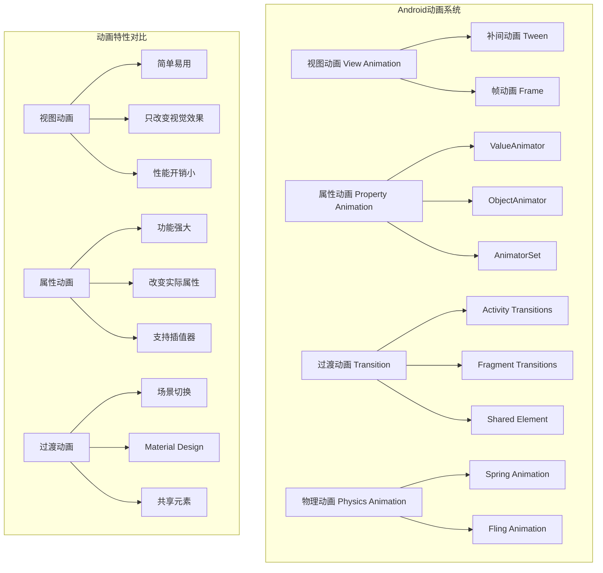

# 第9章：动画和过渡效果

## 📖 章节概述

本章将全面介绍Android动画系统，从基础的视图动画到高级的属性动画，以及Material Design的过渡效果。通过学习动画的原理、实现和优化，您将能够为应用创建流畅、生动的用户体验。

## 🎯 学习目标

- 理解Android动画系统的分类和原理
- 掌握视图动画和属性动画的使用方法
- 学会创建复杂的动画组合和序列
- 了解Material Design过渡效果
- 掌握动画性能优化技巧
- 能够设计实现流畅的动画效果

## 🎭 动画系统概述

### Android动画分类



### 动画使用原则

1. **有意义**：动画应该有明确的目的，帮助用户理解界面变化
2. **自然流畅**：动画应该符合物理规律，感觉自然
3. **性能优先**：确保动画不会影响应用的响应性能
4. **一致性**：在整个应用中保持动画风格的一致性
5. **可控制**：允许用户控制动画播放（如减少动画设置）

## 🎬 视图动画（View Animation）

### 补间动画（Tween Animation）

补间动画是最简单的动画形式，只改变View的视觉效果：

```xml
<!-- res/anim/slide_in_from_left.xml -->
<?xml version="1.0" encoding="utf-8"?>
<set xmlns:android="http://schemas.android.com/apk/res/android"
    android:duration="300"
    android:interpolator="@android:anim/accelerate_interpolator">

    <!-- 透明度动画 -->
    <alpha
        android:fromAlpha="0.0"
        android:toAlpha="1.0"
        android:duration="200" />

    <!-- 平移动画 -->
    <translate
        android:fromXDelta="-100%"
        android:toXDelta="0%"
        android:duration="300" />

    <!-- 缩放动画 -->
    <scale
        android:fromXScale="0.8"
        android:fromYScale="0.8"
        android:toXScale="1.0"
        android:toYScale="1.0"
        android:pivotX="50%"
        android:pivotY="50%"
        android:duration="250" />

    <!-- 旋转动画 -->
    <rotate
        android:fromDegrees="0"
        android:toDegrees="360"
        android:pivotX="50%"
        android:pivotY="50%"
        android:duration="500"
        android:startOffset="300" />

</set>
```

#### 视图动画编程实现

```java
/**
 * 视图动画示例
 */
public class ViewAnimationExample extends AppCompatActivity {

    private View animatedView;
    private Button animateButton;
    private Button stopButton;

    @Override
    protected void onCreate(Bundle savedInstanceState) {
        super.onCreate(savedInstanceState);
        setContentView(R.layout.activity_view_animation);

        initViews();
        setupAnimations();
    }

    private void initViews() {
        animatedView = findViewById(R.id.animatedView);
        animateButton = findViewById(R.id.animateButton);
        stopButton = findViewById(R.id.stopButton);
    }

    private void setupAnimations() {
        animateButton.setOnClickListener(v -> startAnimations());
        stopButton.setOnClickListener(v -> stopAnimations());
    }

    /**
     * 使用XML定义的动画
     */
    private void startXmlAnimation() {
        Animation animation = AnimationUtils.loadAnimation(this, R.anim.slide_in_from_left);

        // 设置动画监听器
        animation.setAnimationListener(new Animation.AnimationListener() {
            @Override
            public void onAnimationStart(Animation animation) {
                Log.d("Animation", "Animation started");
            }

            @Override
            public void onAnimationEnd(Animation animation) {
                Log.d("Animation", "Animation ended");
                // 动画结束后的操作
            }

            @Override
            public void onAnimationRepeat(Animation animation) {
                Log.d("Animation", "Animation repeated");
            }
        });

        animatedView.startAnimation(animation);
    }

    /**
     * 编程方式创建动画
     */
    private void startProgrammaticAnimation() {
        // 创建透明度动画
        AlphaAnimation alphaAnimation = new AlphaAnimation(0f, 1f);
        alphaAnimation.setDuration(1000);
        alphaAnimation.setInterpolator(new AccelerateDecelerateInterpolator());

        // 创建缩放动画
        ScaleAnimation scaleAnimation = new ScaleAnimation(
            0.5f, 1.5f, 0.5f, 1.5f,
            Animation.RELATIVE_TO_SELF, 0.5f,
            Animation.RELATIVE_TO_SELF, 0.5f
        );
        scaleAnimation.setDuration(1500);
        scaleAnimation.setRepeatCount(Animation.INFINITE);
        scaleAnimation.setRepeatMode(Animation.REVERSE);

        // 创建动画集
        AnimationSet animationSet = new AnimationSet(true);
        animationSet.addAnimation(alphaAnimation);
        animationSet.addAnimation(scaleAnimation);

        animatedView.startAnimation(animationSet);
    }

    /**
     * 组合多种动画效果
     */
    private void startComplexAnimation() {
        // 创建平移动画
        TranslateAnimation translateAnimation = new TranslateAnimation(
            Animation.RELATIVE_TO_PARENT, 0f,
            Animation.RELATIVE_TO_PARENT, 0.8f,
            Animation.RELATIVE_TO_PARENT, 0f,
            Animation.RELATIVE_TO_PARENT, 0.8f
        );
        translateAnimation.setDuration(2000);

        // 创建旋转动画
        RotateAnimation rotateAnimation = new RotateAnimation(
            0f, 360f,
            Animation.RELATIVE_TO_SELF, 0.5f,
            Animation.RELATIVE_TO_SELF, 0.5f
        );
        rotateAnimation.setDuration(2000);

        // 创建动画集
        AnimationSet animationSet = new AnimationSet(false);
        animationSet.addAnimation(translateAnimation);
        animationSet.addAnimation(rotateAnimation);
        animationSet.setFillAfter(true); // 动画结束后保持最终状态

        animatedView.startAnimation(animationSet);
    }

    /**
     * 创建自定义插值器
     */
    private void createCustomInterpolator() {
        Interpolator customInterpolator = new Interpolator() {
            @Override
            public float getInterpolation(float input) {
                // 自定义插值函数：弹跳效果
                return (float) (Math.sin(input * Math.PI * 4) *
                       Math.exp(-input * 5) * (1 - input));
            }
        };

        AlphaAnimation animation = new AlphaAnimation(0f, 1f);
        animation.setDuration(2000);
        animation.setInterpolator(customInterpolator);

        animatedView.startAnimation(animation);
    }

    /**
     * 布局动画
     */
    private void startLayoutAnimation() {
        // 创建布局动画控制器
        LayoutAnimationController controller = new LayoutAnimationController(
            AnimationUtils.loadAnimation(this, R.anim.slide_in_from_left)
        );
        controller.setDelay(0.5f); // 子View之间的延迟
        controller.setOrder(LayoutAnimationController.ORDER_NORMAL);

        // 应用到ViewGroup
        ViewGroup container = findViewById(R.id.container);
        container.setLayoutAnimation(controller);

        // 触发布局动画
        container.scheduleLayoutAnimation();
    }

    private void startAnimations() {
        // 根据选择启动不同动画
        startComplexAnimation();
    }

    private void stopAnimations() {
        animatedView.clearAnimation();
    }
}
```

### 帧动画（Frame Animation）

帧动画通过顺序播放一系列图片实现动画效果：

```xml
<!-- res/drawable/animation_frame.xml -->
<?xml version="1.0" encoding="utf-8"?>
<animation-list xmlns:android="http://schemas.android.com/apk/res/android"
    android:oneshot="false">

    <item
        android:drawable="@drawable/frame_01"
        android:duration="100" />
    <item
        android:drawable="@drawable/frame_02"
        android:duration="100" />
    <item
        android:drawable="@drawable/frame_03"
        android:duration="100" />
    <item
        android:drawable="@drawable/frame_04"
        android:duration="100" />
    <item
        android:drawable="@drawable/frame_05"
        android:duration="100" />

</animation-list>
```

```java
/**
 * 帧动画示例
 */
public class FrameAnimationExample extends AppCompatActivity {

    private ImageView imageView;
    private AnimationDrawable frameAnimation;

    @Override
    protected void onCreate(Bundle savedInstanceState) {
        super.onCreate(savedInstanceState);
        setContentView(R.layout.activity_frame_animation);

        imageView = findViewById(R.id.imageView);
        setupFrameAnimation();
    }

    private void setupFrameAnimation() {
        // 设置帧动画背景
        imageView.setBackgroundResource(R.drawable.animation_frame);
        frameAnimation = (AnimationDrawable) imageView.getBackground();

        // 点击图片切换动画状态
        imageView.setOnClickListener(v -> {
            if (frameAnimation.isRunning()) {
                frameAnimation.stop();
            } else {
                frameAnimation.start();
            }
        });

        // 自动开始动画
        imageView.post(() -> frameAnimation.start());
    }

    @Override
    protected void onDestroy() {
        super.onDestroy();
        // 停止动画以避免内存泄漏
        if (frameAnimation != null && frameAnimation.isRunning()) {
            frameAnimation.stop();
        }
    }
}
```

## ⚡ 属性动画（Property Animation）

### ValueAnimator

ValueAnimator是属性动画的核心，负责计算动画值：

```java
/**
 * ValueAnimator示例
 */
public class ValueAnimatorExample extends AppCompatActivity {

    private View animatedView;
    private TextView progressText;
    private ValueAnimator colorAnimator;
    private ValueAnimator sizeAnimator;

    @Override
    protected void onCreate(Bundle savedInstanceState) {
        super.onCreate(savedInstanceState);
        setContentView(R.layout.activity_value_animator);

        initViews();
        setupAnimations();
    }

    private void initViews() {
        animatedView = findViewById(R.id.animatedView);
        progressText = findViewById(R.id.progressText);
    }

    private void setupAnimations() {
        // 创建颜色渐变动画
        createColorAnimation();

        // 创建尺寸变化动画
        createSizeAnimation();

        // 创建路径动画
        createPathAnimation();

        // 创建自定义类型动画
        createCustomTypeAnimation();
    }

    /**
     * 创建颜色渐变动画
     */
    private void createColorAnimation() {
        ValueAnimator animator = ValueAnimator.ofArgb(
            Color.RED, Color.GREEN, Color.BLUE
        );
        animator.setDuration(3000);
        animator.setRepeatCount(ValueAnimator.INFINITE);
        animator.setRepeatMode(ValueAnimator.REVERSE);

        animator.addUpdateListener(animation -> {
            int color = (int) animation.getAnimatedValue();
            animatedView.setBackgroundColor(color);
        });

        colorAnimator = animator;
    }

    /**
     * 创建尺寸变化动画
     */
    private void createSizeAnimation() {
        ValueAnimator animator = ValueAnimator.ofFloat(0.5f, 2f);
        animator.setDuration(2000);
        animator.setRepeatCount(ValueAnimator.INFINITE);
        animator.setRepeatMode(ValueAnimator.REVERSE);

        animator.addUpdateListener(animation -> {
            float scale = (float) animation.getAnimatedValue();
            animatedView.setScaleX(scale);
            animatedView.setScaleY(scale);

            // 更新进度文本
            int progress = (int) (animation.getAnimatedFraction() * 100);
            progressText.setText("进度: " + progress + "%");
        });

        sizeAnimator = animator;
    }

    /**
     * 创建路径动画
     */
    private void createPathAnimation() {
        // 创建运动路径
        Path path = new Path();
        path.moveTo(100, 100);
        path.quadTo(300, 50, 500, 100);
        path.quadTo(700, 150, 900, 100);

        ValueAnimator animator = ValueAnimator.ofFloat(0f, 1f);
        animator.setDuration(4000);
        animator.setRepeatCount(ValueAnimator.INFINITE);
        animator.setRepeatMode(ValueAnimator.RESTART);

        animator.addUpdateListener(animation -> {
            float fraction = animation.getAnimatedFraction();

            // 获取路径上的点
            PathMeasure pathMeasure = new PathMeasure(path, false);
            float distance = pathMeasure.getLength() * fraction;

            float[] pos = new float[2];
            pathMeasure.getPosTan(distance, pos, null);

            // 移动View到路径上的位置
            animatedView.setTranslationX(pos[0] - animatedView.getWidth() / 2f);
            animatedView.setTranslationY(pos[1] - animatedView.getHeight() / 2f);
        });

        // 创建Path动画
        ObjectAnimator pathAnimator = ObjectAnimator.ofFloat(animatedView, "x", "y", path);
        pathAnimator.setDuration(4000);
        pathAnimator.setRepeatCount(ValueAnimator.INFINITE);
    }

    /**
     * 创建自定义类型动画
     */
    private void createCustomTypeAnimation() {
        // 创建Point类型的动画
        ValueAnimator animator = ValueAnimator.ofObject(
            new PointEvaluator(),
            new Point(0, 0),
            new Point(500, 500)
        );
        animator.setDuration(3000);
        animator.setRepeatCount(ValueAnimator.INFINITE);
        animator.setRepeatMode(ValueAnimator.REVERSE);

        animator.addUpdateListener(animation -> {
            Point point = (Point) animation.getAnimatedValue();
            animatedView.setTranslationX(point.x);
            animatedView.setTranslationY(point.y);
        });
    }

    /**
     * 自定义Point类型求值器
     */
    private static class PointEvaluator implements TypeEvaluator<Point> {
        @Override
        public Point evaluate(float fraction, Point startValue, Point endValue) {
            int x = (int) (startValue.x + fraction * (endValue.x - startValue.x));
            int y = (int) (startValue.y + fraction * (endValue.y - startValue.y));
            return new Point(x, y);
        }
    }

    /**
     * 创建动画集
     */
    private void createAnimatorSet() {
        AnimatorSet animatorSet = new AnimatorSet();

        // 创建多个动画
        ValueAnimator rotationAnimator = ValueAnimator.ofFloat(0f, 360f);
        rotationAnimator.setDuration(2000);
        rotationAnimator.addUpdateListener(animation -> {
            animatedView.setRotation((float) animation.getAnimatedValue());
        });

        ValueAnimator translationAnimator = ValueAnimator.ofFloat(0f, 200f);
        translationAnimator.setDuration(1500);
        translationAnimator.addUpdateListener(animation -> {
            animatedView.setTranslationX((float) animation.getAnimatedValue());
        });

        ValueAnimator alphaAnimator = ValueAnimator.ofFloat(1f, 0.3f);
        alphaAnimator.setDuration(1000);
        alphaAnimator.addUpdateListener(animation -> {
            animatedView.setAlpha((float) animation.getAnimatedValue());
        });

        // 设置动画播放顺序
        animatorSet.play(rotationAnimator).with(alphaAnimator);
        animatorSet.play(translationAnimator).after(rotationAnimator);

        // 设置监听器
        animatorSet.addListener(new AnimatorListenerAdapter() {
            @Override
            public void onAnimationStart(Animator animation) {
                Log.d("AnimatorSet", "Animation started");
            }

            @Override
            public void onAnimationEnd(Animator animation) {
                Log.d("AnimatorSet", "Animation ended");
            }
        });

        animatorSet.start();
    }

    public void startColorAnimation(View view) {
        if (colorAnimator != null) {
            colorAnimator.start();
        }
    }

    public void startSizeAnimation(View view) {
        if (sizeAnimator != null) {
            sizeAnimator.start();
        }
    }

    public void startAnimatorSet(View view) {
        createAnimatorSet();
    }
}
```

### ObjectAnimator

ObjectAnimator是ValueAnimator的子类，专门用于动画化对象的属性：

```java
/**
 * ObjectAnimator示例
 */
public class ObjectAnimatorExample extends AppCompatActivity {

    private View targetView;
    private TextView textView;
    private Button button;

    @Override
    protected void onCreate(Bundle savedInstanceState) {
        super.onCreate(savedInstanceState);
        setContentView(R.layout.activity_object_animator);

        initViews();
        setupObjectAnimators();
    }

    private void initViews() {
        targetView = findViewById(R.id.targetView);
        textView = findViewById(R.id.textView);
        button = findViewById(R.id.button);
    }

    private void setupObjectAnimators() {
        // 基础属性动画
        animateBasicProperties();

        // 颜色动画
        animateColor();

        // 路径动画
        animatePath();

        // 多属性动画
        animateMultipleProperties();
    }

    /**
     * 基础属性动画
     */
    private void animateBasicProperties() {
        // 透明度动画
        ObjectAnimator alphaAnimator = ObjectAnimator.ofFloat(targetView, "alpha", 1f, 0.3f, 1f);
        alphaAnimator.setDuration(2000);
        alphaAnimator.setRepeatCount(ValueAnimator.INFINITE);

        // 旋转动画
        ObjectAnimator rotationAnimator = ObjectAnimator.ofFloat(targetView, "rotation", 0f, 360f);
        rotationAnimator.setDuration(3000);
        rotationAnimator.setRepeatCount(ValueAnimator.INFINITE);

        // 缩放动画
        ObjectAnimator scaleXAnimator = ObjectAnimator.ofFloat(targetView, "scaleX", 1f, 1.5f, 1f);
        scaleXAnimator.setDuration(1500);
        scaleXAnimator.setRepeatCount(ValueAnimator.INFINITE);
        scaleXAnimator.setRepeatMode(ValueAnimator.REVERSE);

        ObjectAnimator scaleYAnimator = ObjectAnimator.ofFloat(targetView, "scaleY", 1f, 1.5f, 1f);
        scaleYAnimator.setDuration(1500);
        scaleYAnimator.setRepeatCount(ValueAnimator.INFINITE);
        scaleYAnimator.setRepeatMode(ValueAnimator.REVERSE);

        // 平移动画
        ObjectAnimator translationXAnimator = ObjectAnimator.ofFloat(targetView, "translationX", 0f, 200f, 0f);
        translationXAnimator.setDuration(2500);
        translationXAnimator.setRepeatCount(ValueAnimator.INFINITE);

        // 组合播放
        AnimatorSet animatorSet = new AnimatorSet();
        animatorSet.playTogether(alphaAnimator, rotationAnimator);
        animatorSet.play(scaleXAnimator).with(scaleYAnimator);
        animatorSet.play(translationXAnimator).after(rotationAnimator);
        animatorSet.start();
    }

    /**
     * 颜色动画
     */
    private void animateColor() {
        // View背景颜色动画
        ObjectAnimator backgroundColorAnimator = ObjectAnimator.ofArgb(
            targetView,
            "backgroundColor",
            Color.RED,
            Color.GREEN,
            Color.BLUE
        );
        backgroundColorAnimator.setDuration(4000);
        backgroundColorAnimator.setRepeatCount(ValueAnimator.INFINITE);
        backgroundColorAnimator.setRepeatMode(ValueAnimator.REVERSE);

        // TextView文字颜色动画
        ObjectAnimator textColorAnimator = ObjectAnimator.ofArgb(
            textView,
            "textColor",
            Color.BLACK,
            Color.WHITE,
            Color.BLACK
        );
        textColorAnimator.setDuration(3000);
        textColorAnimator.setRepeatCount(ValueAnimator.INFINITE);
        textColorAnimator.setRepeatMode(ValueAnimator.REVERSE);

        // 按钮背景颜色动画（使用自定义setter）
        ObjectAnimator buttonColorAnimator = ObjectAnimator.ofInt(
            this,
            "buttonColor",
            Color.BLUE,
            Color.RED,
            Color.GREEN
        );
        buttonColorAnimator.setDuration(2000);
        buttonColorAnimator.setRepeatCount(ValueAnimator.INFINITE);
        buttonColorAnimator.setRepeatMode(ValueAnimator.REVERSE);

        AnimatorSet colorSet = new AnimatorSet();
        colorSet.playTogether(backgroundColorAnimator, textColorAnimator, buttonColorAnimator);
        colorSet.start();
    }

    /**
     * 自定义setter方法用于按钮颜色动画
     */
    public void setButtonColor(int color) {
        if (button != null) {
            button.setBackgroundColor(color);
        }
    }

    /**
     * 路径动画
     */
    private void animatePath() {
        // 创建圆形路径
        Path path = new Path();
        path.addCircle(200f, 200f, 150f, Path.Direction.CW);

        // View沿路径移动
        ObjectAnimator pathAnimator = ObjectAnimator.ofFloat(targetView, "x", "y", path);
        pathAnimator.setDuration(5000);
        pathAnimator.setRepeatCount(ValueAnimator.INFINITE);

        // 创建自定义路径
        Path customPath = createHeartPath();
        ObjectAnimator heartPathAnimator = ObjectAnimator.ofFloat(textView, "x", "y", customPath);
        heartPathAnimator.setDuration(3000);
        heartPathAnimator.setRepeatCount(ValueAnimator.INFINITE);

        AnimatorSet pathSet = new AnimatorSet();
        pathSet.playTogether(pathAnimator, heartPathAnimator);
        pathSet.start();
    }

    /**
     * 创建心形路径
     */
    private Path createHeartPath() {
        Path path = new Path();
        // 心形路径数学计算
        float width = 300f;
        float height = 300f;
        float x = width / 2;
        float y = height / 3;

        path.moveTo(x, y);
        path.cubicTo(x, y - height/4, x - width/2, y - height/4, x - width/2, y);
        path.cubicTo(x - width/2, y + height/4, x, y + height/2, x, height);
        path.cubicTo(x, y + height/2, x + width/2, y + height/4, x + width/2, y);
        path.cubicTo(x + width/2, y - height/4, x, y - height/4, x, y);

        return path;
    }

    /**
     * 多属性动画
     */
    private void animateMultipleProperties() {
        // 使用PropertyValuesHolder同时动画多个属性
        PropertyValuesHolder pvhX = PropertyValuesHolder.ofFloat("x", 0f, 300f, 0f);
        PropertyValuesHolder pvhY = PropertyValuesHolder.ofFloat("y", 0f, 300f, 0f);
        PropertyValuesHolder pvhRotation = PropertyValuesHolder.ofFloat("rotation", 0f, 720f);
        PropertyValuesHolder pvhAlpha = PropertyValuesHolder.ofFloat("alpha", 1f, 0.2f, 1f);

        ObjectAnimator multiPropertyAnimator = ObjectAnimator.ofPropertyValuesHolder(
            targetView, pvhX, pvhY, pvhRotation, pvhAlpha
        );
        multiPropertyAnimator.setDuration(4000);
        multiPropertyAnimator.setRepeatCount(ValueAnimator.INFINITE);
        multiPropertyAnimator.start();

        // 使用Keyframe设置关键帧
        PropertyValuesHolder pvhScaleX = PropertyValuesHolder.ofKeyframe("scaleX",
            Keyframe.ofFloat(0f, 1f),
            Keyframe.ofFloat(0.25f, 1.5f),
            Keyframe.ofFloat(0.5f, 0.5f),
            Keyframe.ofFloat(0.75f, 2f),
            Keyframe.ofFloat(1f, 1f)
        );

        ObjectAnimator keyframeAnimator = ObjectAnimator.ofPropertyValuesHolder(
            textView, pvhScaleX
        );
        keyframeAnimator.setDuration(3000);
        keyframeAnimator.setRepeatCount(ValueAnimator.INFINITE);
        keyframeAnimator.start();
    }

    /**
     * 创建物理动画效果
     */
    private void createPhysicsAnimation() {
        // 弹跳效果
        ObjectAnimator bounceAnimator = ObjectAnimator.ofFloat(targetView, "translationY", 0f, -200f, 0f);
        bounceAnimator.setDuration(1500);
        bounceAnimator.setInterpolator(new BounceInterpolator());
        bounceAnimator.setRepeatCount(ValueAnimator.INFINITE);

        // 弹簧效果
        SpringAnimation springAnimation = new SpringAnimation(targetView, DynamicAnimation.TRANSLATION_Y, 0f);
        SpringForce springForce = new SpringForce()
                .setStiffness(SpringForce.STIFFNESS_MEDIUM)
                .setDampingRatio(SpringForce.DAMPING_RATIO_MEDIUM_BOUNCY)
                .setFinalPosition(0f);
        springAnimation.setSpring(springForce);

        // 点击时触发弹簧动画
        targetView.setOnClickListener(v -> {
            springAnimation.setStartVelocity(-2000f);
            springAnimation.start();
        });

        bounceAnimator.start();
    }
}
```

## 🌊 Material Design过渡效果

### Activity过渡动画

```java
/**
 * Activity过渡动画示例
 */
public class TransitionExample extends AppCompatActivity {

    private View sharedElementView;
    private Button startActivityButton;

    @Override
    protected void onCreate(Bundle savedInstanceState) {
        super.onCreate(savedInstanceState);
        setContentView(R.layout.activity_transition_example);

        initViews();
        setupTransitions();
    }

    private void initViews() {
        sharedElementView = findViewById(R.id.sharedElementView);
        startActivityButton = findViewById(R.id.startActivityButton);
    }

    private void setupTransitions() {
        // 设置窗口过渡
        getWindow().requestFeature(Window.FEATURE_CONTENT_TRANSITIONS);

        // 设置进入和退出过渡
        Transition enterTransition = new Slide(Gravity.START);
        enterTransition.setDuration(500);
        enterTransition.setInterpolator(new AccelerateDecelerateInterpolator());

        Transition exitTransition = new Slide(Gravity.END);
        exitTransition.setDuration(500);
        exitTransition.setInterpolator(new AccelerateDecelerateInterpolator());

        getWindow().setEnterTransition(enterTransition);
        getWindow().setExitTransition(exitTransition);

        // 设置共享元素过渡
        Transition sharedElementTransition = TransitionInflater.from(this)
                .inflateTransition(R.transition.shared_element_transition);
        getWindow().setSharedElementEnterTransition(sharedElementTransition);
        getWindow().setSharedElementReturnTransition(sharedElementTransition);

        // 点击事件
        startActivityButton.setOnClickListener(v -> startNextActivity());
        sharedElementView.setOnClickListener(v -> startNextActivityWithSharedElement());
    }

    /**
     * 启动下一个Activity（普通过渡）
     */
    private void startNextActivity() {
        Intent intent = new Intent(this, SecondActivity.class);
        startActivity(intent);
        // 使用默认的过渡动画
    }

    /**
     * 启动下一个Activity（共享元素过渡）
     */
    private void startNextActivityWithSharedElement() {
        Intent intent = new Intent(this, SecondActivity.class);

        // 创建ActivityOptions
        ActivityOptions options = ActivityOptions.makeSceneTransitionAnimation(
                this,
                // 共享元素对：View和transitionName
                Pair.create(sharedElementView, "shared_element")
        );

        startActivity(intent, options.toBundle());
    }
}
```

### 过渡动画定义

```xml
<!-- res/transition/shared_element_transition.xml -->
<?xml version="1.0" encoding="utf-8"?>
<transitionSet xmlns:android="http://schemas.android.com/apk/res/android"
    android:duration="500"
    android:transitionOrdering="together">

    <!-- 变换效果 -->
    <changeBounds />
    <changeTransform />
    <changeImageTransform />
    <changeClipBounds />

    <!-- 自定义过渡 -->
    <transition
        class="com.example.CustomTransition"
        android:duration="300" />

</transitionSet>

<!-- res/transition/slide_transition.xml -->
<?xml version="1.0" encoding="utf-8"?>
<slide xmlns:android="http://schemas.android.com/apk/res/android"
    android:duration="300"
    android:slideEdge="start"
    android:interpolator="@android:interpolator/accelerate_decelerate" />

<!-- res/transition/fade_transition.xml -->
<?xml version="1.0" encoding="utf-8"?>
<fade xmlns:android="http://schemas.android.com/apk/res/android"
    android:duration="300">

    <targets>
        <target android:targetClass="android.widget.TextView" />
        <target android:targetClass="android.widget.Button" />
    </targets>

</fade>

<!-- res/transition/explode_transition.xml -->
<?xml version="1.0" encoding="utf-8"?>
<explode xmlns:android="http://schemas.android.com/apk/res/android"
    android:duration="500" />
```

### 自定义过渡动画

```java
/**
 * 自定义过渡动画
 */
public class CustomTransition extends Transition {

    private static final String PROPNAME_BOUNDS = "bounds";
    private static final String PROPNAME_TRANSLATION_X = "translationX";
    private static final String PROPNAME_TRANSLATION_Y = "translationY";
    private static final String PROPNAME_SCALE_X = "scaleX";
    private static final String PROPNAME_SCALE_Y = "scaleY";

    public CustomTransition() {
        setDuration(500);
        setInterpolator(new AccelerateDecelerateInterpolator());
    }

    @Override
    public void captureStartValues(TransitionValues transitionValues) {
        captureValues(transitionValues);
    }

    @Override
    public void captureEndValues(TransitionValues transitionValues) {
        captureValues(transitionValues);
    }

    private void captureValues(TransitionValues values) {
        View view = values.view;
        if (view == null) return;

        values.values.put(PROPNAME_BOUNDS, new Rect(view.getLeft(), view.getTop(),
                view.getRight(), view.getBottom()));
        values.values.put(PROPNAME_TRANSLATION_X, view.getTranslationX());
        values.values.put(PROPNAME_TRANSLATION_Y, view.getTranslationY());
        values.values.put(PROPNAME_SCALE_X, view.getScaleX());
        values.values.put(PROPNAME_SCALE_Y, view.getScaleY());
    }

    @Override
    public Animator createAnimator(ViewGroup sceneRoot, TransitionValues startValues,
                                   TransitionValues endValues) {
        if (startValues == null || endValues == null) {
            return null;
        }

        View view = endValues.view;
        Rect startBounds = (Rect) startValues.values.get(PROPNAME_BOUNDS);
        Rect endBounds = (Rect) endValues.values.get(PROPNAME_BOUNDS);

        if (startBounds == null || endBounds == null) {
            return null;
        }

        // 创建移动动画
        float startX = startBounds.centerX() - view.getWidth() / 2f;
        float startY = startBounds.centerY() - view.getHeight() / 2f;
        float endX = endBounds.centerX() - view.getWidth() / 2f;
        float endY = endBounds.centerY() - view.getHeight() / 2f;

        ObjectAnimator xAnimator = ObjectAnimator.ofFloat(view, "translationX", startX, endX);
        ObjectAnimator yAnimator = ObjectAnimator.ofFloat(view, "translationY", startY, endY);

        // 创建缩放动画
        float startScaleX = (float) startValues.values.get(PROPNAME_SCALE_X);
        float startScaleY = (float) startValues.values.get(PROPNAME_SCALE_Y);
        float endScaleX = (float) endValues.values.get(PROPNAME_SCALE_X);
        float endScaleY = (float) endValues.values.get(PROPNAME_SCALE_Y);

        ObjectAnimator scaleXAnimator = ObjectAnimator.ofFloat(view, "scaleX", startScaleX, endScaleX);
        ObjectAnimator scaleYAnimator = ObjectAnimator.ofFloat(view, "scaleY", startScaleY, endScaleY);

        // 创建旋转动画
        ObjectAnimator rotationAnimator = ObjectAnimator.ofFloat(view, "rotation", 0f, 360f);

        // 创建动画集
        AnimatorSet animatorSet = new AnimatorSet();
        animatorSet.playTogether(xAnimator, yAnimator, scaleXAnimator, scaleYAnimator, rotationAnimator);
        animatorSet.setDuration(getDuration());
        animatorSet.setInterpolator(getInterpolator());

        return animatorSet;
    }
}
```

## 🎭 动画性能优化

### 动画性能监控

```java
/**
 * 动画性能监控工具
 */
public class AnimationPerformanceMonitor {

    private static final String TAG = "AnimationPerformance";

    /**
     * 监控动画性能
     */
    public static void monitorAnimation(Animator animator) {
        animator.addListener(new AnimatorListenerAdapter() {
            private long startTime;

            @Override
            public void onAnimationStart(Animator animation) {
                startTime = System.currentTimeMillis();
                Log.d(TAG, "Animation started");
            }

            @Override
            public void onAnimationEnd(Animator animation) {
                long duration = System.currentTimeMillis() - startTime;
                Log.d(TAG, "Animation ended, duration: " + duration + "ms");

                // 检查是否有丢帧
                checkForJank();
            }
        });
    }

    /**
     * 检查动画丢帧
     */
    private static void checkForJank() {
        // 使用Choreographer检测帧率
        Choreographer.getInstance().postFrameCallback(new Choreographer.FrameCallback() {
            private long lastFrameTimeNanos = 0;

            @Override
            public void doFrame(long frameTimeNanos) {
                if (lastFrameTimeNanos != 0) {
                    long frameIntervalNanos = frameTimeNanos - lastFrameTimeNanos;
                    long frameIntervalMs = frameIntervalNanos / 1000000;

                    // 正常帧间隔为16.67ms (60fps)
                    if (frameIntervalMs > 20) {
                        Log.w(TAG, "Frame drop detected: " + frameIntervalMs + "ms");
                    }
                }
                lastFrameTimeNanos = frameTimeNanos;
                Choreographer.getInstance().postFrameCallback(this);
            }
        });
    }

    /**
     * 优化动画性能建议
     */
    public static void optimizeAnimation(Animator animator) {
        // 设置硬件加速
        if (animator instanceof AnimatorSet) {
            ((AnimatorSet) animator).addListener(new AnimatorListenerAdapter() {
                @Override
                public void onAnimationStart(Animator animation) {
                    // 动画开始时启用硬件加速
                    enableHardwareAcceleration();
                }
            });
        }

        // 避免在动画中创建对象
        animator.addUpdateListener(animation -> {
            // 不要在这里创建新对象
        });

        // 使用合适的插值器
        animator.setInterpolator(new AccelerateDecelerateInterpolator());
    }

    private static void enableHardwareAcceleration() {
        // 启用硬件加速的具体实现
    }
}
```

### 动画优化技巧

```java
/**
 * 动画优化示例
 */
public class OptimizedAnimationExample extends AppCompatActivity {

    private View animatedView;
    private Paint paint;
    private Path path;
    private Matrix matrix;

    // 使用对象池
    private final ObjectPool<Point> pointPool = new ObjectPool<>(Point::new);

    @Override
    protected void onCreate(Bundle savedInstanceState) {
        super.onCreate(savedInstanceState);
        setContentView(R.layout.activity_optimized_animation);

        initViews();
        setupOptimizedAnimations();
    }

    private void initViews() {
        animatedView = findViewById(R.id.animatedView);
        paint = new Paint(Paint.ANTI_ALIAS_FLAG);
        path = new Path();
        matrix = new Matrix();

        // 设置硬件加速
        animatedView.setLayerType(View.LAYER_TYPE_HARDWARE, null);
    }

    private void setupOptimizedAnimations() {
        // 避免频繁的对象创建
        createReusableAnimations();

        // 使用属性动画替代视图动画
        usePropertyAnimation();

        // 优化复杂动画
        optimizeComplexAnimation();

        // 使用硬件加速层
        useHardwareLayer();
    }

    /**
     * 创建可重用的动画
     */
    private void createReusableAnimations() {
        // 预创建动画对象
        ObjectAnimator rotationAnimator = ObjectAnimator.ofFloat(animatedView, "rotation", 0f, 360f);
        rotationAnimator.setDuration(1000);
        rotationAnimator.setRepeatCount(ValueAnimator.INFINITE);

        // 重用动画对象
        findViewById(R.id.rotateButton).setOnClickListener(v -> {
            if (!rotationAnimator.isRunning()) {
                rotationAnimator.start();
            } else {
                rotationAnimator.cancel();
            }
        });
    }

    /**
     * 使用属性动画替代视图动画
     */
    private void usePropertyAnimation() {
        // 优化的属性动画
        ObjectAnimator alphaAnimator = ObjectAnimator.ofFloat(animatedView, "alpha", 1f, 0.5f, 1f);
        alphaAnimator.setDuration(2000);
        alphaAnimator.setRepeatCount(ValueAnimator.INFINITE);
        alphaAnimator.setRepeatMode(ValueAnimator.REVERSE);

        // 使用硬件加速
        alphaAnimator.addListener(new AnimatorListenerAdapter() {
            @Override
            public void onAnimationStart(Animator animation) {
                animatedView.setLayerType(View.LAYER_TYPE_HARDWARE, null);
            }

            @Override
            public void onAnimationEnd(Animator animation) {
                animatedView.setLayerType(View.LAYER_TYPE_NONE, null);
            }
        });

        findViewById(R.id.alphaButton).setOnClickListener(v -> alphaAnimator.start());
    }

    /**
     * 优化复杂动画
     */
    private void optimizeComplexAnimation() {
        // 使用PathMeasure优化路径动画
        Path path = new Path();
        path.addCircle(200, 200, 150, Path.Direction.CW);
        PathMeasure pathMeasure = new PathMeasure(path, false);

        ValueAnimator pathAnimator = ValueAnimator.ofFloat(0f, pathMeasure.getLength());
        pathAnimator.setDuration(3000);
        pathAnimator.setRepeatCount(ValueAnimator.INFINITE);

        pathAnimator.addUpdateListener(animation -> {
            float distance = (float) animation.getAnimatedValue();
            float[] pos = new float[2];
            pathMeasure.getPosTan(distance, pos, null);

            // 直接设置位置，避免创建临时对象
            animatedView.setTranslationX(pos[0]);
            animatedView.setTranslationY(pos[1]);
        });

        findViewById(R.id.pathButton).setOnClickListener(v -> pathAnimator.start());
    }

    /**
     * 使用硬件加速层
     */
    private void useHardwareLayer() {
        // 创建复杂的自定义View动画
        CustomAnimatedView customView = findViewById(R.id.customView);

        // 使用硬件层提高性能
        ValueAnimator animator = ValueAnimator.ofFloat(0f, 1f);
        animator.setDuration(2000);
        animator.setRepeatCount(ValueAnimator.INFINITE);

        animator.addUpdateListener(animation -> {
            float fraction = (float) animation.getAnimatedValue();
            customView.setProgress(fraction);
        });

        animator.addListener(new AnimatorListenerAdapter() {
            @Override
            public void onAnimationStart(Animator animation) {
                customView.setLayerType(View.LAYER_TYPE_HARDWARE, null);
            }

            @Override
            public void onAnimationEnd(Animator animation) {
                customView.setLayerType(View.LAYER_TYPE_NONE, null);
            }
        });

        findViewById(R.id.hardwareLayerButton).setOnClickListener(v -> animator.start());
    }

    /**
     * 简单对象池实现
     */
    private static class ObjectPool<T> {
        private final Queue<T> pool = new LinkedList<>();
        private final Factory<T> factory;

        public ObjectPool(Factory<T> factory) {
            this.factory = factory;
        }

        public T acquire() {
            T object = pool.poll();
            if (object == null) {
                object = factory.create();
            }
            return object;
        }

        public void release(T object) {
            if (pool.size() < 10) { // 限制池大小
                pool.offer(object);
            }
        }

        public interface Factory<T> {
            T create();
        }
    }

    /**
     * 自定义动画View
     */
    private static class CustomAnimatedView extends View {
        private float progress = 0f;
        private Paint paint;

        public CustomAnimatedView(Context context) {
            super(context);
            init();
        }

        private void init() {
            paint = new Paint(Paint.ANTI_ALIAS_FLAG);
            paint.setColor(Color.BLUE);
            paint.setStyle(Paint.Style.FILL);
        }

        public void setProgress(float progress) {
            this.progress = progress;
            invalidate();
        }

        @Override
        protected void onDraw(Canvas canvas) {
            super.onDraw(canvas);

            int width = getWidth();
            int height = getHeight();

            // 绘制进度条
            float progressWidth = width * progress;
            canvas.drawRect(0, 0, progressWidth, height, paint);
        }
    }
}
```

## 🎯 小结

本章全面介绍了Android动画系统，主要内容包括：

### 核心内容总结

1. **动画系统概述**
   - Android动画分类和特性
   - 动画使用原则和最佳实践
   - 性能考虑和用户体验

2. **视图动画**
   - 补间动画的定义和使用
   - 帧动画的实现
   - 动画集和插值器应用

3. **属性动画**
   - ValueAnimator和ObjectAnimator
   - 自定义类型求值器
   - 动画集和关键帧动画

4. **Material Design过渡**
   - Activity和Fragment过渡
   - 共享元素过渡
   - 自定义过渡动画

5. **性能优化**
   - 动画性能监控
   - 硬件加速优化
   - 内存管理和对象池

### 学习要点

- **动画分类**：理解不同类型动画的特点和适用场景
- **实现方法**：掌握各种动画的实现技巧
- **性能优化**：了解动画性能问题和解决方案
- **用户体验**：设计流畅自然的动画效果
- **最佳实践**：遵循Android动画开发的最佳实践

### 开发建议

1. **性能优先**：始终考虑动画对性能的影响
2. **用户控制**：允许用户控制动画播放
3. **适度使用**：不要过度使用动画效果
4. **测试充分**：在不同设备上测试动画效果
5. **遵循规范**：遵循Material Design动画指导原则

### 第二部分总结

第二部分"用户界面开发"已经完成，涵盖了：

- **第5章**：View和布局系统基础
- **第6章**：常用UI组件详解
- **第7章**：Material Design设计规范
- **第8章**：自定义View开发入门
- **第9章**：动画和过渡效果

通过这部分的学习，您已经掌握了Android UI开发的核心技术，能够创建功能丰富、美观流畅的用户界面。

## 📚 延伸阅读

- [Android Developers官方文档 - Animation](https://developer.android.com/guide/topics/graphics/animation)
- [Material Design动画指南](https://material.io/design/motion/)
- [Android性能优化指南](https://developer.android.com/topic/performance)
- [Property Animation官方教程](https://developer.android.com/guide/topics/graphics/property-animation)