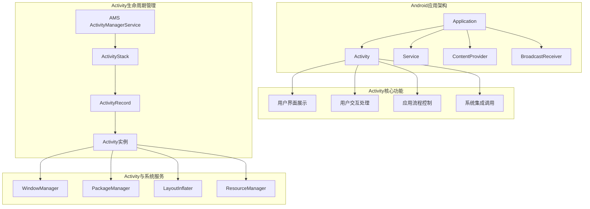
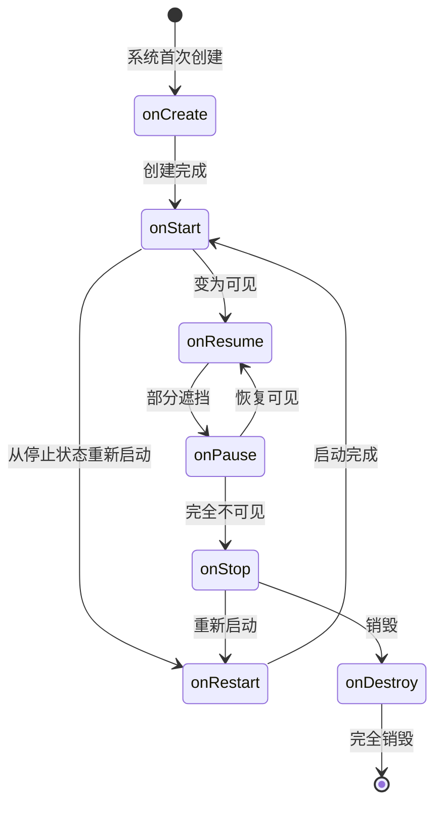
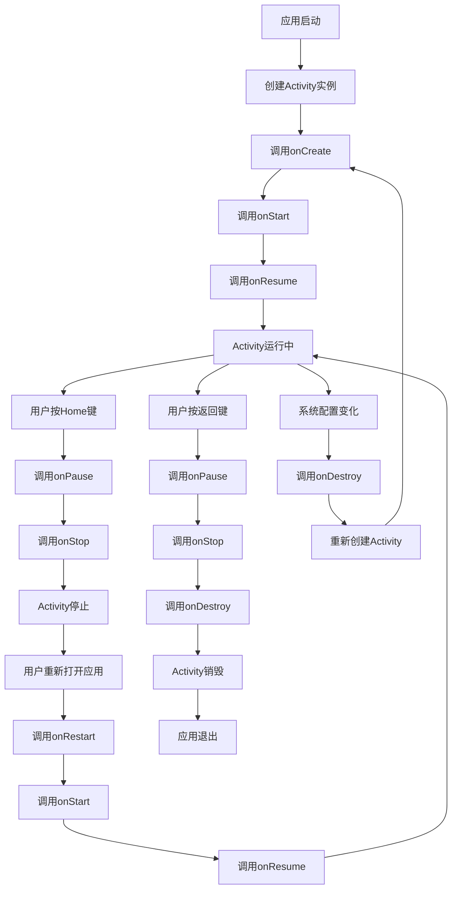

# 第10章：Activity深入理解

## 📖 章节概述

本章将深入探讨Android应用的核心组件——Activity。Activity作为Android四大组件之首，是用户界面的容器和应用程序的基本构建块。通过学习Activity的生命周期、启动模式、状态管理和最佳实践，您将能够构建稳定、高效的Android应用。

## 🎯 学习目标

- 深入理解Activity的生命周期及其各个阶段
- 掌握Activity的启动模式和任务栈管理
- 学会处理Activity状态保存和恢复
- 了解Activity的创建和销毁过程
- 掌握Activity间通信的最佳实践
- 能够设计合理的Activity架构

## 🏗️ Activity基础概念

### Activity在应用架构中的地位



### Activity的基本特征

- **用户界面的容器**：每个Activity通常对应一个屏幕界面
- **独立的生命周期**：拥有创建、启动、恢复、暂停、停止、销毁等状态
- **任务栈管理**：通过任务栈管理Activity的导航和返回
- **系统集成入口**：负责与系统其他组件和服务进行交互
- **状态管理**：管理应用状态和用户数据

## 🔄 Activity生命周期详解

### 完整生命周期图



### 生命周期回调方法详解

```java
/**
 * Activity生命周期示例
 */
public class LifecycleActivity extends AppCompatActivity {

    private static final String TAG = "LifecycleActivity";
    private String savedText = "";
    private EditText inputEditText;

    @Override
    protected void onCreate(Bundle savedInstanceState) {
        super.onCreate(savedInstanceState);
        setContentView(R.layout.activity_lifecycle);

        Log.d(TAG, "onCreate: Activity正在创建");

        // 初始化View
        inputEditText = findViewById(R.id.inputEditText);
        Button saveButton = findViewById(R.id.saveButton);
        Button nextButton = findViewById(R.id.nextButton);

        // 恢复保存的状态
        if (savedInstanceState != null) {
            savedText = savedInstanceState.getString("saved_text", "");
            inputEditText.setText(savedText);
            Log.d(TAG, "onCreate: 恢复保存的状态 - " + savedText);
        }

        // 设置点击监听器
        saveButton.setOnClickListener(v -> saveData());
        nextButton.setOnClickListener(v -> startNextActivity());

        // 执行一次性的初始化操作
        performOneTimeInit();
    }

    /**
     * 执行一次性的初始化操作
     */
    private void performOneTimeInit() {
        // 这里执行只需要执行一次的初始化操作
        // 例如：数据库初始化、网络配置等
        Log.d(TAG, "执行一次性初始化操作");
    }

    @Override
    protected void onStart() {
        super.onStart();
        Log.d(TAG, "onStart: Activity即将变为可见");

        // 注册监听器
        registerListeners();

        // 开始执行UI相关的操作
        startUIOperations();
    }

    @Override
    protected void onResume() {
        super.onResume();
        Log.d(TAG, "onResume: Activity已经可见，可以与用户交互");

        // 启动动画
        startAnimations();

        // 注册传感器监听器
        registerSensorListeners();

        // 开始定时任务
        startPeriodicTasks();
    }

    @Override
    protected void onPause() {
        super.onPause();
        Log.d(TAG, "onPause: Activity即将被遮挡，无法与用户交互");

        // 暂停动画
        pauseAnimations();

        // 取消注册传感器监听器
        unregisterSensorListeners();

        // 停止定时任务
        stopPeriodicTasks();

        // 保存当前数据
        saveCurrentData();
    }

    @Override
    protected void onStop() {
        super.onStop();
        Log.d(TAG, "onStop: Activity已经完全不可见");

        // 取消注册监听器
        unregisterListeners();

        // 释放资源
        releaseResources();

        // 取消网络请求
        cancelNetworkRequests();
    }

    @Override
    protected void onDestroy() {
        super.onDestroy();
        Log.d(TAG, "onDestroy: Activity即将被销毁");

        // 清理资源
        cleanup();

        // 取消所有异步任务
        cancelAllAsyncTasks();
    }

    @Override
    protected void onRestart() {
        super.onRestart();
        Log.d(TAG, "onRestart: Activity从停止状态重新启动");
    }

    @Override
    protected void onSaveInstanceState(@NonNull Bundle outState) {
        super.onSaveInstanceState(outState);
        Log.d(TAG, "onSaveInstanceState: 保存Activity状态");

        // 保存重要数据
        outState.putString("saved_text", inputEditText.getText().toString());
        outState.putLong("save_time", System.currentTimeMillis());

        // 保存其他自定义状态
        saveCustomState(outState);
    }

    @Override
    protected void onRestoreInstanceState(@NonNull Bundle savedInstanceState) {
        super.onRestoreInstanceState(savedInstanceState);
        Log.d(TAG, "onRestoreInstanceState: 恢复Activity状态");

        // 恢复保存的数据
        savedText = savedInstanceState.getString("saved_text", "");
        inputEditText.setText(savedText);

        long saveTime = savedInstanceState.getLong("save_time", 0);
        Log.d(TAG, "恢复的状态保存时间: " + saveTime);

        // 恢复其他自定义状态
        restoreCustomState(savedInstanceState);
    }

    // ========== 私有方法 ==========

    private void registerListeners() {
        // 注册广播接收器
        // registerReceiver(localReceiver, intentFilter);
    }

    private void unregisterListeners() {
        // 取消注册广播接收器
        // unregisterReceiver(localReceiver);
    }

    private void startUIOperations() {
        // 开始UI相关的操作
        // 例如：刷新数据、启动动画等
    }

    private void startAnimations() {
        // 启动动画效果
    }

    private void pauseAnimations() {
        // 暂停动画效果
    }

    private void registerSensorListeners() {
        // 注册传感器监听器
        // 例如：GPS、加速度计等
    }

    private void unregisterSensorListeners() {
        // 取消注册传感器监听器
    }

    private void startPeriodicTasks() {
        // 开始定时任务
    }

    private void stopPeriodicTasks() {
        // 停止定时任务
    }

    private void saveCurrentData() {
        // 保存当前数据
        savedText = inputEditText.getText().toString();
    }

    private void releaseResources() {
        // 释放资源
        // 例如：关闭数据库连接、释放图片资源等
    }

    private void cancelNetworkRequests() {
        // 取消网络请求
    }

    private void cleanup() {
        // 清理资源
        // 例如：关闭文件句柄、释放内存等
    }

    private void cancelAllAsyncTasks() {
        // 取消所有异步任务
    }

    private void saveData() {
        savedText = inputEditText.getText().toString();
        Toast.makeText(this, "数据已保存", Toast.LENGTH_SHORT).show();
        Log.d(TAG, "保存数据: " + savedText);
    }

    private void startNextActivity() {
        Intent intent = new Intent(this, SecondActivity.class);
        startActivity(intent);
    }

    private void saveCustomState(Bundle outState) {
        // 保存自定义状态
        outState.putInt("custom_counter", 42);
    }

    private void restoreCustomState(Bundle savedInstanceState) {
        // 恢复自定义状态
        int counter = savedInstanceState.getInt("custom_counter", 0);
        Log.d(TAG, "恢复的自定义计数器: " + counter);
    }

    // ========== 配置变化处理 ==========

    @Override
    public void onConfigurationChanged(@NonNull Configuration newConfig) {
        super.onConfigurationChanged(newConfig);
        Log.d(TAG, "配置发生变化: " + newConfig.toString());

        // 处理配置变化
        handleConfigurationChange(newConfig);
    }

    private void handleConfigurationChange(Configuration newConfig) {
        // 检查配置变化类型
        int diff = newConfig.diff(getResources().getConfiguration());
        if ((diff & ActivityInfo.CONFIG_LOCALE) != 0) {
            // 语言配置变化
            Log.d(TAG, "语言配置发生变化");
            onLocaleChanged();
        }

        if ((diff & ActivityInfo.CONFIG_ORIENTATION) != 0) {
            // 屏幕方向变化
            Log.d(TAG, "屏幕方向发生变化");
            onOrientationChanged(newConfig.orientation);
        }

        if ((diff & ActivityInfo.CONFIG_SCREEN_SIZE) != 0) {
            // 屏幕尺寸变化
            Log.d(TAG, "屏幕尺寸发生变化");
            onScreenSizeChanged();
        }
    }

    private void onLocaleChanged() {
        // 处理语言变化
        // 例如：更新UI文本、重新加载数据等
    }

    private void onOrientationChanged(int newOrientation) {
        // 处理屏幕方向变化
        if (newOrientation == Configuration.ORIENTATION_LANDSCAPE) {
            Log.d(TAG, "切换到横屏");
        } else if (newOrientation == Configuration.ORIENTATION_PORTRAIT) {
            Log.d(TAG, "切换到竖屏");
        }
    }

    private void onScreenSizeChanged() {
        // 处理屏幕尺寸变化
        // 例如：调整布局、重新计算尺寸等
    }

    // ========== 内存管理 ==========

    @Override
    public void onLowMemory() {
        super.onLowMemory();
        Log.w(TAG, "系统内存不足，释放非必要资源");

        // 释放非必要的资源
        releaseNonEssentialResources();
    }

    @Override
    public void onTrimMemory(int level) {
        super.onTrimMemory(level);
        Log.d(TAG, "系统要求释放内存，级别: " + level);

        switch (level) {
            case TRIM_MEMORY_RUNNING_CRITICAL:
                // 内存严重不足
                releaseAllNonEssentialResources();
                break;
            case TRIM_MEMORY_RUNNING_LOW:
                // 内存不足
                releaseNonEssentialResources();
                break;
            case TRIM_MEMORY_RUNNING_MODERATE:
                // 内存较低
                clearCaches();
                break;
            case TRIM_MEMORY_UI_HIDDEN:
                // UI不可见
                releaseUIResources();
                break;
            case TRIM_MEMORY_BACKGROUND:
                // 后台状态
                releaseBackgroundResources();
                break;
        }
    }

    private void releaseNonEssentialResources() {
        // 释放非必要资源
    }

    private void releaseAllNonEssentialResources() {
        // 释放所有非必要资源
    }

    private void clearCaches() {
        // 清理缓存
    }

    private void releaseUIResources() {
        // 释放UI资源
    }

    private void releaseBackgroundResources() {
        // 释放后台资源
    }
}
```

### 生命周期状态图解



## 🎯 Activity启动模式

### 四种启动模式详解

```java
/**
 * Activity启动模式示例
 */
public class LaunchModeActivity extends AppCompatActivity {

    private static final String TAG = "LaunchModeActivity";
    private static int instanceCount = 0;

    @Override
    protected void onCreate(Bundle savedInstanceState) {
        super.onCreate(savedInstanceState);
        setContentView(R.layout.activity_launch_mode);

        instanceCount++;
        Log.d(TAG, "创建第 " + instanceCount + " 个实例");

        initViews();
        displayTaskInfo();
    }

    private void initViews() {
        Button standardModeButton = findViewById(R.id.standardModeButton);
        Button singleTopModeButton = findViewById(R.id.singleTopModeButton);
        Button singleTaskModeButton = findViewById(R.id.singleTaskModeButton);
        Button singleInstanceModeButton = findViewById(R.id.singleInstanceModeButton);
        Button newTaskButton = findViewById(R.id.newTaskButton);
        Button clearTopButton = findViewById(R.id.clearTopButton);

        standardModeButton.setOnClickListener(v -> startActivityWithMode(MainActivity.class));
        singleTopModeButton.setOnClickListener(v -> startActivityWithMode(SingleTopActivity.class));
        singleTaskModeButton.setOnClickListener(v -> startActivityWithMode(SingleTaskActivity.class));
        singleInstanceModeButton.setOnClickListener(v -> startActivityWithMode(SingleInstanceActivity.class));
        newTaskButton.setOnClickListener(v -> startNewTask());
        clearTopButton.setOnClickListener(v -> clearTopAndStart());
    }

    /**
     * 使用指定模式启动Activity
     */
    private void startActivityWithMode(Class<?> activityClass) {
        Intent intent = new Intent(this, activityClass);
        intent.putExtra("instance_count", instanceCount);
        startActivity(intent);
    }

    /**
     * 在新任务中启动Activity
     */
    private void startNewTask() {
        Intent intent = new Intent(this, MainActivity.class);
        intent.addFlags(Intent.FLAG_ACTIVITY_NEW_TASK);
        startActivity(intent);
    }

    /**
     * 清除顶部并启动
     */
    private void clearTopAndStart() {
        Intent intent = new Intent(this, MainActivity.class);
        intent.addFlags(Intent.FLAG_ACTIVITY_CLEAR_TOP);
        startActivity(intent);
    }

    /**
     * 显示任务信息
     */
    private void displayTaskInfo() {
        ActivityManager am = (ActivityManager) getSystemService(ACTIVITY_SERVICE);
        List<ActivityManager.RunningTaskInfo> runningTasks = am.getRunningTasks(10);

        Log.d(TAG, "当前运行的任务数: " + runningTasks.size());

        for (int i = 0; i < runningTasks.size(); i++) {
            ActivityManager.RunningTaskInfo taskInfo = runningTasks.get(i);
            Log.d(TAG, "任务 " + i + ": " + taskInfo.topActivity.getShortClassName() +
                      ", ID: " + taskInfo.id + ", 实例数: " + taskInfo.numActivities);
        }
    }

    @Override
    protected void onNewIntent(Intent intent) {
        super.onNewIntent(intent);
        Log.d(TAG, "onNewIntent被调用");

        int previousCount = intent.getIntExtra("instance_count", 0);
        Toast.makeText(this, "复用实例，之前实例数: " + previousCount,
                      Toast.LENGTH_SHORT).show();
    }

    @Override
    protected void onDestroy() {
        super.onDestroy();
        Log.d(TAG, "Activity实例被销毁");
    }

    /**
     * Standard模式Activity
     */
    public static class StandardActivity extends LaunchModeActivity {
        // 标准模式：每次启动都会创建新实例
    }

    /**
     * SingleTop模式Activity
     */
    public static class SingleTopActivity extends LaunchModeActivity {
        @Override
        protected void onNewIntent(Intent intent) {
            super.onNewIntent(intent);
            // SingleTop模式：如果Activity在栈顶，不会创建新实例，而是调用onNewIntent
            Toast.makeText(this, "SingleTop模式：复用栈顶实例", Toast.LENGTH_SHORT).show();
        }
    }

    /**
     * SingleTask模式Activity
     */
    public static class SingleTaskActivity extends LaunchModeActivity {
        @Override
        protected void onNewIntent(Intent intent) {
            super.onNewIntent(intent);
            // SingleTask模式：清除其上的所有Activity，然后调用onNewIntent
            Toast.makeText(this, "SingleTask模式：清除栈上实例并复用", Toast.LENGTH_SHORT).show();
        }
    }

    /**
     * SingleInstance模式Activity
     */
    public static class SingleInstanceActivity extends LaunchModeActivity {
        @Override
        protected void onNewIntent(Intent intent) {
            super.onNewIntent(intent);
            // SingleInstance模式：独占一个任务，总是复用实例
            Toast.makeText(this, "SingleInstance模式：独占任务并复用", Toast.LENGTH_SHORT).show();
        }
    }
}
```

### 启动模式配置

```xml
<!-- AndroidManifest.xml中配置启动模式 -->
<activity
    android:name=".StandardActivity"
    android:launchMode="standard" />  <!-- 标准模式（默认） -->

<activity
    android:name=".SingleTopActivity"
    android:launchMode="singleTop" />  <!-- 栈顶单例模式 -->

<activity
    android:name=".SingleTaskActivity"
    android:launchMode="singleTask" />  <!-- 任务内单例模式 -->

<activity
    android:name=".SingleInstanceActivity"
    android:launchMode="singleInstance" />  <!-- 全局单例模式 -->
```

### 任务栈管理示例

```java
/**
 * 任务栈管理工具类
 */
public class TaskStackManager {

    private static final String TAG = "TaskStackManager";

    /**
     * 获取当前任务栈信息
     */
    public static void getCurrentTaskStack(Context context) {
        ActivityManager am = (ActivityManager) context.getSystemService(Context.ACTIVITY_SERVICE);
        List<ActivityManager.RunningTaskInfo> runningTasks = am.getRunningTasks(10);

        Log.d(TAG, "=== 当前任务栈信息 ===");
        for (int i = 0; i < runningTasks.size(); i++) {
            ActivityManager.RunningTaskInfo taskInfo = runningTasks.get(i);
            Log.d(TAG, "任务 " + i + ":");
            Log.d(TAG, "  ID: " + taskInfo.id);
            Log.d(TAG, "  顶部Activity: " + taskInfo.topActivity.getShortClassName());
            Log.d(TAG, "  Activity数量: " + taskInfo.numActivities);
            Log.d(TAG, "  移动原因: " + getMoveReasonString(taskInfo.moveReason));
        }
    }

    /**
     * 移动原因转换为字符串
     */
    private static String getMoveReasonString(int moveReason) {
        switch (moveReason) {
            case ActivityManager.MOVE_REASON_TASK_TO_FRONT:
                return "任务移到前台";
            case ActivityManager.MOVE_REASON_TASK_TO_BACK:
                return "任务移到后台";
            case ActivityManager.MOVE_REASON_TASK_AFFINITY_CHANGE:
                return "任务关联变化";
            default:
                return "未知原因(" + moveReason + ")";
        }
    }

    /**
     * 清除指定任务中的Activity
     */
    public static void clearTask(Context context, Class<?> activityClass) {
        Intent intent = new Intent(context, activityClass);
        intent.addFlags(Intent.FLAG_ACTIVITY_CLEAR_TASK | Intent.FLAG_ACTIVITY_NEW_TASK);
        context.startActivity(intent);
    }

    /**
     * 将Activity移到任务栈顶部
     */
    public static void bringToFront(Context context, Class<?> activityClass) {
        Intent intent = new Intent(context, activityClass);
        intent.addFlags(Intent.FLAG_ACTIVITY_BROUGHT_TO_FRONT);
        context.startActivity(intent);
    }

    /**
     * 检查Activity是否在栈顶
     */
    public static boolean isActivityOnTop(Context context, Class<?> activityClass) {
        ActivityManager am = (ActivityManager) context.getSystemService(Context.ACTIVITY_SERVICE);
        List<ActivityManager.RunningTaskInfo> runningTasks = am.getRunningTasks(1);

        if (!runningTasks.isEmpty()) {
            ComponentName topActivity = runningTasks.get(0).topActivity;
            return topActivity.getClassName().equals(activityClass.getName());
        }
        return false;
    }

    /**
     * 获取任务栈中指定Activity的数量
     */
    public static int getActivityCountInStack(Context context, Class<?> activityClass) {
        ActivityManager am = (ActivityManager) context.getSystemService(Context.ACTIVITY_SERVICE);
        List<ActivityManager.RunningTaskInfo> runningTasks = am.getRunningTasks(10);

        int count = 0;
        String targetClassName = activityClass.getName();

        for (ActivityManager.RunningTaskInfo taskInfo : runningTasks) {
            // 注意：这里无法直接获取任务中所有Activity的信息
            // 需要通过其他方式来统计
        }

        return count;
    }
}
```

## 💾 Activity状态管理

### 状态保存和恢复机制

```java
/**
 * 状态管理示例
 */
public class StateManagementActivity extends AppCompatActivity {

    private static final String TAG = "StateManagement";

    // 需要保存的状态数据
    private EditText nameEditText;
    private SeekBar progressSeekBar;
    private Switch toggleSwitch;
    private Spinner categorySpinner;
    private ListView itemListView;

    // 状态数据模型
    private UserProfile userProfile;
    private List<String> items;
    private int selectedPosition;
    private long lastSaveTime;

    // 状态保存相关常量
    private static final String STATE_USER_PROFILE = "user_profile";
    private static final String STATE_ITEMS = "items";
    private static final String STATE_SELECTED_POSITION = "selected_position";
    private static final String STATE_LAST_SAVE_TIME = "last_save_time";
    private static final String STATE_SCROLL_POSITION = "scroll_position";

    @Override
    protected void onCreate(Bundle savedInstanceState) {
        super.onCreate(savedInstanceState);
        setContentView(R.layout.activity_state_management);

        Log.d(TAG, "onCreate: 开始创建Activity");

        initViews();
        setupListeners();
        restoreInstanceState(savedInstanceState);
        initializeData();
    }

    private void initViews() {
        nameEditText = findViewById(R.id.nameEditText);
        progressSeekBar = findViewById(R.id.progressSeekBar);
        toggleSwitch = findViewById(R.id.toggleSwitch);
        categorySpinner = findViewById(R.id.categorySpinner);
        itemListView = findViewById(R.id.itemListView);
    }

    private void setupListeners() {
        nameEditText.addTextChangedListener(new TextWatcher() {
            @Override
            public void beforeTextChanged(CharSequence s, int start, int count, int after) {}

            @Override
            public void onTextChanged(CharSequence s, int start, int before, int count) {}

            @Override
            public void afterTextChanged(Editable s) {
                if (userProfile != null) {
                    userProfile.setName(s.toString());
                    markDataAsChanged();
                }
            }
        });

        progressSeekBar.setOnSeekBarChangeListener(new SeekBar.OnSeekBarChangeListener() {
            @Override
            public void onProgressChanged(SeekBar seekBar, int progress, boolean fromUser) {
                if (userProfile != null && fromUser) {
                    userProfile.setProgress(progress);
                    markDataAsChanged();
                }
            }

            @Override
            public void onStartTrackingTouch(SeekBar seekBar) {}

            @Override
            public void onStopTrackingTouch(SeekBar seekBar) {}
        });

        toggleSwitch.setOnCheckedChangeListener((buttonView, isChecked) -> {
            if (userProfile != null) {
                userProfile.setPremium(isChecked);
                markDataAsChanged();
            }
        });

        categorySpinner.setOnItemSelectedListener(new AdapterView.OnItemSelectedListener() {
            @Override
            public void onItemSelected(AdapterView<?> parent, View view, int position, long id) {
                if (userProfile != null) {
                    userProfile.setCategory(position);
                    markDataAsChanged();
                }
            }

            @Override
            public void onNothingSelected(AdapterView<?> parent) {}
        });
    }

    private void restoreInstanceState(Bundle savedInstanceState) {
        Log.d(TAG, "restoreInstanceState: 恢复保存的状态");

        if (savedInstanceState != null) {
            // 恢复用户配置文件
            userProfile = savedInstanceState.getParcelable(STATE_USER_PROFILE);
            if (userProfile == null) {
                userProfile = createDefaultUserProfile();
            }

            // 恢复列表数据
            items = savedInstanceState.getStringArrayList(STATE_ITEMS);
            if (items == null) {
                items = createDefaultItems();
            }

            // 恢复选择位置
            selectedPosition = savedInstanceState.getInt(STATE_SELECTED_POSITION, 0);

            // 恢复保存时间
            lastSaveTime = savedInstanceState.getLong(STATE_LAST_SAVE_TIME, 0);

            // 恢复滚动位置
            int scrollPosition = savedInstanceState.getInt(STATE_SCROLL_POSITION, 0);

            Log.d(TAG, "恢复的状态 - 用户: " + userProfile.getName() +
                      ", 项目数: " + items.size() +
                      ", 选择位置: " + selectedPosition);
        } else {
            // 首次创建，使用默认值
            userProfile = createDefaultUserProfile();
            items = createDefaultItems();
            selectedPosition = 0;
            lastSaveTime = System.currentTimeMillis();
        }

        // 恢复UI状态
        restoreUIState();
    }

    private void restoreUIState() {
        if (userProfile != null) {
            nameEditText.setText(userProfile.getName());
            progressSeekBar.setProgress(userProfile.getProgress());
            toggleSwitch.setChecked(userProfile.isPremium());
            categorySpinner.setSelection(userProfile.getCategory());
        }

        // 设置列表适配器
        ArrayAdapter<String> adapter = new ArrayAdapter<>(
            this,
            android.R.layout.simple_list_item_single_choice,
            android.R.id.text1,
            items
        );
        itemListView.setAdapter(adapter);
        itemListView.setChoiceMode(ListView.CHOICE_MODE_SINGLE);
        itemListView.setItemChecked(selectedPosition, true);

        // 恢复滚动位置
        if (itemListView != null && itemListView.getChildCount() > 0) {
            itemListView.setSelectionFromTop(selectedPosition, 0);
        }
    }

    private void initializeData() {
        // 初始化完成后的操作
        Log.d(TAG, "数据初始化完成");

        // 可以在这里开始加载数据或启动动画
        loadData();
    }

    private void loadData() {
        // 模拟数据加载
        new Handler().postDelayed(() -> {
            // 数据加载完成
            Log.d(TAG, "数据加载完成");
        }, 1000);
    }

    @Override
    protected void onSaveInstanceState(@NonNull Bundle outState) {
        super.onSaveInstanceState(outState);
        Log.d(TAG, "onSaveInstanceState: 保存Activity状态");

        // 保存用户配置文件
        outState.putParcelable(STATE_USER_PROFILE, userProfile);

        // 保存列表数据
        outState.putStringArrayList(STATE_ITEMS, new ArrayList<>(items));

        // 保存选择位置
        selectedPosition = itemListView.getCheckedItemPosition();
        outState.putInt(STATE_SELECTED_POSITION, selectedPosition);

        // 保存滚动位置
        int scrollPosition = 0;
        if (itemListView.getFirstVisiblePosition() >= 0) {
            View firstVisibleView = itemListView.getChildAt(0);
            scrollPosition = itemListView.getFirstVisiblePosition();
            if (firstVisibleView != null) {
                scrollPosition -= (firstVisibleView.getTop() - itemListView.getPaddingTop()) /
                              firstVisibleView.getHeight();
            }
        }
        outState.putInt(STATE_SCROLL_POSITION, scrollPosition);

        // 保存时间戳
        lastSaveTime = System.currentTimeMillis();
        outState.putLong(STATE_LAST_SAVE_TIME, lastSaveTime);

        Log.d(TAG, "保存的状态数据 - 用户: " + userProfile.getName() +
                  ", 项目数: " + items.size() +
                  ", 选择位置: " + selectedPosition);
    }

    @Override
    protected void onRestoreInstanceState(@NonNull Bundle savedInstanceState) {
        super.onRestoreInstanceState(savedInstanceState);
        Log.d(TAG, "onRestoreInstanceState: 系统恢复状态");

        // 这里可以进行额外的状态恢复操作
        // 但主要的状态恢复已经在onCreate中完成
    }

    // ========== 数据模型 ==========

    /**
     * 用户配置文件类
     */
    public static class UserProfile implements Parcelable {
        private String name;
        private int progress;
        private boolean premium;
        private int category;
        private long createdTime;

        public UserProfile() {
            this.createdTime = System.currentTimeMillis();
        }

        protected UserProfile(Parcel in) {
            name = in.readString();
            progress = in.readInt();
            premium = in.readByte() != 0;
            category = in.readInt();
            createdTime = in.readLong();
        }

        public static final Creator<UserProfile> CREATOR = new Creator<UserProfile>() {
            @Override
            public UserProfile createFromParcel(Parcel in) {
                return new UserProfile(in);
            }

            @Override
            public UserProfile[] newArray(int size) {
                return new UserProfile[size];
            }
        };

        @Override
        public void writeToParcel(Parcel dest, int flags) {
            dest.writeString(name);
            dest.writeInt(progress);
            dest.writeByte((byte) (premium ? 1 : 0));
            dest.writeInt(category);
            dest.writeLong(createdTime);
        }

        @Override
        public int describeContents() {
            return 0;
        }

        // Getters and Setters
        public String getName() { return name; }
        public void setName(String name) { this.name = name; }

        public int getProgress() { return progress; }
        public void setProgress(int progress) { this.progress = progress; }

        public boolean isPremium() { return premium; }
        public void setPremium(boolean premium) { this.premium = premium; }

        public int getCategory() { return category; }
        public void setCategory(int category) { this.category = category; }

        public long getCreatedTime() { return createdTime; }
    }

    // ========== 辅助方法 ==========

    private UserProfile createDefaultUserProfile() {
        UserProfile profile = new UserProfile();
        profile.setName("用户");
        profile.setProgress(50);
        profile.setPremium(false);
        profile.setCategory(0);
        return profile;
    }

    private List<String> createDefaultItems() {
        List<String> items = new ArrayList<>();
        items.add("项目1");
        items.add("项目2");
        items.add("项目3");
        items.add("项目4");
        items.add("项目5");
        return items;
    }

    private void markDataAsChanged() {
        // 标记数据已更改，可以在这里触发自动保存
        Log.d(TAG, "数据已更改: " + userProfile.toString());
    }

    // ========== 生命周期感知组件 ==========

    /**
     * 生命周期观察者
     */
    private LifecycleObserver lifecycleObserver = new LifecycleObserver() {
        @OnLifecycleEvent(Lifecycle.Event.ON_START)
        public void onStart() {
            Log.d(TAG, "LifecycleObserver: Activity进入START状态");
        }

        @OnLifecycleEvent(Lifecycle.Event.ON_STOP)
        public void onStop() {
            Log.d(TAG, "LifecycleObserver: Activity进入STOP状态");
            // 在这里可以执行数据持久化操作
            persistData();
        }
    };

    private void persistData() {
        // 将数据持久化到数据库或文件
        if (userProfile != null) {
            // 示例：保存到SharedPreferences
            SharedPreferences prefs = getSharedPreferences("user_profile", MODE_PRIVATE);
            SharedPreferences.Editor editor = prefs.edit();
            editor.putString("name", userProfile.getName());
            editor.putInt("progress", userProfile.getProgress());
            editor.putBoolean("premium", userProfile.isPremium());
            editor.putInt("category", userProfile.getCategory());
            editor.apply();

            Log.d(TAG, "用户配置文件已持久化");
        }
    }

    @Override
    protected void onStart() {
        super.onStart();
        getLifecycle().addObserver(lifecycleObserver);
    }

    @Override
    protected void onStop() {
        super.onStop();
        getLifecycle().removeObserver(lifecycleObserver);
    }
}
```

## 🔄 Activity间通信

### Intent使用详解

```java
/**
 * Activity间通信示例
 */
public class ActivityCommunicationActivity extends AppCompatActivity {

    private static final String TAG = "ActivityCommunication";
    private static final int REQUEST_CODE_PICK_CONTACT = 1001;
    private static final int REQUEST_CODE_TAKE_PHOTO = 1002;

    private TextView resultTextView;
    private Button sendTextButton;
    private Button sendObjectButton;
    private Button startActivityForResultButton;
    private Button startServiceButton;
    private Button sendBroadcastButton;

    @Override
    protected void onCreate(Bundle savedInstanceState) {
        super.onCreate(savedInstanceState);
        setContentView(R.layout.activity_communication);

        initViews();
        setupListeners();
    }

    private void initViews() {
        resultTextView = findViewById(R.id.resultTextView);
        sendTextButton = findViewById(R.id.sendTextButton);
        sendObjectButton = findViewById(R.id.sendObjectButton);
        startActivityForResultButton = findViewById(R.id.startActivityForResultButton);
        startServiceButton = findViewById(R.id.startServiceButton);
        sendBroadcastButton = findViewById(R.id.sendBroadcastButton);
    }

    private void setupListeners() {
        sendTextButton.setOnClickListener(v -> sendTextData());
        sendObjectButton.setOnClickListener(v -> sendObjectData());
        startActivityForResultButton.setOnClickListener(v -> startForActivityWithResult());
        startServiceButton.setOnClickListener(v -> startService());
        sendBroadcastButton.setOnClickListener(v -> sendBroadcast());
    }

    /**
     * 发送文本数据
     */
    private void sendTextData() {
        Intent intent = new Intent(this, ReceiverActivity.class);

        // 使用putExtra传递基本数据类型
        intent.putExtra("message", "Hello from Sender!");
        intent.putExtra("number", 42);
        intent.putExtra("is_premium", true);
        intent.putExtra("scores", new int[]{95, 87, 92});

        startActivity(intent);
    }

    /**
     * 发送对象数据
     */
    private void sendObjectData() {
        Intent intent = new Intent(this, ReceiverActivity.class);

        // 传递自定义对象
        User user = new User("张三", 25, "zhangsan@example.com");
        intent.putExtra("user", user);

        // 传递集合数据
        ArrayList<String> hobbies = new ArrayList<>();
        hobbies.add("阅读");
        hobbies.add("运动");
        hobbies.add("音乐");
        intent.putStringArrayListExtra("hobbies", hobbies);

        // 使用Bundle传递复杂数据
        Bundle bundle = new Bundle();
        bundle.putSerializable("settings", createSettings());
        bundle.putParcelable("location", createLocation());
        intent.putExtras(bundle);

        startActivity(intent);
    }

    /**
     * 带结果返回启动Activity
     */
    private void startForActivityWithResult() {
        // 启动联系人选择器
        Intent pickContactIntent = new Intent(Intent.ACTION_PICK, ContactsContract.Contacts.CONTENT_URI);
        if (pickContactIntent.resolveActivity(getPackageManager()) != null) {
            startActivityForResult(pickContactIntent, REQUEST_CODE_PICK_CONTACT);
        } else {
            // 启动相机应用
            Intent takePhotoIntent = new Intent(MediaStore.ACTION_IMAGE_CAPTURE);
            if (takePhotoIntent.resolveActivity(getPackageManager()) != null) {
                startActivityForResult(takePhotoIntent, REQUEST_CODE_TAKE_PHOTO);
            } else {
                // 启动自定义返回结果的Activity
                Intent customIntent = new Intent(this, ResultActivity.class);
                startActivityForResult(customIntent, REQUEST_CODE_PICK_CONTACT);
            }
        }
    }

    /**
     * 启动Service
     */
    private void startService() {
        Intent serviceIntent = new Intent(this, MyService.class);
        serviceIntent.putExtra("action", "start_task");
        serviceIntent.putExtra("task_data", "这是一个后台任务");
        startService(serviceIntent);
    }

    /**
     * 发送广播
     */
    private void sendBroadcast() {
        Intent broadcastIntent = new Intent("com.example.CUSTOM_ACTION");
        broadcastIntent.putExtra("broadcast_message", "这是一条自定义广播");
        broadcastIntent.putExtra("timestamp", System.currentTimeMillis());

        // 发送普通广播
        sendBroadcast(broadcastIntent);

        // 发送有序广播
        sendOrderedBroadcast(broadcastIntent, null, new BroadcastReceiver() {
            @Override
            public void onReceive(Context context, Intent intent) {
                Log.d(TAG, "广播接收完成: " + intent.getStringExtra("broadcast_message"));
            }
        }, null, null, 0, null, null);
    }

    @Override
    protected void onActivityResult(int requestCode, int resultCode, @Nullable Intent data) {
        super.onActivityResult(requestCode, resultCode, data);

        Log.d(TAG, "onActivityResult - requestCode: " + requestCode + ", resultCode: " + resultCode);

        if (resultCode == RESULT_OK && data != null) {
            switch (requestCode) {
                case REQUEST_CODE_PICK_CONTACT:
                    handleContactResult(data);
                    break;
                case REQUEST_CODE_TAKE_PHOTO:
                    handlePhotoResult(data);
                    break;
            }
        } else {
            Log.w(TAG, "Activity返回结果为空或被取消");
        }
    }

    private void handleContactResult(Intent data) {
        Uri contactUri = data.getData();
        if (contactUri != null) {
            String contactName = getContactName(contactUri);
            resultTextView.setText("选择的联系人: " + contactName);
        }
    }

    private void handlePhotoResult(Intent data) {
        Bundle extras = data.getExtras();
        if (extras != null) {
            Bitmap imageBitmap = (Bitmap) extras.get("data");
            if (imageBitmap != null) {
                resultTextView.setText("照片已拍摄，大小: " + imageBitmap.getWidth() + "x" + imageBitmap.getHeight());
            }
        }
    }

    private String getContactName(Uri contactUri) {
        String[] projection = {ContactsContract.Contacts.DISPLAY_NAME};
        try (Cursor cursor = getContentResolver().query(contactUri, projection, null, null, null)) {
            if (cursor != null && cursor.moveToFirst()) {
                return cursor.getString(cursor.getColumnIndexOrThrow(ContactsContract.Contacts.DISPLAY_NAME));
            }
        }
        return "未知联系人";
    }

    // ========== 数据模型 ==========

    /**
     * 用户类
     */
    public static class User implements Parcelable {
        private String name;
        private int age;
        private String email;

        public User(String name, int age, String email) {
            this.name = name;
            this.age = age;
            this.email = email;
        }

        protected User(Parcel in) {
            name = in.readString();
            age = in.readInt();
            email = in.readString();
        }

        public static final Creator<User> CREATOR = new Creator<User>() {
            @Override
            public User createFromParcel(Parcel in) {
                return new User(in);
            }

            @Override
            public User[] newArray(int size) {
                return new User[size];
            }
        };

        @Override
        public void writeToParcel(Parcel dest, int flags) {
            dest.writeString(name);
            dest.writeInt(age);
            dest.writeString(email);
        }

        @Override
        public int describeContents() {
            return 0;
        }

        // Getters
        public String getName() { return name; }
        public int getAge() { return age; }
        public String getEmail() { return email; }
    }

    /**
     * 设置类
     */
    public static class Settings implements Serializable {
        private boolean notificationsEnabled;
        private String theme;
        private int fontSize;

        // 构造方法、getters和setters
    }

    /**
     * 位置类
     */
    public static class Location implements Parcelable {
        private double latitude;
        private double longitude;
        private String address;

        protected Location(Parcel in) {
            latitude = in.readDouble();
            longitude = in.readDouble();
            address = in.readString();
        }

        public static final Creator<Location> CREATOR = new Creator<Location>() {
            @Override
            public Location createFromParcel(Parcel in) {
                return new Location(in);
            }

            @Override
            public Location[] newArray(int size) {
                return new Location[size];
            }
        };

        @Override
        public void writeToParcel(Parcel dest, int flags) {
            dest.writeDouble(latitude);
            dest.writeDouble(longitude);
            dest.writeString(address);
        }

        @Override
        public int describeContents() {
            return 0;
        }
    }

    private Settings createSettings() {
        Settings settings = new Settings();
        // 设置默认值
        return settings;
    }

    private Location createLocation() {
        Location location = new Location();
        location.latitude = 39.9042;  // 北京纬度
        location.longitude = 116.4074; // 北京经度
        location.address = "北京市";
        return location;
    }
}
```

### 数据传递最佳实践

```java
/**
 * 数据传递工具类
 */
public class DataTransferUtils {

    private static final String TAG = "DataTransferUtils";

    /**
     * 安全地传递大对象
     */
    public static void putLargeObject(Intent intent, String key, Object object) {
        if (object instanceof Parcelable) {
            intent.putExtra(key, (Parcelable) object);
        } else if (object instanceof Serializable) {
            intent.putExtra(key, (Serializable) object);
        } else {
            // 对于其他对象，可以转换为JSON字符串传递
            try {
                String json = objectToJson(object);
                intent.putExtra(key, json);
            } catch (Exception e) {
                Log.e(TAG, "无法序列化对象: " + e.getMessage());
            }
        }
    }

    /**
     * 安全地获取大对象
     */
    public static <T> T getLargeObject(Intent intent, String key, Class<T> clazz) {
        Object object = intent.getSerializableExtra(key);

        if (object != null && clazz.isInstance(object)) {
            return clazz.cast(object);
        }

        // 尝试从JSON字符串反序列化
        String json = intent.getStringExtra(key);
        if (json != null) {
            try {
                return jsonToObject(json, clazz);
            } catch (Exception e) {
                Log.e(TAG, "无法反序列化对象: " + e.getMessage());
            }
        }

        return null;
    }

    /**
     * 创建数据传递Bundle
     */
    public static Bundle createDataBundle(String key, Object value) {
        Bundle bundle = new Bundle();
        putLargeObject(bundle, key, value);
        return bundle;
    }

    /**
     * 对象转JSON
     */
    private static String objectToJson(Object object) throws Exception {
        Gson gson = new Gson();
        return gson.toJson(object);
    }

    /**
     * JSON转对象
     */
    private static <T> T jsonToObject(String json, Class<T> clazz) throws Exception {
        Gson gson = new Gson();
        return gson.fromJson(json, clazz);
    }

    /**
     * 检查Intent是否包含指定数据
     */
    public static boolean hasExtra(Intent intent, String key) {
        return intent != null && intent.hasExtra(key);
    }

    /**
     * 安全地获取Extra值
     */
    public static <T> T getExtraSafely(Intent intent, String key, T defaultValue) {
        if (hasExtra(intent, key)) {
            Object value = intent.getSerializableExtra(key);
            try {
                return (T) value;
            } catch (ClassCastException e) {
                Log.w(TAG, "类型转换失败: " + e.getMessage());
                return defaultValue;
            }
        }
        return defaultValue;
    }

    /**
     * 验证Intent数据完整性
     */
    public static boolean validateIntentData(Intent intent, String... requiredKeys) {
        if (intent == null) {
            return false;
        }

        for (String key : requiredKeys) {
            if (!intent.hasExtra(key)) {
                Log.w(TAG, "缺少必需的数据: " + key);
                return false;
            }
        }

        return true;
    }

    /**
     * 创建标准的Activity跳转Intent
     */
    public static Intent createStandardIntent(Context context, Class<?> targetClass) {
        return new Intent(context, targetClass);
    }

    /**
     * 创建带数据的Intent
     */
    public static Intent createDataIntent(Context context, Class<?> targetClass, String key, Object value) {
        Intent intent = new Intent(context, targetClass);
        putLargeObject(intent, key, value);
        return intent;
    }

    /**
     * 创建清除栈的Intent
     */
    public static Intent createClearTopIntent(Context context, Class<?> targetClass) {
        Intent intent = new Intent(context, targetClass);
        intent.addFlags(Intent.FLAG_ACTIVITY_CLEAR_TOP | Intent.FLAG_ACTIVITY_NEW_TASK);
        return intent;
    }

    /**
     * 创建新任务的Intent
     */
    public static Intent createNewTaskIntent(Context context, Class<?> targetClass) {
        Intent intent = new Intent(context, targetClass);
        intent.addFlags(Intent.FLAG_ACTIVITY_NEW_TASK);
        return intent;
    }
}
```

## 🎯 Activity最佳实践

### Activity架构模式

```java
/**
 * MVVM架构模式Activity示例
 */
public class MVVMActivity extends AppCompatActivity {

    private ActivityMvvmBinding binding;
    private UserViewModel viewModel;

    @Override
    protected void onCreate(Bundle savedInstanceState) {
        super.onCreate(savedInstanceState);

        // 初始化ViewBinding
        binding = ActivityMvvmBinding.inflate(getLayoutInflater());
        setContentView(binding.getRoot());

        // 初始化ViewModel
        viewModel = new ViewModelProvider(this).get(UserViewModel.class);

        // 观察LiveData
        observeViewModel();

        // 设置UI事件
        setupUIEvents();

        // 加载数据
        loadData();
    }

    private void observeViewModel() {
        // 观察用户数据
        viewModel.getUserLiveData().observe(this, user -> {
            updateUserUI(user);
        });

        // 观察加载状态
        viewModel.getLoadingState().observe(this, isLoading -> {
            binding.progressBar.setVisibility(isLoading ? View.VISIBLE : View.GONE);
        });

        // 观察错误信息
        viewModel.getErrorMessage().observe(this, errorMessage -> {
            if (errorMessage != null) {
                showErrorDialog(errorMessage);
            }
        });
    }

    private void setupUIEvents() {
        binding.saveButton.setOnClickListener(v -> {
            String name = binding.nameEditText.getText().toString();
            String email = binding.emailEditText.getText().toString();
            viewModel.saveUser(name, email);
        });

        binding.refreshButton.setOnClickListener(v -> {
            viewModel.refreshUser();
        });
    }

    private void updateUserUI(User user) {
        if (user != null) {
            binding.nameEditText.setText(user.getName());
            binding.emailEditText.setText(user.getEmail());
            binding.avatarImageView.setImageBitmap(loadUserAvatar(user.getAvatarUrl()));
        }
    }

    private void loadData() {
        viewModel.loadUser();
    }

    private Bitmap loadUserAvatar(String avatarUrl) {
        // 加载用户头像图片
        return null; // 示例实现
    }

    private void showErrorDialog(String errorMessage) {
        new AlertDialog.Builder(this)
                .setTitle("错误")
                .setMessage(errorMessage)
                .setPositiveButton("确定", null)
                .show();
    }
}

/**
 * 用户ViewModel
 */
public class UserViewModel extends ViewModel {

    private final MutableLiveData<User> userLiveData = new MutableLiveData<>();
    private final MutableLiveData<Boolean> loadingState = new MutableLiveData<>();
    private final MutableLiveData<String> errorMessage = new MutableLiveData<>();

    private final UserRepository userRepository;

    public UserViewModel() {
        this.userRepository = new UserRepository();
    }

    public LiveData<User> getUserLiveData() {
        return userLiveData;
    }

    public LiveData<Boolean> getLoadingState() {
        return loadingState;
    }

    public LiveData<String> getErrorMessage() {
        return errorMessage;
    }

    public void loadUser() {
        loadingState.setValue(true);
        errorMessage.setValue(null);

        userRepository.getCurrentUser()
                .addOnSuccessListener(user -> {
                    userLiveData.setValue(user);
                    loadingState.setValue(false);
                })
                .addOnFailureListener(e -> {
                    errorMessage.setValue("加载用户失败: " + e.getMessage());
                    loadingState.setValue(false);
                });
    }

    public void saveUser(String name, String email) {
        User user = new User(name, email);
        userRepository.saveUser(user)
                .addOnSuccessListener(aVoid -> {
                    userLiveData.setValue(user);
                })
                .addOnFailureListener(e -> {
                    errorMessage.setValue("保存用户失败: " + e.getMessage());
                });
    }

    public void refreshUser() {
        userRepository.refreshUser()
                .addOnSuccessListener(user -> {
                    userLiveData.setValue(user);
                })
                .addOnFailureListener(e -> {
                    errorMessage.setValue("刷新用户失败: " + e.getMessage());
                });
    }
}
```

## 🎯 小结

本章深入探讨了Activity的核心概念和实现细节，主要内容包括：

### 核心内容总结

1. **Activity基础概念**
   - Activity在Android架构中的地位和作用
   - Activity的基本特征和职责
   - Activity与系统服务的交互机制

2. **生命周期管理**
   - 完整生命周期流程和回调方法
   - 生命周期状态变化和转换条件
   - 配置变化处理和内存管理

3. **启动模式**
   - 四种启动模式的详细特性
   - 任务栈管理和Activity导航
   - 启动模式的配置和使用场景

4. **状态管理**
   - 状态保存和恢复机制
   - Bundle的使用和数据序列化
   - 配置变化和进程重建的处理

5. **Activity间通信**
   - Intent的使用和数据传递
   - Activity结果返回机制
   - 数据传递的最佳实践

6. **架构模式**
   - MVVM架构模式的实现
   - 生命周期感知组件
   - Activity设计的最佳实践

### 学习要点

- **生命周期掌握**：深入理解Activity生命周期的每个阶段
- **状态管理**：学会正确保存和恢复应用状态
- **启动模式**：掌握不同启动模式的适用场景
- **通信机制**：熟练使用Intent进行数据传递
- **架构设计**：采用合适的架构模式组织代码
- **性能优化**：了解Activity性能优化技巧

### 最佳实践总结

1. **生命周期管理**：
   - 在`onCreate`中执行一次性初始化
   - 在`onResume`中启动资源密集型操作
   - 在`onPause`中保存数据并释放资源
   - 在`onDestroy`中清理所有资源

2. **状态保存**：
   - 重写`onSaveInstanceState`保存临时状态
   - 使用ViewModel保存与UI无关的数据
   - 避免在`onSaveInstanceState`中保存大对象

3. **启动模式选择**：
   - Standard：普通Activity，每个启动创建新实例
   - SingleTop：通知详情页，避免重复创建
   - SingleTask：主界面，确保单例
   - SingleInstance：系统级组件，独占任务

4. **性能优化**：
   - 避免在Activity中执行耗时操作
   - 使用ViewModel保存数据，避免因配置重建丢失
   - 合理使用Fragment，减少Activity的职责

### 下一步

下一章将学习Fragment组件开发，了解如何使用Fragment构建模块化的用户界面。

## 📚 延伸阅读

- [Android Developers官方文档 - Activities](https://developer.android.com/guide/components/activities)
- [Activity生命周期官方指南](https://developer.android.com/guide/components/activities/activity-lifecycle)
- [Android应用架构指南](https://developer.android.com/jetpack/guide)
- [Android性能优化指南](https://developer.android.com/topic/performance)