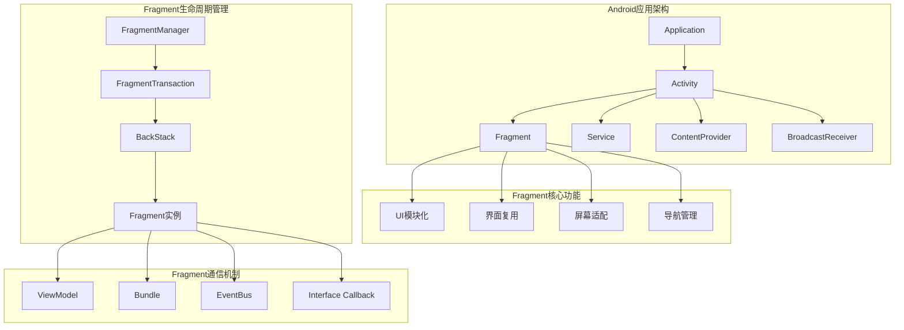
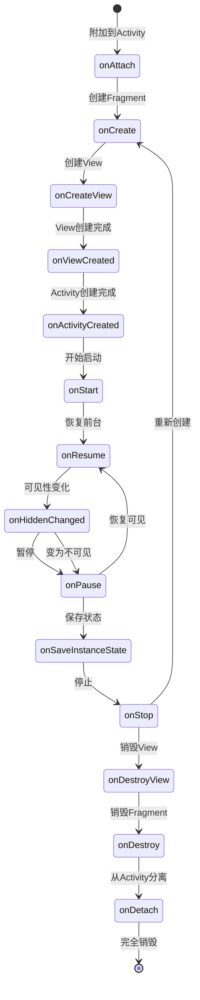

# 第11章：Fragment组件开发

## 📖 章节概述

本章将深入介绍Android Fragment组件的开发和使用。Fragment作为模块化UI开发的重要工具，能够帮助开发者构建灵活、可重用的用户界面。通过学习Fragment的生命周期、通信机制、状态管理和最佳实践，您将能够构建复杂的模块化应用。

## 🎯 学习目标

- 深入理解Fragment的生命周期和状态管理
- 掌握Fragment的创建、添加和移除
- 学会Fragment与Activity的通信方式
- 了解Fragment回退栈的管理
- 掌握Fragment间数据共享的机制
- 能够设计模块化的Fragment架构

## 🏗️ Fragment基础概念

### Fragment在应用架构中的位置



### Fragment的优势和特性

- **模块化UI**：将UI分解为独立的模块
- **界面复用**：同一Fragment可以在不同Activity中重用
- **屏幕适配**：根据屏幕尺寸动态调整布局
- **生命周期独立**：拥有独立的生命周期，可以独立管理状态
- **回退栈管理**：支持事务性的回退操作
- **灵活组合**：可以动态添加、移除和替换

## 🔄 Fragment生命周期详解

### Fragment生命周期完整流程



### Fragment生命周期实现示例

```java
/**
 * Fragment生命周期示例
 */
public class LifecycleFragment extends Fragment {

    private static final String TAG = "LifecycleFragment";
    private TextView statusTextView;
    private ProgressBar progressBar;
    private Button lifecycleButton;

    // Fragment状态标志
    private boolean isCreated = false;
    private boolean isVisible = false;
    private boolean isDetached = false;

    // 保存的状态数据
    private String savedData = "";
    private int counter = 0;

    @Override
    public void onAttach(@NonNull Context context) {
        super.onAttach(context);
        Log.d(TAG, "onAttach: Fragment附加到Activity");
        isDetached = false;

        // 确保Activity实现了指定接口
        if (context instanceof FragmentCallback) {
            ((FragmentCallback) context).onFragmentAttached(this);
        }
    }

    @Override
    public void onCreate(@Nullable Bundle savedInstanceState) {
        super.onCreate(savedInstanceState);
        Log.d(TAG, "onCreate: Fragment正在创建");
        isCreated = true;

        // 恢复保存的状态
        if (savedInstanceState != null) {
            savedData = savedInstanceState.getString("saved_data", "");
            counter = savedInstanceState.getInt("counter", 0);
            Log.d(TAG, "恢复保存的状态 - 数据: " + savedData + ", 计数器: " + counter);
        }

        // 初始化Fragment级别的组件
        initializeFragmentComponents();
    }

    @Override
    public View onCreateView(@NonNull LayoutInflater inflater, @Nullable ViewGroup container,
                             @Nullable Bundle savedInstanceState) {
        Log.d(TAG, "onCreateView: 创建Fragment的View");
        // 创建Fragment的View
        return inflater.inflate(R.layout.fragment_lifecycle, container, false);
    }

    @Override
    public void onViewCreated(@NonNull View view, @Nullable Bundle savedInstanceState) {
        super.onViewCreated(view, savedInstanceState);
        Log.d(TAG, "onViewCreated: View创建完成");

        // 初始化View组件
        initViews(view);

        // 设置View的初始状态
        setupInitialUIState();
    }

    @Override
    public void onActivityCreated(@Nullable Bundle savedInstanceState) {
        super.onActivityCreated(savedInstanceState);
        Log.d(TAG, "onActivityCreated: Activity创建完成");

        // 与Activity交互
        setupActivityInteraction();

        // 设置初始数据
        setupInitialData();
    }

    @Override
    public void onStart() {
        super.onStart();
        Log.d(TAG, "onStart: Fragment开始启动");

        isVisible = true;

        // 开始加载资源
        startLoading();

        // 注册监听器
        registerListeners();
    }

    @Override
    public void onResume() {
        super.onResume();
        Log.d(TAG, "onResume: Fragment恢复前台");

        // 开始执行周期性任务
        startPeriodicTasks();

        // 更新UI状态
        updateUIStatus("运行中", false);
    }

    @Override
    public void onPause() {
        super.onPause();
        Log.d(TAG, "onPause: Fragment暂停");

        // 暂停周期性任务
        stopPeriodicTasks();

        // 保存临时数据
        saveTemporaryData();
    }

    @Override
    public void onSaveInstanceState(@NonNull Bundle outState) {
        super.onSaveInstanceState(outState);
        Log.d(TAG, "onSaveInstanceState: 保存Fragment状态");

        // 保存状态数据
        outState.putString("saved_data", savedData);
        outState.putInt("counter", counter);

        // 保存自定义状态
        saveCustomState(outState);
    }

    @Override
    public void onStop() {
        super.onStop();
        Log.d(TAG, "onStop: Fragment停止");

        isVisible = false;

        // 停止加载
        stopLoading();

        // 取消注册监听器
        unregisterListeners();

        // 释放资源
        releaseResources();
    }

    @Override
    public void onDestroyView() {
        super.onDestroyView();
        Log.d(TAG, "onDestroyView: 销毁Fragment的View");

        // 清理View相关的引用
        cleanupViewReferences();
    }

    @Override
    public void onDestroy() {
        super.onDestroy();
        Log.d(TAG, "onDestroy: Fragment销毁");

        isCreated = false;

        // 清理Fragment级别的资源
        cleanupFragmentResources();
    }

    @Override
    public void onDetach() {
        super.onDetach();
        Log.d(TAG, "onDetach: Fragment从Activity分离");
        isDetached = true;

        // 清理与Activity的引用
        cleanupActivityReferences();
    }

    @Override
    public void onHiddenChanged(boolean hidden) {
        super.onHiddenChanged(hidden);
        Log.d(TAG, "onHiddenChanged: Fragment可见性变化 - " + (hidden ? "隐藏" : "显示"));

        isVisible = !hidden;

        if (hidden) {
            onFragmentHidden();
        } else {
            onFragmentVisible();
        }
    }

    // ========== 私有方法 ==========

    private void initViews(View view) {
        statusTextView = view.findViewById(R.id.statusTextView);
        progressBar = view.findViewById(R.id.progressBar);
        lifecycleButton = view.findViewById(R.id.lifecycleButton);
    }

    private void setupInitialUIState() {
        statusTextView.setText("初始化完成");
        progressBar.setVisibility(View.GONE);
        lifecycleButton.setOnClickListener(v -> performLifecycleAction());
    }

    private void initializeFragmentComponents() {
        // 初始化Fragment级别的组件
        // 例如：数据库连接、网络请求配置等
    }

    private void setupActivityInteraction() {
        // 获取Activity引用并进行交互
        if (getActivity() instanceof FragmentCallback) {
            ((FragmentCallback) getActivity()).onFragmentReady(this);
        }
    }

    private void setupInitialData() {
        // 设置初始数据
        savedData = "默认数据";
        counter = 0;
    }

    private void startLoading() {
        progressBar.setVisibility(View.VISIBLE);
        updateUIStatus("加载中", true);
    }

    private void stopLoading() {
        progressBar.setVisibility(View.GONE);
    }

    private void registerListeners() {
        // 注册全局事件监听器
        EventBus.getDefault().register(this);
    }

    private void unregisterListeners() {
        // 取消注册全局事件监听器
        EventBus.getDefault().unregister(this);
    }

    private void startPeriodicTasks() {
        // 开始周期性任务
        // 例如：定时更新数据、动画等
    }

    private void stopPeriodicTasks() {
        // 停止周期性任务
    }

    private void saveTemporaryData() {
        // 保存临时数据到内存或磁盘
    }

    private void releaseResources() {
        // 释放资源
        // 例如：取消网络请求、释放图片资源等
    }

    private void cleanupViewReferences() {
        statusTextView = null;
        progressBar = null;
        lifecycleButton = null;
    }

    private void cleanupFragmentResources() {
        // 清理Fragment级别的资源
    }

    private void cleanupActivityReferences() {
        // 清理与Activity的引用，避免内存泄漏
    }

    private void onFragmentVisible() {
        Log.d(TAG, "Fragment变为可见");
        updateUIStatus("可见", false);
    }

    private void onFragmentHidden() {
        Log.d(TAG, "Fragment变为隐藏");
        updateUIStatus("隐藏", false);
    }

    private void updateUIStatus(String status, boolean loading) {
        if (statusTextView != null) {
            statusTextView.setText(status);
        }
        if (progressBar != null) {
            progressBar.setVisibility(loading ? View.VISIBLE : View.GONE);
        }
    }

    private void performLifecycleAction() {
        if (!isDetached && isCreated && isVisible) {
            counter++;
            savedData = "操作次数: " + counter;
            updateUIStatus("数据: " + savedData, false);

            // 发送事件通知
            EventBus.getDefault().post(new FragmentUpdateEvent(counter));
        }
    }

    private void saveCustomState(Bundle outState) {
        // 保存自定义状态
        outState.putLong("timestamp", System.currentTimeMillis());
        outState.putString("version", "1.0");
    }

    // ========== 接口定义 ==========

    public interface FragmentCallback {
        void onFragmentAttached(Fragment fragment);
        void onFragmentReady(Fragment fragment);
    }

    // ========== 事件类 ==========

    public static class FragmentUpdateEvent {
        private final int counter;

        public FragmentUpdateEvent(int counter) {
            this.counter = counter;
        }

        public int getCounter() {
            return counter;
        }
    }

    // ========== 公共方法 ==========

    public void updateData(String newData) {
        this.savedData = newData;
        if (statusTextView != null) {
            statusTextView.setText("数据: " + savedData);
        }
    }

    public int getCounter() {
        return counter;
    }

    public boolean isVisible() {
        return isVisible;
    }

    public boolean isDetached() {
        return isDetached;
    }
}
```

## 🔧 Fragment创建和管理

### Fragment创建的多种方式

```java
/**
 * Fragment创建和管理示例
 */
public class FragmentManagementActivity extends AppCompatActivity {

    private static final String TAG = "FragmentManagement";

    private FrameLayout container;
    private BottomNavigationView bottomNavigationView;
    private Button addFragmentButton;
    private Button replaceFragmentButton;
    private Button removeFragmentButton;
    private Button clearStackButton;

    private int currentFragmentId = R.id.navigation_home;
    private final FragmentManager fragmentManager = getSupportFragmentManager();

    @Override
    protected void onCreate(Bundle savedInstanceState) {
        super.onCreate(savedInstanceState);
        setContentView(R.layout.activity_fragment_management);

        initViews();
        setupBottomNavigation();
        setupClickListeners();

        // 首次启动时加载默认Fragment
        if (savedInstanceState == null) {
            loadInitialFragment();
        }
    }

    private void initViews() {
        container = findViewById(R.id.fragmentContainer);
        bottomNavigationView = findViewById(R.id.bottomNavigation);
        addFragmentButton = findViewById(R.id.addFragmentButton);
        replaceFragmentButton = findViewById(R.id.replaceFragmentButton);
        removeFragmentButton = findViewById(R.id.removeFragmentButton);
        clearStackButton = findViewById(R.id.clearStackButton);
    }

    private void setupBottomNavigation() {
        bottomNavigationView.setOnItemSelectedListener(item -> {
            int itemId = item.getItemId();

            if (itemId != currentFragmentId) {
                currentFragmentId = itemId;
                loadFragment(itemId);
                return true;
            }
            return false;
        });
    }

    private void setupClickListeners() {
        addFragmentButton.setOnClickListener(v -> addFragment());
        replaceFragmentButton.setOnClickListener(v -> replaceFragment());
        removeFragmentButton.setOnClickListener(v -> removeTopFragment());
        clearStackButton.setOnClickListener(v -> clearBackStack());
    }

    /**
     * 加载初始Fragment
     */
    private void loadInitialFragment() {
        loadFragment(R.id.navigation_home);
    }

    /**
     * 根据ID加载Fragment
     */
    private void loadFragment(int navigationId) {
        Fragment fragment = createFragment(navigationId);

        if (fragment != null) {
            // 使用replace方法替换当前Fragment
            getSupportFragmentManager()
                    .beginTransaction()
                    .setReorderingAllowed(true)
                    .setCustomAnimations(
                        R.anim.fragment_fade_in,
                        R.anim.fragment_fade_out
                    )
                    .replace(R.id.fragmentContainer, fragment, getFragmentTag(navigationId))
                    .addToBackStack(getFragmentTag(navigationId))
                    .commit();
        }
    }

    /**
     * 创建Fragment实例
     */
    private Fragment createFragment(int navigationId) {
        switch (navigationId) {
            case R.id.navigation_home:
                return HomeFragment.newInstance("首页数据");
            case R.id.navigation_dashboard:
                return DashboardFragment.newInstance("仪表板数据");
            case R.id.navigation_notifications:
                return NotificationsFragment.newInstance();
            case R.id.navigation_profile:
                return ProfileFragment.newInstance();
            default:
                return null;
        }
    }

    /**
     * 获取Fragment标签
     */
    private String getFragmentTag(int navigationId) {
        switch (navigationId) {
            case R.id.navigation_home:
                return "home_fragment";
            case R.id.navigation_dashboard:
                return "dashboard_fragment";
            case R.id.navigation_notifications:
                return "notifications_fragment";
            case R.id.navigation_profile:
                return "profile_fragment";
            default:
                return "unknown_fragment";
        }
    }

    /**
     * 添加Fragment（不替换当前Fragment）
     */
    private void addFragment() {
        Fragment newFragment = new SampleFragment();

        getSupportFragmentManager()
                .beginTransaction()
                .setReorderingAllowed(true)
                .setCustomAnimations(
                    R.anim.fragment_slide_in_from_bottom,
                    R.anim.fragment_slide_out_to_bottom
                )
                .add(R.id.fragmentContainer, newFragment, "sample_fragment")
                .addToBackStack("add_sample")
                .commit();
    }

    /**
     * 替换Fragment
     */
    private void replaceFragment() {
        Fragment newFragment = new SampleFragment();

        FragmentTransaction transaction = getSupportFragmentManager()
                .beginTransaction()
                .setReorderingAllowed(true)
                .setCustomAnimations(
                    R.anim.fragment_slide_in_from_right,
                    R.anim.fragment_slide_out_to_left
                );

        // 如果有当前Fragment，先隐藏它
        Fragment currentFragment = getSupportFragmentManager().findFragmentById(R.id.fragmentContainer);
        if (currentFragment != null) {
            transaction.hide(currentFragment);
        }

        transaction.add(R.id.fragmentContainer, newFragment, "replacement_fragment");
        transaction.addToBackStack("replace_sample");
        transaction.commit();
    }

    /**
     * 移除顶部Fragment
     */
    private void removeTopFragment() {
        FragmentManager manager = getSupportFragmentManager();
        Fragment topFragment = manager.findFragmentById(R.id.fragmentContainer);

        if (topFragment != null) {
            manager
                    .beginTransaction()
                    .remove(topFragment)
                    .commit();

            Log.d(TAG, "移除Fragment: " + topFragment.getClass().getSimpleName());
        }
    }

    /**
     * 清除回退栈
     */
    private void clearBackStack() {
        fragmentManager.popBackStack(null, FragmentManager.POP_BACK_STACK_INCLUSIVE);
        Log.d(TAG, "清除所有回退栈");
    }

    /**
     * 查找Fragment
     */
    private Fragment findFragmentByTag(String tag) {
        return getSupportFragmentManager().findFragmentByTag(tag);
    }

    /**
     * 获取回退栈深度
     */
    private int getBackStackEntryCount() {
        return fragmentManager.getBackStackEntryCount();
    }

    @Override
    public void onBackPressed() {
        // 检查是否有Fragment可以处理返回事件
        Fragment currentFragment = getSupportFragmentManager().findFragmentById(R.id.fragmentContainer);

        if (currentFragment instanceof BackPressHandler) {
            boolean handled = ((BackPressHandler) currentFragment).onBackPressed();
            if (handled) {
                return;
            }
        }

        // 如果回退栈有多个Fragment，可以弹出顶部Fragment
        if (getBackStackEntryCount() > 1) {
            fragmentManager.popBackStack();
            return;
        }

        // 否则执行默认的返回操作
        super.onBackPressed();
    }
}

/**
 * 可处理返回事件的接口
 */
interface BackPressHandler {
    boolean onBackPressed();
}

/**
 * 示例Fragment基类
 */
abstract class BaseFragment extends Fragment {

    protected String title;
    protected Bundle arguments;

    @Override
    public void onCreate(@Nullable Bundle savedInstanceState) {
        super.onCreate(savedInstanceState);
        arguments = getArguments();
        if (arguments != null) {
            title = arguments.getString("title", "");
        }
    }

    protected String getTitle() {
        return title;
    }

    protected Bundle getArguments() {
        return arguments;
    }
}

/**
 * HomeFragment实现
 */
class HomeFragment extends BaseFragment {

    private static final String ARG_TITLE = "title";

    public static HomeFragment newInstance(String title) {
        HomeFragment fragment = new HomeFragment();
        Bundle args = new Bundle();
        args.putString(ARG_TITLE, title);
        fragment.setArguments(args);
        return fragment;
    }

    @Override
    public View onCreateView(@NonNull LayoutInflater inflater, @Nullable ViewGroup container,
                             @Nullable Bundle savedInstanceState) {
        return inflater.inflate(R.layout.fragment_home, container, false);
    }

    @Override
    public void onViewCreated(@NonNull View view, @Nullable Bundle savedInstanceState) {
        super.onViewCreated(view, savedInstanceState);

        // 设置标题
        if (getActivity() != null) {
            ((AppCompatActivity) getActivity()).getSupportActionBar().setTitle(getTitle());
        }

        // 初始化UI
        setupUI(view);
    }

    private void setupUI(View view) {
        TextView titleTextView = view.findViewById(R.id.titleTextView);
        if (titleTextView != null) {
            titleTextView.setText("首页 - " + getTitle());
        }
    }
}
```

### Fragment事务管理

```java
/**
 * Fragment事务管理工具类
 */
public class FragmentTransactionManager {

    private static final String TAG = "FragmentTransactionManager";

    /**
     * 执行安全的Fragment事务
     */
    public static void executeTransactionSafely(FragmentManager fragmentManager,
                                                   FragmentOperation operation) {
        try {
            FragmentTransaction transaction = fragmentManager.beginTransaction();
            operation.execute(transaction);
            transaction.commit();
        } catch (Exception e) {
            Log.e(TAG, "Fragment事务执行失败", e);
            // 回退到主线程执行
            if (Looper.myLooper() != Looper.getMainLooper()) {
                new Handler(Looper.getMainLooper()).post(() -> {
                    try {
                        FragmentTransaction transaction = fragmentManager.beginTransaction();
                        operation.execute(transaction);
                        transaction.commit();
                    } catch (Exception mainThreadException) {
                        Log.e(TAG, "主线程Fragment事务执行失败", mainThreadException);
                    }
                });
            }
        }
    }

    /**
     * 添加Fragment的便捷方法
     */
    public static void addFragment(FragmentManager fragmentManager,
                                   int containerId,
                                   Fragment fragment,
                                   String tag,
                                   boolean addToBackStack) {
        executeTransactionSafely(fragmentManager, transaction -> {
            transaction.add(containerId, fragment, tag);
            if (addToBackStack) {
                transaction.addToBackStack(tag);
            }
        });
    }

    /**
     * 替换Fragment的便捷方法
     */
    public static void replaceFragment(FragmentManager fragmentManager,
                                        int containerId,
                                        Fragment fragment,
                                        String tag,
                                        boolean addToBackStack) {
        executeTransactionSafely(fragmentManager, transaction -> {
            transaction.replace(containerId, fragment, tag);
            if (addToBackStack) {
                transaction.addToBackStack(tag);
            }
        });
    }

    /**
     * 移除Fragment的便捷方法
     */
    public static void removeFragment(FragmentManager fragmentManager, Fragment fragment) {
        executeTransactionSafely(fragmentManager, transaction -> {
            transaction.remove(fragment);
        });
    }

    /**
     * 隐藏Fragment的便捷方法
     */
    public static void hideFragment(FragmentManager fragmentManager, Fragment fragment) {
        executeTransactionSafely(fragmentManager, transaction -> {
            transaction.hide(fragment);
        });
    }

    /**
     * 显示Fragment的便捷方法
     */
    public static void showFragment(FragmentManager fragmentManager, Fragment fragment) {
        executeTransactionSafely(fragmentManager, transaction -> {
            transaction.show(fragment);
        });
    }

    /**
     * 添加到回退栈的便捷方法
     */
    public static void addToBackStack(FragmentManager fragmentManager, String name) {
        executeTransactionSafely(fragmentManager, transaction -> {
            transaction.addToBackStack(name);
        });
    }

    /**
     * 弹出回退栈的便捷方法
     */
    public static void popBackStack(FragmentManager fragmentManager) {
        fragmentManager.popBackStack();
    }

    /**
     * 弹出指定名称的回退栈
     */
    public static void popBackStack(FragmentManager fragmentManager, String name) {
        fragmentManager.popBackStack(name, FragmentManager.POP_BACK_STACK_INCLUSIVE);
    }

    /**
     * 清除回退栈的便捷方法
     */
    public static void clearBackStack(FragmentManager fragmentManager) {
        fragmentManager.popBackStack(null, FragmentManager.POP_BACK_STACK_INCLUSIVE);
    }

    /**
     * 设置自定义动画
     */
    public static void setCustomAnimations(FragmentTransaction transaction,
                                         int enter,
                                         int exit) {
        transaction.setCustomAnimations(enter, exit);
    }

    /**
     * 设置转场动画
     */
    public void setTransition(FragmentTransaction transaction,
                             int enter,
                             int exit,
                             int popEnter,
                             int popExit) {
        transaction.setTransition(FragmentTransaction.TRANSIT_FRAGMENT_OPEN);
        transaction.setCustomAnimations(enter, exit);
    }

    /**
     * Fragment操作接口
     */
    public interface FragmentOperation {
        void execute(FragmentTransaction transaction);
    }

    /**
     * 批量Fragment操作
     */
    public static class BatchFragmentOperations {
        private final List<FragmentOperation> operations = new ArrayList<>();

        public BatchFragmentOperations add(FragmentOperation operation) {
            operations.add(operation);
            return this;
        }

        public void execute(FragmentManager fragmentManager) {
            FragmentTransaction transaction = fragmentManager.beginTransaction();
            try {
                for (FragmentOperation operation : operations) {
                    operation.execute(transaction);
                }
                transaction.commit();
            } catch (Exception e) {
                Log.e(TAG, "批量Fragment操作执行失败", e);
            }
        }

        public void clear() {
            operations.clear();
        }
    }
}
```

## 📡 Fragment通信机制

### ViewModel共享数据

```java
/**
 * Fragment通信示例 - 使用ViewModel
 */
public class FragmentCommunicationActivity extends AppCompatActivity {

    private SharedViewModel sharedViewModel;
    private FragmentManager fragmentManager;

    @Override
    protected void onCreate(Bundle savedInstanceState) {
        super.onCreate(savedInstanceState);
        setContentView(R.layout.activity_fragment_communication);

        // 初始化ViewModel
        sharedViewModel = new ViewModelProvider(this).get(SharedViewModel.class);
        fragmentManager = getSupportFragmentManager();

        // 加载Fragment
        if (savedInstanceState == null) {
            loadFragments();
        }
    }

    private void loadFragments() {
        // 添加FragmentManagerFragment
        fragmentManager.beginTransaction()
                .add(R.id.firstFragmentContainer, new FirstFragment(), "first_fragment")
                .add(R.id.secondFragmentContainer, new SecondFragment(), "second_fragment")
                .commit();
    }

    /**
     * 共享ViewModel
     */
    public static class SharedViewModel extends ViewModel {
        private final MutableLiveData<String> sharedData = new MutableLiveData<>();
        private final MutableLiveData<Integer> counter = new MutableLiveData<>();
        private final MutableLiveData<List<String>> messageList = new MutableLiveData<>();

        public SharedViewModel() {
            // 初始化默认值
            sharedData.setValue("初始数据");
            counter.setValue(0);
            messageList.setValue(new ArrayList<>());
        }

        // Getters
        public LiveData<String> getSharedData() { return sharedData; }
        public LiveData<Integer> getCounter() { return counter; }
        public LiveData<List<String>> getMessageList() { return messageList; }

        // Setters
        public void setSharedData(String data) { sharedData.setValue(data); }
        public void incrementCounter() { counter.setValue(counter.getValue() + 1); }
        public void addMessage(String message) {
            List<String> currentList = messageList.getValue();
            currentList.add(message);
            messageList.setValue(currentList);
        }
    }
}

/**
 * 第一个Fragment
 */
public class FirstFragment extends Fragment {

    private SharedViewModel sharedViewModel;
    private TextView dataTextView;
    private Button updateButton;
    private Button incrementButton;

    @Override
    public void onCreate(@Nullable Bundle savedInstanceState) {
        super.onCreate(savedInstanceState);
    }

    @Override
    public View onCreateView(@NonNull LayoutInflater inflater, @Nullable ViewGroup container,
                             @Nullable Bundle savedInstanceState) {
        return inflater.inflate(R.layout.fragment_first, container, false);
    }

    @Override
    public void onViewCreated(@NonNull View view, @Nullable Bundle savedInstanceState) {
        super.onViewCreated(view, savedInstanceState);

        initViews(view);
        setupViewModel();
        setupObservers();
    }

    private void initViews(View view) {
        dataTextView = view.findViewById(R.id.dataTextView);
        updateButton = view.findViewById(R.id.updateButton);
        incrementButton = view.findViewById(R.id.incrementButton);
    }

    private void setupViewModel() {
        // 获取Activity的ViewModel
        FragmentActivity activity = (FragmentActivity) requireActivity();
        sharedViewModel = new ViewModelProvider(activity).get(SharedViewModel.class);
    }

    private void setupObservers() {
        // 观察共享数据
        sharedViewModel.getSharedData().observe(getViewLifecycleOwner(), data -> {
            if (dataTextView != null) {
                dataTextView.setText("Fragment1数据: " + data);
            }
        });

        // 观察计数器
        sharedViewModel.getCounter().observe(getViewLifecycleOwner(), counter -> {
            Log.d("FirstFragment", "计数器更新: " + counter);
        });

        // 观察消息列表
        sharedViewModel.getMessageList().observe(getViewLifecycleOwner(), messages -> {
            Log.d("FirstFragment", "消息列表更新，数量: " + messages.size());
        });
    }

    private void setupClickListeners() {
        updateButton.setOnClickListener(v -> {
            String newData = "来自Fragment1的数据 - " + System.currentTimeMillis();
            sharedViewModel.setSharedData(newData);
        });

        incrementButton.setOnClickListener(v -> {
            sharedViewModel.incrementCounter();
        });
    }
}

/**
 * 第二个Fragment
 */
public class SecondFragment extends Fragment {

    private SharedViewModel sharedViewModel;
    private TextView dataTextView;
    private TextView counterTextView;
    private RecyclerView messageRecyclerView;
    private MessageAdapter messageAdapter;
    private Button addMessageButton;

    @Override
    public void onCreate(@Nullable Bundle savedInstanceState) {
        super.onCreate(savedInstanceState);
    }

    @Override
    public View onCreateView(@NonNull LayoutInflater inflater, @Nullable ViewGroup container,
                             @Nullable Bundle savedInstanceState) {
        return inflater.inflate(R.layout.fragment_second, container, false);
    }

    @Override
    public void onViewCreated(@NonNull View view, @Nullable Bundle savedInstanceState) {
        super.onViewCreated(view, savedInstanceState);

        initViews(view);
        setupViewModel();
        setupObservers();
        setupRecyclerView();
    }

    private void initViews(View view) {
        dataTextView = view.findViewById(R.id.dataTextView);
        counterTextView = view.findViewById(R.id.counterTextView);
        messageRecyclerView = view.findViewById(R.id.messageRecyclerView);
        addMessageButton = view.findViewById(R.id.addMessageButton);
    }

    private void setupViewModel() {
        FragmentActivity activity = (FragmentActivity) requireActivity();
        sharedViewModel = new ViewModelProvider(activity).get(SharedViewModel.class);
    }

    private void setupObservers() {
        // 观察共享数据
        sharedViewModel.getSharedData().observe(getViewLifecycleOwner(), data -> {
            if (dataTextView != null) {
                dataTextView.setText("Fragment2数据: " + data);
            }
        });

        // 观察计数器
        sharedViewModel.getCounter().observe(getViewLifecycleOwner(), counter -> {
            if (counterTextView != null) {
                counterTextView.setText("计数器: " + counter);
            }
        });

        // 观察消息列表
        sharedViewModel.getMessageList().observe(getViewLifecycleOwner(), messages -> {
            if (messageAdapter != null) {
                messageAdapter.submitList(new ArrayList<>(messages));
            }
        });
    }

    private void setupRecyclerView() {
        messageAdapter = new MessageAdapter();
        messageRecyclerView.setLayoutManager(new LinearLayoutManager(getContext()));
        messageRecyclerView.setAdapter(messageAdapter);
    }

    private void setupClickListeners() {
        addMessageButton.setOnClickListener(v -> {
            String message = "消息 " + (System.currentTimeMillis() % 1000);
            sharedViewModel.addMessage(message);
        });
    }

    /**
     * 消息适配器
     */
    private static class MessageAdapter extends RecyclerView.Adapter<MessageAdapter.MessageViewHolder> {

        private List<String> messages = new ArrayList<>();

        @NonNull
        @Override
        public MessageViewHolder onCreateViewHolder(@NonNull ViewGroup parent, int viewType) {
            View view = LayoutInflater.from(parent.getContext())
                    .inflate(R.layout.item_message, parent, false);
            return new MessageViewHolder(view);
        }

        @Override
        public void onBindViewHolder(@NonNull MessageViewHolder holder, int position) {
            holder.bind(messages.get(position));
        }

        @Override
        public int getItemCount() {
            return messages.size();
        }

        public void submitList(List<String> newMessages) {
            messages.clear();
            messages.addAll(newMessages);
            notifyDataSetChanged();
        }

        static class MessageViewHolder extends RecyclerView.ViewHolder {
            private TextView messageTextView;

            public MessageViewHolder(@NonNull View itemView) {
                super(itemView);
                messageTextView = itemView.findViewById(R.id.messageTextView);
            }

            public void bind(String message) {
                messageTextView.setText(message);
            }
        }
    }
}
```

### 接口回调通信

```java
/**
 * Fragment接口回调通信示例
 */
public class InterfaceCallbackActivity extends AppCompatActivity implements
        FirstFragment.OnDataChangeListener,
        SecondFragment.OnActionListener {

    private FirstFragment firstFragment;
    private SecondFragment secondFragment;

    @Override
    protected void onCreate(Bundle savedInstanceState) {
        super.onCreate(savedInstanceState);
        setContentView(R.layout.activity_interface_callback);

        loadFragments();
    }

    private void loadFragments() {
        getSupportFragmentManager()
                .beginTransaction()
                .add(R.id.firstFragmentContainer, firstFragment, "first_fragment")
                .add(R.id.secondFragmentContainer, secondFragment, "second_fragment")
                .commit();
    }

    @Override
    public void onDataChanged(String data) {
        // 处理第一个Fragment的数据变化
        if (secondFragment != null) {
            secondFragment.updateData(data);
        }
    }

    @Override
    public void onAction(String action) {
        // 处理第二个Fragment的操作
        Toast.makeText(this, "操作: " + action, Toast.LENGTH_SHORT).show();

        if (firstFragment != null) {
            firstFragment.handleAction(action);
        }
    }
}

/**
 * 第一个Fragment - 使用接口回调
 */
public class FirstFragment extends Fragment {

    public interface OnDataChangeListener {
        void onDataChanged(String data);
    }

    private OnDataChangeListener dataChangeListener;
    private Button changeDataButton;
    private TextView statusTextView;

    @Override
    public void onAttach(@NonNull Context context) {
        super.onAttach(context);
        if (context instanceof OnDataChangeListener) {
            dataChangeListener = (OnDataChangeListener) context;
        }
    }

    @Override
    public View onCreateView(@NonNull LayoutInflater inflater, @Nullable ViewGroup container,
                             @Nullable Bundle savedInstanceState) {
        return inflater.inflate(R.layout.fragment_first_callback, container, false);
    }

    @Override
    public void onViewCreated(@NonNull View view, @Nullable Bundle savedInstanceState) {
        super.onViewCreated(view, savedInstanceState);

        changeDataButton = view.findViewById(R.id.changeDataButton);
        statusTextView = view.findViewById(R.id.statusTextView);

        changeDataButton.setOnClickListener(v -> {
            String newData = "接口回调数据 " + System.currentTimeMillis();
            notifyDataChanged(newData);
        });
    }

    private void notifyDataChanged(String data) {
        if (dataChangeListener != null) {
            dataChangeListener.onDataChanged(data);
        }
        updateStatus("数据已发送: " + data);
    }

    private void updateStatus(String status) {
        if (statusTextView != null) {
            statusTextView.setText(status);
        }
    }

    public void handleAction(String action) {
        updateStatus("收到操作: " + action);
    }
}

/**
 * 第二个Fragment - 使用接口回调
 */
public class SecondFragment extends Fragment {

    public interface OnActionListener {
        void onAction(String action);
    }

    private OnActionListener actionListener;
    private TextView dataTextView;
    private Button actionButton;

    @Override
    public void onAttach(@NonNull Context context) {
        super.onAttach(context);
        if (context instanceof OnActionListener) {
            actionListener = (OnActionListener) context;
        }
    }

    @Override
    public View onCreateView(@NonNull LayoutInflater inflater, @Nullable ViewGroup container,
                             @Nullable Bundle savedInstanceState) {
        return inflater.inflate(R.layout.fragment_second_callback, container, false);
    }

    @Override
    public void onViewCreated(@NonNull View view, @Nullable Bundle savedInstanceState) {
        super.onViewCreated(view, savedInstanceState);

        dataTextView = view.findViewById(R.id.dataTextView);
        actionButton = view.findViewById(R.id.actionButton);

        actionButton.setOnClickListener(v -> {
            String action = "按钮点击 " + System.currentTimeMillis();
            notifyAction(action);
        });
    }

    public void updateData(String data) {
        if (dataTextView != null) {
            dataTextView.setText("接收的数据: " + data);
        }
    }

    private void notifyAction(String action) {
        if (actionListener != null) {
            actionListener.onAction(action);
        }
    }
}
```

### EventBus事件总线通信

```java
/**
 * Fragment事件总线通信示例
 */
public class EventBusActivity extends AppCompatActivity {

    private static final String TAG = "EventBusActivity";

    @Override
    protected void onCreate(Bundle savedInstanceState) {
        super.onCreate(savedInstanceState);
        setContentView(R.layout.activity_event_bus);

        // 加载Fragment
        if (savedInstanceState == null) {
            getSupportFragmentManager()
                    .beginTransaction()
                    .add(R.id.firstFragmentContainer, new FirstEventFragment(), "first_event_fragment")
                    .add(R.id.secondFragmentContainer, new SecondEventFragment(), "second_event_fragment")
                    .commit();
        }
    }
}

/**
 * 自定义事件类
 */
class MessageEvent {
    private final String message;
    private final long timestamp;
    private final String source;

    public MessageEvent(String message, String source) {
        this.message = message;
        this.timestamp = System.currentTimeMillis();
        this.source = source;
    }

    // Getters
    public String getMessage() { return message; }
    public long getTimestamp() { return timestamp; }
    public String getSource() { return source; }
}

class CounterEvent {
    private final int value;
    private final String operation;

    public CounterEvent(int value, String operation) {
        this.value = value;
        this.operation = operation;
    }

    // Getters
    public int getValue() { return value; }
    public String getOperation() { return operation; }
}

/**
 * 第一个Fragment - 使用EventBus
 */
public class FirstEventFragment extends Fragment {

    private static final String TAG = "FirstEventFragment";
    private Button sendMessageButton;
    private Button incrementButton;
    private Button decrementButton;
    private TextView statusTextView;

    @Override
    public View onCreateView(@NonNull LayoutInflater inflater, @Nullable ViewGroup container,
                             @Nullable Bundle savedInstanceState) {
        return inflater.inflate(R.layout.fragment_first_event, container, false);
    }

    @Override
    public void onViewCreated(@NonNull View view, @Nullable Bundle savedInstanceState) {
        super.onViewCreated(view, savedInstanceState);

        initViews(view);
        setupClickListeners();
    }

    private void initViews(View view) {
        sendMessageButton = view.findViewById(R.id.sendMessageButton);
        incrementButton = view.findViewById(R.id.incrementButton);
        decrementButton = view.findViewById(R.id.decrementButton);
        statusTextView = view.findViewById(R.id.statusTextView);
    }

    private void setupClickListeners() {
        sendMessageButton.setOnClickListener(v -> {
            String message = "来自Fragment1的消息 " + System.currentTimeMillis();
            MessageEvent event = new MessageEvent(message, "Fragment1");
            EventBus.getDefault().post(event);
        });

        incrementButton.setOnClickListener(v -> {
            CounterEvent event = new CounterEvent(1, "increment");
            EventBus.getDefault().post(event);
        });

        decrementButton.setOnClickListener(v -> {
            CounterEvent event = new CounterEvent(-1, "decrement");
            EventBus.getDefault().post(event);
        });
    }

    @Override
    public void onStart() {
        super.onStart();
        // 注册EventBus
        EventBus.getDefault().register(this);
    }

    @Override
    public void onStop() {
        super.onStop();
        // 取消注册EventBus
        EventBus.getDefault().unregister(this);
    }

    /**
     * 接收MessageEvent
     */
    @Subscribe(threadMode = ThreadMode.MAIN)
    public void onMessageEvent(MessageEvent event) {
        if (!"Fragment1".equals(event.getSource())) {
            String status = "收到消息: " + event.getMessage() +
                           " 来自: " + event.getSource() +
                           " 时间: " + new Date(event.getTimestamp());
            updateStatus(status);
        }
    }

    /**
     * 接收CounterEvent
     */
    @Subscribe(threadMode = ThreadMode.MAIN)
    public void onCounterEvent(CounterEvent event) {
        String status = "计数器操作: " + event.getOperation() +
                           " 值: " + event.getValue() +
                           " 来自: " + (event.getValue() > 0 ? "其他Fragment" : "本Fragment");
        updateStatus(status);
    }

    private void updateStatus(String status) {
        if (statusTextView != null) {
            statusTextView.setText(status);
        }
    }
}

/**
 * 第二个Fragment - 使用EventBus
 */
public class SecondEventFragment extends Fragment {

    private static final String TAG = "SecondEventFragment";
    private TextView receivedMessageTextView;
    private TextView counterValueTextView;
    private Button clearButton;

    @Override
    public View onCreateView(@NonNull LayoutInflater inflater, @Nullable ViewGroup container,
                             @Nullable Bundle savedInstanceState) {
        return inflater.inflate(R.layout.fragment_second_event, container, false);
    }

    @Override
    public void onViewCreated(@NonNull View view, @Nullable Bundle savedInstanceState) {
        super.onViewCreated(view, savedInstanceState);

        initViews(view);
        setupClickListeners();
    }

    private void initViews(View view) {
        receivedMessageTextView = view.findViewById(R.id.receivedMessageTextView);
        counterValueTextView = view.findViewById(R.id.counterValueTextView);
        clearButton = view.findViewById(R.id.clearButton);
    }

    private void setupClickListeners() {
        clearButton.setOnClickListener(v -> {
            clearData();
        });
    }

    private void clearData() {
        receivedMessageTextView.setText("");
        counterValueTextView.setText("计数器: 0");
    }

    @Override
    public void onStart() {
        super.onStart();
        EventBus.getDefault().register(this);
    }

    @Override
    public void onStop() {
        super.onStop();
        EventBus.getDefault().unregister(this);
    }

    /**
     * 接收MessageEvent
     */
    @Subscribe(threadMode = ThreadMode.MAIN)
    public void onMessageEvent(MessageEvent event) {
        if ("Fragment1".equals(event.getSource())) {
            updateMessageDisplay(event.getMessage());
        }
    }

    /**
     * 接收CounterEvent
     */
    @Subscribe(threadMode = ThreadMode.MAIN)
    public void onCounterEvent(CounterEvent event) {
        updateCounterDisplay();
    }

    private void updateMessageDisplay(String message) {
        if (receivedMessageTextView != null) {
            receivedMessageTextView.setText("最新消息: " + message);
        }
    }

    private void updateCounterDisplay() {
        // 这里无法直接获取计数器的值
        // 需要通过其他方式来维护计数器状态
        int counter = CounterManager.getInstance().getCounter();
        if (counterValueTextView != null) {
            counterValueTextView.setText("计数器: " + counter);
        }
    }
}

/**
 * 计数器管理器（单例）
 */
class CounterManager {
    private static final CounterManager INSTANCE = new CounterManager();
    private int counter = 0;

    private CounterManager() {}

    public static CounterManager getInstance() {
        return INSTANCE;
    }

    public synchronized void increment() {
        counter++;
    }

    public synchronized void decrement() {
        counter--;
    }

    public synchronized int getCounter() {
        return counter;
    }

    public synchronized void reset() {
        counter = 0;
    }
}
```

## 🎯 Fragment最佳实践

### Fragment架构模式

```java
/**
 * Fragment架构模式示例
 */
public class ArchitectureFragment extends Fragment {

    // 视图层：只负责UI显示和用户交互
    private FragmentArchitectureBinding binding;
    private ArchitectureViewModel viewModel;

    @Override
    public View onCreateView(@NonNull LayoutInflater inflater, @Nullable ViewGroup container,
                             @Nullable Bundle savedInstanceState) {
        binding = DataBindingUtil.inflate(inflater, R.layout.fragment_architecture, container, false);
        return binding.getRoot();
    }

    @Override
    public void onViewCreated(@NonNull View view, @Nullable Bundle savedInstanceState) {
        super.onViewCreated(view, savedInstanceState);

        // 获取ViewModel
        viewModel = new ViewModelProvider(this).get(ArchitectureViewModel.class);

        // 设置生命周期所有者
        binding.setLifecycleOwner(getViewLifecycleOwner());

        // 设置ViewModel
        binding.setViewModel(viewModel);

        // 观察数据变化
        observeViewModel();

        // 设置UI事件
        setupUIEvents();
    }

    private void observeViewModel() {
        // 观察数据变化
        viewModel.getData().observe(getViewLifecycleOwner(), data -> {
            binding.setData(data);
        });

        viewModel.getLoading().observe(getViewLifecycleOwner(), isLoading -> {
            binding.progressBar.setVisibility(isLoading ? View.VISIBLE : View.GONE);
        });

        viewModel.getError().observe(getViewLifecycleOwner(), error -> {
            if (error != null) {
                showError(error);
            }
        });
    }

    private void setupUIEvents() {
        binding.refreshButton.setOnClickListener(v -> {
            viewModel.refreshData();
        });

        binding.saveButton.setOnClickListener(v -> {
            String data = binding.inputEditText.getText().toString();
            viewModel.saveData(data);
        });
    }

    private void showError(String error) {
        Toast.makeText(getContext(), error, Toast.LENGTH_SHORT).show();
    }
}

/**
 * Fragment的ViewModel
 */
class ArchitectureViewModel extends ViewModel {

    private final MutableLiveData<String> data = new MutableLiveData<>();
    private final MutableLiveData<Boolean> loading = new MutableLiveData<>();
    private final MutableLiveData<String> error = new MutableLiveData<>();

    private final Repository repository;

    public ArchitectureViewModel() {
        repository = new Repository();
        loadData();
    }

    public LiveData<String> getData() {
        return data;
    }

    public LiveData<Boolean> getLoading() {
        return loading;
    }

    public LiveData<String> getError() {
        return error;
    }

    public void loadData() {
        loading.setValue(true);
        error.setValue(null);

        repository.loadData()
                .addOnSuccessListener(result -> {
                    data.setValue(result);
                    loading.setValue(false);
                })
                .addOnFailureListener(e -> {
                    error.setValue("加载失败: " + e.getMessage());
                    loading.setValue(false);
                });
    }

    public void refreshData() {
        loadData();
    }

    public void saveData(String newData) {
        repository.saveData(newData)
                .addOnSuccessListener(aVoid -> {
                    data.setValue(newData);
                })
                .addOnFailureListener(e -> {
                    error.setValue("保存失败: " + e.getMessage());
                });
    }
}

/**
 * 数据仓库
 */
class Repository {

    public void loadData() {
        // 实现数据加载逻辑
    }

    public void saveData(String data) {
        // 实现数据保存逻辑
    }
}
```

## 🎯 小结

本章全面介绍了Fragment组件的开发和使用，主要内容包括：

### 核心内容总结

1. **Fragment基础概念**
   - Fragment在Android架构中的位置和作用
   - Fragment的优势和适用场景
   - Fragment与Activity的关系和区别

2. **Fragment生命周期**
   - 完整生命周期流程和回调方法
   - 生命周期状态管理技巧
   - 配置变化和进程重建的处理

3. **Fragment创建和管理**
   - Fragment的多种创建方式
   - Fragment事务的管理
   - Fragment回退栈的控制

4. **Fragment通信机制**
   - ViewModel共享数据的方式
   - 接口回调的实现方法
   - EventBus事件总线的使用

5. **架构模式设计**
   - MVVM架构在Fragment中的应用
   - Fragment的最佳实践模式
   - 模块化UI设计的思路

### 学习要点

- **生命周期掌握**：深入理解Fragment生命周期的每个阶段
- **事务管理**：熟练使用FragmentTransaction进行动态操作
- **通信机制**：掌握多种Fragment间通信的方式
- **架构设计**：采用合适的架构模式组织Fragment代码
- **性能优化**：了解Fragment的性能优化技巧

### 最佳实践总结

1. **生命周期管理**：
   - 在`onCreateView`之后初始化View组件
   - 在`onStart`注册监听器
   - 在`onStop`释放资源
   - 在`onDestroyView`清理View引用

2. **事务操作**：
   - 使用`setReorderingAllowed(true)`优化性能
   - 合理使用动画效果
   - 及时提交事务，避免内存泄漏
   - 考虑使用`addToBackStack`支持回退

3. **通信机制选择**：
   - 简单数据传递：使用ViewModel或Bundle
   - 复杂交互：使用接口回调
   - 跨Fragment通信：使用EventBus
   - 避免直接持有其他Fragment的引用

4. **架构设计**：
   - 将Fragment设计为独立、可重用的组件
   - 使用ViewModel管理Fragment状态
   - 通过Repository管理数据访问
   - 避免在Fragment中执行耗时操作

5. **性能优化**：
   - 避免在Fragment中创建大量对象
   - 使用ViewBinding替代findViewById
   - 合理使用图片和资源
   - 及时释放不用的资源

### 下一步

下一章将学习Intent和组件间通信，了解Android组件间通信的各种机制。

## 📚 延伸阅读

- [Android Developers官方文档 - Fragments](https://developer.android.com/guide/components/fragments)
- [Fragment生命周期官方指南](https://developer.android.com/guide/components/fragments/lifecycle)
- [Android应用架构指南](https://developer.android.com/jetpack/guide)
- [Material Design导航指南](https://material.io/design/navigation/)