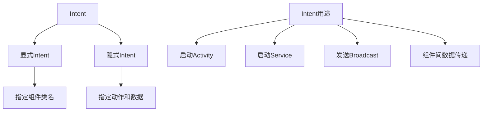
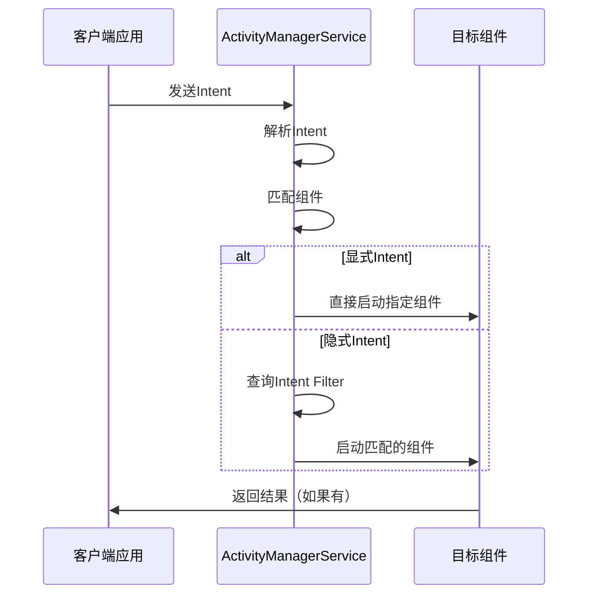

# 第12章：Intent和组件间通信

## 12.1 Intent基础概念

### 12.1.1 什么是Intent

Intent（意图）是Android系统中用于组件间通信的消息对象，它封装了要执行的操作信息。Intent可以在应用内部组件之间传递，也可以在不同应用之间传递。



### 12.1.2 Intent的基本属性

```java
// 创建Intent的基本方式
Intent intent = new Intent();

// 设置Component（显式Intent）
ComponentName component = new ComponentName("com.example.app", "com.example.app.MainActivity");
intent.setComponent(component);

// 或者直接指定类
Intent intent = new Intent(this, TargetActivity.class);

// 设置Action（隐式Intent）
intent.setAction(Intent.ACTION_VIEW);

// 设置Data
Uri data = Uri.parse("https://www.example.com");
intent.setData(data);

// 设置Type（MIME类型）
intent.setType("text/plain");

// 设置Extras（额外数据）
Bundle extras = new Bundle();
extras.putString("key", "value");
extras.putInt("number", 100);
intent.putExtras(extras);

// 设置Flags
intent.setFlags(Intent.FLAG_ACTIVITY_NEW_TASK);
```

### 12.1.3 Intent解析过程



## 12.2 显式Intent使用

### 12.2.1 启动Activity

```java
public class MainActivity extends AppCompatActivity {
    private static final int REQUEST_CODE_SECOND = 1001;

    // 启动Activity的基本方式
    public void startSecondActivity() {
        Intent intent = new Intent(this, SecondActivity.class);
        startActivity(intent);
    }

    // 带数据启动Activity
    public void startWithData() {
        Intent intent = new Intent(this, DetailActivity.class);

        // 使用putExtra传递数据
        intent.putExtra("title", "商品详情");
        intent.putExtra("price", 299.99);
        intent.putExtra("in_stock", true);

        // 传递复杂对象
        Product product = new Product("P001", "智能手表", 1299.00);
        intent.putExtra("product", product);

        // 传递集合
        ArrayList<String> tags = new ArrayList<>();
        tags.add("电子产品");
        tags.add("智能设备");
        intent.putStringArrayListExtra("tags", tags);

        startActivity(intent);
    }

    // 启动Activity并接收返回结果
    public void startActivityForResult() {
        Intent intent = new Intent(this, SelectImageActivity.class);
        intent.putExtra("max_count", 5);
        startActivityForResult(intent, REQUEST_CODE_SECOND);
    }

    @Override
    protected void onActivityResult(int requestCode, int resultCode, @Nullable Intent data) {
        super.onActivityResult(requestCode, resultCode, data);

        if (requestCode == REQUEST_CODE_SECOND && resultCode == RESULT_OK) {
            if (data != null) {
                ArrayList<String> selectedImages =
                    data.getStringArrayListExtra("selected_images");
                // 处理返回的图片数据
                processSelectedImages(selectedImages);
            }
        }
    }

    // 使用新的Activity Result API（推荐）
    private ActivityResultLauncher<Intent> imagePickerLauncher;

    @Override
    protected void onCreate(Bundle savedInstanceState) {
        super.onCreate(savedInstanceState);
        setContentView(R.layout.activity_main);

        // 注册Activity Result
        imagePickerLauncher = registerForActivityResult(
            new ActivityResultContracts.StartActivityForResult(),
            result -> {
                if (result.getResultCode() == RESULT_OK && result.getData() != null) {
                    ArrayList<String> selectedImages =
                        result.getData().getStringArrayListExtra("selected_images");
                    processSelectedImages(selectedImages);
                }
            });
    }

    public void selectImages() {
        Intent intent = new Intent(this, SelectImageActivity.class);
        intent.putExtra("max_count", 5);
        imagePickerLauncher.launch(intent);
    }
}
```

### 12.2.2 启动Service

```java
public class ServiceManager {
    private Context context;

    public ServiceManager(Context context) {
        this.context = context;
    }

    // 启动普通Service
    public void startBackgroundService() {
        Intent intent = new Intent(context, BackgroundService.class);
        intent.putExtra("task_type", "data_sync");
        intent.putExtra("priority", 1);
        ContextCompat.startForegroundService(context, intent);
    }

    // 绑定Service
    public void bindToService(ServiceConnection connection) {
        Intent intent = new Intent(context, MusicService.class);
        context.bindService(intent, connection, Context.BIND_AUTO_CREATE);
    }

    // 停止Service
    public void stopService() {
        Intent intent = new Intent(context, BackgroundService.class);
        context.stopService(intent);
    }
}
```

## 12.3 隐式Intent使用

### 12.3.1 理解Intent Filter

AndroidManifest.xml中定义Intent Filter：

```xml
<activity android:name=".ShareActivity">
    <intent-filter>
        <action android:name="android.intent.action.SEND" />
        <category android:name="android.intent.category.DEFAULT" />
        <data android:mimeType="text/plain" />
    </intent-filter>

    <intent-filter>
        <action android:name="android.intent.action.SEND" />
        <category android:name="android.intent.category.DEFAULT" />
        <data android:mimeType="image/*" />
    </intent-filter>

    <intent-filter>
        <action android:name="android.intent.action.VIEW" />
        <category android:name="android.intent.category.DEFAULT" />
        <category android:name="android.intent.category.BROWSABLE" />
        <data android:scheme="http" />
        <data android:scheme="https" />
        <data android:host="example.com" />
    </intent-filter>
</activity>
```

### 12.3.2 使用隐式Intent

```java
public class IntentUtils {

    // 分享文本
    public static void shareText(Context context, String text) {
        Intent intent = new Intent(Intent.ACTION_SEND);
        intent.setType("text/plain");
        intent.putExtra(Intent.EXTRA_TEXT, text);

        // 检查是否有应用可以处理这个Intent
        if (intent.resolveActivity(context.getPackageManager()) != null) {
            context.startActivity(Intent.createChooser(intent, "分享文本"));
        }
    }

    // 分享图片
    public static void shareImage(Context context, Uri imageUri, String title) {
        Intent intent = new Intent(Intent.ACTION_SEND);
        intent.setType("image/*");
        intent.putExtra(Intent.EXTRA_STREAM, imageUri);
        intent.putExtra(Intent.EXTRA_TEXT, title);
        intent.addFlags(Intent.FLAG_GRANT_READ_URI_PERMISSION);

        if (intent.resolveActivity(context.getPackageManager()) != null) {
            context.startActivity(Intent.createChooser(intent, "分享图片"));
        }
    }

    // 打开网页
    public static void openWebPage(Context context, String url) {
        Uri webpage = Uri.parse(url);
        Intent intent = new Intent(Intent.ACTION_VIEW, webpage);

        if (intent.resolveActivity(context.getPackageManager()) != null) {
            context.startActivity(intent);
        }
    }

    // 发送邮件
    public static void sendEmail(Context context, String[] to, String subject, String body) {
        Intent intent = new Intent(Intent.ACTION_SENDTO);
        intent.setData(Uri.parse("mailto:")); // 只有邮件应用才能处理

        if (to != null) {
            intent.putExtra(Intent.EXTRA_EMAIL, to);
        }
        intent.putExtra(Intent.EXTRA_SUBJECT, subject);
        intent.putExtra(Intent.EXTRA_TEXT, body);

        if (intent.resolveActivity(context.getPackageManager()) != null) {
            context.startActivity(intent);
        }
    }

    // 拨打电话
    public static void makePhoneCall(Context context, String phoneNumber) {
        Intent intent = new Intent(Intent.ACTION_DIAL);
        intent.setData(Uri.parse("tel:" + phoneNumber));

        if (intent.resolveActivity(context.getPackageManager()) != null) {
            context.startActivity(intent);
        }
    }

    // 打开地图
    public static void openMap(Context context, String location) {
        Uri locationUri = Uri.parse("geo:0,0?q=" + Uri.encode(location));
        Intent intent = new Intent(Intent.ACTION_VIEW, locationUri);

        if (intent.resolveActivity(context.getPackageManager()) != null) {
            context.startActivity(intent);
        }
    }

    // 选择联系人
    public static void pickContact(Activity activity, int requestCode) {
        Intent intent = new Intent(Intent.ACTION_PICK);
        intent.setType(ContactsContract.Contacts.CONTENT_TYPE);

        if (intent.resolveActivity(activity.getPackageManager()) != null) {
            activity.startActivityForResult(intent, requestCode);
        }
    }
}
```

### 12.3.3 检查Intent可用性

```java
public class IntentChecker {

    // 检查是否有应用可以处理Intent
    public static boolean isIntentAvailable(Context context, Intent intent) {
        PackageManager packageManager = context.getPackageManager();
        List<ResolveInfo> activities =
            packageManager.queryIntentActivities(intent, PackageManager.MATCH_DEFAULT_ONLY);
        return !activities.isEmpty();
    }

    // 获取能处理Intent的所有应用
    public static List<ResolveInfo> getResolveInfos(Context context, Intent intent) {
        PackageManager packageManager = context.getPackageManager();
        return packageManager.queryIntentActivities(intent, PackageManager.MATCH_DEFAULT_ONLY);
    }

    // 检查特定功能是否可用
    public static boolean hasCamera(Context context) {
        return context.getPackageManager().hasSystemFeature(PackageManager.FEATURE_CAMERA);
    }

    public static boolean hasCameraFlash(Context context) {
        return context.getPackageManager().hasSystemFeature(PackageManager.FEATURE_CAMERA_FLASH);
    }

    public static boolean hasGPS(Context context) {
        return context.getPackageManager().hasSystemFeature(PackageManager.FEATURE_LOCATION_GPS);
    }

    // 检查Intent安全性
    public static boolean isIntentSafe(Context context, Intent intent) {
        try {
            context.startActivity(intent);
            return true;
        } catch (ActivityNotFoundException e) {
            return false;
        } catch (SecurityException e) {
            return false;
        }
    }
}
```

## 12.4 Intent数据传递

### 12.4.1 基本数据类型传递

```java
public class DataTransferHelper {

    // 发送方：传递基本数据类型
    public static void sendBasicData(Context context) {
        Intent intent = new Intent(context, ReceiverActivity.class);

        // 基本数据类型
        intent.putExtra("string_value", "Hello World");
        intent.putExtra("int_value", 100);
        intent.putExtra("long_value", 100000L);
        intent.putExtra("float_value", 3.14f);
        intent.putExtra("double_value", 3.14159);
        intent.putExtra("boolean_value", true);
        intent.putExtra("char_value", 'A');

        // 数组
        intent.putExtra("string_array", new String[]{"Apple", "Banana", "Orange"});
        intent.putExtra("int_array", new int[]{1, 2, 3, 4, 5});
        intent.putExtra("boolean_array", new boolean[]{true, false, true});

        context.startActivity(intent);
    }

    // 接收方：获取基本数据类型
    public static void receiveBasicData(Intent intent) {
        // 基本数据类型（注意默认值）
        String stringValue = intent.getStringExtra("string_value");
        int intValue = intent.getIntExtra("int_value", 0);
        long longValue = intent.getLongExtra("long_value", 0L);
        float floatValue = intent.getFloatExtra("float_value", 0.0f);
        double doubleValue = intent.getDoubleExtra("double_value", 0.0);
        boolean booleanValue = intent.getBooleanExtra("boolean_value", false);
        char charValue = intent.getCharExtra("char_value", '\0');

        // 数组
        String[] stringArray = intent.getStringArrayExtra("string_array");
        int[] intArray = intent.getIntArrayExtra("int_array");
        boolean[] booleanArray = intent.getBooleanArrayExtra("boolean_array");
    }
}
```

### 12.4.2 复杂对象传递

```java
// 实现Serializable接口
public class Product implements Serializable {
    private static final long serialVersionUID = 1L;

    private String id;
    private String name;
    private double price;
    private String description;
    private List<String> tags;

    public Product(String id, String name, double price) {
        this.id = id;
        this.name = name;
        this.price = price;
        this.tags = new ArrayList<>();
    }

    // getters and setters...
}

// 实现Parcelable接口（推荐，性能更好）
public class User implements Parcelable {
    private String id;
    private String name;
    private int age;
    private String email;
    private List<String> hobbies;

    public User(String id, String name, int age, String email) {
        this.id = id;
        this.name = name;
        this.age = age;
        this.email = email;
        this.hobbies = new ArrayList<>();
    }

    // Parcelable实现
    protected User(Parcel in) {
        id = in.readString();
        name = in.readString();
        age = in.readInt();
        email = in.readString();
        hobbies = in.createStringArrayList();
    }

    public static final Creator<User> CREATOR = new Creator<User>() {
        @Override
        public User createFromParcel(Parcel in) {
            return new User(in);
        }

        @Override
        public User[] newArray(int size) {
            return new User[size];
        }
    };

    @Override
    public int describeContents() {
        return 0;
    }

    @Override
    public void writeToParcel(Parcel dest, int flags) {
        dest.writeString(id);
        dest.writeString(name);
        dest.writeInt(age);
        dest.writeString(email);
        dest.writeStringList(hobbies);
    }

    // getters and setters...
}

public class ObjectTransferHelper {

    // 传递Serializable对象
    public static void sendSerializableObject(Context context) {
        Product product = new Product("P001", "智能手机", 3999.00);
        product.setDescription("最新款智能手机，性能强劲");
        product.getTags().add("电子产品");
        product.getTags().add("通讯设备");

        Intent intent = new Intent(context, ProductDetailActivity.class);
        intent.putExtra("product", product);
        context.startActivity(intent);
    }

    // 传递Parcelable对象
    public static void sendParcelableObject(Context context) {
        User user = new User("U001", "张三", 25, "zhangsan@example.com");
        user.getHobbies().add("编程");
        user.getHobbies().add("阅读");
        user.getHobbies().add("运动");

        Intent intent = new Intent(context, UserProfileActivity.class);
        intent.putExtra("user", user);
        context.startActivity(intent);
    }

    // 接收端代码
    public static void receiveObjects(Intent intent) {
        // 接收Serializable对象
        Product product = (Product) intent.getSerializableExtra("product");

        // 接收Parcelable对象
        User user = intent.getParcelableExtra("user");
    }
}
```

### 12.4.3 Bundle数据传递

```java
public class BundleHelper {

    // 使用Bundle组织数据
    public static void sendBundleData(Context context) {
        Intent intent = new Intent(context, BundleReceiverActivity.class);

        Bundle mainBundle = new Bundle();

        // 基本数据
        mainBundle.putString("title", "重要通知");
        mainBundle.putString("message", "这是一条重要消息");
        mainBundle.putLong("timestamp", System.currentTimeMillis());

        // 用户信息
        Bundle userBundle = new Bundle();
        userBundle.putString("user_id", "U001");
        userBundle.putString("user_name", "张三");
        userBundle.putString("user_email", "zhangsan@example.com");
        mainBundle.putBundle("user_info", userBundle);

        // 产品列表
        ArrayList<Bundle> productBundles = new ArrayList<>();

        Bundle product1 = new Bundle();
        product1.putString("id", "P001");
        product1.putString("name", "产品1");
        product1.putDouble("price", 99.99);
        productBundles.add(product1);

        Bundle product2 = new Bundle();
        product2.putString("id", "P002");
        product2.putString("name", "产品2");
        product2.putDouble("price", 199.99);
        productBundles.add(product2);

        mainBundle.putParcelableArrayList("products", productBundles);

        intent.putExtras(mainBundle);
        context.startActivity(intent);
    }

    // 接收Bundle数据
    public static void receiveBundleData(Intent intent) {
        Bundle bundle = intent.getExtras();

        if (bundle != null) {
            String title = bundle.getString("title");
            String message = bundle.getString("message");
            long timestamp = bundle.getLong("timestamp");

            // 获取嵌套Bundle
            Bundle userBundle = bundle.getBundle("user_info");
            if (userBundle != null) {
                String userId = userBundle.getString("user_id");
                String userName = userBundle.getString("user_name");
                String userEmail = userBundle.getString("user_email");
            }

            // 获取产品列表
            ArrayList<Bundle> productBundles =
                bundle.getParcelableArrayList("products");
            if (productBundles != null) {
                for (Bundle productBundle : productBundles) {
                    String productId = productBundle.getString("id");
                    String productName = productBundle.getString("name");
                    double price = productBundle.getDouble("price");
                }
            }
        }
    }
}
```

## 12.5 Intent Flags详解

### 12.5.1 常用Intent Flags

```java
public class IntentFlagsHelper {

    // FLAG_ACTIVITY_NEW_TASK：在新的任务栈中启动Activity
    public void startActivityInNewTask(Context context) {
        Intent intent = new Intent(context, NewTaskActivity.class);
        intent.setFlags(Intent.FLAG_ACTIVITY_NEW_TASK);
        context.startActivity(intent);
    }

    // FLAG_ACTIVITY_CLEAR_TOP：清除目标Activity之上的所有Activity
    public void clearTopAndStart(Context context) {
        Intent intent = new Intent(context, MainActivity.class);
        intent.setFlags(Intent.FLAG_ACTIVITY_CLEAR_TOP);
        context.startActivity(intent);
    }

    // FLAG_ACTIVITY_SINGLE_TOP：如果目标Activity已在栈顶，则不创建新的实例
    public void singleTopStart(Context context) {
        Intent intent = new Intent(context, SingleTopActivity.class);
        intent.setFlags(Intent.FLAG_ACTIVITY_SINGLE_TOP);
        context.startActivity(intent);
    }

    // FLAG_ACTIVITY_NO_HISTORY：不将Activity保存在历史栈中
    public void noHistoryStart(Context context) {
        Intent intent = new Intent(context, NoHistoryActivity.class);
        intent.setFlags(Intent.FLAG_ACTIVITY_NO_HISTORY);
        context.startActivity(intent);
    }

    // FLAG_ACTIVITY_EXCLUDE_FROM_RECENTS：不显示在最近应用列表中
    public void excludeFromRecents(Context context) {
        Intent intent = new Intent(context, SecureActivity.class);
        intent.setFlags(Intent.FLAG_ACTIVITY_EXCLUDE_FROM_RECENTS);
        context.startActivity(intent);
    }

    // FLAG_ACTIVITY_BROUGHT_TO_FRONT：将Activity带到前台
    public void bringToFront(Context context) {
        Intent intent = new Intent(context, TargetActivity.class);
        intent.setFlags(Intent.FLAG_ACTIVITY_BROUGHT_TO_FRONT);
        context.startActivity(intent);
    }

    // 组合使用Flags
    public void combineFlags(Context context) {
        Intent intent = new Intent(context, SpecialActivity.class);
        // 在新任务中启动，并清除目标Activity之上的所有Activity
        intent.setFlags(Intent.FLAG_ACTIVITY_NEW_TASK | Intent.FLAG_ACTIVITY_CLEAR_TOP);
        context.startActivity(intent);
    }
}
```

### 12.5.2 启动模式与Flags的关系

```java
public class LaunchModeHelper {

    // Standard启动模式 + Flags
    public void standardWithFlags(Context context) {
        Intent intent = new Intent(context, StandardActivity.class);
        // 每次都会创建新实例
        intent.setFlags(Intent.FLAG_ACTIVITY_NEW_TASK);
        context.startActivity(intent);
    }

    // SingleTop启动模式 + Flags
    public void singleTopWithFlags(Context context) {
        Intent intent = new Intent(context, SingleTopActivity.class);
        // 如果在栈顶，不创建新实例；否则创建新实例
        intent.setFlags(Intent.FLAG_ACTIVITY_SINGLE_TOP);
        context.startActivity(intent);
    }

    // SingleTask启动模式 + Flags
    public void singleTaskWithFlags(Context context) {
        Intent intent = new Intent(context, SingleTaskActivity.class);
        // 清除目标Activity之上的所有Activity
        intent.setFlags(Intent.FLAG_ACTIVITY_CLEAR_TOP);
        context.startActivity(intent);
    }

    // SingleInstance启动模式 + Flags
    public void singleInstanceWithFlags(Context context) {
        Intent intent = new Intent(context, SingleInstanceActivity.class);
        // 独占一个任务栈
        intent.setFlags(Intent.FLAG_ACTIVITY_NEW_TASK);
        context.startActivity(intent);
    }
}
```

## 12.6 应用间通信示例

### 12.6.1 文件分享应用

```java
public class ShareActivity extends AppCompatActivity {

    private static final int REQUEST_CODE_PICK_FILE = 1001;

    @Override
    protected void onCreate(Bundle savedInstanceState) {
        super.onCreate(savedInstanceState);
        setContentView(R.layout.activity_share);

        handleIncomingIntent();
    }

    // 处理接收到的Intent
    private void handleIncomingIntent() {
        Intent intent = getIntent();
        String action = intent.getAction();
        String type = intent.getType();

        if (Intent.ACTION_SEND.equals(action) && type != null) {
            handleSendIntent(intent, type);
        } else if (Intent.ACTION_SEND_MULTIPLE.equals(action) && type != null) {
            handleSendMultipleIntent(intent, type);
        }
    }

    // 处理单个文件分享
    private void handleSendIntent(Intent intent, String type) {
        Uri uri = intent.getParcelableExtra(Intent.EXTRA_STREAM);
        if (uri != null) {
            // 处理单个文件
            processFile(uri, type);
        }
    }

    // 处理多个文件分享
    private void handleSendMultipleIntent(Intent intent, String type) {
        ArrayList<Uri> uris = intent.getParcelableArrayListExtra(Intent.EXTRA_STREAM);
        if (uris != null) {
            // 处理多个文件
            for (Uri uri : uris) {
                processFile(uri, type);
            }
        }
    }

    private void processFile(Uri uri, String type) {
        // 根据文件类型处理文件
        if (type.startsWith("image/")) {
            // 处理图片
            processImage(uri);
        } else if (type.startsWith("video/")) {
            // 处理视频
            processVideo(uri);
        } else if (type.equals("text/plain")) {
            // 处理文本
            processText(uri);
        }
    }

    // 选择文件分享
    public void pickAndShareFile() {
        Intent intent = new Intent(Intent.ACTION_GET_CONTENT);
        intent.setType("*/*");
        intent.addCategory(Intent.CATEGORY_OPENABLE);
        startActivityForResult(intent, REQUEST_CODE_PICK_FILE);
    }

    @Override
    protected void onActivityResult(int requestCode, int resultCode, @Nullable Intent data) {
        super.onActivityResult(requestCode, resultCode, data);

        if (requestCode == REQUEST_CODE_PICK_FILE && resultCode == RESULT_OK) {
            if (data != null) {
                Uri uri = data.getData();
                shareFile(uri);
            }
        }
    }

    // 分享文件到其他应用
    private void shareFile(Uri uri) {
        Intent shareIntent = new Intent(Intent.ACTION_SEND);
        shareIntent.setType(getContentResolver().getType(uri));
        shareIntent.putExtra(Intent.EXTRA_STREAM, uri);
        shareIntent.addFlags(Intent.FLAG_GRANT_READ_URI_PERMISSION);

        startActivity(Intent.createChooser(shareIntent, "分享文件"));
    }
}
```

### 12.6.2 自定义URL协议

```java
// 自定义URL协议处理器
public class CustomSchemeActivity extends AppCompatActivity {

    @Override
    protected void onCreate(Bundle savedInstanceState) {
        super.onCreate(savedInstanceState);
        setContentView(R.layout.activity_custom_scheme);

        handleCustomScheme();
    }

    private void handleCustomScheme() {
        Uri uri = getIntent().getData();
        if (uri != null) {
            String scheme = uri.getScheme(); // "myapp"
            String host = uri.getHost();     // "product"
            String path = uri.getPath();     // "/detail"

            // 解析参数
            Set<String> paramNames = uri.getQueryParameterNames();
            for (String paramName : paramNames) {
                String paramValue = uri.getQueryParameter(paramName);
                Log.d("CustomScheme", paramName + ": " + paramValue);
            }

            // 根据路径处理不同的业务逻辑
            if ("/detail".equals(path)) {
                String productId = uri.getQueryParameter("id");
                showProductDetail(productId);
            } else if ("/profile".equals(path)) {
                String userId = uri.getQueryParameter("user_id");
                showUserProfile(userId);
            }
        }
    }

    private void showProductDetail(String productId) {
        // 显示产品详情
        Intent intent = new Intent(this, ProductDetailActivity.class);
        intent.putExtra("product_id", productId);
        startActivity(intent);
    }

    private void showUserProfile(String userId) {
        // 显示用户资料
        Intent intent = new Intent(this, UserProfileActivity.class);
        intent.putExtra("user_id", userId);
        startActivity(intent);
    }

    // 生成自定义URL
    public static String generateProductUrl(String productId) {
        return "myapp://product/detail?id=" + productId;
    }

    public static String generateProfileUrl(String userId) {
        return "myapp://profile?user_id=" + userId;
    }
}
```

## 12.7 性能优化与最佳实践

### 12.7.1 Intent使用最佳实践

```java
public class IntentBestPractices {

    // 1. 避免传递过大的数据
    public void avoidLargeData() {
        // ❌ 错误：传递过大的数据
        byte[] largeData = new byte[1024 * 1024]; // 1MB
        Intent intent = new Intent(this, ReceiverActivity.class);
        intent.putExtra("large_data", largeData);

        // ✅ 正确：使用文件或ContentProvider
        File tempFile = new File(getCacheDir(), "temp_data.dat");
        // 写入文件...
        Uri fileUri = FileProvider.getUriForFile(this,
            "com.example.fileprovider", tempFile);
        intent.putExtra("data_uri", fileUri);
    }

    // 2. 使用Parcelable代替Serializable
    public void useParcelable() {
        // ❌ 性能较差
        ProductSerializable product = new ProductSerializable("P001", "产品1", 99.99);
        Intent intent = new Intent(this, ReceiverActivity.class);
        intent.putExtra("product", product);

        // ✅ 性能更好
        ProductParcelable product2 = new ProductParcelable("P001", "产品1", 99.99);
        intent.putExtra("product", product2);
    }

    // 3. 检查Intent可用性
    public void checkIntentAvailability() {
        Intent intent = new Intent(Intent.ACTION_SEND);
        intent.setType("text/plain");

        // ✅ 总是检查是否有应用可以处理Intent
        if (intent.resolveActivity(getPackageManager()) != null) {
            startActivity(intent);
        } else {
            Toast.makeText(this, "没有找到可以处理此操作的应用",
                Toast.LENGTH_SHORT).show();
        }
    }

    // 4. 使用显式Intent进行内部通信
    public void useExplicitIntentsInternally() {
        // ✅ 应用内部使用显式Intent
        Intent intent = new Intent(this, InternalActivity.class);
        intent.putExtra("data", "内部数据");
        startActivity(intent);

        // ✅ 或者使用ComponentName
        intent = new Intent();
        intent.setComponent(new ComponentName(getPackageName(),
            "com.example.InternalActivity"));
    }

    // 5. 适当使用Intent Flags
    public void useAppropriateFlags() {
        Intent intent = new Intent(this, MainActivity.class);

        // ✅ 根据需求选择合适的Flags
        if (needNewTask()) {
            intent.setFlags(Intent.FLAG_ACTIVITY_NEW_TASK);
        }

        if (needClearTop()) {
            intent.setFlags(Intent.FLAG_ACTIVITY_CLEAR_TOP);
        }

        startActivity(intent);
    }

    // 6. 安全性考虑
    public void securityConsiderations() {
        Intent intent = new Intent();
        intent.setAction("com.example.CUSTOM_ACTION");

        // ✅ 设置Package名称限制接收者
        intent.setPackage("com.example.receiverapp");

        // ✅ 或者使用显式Intent
        intent.setComponent(new ComponentName("com.example.receiverapp",
            "com.example.receiverapp.ReceiverActivity"));

        sendBroadcast(intent);
    }
}
```

### 12.7.2 性能监控

```java
public class IntentPerformanceMonitor {

    private static final String TAG = "IntentPerformance";

    // 监控Intent创建和启动时间
    public static void monitorIntentPerformance(Context context, Intent intent,
            String operation) {
        long startTime = System.currentTimeMillis();

        try {
            if ("startActivity".equals(operation)) {
                context.startActivity(intent);
            } else if ("startService".equals(operation)) {
                context.startService(intent);
            } else if ("sendBroadcast".equals(operation)) {
                context.sendBroadcast(intent);
            }
        } finally {
            long endTime = System.currentTimeMillis();
            long duration = endTime - startTime;

            Log.d(TAG, operation + " took " + duration + "ms");

            // 记录性能数据
            if (duration > 100) { // 超过100ms认为性能不佳
                Log.w(TAG, "Slow " + operation + " detected: " + duration + "ms");
            }
        }
    }

    // 监控Intent数据大小
    public static void monitorIntentDataSize(Intent intent) {
        Bundle extras = intent.getExtras();
        if (extras != null) {
            int dataSize = estimateBundleSize(extras);
            Log.d(TAG, "Intent data size: " + dataSize + " bytes");

            if (dataSize > 1024 * 100) { // 超过100KB
                Log.w(TAG, "Large Intent data detected: " + dataSize + " bytes");
            }
        }
    }

    // 估算Bundle大小
    private static int estimateBundleSize(Bundle bundle) {
        // 简单的大小估算
        int size = 0;
        for (String key : bundle.keySet()) {
            Object value = bundle.get(key);
            if (value instanceof String) {
                size += ((String) value).length() * 2; // 假设每个字符2字节
            } else if (value instanceof Integer) {
                size += 4;
            } else if (value instanceof Long) {
                size += 8;
            } else if (value instanceof Double) {
                size += 8;
            } else if (value instanceof Parcelable) {
                size += 100; // 估算Parcelable对象大小
            }
        }
        return size;
    }
}
```

## 12.8 实战案例：综合消息系统

### 12.8.1 消息实体定义

```java
public class Message implements Parcelable {
    public static final int TYPE_TEXT = 1;
    public static final int TYPE_IMAGE = 2;
    public static final int TYPE_FILE = 3;
    public static final int TYPE_LOCATION = 4;

    private String id;
    private int type;
    private String content;
    private String senderId;
    private String receiverId;
    private long timestamp;
    private Uri attachmentUri;
    private boolean isRead;
    private Map<String, Object> metadata;

    // 构造函数
    public Message(String id, int type, String content, String senderId, String receiverId) {
        this.id = id;
        this.type = type;
        this.content = content;
        this.senderId = senderId;
        this.receiverId = receiverId;
        this.timestamp = System.currentTimeMillis();
        this.isRead = false;
        this.metadata = new HashMap<>();
    }

    // Parcelable实现
    protected Message(Parcel in) {
        id = in.readString();
        type = in.readInt();
        content = in.readString();
        senderId = in.readString();
        receiverId = in.readString();
        timestamp = in.readLong();
        attachmentUri = in.readParcelable(Uri.class.getClassLoader());
        isRead = in.readByte() != 0;

        // 处理metadata
        int metadataSize = in.readInt();
        metadata = new HashMap<>();
        for (int i = 0; i < metadataSize; i++) {
            String key = in.readString();
            String value = in.readString();
            metadata.put(key, value);
        }
    }

    public static final Creator<Message> CREATOR = new Creator<Message>() {
        @Override
        public Message createFromParcel(Parcel in) {
            return new Message(in);
        }

        @Override
        public Message[] newArray(int size) {
            return new Message[size];
        }
    };

    @Override
    public int describeContents() {
        return 0;
    }

    @Override
    public void writeToParcel(Parcel dest, int flags) {
        dest.writeString(id);
        dest.writeInt(type);
        dest.writeString(content);
        dest.writeString(senderId);
        dest.writeString(receiverId);
        dest.writeLong(timestamp);
        dest.writeParcelable(attachmentUri, flags);
        dest.writeByte((byte) (isRead ? 1 : 0));

        // 写入metadata
        dest.writeInt(metadata.size());
        for (Map.Entry<String, Object> entry : metadata.entrySet()) {
            dest.writeString(entry.getKey());
            dest.writeString(String.valueOf(entry.getValue()));
        }
    }

    // 工厂方法
    public static Message createTextMessage(String content, String senderId, String receiverId) {
        return new Message(UUID.randomUUID().toString(), TYPE_TEXT, content, senderId, receiverId);
    }

    public static Message createImageMessage(Uri imageUri, String senderId, String receiverId) {
        Message message = new Message(UUID.randomUUID().toString(), TYPE_IMAGE,
            "发送了一张图片", senderId, receiverId);
        message.setAttachmentUri(imageUri);
        return message;
    }

    public static Message createFileMessage(Uri fileUri, String fileName,
            String senderId, String receiverId) {
        Message message = new Message(UUID.randomUUID().toString(), TYPE_FILE,
            "发送了一个文件：" + fileName, senderId, receiverId);
        message.setAttachmentUri(fileUri);
        message.getMetadata().put("file_name", fileName);
        return message;
    }

    // getters and setters...
}
```

### 12.8.2 消息发送器

```java
public class MessageSender {
    private Context context;

    public MessageSender(Context context) {
        this.context = context;
    }

    // 发送文本消息
    public void sendTextMessage(String content, String receiverId) {
        Message message = Message.createTextMessage(content, getCurrentUserId(), receiverId);
        sendMessage(message);
    }

    // 发送图片消息
    public void sendImageMessage(Uri imageUri, String receiverId) {
        Message message = Message.createImageMessage(imageUri, getCurrentUserId(), receiverId);
        sendMessage(message);
    }

    // 发送文件消息
    public void sendFileMessage(Uri fileUri, String fileName, String receiverId) {
        Message message = Message.createFileMessage(fileUri, fileName,
            getCurrentUserId(), receiverId);
        sendMessage(message);
    }

    // 发送消息到聊天界面
    private void sendMessage(Message message) {
        Intent intent = new Intent(context, ChatActivity.class);
        intent.putExtra("message", message);
        intent.putExtra("is_new_message", true);

        // 如果ChatActivity已经打开，则更新现有界面
        intent.setFlags(Intent.FLAG_ACTIVITY_SINGLE_TOP | Intent.FLAG_ACTIVITY_CLEAR_TOP);

        context.startActivity(intent);

        // 发送广播通知新消息
        broadcastNewMessage(message);

        // 添加到消息队列
        MessageQueue.getInstance().addMessage(message);
    }

    // 广播新消息通知
    private void broadcastNewMessage(Message message) {
        Intent broadcastIntent = new Intent("com.example.NEW_MESSAGE");
        broadcastIntent.putExtra("message", message);
        broadcastIntent.putExtra("sender_id", message.getSenderId());
        broadcastIntent.putExtra("receiver_id", message.getReceiverId());

        context.sendBroadcast(broadcastIntent);
    }

    // 分享消息到其他应用
    public void shareMessage(Message message) {
        Intent shareIntent = new Intent(Intent.ACTION_SEND);

        switch (message.getType()) {
            case Message.TYPE_TEXT:
                shareIntent.setType("text/plain");
                shareIntent.putExtra(Intent.EXTRA_TEXT, message.getContent());
                break;

            case Message.TYPE_IMAGE:
                shareIntent.setType("image/*");
                shareIntent.putExtra(Intent.EXTRA_STREAM, message.getAttachmentUri());
                shareIntent.putExtra(Intent.EXTRA_TEXT, "分享图片");
                break;

            case Message.TYPE_FILE:
                String fileName = (String) message.getMetadata().get("file_name");
                shareIntent.setType("*/*");
                shareIntent.putExtra(Intent.EXTRA_STREAM, message.getAttachmentUri());
                shareIntent.putExtra(Intent.EXTRA_TEXT, "分享文件：" + fileName);
                break;
        }

        shareIntent.addFlags(Intent.FLAG_GRANT_READ_URI_PERMISSION);

        if (shareIntent.resolveActivity(context.getPackageManager()) != null) {
            context.startActivity(Intent.createChooser(shareIntent, "分享消息"));
        }
    }

    private String getCurrentUserId() {
        // 获取当前用户ID
        return SharedPreferencesManager.getUserId(context);
    }
}
```

### 12.8.3 消息接收器

```java
public class MessageReceiverActivity extends AppCompatActivity {
    private static final int REQUEST_CODE_PICK_IMAGE = 1001;
    private static final int REQUEST_CODE_PICK_FILE = 1002;

    private Message currentMessage;
    private String chatUserId;

    @Override
    protected void onCreate(Bundle savedInstanceState) {
        super.onCreate(savedInstanceState);
        setContentView(R.layout.activity_message_receiver);

        handleIncomingMessage();
        setupMessageListener();
    }

    // 处理接收到的消息
    private void handleIncomingMessage() {
        Intent intent = getIntent();

        // 处理新消息
        if (intent.getBooleanExtra("is_new_message", false)) {
            Message message = intent.getParcelableExtra("message");
            if (message != null) {
                displayNewMessage(message);
                markMessageAsRead(message);
            }
        }

        // 处理聊天启动
        chatUserId = intent.getStringExtra("chat_user_id");
        if (chatUserId != null) {
            loadChatHistory(chatUserId);
        }
    }

    // 显示新消息
    private void displayNewMessage(Message message) {
        currentMessage = message;

        switch (message.getType()) {
            case Message.TYPE_TEXT:
                displayTextMessage(message);
                break;
            case Message.TYPE_IMAGE:
                displayImageMessage(message);
                break;
            case Message.TYPE_FILE:
                displayFileMessage(message);
                break;
        }
    }

    // 发送文本消息
    public void sendTextMessage(String content) {
        if (TextUtils.isEmpty(content) || chatUserId == null) return;

        MessageSender sender = new MessageSender(this);
        sender.sendTextMessage(content, chatUserId);

        // 显示发送的消息
        Message sentMessage = Message.createTextMessage(content,
            SharedPreferencesManager.getUserId(this), chatUserId);
        addMessageToChat(sentMessage);
    }

    // 选择图片发送
    public void selectImage() {
        Intent intent = new Intent(Intent.ACTION_GET_CONTENT);
        intent.setType("image/*");
        intent.addCategory(Intent.CATEGORY_OPENABLE);
        startActivityForResult(intent, REQUEST_CODE_PICK_IMAGE);
    }

    // 选择文件发送
    public void selectFile() {
        Intent intent = new Intent(Intent.ACTION_GET_CONTENT);
        intent.setType("*/*");
        intent.addCategory(Intent.CATEGORY_OPENABLE);
        startActivityForResult(intent, REQUEST_CODE_PICK_FILE);
    }

    @Override
    protected void onActivityResult(int requestCode, int resultCode, @Nullable Intent data) {
        super.onActivityResult(requestCode, resultCode, data);

        if (resultCode == RESULT_OK && data != null && chatUserId != null) {
            Uri uri = data.getData();
            MessageSender sender = new MessageSender(this);

            switch (requestCode) {
                case REQUEST_CODE_PICK_IMAGE:
                    sender.sendImageMessage(uri, chatUserId);
                    break;

                case REQUEST_CODE_PICK_FILE:
                    String fileName = getFileName(uri);
                    sender.sendFileMessage(uri, fileName, chatUserId);
                    break;
            }
        }
    }

    // 监听新消息广播
    private void setupMessageListener() {
        IntentFilter filter = new IntentFilter("com.example.NEW_MESSAGE");
        registerReceiver(messageReceiver, filter);
    }

    private BroadcastReceiver messageReceiver = new BroadcastReceiver() {
        @Override
        public void onReceive(Context context, Intent intent) {
            Message message = intent.getParcelableExtra("message");
            String receiverId = intent.getStringExtra("receiver_id");

            // 如果是发给当前用户的消息，显示通知
            if (SharedPreferencesManager.getUserId(context).equals(receiverId)) {
                showNotification(message);
            }
        }
    };

    @Override
    protected void onDestroy() {
        super.onDestroy();
        unregisterReceiver(messageReceiver);
    }

    private void markMessageAsRead(Message message) {
        // 标记消息为已读
        message.setRead(true);
        // 更新数据库或发送已读回执
    }

    private void showNotification(Message message) {
        // 显示通知
        NotificationManager notificationManager =
            (NotificationManager) getSystemService(Context.NOTIFICATION_SERVICE);

        // 创建通知...
    }

    private String getFileName(Uri uri) {
        // 获取文件名
        String fileName = null;
        try (Cursor cursor = getContentResolver().query(uri, null, null, null, null)) {
            if (cursor != null && cursor.moveToFirst()) {
                int nameIndex = cursor.getColumnIndex(OpenableColumns.DISPLAY_NAME);
                if (nameIndex != -1) {
                    fileName = cursor.getString(nameIndex);
                }
            }
        }
        return fileName != null ? fileName : "unknown_file";
    }
}
```

## 本章小结

本章详细介绍了Android中Intent和组件间通信的各种机制：

### 核心知识点：

1. **Intent基础**：显式Intent和隐式Intent的区别与使用场景
2. **Intent Filter**：组件如何声明自己能处理的Intent
3. **数据传递**：基本类型、复杂对象和Bundle的使用
4. **Intent Flags**：控制Activity启动行为和任务栈管理
5. **应用间通信**：通过Intent实现应用之间的数据共享
6. **性能优化**：Intent使用的最佳实践和性能监控

### 学习要点：

- 理解Intent的解析过程和匹配机制
- 掌握显式和隐式Intent的正确使用
- 学会安全高效地传递各种类型的数据
- 熟悉Intent Flags对Activity生命周期的影响
- 了解应用间通信的安全注意事项

### 实践技能：

- 设计合理的组件间通信架构
- 实现安全的跨应用数据共享
- 优化Intent使用的性能
- 处理复杂的Intent场景和数据传递

通过本章的学习，开发者应该能够熟练使用Intent实现Android应用内部和外部的组件通信，构建出功能强大且安全可靠的Android应用。