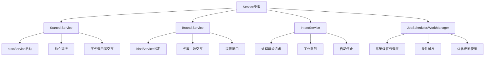

# 第13章：Service后台服务开发

## 13.1 Service基础概念

### 13.1.1 什么是Service

Service是Android四大组件之一，用于在后台执行长时间运行的操作，不提供用户界面。Service可以在应用退到后台后继续运行，适用于播放音乐、下载文件、网络请求等场景。



### 13.1.2 Service生命周期

```java
public class BasicService extends Service {
    private static final String TAG = "BasicService";

    // Service创建时调用
    @Override
    public void onCreate() {
        super.onCreate();
        Log.d(TAG, "onCreate: Service创建");
        // 初始化资源，如数据库连接、线程池等
        initializeResources();
    }

    // 通过startService启动时调用
    @Override
    public int onStartCommand(Intent intent, int flags, int startId) {
        Log.d(TAG, "onStartCommand: Service启动");

        // 处理启动Intent
        String action = intent.getAction();
        if ("START_DOWNLOAD".equals(action)) {
            startDownload(intent.getStringExtra("url"));
        } else if ("START_MUSIC".equals(action)) {
            startMusicPlayback(intent.getStringExtra("song_path"));
        }

        // 返回值决定Service被杀死后的行为
        return START_STICKY; // 服务被杀死后自动重启
        // return START_NOT_STICKY; // 不自动重启
        // return START_REDELIVER_INTENT; // 重启时重新传递最后一个Intent
    }

    // 通过bindService绑定时调用
    @Override
    public IBinder onBind(Intent intent) {
        Log.d(TAG, "onBind: 绑定Service");
        return new LocalBinder();
    }

    // 绑定解除时调用
    @Override
    public boolean onUnbind(Intent intent) {
        Log.d(TAG, "onUnbind: 解除绑定");
        return super.onUnbind(intent);
    }

    // Service销毁时调用
    @Override
    public void onDestroy() {
        Log.d(TAG, "onDestroy: Service销毁");
        // 释放资源
        releaseResources();
        super.onDestroy();
    }

    // 内部Binder类
    public class LocalBinder extends Binder {
        BasicService getService() {
            return BasicService.this;
        }
    }

    private void initializeResources() {
        // 初始化资源
    }

    private void releaseResources() {
        // 释放资源
    }

    private void startDownload(String url) {
        // 执行下载任务
    }

    private void startMusicPlayback(String songPath) {
        // 播放音乐
    }
}
```

### 13.1.3 Service启动方式对比

```java
public class ServiceComparison {
    private Context context;

    public ServiceComparison(Context context) {
        this.context = context;
    }

    // 1. Started Service方式
    public void startServiceExample() {
        Intent intent = new Intent(context, MusicService.class);
        intent.putExtra("action", "play");
        intent.putExtra("song_url", "http://example.com/song.mp3");

        // 启动Service
        context.startService(intent);

        // 停止Service
        context.stopService(new Intent(context, MusicService.class));
    }

    // 2. Bound Service方式
    public void bindServiceExample() {
        Intent intent = new Intent(context, DataSyncService.class);
        ServiceConnection connection = new ServiceConnection() {
            @Override
            public void onServiceConnected(ComponentName name, IBinder service) {
                DataSyncService.LocalBinder binder = (DataSyncService.LocalBinder) service;
                DataSyncService dataSyncService = binder.getService();
                // 使用Service提供的方法
                dataSyncService.startSync();
            }

            @Override
            public void onServiceDisconnected(ComponentName name) {
                // Service连接断开
            }
        };

        // 绑定Service
        context.bindService(intent, connection, Context.BIND_AUTO_CREATE);

        // 解除绑定
        context.unbindService(connection);
    }

    // 3. 混合使用Started和Bound
    public void mixedUsageExample() {
        Intent intent = new Intent(context, TaskService.class);

        // 先启动Service（确保Service持续运行）
        context.startService(intent);

        // 再绑定Service（获取Service实例进行交互）
        context.bindService(intent, serviceConnection, Context.BIND_AUTO_CREATE);
    }
}
```

## 13.2 Started Service开发

### 13.2.1 音乐播放Service

```java
public class MusicService extends Service implements MediaPlayer.OnCompletionListener,
        MediaPlayer.OnPreparedListener, MediaPlayer.OnErrorListener {

    private MediaPlayer mediaPlayer;
    private String currentSong;
    private boolean isPrepared;
    private static final String TAG = "MusicService";
    private static final int NOTIFICATION_ID = 1001;

    public static final String ACTION_PLAY = "com.example.ACTION_PLAY";
    public static final String ACTION_PAUSE = "com.example.ACTION_PAUSE";
    public static final String ACTION_STOP = "com.example.ACTION_STOP";
    public static final String ACTION_NEXT = "com.example.ACTION_NEXT";
    public static final String ACTION_PREVIOUS = "com.example.ACTION_PREVIOUS";

    @Override
    public void onCreate() {
        super.onCreate();
        Log.d(TAG, "MusicService onCreate");
        initMediaPlayer();
    }

    private void initMediaPlayer() {
        mediaPlayer = new MediaPlayer();
        mediaPlayer.setOnCompletionListener(this);
        mediaPlayer.setOnPreparedListener(this);
        mediaPlayer.setOnErrorListener(this);

        // 设置音频焦点
        mediaPlayer.setAudioAttributes(new AudioAttributes.Builder()
            .setContentType(AudioAttributes.CONTENT_TYPE_MUSIC)
            .setUsage(AudioAttributes.USAGE_MEDIA)
            .build());
    }

    @Override
    public int onStartCommand(Intent intent, int flags, int startId) {
        String action = intent.getAction();

        if (action != null) {
            switch (action) {
                case ACTION_PLAY:
                    String songUrl = intent.getStringExtra("song_url");
                    playMusic(songUrl);
                    break;

                case ACTION_PAUSE:
                    pauseMusic();
                    break;

                case ACTION_STOP:
                    stopMusic();
                    break;

                case ACTION_NEXT:
                    playNext();
                    break;

                case ACTION_PREVIOUS:
                    playPrevious();
                    break;
            }
        }

        return START_STICKY;
    }

    // 播放音乐
    private void playMusic(String songUrl) {
        if (songUrl == null) return;

        try {
            if (mediaPlayer.isPlaying()) {
                mediaPlayer.stop();
            }

            mediaPlayer.reset();
            mediaPlayer.setDataSource(songUrl);
            mediaPlayer.prepareAsync(); // 异步准备
            currentSong = songUrl;

            // 显示通知
            showNotification("正在播放: " + getSongName(songUrl));

        } catch (IOException e) {
            Log.e(TAG, "Error playing music", e);
        }
    }

    // 暂停音乐
    private void pauseMusic() {
        if (mediaPlayer != null && mediaPlayer.isPlaying()) {
            mediaPlayer.pause();
            showNotification("音乐已暂停");
        }
    }

    // 停止音乐
    private void stopMusic() {
        if (mediaPlayer != null) {
            mediaPlayer.stop();
            mediaPlayer.reset();
            stopForeground(true);
            stopSelf();
        }
    }

    // 下一首
    private void playNext() {
        // 实现播放下一首逻辑
    }

    // 上一首
    private void playPrevious() {
        // 实现播放上一首逻辑
    }

    @Override
    public void onPrepared(MediaPlayer mp) {
        isPrepared = true;
        mediaPlayer.start();
        startForeground(NOTIFICATION_ID, createNotification("正在播放"));
    }

    @Override
    public void onCompletion(MediaPlayer mp) {
        // 播放完成，自动播放下一首
        playNext();
    }

    @Override
    public boolean onError(MediaPlayer mp, int what, int extra) {
        Log.e(TAG, "MediaPlayer error: " + what + ", " + extra);
        return false;
    }

    // 创建通知
    private Notification createNotification(String content) {
        Intent notificationIntent = new Intent(this, MainActivity.class);
        PendingIntent pendingIntent = PendingIntent.getActivity(
            this, 0, notificationIntent, PendingIntent.FLAG_UPDATE_CURRENT | PendingIntent.FLAG_IMMUTABLE);

        return new NotificationCompat.Builder(this, "music_channel")
            .setContentTitle("音乐播放器")
            .setContentText(content)
            .setSmallIcon(R.drawable.ic_music)
            .setContentIntent(pendingIntent)
            .addAction(R.drawable.ic_pause, "暂停", createPendingIntent(ACTION_PAUSE))
            .addAction(R.drawable.ic_stop, "停止", createPendingIntent(ACTION_STOP))
            .build();
    }

    private PendingIntent createPendingIntent(String action) {
        Intent intent = new Intent(this, MusicService.class);
        intent.setAction(action);
        return PendingIntent.getService(
            this, 0, intent, PendingIntent.FLAG_UPDATE_CURRENT | PendingIntent.FLAG_IMMUTABLE);
    }

    // 显示通知
    private void showNotification(String content) {
        Notification notification = createNotification(content);
        startForeground(NOTIFICATION_ID, notification);
    }

    @Override
    public void onDestroy() {
        super.onDestroy();
        if (mediaPlayer != null) {
            mediaPlayer.release();
            mediaPlayer = null;
        }
    }

    @Override
    public IBinder onBind(Intent intent) {
        return null; // 这是一个Started Service，不支持绑定
    }

    private String getSongName(String songUrl) {
        // 从URL提取歌曲名
        return songUrl.substring(songUrl.lastIndexOf('/') + 1);
    }
}
```

### 13.2.2 下载Service

```java
public class DownloadService extends Service {
    private static final String TAG = "DownloadService";
    private ExecutorService executorService;
    private Map<String, DownloadTask> downloadTasks;
    private DownloadBinder binder = new DownloadBinder();

    public static final String ACTION_START_DOWNLOAD = "com.example.START_DOWNLOAD";
    public static final String ACTION_PAUSE_DOWNLOAD = "com.example.PAUSE_DOWNLOAD";
    public static final String ACTION_RESUME_DOWNLOAD = "com.example.RESUME_DOWNLOAD";
    public static final String ACTION_CANCEL_DOWNLOAD = "com.example.CANCEL_DOWNLOAD";

    @Override
    public void onCreate() {
        super.onCreate();
        executorService = Executors.newFixedThreadPool(3); // 最多同时3个下载
        downloadTasks = new ConcurrentHashMap<>();
    }

    @Override
    public int onStartCommand(Intent intent, int flags, int startId) {
        String action = intent.getAction();
        String downloadId = intent.getStringExtra("download_id");
        String downloadUrl = intent.getStringExtra("download_url");
        String savePath = intent.getStringExtra("save_path");

        switch (action) {
            case ACTION_START_DOWNLOAD:
                startDownload(downloadId, downloadUrl, savePath);
                break;

            case ACTION_PAUSE_DOWNLOAD:
                pauseDownload(downloadId);
                break;

            case ACTION_RESUME_DOWNLOAD:
                resumeDownload(downloadId);
                break;

            case ACTION_CANCEL_DOWNLOAD:
                cancelDownload(downloadId);
                break;
        }

        return START_STICKY;
    }

    private void startDownload(String downloadId, String downloadUrl, String savePath) {
        if (downloadTasks.containsKey(downloadId)) {
            Log.w(TAG, "Download already exists: " + downloadId);
            return;
        }

        DownloadTask task = new DownloadTask(downloadId, downloadUrl, savePath);
        downloadTasks.put(downloadId, task);
        executorService.execute(task);
    }

    private void pauseDownload(String downloadId) {
        DownloadTask task = downloadTasks.get(downloadId);
        if (task != null) {
            task.pause();
        }
    }

    private void resumeDownload(String downloadId) {
        DownloadTask task = downloadTasks.get(downloadId);
        if (task != null) {
            task.resume();
        }
    }

    private void cancelDownload(String downloadId) {
        DownloadTask task = downloadTasks.remove(downloadId);
        if (task != null) {
            task.cancel();
        }
    }

    // 下载任务类
    private class DownloadTask implements Runnable {
        private String downloadId;
        private String downloadUrl;
        private String savePath;
        private volatile boolean isPaused;
        private volatile boolean isCancelled;
        private long downloadedBytes;
        private long totalBytes;

        public DownloadTask(String downloadId, String downloadUrl, String savePath) {
            this.downloadId = downloadId;
            this.downloadUrl = downloadUrl;
            this.savePath = savePath;
        }

        @Override
        public void run() {
            try {
                URL url = new URL(downloadUrl);
                HttpURLConnection connection = (HttpURLConnection) url.openConnection();
                connection.connect();

                if (connection.getResponseCode() != HttpURLConnection.HTTP_OK) {
                    throw new IOException("HTTP error code: " + connection.getResponseCode());
                }

                totalBytes = connection.getContentLength();
                File outputFile = new File(savePath);

                // 检查是否支持断点续传
                boolean supportsResume = checkResumeSupport(connection);
                if (supportsResume && outputFile.exists()) {
                    downloadedBytes = outputFile.length();
                    connection.disconnect();
                    connection = (HttpURLConnection) url.openConnection();
                    connection.setRequestProperty("Range", "bytes=" + downloadedBytes + "-");
                    connection.connect();
                }

                try (InputStream input = connection.getInputStream();
                     FileOutputStream output = new FileOutputStream(savePath, supportsResume)) {

                    byte[] buffer = new byte[4096];
                    int bytesRead;

                    while ((bytesRead = input.read(buffer)) != -1 && !isCancelled) {
                        if (isPaused) {
                            synchronized (this) {
                                while (isPaused && !isCancelled) {
                                    wait();
                                }
                            }
                        }

                        if (isCancelled) break;

                        output.write(buffer, 0, bytesRead);
                        downloadedBytes += bytesRead;

                        // 更新进度
                        updateProgress();
                    }

                    if (!isCancelled) {
                        // 下载完成
                        downloadCompleted();
                    }
                }

                connection.disconnect();

            } catch (Exception e) {
                Log.e(TAG, "Download error", e);
                downloadError(e.getMessage());
            }
        }

        public void pause() {
            isPaused = true;
        }

        public synchronized void resume() {
            isPaused = false;
            notifyAll();
        }

        public void cancel() {
            isCancelled = true;
            isPaused = false;
            synchronized (this) {
                notifyAll();
            }
        }

        private boolean checkResumeSupport(HttpURLConnection connection) {
            return "bytes".equals(connection.getHeaderField("Accept-Ranges"));
        }

        private void updateProgress() {
            int progress = (int) ((downloadedBytes * 100) / totalBytes);

            // 发送进度更新广播
            Intent intent = new Intent("com.example.DOWNLOAD_PROGRESS");
            intent.putExtra("download_id", downloadId);
            intent.putExtra("progress", progress);
            intent.putExtra("downloaded_bytes", downloadedBytes);
            intent.putExtra("total_bytes", totalBytes);
            sendBroadcast(intent);
        }

        private void downloadCompleted() {
            // 发送下载完成广播
            Intent intent = new Intent("com.example.DOWNLOAD_COMPLETED");
            intent.putExtra("download_id", downloadId);
            intent.putExtra("file_path", savePath);
            sendBroadcast(intent);

            // 从任务列表中移除
            downloadTasks.remove(downloadId);

            // 如果没有其他下载任务，停止Service
            if (downloadTasks.isEmpty()) {
                stopSelf();
            }
        }

        private void downloadError(String errorMessage) {
            // 发送下载错误广播
            Intent intent = new Intent("com.example.DOWNLOAD_ERROR");
            intent.putExtra("download_id", downloadId);
            intent.putExtra("error_message", errorMessage);
            sendBroadcast(intent);

            downloadTasks.remove(downloadId);
        }
    }

    public class DownloadBinder extends Binder {
        public DownloadService getService() {
            return DownloadService.this;
        }

        public List<String> getActiveDownloads() {
            return new ArrayList<>(downloadTasks.keySet());
        }

        public DownloadInfo getDownloadInfo(String downloadId) {
            DownloadTask task = downloadTasks.get(downloadId);
            return task != null ? new DownloadInfo(task) : null;
        }
    }

    @Override
    public IBinder onBind(Intent intent) {
        return binder;
    }

    @Override
    public void onDestroy() {
        super.onDestroy();

        // 取消所有下载任务
        for (DownloadTask task : downloadTasks.values()) {
            task.cancel();
        }
        downloadTasks.clear();

        // 关闭线程池
        executorService.shutdown();
    }

    // 下载信息类
    public static class DownloadInfo {
        public String downloadId;
        public long downloadedBytes;
        public long totalBytes;
        public int progress;

        public DownloadInfo(DownloadTask task) {
            this.downloadId = task.downloadId;
            this.downloadedBytes = task.downloadedBytes;
            this.totalBytes = task.totalBytes;
            this.progress = (int) ((task.downloadedBytes * 100) / task.totalBytes);
        }
    }
}
```

## 13.3 Bound Service开发

### 13.3.1 数据同步Service

```java
public class DataSyncService extends Service {
    private final IBinder binder = new LocalBinder();
    private Handler handler;
    private ExecutorService syncExecutor;
    private boolean isSyncing = false;
    private SyncListener syncListener;
    private List<SyncTask> pendingTasks = new ArrayList<>();

    // 同步监听器接口
    public interface SyncListener {
        void onSyncStarted();
        void onSyncProgress(String task, int progress);
        void onSyncCompleted();
        void onSyncError(String error);
    }

    public class LocalBinder extends Binder {
        public DataSyncService getService() {
            return DataSyncService.this;
        }
    }

    @Override
    public void onCreate() {
        super.onCreate();
        handler = new Handler(Looper.getMainLooper());
        syncExecutor = Executors.newSingleThreadExecutor();
    }

    @Override
    public IBinder onBind(Intent intent) {
        return binder;
    }

    // 设置同步监听器
    public void setSyncListener(SyncListener listener) {
        this.syncListener = listener;
    }

    // 开始同步
    public void startSync() {
        if (isSyncing) {
            Log.w(TAG, "Sync already in progress");
            return;
        }

        isSyncing = true;
        syncExecutor.execute(() -> {
            try {
                notifySyncStarted();

                // 执行同步任务
                syncContacts();
                syncCalendar();
                syncPhotos();

                notifySyncCompleted();
            } catch (Exception e) {
                Log.e(TAG, "Sync error", e);
                notifySyncError(e.getMessage());
            } finally {
                isSyncing = false;
            }
        });
    }

    // 同步联系人
    private void syncContacts() {
        notifySyncProgress("同步联系人", 0);

        // 模拟同步过程
        try {
            for (int i = 0; i <= 100; i += 10) {
                Thread.sleep(200);
                notifySyncProgress("同步联系人", i);
            }
        } catch (InterruptedException e) {
            Thread.currentThread().interrupt();
        }
    }

    // 同步日历
    private void syncCalendar() {
        notifySyncProgress("同步日历", 0);

        try {
            for (int i = 0; i <= 100; i += 15) {
                Thread.sleep(150);
                notifySyncProgress("同步日历", i);
            }
        } catch (InterruptedException e) {
            Thread.currentThread().interrupt();
        }
    }

    // 同步照片
    private void syncPhotos() {
        notifySyncProgress("同步照片", 0);

        try {
            for (int i = 0; i <= 100; i += 5) {
                Thread.sleep(100);
                notifySyncProgress("同步照片", i);
            }
        } catch (InterruptedException e) {
            Thread.currentThread().interrupt();
        }
    }

    // 添加同步任务
    public void addSyncTask(SyncTask task) {
        synchronized (pendingTasks) {
            pendingTasks.add(task);
        }
    }

    // 移除同步任务
    public void removeSyncTask(String taskId) {
        synchronized (pendingTasks) {
            pendingTasks.removeIf(task -> task.getId().equals(taskId));
        }
    }

    // 获取同步状态
    public boolean isSyncing() {
        return isSyncing;
    }

    // 获取待处理任务数量
    public int getPendingTaskCount() {
        synchronized (pendingTasks) {
            return pendingTasks.size();
        }
    }

    private void notifySyncStarted() {
        if (syncListener != null) {
            handler.post(() -> syncListener.onSyncStarted());
        }
    }

    private void notifySyncProgress(String task, int progress) {
        if (syncListener != null) {
            handler.post(() -> syncListener.onSyncProgress(task, progress));
        }
    }

    private void notifySyncCompleted() {
        if (syncListener != null) {
            handler.post(() -> syncListener.onSyncCompleted());
        }
    }

    private void notifySyncError(String error) {
        if (syncListener != null) {
            handler.post(() -> syncListener.onSyncError(error));
        }
    }

    @Override
    public void onDestroy() {
        super.onDestroy();
        syncExecutor.shutdown();
    }

    // 同步任务类
    public static class SyncTask {
        private String id;
        private String type;
        private String data;
        private long timestamp;

        public SyncTask(String id, String type, String data) {
            this.id = id;
            this.type = type;
            this.data = data;
            this.timestamp = System.currentTimeMillis();
        }

        public String getId() { return id; }
        public String getType() { return type; }
        public String getData() { return data; }
        public long getTimestamp() { return timestamp; }
    }
}
```

### 13.3.2 远程Service（AIDL）

```aidl
// IRemoteService.aidl
package com.example.service;

import com.example.service.ITaskCallback;

interface IRemoteService {
    void startTask(int taskId);
    void pauseTask(int taskId);
    void cancelTask(int taskId);
    int getTaskStatus(int taskId);
    void registerCallback(ITaskCallback callback);
    void unregisterCallback(ITaskCallback callback);
}

// ITaskCallback.aidl
package com.example.service;

interface ITaskCallback {
    void onTaskStarted(int taskId);
    void onTaskProgress(int taskId, int progress);
    void onTaskCompleted(int taskId);
    void onTaskError(int taskId, String error);
}
```

```java
// 远程Service实现
public class RemoteTaskService extends Service {
    private final IRemoteService.Stub binder = new RemoteServiceStub();
    private Map<Integer, TaskInfo> tasks = new ConcurrentHashMap<>();
    private CopyOnWriteArrayList<ITaskCallback> callbacks = new CopyOnWriteArrayList<>();
    private ExecutorService taskExecutor = Executors.newFixedThreadPool(5);

    // 任务状态常量
    public static final int STATUS_PENDING = 0;
    public static final int STATUS_RUNNING = 1;
    public static final int STATUS_PAUSED = 2;
    public static final int STATUS_COMPLETED = 3;
    public static final int STATUS_ERROR = 4;

    private class RemoteServiceStub extends IRemoteService.Stub {
        @Override
        public void startTask(int taskId) throws RemoteException {
            TaskInfo task = tasks.get(taskId);
            if (task != null && task.status == STATUS_PENDING) {
                task.status = STATUS_RUNNING;
                executeTask(task);
            }
        }

        @Override
        public void pauseTask(int taskId) throws RemoteException {
            TaskInfo task = tasks.get(taskId);
            if (task != null && task.status == STATUS_RUNNING) {
                task.status = STATUS_PAUSED;
            }
        }

        @Override
        public void cancelTask(int taskId) throws RemoteException {
            TaskInfo task = tasks.remove(taskId);
            if (task != null) {
                task.cancelled = true;
            }
        }

        @Override
        public int getTaskStatus(int taskId) throws RemoteException {
            TaskInfo task = tasks.get(taskId);
            return task != null ? task.status : -1;
        }

        @Override
        public void registerCallback(ITaskCallback callback) throws RemoteException {
            if (!callbacks.contains(callback)) {
                callbacks.add(callback);
            }
        }

        @Override
        public void unregisterCallback(ITaskCallback callback) throws RemoteException {
            callbacks.remove(callback);
        }
    }

    @Override
    public IBinder onBind(Intent intent) {
        return binder;
    }

    private void executeTask(TaskInfo task) {
        taskExecutor.execute(() -> {
            try {
                notifyTaskStarted(task.id);

                // 模拟任务执行
                for (int i = 0; i <= 100 && !task.cancelled; i += 5) {
                    if (task.status == STATUS_PAUSED) {
                        synchronized (task) {
                            while (task.status == STATUS_PAUSED && !task.cancelled) {
                                task.wait();
                            }
                        }
                    }

                    if (task.cancelled) break;

                    Thread.sleep(200); // 模拟耗时操作
                    task.progress = i;
                    notifyTaskProgress(task.id, i);
                }

                if (!task.cancelled) {
                    task.status = STATUS_COMPLETED;
                    notifyTaskCompleted(task.id);
                }

            } catch (InterruptedException e) {
                Thread.currentThread().interrupt();
                task.status = STATUS_ERROR;
                notifyTaskError(task.id, "Task interrupted");
            } catch (Exception e) {
                task.status = STATUS_ERROR;
                notifyTaskError(task.id, e.getMessage());
            }
        });
    }

    // 通知回调
    private void notifyTaskStarted(int taskId) {
        for (ITaskCallback callback : callbacks) {
            try {
                callback.onTaskStarted(taskId);
            } catch (RemoteException e) {
                Log.e(TAG, "Callback error", e);
            }
        }
    }

    private void notifyTaskProgress(int taskId, int progress) {
        for (ITaskCallback callback : callbacks) {
            try {
                callback.onTaskProgress(taskId, progress);
            } catch (RemoteException e) {
                Log.e(TAG, "Callback error", e);
            }
        }
    }

    private void notifyTaskCompleted(int taskId) {
        for (ITaskCallback callback : callbacks) {
            try {
                callback.onTaskCompleted(taskId);
            } catch (RemoteException e) {
                Log.e(TAG, "Callback error", e);
            }
        }
    }

    private void notifyTaskError(int taskId, String error) {
        for (ITaskCallback callback : callbacks) {
            try {
                callback.onTaskError(taskId, error);
            } catch (RemoteException e) {
                Log.e(TAG, "Callback error", e);
            }
        }
    }

    // 任务信息类
    public static class TaskInfo implements Parcelable {
        public int id;
        public int status;
        public int progress;
        public boolean cancelled;

        public TaskInfo(int id) {
            this.id = id;
            this.status = STATUS_PENDING;
            this.progress = 0;
            this.cancelled = false;
        }

        protected TaskInfo(Parcel in) {
            id = in.readInt();
            status = in.readInt();
            progress = in.readInt();
            cancelled = in.readByte() != 0;
        }

        public static final Creator<TaskInfo> CREATOR = new Creator<TaskInfo>() {
            @Override
            public TaskInfo createFromParcel(Parcel in) {
                return new TaskInfo(in);
            }

            @Override
            public TaskInfo[] newArray(int size) {
                return new TaskInfo[size];
            }
        };

        @Override
        public int describeContents() {
            return 0;
        }

        @Override
        public void writeToParcel(Parcel dest, int flags) {
            dest.writeInt(id);
            dest.writeInt(status);
            dest.writeInt(progress);
            dest.writeByte((byte) (cancelled ? 1 : 0));
        }
    }
}
```

## 13.4 IntentService使用

### 13.4.1 基础IntentService实现

```java
public class BackgroundTaskService extends IntentService {
    private static final String TAG = "BackgroundTaskService";

    public BackgroundTaskService() {
        super("BackgroundTaskService");
        setIntentRedelivery(true); // 确保Intent被重新传递
    }

    @Override
    protected void onHandleIntent(@Nullable Intent intent) {
        if (intent == null) return;

        String action = intent.getAction();
        Log.d(TAG, "Handling intent action: " + action);

        switch (action) {
            case "UPLOAD_IMAGE":
                handleImageUpload(intent);
                break;

            case "PROCESS_DATA":
                handleDataProcessing(intent);
                break;

            case "SEND_REPORT":
                handleReportSending(intent);
                break;

            default:
                Log.w(TAG, "Unknown action: " + action);
        }
    }

    // 处理图片上传
    private void handleImageUpload(Intent intent) {
        String imagePath = intent.getStringExtra("image_path");
        String serverUrl = intent.getStringExtra("server_url");

        try {
            Log.d(TAG, "Starting image upload: " + imagePath);

            // 模拟上传过程
            File imageFile = new File(imagePath);
            long fileSize = imageFile.length();
            long uploadedBytes = 0;

            // 发送上传开始广播
            sendUploadBroadcast(imagePath, 0, fileSize, "upload_started");

            // 模拟分块上传
            byte[] buffer = new byte[1024];
            try (FileInputStream fis = new FileInputStream(imageFile)) {
                int bytesRead;
                while ((bytesRead = fis.read(buffer)) != -1) {
                    // 模拟网络传输延迟
                    Thread.sleep(50);

                    uploadedBytes += bytesRead;
                    int progress = (int) ((uploadedBytes * 100) / fileSize);

                    // 发送进度广播
                    sendUploadBroadcast(imagePath, uploadedBytes, fileSize, "upload_progress");
                }
            }

            // 发送上传完成广播
            sendUploadBroadcast(imagePath, fileSize, fileSize, "upload_completed");

            Log.d(TAG, "Image upload completed");

        } catch (Exception e) {
            Log.e(TAG, "Image upload failed", e);
            sendUploadBroadcast(imagePath, 0, 0, "upload_error:" + e.getMessage());
        }
    }

    // 处理数据处理
    private void handleDataProcessing(Intent intent) {
        String inputData = intent.getStringExtra("input_data");
        String outputPath = intent.getStringExtra("output_path");

        try {
            Log.d(TAG, "Starting data processing");

            // 模拟数据处理
            String processedData = processData(inputData);

            // 保存处理结果
            saveProcessedData(processedData, outputPath);

            // 发送处理完成广播
            Intent resultIntent = new Intent("com.example.DATA_PROCESSED");
            resultIntent.putExtra("output_path", outputPath);
            resultIntent.putExtra("processed_data", processedData);
            sendBroadcast(resultIntent);

            Log.d(TAG, "Data processing completed");

        } catch (Exception e) {
            Log.e(TAG, "Data processing failed", e);

            // 发送错误广播
            Intent errorIntent = new Intent("com.example.DATA_PROCESSING_ERROR");
            errorIntent.putExtra("error", e.getMessage());
            sendBroadcast(errorIntent);
        }
    }

    // 处理报告发送
    private void handleReportSending(Intent intent) {
        String reportData = intent.getStringExtra("report_data");
        String recipientEmail = intent.getStringExtra("recipient_email");

        try {
            Log.d(TAG, "Sending report to: " + recipientEmail);

            // 模拟邮件发送
            sendEmail(reportData, recipientEmail);

            // 发送发送完成广播
            Intent sentIntent = new Intent("com.example.REPORT_SENT");
            sentIntent.putExtra("recipient", recipientEmail);
            sentIntent.putExtra("timestamp", System.currentTimeMillis());
            sendBroadcast(sentIntent);

            Log.d(TAG, "Report sent successfully");

        } catch (Exception e) {
            Log.e(TAG, "Report sending failed", e);

            // 发送发送失败广播
            Intent failedIntent = new Intent("com.example.REPORT_SENDING_FAILED");
            failedIntent.putExtra("recipient", recipientEmail);
            failedIntent.putExtra("error", e.getMessage());
            sendBroadcast(failedIntent);
        }
    }

    private void sendUploadBroadcast(String imagePath, long uploadedBytes,
                                   long totalBytes, String status) {
        Intent intent = new Intent("com.example.UPLOAD_STATUS");
        intent.putExtra("image_path", imagePath);
        intent.putExtra("uploaded_bytes", uploadedBytes);
        intent.putExtra("total_bytes", totalBytes);
        intent.putExtra("status", status);

        if (totalBytes > 0) {
            int progress = (int) ((uploadedBytes * 100) / totalBytes);
            intent.putExtra("progress", progress);
        }

        sendBroadcast(intent);
    }

    private String processData(String inputData) throws InterruptedException {
        // 模拟复杂的数据处理
        StringBuilder result = new StringBuilder();
        String[] lines = inputData.split("\n");

        for (int i = 0; i < lines.length; i++) {
            // 处理每一行数据
            String processedLine = lines[i].toUpperCase().trim();
            result.append(processedLine).append("\n");

            // 模拟处理时间
            Thread.sleep(100);
        }

        return result.toString();
    }

    private void saveProcessedData(String data, String outputPath) throws IOException {
        try (FileWriter writer = new FileWriter(outputPath)) {
            writer.write(data);
        }
    }

    private void sendEmail(String reportData, String recipientEmail) throws InterruptedException {
        // 模拟邮件发送过程
        Thread.sleep(2000); // 模拟网络延迟

        // 实际应用中这里会调用邮件API
        if (!reportData.isEmpty() && !recipientEmail.isEmpty()) {
            // 发送成功
        } else {
            throw new IllegalArgumentException("Invalid report data or recipient");
        }
    }

    @Override
    public void onDestroy() {
        super.onDestroy();
        Log.d(TAG, "IntentService destroyed");
    }
}
```

### 13.4.2 IntentService使用示例

```java
public class IntentServiceManager {
    private Context context;

    public IntentServiceManager(Context context) {
        this.context = context;
    }

    // 启动图片上传
    public void uploadImage(String imagePath, String serverUrl) {
        Intent intent = new Intent(context, BackgroundTaskService.class);
        intent.setAction("UPLOAD_IMAGE");
        intent.putExtra("image_path", imagePath);
        intent.putExtra("server_url", serverUrl);
        context.startService(intent);
    }

    // 启动数据处理
    public void processData(String inputData, String outputPath) {
        Intent intent = new Intent(context, BackgroundTaskService.class);
        intent.setAction("PROCESS_DATA");
        intent.putExtra("input_data", inputData);
        intent.putExtra("output_path", outputPath);
        context.startService(intent);
    }

    // 发送报告
    public void sendReport(String reportData, String recipientEmail) {
        Intent intent = new Intent(context, BackgroundTaskService.class);
        intent.setAction("SEND_REPORT");
        intent.putExtra("report_data", reportData);
        intent.putExtra("recipient_email", recipientEmail);
        context.startService(intent);
    }

    // 取消所有任务（IntentService不支持取消，可以通过stopService停止）
    public void cancelAllTasks() {
        context.stopService(new Intent(context, BackgroundTaskService.class));
    }
}
```

## 13.5 前台Service

### 13.5.1 前台Service基础

```java
public class LocationTrackingService extends Service {
    private static final String TAG = "LocationTrackingService";
    private static final int NOTIFICATION_ID = 1001;
    private static final String CHANNEL_ID = "location_tracking";

    private LocationManager locationManager;
    private LocationListener locationListener;
    private boolean isTracking = false;
    private List<Location> trackedLocations = new ArrayList<>();

    @Override
    public void onCreate() {
        super.onCreate();
        createNotificationChannel();
        initLocationManager();
    }

    @Override
    public int onStartCommand(Intent intent, int flags, int startId) {
        String action = intent.getAction();

        if ("START_TRACKING".equals(action)) {
            startLocationTracking();
        } else if ("STOP_TRACKING".equals(action)) {
            stopLocationTracking();
        } else if ("GET_CURRENT_LOCATION".equals(action)) {
            requestCurrentLocation();
        }

        return START_STICKY;
    }

    private void createNotificationChannel() {
        if (Build.VERSION.SDK_INT >= Build.VERSION_CODES.O) {
            NotificationChannel channel = new NotificationChannel(
                CHANNEL_ID,
                "位置追踪",
                NotificationManager.IMPORTANCE_LOW
            );
            channel.setDescription("正在追踪您的位置信息");
            channel.setShowBadge(false);

            NotificationManager manager = getSystemService(NotificationManager.class);
            if (manager != null) {
                manager.createNotificationChannel(channel);
            }
        }
    }

    private void startLocationTracking() {
        if (isTracking) return;

        isTracking = true;
        startForeground(NOTIFICATION_ID, createTrackingNotification());

        // 开始位置监听
        if (ContextCompat.checkSelfPermission(this, Manifest.permission.ACCESS_FINE_LOCATION)
                == PackageManager.PERMISSION_GRANTED) {

            locationManager.requestLocationUpdates(
                LocationManager.GPS_PROVIDER,
                2000, // 2秒更新一次
                10,   // 移动10米更新一次
                locationListener
            );
        }

        Log.d(TAG, "Location tracking started");
    }

    private void stopLocationTracking() {
        if (!isTracking) return;

        isTracking = false;
        locationManager.removeUpdates(locationListener);
        stopForeground(true);
        stopSelf();

        Log.d(TAG, "Location tracking stopped");
    }

    private void requestCurrentLocation() {
        if (ContextCompat.checkSelfPermission(this, Manifest.permission.ACCESS_FINE_LOCATION)
                == PackageManager.PERMISSION_GRANTED) {

            locationManager.getCurrentLocation(
                LocationManager.GPS_PROVIDER,
                null,
                getMainExecutor(),
                location -> {
                    if (location != null) {
                        updateNotificationWithLocation(location);
                        broadcastLocation(location);
                    }
                }
            );
        }
    }

    private Notification createTrackingNotification() {
        Intent notificationIntent = new Intent(this, MainActivity.class);
        PendingIntent pendingIntent = PendingIntent.getActivity(
            this, 0, notificationIntent,
            PendingIntent.FLAG_UPDATE_CURRENT | PendingIntent.FLAG_IMMUTABLE
        );

        // 停止追踪的Intent
        Intent stopIntent = new Intent(this, LocationTrackingService.class);
        stopIntent.setAction("STOP_TRACKING");
        PendingIntent stopPendingIntent = PendingIntent.getService(
            this, 0, stopIntent,
            PendingIntent.FLAG_UPDATE_CURRENT | PendingIntent.FLAG_IMMUTABLE
        );

        return new NotificationCompat.Builder(this, CHANNEL_ID)
            .setContentTitle("位置追踪中")
            .setContentText("正在追踪您的位置信息")
            .setSmallIcon(R.drawable.ic_location)
            .setContentIntent(pendingIntent)
            .addAction(R.drawable.ic_stop, "停止", stopPendingIntent)
            .setOngoing(true)
            .setOnlyAlertOnce(true)
            .build();
    }

    private void updateNotificationWithLocation(Location location) {
        String locationText = String.format("纬度: %.6f, 经度: %.6f",
            location.getLatitude(), location.getLongitude());

        Notification notification = new NotificationCompat.Builder(this, CHANNEL_ID)
            .setContentTitle("位置追踪中")
            .setContentText(locationText)
            .setSmallIcon(R.drawable.ic_location)
            .setOnlyAlertOnce(true)
            .build();

        NotificationManager manager = getSystemService(NotificationManager.class);
        if (manager != null) {
            manager.notify(NOTIFICATION_ID, notification);
        }
    }

    private void broadcastLocation(Location location) {
        Intent intent = new Intent("com.example.LOCATION_UPDATE");
        intent.putExtra("latitude", location.getLatitude());
        intent.putExtra("longitude", location.getLongitude());
        intent.putExtra("accuracy", location.getAccuracy());
        intent.putExtra("timestamp", location.getTime());

        sendBroadcast(intent);
    }

    private void initLocationManager() {
        locationManager = (LocationManager) getSystemService(Context.LOCATION_SERVICE);
        locationListener = new LocationListener() {
            @Override
            public void onLocationChanged(Location location) {
                trackedLocations.add(location);
                updateNotificationWithLocation(location);
                broadcastLocation(location);

                // 保存位置到数据库
                saveLocationToDatabase(location);
            }

            @Override
            public void onStatusChanged(String provider, int status, Bundle extras) {
                Log.d(TAG, "Provider status changed: " + provider + ", status: " + status);
            }

            @Override
            public void onProviderEnabled(String provider) {
                Log.d(TAG, "Provider enabled: " + provider);
            }

            @Override
            public void onProviderDisabled(String provider) {
                Log.d(TAG, "Provider disabled: " + provider);
            }
        };
    }

    private void saveLocationToDatabase(Location location) {
        // 保存位置信息到本地数据库
        ContentValues values = new ContentValues();
        values.put("latitude", location.getLatitude());
        values.put("longitude", location.getLongitude());
        values.put("accuracy", location.getAccuracy());
        values.put("timestamp", location.getTime());

        // 使用ContentProvider或直接数据库操作保存
        // ...
    }

    @Override
    public IBinder onBind(Intent intent) {
        return null; // 不支持绑定
    }

    @Override
    public void onDestroy() {
        super.onDestroy();
        if (isTracking) {
            stopLocationTracking();
        }
    }
}
```

### 13.5.2 前台Service权限管理

```java
public class ForegroundServiceHelper {
    private static final String TAG = "ForegroundServiceHelper";

    // Android 9.0+ 需要FOREGROUND_SERVICE权限
    public static boolean hasForegroundServicePermission(Context context) {
        return ContextCompat.checkSelfPermission(context,
            Manifest.permission.FOREGROUND_SERVICE) == PackageManager.PERMISSION_GRANTED;
    }

    // 请求前台Service权限
    public static void requestForegroundServicePermission(Activity activity, int requestCode) {
        if (Build.VERSION.SDK_INT >= Build.VERSION_CODES.P) {
            if (ContextCompat.checkSelfPermission(activity,
                    Manifest.permission.FOREGROUND_SERVICE) != PackageManager.PERMISSION_GRANTED) {

                ActivityCompat.requestPermissions(activity,
                    new String[]{Manifest.permission.FOREGROUND_SERVICE},
                    requestCode);
            }
        }
    }

    // 检查是否有必要的位置权限
    public static boolean hasLocationPermissions(Context context) {
        boolean hasFineLocation = ContextCompat.checkSelfPermission(context,
            Manifest.permission.ACCESS_FINE_LOCATION) == PackageManager.PERMISSION_GRANTED;
        boolean hasCoarseLocation = ContextCompat.checkSelfPermission(context,
            Manifest.permission.ACCESS_COARSE_LOCATION) == PackageManager.PERMISSION_GRANTED;

        return hasFineLocation || hasCoarseLocation;
    }

    // 请求位置权限
    public static void requestLocationPermissions(Activity activity, int requestCode) {
        ActivityCompat.requestPermissions(activity,
            new String[]{
                Manifest.permission.ACCESS_FINE_LOCATION,
                Manifest.permission.ACCESS_COARSE_LOCATION
            },
            requestCode);
    }

    // 检查通知权限（Android 13+）
    public static boolean hasNotificationPermission(Context context) {
        if (Build.VERSION.SDK_INT >= Build.VERSION_CODES.TIRAMISU) {
            return ContextCompat.checkSelfPermission(context,
                Manifest.permission.POST_NOTIFICATIONS) == PackageManager.PERMISSION_GRANTED;
        }
        return true; // Android 13以下不需要动态请求
    }

    // 请求通知权限
    public static void requestNotificationPermission(Activity activity, int requestCode) {
        if (Build.VERSION.SDK_INT >= Build.VERSION_CODES.TIRAMISU) {
            if (ContextCompat.checkSelfPermission(activity,
                    Manifest.permission.POST_NOTIFICATIONS) != PackageManager.PERMISSION_GRANTED) {

                ActivityCompat.requestPermissions(activity,
                    new String[]{Manifest.permission.POST_NOTIFICATIONS},
                    requestCode);
            }
        }
    }

    // 检查所有必要权限
    public static boolean checkAllPermissions(Context context) {
        return hasForegroundServicePermission(context) &&
               hasLocationPermissions(context) &&
               hasNotificationPermission(context);
    }

    // 获取权限请求说明
    public static String getPermissionRationale(Context context, String permission) {
        switch (permission) {
            case Manifest.permission.FOREGROUND_SERVICE:
                return "前台服务权限用于在后台持续追踪位置信息";

            case Manifest.permission.ACCESS_FINE_LOCATION:
            case Manifest.permission.ACCESS_COARSE_LOCATION:
                return "位置权限用于获取您的准确位置信息";

            case Manifest.permission.POST_NOTIFICATIONS:
                return "通知权限用于显示位置追踪状态";

            default:
                return "需要此权限以正常使用应用功能";
        }
    }
}
```

## 13.6 现代后台任务方案

### 13.6.1 WorkManager使用

```java
public class ModernBackgroundTaskManager {
    private Context context;

    public ModernBackgroundTaskManager(Context context) {
        this.context = context;
    }

    // 一次性任务
    public void scheduleOneTimeWork() {
        // 创建约束条件
        Constraints constraints = new Constraints.Builder()
            .setRequiredNetworkType(NetworkType.CONNECTED) // 需要网络连接
            .setRequiresBatteryNotLow(true) // 电池电量不能过低
            .setRequiresCharging(false) // 不需要充电
            .setRequiresStorageNotLow(true) // 存储空间不能过低
            .build();

        // 创建工作请求数据
        Data inputData = new Data.Builder()
            .putString("task_type", "data_sync")
            .putString("server_url", "https://api.example.com/sync")
            .build();

        // 创建一次性工作请求
        OneTimeWorkRequest syncWork = new OneTimeWorkRequest.Builder(DataSyncWorker.class)
            .setConstraints(constraints)
            .setInputData(inputData)
            .addTag("data_sync")
            .setBackoffCriteria(
                BackoffPolicy.LINEAR,
                OneTimeWorkRequest.MIN_BACKOFF_MILLIS,
                OneTimeWorkRequest.MAX_BACKOFF_MILLIS
            )
            .build();

        // 提交工作请求
        WorkManager.getInstance(context).enqueue(syncWork);
    }

    // 周期性任务
    public void schedulePeriodicWork() {
        // 创建约束条件
        Constraints constraints = new Constraints.Builder()
            .setRequiredNetworkType(NetworkType.UNMETERED) // 使用WiFi网络
            .setRequiresBatteryNotLow(true)
            .setRequiresDeviceIdle(false) // 设备不需要空闲
            .build();

        // 创建周期性工作请求（最少15分钟间隔）
        PeriodicWorkRequest cleanupWork = new PeriodicWorkRequest.Builder(
            DataCleanupWorker.class,
            15, // 重复间隔
            TimeUnit.MINUTES
        )
        .setConstraints(constraints)
        .addTag("data_cleanup")
        .setBackoffCriteria(BackoffPolicy.EXPONENTIAL, 1, TimeUnit.MINUTES)
        .build();

        // 提交周期性工作请求
        WorkManager.getInstance(context).enqueueUniquePeriodicWork(
            "periodic_cleanup",
            ExistingPeriodicWorkPolicy.REPLACE, // 替换现有的工作
            cleanupWork
        );
    }

    // 延迟执行任务
    public void scheduleDelayedWork() {
        OneTimeWorkRequest delayedWork = new OneTimeWorkRequest.Builder(
            NotificationWorker.class)
            .setInitialDelay(10, TimeUnit.SECONDS) // 10秒后执行
            .addTag("delayed_notification")
            .build();

        WorkManager.getInstance(context).enqueue(delayedWork);
    }

    // 链式任务
    public void scheduleChainedWork() {
        WorkManager.getInstance(context)
            .beginWith(new OneTimeWorkRequest.Builder(PreProcessWorker.class)
                .addTag("preprocess")
                .build())
            .then(new OneTimeWorkRequest.Builder(MainProcessWorker.class)
                .addTag("main_process")
                .build())
            .then(new OneTimeWorkRequest.Builder(PostProcessWorker.class)
                .addTag("post_process")
                .build())
            .enqueue();
    }

    // 监听工作状态
    public void observeWorkStatus() {
        WorkManager.getInstance(context)
            .getWorkInfosByTagLiveData("data_sync")
            .observe(lifecycleOwner, workInfos -> {
                for (WorkInfo workInfo : workInfos) {
                    Log.d("WorkManager", "Work ID: " + workInfo.getId() +
                        ", State: " + workInfo.getState());

                    if (workInfo.getState() == WorkInfo.State.SUCCEEDED) {
                        // 工作成功完成
                        handleWorkSuccess(workInfo);
                    } else if (workInfo.getState() == WorkInfo.State.FAILED) {
                        // 工作失败
                        handleWorkFailure(workInfo);
                    }
                }
            });
    }

    // 取消工作
    public void cancelWorkByTag(String tag) {
        WorkManager.getInstance(context).cancelAllWorkByTag(tag);
    }

    // 取消唯一工作
    public void cancelUniqueWork(String uniqueWorkName) {
        WorkManager.getInstance(context).cancelUniqueWork(uniqueWorkName);
    }

    private void handleWorkSuccess(WorkInfo workInfo) {
        // 处理工作成功
        Data outputData = workInfo.getOutputData();
        String result = outputData.getString("result");
        Log.d("WorkManager", "Work completed with result: " + result);
    }

    private void handleWorkFailure(WorkInfo workInfo) {
        // 处理工作失败
        Log.e("WorkManager", "Work failed: " + workInfo.getId());
    }
}
```

### 13.6.2 Worker实现

```java
// 数据同步Worker
public class DataSyncWorker extends Worker {
    private static final String TAG = "DataSyncWorker";

    public DataSyncWorker(@NonNull Context context, @NonNull WorkerParameters params) {
        super(context, params);
    }

    @NonNull
    @Override
    public Result doWork() {
        Log.d(TAG, "Starting data sync work");

        try {
            // 获取输入数据
            Data inputData = getInputData();
            String taskType = inputData.getString("task_type");
            String serverUrl = inputData.getString("server_url");

            // 执行数据同步
            boolean success = performDataSync(serverUrl);

            if (success) {
                // 创建输出数据
                Data outputData = new Data.Builder()
                    .putString("result", "success")
                    .putString("sync_time", String.valueOf(System.currentTimeMillis()))
                    .build();

                Log.d(TAG, "Data sync completed successfully");
                return Result.success(outputData);
            } else {
                Log.e(TAG, "Data sync failed");
                return Result.failure();
            }

        } catch (Exception e) {
            Log.e(TAG, "Error in data sync work", e);
            return Result.failure();
        }
    }

    private boolean performDataSync(String serverUrl) {
        // 实际的数据同步逻辑
        try {
            // 模拟网络请求
            Thread.sleep(3000); // 模拟3秒的同步时间

            // 检查网络连接
            if (!isNetworkAvailable()) {
                return false;
            }

            // 执行同步操作
            // ...

            return true;

        } catch (InterruptedException e) {
            Thread.currentThread().interrupt();
            return false;
        }
    }

    private boolean isNetworkAvailable() {
        ConnectivityManager cm = (ConnectivityManager) getApplicationContext()
            .getSystemService(Context.CONNECTIVITY_SERVICE);

        if (cm != null) {
            Network network = cm.getActiveNetwork();
            NetworkCapabilities capabilities = cm.getNetworkCapabilities(network);
            return capabilities != null && capabilities.hasCapability(
                NetworkCapabilities.NET_CAPABILITY_INTERNET);
        }
        return false;
    }
}

// 数据清理Worker
public class DataCleanupWorker extends Worker {
    private static final String TAG = "DataCleanupWorker";

    public DataCleanupWorker(@NonNull Context context, @NonNull WorkerParameters params) {
        super(context, params);
    }

    @NonNull
    @Override
    public Result doWork() {
        Log.d(TAG, "Starting data cleanup work");

        try {
            // 清理过期数据
            int deletedCount = cleanupExpiredData();

            // 清理缓存文件
            long freedSpace = cleanupCacheFiles();

            // 创建输出数据
            Data outputData = new Data.Builder()
                .putInt("deleted_files", deletedCount)
                .putLong("freed_space", freedSpace)
                .build();

            Log.d(TAG, "Data cleanup completed. Deleted: " + deletedCount +
                ", Freed space: " + freedSpace + " bytes");

            return Result.success(outputData);

        } catch (Exception e) {
            Log.e(TAG, "Error in data cleanup work", e);
            return Result.failure();
        }
    }

    private int cleanupExpiredData() {
        // 清理过期数据库记录
        return 0; // 返回删除的记录数
    }

    private long cleanupCacheFiles() {
        // 清理缓存文件
        File cacheDir = getApplicationContext().getCacheDir();
        long freedSpace = 0;

        if (cacheDir != null && cacheDir.exists()) {
            File[] cacheFiles = cacheDir.listFiles();
            if (cacheFiles != null) {
                for (File file : cacheFiles) {
                    if (file.isFile() && System.currentTimeMillis() - file.lastModified() >
                            TimeUnit.DAYS.toMillis(7)) { // 7天前的文件
                        freedSpace += file.length();
                        file.delete();
                    }
                }
            }
        }

        return freedSpace;
    }
}
```

## 13.7 性能优化与最佳实践

### 13.7.1 Service性能优化

```java
public class ServiceOptimizationHelper {
    private static final String TAG = "ServiceOptimization";

    // 1. 使用线程池管理并发任务
    private static final ExecutorService backgroundExecutor =
        Executors.newFixedThreadPool(Runtime.getRuntime().availableProcessors());

    // 2. 使用WakeLock保持设备唤醒（谨慎使用）
    private static PowerManager.WakeLock wakeLock;

    public static void acquireWakeLock(Context context) {
        if (wakeLock == null) {
            PowerManager powerManager = (PowerManager) context.getSystemService(Context.POWER_SERVICE);
            wakeLock = powerManager.newWakeLock(
                PowerManager.PARTIAL_WAKE_LOCK,
                "MyApp:ServiceWakeLock"
            );
            wakeLock.acquire(10 * 60 * 1000L); // 10分钟超时
        }
    }

    public static void releaseWakeLock() {
        if (wakeLock != null && wakeLock.isHeld()) {
            wakeLock.release();
            wakeLock = null;
        }
    }

    // 3. 优化内存使用
    public static void optimizeMemoryUsage(Service service) {
        // 监听内存压力
        service.registerComponentCallbacks(new ComponentCallbacks2() {
            @Override
            public void onTrimMemory(int level) {
                switch (level) {
                    case TRIM_MEMORY_RUNNING_MODERATE:
                        // 释放部分资源
                        releaseModerateResources();
                        break;

                    case TRIM_MEMORY_RUNNING_LOW:
                        // 释放更多资源
                        releaseLowResources();
                        break;

                    case TRIM_MEMORY_RUNNING_CRITICAL:
                        // 释放所有非必要资源
                        releaseCriticalResources();
                        break;
                }
            }

            @Override
            public void onConfigurationChanged(Configuration newConfig) {
                // 处理配置变化
            }

            @Override
            public void onLowMemory() {
                // 内存不足警告
                Log.w(TAG, "Low memory warning received");
                releaseLowResources();
            }
        });
    }

    // 4. 使用JobScheduler替代长时间运行的Service
    public static void scheduleJob(Context context) {
        ComponentName serviceComponent = new ComponentName(context, DataSyncJobService.class);
        JobInfo.Builder builder = new JobInfo.Builder(0, serviceComponent);

        builder.setMinimumLatency(1000); // 延迟1秒执行
        builder.setOverrideDeadline(3 * 1000); // 最多3秒后执行
        builder.setRequiredNetworkType(JobInfo.NETWORK_TYPE_UNMETERED); // WiFi网络
        builder.setRequiresDeviceIdle(true); // 设备空闲时
        builder.setRequiresCharging(true); // 充电时

        JobScheduler jobScheduler = (JobScheduler) context.getSystemService(Context.JOB_SCHEDULER_SERVICE);
        jobScheduler.schedule(builder.build());
    }

    // 5. 内存优化：使用弱引用避免内存泄漏
    private static class WeakReferenceHandler extends Handler {
        private WeakReference<Service> serviceRef;

        public WeakReferenceHandler(Service service) {
            serviceRef = new WeakReference<>(service);
        }

        @Override
        public void handleMessage(Message msg) {
            Service service = serviceRef.get();
            if (service != null && !service.isDestroyed()) {
                // 处理消息
                super.handleMessage(msg);
            }
        }
    }

    // 6. 使用AlarmManager定时任务
    public static void scheduleRepeatingTask(Context context, long interval) {
        AlarmManager alarmManager = (AlarmManager) context.getSystemService(Context.ALARM_SERVICE);
        Intent intent = new Intent(context, ScheduledTaskReceiver.class);
        PendingIntent pendingIntent = PendingIntent.getBroadcast(
            context, 0, intent,
            PendingIntent.FLAG_UPDATE_CURRENT | PendingIntent.FLAG_IMMUTABLE
        );

        // 使用setInexactRepeating以节省电量
        alarmManager.setInexactRepeating(
            AlarmManager.ELAPSED_REALTIME_WAKEUP,
            SystemClock.elapsedRealtime() + interval,
            interval,
            pendingIntent
        );
    }

    // 7. 使用ContentProvider进行进程间数据共享
    public static void shareDataAcrossProcesses(Context context, String key, String value) {
        ContentValues contentValues = new ContentValues();
        contentValues.put("key", key);
        contentValues.put("value", value);
        contentValues.put("timestamp", System.currentTimeMillis());

        context.getContentResolver().insert(
            Uri.parse("content://com.example.dataprovider/data"),
            contentValues
        );
    }

    private static void releaseModerateResources() {
        // 释放适度资源
        System.gc(); // 建议垃圾回收
    }

    private static void releaseLowResources() {
        // 释放更多资源
        // 清理缓存、取消非必要任务等
    }

    private static void releaseCriticalResources() {
        // 释放所有非必要资源
        // 停止后台任务、清理缓存等
    }
}
```

### 13.7.2 Service安全最佳实践

```java
public class ServiceSecurityHelper {
    private static final String TAG = "ServiceSecurity";

    // 1. 保护Service免受未授权访问
    public static void secureService(Service service) {
        // 检查调用者权限
        String callingPackage = getCallingPackage(service);
        if (!isPackageTrusted(service, callingPackage)) {
            Log.w(TAG, "Unauthorized access attempt from: " + callingPackage);
            // 拒绝访问
            return;
        }

        // 验证Intent
        Intent intent = service.getIntent();
        if (!isIntentSecure(intent)) {
            Log.w(TAG, "Insecure intent detected");
            return;
        }
    }

    // 2. 验证调用者包名
    private static boolean isPackageTrusted(Context context, String packageName) {
        if (packageName == null) return false;

        // 检查是否为系统应用
        PackageManager pm = context.getPackageManager();
        try {
            ApplicationInfo appInfo = pm.getApplicationInfo(packageName, 0);
            if ((appInfo.flags & ApplicationInfo.FLAG_SYSTEM) != 0) {
                return true;
            }
        } catch (PackageManager.NameNotFoundException e) {
            return false;
        }

        // 检查是否在信任列表中
        String[] trustedPackages = context.getResources()
            .getStringArray(R.array.trusted_packages);
        for (String trusted : trustedPackages) {
            if (trusted.equals(packageName)) {
                return true;
            }
        }

        return false;
    }

    // 3. 验证Intent安全性
    private static boolean isIntentSecure(Intent intent) {
        if (intent == null) return false;

        // 检查Action
        String action = intent.getAction();
        if (action == null || !isValidAction(action)) {
            return false;
        }

        // 检查Extra数据
        Bundle extras = intent.getExtras();
        if (extras != null) {
            for (String key : extras.keySet()) {
                if (!isValidExtraKey(key)) {
                    return false;
                }
            }
        }

        return true;
    }

    // 4. 加密敏感数据
    public static String encryptSensitiveData(Context context, String data) {
        try {
            // 使用Android Keystore加密
            MasterKey masterKey = new MasterKey.Builder(context)
                .setKeyScheme(MasterKey.KeyScheme.AES256_GCM)
                .build();

            EncryptedSharedPreferences sharedPreferences =
                (EncryptedSharedPreferences) EncryptedSharedPreferences.create(
                    context,
                    "secure_prefs",
                    masterKey,
                    EncryptedSharedPreferences.PrefKeyEncryptionScheme.AES256_SIV,
                    EncryptedSharedPreferences.PrefValueEncryptionScheme.AES256_GCM
                );

            // 存储加密数据
            sharedPreferences.edit().putString("encrypted_data", data).apply();
            return data; // 返回原始数据，实际存储时已加密

        } catch (Exception e) {
            Log.e(TAG, "Encryption failed", e);
            return null;
        }
    }

    // 5. 使用网络安全配置
    public static void performSecureNetworkCall(Context context, String url) {
        // 确保使用HTTPS
        if (!url.startsWith("https://")) {
            Log.e(TAG, "Insecure URL detected: " + url);
            return;
        }

        // 配置网络安全
        NetworkSecurityPolicy policy = NetworkSecurityPolicy.getInstance();
        if (!policy.isCleartextTrafficPermitted()) {
            // 明文流量被禁止
        }

        // 执行网络请求
        // ...
    }

    // 6. 限制Service导出
    public static void configureServiceSecurity() {
        // 在AndroidManifest.xml中配置：
        /*
        <service
            android:name=".MyService"
            android:exported="false"
            android:permission="com.example.permission.ACCESS_MY_SERVICE">
            <intent-filter>
                <action android:name="com.example.action.SERVICE_ACTION" />
            </intent-filter>
        </service>
        */
    }

    // 7. 使用WorkManager的安全特性
    public static void scheduleSecureWork(Context context) {
        // 创建输入数据时包含安全令牌
        Data inputData = new Data.Builder()
            .putString("security_token", generateSecurityToken(context))
            .putString("task_data", encryptTaskData(context, "sensitive data"))
            .build();

        OneTimeWorkRequest secureWork = new OneTimeWorkRequest.Builder(SecureWorker.class)
            .setInputData(inputData)
            .addTag("secure_work")
            .build();

        WorkManager.getInstance(context).enqueue(secureWork);
    }

    private static String getCallingPackage(Context context) {
        // 获取调用者包名的实现
        return null;
    }

    private static boolean isValidAction(String action) {
        // 验证Action是否在允许列表中
        String[] validActions = {"com.example.action.SERVICE_ACTION"};
        for (String valid : validActions) {
            if (valid.equals(action)) {
                return true;
            }
        }
        return false;
    }

    private static boolean isValidExtraKey(String key) {
        // 验证Extra Key是否合法
        return key != null && key.matches("^[a-zA-Z0-9_]+$");
    }

    private static String generateSecurityToken(Context context) {
        // 生成安全令牌
        return UUID.randomUUID().toString();
    }

    private static String encryptTaskData(Context context, String data) {
        // 加密任务数据
        return data; // 简化实现
    }
}
```

## 本章小结

本章详细介绍了Android中Service后台服务开发的各个方面：

### 核心知识点：

1. **Service基础**：Service生命周期、启动方式和生命周期管理
2. **Started Service**：独立运行的Service，适合长时间后台任务
3. **Bound Service**：提供接口的Service，支持客户端交互
4. **IntentService**：处理异步请求的Service，自动管理线程
5. **前台Service**：显示通知的Service，提高优先级
6. **现代后台方案**：WorkManager、JobScheduler等

### 学习要点：

- 理解不同类型Service的适用场景
- 掌握Service的正确启动和绑定方式
- 学会处理Service的生命周期和资源管理
- 了解前台Service的权限和通知要求
- 熟悉现代Android后台任务的最佳实践

### 实践技能：

- 设计高效的后台任务架构
- 实现安全的进程间通信
- 优化Service的内存和电量使用
- 处理复杂的Service交互场景

通过本章的学习，开发者应该能够熟练使用Service实现各种后台功能，构建出性能优秀且用户体验良好的Android应用。同时也要注意合理使用现代后台任务方案，遵循Android系统的后台执行限制。