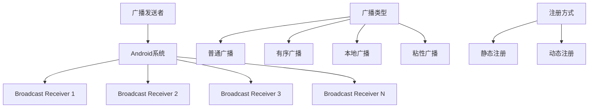

# 第14章：Broadcast Receiver广播机制

## 14.1 Broadcast Receiver基础概念

### 14.1.1 什么是Broadcast Receiver

Broadcast Receiver（广播接收器）是Android四大组件之一，用于接收来自系统和其他应用的广播消息。广播机制是一种发布-订阅模式，允许应用之间进行松耦合的通信。



### 14.1.2 广播类型详解

```java
public class BroadcastTypesExample {
    private Context context;

    public BroadcastTypesExample(Context context) {
        this.context = context;
    }

    // 1. 普通广播（Normal Broadcast）
    public void sendNormalBroadcast() {
        Intent intent = new Intent("com.example.NORMAL_BROADCAST");
        intent.putExtra("message", "这是一条普通广播");
        intent.putExtra("timestamp", System.currentTimeMillis());

        // 发送普通广播，所有接收器几乎同时收到
        context.sendBroadcast(intent);
    }

    // 2. 有序广播（Ordered Broadcast）
    public void sendOrderedBroadcast() {
        Intent intent = new Intent("com.example.ORDERED_BROADCAST");
        intent.putExtra("priority_level", "high");

        // 发送有序广播，接收器按优先级顺序接收
        context.sendOrderedBroadcast(intent, null, new BroadcastReceiver() {
            @Override
            public void onReceive(Context context, Intent intent) {
                // 最终结果接收器
                Log.d("OrderedBroadcast", "Final result received");
            }
        }, null, Activity.RESULT_OK, null, null);
    }

    // 3. 本地广播（Local Broadcast）
    public void sendLocalBroadcast() {
        // 使用LocalBroadcastManager，只在应用内部传递
        LocalBroadcastManager localBroadcastManager = LocalBroadcastManager.getInstance(context);

        Intent intent = new Intent("com.example.LOCAL_BROADCAST");
        intent.putExtra("data", "本地广播数据");

        localBroadcastManager.sendBroadcast(intent);
    }

    // 4. 带权限的广播
    public void sendBroadcastWithPermission() {
        Intent intent = new Intent("com.example.PERMISSION_BROADCAST");
        intent.putExtra("secure_data", "敏感信息");

        // 只有持有指定权限的接收器才能收到广播
        context.sendBroadcast(intent, "com.example.permission.RECEIVE_SECURE_BROADCAST");
    }

    // 5. 粘性广播（已废弃，Android 5.0+不推荐使用）
    @Deprecated
    public void sendStickyBroadcast() {
        Intent intent = new Intent("com.example.STICKY_BROADCAST");
        intent.putExtra("sticky_data", "粘性数据");

        // 粘性广播在发送后会一直存在，直到被新广播替换
        // 注意：在Android 5.0+中已废弃，应使用其他机制
        // context.sendStickyBroadcast(intent);
    }
}
```

### 14.1.3 广播接收器基础实现

```java
// 系统状态变化广播接收器
public class SystemStateReceiver extends BroadcastReceiver {
    private static final String TAG = "SystemStateReceiver";

    @Override
    public void onReceive(Context context, Intent intent) {
        String action = intent.getAction();
        Log.d(TAG, "Received broadcast: " + action);

        switch (action) {
            case Intent.ACTION_BOOT_COMPLETED:
                // 系统启动完成
                handleBootCompleted(context);
                break;

            case Intent.ACTION_BATTERY_LOW:
                // 电量低
                handleBatteryLow(context);
                break;

            case Intent.ACTION_BATTERY_OKAY:
                // 电量恢复正常
                handleBatteryOkay(context);
                break;

            case Intent.ACTION_POWER_CONNECTED:
                // 连接充电器
                handlePowerConnected(context);
                break;

            case Intent.ACTION_POWER_DISCONNECTED:
                // 断开充电器
                handlePowerDisconnected(context);
                break;

            case ConnectivityManager.CONNECTIVITY_ACTION:
                // 网络状态变化
                handleConnectivityChange(context, intent);
                break;

            case Intent.ACTION_SCREEN_ON:
                // 屏幕开启
                handleScreenOn(context);
                break;

            case Intent.ACTION_SCREEN_OFF:
                // 屏幕关闭
                handleScreenOff(context);
                break;

            case Intent.ACTION_LOCALE_CHANGED:
                // 系统语言变化
                handleLocaleChanged(context);
                break;

            case Intent.ACTION_TIME_CHANGED:
                // 系统时间变化
                handleTimeChanged(context);
                break;
        }
    }

    private void handleBootCompleted(Context context) {
        Log.d(TAG, "System boot completed");

        // 启动后台服务
        Intent serviceIntent = new Intent(context, BackgroundService.class);
        context.startService(serviceIntent);

        // 显示通知
        showNotification(context, "系统启动完成", "应用已自动启动");
    }

    private void handleBatteryLow(Context context) {
        Log.d(TAG, "Battery low");

        // 启用省电模式
        enablePowerSavingMode(context);

        // 停止非必要的后台任务
        stopBackgroundTasks(context);

        showNotification(context, "电量不足", "已启用省电模式");
    }

    private void handleBatteryOkay(Context context) {
        Log.d(TAG, "Battery okay");

        // 关闭省电模式
        disablePowerSavingMode(context);

        // 恢复后台任务
        resumeBackgroundTasks(context);

        showNotification(context, "电量正常", "已关闭省电模式");
    }

    private void handlePowerConnected(Context context) {
        Log.d(TAG, "Power connected");

        // 开始充电时的操作
        startChargingTasks(context);

        // 取消电量低警告
        cancelLowBatteryNotification(context);
    }

    private void handlePowerDisconnected(Context context) {
        Log.d(TAG, "Power disconnected");

        // 停止充电时的操作
        stopChargingTasks(context);
    }

    private void handleConnectivityChange(Context context, Intent intent) {
        ConnectivityManager cm = (ConnectivityManager) context.getSystemService(Context.CONNECTIVITY_SERVICE);
        NetworkInfo activeNetwork = cm.getActiveNetworkInfo();

        boolean isConnected = activeNetwork != null && activeNetwork.isConnected();
        String networkType = activeNetwork != null ? activeNetwork.getTypeName() : "Unknown";

        Log.d(TAG, "Network status: " + (isConnected ? "Connected" : "Disconnected") +
                  ", Type: " + networkType);

        if (isConnected) {
            onNetworkConnected(context, networkType);
        } else {
            onNetworkDisconnected(context);
        }
    }

    private void onNetworkConnected(Context context, String networkType) {
        // 网络连接时恢复数据同步
        if ("WIFI".equals(networkType)) {
            startDataSync(context);
        }

        // 发送网络可用广播
        Intent networkAvailableIntent = new Intent("com.example.NETWORK_AVAILABLE");
        networkAvailableIntent.putExtra("network_type", networkType);
        LocalBroadcastManager.getInstance(context).sendBroadcast(networkAvailableIntent);
    }

    private void onNetworkDisconnected(Context context) {
        // 网络断开时暂停数据同步
        pauseDataSync(context);

        // 发送网络不可用广播
        Intent networkUnavailableIntent = new Intent("com.example.NETWORK_UNAVAILABLE");
        LocalBroadcastManager.getInstance(context).sendBroadcast(networkUnavailableIntent);
    }

    private void handleScreenOn(Context context) {
        Log.d(TAG, "Screen turned on");

        // 屏幕开启时的操作
        resumeUIUpdates(context);
    }

    private void handleScreenOff(Context context) {
        Log.d(TAG, "Screen turned off");

        // 屏幕关闭时的操作
        pauseUIUpdates(context);
        enableDozeMode(context);
    }

    private void handleLocaleChanged(Context context) {
        Log.d(TAG, "Locale changed");

        // 重新加载本地化资源
        reloadLocalization(context);

        // 通知UI更新
        Intent localeChangedIntent = new Intent("com.example.LOCALE_CHANGED");
        LocalBroadcastManager.getInstance(context).sendBroadcast(localeChangedIntent);
    }

    private void handleTimeChanged(Context context) {
        Log.d(TAG, "Time changed");

        // 重新校准定时任务
        rescheduleTimedTasks(context);
    }

    // 辅助方法
    private void enablePowerSavingMode(Context context) {
        SharedPreferences prefs = context.getSharedPreferences("app_settings", Context.MODE_PRIVATE);
        prefs.edit().putBoolean("power_saving_mode", true).apply();
    }

    private void disablePowerSavingMode(Context context) {
        SharedPreferences prefs = context.getSharedPreferences("app_settings", Context.MODE_PRIVATE);
        prefs.edit().putBoolean("power_saving_mode", false).apply();
    }

    private void showNotification(Context context, String title, String message) {
        NotificationManager notificationManager = (NotificationManager)
            context.getSystemService(Context.NOTIFICATION_SERVICE);

        Notification notification = new NotificationCompat.Builder(context, "system_channel")
            .setSmallIcon(R.drawable.ic_notification)
            .setContentTitle(title)
            .setContentText(message)
            .setAutoCancel(true)
            .build();

        notificationManager.notify(1, notification);
    }

    private void cancelLowBatteryNotification(Context context) {
        NotificationManager notificationManager = (NotificationManager)
            context.getSystemService(Context.NOTIFICATION_SERVICE);
        notificationManager.cancel(1);
    }

    // 其他辅助方法的占位符实现
    private void stopBackgroundTasks(Context context) { /* 实现 */ }
    private void resumeBackgroundTasks(Context context) { /* 实现 */ }
    private void startChargingTasks(Context context) { /* 实现 */ }
    private void stopChargingTasks(Context context) { /* 实现 */ }
    private void startDataSync(Context context) { /* 实现 */ }
    private void pauseDataSync(Context context) { /* 实现 */ }
    private void resumeUIUpdates(Context context) { /* 实现 */ }
    private void pauseUIUpdates(Context context) { /* 实现 */ }
    private void enableDozeMode(Context context) { /* 实现 */ }
    private void reloadLocalization(Context context) { /* 实现 */ }
    private void rescheduleTimedTasks(Context context) { /* 实现 */ }
}
```

## 14.2 静态注册Broadcast Receiver

### 14.2.1 AndroidManifest.xml中静态注册

```xml
<!-- AndroidManifest.xml -->
<manifest xmlns:android="http://schemas.android.com/apk/res/android"
    package="com.example.broadcastdemo">

    <!-- 声明权限 -->
    <uses-permission android:name="android.permission.RECEIVE_BOOT_COMPLETED" />
    <uses-permission android:name="android.permission.ACCESS_NETWORK_STATE" />
    <uses-permission android:name="android.permission.BATTERY_STATS" />

    <application
        android:allowBackup="true"
        android:icon="@mipmap/ic_launcher"
        android:label="@string/app_name"
        android:theme="@style/AppTheme">

        <!-- 静态注册广播接收器 -->

        <!-- 开机启动接收器 -->
        <receiver
            android:name=".receiver.BootReceiver"
            android:enabled="true"
            android:exported="true">
            <intent-filter android:priority="1000">
                <action android:name="android.intent.action.BOOT_COMPLETED" />
                <action android:name="android.intent.action.QUICKBOOT_POWERON" />
                <category android:name="android.intent.category.DEFAULT" />
            </intent-filter>
        </receiver>

        <!-- 网络状态变化接收器 -->
        <receiver
            android:name=".receiver.NetworkStateReceiver"
            android:enabled="true"
            android:exported="false">
            <intent-filter>
                <action android:name="android.net.conn.CONNECTIVITY_CHANGE" />
            </intent-filter>
        </receiver>

        <!-- 电量状态接收器 -->
        <receiver
            android:name=".receiver.BatteryReceiver"
            android:enabled="true"
            android:exported="false">
            <intent-filter>
                <action android:name="android.intent.action.BATTERY_LOW" />
                <action android:name="android.intent.action.BATTERY_OKAY" />
                <action android:name="android.intent.action.ACTION_POWER_CONNECTED" />
                <action android:name="android.intent.action.ACTION_POWER_DISCONNECTED" />
            </intent-filter>
        </receiver>

        <!-- 应用安装/卸载接收器 -->
        <receiver
            android:name=".receiver.PackageReceiver"
            android:enabled="true"
            android:exported="true">
            <intent-filter>
                <action android:name="android.intent.action.PACKAGE_ADDED" />
                <action android:name="android.intent.action.PACKAGE_REMOVED" />
                <action android:name="android.intent.action.PACKAGE_REPLACED" />
                <data android:scheme="package" />
            </intent-filter>
        </receiver>

        <!-- 时间变化接收器 -->
        <receiver
            android:name=".receiver.TimeChangeReceiver"
            android:enabled="true"
            android:exported="false">
            <intent-filter>
                <action android:name="android.intent.action.TIME_SET" />
                <action android:name="android.intent.action.DATE_CHANGED" />
                <action android:name="android.intent.action.TIMEZONE_CHANGED" />
            </intent-filter>
        </receiver>

        <!-- 自定义广播接收器 -->
        <receiver
            android:name=".receiver.CustomBroadcastReceiver"
            android:enabled="true"
            android:exported="true"
            android:permission="com.example.permission.RECEIVE_CUSTOM_BROADCAST">
            <intent-filter android:priority="500">
                <action android:name="com.example.CUSTOM_BROADCAST" />
                <action android:name="com.example.DATA_SYNC_BROADCAST" />
                <category android:name="android.intent.category.DEFAULT" />
            </intent-filter>
        </receiver>

        <!-- 屏幕状态接收器 -->
        <receiver
            android:name=".receiver.ScreenStateReceiver"
            android:enabled="true"
            android:exported="false">
            <intent-filter>
                <action android:name="android.intent.action.SCREEN_ON" />
                <action android:name="android.intent.action.SCREEN_OFF" />
                <action android:name="android.intent.action.USER_PRESENT" />
            </intent-filter>
        </receiver>

    </application>
</manifest>
```

### 14.2.2 静态注册接收器实现

```java
// 开机启动接收器
public class BootReceiver extends BroadcastReceiver {
    private static final String TAG = "BootReceiver";

    @Override
    public void onReceive(Context context, Intent intent) {
        if (Intent.ACTION_BOOT_COMPLETED.equals(intent.getAction())) {
            Log.d(TAG, "Boot completed received");

            // 延迟启动服务，避免系统刚启动完就执行大量操作
            new Handler().postDelayed(() -> {
                startMainService(context);
                schedulePeriodicTasks(context);
                checkFirstLaunch(context);
            }, 3000); // 3秒延迟
        }
    }

    private void startMainService(Context context) {
        Intent serviceIntent = new Intent(context, MainApplicationService.class);

        // 根据Android版本选择启动方式
        if (Build.VERSION.SDK_INT >= Build.VERSION_CODES.O) {
            context.startForegroundService(serviceIntent);
        } else {
            context.startService(serviceIntent);
        }
    }

    private void schedulePeriodicTasks(Context context) {
        // 使用WorkManager调度周期性任务
        PeriodicWorkRequest dataSyncWork = new PeriodicWorkRequest.Builder(
            DataSyncWorker.class,
            6, // 6小时间隔
            TimeUnit.HOURS
        ).setConstraints(new Constraints.Builder()
            .setRequiredNetworkType(NetworkType.CONNECTED)
            .setRequiresBatteryNotLow(true)
            .build())
        .build();

        WorkManager.getInstance(context).enqueueUniquePeriodicWork(
            "periodic_data_sync",
            ExistingPeriodicWorkPolicy.REPLACE,
            dataSyncWork
        );
    }

    private void checkFirstLaunch(Context context) {
        SharedPreferences prefs = context.getSharedPreferences("app_prefs", Context.MODE_PRIVATE);
        boolean isFirstLaunch = prefs.getBoolean("is_first_launch", true);

        if (isFirstLaunch) {
            // 首次启动的逻辑
            performFirstLaunchSetup(context);
            prefs.edit().putBoolean("is_first_launch", false).apply();
        }
    }

    private void performFirstLaunchSetup(Context context) {
        // 创建默认配置
        createDefaultSettings(context);

        // 初始化数据库
        initializeDatabase(context);

        // 显示欢迎通知
        showWelcomeNotification(context);
    }

    private void createDefaultSettings(Context context) {
        SharedPreferences prefs = context.getSharedPreferences("app_settings", Context.MODE_PRIVATE);
        SharedPreferences.Editor editor = prefs.edit();
        editor.putBoolean("notifications_enabled", true);
        editor.putBoolean("auto_sync_enabled", true);
        editor.putString("sync_frequency", "daily");
        editor.putBoolean("wifi_only_sync", true);
        editor.apply();
    }

    private void initializeDatabase(Context context) {
        // 初始化数据库逻辑
        DatabaseHelper dbHelper = new DatabaseHelper(context);
        dbHelper.getWritableDatabase(); // 触发数据库创建
    }

    private void showWelcomeNotification(Context context) {
        NotificationManager notificationManager = (NotificationManager)
            context.getSystemService(Context.NOTIFICATION_SERVICE);

        Intent intent = new Intent(context, MainActivity.class);
        PendingIntent pendingIntent = PendingIntent.getActivity(
            context, 0, intent,
            PendingIntent.FLAG_UPDATE_CURRENT | PendingIntent.FLAG_IMMUTABLE
        );

        Notification notification = new NotificationCompat.Builder(context, "welcome_channel")
            .setSmallIcon(R.drawable.ic_welcome)
            .setContentTitle("欢迎使用应用")
            .setContentText("应用已成功启动，点击查看详情")
            .setContentIntent(pendingIntent)
            .setAutoCancel(true)
            .build();

        if (Build.VERSION.SDK_INT >= Build.VERSION_CODES.O) {
            NotificationChannel channel = new NotificationChannel(
                "welcome_channel",
                "欢迎消息",
                NotificationManager.IMPORTANCE_DEFAULT
            );
            notificationManager.createNotificationChannel(channel);
        }

        notificationManager.notify(1001, notification);
    }
}

// 网络状态变化接收器
public class NetworkStateReceiver extends BroadcastReceiver {
    private static final String TAG = "NetworkStateReceiver";

    @Override
    public void onReceive(Context context, Intent intent) {
        if (ConnectivityManager.CONNECTIVITY_ACTION.equals(intent.getAction())) {
            ConnectivityManager cm = (ConnectivityManager) context.getSystemService(Context.CONNECTIVITY_SERVICE);
            NetworkInfo activeNetwork = cm.getActiveNetworkInfo();

            boolean isConnected = activeNetwork != null && activeNetwork.isConnectedOrConnecting();
            String networkType = getNetworkType(activeNetwork);
            boolean isWiFi = activeNetwork != null && activeNetwork.getType() == ConnectivityManager.TYPE_WIFI;

            Log.d(TAG, String.format("Network state changed - Connected: %s, Type: %s, WiFi: %s",
                isConnected, networkType, isWiFi));

            // 保存网络状态
            saveNetworkState(context, isConnected, networkType, isWiFi);

            // 发送本地广播通知应用内组件
            sendNetworkStateBroadcast(context, isConnected, networkType, isWiFi);

            // 根据网络状态执行相应操作
            if (isConnected) {
                onNetworkConnected(context, networkType, isWiFi);
            } else {
                onNetworkDisconnected(context);
            }
        }
    }

    private String getNetworkType(NetworkInfo networkInfo) {
        if (networkInfo == null) return "Unknown";

        switch (networkInfo.getType()) {
            case ConnectivityManager.TYPE_WIFI:
                return "WiFi";
            case ConnectivityManager.TYPE_MOBILE:
                return "Mobile";
            case ConnectivityManager.TYPE_ETHERNET:
                return "Ethernet";
            case ConnectivityManager.TYPE_BLUETOOTH:
                return "Bluetooth";
            default:
                return "Other";
        }
    }

    private void saveNetworkState(Context context, boolean isConnected, String networkType, boolean isWiFi) {
        SharedPreferences prefs = context.getSharedPreferences("network_state", Context.MODE_PRIVATE);
        SharedPreferences.Editor editor = prefs.edit();
        editor.putBoolean("is_connected", isConnected);
        editor.putString("network_type", networkType);
        editor.putBoolean("is_wifi", isWiFi);
        editor.putLong("last_update", System.currentTimeMillis());
        editor.apply();
    }

    private void sendNetworkStateBroadcast(Context context, boolean isConnected, String networkType, boolean isWiFi) {
        Intent localIntent = new Intent("com.example.NETWORK_STATE_CHANGED");
        localIntent.putExtra("is_connected", isConnected);
        localIntent.putExtra("network_type", networkType);
        localIntent.putExtra("is_wifi", isWiFi);
        localIntent.putExtra("timestamp", System.currentTimeMillis());

        LocalBroadcastManager.getInstance(context).sendBroadcast(localIntent);
    }

    private void onNetworkConnected(Context context, String networkType, boolean isWiFi) {
        // 网络连接时的操作

        // 如果是WiFi，启动数据同步
        if (isWiFi) {
            startDataSyncIfEnabled(context);
        }

        // 重试失败的网络请求
        retryFailedNetworkRequests(context);

        // 检查应用更新
        checkForAppUpdate(context);

        // 同步云端数据
        syncCloudData(context);
    }

    private void onNetworkDisconnected(Context context) {
        // 网络断开时的操作

        // 暂停数据同步
        pauseDataSync(context);

        // 缓存用户操作
        enableOfflineMode(context);

        // 显示离线提示
        showOfflineNotification(context);
    }

    private void startDataSyncIfEnabled(Context context) {
        SharedPreferences prefs = context.getSharedPreferences("app_settings", Context.MODE_PRIVATE);
        boolean autoSyncEnabled = prefs.getBoolean("auto_sync_enabled", true);
        boolean wifiOnlySync = prefs.getBoolean("wifi_only_sync", true);

        if (autoSyncEnabled && wifiOnlySync) {
            Intent syncIntent = new Intent(context, DataSyncService.class);
            syncIntent.setAction("START_SYNC");
            context.startService(syncIntent);
        }
    }

    private void retryFailedNetworkRequests(Context context) {
        // 重试失败的网络请求
        Intent retryIntent = new Intent(context, NetworkRetryService.class);
        context.startService(retryIntent);
    }

    private void checkForAppUpdate(Context context) {
        // 检查应用更新
        UpdateManager.checkForUpdate(context);
    }

    private void syncCloudData(Context context) {
        // 同步云端数据
        Intent cloudSyncIntent = new Intent(context, CloudSyncService.class);
        context.startService(cloudSyncIntent);
    }

    private void pauseDataSync(Context context) {
        // 暂停数据同步
        Intent syncIntent = new Intent(context, DataSyncService.class);
        syncIntent.setAction("PAUSE_SYNC");
        context.startService(syncIntent);
    }

    private void enableOfflineMode(Context context) {
        SharedPreferences prefs = context.getSharedPreferences("app_settings", Context.MODE_PRIVATE);
        prefs.edit().putBoolean("offline_mode", true).apply();
    }

    private void showOfflineNotification(Context context) {
        NotificationManager notificationManager = (NotificationManager)
            context.getSystemService(Context.NOTIFICATION_SERVICE);

        Notification notification = new NotificationCompat.Builder(context, "network_channel")
            .setSmallIcon(R.drawable.ic_offline)
            .setContentTitle("网络连接已断开")
            .setContentText("应用已切换到离线模式")
            .setAutoCancel(true)
            .build();

        notificationManager.notify(2001, notification);
    }
}
```

## 14.3 动态注册Broadcast Receiver

### 14.3.1 动态注册基础

```java
public class DynamicBroadcastManager {
    private Context context;
    private List<BroadcastReceiver> registeredReceivers = new ArrayList<>();
    private LocalBroadcastManager localBroadcastManager;

    public DynamicBroadcastManager(Context context) {
        this.context = context.getApplicationContext();
        this.localBroadcastManager = LocalBroadcastManager.getInstance(this.context);
    }

    // 注册网络状态监听
    public void registerNetworkStateReceiver(NetworkStateListener listener) {
        BroadcastReceiver receiver = new BroadcastReceiver() {
            @Override
            public void onReceive(Context context, Intent intent) {
                if (ConnectivityManager.CONNECTIVITY_ACTION.equals(intent.getAction())) {
                    ConnectivityManager cm = (ConnectivityManager) context.getSystemService(Context.CONNECTIVITY_SERVICE);
                    NetworkInfo activeNetwork = cm.getActiveNetworkInfo();

                    boolean isConnected = activeNetwork != null && activeNetwork.isConnected();
                    listener.onNetworkStateChanged(isConnected, activeNetwork);
                }
            }
        };

        IntentFilter filter = new IntentFilter();
        filter.addAction(ConnectivityManager.CONNECTIVITY_ACTION);

        context.registerReceiver(receiver, filter);
        registeredReceivers.add(receiver);
    }

    // 注册电池状态监听
    public void registerBatteryStateReceiver(BatteryStateListener listener) {
        BroadcastReceiver receiver = new BroadcastReceiver() {
            @Override
            public void onReceive(Context context, Intent intent) {
                String action = intent.getAction();

                if (Intent.ACTION_BATTERY_CHANGED.equals(action)) {
                    int level = intent.getIntExtra(BatteryManager.EXTRA_LEVEL, -1);
                    int scale = intent.getIntExtra(BatteryManager.EXTRA_SCALE, -1);
                    float batteryPct = level / (float) scale * 100;

                    int status = intent.getIntExtra(BatteryManager.EXTRA_STATUS, -1);
                    boolean isCharging = status == BatteryManager.BATTERY_STATUS_CHARGING ||
                                      status == BatteryManager.BATTERY_STATUS_FULL;

                    listener.onBatteryStateChanged(batteryPct, isCharging);
                } else if (Intent.ACTION_BATTERY_LOW.equals(action)) {
                    listener.onBatteryLow();
                } else if (Intent.ACTION_BATTERY_OKAY.equals(action)) {
                    listener.onBatteryOkay();
                }
            }
        };

        IntentFilter filter = new IntentFilter();
        filter.addAction(Intent.ACTION_BATTERY_CHANGED);
        filter.addAction(Intent.ACTION_BATTERY_LOW);
        filter.addAction(Intent.ACTION_BATTERY_OKAY);

        context.registerReceiver(receiver, filter);
        registeredReceivers.add(receiver);
    }

    // 注册屏幕状态监听
    public void registerScreenStateReceiver(ScreenStateListener listener) {
        BroadcastReceiver receiver = new BroadcastReceiver() {
            @Override
            public void onReceive(Context context, Intent intent) {
                String action = intent.getAction();

                if (Intent.ACTION_SCREEN_ON.equals(action)) {
                    listener.onScreenOn();
                } else if (Intent.ACTION_SCREEN_OFF.equals(action)) {
                    listener.onScreenOff();
                } else if (Intent.ACTION_USER_PRESENT.equals(action)) {
                    listener.onUserPresent();
                }
            }
        };

        IntentFilter filter = new IntentFilter();
        filter.addAction(Intent.ACTION_SCREEN_ON);
        filter.addAction(Intent.ACTION_SCREEN_OFF);
        filter.addAction(Intent.ACTION_USER_PRESENT);

        context.registerReceiver(receiver, filter);
        registeredReceivers.add(receiver);
    }

    // 注册应用前后台状态监听
    public void registerAppLifecycleReceiver(AppLifecycleListener listener) {
        BroadcastReceiver receiver = new BroadcastReceiver() {
            @Override
            public void onReceive(Context context, Intent intent) {
                String action = intent.getAction();

                if (Intent.ACTION_USER_FOREGROUND.equals(action)) {
                    listener.onAppForeground();
                } else if (Intent.ACTION_USER_BACKGROUND.equals(action)) {
                    listener.onAppBackground();
                }
            }
        };

        IntentFilter filter = new IntentFilter();
        filter.addAction(Intent.ACTION_USER_FOREGROUND);
        filter.addAction(Intent.ACTION_USER_BACKGROUND);

        context.registerReceiver(receiver, filter);
        registeredReceivers.add(receiver);
    }

    // 注册自定义本地广播监听
    public void registerCustomBroadcastReceiver(String action, CustomBroadcastListener listener) {
        BroadcastReceiver receiver = new BroadcastReceiver() {
            @Override
            public void onReceive(Context context, Intent intent) {
                listener.onCustomBroadcastReceived(action, intent);
            }
        };

        LocalBroadcastManager.getInstance(context).registerReceiver(receiver, new IntentFilter(action));
        registeredReceivers.add(receiver);
    }

    // 注册多个Action的接收器
    public void registerMultiActionReceiver(Map<String, BroadcastReceiverListener> actionListenerMap) {
        BroadcastReceiver receiver = new BroadcastReceiver() {
            @Override
            public void onReceive(Context context, Intent intent) {
                String action = intent.getAction();
                BroadcastReceiverListener listener = actionListenerMap.get(action);
                if (listener != null) {
                    listener.onBroadcastReceived(context, intent);
                }
            }
        };

        IntentFilter filter = new IntentFilter();
        for (String action : actionListenerMap.keySet()) {
            filter.addAction(action);
        }

        context.registerReceiver(receiver, filter);
        registeredReceivers.add(receiver);
    }

    // 注销所有接收器
    public void unregisterAllReceivers() {
        for (BroadcastReceiver receiver : registeredReceivers) {
            try {
                context.unregisterReceiver(receiver);
            } catch (IllegalArgumentException e) {
                // 接收器已经注销，忽略异常
                Log.w("DynamicBroadcast", "Receiver already unregistered: " + e.getMessage());
            }
        }
        registeredReceivers.clear();
    }

    // 检查是否有注册的接收器
    public boolean hasRegisteredReceivers() {
        return !registeredReceivers.isEmpty();
    }

    // 获取已注册接收器数量
    public int getRegisteredReceiverCount() {
        return registeredReceivers.size();
    }

    // 接口定义
    public interface NetworkStateListener {
        void onNetworkStateChanged(boolean isConnected, NetworkInfo networkInfo);
    }

    public interface BatteryStateListener {
        void onBatteryStateChanged(float batteryLevel, boolean isCharging);
        void onBatteryLow();
        void onBatteryOkay();
    }

    public interface ScreenStateListener {
        void onScreenOn();
        void onScreenOff();
        void onUserPresent();
    }

    public interface AppLifecycleListener {
        void onAppForeground();
        void onAppBackground();
    }

    public interface CustomBroadcastListener {
        void onCustomBroadcastReceived(String action, Intent intent);
    }

    public interface BroadcastReceiverListener {
        void onBroadcastReceived(Context context, Intent intent);
    }
}
```

### 14.3.2 Activity/Fragment中的动态注册使用

```java
public class MainActivity extends AppCompatActivity {
    private DynamicBroadcastManager broadcastManager;
    private TextView networkStatusText;
    private TextView batteryStatusText;
    private ProgressBar batteryProgressBar;

    // 广播状态标识
    private boolean isNetworkReceiverRegistered = false;
    private boolean isBatteryReceiverRegistered = false;

    @Override
    protected void onCreate(Bundle savedInstanceState) {
        super.onCreate(savedInstanceState);
        setContentView(R.layout.activity_main);

        initViews();
        setupBroadcastManager();
        registerReceivers();
    }

    private void initViews() {
        networkStatusText = findViewById(R.id.network_status_text);
        batteryStatusText = findViewById(R.id.battery_status_text);
        batteryProgressBar = findViewById(R.id.battery_progress_bar);
    }

    private void setupBroadcastManager() {
        broadcastManager = new DynamicBroadcastManager(this);
    }

    private void registerReceivers() {
        // 注册网络状态监听
        registerNetworkReceiver();

        // 注册电池状态监听
        registerBatteryReceiver();

        // 注册自定义广播监听
        registerCustomBroadcasts();
    }

    private void registerNetworkReceiver() {
        if (!isNetworkReceiverRegistered) {
            broadcastManager.registerNetworkStateReceiver(new NetworkStateListener() {
                @Override
                public void onNetworkStateChanged(boolean isConnected, NetworkInfo networkInfo) {
                    updateNetworkUI(isConnected, networkInfo);
                }
            });
            isNetworkReceiverRegistered = true;
        }
    }

    private void registerBatteryReceiver() {
        if (!isBatteryReceiverRegistered) {
            broadcastManager.registerBatteryStateReceiver(new BatteryStateListener() {
                @Override
                public void onBatteryStateChanged(float batteryLevel, boolean isCharging) {
                    updateBatteryUI(batteryLevel, isCharging);
                }

                @Override
                public void onBatteryLow() {
                    showBatteryLowDialog();
                }

                @Override
                public void onBatteryOkay() {
                    dismissBatteryLowDialog();
                }
            });
            isBatteryReceiverRegistered = true;
        }
    }

    private void registerCustomBroadcasts() {
        // 注册数据更新广播
        broadcastManager.registerCustomBroadcastReceiver("com.example.DATA_UPDATED",
            new CustomBroadcastListener() {
                @Override
                public void onCustomBroadcastReceived(String action, Intent intent) {
                    handleDataUpdate(intent);
                }
            });

        // 注册用户操作广播
        broadcastManager.registerCustomBroadcastReceiver("com.example.USER_ACTION",
            new CustomBroadcastListener() {
                @Override
                public void onCustomBroadcastReceived(String action, Intent intent) {
                    handleUserAction(intent);
                }
            });
    }

    private void updateNetworkUI(boolean isConnected, NetworkInfo networkInfo) {
        runOnUiThread(() -> {
            if (isConnected) {
                String networkType = getNetworkTypeName(networkInfo);
                networkStatusText.setText("网络已连接: " + networkType);
                networkStatusText.setTextColor(Color.GREEN);
            } else {
                networkStatusText.setText("网络未连接");
                networkStatusText.setTextColor(Color.RED);
            }
        });
    }

    private void updateBatteryUI(float batteryLevel, boolean isCharging) {
        runOnUiThread(() -> {
            batteryProgressBar.setProgress((int) batteryLevel);

            String statusText = String.format("电量: %.1f%%", batteryLevel);
            if (isCharging) {
                statusText += " (充电中)";
            }

            batteryStatusText.setText(statusText);

            // 根据电量设置颜色
            if (batteryLevel < 20) {
                batteryProgressBar.getProgressDrawable().setColorFilter(Color.RED, PorterDuff.Mode.SRC_IN);
            } else if (batteryLevel < 50) {
                batteryProgressBar.getProgressDrawable().setColorFilter(Color.YELLOW, PorterDuff.Mode.SRC_IN);
            } else {
                batteryProgressBar.getProgressDrawable().setColorFilter(Color.GREEN, PorterDuff.Mode.SRC_IN);
            }
        });
    }

    private void showBatteryLowDialog() {
        runOnUiThread(() -> {
            new AlertDialog.Builder(this)
                .setTitle("电量不足")
                .setMessage("电池电量低于20%，建议连接充电器")
                .setPositiveButton("知道了", null)
                .setNegativeButton("省电模式", (dialog, which) -> enablePowerSavingMode())
                .show();
        });
    }

    private void dismissBatteryLowDialog() {
        // 关闭电量不足对话框
        // 这里可以使用DialogFragment或其他方式管理对话框
    }

    private void handleDataUpdate(Intent intent) {
        String dataType = intent.getStringExtra("data_type");
        // 处理数据更新
        Log.d("MainActivity", "Data updated: " + dataType);
    }

    private void handleUserAction(Intent intent) {
        String action = intent.getStringExtra("user_action");
        // 处理用户操作
        Log.d("MainActivity", "User action: " + action);
    }

    private void enablePowerSavingMode() {
        // 启用省电模式
        SharedPreferences prefs = getSharedPreferences("app_settings", MODE_PRIVATE);
        prefs.edit().putBoolean("power_saving_mode", true).apply();
    }

    private String getNetworkTypeName(NetworkInfo networkInfo) {
        if (networkInfo == null) return "Unknown";

        switch (networkInfo.getType()) {
            case ConnectivityManager.TYPE_WIFI:
                return "WiFi";
            case ConnectivityManager.TYPE_MOBILE:
                return "移动网络";
            case ConnectivityManager.TYPE_ETHERNET:
                return "以太网";
            default:
                return "其他";
        }
    }

    // 发送自定义广播
    private void sendCustomBroadcast(String action, String data) {
        Intent intent = new Intent(action);
        intent.putExtra("data", data);
        LocalBroadcastManager.getInstance(this).sendBroadcast(intent);
    }

    @Override
    protected void onResume() {
        super.onResume();

        // 重新注册广播（如果需要）
        if (!isNetworkReceiverRegistered) {
            registerNetworkReceiver();
        }
        if (!isBatteryReceiverRegistered) {
            registerBatteryReceiver();
        }
    }

    @Override
    protected void onPause() {
        super.onPause();

        // 可以选择在这里注销一些广播以节省资源
        // unregisterSomeReceivers();
    }

    @Override
    protected void onDestroy() {
        super.onDestroy();

        // 注销所有广播接收器
        if (broadcastManager != null) {
            broadcastManager.unregisterAllReceivers();
        }
    }
}
```

## 14.4 本地广播使用

### 14.4.1 LocalBroadcastManager基础

```java
public class LocalBroadcastManagerHelper {
    private LocalBroadcastManager localBroadcastManager;
    private Map<String, BroadcastReceiver> receivers = new HashMap<>();

    public LocalBroadcastManagerHelper(Context context) {
        this.localBroadcastManager = LocalBroadcastManager.getInstance(context);
    }

    // 发送本地广播
    public void sendLocalBroadcast(String action, Bundle extras) {
        Intent intent = new Intent(action);
        if (extras != null) {
            intent.putExtras(extras);
        }
        localBroadcastManager.sendBroadcast(intent);
    }

    // 发送带有序列化数据的本地广播
    public void sendLocalBroadcast(String action, String key, Serializable value) {
        Intent intent = new Intent(action);
        intent.putExtra(key, value);
        localBroadcastManager.sendBroadcast(intent);
    }

    // 注册本地广播接收器
    public void registerLocalReceiver(String action, LocalBroadcastListener listener) {
        BroadcastReceiver receiver = new BroadcastReceiver() {
            @Override
            public void onReceive(Context context, Intent intent) {
                if (action.equals(intent.getAction())) {
                    listener.onReceive(intent);
                }
            }
        };

        localBroadcastManager.registerReceiver(receiver, new IntentFilter(action));
        receivers.put(action, receiver);
    }

    // 注销本地广播接收器
    public void unregisterLocalReceiver(String action) {
        BroadcastReceiver receiver = receivers.remove(action);
        if (receiver != null) {
            localBroadcastManager.unregisterReceiver(receiver);
        }
    }

    // 注销所有本地广播接收器
    public void unregisterAllReceivers() {
        for (Map.Entry<String, BroadcastReceiver> entry : receivers.entrySet()) {
            localBroadcastManager.unregisterReceiver(entry.getValue());
        }
        receivers.clear();
    }

    public interface LocalBroadcastListener {
        void onReceive(Intent intent);
    }
}

// 应用事件管理器
public class AppEventManager {
    private static AppEventManager instance;
    private LocalBroadcastManagerHelper broadcastHelper;
    private Context context;

    private AppEventManager(Context context) {
        this.context = context.getApplicationContext();
        this.broadcastHelper = new LocalBroadcastManagerHelper(this.context);
    }

    public static synchronized AppEventManager getInstance(Context context) {
        if (instance == null) {
            instance = new AppEventManager(context);
        }
        return instance;
    }

    // 事件常量
    public static final String EVENT_USER_LOGIN = "com.example.USER_LOGIN";
    public static final String EVENT_USER_LOGOUT = "com.example.USER_LOGOUT";
    public static final String EVENT_DATA_SYNCED = "com.example.DATA_SYNCED";
    public static final String EVENT_SETTINGS_CHANGED = "com.example.SETTINGS_CHANGED";
    public static final String EVENT_NETWORK_CHANGED = "com.example.NETWORK_CHANGED";
    public static final String EVENT_BATTERY_LOW = "com.example.BATTERY_LOW";
    public static final String EVENT_MESSAGE_RECEIVED = "com.example.MESSAGE_RECEIVED";
    public static final String EVENT_DOWNLOAD_COMPLETED = "com.example.DOWNLOAD_COMPLETED";

    // 发送用户登录事件
    public void notifyUserLogin(String userId, String username) {
        Bundle extras = new Bundle();
        extras.putString("user_id", userId);
        extras.putString("username", username);
        extras.putLong("login_time", System.currentTimeMillis());

        broadcastHelper.sendLocalBroadcast(EVENT_USER_LOGIN, extras);
    }

    // 发送用户登出事件
    public void notifyUserLogout() {
        Bundle extras = new Bundle();
        extras.putLong("logout_time", System.currentTimeMillis());

        broadcastHelper.sendLocalBroadcast(EVENT_USER_LOGOUT, extras);
    }

    // 发送数据同步完成事件
    public void notifyDataSynced(String dataType, int count) {
        Bundle extras = new Bundle();
        extras.putString("data_type", dataType);
        extras.putInt("sync_count", count);
        extras.putLong("sync_time", System.currentTimeMillis());

        broadcastHelper.sendLocalBroadcast(EVENT_DATA_SYNCED, extras);
    }

    // 发送设置变更事件
    public void notifySettingsChanged(String settingKey, Object newValue) {
        Bundle extras = new Bundle();
        extras.putString("setting_key", settingKey);

        if (newValue instanceof String) {
            extras.putString("new_value", (String) newValue);
        } else if (newValue instanceof Boolean) {
            extras.putBoolean("new_value", (Boolean) newValue);
        } else if (newValue instanceof Integer) {
            extras.putInt("new_value", (Integer) newValue);
        }

        broadcastHelper.sendLocalBroadcast(EVENT_SETTINGS_CHANGED, extras);
    }

    // 发送网络状态变化事件
    public void notifyNetworkChanged(boolean isConnected, String networkType) {
        Bundle extras = new Bundle();
        extras.putBoolean("is_connected", isConnected);
        extras.putString("network_type", networkType);
        extras.putLong("change_time", System.currentTimeMillis());

        broadcastHelper.sendLocalBroadcast(EVENT_NETWORK_CHANGED, extras);
    }

    // 发送电量低事件
    public void notifyBatteryLow(float batteryLevel) {
        Bundle extras = new Bundle();
        extras.putFloat("battery_level", batteryLevel);
        extras.putLong("low_time", System.currentTimeMillis());

        broadcastHelper.sendLocalBroadcast(EVENT_BATTERY_LOW, extras);
    }

    // 发送消息接收事件
    public void notifyMessageReceived(String messageId, String senderId, String content) {
        Bundle extras = new Bundle();
        extras.putString("message_id", messageId);
        extras.putString("sender_id", senderId);
        extras.putString("content", content);
        extras.putLong("receive_time", System.currentTimeMillis());

        broadcastHelper.sendLocalBroadcast(EVENT_MESSAGE_RECEIVED, extras);
    }

    // 发送下载完成事件
    public void notifyDownloadCompleted(String fileName, String filePath, long fileSize) {
        Bundle extras = new Bundle();
        extras.putString("file_name", fileName);
        extras.putString("file_path", filePath);
        extras.putLong("file_size", fileSize);
        extras.putLong("complete_time", System.currentTimeMillis());

        broadcastHelper.sendLocalBroadcast(EVENT_DOWNLOAD_COMPLETED, extras);
    }

    // 注册事件监听器
    public void registerEventListener(String event, LocalBroadcastManagerHelper.LocalBroadcastListener listener) {
        broadcastHelper.registerLocalReceiver(event, listener);
    }

    // 注销事件监听器
    public void unregisterEventListener(String event) {
        broadcastHelper.unregisterLocalReceiver(event);
    }

    // 注销所有事件监听器
    public void unregisterAllEventListeners() {
        broadcastHelper.unregisterAllReceivers();
    }
}
```

### 14.4.2 本地广播实际应用

```java
// 消息通知管理器
public class NotificationManager {
    private AppEventManager eventManager;
    private Context context;
    private List<MessageListener> messageListeners = new ArrayList<>();

    public NotificationManager(Context context) {
        this.context = context.getApplicationContext();
        this.eventManager = AppEventManager.getInstance(context);
        setupEventListeners();
    }

    private void setupEventListeners() {
        // 监听用户登录事件
        eventManager.registerEventListener(AppEventManager.EVENT_USER_LOGIN, new LocalBroadcastManagerHelper.LocalBroadcastListener() {
            @Override
            public void onReceive(Intent intent) {
                String userId = intent.getStringExtra("user_id");
                String username = intent.getStringExtra("username");
                onUserLoggedIn(userId, username);
            }
        });

        // 监听消息接收事件
        eventManager.registerEventListener(AppEventManager.EVENT_MESSAGE_RECEIVED, new LocalBroadcastManagerHelper.LocalBroadcastListener() {
            @Override
            public void onReceive(Intent intent) {
                String messageId = intent.getStringExtra("message_id");
                String senderId = intent.getStringExtra("sender_id");
                String content = intent.getStringExtra("content");
                onMessageReceived(messageId, senderId, content);
            }
        });

        // 监听下载完成事件
        eventManager.registerEventListener(AppEventManager.EVENT_DOWNLOAD_COMPLETED, new LocalBroadcastManagerHelper.LocalBroadcastListener() {
            @Override
            public void onReceive(Intent intent) {
                String fileName = intent.getStringExtra("file_name");
                String filePath = intent.getStringExtra("file_path");
                long fileSize = intent.getLongExtra("file_size", 0);
                onDownloadCompleted(fileName, filePath, fileSize);
            }
        });
    }

    private void onUserLoggedIn(String userId, String username) {
        // 用户登录后的通知处理
        showWelcomeNotification(username);
        registerPushNotification(userId);
    }

    private void onMessageReceived(String messageId, String senderId, String content) {
        // 接收到新消息的处理
        if (shouldShowMessageNotification()) {
            showMessageNotification(senderId, content);
        }

        // 通知所有监听器
        for (MessageListener listener : messageListeners) {
            listener.onNewMessage(messageId, senderId, content);
        }
    }

    private void onDownloadCompleted(String fileName, String filePath, long fileSize) {
        // 下载完成后的通知处理
        showDownloadCompletedNotification(fileName, fileSize);
    }

    private void showWelcomeNotification(String username) {
        android.app.NotificationManager notificationManager =
            (android.app.NotificationManager) context.getSystemService(Context.NOTIFICATION_SERVICE);

        Intent intent = new Intent(context, MainActivity.class);
        PendingIntent pendingIntent = PendingIntent.getActivity(
            context, 0, intent,
            PendingIntent.FLAG_UPDATE_CURRENT | PendingIntent.FLAG_IMMUTABLE
        );

        Notification notification = new NotificationCompat.Builder(context, "user_channel")
            .setSmallIcon(R.drawable.ic_welcome)
            .setContentTitle("欢迎回来，" + username)
            .setContentText("您已成功登录")
            .setContentIntent(pendingIntent)
            .setAutoCancel(true)
            .build();

        notificationManager.notify(1001, notification);
    }

    private void showMessageNotification(String senderId, String content) {
        android.app.NotificationManager notificationManager =
            (android.app.NotificationManager) context.getSystemService(Context.NOTIFICATION_SERVICE);

        Intent intent = new Intent(context, ChatActivity.class);
        intent.putExtra("sender_id", senderId);
        PendingIntent pendingIntent = PendingIntent.getActivity(
            context, 0, intent,
            PendingIntent.FLAG_UPDATE_CURRENT | PendingIntent.FLAG_IMMUTABLE
        );

        Notification notification = new NotificationCompat.Builder(context, "message_channel")
            .setSmallIcon(R.drawable.ic_message)
            .setContentTitle("新消息")
            .setContentText(content)
            .setContentIntent(pendingIntent)
            .setAutoCancel(true)
            .setPriority(NotificationCompat.PRIORITY_HIGH)
            .build();

        notificationManager.notify(2001, notification);
    }

    private void showDownloadCompletedNotification(String fileName, long fileSize) {
        android.app.NotificationManager notificationManager =
            (android.app.NotificationManager) context.getSystemService(Context.NOTIFICATION_SERVICE);

        Intent intent = new Intent(context, FileManagerActivity.class);
        PendingIntent pendingIntent = PendingIntent.getActivity(
            context, 0, intent,
            PendingIntent.FLAG_UPDATE_CURRENT | PendingIntent.FLAG_IMMUTABLE
        );

        String sizeText = formatFileSize(fileSize);
        String content = String.format("%s (%s)", fileName, sizeText);

        Notification notification = new NotificationCompat.Builder(context, "download_channel")
            .setSmallIcon(R.drawable.ic_download)
            .setContentTitle("下载完成")
            .setContentText(content)
            .setContentIntent(pendingIntent)
            .setAutoCancel(true)
            .build();

        notificationManager.notify(3001, notification);
    }

    private boolean shouldShowMessageNotification() {
        SharedPreferences prefs = context.getSharedPreferences("notification_settings", Context.MODE_PRIVATE);
        return prefs.getBoolean("message_notifications", true);
    }

    private void registerPushNotification(String userId) {
        // 注册推送通知服务
        // ...
    }

    private String formatFileSize(long size) {
        if (size < 1024) return size + " B";
        if (size < 1024 * 1024) return String.format("%.1f KB", size / 1024.0);
        if (size < 1024 * 1024 * 1024) return String.format("%.1f MB", size / (1024.0 * 1024));
        return String.format("%.1f GB", size / (1024.0 * 1024 * 1024));
    }

    // 添加消息监听器
    public void addMessageListener(MessageListener listener) {
        messageListeners.add(listener);
    }

    // 移除消息监听器
    public void removeMessageListener(MessageListener listener) {
        messageListeners.remove(listener);
    }

    public interface MessageListener {
        void onNewMessage(String messageId, String senderId, String content);
    }
}
```

## 14.5 有序广播和权限管理

### 14.5.1 有序广播实现

```java
public class OrderedBroadcastManager {
    private Context context;

    public OrderedBroadcastManager(Context context) {
        this.context = context;
    }

    // 发送有序广播
    public void sendOrderedBroadcast(String action, Bundle data,
                                    OrderedBroadcastCallback callback) {
        Intent intent = new Intent(action);
        if (data != null) {
            intent.putExtras(data);
        }

        // 创建最终结果接收器
        BroadcastReceiver resultReceiver = new BroadcastReceiver() {
            @Override
            public void onReceive(Context context, Intent intent) {
                if (callback != null) {
                    Bundle resultData = getResultExtras(true);
                    callback.onFinalResult(resultData, getResultCode());
                }
            }
        };

        // 发送有序广播
        context.sendOrderedBroadcast(
            intent,                           // Intent
            null,                             // 权限
            resultReceiver,                   // 最终结果接收器
            null,                             // Handler
            Activity.RESULT_OK,               // 初始结果码
            null,                             // 初始数据
            null                              // 额外数据
        );
    }

    // 带权限的有序广播
    public void sendOrderedBroadcastWithPermission(String action, String permission,
                                                   Bundle data, OrderedBroadcastCallback callback) {
        Intent intent = new Intent(action);
        if (data != null) {
            intent.putExtras(data);
        }

        BroadcastReceiver resultReceiver = new BroadcastReceiver() {
            @Override
            public void onReceive(Context context, Intent intent) {
                if (callback != null) {
                    Bundle resultData = getResultExtras(true);
                    callback.onFinalResult(resultData, getResultCode());
                }
            }
        };

        context.sendOrderedBroadcast(
            intent,
            permission,                       // 接收器所需的权限
            resultReceiver,
            null,
            Activity.RESULT_OK,
            null,
            null
        );
    }

    // 高优先级有序广播
    public void sendHighPriorityOrderedBroadcast(String action, Bundle data,
                                                 OrderedBroadcastCallback callback) {
        Intent intent = new Intent(action);
        if (data != null) {
            intent.putExtras(data);
        }

        // 设置高优先级
        intent.putExtra("priority", 1000);

        BroadcastReceiver resultReceiver = new BroadcastReceiver() {
            @Override
            public void onReceive(Context context, Intent intent) {
                if (callback != null) {
                    Bundle resultData = getResultExtras(true);
                    callback.onFinalResult(resultData, getResultCode());
                }
            }
        };

        context.sendOrderedBroadcast(
            intent,
            "com.example.permission.HIGH_PRIORITY_BROADCAST",
            resultReceiver,
            null,
            Activity.RESULT_OK,
            null,
            null
        );
    }

    public interface OrderedBroadcastCallback {
        void onFinalResult(Bundle resultData, int resultCode);
    }
}

// 高优先级广播接收器
public class HighPriorityBroadcastReceiver extends BroadcastReceiver {
    private static final String TAG = "HighPriorityBroadcast";

    @Override
    public void onReceive(Context context, Intent intent) {
        String action = intent.getAction();
        Log.d(TAG, "High priority receiver processing: " + action);

        // 处理紧急广播
        if ("com.example.EMERGENCY_BROADCAST".equals(action)) {
            handleEmergencyBroadcast(context, intent);
        }

        // 中断广播传播（可选）
        if (shouldAbortBroadcast(intent)) {
            abortBroadcast();
            Log.d(TAG, "Broadcast aborted by high priority receiver");
        }

        // 设置结果数据给下一个接收器
        setResultData("Processed by high priority receiver");
        setResultCode(Activity.RESULT_OK);
    }

    private void handleEmergencyBroadcast(Context context, Intent intent) {
        String emergencyType = intent.getStringExtra("emergency_type");

        switch (emergencyType) {
            case "SECURITY_BREACH":
                handleSecurityBreach(context);
                break;
            case "SYSTEM_ERROR":
                handleSystemError(context);
                break;
            case "CRITICAL_UPDATE":
                handleCriticalUpdate(context);
                break;
        }
    }

    private void handleSecurityBreach(Context context) {
        // 处理安全漏洞
        // 立即采取安全措施
        Log.e(TAG, "Security breach detected, taking emergency measures");

        // 通知安全管理员
        notifySecurityAdmin(context);

        // 启动安全检查服务
        startSecurityCheckService(context);
    }

    private void handleSystemError(Context context) {
        // 处理系统错误
        Log.e(TAG, "System error detected");

        // 收集错误信息
        collectErrorInformation(context);

        // 重启相关服务
        restartServices(context);
    }

    private void handleCriticalUpdate(Context context) {
        // 处理关键更新
        Log.w(TAG, "Critical update available");

        // 立即下载更新
        startCriticalUpdateDownload(context);

        // 通知用户
        showUpdateNotification(context);
    }

    private boolean shouldAbortBroadcast(Intent intent) {
        // 根据Intent决定是否中断广播
        String action = intent.getAction();
        return "com.example.STOP_PROPAGATION".equals(action);
    }

    private void notifySecurityAdmin(Context context) {
        // 通知安全管理员
        Intent intent = new Intent("com.example.SECURITY_ALERT");
        intent.putExtra("alert_type", "security_breach");
        context.sendBroadcast(intent);
    }

    private void startSecurityCheckService(Context context) {
        Intent intent = new Intent(context, SecurityCheckService.class);
        context.startService(intent);
    }

    private void collectErrorInformation(Context context) {
        // 收集错误信息
        Intent intent = new Intent(context, ErrorReportingService.class);
        intent.setAction("COLLECT_ERROR_INFO");
        context.startService(intent);
    }

    private void restartServices(Context context) {
        // 重启服务
        Intent intent = new Intent(context, ServiceManagerService.class);
        intent.setAction("RESTART_SERVICES");
        context.startService(intent);
    }

    private void startCriticalUpdateDownload(Context context) {
        Intent intent = new Intent(context, UpdateService.class);
        intent.setAction("DOWNLOAD_CRITICAL_UPDATE");
        context.startService(intent);
    }

    private void showUpdateNotification(Context context) {
        android.app.NotificationManager notificationManager =
            (android.app.NotificationManager) context.getSystemService(Context.NOTIFICATION_SERVICE);

        Notification notification = new NotificationCompat.Builder(context, "update_channel")
            .setSmallIcon(R.drawable.ic_update)
            .setContentTitle("关键更新")
            .setContentText("系统有重要更新，请立即安装")
            .setPriority(NotificationCompat.PRIORITY_HIGH)
            .build();

        notificationManager.notify(4001, notification);
    }
}

// 中等优先级广播接收器
public class MediumPriorityBroadcastReceiver extends BroadcastReceiver {
    private static final String TAG = "MediumPriorityBroadcast";

    @Override
    public void onReceive(Context context, Intent intent) {
        String action = intent.getAction();
        Log.d(TAG, "Medium priority receiver processing: " + action);

        // 获取前一个接收器设置的结果
        String previousResult = getResultData();
        Log.d(TAG, "Previous result: " + previousResult);

        // 处理一般优先级广播
        if ("com.example.NORMAL_BROADCAST".equals(action)) {
            handleNormalBroadcast(context, intent);
        }

        // 添加处理结果
        Bundle resultExtras = getResultExtras(true);
        resultExtras.putString("medium_processor", "Processed by medium priority receiver");
        resultExtras.putLong("process_time", System.currentTimeMillis());

        setResultExtras(resultExtras);
        setResultData("Processed by medium priority receiver");
    }

    private void handleNormalBroadcast(Context context, Intent intent) {
        String dataType = intent.getStringExtra("data_type");

        switch (dataType) {
            case "user_data":
                processUserData(context, intent);
                break;
            case "app_data":
                processAppData(context, intent);
                break;
            case "system_data":
                processSystemData(context, intent);
                break;
        }
    }

    private void processUserData(Context context, Intent intent) {
        // 处理用户数据
        String userId = intent.getStringExtra("user_id");
        Log.d(TAG, "Processing user data for: " + userId);

        // 保存用户数据
        saveUserData(context, intent);
    }

    private void processAppData(Context context, Intent intent) {
        // 处理应用数据
        Log.d(TAG, "Processing app data");

        // 更新应用状态
        updateAppStatus(context, intent);
    }

    private void processSystemData(Context context, Intent intent) {
        // 处理系统数据
        Log.d(TAG, "Processing system data");

        // 同步系统状态
        syncSystemStatus(context, intent);
    }

    private void saveUserData(Context context, Intent intent) {
        // 保存用户数据逻辑
    }

    private void updateAppStatus(Context context, Intent intent) {
        // 更新应用状态逻辑
    }

    private void syncSystemStatus(Context context, Intent intent) {
        // 同步系统状态逻辑
    }
}
```

### 14.5.2 广播权限管理

```java
public class BroadcastSecurityManager {
    private Context context;

    public BroadcastSecurityManager(Context context) {
        this.context = context;
    }

    // 检查广播发送权限
    public boolean canSendBroadcast(Context senderContext, String requiredPermission) {
        if (requiredPermission == null) return true;

        PackageManager pm = senderContext.getPackageManager();
        return pm.checkPermission(requiredPermission, senderContext.getPackageName())
               == PackageManager.PERMISSION_GRANTED;
    }

    // 检查广播接收权限
    public boolean canReceiveBroadcast(String receiverPackage, String requiredPermission) {
        if (requiredPermission == null) return true;

        PackageManager pm = context.getPackageManager();
        return pm.checkPermission(requiredPermission, receiverPackage)
               == PackageManager.PERMISSION_GRANTED;
    }

    // 发送安全广播
    public void sendSecureBroadcast(String action, Bundle data, String requiredPermission) {
        Intent intent = new Intent(action);
        if (data != null) {
            intent.putExtras(data);
        }

        // 添加安全标记
        intent.putExtra("secure_broadcast", true);
        intent.putExtra("sender_package", context.getPackageName());
        intent.putExtra("timestamp", System.currentTimeMillis());

        // 添加签名验证
        try {
            PackageInfo packageInfo = context.getPackageManager()
                .getPackageInfo(context.getPackageName(), PackageManager.GET_SIGNATURES);
            if (packageInfo.signatures != null && packageInfo.signatures.length > 0) {
                intent.putExtra("sender_signature", packageInfo.signatures[0].hashCode());
            }
        } catch (PackageManager.NameNotFoundException e) {
            Log.e("BroadcastSecurity", "Failed to get package signature", e);
        }

        context.sendBroadcast(intent, requiredPermission);
    }

    // 发送带签名的广播
    public void sendSignedBroadcast(String action, Bundle data) {
        Intent intent = new Intent(action);
        if (data != null) {
            intent.putExtras(data);
        }

        // 生成签名
        String signature = generateBroadcastSignature(action, data);
        intent.putExtra("broadcast_signature", signature);

        context.sendBroadcast(intent);
    }

    // 验证广播签名
    public boolean verifyBroadcastSignature(Intent intent) {
        String receivedSignature = intent.getStringExtra("broadcast_signature");
        if (receivedSignature == null) return false;

        String action = intent.getAction();
        Bundle data = intent.getExtras();
        Bundle dataForVerification = new Bundle(data);
        dataForVerification.remove("broadcast_signature");

        String expectedSignature = generateBroadcastSignature(action, dataForVerification);
        return receivedSignature.equals(expectedSignature);
    }

    // 生成广播签名
    private String generateBroadcastSignature(String action, Bundle data) {
        try {
            MessageDigest md = MessageDigest.getInstance("SHA-256");

            // 添加action到签名
            md.update(action.getBytes(StandardCharsets.UTF_8));

            // 添加data到签名
            if (data != null) {
                for (String key : data.keySet()) {
                    Object value = data.get(key);
                    String valueStr = String.valueOf(value);
                    md.update((key + ":" + valueStr).getBytes(StandardCharsets.UTF_8));
                }
            }

            // 添加应用签名密钥
            md.update(getAppSignatureKey().getBytes(StandardCharsets.UTF_8));

            byte[] digest = md.digest();
            return bytesToHex(digest);

        } catch (NoSuchAlgorithmException e) {
            Log.e("BroadcastSecurity", "Failed to generate signature", e);
            return null;
        }
    }

    private String getAppSignatureKey() {
        // 获取应用签名密钥
        return "app_secret_key_" + BuildConfig.VERSION_CODE;
    }

    private String bytesToHex(byte[] bytes) {
        StringBuilder result = new StringBuilder();
        for (byte b : bytes) {
            result.append(String.format("%02x", b));
        }
        return result.toString();
    }

    // 检查广播来源
    public boolean isBroadcastFromTrustedSource(Intent intent) {
        String senderPackage = intent.getStringExtra("sender_package");
        if (senderPackage == null) return false;

        return isPackageTrusted(senderPackage);
    }

    private boolean isPackageTrusted(String packageName) {
        // 检查是否为系统应用
        PackageManager pm = context.getPackageManager();
        try {
            ApplicationInfo appInfo = pm.getApplicationInfo(packageName, 0);
            if ((appInfo.flags & ApplicationInfo.FLAG_SYSTEM) != 0) {
                return true;
            }
        } catch (PackageManager.NameNotFoundException e) {
            return false;
        }

        // 检查是否在信任列表中
        String[] trustedPackages = context.getResources()
            .getStringArray(R.array.trusted_packages);
        for (String trusted : trustedPackages) {
            if (trusted.equals(packageName)) {
                return true;
            }
        }

        return false;
    }
}

// 安全广播接收器
public class SecureBroadcastReceiver extends BroadcastReceiver {
    private BroadcastSecurityManager securityManager;

    @Override
    public void onReceive(Context context, Intent intent) {
        securityManager = new BroadcastSecurityManager(context);

        // 验证广播安全性
        if (!verifyBroadcastSecurity(intent)) {
            Log.w("SecureBroadcast", "Security verification failed, ignoring broadcast");
            return;
        }

        // 处理广播
        processSecureBroadcast(context, intent);
    }

    private boolean verifyBroadcastSecurity(Intent intent) {
        // 检查是否为安全广播
        boolean isSecure = intent.getBooleanExtra("secure_broadcast", false);
        if (!isSecure) return true; // 非安全广播直接通过

        // 验证签名
        if (!securityManager.verifyBroadcastSignature(intent)) {
            Log.e("SecureBroadcast", "Invalid broadcast signature");
            return false;
        }

        // 检查来源
        if (!securityManager.isBroadcastFromTrustedSource(intent)) {
            Log.e("SecureBroadcast", "Untrusted broadcast source");
            return false;
        }

        // 检查时间戳（防止重放攻击）
        long timestamp = intent.getLongExtra("timestamp", 0);
        long currentTime = System.currentTimeMillis();
        if (Math.abs(currentTime - timestamp) > 30000) { // 30秒超时
            Log.e("SecureBroadcast", "Broadcast timestamp expired");
            return false;
        }

        return true;
    }

    private void processSecureBroadcast(Context context, Intent intent) {
        String action = intent.getAction();
        Log.d("SecureBroadcast", "Processing secure broadcast: " + action);

        // 根据action处理不同的安全广播
        switch (action) {
            case "com.example.SECURE_USER_DATA":
                handleSecureUserData(context, intent);
                break;
            case "com.example.SECURE_PAYMENT":
                handleSecurePayment(context, intent);
                break;
            case "com.example.SECURE_AUTH":
                handleSecureAuth(context, intent);
                break;
        }
    }

    private void handleSecureUserData(Context context, Intent intent) {
        // 处理安全用户数据
        String userId = intent.getStringExtra("user_id");
        String encryptedData = intent.getStringExtra("encrypted_data");

        // 解密数据
        String decryptedData = decryptData(encryptedData);

        // 处理用户数据
        processUserData(userId, decryptedData);
    }

    private void handleSecurePayment(Context context, Intent intent) {
        // 处理安全支付
        String paymentData = intent.getStringExtra("payment_data");
        String signature = intent.getStringExtra("payment_signature");

        // 验证支付签名
        if (verifyPaymentSignature(paymentData, signature)) {
            processPayment(paymentData);
        } else {
            Log.e("SecureBroadcast", "Invalid payment signature");
        }
    }

    private void handleSecureAuth(Context context, Intent intent) {
        // 处理安全认证
        String authToken = intent.getStringExtra("auth_token");
        String userId = intent.getStringExtra("user_id");

        // 验证token
        if (verifyAuthToken(authToken, userId)) {
            authenticateUser(userId, authToken);
        } else {
            Log.e("SecureBroadcast", "Invalid auth token");
        }
    }

    // 加密/解密和验证方法（简化实现）
    private String decryptData(String encryptedData) {
        // 实际应用中应使用安全的加密算法
        return encryptedData; // 简化实现
    }

    private void processUserData(String userId, String data) {
        // 处理用户数据
    }

    private boolean verifyPaymentSignature(String paymentData, String signature) {
        // 验证支付签名
        return true; // 简化实现
    }

    private void processPayment(String paymentData) {
        // 处理支付
    }

    private boolean verifyAuthToken(String token, String userId) {
        // 验证认证token
        return true; // 简化实现
    }

    private void authenticateUser(String userId, String token) {
        // 认证用户
    }
}
```

## 14.6 性能优化与最佳实践

### 14.6.1 广播性能优化

```java
public class BroadcastPerformanceOptimizer {
    private Context context;
    private Map<String, Long> broadcastTimestamps = new HashMap<>();
    private Set<String> frequentBroadcasts = new HashSet<>();

    public BroadcastPerformanceOptimizer(Context context) {
        this.context = context.getApplicationContext();
        initializePerformanceTracking();
    }

    private void initializePerformanceTracking() {
        // 监控广播性能
        startPerformanceMonitoring();
    }

    // 高效发送广播
    public void sendBroadcastEfficiently(String action, Bundle data) {
        // 检查是否为频繁广播
        if (isFrequentBroadcast(action)) {
            sendBatchedBroadcast(action, data);
        } else {
            sendImmediateBroadcast(action, data);
        }
    }

    private boolean isFrequentBroadcast(String action) {
        Long lastTimestamp = broadcastTimestamps.get(action);
        long currentTime = System.currentTimeMillis();

        if (lastTimestamp != null && (currentTime - lastTimestamp) < 1000) { // 1秒内
            frequentBroadcasts.add(action);
            return true;
        }

        broadcastTimestamps.put(action, currentTime);
        return false;
    }

    private void sendImmediateBroadcast(String action, Bundle data) {
        Intent intent = new Intent(action);
        if (data != null) {
            intent.putExtras(data);
        }

        // 优化Intent数据大小
        optimizeIntentData(intent);

        LocalBroadcastManager.getInstance(context).sendBroadcast(intent);
    }

    private void sendBatchedBroadcast(String action, Bundle data) {
        // 批量处理频繁广播
        String batchKey = "batch_" + action;

        SharedPreferences prefs = context.getSharedPreferences("broadcast_batch", Context.MODE_PRIVATE);
        Set<String> batchData = prefs.getStringSet(batchKey, new HashSet<>());

        // 添加新数据到批次
        String dataStr = bundleToJson(data);
        batchData.add(dataStr);

        // 限制批次大小
        if (batchData.size() > 10) {
            // 发送批次广播
            sendBatchedBroadcastInternal(action, batchData);
            batchData.clear();
        } else {
            // 保存批次数据
            SharedPreferences.Editor editor = prefs.edit();
            editor.putStringSet(batchKey, batchData);
            editor.apply();
        }
    }

    private void sendBatchedBroadcastInternal(String action, Set<String> batchData) {
        Intent intent = new Intent(action + "_BATCHED");
        intent.putStringArrayListExtra("batch_data", new ArrayList<>(batchData));
        intent.putExtra("batch_size", batchData.size());
        intent.putExtra("batch_time", System.currentTimeMillis());

        LocalBroadcastManager.getInstance(context).sendBroadcast(intent);
    }

    private void optimizeIntentData(Intent intent) {
        Bundle extras = intent.getExtras();
        if (extras == null) return;

        // 移除重复数据
        removeDuplicateData(extras);

        // 压缩大数据
        compressLargeData(extras);

        // 限制数据大小
        limitDataSize(extras);
    }

    private void removeDuplicateData(Bundle extras) {
        // 移除重复的键值对
        Set<String> keys = new HashSet<>(extras.keySet());
        for (String key : keys) {
            if (key.startsWith("duplicate_")) {
                extras.remove(key);
            }
        }
    }

    private void compressLargeData(Bundle extras) {
        // 压缩大数据
        for (String key : extras.keySet()) {
            Object value = extras.get(key);
            if (value instanceof String) {
                String strValue = (String) value;
                if (strValue.length() > 1000) {
                    String compressed = compressString(strValue);
                    extras.putString(key, compressed);
                }
            }
        }
    }

    private void limitDataSize(Bundle extras) {
        // 限制Bundle总大小
        int maxSize = 100 * 1024; // 100KB
        int currentSize = estimateBundleSize(extras);

        if (currentSize > maxSize) {
            // 移除不重要的数据
            removeNonEssentialData(extras);
        }
    }

    private void removeNonEssentialData(Bundle extras) {
        List<String> keysToRemove = new ArrayList<>();

        for (String key : extras.keySet()) {
            if (key.startsWith("optional_") || key.startsWith("debug_")) {
                keysToRemove.add(key);
            }
        }

        for (String key : keysToRemove) {
            extras.remove(key);
        }
    }

    private int estimateBundleSize(Bundle extras) {
        // 估算Bundle大小
        int size = 0;
        for (String key : extras.keySet()) {
            Object value = extras.get(key);
            if (value instanceof String) {
                size += ((String) value).length() * 2;
            } else if (value instanceof Integer) {
                size += 4;
            } else if (value instanceof Long) {
                size += 8;
            }
        }
        return size;
    }

    private String compressString(String input) {
        // 简单的字符串压缩（实际应用中应使用更好的压缩算法）
        return input.length() > 500 ? input.substring(0, 500) + "...[compressed]" : input;
    }

    private String bundleToJson(Bundle bundle) {
        // 将Bundle转换为JSON字符串
        JSONObject json = new JSONObject();
        try {
            for (String key : bundle.keySet()) {
                Object value = bundle.get(key);
                json.put(key, value.toString());
            }
        } catch (JSONException e) {
            Log.e("BroadcastOptimizer", "Failed to convert bundle to JSON", e);
        }
        return json.toString();
    }

    private void startPerformanceMonitoring() {
        // 启动性能监控
        Handler handler = new Handler(Looper.getMainLooper());
        handler.postDelayed(this::analyzeBroadcastPerformance, 60000); // 1分钟后分析
    }

    private void analyzeBroadcastPerformance() {
        // 分析广播性能
        Log.d("BroadcastOptimizer", "Frequent broadcasts: " + frequentBroadcasts.size());

        // 清理旧的性能数据
        cleanupOldData();

        // 继续监控
        startPerformanceMonitoring();
    }

    private void cleanupOldData() {
        long currentTime = System.currentTimeMillis();
        broadcastTimestamps.entrySet().removeIf(entry ->
            currentTime - entry.getValue() > 300000); // 5分钟前
    }
}
```

### 14.6.2 广播最佳实践指南

```java
public class BroadcastBestPractices {
    private Context context;

    public BroadcastBestPractices(Context context) {
        this.context = context.getApplicationContext();
    }

    // 1. 使用本地广播替代全局广播
    public void demonstrateLocalBroadcast() {
        // ✅ 好的做法：使用本地广播
        LocalBroadcastManager localBroadcastManager = LocalBroadcastManager.getInstance(context);
        Intent intent = new Intent("com.example.LOCAL_EVENT");
        intent.putExtra("data", "local data");
        localBroadcastManager.sendBroadcast(intent);

        // ❌ 避免：不必要的全局广播
        // Intent globalIntent = new Intent("com.example.GLOBAL_EVENT");
        // context.sendBroadcast(globalIntent);
    }

    // 2. 避免在广播中执行耗时操作
    public void demonstrateAsyncBroadcastProcessing() {
        BroadcastReceiver receiver = new BroadcastReceiver() {
            @Override
            public void onReceive(Context context, Intent intent) {
                // ✅ 好的做法：异步处理耗时操作
                AsyncTask.execute(() -> {
                    performTimeConsumingOperation(intent);
                });

                // ❌ 避免：在onReceive中执行耗时操作
                // performTimeConsumingOperation(intent);
            }
        };
    }

    // 3. 及时注销广播接收器
    public class ProperLifecycleBroadcastReceiver extends BroadcastReceiver {
        private boolean isRegistered = false;

        public void registerSafely(Context context, IntentFilter filter) {
            if (!isRegistered) {
                context.registerReceiver(this, filter);
                isRegistered = true;
            }
        }

        public void unregisterSafely(Context context) {
            if (isRegistered) {
                try {
                    context.unregisterReceiver(this);
                } catch (IllegalArgumentException e) {
                    // 接收器已经注销，忽略异常
                    Log.w("BestPractices", "Receiver already unregistered");
                }
                isRegistered = false;
            }
        }
    }

    // 4. 使用明确的Action名称
    public void demonstrateExplicitActions() {
        // ✅ 好的做法：使用明确、唯一的Action名称
        String explicitAction = "com.example.app.NETWORK_STATE_CHANGED";

        // ❌ 避免：使用通用或模糊的Action名称
        // String vagueAction = "NETWORK_CHANGED";

        Intent intent = new Intent(explicitAction);
        context.sendBroadcast(intent);
    }

    // 5. 验证广播数据
    public void demonstrateDataValidation() {
        BroadcastReceiver safeReceiver = new BroadcastReceiver() {
            @Override
            public void onReceive(Context context, Intent intent) {
                // ✅ 好的做法：验证广播数据
                if (intent != null && intent.hasExtra("required_data")) {
                    String data = intent.getStringExtra("required_data");
                    if (isValidData(data)) {
                        processData(data);
                    } else {
                        Log.w("BestPractices", "Invalid broadcast data received");
                    }
                }
            }
        };
    }

    // 6. 使用适当的权限
    public void demonstratePermissionControl() {
        Intent intent = new Intent("com.example.SECURE_BROADCAST");
        intent.putExtra("sensitive_data", "confidential information");

        // ✅ 好的做法：使用权限控制广播接收
        context.sendBroadcast(intent, "com.example.permission.RECEIVE_SECURE_BROADCAST");

        // ❌ 避免：发送敏感广播而不限制接收者
        // context.sendBroadcast(intent);
    }

    // 7. 避免广播风暴
    public void demonstrateBroadcastThrottling() {
        BroadcastReceiver throttledReceiver = new BroadcastReceiver() {
            private long lastProcessTime = 0;
            private static final long THROTTLE_INTERVAL = 1000; // 1秒

            @Override
            public void onReceive(Context context, Intent intent) {
                long currentTime = System.currentTimeMillis();

                // ✅ 好的做法：限制处理频率
                if (currentTime - lastProcessTime >= THROTTLE_INTERVAL) {
                    processBroadcast(intent);
                    lastProcessTime = currentTime;
                } else {
                    Log.d("BestPractices", "Broadcast throttled");
                }
            }
        };
    }

    // 8. 使用EventBus等替代方案处理组件间通信
    public void demonstrateEventBusAlternative() {
        // ✅ 对于应用内部通信，考虑使用EventBus
        // EventBus.getDefault().post(new DataChangedEvent("new data"));

        // 而不是：
        // Intent intent = new Intent("com.example.DATA_CHANGED");
        // LocalBroadcastManager.getInstance(context).sendBroadcast(intent);
    }

    // 9. 优先使用WorkManager处理后台任务
    public void demonstrateWorkManagerAlternative() {
        // ✅ 对于需要定时执行的任务，使用WorkManager
        OneTimeWorkRequest workRequest = new OneTimeWorkRequest.Builder(DataSyncWorker.class)
            .setConstraints(new Constraints.Builder()
                .setRequiredNetworkType(NetworkType.CONNECTED)
                .build())
            .build();

        WorkManager.getInstance(context).enqueue(workRequest);

        // 而不是依赖广播触发后台服务
    }

    // 10. 正确处理广播接收器的生命周期
    public class LifecycleAwareBroadcastReceiver {
        private BroadcastReceiver receiver;
        private boolean isRegistered = false;
        private Context context;

        public LifecycleAwareBroadcastReceiver(Context context) {
            this.context = context.getApplicationContext();
            this.receiver = createReceiver();
        }

        private BroadcastReceiver createReceiver() {
            return new BroadcastReceiver() {
                @Override
                public void onReceive(Context context, Intent intent) {
                    // 检查Context是否仍然有效
                    if (isContextValid()) {
                        handleBroadcast(intent);
                    }
                }
            };
        }

        public void register(IntentFilter filter) {
            if (!isRegistered && isContextValid()) {
                context.registerReceiver(receiver, filter);
                isRegistered = true;
            }
        }

        public void unregister() {
            if (isRegistered) {
                try {
                    context.unregisterReceiver(receiver);
                } catch (IllegalArgumentException e) {
                    Log.w("LifecycleAware", "Receiver already unregistered");
                }
                isRegistered = false;
            }
        }

        private boolean isContextValid() {
            // 检查Context是否仍然有效
            return context != null;
        }

        private void handleBroadcast(Intent intent) {
            // 处理广播逻辑
        }
    }

    // 辅助方法
    private void performTimeConsumingOperation(Intent intent) {
        // 模拟耗时操作
        try {
            Thread.sleep(1000);
        } catch (InterruptedException e) {
            Thread.currentThread().interrupt();
        }
    }

    private boolean isValidData(String data) {
        return data != null && !data.isEmpty() && data.length() < 1000;
    }

    private void processData(String data) {
        // 处理数据
    }

    private void processBroadcast(Intent intent) {
        // 处理广播
    }
}
```

## 本章小结

本章详细介绍了Android中Broadcast Receiver广播机制的各个方面：

### 核心知识点：

1. **广播基础**：普通广播、有序广播、本地广播等不同类型
2. **注册方式**：静态注册和动态注册的区别与使用场景
3. **本地广播**：应用内部安全高效的通信方式
4. **有序广播**：按优先级处理，支持中断传播
5. **权限管理**：保护敏感广播，控制接收者
6. **性能优化**：避免广播风暴，优化数据处理

### 学习要点：

- 理解不同类型广播的特性和适用场景
- 掌握静态注册和动态注册的正确使用
- 学会使用本地广播进行应用内通信
- 了解有序广播的优先级和中断机制
- 熟悉广播权限和安全控制方法

### 实践技能：

- 设计合理的广播通信架构
- 实现安全的跨组件数据传递
- 优化广播的性能和资源使用
- 处理复杂的广播交互场景

通过本章的学习，开发者应该能够熟练使用Broadcast Receiver实现Android应用内部和外部的通信机制，构建出响应迅速且安全可靠的Android应用。同时要注意遵循Android系统的广播限制和最佳实践，确保应用的性能和安全性。