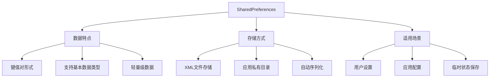

# 第15章：SharedPreferences轻量级存储

## 15.1 SharedPreferences基础概念

### 15.1.1 什么是SharedPreferences

SharedPreferences是Android提供的轻量级数据存储解决方案，用于保存应用的配置信息、用户偏好设置等简单的键值对数据。它以XML文件的形式存储在设备的私有存储空间中。



### 15.1.2 SharedPreferences的基本使用

```java
public class SharedPreferencesHelper {
    private Context context;
    private SharedPreferences sharedPreferences;
    private SharedPreferences.Editor editor;

    // 预定义的Preference文件名
    public static final String PREF_NAME = "app_preferences";
    public static final String USER_PREF_NAME = "user_settings";
    public static final String CONFIG_PREF_NAME = "app_config";

    public SharedPreferencesHelper(Context context) {
        this.context = context.getApplicationContext();
        this.sharedPreferences = this.context.getSharedPreferences(PREF_NAME, Context.MODE_PRIVATE);
        this.editor = this.sharedPreferences.edit();
    }

    // 获取指定名称的SharedPreferences
    public SharedPreferences getSharedPreferences(String prefName) {
        return context.getSharedPreferences(prefName, Context.MODE_PRIVATE);
    }

    // 保存字符串数据
    public void saveString(String key, String value) {
        editor.putString(key, value);
        editor.apply(); // 异步提交，推荐使用
    }

    // 保存整数数据
    public void saveInt(String key, int value) {
        editor.putInt(key, value);
        editor.apply();
    }

    // 保存布尔数据
    public void saveBoolean(String key, boolean value) {
        editor.putBoolean(key, value);
        editor.apply();
    }

    // 保存浮点数数据
    public void saveFloat(String key, float value) {
        editor.putFloat(key, value);
        editor.apply();
    }

    // 保存长整数数据
    public void saveLong(String key, long value) {
        editor.putLong(key, value);
        editor.apply();
    }

    // 保存字符串集合
    public void saveStringSet(String key, Set<String> values) {
        editor.putStringSet(key, values);
        editor.apply();
    }

    // 同步保存（不推荐，可能阻塞UI线程）
    public void saveStringSync(String key, String value) {
        editor.putString(key, value);
        editor.commit(); // 同步提交，会阻塞线程
    }

    // 读取字符串数据
    public String getString(String key, String defaultValue) {
        return sharedPreferences.getString(key, defaultValue);
    }

    // 读取整数数据
    public int getInt(String key, int defaultValue) {
        return sharedPreferences.getInt(key, defaultValue);
    }

    // 读取布尔数据
    public boolean getBoolean(String key, boolean defaultValue) {
        return sharedPreferences.getBoolean(key, defaultValue);
    }

    // 读取浮点数数据
    public float getFloat(String key, float defaultValue) {
        return sharedPreferences.getFloat(key, defaultValue);
    }

    // 读取长整数数据
    public long getLong(String key, long defaultValue) {
        return sharedPreferences.getLong(key, defaultValue);
    }

    // 读取字符串集合
    public Set<String> getStringSet(String key, Set<String> defaultValues) {
        return sharedPreferences.getStringSet(key, defaultValues);
    }

    // 检查键是否存在
    public boolean contains(String key) {
        return sharedPreferences.contains(key);
    }

    // 删除指定键的数据
    public void remove(String key) {
        editor.remove(key);
        editor.apply();
    }

    // 删除多个键的数据
    public void remove(String... keys) {
        for (String key : keys) {
            editor.remove(key);
        }
        editor.apply();
    }

    // 清空所有数据
    public void clear() {
        editor.clear();
        editor.apply();
    }

    // 获取所有键值对
    public Map<String, ?> getAll() {
        return sharedPreferences.getAll();
    }
}
```

### 15.1.3 SharedPreferences访问模式详解

```java
public class SharedPreferencesModes {
    private Context context;

    public SharedPreferencesModes(Context context) {
        this.context = context;
    }

    // MODE_PRIVATE - 私有模式（推荐）
    public void demonstratePrivateMode() {
        SharedPreferences prefs = context.getSharedPreferences("private_prefs", Context.MODE_PRIVATE);

        // 只能被当前应用访问，最安全的模式
        SharedPreferences.Editor editor = prefs.edit();
        editor.putString("private_key", "private_value");
        editor.apply();
    }

    // MODE_MULTI_PROCESS - 多进程模式（已废弃）
    @Deprecated
    public void demonstrateMultiProcessMode() {
        // 注意：MODE_MULTI_PROCESS在API 23+中已废弃
        // 在多进程中访问SharedPreferences可能导致数据不一致

        if (Build.VERSION.SDK_INT < Build.VERSION_CODES.M) {
            SharedPreferences prefs = context.getSharedPreferences("multi_process_prefs",
                Context.MODE_MULTI_PROCESS);

            // 在多进程间共享，但性能较差且可能不同步
            SharedPreferences.Editor editor = prefs.edit();
            editor.putString("multi_key", "multi_value");
            editor.apply();
        }
    }

    // MODE_APPEND - 追加模式（已废弃）
    @Deprecated
    public void demonstrateAppendMode() {
        // MODE_APPEND也已被废弃，不应再使用
        // 在MODE_PRIVATE模式下，新值会自动覆盖旧值
    }

    // 推荐的跨进程数据共享方案
    public void demonstrateCrossProcessDataSharing() {
        // 方案1：使用ContentProvider
        // 方案2：使用文件共享
        // 方案3：使用Messenger或AIDL
    }

    // 获取应用默认SharedPreferences
    public void getDefaultPreferences() {
        // 使用PreferenceManager.getDefaultSharedPreferences()
        // 会使用应用的包名作为文件名
        SharedPreferences defaultPrefs = PreferenceManager.getDefaultSharedPreferences(context);

        String theme = defaultPrefs.getString("app_theme", "light");
        boolean notificationsEnabled = defaultPrefs.getBoolean("notifications_enabled", true);
    }
}
```

## 15.2 数据类型支持和操作

### 15.2.1 支持的数据类型详解

```java
public class DataTypeDemo {
    private SharedPreferences prefs;
    private SharedPreferences.Editor editor;

    public DataTypeDemo(Context context) {
        this.prefs = context.getSharedPreferences("data_type_demo", Context.MODE_PRIVATE);
        this.editor = prefs.edit();
    }

    // 演示所有支持的数据类型
    public void demonstrateAllDataTypes() {
        // 1. 字符串类型
        editor.putString("string_key", "Hello, SharedPreferences!");

        // 2. 整数类型
        editor.putInt("int_key", 42);

        // 3. 布尔类型
        editor.putBoolean("boolean_key", true);

        // 4. 浮点数类型
        editor.putFloat("float_key", 3.14159f);

        // 5. 长整数类型
        editor.putLong("long_key", System.currentTimeMillis());

        // 6. 字符串集合类型（API 11+）
        Set<String> stringSet = new HashSet<>();
        stringSet.add("Apple");
        stringSet.add("Banana");
        stringSet.add("Orange");
        editor.putStringSet("string_set_key", stringSet);

        editor.apply();
    }

    // 读取所有数据类型
    public void readAllDataTypes() {
        // 读取时必须提供默认值
        String stringValue = prefs.getString("string_key", "default_string");
        int intValue = prefs.getInt("int_key", 0);
        boolean booleanValue = prefs.getBoolean("boolean_key", false);
        float floatValue = prefs.getFloat("float_key", 0.0f);
        long longValue = prefs.getLong("long_key", 0L);
        Set<String> stringSetValue = prefs.getStringSet("string_set_key", new HashSet<>());

        Log.d("DataTypeDemo", "String: " + stringValue);
        Log.d("DataTypeDemo", "Int: " + intValue);
        Log.d("DataTypeDemo", "Boolean: " + booleanValue);
        Log.d("DataTypeDemo", "Float: " + floatValue);
        Log.d("DataTypeDemo", "Long: " + longValue);
        Log.d("DataTypeDemo", "StringSet: " + stringSetValue.toString());
    }

    // 处理复杂数据类型
    public void handleComplexDataTypes() {
        // 1. 存储对象：使用JSON序列化
        User user = new User("张三", 25, "zhangsan@example.com");
        String userJson = serializeUserToJson(user);
        editor.putString("user_object", userJson);

        // 2. 存储数组：使用JSON或分隔符
        String[] stringArray = {"A", "B", "C", "D"};
        String arrayJson = new Gson().toJson(stringArray);
        editor.putString("string_array", arrayJson);

        // 3. 存储日期：使用时间戳
        Date currentDate = new Date();
        editor.putLong("current_date", currentDate.getTime());

        // 4. 存储枚举：使用名称或序号
        UserStatus status = UserStatus.ACTIVE;
        editor.putString("user_status", status.name());

        editor.apply();
    }

    // 从SharedPreferences中读取复杂数据类型
    public void readComplexDataTypes() {
        // 读取对象
        String userJson = prefs.getString("user_object", "{}");
        User user = deserializeUserFromJson(userJson);

        // 读取数组
        String arrayJson = prefs.getString("string_array", "[]");
        String[] stringArray = new Gson().fromJson(arrayJson, String[].class);

        // 读取日期
        long dateTimestamp = prefs.getLong("current_date", 0);
        Date date = new Date(dateTimestamp);

        // 读取枚举
        String statusName = prefs.getString("user_status", UserStatus.INACTIVE.name());
        UserStatus status = UserStatus.valueOf(statusName);
    }

    // 序列化用户对象为JSON
    private String serializeUserToJson(User user) {
        JSONObject jsonObject = new JSONObject();
        try {
            jsonObject.put("name", user.getName());
            jsonObject.put("age", user.getAge());
            jsonObject.put("email", user.getEmail());
            return jsonObject.toString();
        } catch (JSONException e) {
            Log.e("DataTypeDemo", "Failed to serialize user", e);
            return "{}";
        }
    }

    // 从JSON反序列化用户对象
    private User deserializeUserFromJson(String json) {
        try {
            JSONObject jsonObject = new JSONObject(json);
            String name = jsonObject.getString("name");
            int age = jsonObject.getInt("age");
            String email = jsonObject.getString("email");
            return new User(name, age, email);
        } catch (JSONException e) {
            Log.e("DataTypeDemo", "Failed to deserialize user", e);
            return new User("", 0, "");
        }
    }

    // 用户状态枚举
    public enum UserStatus {
        ACTIVE, INACTIVE, SUSPENDED
    }

    // 用户模型类
    public static class User {
        private String name;
        private int age;
        private String email;

        public User(String name, int age, String email) {
            this.name = name;
            this.age = age;
            this.email = email;
        }

        // getters
        public String getName() { return name; }
        public int getAge() { return age; }
        public String getEmail() { return email; }
    }
}
```

### 15.2.2 批量操作和事务处理

```java
public class BatchOperations {
    private SharedPreferences prefs;
    private SharedPreferences.Editor editor;

    public BatchOperations(Context context) {
        this.prefs = context.getSharedPreferences("batch_operations", Context.MODE_PRIVATE);
    }

    // 批量保存数据
    public void batchSave() {
        // 方法1：使用同一个Editor实例进行批量操作
        editor = prefs.edit();

        editor.putString("key1", "value1");
        editor.putInt("key2", 100);
        editor.putBoolean("key3", true);
        editor.putFloat("key4", 3.14f);
        editor.putLong("key5", System.currentTimeMillis());

        // 一次性提交所有更改
        editor.apply();
    }

    // 使用apply() vs commit()
    public void demonstrateApplyVsCommit() {
        // apply() - 异步提交，不阻塞UI线程，推荐使用
        editor.putString("async_key", "async_value");
        editor.apply(); // 立即返回，在后台线程执行写入操作

        // commit() - 同步提交，会阻塞调用线程，返回是否成功
        boolean success = editor.putString("sync_key", "sync_value").commit();
        Log.d("BatchOperations", "Commit result: " + success);
    }

    // 条件性批量保存
    public void conditionalBatchSave(Map<String, Object> dataMap) {
        editor = prefs.edit();

        for (Map.Entry<String, Object> entry : dataMap.entrySet()) {
            String key = entry.getKey();
            Object value = entry.getValue();

            // 根据值类型调用相应的put方法
            if (value instanceof String) {
                editor.putString(key, (String) value);
            } else if (value instanceof Integer) {
                editor.putInt(key, (Integer) value);
            } else if (value instanceof Boolean) {
                editor.putBoolean(key, (Boolean) value);
            } else if (value instanceof Float) {
                editor.putFloat(key, (Float) value);
            } else if (value instanceof Long) {
                editor.putLong(key, (Long) value);
            } else if (value instanceof Set) {
                // 类型检查确保是Set<String>
                Set<String> stringSet = (Set<String>) value;
                editor.putStringSet(key, stringSet);
            } else {
                // 对于复杂对象，转换为JSON字符串
                String jsonValue = convertToJson(value);
                editor.putString(key, jsonValue);
            }
        }

        editor.apply();
    }

    // 批量删除
    public void batchRemove(String... keys) {
        editor = prefs.edit();

        for (String key : keys) {
            if (prefs.contains(key)) {
                editor.remove(key);
                Log.d("BatchOperations", "Removed key: " + key);
            }
        }

        editor.apply();
    }

    // 批量删除满足条件的键
    public void batchRemoveByPattern(String pattern) {
        editor = prefs.edit();
        Map<String, ?> allPrefs = prefs.getAll();

        for (String key : allPrefs.keySet()) {
            if (key.matches(pattern)) {
                editor.remove(key);
                Log.d("BatchOperations", "Removed key by pattern: " + key);
            }
        }

        editor.apply();
    }

    // 事务性操作：原子性的数据更新
    public void atomicUpdate(String key, Object oldValue, Object newValue) {
        Object currentValue = getPrefValue(key);

        if (currentValue != null && currentValue.equals(oldValue)) {
            // 只有当前值与期望值相同时才更新
            setPrefValue(key, newValue);
            Log.d("BatchOperations", "Atomic update successful for key: " + key);
        } else {
            Log.w("BatchOperations", "Atomic update failed for key: " + key +
                  " (expected: " + oldValue + ", actual: " + currentValue + ")");
        }
    }

    // 获取Preference值（通用方法）
    private Object getPrefValue(String key) {
        Map<String, ?> allPrefs = prefs.getAll();
        return allPrefs.get(key);
    }

    // 设置Preference值（通用方法）
    private void setPrefValue(String key, Object value) {
        editor = prefs.edit();

        if (value instanceof String) {
            editor.putString(key, (String) value);
        } else if (value instanceof Integer) {
            editor.putInt(key, (Integer) value);
        } else if (value instanceof Boolean) {
            editor.putBoolean(key, (Boolean) value);
        } else if (value instanceof Float) {
            editor.putFloat(key, (Float) value);
        } else if (value instanceof Long) {
            editor.putLong(key, (Long) value);
        } else if (value instanceof Set) {
            editor.putStringSet(key, (Set<String>) value);
        }

        editor.apply();
    }

    // 将对象转换为JSON字符串
    private String convertToJson(Object value) {
        try {
            JSONObject jsonObject = new JSONObject();
            if (value instanceof Map) {
                Map<?, ?> map = (Map<?, ?>) value;
                for (Map.Entry<?, ?> entry : map.entrySet()) {
                    jsonObject.put(String.valueOf(entry.getKey()), entry.getValue());
                }
            } else {
                // 对于简单对象，使用toString()
                return value.toString();
            }
            return jsonObject.toString();
        } catch (JSONException e) {
            Log.e("BatchOperations", "Failed to convert to JSON", e);
            return "{}";
        }
    }
}
```

## 15.3 安全性考虑

### 15.3.1 敏感数据加密存储

```java
public class SecureSharedPreferences {
    private static final String TAG = "SecureSharedPreferences";
    private Context context;
    private SharedPreferences prefs;
    private EncryptionUtils encryptionUtils;

    public SecureSharedPreferences(Context context, String prefName) {
        this.context = context.getApplicationContext();
        this.prefs = context.getSharedPreferences(prefName, Context.MODE_PRIVATE);
        this.encryptionUtils = new EncryptionUtils(context);
    }

    // 加密保存字符串
    public void putSecureString(String key, String value) {
        try {
            String encryptedValue = encryptionUtils.encrypt(value);
            SharedPreferences.Editor editor = prefs.edit();
            editor.putString(key, encryptedValue);
            editor.apply();
        } catch (Exception e) {
            Log.e(TAG, "Failed to encrypt and save value", e);
        }
    }

    // 解密读取字符串
    public String getSecureString(String key, String defaultValue) {
        try {
            String encryptedValue = prefs.getString(key, null);
            if (encryptedValue == null) {
                return defaultValue;
            }
            return encryptionUtils.decrypt(encryptedValue);
        } catch (Exception e) {
            Log.e(TAG, "Failed to decrypt value", e);
            return defaultValue;
        }
    }

    // 加密保存用户认证信息
    public void saveUserCredentials(String username, String password, String token) {
        // 用户名可以明文保存，但密码和token必须加密
        SharedPreferences.Editor editor = prefs.edit();
        editor.putString("username", username);
        editor.apply();

        putSecureString("password", password);
        putSecureString("auth_token", token);
    }

    // 读取用户认证信息
    public UserCredentials getUserCredentials() {
        String username = prefs.getString("username", "");
        String password = getSecureString("password", "");
        String token = getSecureString("auth_token", "");

        return new UserCredentials(username, password, token);
    }

    // 保存API密钥
    public void saveApiKey(String apiKey) {
        putSecureString("api_key", apiKey);
    }

    // 读取API密钥
    public String getApiKey() {
        return getSecureString("api_key", "");
    }

    // 保存会话信息
    public void saveSessionInfo(SessionInfo sessionInfo) {
        try {
            // 将会话信息转换为JSON
            String sessionJson = new Gson().toJson(sessionInfo);
            putSecureString("session_info", sessionJson);
        } catch (Exception e) {
            Log.e(TAG, "Failed to save session info", e);
        }
    }

    // 读取会话信息
    public SessionInfo getSessionInfo() {
        try {
            String sessionJson = getSecureString("session_info", "");
            if (!sessionJson.isEmpty()) {
                return new Gson().fromJson(sessionJson, SessionInfo.class);
            }
        } catch (Exception e) {
            Log.e(TAG, "Failed to load session info", e);
        }
        return null;
    }

    // 清除敏感数据
    public void clearSensitiveData() {
        SharedPreferences.Editor editor = prefs.edit();
        editor.remove("password");
        editor.remove("auth_token");
        editor.remove("api_key");
        editor.remove("session_info");
        editor.apply();
    }

    // 用户凭据类
    public static class UserCredentials {
        private String username;
        private String password;
        private String authToken;

        public UserCredentials(String username, String password, String authToken) {
            this.username = username;
            this.password = password;
            this.authToken = authToken;
        }

        // getters
        public String getUsername() { return username; }
        public String getPassword() { return password; }
        public String getAuthToken() { return authToken; }
    }

    // 会话信息类
    public static class SessionInfo {
        private String sessionId;
        private long startTime;
        private long expirationTime;
        private boolean isActive;

        // getters and setters...
    }
}

// 加密工具类
class EncryptionUtils {
    private static final String TAG = "EncryptionUtils";
    private static final String ALGORITHM = "AES/CBC/PKCS5Padding";
    private static final String TRANSFORMATION = "AES";
    private static final String KEY_ALIAS = "SecurePrefsKey";

    private Context context;

    public EncryptionUtils(Context context) {
        this.context = context;
    }

    // 加密方法
    public String encrypt(String plaintext) throws Exception {
        if (Build.VERSION.SDK_INT >= Build.VERSION_CODES.M) {
            return encryptWithKeystore(plaintext);
        } else {
            return encryptWithKey(plaintext);
        }
    }

    // 解密方法
    public String decrypt(String ciphertext) throws Exception {
        if (Build.VERSION.SDK_INT >= Build.VERSION_CODES.M) {
            return decryptWithKeystore(ciphertext);
        } else {
            return decryptWithKey(ciphertext);
        }
    }

    // Android 6.0+ 使用Android Keystore
    private String encryptWithKeystore(String plaintext) throws Exception {
        try {
            KeyGenerator keyGenerator = KeyGenerator.getInstance(KeyProperties.KEY_ALGORITHM_AES, "AndroidKeyStore");
            KeyGenParameterSpec spec = new KeyGenParameterSpec.Builder(
                KEY_ALIAS,
                KeyProperties.PURPOSE_ENCRYPT | KeyProperties.PURPOSE_DECRYPT)
                .setBlockModes(KeyProperties.BLOCK_MODE_CBC)
                .setEncryptionPaddings(KeyProperties.ENCRYPTION_PADDING_PKCS7)
                .build();

            keyGenerator.init(spec);
            keyGenerator.generateKey();

            KeyStore keyStore = KeyStore.getInstance("AndroidKeyStore");
            keyStore.load(null);
            Key secretKey = keyStore.getKey(KEY_ALIAS, null);

            Cipher cipher = Cipher.getInstance(ALGORITHM);
            cipher.init(Cipher.ENCRYPT_MODE, secretKey);

            byte[] iv = cipher.getIV();
            byte[] ciphertext = cipher.doFinal(plaintext.getBytes());

            // 将IV和密文组合
            ByteBuffer byteBuffer = ByteBuffer.allocate(iv.length + ciphertext.length);
            byteBuffer.put(iv);
            byteBuffer.put(ciphertext);

            return Base64.encodeToString(byteBuffer.array(), Base64.DEFAULT);
        } catch (Exception e) {
            Log.e(TAG, "Keystore encryption failed", e);
            throw e;
        }
    }

    private String decryptWithKeystore(String ciphertext) throws Exception {
        try {
            byte[] data = Base64.decode(ciphertext, Base64.DEFAULT);
            ByteBuffer byteBuffer = ByteBuffer.wrap(data);

            byte[] iv = new byte[16]; // AES块大小
            byteBuffer.get(iv);
            byte[] encrypted = new byte[byteBuffer.remaining()];
            byteBuffer.get(encrypted);

            KeyStore keyStore = KeyStore.getInstance("AndroidKeyStore");
            keyStore.load(null);
            Key secretKey = keyStore.getKey(KEY_ALIAS, null);

            Cipher cipher = Cipher.getInstance(ALGORITHM);
            GCMParameterSpec spec = new GCMParameterSpec(128, iv);
            cipher.init(Cipher.DECRYPT_MODE, secretKey, spec);

            byte[] decrypted = cipher.doFinal(encrypted);
            return new String(decrypted);
        } catch (Exception e) {
            Log.e(TAG, "Keystore decryption failed", e);
            throw e;
        }
    }

    // Android 6.0以下使用固定密钥
    private String encryptWithKey(String plaintext) throws Exception {
        String key = generateDeviceSpecificKey();
        SecretKeySpec secretKey = new SecretKeySpec(key.getBytes(), TRANSFORMATION);

        Cipher cipher = Cipher.getInstance(ALGORITHM);
        cipher.init(Cipher.ENCRYPT_MODE, secretKey);

        byte[] iv = cipher.getIV();
        byte[] ciphertext = cipher.doFinal(plaintext.getBytes());

        ByteBuffer byteBuffer = ByteBuffer.allocate(iv.length + ciphertext.length);
        byteBuffer.put(iv);
        byteBuffer.put(ciphertext);

        return Base64.encodeToString(byteBuffer.array(), Base64.DEFAULT);
    }

    private String decryptWithKey(String ciphertext) throws Exception {
        String key = generateDeviceSpecificKey();
        SecretKeySpec secretKey = new SecretKeySpec(key.getBytes(), TRANSFORMATION);

        byte[] data = Base64.decode(ciphertext, Base64.DEFAULT);
        ByteBuffer byteBuffer = ByteBuffer.wrap(data);

        byte[] iv = new byte[16];
        byteBuffer.get(iv);
        byte[] encrypted = new byte[byteBuffer.remaining()];
        byteBuffer.get(encrypted);

        Cipher cipher = Cipher.getInstance(ALGORITHM);
        IvParameterSpec spec = new IvParameterSpec(iv);
        cipher.init(Cipher.DECRYPT_MODE, secretKey, spec);

        byte[] decrypted = cipher.doFinal(encrypted);
        return new String(decrypted);
    }

    // 生成设备特定的密钥
    private String generateDeviceSpecificKey() {
        String deviceId = Settings.Secure.getString(
            context.getContentResolver(),
            Settings.Secure.ANDROID_ID
        );

        // 使用设备ID和应用包名生成密钥
        String input = deviceId + context.getPackageName();

        try {
            MessageDigest digest = MessageDigest.getInstance("SHA-256");
            byte[] hash = digest.digest(input.getBytes());

            // 取前32个字符作为密钥
            return new String(hash, 0, 32).substring(0, 32);
        } catch (NoSuchAlgorithmException e) {
            // 降级方案：使用固定密钥
            return "DefaultSecureKey32Chars";
        }
    }
}
```

### 15.3.2 权限控制和访问安全

```java
public class SecureAccessManager {
    private Context context;
    private SharedPreferences securePrefs;
    private static final String SECURE_PREF_NAME = "secure_preferences";

    public SecureAccessManager(Context context) {
        this.context = context.getApplicationContext();
        this.securePrefs = context.getSharedPreferences(SECURE_PREF_NAME, Context.MODE_PRIVATE);
    }

    // 检查应用签名验证
    public boolean verifyAppSignature() {
        try {
            PackageInfo packageInfo = context.getPackageManager()
                .getPackageInfo(context.getPackageName(), PackageManager.GET_SIGNATURES);

            if (packageInfo.signatures != null && packageInfo.signatures.length > 0) {
                String storedSignature = securePrefs.getString("app_signature", "");
                String currentSignature = packageInfo.signatures[0].hashCode() + "";

                if (storedSignature.isEmpty()) {
                    // 首次安装，保存签名
                    securePrefs.edit().putString("app_signature", currentSignature).apply();
                    return true;
                } else {
                    // 验证签名是否匹配
                    return storedSignature.equals(currentSignature);
                }
            }
        } catch (PackageManager.NameNotFoundException e) {
            Log.e("SecureAccess", "Failed to verify app signature", e);
        }
        return false;
    }

    // 检查是否为调试模式
    public boolean isDebugMode() {
        return (0 != (context.getApplicationInfo().flags & ApplicationInfo.FLAG_DEBUGGABLE));
    }

    // 检查Root权限
    public boolean isRooted() {
        // 检查常见的Root相关文件
        String[] paths = {
            "/system/app/Superuser.apk",
            "/sbin/su",
            "/system/bin/su",
            "/system/xbin/su",
            "/data/local/xbin/su",
            "/data/local/bin/su",
            "/system/sd/xbin/su",
            "/system/bin/failsafe/su",
            "/data/local/su"
        };

        for (String path : paths) {
            if (new File(path).exists()) {
                return true;
            }
        }

        // 检查build tags
        String buildTags = android.os.Build.TAGS;
        return buildTags != null && buildTags.contains("test-keys");
    }

    // 安全性检查
    public boolean performSecurityCheck() {
        boolean signatureValid = verifyAppSignature();
        boolean notDebugMode = !isDebugMode();
        boolean notRooted = !isRooted();

        Log.d("SecureAccess", "Security check - Signature: " + signatureValid +
              ", Debug: " + !notDebugMode + ", Root: " + !notRooted);

        return signatureValid && notDebugMode && notRooted;
    }

    // 安全的数据访问控制
    public boolean canAccessSecureData() {
        if (!performSecurityCheck()) {
            Log.w("SecureAccess", "Security check failed, denying access");
            return false;
        }

        // 检查访问时间限制
        return checkAccessTimeRestriction();
    }

    // 检查访问时间限制
    private boolean checkAccessTimeRestriction() {
        long lastAccessTime = securePrefs.getLong("last_access_time", 0);
        long currentTime = System.currentTimeMillis();
        long minInterval = 5 * 60 * 1000; // 5分钟最小间隔

        if (currentTime - lastAccessTime < minInterval) {
            Log.w("SecureAccess", "Access too frequent, denied");
            return false;
        }

        // 更新最后访问时间
        securePrefs.edit().putLong("last_access_time", currentTime).apply();
        return true;
    }

    // 记录访问日志
    public void logAccess(String operation, boolean success) {
        String logEntry = String.format("%s: %s at %d - %s",
            operation,
            success ? "SUCCESS" : "FAILED",
            System.currentTimeMillis(),
            new Date().toString()
        );

        // 保存访问日志
        Set<String> accessLogs = securePrefs.getStringSet("access_logs", new HashSet<>());
        accessLogs.add(logEntry);

        // 保持最近100条日志
        if (accessLogs.size() > 100) {
            List<String> logList = new ArrayList<>(accessLogs);
            accessLogs.clear();
            accessLogs.addAll(logList.subList(logList.size() - 100, logList.size()));
        }

        securePrefs.edit().putStringSet("access_logs", accessLogs).apply();
    }

    // 获取访问日志
    public Set<String> getAccessLogs() {
        return securePrefs.getStringSet("access_logs", new HashSet<>());
    }

    // 清除访问日志
    public void clearAccessLogs() {
        securePrefs.edit().remove("access_logs").apply();
    }

    // 数据完整性检查
    public boolean verifyDataIntegrity(String key, String expectedChecksum) {
        String actualValue = securePrefs.getString(key, "");
        String actualChecksum = calculateChecksum(actualValue);

        return expectedChecksum.equals(actualChecksum);
    }

    // 计算数据校验和
    private String calculateChecksum(String data) {
        try {
            MessageDigest digest = MessageDigest.getInstance("SHA-256");
            byte[] hash = digest.digest(data.getBytes());
            return bytesToHex(hash);
        } catch (NoSuchAlgorithmException e) {
            Log.e("SecureAccess", "Failed to calculate checksum", e);
            return "";
        }
    }

    // 字节数组转十六进制字符串
    private String bytesToHex(byte[] bytes) {
        StringBuilder result = new StringBuilder();
        for (byte b : bytes) {
            result.append(String.format("%02x", b));
        }
        return result.toString();
    }

    // 安全的数据备份和恢复
    public boolean secureBackup(String key, String backupKey) {
        if (!canAccessSecureData()) {
            return false;
        }

        try {
            String value = securePrefs.getString(key, "");
            String checksum = calculateChecksum(value);

            // 备份数据和校验和
            securePrefs.edit()
                .putString(backupKey, value)
                .putString(backupKey + "_checksum", checksum)
                .apply();

            logAccess("BACKUP_" + key, true);
            return true;
        } catch (Exception e) {
            Log.e("SecureAccess", "Backup failed", e);
            logAccess("BACKUP_" + key, false);
            return false;
        }
    }

    // 安全的数据恢复
    public boolean secureRestore(String key, String backupKey) {
        if (!canAccessSecureData()) {
            return false;
        }

        try {
            String backupValue = securePrefs.getString(backupKey, "");
            String expectedChecksum = securePrefs.getString(backupKey + "_checksum", "");
            String actualChecksum = calculateChecksum(backupValue);

            if (!expectedChecksum.equals(actualChecksum)) {
                Log.e("SecureAccess", "Data integrity check failed during restore");
                return false;
            }

            // 恢复数据
            securePrefs.edit().putString(key, backupValue).apply();

            logAccess("RESTORE_" + key, true);
            return true;
        } catch (Exception e) {
            Log.e("SecureAccess", "Restore failed", e);
            logAccess("RESTORE_" + key, false);
            return false;
        }
    }
}
```

## 15.4 实际应用场景

### 15.4.1 用户偏好设置管理

```java
public class UserPreferencesManager {
    private static final String PREF_NAME = "user_preferences";
    private SharedPreferences prefs;
    private Context context;

    // 偏好设置键名
    public static final String KEY_THEME = "app_theme";
    public static final String KEY_LANGUAGE = "app_language";
    public static final String KEY_FONT_SIZE = "font_size";
    public static final String KEY_NOTIFICATIONS_ENABLED = "notifications_enabled";
    public static final String KEY_SOUND_ENABLED = "sound_enabled";
    public static final String KEY_VIBRATION_ENABLED = "vibration_enabled";
    public static final String KEY_AUTO_SYNC = "auto_sync_enabled";
    public static final String KEY_WIFI_ONLY = "wifi_only_sync";
    public static final String KEY_NIGHT_MODE = "night_mode";
    public static final String KEY_STARTUP_PAGE = "startup_page";

    // 主题类型
    public enum ThemeType {
        LIGHT("light", R.style.Theme_AppTheme_Light),
        DARK("dark", R.style.Theme_AppTheme_Dark),
        AUTO("auto", R.style.Theme_AppTheme);

        private String value;
        private int styleRes;

        ThemeType(String value, int styleRes) {
            this.value = value;
            this.styleRes = styleRes;
        }

        public String getValue() { return value; }
        public int getStyleRes() { return styleRes; }

        public static ThemeType fromValue(String value) {
            for (ThemeType theme : values()) {
                if (theme.value.equals(value)) {
                    return theme;
                }
            }
            return LIGHT; // 默认值
        }
    }

    // 语言类型
    public enum LanguageType {
        SYSTEM("system", "zh"),
        CHINESE("zh", "zh"),
        ENGLISH("en", "en");

        private String code;
        private String localeCode;

        LanguageType(String code, String localeCode) {
            this.code = code;
            this.localeCode = localeCode;
        }

        public String getCode() { return code; }
        public String getLocaleCode() { return localeCode; }

        public static LanguageType fromCode(String code) {
            for (LanguageType lang : values()) {
                if (lang.code.equals(code)) {
                    return lang;
                }
            }
            return SYSTEM;
        }
    }

    public UserPreferencesManager(Context context) {
        this.context = context.getApplicationContext();
        this.prefs = this.context.getSharedPreferences(PREF_NAME, Context.MODE_PRIVATE);
    }

    // 主题设置
    public void setTheme(ThemeType theme) {
        prefs.edit().putString(KEY_THEME, theme.getValue()).apply();
        applyTheme(theme);
    }

    public ThemeType getTheme() {
        String themeValue = prefs.getString(KEY_THEME, ThemeType.LIGHT.getValue());
        return ThemeType.fromValue(themeValue);
    }

    private void applyTheme(ThemeType theme) {
        // 应用主题到当前Activity
        if (context instanceof Activity) {
            ((Activity) context).setTheme(theme.getStyleRes());
        }
    }

    // 语言设置
    public void setLanguage(LanguageType language) {
        prefs.edit().putString(KEY_LANGUAGE, language.getCode()).apply();
        applyLanguage(language);
    }

    public LanguageType getLanguage() {
        String languageCode = prefs.getString(KEY_LANGUAGE, LanguageType.SYSTEM.getCode());
        return LanguageType.fromCode(languageCode);
    }

    private void applyLanguage(LanguageType language) {
        Locale locale;
        if (language == LanguageType.SYSTEM) {
            locale = Resources.getSystem().getConfiguration().locale;
        } else {
            locale = new Locale(language.getLocaleCode());
        }

        Locale.setDefault(locale);

        Configuration config = new Configuration();
        config.setLocale(locale);
        context.getResources().updateConfiguration(config, context.getResources().getDisplayMetrics());
    }

    // 字体大小设置
    public void setFontSize(float fontSize) {
        prefs.edit().putFloat(KEY_FONT_SIZE, fontSize).apply();
    }

    public float getFontSize() {
        return prefs.getFloat(KEY_FONT_SIZE, 1.0f); // 默认1.0倍大小
    }

    // 通知设置
    public void setNotificationsEnabled(boolean enabled) {
        prefs.edit().putBoolean(KEY_NOTIFICATIONS_ENABLED, enabled).apply();

        if (enabled) {
            enableNotifications();
        } else {
            disableNotifications();
        }
    }

    public boolean isNotificationsEnabled() {
        return prefs.getBoolean(KEY_NOTIFICATIONS_ENABLED, true);
    }

    private void enableNotifications() {
        // 启用通知渠道
        if (Build.VERSION.SDK_INT >= Build.VERSION_CODES.O) {
            NotificationManager notificationManager =
                (NotificationManager) context.getSystemService(Context.NOTIFICATION_SERVICE);

            NotificationChannel channel = new NotificationChannel(
                "default",
                "默认通知",
                NotificationManager.IMPORTANCE_DEFAULT
            );
            notificationManager.createNotificationChannel(channel);
        }
    }

    private void disableNotifications() {
        // 禁用通知（实际可能需要取消现有的通知）
        NotificationManager notificationManager =
            (NotificationManager) context.getSystemService(Context.NOTIFICATION_SERVICE);
        notificationManager.cancelAll();
    }

    // 声音设置
    public void setSoundEnabled(boolean enabled) {
        prefs.edit().putBoolean(KEY_SOUND_ENABLED, enabled).apply();
    }

    public boolean isSoundEnabled() {
        return prefs.getBoolean(KEY_SOUND_ENABLED, true);
    }

    // 震动设置
    public void setVibrationEnabled(boolean enabled) {
        prefs.edit().putBoolean(KEY_VIBRATION_ENABLED, enabled).apply();
    }

    public boolean isVibrationEnabled() {
        return prefs.getBoolean(KEY_VIBRATION_ENABLED, true);
    }

    // 自动同步设置
    public void setAutoSyncEnabled(boolean enabled) {
        prefs.edit().putBoolean(KEY_AUTO_SYNC, enabled).apply();

        if (enabled) {
            enableAutoSync();
        } else {
            disableAutoSync();
        }
    }

    public boolean isAutoSyncEnabled() {
        return prefs.getBoolean(KEY_AUTO_SYNC, true);
    }

    private void enableAutoSync() {
        // 启用自动同步
        // 可能涉及到启动同步服务或设置WorkManager任务
    }

    private void disableAutoSync() {
        // 禁用自动同步
        // 取消同步任务
    }

    // 仅WiFi同步设置
    public void setWifiOnlySync(boolean wifiOnly) {
        prefs.edit().putBoolean(KEY_WIFI_ONLY, wifiOnly).apply();
    }

    public boolean isWifiOnlySync() {
        return prefs.getBoolean(KEY_WIFI_ONLY, false);
    }

    // 夜间模式设置
    public void setNightMode(boolean enabled) {
        prefs.edit().putBoolean(KEY_NIGHT_MODE, enabled).apply();

        if (Build.VERSION.SDK_INT >= Build.VERSION_CODES.P) {
            AppCompatDelegate.setDefaultNightMode(
                enabled ? AppCompatDelegate.MODE_NIGHT_YES : AppCompatDelegate.MODE_NIGHT_NO
            );
        }
    }

    public boolean isNightMode() {
        return prefs.getBoolean(KEY_NIGHT_MODE, false);
    }

    // 启动页面设置
    public void setStartupPage(String page) {
        prefs.edit().putString(KEY_STARTUP_PAGE, page).apply();
    }

    public String getStartupPage() {
        return prefs.getString(KEY_STARTUP_PAGE, "home");
    }

    // 批量设置用户偏好
    public void setUserPreferences(UserPreferences preferences) {
        SharedPreferences.Editor editor = prefs.edit();

        editor.putString(KEY_THEME, preferences.getTheme().getValue());
        editor.putString(KEY_LANGUAGE, preferences.getLanguage().getCode());
        editor.putFloat(KEY_FONT_SIZE, preferences.getFontSize());
        editor.putBoolean(KEY_NOTIFICATIONS_ENABLED, preferences.isNotificationsEnabled());
        editor.putBoolean(KEY_SOUND_ENABLED, preferences.isSoundEnabled());
        editor.putBoolean(KEY_VIBRATION_ENABLED, preferences.isVibrationEnabled());
        editor.putBoolean(KEY_AUTO_SYNC, preferences.isAutoSyncEnabled());
        editor.putBoolean(KEY_WIFI_ONLY, preferences.isWifiOnlySync());
        editor.putBoolean(KEY_NIGHT_MODE, preferences.isNightMode());
        editor.putString(KEY_STARTUP_PAGE, preferences.getStartupPage());

        editor.apply();
    }

    // 获取所有用户偏好
    public UserPreferences getAllPreferences() {
        UserPreferences preferences = new UserPreferences();

        preferences.setTheme(getTheme());
        preferences.setLanguage(getLanguage());
        preferences.setFontSize(getFontSize());
        preferences.setNotificationsEnabled(isNotificationsEnabled());
        preferences.setSoundEnabled(isSoundEnabled());
        preferences.setVibrationEnabled(isVibrationEnabled());
        preferences.setAutoSyncEnabled(isAutoSyncEnabled());
        preferences.setWifiOnlySync(isWifiOnlySync());
        preferences.setNightMode(isNightMode());
        preferences.setStartupPage(getStartupPage());

        return preferences;
    }

    // 重置所有设置为默认值
    public void resetToDefaults() {
        SharedPreferences.Editor editor = prefs.edit();

        editor.putString(KEY_THEME, ThemeType.LIGHT.getValue());
        editor.putString(KEY_LANGUAGE, LanguageType.SYSTEM.getCode());
        editor.putFloat(KEY_FONT_SIZE, 1.0f);
        editor.putBoolean(KEY_NOTIFICATIONS_ENABLED, true);
        editor.putBoolean(KEY_SOUND_ENABLED, true);
        editor.putBoolean(KEY_VIBRATION_ENABLED, true);
        editor.putBoolean(KEY_AUTO_SYNC, true);
        editor.putBoolean(KEY_WIFI_ONLY, false);
        editor.putBoolean(KEY_NIGHT_MODE, false);
        editor.putString(KEY_STARTUP_PAGE, "home");

        editor.apply();
    }

    // 导出用户偏好设置
    public String exportPreferences() {
        JSONObject json = new JSONObject();
        try {
            json.put(KEY_THEME, getTheme().getValue());
            json.put(KEY_LANGUAGE, getLanguage().getCode());
            json.put(KEY_FONT_SIZE, getFontSize());
            json.put(KEY_NOTIFICATIONS_ENABLED, isNotificationsEnabled());
            json.put(KEY_SOUND_ENABLED, isSoundEnabled());
            json.put(KEY_VIBRATION_ENABLED, isVibrationEnabled());
            json.put(KEY_AUTO_SYNC, isAutoSyncEnabled());
            json.put(KEY_WIFI_ONLY, isWifiOnlySync());
            json.put(KEY_NIGHT_MODE, isNightMode());
            json.put(KEY_STARTUP_PAGE, getStartupPage());

            return json.toString();
        } catch (JSONException e) {
            Log.e("UserPreferences", "Failed to export preferences", e);
            return "";
        }
    }

    // 导入用户偏好设置
    public boolean importPreferences(String jsonStr) {
        try {
            JSONObject json = new JSONObject(jsonStr);
            SharedPreferences.Editor editor = prefs.edit();

            if (json.has(KEY_THEME)) {
                editor.putString(KEY_THEME, json.getString(KEY_THEME));
            }
            if (json.has(KEY_LANGUAGE)) {
                editor.putString(KEY_LANGUAGE, json.getString(KEY_LANGUAGE));
            }
            if (json.has(KEY_FONT_SIZE)) {
                editor.putFloat(KEY_FONT_SIZE, (float) json.getDouble(KEY_FONT_SIZE));
            }
            if (json.has(KEY_NOTIFICATIONS_ENABLED)) {
                editor.putBoolean(KEY_NOTIFICATIONS_ENABLED, json.getBoolean(KEY_NOTIFICATIONS_ENABLED));
            }
            if (json.has(KEY_SOUND_ENABLED)) {
                editor.putBoolean(KEY_SOUND_ENABLED, json.getBoolean(KEY_SOUND_ENABLED));
            }
            if (json.has(KEY_VIBRATION_ENABLED)) {
                editor.putBoolean(KEY_VIBRATION_ENABLED, json.getBoolean(KEY_VIBRATION_ENABLED));
            }
            if (json.has(KEY_AUTO_SYNC)) {
                editor.putBoolean(KEY_AUTO_SYNC, json.getBoolean(KEY_AUTO_SYNC));
            }
            if (json.has(KEY_WIFI_ONLY)) {
                editor.putBoolean(KEY_WIFI_ONLY, json.getBoolean(KEY_WIFI_ONLY));
            }
            if (json.has(KEY_NIGHT_MODE)) {
                editor.putBoolean(KEY_NIGHT_MODE, json.getBoolean(KEY_NIGHT_MODE));
            }
            if (json.has(KEY_STARTUP_PAGE)) {
                editor.putString(KEY_STARTUP_PAGE, json.getString(KEY_STARTUP_PAGE));
            }

            editor.apply();
            return true;
        } catch (JSONException e) {
            Log.e("UserPreferences", "Failed to import preferences", e);
            return false;
        }
    }

    // 用户偏好设置数据类
    public static class UserPreferences {
        private ThemeType theme = ThemeType.LIGHT;
        private LanguageType language = LanguageType.SYSTEM;
        private float fontSize = 1.0f;
        private boolean notificationsEnabled = true;
        private boolean soundEnabled = true;
        private boolean vibrationEnabled = true;
        private boolean autoSyncEnabled = true;
        private boolean wifiOnlySync = false;
        private boolean nightMode = false;
        private String startupPage = "home";

        // getters and setters
        public ThemeType getTheme() { return theme; }
        public void setTheme(ThemeType theme) { this.theme = theme; }

        public LanguageType getLanguage() { return language; }
        public void setLanguage(LanguageType language) { this.language = language; }

        public float getFontSize() { return fontSize; }
        public void setFontSize(float fontSize) { this.fontSize = fontSize; }

        public boolean isNotificationsEnabled() { return notificationsEnabled; }
        public void setNotificationsEnabled(boolean notificationsEnabled) { this.notificationsEnabled = notificationsEnabled; }

        public boolean isSoundEnabled() { return soundEnabled; }
        public void setSoundEnabled(boolean soundEnabled) { this.soundEnabled = soundEnabled; }

        public boolean isVibrationEnabled() { return vibrationEnabled; }
        public void setVibrationEnabled(boolean vibrationEnabled) { this.vibrationEnabled = vibrationEnabled; }

        public boolean isAutoSyncEnabled() { return autoSyncEnabled; }
        public void setAutoSyncEnabled(boolean autoSyncEnabled) { this.autoSyncEnabled = autoSyncEnabled; }

        public boolean isWifiOnlySync() { return wifiOnlySync; }
        public void setWifiOnlySync(boolean wifiOnlySync) { this.wifiOnlySync = wifiOnlySync; }

        public boolean isNightMode() { return nightMode; }
        public void setNightMode(boolean nightMode) { this.nightMode = nightMode; }

        public String getStartupPage() { return startupPage; }
        public void setStartupPage(String startupPage) { this.startupPage = startupPage; }
    }
}
```

### 15.4.2 应用配置管理

```java
public class AppConfigurationManager {
    private static final String PREF_NAME = "app_configuration";
    private SharedPreferences prefs;
    private Context context;

    // 配置键名
    public static final String KEY_APP_VERSION = "app_version";
    public static final String KEY_FIRST_LAUNCH = "first_launch_time";
    public static final String KEY_LAST_LAUNCH = "last_launch_time";
    public static final String KEY_LAUNCH_COUNT = "launch_count";
    public static final String KEY_SERVER_URL = "server_url";
    public static final String KEY_API_VERSION = "api_version";
    public static final String KEY_CACHE_SIZE = "cache_size";
    public static final String KEY_DEBUG_MODE = "debug_mode";
    public static final String KEY_LOG_LEVEL = "log_level";
    public static final String KEY_CRASH_REPORTING = "crash_reporting";
    public static final String KEY_ANALYTICS_ENABLED = "analytics_enabled";

    public AppConfigurationManager(Context context) {
        this.context = context.getApplicationContext();
        this.prefs = this.context.getSharedPreferences(PREF_NAME, Context.MODE_PRIVATE);
    }

    // 应用版本管理
    public void updateAppVersion() {
        try {
            PackageInfo packageInfo = context.getPackageManager()
                .getPackageInfo(context.getPackageName(), 0);
            String currentVersion = packageInfo.versionName;
            int currentVersionCode = packageInfo.versionCode;

            String storedVersion = prefs.getString(KEY_APP_VERSION, "");
            int storedVersionCode = prefs.getInt(KEY_APP_VERSION + "_code", 0);

            prefs.edit()
                .putString(KEY_APP_VERSION, currentVersion)
                .putInt(KEY_APP_VERSION + "_code", currentVersionCode)
                .apply();

            // 检查版本更新
            if (currentVersionCode > storedVersionCode) {
                onAppVersionUpdated(storedVersion, currentVersion, storedVersionCode, currentVersionCode);
            }

        } catch (PackageManager.NameNotFoundException e) {
            Log.e("AppConfig", "Failed to get app version", e);
        }
    }

    public String getAppVersion() {
        return prefs.getString(KEY_APP_VERSION, "1.0.0");
    }

    public int getAppVersionCode() {
        return prefs.getInt(KEY_APP_VERSION + "_code", 1);
    }

    private void onAppVersionUpdated(String oldVersion, String newVersion, int oldCode, int newCode) {
        Log.i("AppConfig", "App updated from " + oldVersion + " (" + oldCode + ") to " +
              newVersion + " (" + newCode + ")");

        // 执行版本更新后的操作
        performVersionUpdateTasks(oldCode, newCode);
    }

    private void performVersionUpdateTasks(int oldVersionCode, int newVersionCode) {
        // 根据版本号执行不同的更新任务
        if (oldVersionCode < 10 && newVersionCode >= 10) {
            // 版本10的特殊更新任务
            migrateDataForVersion10();
        }

        if (oldVersionCode < 20 && newVersionCode >= 20) {
            // 版本20的特殊更新任务
            updateConfigurationForVersion20();
        }
    }

    private void migrateDataForVersion10() {
        // 数据迁移逻辑
        Log.d("AppConfig", "Performing data migration for version 10");
    }

    private void updateConfigurationForVersion20() {
        // 配置更新逻辑
        Log.d("AppConfig", "Updating configuration for version 20");
    }

    // 启动统计
    public void recordAppLaunch() {
        long currentTime = System.currentTimeMillis();
        long lastLaunchTime = prefs.getLong(KEY_LAST_LAUNCH, 0);
        int launchCount = prefs.getInt(KEY_LAUNCH_COUNT, 0);

        // 首次启动
        if (lastLaunchTime == 0) {
            prefs.edit().putLong(KEY_FIRST_LAUNCH, currentTime).apply();
        }

        // 更新启动信息
        prefs.edit()
            .putLong(KEY_LAST_LAUNCH, currentTime)
            .putInt(KEY_LAUNCH_COUNT, launchCount + 1)
            .apply();

        Log.d("AppConfig", "App launched, count: " + (launchCount + 1));
    }

    public long getFirstLaunchTime() {
        return prefs.getLong(KEY_FIRST_LAUNCH, 0);
    }

    public long getLastLaunchTime() {
        return prefs.getLong(KEY_LAST_LAUNCH, 0);
    }

    public int getLaunchCount() {
        return prefs.getInt(KEY_LAUNCH_COUNT, 0);
    }

    // 服务器配置
    public void setServerUrl(String serverUrl) {
        prefs.edit().putString(KEY_SERVER_URL, serverUrl).apply();
    }

    public String getServerUrl() {
        String defaultUrl = "https://api.example.com";
        String savedUrl = prefs.getString(KEY_SERVER_URL, defaultUrl);

        // 验证URL格式
        if (!isValidUrl(savedUrl)) {
            Log.w("AppConfig", "Invalid server URL, using default: " + savedUrl);
            return defaultUrl;
        }

        return savedUrl;
    }

    private boolean isValidUrl(String url) {
        try {
            new URL(url);
            return true;
        } catch (MalformedURLException e) {
            return false;
        }
    }

    public void setApiVersion(String apiVersion) {
        prefs.edit().putString(KEY_API_VERSION, apiVersion).apply();
    }

    public String getApiVersion() {
        return prefs.getString(KEY_API_VERSION, "v1");
    }

    // 缓存配置
    public void setCacheSize(long sizeInBytes) {
        prefs.edit().putLong(KEY_CACHE_SIZE, sizeInBytes).apply();
    }

    public long getCacheSize() {
        return prefs.getLong(KEY_CACHE_SIZE, 50 * 1024 * 1024); // 默认50MB
    }

    public String getFormattedCacheSize() {
        long size = getCacheSize();
        return formatFileSize(size);
    }

    private String formatFileSize(long size) {
        if (size < 1024) {
            return size + " B";
        } else if (size < 1024 * 1024) {
            return String.format("%.1f KB", size / 1024.0);
        } else if (size < 1024 * 1024 * 1024) {
            return String.format("%.1f MB", size / (1024.0 * 1024));
        } else {
            return String.format("%.1f GB", size / (1024.0 * 1024 * 1024));
        }
    }

    // 调试配置
    public void setDebugMode(boolean enabled) {
        prefs.edit().putBoolean(KEY_DEBUG_MODE, enabled).apply();
    }

    public boolean isDebugMode() {
        return prefs.getBoolean(KEY_DEBUG_MODE, BuildConfig.DEBUG);
    }

    public void setLogLevel(String level) {
        prefs.edit().putString(KEY_LOG_LEVEL, level).apply();
    }

    public String getLogLevel() {
        return prefs.getString(KEY_LOG_LEVEL, isDebugMode() ? "DEBUG" : "INFO");
    }

    // 崩溃报告配置
    public void setCrashReportingEnabled(boolean enabled) {
        prefs.edit().putBoolean(KEY_CRASH_REPORTING, enabled).apply();
    }

    public boolean isCrashReportingEnabled() {
        return prefs.getBoolean(KEY_CRASH_REPORTING, !isDebugMode());
    }

    // 分析配置
    public void setAnalyticsEnabled(boolean enabled) {
        prefs.edit().putBoolean(KEY_ANALYTICS_ENABLED, enabled).apply();
    }

    public boolean isAnalyticsEnabled() {
        return prefs.getBoolean(KEY_ANALYTICS_ENABLED, true);
    }

    // 获取完整的配置信息
    public AppConfiguration getConfiguration() {
        AppConfiguration config = new AppConfiguration();

        config.setAppVersion(getAppVersion());
        config.setAppVersionCode(getAppVersionCode());
        config.setFirstLaunchTime(getFirstLaunchTime());
        config.setLastLaunchTime(getLastLaunchTime());
        config.setLaunchCount(getLaunchCount());
        config.setServerUrl(getServerUrl());
        config.setApiVersion(getApiVersion());
        config.setCacheSize(getCacheSize());
        config.setDebugMode(isDebugMode());
        config.setLogLevel(getLogLevel());
        config.setCrashReportingEnabled(isCrashReportingEnabled());
        config.setAnalyticsEnabled(isAnalyticsEnabled());

        return config;
    }

    // 重置配置
    public void resetConfiguration() {
        SharedPreferences.Editor editor = prefs.edit();

        editor.remove(KEY_SERVER_URL);
        editor.remove(KEY_API_VERSION);
        editor.remove(KEY_CACHE_SIZE);
        editor.remove(KEY_DEBUG_MODE);
        editor.remove(KEY_LOG_LEVEL);
        editor.remove(KEY_CRASH_REPORTING);
        editor.remove(KEY_ANALYTICS_ENABLED);

        editor.apply();

        Log.i("AppConfig", "Configuration reset to defaults");
    }

    // 导出配置
    public String exportConfiguration() {
        JSONObject json = new JSONObject();
        try {
            json.put(KEY_APP_VERSION, getAppVersion());
            json.put(KEY_SERVER_URL, getServerUrl());
            json.put(KEY_API_VERSION, getApiVersion());
            json.put(KEY_CACHE_SIZE, getCacheSize());
            json.put(KEY_DEBUG_MODE, isDebugMode());
            json.put(KEY_LOG_LEVEL, getLogLevel());
            json.put(KEY_CRASH_REPORTING, isCrashReportingEnabled());
            json.put(KEY_ANALYTICS_ENABLED, isAnalyticsEnabled());

            return json.toString();
        } catch (JSONException e) {
            Log.e("AppConfig", "Failed to export configuration", e);
            return "";
        }
    }

    // 应用配置数据类
    public static class AppConfiguration {
        private String appVersion;
        private int appVersionCode;
        private long firstLaunchTime;
        private long lastLaunchTime;
        private int launchCount;
        private String serverUrl;
        private String apiVersion;
        private long cacheSize;
        private boolean debugMode;
        private String logLevel;
        private boolean crashReportingEnabled;
        private boolean analyticsEnabled;

        // getters and setters
        public String getAppVersion() { return appVersion; }
        public void setAppVersion(String appVersion) { this.appVersion = appVersion; }

        public int getAppVersionCode() { return appVersionCode; }
        public void setAppVersionCode(int appVersionCode) { this.appVersionCode = appVersionCode; }

        public long getFirstLaunchTime() { return firstLaunchTime; }
        public void setFirstLaunchTime(long firstLaunchTime) { this.firstLaunchTime = firstLaunchTime; }

        public long getLastLaunchTime() { return lastLaunchTime; }
        public void setLastLaunchTime(long lastLaunchTime) { this.lastLaunchTime = lastLaunchTime; }

        public int getLaunchCount() { return launchCount; }
        public void setLaunchCount(int launchCount) { this.launchCount = launchCount; }

        public String getServerUrl() { return serverUrl; }
        public void setServerUrl(String serverUrl) { this.serverUrl = serverUrl; }

        public String getApiVersion() { return apiVersion; }
        public void setApiVersion(String apiVersion) { this.apiVersion = apiVersion; }

        public long getCacheSize() { return cacheSize; }
        public void setCacheSize(long cacheSize) { this.cacheSize = cacheSize; }

        public boolean isDebugMode() { return debugMode; }
        public void setDebugMode(boolean debugMode) { this.debugMode = debugMode; }

        public String getLogLevel() { return logLevel; }
        public void setLogLevel(String logLevel) { this.logLevel = logLevel; }

        public boolean isCrashReportingEnabled() { return crashReportingEnabled; }
        public void setCrashReportingEnabled(boolean crashReportingEnabled) { this.crashReportingEnabled = crashReportingEnabled; }

        public boolean isAnalyticsEnabled() { return analyticsEnabled; }
        public void setAnalyticsEnabled(boolean analyticsEnabled) { this.analyticsEnabled = analyticsEnabled; }
    }
}
```

## 本章小结

本章详细介绍了Android中SharedPreferences轻量级存储的各个方面：

### 核心知识点：

1. **基础概念**：SharedPreferences的特点、存储方式和适用场景
2. **数据类型**：支持的基本数据类型和复杂数据的处理方法
3. **访问模式**：不同的访问模式和安全性考虑
4. **安全性**：数据加密、权限控制和访问安全
5. **实际应用**：用户偏好设置和应用配置管理

### 学习要点：

- 理解SharedPreferences的适用场景和限制
- 掌握不同数据类型的存储和读取方法
- 学会处理复杂数据类型的序列化和反序列化
- 了解SharedPreferences的安全风险和防护措施
- 熟悉实际开发中的应用场景和最佳实践

### 实践技能：

- 设计合理的数据存储结构
- 实现安全的敏感数据存储
- 处理批量操作和事务性更新
- 构建完整的配置管理系统

通过本章的学习，开发者应该能够熟练使用SharedPreferences实现Android应用的轻量级数据存储需求，构建出用户友好且安全可靠的配置管理系统。同时要注意数据安全性和性能优化，确保应用在各种场景下的稳定运行。