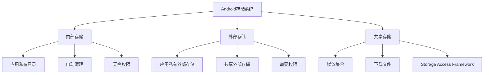

# 第16章：文件系统和存储访问

## 16.1 Android存储系统概述

### 16.1.1 存储类型和架构

Android提供了多种存储选项，每种都有其特定的用途和访问限制。理解这些存储类型对于开发高质量的Android应用至关重要。



### 16.1.2 存储路径详解

```java
public class StoragePathsManager {
    private Context context;

    public StoragePathsManager(Context context) {
        this.context = context.getApplicationContext();
    }

    // 获取内部存储路径
    public void showInternalStoragePaths() {
        // 应用内部存储根目录
        File internalDir = context.getFilesDir();
        Log.d("StoragePaths", "Internal files dir: " + internalDir.getAbsolutePath());

        // 缓存目录
        File cacheDir = context.getCacheDir();
        Log.d("StoragePaths", "Internal cache dir: " + cacheDir.getAbsolutePath());

        // 代码缓存目录
        File codeCacheDir = context.getCodeCacheDir();
        if (Build.VERSION.SDK_INT >= Build.VERSION_CODES.LOLLIPOP) {
            Log.d("StoragePaths", "Code cache dir: " + codeCacheDir.getAbsolutePath());
        }
    }

    // 获取外部存储路径
    public void showExternalStoragePaths() {
        // 应用私有外部存储目录
        File externalFilesDir = context.getExternalFilesDir(null);
        if (externalFilesDir != null) {
            Log.d("StoragePaths", "External files dir: " + externalFilesDir.getAbsolutePath());
        }

        // 特定类型的外部存储目录
        File picturesDir = context.getExternalFilesDir(Environment.DIRECTORY_PICTURES);
        File moviesDir = context.getExternalFilesDir(Environment.DIRECTORY_MOVIES);
        File musicDir = context.getExternalFilesDir(Environment.DIRECTORY_MUSIC);
        File downloadsDir = context.getExternalFilesDir(Environment.DIRECTORY_DOWNLOADS);

        Log.d("StoragePaths", "Pictures dir: " + (picturesDir != null ? picturesDir.getAbsolutePath() : "null"));
        Log.d("StoragePaths", "Movies dir: " + (moviesDir != null ? moviesDir.getAbsolutePath() : "null"));
        Log.d("StoragePaths", "Music dir: " + (musicDir != null ? musicDir.getAbsolutePath() : "null"));
        Log.d("StoragePaths", "Downloads dir: " + (downloadsDir != null ? downloadsDir.getAbsolutePath() : "null"));

        // 外部缓存目录
        File externalCacheDir = context.getExternalCacheDir();
        if (externalCacheDir != null) {
            Log.d("StoragePaths", "External cache dir: " + externalCacheDir.getAbsolutePath());
        }
    }

    // 获取公共存储路径
    public void showPublicStoragePaths() {
        // 公共存储根目录
        File externalStorage = Environment.getExternalStorageDirectory();
        Log.d("StoragePaths", "External storage root: " + externalStorage.getAbsolutePath());

        // 公共下载目录
        File publicDownloads = Environment.getExternalStoragePublicDirectory(Environment.DIRECTORY_DOWNLOADS);
        Log.d("StoragePaths", "Public downloads: " + publicDownloads.getAbsolutePath());

        // 公共图片目录
        File publicPictures = Environment.getExternalStoragePublicDirectory(Environment.DIRECTORY_PICTURES);
        Log.d("StoragePaths", "Public pictures: " + publicPictures.getAbsolutePath());

        // 公共文档目录
        File publicDocuments = Environment.getExternalStoragePublicDirectory(Environment.DIRECTORY_DOCUMENTS);
        Log.d("StoragePaths", "Public documents: " + publicDocuments.getAbsolutePath());
    }

    // 检查存储状态
    public void checkStorageStatus() {
        // 检查外部存储状态
        String externalState = Environment.getExternalStorageState();
        Log.d("StoragePaths", "External storage state: " + externalState);

        boolean isExternalAvailable = Environment.getExternalStorageState().equals(Environment.MEDIA_MOUNTED);
        boolean isExternalReadable = Environment.getExternalStorageState().equals(Environment.MEDIA_MOUNTED_READ_ONLY);

        Log.d("StoragePaths", "External storage available: " + isExternalAvailable);
        Log.d("StoragePaths", "External storage read-only: " + isExternalReadable);

        // 检查特定目录的可用性
        checkDirectoryAvailability(context.getExternalFilesDir(null));
        checkDirectoryAvailability(context.getExternalCacheDir());
    }

    private void checkDirectoryAvailability(File directory) {
        if (directory != null) {
            boolean exists = directory.exists();
            boolean canRead = directory.canRead();
            boolean canWrite = directory.canWrite();

            Log.d("StoragePaths", "Directory: " + directory.getAbsolutePath() +
                  " - Exists: " + exists + ", Read: " + canRead + ", Write: " + canWrite);
        } else {
            Log.d("StoragePaths", "Directory is null");
        }
    }

    // 获取存储空间信息
    public void getStorageSpaceInfo() {
        // 内部存储空间
        File internalDir = context.getFilesDir();
        long internalTotal = internalDir.getTotalSpace();
        long internalFree = internalDir.getFreeSpace();
        long internalUsed = internalTotal - internalFree;

        Log.d("StoragePaths", "Internal storage:");
        Log.d("StoragePaths", "  Total: " + formatFileSize(internalTotal));
        Log.d("StoragePaths", "  Used: " + formatFileSize(internalUsed));
        Log.d("StoragePaths", "  Free: " + formatFileSize(internalFree));

        // 外部存储空间
        File externalDir = Environment.getExternalStorageDirectory();
        if (externalDir != null) {
            long externalTotal = externalDir.getTotalSpace();
            long externalFree = externalDir.getFreeSpace();
            long externalUsed = externalTotal - externalFree;

            Log.d("StoragePaths", "External storage:");
            Log.d("StoragePaths", "  Total: " + formatFileSize(externalTotal));
            Log.d("StoragePaths", "  Used: " + formatFileSize(externalUsed));
            Log.d("StoragePaths", "  Free: " + formatFileSize(externalFree));
        }
    }

    private String formatFileSize(long size) {
        if (size < 1024) {
            return size + " B";
        } else if (size < 1024 * 1024) {
            return String.format("%.1f KB", size / 1024.0);
        } else if (size < 1024 * 1024 * 1024) {
            return String.format("%.1f MB", size / (1024.0 * 1024));
        } else {
            return String.format("%.1f GB", size / (1024.0 * 1024 * 1024));
        }
    }
}
```

## 16.2 内部存储操作

### 16.2.1 基本文件操作

```java
public class InternalStorageManager {
    private Context context;

    public InternalStorageManager(Context context) {
        this.context = context.getApplicationContext();
    }

    // 保存文件到内部存储
    public boolean saveFile(String filename, String content) {
        try {
            // 获取内部存储目录
            File filesDir = context.getFilesDir();
            File file = new File(filesDir, filename);

            // 写入文件
            FileOutputStream fos = new FileOutputStream(file);
            fos.write(content.getBytes());
            fos.close();

            Log.d("InternalStorage", "File saved successfully: " + file.getAbsolutePath());
            return true;

        } catch (IOException e) {
            Log.e("InternalStorage", "Failed to save file: " + filename, e);
            return false;
        }
    }

    // 读取内部存储文件
    public String readFile(String filename) {
        try {
            File file = new File(context.getFilesDir(), filename);

            if (!file.exists()) {
                Log.w("InternalStorage", "File does not exist: " + filename);
                return null;
            }

            FileInputStream fis = new FileInputStream(file);
            StringBuilder content = new StringBuilder();

            byte[] buffer = new byte[1024];
            int bytesRead;
            while ((bytesRead = fis.read(buffer)) != -1) {
                content.append(new String(buffer, 0, bytesRead));
            }

            fis.close();
            return content.toString();

        } catch (IOException e) {
            Log.e("InternalStorage", "Failed to read file: " + filename, e);
            return null;
        }
    }

    // 删除内部存储文件
    public boolean deleteFile(String filename) {
        File file = new File(context.getFilesDir(), filename);
        boolean deleted = file.delete();

        if (deleted) {
            Log.d("InternalStorage", "File deleted: " + filename);
        } else {
            Log.w("InternalStorage", "Failed to delete file: " + filename);
        }

        return deleted;
    }

    // 检查文件是否存在
    public boolean fileExists(String filename) {
        File file = new File(context.getFilesDir(), filename);
        return file.exists();
    }

    // 获取文件大小
    public long getFileSize(String filename) {
        File file = new File(context.getFilesDir(), filename);
        return file.exists() ? file.length() : 0;
    }

    // 获取所有文件列表
    public List<String> getAllFiles() {
        List<String> fileList = new ArrayList<>();
        File filesDir = context.getFilesDir();

        if (filesDir != null && filesDir.exists()) {
            File[] files = filesDir.listFiles();
            if (files != null) {
                for (File file : files) {
                    if (file.isFile()) {
                        fileList.add(file.getName());
                    }
                }
            }
        }

        return fileList;
    }

    // 获取目录大小
    public long getDirectorySize() {
        File filesDir = context.getFilesDir();
        return getDirectorySize(filesDir);
    }

    private long getDirectorySize(File directory) {
        long size = 0;

        if (directory != null && directory.exists()) {
            File[] files = directory.listFiles();
            if (files != null) {
                for (File file : files) {
                    if (file.isDirectory()) {
                        size += getDirectorySize(file);
                    } else {
                        size += file.length();
                    }
                }
            }
        }

        return size;
    }

    // 清空所有文件
    public boolean clearAllFiles() {
        File filesDir = context.getFilesDir();
        boolean success = true;

        if (filesDir != null && filesDir.exists()) {
            File[] files = filesDir.listFiles();
            if (files != null) {
                for (File file : files) {
                    if (!file.delete()) {
                        success = false;
                        Log.w("InternalStorage", "Failed to delete file: " + file.getName());
                    }
                }
            }
        }

        return success;
    }

    // 使用Context的文件操作方法
    public void demonstrateContextFileOperations() {
        // 使用openFileOutput写入文件
        try (FileOutputStream fos = context.openFileOutput("context_file.txt", Context.MODE_PRIVATE)) {
            String content = "Hello from Context file operations!";
            fos.write(content.getBytes());
            Log.d("InternalStorage", "File saved using Context method");
        } catch (IOException e) {
            Log.e("InternalStorage", "Failed to save file using Context", e);
        }

        // 使用openFileInput读取文件
        try (FileInputStream fis = context.openFileInput("context_file.txt")) {
            StringBuilder content = new StringBuilder();
            byte[] buffer = new byte[1024];
            int bytesRead;
            while ((bytesRead = fis.read(buffer)) != -1) {
                content.append(new String(buffer, 0, bytesRead));
            }
            Log.d("InternalStorage", "File content: " + content.toString());
        } catch (IOException e) {
            Log.e("InternalStorage", "Failed to read file using Context", e);
        }

        // 删除文件
        boolean deleted = context.deleteFile("context_file.txt");
        Log.d("InternalStorage", "File deleted using Context method: " + deleted);
    }

    // 不同的文件模式
    public void demonstrateFileModes() {
        // MODE_PRIVATE - 默认模式，私有访问
        try (FileOutputStream fos = context.openFileOutput("private_file.txt", Context.MODE_PRIVATE)) {
            fos.write("Private content".getBytes());
        } catch (IOException e) {
            Log.e("InternalStorage", "MODE_PRIVATE failed", e);
        }

        // MODE_APPEND - 追加模式
        try (FileOutputStream fos = context.openFileOutput("append_file.txt", Context.MODE_APPEND)) {
            fos.write("First line\n".getBytes());
        } catch (IOException e) {
            Log.e("InternalStorage", "MODE_APPEND first write failed", e);
        }

        try (FileOutputStream fos = context.openFileOutput("append_file.txt", Context.MODE_APPEND)) {
            fos.write("Second line\n".getBytes());
        } catch (IOException e) {
            Log.e("InternalStorage", "MODE_APPEND second write failed", e);
        }

        // MODE_WORLD_READABLE 和 MODE_WORLD_WRITEABLE 已废弃
        // 在API 17+中，这些模式会抛出SecurityException
    }
}
```

### 16.2.2 缓存文件管理

```java
public class CacheManager {
    private Context context;

    public CacheManager(Context context) {
        this.context = context.getApplicationContext();
    }

    // 保存缓存文件
    public boolean saveToCache(String filename, byte[] data) {
        try {
            File cacheFile = new File(context.getCacheDir(), filename);
            FileOutputStream fos = new FileOutputStream(cacheFile);
            fos.write(data);
            fos.close();

            Log.d("CacheManager", "Cache file saved: " + cacheFile.getAbsolutePath());
            return true;

        } catch (IOException e) {
            Log.e("CacheManager", "Failed to save cache file: " + filename, e);
            return false;
        }
    }

    // 读取缓存文件
    public byte[] readFromCache(String filename) {
        try {
            File cacheFile = new File(context.getCacheDir(), filename);

            if (!cacheFile.exists()) {
                return null;
            }

            FileInputStream fis = new FileInputStream(cacheFile);
            ByteArrayOutputStream bos = new ByteArrayOutputStream();

            byte[] buffer = new byte[1024];
            int bytesRead;
            while ((bytesRead = fis.read(buffer)) != -1) {
                bos.write(buffer, 0, bytesRead);
            }

            fis.close();
            return bos.toByteArray();

        } catch (IOException e) {
            Log.e("CacheManager", "Failed to read cache file: " + filename, e);
            return null;
        }
    }

    // 保存字符串到缓存
    public boolean saveStringToCache(String filename, String content) {
        return saveToCache(filename, content.getBytes());
    }

    // 从缓存读取字符串
    public String readStringFromCache(String filename) {
        byte[] data = readFromCache(filename);
        return data != null ? new String(data) : null;
    }

    // 获取缓存大小
    public long getCacheSize() {
        return getCacheSize(context.getCacheDir());
    }

    private long getCacheSize(File cacheDir) {
        long size = 0;

        if (cacheDir != null && cacheDir.exists()) {
            File[] files = cacheDir.listFiles();
            if (files != null) {
                for (File file : files) {
                    if (file.isDirectory()) {
                        size += getDirectorySize(file);
                    } else {
                        size += file.length();
                    }
                }
            }
        }

        return size;
    }

    private long getDirectorySize(File directory) {
        long size = 0;
        File[] files = directory.listFiles();
        if (files != null) {
            for (File file : files) {
                if (file.isDirectory()) {
                    size += getDirectorySize(file);
                } else {
                    size += file.length();
                }
            }
        }
        return size;
    }

    // 清理缓存
    public void clearCache() {
        clearCache(context.getCacheDir());
        Log.d("CacheManager", "Cache cleared");
    }

    private void clearCache(File cacheDir) {
        if (cacheDir != null && cacheDir.exists()) {
            File[] files = cacheDir.listFiles();
            if (files != null) {
                for (File file : files) {
                    if (file.isDirectory()) {
                        clearCache(file);
                        file.delete();
                    } else {
                        file.delete();
                    }
                }
            }
        }
    }

    // 清理过期缓存
    public void clearExpiredCache(long maxAgeMs) {
        long currentTime = System.currentTimeMillis();
        clearExpiredCache(context.getCacheDir(), currentTime, maxAgeMs);
    }

    private void clearExpiredCache(File cacheDir, long currentTime, long maxAgeMs) {
        if (cacheDir != null && cacheDir.exists()) {
            File[] files = cacheDir.listFiles();
            if (files != null) {
                for (File file : files) {
                    if (file.isDirectory()) {
                        clearExpiredCache(file, currentTime, maxAgeMs);
                        if (file.listFiles() == null || file.listFiles().length == 0) {
                            file.delete();
                        }
                    } else {
                        long fileAge = currentTime - file.lastModified();
                        if (fileAge > maxAgeMs) {
                            file.delete();
                            Log.d("CacheManager", "Deleted expired cache file: " + file.getName());
                        }
                    }
                }
            }
        }
    }

    // 清理指定大小的缓存
    public void clearCacheToSize(long targetSize) {
        long currentSize = getCacheSize();
        if (currentSize <= targetSize) {
            return;
        }

        File[] files = context.getCacheDir().listFiles();
        if (files == null) return;

        // 按修改时间排序，删除最旧的文件
        Arrays.sort(files, (f1, f2) -> Long.compare(f1.lastModified(), f2.lastModified()));

        for (File file : files) {
            if (currentSize <= targetSize) {
                break;
            }

            long fileSize = file.length();
            if (file.delete()) {
                currentSize -= fileSize;
                Log.d("CacheManager", "Deleted cache file to reduce size: " + file.getName());
            }
        }
    }

    // 获取缓存统计信息
    public CacheStatistics getCacheStatistics() {
        CacheStatistics stats = new CacheStatistics();
        File cacheDir = context.getCacheDir();

        if (cacheDir != null && cacheDir.exists()) {
            File[] files = cacheDir.listFiles();
            if (files != null) {
                for (File file : files) {
                    if (file.isFile()) {
                        stats.fileCount++;
                        stats.totalSize += file.length();
                        stats.oldestFileTime = Math.min(stats.oldestFileTime, file.lastModified());
                        stats.newestFileTime = Math.max(stats.newestFileTime, file.lastModified());
                    } else if (file.isDirectory()) {
                        stats.directoryCount++;
                        DirectoryStatistics dirStats = getDirectoryStatistics(file);
                        stats.fileCount += dirStats.fileCount;
                        stats.totalSize += dirStats.totalSize;
                        stats.oldestFileTime = Math.min(stats.oldestFileTime, dirStats.oldestFileTime);
                        stats.newestFileTime = Math.max(stats.newestFileTime, dirStats.newestFileTime);
                    }
                }
            }
        }

        return stats;
    }

    private DirectoryStatistics getDirectoryStatistics(File directory) {
        DirectoryStatistics stats = new DirectoryStatistics();
        stats.oldestFileTime = Long.MAX_VALUE;

        File[] files = directory.listFiles();
        if (files != null) {
            for (File file : files) {
                if (file.isFile()) {
                    stats.fileCount++;
                    stats.totalSize += file.length();
                    stats.oldestFileTime = Math.min(stats.oldestFileTime, file.lastModified());
                    stats.newestFileTime = Math.max(stats.newestFileTime, file.lastModified());
                } else if (file.isDirectory()) {
                    DirectoryStatistics subStats = getDirectoryStatistics(file);
                    stats.fileCount += subStats.fileCount;
                    stats.totalSize += subStats.totalSize;
                    stats.oldestFileTime = Math.min(stats.oldestFileTime, subStats.oldestFileTime);
                    stats.newestFileTime = Math.max(stats.newestFileTime, subStats.newestFileTime);
                }
            }
        }

        return stats;
    }

    // 智能缓存管理
    public void smartCacheCleanup() {
        CacheStatistics stats = getCacheStatistics();
        long maxCacheSize = 50 * 1024 * 1024; // 50MB
        long maxAge = 7 * 24 * 60 * 60 * 1000; // 7天

        Log.d("CacheManager", "Cache stats - Files: " + stats.fileCount +
              ", Size: " + formatFileSize(stats.totalSize));

        // 如果缓存超过大小限制，清理到目标大小
        if (stats.totalSize > maxCacheSize) {
            long targetSize = (long) (maxCacheSize * 0.8); // 清理到80%
            clearCacheToSize(targetSize);
        }

        // 清理过期文件
        clearExpiredCache(maxAge);

        Log.d("CacheManager", "Smart cache cleanup completed");
    }

    private String formatFileSize(long size) {
        if (size < 1024) {
            return size + " B";
        } else if (size < 1024 * 1024) {
            return String.format("%.1f KB", size / 1024.0);
        } else if (size < 1024 * 1024 * 1024) {
            return String.format("%.1f MB", size / (1024.0 * 1024));
        } else {
            return String.format("%.1f GB", size / (1024.0 * 1024 * 1024));
        }
    }

    // 缓存统计信息类
    public static class CacheStatistics {
        public int fileCount = 0;
        public int directoryCount = 0;
        public long totalSize = 0;
        public long oldestFileTime = Long.MAX_VALUE;
        public long newestFileTime = 0;

        public String getFormattedTotalSize() {
            if (totalSize < 1024) {
                return totalSize + " B";
            } else if (totalSize < 1024 * 1024) {
                return String.format("%.1f KB", totalSize / 1024.0);
            } else if (totalSize < 1024 * 1024 * 1024) {
                return String.format("%.1f MB", totalSize / (1024.0 * 1024));
            } else {
                return String.format("%.1f GB", totalSize / (1024.0 * 1024 * 1024));
            }
        }

        public String getOldestFileDate() {
            if (oldestFileTime == Long.MAX_VALUE) {
                return "N/A";
            }
            return new Date(oldestFileTime).toString();
        }

        public String getNewestFileDate() {
            if (newestFileTime == 0) {
                return "N/A";
            }
            return new Date(newestFileTime).toString();
        }
    }

    private static class DirectoryStatistics {
        public int fileCount = 0;
        public long totalSize = 0;
        public long oldestFileTime = Long.MAX_VALUE;
        public long newestFileTime = 0;
    }
}
```

## 16.3 外部存储操作

### 16.3.1 外部存储权限和状态检查

```java
public class ExternalStorageManager {
    private Context context;

    public ExternalStorageManager(Context context) {
        this.context = context.getApplicationContext();
    }

    // 检查外部存储权限
    public boolean checkStoragePermission() {
        if (Build.VERSION.SDK_INT >= Build.VERSION_CODES.M) {
            return ContextCompat.checkSelfPermission(context, Manifest.permission.WRITE_EXTERNAL_STORAGE)
                   == PackageManager.PERMISSION_GRANTED;
        }
        return true; // Android 6.0以下默认有权限
    }

    // 请求存储权限
    public void requestStoragePermission(Activity activity, int requestCode) {
        if (Build.VERSION.SDK_INT >= Build.VERSION_CODES.M) {
            if (ContextCompat.checkSelfPermission(activity, Manifest.permission.WRITE_EXTERNAL_STORAGE)
                    != PackageManager.PERMISSION_GRANTED) {

                // 检查是否需要显示权限说明
                if (ActivityCompat.shouldShowRequestPermissionRationale(activity,
                        Manifest.permission.WRITE_EXTERNAL_STORAGE)) {

                    // 显示权限说明对话框
                    new AlertDialog.Builder(activity)
                        .setTitle("需要存储权限")
                        .setMessage("应用需要访问外部存储来保存文件，请授予权限。")
                        .setPositiveButton("授予权限", (dialog, which) -> {
                            ActivityCompat.requestPermissions(activity,
                                new String[]{Manifest.permission.WRITE_EXTERNAL_STORAGE},
                                requestCode);
                        })
                        .setNegativeButton("取消", null)
                        .show();
                } else {
                    // 直接请求权限
                    ActivityCompat.requestPermissions(activity,
                        new String[]{Manifest.permission.WRITE_EXTERNAL_STORAGE},
                        requestCode);
                }
            }
        }
    }

    // 检查外部存储状态
    public boolean isExternalStorageAvailable() {
        String state = Environment.getExternalStorageState();
        return Environment.MEDIA_MOUNTED.equals(state);
    }

    public boolean isExternalStorageReadable() {
        String state = Environment.getExternalStorageState();
        return Environment.MEDIA_MOUNTED.equals(state) ||
               Environment.MEDIA_MOUNTED_READ_ONLY.equals(state);
    }

    // 获取详细的存储状态信息
    public String getStorageStateInfo() {
        String state = Environment.getExternalStorageState();
        String stateDescription;

        switch (state) {
            case Environment.MEDIA_MOUNTED:
                stateDescription = "已挂载 - 可读写";
                break;
            case Environment.MEDIA_MOUNTED_READ_ONLY:
                stateDescription = "只读挂载 - 只能读取";
                break;
            case Environment.MEDIA_UNMOUNTED:
                stateDescription = "未挂载";
                break;
            case Environment.MEDIA_REMOVED:
                stateDescription = "已移除";
                break;
            case Environment.MEDIA_SHARED:
                stateDescription = "共享中";
                break;
            case Environment.MEDIA_BAD_REMOVAL:
                stateDescription = "异常移除";
                break;
            case Environment.MEDIA_UNMOUNTABLE:
                stateDescription = "无法挂载";
                break;
            default:
                stateDescription = "未知状态: " + state;
                break;
        }

        return stateDescription;
    }

    // 获取外部存储路径
    public File getExternalStorageDir(String type) {
        if (!isExternalStorageAvailable()) {
            Log.w("ExternalStorage", "External storage not available");
            return null;
        }

        return context.getExternalFilesDir(type);
    }

    // 获取特定类型的存储目录
    public void demonstrateExternalStorageDirs() {
        // 获取应用的外部存储根目录
        File externalFilesDir = context.getExternalFilesDir(null);
        Log.d("ExternalStorage", "External files dir: " +
              (externalFilesDir != null ? externalFilesDir.getAbsolutePath() : "null"));

        // 获取特定类型的外部存储目录
        String[] dirTypes = {
            Environment.DIRECTORY_PICTURES,
            Environment.DIRECTORY_MOVIES,
            Environment.DIRECTORY_MUSIC,
            Environment.DIRECTORY_DOWNLOADS,
            Environment.DIRECTORY_DOCUMENTS,
            Environment.DIRECTORY_PODCASTS,
            Environment.DIRECTORY_RINGTONES,
            Environment.DIRECTORY_ALARMS,
            Environment.DIRECTORY_NOTIFICATIONS
        };

        for (String dirType : dirTypes) {
            File dir = context.getExternalFilesDir(dirType);
            Log.d("ExternalStorage", dirType + " dir: " +
                  (dir != null ? dir.getAbsolutePath() : "null"));
        }
    }

    // 创建外部存储目录
    public boolean createExternalDirectory(String dirName) {
        if (!isExternalStorageAvailable()) {
            Log.e("ExternalStorage", "External storage not available");
            return false;
        }

        File dir = new File(context.getExternalFilesDir(null), dirName);
        if (!dir.exists()) {
            boolean created = dir.mkdirs();
            if (created) {
                Log.d("ExternalStorage", "Directory created: " + dir.getAbsolutePath());
            } else {
                Log.e("ExternalStorage", "Failed to create directory: " + dir.getAbsolutePath());
            }
            return created;
        }

        Log.d("ExternalStorage", "Directory already exists: " + dir.getAbsolutePath());
        return true;
    }

    // 保存文件到外部存储
    public boolean saveToExternalStorage(String dirName, String filename, byte[] data) {
        if (!isExternalStorageAvailable()) {
            Log.e("ExternalStorage", "External storage not available");
            return false;
        }

        try {
            File dir = context.getExternalFilesDir(dirName);
            if (dir == null) {
                Log.e("ExternalStorage", "Cannot get external directory: " + dirName);
                return false;
            }

            if (!dir.exists() && !dir.mkdirs()) {
                Log.e("ExternalStorage", "Cannot create directory: " + dir.getAbsolutePath());
                return false;
            }

            File file = new File(dir, filename);
            FileOutputStream fos = new FileOutputStream(file);
            fos.write(data);
            fos.close();

            Log.d("ExternalStorage", "File saved to external storage: " + file.getAbsolutePath());
            return true;

        } catch (IOException e) {
            Log.e("ExternalStorage", "Failed to save file to external storage", e);
            return false;
        }
    }

    // 从外部存储读取文件
    public byte[] readFromExternalStorage(String dirName, String filename) {
        if (!isExternalStorageReadable()) {
            Log.e("ExternalStorage", "External storage not readable");
            return null;
        }

        try {
            File dir = context.getExternalFilesDir(dirName);
            if (dir == null) {
                Log.e("ExternalStorage", "Cannot get external directory: " + dirName);
                return null;
            }

            File file = new File(dir, filename);
            if (!file.exists()) {
                Log.w("ExternalStorage", "File does not exist: " + file.getAbsolutePath());
                return null;
            }

            FileInputStream fis = new FileInputStream(file);
            ByteArrayOutputStream bos = new ByteArrayOutputStream();

            byte[] buffer = new byte[1024];
            int bytesRead;
            while ((bytesRead = fis.read(buffer)) != -1) {
                bos.write(buffer, 0, bytesRead);
            }

            fis.close();
            return bos.toByteArray();

        } catch (IOException e) {
            Log.e("ExternalStorage", "Failed to read file from external storage", e);
            return null;
        }
    }

    // 删除外部存储文件
    public boolean deleteExternalFile(String dirName, String filename) {
        if (!isExternalStorageAvailable()) {
            Log.e("ExternalStorage", "External storage not available");
            return false;
        }

        File dir = context.getExternalFilesDir(dirName);
        if (dir == null) {
            Log.e("ExternalStorage", "Cannot get external directory: " + dirName);
            return false;
        }

        File file = new File(dir, filename);
        boolean deleted = file.delete();

        if (deleted) {
            Log.d("ExternalStorage", "File deleted: " + file.getAbsolutePath());
        } else {
            Log.w("ExternalStorage", "Failed to delete file: " + file.getAbsolutePath());
        }

        return deleted;
    }

    // 获取外部存储空间信息
    public ExternalStorageInfo getExternalStorageInfo() {
        ExternalStorageInfo info = new ExternalStorageInfo();

        if (isExternalStorageAvailable()) {
            File externalDir = Environment.getExternalStorageDirectory();
            if (externalDir != null) {
                info.totalSpace = externalDir.getTotalSpace();
                info.freeSpace = externalDir.getFreeSpace();
                info.usableSpace = externalDir.getUsableSpace();
                info.usedSpace = info.totalSpace - info.freeSpace;
                info.isAvailable = true;
                info.isWritable = !Environment.getExternalStorageState()
                                      .equals(Environment.MEDIA_MOUNTED_READ_ONLY);
            }
        } else {
            info.isAvailable = false;
            info.isWritable = false;
        }

        return info;
    }

    // 外部存储信息类
    public static class ExternalStorageInfo {
        public boolean isAvailable;
        public boolean isWritable;
        public long totalSpace;
        public long freeSpace;
        public long usableSpace;
        public long usedSpace;

        public String getFormattedTotalSpace() {
            return formatFileSize(totalSpace);
        }

        public String getFormattedFreeSpace() {
            return formatFileSize(freeSpace);
        }

        public String getFormattedUsedSpace() {
            return formatFileSize(usedSpace);
        }

        public double getUsagePercentage() {
            if (totalSpace == 0) return 0;
            return (double) usedSpace / totalSpace * 100;
        }

        private String formatFileSize(long size) {
            if (size < 1024) {
                return size + " B";
            } else if (size < 1024 * 1024) {
                return String.format("%.1f KB", size / 1024.0);
            } else if (size < 1024 * 1024 * 1024) {
                return String.format("%.1f MB", size / (1024.0 * 1024));
            } else {
                return String.format("%.1f GB", size / (1024.0 * 1024 * 1024));
            }
        }
    }
}
```

### 16.3.2 媒体文件处理

```java
public class MediaFileManager {
    private Context context;

    public MediaFileManager(Context context) {
        this.context = context.getApplicationContext();
    }

    // 保存图片到外部存储
    public Uri saveImageToExternalStorage(Bitmap bitmap, String filename) {
        if (!isExternalStorageAvailable()) {
            Log.e("MediaFileManager", "External storage not available");
            return null;
        }

        try {
            // 获取图片目录
            File picturesDir = context.getExternalFilesDir(Environment.DIRECTORY_PICTURES);
            if (picturesDir == null) {
                Log.e("MediaFileManager", "Cannot get pictures directory");
                return null;
            }

            // 创建目录
            if (!picturesDir.exists() && !picturesDir.mkdirs()) {
                Log.e("MediaFileManager", "Cannot create pictures directory");
                return null;
            }

            // 保存图片
            File imageFile = new File(picturesDir, filename);
            FileOutputStream fos = new FileOutputStream(imageFile);
            bitmap.compress(Bitmap.CompressFormat.JPEG, 90, fos);
            fos.close();

            // 通知媒体扫描器
            Uri uri = Uri.fromFile(imageFile);
            notifyMediaScanner(uri);

            Log.d("MediaFileManager", "Image saved: " + imageFile.getAbsolutePath());
            return uri;

        } catch (IOException e) {
            Log.e("MediaFileManager", "Failed to save image", e);
            return null;
        }
    }

    // 从外部存储加载图片
    public Bitmap loadImageFromExternalStorage(String filename) {
        if (!isExternalStorageReadable()) {
            Log.e("MediaFileManager", "External storage not readable");
            return null;
        }

        try {
            File picturesDir = context.getExternalFilesDir(Environment.DIRECTORY_PICTURES);
            if (picturesDir == null) {
                Log.e("MediaFileManager", "Cannot get pictures directory");
                return null;
            }

            File imageFile = new File(picturesDir, filename);
            if (!imageFile.exists()) {
                Log.w("MediaFileManager", "Image file does not exist: " + filename);
                return null;
            }

            // 加载图片，考虑内存优化
            BitmapFactory.Options options = new BitmapFactory.Options();
            options.inJustDecodeBounds = true;
            BitmapFactory.decodeFile(imageFile.getAbsolutePath(), options);

            // 计算合适的采样率
            options.inSampleSize = calculateInSampleSize(options, 800, 600);
            options.inJustDecodeBounds = false;

            Bitmap bitmap = BitmapFactory.decodeFile(imageFile.getAbsolutePath(), options);
            Log.d("MediaFileManager", "Image loaded: " + filename);
            return bitmap;

        } catch (Exception e) {
            Log.e("MediaFileManager", "Failed to load image: " + filename, e);
            return null;
        }
    }

    // 计算图片采样率
    private int calculateInSampleSize(BitmapFactory.Options options, int reqWidth, int reqHeight) {
        // 原始图片的宽高
        final int height = options.outHeight;
        final int width = options.outWidth;
        int inSampleSize = 1;

        if (height > reqHeight || width > reqWidth) {
            final int halfHeight = height / 2;
            final int halfWidth = width / 2;

            // 计算最大的采样率，保持宽高比
            while ((halfHeight / inSampleSize) >= reqHeight &&
                   (halfWidth / inSampleSize) >= reqWidth) {
                inSampleSize *= 2;
            }
        }

        return inSampleSize;
    }

    // 保存视频文件
    public Uri saveVideoToExternalStorage(String videoPath, String filename) {
        if (!isExternalStorageAvailable()) {
            Log.e("MediaFileManager", "External storage not available");
            return null;
        }

        try {
            File moviesDir = context.getExternalFilesDir(Environment.DIRECTORY_MOVIES);
            if (moviesDir == null) {
                Log.e("MediaFileManager", "Cannot get movies directory");
                return null;
            }

            if (!moviesDir.exists() && !moviesDir.mkdirs()) {
                Log.e("MediaFileManager", "Cannot create movies directory");
                return null;
            }

            File sourceFile = new File(videoPath);
            File destFile = new File(moviesDir, filename);

            // 复制文件
            copyFile(sourceFile, destFile);

            // 通知媒体扫描器
            Uri uri = Uri.fromFile(destFile);
            notifyMediaScanner(uri);

            Log.d("MediaFileManager", "Video saved: " + destFile.getAbsolutePath());
            return uri;

        } catch (IOException e) {
            Log.e("MediaFileManager", "Failed to save video", e);
            return null;
        }
    }

    // 保存音频文件
    public Uri saveAudioToExternalStorage(String audioPath, String filename) {
        if (!isExternalStorageAvailable()) {
            Log.e("MediaFileManager", "External storage not available");
            return null;
        }

        try {
            File musicDir = context.getExternalFilesDir(Environment.DIRECTORY_MUSIC);
            if (musicDir == null) {
                Log.e("MediaFileManager", "Cannot get music directory");
                return null;
            }

            if (!musicDir.exists() && !musicDir.mkdirs()) {
                Log.e("MediaFileManager", "Cannot create music directory");
                return null;
            }

            File sourceFile = new File(audioPath);
            File destFile = new File(musicDir, filename);

            // 复制文件
            copyFile(sourceFile, destFile);

            // 通知媒体扫描器
            Uri uri = Uri.fromFile(destFile);
            notifyMediaScanner(uri);

            Log.d("MediaFileManager", "Audio saved: " + destFile.getAbsolutePath());
            return uri;

        } catch (IOException e) {
            Log.e("MediaFileManager", "Failed to save audio", e);
            return null;
        }
    }

    // 复制文件
    private void copyFile(File source, File destination) throws IOException {
        try (FileInputStream fis = new FileInputStream(source);
             FileOutputStream fos = new FileOutputStream(destination)) {

            byte[] buffer = new byte[8192];
            int bytesRead;
            while ((bytesRead = fis.read(buffer)) != -1) {
                fos.write(buffer, 0, bytesRead);
            }
        }
    }

    // 通知媒体扫描器
    private void notifyMediaScanner(Uri uri) {
        if (Build.VERSION.SDK_INT >= Build.VERSION_CODES.KITKAT) {
            Intent mediaScanIntent = new Intent(Intent.ACTION_MEDIA_SCANNER_SCAN_FILE);
            mediaScanIntent.setData(uri);
            context.sendBroadcast(mediaScanIntent);
        } else {
            context.sendBroadcast(new Intent(Intent.ACTION_MEDIA_MOUNTED,
                Uri.parse("file://" + Environment.getExternalStorageDirectory())));
        }
    }

    // 获取媒体文件信息
    public MediaFileInfo getMediaFileInfo(String filename) {
        File picturesDir = context.getExternalFilesDir(Environment.DIRECTORY_PICTURES);
        if (picturesDir == null) {
            return null;
        }

        File mediaFile = new File(picturesDir, filename);
        if (!mediaFile.exists()) {
            return null;
        }

        MediaFileInfo info = new MediaFileInfo();
        info.name = mediaFile.getName();
        info.path = mediaFile.getAbsolutePath();
        info.size = mediaFile.length();
        info.lastModified = mediaFile.lastModified();

        // 获取MIME类型
        String mimeType = getMimeType(mediaFile);
        info.mimeType = mimeType;
        info.type = getMediaType(mimeType);

        // 如果是图片，获取尺寸信息
        if (info.type == MediaType.IMAGE) {
            getImageDimensions(mediaFile.getAbsolutePath(), info);
        }

        return info;
    }

    // 获取MIME类型
    private String getMimeType(File file) {
        String fileName = file.getName();
        int dotIndex = fileName.lastIndexOf('.');
        if (dotIndex > 0) {
            String extension = fileName.substring(dotIndex + 1).toLowerCase();
            switch (extension) {
                case "jpg":
                case "jpeg":
                    return "image/jpeg";
                case "png":
                    return "image/png";
                case "gif":
                    return "image/gif";
                case "mp4":
                    return "video/mp4";
                case "3gp":
                    return "video/3gpp";
                case "mp3":
                    return "audio/mpeg";
                case "wav":
                    return "audio/wav";
                default:
                    return "application/octet-stream";
            }
        }
        return "application/octet-stream";
    }

    // 获取媒体类型
    private MediaType getMediaType(String mimeType) {
        if (mimeType.startsWith("image/")) {
            return MediaType.IMAGE;
        } else if (mimeType.startsWith("video/")) {
            return MediaType.VIDEO;
        } else if (mimeType.startsWith("audio/")) {
            return MediaType.AUDIO;
        } else {
            return MediaType.OTHER;
        }
    }

    // 获取图片尺寸
    private void getImageDimensions(String imagePath, MediaFileInfo info) {
        try {
            BitmapFactory.Options options = new BitmapFactory.Options();
            options.inJustDecodeBounds = true;
            BitmapFactory.decodeFile(imagePath, options);

            info.width = options.outWidth;
            info.height = options.outHeight;

        } catch (Exception e) {
            Log.e("MediaFileManager", "Failed to get image dimensions", e);
        }
    }

    // 批量处理媒体文件
    public List<MediaFileInfo> getMediaFiles(MediaType type) {
        List<MediaFileInfo> mediaFiles = new ArrayList<>();
        File baseDir = null;

        switch (type) {
            case IMAGE:
                baseDir = context.getExternalFilesDir(Environment.DIRECTORY_PICTURES);
                break;
            case VIDEO:
                baseDir = context.getExternalFilesDir(Environment.DIRECTORY_MOVIES);
                break;
            case AUDIO:
                baseDir = context.getExternalFilesDir(Environment.DIRECTORY_MUSIC);
                break;
        }

        if (baseDir != null && baseDir.exists()) {
            File[] files = baseDir.listFiles();
            if (files != null) {
                for (File file : files) {
                    if (file.isFile()) {
                        MediaFileInfo info = getMediaFileInfo(file.getName());
                        if (info != null && info.type == type) {
                            mediaFiles.add(info);
                        }
                    }
                }
            }
        }

        // 按修改时间排序
        Collections.sort(mediaFiles, (f1, f2) -> Long.compare(f2.lastModified, f1.lastModified));

        return mediaFiles;
    }

    // 检查外部存储可用性
    private boolean isExternalStorageAvailable() {
        return Environment.getExternalStorageState().equals(Environment.MEDIA_MOUNTED);
    }

    private boolean isExternalStorageReadable() {
        String state = Environment.getExternalStorageState();
        return Environment.MEDIA_MOUNTED.equals(state) ||
               Environment.MEDIA_MOUNTED_READ_ONLY.equals(state);
    }

    // 媒体类型枚举
    public enum MediaType {
        IMAGE, VIDEO, AUDIO, OTHER
    }

    // 媒体文件信息类
    public static class MediaFileInfo {
        public String name;
        public String path;
        public long size;
        public long lastModified;
        public String mimeType;
        public MediaType type;
        public int width;
        public int height;

        public String getFormattedSize() {
            if (size < 1024) {
                return size + " B";
            } else if (size < 1024 * 1024) {
                return String.format("%.1f KB", size / 1024.0);
            } else if (size < 1024 * 1024 * 1024) {
                return String.format("%.1f MB", size / (1024.0 * 1024));
            } else {
                return String.format("%.1f GB", size / (1024.0 * 1024 * 1024));
            }
        }

        public String getFormattedDate() {
            return new Date(lastModified).toString();
        }

        public String getDimensions() {
            if (width > 0 && height > 0) {
                return width + "x" + height;
            }
            return "N/A";
        }
    }
}
```

## 16.4 存储访问框架（SAF）

### 16.4.1 Storage Access Framework基础

```java
public class StorageAccessFrameworkHelper {
    private static final int REQUEST_CODE_OPEN_DOCUMENT = 1001;
    private static final int REQUEST_CODE_CREATE_DOCUMENT = 1002;
    private static final int REQUEST_CODE_OPEN_DOCUMENT_TREE = 1003;

    private Activity activity;
    private OnFileSelectedListener fileSelectedListener;
    private OnFileCreatedListener fileCreatedListener;
    private OnTreeSelectedListener treeSelectedListener;

    public StorageAccessFrameworkHelper(Activity activity) {
        this.activity = activity;
    }

    // 设置文件选择监听器
    public void setOnFileSelectedListener(OnFileSelectedListener listener) {
        this.fileSelectedListener = listener;
    }

    // 设置文件创建监听器
    public void setOnFileCreatedListener(OnFileCreatedListener listener) {
        this.fileCreatedListener = listener;
    }

    // 设置目录选择监听器
    public void setOnTreeSelectedListener(OnTreeSelectedListener listener) {
        this.treeSelectedListener = listener;
    }

    // 打开文件选择器
    public void openFile(String mimeType, boolean allowMultiple) {
        Intent intent = new Intent(Intent.ACTION_OPEN_DOCUMENT);
        intent.addCategory(Intent.CATEGORY_OPENABLE);
        intent.setType(mimeType);

        if (allowMultiple && Build.VERSION.SDK_INT >= Build.VERSION_CODES.JELLY_BEAN_MR2) {
            intent.putExtra(Intent.EXTRA_ALLOW_MULTIPLE, true);
        }

        activity.startActivityForResult(intent, REQUEST_CODE_OPEN_DOCUMENT);
    }

    // 创建文件
    public void createFile(String mimeType, String fileName) {
        Intent intent = new Intent(Intent.ACTION_CREATE_DOCUMENT);
        intent.addCategory(Intent.CATEGORY_OPENABLE);
        intent.setType(mimeType);
        intent.putExtra(Intent.EXTRA_TITLE, fileName);

        activity.startActivityForResult(intent, REQUEST_CODE_CREATE_DOCUMENT);
    }

    // 打开目录选择器
    public void openDirectoryTree() {
        Intent intent = new Intent(Intent.ACTION_OPEN_DOCUMENT_TREE);
        activity.startActivityForResult(intent, REQUEST_CODE_OPEN_DOCUMENT_TREE);
    }

    // 处理Activity结果
    public void handleActivityResult(int requestCode, int resultCode, Intent data) {
        if (resultCode != Activity.RESULT_OK) {
            return;
        }

        switch (requestCode) {
            case REQUEST_CODE_OPEN_DOCUMENT:
                handleOpenDocumentResult(data);
                break;
            case REQUEST_CODE_CREATE_DOCUMENT:
                handleCreateDocumentResult(data);
                break;
            case REQUEST_CODE_OPEN_DOCUMENT_TREE:
                handleOpenTreeResult(data);
                break;
        }
    }

    // 处理打开文件结果
    private void handleOpenDocumentResult(Intent data) {
        if (fileSelectedListener == null) return;

        ClipData clipData = data.getClipData();
        if (clipData != null) {
            // 多个文件被选择
            List<Uri> uris = new ArrayList<>();
            for (int i = 0; i < clipData.getItemCount(); i++) {
                Uri uri = clipData.getItemAt(i).getUri();
                uris.add(uri);
            }
            fileSelectedListener.onMultipleFilesSelected(uris);
        } else {
            // 单个文件被选择
            Uri uri = data.getData();
            if (uri != null) {
                fileSelectedListener.onFileSelected(uri);
            }
        }
    }

    // 处理创建文件结果
    private void handleCreateDocumentResult(Intent data) {
        if (fileCreatedListener == null) return;

        Uri uri = data.getData();
        if (uri != null) {
            // 获取持久权限
            takePersistableUriPermission(uri, Intent.FLAG_GRANT_WRITE_URI_PERMISSION |
                                            Intent.FLAG_GRANT_READ_URI_PERMISSION);

            fileCreatedListener.onFileCreated(uri);
        }
    }

    // 处理打开目录结果
    private void handleOpenTreeResult(Intent data) {
        if (treeSelectedListener == null) return;

        Uri uri = data.getData();
        if (uri != null) {
            // 获取持久权限
            takePersistableUriPermission(uri, Intent.FLAG_GRANT_WRITE_URI_PERMISSION |
                                            Intent.FLAG_GRANT_READ_URI_PERMISSION);

            treeSelectedListener.onTreeSelected(uri);
        }
    }

    // 获取持久权限
    private void takePersistableUriPermission(Uri uri, int modeFlags) {
        if (Build.VERSION.SDK_INT >= Build.VERSION_CODES.KITKAT) {
            try {
                activity.getContentResolver().takePersistableUriPermission(uri, modeFlags);
            } catch (SecurityException e) {
                Log.e("SAFHelper", "Failed to take persistable URI permission", e);
            }
        }
    }

    // 释放持久权限
    public void releasePersistableUriPermission(Uri uri) {
        if (Build.VERSION.SDK_INT >= Build.VERSION_CODES.KITKAT) {
            try {
                activity.getContentResolver().releasePersistableUriPermission(uri,
                    Intent.FLAG_GRANT_WRITE_URI_PERMISSION | Intent.FLAG_GRANT_READ_URI_PERMISSION);
            } catch (SecurityException e) {
                Log.e("SAFHelper", "Failed to release persistable URI permission", e);
            }
        }
    }

    // 检查是否有持久权限
    public boolean hasPersistableUriPermission(Uri uri) {
        if (Build.VERSION.SDK_INT >= Build.VERSION_CODES.KITKAT) {
            List<UriPermission> permissions = activity.getContentResolver()
                .getPersistedUriPermissions();
            for (UriPermission permission : permissions) {
                if (permission.getUri().equals(uri)) {
                    return true;
                }
            }
        }
        return false;
    }

    // 获取持久权限列表
    public List<UriPermission> getPersistentUriPermissions() {
        if (Build.VERSION.SDK_INT >= Build.VERSION_CODES.KITKAT) {
            return activity.getContentResolver().getPersistedUriPermissions();
        }
        return new ArrayList<>();
    }

    // 读取文件内容
    public String readFileContent(Uri uri) throws IOException {
        StringBuilder content = new StringBuilder();
        try (InputStream inputStream = activity.getContentResolver().openInputStream(uri);
             BufferedReader reader = new BufferedReader(new InputStreamReader(inputStream))) {

            String line;
            while ((line = reader.readLine()) != null) {
                content.append(line).append("\n");
            }
        }
        return content.toString();
    }

    // 写入文件内容
    public void writeFileContent(Uri uri, String content) throws IOException {
        try (OutputStream outputStream = activity.getContentResolver().openOutputStream(uri);
             BufferedWriter writer = new BufferedWriter(new OutputStreamWriter(outputStream))) {

            writer.write(content);
        }
    }

    // 获取文件信息
    public FileInfo getFileInfo(Uri uri) {
        FileInfo info = new FileInfo();
        info.uri = uri;

        try (Cursor cursor = activity.getContentResolver().query(uri, null, null, null, null)) {
            if (cursor != null && cursor.moveToFirst()) {
                int nameIndex = cursor.getColumnIndex(OpenableColumns.DISPLAY_NAME);
                int sizeIndex = cursor.getColumnIndex(OpenableColumns.SIZE);
                int typeIndex = cursor.getColumnIndex("mime_type");

                if (nameIndex >= 0) {
                    info.name = cursor.getString(nameIndex);
                }
                if (sizeIndex >= 0) {
                    info.size = cursor.getLong(sizeIndex);
                }
                if (typeIndex >= 0) {
                    info.mimeType = cursor.getString(typeIndex);
                }
            }
        } catch (Exception e) {
            Log.e("SAFHelper", "Failed to get file info", e);
        }

        return info;
    }

    // 删除文件
    public boolean deleteFile(Uri uri) {
        try {
            DocumentsContract.deleteDocument(activity.getContentResolver(), uri);
            return true;
        } catch (Exception e) {
            Log.e("SAFHelper", "Failed to delete file", e);
            return false;
        }
    }

    // 重命名文件
    public Uri renameFile(Uri uri, String newName) {
        try {
            return DocumentsContract.renameDocument(activity.getContentResolver(), uri, newName);
        } catch (Exception e) {
            Log.e("SAFHelper", "Failed to rename file", e);
            return null;
        }
    }

    // 复制文件
    public Uri copyFile(Uri sourceUri, Uri targetParentUri, String targetName) {
        try {
            return DocumentsContract.copyDocument(activity.getContentResolver(), sourceUri, targetParentUri);
        } catch (Exception e) {
            Log.e("SAFHelper", "Failed to copy file", e);
            return null;
        }
    }

    // 创建目录
    public Uri createDirectory(Uri parentUri, String directoryName) {
        try {
            return DocumentsContract.createDocument(activity.getContentResolver(), parentUri,
                DocumentsContract.Document.MIME_TYPE_DIR, directoryName);
        } catch (Exception e) {
            Log.e("SAFHelper", "Failed to create directory", e);
            return null;
        }
    }

    // 列出目录内容
    public List<FileInfo> listDirectory(Uri directoryUri) {
        List<FileInfo> files = new ArrayList<>();

        try (Cursor cursor = activity.getContentResolver()
                .query(
                    DocumentsContract.buildChildDocumentsUriUsingTree(directoryUri,
                        DocumentsContract.getTreeDocumentId(directoryUri)),
                    new String[]{DocumentsContract.Document.COLUMN_DOCUMENT_ID,
                                DocumentsContract.Document.COLUMN_DISPLAY_NAME,
                                DocumentsContract.Document.COLUMN_MIME_TYPE,
                                DocumentsContract.Document.COLUMN_SIZE},
                    null, null, null)) {

            if (cursor != null) {
                while (cursor.moveToNext()) {
                    FileInfo info = new FileInfo();
                    info.id = cursor.getString(0);
                    info.name = cursor.getString(1);
                    info.mimeType = cursor.getString(2);
                    info.size = cursor.getLong(3);

                    String documentId = DocumentsContract.getTreeDocumentId(directoryUri) + "/" + info.id;
                    info.uri = DocumentsContract.buildDocumentUriUsingTree(directoryUri, documentId);

                    files.add(info);
                }
            }
        } catch (Exception e) {
            Log.e("SAFHelper", "Failed to list directory", e);
        }

        return files;
    }

    // 回调接口
    public interface OnFileSelectedListener {
        void onFileSelected(Uri uri);
        void onMultipleFilesSelected(List<Uri> uris);
    }

    public interface OnFileCreatedListener {
        void onFileCreated(Uri uri);
    }

    public interface OnTreeSelectedListener {
        void onTreeSelected(Uri uri);
    }

    // 文件信息类
    public static class FileInfo {
        public String id;
        public String name;
        public Uri uri;
        public String mimeType;
        public long size;

        public String getFormattedSize() {
            if (size < 1024) {
                return size + " B";
            } else if (size < 1024 * 1024) {
                return String.format("%.1f KB", size / 1024.0);
            } else if (size < 1024 * 1024 * 1024) {
                return String.format("%.1f MB", size / (1024.0 * 1024));
            } else {
                return String.format("%.1f GB", size / (1024.0 * 1024 * 1024));
            }
        }

        public boolean isDirectory() {
            return DocumentsContract.Document.MIME_TYPE_DIR.equals(mimeType);
        }
    }
}
```

### 16.4.2 SAF实际应用示例

```java
public class SAFDocumentManager {
    private static final String TAG = "SAFDocumentManager";
    private Context context;
    private SharedPreferences preferences;
    private static final String PREF_SAF_PERMISSIONS = "saf_permissions";

    public SAFDocumentManager(Context context) {
        this.context = context.getApplicationContext();
        this.preferences = context.getSharedPreferences(PREF_SAF_PERMISSIONS, Context.MODE_PRIVATE);
    }

    // 保存目录权限
    public void saveDirectoryPermission(Uri uri, String name) {
        if (Build.VERSION.SDK_INT >= Build.VERSION_CODES.KITKAT) {
            try {
                // 获取持久权限
                context.getContentResolver().takePersistableUriPermission(uri,
                    Intent.FLAG_GRANT_READ_URI_PERMISSION | Intent.FLAG_GRANT_WRITE_URI_PERMISSION);

                // 保存到SharedPreferences
                Set<String> permissions = preferences.getStringSet("directory_permissions", new HashSet<>());
                Set<String> newPermissions = new HashSet<>(permissions);
                newPermissions.add(uri.toString() + "|" + name);
                preferences.edit().putStringSet("directory_permissions", newPermissions).apply();

                Log.d(TAG, "Directory permission saved: " + uri.toString());
            } catch (SecurityException e) {
                Log.e(TAG, "Failed to save directory permission", e);
            }
        }
    }

    // 获取已保存的目录权限
    public List<DirectoryPermission> getSavedDirectoryPermissions() {
        List<DirectoryPermission> permissions = new ArrayList<>();
        Set<String> permissionSet = preferences.getStringSet("directory_permissions", new HashSet<>());

        for (String permission : permissionSet) {
            String[] parts = permission.split("\\|", 2);
            if (parts.length == 2) {
                Uri uri = Uri.parse(parts[0]);
                String name = parts[1];
                permissions.add(new DirectoryPermission(uri, name));
            }
        }

        return permissions;
    }

    // 删除目录权限
    public void removeDirectoryPermission(Uri uri) {
        if (Build.VERSION.SDK_INT >= Build.VERSION_CODES.KITKAT) {
            try {
                // 释放权限
                context.getContentResolver().releasePersistableUriPermission(uri,
                    Intent.FLAG_GRANT_READ_URI_PERMISSION | Intent.FLAG_GRANT_WRITE_URI_PERMISSION);

                // 从SharedPreferences移除
                Set<String> permissions = preferences.getStringSet("directory_permissions", new HashSet<>());
                Set<String> newPermissions = new HashSet<>();

                for (String permission : permissions) {
                    if (!permission.startsWith(uri.toString())) {
                        newPermissions.add(permission);
                    }
                }

                preferences.edit().putStringSet("directory_permissions", newPermissions).apply();
                Log.d(TAG, "Directory permission removed: " + uri.toString());
            } catch (SecurityException e) {
                Log.e(TAG, "Failed to remove directory permission", e);
            }
        }
    }

    // 创建文档
    public Uri createDocument(Uri parentUri, String fileName, String mimeType) {
        try {
            Uri documentUri = DocumentsContract.createDocument(
                context.getContentResolver(),
                parentUri,
                mimeType,
                fileName
            );

            Log.d(TAG, "Document created: " + documentUri.toString());
            return documentUri;
        } catch (Exception e) {
            Log.e(TAG, "Failed to create document", e);
            return null;
        }
    }

    // 写入文档内容
    public boolean writeDocument(Uri documentUri, String content) {
        try {
            OutputStream outputStream = context.getContentResolver().openOutputStream(documentUri);
            if (outputStream != null) {
                outputStream.write(content.getBytes());
                outputStream.close();
                Log.d(TAG, "Document written successfully: " + documentUri.toString());
                return true;
            }
        } catch (Exception e) {
            Log.e(TAG, "Failed to write document", e);
        }
        return false;
    }

    // 读取文档内容
    public String readDocument(Uri documentUri) {
        try {
            InputStream inputStream = context.getContentResolver().openInputStream(documentUri);
            if (inputStream != null) {
                BufferedReader reader = new BufferedReader(new InputStreamReader(inputStream));
                StringBuilder content = new StringBuilder();
                String line;

                while ((line = reader.readLine()) != null) {
                    content.append(line).append("\n");
                }

                reader.close();
                inputStream.close();
                return content.toString();
            }
        } catch (Exception e) {
            Log.e(TAG, "Failed to read document", e);
        }
        return null;
    }

    // 列出目录中的文档
    public List<DocumentInfo> listDocuments(Uri directoryUri) {
        List<DocumentInfo> documents = new ArrayList<>();

        try {
            Uri childrenUri = DocumentsContract.buildChildDocumentsUriUsingTree(
                directoryUri,
                DocumentsContract.getTreeDocumentId(directoryUri)
            );

            Cursor cursor = context.getContentResolver().query(
                childrenUri,
                new String[]{
                    DocumentsContract.Document.COLUMN_DOCUMENT_ID,
                    DocumentsContract.Document.COLUMN_DISPLAY_NAME,
                    DocumentsContract.Document.COLUMN_MIME_TYPE,
                    DocumentsContract.Document.COLUMN_SIZE,
                    DocumentsContract.Document.COLUMN_LAST_MODIFIED
                },
                null, null, null
            );

            if (cursor != null) {
                while (cursor.moveToNext()) {
                    DocumentInfo info = new DocumentInfo();
                    info.documentId = cursor.getString(0);
                    info.displayName = cursor.getString(1);
                    info.mimeType = cursor.getString(2);
                    info.size = cursor.getLong(3);
                    info.lastModified = cursor.getLong(4);

                    // 构建完整的文档URI
                    info.uri = DocumentsContract.buildDocumentUriUsingTree(
                        directoryUri,
                        info.documentId
                    );

                    documents.add(info);
                }
                cursor.close();
            }
        } catch (Exception e) {
            Log.e(TAG, "Failed to list documents", e);
        }

        return documents;
    }

    // 删除文档
    public boolean deleteDocument(Uri documentUri) {
        try {
            boolean success = DocumentsContract.deleteDocument(
                context.getContentResolver(),
                documentUri
            );

            if (success) {
                Log.d(TAG, "Document deleted: " + documentUri.toString());
            } else {
                Log.w(TAG, "Failed to delete document: " + documentUri.toString());
            }

            return success;
        } catch (Exception e) {
            Log.e(TAG, "Failed to delete document", e);
            return false;
        }
    }

    // 重命名文档
    public Uri renameDocument(Uri documentUri, String newName) {
        try {
            Uri newUri = DocumentsContract.renameDocument(
                context.getContentResolver(),
                documentUri,
                newName
            );

            Log.d(TAG, "Document renamed: " + newUri.toString());
            return newUri;
        } catch (Exception e) {
            Log.e(TAG, "Failed to rename document", e);
            return null;
        }
    }

    // 复制文档
    public Uri copyDocument(Uri sourceUri, Uri targetParentUri) {
        try {
            Uri newUri = DocumentsContract.copyDocument(
                context.getContentResolver(),
                sourceUri,
                targetParentUri
            );

            Log.d(TAG, "Document copied: " + newUri.toString());
            return newUri;
        } catch (Exception e) {
            Log.e(TAG, "Failed to copy document", e);
            return null;
        }
    }

    // 移动文档
    public Uri moveDocument(Uri sourceUri, Uri sourceParentUri, Uri targetParentUri) {
        try {
            Uri newUri = DocumentsContract.moveDocument(
                context.getContentResolver(),
                sourceUri,
                sourceParentUri,
                targetParentUri
            );

            Log.d(TAG, "Document moved: " + newUri.toString());
            return newUri;
        } catch (Exception e) {
            Log.e(TAG, "Failed to move document", e);
            return null;
        }
    }

    // 搜索文档
    public List<DocumentInfo> searchDocuments(Uri directoryUri, String query) {
        List<DocumentInfo> results = new ArrayList<>();
        List<DocumentInfo> allDocuments = listDocuments(directoryUri);

        for (DocumentInfo doc : allDocuments) {
            if (doc.displayName.toLowerCase().contains(query.toLowerCase())) {
                results.add(doc);
            }
        }

        return results;
    }

    // 获取文档缩略图
    public Bitmap getDocumentThumbnail(Uri documentUri, int width, int height) {
        try {
            Bitmap thumbnail = DocumentsContract.getDocumentThumbnail(
                context.getContentResolver(),
                documentUri,
                new Point(width, height),
                null
            );

            if (thumbnail != null) {
                Log.d(TAG, "Thumbnail loaded for: " + documentUri.toString());
            }

            return thumbnail;
        } catch (Exception e) {
            Log.e(TAG, "Failed to load document thumbnail", e);
            return null;
        }
    }

    // 导出文档
    public boolean exportDocument(Uri sourceUri, Uri targetParentUri, String fileName) {
        try {
            // 读取源文档
            String content = readDocument(sourceUri);
            if (content == null) {
                Log.e(TAG, "Failed to read source document");
                return false;
            }

            // 获取MIME类型
            String mimeType = getDocumentMimeType(sourceUri);
            if (mimeType == null) {
                mimeType = "text/plain"; // 默认类型
            }

            // 创建目标文档
            Uri targetUri = createDocument(targetParentUri, fileName, mimeType);
            if (targetUri == null) {
                Log.e(TAG, "Failed to create target document");
                return false;
            }

            // 写入内容
            boolean success = writeDocument(targetUri, content);
            if (success) {
                Log.d(TAG, "Document exported successfully: " + targetUri.toString());
            }

            return success;
        } catch (Exception e) {
            Log.e(TAG, "Failed to export document", e);
            return false;
        }
    }

    // 获取文档MIME类型
    private String getDocumentMimeType(Uri documentUri) {
        try {
            String documentId = DocumentsContract.getTreeDocumentId(documentUri);
            Uri uri = DocumentsContract.buildDocumentUriUsingTree(documentUri, documentId);

            Cursor cursor = context.getContentResolver().query(
                uri,
                new String[]{DocumentsContract.Document.COLUMN_MIME_TYPE},
                null, null, null
            );

            if (cursor != null && cursor.moveToFirst()) {
                int mimeTypeIndex = cursor.getColumnIndex(DocumentsContract.Document.COLUMN_MIME_TYPE);
                if (mimeTypeIndex >= 0) {
                    String mimeType = cursor.getString(mimeTypeIndex);
                    cursor.close();
                    return mimeType;
                }
            }
        } catch (Exception e) {
            Log.e(TAG, "Failed to get document MIME type", e);
        }

        return null;
    }

    // 目录权限信息类
    public static class DirectoryPermission {
        public Uri uri;
        public String name;

        public DirectoryPermission(Uri uri, String name) {
            this.uri = uri;
            this.name = name;
        }
    }

    // 文档信息类
    public static class DocumentInfo {
        public String documentId;
        public String displayName;
        public String mimeType;
        public long size;
        public long lastModified;
        public Uri uri;

        public String getFormattedSize() {
            if (size < 1024) {
                return size + " B";
            } else if (size < 1024 * 1024) {
                return String.format("%.1f KB", size / 1024.0);
            } else if (size < 1024 * 1024 * 1024) {
                return String.format("%.1f MB", size / (1024.0 * 1024));
            } else {
                return String.format("%.1f GB", size / (1024.0 * 1024 * 1024));
            }
        }

        public String getFormattedDate() {
            return new Date(lastModified).toString();
        }

        public boolean isDirectory() {
            return DocumentsContract.Document.MIME_TYPE_DIR.equals(mimeType);
        }
    }
}
```

## 16.5 Android 11+存储新特性

### 16.5.1 分区存储（Scoped Storage）

```java
public class ScopedStorageHelper {
    private static final String TAG = "ScopedStorageHelper";
    private Context context;

    public ScopedStorageHelper(Context context) {
        this.context = context.getApplicationContext();
    }

    // 检查是否启用了分区存储
    public boolean isScopedStorageEnabled() {
        if (Build.VERSION.SDK_INT >= Build.VERSION_CODES.R) {
            return Environment.isExternalStorageManager();
        } else if (Build.VERSION.SDK_INT >= Build.VERSION_CODES.Q) {
            // Android 10中，如果targetSdkVersion >= 29，则默认启用分区存储
            return context.getApplicationInfo().targetSdkVersion >= Build.VERSION_CODES.Q;
        }
        return false;
    }

    // 请求所有文件访问权限（仅Android 11+）
    public void requestAllFilesAccessPermission(Activity activity) {
        if (Build.VERSION.SDK_INT >= Build.VERSION_CODES.R) {
            if (!Environment.isExternalStorageManager()) {
                try {
                    Intent intent = new Intent(Settings.ACTION_MANAGE_ALL_FILES_ACCESS_PERMISSION);
                    intent.addCategory("android.intent.category.DEFAULT");
                    intent.setData(Uri.parse(String.format("package:%s", context.getPackageName())));
                    activity.startActivityForResult(intent, 1000);
                } catch (Exception e) {
                    Intent intent = new Intent(Settings.ACTION_MANAGE_ALL_FILES_ACCESS_PERMISSION);
                    activity.startActivity(intent);
                }
            }
        }
    }

    // 检查是否有所有文件访问权限
    public boolean hasAllFilesAccessPermission() {
        if (Build.VERSION.SDK_INT >= Build.VERSION_CODES.R) {
            return Environment.isExternalStorageManager();
        }
        return true; // Android 11以下不适用
    }

    // 获取应用的特定媒体文件
    public List<Uri> getAppSpecificImages() {
        List<Uri> imageUris = new ArrayList<>();

        // 查询应用特定的图片
        String[] projection = {
            MediaStore.Images.Media._ID,
            MediaStore.Images.Media.DISPLAY_NAME,
            MediaStore.Images.Media.SIZE,
            MediaStore.Images.Media.DATE_ADDED
        };

        String selection = MediaStore.Images.Media.DATA + " LIKE ? ";
        String[] selectionArgs = new String[]{
            "%" + context.getExternalFilesDir(Environment.DIRECTORY_PICTURES).getAbsolutePath() + "%"
        };

        if (Build.VERSION.SDK_INT >= Build.VERSION_CODES.Q) {
            // Android 10+ 使用相对路径
            selection = MediaStore.Images.Media.RELATIVE_PATH + " = ? ";
            selectionArgs = new String[]{Environment.DIRECTORY_PICTURES};
        }

        try (Cursor cursor = context.getContentResolver().query(
            MediaStore.Images.Media.EXTERNAL_CONTENT_URI,
            projection,
            selection,
            selectionArgs,
            MediaStore.Images.Media.DATE_ADDED + " DESC"
        )) {

            if (cursor != null) {
                while (cursor.moveToNext()) {
                    long id = cursor.getLong(cursor.getColumnIndexOrThrow(MediaStore.Images.Media._ID));
                    Uri contentUri = ContentUris.withAppendedId(MediaStore.Images.Media.EXTERNAL_CONTENT_URI, id);
                    imageUris.add(contentUri);
                }
            }
        } catch (Exception e) {
            Log.e(TAG, "Failed to query app specific images", e);
        }

        return imageUris;
    }

    // 保存图片到公共集合
    public Uri saveImageToPublicCollection(Bitmap bitmap, String displayName, String description) {
        if (Build.VERSION.SDK_INT >= Build.VERSION_CODES.Q) {
            return saveImageToCollectionApi29(bitmap, displayName, description);
        } else {
            return saveImageToCollectionLegacy(bitmap, displayName);
        }
    }

    // Android 10+ 的保存方法
    private Uri saveImageToCollectionApi29(Bitmap bitmap, String displayName, String description) {
        ContentValues values = new ContentValues();
        values.put(MediaStore.Images.Media.DISPLAY_NAME, displayName);
        values.put(MediaStore.Images.Media.DESCRIPTION, description);
        values.put(MediaStore.Images.Media.MIME_TYPE, "image/jpeg");
        values.put(MediaStore.Images.Media.RELATIVE_PATH, Environment.DIRECTORY_PICTURES);
        values.put(MediaStore.Images.Media.IS_PENDING, 1);

        Uri uri = null;
        try {
            Uri collection = MediaStore.Images.Media.getContentUri(MediaStore.VOLUME_EXTERNAL_PRIMARY);
            uri = context.getContentResolver().insert(collection, values);

            if (uri != null) {
                try (OutputStream outputStream = context.getContentResolver().openOutputStream(uri)) {
                    if (outputStream != null) {
                        bitmap.compress(Bitmap.CompressFormat.JPEG, 90, outputStream);
                    }
                }

                values.clear();
                values.put(MediaStore.Images.Media.IS_PENDING, 0);
                context.getContentResolver().update(uri, values, null, null);

                Log.d(TAG, "Image saved to public collection: " + uri.toString());
            }
        } catch (Exception e) {
            Log.e(TAG, "Failed to save image to public collection", e);
        }

        return uri;
    }

    // Android 10以下的保存方法
    private Uri saveImageToCollectionLegacy(Bitmap bitmap, String displayName) {
        File picturesDir = Environment.getExternalStoragePublicDirectory(Environment.DIRECTORY_PICTURES);
        File imageFile = new File(picturesDir, displayName);

        try {
            FileOutputStream fos = new FileOutputStream(imageFile);
            bitmap.compress(Bitmap.CompressFormat.JPEG, 90, fos);
            fos.close();

            // 通知媒体扫描器
            Intent mediaScanIntent = new Intent(Intent.ACTION_MEDIA_SCANNER_SCAN_FILE);
            mediaScanIntent.setData(Uri.fromFile(imageFile));
            context.sendBroadcast(mediaScanIntent);

            Log.d(TAG, "Image saved to public collection (legacy): " + imageFile.getAbsolutePath());
            return Uri.fromFile(imageFile);

        } catch (IOException e) {
            Log.e(TAG, "Failed to save image to public collection (legacy)", e);
            return null;
        }
    }

    // 从公共集合加载图片
    public Bitmap loadImageFromPublicCollection(Uri uri) {
        try {
            // 使用ContentResolver打开输入流
            InputStream inputStream = context.getContentResolver().openInputStream(uri);
            if (inputStream != null) {
                // 优化内存使用
                BitmapFactory.Options options = new BitmapFactory.Options();
                options.inJustDecodeBounds = true;
                BitmapFactory.decodeStream(inputStream, null, options);
                inputStream.close();

                // 计算采样率
                options.inSampleSize = calculateInSampleSize(options, 800, 600);
                options.inJustDecodeBounds = false;

                // 重新打开流并解码
                inputStream = context.getContentResolver().openInputStream(uri);
                Bitmap bitmap = BitmapFactory.decodeStream(inputStream, null, options);
                inputStream.close();

                Log.d(TAG, "Image loaded from public collection: " + uri.toString());
                return bitmap;
            }
        } catch (Exception e) {
            Log.e(TAG, "Failed to load image from public collection", e);
        }

        return null;
    }

    // 删除公共集合中的图片
    public boolean deleteImageFromPublicCollection(Uri uri) {
        try {
            int rowsDeleted = context.getContentResolver().delete(uri, null, null);
            boolean success = rowsDeleted > 0;

            if (success) {
                Log.d(TAG, "Image deleted from public collection: " + uri.toString());
            } else {
                Log.w(TAG, "No rows deleted when trying to delete: " + uri.toString());
            }

            return success;
        } catch (Exception e) {
            Log.e(TAG, "Failed to delete image from public collection", e);
            return false;
        }
    }

    // 更新图片元数据
    public boolean updateImageMetadata(Uri uri, String displayName, String description) {
        ContentValues values = new ContentValues();
        values.put(MediaStore.Images.Media.DISPLAY_NAME, displayName);
        values.put(MediaStore.Images.Media.DESCRIPTION, description);

        try {
            int rowsUpdated = context.getContentResolver().update(uri, values, null, null);
            boolean success = rowsUpdated > 0;

            if (success) {
                Log.d(TAG, "Image metadata updated: " + uri.toString());
            }

            return success;
        } catch (Exception e) {
            Log.e(TAG, "Failed to update image metadata", e);
            return false;
        }
    }

    // 获取公共集合中的文件信息
    public ImageInfo getImageInfo(Uri uri) {
        ImageInfo info = new ImageInfo();
        info.uri = uri;

        String[] projection = {
            MediaStore.Images.Media.DISPLAY_NAME,
            MediaStore.Images.Media.SIZE,
            MediaStore.Images.Media.DATE_ADDED,
            MediaStore.Images.Media.DATE_MODIFIED,
            MediaStore.Images.Media.DESCRIPTION,
            MediaStore.Images.Media.WIDTH,
            MediaStore.Images.Media.HEIGHT
        };

        try (Cursor cursor = context.getContentResolver().query(uri, projection, null, null, null)) {
            if (cursor != null && cursor.moveToFirst()) {
                info.displayName = cursor.getString(cursor.getColumnIndexOrThrow(MediaStore.Images.Media.DISPLAY_NAME));
                info.size = cursor.getLong(cursor.getColumnIndexOrThrow(MediaStore.Images.Media.SIZE));
                info.dateAdded = cursor.getLong(cursor.getColumnIndexOrThrow(MediaStore.Images.Media.DATE_ADDED));
                info.dateModified = cursor.getLong(cursor.getColumnIndexOrThrow(MediaStore.Images.Media.DATE_MODIFIED));
                info.description = cursor.getString(cursor.getColumnIndexOrThrow(MediaStore.Images.Media.DESCRIPTION));
                info.width = cursor.getLong(cursor.getColumnIndexOrThrow(MediaStore.Images.Media.WIDTH));
                info.height = cursor.getLong(cursor.getColumnIndexOrThrow(MediaStore.Images.Media.HEIGHT));
            }
        } catch (Exception e) {
            Log.e(TAG, "Failed to get image info", e);
        }

        return info;
    }

    // 计算图片采样率
    private int calculateInSampleSize(BitmapFactory.Options options, int reqWidth, int reqHeight) {
        final int height = options.outHeight;
        final int width = options.outWidth;
        int inSampleSize = 1;

        if (height > reqHeight || width > reqWidth) {
            final int halfHeight = height / 2;
            final int halfWidth = width / 2;

            while ((halfHeight / inSampleSize) >= reqHeight &&
                   (halfWidth / inSampleSize) >= reqWidth) {
                inSampleSize *= 2;
            }
        }

        return inSampleSize;
    }

    // 图片信息类
    public static class ImageInfo {
        public Uri uri;
        public String displayName;
        public long size;
        public long dateAdded;
        public long dateModified;
        public String description;
        public long width;
        public long height;

        public String getFormattedSize() {
            if (size < 1024) {
                return size + " B";
            } else if (size < 1024 * 1024) {
                return String.format("%.1f KB", size / 1024.0);
            } else if (size < 1024 * 1024 * 1024) {
                return String.format("%.1f MB", size / (1024.0 * 1024));
            } else {
                return String.format("%.1f GB", size / (1024.0 * 1024 * 1024));
            }
        }

        public String getDimensions() {
            if (width > 0 && height > 0) {
                return width + "x" + height;
            }
            return "N/A";
        }

        public String getFormattedDateAdded() {
            return new Date(dateAdded * 1000).toString();
        }

        public String getFormattedDateModified() {
            return new Date(dateModified * 1000).toString();
        }
    }
}
```

### 16.5.2 MediaStore API 使用

```java
public class MediaStoreHelper {
    private static final String TAG = "MediaStoreHelper";
    private Context context;

    public MediaStoreHelper(Context context) {
        this.context = context.getApplicationContext();
    }

    // 保存图片到MediaStore
    public Uri saveImageToMediaStore(Bitmap bitmap, String title, String description) {
        if (Build.VERSION.SDK_INT >= Build.VERSION_CODES.Q) {
            return saveImageApi29(bitmap, title, description);
        } else {
            return saveImageLegacy(bitmap, title);
        }
    }

    // Android 10+ 的保存方法
    private Uri saveImageApi29(Bitmap bitmap, String title, String description) {
        ContentValues values = new ContentValues();
        values.put(MediaStore.Images.Media.TITLE, title);
        values.put(MediaStore.Images.Media.DISPLAY_NAME, title + ".jpg");
        values.put(MediaStore.Images.Media.DESCRIPTION, description);
        values.put(MediaStore.Images.Media.MIME_TYPE, "image/jpeg");
        values.put(MediaStore.Images.Media.DATE_ADDED, System.currentTimeMillis());
        values.put(MediaStore.Images.Media.DATE_MODIFIED, System.currentTimeMillis());
        values.put(MediaStore.Images.Media.RELATIVE_PATH, Environment.DIRECTORY_PICTURES + "/MyApp");

        if (Build.VERSION.SDK_INT >= Build.VERSION_CODES.Q) {
            values.put(MediaStore.Images.Media.IS_PENDING, 1);
        }

        Uri uri = null;
        try {
            Uri collection = MediaStore.Images.Media.getContentUri(MediaStore.VOLUME_EXTERNAL_PRIMARY);
            uri = context.getContentResolver().insert(collection, values);

            if (uri != null) {
                try (OutputStream outputStream = context.getContentResolver().openOutputStream(uri)) {
                    if (outputStream != null) {
                        bitmap.compress(Bitmap.CompressFormat.JPEG, 90, outputStream);
                    }
                }

                // 设置IS_PENDING为0，使文件对其他应用可见
                if (Build.VERSION.SDK_INT >= Build.VERSION_CODES.Q) {
                    values.clear();
                    values.put(MediaStore.Images.Media.IS_PENDING, 0);
                    context.getContentResolver().update(uri, values, null, null);
                }

                Log.d(TAG, "Image saved to MediaStore: " + uri.toString());
            }
        } catch (Exception e) {
            Log.e(TAG, "Failed to save image to MediaStore", e);
        }

        return uri;
    }

    // Android 10以下的保存方法
    private Uri saveImageLegacy(Bitmap bitmap, String title) {
        String fileName = title + "_" + System.currentTimeMillis() + ".jpg";
        File picturesDir = Environment.getExternalStoragePublicDirectory(Environment.DIRECTORY_PICTURES);
        File imageFile = new File(picturesDir, fileName);

        try {
            FileOutputStream fos = new FileOutputStream(imageFile);
            bitmap.compress(Bitmap.CompressFormat.JPEG, 90, fos);
            fos.close();

            // 添加到MediaStore
            ContentValues values = new ContentValues();
            values.put(MediaStore.Images.Media.TITLE, title);
            values.put(MediaStore.Images.Media.DISPLAY_NAME, fileName);
            values.put(MediaStore.Images.Media.MIME_TYPE, "image/jpeg");
            values.put(MediaStore.Images.Media.DATA, imageFile.getAbsolutePath());
            values.put(MediaStore.Images.Media.DATE_ADDED, System.currentTimeMillis());
            values.put(MediaStore.Images.Media.DATE_MODIFIED, System.currentTimeMillis());

            Uri uri = context.getContentResolver().insert(MediaStore.Images.Media.EXTERNAL_CONTENT_URI, values);

            Log.d(TAG, "Image saved to MediaStore (legacy): " + (uri != null ? uri.toString() : "null"));
            return uri;

        } catch (IOException e) {
            Log.e(TAG, "Failed to save image to MediaStore (legacy)", e);
            return null;
        }
    }

    // 保存视频到MediaStore
    public Uri saveVideoToMediaStore(String videoPath, String title, String description) {
        File videoFile = new File(videoPath);
        if (!videoFile.exists()) {
            Log.e(TAG, "Video file does not exist: " + videoPath);
            return null;
        }

        ContentValues values = new ContentValues();
        values.put(MediaStore.Video.Media.TITLE, title);
        values.put(MediaStore.Video.Media.DISPLAY_NAME, title + ".mp4");
        values.put(MediaStore.Video.Media.DESCRIPTION, description);
        values.put(MediaStore.Video.Media.MIME_TYPE, "video/mp4");
        values.put(MediaStore.Video.Media.DATE_ADDED, System.currentTimeMillis());
        values.put(MediaStore.Video.Media.DATE_MODIFIED, System.currentTimeMillis());

        if (Build.VERSION.SDK_INT >= Build.VERSION_CODES.Q) {
            values.put(MediaStore.Video.Media.RELATIVE_PATH, Environment.DIRECTORY_MOVIES + "/MyApp");
            values.put(MediaStore.Video.Media.IS_PENDING, 1);
        }

        Uri uri = null;
        try {
            Uri collection = MediaStore.Video.Media.getContentUri(MediaStore.VOLUME_EXTERNAL_PRIMARY);
            uri = context.getContentResolver().insert(collection, values);

            if (uri != null) {
                try (OutputStream outputStream = context.getContentResolver().openOutputStream(uri);
                     FileInputStream fis = new FileInputStream(videoFile)) {

                    byte[] buffer = new byte[8192];
                    int bytesRead;
                    while ((bytesRead = fis.read(buffer)) != -1) {
                        outputStream.write(buffer, 0, bytesRead);
                    }
                }

                if (Build.VERSION.SDK_INT >= Build.VERSION_CODES.Q) {
                    values.clear();
                    values.put(MediaStore.Video.Media.IS_PENDING, 0);
                    context.getContentResolver().update(uri, values, null, null);
                }

                Log.d(TAG, "Video saved to MediaStore: " + uri.toString());
            }
        } catch (Exception e) {
            Log.e(TAG, "Failed to save video to MediaStore", e);
        }

        return uri;
    }

    // 查询图片
    public List<MediaInfo> queryImages(String selection, String[] selectionArgs, String sortOrder) {
        List<MediaInfo> images = new ArrayList<>();

        String[] projection = {
            MediaStore.Images.Media._ID,
            MediaStore.Images.Media.TITLE,
            MediaStore.Images.Media.DISPLAY_NAME,
            MediaStore.Images.Media.SIZE,
            MediaStore.Images.Media.DATE_ADDED,
            MediaStore.Images.Media.DATE_MODIFIED,
            MediaStore.Images.Media.DESCRIPTION,
            MediaStore.Images.Media.WIDTH,
            MediaStore.Images.Media.HEIGHT,
            MediaStore.Images.Media.MIME_TYPE
        };

        try (Cursor cursor = context.getContentResolver().query(
            MediaStore.Images.Media.EXTERNAL_CONTENT_URI,
            projection,
            selection,
            selectionArgs,
            sortOrder != null ? sortOrder : MediaStore.Images.Media.DATE_ADDED + " DESC"
        )) {

            if (cursor != null) {
                while (cursor.moveToNext()) {
                    MediaInfo info = new MediaInfo();
                    info.id = cursor.getLong(cursor.getColumnIndexOrThrow(MediaStore.Images.Media._ID));
                    info.title = cursor.getString(cursor.getColumnIndexOrThrow(MediaStore.Images.Media.TITLE));
                    info.displayName = cursor.getString(cursor.getColumnIndexOrThrow(MediaStore.Images.Media.DISPLAY_NAME));
                    info.size = cursor.getLong(cursor.getColumnIndexOrThrow(MediaStore.Images.Media.SIZE));
                    info.dateAdded = cursor.getLong(cursor.getColumnIndexOrThrow(MediaStore.Images.Media.DATE_ADDED));
                    info.dateModified = cursor.getLong(cursor.getColumnIndexOrThrow(MediaStore.Images.Media.DATE_MODIFIED));
                    info.description = cursor.getString(cursor.getColumnIndexOrThrow(MediaStore.Images.Media.DESCRIPTION));
                    info.width = cursor.getLong(cursor.getColumnIndexOrThrow(MediaStore.Images.Media.WIDTH));
                    info.height = cursor.getLong(cursor.getColumnIndexOrThrow(MediaStore.Images.Media.HEIGHT));
                    info.mimeType = cursor.getString(cursor.getColumnIndexOrThrow(MediaStore.Images.Media.MIME_TYPE));
                    info.uri = ContentUris.withAppendedId(MediaStore.Images.Media.EXTERNAL_CONTENT_URI, info.id);

                    images.add(info);
                }
            }
        } catch (Exception e) {
            Log.e(TAG, "Failed to query images", e);
        }

        return images;
    }

    // 查询视频
    public List<MediaInfo> queryVideos(String selection, String[] selectionArgs, String sortOrder) {
        List<MediaInfo> videos = new ArrayList<>();

        String[] projection = {
            MediaStore.Video.Media._ID,
            MediaStore.Video.Media.TITLE,
            MediaStore.Video.Media.DISPLAY_NAME,
            MediaStore.Video.Media.SIZE,
            MediaStore.Video.Media.DATE_ADDED,
            MediaStore.Video.Media.DATE_MODIFIED,
            MediaStore.Video.Media.DESCRIPTION,
            MediaStore.Video.Media.DURATION,
            MediaStore.Video.Media.MIME_TYPE
        };

        try (Cursor cursor = context.getContentResolver().query(
            MediaStore.Video.Media.EXTERNAL_CONTENT_URI,
            projection,
            selection,
            selectionArgs,
            sortOrder != null ? sortOrder : MediaStore.Video.Media.DATE_ADDED + " DESC"
        )) {

            if (cursor != null) {
                while (cursor.moveToNext()) {
                    MediaInfo info = new MediaInfo();
                    info.id = cursor.getLong(cursor.getColumnIndexOrThrow(MediaStore.Video.Media._ID));
                    info.title = cursor.getString(cursor.getColumnIndexOrThrow(MediaStore.Video.Media.TITLE));
                    info.displayName = cursor.getString(cursor.getColumnIndexOrThrow(MediaStore.Video.Media.DISPLAY_NAME));
                    info.size = cursor.getLong(cursor.getColumnIndexOrThrow(MediaStore.Video.Media.SIZE));
                    info.dateAdded = cursor.getLong(cursor.getColumnIndexOrThrow(MediaStore.Video.Media.DATE_ADDED));
                    info.dateModified = cursor.getLong(cursor.getColumnIndexOrThrow(MediaStore.Video.Media.DATE_MODIFIED));
                    info.description = cursor.getString(cursor.getColumnIndexOrThrow(MediaStore.Video.Media.DESCRIPTION));
                    info.duration = cursor.getLong(cursor.getColumnIndexOrThrow(MediaStore.Video.Media.DURATION));
                    info.mimeType = cursor.getString(cursor.getColumnIndexOrThrow(MediaStore.Video.Media.MIME_TYPE));
                    info.uri = ContentUris.withAppendedId(MediaStore.Video.Media.EXTERNAL_CONTENT_URI, info.id);

                    videos.add(info);
                }
            }
        } onCatch (Exception e) {
            Log.e(TAG, "Failed to query videos", e);
        }

        return videos;
    }

    // 查询音频
    public List<MediaInfo> queryAudios(String selection, String[] selectionArgs, String sortOrder) {
        List<MediaInfo> audios = new ArrayList<>();

        String[] projection = {
            MediaStore.Audio.Media._ID,
            MediaStore.Audio.Media.TITLE,
            MediaStore.Audio.Media.DISPLAY_NAME,
            MediaStore.Audio.Media.SIZE,
            MediaStore.Audio.Media.DATE_ADDED,
            MediaStore.Audio.Media.DATE_MODIFIED,
            MediaStore.Audio.Media.ARTIST,
            MediaStore.Audio.Media.ALBUM,
            MediaStore.Audio.Media.DURATION,
            MediaStore.Audio.Media.MIME_TYPE
        };

        try (Cursor cursor = context.getContentResolver().query(
            MediaStore.Audio.Media.EXTERNAL_CONTENT_URI,
            projection,
            selection,
            selectionArgs,
            sortOrder != null ? sortOrder : MediaStore.Audio.Media.DATE_ADDED + " DESC"
        )) {

            if (cursor != null) {
                while (cursor.moveToNext()) {
                    MediaInfo info = new MediaInfo();
                    info.id = cursor.getLong(cursor.getColumnIndexOrThrow(MediaStore.Audio.Media._ID));
                    info.title = cursor.getString(cursor.getColumnIndexOrThrow(MediaStore.Audio.Media.TITLE));
                    info.displayName = cursor.getString(cursor.getColumnIndexOrThrow(MediaStore.Audio.Media.DISPLAY_NAME));
                    info.size = cursor.getLong(cursor.getColumnIndexOrThrow(MediaStore.Audio.Media.SIZE));
                    info.dateAdded = cursor.getLong(cursor.getColumnIndexOrThrow(MediaStore.Audio.Media.DATE_ADDED));
                    info.dateModified = cursor.getLong(cursor.getColumnIndexOrThrow(MediaStore.Audio.Media.DATE_MODIFIED));
                    info.artist = cursor.getString(cursor.getColumnIndexOrThrow(MediaStore.Audio.Media.ARTIST));
                    info.album = cursor.getString(cursor.getColumnIndexOrThrow(MediaStore.Audio.Media.ALBUM));
                    info.duration = cursor.getLong(cursor.getColumnIndexOrThrow(MediaStore.Audio.Media.DURATION));
                    info.mimeType = cursor.getString(cursor.getColumnIndexOrThrow(MediaStore.Audio.Media.MIME_TYPE));
                    info.uri = ContentUris.withAppendedId(MediaStore.Audio.Media.EXTERNAL_CONTENT_URI, info.id);

                    audios.add(info);
                }
            }
        } catch (Exception e) {
            Log.e(TAG, "Failed to query audios", e);
        }

        return audios;
    }

    // 搜索媒体文件
    public List<MediaInfo> searchMediaFiles(String query, MediaType mediaType) {
        List<MediaInfo> results = new ArrayList<>();

        switch (mediaType) {
            case IMAGE:
                results = queryImages(
                    MediaStore.Images.Media.DISPLAY_NAME + " LIKE ? OR " +
                    MediaStore.Images.Media.DESCRIPTION + " LIKE ?",
                    new String[]{"%" + query + "%", "%" + query + "%"},
                    null
                );
                break;
            case VIDEO:
                results = queryVideos(
                    MediaStore.Video.Media.DISPLAY_NAME + " LIKE ? OR " +
                    MediaStore.Video.Media.DESCRIPTION + " LIKE ?",
                    new String[]{"%" + query + "%", "%" + query + "%"},
                    null
                );
                break;
            case AUDIO:
                results = queryAudios(
                    MediaStore.Audio.Media.TITLE + " LIKE ? OR " +
                    MediaStore.Audio.Media.ARTIST + " LIKE ? OR " +
                    MediaStore.Audio.Media.ALBUM + " LIKE ?",
                    new String[]{"%" + query + "%", "%" + query + "%", "%" + query + "%"},
                    null
                );
                break;
        }

        return results;
    }

    // 删除媒体文件
    public boolean deleteMediaFile(Uri uri) {
        try {
            int rowsDeleted = context.getContentResolver().delete(uri, null, null);
            boolean success = rowsDeleted > 0;

            if (success) {
                Log.d(TAG, "Media file deleted: " + uri.toString());
            } else {
                Log.w(TAG, "No rows deleted when trying to delete: " + uri.toString());
            }

            return success;
        } catch (Exception e) {
            Log.e(TAG, "Failed to delete media file", e);
            return false;
        }
    }

    // 更新媒体文件元数据
    public boolean updateMediaMetadata(Uri uri, String title, String description) {
        ContentValues values = new ContentValues();
        values.put(MediaStore.MediaColumns.TITLE, title);
        values.put(MediaStore.MediaColumns.DESCRIPTION, description);

        try {
            int rowsUpdated = context.getContentResolver().update(uri, values, null, null);
            boolean success = rowsUpdated > 0;

            if (success) {
                Log.d(TAG, "Media metadata updated: " + uri.toString());
            }

            return success;
        } catch (Exception e) {
            Log.e(TAG, "Failed to update media metadata", e);
            return false;
        }
    }

    // 获取缩略图
    public Bitmap getThumbnail(Uri uri, MediaType mediaType, int width, int height) {
        try {
            BitmapFactory.Options options = new BitmapFactory.Options();
            options.inJustDecodeBounds = true;

            if (mediaType == MediaType.IMAGE) {
                context.getContentResolver().loadThumbnail(uri, new Size(width, height), null);
                return null; // loadThumbnail直接返回Bitmap，这里简化处理
            } else {
                // 对于视频和音频，使用传统方法获取缩略图
                String[] projection;
                if (mediaType == MediaType.VIDEO) {
                    projection = new String[]{MediaStore.Video.Media._ID};
                } else {
                    projection = new String[]{MediaStore.Audio.Media._ID};
                }

                try (Cursor cursor = context.getContentResolver().query(uri, projection, null, null, null)) {
                    if (cursor != null && cursor.moveToFirst()) {
                        long id = cursor.getLong(0);
                        if (mediaType == MediaType.VIDEO) {
                            return MediaStore.Video.Thumbnails.getThumbnail(
                                context.getContentResolver(),
                                id,
                                MediaStore.Video.Thumbnails.MINI_KIND,
                                options
                            );
                        } else {
                            return MediaStore.Audio.Thumbnails.getThumbnail(
                                context.getContentResolver(),
                                id,
                                MediaStore.Audio.Thumbnails.MINI_KIND,
                                options
                            );
                        }
                    }
                }
            }
        } catch (Exception e) {
            Log.e(TAG, "Failed to get thumbnail", e);
        }

        return null;
    }

    // 媒体类型枚举
    public enum MediaType {
        IMAGE, VIDEO, AUDIO
    }

    // 媒体信息类
    public static class MediaInfo {
        public long id;
        public String title;
        public String displayName;
        public long size;
        public long dateAdded;
        public long dateModified;
        public String description;
        public String mimeType;
        public Uri uri;

        // 图片特有属性
        public long width;
        public long height;

        // 视频/音频特有属性
        public long duration;
        public String artist;
        public String album;

        public String getFormattedSize() {
            if (size < 1024) {
                return size + " B";
            } else if (size < 1024 * 1024) {
                return String.format("%.1f KB", size / 1024.0);
            } else if (size < 1024 * 1024 * 1024) {
                return String.format("%.1f MB", size / (1024.0 * 1024));
            } else {
                return String.format("%.1f GB", size / (1024.0 * 1024 * 1024));
            }
        }

        public String getFormattedDuration() {
            if (duration > 0) {
                long seconds = duration / 1000;
                long minutes = seconds / 60;
                long hours = minutes / 60;

                if (hours > 0) {
                    return String.format("%02d:%02d:%02d", hours, minutes % 60, seconds % 60);
                } else {
                    return String.format("%02d:%02d", minutes, seconds % 60);
                }
            }
            return "N/A";
        }

        public String getFormattedDate() {
            return new Date(dateAdded * 1000).toString();
        }
    }
}
```

## 本章小结

本章详细介绍了Android文件系统和存储访问的各个方面：

### 核心知识点：

1. **存储系统架构**：内部存储、外部存储和共享存储的特点和用途
2. **内部存储操作**：基本的文件读写、缓存管理和目录操作
3. **外部存储操作**：权限管理、状态检查和媒体文件处理
4. **存储访问框架**：SAF的使用方法和持久权限管理
5. **现代存储特性**：分区存储和MediaStore API的新特性

### 学习要点：

- 理解Android存储系统的架构和权限模型
- 掌握内部和外部存储的正确使用方法
- 学会处理媒体文件的存储和访问
- 了解现代Android存储限制和最佳实践
- 熟悉SAF和MediaStore API的使用

### 实践技能：

- 设计合理的文件存储策略
- 实现安全的文件读写操作
- 处理不同Android版本的存储API差异
- 构建媒体文件管理系统

通过本章的学习，开发者应该能够熟练使用Android的文件系统，处理各种存储场景，并在现代Android版本中遵循存储最佳实践，构建出用户友好且符合系统规范的文件处理功能。