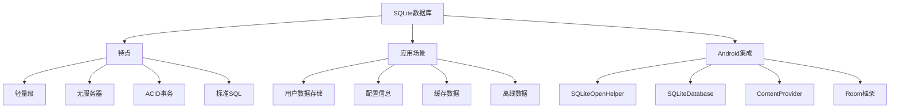

# 第17章：SQLite数据库开发

## 17.1 SQLite基础概念

### 17.1.1 什么是SQLite

SQLite是一个轻量级的关系型数据库管理系统，它是Android系统内置的数据库引擎。SQLite具有以下特点：

- 无服务器、零配置、事务性SQL数据库引擎
- 自包含、无需额外安装
- 支持标准SQL语言
- 占用内存小，适合移动设备
- 支持ACID事务特性



### 17.1.2 SQLiteOpenHelper基础使用

```java
public class DatabaseHelper extends SQLiteOpenHelper {
    private static final String TAG = "DatabaseHelper";

    // 数据库名称和版本
    private static final String DATABASE_NAME = "app_database.db";
    private static final int DATABASE_VERSION = 1;

    // 表名
    public static final String TABLE_USERS = "users";
    public static final String TABLE_PRODUCTS = "products";
    public static final String TABLE_ORDERS = "orders";

    // 公共字段
    public static final String COLUMN_ID = "_id";
    public static final String COLUMN_CREATED_AT = "created_at";
    public static final String COLUMN_UPDATED_AT = "updated_at";

    // Users表字段
    public static final String COLUMN_USER_NAME = "name";
    public static final String COLUMN_USER_EMAIL = "email";
    public static final String COLUMN_USER_PHONE = "phone";
    public static final String COLUMN_USER_AGE = "age";
    public static final String COLUMN_USER_ACTIVE = "active";

    // Products表字段
    public static final String COLUMN_PRODUCT_NAME = "name";
    public static final String COLUMN_PRODUCT_PRICE = "price";
    public static final String COLUMN_PRODUCT_CATEGORY = "category";
    public static final String COLUMN_PRODUCT_STOCK = "stock";

    // Orders表字段
    public static final String COLUMN_ORDER_USER_ID = "user_id";
    public static final String COLUMN_ORDER_TOTAL = "total";
    public static final String COLUMN_ORDER_STATUS = "status";

    // 创建表SQL语句
    private static final String CREATE_TABLE_USERS = "CREATE TABLE " + TABLE_USERS + " (" +
            COLUMN_ID + " INTEGER PRIMARY KEY AUTOINCREMENT, " +
            COLUMN_USER_NAME + " TEXT NOT NULL, " +
            COLUMN_USER_EMAIL + " TEXT UNIQUE, " +
            COLUMN_USER_PHONE + " TEXT, " +
            COLUMN_USER_AGE + " INTEGER DEFAULT 0, " +
            COLUMN_USER_ACTIVE + " INTEGER DEFAULT 1, " +
            COLUMN_CREATED_AT + " INTEGER, " +
            COLUMN_UPDATED_AT + " INTEGER" +
            ")";

    private static final String CREATE_TABLE_PRODUCTS = "CREATE TABLE " + TABLE_PRODUCTS + " (" +
            COLUMN_ID + " INTEGER PRIMARY KEY AUTOINCREMENT, " +
            COLUMN_PRODUCT_NAME + " TEXT NOT NULL, " +
            COLUMN_PRODUCT_PRICE + " REAL NOT NULL, " +
            COLUMN_PRODUCT_CATEGORY + " TEXT, " +
            COLUMN_PRODUCT_STOCK + " INTEGER DEFAULT 0, " +
            COLUMN_CREATED_AT + " INTEGER, " +
            COLUMN_UPDATED_AT + " INTEGER" +
            ")";

    private static final String CREATE_TABLE_ORDERS = "CREATE TABLE " + TABLE_ORDERS + " (" +
            COLUMN_ID + " INTEGER PRIMARY KEY AUTOINCREMENT, " +
            COLUMN_ORDER_USER_ID + " INTEGER, " +
            COLUMN_ORDER_TOTAL + " REAL NOT NULL, " +
            COLUMN_ORDER_STATUS + " TEXT DEFAULT 'pending', " +
            COLUMN_CREATED_AT + " INTEGER, " +
            COLUMN_UPDATED_AT + " INTEGER, " +
            "FOREIGN KEY(" + COLUMN_ORDER_USER_ID + ") REFERENCES " + TABLE_USERS + "(" + COLUMN_ID + ")" +
            ")";

    // 单例实例
    private static DatabaseHelper instance;

    public static synchronized DatabaseHelper getInstance(Context context) {
        if (instance == null) {
            instance = new DatabaseHelper(context.getApplicationContext());
        }
        return instance;
    }

    private DatabaseHelper(Context context) {
        super(context, DATABASE_NAME, null, DATABASE_VERSION);
    }

    @Override
    public void onCreate(SQLiteDatabase db) {
        Log.d(TAG, "Creating database tables");

        // 创建表
        db.execSQL(CREATE_TABLE_USERS);
        db.execSQL(CREATE_TABLE_PRODUCTS);
        db.execSQL(CREATE_TABLE_ORDERS);

        // 创建索引
        createIndexes(db);

        // 插入初始数据
        insertInitialData(db);

        Log.d(TAG, "Database created successfully");
    }

    @Override
    public void onUpgrade(SQLiteDatabase db, int oldVersion, int newVersion) {
        Log.d(TAG, "Upgrading database from version " + oldVersion + " to " + newVersion);

        // 根据版本号执行不同的升级策略
        if (oldVersion < 2) {
            upgradeToVersion2(db);
        }
        if (oldVersion < 3) {
            upgradeToVersion3(db);
        }

        Log.d(TAG, "Database upgraded successfully");
    }

    @Override
    public void onDowngrade(SQLiteDatabase db, int oldVersion, int newVersion) {
        Log.w(TAG, "Downgrading database from version " + oldVersion + " to " + newVersion);

        // 降级处理策略
        // 通常不建议降级，这里可以选择清除数据或进行兼容性处理
    }

    private void createIndexes(SQLiteDatabase db) {
        // 创建索引提高查询性能
        db.execSQL("CREATE INDEX idx_users_email ON " + TABLE_USERS + "(" + COLUMN_USER_EMAIL + ")");
        db.execSQL("CREATE INDEX idx_products_category ON " + TABLE_PRODUCTS + "(" + COLUMN_PRODUCT_CATEGORY + ")");
        db.execSQL("CREATE INDEX idx_orders_user_id ON " + TABLE_ORDERS + "(" + COLUMN_ORDER_USER_ID + ")");
        db.execSQL("CREATE INDEX idx_orders_status ON " + TABLE_ORDERS + "(" + COLUMN_ORDER_STATUS + ")");
    }

    private void insertInitialData(SQLiteDatabase db) {
        // 插入初始用户数据
        ContentValues userValues = new ContentValues();
        userValues.put(COLUMN_USER_NAME, "系统管理员");
        userValues.put(COLUMN_USER_EMAIL, "admin@example.com");
        userValues.put(COLUMN_USER_PHONE, "13800138000");
        userValues.put(COLUMN_USER_AGE, 30);
        userValues.put(COLUMN_USER_ACTIVE, 1);
        userValues.put(COLUMN_CREATED_AT, System.currentTimeMillis());
        userValues.put(COLUMN_UPDATED_AT, System.currentTimeMillis());

        long adminUserId = db.insert(TABLE_USERS, null, userValues);

        // 插入初始产品数据
        ContentValues[] productValues = createInitialProductData();
        for (ContentValues values : productValues) {
            values.put(COLUMN_CREATED_AT, System.currentTimeMillis());
            values.put(COLUMN_UPDATED_AT, System.currentTimeMillis());
            db.insert(TABLE_PRODUCTS, null, values);
        }

        Log.d(TAG, "Initial data inserted");
    }

    private ContentValues[] createInitialProductData() {
        return new ContentValues[]{
            createProductValues("智能手机", 2999.99, "电子产品", 100),
            createProductValues("笔记本电脑", 5999.99, "电子产品", 50),
            createProductValues("无线耳机", 299.99, "电子产品", 200),
            createProductValues("运动鞋", 399.99, "服装", 150),
            createProductValues("背包", 199.99, "配饰", 80)
        };
    }

    private ContentValues createProductValues(String name, double price, String category, int stock) {
        ContentValues values = new ContentValues();
        values.put(COLUMN_PRODUCT_NAME, name);
        values.put(COLUMN_PRODUCT_PRICE, price);
        values.put(COLUMN_PRODUCT_CATEGORY, category);
        values.put(COLUMN_PRODUCT_STOCK, stock);
        return values;
    }

    private void upgradeToVersion2(SQLiteDatabase db) {
        // 版本2的升级：添加用户头像字段
        db.execSQL("ALTER TABLE " + TABLE_USERS + " ADD COLUMN avatar_url TEXT");
        Log.d(TAG, "Added avatar_url column to users table");
    }

    private void upgradeToVersion3(SQLiteDatabase db) {
        // 版本3的升级：添加产品描述字段
        db.execSQL("ALTER TABLE " + TABLE_PRODUCTS + " ADD COLUMN description TEXT");
        Log.d(TAG, "Added description column to products table");
    }

    // 获取数据库实例（只读）
    public SQLiteDatabase getReadableDatabase() {
        return super.getReadableDatabase();
    }

    // 获取数据库实例（读写）
    public SQLiteDatabase getWritableDatabase() {
        return super.getWritableDatabase();
    }

    // 检查表是否存在
    public boolean isTableExists(String tableName) {
        SQLiteDatabase db = getReadableDatabase();
        Cursor cursor = null;
        try {
            cursor = db.rawQuery(
                "SELECT name FROM sqlite_master WHERE type='table' AND name=?",
                new String[]{tableName}
            );
            return cursor != null && cursor.getCount() > 0;
        } catch (Exception e) {
            Log.e(TAG, "Error checking if table exists: " + tableName, e);
            return false;
        } finally {
            if (cursor != null) {
                cursor.close();
            }
        }
    }

    // 获取表的列信息
    public List<String> getTableColumns(String tableName) {
        List<String> columns = new ArrayList<>();
        SQLiteDatabase db = getReadableDatabase();
        Cursor cursor = null;

        try {
            cursor = db.rawQuery("PRAGMA table_info(" + tableName + ")", null);
            if (cursor != null) {
                int nameColumnIndex = cursor.getColumnIndex("name");
                while (cursor.moveToNext()) {
                    String columnName = cursor.getString(nameColumnIndex);
                    columns.add(columnName);
                }
            }
        } catch (Exception e) {
            Log.e(TAG, "Error getting table columns: " + tableName, e);
        } finally {
            if (cursor != null) {
                cursor.close();
            }
        }

        return columns;
    }

    // 获取数据库统计信息
    public DatabaseStats getDatabaseStats() {
        DatabaseStats stats = new DatabaseStats();
        SQLiteDatabase db = getReadableDatabase();
        Cursor cursor = null;

        try {
            // 获取表的行数
            stats.userCount = getTableRowCount(db, TABLE_USERS);
            stats.productCount = getTableRowCount(db, TABLE_PRODUCTS);
            stats.orderCount = getTableRowCount(db, TABLE_ORDERS);

            // 获取数据库文件大小
            File dbFile = new File(db.getPath());
            stats.databaseSize = dbFile.exists() ? dbFile.length() : 0;

            // 获取数据库版本信息
            stats.databaseVersion = DATABASE_VERSION;
            stats.databaseName = DATABASE_NAME;

        } catch (Exception e) {
            Log.e(TAG, "Error getting database stats", e);
        }

        return stats;
    }

    private int getTableRowCount(SQLiteDatabase db, String tableName) {
        Cursor cursor = null;
        try {
            cursor = db.rawQuery("SELECT COUNT(*) FROM " + tableName, null);
            if (cursor != null && cursor.moveToFirst()) {
                return cursor.getInt(0);
            }
        } catch (Exception e) {
            Log.e(TAG, "Error getting table row count: " + tableName, e);
        } finally {
            if (cursor != null) {
                cursor.close();
            }
        }
        return 0;
    }

    // 数据库统计信息类
    public static class DatabaseStats {
        public String databaseName;
        public int databaseVersion;
        public long databaseSize;
        public int userCount;
        public int productCount;
        public int orderCount;

        public String getFormattedDatabaseSize() {
            if (databaseSize < 1024) {
                return databaseSize + " B";
            } else if (databaseSize < 1024 * 1024) {
                return String.format("%.1f KB", databaseSize / 1024.0);
            } else if (databaseSize < 1024 * 1024 * 1024) {
                return String.format("%.1f MB", databaseSize / (1024.0 * 1024));
            } else {
                return String.format("%.1f GB", databaseSize / (1024.0 * 1024 * 1024));
            }
        }
    }
}
```

## 17.2 CRUD操作详解

### 17.2.1 数据插入操作

```java
public class UserDAO {
    private static final String TAG = "UserDAO";
    private DatabaseHelper databaseHelper;

    public UserDAO(Context context) {
        this.databaseHelper = DatabaseHelper.getInstance(context);
    }

    // 插入单个用户
    public long insertUser(User user) {
        SQLiteDatabase db = databaseHelper.getWritableDatabase();
        long userId = -1;

        try {
            ContentValues values = new ContentValues();
            values.put(DatabaseHelper.COLUMN_USER_NAME, user.getName());
            values.put(DatabaseHelper.COLUMN_USER_EMAIL, user.getEmail());
            values.put(DatabaseHelper.COLUMN_USER_PHONE, user.getPhone());
            values.put(DatabaseHelper.COLUMN_USER_AGE, user.getAge());
            values.put(DatabaseHelper.COLUMN_USER_ACTIVE, user.isActive() ? 1 : 0);
            values.put(DatabaseHelper.COLUMN_CREATED_AT, System.currentTimeMillis());
            values.put(DatabaseHelper.COLUMN_UPDATED_AT, System.currentTimeMillis());

            userId = db.insert(DatabaseHelper.TABLE_USERS, null, values);

            if (userId != -1) {
                user.setId(userId);
                Log.d(TAG, "User inserted with ID: " + userId);
            } else {
                Log.e(TAG, "Failed to insert user");
            }

        } catch (Exception e) {
            Log.e(TAG, "Error inserting user", e);
        }

        return userId;
    }

    // 批量插入用户
    public int insertUsers(List<User> users) {
        SQLiteDatabase db = databaseHelper.getWritableDatabase();
        int insertedCount = 0;

        try {
            db.beginTransaction();

            for (User user : users) {
                ContentValues values = new ContentValues();
                values.put(DatabaseHelper.COLUMN_USER_NAME, user.getName());
                values.put(DatabaseHelper.COLUMN_USER_EMAIL, user.getEmail());
                values.put(DatabaseHelper.COLUMN_USER_PHONE, user.getPhone());
                values.put(DatabaseHelper.COLUMN_USER_AGE, user.getAge());
                values.put(DatabaseHelper.COLUMN_USER_ACTIVE, user.isActive() ? 1 : 0);
                values.put(DatabaseHelper.COLUMN_CREATED_AT, System.currentTimeMillis());
                values.put(DatabaseHelper.COLUMN_UPDATED_AT, System.currentTimeMillis());

                long userId = db.insert(DatabaseHelper.TABLE_USERS, null, values);
                if (userId != -1) {
                    user.setId(userId);
                    insertedCount++;
                }
            }

            db.setTransactionSuccessful();
            Log.d(TAG, "Batch insert completed: " + insertedCount + " users inserted");

        } catch (Exception e) {
            Log.e(TAG, "Error in batch insert", e);
        } finally {
            db.endTransaction();
        }

        return insertedCount;
    }

    // 使用原始SQL插入用户
    public long insertUserWithRawSQL(User user) {
        SQLiteDatabase db = databaseHelper.getWritableDatabase();
        long userId = -1;

        try {
            // 使用参数化查询防止SQL注入
            String sql = "INSERT INTO " + DatabaseHelper.TABLE_USERS + " (" +
                    DatabaseHelper.COLUMN_USER_NAME + ", " +
                    DatabaseHelper.COLUMN_USER_EMAIL + ", " +
                    DatabaseHelper.COLUMN_USER_PHONE + ", " +
                    DatabaseHelper.COLUMN_USER_AGE + ", " +
                    DatabaseHelper.COLUMN_USER_ACTIVE + ", " +
                    DatabaseHelper.COLUMN_CREATED_AT + ", " +
                    DatabaseHelper.COLUMN_UPDATED_AT +
                    ") VALUES (?, ?, ?, ?, ?, ?, ?)";

            SQLiteStatement statement = db.compileStatement(sql);
            statement.bindString(1, user.getName());
            statement.bindString(2, user.getEmail());
            statement.bindString(3, user.getPhone());
            statement.bindLong(4, user.getAge());
            statement.bindLong(5, user.isActive() ? 1 : 0);
            statement.bindLong(6, System.currentTimeMillis());
            statement.bindLong(7, System.currentTimeMillis());

            userId = statement.executeInsert();
            statement.close();

            if (userId != -1) {
                user.setId(userId);
                Log.d(TAG, "User inserted with raw SQL, ID: " + userId);
            }

        } catch (Exception e) {
            Log.e(TAG, "Error inserting user with raw SQL", e);
        }

        return userId;
    }

    // 插入或替换用户（UPSERT）
    public long insertOrReplaceUser(User user) {
        SQLiteDatabase db = databaseHelper.getWritableDatabase();
        long userId = -1;

        try {
            ContentValues values = new ContentValues();
            values.put(DatabaseHelper.COLUMN_USER_NAME, user.getName());
            values.put(DatabaseHelper.COLUMN_USER_EMAIL, user.getEmail());
            values.put(DatabaseHelper.COLUMN_USER_PHONE, user.getPhone());
            values.put(DatabaseHelper.COLUMN_USER_AGE, user.getAge());
            values.put(DatabaseHelper.COLUMN_USER_ACTIVE, user.isActive() ? 1 : 0);
            values.put(DatabaseHelper.COLUMN_UPDATED_AT, System.currentTimeMillis());

            if (user.getId() > 0) {
                // 如果有ID，则更新现有记录
                values.put(DatabaseHelper.COLUMN_ID, user.getId());
                int rowsAffected = db.update(
                    DatabaseHelper.TABLE_USERS,
                    values,
                    DatabaseHelper.COLUMN_ID + " = ?",
                    new String[]{String.valueOf(user.getId())}
                );

                if (rowsAffected > 0) {
                    userId = user.getId();
                    Log.d(TAG, "User updated: " + userId);
                }
            } else {
                // 插入新记录
                values.put(DatabaseHelper.COLUMN_CREATED_AT, System.currentTimeMillis());
                userId = db.insert(DatabaseHelper.TABLE_USERS, null, values);

                if (userId != -1) {
                    user.setId(userId);
                    Log.d(TAG, "User inserted: " + userId);
                }
            }

        } catch (Exception e) {
            Log.e(TAG, "Error in insert or replace user", e);
        }

        return userId;
    }

    // 插入用户并返回结果
    public InsertResult insertUserWithResult(User user) {
        InsertResult result = new InsertResult();
        SQLiteDatabase db = databaseHelper.getWritableDatabase();

        try {
            // 检查邮箱是否已存在
            if (isEmailExists(user.getEmail())) {
                result.success = false;
                result.errorMessage = "Email already exists: " + user.getEmail();
                Log.w(TAG, result.errorMessage);
                return result;
            }

            ContentValues values = new ContentValues();
            values.put(DatabaseHelper.COLUMN_USER_NAME, user.getName());
            values.put(DatabaseHelper.COLUMN_USER_EMAIL, user.getEmail());
            values.put(DatabaseHelper.COLUMN_USER_PHONE, user.getPhone());
            values.put(DatabaseHelper.COLUMN_USER_AGE, user.getAge());
            values.put(DatabaseHelper.COLUMN_USER_ACTIVE, user.isActive() ? 1 : 0);
            values.put(DatabaseHelper.COLUMN_CREATED_AT, System.currentTimeMillis());
            values.put(DatabaseHelper.COLUMN_UPDATED_AT, System.currentTimeMillis());

            long userId = db.insert(DatabaseHelper.TABLE_USERS, null, values);

            if (userId != -1) {
                result.success = true;
                result.insertedId = userId;
                user.setId(userId);
                Log.d(TAG, "User inserted successfully: " + userId);
            } else {
                result.success = false;
                result.errorMessage = "Failed to insert user";
                Log.e(TAG, result.errorMessage);
            }

        } catch (Exception e) {
            result.success = false;
            result.errorMessage = "Database error: " + e.getMessage();
            Log.e(TAG, result.errorMessage, e);
        }

        return result;
    }

    // 检查邮箱是否存在
    private boolean isEmailExists(String email) {
        SQLiteDatabase db = databaseHelper.getReadableDatabase();
        Cursor cursor = null;

        try {
            String[] columns = {DatabaseHelper.COLUMN_ID};
            String selection = DatabaseHelper.COLUMN_USER_EMAIL + " = ?";
            String[] selectionArgs = {email};

            cursor = db.query(
                DatabaseHelper.TABLE_USERS,
                columns,
                selection,
                selectionArgs,
                null, null, null
            );

            return cursor != null && cursor.getCount() > 0;

        } catch (Exception e) {
            Log.e(TAG, "Error checking email existence", e);
            return false;
        } finally {
            if (cursor != null) {
                cursor.close();
            }
        }
    }

    // 插入结果类
    public static class InsertResult {
        public boolean success;
        public long insertedId;
        public String errorMessage;

        public InsertResult() {
            this.success = false;
            this.insertedId = -1;
            this.errorMessage = "";
        }
    }

    // 用户数据模型
    public static class User {
        private long id;
        private String name;
        private String email;
        private String phone;
        private int age;
        private boolean active;
        private long createdAt;
        private long updatedAt;

        public User() {}

        public User(String name, String email, String phone, int age, boolean active) {
            this.name = name;
            this.email = email;
            this.phone = phone;
            this.age = age;
            this.active = active;
        }

        // Getters and Setters
        public long getId() { return id; }
        public void setId(long id) { this.id = id; }

        public String getName() { return name; }
        public void setName(String name) { this.name = name; }

        public String getEmail() { return email; }
        public void setEmail(String email) { this.email = email; }

        public String getPhone() { return phone; }
        public void setPhone(String phone) { this.phone = phone; }

        public int getAge() { return age; }
        public void setAge(int age) { this.age = age; }

        public boolean isActive() { return active; }
        public void setActive(boolean active) { this.active = active; }

        public long getCreatedAt() { return createdAt; }
        public void setCreatedAt(long createdAt) { this.createdAt = createdAt; }

        public long getUpdatedAt() { return updatedAt; }
        public void setUpdatedAt(long updatedAt) { this.updatedAt = updatedAt; }

        @Override
        public String toString() {
            return "User{" +
                    "id=" + id +
                    ", name='" + name + '\'' +
                    ", email='" + email + '\'' +
                    ", phone='" + phone + '\'' +
                    ", age=" + age +
                    ", active=" + active +
                    '}';
        }
    }
}
```

### 17.2.2 数据查询操作

```java
public class UserQueryDAO {
    private static final String TAG = "UserQueryDAO";
    private DatabaseHelper databaseHelper;

    public UserQueryDAO(Context context) {
        this.databaseHelper = DatabaseHelper.getInstance(context);
    }

    // 根据ID查询用户
    public UserDAO.User getUserById(long id) {
        SQLiteDatabase db = databaseHelper.getReadableDatabase();
        Cursor cursor = null;
        UserDAO.User user = null;

        try {
            String[] columns = {
                DatabaseHelper.COLUMN_ID,
                DatabaseHelper.COLUMN_USER_NAME,
                DatabaseHelper.COLUMN_USER_EMAIL,
                DatabaseHelper.COLUMN_USER_PHONE,
                DatabaseHelper.COLUMN_USER_AGE,
                DatabaseHelper.COLUMN_USER_ACTIVE,
                DatabaseHelper.COLUMN_CREATED_AT,
                DatabaseHelper.COLUMN_UPDATED_AT
            };

            String selection = DatabaseHelper.COLUMN_ID + " = ?";
            String[] selectionArgs = {String.valueOf(id)};

            cursor = db.query(
                DatabaseHelper.TABLE_USERS,
                columns,
                selection,
                selectionArgs,
                null, null, null
            );

            if (cursor != null && cursor.moveToFirst()) {
                user = cursorToUser(cursor);
                Log.d(TAG, "User found: " + user.toString());
            } else {
                Log.d(TAG, "User not found with ID: " + id);
            }

        } catch (Exception e) {
            Log.e(TAG, "Error getting user by ID", e);
        } finally {
            if (cursor != null) {
                cursor.close();
            }
        }

        return user;
    }

    // 根据邮箱查询用户
    public UserDAO.User getUserByEmail(String email) {
        SQLiteDatabase db = databaseHelper.getReadableDatabase();
        Cursor cursor = null;
        UserDAO.User user = null;

        try {
            String[] columns = {
                DatabaseHelper.COLUMN_ID,
                DatabaseHelper.COLUMN_USER_NAME,
                DatabaseHelper.COLUMN_USER_EMAIL,
                DatabaseHelper.COLUMN_USER_PHONE,
                DatabaseHelper.COLUMN_USER_AGE,
                DatabaseHelper.COLUMN_USER_ACTIVE,
                DatabaseHelper.COLUMN_CREATED_AT,
                DatabaseHelper.COLUMN_UPDATED_AT
            };

            String selection = DatabaseHelper.COLUMN_USER_EMAIL + " = ?";
            String[] selectionArgs = {email};

            cursor = db.query(
                DatabaseHelper.TABLE_USERS,
                columns,
                selection,
                selectionArgs,
                null, null, null
            );

            if (cursor != null && cursor.moveToFirst()) {
                user = cursorToUser(cursor);
                Log.d(TAG, "User found by email: " + user.toString());
            } else {
                Log.d(TAG, "User not found with email: " + email);
            }

        } catch (Exception e) {
            Log.e(TAG, "Error getting user by email", e);
        } finally {
            if (cursor != null) {
                cursor.close();
            }
        }

        return user;
    }

    // 查询所有用户
    public List<UserDAO.User> getAllUsers() {
        SQLiteDatabase db = databaseHelper.getReadableDatabase();
        Cursor cursor = null;
        List<UserDAO.User> users = new ArrayList<>();

        try {
            String[] columns = {
                DatabaseHelper.COLUMN_ID,
                DatabaseHelper.COLUMN_USER_NAME,
                DatabaseHelper.COLUMN_USER_EMAIL,
                DatabaseHelper.COLUMN_USER_PHONE,
                DatabaseHelper.COLUMN_USER_AGE,
                DatabaseHelper.COLUMN_USER_ACTIVE,
                DatabaseHelper.COLUMN_CREATED_AT,
                DatabaseHelper.COLUMN_UPDATED_AT
            };

            String sortOrder = DatabaseHelper.COLUMN_CREATED_AT + " DESC";

            cursor = db.query(
                DatabaseHelper.TABLE_USERS,
                columns,
                null, null, null, null,
                sortOrder
            );

            if (cursor != null) {
                while (cursor.moveToNext()) {
                    UserDAO.User user = cursorToUser(cursor);
                    users.add(user);
                }
            }

            Log.d(TAG, "Retrieved " + users.size() + " users");

        } catch (Exception e) {
            Log.e(TAG, "Error getting all users", e);
        } finally {
            if (cursor != null) {
                cursor.close();
            }
        }

        return users;
    }

    // 查询活跃用户
    public List<UserDAO.User> getActiveUsers() {
        SQLiteDatabase db = databaseHelper.getReadableDatabase();
        Cursor cursor = null;
        List<UserDAO.User> users = new ArrayList<>();

        try {
            String[] columns = {
                DatabaseHelper.COLUMN_ID,
                DatabaseHelper.COLUMN_USER_NAME,
                DatabaseHelper.COLUMN_USER_EMAIL,
                DatabaseHelper.COLUMN_USER_PHONE,
                DatabaseHelper.COLUMN_USER_AGE,
                DatabaseHelper.COLUMN_USER_ACTIVE,
                DatabaseHelper.COLUMN_CREATED_AT,
                DatabaseHelper.COLUMN_UPDATED_AT
            };

            String selection = DatabaseHelper.COLUMN_USER_ACTIVE + " = ?";
            String[] selectionArgs = {"1"};
            String sortOrder = DatabaseHelper.COLUMN_USER_NAME + " ASC";

            cursor = db.query(
                DatabaseHelper.TABLE_USERS,
                columns,
                selection,
                selectionArgs,
                null, null,
                sortOrder
            );

            if (cursor != null) {
                while (cursor.moveToNext()) {
                    UserDAO.User user = cursorToUser(cursor);
                    users.add(user);
                }
            }

            Log.d(TAG, "Retrieved " + users.size() + " active users");

        } catch (Exception e) {
            Log.e(TAG, "Error getting active users", e);
        } finally {
            if (cursor != null) {
                cursor.close();
            }
        }

        return users;
    }

    // 根据年龄范围查询用户
    public List<UserDAO.User> getUsersByAgeRange(int minAge, int maxAge) {
        SQLiteDatabase db = databaseHelper.getReadableDatabase();
        Cursor cursor = null;
        List<UserDAO.User> users = new ArrayList<>();

        try {
            String[] columns = {
                DatabaseHelper.COLUMN_ID,
                DatabaseHelper.COLUMN_USER_NAME,
                DatabaseHelper.COLUMN_USER_EMAIL,
                DatabaseHelper.COLUMN_USER_PHONE,
                DatabaseHelper.COLUMN_USER_AGE,
                DatabaseHelper.COLUMN_USER_ACTIVE,
                DatabaseHelper.COLUMN_CREATED_AT,
                DatabaseHelper.COLUMN_UPDATED_AT
            };

            String selection = DatabaseHelper.COLUMN_USER_AGE + " BETWEEN ? AND ?";
            String[] selectionArgs = {String.valueOf(minAge), String.valueOf(maxAge)};
            String sortOrder = DatabaseHelper.COLUMN_USER_AGE + " ASC";

            cursor = db.query(
                DatabaseHelper.TABLE_USERS,
                columns,
                selection,
                selectionArgs,
                null, null,
                sortOrder
            );

            if (cursor != null) {
                while (cursor.moveToNext()) {
                    UserDAO.User user = cursorToUser(cursor);
                    users.add(user);
                }
            }

            Log.d(TAG, "Retrieved " + users.size() + " users in age range " + minAge + "-" + maxAge);

        } catch (Exception e) {
            Log.e(TAG, "Error getting users by age range", e);
        } finally {
            if (cursor != null) {
                cursor.close();
            }
        }

        return users;
    }

    // 使用原始SQL查询
    public List<UserDAO.User> searchUsersByName(String namePattern) {
        SQLiteDatabase db = databaseHelper.getReadableDatabase();
        Cursor cursor = null;
        List<UserDAO.User> users = new ArrayList<>();

        try {
            String sql = "SELECT * FROM " + DatabaseHelper.TABLE_USERS +
                    " WHERE " + DatabaseHelper.COLUMN_USER_NAME + " LIKE ?" +
                    " ORDER BY " + DatabaseHelper.COLUMN_USER_NAME + " ASC";

            String[] selectionArgs = {"%" + namePattern + "%"};

            cursor = db.rawQuery(sql, selectionArgs);

            if (cursor != null) {
                while (cursor.moveToNext()) {
                    UserDAO.User user = cursorToUser(cursor);
                    users.add(user);
                }
            }

            Log.d(TAG, "Found " + users.size() + " users matching pattern: " + namePattern);

        } catch (Exception e) {
            Log.e(TAG, "Error searching users by name", e);
        } finally {
            if (cursor != null) {
                cursor.close();
            }
        }

        return users;
    }

    // 分页查询用户
    public List<UserDAO.User> getUsersWithPagination(int page, int pageSize) {
        SQLiteDatabase db = databaseHelper.getReadableDatabase();
        Cursor cursor = null;
        List<UserDAO.User> users = new ArrayList<>();

        try {
            String[] columns = {
                DatabaseHelper.COLUMN_ID,
                DatabaseHelper.COLUMN_USER_NAME,
                DatabaseHelper.COLUMN_USER_EMAIL,
                DatabaseHelper.COLUMN_USER_PHONE,
                DatabaseHelper.COLUMN_USER_AGE,
                DatabaseHelper.COLUMN_USER_ACTIVE,
                DatabaseHelper.COLUMN_CREATED_AT,
                DatabaseHelper.COLUMN_UPDATED_AT
            };

            String sortOrder = DatabaseHelper.COLUMN_CREATED_AT + " DESC";
            String limit = pageSize + " OFFSET " + (page * pageSize);

            cursor = db.query(
                DatabaseHelper.TABLE_USERS,
                columns,
                null, null, null, null,
                sortOrder, limit
            );

            if (cursor != null) {
                while (cursor.moveToNext()) {
                    UserDAO.User user = cursorToUser(cursor);
                    users.add(user);
                }
            }

            Log.d(TAG, "Retrieved page " + page + " with " + users.size() + " users");

        } catch (Exception e) {
            Log.e(TAG, "Error getting users with pagination", e);
        } finally {
            if (cursor != null) {
                cursor.close();
            }
        }

        return users;
    }

    // 获取用户总数
    public int getUserCount() {
        SQLiteDatabase db = databaseHelper.getReadableDatabase();
        Cursor cursor = null;
        int count = 0;

        try {
            String sql = "SELECT COUNT(*) FROM " + DatabaseHelper.TABLE_USERS;
            cursor = db.rawQuery(sql, null);

            if (cursor != null && cursor.moveToFirst()) {
                count = cursor.getInt(0);
            }

        } catch (Exception e) {
            Log.e(TAG, "Error getting user count", e);
        } finally {
            if (cursor != null) {
                cursor.close();
            }
        }

        return count;
    }

    // 获取活跃用户总数
    public int getActiveUserCount() {
        SQLiteDatabase db = databaseHelper.getReadableDatabase();
        Cursor cursor = null;
        int count = 0;

        try {
            String sql = "SELECT COUNT(*) FROM " + DatabaseHelper.TABLE_USERS +
                    " WHERE " + DatabaseHelper.COLUMN_USER_ACTIVE + " = 1";
            cursor = db.rawQuery(sql, null);

            if (cursor != null && cursor.moveToFirst()) {
                count = cursor.getInt(0);
            }

        } catch (Exception e) {
            Log.e(TAG, "Error getting active user count", e);
        } finally {
            if (cursor != null) {
                cursor.close();
            }
        }

        return count;
    }

    // 获取用户统计信息
    public UserStatistics getUserStatistics() {
        SQLiteDatabase db = databaseHelper.getReadableDatabase();
        Cursor cursor = null;
        UserStatistics stats = new UserStatistics();

        try {
            String sql = "SELECT " +
                    "COUNT(*) as total_users, " +
                    "COUNT(CASE WHEN " + DatabaseHelper.COLUMN_USER_ACTIVE + " = 1 THEN 1 END) as active_users, " +
                    "AVG(" + DatabaseHelper.COLUMN_USER_AGE + ") as avg_age, " +
                    "MIN(" + DatabaseHelper.COLUMN_USER_AGE + ") as min_age, " +
                    "MAX(" + DatabaseHelper.COLUMN_USER_AGE + ") as max_age " +
                    "FROM " + DatabaseHelper.TABLE_USERS;

            cursor = db.rawQuery(sql, null);

            if (cursor != null && cursor.moveToFirst()) {
                stats.totalUsers = cursor.getInt(cursor.getColumnIndexOrThrow("total_users"));
                stats.activeUsers = cursor.getInt(cursor.getColumnIndexOrThrow("active_users"));
                stats.averageAge = cursor.getDouble(cursor.getColumnIndexOrThrow("avg_age"));
                stats.minAge = cursor.getInt(cursor.getColumnIndexOrThrow("min_age"));
                stats.maxAge = cursor.getInt(cursor.getColumnIndexOrThrow("max_age"));
            }

        } catch (Exception e) {
            Log.e(TAG, "Error getting user statistics", e);
        } finally {
            if (cursor != null) {
                cursor.close();
            }
        }

        return stats;
    }

    // 检查用户是否存在
    public boolean isUserExists(long id) {
        SQLiteDatabase db = databaseHelper.getReadableDatabase();
        Cursor cursor = null;

        try {
            String sql = "SELECT 1 FROM " + DatabaseHelper.TABLE_USERS +
                    " WHERE " + DatabaseHelper.COLUMN_ID + " = ? LIMIT 1";
            String[] selectionArgs = {String.valueOf(id)};

            cursor = db.rawQuery(sql, selectionArgs);
            return cursor != null && cursor.moveToFirst();

        } catch (Exception e) {
            Log.e(TAG, "Error checking if user exists", e);
            return false;
        } finally {
            if (cursor != null) {
                cursor.close();
            }
        }
    }

    // 将Cursor转换为User对象
    private UserDAO.User cursorToUser(Cursor cursor) {
        UserDAO.User user = new UserDAO.User();
        user.setId(cursor.getLong(cursor.getColumnIndexOrThrow(DatabaseHelper.COLUMN_ID)));
        user.setName(cursor.getString(cursor.getColumnIndexOrThrow(DatabaseHelper.COLUMN_USER_NAME)));
        user.setEmail(cursor.getString(cursor.getColumnIndexOrThrow(DatabaseHelper.COLUMN_USER_EMAIL)));
        user.setPhone(cursor.getString(cursor.getColumnIndexOrThrow(DatabaseHelper.COLUMN_USER_PHONE)));
        user.setAge(cursor.getInt(cursor.getColumnIndexOrThrow(DatabaseHelper.COLUMN_USER_AGE)));
        user.setActive(cursor.getInt(cursor.getColumnIndexOrThrow(DatabaseHelper.COLUMN_USER_ACTIVE)) == 1);
        user.setCreatedAt(cursor.getLong(cursor.getColumnIndexOrThrow(DatabaseHelper.COLUMN_CREATED_AT)));
        user.setUpdatedAt(cursor.getLong(cursor.getColumnIndexOrThrow(DatabaseHelper.COLUMN_UPDATED_AT)));
        return user;
    }

    // 用户统计信息类
    public static class UserStatistics {
        public int totalUsers;
        public int activeUsers;
        public double averageAge;
        public int minAge;
        public int maxAge;

        public double getActiveUserPercentage() {
            if (totalUsers == 0) return 0;
            return (double) activeUsers / totalUsers * 100;
        }

        @Override
        public String toString() {
            return "UserStatistics{" +
                    "totalUsers=" + totalUsers +
                    ", activeUsers=" + activeUsers +
                    ", averageAge=" + String.format("%.1f", averageAge) +
                    ", minAge=" + minAge +
                    ", maxAge=" + maxAge +
                    ", activePercentage=" + String.format("%.1f%%", getActiveUserPercentage()) +
                    '}';
        }
    }
}
```

### 17.2.3 数据更新和删除操作

```java
public class UserUpdateDeleteDAO {
    private static final String TAG = "UserUpdateDeleteDAO";
    private DatabaseHelper databaseHelper;

    public UserUpdateDeleteDAO(Context context) {
        this.databaseHelper = DatabaseHelper.getInstance(context);
    }

    // 更新用户信息
    public int updateUser(UserDAO.User user) {
        SQLiteDatabase db = databaseHelper.getWritableDatabase();
        int rowsAffected = 0;

        try {
            ContentValues values = new ContentValues();
            values.put(DatabaseHelper.COLUMN_USER_NAME, user.getName());
            values.put(DatabaseHelper.COLUMN_USER_EMAIL, user.getEmail());
            values.put(DatabaseHelper.COLUMN_USER_PHONE, user.getPhone());
            values.put(DatabaseHelper.COLUMN_USER_AGE, user.getAge());
            values.put(DatabaseHelper.COLUMN_USER_ACTIVE, user.isActive() ? 1 : 0);
            values.put(DatabaseHelper.COLUMN_UPDATED_AT, System.currentTimeMillis());

            String selection = DatabaseHelper.COLUMN_ID + " = ?";
            String[] selectionArgs = {String.valueOf(user.getId())};

            rowsAffected = db.update(
                DatabaseHelper.TABLE_USERS,
                values,
                selection,
                selectionArgs
            );

            if (rowsAffected > 0) {
                Log.d(TAG, "User updated successfully: " + user.getId());
            } else {
                Log.w(TAG, "No user updated with ID: " + user.getId());
            }

        } catch (Exception e) {
            Log.e(TAG, "Error updating user", e);
        }

        return rowsAffected;
    }

    // 更新用户姓名
    public int updateUserName(long userId, String newName) {
        SQLiteDatabase db = databaseHelper.getWritableDatabase();
        int rowsAffected = 0;

        try {
            ContentValues values = new ContentValues();
            values.put(DatabaseHelper.COLUMN_USER_NAME, newName);
            values.put(DatabaseHelper.COLUMN_UPDATED_AT, System.currentTimeMillis());

            String selection = DatabaseHelper.COLUMN_ID + " = ?";
            String[] selectionArgs = {String.valueOf(userId)};

            rowsAffected = db.update(
                DatabaseHelper.TABLE_USERS,
                values,
                selection,
                selectionArgs
            );

            Log.d(TAG, "Updated name for user " + userId + ": " + rowsAffected + " rows affected");

        } catch (Exception e) {
            Log.e(TAG, "Error updating user name", e);
        }

        return rowsAffected;
    }

    // 更新用户激活状态
    public int updateUserActiveStatus(long userId, boolean active) {
        SQLiteDatabase db = databaseHelper.getWritableDatabase();
        int rowsAffected = 0;

        try {
            ContentValues values = new ContentValues();
            values.put(DatabaseHelper.COLUMN_USER_ACTIVE, active ? 1 : 0);
            values.put(DatabaseHelper.COLUMN_UPDATED_AT, System.currentTimeMillis());

            String selection = DatabaseHelper.COLUMN_ID + " = ?";
            String[] selectionArgs = {String.valueOf(userId)};

            rowsAffected = db.update(
                DatabaseHelper.TABLE_USERS,
                values,
                selection,
                selectionArgs
            );

            Log.d(TAG, "Updated active status for user " + userId + ": " + active);

        } catch (Exception e) {
            Log.e(TAG, "Error updating user active status", e);
        }

        return rowsAffected;
    }

    // 批量更新用户激活状态
    public int batchUpdateUserActiveStatus(List<Long> userIds, boolean active) {
        SQLiteDatabase db = databaseHelper.getWritableDatabase();
        int rowsAffected = 0;

        try {
            db.beginTransaction();

            ContentValues values = new ContentValues();
            values.put(DatabaseHelper.COLUMN_USER_ACTIVE, active ? 1 : 0);
            values.put(DatabaseHelper.COLUMN_UPDATED_AT, System.currentTimeMillis());

            for (Long userId : userIds) {
                String selection = DatabaseHelper.COLUMN_ID + " = ?";
                String[] selectionArgs = {String.valueOf(userId)};

                int affected = db.update(
                    DatabaseHelper.TABLE_USERS,
                    values,
                    selection,
                    selectionArgs
                );

                rowsAffected += affected;
            }

            db.setTransactionSuccessful();
            Log.d(TAG, "Batch updated active status: " + rowsAffected + " rows affected");

        } catch (Exception e) {
            Log.e(TAG, "Error in batch update user active status", e);
        } finally {
            db.endTransaction();
        }

        return rowsAffected;
    }

    // 使用原始SQL更新用户
    public int updateUserWithRawSQL(UserDAO.User user) {
        SQLiteDatabase db = databaseHelper.getWritableDatabase();
        int rowsAffected = 0;

        try {
            String sql = "UPDATE " + DatabaseHelper.TABLE_USERS + " SET " +
                    DatabaseHelper.COLUMN_USER_NAME + " = ?, " +
                    DatabaseHelper.COLUMN_USER_EMAIL + " = ?, " +
                    DatabaseHelper.COLUMN_USER_PHONE + " = ?, " +
                    DatabaseHelper.COLUMN_USER_AGE + " = ?, " +
                    DatabaseHelper.COLUMN_USER_ACTIVE + " = ?, " +
                    DatabaseHelper.COLUMN_UPDATED_AT + " = ? " +
                    "WHERE " + DatabaseHelper.COLUMN_ID + " = ?";

            SQLiteStatement statement = db.compileStatement(sql);
            statement.bindString(1, user.getName());
            statement.bindString(2, user.getEmail());
            statement.bindString(3, user.getPhone());
            statement.bindLong(4, user.getAge());
            statement.bindLong(5, user.isActive() ? 1 : 0);
            statement.bindLong(6, System.currentTimeMillis());
            statement.bindLong(7, user.getId());

            rowsAffected = statement.executeUpdateDelete();
            statement.close();

            Log.d(TAG, "Updated user with raw SQL: " + rowsAffected + " rows affected");

        } catch (Exception e) {
            Log.e(TAG, "Error updating user with raw SQL", e);
        }

        return rowsAffected;
    }

    // 条件更新用户
    public int updateUsersByCondition(String condition, String[] conditionArgs, ContentValues values) {
        SQLiteDatabase db = databaseHelper.getWritableDatabase();
        int rowsAffected = 0;

        try {
            // 自动添加更新时间
            values.put(DatabaseHelper.COLUMN_UPDATED_AT, System.currentTimeMillis());

            rowsAffected = db.update(
                DatabaseHelper.TABLE_USERS,
                values,
                condition,
                conditionArgs
            );

            Log.d(TAG, "Conditional update: " + rowsAffected + " rows affected");

        } catch (Exception e) {
            Log.e(TAG, "Error in conditional update", e);
        }

        return rowsAffected;
    }

    // 删除用户
    public int deleteUser(long userId) {
        SQLiteDatabase db = databaseHelper.getWritableDatabase();
        int rowsAffected = 0;

        try {
            String selection = DatabaseHelper.COLUMN_ID + " = ?";
            String[] selectionArgs = {String.valueOf(userId)};

            rowsAffected = db.delete(
                DatabaseHelper.TABLE_USERS,
                selection,
                selectionArgs
            );

            if (rowsAffected > 0) {
                Log.d(TAG, "User deleted: " + userId);
            } else {
                Log.w(TAG, "No user deleted with ID: " + userId);
            }

        } catch (Exception e) {
            Log.e(TAG, "Error deleting user", e);
        }

        return rowsAffected;
    }

    // 根据邮箱删除用户
    public int deleteUserByEmail(String email) {
        SQLiteDatabase db = databaseHelper.getWritableDatabase();
        int rowsAffected = 0;

        try {
            String selection = DatabaseHelper.COLUMN_USER_EMAIL + " = ?";
            String[] selectionArgs = {email};

            rowsAffected = db.delete(
                DatabaseHelper.TABLE_USERS,
                selection,
                selectionArgs
            );

            Log.d(TAG, "Deleted user by email " + email + ": " + rowsAffected + " rows affected");

        } catch (Exception e) {
            Log.e(TAG, "Error deleting user by email", e);
        }

        return rowsAffected;
    }

    // 批量删除用户
    public int deleteUsers(List<Long> userIds) {
        SQLiteDatabase db = databaseHelper.getWritableDatabase();
        int rowsAffected = 0;

        try {
            db.beginTransaction();

            for (Long userId : userIds) {
                String selection = DatabaseHelper.COLUMN_ID + " = ?";
                String[] selectionArgs = {String.valueOf(userId)};

                int affected = db.delete(
                    DatabaseHelper.TABLE_USERS,
                    selection,
                    selectionArgs
                );

                rowsAffected += affected;
            }

            db.setTransactionSuccessful();
            Log.d(TAG, "Batch deleted users: " + rowsAffected + " rows affected");

        } catch (Exception e) {
            Log.e(TAG, "Error in batch delete users", e);
        } finally {
            db.endTransaction();
        }

        return rowsAffected;
    }

    // 删除非活跃用户
    public int deleteInactiveUsers() {
        SQLiteDatabase db = databaseHelper.getWritableDatabase();
        int rowsAffected = 0;

        try {
            String selection = DatabaseHelper.COLUMN_USER_ACTIVE + " = ?";
            String[] selectionArgs = {"0"};

            rowsAffected = db.delete(
                DatabaseHelper.TABLE_USERS,
                selection,
                selectionArgs
            );

            Log.d(TAG, "Deleted inactive users: " + rowsAffected + " rows affected");

        } catch (Exception e) {
            Log.e(TAG, "Error deleting inactive users", e);
        }

        return rowsAffected;
    }

    // 使用原始SQL删除用户
    public int deleteUserWithRawSQL(long userId) {
        SQLiteDatabase db = databaseHelper.getWritableDatabase();
        int rowsAffected = 0;

        try {
            String sql = "DELETE FROM " + DatabaseHelper.TABLE_USERS +
                    " WHERE " + DatabaseHelper.COLUMN_ID + " = ?";

            SQLiteStatement statement = db.compileStatement(sql);
            statement.bindLong(1, userId);

            rowsAffected = statement.executeUpdateDelete();
            statement.close();

            Log.d(TAG, "Deleted user with raw SQL: " + rowsAffected + " rows affected");

        } catch (Exception e) {
            Log.e(TAG, "Error deleting user with raw SQL", e);
        }

        return rowsAffected;
    }

    // 条件删除用户
    public int deleteUsersByCondition(String condition, String[] conditionArgs) {
        SQLiteDatabase db = databaseHelper.getWritableDatabase();
        int rowsAffected = 0;

        try {
            rowsAffected = db.delete(
                DatabaseHelper.TABLE_USERS,
                condition,
                conditionArgs
            );

            Log.d(TAG, "Conditional delete: " + rowsAffected + " rows affected");

        } catch (Exception e) {
            Log.e(TAG, "Error in conditional delete", e);
        }

        return rowsAffected;
    }

    // 清空用户表
    public int clearAllUsers() {
        SQLiteDatabase db = databaseHelper.getWritableDatabase();
        int rowsAffected = 0;

        try {
            rowsAffected = db.delete(DatabaseHelper.TABLE_USERS, null, null);
            Log.d(TAG, "Cleared all users: " + rowsAffected + " rows affected");

        } catch (Exception e) {
            Log.e(TAG, "Error clearing all users", e);
        }

        return rowsAffected;
    }

    // 安全删除用户（先检查是否存在）
    public DeleteResult safeDeleteUser(long userId) {
        DeleteResult result = new DeleteResult();
        SQLiteDatabase db = databaseHelper.getWritableDatabase();

        try {
            // 检查用户是否存在
            if (!isUserExists(userId)) {
                result.success = false;
                result.errorMessage = "User not found with ID: " + userId;
                Log.w(TAG, result.errorMessage);
                return result;
            }

            // 检查用户是否有关联的订单
            if (hasAssociatedOrders(userId)) {
                result.success = false;
                result.errorMessage = "Cannot delete user: has associated orders";
                Log.w(TAG, result.errorMessage);
                return result;
            }

            // 执行删除
            String selection = DatabaseHelper.COLUMN_ID + " = ?";
            String[] selectionArgs = {String.valueOf(userId)};

            int rowsAffected = db.delete(
                DatabaseHelper.TABLE_USERS,
                selection,
                selectionArgs
            );

            if (rowsAffected > 0) {
                result.success = true;
                result.deletedCount = rowsAffected;
                Log.d(TAG, "User safely deleted: " + userId);
            } else {
                result.success = false;
                result.errorMessage = "Failed to delete user";
            }

        } catch (Exception e) {
            result.success = false;
            result.errorMessage = "Database error: " + e.getMessage();
            Log.e(TAG, result.errorMessage, e);
        }

        return result;
    }

    // 检查用户是否存在
    private boolean isUserExists(long userId) {
        SQLiteDatabase db = databaseHelper.getReadableDatabase();
        Cursor cursor = null;

        try {
            String sql = "SELECT 1 FROM " + DatabaseHelper.TABLE_USERS +
                    " WHERE " + DatabaseHelper.COLUMN_ID + " = ? LIMIT 1";
            String[] selectionArgs = {String.valueOf(userId)};

            cursor = db.rawQuery(sql, selectionArgs);
            return cursor != null && cursor.moveToFirst();

        } catch (Exception e) {
            Log.e(TAG, "Error checking if user exists", e);
            return false;
        } finally {
            if (cursor != null) {
                cursor.close();
            }
        }
    }

    // 检查用户是否有关联的订单
    private boolean hasAssociatedOrders(long userId) {
        SQLiteDatabase db = databaseHelper.getReadableDatabase();
        Cursor cursor = null;

        try {
            String sql = "SELECT 1 FROM " + DatabaseHelper.TABLE_ORDERS +
                    " WHERE " + DatabaseHelper.COLUMN_ORDER_USER_ID + " = ? LIMIT 1";
            String[] selectionArgs = {String.valueOf(userId)};

            cursor = db.rawQuery(sql, selectionArgs);
            return cursor != null && cursor.moveToFirst();

        } catch (Exception e) {
            Log.e(TAG, "Error checking associated orders", e);
            return false;
        } finally {
            if (cursor != null) {
                cursor.close();
            }
        }
    }

    // 删除结果类
    public static class DeleteResult {
        public boolean success;
        public int deletedCount;
        public String errorMessage;

        public DeleteResult() {
            this.success = false;
            this.deletedCount = 0;
            this.errorMessage = "";
        }
    }
}
```

## 17.3 事务处理机制

### 17.3.1 事务基础使用

```java
public class TransactionManager {
    private static final String TAG = "TransactionManager";
    private DatabaseHelper databaseHelper;

    public TransactionManager(Context context) {
        this.databaseHelper = DatabaseHelper.getInstance(context);
    }

    // 简单事务示例：转账操作
    public boolean transferFunds(long fromUserId, long toUserId, double amount) {
        SQLiteDatabase db = databaseHelper.getWritableDatabase();
        boolean success = false;

        try {
            db.beginTransaction();

            // 检查转出用户余额是否足够
            double fromBalance = getUserBalance(db, fromUserId);
            if (fromBalance < amount) {
                Log.w(TAG, "Insufficient balance for user " + fromUserId);
                return false;
            }

            // 扣除转出用户余额
            boolean debitSuccess = updateUserBalance(db, fromUserId, fromBalance - amount);
            if (!debitSuccess) {
                Log.e(TAG, "Failed to debit user " + fromUserId);
                return false;
            }

            // 增加转入用户余额
            double toBalance = getUserBalance(db, toUserId);
            boolean creditSuccess = updateUserBalance(db, toUserId, toBalance + amount);
            if (!creditSuccess) {
                Log.e(TAG, "Failed to credit user " + toUserId);
                return false;
            }

            // 记录交易日志
            boolean logSuccess = logTransaction(db, fromUserId, toUserId, amount);
            if (!logSuccess) {
                Log.e(TAG, "Failed to log transaction");
                return false;
            }

            // 所有操作成功，提交事务
            db.setTransactionSuccessful();
            success = true;

            Log.d(TAG, "Transfer completed: " + fromUserId + " -> " + toUserId + ", amount: " + amount);

        } catch (Exception e) {
            Log.e(TAG, "Error during fund transfer", e);
        } finally {
            db.endTransaction();
        }

        return success;
    }

    // 批量插入用户的事务示例
    public int batchInsertUsersWithTransaction(List<UserDAO.User> users) {
        SQLiteDatabase db = databaseHelper.getWritableDatabase();
        int insertedCount = 0;

        try {
            db.beginTransaction();

            for (UserDAO.User user : users) {
                ContentValues values = new ContentValues();
                values.put(DatabaseHelper.COLUMN_USER_NAME, user.getName());
                values.put(DatabaseHelper.COLUMN_USER_EMAIL, user.getEmail());
                values.put(DatabaseHelper.COLUMN_USER_PHONE, user.getPhone());
                values.put(DatabaseHelper.COLUMN_USER_AGE, user.getAge());
                values.put(DatabaseHelper.COLUMN_USER_ACTIVE, user.isActive() ? 1 : 0);
                values.put(DatabaseHelper.COLUMN_CREATED_AT, System.currentTimeMillis());
                values.put(DatabaseHelper.COLUMN_UPDATED_AT, System.currentTimeMillis());

                long userId = db.insert(DatabaseHelper.TABLE_USERS, null, values);
                if (userId != -1) {
                    user.setId(userId);
                    insertedCount++;
                }
            }

            db.setTransactionSuccessful();
            Log.d(TAG, "Batch insert completed: " + insertedCount + " users inserted");

        } catch (Exception e) {
            Log.e(TAG, "Error in batch insert transaction", e);
            insertedCount = 0;
        } finally {
            db.endTransaction();
        }

        return insertedCount;
    }

    // 复杂事务：创建订单并更新库存
    public OrderResult createOrderWithInventoryUpdate(Order order, List<OrderItem> items) {
        SQLiteDatabase db = databaseHelper.getWritableDatabase();
        OrderResult result = new OrderResult();

        try {
            db.beginTransaction();

            // 1. 创建订单
            long orderId = createOrder(db, order);
            if (orderId == -1) {
                result.success = false;
                result.errorMessage = "Failed to create order";
                return result;
            }

            order.setId(orderId);
            result.orderId = orderId;

            // 2. 检查库存并更新
            for (OrderItem item : items) {
                int currentStock = getProductStock(db, item.getProductId());
                if (currentStock < item.getQuantity()) {
                    result.success = false;
                    result.errorMessage = "Insufficient stock for product: " + item.getProductId();
                    return result;
                }

                // 更新库存
                boolean updateSuccess = updateProductStock(db, item.getProductId(),
                    currentStock - item.getQuantity());
                if (!updateSuccess) {
                    result.success = false;
                    result.errorMessage = "Failed to update product stock: " + item.getProductId();
                    return result;
                }

                // 创建订单项
                long orderItemId = createOrderItem(db, orderId, item);
                if (orderItemId == -1) {
                    result.success = false;
                    result.errorMessage = "Failed to create order item: " + item.getProductId();
                    return result;
                }
            }

            // 3. 更新订单总价
            double totalAmount = calculateOrderTotal(items);
            boolean updateSuccess = updateOrderTotal(db, orderId, totalAmount);
            if (!updateSuccess) {
                result.success = false;
                result.errorMessage = "Failed to update order total";
                return result;
            }

            db.setTransactionSuccessful();
            result.success = true;
            result.totalAmount = totalAmount;

            Log.d(TAG, "Order created successfully: " + orderId + ", total: " + totalAmount);

        } catch (Exception e) {
            result.success = false;
            result.errorMessage = "Transaction error: " + e.getMessage();
            Log.e(TAG, result.errorMessage, e);
        } finally {
            db.endTransaction();
        }

        return result;
    }

    // 嵌套事务示例（注意：SQLite不支持真正的嵌套事务）
    public boolean nestedTransactionExample() {
        SQLiteDatabase db = databaseHelper.getWritableDatabase();
        boolean success = false;

        try {
            // 外层事务
            db.beginTransaction();

            // 执行一些操作
            ContentValues values = new ContentValues();
            values.put(DatabaseHelper.COLUMN_USER_NAME, "Test User");
            values.put(DatabaseHelper.COLUMN_USER_EMAIL, "test@example.com");
            values.put(DatabaseHelper.COLUMN_CREATED_AT, System.currentTimeMillis());
            values.put(DatabaseHelper.COLUMN_UPDATED_AT, System.currentTimeMillis());

            long userId = db.insert(DatabaseHelper.TABLE_USERS, null, values);
            if (userId == -1) {
                Log.e(TAG, "Failed to create user in outer transaction");
                return false;
            }

            // 模拟内层事务（实际上是同一个事务的一部分）
            boolean innerSuccess = performInnerOperations(db, userId);
            if (!innerSuccess) {
                Log.e(TAG, "Inner operations failed");
                return false;
            }

            db.setTransactionSuccessful();
            success = true;

        } catch (Exception e) {
            Log.e(TAG, "Error in nested transaction example", e);
        } finally {
            db.endTransaction();
        }

        return success;
    }

    private boolean performInnerOperations(SQLiteDatabase db, long userId) {
        try {
            // 这里实际上是同一个事务的一部分，不是真正的事务嵌套
            ContentValues values = new ContentValues();
            values.put(DatabaseHelper.COLUMN_USER_PHONE, "1234567890");
            values.put(DatabaseHelper.COLUMN_UPDATED_AT, System.currentTimeMillis());

            int rowsAffected = db.update(
                DatabaseHelper.TABLE_USERS,
                values,
                DatabaseHelper.COLUMN_ID + " = ?",
                new String[]{String.valueOf(userId)}
            );

            return rowsAffected > 0;

        } catch (Exception e) {
            Log.e(TAG, "Error in inner operations", e);
            return false;
        }
    }

    // 事务隔离级别演示
    public void demonstrateTransactionIsolation() {
        // SQLite默认使用SERIALIZABLE隔离级别
        // 这里演示并发操作的效果

        new Thread(() -> {
            SQLiteDatabase db1 = databaseHelper.getWritableDatabase();
            try {
                db1.beginTransaction();
                Log.d(TAG, "Transaction 1 started");

                // 模拟长时间操作
                ContentValues values = new ContentValues();
                values.put(DatabaseHelper.COLUMN_USER_NAME, "Thread1 User");
                values.put(DatabaseHelper.COLUMN_USER_EMAIL, "thread1@example.com");
                values.put(DatabaseHelper.COLUMN_CREATED_AT, System.currentTimeMillis());
                values.put(DatabaseHelper.COLUMN_UPDATED_AT, System.currentTimeMillis());

                long userId = db1.insert(DatabaseHelper.TABLE_USERS, null, values);
                Log.d(TAG, "Transaction 1 inserted user: " + userId);

                Thread.sleep(2000); // 模拟长时间操作

                db1.setTransactionSuccessful();
                Log.d(TAG, "Transaction 1 completed");

            } catch (Exception e) {
                Log.e(TAG, "Error in transaction 1", e);
            } finally {
                db1.endTransaction();
            }
        }).start();

        new Thread(() -> {
            try {
                Thread.sleep(500); // 稍后启动第二个事务

                SQLiteDatabase db2 = databaseHelper.getWritableDatabase();
                db2.beginTransaction();
                Log.d(TAG, "Transaction 2 started");

                // 尝试读取数据
                Cursor cursor = db2.query(DatabaseHelper.TABLE_USERS, null, null, null, null, null, null);
                int count = cursor != null ? cursor.getCount() : 0;
                if (cursor != null) cursor.close();

                Log.d(TAG, "Transaction 2 read " + count + " users");

                // 尝试写入数据
                ContentValues values = new ContentValues();
                values.put(DatabaseHelper.COLUMN_USER_NAME, "Thread2 User");
                values.put(DatabaseHelper.COLUMN_USER_EMAIL, "thread2@example.com");
                values.put(DatabaseHelper.COLUMN_CREATED_AT, System.currentTimeMillis());
                values.put(DatabaseHelper.COLUMN_UPDATED_AT, System.currentTimeMillis());

                long userId = db2.insert(DatabaseHelper.TABLE_USERS, null, values);
                Log.d(TAG, "Transaction 2 inserted user: " + userId);

                db2.setTransactionSuccessful();
                Log.d(TAG, "Transaction 2 completed");

            } catch (Exception e) {
                Log.e(TAG, "Error in transaction 2", e);
            }
        }).start();
    }

    // 辅助方法
    private double getUserBalance(SQLiteDatabase db, long userId) {
        // 模拟获取用户余额的方法
        return 1000.0; // 简化实现
    }

    private boolean updateUserBalance(SQLiteDatabase db, long userId, double newBalance) {
        // 模拟更新用户余额的方法
        return true; // 简化实现
    }

    private boolean logTransaction(SQLiteDatabase db, long fromUserId, long toUserId, double amount) {
        // 模拟记录交易日志的方法
        return true; // 简化实现
    }

    private long createOrder(SQLiteDatabase db, Order order) {
        ContentValues values = new ContentValues();
        values.put(DatabaseHelper.COLUMN_ORDER_USER_ID, order.getUserId());
        values.put(DatabaseHelper.COLUMN_ORDER_STATUS, order.getStatus());
        values.put(DatabaseHelper.COLUMN_CREATED_AT, System.currentTimeMillis());
        values.put(DatabaseHelper.COLUMN_UPDATED_AT, System.currentTimeMillis());

        return db.insert(DatabaseHelper.TABLE_ORDERS, null, values);
    }

    private int getProductStock(SQLiteDatabase db, long productId) {
        // 模拟获取产品库存的方法
        return 100; // 简化实现
    }

    private boolean updateProductStock(SQLiteDatabase db, long productId, int newStock) {
        // 模拟更新产品库存的方法
        return true; // 简化实现
    }

    private long createOrderItem(SQLiteDatabase db, long orderId, OrderItem item) {
        // 模拟创建订单项的方法
        return 1; // 简化实现
    }

    private double calculateOrderTotal(List<OrderItem> items) {
        double total = 0;
        for (OrderItem item : items) {
            total += item.getPrice() * item.getQuantity();
        }
        return total;
    }

    private boolean updateOrderTotal(SQLiteDatabase db, long orderId, double total) {
        // 模拟更新订单总价的方法
        return true; // 简化实现
    }

    // 订单结果类
    public static class OrderResult {
        public boolean success;
        public long orderId;
        public double totalAmount;
        public String errorMessage;

        public OrderResult() {
            this.success = false;
            this.orderId = -1;
            this.totalAmount = 0;
            this.errorMessage = "";
        }
    }

    // 订单模型类
    public static class Order {
        private long id;
        private long userId;
        private String status;

        public Order(long userId, String status) {
            this.userId = userId;
            this.status = status;
        }

        // getters and setters
        public long getId() { return id; }
        public void setId(long id) { this.id = id; }

        public long getUserId() { return userId; }
        public void setUserId(long userId) { this.userId = userId; }

        public String getStatus() { return status; }
        public void setStatus(String status) { this.status = status; }
    }

    // 订单项模型类
    public static class OrderItem {
        private long productId;
        private int quantity;
        private double price;

        public OrderItem(long productId, int quantity, double price) {
            this.productId = productId;
            this.quantity = quantity;
            this.price = price;
        }

        // getters and setters
        public long getProductId() { return productId; }
        public void setProductId(long productId) { this.productId = productId; }

        public int getQuantity() { return quantity; }
        public void setQuantity(int quantity) { this.quantity = quantity; }

        public double getPrice() { return price; }
        public void setPrice(double price) { this.price = price; }
    }
}
```

### 17.3.2 事务性能优化

```java
public class TransactionPerformanceOptimizer {
    private static final String TAG = "TransactionPerformanceOptimizer";
    private DatabaseHelper databaseHelper;

    public TransactionPerformanceOptimizer(Context context) {
        this.databaseHelper = DatabaseHelper.getInstance(context);
    }

    // 批量插入优化版本
    public int optimizedBatchInsert(List<UserDAO.User> users) {
        SQLiteDatabase db = databaseHelper.getWritableDatabase();
        int insertedCount = 0;
        long startTime = System.currentTimeMillis();

        try {
            db.beginTransaction();

            // 预编译SQL语句以提高性能
            String sql = "INSERT INTO " + DatabaseHelper.TABLE_USERS + " (" +
                    DatabaseHelper.COLUMN_USER_NAME + ", " +
                    DatabaseHelper.COLUMN_USER_EMAIL + ", " +
                    DatabaseHelper.COLUMN_USER_PHONE + ", " +
                    DatabaseHelper.COLUMN_USER_AGE + ", " +
                    DatabaseHelper.COLUMN_USER_ACTIVE + ", " +
                    DatabaseHelper.COLUMN_CREATED_AT + ", " +
                    DatabaseHelper.COLUMN_UPDATED_AT +
                    ") VALUES (?, ?, ?, ?, ?, ?, ?)";

            SQLiteStatement statement = db.compileStatement(sql);

            // 批量执行
            for (UserDAO.User user : users) {
                statement.clearBindings();
                statement.bindString(1, user.getName());
                statement.bindString(2, user.getEmail());
                statement.bindString(3, user.getPhone());
                statement.bindLong(4, user.getAge());
                statement.bindLong(5, user.isActive() ? 1 : 0);
                statement.bindLong(6, System.currentTimeMillis());
                statement.bindLong(7, System.currentTimeMillis());

                long result = statement.executeInsert();
                if (result != -1) {
                    user.setId(result);
                    insertedCount++;
                }
            }

            statement.close();
            db.setTransactionSuccessful();

        } catch (Exception e) {
            Log.e(TAG, "Error in optimized batch insert", e);
        } finally {
            db.endTransaction();
        }

        long endTime = System.currentTimeMillis();
        long duration = endTime - startTime;

        Log.d(TAG, String.format("Optimized batch insert: %d/%d users inserted in %d ms",
            insertedCount, users.size(), duration));

        return insertedCount;
    }

    // 分批处理大量数据
    public int batchInsertWithChunking(List<UserDAO.User> users, int chunkSize) {
        int totalInserted = 0;
        int totalUsers = users.size();

        Log.d(TAG, String.format("Starting chunked batch insert: %d users, chunk size: %d",
            totalUsers, chunkSize));

        for (int i = 0; i < totalUsers; i += chunkSize) {
            int endIndex = Math.min(i + chunkSize, totalUsers);
            List<UserDAO.User> chunk = users.subList(i, endIndex);

            int insertedInChunk = optimizedBatchInsert(chunk);
            totalInserted += insertedInChunk;

            Log.d(TAG, String.format("Chunk %d-%d: %d/%d users inserted",
                i, endIndex - 1, insertedInChunk, chunk.size()));

            // 可选：添加短暂延迟以避免内存压力
            if (i + chunkSize < totalUsers) {
                try {
                    Thread.sleep(10); // 10ms延迟
                } catch (InterruptedException e) {
                    Thread.currentThread().interrupt();
                    break;
                }
            }
        }

        Log.d(TAG, String.format("Chunked batch insert completed: %d/%d users inserted",
            totalInserted, totalUsers));

        return totalInserted;
    }

    // 使用内存映射优化大文件导入
    public int importLargeUserDataset(String csvFilePath) {
        int importedCount = 0;
        long startTime = System.currentTimeMillis();

        try {
            SQLiteDatabase db = databaseHelper.getWritableDatabase();
            db.beginTransaction();

            // 读取CSV文件
            BufferedReader reader = new BufferedReader(new FileReader(csvFilePath));
            String line;
            boolean isFirstLine = true;

            // 预编译插入语句
            String sql = "INSERT INTO " + DatabaseHelper.TABLE_USERS + " (" +
                    DatabaseHelper.COLUMN_USER_NAME + ", " +
                    DatabaseHelper.COLUMN_USER_EMAIL + ", " +
                    DatabaseHelper.COLUMN_USER_PHONE + ", " +
                    DatabaseHelper.COLUMN_USER_AGE + ", " +
                    DatabaseHelper.COLUMN_USER_ACTIVE + ", " +
                    DatabaseHelper.COLUMN_CREATED_AT + ", " +
                    DatabaseHelper.COLUMN_UPDATED_AT +
                    ") VALUES (?, ?, ?, ?, ?, ?, ?)";

            SQLiteStatement statement = db.compileStatement(sql);
            int batchSize = 0;
            final int MAX_BATCH_SIZE = 1000;

            while ((line = reader.readLine()) != null) {
                // 跳过标题行
                if (isFirstLine) {
                    isFirstLine = false;
                    continue;
                }

                // 解析CSV行
                String[] fields = line.split(",");
                if (fields.length >= 4) {
                    try {
                        statement.clearBindings();
                        statement.bindString(1, fields[0].trim()); // name
                        statement.bindString(2, fields[1].trim()); // email
                        statement.bindString(3, fields[2].trim()); // phone
                        statement.bindLong(4, Integer.parseInt(fields[3].trim())); // age
                        statement.bindLong(5, 1); // active
                        statement.bindLong(6, System.currentTimeMillis()); // created_at
                        statement.bindLong(7, System.currentTimeMillis()); // updated_at

                        long result = statement.executeInsert();
                        if (result != -1) {
                            importedCount++;
                            batchSize++;
                        }

                        // 每处理1000条记录检查一次内存使用
                        if (batchSize >= MAX_BATCH_SIZE) {
                            // 强制垃圾回收
                            System.gc();
                            batchSize = 0;

                            Log.d(TAG, "Processed " + importedCount + " records, performing GC");
                        }

                    } catch (Exception e) {
                        Log.w(TAG, "Failed to parse line: " + line, e);
                    }
                }
            }

            statement.close();
            reader.close();
            db.setTransactionSuccessful();

        } catch (Exception e) {
            Log.e(TAG, "Error importing large dataset", e);
        } finally {
            databaseHelper.getWritableDatabase().endTransaction();
        }

        long endTime = System.currentTimeMillis();
        long duration = endTime - startTime;

        Log.d(TAG, String.format("Large dataset import completed: %d records in %d ms",
            importedCount, duration));

        return importedCount;
    }

    // 并行处理优化
    public int parallelBatchInsert(List<UserDAO.User> users, int threadCount) {
        int totalInserted = 0;
        int totalUsers = users.size();
        int chunkSize = (int) Math.ceil((double) totalUsers / threadCount);

        Log.d(TAG, String.format("Starting parallel batch insert: %d users, %d threads, chunk size: %d",
            totalUsers, threadCount, chunkSize));

        ExecutorService executor = Executors.newFixedThreadPool(threadCount);
        List<Future<Integer>> futures = new ArrayList<>();

        long startTime = System.currentTimeMillis();

        // 分配任务给各个线程
        for (int i = 0; i < threadCount; i++) {
            final int startIndex = i * chunkSize;
            final int endIndex = Math.min(startIndex + chunkSize, totalUsers);

            if (startIndex < endIndex) {
                List<UserDAO.User> chunk = users.subList(startIndex, endIndex);

                Future<Integer> future = executor.submit(() -> {
                    return optimizedBatchInsert(chunk);
                });

                futures.add(future);
            }
        }

        // 收集结果
        for (Future<Integer> future : futures) {
            try {
                int inserted = future.get();
                totalInserted += inserted;
            } catch (Exception e) {
                Log.e(TAG, "Error in parallel batch insert", e);
            }
        }

        executor.shutdown();

        long endTime = System.currentTimeMillis();
        long duration = endTime - startTime;

        Log.d(TAG, String.format("Parallel batch insert completed: %d/%d users inserted in %d ms",
            totalInserted, totalUsers, duration));

        return totalInserted;
    }

    // 内存优化的事务处理
    public void memoryOptimizedTransaction() {
        SQLiteDatabase db = databaseHelper.getWritableDatabase();

        try {
            db.beginTransaction();

            // 监控内存使用
            Runtime runtime = Runtime.getRuntime();
            long usedMemoryBefore = runtime.totalMemory() - runtime.freeMemory();

            Log.d(TAG, "Memory before transaction: " + (usedMemoryBefore / 1024 / 1024) + " MB");

            // 执行大量数据操作
            for (int i = 0; i < 10000; i++) {
                ContentValues values = new ContentValues();
                values.put(DatabaseHelper.COLUMN_USER_NAME, "User " + i);
                values.put(DatabaseHelper.COLUMN_USER_EMAIL, "user" + i + "@example.com");
                values.put(DatabaseHelper.COLUMN_USER_PHONE, "1234567890");
                values.put(DatabaseHelper.COLUMN_USER_AGE, 25);
                values.put(DatabaseHelper.COLUMN_USER_ACTIVE, 1);
                values.put(DatabaseHelper.COLUMN_CREATED_AT, System.currentTimeMillis());
                values.put(DatabaseHelper.COLUMN_UPDATED_AT, System.currentTimeMillis());

                db.insert(DatabaseHelper.TABLE_USERS, null, values);

                // 每1000条记录检查一次内存使用
                if (i % 1000 == 0) {
                    long usedMemory = runtime.totalMemory() - runtime.freeMemory();
                    Log.d(TAG, "Memory after " + i + " records: " + (usedMemory / 1024 / 1024) + " MB");

                    // 如果内存使用过高，强制垃圾回收
                    if (usedMemory > 100 * 1024 * 1024) { // 100MB
                        Log.w(TAG, "High memory usage detected, forcing GC");
                        System.gc();
                    }
                }
            }

            db.setTransactionSuccessful();

            long usedMemoryAfter = runtime.totalMemory() - runtime.freeMemory();
            Log.d(TAG, "Memory after transaction: " + (usedMemoryAfter / 1024 / 1024) + " MB");

        } catch (Exception e) {
            Log.e(TAG, "Error in memory optimized transaction", e);
        } finally {
            db.endTransaction();
        }
    }

    // 性能测试和基准测试
    public void performanceBenchmark(int recordCount) {
        Log.d(TAG, "Starting performance benchmark with " + recordCount + " records");

        // 生成测试数据
        List<UserDAO.User> testUsers = generateTestUsers(recordCount);

        // 测试不同的插入方法
        testInsertMethods(testUsers);

        // 测试不同的查询方法
        testQueryMethods(recordCount);

        // 测试不同的更新方法
        testUpdateMethods(testUsers);

        // 测试不同的删除方法
        testDeleteMethods(recordCount);
    }

    private void testInsertMethods(List<UserDAO.User> users) {
        int recordCount = users.size();

        // 测试1：逐个插入
        long startTime = System.currentTimeMillis();
        int count1 = 0;
        for (UserDAO.User user : users) {
            if (new UserDAO(databaseHelper.getContext()).insertUser(user) != -1) {
                count1++;
            }
        }
        long duration1 = System.currentTimeMillis() - startTime;
        Log.d(TAG, String.format("Individual insert: %d/%d records in %d ms (%.2f records/sec)",
            count1, recordCount, duration1, count1 * 1000.0 / duration1));

        // 测试2：事务批量插入
        startTime = System.currentTimeMillis();
        int count2 = new TransactionManager(databaseHelper.getContext())
            .batchInsertUsersWithTransaction(users);
        long duration2 = System.currentTimeMillis() - startTime;
        Log.d(TAG, String.format("Transaction batch insert: %d/%d records in %d ms (%.2f records/sec)",
            count2, recordCount, duration2, count2 * 1000.0 / duration2));

        // 测试3：优化批量插入
        startTime = System.currentTimeMillis();
        int count3 = optimizedBatchInsert(users);
        long duration3 = System.currentTimeMillis() - startTime;
        Log.d(TAG, String.format("Optimized batch insert: %d/%d records in %d ms (%.2f records/sec)",
            count3, recordCount, duration3, count3 * 1000.0 / duration3));
    }

    private void testQueryMethods(int recordCount) {
        // 测试查询性能
        long startTime = System.currentTimeMillis();

        UserQueryDAO queryDAO = new UserQueryDAO(databaseHelper.getContext());
        List<UserDAO.User> users = queryDAO.getAllUsers();

        long duration = System.currentTimeMillis() - startTime;
        Log.d(TAG, String.format("Query all users: %d records in %d ms (%.2f records/sec)",
            users.size(), duration, users.size() * 1000.0 / duration));
    }

    private void testUpdateMethods(List<UserDAO.User> users) {
        // 测试更新性能
        long startTime = System.currentTimeMillis();

        UserUpdateDeleteDAO updateDAO = new UserUpdateDeleteDAO(databaseHelper.getContext());
        int updatedCount = 0;

        for (UserDAO.User user : users) {
            user.setName(user.getName() + "_updated");
            if (updateDAO.updateUser(user) > 0) {
                updatedCount++;
            }
        }

        long duration = System.currentTimeMillis() - startTime;
        Log.d(TAG, String.format("Update users: %d records in %d ms (%.2f records/sec)",
            updatedCount, duration, updatedCount * 1000.0 / duration));
    }

    private void testDeleteMethods(int recordCount) {
        // 测试删除性能
        long startTime = System.currentTimeMillis();

        UserUpdateDeleteDAO deleteDAO = new UserUpdateDeleteDAO(databaseHelper.getContext());
        int deletedCount = deleteDAO.clearAllUsers();

        long duration = System.currentTimeMillis() - startTime;
        Log.d(TAG, String.format("Delete all users: %d records in %d ms (%.2f records/sec)",
            deletedCount, duration, deletedCount * 1000.0 / duration));
    }

    private List<UserDAO.User> generateTestUsers(int count) {
        List<UserDAO.User> users = new ArrayList<>();

        for (int i = 0; i < count; i++) {
            UserDAO.User user = new UserDAO.User(
                "Test User " + i,
                "user" + i + "@example.com",
                "123456789" + (i % 10),
                20 + (i % 50),
                i % 2 == 0
            );
            users.add(user);
        }

        return users;
    }
}
```

## 17.4 数据库优化最佳实践

### 17.4.1 性能优化策略

```java
public class DatabaseOptimizationManager {
    private static final String TAG = "DatabaseOptimizationManager";
    private DatabaseHelper databaseHelper;

    public DatabaseOptimizationManager(Context context) {
        this.databaseHelper = DatabaseHelper.getInstance(context);
    }

    // 数据库性能分析
    public DatabasePerformanceInfo analyzeDatabasePerformance() {
        DatabasePerformanceInfo info = new DatabasePerformanceInfo();
        SQLiteDatabase db = databaseHelper.getWritableDatabase();

        try {
            // 获取表统计信息
            info.userTableStats = getTableStats(db, DatabaseHelper.TABLE_USERS);
            info.productTableStats = getTableStats(db, DatabaseHelper.TABLE_PRODUCTS);
            info.orderTableStats = getTableStats(db, DatabaseHelper.TABLE_ORDERS);

            // 分析索引使用情况
            analyzeIndexes(db, info);

            // 检查数据库文件大小
            File dbFile = new File(db.getPath());
            info.databaseSize = dbFile.length();

            // 获取数据库配置信息
            analyzeDatabaseConfiguration(db, info);

            // 检查查询计划
            analyzeQueryPlans(db, info);

        } catch (Exception e) {
            Log.e(TAG, "Error analyzing database performance", e);
        }

        return info;
    }

    private TableStats getTableStats(SQLiteDatabase db, String tableName) {
        TableStats stats = new TableStats();
        stats.tableName = tableName;

        // 获取行数
        Cursor cursor = db.rawQuery("SELECT COUNT(*) FROM " + tableName, null);
        if (cursor != null && cursor.moveToFirst()) {
            stats.rowCount = cursor.getInt(0);
            cursor.close();
        }

        // 获取表大小（估算）
        try {
            Cursor sizeCursor = db.rawQuery(
                "SELECT COUNT(*) * 100 FROM " + tableName + " LIMIT 1", null);
            if (sizeCursor != null && sizeCursor.moveToFirst()) {
                stats.estimatedSize = sizeCursor.getLong(0);
                sizeCursor.close();
            }
        } catch (Exception e) {
            Log.w(TAG, "Could not estimate table size for " + tableName);
        }

        return stats;
    }

    private void analyzeIndexes(SQLiteDatabase db, DatabasePerformanceInfo info) {
        try {
            // 获取索引信息
            Cursor cursor = db.rawQuery(
                "SELECT name, tbl_name, sql FROM sqlite_master WHERE type = 'index'", null);

            if (cursor != null) {
                while (cursor.moveToNext()) {
                    IndexStats indexStats = new IndexStats();
                    indexStats.name = cursor.getString(0);
                    indexStats.tableName = cursor.getString(1);
                    indexStats.sql = cursor.getString(2);

                    info.indexStats.add(indexStats);
                }
                cursor.close();
            }

        } catch (Exception e) {
            Log.e(TAG, "Error analyzing indexes", e);
        }
    }

    private void analyzeDatabaseConfiguration(SQLiteDatabase db, DatabasePerformanceInfo info) {
        try {
            // 获取PRAGMA设置
            String[] pragmas = {
                "journal_mode",
                "synchronous",
                "cache_size",
                "temp_store",
                "mmap_size"
            };

            for (String pragma : pragmas) {
                Cursor cursor = db.rawQuery("PRAGMA " + pragma, null);
                if (cursor != null && cursor.moveToFirst()) {
                    info.pragmaSettings.put(pragma, cursor.getString(0));
                    cursor.close();
                }
            }

        } catch (Exception e) {
            Log.e(TAG, "Error analyzing database configuration", e);
        }
    }

    private void analyzeQueryPlans(SQLiteDatabase db, DatabasePerformanceInfo info) {
        try {
            // 分析常用查询的执行计划
            String[] queries = {
                "SELECT * FROM " + DatabaseHelper.TABLE_USERS + " WHERE email = ?",
                "SELECT * FROM " + DatabaseHelper.TABLE_PRODUCTS + " WHERE category = ?",
                "SELECT * FROM " + DatabaseHelper.TABLE_ORDERS + " WHERE user_id = ?"
            };

            for (String query : queries) {
                try {
                    Cursor cursor = db.rawQuery("EXPLAIN QUERY PLAN " + query, null);
                    QueryPlan plan = new QueryPlan();
                    plan.query = query;

                    if (cursor != null) {
                        while (cursor.moveToNext()) {
                            plan.steps.add(cursor.getString(3)); // detail column
                        }
                        cursor.close();
                    }

                    info.queryPlans.add(plan);

                } catch (Exception e) {
                    Log.w(TAG, "Could not analyze query plan for: " + query);
                }
            }

        } catch (Exception e) {
            Log.e(TAG, "Error analyzing query plans", e);
        }
    }

    // 优化数据库配置
    public void optimizeDatabaseConfiguration() {
        SQLiteDatabase db = databaseHelper.getWritableDatabase();

        try {
            // 设置优化参数
            optimizeJournalMode(db);
            optimizeSynchronousMode(db);
            optimizeCacheSize(db);
            optimizeTempStore(db);
            enableWriteAheadLogging(db);

            Log.d(TAG, "Database configuration optimized");

        } catch (Exception e) {
            Log.e(TAG, "Error optimizing database configuration", e);
        }
    }

    private void optimizeJournalMode(SQLiteDatabase db) {
        try {
            // 设置WAL模式以提高并发性能
            db.execSQL("PRAGMA journal_mode = WAL");
            Log.d(TAG, "Journal mode set to WAL");
        } catch (Exception e) {
            Log.w(TAG, "Could not set journal mode to WAL", e);
            // 回退到DELETE模式
            try {
                db.execSQL("PRAGMA journal_mode = DELETE");
            } catch (Exception ex) {
                Log.e(TAG, "Could not set journal mode", ex);
            }
        }
    }

    private void optimizeSynchronousMode(SQLiteDatabase db) {
        try {
            // 设置同步模式为NORMAL，平衡性能和安全性
            db.execSQL("PRAGMA synchronous = NORMAL");
            Log.d(TAG, "Synchronous mode set to NORMAL");
        } catch (Exception e) {
            Log.w(TAG, "Could not set synchronous mode", e);
        }
    }

    private void optimizeCacheSize(SQLiteDatabase db) {
        try {
            // 增加缓存大小（页面数量）
            db.execSQL("PRAGMA cache_size = 10000");
            Log.d(TAG, "Cache size set to 10000 pages");
        } catch (Exception e) {
            Log.w(TAG, "Could not set cache size", e);
        }
    }

    private void optimizeTempStore(SQLiteDatabase db) {
        try {
            // 将临时存储设置在内存中
            db.execSQL("PRAGMA temp_store = MEMORY");
            Log.d(TAG, "Temp store set to MEMORY");
        } catch (Exception e) {
            Log.w(TAG, "Could not set temp store", e);
        }
    }

    private void enableWriteAheadLogging(SQLiteDatabase db) {
        try {
            // 启用WAL日志
            if (Build.VERSION.SDK_INT >= Build.VERSION_CODES.JELLY_BEAN) {
                db.enableWriteAheadLogging();
                Log.d(TAG, "Write-ahead logging enabled");
            }
        } catch (Exception e) {
            Log.w(TAG, "Could not enable write-ahead logging", e);
        }
    }

    // 创建和优化索引
    public void createOptimizedIndexes() {
        SQLiteDatabase db = databaseHelper.getWritableDatabase();

        try {
            db.beginTransaction();

            // 分析查询模式并创建相应索引
            createUserIndexes(db);
            createProductIndexes(db);
            createOrderIndexes(db);

            // 分析索引效果
            analyzeIndexEffectiveness(db);

            db.setTransactionSuccessful();
            Log.d(TAG, "Optimized indexes created successfully");

        } catch (Exception e) {
            Log.e(TAG, "Error creating optimized indexes", e);
        } finally {
            db.endTransaction();
        }
    }

    private void createUserIndexes(SQLiteDatabase db) {
        try {
            // 为常用查询字段创建索引
            db.execSQL("CREATE INDEX IF NOT EXISTS idx_users_email_active ON " +
                DatabaseHelper.TABLE_USERS + "(" + DatabaseHelper.COLUMN_USER_EMAIL + ", " +
                DatabaseHelper.COLUMN_USER_ACTIVE + ")");

            db.execSQL("CREATE INDEX IF NOT EXISTS idx_users_name ON " +
                DatabaseHelper.TABLE_USERS + "(" + DatabaseHelper.COLUMN_USER_NAME + ")");

            db.execSQL("CREATE INDEX IF NOT EXISTS idx_users_created_at ON " +
                DatabaseHelper.TABLE_USERS + "(" + DatabaseHelper.COLUMN_CREATED_AT + ")");

            Log.d(TAG, "User indexes created/verified");

        } catch (Exception e) {
            Log.e(TAG, "Error creating user indexes", e);
        }
    }

    private void createProductIndexes(SQLiteDatabase db) {
        try {
            db.execSQL("CREATE INDEX IF NOT EXISTS idx_products_category_price ON " +
                DatabaseHelper.TABLE_PRODUCTS + "(" + DatabaseHelper.COLUMN_PRODUCT_CATEGORY + ", " +
                DatabaseHelper.COLUMN_PRODUCT_PRICE + ")");

            db.execSQL("CREATE INDEX IF NOT EXISTS idx_products_stock ON " +
                DatabaseHelper.TABLE_PRODUCTS + "(" + DatabaseHelper.COLUMN_PRODUCT_STOCK + ")");

            Log.d(TAG, "Product indexes created/verified");

        } catch (Exception e) {
            Log.e(TAG, "Error creating product indexes", e);
        }
    }

    private void createOrderIndexes(SQLiteDatabase db) {
        try {
            db.execSQL("CREATE INDEX IF NOT EXISTS idx_orders_user_status ON " +
                DatabaseHelper.TABLE_ORDERS + "(" + DatabaseHelper.COLUMN_ORDER_USER_ID + ", " +
                DatabaseHelper.COLUMN_ORDER_STATUS + ")");

            db.execSQL("CREATE INDEX IF NOT EXISTS idx_orders_created_at ON " +
                DatabaseHelper.TABLE_ORDERS + "(" + DatabaseHelper.COLUMN_CREATED_AT + ")");

            Log.d(TAG, "Order indexes created/verified");

        } catch (Exception e) {
            Log.e(TAG, "Error creating order indexes", e);
        }
    }

    private void analyzeIndexEffectiveness(SQLiteDatabase db) {
        try {
            // 使用EXPLAIN QUERY PLAN分析索引使用情况
            String[] testQueries = {
                "SELECT * FROM " + DatabaseHelper.TABLE_USERS + " WHERE email = 'test@example.com'",
                "SELECT * FROM " + DatabaseHelper.TABLE_PRODUCTS + " WHERE category = '电子产品'",
                "SELECT * FROM " + DatabaseHelper.TABLE_ORDERS + " WHERE user_id = 1 AND status = 'pending'"
            };

            for (String query : testQueries) {
                Cursor cursor = db.rawQuery("EXPLAIN QUERY PLAN " + query, null);
                if (cursor != null) {
                    boolean usesIndex = false;
                    while (cursor.moveToNext()) {
                        String detail = cursor.getString(3);
                        if (detail.contains("USING INDEX")) {
                            usesIndex = true;
                        }
                    }
                    cursor.close();

                    Log.d(TAG, "Query: " + query + " - " +
                        (usesIndex ? "Uses index" : "Table scan"));
                }
            }

        } catch (Exception e) {
            Log.e(TAG, "Error analyzing index effectiveness", e);
        }
    }

    // 数据库维护操作
    public void performDatabaseMaintenance() {
        SQLiteDatabase db = databaseHelper.getWritableDatabase();

        try {
            db.beginTransaction();

            // 分析数据库以优化查询计划
            db.execSQL("ANALYZE");
            Log.d(TAG, "Database analyzed");

            // 清理数据库碎片
            db.execSQL("VACUUM");
            Log.d(TAG, "Database vacuumed");

            // 重建索引
            db.execSQL("REINDEX");
            Log.d(TAG, "Indexes rebuilt");

            // 检查数据库完整性
            checkDatabaseIntegrity(db);

            db.setTransactionSuccessful();
            Log.d(TAG, "Database maintenance completed");

        } catch (Exception e) {
            Log.e(TAG, "Error during database maintenance", e);
        } finally {
            db.endTransaction();
        }
    }

    private void checkDatabaseIntegrity(SQLiteDatabase db) {
        try {
            Cursor cursor = db.rawQuery("PRAGMA integrity_check", null);
            if (cursor != null && cursor.moveToFirst()) {
                String result = cursor.getString(0);
                if ("ok".equals(result)) {
                    Log.d(TAG, "Database integrity check: OK");
                } else {
                    Log.e(TAG, "Database integrity check failed: " + result);
                }
                cursor.close();
            }
        } catch (Exception e) {
            Log.e(TAG, "Error checking database integrity", e);
        }
    }

    // 数据库清理操作
    public void cleanupDatabase() {
        SQLiteDatabase db = databaseHelper.getWritableDatabase();

        try {
            db.beginTransaction();

            // 清理过期数据
            cleanupExpiredData(db);

            // 清理孤立记录
            cleanupOrphanedRecords(db);

            // 压缩数据库
            compactDatabase(db);

            db.setTransactionSuccessful();
            Log.d(TAG, "Database cleanup completed");

        } catch (Exception e) {
            Log.e(TAG, "Error during database cleanup", e);
        } finally {
            db.endTransaction();
        }
    }

    private void cleanupExpiredData(SQLiteDatabase db) {
        try {
            // 删除超过1年的非活跃用户
            long oneYearAgo = System.currentTimeMillis() - (365L * 24 * 60 * 60 * 1000);

            String whereClause = DatabaseHelper.COLUMN_USER_ACTIVE + " = 0 AND " +
                               DatabaseHelper.COLUMN_UPDATED_AT + " < ?";
            String[] whereArgs = {String.valueOf(oneYearAgo)};

            int deletedRows = db.delete(DatabaseHelper.TABLE_USERS, whereClause, whereArgs);
            Log.d(TAG, "Deleted " + deletedRows + " expired inactive users");

        } catch (Exception e) {
            Log.e(TAG, "Error cleaning up expired data", e);
        }
    }

    private void cleanupOrphanedRecords(SQLiteDatabase db) {
        try {
            // 清理没有对应用户的订单记录
            String sql = "DELETE FROM " + DatabaseHelper.TABLE_ORDERS +
                        " WHERE " + DatabaseHelper.COLUMN_ORDER_USER_ID + " NOT IN " +
                        "(SELECT " + DatabaseHelper.COLUMN_ID + " FROM " + DatabaseHelper.TABLE_USERS + ")";

            db.execSQL(sql);
            Log.d(TAG, "Orphaned orders cleaned up");

        } catch (Exception e) {
            Log.e(TAG, "Error cleaning up orphaned records", e);
        }
    }

    private void compactDatabase(SQLiteDatabase db) {
        try {
            // 压缩数据库以减少文件大小
            db.execSQL("PRAGMA shrink_memory");
            Log.d(TAG, "Database memory shrunk");

        } catch (Exception e) {
            Log.w(TAG, "Could not shrink database memory", e);
        }
    }

    // 数据库性能信息类
    public static class DatabasePerformanceInfo {
        public TableStats userTableStats;
        public TableStats productTableStats;
        public TableStats orderTableStats;
        public List<IndexStats> indexStats = new ArrayList<>();
        public Map<String, String> pragmaSettings = new HashMap<>();
        public List<QueryPlan> queryPlans = new ArrayList<>();
        public long databaseSize;

        public String getFormattedDatabaseSize() {
            if (databaseSize < 1024) {
                return databaseSize + " B";
            } else if (databaseSize < 1024 * 1024) {
                return String.format("%.1f KB", databaseSize / 1024.0);
            } else if (databaseSize < 1024 * 1024 * 1024) {
                return String.format("%.1f MB", databaseSize / (1024.0 * 1024));
            } else {
                return String.format("%.1f GB", databaseSize / (1024.0 * 1024 * 1024));
            }
        }
    }

    public static class TableStats {
        public String tableName;
        public int rowCount;
        public long estimatedSize;

        @Override
        public String toString() {
            return String.format("%s: %d rows, ~%s", tableName, rowCount,
                formatSize(estimatedSize));
        }

        private String formatSize(long size) {
            if (size < 1024) return size + " B";
            if (size < 1024 * 1024) return String.format("%.1f KB", size / 1024.0);
            return String.format("%.1f MB", size / (1024.0 * 1024));
        }
    }

    public static class IndexStats {
        public String name;
        public String tableName;
        public String sql;

        @Override
        public String toString() {
            return String.format("Index: %s on %s", name, tableName);
        }
    }

    public static class QueryPlan {
        public String query;
        public List<String> steps = new ArrayList<>();

        @Override
        public String toString() {
            return "Query: " + query + "\nSteps: " + String.join(", ", steps);
        }
    }
}
```

## 本章小结

本章详细介绍了Android中SQLite数据库开发的各个方面：

### 核心知识点：

1. **SQLite基础**：数据库特性、SQLiteOpenHelper使用和数据库创建管理
2. **CRUD操作**：数据插入、查询、更新和删除的完整实现
3. **事务处理**：事务概念、ACID特性和性能优化策略
4. **性能优化**：索引优化、查询优化和数据库配置调优
5. **最佳实践**：错误处理、内存管理和数据库维护

### 学习要点：

- 理解SQLite数据库的特点和在Android中的应用
- 掌握SQLiteOpenHelper的正确使用方法
- 学会实现高效的数据CRUD操作
- 了解事务处理的重要性和实现方法
- 熟悉数据库性能优化和维护策略

### 实践技能：

- 设计合理的数据库表结构
- 实现高效的数据访问层
- 处理复杂的业务事务场景
- 优化数据库性能和内存使用
- 进行数据库维护和故障排查

通过本章的学习，开发者应该能够熟练使用SQLite数据库实现Android应用的本地数据存储需求，构建出高性能、高可靠性的数据管理系统。同时要注意数据库的性能优化和最佳实践，确保应用在各种使用场景下的稳定运行。