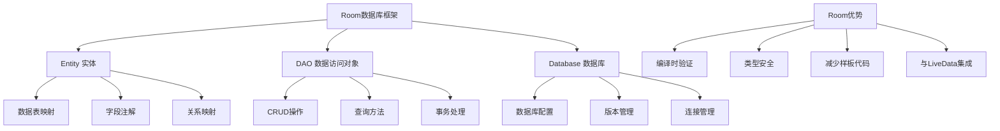

# 第18章：Room数据库框架

## 18.1 Room框架基础概念

### 18.1.1 什么是Room

Room是Google推出的持久化库，作为SQLite的抽象层，提供了更便捷、安全的数据库访问方式。Room包含三个主要组件：

- **Entity（实体）**：定义数据库表的类
- **DAO（Data Access Object）**：包含访问数据库的方法
- **Database（数据库）**：持有数据库并作为连接到应用的主要访问点



### 18.1.2 Room架构和组件

```java
// 1. Entity实体类定义
@Entity(tableName = "users")
public class User {
    @PrimaryKey(autoGenerate = true)
    private int id;

    @ColumnInfo(name = "user_name")
    private String name;

    @ColumnInfo(name = "user_email")
    private String email;

    @ColumnInfo(name = "user_phone")
    private String phone;

    @ColumnInfo(name = "user_age")
    private int age;

    @ColumnInfo(name = "is_active")
    private boolean active;

    @ColumnInfo(name = "created_at")
    private long createdAt;

    @ColumnInfo(name = "updated_at")
    private long updatedAt;

    // 构造函数
    public User() {}

    public User(String name, String email, String phone, int age, boolean active) {
        this.name = name;
        this.email = email;
        this.phone = phone;
        this.age = age;
        this.active = active;
        this.createdAt = System.currentTimeMillis();
        this.updatedAt = System.currentTimeMillis();
    }

    // Getters and Setters
    public int getId() { return id; }
    public void setId(int id) { this.id = id; }

    public String getName() { return name; }
    public void setName(String name) { this.name = name; }

    public String getEmail() { return email; }
    public void setEmail(String email) { this.email = email; }

    public String getPhone() { return phone; }
    public void setPhone(String phone) { this.phone = phone; }

    public int getAge() { return age; }
    public void setAge(int age) { this.age = age; }

    public boolean isActive() { return active; }
    public void setActive(boolean active) { this.active = active; }

    public long getCreatedAt() { return createdAt; }
    public void setCreatedAt(long createdAt) { this.createdAt = createdAt; }

    public long getUpdatedAt() { return updatedAt; }
    public void setUpdatedAt(long updatedAt) { this.updatedAt = updatedAt; }

    @Override
    public String toString() {
        return "User{" +
                "id=" + id +
                ", name='" + name + '\'' +
                ", email='" + email + '\'' +
                ", phone='" + phone + '\'' +
                ", age=" + age +
                ", active=" + active +
                '}';
    }
}

// 2. DAO接口定义
@Dao
public interface UserDao {
    @Insert
    long insertUser(User user);

    @Insert
    List<Long> insertUsers(List<User> users);

    @Insert(onConflict = OnConflictStrategy.REPLACE)
    long insertOrReplaceUser(User user);

    @Update
    int updateUser(User user);

    @Update
    int updateUsers(List<User> users);

    @Delete
    int deleteUser(User user);

    @Delete
    int deleteUsers(List<User> users);

    @Query("SELECT * FROM users")
    List<User> getAllUsers();

    @Query("SELECT * FROM users WHERE id = :id")
    User getUserById(int id);

    @Query("SELECT * FROM users WHERE email = :email LIMIT 1")
    User getUserByEmail(String email);

    @Query("SELECT * FROM users WHERE is_active = 1")
    List<User> getActiveUsers();

    @Query("SELECT * FROM users WHERE age BETWEEN :minAge AND :maxAge")
    List<User> getUsersByAgeRange(int minAge, int maxAge);

    @Query("SELECT * FROM users WHERE user_name LIKE '%' || :name || '%'")
    List<User> searchUsersByName(String name);

    @Query("DELETE FROM users WHERE id = :id")
    int deleteUserById(int id);

    @Query("UPDATE users SET is_active = :active WHERE id = :id")
    int updateUserActiveStatus(int id, boolean active);

    @Query("SELECT COUNT(*) FROM users")
    int getUserCount();

    @Query("SELECT COUNT(*) FROM users WHERE is_active = 1")
    int getActiveUserCount();

    @Query("SELECT * FROM users ORDER BY created_at DESC LIMIT :limit OFFSET :offset")
    List<User> getUsersWithPagination(int limit, int offset);
}

// 3. Database类定义
@Database(entities = {User.class, Product.class, Order.class}, version = 1, exportSchema = false)
@TypeConverters({Converters.class})
public abstract class AppDatabase extends RoomDatabase {
    private static volatile AppDatabase INSTANCE;

    public abstract UserDao userDao();
    public abstract ProductDao productDao();
    public abstract OrderDao orderDao();

    // 获取数据库实例（单例模式）
    public static AppDatabase getDatabase(final Context context) {
        if (INSTANCE == null) {
            synchronized (AppDatabase.class) {
                if (INSTANCE == null) {
                    INSTANCE = Room.databaseBuilder(context.getApplicationContext(),
                        AppDatabase.class, "app_database")
                        .addCallback(sRoomDatabaseCallback)
                        .allowMainThreadQueries() // 仅用于测试，生产环境中应避免
                        .build();
                }
            }
        }
        return INSTANCE;
    }

    // 数据库回调
    private static RoomDatabase.Callback sRoomDatabaseCallback = new RoomDatabase.Callback() {
        @Override
        public void onCreate(@NonNull SupportSQLiteDatabase db) {
            super.onCreate(db);
            // 数据库创建时的操作
            Log.d("AppDatabase", "Database created");
            populateInitialData(db);
        }

        @Override
        public void onOpen(@NonNull SupportSQLiteDatabase db) {
            super.onOpen(db);
            // 数据库打开时的操作
            Log.d("AppDatabase", "Database opened");
        }
    };

    // 填充初始数据
    private static void populateInitialData(SupportSQLiteDatabase db) {
        // 插入初始用户数据
        ContentValues userValues = new ContentValues();
        userValues.put("user_name", "系统管理员");
        userValues.put("user_email", "admin@example.com");
        userValues.put("user_phone", "13800138000");
        userValues.put("user_age", 30);
        userValues.put("is_active", 1);
        userValues.put("created_at", System.currentTimeMillis());
        userValues.put("updated_at", System.currentTimeMillis());

        long userId = db.insert("users", SQLiteDatabase.CONFLICT_IGNORE, userValues);
        Log.d("AppDatabase", "Initial user inserted with ID: " + userId);
    }

    // 重建数据库（用于测试）
    public static void rebuildDatabase(final Context context) {
        if (INSTANCE != null) {
            INSTANCE.close();
            INSTANCE = null;
        }
        context.getApplicationContext().deleteDatabase("app_database");
        getDatabase(context);
    }
}

// 4. 类型转换器
public class Converters {
    @TypeConverter
    public static Date fromTimestamp(Long value) {
        return value == null ? null : new Date(value);
    }

    @TypeConverter
    public static Long dateToTimestamp(Date date) {
        return date == null ? null : date.getTime();
    }

    @TypeConverter
    public static List<String> fromString(String value) {
        Type listType = new TypeToken<List<String>>() {}.getType();
        return new Gson().fromJson(value, listType);
    }

    @TypeConverter
    public static String fromList(List<String> list) {
        Gson gson = new Gson();
        return gson.toJson(list);
    }
}
```

## 18.2 Entity实体类详解

### 18.2.1 基本Entity配置

```java
// 基础用户实体
@Entity(tableName = "users", indices = {
    @Index(value = {"email"}, unique = true),
    @Index(value = {"name", "age"})
})
public class User {
    @PrimaryKey(autoGenerate = true)
    @ColumnInfo(name = "user_id")
    private int id;

    @ColumnInfo(name = "user_name")
    @NonNull
    private String name;

    @ColumnInfo(name = "user_email")
    private String email;

    @ColumnInfo(name = "user_phone")
    private String phone;

    @ColumnInfo(name = "user_age")
    private int age = 0;

    @ColumnInfo(name = "is_active")
    private boolean active = true;

    @ColumnInfo(name = "user_avatar")
    private String avatarUrl;

    @ColumnInfo(name = "created_at")
    private long createdAt;

    @ColumnInfo(name = "updated_at")
    private long updatedAt;

    @Ignore // 忽略此字段，不存入数据库
    private transient boolean isSelected = false;

    @Embedded // 嵌入式对象
    private Address address;

    @Relation(parentColumn = "user_id", entityColumn = "user_id", entity = UserPreference.class)
    private List<UserPreference> preferences;

    // 构造函数
    public User(@NonNull String name, String email, String phone, int age, boolean active) {
        this.name = name;
        this.email = email;
        this.phone = phone;
        this.age = age;
        this.active = active;
        this.createdAt = System.currentTimeMillis();
        this.updatedAt = System.currentTimeMillis();
    }

    @Ignore // Room忽略此构造函数
    public User(int id, @NonNull String name, String email, String phone, int age, boolean active,
                String avatarUrl, long createdAt, long updatedAt) {
        this.id = id;
        this.name = name;
        this.email = email;
        this.phone = phone;
        this.age = age;
        this.active = active;
        this.avatarUrl = avatarUrl;
        this.createdAt = createdAt;
        this.updatedAt = updatedAt;
    }

    // Getters and Setters
    public int getId() { return id; }
    public void setId(int id) { this.id = id; }

    @NonNull
    public String getName() { return name; }
    public void setName(@NonNull String name) { this.name = name; }

    public String getEmail() { return email; }
    public void setEmail(String email) { this.email = email; }

    public String getPhone() { return phone; }
    public void setPhone(String phone) { this.phone = phone; }

    public int getAge() { return age; }
    public void setAge(int age) { this.age = age; }

    public boolean isActive() { return active; }
    public void setActive(boolean active) { this.active = active; }

    public String getAvatarUrl() { return avatarUrl; }
    public void setAvatarUrl(String avatarUrl) { this.avatarUrl = avatarUrl; }

    public long getCreatedAt() { return createdAt; }
    public void setCreatedAt(long createdAt) { this.createdAt = createdAt; }

    public long getUpdatedAt() { return updatedAt; }
    public void setUpdatedAt(long updatedAt) { this.updatedAt = updatedAt; }

    public boolean isSelected() { return isSelected; }
    public void setSelected(boolean selected) { isSelected = selected; }

    public Address getAddress() { return address; }
    public void setAddress(Address address) { this.address = address; }

    public List<UserPreference> getPreferences() { return preferences; }
    public void setPreferences(List<UserPreference> preferences) { this.preferences = preferences; }

    @Override
    public boolean equals(Object o) {
        if (this == o) return true;
        if (o == null || getClass() != o.getClass()) return false;
        User user = (User) o;
        return id == user.id && name.equals(user.name) && Objects.equals(email, user.email);
    }

    @Override
    public int hashCode() {
        return Objects.hash(id, name, email);
    }

    @Override
    public String toString() {
        return "User{" +
                "id=" + id +
                ", name='" + name + '\'' +
                ", email='" + email + '\'' +
                ", age=" + age +
                ", active=" + active +
                '}';
    }
}

// 嵌入式地址对象
public class Address {
    @ColumnInfo(name = "street")
    private String street;

    @ColumnInfo(name = "city")
    private String city;

    @ColumnInfo(name = "state")
    private String state;

    @ColumnInfo(name = "postal_code")
    private String postalCode;

    @ColumnInfo(name = "country")
    private String country;

    // 构造函数
    public Address() {}

    public Address(String street, String city, String state, String postalCode, String country) {
        this.street = street;
        this.city = city;
        this.state = state;
        this.postalCode = postalCode;
        this.country = country;
    }

    // Getters and Setters
    public String getStreet() { return street; }
    public void setStreet(String street) { this.street = street; }

    public String getCity() { return city; }
    public void setCity(String city) { this.city = city; }

    public String getState() { return state; }
    public void setState(String state) { this.state = state; }

    public String getPostalCode() { return postalCode; }
    public void setPostalCode(String postalCode) { this.postalCode = postalCode; }

    public String getCountry() { return country; }
    public void setCountry(String country) { this.country = country; }

    @Override
    public String toString() {
        return street + ", " + city + ", " + state + " " + postalCode + ", " + country;
    }
}

// 用户偏好设置实体
@Entity(tableName = "user_preferences", foreignKeys = {
    @ForeignKey(
        entity = User.class,
        parentColumns = "user_id",
        childColumns = "user_id",
        onDelete = ForeignKey.CASCADE,
        onUpdate = ForeignKey.CASCADE
    )
}, indices = {
    @Index(value = {"user_id", "preference_key"}, unique = true)
})
public class UserPreference {
    @PrimaryKey(autoGenerate = true)
    private long id;

    @ColumnInfo(name = "user_id")
    private int userId;

    @ColumnInfo(name = "preference_key")
    @NonNull
    private String key;

    @ColumnInfo(name = "preference_value")
    private String value;

    @ColumnInfo(name = "preference_type")
    private String type = "string";

    @ColumnInfo(name = "created_at")
    private long createdAt;

    @ColumnInfo(name = "updated_at")
    private long updatedAt;

    // 构造函数
    public UserPreference(int userId, @NonNull String key, String value, String type) {
        this.userId = userId;
        this.key = key;
        this.value = value;
        this.type = type;
        this.createdAt = System.currentTimeMillis();
        this.updatedAt = System.currentTimeMillis();
    }

    // Getters and Setters
    public long getId() { return id; }
    public void setId(long id) { this.id = id; }

    public int getUserId() { return userId; }
    public void setUserId(int userId) { this.userId = userId; }

    @NonNull
    public String getKey() { return key; }
    public void setKey(@NonNull String key) { this.key = key; }

    public String getValue() { return value; }
    public void setValue(String value) { this.value = value; }

    public String getType() { return type; }
    public void setType(String type) { this.type = type; }

    public long getCreatedAt() { return createdAt; }
    public void setCreatedAt(long createdAt) { this.createdAt = createdAt; }

    public long getUpdatedAt() { return updatedAt; }
    public void setUpdatedAt(long updatedAt) { this.updatedAt = updatedAt; }
}

// 产品实体
@Entity(tableName = "products")
public class Product {
    @PrimaryKey(autoGenerate = true)
    private long id;

    @ColumnInfo(name = "product_name")
    @NonNull
    private String name;

    @ColumnInfo(name = "product_description")
    private String description;

    @ColumnInfo(name = "product_price")
    private double price;

    @ColumnInfo(name = "product_category")
    private String category;

    @ColumnInfo(name = "product_stock")
    private int stock;

    @ColumnInfo(name = "product_image_url")
    private String imageUrl;

    @ColumnInfo(name = "is_available")
    private boolean available = true;

    @ColumnInfo(name = "created_at")
    private long createdAt;

    @ColumnInfo(name = "updated_at")
    private long updatedAt;

    @Ignore
    private transient boolean isInCart = false;

    @Ignore
    private transient int cartQuantity = 0;

    // 构造函数
    public Product(@NonNull String name, String description, double price, String category, int stock) {
        this.name = name;
        this.description = description;
        this.price = price;
        this.category = category;
        this.stock = stock;
        this.createdAt = System.currentTimeMillis();
        this.updatedAt = System.currentTimeMillis();
    }

    // Getters and Setters
    public long getId() { return id; }
    public void setId(long id) { this.id = id; }

    @NonNull
    public String getName() { return name; }
    public void setName(@NonNull String name) { this.name = name; }

    public String getDescription() { return description; }
    public void setDescription(String description) { this.description = description; }

    public double getPrice() { return price; }
    public void setPrice(double price) { this.price = price; }

    public String getCategory() { return category; }
    public void setCategory(String category) { this.category = category; }

    public int getStock() { return stock; }
    public void setStock(int stock) { this.stock = stock; }

    public String getImageUrl() { return imageUrl; }
    public void setImageUrl(String imageUrl) { this.imageUrl = imageUrl; }

    public boolean isAvailable() { return available; }
    public void setAvailable(boolean available) { this.available = available; }

    public long getCreatedAt() { return createdAt; }
    public void setCreatedAt(long createdAt) { this.createdAt = createdAt; }

    public long getUpdatedAt() { return updatedAt; }
    public void setUpdatedAt(long updatedAt) { this.updatedAt = updatedAt; }

    public boolean isInCart() { return isInCart; }
    public void setIsInCart(boolean inCart) { isInCart = inCart; }

    public int getCartQuantity() { return cartQuantity; }
    public void setCartQuantity(int cartQuantity) { this.cartQuantity = cartQuantity; }

    public String getFormattedPrice() {
        return String.format("%.2f", price);
    }

    @Override
    public String toString() {
        return "Product{" +
                "id=" + id +
                ", name='" + name + '\'' +
                ", price=" + price +
                ", category='" + category + '\'' +
                ", stock=" + stock +
                '}';
    }
}
```

### 18.2.2 复杂Entity关系映射

```java
// 订单实体
@Entity(tableName = "orders",
    foreignKeys = {
        @ForeignKey(
            entity = User.class,
            parentColumns = "user_id",
            childColumns = "user_id",
            onDelete = ForeignKey.SET_NULL,
            onUpdate = ForeignKey.CASCADE
        )
    },
    indices = {
        @Index("user_id"),
        @Index("order_status"),
        @Index("created_at")
    })
public class Order {
    @PrimaryKey(autoGenerate = true)
    private long id;

    @ColumnInfo(name = "user_id")
    private Integer userId; // 允许为null，当用户被删除时

    @ColumnInfo(name = "order_number")
    @NonNull
    private String orderNumber;

    @ColumnInfo(name = "total_amount")
    private double totalAmount;

    @ColumnInfo(name = "order_status")
    private String status = "pending"; // pending, confirmed, shipped, delivered, cancelled

    @ColumnInfo(name = "order_date")
    private long orderDate;

    @ColumnInfo(name = "delivery_address")
    private String deliveryAddress;

    @ColumnInfo(name = "payment_method")
    private String paymentMethod;

    @ColumnInfo(name = "notes")
    private String notes;

    @ColumnInfo(name = "created_at")
    private long createdAt;

    @ColumnInfo(name = "updated_at")
    private long updatedAt;

    @Relation(
        parentColumn = "user_id",
        entityColumn = "user_id",
        entity = User.class
    )
    private User user;

    @Relation(
        parentColumn = "id",
        entityColumn = "order_id",
        entity = OrderItem.class
    )
    private List<OrderItem> items;

    // 构造函数
    public Order(@NonNull String orderNumber, Integer userId, double totalAmount, String status) {
        this.orderNumber = orderNumber;
        this.userId = userId;
        this.totalAmount = totalAmount;
        this.status = status;
        this.orderDate = System.currentTimeMillis();
        this.createdAt = System.currentTimeMillis();
        this.updatedAt = System.currentTimeMillis();
    }

    // Getters and Setters
    public long getId() { return id; }
    public void setId(long id) { this.id = id; }

    public Integer getUserId() { return userId; }
    public void setUserId(Integer userId) { this.userId = userId; }

    @NonNull
    public String getOrderNumber() { return orderNumber; }
    public void setOrderNumber(@NonNull String orderNumber) { this.orderNumber = orderNumber; }

    public double getTotalAmount() { return totalAmount; }
    public void setTotalAmount(double totalAmount) { this.totalAmount = totalAmount; }

    public String getStatus() { return status; }
    public void setStatus(String status) { this.status = status; }

    public long getOrderDate() { return orderDate; }
    public void setOrderDate(long orderDate) { this.orderDate = orderDate; }

    public String getDeliveryAddress() { return deliveryAddress; }
    public void setDeliveryAddress(String deliveryAddress) { this.deliveryAddress = deliveryAddress; }

    public String getPaymentMethod() { return paymentMethod; }
    public void setPaymentMethod(String paymentMethod) { this.paymentMethod = paymentMethod; }

    public String getNotes() { return notes; }
    public void setNotes(String notes) { this.notes = notes; }

    public long getCreatedAt() { return createdAt; }
    public void setCreatedAt(long createdAt) { this.createdAt = createdAt; }

    public long getUpdatedAt() { return updatedAt; }
    public void setUpdatedAt(long updatedAt) { this.updatedAt = updatedAt; }

    public User getUser() { return user; }
    public void setUser(User user) { this.user = user; }

    public List<OrderItem> getItems() { return items; }
    public void setItems(List<OrderItem> items) { this.items = items; }

    public String getFormattedTotalAmount() {
        return String.format("%.2f", totalAmount);
    }

    public String getFormattedOrderDate() {
        SimpleDateFormat sdf = new SimpleDateFormat("yyyy-MM-dd HH:mm", Locale.getDefault());
        return sdf.format(new Date(orderDate));
    }
}

// 订单项实体
@Entity(tableName = "order_items",
    foreignKeys = {
        @ForeignKey(
            entity = Order.class,
            parentColumns = "id",
            childColumns = "order_id",
            onDelete = ForeignKey.CASCADE,
            onUpdate = ForeignKey.CASCADE
        ),
        @ForeignKey(
            entity = Product.class,
            parentColumns = "id",
            childColumns = "product_id",
            onDelete = ForeignKey.RESTRICT,
            onUpdate = ForeignKey.CASCADE
        )
    },
    indices = {
        @Index("order_id"),
        @Index("product_id")
    })
public class OrderItem {
    @PrimaryKey(autoGenerate = true)
    private long id;

    @ColumnInfo(name = "order_id")
    private long orderId;

    @ColumnInfo(name = "product_id")
    private long productId;

    @ColumnInfo(name = "quantity")
    private int quantity;

    @ColumnInfo(name = "unit_price")
    private double unitPrice;

    @ColumnInfo(name = "total_price")
    private double totalPrice;

    @Relation(
        parentColumn = "product_id",
        entityColumn = "id",
        entity = Product.class
    )
    private Product product;

    // 构造函数
    public OrderItem(long orderId, long productId, int quantity, double unitPrice) {
        this.orderId = orderId;
        this.productId = productId;
        this.quantity = quantity;
        this.unitPrice = unitPrice;
        this.totalPrice = quantity * unitPrice;
    }

    // Getters and Setters
    public long getId() { return id; }
    public void setId(long id) { this.id = id; }

    public long getOrderId() { return orderId; }
    public void setOrderId(long orderId) { this.orderId = orderId; }

    public long getProductId() { return productId; }
    public void setProductId(long productId) { this.productId = productId; }

    public int getQuantity() { return quantity; }
    public void setQuantity(int quantity) {
        this.quantity = quantity;
        this.totalPrice = quantity * unitPrice;
    }

    public double getUnitPrice() { return unitPrice; }
    public void setUnitPrice(double unitPrice) {
        this.unitPrice = unitPrice;
        this.totalPrice = quantity * unitPrice;
    }

    public double getTotalPrice() { return totalPrice; }
    public void setTotalPrice(double totalPrice) { this.totalPrice = totalPrice; }

    public Product getProduct() { return product; }
    public void setProduct(Product product) { this.product = product; }

    public String getFormattedUnitPrice() {
        return String.format("%.2f", unitPrice);
    }

    public String getFormattedTotalPrice() {
        return String.format("%.2f", totalPrice);
    }
}

// 用户会话实体（用于记录用户登录状态）
@Entity(tableName = "user_sessions",
    foreignKeys = {
        @ForeignKey(
            entity = User.class,
            parentColumns = "user_id",
            childColumns = "user_id",
            onDelete = ForeignKey.CASCADE,
            onUpdate = ForeignKey.CASCADE
        )
    },
    indices = {
        @Index("user_id"),
        @Index("session_token", unique = true),
        @Index("expires_at")
    })
public class UserSession {
    @PrimaryKey(autoGenerate = true)
    private long id;

    @ColumnInfo(name = "user_id")
    private int userId;

    @ColumnInfo(name = "session_token")
    @NonNull
    private String sessionToken;

    @ColumnInfo(name = "device_info")
    private String deviceInfo;

    @ColumnInfo(name = "ip_address")
    private String ipAddress;

    @ColumnInfo(name = "created_at")
    private long createdAt;

    @ColumnInfo(name = "expires_at")
    private long expiresAt;

    @ColumnInfo(name = "is_active")
    private boolean isActive = true;

    @ColumnInfo(name = "last_activity_at")
    private long lastActivityAt;

    // 构造函数
    public UserSession(int userId, @NonNull String sessionToken, String deviceInfo, String ipAddress) {
        this.userId = userId;
        this.sessionToken = sessionToken;
        this.deviceInfo = deviceInfo;
        this.ipAddress = ipAddress;
        this.createdAt = System.currentTimeMillis();
        this.expiresAt = System.currentTimeMillis() + (30L * 24 * 60 * 60 * 1000); // 30天后过期
        this.lastActivityAt = System.currentTimeMillis();
    }

    // Getters and Setters
    public long getId() { return id; }
    public void setId(long id) { this.id = id; }

    public int getUserId() { return userId; }
    public void setUserId(int userId) { this.userId = userId; }

    @NonNull
    public String getSessionToken() { return sessionToken; }
    public void setSessionToken(@NonNull String sessionToken) { this.sessionToken = sessionToken; }

    public String getDeviceInfo() { return deviceInfo; }
    public void setDeviceInfo(String deviceInfo) { this.deviceInfo = deviceInfo; }

    public String getIpAddress() { return ipAddress; }
    public void setIpAddress(String ipAddress) { this.ipAddress = ipAddress; }

    public long getCreatedAt() { return createdAt; }
    public void setCreatedAt(long createdAt) { this.createdAt = createdAt; }

    public long getExpiresAt() { return expiresAt; }
    public void setExpiresAt(long expiresAt) { this.expiresAt = expiresAt; }

    public boolean isActive() { return isActive; }
    public void setActive(boolean active) { isActive = active; }

    public long getLastActivityAt() { return lastActivityAt; }
    public void setLastActivityAt(long lastActivityAt) { this.lastActivityAt = lastActivityAt; }

    // 检查会话是否过期
    public boolean isExpired() {
        return System.currentTimeMillis() > expiresAt;
    }

    // 更新最后活动时间
    public void updateLastActivity() {
        this.lastActivityAt = System.currentTimeMillis();
    }

    // 延长会话过期时间
    public void extendSession(long extensionMillis) {
        this.expiresAt += extensionMillis;
    }
}

// 复合主键实体示例（多对多关系）
@Entity(tableName = "product_tags",
    primaryKeys = {"product_id", "tag_id"},
    foreignKeys = {
        @ForeignKey(
            entity = Product.class,
            parentColumns = "id",
            childColumns = "product_id",
            onDelete = ForeignKey.CASCADE
        ),
        @ForeignKey(
            entity = Tag.class,
            parentColumns = "id",
            childColumns = "tag_id",
            onDelete = ForeignKey.CASCADE
        )
    },
    indices = {
        @Index("product_id"),
        @Index("tag_id")
    })
public class ProductTag {
    @ColumnInfo(name = "product_id")
    private long productId;

    @ColumnInfo(name = "tag_id")
    private long tagId;

    @ColumnInfo(name = "created_at")
    private long createdAt;

    // 构造函数
    public ProductTag(long productId, long tagId) {
        this.productId = productId;
        this.tagId = tagId;
        this.createdAt = System.currentTimeMillis();
    }

    // Getters and Setters
    public long getProductId() { return productId; }
    public void setProductId(long productId) { this.productId = productId; }

    public long getTagId() { return tagId; }
    public void setTagId(long tagId) { this.tagId = tagId; }

    public long getCreatedAt() { return createdAt; }
    public void setCreatedAt(long createdAt) { this.createdAt = createdAt; }
}

// 标签实体
@Entity(tableName = "tags")
public class Tag {
    @PrimaryKey(autoGenerate = true)
    private long id;

    @ColumnInfo(name = "tag_name")
    @NonNull
    private String name;

    @ColumnInfo(name = "tag_color")
    private String color;

    @ColumnInfo(name = "created_at")
    private long createdAt;

    // 构造函数
    public Tag(@NonNull String name, String color) {
        this.name = name;
        this.color = color;
        this.createdAt = System.currentTimeMillis();
    }

    // Getters and Setters
    public long getId() { return id; }
    public void setId(long id) { this.id = id; }

    @NonNull
    public String getName() { return name; }
    public void setName(@NonNull String name) { this.name = name; }

    public String getColor() { return color; }
    public void setColor(String color) { this.color = color; }

    public long getCreatedAt() { return createdAt; }
    public void setCreatedAt(long createdAt) { this.createdAt = createdAt; }
}
```

## 18.3 DAO数据访问对象

### 18.3.1 基础CRUD操作

```java
// 用户DAO接口
@Dao
public interface UserDao {
    // === 插入操作 ===
    @Insert(onConflict = OnConflictStrategy.REPLACE)
    long insertUser(User user);

    @Insert(onConflict = OnConflictStrategy.REPLACE)
    List<Long> insertUsers(List<User> users);

    @Insert
    long insertUserIgnore(User user);

    @Insert(onConflict = OnConflictStrategy.IGNORE)
    List<Long> insertUsersIgnore(List<User> users);

    // === 更新操作 ===
    @Update
    int updateUser(User user);

    @Update
    int updateUsers(List<User> users);

    @Query("UPDATE users SET user_name = :name WHERE id = :id")
    int updateUserName(int id, String name);

    @Query("UPDATE users SET user_email = :email WHERE id = :id")
    int updateUserEmail(int id, String email);

    @Query("UPDATE users SET is_active = :active WHERE id = :id")
    int updateUserActiveStatus(int id, boolean active);

    @Query("UPDATE users SET updated_at = :timestamp WHERE id = :id")
    int updateTimestamp(int id, long timestamp);

    // === 删除操作 ===
    @Delete
    int deleteUser(User user);

    @Delete
    int deleteUsers(List<User> users);

    @Query("DELETE FROM users WHERE id = :id")
    int deleteUserById(int id);

    @Query("DELETE FROM users WHERE id IN (:ids)")
    int deleteUsersByIds(List<Integer> ids);

    @Query("DELETE FROM users WHERE user_email = :email")
    int deleteUserByEmail(String email);

    @Query("DELETE FROM users WHERE is_active = 0")
    int deleteInactiveUsers();

    // === 查询操作 ===
    @Query("SELECT * FROM users")
    List<User> getAllUsers();

    @Query("SELECT * FROM users WHERE id = :id")
    User getUserById(int id);

    @Query("SELECT * FROM users WHERE id IN (:ids)")
    List<User> getUsersByIds(List<Integer> ids);

    @Query("SELECT * FROM users WHERE user_email = :email LIMIT 1")
    User getUserByEmail(String email);

    @Query("SELECT * FROM users WHERE user_name LIKE '%' || :name || '%'")
    List<User> searchUsersByName(String name);

    @Query("SELECT * FROM users WHERE user_phone = :phone")
    User getUserByPhone(String phone);

    @Query("SELECT * FROM users WHERE is_active = 1")
    List<User> getActiveUsers();

    @Query("SELECT * FROM users WHERE is_active = 0")
    List<User> getInactiveUsers();

    @Query("SELECT * FROM users WHERE user_age BETWEEN :minAge AND :maxAge")
    List<User> getUsersByAgeRange(int minAge, int maxAge);

    @Query("SELECT * FROM users WHERE user_age >= :age")
    List<User> getUsersOlderThan(int age);

    @Query("SELECT * FROM users WHERE user_age <= :age")
    List<User> getUsersYoungerThan(int age);

    @Query("SELECT * FROM users ORDER BY created_at DESC")
    List<User> getUsersOrderByCreatedDateDesc();

    @Query("SELECT * FROM users ORDER BY user_name ASC")
    List<User> getUsersOrderByNameAsc();

    @Query("SELECT * FROM users ORDER BY user_age DESC")
    List<User> getUsersOrderByAgeDesc();

    // === 分页查询 ===
    @Query("SELECT * FROM users ORDER BY created_at DESC LIMIT :limit OFFSET :offset")
    List<User> getUsersWithPagination(int limit, int offset);

    @Query("SELECT * FROM users WHERE is_active = 1 ORDER BY user_name ASC LIMIT :limit OFFSET :offset")
    List<User> getActiveUsersWithPagination(int limit, int offset);

    // === 聚合查询 ===
    @Query("SELECT COUNT(*) FROM users")
    int getUserCount();

    @Query("SELECT COUNT(*) FROM users WHERE is_active = 1")
    int getActiveUserCount();

    @Query("SELECT COUNT(*) FROM users WHERE user_age >= :age")
    int getUserCountOlderThan(int age);

    @Query("SELECT AVG(user_age) FROM users WHERE is_active = 1")
    Double getAverageActiveUserAge();

    @Query("SELECT MIN(user_age), MAX(user_age) FROM users")
    AgeRange getAgeRange();

    @Query("SELECT user_age, COUNT(*) FROM users GROUP BY user_age ORDER BY user_age")
    List<AgeCount> getUserCountByAge();

    // === 复杂查询 ===
    @Query("SELECT * FROM users WHERE " +
           "(user_name LIKE '%' || :query || '%' OR " +
           "user_email LIKE '%' || :query || '%' OR " +
           "user_phone LIKE '%' || :query || '%')")
    List<User> searchUsers(String query);

    @Query("SELECT * FROM users WHERE created_at >= :since")
    List<User> getUsersCreatedSince(long since);

    @Query("SELECT * FROM users WHERE updated_at >= :since")
    List<User> getUsersUpdatedSince(long since);

    @Query("SELECT * FROM users WHERE " +
           "created_at >= :startDate AND created_at <= :endDate")
    List<User> getUsersCreatedBetween(long startDate, long endDate);

    // === 存储过程风格查询 ===
    @Query("UPDATE users SET user_name = :name, updated_at = :timestamp WHERE id = :id")
    int updateUserNameWithTimestamp(int id, String name, long timestamp);

    @Query("INSERT INTO users (user_name, user_email, user_phone, user_age, is_active, created_at, updated_at) " +
           "VALUES (:name, :email, :phone, :age, :active, :createdAt, :updatedAt)")
    long insertUserRaw(String name, String email, String phone, int age, boolean active,
                       long createdAt, long updatedAt);

    // === 流式查询（用于大量数据） ===
    @Query("SELECT * FROM users")
    @RewriteQueriesToDropUnusedColumns
    Cursor getAllUsersCursor();

    @Query("SELECT * FROM users WHERE is_active = 1")
    PagingSource<Integer, User> getActiveUsersPaged();

    // === 事务性操作 ===
    @Transaction
    @Query("SELECT * FROM users WHERE id = :id")
    User getUserWithPreferences(int id);

    @Transaction
    @Query("SELECT * FROM orders WHERE user_id = :userId")
    List<Order> getOrdersWithItems(int userId);
}

// 产品DAO接口
@Dao
public interface ProductDao {
    @Insert(onConflict = OnConflictStrategy.REPLACE)
    long insertProduct(Product product);

    @Insert(onConflict = OnConflictStrategy.REPLACE)
    List<Long> insertProducts(List<Product> products);

    @Update
    int updateProduct(Product product);

    @Update
    int updateProducts(List<Product> products);

    @Delete
    int deleteProduct(Product product);

    @Delete
    int deleteProducts(List<Product> products);

    @Query("DELETE FROM products WHERE id = :id")
    int deleteProductById(long id);

    @Query("SELECT * FROM products")
    List<Product> getAllProducts();

    @Query("SELECT * FROM products WHERE id = :id")
    Product getProductById(long id);

    @Query("SELECT * FROM products WHERE product_category = :category")
    List<Product> getProductsByCategory(String category);

    @Query("SELECT * FROM products WHERE product_name LIKE '%' || :name || '%'")
    List<Product> searchProductsByName(String name);

    @Query("SELECT * FROM products WHERE is_available = 1")
    List<Product> getAvailableProducts();

    @Query("SELECT * FROM products WHERE product_stock > 0")
    List<Product> getInStockProducts();

    @Query("SELECT * FROM products WHERE product_price BETWEEN :minPrice AND :maxPrice")
    List<Product> getProductsByPriceRange(double minPrice, double maxPrice);

    @Query("SELECT * FROM products ORDER BY product_name ASC")
    List<Product> getProductsOrderByName();

    @Query("SELECT * FROM products ORDER BY product_price ASC")
    List<Product> getProductsOrderByPrice();

    @Query("SELECT * FROM products ORDER BY created_at DESC")
    List<Product> getProductsOrderByCreatedDate();

    @Query("SELECT COUNT(*) FROM products")
    int getProductCount();

    @Query("SELECT COUNT(*) FROM products WHERE is_available = 1")
    int getAvailableProductCount();

    @Query("SELECT AVG(product_price) FROM products WHERE product_category = :category")
    Double getAveragePriceByCategory(String category);

    @Query("SELECT DISTINCT product_category FROM products")
    List<String> getAllCategories();

    @Query("SELECT * FROM products WHERE product_stock < :threshold")
    List<Product> getLowStockProducts(int threshold);

    @Query("UPDATE products SET product_stock = product_stock - :quantity WHERE id = :id AND product_stock >= :quantity")
    int decreaseStock(long id, int quantity);

    @Query("UPDATE products SET product_stock = product_stock + :quantity WHERE id = :id")
    int increaseStock(long id, int quantity);

    @Query("UPDATE products SET is_available = :available WHERE id = :id")
    int updateProductAvailability(long id, boolean available);

    @Query("SELECT * FROM products LIMIT :limit OFFSET :offset")
    List<Product getProductsWithPagination(int limit, int offset);

    @Query("SELECT * FROM products WHERE product_category = :category LIMIT :limit OFFSET :offset")
    List<Product> getProductsByCategoryWithPagination(String category, int limit, int offset);

    @Query("SELECT * FROM products ORDER BY product_name ASC LIMIT :limit OFFSET :offset")
    PagingSource<Integer, Product> getProductsPaged();
}

// 订单DAO接口
@Dao
public interface OrderDao {
    @Insert
    long insertOrder(Order order);

    @Insert
    List<Long> insertOrders(List<Order> orders);

    @Update
    int updateOrder(Order order);

    @Update
    int updateOrders(List<Order> orders);

    @Delete
    int deleteOrder(Order order);

    @Delete
    int deleteOrders(List<Order> orders);

    @Query("DELETE FROM orders WHERE id = :id")
    int deleteOrderById(long id);

    @Query("SELECT * FROM orders")
    List<Order> getAllOrders();

    @Query("SELECT * FROM orders WHERE id = :id")
    Order getOrderById(long id);

    @Query("SELECT * FROM orders WHERE order_number = :orderNumber")
    Order getOrderByNumber(String orderNumber);

    @Query("SELECT * FROM orders WHERE user_id = :userId")
    List<Order> getOrdersByUserId(int userId);

    @Query("SELECT * FROM orders WHERE order_status = :status")
    List<Order> getOrdersByStatus(String status);

    @Query("SELECT * FROM orders WHERE user_id = :userId AND order_status = :status")
    List<Order> getOrdersByUserAndStatus(int userId, String status);

    @Query("SELECT * FROM orders WHERE order_date >= :since")
    List<Order> getOrdersSince(long since);

    @Query("SELECT * FROM orders WHERE order_date BETWEEN :startDate AND :endDate")
    List<Order> getOrdersBetweenDates(long startDate, long endDate);

    @Query("SELECT * FROM orders ORDER BY order_date DESC")
    List<Order> getOrdersOrderByDateDesc();

    @Query("SELECT * FROM orders ORDER BY total_amount DESC")
    List<Order> getOrdersOrderByAmountDesc();

    @Query("SELECT COUNT(*) FROM orders")
    int getOrderCount();

    @Query("SELECT COUNT(*) FROM orders WHERE order_status = :status")
    int getOrderCountByStatus(String status);

    @Query("SELECT COUNT(*) FROM orders WHERE user_id = :userId")
    int getOrderCountByUserId(int userId);

    @Query("SELECT SUM(total_amount) FROM orders WHERE order_status = 'completed'")
    Double getTotalRevenue();

    @Query("SELECT SUM(total_amount) FROM orders WHERE user_id = :userId AND order_status = 'completed'")
    Double getTotalRevenueByUser(int userId);

    @Query("SELECT AVG(total_amount) FROM orders")
    Double getAverageOrderAmount();

    @Query("SELECT order_status, COUNT(*) as count FROM orders GROUP BY order_status")
    List<OrderStatusCount> getOrderStatusCounts();

    @Query("UPDATE orders SET order_status = :status WHERE id = :id")
    int updateOrderStatus(long id, String status);

    @Query("UPDATE orders SET order_status = :status WHERE user_id = :userId")
    int updateOrderStatusByUser(int userId, String status);

    @Query("SELECT * FROM orders LIMIT :limit OFFSET :offset")
    List<Order> getOrdersWithPagination(int limit, int offset);

    @Query("SELECT * FROM orders WHERE user_id = :userId ORDER BY order_date DESC LIMIT :limit OFFSET :offset")
    List<Order> getUserOrdersWithPagination(int userId, int limit, int offset);

    @Transaction
    @Query("SELECT * FROM orders WHERE id = :orderId")
    Order getOrderWithItems(long orderId);

    @Transaction
    @Query("SELECT * FROM orders WHERE user_id = :userId")
    List<Order> getUserOrdersWithItems(int userId);

    @Query("SELECT * FROM orders ORDER BY order_date DESC")
    PagingSource<Integer, Order> getOrdersPaged();
}

// 查询结果类
public class AgeRange {
    public int minAge;
    public int maxAge;
}

public class AgeCount {
    public int age;
    public int count;
}

public class OrderStatusCount {
    public String orderStatus;
    public int count;
}

public class ProductStockInfo {
    public long productId;
    public String productName;
    public int currentStock;
    public int lowStockThreshold;
    public boolean isLowStock;
}
```

### 18.3.2 复杂查询和关系处理

```java
// 用户偏好DAO接口
@Dao
public interface UserPreferenceDao {
    @Insert(onConflict = OnConflictStrategy.REPLACE)
    long insertPreference(UserPreference preference);

    @Insert(onConflict = OnConflictStrategy.REPLACE)
    List<Long> insertPreferences(List<UserPreference> preferences);

    @Update
    int updatePreference(UserPreference preference);

    @Delete
    int deletePreference(UserPreference preference);

    @Query("DELETE FROM user_preferences WHERE user_id = :userId")
    int deleteAllPreferencesByUser(int userId);

    @Query("DELETE FROM user_preferences WHERE user_id = :userId AND preference_key = :key")
    int deletePreferenceByKey(int userId, String key);

    @Query("SELECT * FROM user_preferences WHERE user_id = :userId")
    List<UserPreference> getPreferencesByUserId(int userId);

    @Query("SELECT * FROM user_preferences WHERE user_id = :userId AND preference_key = :key")
    UserPreference getPreferenceByKey(int userId, String key);

    @Query("SELECT * FROM user_preferences WHERE user_id = :userId AND preference_type = :type")
    List<UserPreference> getPreferencesByType(int userId, String type);

    @Query("UPDATE user_preferences SET preference_value = :value, updated_at = :timestamp WHERE user_id = :userId AND preference_key = :key")
    int updatePreferenceValue(int userId, String key, String value, long timestamp);

    @Query("SELECT preference_key FROM user_preferences WHERE user_id = :userId")
    List<String> getPreferenceKeysByUser(int userId);

    @Transaction
    @Query("SELECT * FROM users WHERE id = :userId")
    User getUserWithAllPreferences(int userId);
}

// 产品标签DAO接口
@Dao
public interface ProductTagDao {
    @Insert(onConflict = OnConflictStrategy.REPLACE)
    long insertProductTag(ProductTag productTag);

    @Insert(onConflict = OnConflictStrategy.REPLACE)
    List<Long> insertProductTags(List<ProductTag> productTags);

    @Delete
    int deleteProductTag(ProductTag productTag);

    @Query("DELETE FROM product_tags WHERE product_id = :productId")
    int deleteAllTagsForProduct(long productId);

    @Query("DELETE FROM product_tags WHERE tag_id = :tagId")
    int deleteAllProductsForTag(long tagId);

    @Query("DELETE FROM product_tags WHERE product_id = :productId AND tag_id = :tagId")
    int deleteProductTag(long productId, long tagId);

    @Query("SELECT * FROM product_tags WHERE product_id = :productId")
    List<ProductTag> getTagsForProduct(long productId);

    @Query("SELECT * FROM product_tags WHERE tag_id = :tagId")
    List<ProductTag> getProductsForTag(long tagId);

    @Transaction
    @Query("SELECT * FROM products WHERE id = :productId")
    Product getProductWithTags(long productId);

    @Transaction
    @Query("SELECT * FROM tags WHERE id = :tagId")
    Tag getTagWithProducts(long tagId);

    @Query("SELECT DISTINCT p.* FROM products p " +
           "INNER JOIN product_tags pt ON p.id = pt.product_id " +
           "WHERE pt.tag_id = :tagId")
    List<Product> getProductsByTagId(long tagId);

    @Query("SELECT DISTINCT t.* FROM tags t " +
           "INNER JOIN product_tags pt ON t.id = pt.tag_id " +
           "WHERE pt.product_id = :productId")
    List<Tag> getTagsByProductId(long productId);
}

// 标签DAO接口
@Dao
public interface TagDao {
    @Insert(onConflict = OnConflictStrategy.REPLACE)
    long insertTag(Tag tag);

    @Insert(onConflict = OnConflictStrategy.REPLACE)
    List<Long> insertTags(List<Tag> tags);

    @Update
    int updateTag(Tag tag);

    @Delete
    int deleteTag(Tag tag);

    @Query("DELETE FROM tags WHERE id = :id")
    int deleteTagById(long id);

    @Query("SELECT * FROM tags")
    List<Tag> getAllTags();

    @Query("SELECT * FROM tags WHERE id = :id")
    Tag getTagById(long id);

    @Query("SELECT * FROM tags WHERE tag_name = :name")
    Tag getTagByName(String name);

    @Query("SELECT * FROM tags WHERE tag_name LIKE '%' || :name || '%'")
    List<Tag> searchTagsByName(String name);

    @Query("SELECT COUNT(*) FROM tags")
    int getTagCount();

    @Query("SELECT t.*, COUNT(pt.product_id) as product_count FROM tags t " +
           "LEFT JOIN product_tags pt ON t.id = pt.tag_id " +
           "GROUP BY t.id ORDER BY product_count DESC")
    List<TagWithProductCount> getTagsWithProductCount();

    @Query("SELECT * FROM tags ORDER BY tag_name ASC")
    List<Tag> getTagsOrderByName();

    @Query("SELECT * FROM tags ORDER BY created_at DESC")
    List<Tag> getTagsOrderByCreatedDate();
}

// 查询结果类
public class TagWithProductCount {
    @Embedded
    public Tag tag;

    public int productCount;
}

// 用户会话DAO接口
@Dao
public interface UserSessionDao {
    @Insert(onConflict = OnConflictStrategy.REPLACE)
    long insertSession(UserSession session);

    @Insert(onConflict = OnConflictStrategy.REPLACE)
    List<Long> insertSessions(List<UserSession> sessions);

    @Update
    int updateSession(UserSession session);

    @Delete
    int deleteSession(UserSession session);

    @Query("DELETE FROM user_sessions WHERE id = :id")
    int deleteSessionById(long id);

    @Query("DELETE FROM user_sessions WHERE user_id = :userId")
    int deleteAllSessionsByUser(int userId);

    @Query("DELETE FROM user_sessions WHERE session_token = :token")
    int deleteSessionByToken(String token);

    @Query("SELECT * FROM user_sessions WHERE id = :id")
    UserSession getSessionById(long id);

    @Query("SELECT * FROM user_sessions WHERE session_token = :token")
    UserSession getSessionByToken(String token);

    @Query("SELECT * FROM user_sessions WHERE user_id = :userId")
    List<UserSession> getSessionsByUserId(int userId);

    @Query("SELECT * FROM user_sessions WHERE user_id = :userId AND is_active = 1")
    List<UserSession> getActiveSessionsByUser(int userId);

    @Query("SELECT * FROM user_sessions WHERE is_active = 1")
    List<UserSession> getAllActiveSessions();

    @Query("SELECT * FROM user_sessions WHERE expires_at <= :currentTime")
    List<UserSession> getExpiredSessions(long currentTime);

    @Query("DELETE FROM user_sessions WHERE expires_at <= :currentTime")
    int deleteExpiredSessions(long currentTime);

    @Query("UPDATE user_sessions SET is_active = 0 WHERE expires_at <= :currentTime")
    int deactivateExpiredSessions(long currentTime);

    @Query("UPDATE user_sessions SET last_activity_at = :timestamp WHERE id = :id")
    int updateLastActivity(long id, long timestamp);

    @Query("UPDATE user_sessions SET expires_at = :newExpiry WHERE id = :id")
    int extendSessionExpiry(long id, long newExpiry);

    @Query("UPDATE user_sessions SET is_active = 0 WHERE user_id = :userId")
    int deactivateAllSessionsByUser(int userId);

    @Query("SELECT COUNT(*) FROM user_sessions WHERE is_active = 1")
    int getActiveSessionCount();

    @Query("SELECT COUNT(*) FROM user_sessions WHERE user_id = :userId AND is_active = 1")
    int getActiveSessionCountByUser(int userId);

    @Transaction
    @Query("SELECT * FROM users WHERE id = :userId")
    User getUserWithSessions(int userId);

    @Query("SELECT * FROM user_sessions WHERE last_activity_at >= :since")
    List<UserSession> getRecentSessions(long since);

    @Query("SELECT DISTINCT user_id FROM user_sessions WHERE is_active = 1")
    List<Integer> getActiveUserIds();

    @Query("SELECT ip_address, COUNT(*) as session_count FROM user_sessions " +
           "WHERE created_at >= :since GROUP BY ip_address ORDER BY session_count DESC")
    List<IpSessionCount> getIpSessionCountsSince(long since);
}

public class IpSessionCount {
    public String ipAddress;
    public int sessionCount;
}

// 订单项DAO接口
@Dao
public interface OrderItemDao {
    @Insert
    long insertOrderItem(OrderItem orderItem);

    @Insert
    List<Long> insertOrderItems(List<OrderItem> orderItems);

    @Update
    int updateOrderItem(OrderItem orderItem);

    @Delete
    int deleteOrderItem(OrderItem orderItem);

    @Query("DELETE FROM order_items WHERE id = :id")
    int deleteOrderItemById(long id);

    @Query("DELETE FROM order_items WHERE order_id = :orderId")
    int deleteAllItemsForOrder(long orderId);

    @Query("SELECT * FROM order_items WHERE order_id = :orderId")
    List<OrderItem> getItemsForOrder(long orderId);

    @Query("SELECT * FROM order_items WHERE product_id = :productId")
    List<OrderItem> getItemsForProduct(long productId);

    @Query("SELECT COUNT(*) FROM order_items WHERE order_id = :orderId")
    int getItemCountForOrder(long orderId);

    @Query("SELECT SUM(total_price) FROM order_items WHERE order_id = :orderId")
    Double getTotalForOrder(long orderId);

    @Query("SELECT SUM(quantity) FROM order_items WHERE product_id = :productId")
    Integer getTotalQuantityForProduct(long productId);

    @Query("SELECT product_id, SUM(quantity) as total_quantity, SUM(total_price) as total_revenue " +
           "FROM order_items GROUP BY product_id ORDER BY total_revenue DESC")
    List<ProductSalesStats> getProductSalesStats();

    @Query("SELECT * FROM order_items WHERE order_id = :orderId ORDER BY id ASC")
    List<OrderItem> getItemsForOrderOrdered(long orderId);

    @Transaction
    @Query("SELECT * FROM order_items WHERE order_id = :orderId")
    List<OrderItem> getOrderItemsWithProducts(long orderId);

    @Transaction
    @Query("SELECT * FROM order_items WHERE product_id = :productId")
    List<OrderItem> getProductItemsWithOrders(long productId);
}

public class ProductSalesStats {
    public long productId;
    public int totalQuantity;
    public double totalRevenue;
}

// 复杂查询DAO接口
@Dao
public interface ComplexQueryDao {
    // 用户统计查询
    @Query("SELECT u.*, COUNT(o.id) as order_count, COALESCE(SUM(o.total_amount), 0) as total_spent " +
           "FROM users u LEFT JOIN orders o ON u.id = o.user_id " +
           "GROUP BY u.id ORDER BY total_spent DESC")
    List<UserWithOrderStats> getUserOrderStats();

    @Query("SELECT u.*, COUNT(o.id) as order_count, COALESCE(SUM(o.total_amount), 0) as total_spent " +
           "FROM users u LEFT JOIN orders o ON u.id = o.user_id " +
           "WHERE o.order_status = 'completed' " +
           "GROUP BY u.id HAVING COUNT(o.id) > 0 " +
           "ORDER BY total_spent DESC")
    List<UserWithOrderStats> getActiveUserStats();

    // 产品销售统计
    @Query("SELECT p.*, COUNT(oi.id) as order_count, COALESCE(SUM(oi.quantity), 0) as total_quantity, " +
           "COALESCE(SUM(oi.total_price), 0) as total_revenue " +
           "FROM products p LEFT JOIN order_items oi ON p.id = oi.product_id " +
           "GROUP BY p.id ORDER BY total_revenue DESC")
    List<ProductWithSalesStats> getProductSalesStats();

    // 热门产品查询
    @Query("SELECT p.*, COUNT(oi.id) as order_count " +
           "FROM products p INNER JOIN order_items oi ON p.id = oi.product_id " +
           "WHERE oi.created_at >= :since " +
           "GROUP BY p.id ORDER BY order_count DESC LIMIT :limit")
    List<ProductWithOrderCount> getPopularProducts(long since, int limit);

    // 分类销售统计
    @Query("SELECT p.product_category, COUNT(o.id) as order_count, COALESCE(SUM(o.total_amount), 0) as total_revenue " +
           "FROM products p LEFT JOIN orders o ON p.id = " +
           "(SELECT product_id FROM order_items WHERE order_id = o.id) " +
           "GROUP BY p.product_category ORDER BY total_revenue DESC")
    List<CategorySalesStats> getCategorySalesStats();

    // 用户活动统计
    @Query("SELECT u.id as user_id, u.user_name, COUNT(s.id) as session_count, " +
           "MAX(s.last_activity_at) as last_activity " +
           "FROM users u LEFT JOIN user_sessions s ON u.id = s.user_id " +
           "WHERE s.created_at >= :since " +
           "GROUP BY u.id ORDER BY session_count DESC")
    List<UserActivityStats> getUserActivityStats(long since);

    // 库存预警查询
    @Query("SELECT p.id, p.product_name, p.product_category, p.product_stock, " +
           "CASE WHEN p.product_stock <= 10 THEN 1 ELSE 0 END as low_stock_flag " +
           "FROM products p WHERE p.product_stock <= :threshold " +
           "ORDER BY p.product_stock ASC")
    List<LowStockProduct> getLowStockProducts(int threshold);

    // 收入趋势查询
    @Query("SELECT DATE(created_at / 1000, 'unixepoch') as date, " +
           "COUNT(*) as order_count, SUM(total_amount) as total_revenue " +
           "FROM orders WHERE created_at >= :since " +
           "GROUP BY DATE(created_at / 1000, 'unixepoch') " +
           "ORDER BY date ASC")
    List<DailyRevenueStats> getDailyRevenueStats(long since);

    // 月度统计查询
    @Query("SELECT strftime('%Y-%m', created_at / 1000, 'unixepoch') as month, " +
           "COUNT(*) as order_count, SUM(total_amount) as total_revenue, " +
           "COUNT(DISTINCT user_id) as unique_customers " +
           "FROM orders WHERE created_at >= :since " +
           "GROUP BY strftime('%Y-%m', created_at / 1000, 'unixepoch') " +
           "ORDER BY month ASC")
    List<MonthlyRevenueStats> getMonthlyRevenueStats(long since);
}

// 查询结果类
public class UserWithOrderStats {
    @Embedded
    public User user;

    public int orderCount;
    public double totalSpent;

    public String getFormattedTotalSpent() {
        return String.format("%.2f", totalSpent);
    }
}

public class ProductWithSalesStats {
    @Embedded
    public Product product;

    public int orderCount;
    public int totalQuantity;
    public double totalRevenue;

    public String getFormattedRevenue() {
        return String.format("%.2f", totalRevenue);
    }
}

public class ProductWithOrderCount {
    @Embedded
    public Product product;

    public int orderCount;
}

public class CategorySalesStats {
    public String category;
    public int orderCount;
    public double totalRevenue;

    public String getFormattedRevenue() {
        return String.format("%.2f", totalRevenue);
    }
}

public class UserActivityStats {
    public int userId;
    public String userName;
    public int sessionCount;
    public long lastActivity;

    public String getFormattedLastActivity() {
        SimpleDateFormat sdf = new SimpleDateFormat("yyyy-MM-dd HH:mm", Locale.getDefault());
        return sdf.format(new Date(lastActivity));
    }
}

public class LowStockProduct {
    public long id;
    public String productName;
    public String category;
    public int stock;
    public int lowStockFlag;

    public boolean isLowStock() {
        return lowStockFlag == 1;
    }
}

public class DailyRevenueStats {
    public String date;
    public int orderCount;
    public double totalRevenue;

    public String getFormattedRevenue() {
        return String.format("%.2f", totalRevenue);
    }
}

public class MonthlyRevenueStats {
    public String month;
    public int orderCount;
    public double totalRevenue;
    public int uniqueCustomers;

    public String getFormattedRevenue() {
        return String.format("%.2f", totalRevenue);
    }

    public double getAverageOrderValue() {
        return orderCount > 0 ? totalRevenue / orderCount : 0;
    }
}
```

## 18.4 数据库迁移和版本管理

### 18.4.1 数据库迁移基础

```java
// 数据库版本1 -> 2 的迁移
@Database(
    entities = {User.class, Product.class, Order.class, UserPreference.class},
    version = 2,
    exportSchema = false
)
@TypeConverters({Converters.class})
public abstract class AppDatabase extends RoomDatabase {
    // ... 其他代码保持不变

    // 获取数据库实例（支持迁移）
    public static AppDatabase getDatabase(final Context context, boolean migrateIfNeeded) {
        if (INSTANCE == null) {
            synchronized (AppDatabase.class) {
                if (INSTANCE == null) {
                    RoomDatabase.Builder builder = Room.databaseBuilder(
                        context.getApplicationContext(),
                        AppDatabase.class,
                        "app_database"
                    );

                    if (migrateIfNeeded) {
                        builder.addMigrations(
                            MIGRATION_1_2,
                            MIGRATION_2_3,
                            MIGRATION_3_4,
                            MIGRATION_4_5
                        );
                    }

                    builder.addCallback(sRoomDatabaseCallback);
                    builder.allowMainThreadQueries(); // 仅用于测试

                    INSTANCE = builder.build();
                }
            }
        }
        return INSTANCE;
    }

    // 迁移1 -> 2：添加用户头像字段
    static final Migration MIGRATION_1_2 = new Migration(1, 2) {
        @Override
        public void migrate(SupportSQLiteDatabase database) {
            // 添加用户头像字段
            database.execSQL("ALTER TABLE users ADD COLUMN user_avatar TEXT");

            // 创建用户偏好表
            database.execSQL("CREATE TABLE IF NOT EXISTS user_preferences (" +
                    "id INTEGER PRIMARY KEY AUTOINCREMENT, " +
                    "user_id INTEGER NOT NULL, " +
                    "preference_key TEXT NOT NULL, " +
                    "preference_value TEXT, " +
                    "preference_type TEXT DEFAULT 'string', " +
                    "created_at INTEGER NOT NULL, " +
                    "updated_at INTEGER NOT NULL, " +
                    "FOREIGN KEY(user_id) REFERENCES users(user_id) ON DELETE CASCADE ON UPDATE CASCADE" +
                    ")");

            // 创建索引
            database.execSQL("CREATE INDEX IF NOT EXISTS index_user_preferences_user_key ON " +
                    "user_preferences(user_id, preference_key)");

            Log.d("Migration", "Migration 1->2 completed successfully");
        }
    };

    // 迁移2 -> 3：添加产品描述和图片字段
    static final Migration MIGRATION_2_3 = new Migration(2, 3) {
        @Override
        public void migrate(SupportSQLiteDatabase database) {
            // 添加产品描述字段
            database.execSQL("ALTER TABLE products ADD COLUMN product_description TEXT");

            // 添加产品图片字段
            database.execSQL("ALTER TABLE products ADD COLUMN product_image_url TEXT");

            // 添加产品可用性字段
            database.execSQL("ALTER TABLE products ADD COLUMN is_available INTEGER DEFAULT 1");

            // 创建产品分类索引
            database.execSQL("CREATE INDEX IF NOT EXISTS index_products_category ON " +
                    "products(product_category)");

            Log.d("Migration", "Migration 2->3 completed successfully");
        }
    };

    // 迁移3 -> 4：添加订单项表和订单状态枚举
    static final Migration MIGRATION_3_4 = new Migration(3, 4) {
        @Override
        public void migrate(SupportSQLiteDatabase database) {
            // 创建订单项表
            database.execSQL("CREATE TABLE IF NOT EXISTS order_items (" +
                    "id INTEGER PRIMARY KEY AUTOINCREMENT, " +
                    "order_id INTEGER NOT NULL, " +
                    "product_id INTEGER NOT NULL, " +
                    "quantity INTEGER NOT NULL, " +
                    "unit_price REAL NOT NULL, " +
                    "total_price REAL NOT NULL, " +
                    "FOREIGN KEY(order_id) REFERENCES orders(id) ON DELETE CASCADE ON UPDATE CASCADE, " +
                    "FOREIGN KEY(product_id) REFERENCES products(id) ON DELETE RESTRICT ON UPDATE CASCADE" +
                    ")");

            // 创建索引
            database.execSQL("CREATE INDEX IF NOT EXISTS index_order_items_order_id ON " +
                    "order_items(order_id)");
            database.execSQL("CREATE INDEX IF NOT EXISTS index_order_items_product_id ON " +
                    "order_items(product_id)");

            // 更新订单表，添加更多字段
            database.execSQL("ALTER TABLE orders ADD COLUMN delivery_address TEXT");
            database.execSQL("ALTER TABLE orders ADD COLUMN payment_method TEXT");
            database.execSQL("ALTER TABLE orders ADD COLUMN notes TEXT");

            // 更新订单状态数据
            database.execSQL("UPDATE orders SET order_status = 'pending' WHERE order_status IS NULL");

            Log.d("Migration", "Migration 3->4 completed successfully");
        }
    };

    // 迁移4 -> 5：添加标签系统和多对多关系
    static final Migration MIGRATION_4_5 = new Migration(4, 5) {
        @Override
        public void migrate(SupportSQLiteDatabase database) {
            // 创建标签表
            database.execSQL("CREATE TABLE IF NOT EXISTS tags (" +
                    "id INTEGER PRIMARY KEY AUTOINCREMENT, " +
                    "tag_name TEXT NOT NULL, " +
                    "tag_color TEXT, " +
                    "created_at INTEGER NOT NULL" +
                    ")");

            // 创建产品标签关联表
            database.execSQL("CREATE TABLE IF NOT EXISTS product_tags (" +
                    "product_id INTEGER NOT NULL, " +
                    "tag_id INTEGER NOT NULL, " +
                    "created_at INTEGER NOT NULL, " +
                    "PRIMARY KEY (product_id, tag_id), " +
                    "FOREIGN KEY(product_id) REFERENCES products(id) ON DELETE CASCADE, " +
                    "FOREIGN KEY(tag_id) REFERENCES tags(id) ON DELETE CASCADE" +
                    ")");

            // 创建索引
            database.execSQL("CREATE INDEX IF NOT EXISTS index_tags_name ON tags(tag_name)");
            database.execSQL("CREATE INDEX IF NOT EXISTS index_product_tags_product_id ON product_tags(product_id)");
            database.execSQL("CREATE INDEX IF NOT EXISTS index_product_tags_tag_id ON product_tags(tag_id)");

            // 插入一些默认标签
            insertDefaultTags(database);

            Log.d("Migration", "Migration 4->5 completed successfully");
        }

        private void insertDefaultTags(SupportSQLiteDatabase database) {
            ContentValues values = new ContentValues();
            values.put("tag_name", "热门");
            values.put("tag_color", "#FF5722");
            values.put("created_at", System.currentTimeMillis());
            database.insert("tags", SQLiteDatabase.CONFLICT_IGNORE, values);

            values.clear();
            values.put("tag_name", "新品");
            values.put("tag_color", "#4CAF50");
            values.put("created_at", System.currentTimeMillis());
            database.insert("tags", SQLiteDatabase.CONFLICT_IGNORE, values);

            values.clear();
            values.put("tag_name", "促销");
            values.put("tag_color", "#2196F3");
            values.put("created_at", System.currentTimeMillis());
            database.insert("tags", SQLiteDatabase.CONFLICT_IGNORE, values);
        }
    };

    // 复杂迁移示例：重构用户表结构
    static final Migration COMPLEX_MIGRATION = new Migration(5, 6) {
        @Override
        public void migrate(SupportSQLiteDatabase database) {
            // 1. 创建新的用户表结构
            database.execSQL("CREATE TABLE users_new (" +
                    "id INTEGER PRIMARY KEY AUTOINCREMENT, " +
                    "user_name TEXT NOT NULL, " +
                    "user_email TEXT UNIQUE, " +
                    "user_phone TEXT, " +
                    "user_age INTEGER DEFAULT 0, " +
                    "is_active INTEGER DEFAULT 1, " +
                    "user_avatar TEXT, " +
                    "created_at INTEGER NOT NULL, " +
                    "updated_at INTEGER NOT NULL" +
                    ")");

            // 2. 创建必要的索引
            database.execSQL("CREATE INDEX IF NOT EXISTS index_users_email ON users_new(user_email)");
            database.execSQL("CREATE INDEX IF NOT EXISTS index_users_name_active ON users_new(user_name, is_active)");

            // 3. 迁移数据
            database.execSQL("INSERT INTO users_new (id, user_name, user_email, user_phone, user_age, " +
                    "is_active, user_avatar, created_at, updated_at) " +
                    "SELECT id, user_name, user_email, user_phone, user_age, is_active, " +
                    "user_avatar, created_at, updated_at FROM users");

            // 4. 删除旧表
            database.execSQL("DROP TABLE users");

            // 5. 重命名新表
            database.execSQL("ALTER TABLE users_new RENAME TO users");

            // 6. 更新视图（如果有）
            recreateViews(database);

            // 7. 更新触发器（如果有）
            recreateTriggers(database);

            Log.d("Migration", "Complex migration completed successfully");
        }

        private void recreateViews(SupportSQLiteDatabase database) {
            // 重新创建视图
            database.execSQL("DROP VIEW IF EXISTS user_summary");
            database.execSQL("CREATE VIEW user_summary AS " +
                    "SELECT id, user_name, user_email, COUNT(DISTINCT o.id) as order_count " +
                    "FROM users u LEFT JOIN orders o ON u.id = o.user_id " +
                    "GROUP BY u.id");
        }

        private void recreateTriggers(SupportSQLiteDatabase database) {
            // 重新创建触发器
            database.execSQL("DROP TRIGGER IF EXISTS update_user_timestamp");
            database.execSQL("CREATE TRIGGER update_user_timestamp " +
                    "AFTER UPDATE ON users " +
                    "BEGIN " +
                    "UPDATE users SET updated_at = strftime('%s', 'now') WHERE id = NEW.id; " +
                    "END");
        }
    };

    // 数据库回调，用于填充初始数据
    private static RoomDatabase.Callback sRoomDatabaseCallback = new RoomDatabase.Callback() {
        @Override
        public void onCreate(@NonNull SupportSQLiteDatabase db) {
            super.onCreate(db);
            // 数据库创建时的操作
            populateInitialData(db);
        }

        @Override
        public void onOpen(@NonNull SupportSQLiteDatabase db) {
            super.onOpen(db);
            // 数据库打开时的操作
            enableForeignKeys(db);
        }

        private void populateInitialData(SupportSQLiteDatabase db) {
            // 插入初始用户数据
            ContentValues userValues = new ContentValues();
            userValues.put("user_name", "系统管理员");
            userValues.put("user_email", "admin@example.com");
            userValues.put("user_phone", "13800138000");
            userValues.put("user_age", 30);
            userValues.put("is_active", 1);
            userValues.put("created_at", System.currentTimeMillis());
            userValues.put("updated_at", System.currentTimeMillis());

            long userId = db.insert("users", SQLiteDatabase.CONFLICT_IGNORE, userValues);

            // 插入用户偏好设置
            if (userId != -1) {
                ContentValues prefValues = new ContentValues();
                prefValues.put("user_id", userId);
                prefValues.put("preference_key", "theme");
                prefValues.put("preference_value", "light");
                prefValues.put("preference_type", "string");
                prefValues.put("created_at", System.currentTimeMillis());
                prefValues.put("updated_at", System.currentTimeMillis());
                db.insert("user_preferences", SQLiteDatabase.CONFLICT_IGNORE, prefValues);

                prefValues.clear();
                prefValues.put("user_id", userId);
                prefValues.put("preference_key", "notifications");
                prefValues.put("preference_value", "true");
                prefValues.put("preference_type", "boolean");
                prefValues.put("created_at", System.currentTimeMillis());
                prefValues.put("updated_at", System.currentTimeMillis());
                db.insert("user_preferences", SQLiteDatabase.CONFLICT_IGNORE, prefValues);
            }

            // 插入初始产品数据
            insertInitialProducts(db);

            // 插入初始标签数据
            insertInitialTags(db);

            Log.d("DatabaseCallback", "Initial data populated");
        }

        private void insertInitialProducts(SupportSQLiteDatabase db) {
            String[] productNames = {"智能手机", "笔记本电脑", "无线耳机", "运动鞋", "背包"};
            double[] prices = {2999.99, 5999.99, 299.99, 399.99, 199.99};
            String[] categories = {"电子产品", "电子产品", "电子产品", "服装", "配饰"};

            for (int i = 0; i < productNames.length; i++) {
                ContentValues values = new ContentValues();
                values.put("product_name", productNames[i]);
                values.put("product_description", "高质量" + productNames[i]);
                values.put("product_price", prices[i]);
                values.put("product_category", categories[i]);
                values.put("product_stock", 100 + i * 10);
                values.put("is_available", 1);
                values.put("created_at", System.currentTimeMillis());
                values.put("updated_at", System.currentTimeMillis());

                db.insert("products", SQLiteDatabase.CONFLICT_IGNORE, values);
            }
        }

        private void insertInitialTags(SupportSQLiteDatabase db) {
            ContentValues values = new ContentValues();

            // 热门标签
            values.put("tag_name", "热门");
            values.put("tag_color", "#FF5722");
            values.put("created_at", System.currentTimeMillis());
            db.insert("tags", SQLiteDatabase.CONFLICT_IGNORE, values);

            // 新品标签
            values.clear();
            values.put("tag_name", "新品");
            values.put("tag_color", "#4CAF50");
            values.put("created_at", System.currentTimeMillis());
            db.insert("tags", SQLiteDatabase.CONFLICT_IGNORE, values);

            // 促销标签
            values.clear();
            values.put("tag_name", "促销");
            values.put("tag_color", "#2196F3");
            values.put("created_at", System.currentTimeMillis());
            db.insert("tags", SQLiteDatabase.CONFLICT_IGNORE, values);
        }

        private void enableForeignKeys(SupportSQLiteDatabase db) {
            // 启用外键约束
            if (Build.VERSION.SDK_INT >= Build.VERSION_CODES.JELLY_BEAN) {
                db.execSQL("PRAGMA foreign_keys = ON");
            }
        }
    };

    // 验证数据库完整性
    public void validateDatabaseIntegrity() {
        SQLiteDatabase db = getWritableDatabase();
        try {
            // 检查外键约束
            if (Build.VERSION.SDK_INT >= Build.VERSION_CODES.JELLY_BEAN) {
                db.execSQL("PRAGMA foreign_key_check");
            }

            // 检查数据库完整性
            Cursor cursor = db.rawQuery("PRAGMA integrity_check", null);
            if (cursor != null && cursor.moveToFirst()) {
                String result = cursor.getString(0);
                if (!"ok".equals(result)) {
                    Log.e("DatabaseIntegrity", "Integrity check failed: " + result);
                } else {
                    Log.d("DatabaseIntegrity", "Database integrity check passed");
                }
                cursor.close();
            }

        } catch (Exception e) {
            Log.e("DatabaseIntegrity", "Error checking database integrity", e);
        }
    }
}
```

### 18.4.2 高级迁移策略

```java
// 迁移管理器
public class DatabaseMigrationManager {
    private static final String TAG = "DatabaseMigrationManager";

    // 自动迁移策略
    public static class AutoMigration {
        public static final Migration MIGRATION_AUTO_1_2 = new AutoMigrationSpec() {
            @Override
            public void onMigrate(@NonNull SupportSQLiteDatabase database) {
                Log.d(TAG, "Auto migration 1->2 started");

                // 可以添加自定义迁移逻辑
                addCustomMigrationLogic(database);

                Log.d(TAG, "Auto migration 1->2 completed");
            }
        };

        private static void addCustomMigrationLogic(SupportSQLiteDatabase database) {
            // 自动迁移期间的自定义逻辑
            // 例如：数据清洗、默认值设置等
        }
    }

    // 数据备份迁移
    public static class BackupMigration {
        public static final Migration MIGRATION_WITH_BACKUP = new Migration(2, 3) {
            @Override
            public void migrate(@NonNull SupportSQLiteDatabase database) {
                // 1. 备份关键数据
                backupCriticalData(database);

                // 2. 执行结构迁移
                performStructureMigration(database);

                // 3. 恢复数据
                restoreData(database);

                // 4. 验证数据完整性
                validateMigratedData(database);
            }

            private void backupCriticalData(SupportSQLiteDatabase database) {
                // 备份用户数据
                Cursor cursor = database.query("users", null, null, null, null, null, null);
                if (cursor != null) {
                    // 将数据保存到临时表或文件
                    while (cursor.moveToNext()) {
                        // 备份逻辑
                    }
                    cursor.close();
                }
            }

            private void performStructureMigration(SupportSQLiteDatabase database) {
                // 执行表结构变更
                database.execSQL("ALTER TABLE users ADD COLUMN backup_field TEXT");
                // 其他结构变更
            }

            private void restoreData(SupportSQLiteDatabase database) {
                // 从备份恢复数据
                // 恢复逻辑
            }

            private void validateMigratedData(SupportSQLiteDatabase database) {
                // 验证迁移后的数据完整性
                Cursor cursor = database.rawQuery("SELECT COUNT(*) FROM users", null);
                if (cursor != null && cursor.moveToFirst()) {
                    int count = cursor.getInt(0);
                    Log.d(TAG, "Migrated users count: " + count);
                    cursor.close();
                }
            }
        };
    }

    // 增量迁移策略
    public static class IncrementalMigration {
        public static final Migration MIGRATION_INCREMENTAL = new Migration(3, 4) {
            @Override
            public void migrate(@NonNull SupportSQLiteDatabase database) {
                // 分批处理大量数据迁移
                int batchSize = 1000;
                int totalMigrated = 0;

                // 获取总记录数
                Cursor countCursor = database.rawQuery("SELECT COUNT(*) FROM large_table", null);
                int totalRecords = 0;
                if (countCursor != null && countCursor.moveToFirst()) {
                    totalRecords = countCursor.getInt(0);
                    countCursor.close();
                }

                // 分批迁移
                for (int offset = 0; offset < totalRecords; offset += batchSize) {
                    migrateBatch(database, offset, batchSize);
                    totalMigrated += Math.min(batchSize, totalRecords - offset);

                    // 每批次完成后暂停一下，避免内存压力
                    try {
                        Thread.sleep(10);
                    } catch (InterruptedException e) {
                        Thread.currentThread().interrupt();
                        break;
                    }

                    Log.d(TAG, "Migrated " + totalMigrated + "/" + totalRecords + " records");
                }
            }

            private void migrateBatch(SupportSQLiteDatabase database, int offset, int batchSize) {
                // 处理一个批次的数据
                String sql = "SELECT * FROM large_table LIMIT " + batchSize + " OFFSET " + offset;
                Cursor cursor = database.rawQuery(sql, null);

                if (cursor != null) {
                    while (cursor.moveToNext()) {
                        // 迁移单条记录
                        migrateRecord(database, cursor);
                    }
                    cursor.close();
                }
            }

            private void migrateRecord(SupportSQLiteDatabase database, Cursor cursor) {
                // 迁移单条记录的逻辑
            }
        };
    }

    // 数据转换迁移
    public static class DataTransformationMigration {
        public static final Migration MIGRATION_TRANSFORM = new Migration(4, 5) {
            @Override
            public void migrate(@NonNull SupportSQLiteDatabase database) {
                // 数据格式转换：将JSON字符串转换为结构化数据
                transformJsonData(database);

                // 数据标准化：清理和标准化数据
                normalizeData(database);

                // 数据验证：验证转换后的数据
                validateTransformedData(database);
            }

            private void transformJsonData(SupportSQLiteDatabase database) {
                // 示例：将用户配置JSON转换为单独的字段
                Cursor cursor = database.query("users",
                    new String[]{"id", "user_config"},
                    null, null, null, null, null);

                if (cursor != null) {
                    while (cursor.moveToNext()) {
                        long userId = cursor.getLong(0);
                        String configJson = cursor.getString(1);

                        if (configJson != null) {
                            try {
                                // 解析JSON并更新到新字段
                                parseAndUpdateUserConfig(database, userId, configJson);
                            } catch (Exception e) {
                                Log.e(TAG, "Failed to parse user config for user " + userId, e);
                            }
                        }
                    }
                    cursor.close();
                }
            }

            private void parseAndUpdateUserConfig(SupportSQLiteDatabase database, long userId, String configJson) {
                // 解析JSON并更新到新字段
                // 这里简化实现
                ContentValues values = new ContentValues();
                values.put("theme_preference", extractThemeFromJson(configJson));
                values.put("notification_preference", extractNotificationFromJson(configJson));

                database.update("users", values, "id = ?", new String[]{String.valueOf(userId)});
            }

            private String extractThemeFromJson(String json) {
                // 简化的JSON解析
                return json.contains("\"theme\":\"dark\"") ? "dark" : "light";
            }

            private String extractNotificationFromJson(String json) {
                // 简化的JSON解析
                return json.contains("\"notifications\":true") ? "enabled" : "disabled";
            }

            private void normalizeData(SupportSQLiteDatabase database) {
                // 数据标准化：清理重复数据、修正格式等
                database.execSQL("DELETE FROM users WHERE user_email IS NULL OR user_email = ''");

                // 标准化邮箱格式
                ContentValues values = new ContentValues();
                values.put("user_email", "LOWER(user_email)");
                database.update("users", values, null, null);
            }

            private void validateTransformedData(SupportSQLiteDatabase database) {
                // 验证转换后的数据
                Cursor cursor = database.rawQuery(
                    "SELECT COUNT(*) FROM users WHERE theme_preference IS NULL", null);
                if (cursor != null && cursor.moveToFirst()) {
                    int nullCount = cursor.getInt(0);
                    if (nullCount > 0) {
                        Log.w(TAG, nullCount + " users have null theme preference after migration");
                    }
                    cursor.close();
                }
            }
        };
    }

    // 安全迁移策略
    public static class SafeMigration {
        public static final Migration SAFE_MIGRATION = new Migration(5, 6) {
            @Override
            public void migrate(@NonNull SupportSQLiteDatabase database) {
                try {
                    // 1. 创建迁移前的备份
                    createMigrationBackup(database);

                    // 2. 在事务中执行迁移
                    database.beginTransaction();

                    // 执行实际的迁移操作
                    performSafeMigration(database);

                    // 3. 验证迁移结果
                    if (validateMigrationResult(database)) {
                        database.setTransactionSuccessful();
                        Log.d(TAG, "Safe migration completed successfully");
                    } else {
                        Log.e(TAG, "Migration validation failed, rolling back");
                    }

                } catch (Exception e) {
                    Log.e(TAG, "Error during safe migration", e);
                } finally {
                    database.endTransaction();

                    // 4. 清理备份文件
                    cleanupMigrationBackup();
                }
            }

            private void createMigrationBackup(SupportSQLiteDatabase database) {
                try {
                    // 备份关键表
                    database.execSQL("CREATE TABLE users_backup AS SELECT * FROM users");
                    database.execSQL("CREATE TABLE orders_backup AS SELECT * FROM orders");
                    Log.d(TAG, "Migration backup created");
                } catch (Exception e) {
                    Log.e(TAG, "Failed to create migration backup", e);
                }
            }

            private void performSafeMigration(SupportSQLiteDatabase database) {
                // 安全的迁移操作
                // 1. 先创建新表结构
                database.execSQL("CREATE TABLE users_new (" +
                        "id INTEGER PRIMARY KEY AUTOINCREMENT, " +
                        "user_name TEXT NOT NULL, " +
                        "user_email TEXT UNIQUE, " +
                        "user_phone TEXT, " +
                        "user_age INTEGER DEFAULT 0, " +
                        "is_active INTEGER DEFAULT 1, " +
                        "created_at INTEGER NOT NULL, " +
                        "updated_at INTEGER NOT NULL" +
                        ")");

                // 2. 迁移数据
                database.execSQL("INSERT INTO users_new " +
                        "SELECT id, user_name, user_email, user_phone, user_age, is_active, created_at, updated_at " +
                        "FROM users");

                // 3. 验证数据迁移
                Cursor cursor = database.rawQuery("SELECT COUNT(*) FROM users_new", null);
                if (cursor != null && cursor.moveToFirst()) {
                    int newCount = cursor.getInt(0);
                    cursor.close();

                    Cursor oldCursor = database.rawQuery("SELECT COUNT(*) FROM users", null);
                    if (oldCursor != null && oldCursor.moveToFirst()) {
                        int oldCount = oldCursor.getInt(0);
                        oldCursor.close();

                        if (newCount != oldCount) {
                            throw new RuntimeException("Data migration failed: count mismatch");
                        }
                    }
                }

                // 4. 替换旧表
                database.execSQL("DROP TABLE users");
                database.execSQL("ALTER TABLE users_new RENAME TO users");
            }

            private boolean validateMigrationResult(SupportSQLiteDatabase database) {
                // 验证迁移结果的完整性
                try {
                    // 检查表是否存在
                    Cursor cursor = database.rawQuery(
                        "SELECT name FROM sqlite_master WHERE type='table' AND name='users'", null);
                    boolean tableExists = cursor != null && cursor.getCount() > 0;
                    if (cursor != null) cursor.close();

                    if (!tableExists) {
                        Log.e(TAG, "Users table does not exist after migration");
                        return false;
                    }

                    // 检查数据完整性
                    cursor = database.rawQuery("SELECT COUNT(*) FROM users", null);
                    if (cursor != null && cursor.moveToFirst()) {
                        int count = cursor.getInt(0);
                        cursor.close();
                        if (count == 0) {
                            Log.w(TAG, "Warning: No data in users table after migration");
                        }
                    }

                    return true;

                } catch (Exception e) {
                    Log.e(TAG, "Error validating migration result", e);
                    return false;
                }
            }

            private void cleanupMigrationBackup() {
                // 清理备份文件
                // 在实际应用中，可能需要删除临时创建的备份表
            }
        };
    }

    // 迁移测试工具
    public static class MigrationTestHelper {
        public static void testMigration(Context context) {
            // 创建临时数据库进行迁移测试
            SupportSQLiteDatabase db = createTestDatabase(context);

            try {
                // 执行迁移测试
                testMigration1to2(db);
                testMigration2to3(db);
                testMigration3to4(db);

                Log.d(TAG, "All migration tests passed");
            } catch (Exception e) {
                Log.e(TAG, "Migration test failed", e);
            } finally {
                db.close();
            }
        }

        private static SupportSQLiteDatabase createTestDatabase(Context context) {
            // 创建内存数据库用于测试
            return SQLiteDatabase.create(null);
        }

        private static void testMigration1to2(SupportSQLiteDatabase db) {
            // 创建版本1的数据库结构
            db.execSQL("CREATE TABLE users (" +
                    "id INTEGER PRIMARY KEY AUTOINCREMENT, " +
                    "user_name TEXT NOT NULL, " +
                    "user_email TEXT UNIQUE, " +
                    "user_phone TEXT, " +
                    "user_age INTEGER DEFAULT 0, " +
                    "is_active INTEGER DEFAULT 1" +
                    ")");

            // 插入测试数据
            ContentValues values = new ContentValues();
            values.put("user_name", "Test User");
            values.put("user_email", "test@example.com");
            db.insert("users", null, values);

            // 执行迁移1->2
            MIGRATION_1_2.migrate(db);

            // 验证迁移结果
            Cursor cursor = db.rawQuery("PRAGMA table_info(users)", null);
            boolean hasAvatarColumn = false;
            if (cursor != null) {
                while (cursor.moveToNext()) {
                    String columnName = cursor.getString(cursor.getColumnIndex("name"));
                    if ("user_avatar".equals(columnName)) {
                        hasAvatarColumn = true;
                        break;
                    }
                }
                cursor.close();
            }

            if (!hasAvatarColumn) {
                throw new RuntimeException("Migration 1->2 failed: user_avatar column not found");
            }
        }

        private static void testMigration2to3(SupportSQLiteDatabase db) {
            // 类似的测试逻辑
        }

        private static void testMigration3to4(SupportSQLiteDatabase db) {
            // 类似的测试逻辑
        }
    }
}
```

## 本章小结

本章详细介绍了Room数据库框架的各个方面：

### 核心知识点：

1. **Room架构**：Entity、DAO、Database三个核心组件的作用和关系
2. **Entity实体**：实体类定义、字段注解、关系映射和索引配置
3. **DAO接口**：CRUD操作、复杂查询、事务处理和流式查询
4. **数据库迁移**：版本管理、迁移策略和数据完整性保证
5. **高级特性**：类型转换、关系查询、分页和性能优化

### 学习要点：

- 理解Room框架相比SQLite的优势
- 掌握Entity的正确使用方法和最佳实践
- 学会设计高效的DAO接口和复杂查询
- 了解数据库迁移的重要性和实现方法
- 熟悉Room与LiveData、ViewModel等Jetpack组件的集成

### 实践技能：

- 设计符合Room规范的数据库表结构
- 实现类型安全的数据访问层
- 处理复杂的数据关系和查询场景
- 执行安全的数据库版本迁移
- 优化Room数据库的性能和内存使用

通过本章的学习，开发者应该能够熟练使用Room框架构建现代化的Android数据持久化层，实现类型安全、高性能、易维护的数据库操作。Room作为Android官方推荐的数据库解决方案，为开发者提供了强大的工具和最佳实践支持。