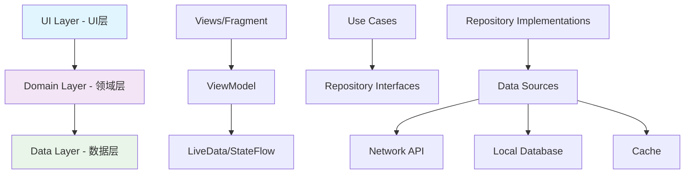

# 第27章：Jetpack组件架构

Jetpack是Google推出的一套Android组件库，旨在帮助开发者更快、更容易地开发出优秀的Android应用。Jetpack组件库提供了推荐的架构、指导方案和最佳实践，让开发者能够专注于编写核心业务代码。本章将详细介绍Jetpack的核心组件和架构模式。

## 27.1 Jetpack架构概述

Jetpack架构组件是构建现代化Android应用的基础，它提供了一套完整的架构解决方案。

### 27.1.1 Jetpack架构组件分类

```java
public class JetpackArchitectureComponents {
    // 架构组件
    public static final String LIFECYCLE = "Lifecycle - 生命周期感知组件";
    public static final String VIEWMODEL = "ViewModel - 视图模型";
    public static final String LIVEDATA = "LiveData - 可观察的数据持有者";
    public static final String ROOM = "Room - 数据库持久化";
    public static final String NAVIGATION = "Navigation - 导航组件";
    public static final String DATA_BINDING = "DataBinding - 数据绑定";
    public static final String PAGING = "Paging - 分页加载";
    public static final String WORKMANAGER = "WorkManager - 后台任务管理";
    public static final String PREFERENCE = "Preference - 偏好设置";
    public static final String SECURITY = "Security - 安全组件";

    // UI组件
    public static final String COMPOSE = "Compose - 现代UI工具包";
    public static final String FRAGMENT = "Fragment - 片段UI";
    public static final String LAYOUT = "Layout - 布局组件";
    public static final String MENU = "Menu - 菜单组件";
    public static final String CONSTRAINT_LAYOUT = "ConstraintLayout - 约束布局";

    // 行为组件
    public static final String MEDIA = "Media - 媒体播放";
    public static final String NOTIFICATION = "Notification - 通知";
    public static final String PERMISSION = "Permission - 权限管理";
    public static final String SHARING = "Sharing - 分享组件";
    public static final String SLICE = "Slice - 应用切片";
}
```

### 27.1.2 推荐的应用架构

现代Android应用推荐使用分层架构，主要包括以下层次：



## 27.2 Lifecycle生命周期管理

Lifecycle组件能够感知其他组件的生命周期，从而帮助开发者更好地管理组件的生命周期。

### 27.2.1 Lifecycle基础使用

```java
public class LifecycleAwareComponent implements LifecycleObserver {
    private static final String TAG = "LifecycleAwareComponent";

    private Lifecycle lifecycle;
    private boolean isRunning = false;

    public LifecycleAwareComponent(Lifecycle lifecycle) {
        this.lifecycle = lifecycle;
        lifecycle.addObserver(this);
    }

    @OnLifecycleEvent(Lifecycle.Event.ON_CREATE)
    public void onCreate() {
        Log.d(TAG, "组件创建");
        initializeComponent();
    }

    @OnLifecycleEvent(Lifecycle.Event.ON_START)
    public void onStart() {
        Log.d(TAG, "组件启动");
        isRunning = true;
        startForegroundTasks();
    }

    @OnLifecycleEvent(Lifecycle.Event.ON_RESUME)
    public void onResume() {
        Log.d(TAG, "组件恢复");
        resumeOperations();
    }

    @OnLifecycleEvent(Lifecycle.Event.ON_PAUSE)
    public void onPause() {
        Log.d(TAG, "组件暂停");
        pauseOperations();
    }

    @OnLifecycleEvent(Lifecycle.Event.ON_STOP)
    public void onStop() {
        Log.d(TAG, "组件停止");
        isRunning = false;
        stopForegroundTasks();
    }

    @OnLifecycleEvent(Lifecycle.Event.ON_DESTROY)
    public void onDestroy() {
        Log.d(TAG, "组件销毁");
        cleanupComponent();
    }

    /**
     * 检查当前状态是否安全执行操作
     */
    public boolean isSafeToExecute() {
        return lifecycle.getCurrentState().isAtLeast(Lifecycle.State.STARTED);
    }

    /**
     * 安全执行操作
     */
    public void executeSafely(Runnable operation) {
        if (isSafeToExecute()) {
            operation.run();
        } else {
            Log.w(TAG, "当前状态不安全，无法执行操作");
        }
    }

    private void initializeComponent() {
        // 初始化组件资源
    }

    private void startForegroundTasks() {
        // 启动前台任务
    }

    private void resumeOperations() {
        // 恢复操作
    }

    private void pauseOperations() {
        // 暂停操作
    }

    private void stopForegroundTasks() {
        // 停止前台任务
    }

    private void cleanupComponent() {
        // 清理组件资源
    }

    public boolean isRunning() {
        return isRunning;
    }

    public Lifecycle.State getCurrentState() {
        return lifecycle.getCurrentState();
    }
}
```

### 27.2.2 自定义LifecycleOwner

```java
public class CustomLifecycleOwner implements LifecycleOwner {
    private final LifecycleRegistry lifecycleRegistry;
    private final Handler mainHandler;

    public CustomLifecycleOwner() {
        this.lifecycleRegistry = new LifecycleRegistry(this);
        this.mainHandler = new Handler(Looper.getMainLooper());
    }

    @NonNull
    @Override
    public Lifecycle getLifecycle() {
        return lifecycleRegistry;
    }

    /**
     * 标记为创建状态
     */
    public void markCreated() {
        lifecycleRegistry.handleLifecycleEvent(Lifecycle.Event.ON_CREATE);
    }

    /**
     * 标记为启动状态
     */
    public void markStarted() {
        lifecycleRegistry.handleLifecycleEvent(Lifecycle.Event.ON_START);
    }

    /**
     * 标记为恢复状态
     */
    public void markResumed() {
        lifecycleRegistry.handleLifecycleEvent(Lifecycle.Event.ON_RESUME);
    }

    /**
     * 标记为暂停状态
     */
    public void markPaused() {
        lifecycleRegistry.handleLifecycleEvent(Lifecycle.Event.ON_PAUSE);
    }

    /**
     * 标记为停止状态
     */
    public void markStopped() {
        lifecycleRegistry.handleLifecycleEvent(Lifecycle.Event.ON_STOP);
    }

    /**
     * 标记为销毁状态
     */
    public void markDestroyed() {
        lifecycleRegistry.handleLifecycleEvent(Lifecycle.Event.ON_DESTROY);
    }

    /**
     * 延迟执行生命周期事件
     */
    public void postLifecycleEvent(Lifecycle.Event event, long delayMillis) {
        mainHandler.postDelayed(() -> {
            lifecycleRegistry.handleLifecycleEvent(event);
        }, delayMillis);
    }

    /**
     * 添加生命周期观察者
     */
    public void addObserver(LifecycleObserver observer) {
        lifecycleRegistry.addObserver(observer);
    }

    /**
     * 移除生命周期观察者
     */
    public void removeObserver(LifecycleObserver observer) {
        lifecycleRegistry.removeObserver(observer);
    }

    /**
     * 获取当前状态
     */
    public Lifecycle.State getCurrentState() {
        return lifecycleRegistry.getCurrentState();
    }
}
```

## 27.3 ViewModel视图模型

ViewModel是Jetpack架构组件中的核心类，用于存储和管理与UI相关的数据。

### 27.3.1 基础ViewModel实现

```java
public class UserViewModel extends ViewModel {
    private static final String TAG = "UserViewModel";

    // 使用LiveData来保存用户数据
    private final MutableLiveData<User> currentUser = new MutableLiveData<>();
    private final MutableLiveData<List<User>> userList = new MutableLiveData<>();
    private final MutableLiveData<String> errorMessage = new MutableLiveData<>();
    private final MutableLiveData<Boolean> isLoading = new MutableLiveData<>();

    // 使用Repository进行数据操作
    private final UserRepository userRepository;
    private final CompositeDisposable disposables = new CompositeDisposable();

    public UserViewModel() {
        this.userRepository = new UserRepository();
    }

    /**
     * 获取当前用户信息
     */
    public LiveData<User> getCurrentUser() {
        return currentUser;
    }

    /**
     * 获取用户列表
     */
    public LiveData<List<User>> getUserList() {
        return userList;
    }

    /**
     * 获取错误信息
     */
    public LiveData<String> getErrorMessage() {
        return errorMessage;
    }

    /**
     * 获取加载状态
     */
    public LiveData<Boolean> getIsLoading() {
        return isLoading;
    }

    /**
     * 加载用户详情
     */
    public void loadUserDetails(String userId) {
        isLoading.setValue(true);
        errorMessage.setValue(null);

        disposables.add(userRepository.getUser(userId)
                .subscribeOn(Schedulers.io())
                .observeOn(AndroidSchedulers.mainThread())
                .subscribe(
                    user -> {
                        currentUser.setValue(user);
                        isLoading.setValue(false);
                    },
                    error -> {
                        errorMessage.setValue("加载用户失败: " + error.getMessage());
                        isLoading.setValue(false);
                    }
                ));
    }

    /**
     * 加载用户列表
     */
    public void loadUserList() {
        isLoading.setValue(true);
        errorMessage.setValue(null);

        disposables.add(userRepository.getUserList()
                .subscribeOn(Schedulers.io())
                .observeOn(AndroidSchedulers.mainThread())
                .subscribe(
                    users -> {
                        userList.setValue(users);
                        isLoading.setValue(false);
                    },
                    error -> {
                        errorMessage.setValue("加载用户列表失败: " + error.getMessage());
                        isLoading.setValue(false);
                    }
                ));
    }

    /**
     * 保存用户信息
     */
    public void saveUser(User user) {
        isLoading.setValue(true);
        errorMessage.setValue(null);

        disposables.add(userRepository.saveUser(user)
                .subscribeOn(Schedulers.io())
                .observeOn(AndroidSchedulers.mainThread())
                .subscribe(
                    savedUser -> {
                        currentUser.setValue(savedUser);
                        isLoading.setValue(false);
                    },
                    error -> {
                        errorMessage.setValue("保存用户失败: " + error.getMessage());
                        isLoading.setValue(false);
                    }
                ));
    }

    /**
     * 删除用户
     */
    public void deleteUser(String userId) {
        isLoading.setValue(true);
        errorMessage.setValue(null);

        disposables.add(userRepository.deleteUser(userId)
                .subscribeOn(Schedulers.io())
                .observeOn(AndroidSchedulers.mainThread())
                .subscribe(
                    () -> {
                        // 从当前用户列表中移除
                        List<User> users = userList.getValue();
                        if (users != null) {
                            List<User> updatedUsers = new ArrayList<>(users);
                            updatedUsers.removeIf(user -> user.getId().equals(userId));
                            userList.setValue(updatedUsers);
                        }

                        // 如果删除的是当前用户，清空当前用户
                        User currentUser = this.currentUser.getValue();
                        if (currentUser != null && currentUser.getId().equals(userId)) {
                            this.currentUser.setValue(null);
                        }

                        isLoading.setValue(false);
                    },
                    error -> {
                        errorMessage.setValue("删除用户失败: " + error.getMessage());
                        isLoading.setValue(false);
                    }
                ));
    }

    /**
     * 搜索用户
     */
    public void searchUsers(String query) {
        isLoading.setValue(true);
        errorMessage.setValue(null);

        disposables.add(userRepository.searchUsers(query)
                .subscribeOn(Schedulers.io())
                .observeOn(AndroidSchedulers.mainThread())
                .subscribe(
                    users -> {
                        userList.setValue(users);
                        isLoading.setValue(false);
                    },
                    error -> {
                        errorMessage.setValue("搜索用户失败: " + error.getMessage());
                        isLoading.setValue(false);
                    }
                ));
    }

    /**
     * 刷新数据
     */
    public void refresh() {
        User user = currentUser.getValue();
        if (user != null) {
            loadUserDetails(user.getId());
        } else {
            loadUserList();
        }
    }

    /**
     * 清除错误信息
     */
    public void clearError() {
        errorMessage.setValue(null);
    }

    @Override
    protected void onCleared() {
        super.onCleared();
        // 清理资源
        disposables.clear();
        Log.d(TAG, "ViewModel已清理");
    }

    /**
     * 工厂类用于创建ViewModel
     */
    public static class Factory extends ViewModelProvider.NewInstanceFactory {
        @NonNull
        @Override
        public <T extends ViewModel> T create(@NonNull Class<T> modelClass) {
            if (modelClass.isAssignableFrom(UserViewModel.class)) {
                return (T) new UserViewModel();
            }
            throw new IllegalArgumentException("Unknown ViewModel class");
        }
    }
}
```

### 27.3.2 使用AndroidViewModel处理Application上下文

```java
public class ApplicationAwareViewModel extends AndroidViewModel {
    private static final String TAG = "ApplicationAwareViewModel";

    private final Application application;
    private final MutableLiveData<String> appInfo = new MutableLiveData<>();
    private final SharedPreferences preferences;

    public ApplicationAwareViewModel(@NonNull Application application) {
        super(application);
        this.application = application;
        this.preferences = application.getSharedPreferences("app_prefs", Context.MODE_PRIVATE);
        loadAppInfo();
    }

    /**
     * 获取应用信息
     */
    public LiveData<String> getAppInfo() {
        return appInfo;
    }

    /**
     * 加载应用信息
     */
    private void loadAppInfo() {
        PackageManager packageManager = application.getPackageManager();
        try {
            PackageInfo packageInfo = packageManager.getPackageInfo(application.getPackageName(), 0);

            StringBuilder info = new StringBuilder();
            info.append("应用名称: ").append(application.getString(packageInfo.applicationInfo.labelRes)).append("\n");
            info.append("版本号: ").append(packageInfo.versionName).append("\n");
            info.append("版本代码: ").append(packageInfo.versionCode).append("\n");
            info.append("包名: ").append(packageInfo.packageName).append("\n");

            appInfo.setValue(info.toString());
        } catch (PackageManager.NameNotFoundException e) {
            appInfo.setValue("获取应用信息失败: " + e.getMessage());
        }
    }

    /**
     * 保存偏好设置
     */
    public void savePreference(String key, String value) {
        preferences.edit().putString(key, value).apply();
    }

    /**
     * 获取偏好设置
     */
    public String getPreference(String key, String defaultValue) {
        return preferences.getString(key, defaultValue);
    }

    /**
     * 获取系统服务
     */
    public <T> T getSystemService(Class<T> serviceClass) {
        return ContextCompat.getSystemService(application, serviceClass);
    }

    /**
     * 获取资源
     */
    public Resources getResources() {
        return application.getResources();
    }

    /**
     * 获取字符串资源
     */
    public String getString(int resId) {
        return application.getString(resId);
    }

    /**
     * 获取字符串资源（带格式化）
     */
    public String getString(int resId, Object... formatArgs) {
        return application.getString(resId, formatArgs);
    }

    /**
     * 显示Toast消息
     */
    public void showToast(String message) {
        Toast.makeText(application, message, Toast.LENGTH_SHORT).show();
    }
}
```

## 27.4 LiveData响应式数据

LiveData是一个可观察的数据持有者类，它具有生命周期感知能力。

### 27.4.1 自定义LiveData实现

```java
public class LocationLiveData extends LiveData<Location> {
    private static final String TAG = "LocationLiveData";

    private final Context context;
    private final LocationManager locationManager;
    private final LocationListener locationListener = new LocationListener() {
        @Override
        public void onLocationChanged(Location location) {
            setValue(location);
        }

        @Override
        public void onProviderEnabled(String provider) {
            Log.d(TAG, "位置提供者启用: " + provider);
        }

        @Override
        public void onProviderDisabled(String provider) {
            Log.d(TAG, "位置提供者禁用: " + provider);
        }

        @Override
        public void onStatusChanged(String provider, int status, Bundle extras) {
            Log.d(TAG, "位置提供者状态变化: " + provider + ", status: " + status);
        }
    };

    public LocationLiveData(Context context) {
        this.context = context.getApplicationContext();
        this.locationManager = (LocationManager) this.context.getSystemService(Context.LOCATION_SERVICE);
    }

    @Override
    protected void onActive() {
        super.onActive();
        // 当有活跃观察者时开始位置更新
        startLocationUpdates();
    }

    @Override
    protected void onInactive() {
        super.onInactive();
        // 当没有活跃观察者时停止位置更新
        stopLocationUpdates();
    }

    /**
     * 开始位置更新
     */
    private void startLocationUpdates() {
        if (ActivityCompat.checkSelfPermission(context, Manifest.permission.ACCESS_FINE_LOCATION)
                != PackageManager.PERMISSION_GRANTED) {
            Log.w(TAG, "缺少位置权限");
            return;
        }

        // 使用GPS提供者
        locationManager.requestLocationUpdates(
                LocationManager.GPS_PROVIDER,
                1000, // 1秒更新间隔
                1,    // 1米更新距离
                locationListener
        );

        // 使用网络提供者作为备选
        locationManager.requestLocationUpdates(
                LocationManager.NETWORK_PROVIDER,
                5000, // 5秒更新间隔
                10,   // 10米更新距离
                locationListener
        );

        Log.d(TAG, "位置更新已开始");
    }

    /**
     * 停止位置更新
     */
    private void stopLocationUpdates() {
        locationManager.removeUpdates(locationListener);
        Log.d(TAG, "位置更新已停止");
    }

    /**
     * 获取最后已知位置
     */
    public Location getLastKnownLocation() {
        if (ActivityCompat.checkSelfPermission(context, Manifest.permission.ACCESS_FINE_LOCATION)
                != PackageManager.PERMISSION_GRANTED) {
            return null;
        }

        Location gpsLocation = locationManager.getLastKnownLocation(LocationManager.GPS_PROVIDER);
        Location networkLocation = locationManager.getLastKnownLocation(LocationManager.NETWORK_PROVIDER);

        // 选择最新的位置
        if (gpsLocation != null && networkLocation != null) {
            return gpsLocation.getTime() > networkLocation.getTime() ? gpsLocation : networkLocation;
        } else if (gpsLocation != null) {
            return gpsLocation;
        } else {
            return networkLocation;
        }
    }
}
```

### 27.4.2 LiveData转换和组合

```java
public class LiveDataTransformations {
    private static final String TAG = "LiveDataTransformations";

    /**
     * 用户数据转换
     */
    public static class UserTransformations {
        private final MutableLiveData<User> userLiveData = new MutableLiveData<>();
        private final MutableLiveData<String> userNameLiveData = new MutableLiveData<>();
        private final MutableLiveData<String> userAvatarLiveData = new MutableLiveData<>();
        private final MutableLiveData<Boolean> isUserAdminLiveData = new MutableLiveData<>();

        public LiveData<String> getUserName() {
            return Transformations.map(userLiveData, user -> {
                if (user != null) {
                    return user.getFirstName() + " " + user.getLastName();
                }
                return "未知用户";
            });
        }

        public LiveData<String> getUserAvatar() {
            return Transformations.switchMap(userLiveData, user -> {
                MutableLiveData<String> avatarLiveData = new MutableLiveData<>();
                if (user != null && user.getAvatarUrl() != null) {
                    // 这里可以添加图片加载逻辑
                    avatarLiveData.setValue(user.getAvatarUrl());
                } else {
                    avatarLiveData.setValue(""); // 默认头像
                }
                return avatarLiveData;
            });
        }

        public LiveData<Boolean> isUserAdmin() {
            return Transformations.map(userLiveData, user -> {
                return user != null && user.isAdmin();
            });
        }

        public LiveData<String> getUserDisplayName() {
            return Transformations.map(userLiveData, user -> {
                if (user != null) {
                    String displayName = user.getFirstName() + " " + user.getLastName();
                    if (user.isAdmin()) {
                        displayName += " (管理员)";
                    }
                    return displayName;
                }
                return "未知用户";
            });
        }

        public void setUser(User user) {
            userLiveData.setValue(user);
        }

        public MutableLiveData<User> getUserLiveData() {
            return userLiveData;
        }
    }

    /**
     * 搜索状态转换
     */
    public static class SearchTransformations {
        private final MutableLiveData<String> queryLiveData = new MutableLiveData<>();
        private final MutableLiveData<List<User>> userListLiveData = new MutableLiveData<>();
        private final MutableLiveData<Boolean> isLoadingLiveData = new MutableLiveData<>();

        public LiveData<List<User>> getFilteredUserList() {
            return Transformations.switchMap(queryLiveData, query -> {
                isLoadingLiveData.setValue(true);

                // 在IO线程执行过滤
                MutableLiveData<List<User>> result = new MutableLiveData<>();
                new Thread(() -> {
                    List<User> allUsers = userListLiveData.getValue();
                    if (allUsers != null && query != null && !query.trim().isEmpty()) {
                        List<User> filteredUsers = allUsers.stream()
                                .filter(user -> user.getFirstName().toLowerCase().contains(query.toLowerCase()) ||
                                             user.getLastName().toLowerCase().contains(query.toLowerCase()))
                                .collect(Collectors.toList());
                        result.postValue(filteredUsers);
                    } else {
                        result.postValue(allUsers != null ? allUsers : new ArrayList<>());
                    }
                    isLoadingLiveData.postValue(false);
                }).start();

                return result;
            });
        }

        public LiveData<Integer> getSearchResultCount() {
            return Transformations.map(getFilteredUserList(), users -> {
                return users != null ? users.size() : 0;
            });
        }

        public LiveData<String> getSearchStatusText() {
            return new MediatorLiveData<String>() {
                {
                    addSource(queryLiveData, query -> updateStatus());
                    addSource(getSearchResultCount(), count -> updateStatus());
                    addSource(isLoadingLiveData, loading -> updateStatus());
                }

                private void updateStatus() {
                    String query = queryLiveData.getValue();
                    Integer count = getSearchResultCount().getValue();
                    Boolean loading = isLoadingLiveData.getValue();

                    if (loading != null && loading) {
                        setValue("搜索中...");
                    } else if (query != null && !query.trim().isEmpty()) {
                        setValue("找到 " + (count != null ? count : 0) + " 个结果");
                    } else {
                        setValue("请输入搜索关键词");
                    }
                }
            };
        }

        public void setQuery(String query) {
            queryLiveData.setValue(query);
        }

        public void setUserList(List<User> users) {
            userListLiveData.setValue(users);
        }

        public LiveData<Boolean> getIsLoading() {
            return isLoadingLiveData;
        }
    }

    /**
     * 组合多个LiveData
     */
    public static class CombinedLiveData {
        private final MutableLiveData<User> userLiveData = new MutableLiveData<>();
        private final MutableLiveData<Location> locationLiveData = new MutableLiveData<>();
        private final MutableLiveData<String> weatherLiveData = new MutableLiveData<>();

        public LiveData<String> getCombinedInfo() {
            return new MediatorLiveData<String>() {
                {
                    addSource(userLiveData, user -> combine());
                    addSource(locationLiveData, location -> combine());
                    addSource(weatherLiveData, weather -> combine());
                }

                private void combine() {
                    User user = userLiveData.getValue();
                    Location location = locationLiveData.getValue();
                    String weather = weatherLiveData.getValue();

                    StringBuilder info = new StringBuilder();

                    if (user != null) {
                        info.append("用户: ").append(user.getFirstName()).append(" ");
                    }

                    if (location != null) {
                        info.append("位置: ").append(location.getLatitude()).append(", ")
                            .append(location.getLongitude()).append(" ");
                    }

                    if (weather != null) {
                        info.append("天气: ").append(weather);
                    }

                    setValue(info.toString());
                }
            };
        }

        public LiveData<Boolean> isDataComplete() {
            return new MediatorLiveData<Boolean>() {
                {
                    addSource(userLiveData, user -> checkCompleteness());
                    addSource(locationLiveData, location -> checkCompleteness());
                    addSource(weatherLiveData, weather -> checkCompleteness());
                }

                private void checkCompleteness() {
                    boolean hasUser = userLiveData.getValue() != null;
                    boolean hasLocation = locationLiveData.getValue() != null;
                    boolean hasWeather = weatherLiveData.getValue() != null;

                    setValue(hasUser && hasLocation && hasWeather);
                }
            };
        }

        public void setUser(User user) {
            userLiveData.setValue(user);
        }

        public void setLocation(Location location) {
            locationLiveData.setValue(location);
        }

        public void setWeather(String weather) {
            weatherLiveData.setValue(weather);
        }
    }
}
```

## 27.5 Room数据库持久化

Room是一个持久化库，提供了对SQLite数据库的抽象层。

### 27.5.1 定义数据实体

```java
@Entity(tableName = "users")
public class User {
    @PrimaryKey
    @NonNull
    private String id;

    @ColumnInfo(name = "first_name")
    private String firstName;

    @ColumnInfo(name = "last_name")
    private String lastName;

    @ColumnInfo(name = "email")
    private String email;

    @ColumnInfo(name = "phone")
    private String phone;

    @ColumnInfo(name = "avatar_url")
    private String avatarUrl;

    @ColumnInfo(name = "is_admin")
    private boolean isAdmin;

    @ColumnInfo(name = "created_at")
    private long createdAt;

    @ColumnInfo(name = "updated_at")
    private long updatedAt;

    // 构造函数
    public User() {
        this.createdAt = System.currentTimeMillis();
        this.updatedAt = System.currentTimeMillis();
    }

    public User(@NonNull String id, String firstName, String lastName, String email) {
        this.id = id;
        this.firstName = firstName;
        this.lastName = lastName;
        this.email = email;
        this.createdAt = System.currentTimeMillis();
        this.updatedAt = System.currentTimeMillis();
        this.isAdmin = false;
    }

    // Getters and Setters
    @NonNull
    public String getId() {
        return id;
    }

    public void setId(@NonNull String id) {
        this.id = id;
    }

    public String getFirstName() {
        return firstName;
    }

    public void setFirstName(String firstName) {
        this.firstName = firstName;
        this.updatedAt = System.currentTimeMillis();
    }

    public String getLastName() {
        return lastName;
    }

    public void setLastName(String lastName) {
        this.lastName = lastName;
        this.updatedAt = System.currentTimeMillis();
    }

    public String getEmail() {
        return email;
    }

    public void setEmail(String email) {
        this.email = email;
        this.updatedAt = System.currentTimeMillis();
    }

    public String getPhone() {
        return phone;
    }

    public void setPhone(String phone) {
        this.phone = phone;
        this.updatedAt = System.currentTimeMillis();
    }

    public String getAvatarUrl() {
        return avatarUrl;
    }

    public void setAvatarUrl(String avatarUrl) {
        this.avatarUrl = avatarUrl;
        this.updatedAt = System.currentTimeMillis();
    }

    public boolean isAdmin() {
        return isAdmin;
    }

    public void setAdmin(boolean admin) {
        isAdmin = admin;
        this.updatedAt = System.currentTimeMillis();
    }

    public long getCreatedAt() {
        return createdAt;
    }

    public void setCreatedAt(long createdAt) {
        this.createdAt = createdAt;
    }

    public long getUpdatedAt() {
        return updatedAt;
    }

    public void setUpdatedAt(long updatedAt) {
        this.updatedAt = updatedAt;
    }

    @Override
    public String toString() {
        return "User{" +
                "id='" + id + '\'' +
                ", firstName='" + firstName + '\'' +
                ", lastName='" + lastName + '\'' +
                ", email='" + email + '\'' +
                ", isAdmin=" + isAdmin +
                '}';
    }

    @Override
    public boolean equals(Object o) {
        if (this == o) return true;
        if (o == null || getClass() != o.getClass()) return false;
        User user = (User) o;
        return id.equals(user.id);
    }

    @Override
    public int hashCode() {
        return Objects.hash(id);
    }
}
```

### 27.5.2 定义DAO接口

```java
@Dao
public interface UserDao {

    /**
     * 插入用户
     */
    @Insert(onConflict = OnConflictStrategy.REPLACE)
    long insertUser(User user);

    /**
     * 插入多个用户
     */
    @Insert(onConflict = OnConflictStrategy.REPLACE)
    List<Long> insertUsers(List<User> users);

    /**
     * 更新用户
     */
    @Update
    int updateUser(User user);

    /**
     * 删除用户
     */
    @Delete
    int deleteUser(User user);

    /**
     * 根据ID删除用户
     */
    @Query("DELETE FROM users WHERE id = :userId")
    int deleteUserById(String userId);

    /**
     * 获取所有用户
     */
    @Query("SELECT * FROM users ORDER BY last_name ASC, first_name ASC")
    LiveData<List<User>> getAllUsers();

    /**
     * 根据ID获取用户
     */
    @Query("SELECT * FROM users WHERE id = :userId")
    LiveData<User> getUserById(String userId);

    /**
     * 根据邮箱获取用户
     */
    @Query("SELECT * FROM users WHERE email = :email")
    LiveData<User> getUserByEmail(String email);

    /**
     * 搜索用户
     */
    @Query("SELECT * FROM users WHERE first_name LIKE '%' || :query || '%' OR " +
           "last_name LIKE '%' || :query || '%' OR email LIKE '%' || :query || '%' " +
           "ORDER BY last_name ASC, first_name ASC")
    LiveData<List<User>> searchUsers(String query);

    /**
     * 获取管理员用户
     */
    @Query("SELECT * FROM users WHERE is_admin = 1 ORDER BY last_name ASC, first_name ASC")
    LiveData<List<User>> getAdminUsers();

    /**
     * 获取最近创建的用户
     */
    @Query("SELECT * FROM users ORDER BY created_at DESC LIMIT :limit")
    LiveData<List<User>> getRecentUsers(int limit);

    /**
     * 获取用户总数
     */
    @Query("SELECT COUNT(*) FROM users")
    LiveData<Integer> getUserCount();

    /**
     * 获取管理员数量
     */
    @Query("SELECT COUNT(*) FROM users WHERE is_admin = 1")
    LiveData<Integer> getAdminCount();

    /**
     * 检查邮箱是否存在
     */
    @Query("SELECT EXISTS(SELECT 1 FROM users WHERE email = :email)")
    LiveData<Boolean> isEmailExists(String email);

    /**
     * 更新用户头像
     */
    @Query("UPDATE users SET avatar_url = :avatarUrl, updated_at = :timestamp WHERE id = :userId")
    int updateUserAvatar(String userId, String avatarUrl, long timestamp);

    /**
     * 设置管理员权限
     */
    @Query("UPDATE users SET is_admin = :isAdmin, updated_at = :timestamp WHERE id = :userId")
    int setUserAdmin(String userId, boolean isAdmin, long timestamp);

    /**
     * 获取用户统计信息
     */
    @Query("SELECT " +
           "COUNT(*) as total_users, " +
           "COUNT(CASE WHEN is_admin = 1 THEN 1 END) as admin_users, " +
           "COUNT(CASE WHEN created_at > :sinceTimestamp THEN 1 END) as new_users " +
           "FROM users")
    LiveData<UserStats> getUserStats(long sinceTimestamp);

    /**
     * 清空所有用户
     */
    @Query("DELETE FROM users")
    int deleteAllUsers();

    /**
     * 批量更新用户
     */
    @Transaction
    default void updateUsers(List<User> users) {
        for (User user : users) {
            user.setUpdatedAt(System.currentTimeMillis());
            updateUser(user);
        }
    }

    /**
     * 用户统计信息
     */
    class UserStats {
        public int totalUsers;
        public int adminUsers;
        public int newUsers;

        @Override
        public String toString() {
            return "UserStats{" +
                    "totalUsers=" + totalUsers +
                    ", adminUsers=" + adminUsers +
                    ", newUsers=" + newUsers +
                    '}';
        }
    }
}
```

### 27.5.3 创建数据库

```java
@Database(
    entities = {User.class},
    version = 1,
    exportSchema = false
)
@TypeConverters({Converters.class})
public abstract class AppDatabase extends RoomDatabase {

    private static final String TAG = "AppDatabase";
    private static final String DATABASE_NAME = "app_database";

    private static volatile AppDatabase INSTANCE;
    private static final int NUMBER_OF_THREADS = 4;
    public static final ExecutorService databaseWriteExecutor =
            Executors.newFixedThreadPool(NUMBER_OF_THREADS);

    public abstract UserDao userDao();

    /**
     * 获取数据库实例（单例）
     */
    public static AppDatabase getDatabase(final Context context) {
        if (INSTANCE == null) {
            synchronized (AppDatabase.class) {
                if (INSTANCE == null) {
                    INSTANCE = Room.databaseBuilder(context.getApplicationContext(),
                            AppDatabase.class, DATABASE_NAME)
                            .addCallback(roomDatabaseCallback)
                            .addMigrations(MIGRATION_1_2)
                            .fallbackToDestructiveMigration()
                            .build();
                }
            }
        }
        return INSTANCE;
    }

    /**
     * 数据库回调
     */
    private static final RoomDatabase.Callback roomDatabaseCallback = new RoomDatabase.Callback() {
        @Override
        public void onCreate(@NonNull SupportSQLiteDatabase db) {
            super.onCreate(db);
            Log.d(TAG, "数据库已创建");

            // 在后台线程中预填充数据
            databaseWriteExecutor.execute(() -> {
                UserDao userDao = INSTANCE.userDao();

                // 插入示例数据
                User adminUser = new User("admin", "管理员", "用户", "admin@example.com");
                adminUser.setAdmin(true);
                userDao.insertUser(adminUser);

                User testUser1 = new User("user1", "张", "三", "zhangsan@example.com");
                userDao.insertUser(testUser1);

                User testUser2 = new User("user2", "李", "四", "lisi@example.com");
                userDao.insertUser(testUser2);

                Log.d(TAG, "示例数据已插入");
            });
        }

        @Override
        public void onOpen(@NonNull SupportSQLiteDatabase db) {
            super.onOpen(db);
            Log.d(TAG, "数据库已打开");
        }
    };

    /**
     * 数据库迁移
     */
    static final Migration MIGRATION_1_2 = new Migration(1, 2) {
        @Override
        public void migrate(SupportSQLiteDatabase database) {
            // 添加新列
            database.execSQL("ALTER TABLE users ADD COLUMN phone TEXT");
            database.execSQL("ALTER TABLE users ADD COLUMN avatar_url TEXT");
        }
    };

    /**
     * 清理数据库实例
     */
    public static void clearInstance() {
        if (INSTANCE != null) {
            INSTANCE.close();
            INSTANCE = null;
        }
    }
}

/**
 * 类型转换器
 */
class Converters {

    @TypeConverter
    public static Date fromTimestamp(Long value) {
        return value == null ? null : new Date(value);
    }

    @TypeConverter
    public static Long dateToTimestamp(Date date) {
        return date == null ? null : date.getTime();
    }

    @TypeConverter
    public static List<String> fromString(String value) {
        if (value == null) {
            return Collections.emptyList();
        }
        return Arrays.asList(value.split(","));
    }

    @TypeConverter
    public static String fromList(List<String> list) {
        if (list == null || list.isEmpty()) {
            return "";
        }
        return TextUtils.join(",", list);
    }
}
```

## 27.6 Navigation导航组件

Navigation组件简化了Android应用中导航的实现，支持可视化的导航图编辑和类型安全的参数传递。

### 27.6.1 导航图配置

```xml
<!-- res/navigation/mobile_navigation.xml -->
<navigation xmlns:android="http://schemas.android.com/apk/res/android"
    xmlns:app="http://schemas.android.com/apk/res-auto"
    xmlns:tools="http://schemas.android.com/tools"
    android:id="@+id/mobile_navigation"
    app:startDestination="@id/userListFragment">

    <!-- 用户列表Fragment -->
    <fragment
        android:id="@+id/userListFragment"
        android:name="com.example.app.ui.user.UserListFragment"
        android:label="用户列表"
        tools:layout="@layout/fragment_user_list">

        <action
            android:id="@+id/action_userListFragment_to_userDetailFragment"
            app:destination="@id/userDetailFragment">
            <argument
                android:name="userId"
                app:argType="string" />
        </action>

        <action
            android:id="@+id/action_userListFragment_to_addUserFragment"
            app:destination="@id/addUserFragment" />

        <action
            android:id="@+id/action_userListFragment_to_searchFragment"
            app:destination="@id/searchFragment" />
    </fragment>

    <!-- 用户详情Fragment -->
    <fragment
        android:id="@+id/userDetailFragment"
        android:name="com.example.app.ui.user.UserDetailFragment"
        android:label="用户详情"
        tools:layout="@layout/fragment_user_detail">

        <argument
            android:name="userId"
            app:argType="string"
            app:nullable="false" />

        <action
            android:id="@+id/action_userDetailFragment_to_editUserFragment"
            app:destination="@id/editUserFragment">
            <argument
                android:name="userId"
                app:argType="string" />
        </action>
    </fragment>

    <!-- 添加用户Fragment -->
    <fragment
        android:id="@+id/addUserFragment"
        android:name="com.example.app.ui.user.AddUserFragment"
        android:label="添加用户"
        tools:layout="@layout/fragment_add_user" />

    <!-- 编辑用户Fragment -->
    <fragment
        android:id="@+id/editUserFragment"
        android:name="com.example.app.ui.user.EditUserFragment"
        android:label="编辑用户"
        tools:layout="@layout/fragment_edit_user">

        <argument
            android:name="userId"
            app:argType="string"
            app:nullable="false" />
    </fragment>

    <!-- 搜索Fragment -->
    <fragment
        android:id="@+id/searchFragment"
        android:name="com.example.app.ui.search.SearchFragment"
        android:label="搜索"
        tools:layout="@layout/fragment_search" />

    <!-- 设置Activity -->
    <activity
        android:id="@+id/settingsActivity"
        android:name="com.example.app.ui.settings.SettingsActivity"
        android:label="设置"
        tools:layout="@layout/activity_settings" />

</navigation>
```

### 27.6.2 类型安全的导航参数

```java
// UserArgs.java - 类型安全的参数类
public class UserArgs implements Parcelable {
    @NonNull
    private String userId;

    private String userName;
    private boolean isAdmin;

    public UserArgs() {
    }

    public UserArgs(@NonNull String userId, String userName, boolean isAdmin) {
        this.userId = userId;
        this.userName = userName;
        this.isAdmin = isAdmin;
    }

    protected UserArgs(Parcel in) {
        userId = in.readString();
        userName = in.readString();
        isAdmin = in.readByte() != 0;
    }

    public static final Creator<UserArgs> CREATOR = new Creator<UserArgs>() {
        @Override
        public UserArgs createFromParcel(Parcel in) {
            return new UserArgs(in);
        }

        @Override
        public UserArgs[] newArray(int size) {
            return new UserArgs[size];
        }
    };

    @NonNull
    public String getUserId() {
        return userId;
    }

    public void setUserId(@NonNull String userId) {
        this.userId = userId;
    }

    public String getUserName() {
        return userName;
    }

    public void setUserName(String userName) {
        this.userName = userName;
    }

    public boolean isAdmin() {
        return isAdmin;
    }

    public void setAdmin(boolean admin) {
        isAdmin = admin;
    }

    @Override
    public int describeContents() {
        return 0;
    }

    @Override
    public void writeToParcel(Parcel dest, int flags) {
        dest.writeString(userId);
        dest.writeString(userName);
        dest.writeByte((byte) (isAdmin ? 1 : 0));
    }

    @Override
    public String toString() {
        return "UserArgs{" +
                "userId='" + userId + '\'' +
                ", userName='" + userName + '\'' +
                ", isAdmin=" + isAdmin +
                '}';
    }
}

// UserArgsSerializer.java - 参数序列化器
public class UserArgsSerializer {
    private static final String KEY_USER_ID = "userId";
    private static final String KEY_USER_NAME = "userName";
    private static final String KEY_IS_ADMIN = "isAdmin";

    public static Bundle toBundle(UserArgs args) {
        Bundle bundle = new Bundle();
        bundle.putString(KEY_USER_ID, args.getUserId());
        bundle.putString(KEY_USER_NAME, args.getUserName());
        bundle.putBoolean(KEY_IS_ADMIN, args.isAdmin());
        return bundle;
    }

    public static UserArgs fromBundle(Bundle bundle) {
        UserArgs args = new UserArgs();
        args.setUserId(bundle.getString(KEY_USER_ID, ""));
        args.setUserName(bundle.getString(KEY_USER_NAME, ""));
        args.setAdmin(bundle.getBoolean(KEY_IS_ADMIN, false));
        return args;
    }
}

// SafeNavigator.java - 安全导航工具类
public class SafeNavigator {
    private final NavController navController;
    private final Context context;

    public SafeNavigator(NavController navController, Context context) {
        this.navController = navController;
        this.context = context;
    }

    /**
     * 导航到用户详情页面
     */
    public void navigateToUserDetail(String userId) {
        if (userId == null || userId.trim().isEmpty()) {
            showErrorMessage("用户ID不能为空");
            return;
        }

        try {
            UserArgs args = new UserArgs(userId, null, false);
            Bundle bundle = UserArgsSerializer.toBundle(args);
            navController.navigate(R.id.action_userListFragment_to_userDetailFragment, bundle);
        } catch (Exception e) {
            Log.e("SafeNavigator", "导航失败: " + e.getMessage());
            showErrorMessage("导航失败");
        }
    }

    /**
     * 导航到编辑用户页面
     */
    public void navigateToEditUser(String userId) {
        if (userId == null || userId.trim().isEmpty()) {
            showErrorMessage("用户ID不能为空");
            return;
        }

        try {
            UserArgs args = new UserArgs(userId, null, false);
            Bundle bundle = UserArgsSerializer.toBundle(args);
            navController.navigate(R.id.action_userDetailFragment_to_editUserFragment, bundle);
        } catch (Exception e) {
            Log.e("SafeNavigator", "导航失败: " + e.getMessage());
            showErrorMessage("导航失败");
        }
    }

    /**
     * 导航到添加用户页面
     */
    public void navigateToAddUser() {
        try {
            navController.navigate(R.id.action_userListFragment_to_addUserFragment);
        } catch (Exception e) {
            Log.e("SafeNavigator", "导航失败: " + e.getMessage());
            showErrorMessage("导航失败");
        }
    }

    /**
     * 导航到搜索页面
     */
    public void navigateToSearch() {
        try {
            navController.navigate(R.id.action_userListFragment_to_searchFragment);
        } catch (Exception e) {
            Log.e("SafeNavigator", "导航失败: " + e.getMessage());
            showErrorMessage("导航失败");
        }
    }

    /**
     * 导航到设置页面
     */
    public void navigateToSettings() {
        try {
            Intent intent = new Intent(context, SettingsActivity.class);
            context.startActivity(intent);
        } catch (Exception e) {
            Log.e("SafeNavigator", "导航失败: " + e.getMessage());
            showErrorMessage("导航失败");
        }
    }

    /**
     * 返回上一页
     */
    public boolean navigateUp() {
        try {
            return navController.navigateUp();
        } catch (Exception e) {
            Log.e("SafeNavigator", "返回失败: " + e.getMessage());
            return false;
        }
    }

    /**
     * 弹出导航栈到指定目的地
     */
    public void popBackStack(int destinationId, boolean inclusive) {
        try {
            navController.popBackStack(destinationId, inclusive);
        } catch (Exception e) {
            Log.e("SafeNavigator", "弹出栈失败: " + e.getMessage());
            showErrorMessage("操作失败");
        }
    }

    /**
     * 检查是否可以导航
     */
    public boolean canNavigate(int actionId) {
        try {
            NavDestination currentDestination = navController.getCurrentDestination();
            if (currentDestination == null) return false;

            NavAction action = currentDestination.getAction(actionId);
            return action != null;
        } catch (Exception e) {
            return false;
        }
    }

    /**
     * 获取当前导航栈信息
     */
    public String getNavigationInfo() {
        try {
            NavBackStackEntry backStackEntry = navController.getCurrentBackStackEntry();
            if (backStackEntry != null) {
                NavDestination destination = backStackEntry.getDestination();
                return "当前页面: " + destination.getLabel() + " (ID: " + destination.getId() + ")";
            }
        } catch (Exception e) {
            Log.e("SafeNavigator", "获取导航信息失败: " + e.getMessage());
        }
        return "无法获取导航信息";
    }

    private void showErrorMessage(String message) {
        Toast.makeText(context, message, Toast.LENGTH_SHORT).show();
    }
}
```

## 27.7 Data Binding数据绑定

Data Binding库允许您以声明方式将UI组件绑定到数据源，减少样板代码。

### 27.7.1 布局文件配置

```xml
<!-- layout/item_user.xml -->
<?xml version="1.0" encoding="utf-8"?>
<layout xmlns:android="http://schemas.android.com/apk/res/android"
    xmlns:app="http://schemas.android.com/apk/res-auto"
    xmlns:tools="http://schemas.android.com/tools">

    <data>
        <variable
            name="user"
            type="com.example.app.data.model.User" />

        <variable
            name="onUserClick"
            type="android.view.View.OnClickListener" />

        <variable
            name="onDeleteClick"
            type="android.view.View.OnClickListener" />

        <import type="android.view.View" />
        <import type="com.example.app.utils.DateUtils" />
    </data>

    <androidx.cardview.widget.CardView
        android:layout_width="match_parent"
        android:layout_height="wrap_content"
        android:layout_margin="8dp"
        android:onClick="@{onUserClick}"
        app:cardCornerRadius="8dp"
        app:cardElevation="4dp">

        <androidx.constraintlayout.widget.ConstraintLayout
            android:layout_width="match_parent"
            android:layout_height="wrap_content"
            android:padding="16dp">

            <ImageView
                android:id="@+id/avatarImageView"
                android:layout_width="60dp"
                android:layout_height="60dp"
                android:src="@drawable/ic_person"
                app:imageUrl="@{user.avatarUrl}"
                app:layout_constraintStart_toStartOf="parent"
                app:layout_constraintTop_toTopOf="parent"
                app:layout_constraintBottom_toBottomOf="parent"
                tools:src="@tools:sample/avatars" />

            <TextView
                android:id="@+id/nameTextView"
                android:layout_width="0dp"
                android:layout_height="wrap_content"
                android:layout_marginStart="16dp"
                android:layout_marginEnd="8dp"
                android:text="@{user.firstName + ` ` + user.lastName}"
                android:textAppearance="@style/TextAppearance.AppCompat.Medium"
                android:textStyle="bold"
                android:textColor="@android:color/black"
                app:layout_constraintStart_toEndOf="@id/avatarImageView"
                app:layout_constraintEnd_toStartOf="@id/deleteButton"
                app:layout_constraintTop_toTopOf="parent"
                tools:text="张三" />

            <TextView
                android:id="@+id/emailTextView"
                android:layout_width="0dp"
                android:layout_height="wrap_content"
                android:layout_marginTop="4dp"
                android:text="@{user.email}"
                android:textAppearance="@style/TextAppearance.AppCompat.Small"
                android:textColor="@android:color/darker_gray"
                android:singleLine="true"
                android:ellipsize="end"
                app:layout_constraintStart_toStartOf="@id/nameTextView"
                app:layout_constraintEnd_toStartOf="@id/deleteButton"
                app:layout_constraintTop_toBottomOf="@id/nameTextView"
                tools:text="zhangsan@example.com" />

            <TextView
                android:id="@+id/dateTextView"
                android:layout_width="0dp"
                android:layout_height="wrap_content"
                android:layout_marginTop="4dp"
                android:text="@{DateUtils.formatDate(user.createdAt)}"
                android:textAppearance="@style/TextAppearance.AppCompat.Small"
                android:textColor="@android:color/darker_gray"
                app:layout_constraintStart_toStartOf="@id/nameTextView"
                app:layout_constraintEnd_toStartOf="@id/deleteButton"
                app:layout_constraintTop_toBottomOf="@id/emailTextView"
                tools:text="2024-01-01" />

            <TextView
                android:id="@+id/adminBadge"
                android:layout_width="wrap_content"
                android:layout_height="wrap_content"
                android:layout_marginTop="8dp"
                android:background="@drawable/badge_admin"
                android:padding="4dp"
                android:text="管理员"
                android:textColor="@android:color/white"
                android:textSize="10sp"
                android:visibility="@{user.isAdmin ? View.VISIBLE : View.GONE}"
                app:layout_constraintStart_toStartOf="@id/nameTextView"
                app:layout_constraintTop_toBottomOf="@id/dateTextView" />

            <ImageButton
                android:id="@+id/deleteButton"
                android:layout_width="48dp"
                android:layout_height="48dp"
                android:src="@drawable/ic_delete"
                android:background="?attr/selectableItemBackgroundBorderless"
                android:contentDescription="删除用户"
                android:onClick="@{onDeleteClick}"
                app:layout_constraintEnd_toEndOf="parent"
                app:layout_constraintTop_toTopOf="parent"
                app:layout_constraintBottom_toBottomOf="parent" />

        </androidx.constraintlayout.widget.ConstraintLayout>

    </androidx.cardview.widget.CardView>

</layout>
```

### 27.7.2 自定义Binding Adapter

```java
public class BindingAdapters {

    /**
     * 加载图片
     */
    @BindingAdapter("imageUrl")
    public static void loadImage(ImageView view, String url) {
        if (url != null && !url.trim().isEmpty()) {
            Glide.with(view.getContext())
                    .load(url)
                    .placeholder(R.drawable.ic_person)
                    .error(R.drawable.ic_person)
                    .circleCrop()
                    .into(view);
        } else {
            view.setImageResource(R.drawable.ic_person);
        }
    }

    /**
     * 加载圆形图片
     */
    @BindingAdapter("circleImageUrl")
    public static void loadCircleImage(ImageView view, String url) {
        if (url != null && !url.trim().isEmpty()) {
            Glide.with(view.getContext())
                    .load(url)
                    .placeholder(R.drawable.ic_person)
                    .error(R.drawable.ic_person)
                    .circleCrop()
                    .into(view);
        } else {
            view.setImageResource(R.drawable.ic_person);
        }
    }

    /**
     * 设置文本可见性
     */
    @BindingAdapter("visibleIfNotEmpty")
    public static void setVisibleIfNotEmpty(TextView view, String text) {
        view.setVisibility(text != null && !text.trim().isEmpty() ? View.VISIBLE : View.GONE);
        view.setText(text);
    }

    /**
     * 设置视图可见性
     */
    @BindingAdapter("visible")
    public static void setVisible(View view, boolean visible) {
        view.setVisibility(visible ? View.VISIBLE : View.GONE);
    }

    /**
     * 设置视图可见性（包含INVISIBLE状态）
     */
    @BindingAdapter("visibility")
    public static void setVisibility(View view, int visibility) {
        view.setVisibility(visibility);
    }

    /**
     * 设置背景颜色
     */
    @BindingAdapter("backgroundColor")
    public static void setBackgroundColor(View view, String color) {
        try {
            if (color != null) {
                int colorInt = Color.parseColor(color);
                view.setBackgroundColor(colorInt);
            }
        } catch (Exception e) {
            Log.w("BindingAdapters", "Invalid color: " + color);
        }
    }

    /**
     * 设置文本颜色
     */
    @BindingAdapter("textColorResource")
    public static void setTextColorResource(TextView view, int colorRes) {
        if (colorRes != 0) {
            view.setTextColor(ContextCompat.getColor(view.getContext(), colorRes));
        }
    }

    /**
     * 设置加载状态
     */
    @BindingAdapter("loading")
    public static void setLoading(View view, boolean loading) {
        view.setEnabled(!loading);
        view.setAlpha(loading ? 0.5f : 1.0f);
    }

    /**
     * 设置点击效果
     */
    @BindingAdapter("clickableScale")
    public static void setClickableScale(View view, boolean enabled) {
        if (enabled) {
            view.setOnClickListener(v -> {
                v.animate()
                        .scaleX(0.95f)
                        .scaleY(0.95f)
                        .setDuration(100)
                        .withEndAction(() -> {
                            v.animate()
                                    .scaleX(1.0f)
                                    .scaleY(1.0f)
                                    .setDuration(100)
                                    .start();
                        })
                        .start();
            });
        }
    }

    /**
     * 设置错误状态
     */
    @BindingAdapter("error")
    public static void setError(TextView view, String error) {
        if (error != null && !error.trim().isEmpty()) {
            view.setText(error);
            view.setTextColor(ContextCompat.getColor(view.getContext(), android.R.color.holo_red_dark));
        } else {
            view.setText("");
        }
    }

    /**
     * 设置进度条
     */
    @BindingAdapter("progress")
    public static void setProgress(ProgressBar progressBar, int progress) {
        progressBar.setProgress(progress);
    }

    /**
     * 设置最大进度
     */
    @BindingAdapter("maxProgress")
    public static void setMaxProgress(ProgressBar progressBar, int maxProgress) {
        progressBar.setMax(maxProgress);
    }

    /**
     * 设置RecyclerView数据
     */
    @BindingAdapter("data")
    public static <T> void setData(RecyclerView recyclerView, List<T> data) {
        RecyclerView.Adapter adapter = recyclerView.getAdapter();
        if (adapter instanceof BaseRecyclerViewAdapter) {
            ((BaseRecyclerViewAdapter) adapter).submitList(data);
        }
    }

    /**
     * 设置下拉刷新
     */
    @BindingAdapter("onRefresh")
    public static void setOnRefresh(SwipeRefreshLayout swipeRefreshLayout,
                                    OnRefreshListener listener) {
        swipeRefreshLayout.setOnRefreshListener(listener);
    }

    /**
     * 设置下拉刷新状态
     */
    @BindingAdapter("refreshing")
    public static void setRefreshing(SwipeRefreshLayout swipeRefreshLayout, boolean refreshing) {
        swipeRefreshLayout.setRefreshing(refreshing);
    }

    /**
     * 格式化日期
     */
    @BindingAdapter("formatDate")
    public static void setFormattedDate(TextView view, long timestamp) {
        String formattedDate = DateUtils.formatRelativeTime(view.getContext(), timestamp);
        view.setText(formattedDate);
    }

    /**
     * 格式化文件大小
     */
    @BindingAdapter("formatFileSize")
    public static void setFormattedFileSize(TextView view, long bytes) {
        String formattedSize = Formatter.formatFileSize(view.getContext(), bytes);
        view.setText(formattedSize);
    }

    /**
     * 设置HTML文本
     */
    @BindingAdapter("htmlText")
    public static void setHtmlText(TextView view, String html) {
        if (html != null) {
            view.setText(Html.fromHtml(html, Html.FROM_HTML_MODE_COMPACT));
        }
    }

    /**
     * 刷新监听器接口
     */
    public interface OnRefreshListener {
        void onRefresh();
    }
}
```

## 27.8 WorkManager后台任务管理

WorkManager是用于管理可延迟的、需要保证运行的后台任务的库。

### 27.8.1 创建Worker任务

```java
public class UserSyncWorker extends Worker {
    private static final String TAG = "UserSyncWorker";

    public UserSyncWorker(@NonNull Context context, @NonNull WorkerParameters params) {
        super(context, params);
    }

    @NonNull
    @Override
    public Result doWork() {
        Log.d(TAG, "开始同步用户数据");

        try {
            // 模拟网络请求
            syncUsersFromNetwork();

            // 保存到本地数据库
            saveUsersToDatabase();

            // 发送通知
            sendCompletionNotification();

            Log.d(TAG, "用户数据同步完成");
            return Result.success();

        } catch (Exception e) {
            Log.e(TAG, "用户数据同步失败", e);

            // 返回重试结果
            return Result.retry();
        }
    }

    /**
     * 从网络同步用户数据
     */
    private void syncUsersFromNetwork() throws IOException {
        // 模拟网络延迟
        Thread.sleep(2000);

        // 这里应该调用实际的API
        // List<User> users = apiService.getUsers().execute().body();
        Log.d(TAG, "从网络获取用户数据");
    }

    /**
     * 保存用户数据到数据库
     */
    private void saveUsersToDatabase() {
        AppDatabase database = AppDatabase.getDatabase(getApplicationContext());
        UserDao userDao = database.userDao();

        // 模拟保存数据
        Log.d(TAG, "保存用户数据到本地数据库");
    }

    /**
     * 发送完成通知
     */
    private void sendCompletionNotification() {
        NotificationManager notificationManager =
            (NotificationManager) getApplicationContext().getSystemService(Context.NOTIFICATION_SERVICE);

        if (notificationManager != null) {
            Notification notification = new NotificationCompat.Builder(getApplicationContext(), "sync_channel")
                    .setContentTitle("数据同步")
                    .setContentText("用户数据同步完成")
                    .setSmallIcon(R.drawable.ic_sync)
                    .setAutoCancel(true)
                    .build();

            notificationManager.notify(1, notification);
        }
    }

    @Override
    public void onStopped() {
        super.onStopped();
        Log.d(TAG, "用户同步任务被停止");
    }
}

/**
 * 周期性数据清理任务
 */
public class DataCleanupWorker extends PeriodicWorkRequest {
    private static final String TAG = "DataCleanupWorker";

    public DataCleanupWorker(@NonNull Context context, @NonNull WorkerParameters params) {
        super(context, params);
    }

    @NonNull
    @Override
    public Result doWork() {
        Log.d(TAG, "开始数据清理任务");

        try {
            // 清理过期的缓存数据
            cleanExpiredCache();

            // 清理日志文件
            cleanLogFiles();

            // 优化数据库
            optimizeDatabase();

            Log.d(TAG, "数据清理完成");
            return Result.success();

        } catch (Exception e) {
            Log.e(TAG, "数据清理失败", e);
            return Result.failure();
        }
    }

    private void cleanExpiredCache() {
        // 清理过期的缓存文件
        File cacheDir = getApplicationContext().getCacheDir();
        if (cacheDir.exists()) {
            File[] files = cacheDir.listFiles();
            if (files != null) {
                long currentTime = System.currentTimeMillis();
                long expireTime = 7 * 24 * 60 * 60 * 1000; // 7天

                for (File file : files) {
                    if (currentTime - file.lastModified() > expireTime) {
                        if (file.delete()) {
                            Log.d(TAG, "删除过期文件: " + file.getName());
                        }
                    }
                }
            }
        }
    }

    private void cleanLogFiles() {
        // 清理日志文件
        // 实现省略...
    }

    private void optimizeDatabase() {
        // 优化数据库
        AppDatabase database = AppDatabase.getDatabase(getApplicationContext());
        // 执行VACUUM等优化操作
        Log.d(TAG, "数据库优化完成");
    }
}
```

### 27.8.2 WorkManager使用和配置

```java
public class WorkManagerHelper {
    private static final String TAG = "WorkManagerHelper";

    // 唯一任务名称
    public static final String USER_SYNC_WORK = "user_sync_work";
    public static final String DATA_CLEANUP_WORK = "data_cleanup_work";
    public static final String UPLOAD_WORK = "upload_work";
    public static final String DOWNLOAD_WORK = "download_work";

    private final Context context;
    private final WorkManager workManager;

    public WorkManagerHelper(Context context) {
        this.context = context.getApplicationContext();
        this.workManager = WorkManager.getInstance(this.context);
    }

    /**
     * 启动用户同步任务
     */
    public void startUserSync() {
        // 创建约束条件：需要网络连接且设备在充电时
        Constraints constraints = new Constraints.Builder()
                .setRequiredNetworkType(NetworkType.CONNECTED)
                .setRequiresCharging(true)
                .setRequiresBatteryNotLow(true)
                .build();

        // 创建任务请求
        OneTimeWorkRequest syncRequest = new OneTimeWorkRequest.Builder(UserSyncWorker.class)
                .setConstraints(constraints)
                .addTag(USER_SYNC_WORK)
                .setBackoffCriteria(
                    BackoffPolicy.EXPONENTIAL,
                    OneTimeWorkRequest.MIN_BACKOFF_MILLIS,
                    OneTimeWorkRequest.MAX_BACKOFF_MILLIS
                )
                .build();

        // 加入任务队列
        workManager.enqueue(syncRequest);

        Log.d(TAG, "用户同步任务已加入队列");
    }

    /**
     * 启动周期性数据清理任务
     */
    public void startPeriodicDataCleanup() {
        // 创建周期性任务（每24小时执行一次）
        PeriodicWorkRequest cleanupRequest = new PeriodicWorkRequest.Builder(
                DataCleanupWorker.class,
                24, // 重复间隔：24小时
                TimeUnit.HOURS
        )
        .setConstraints(new Constraints.Builder()
                .setRequiresBatteryNotLow(true)
                .setRequiresDeviceIdle(true)
                .build())
        .addTag(DATA_CLEANUP_WORK)
        .build();

        // 加入任务队列
        workManager.enqueueUniquePeriodicWork(
            DATA_CLEANUP_WORK,
            ExistingPeriodicWorkPolicy.KEEP,
            cleanupRequest
        );

        Log.d(TAG, "周期性数据清理任务已启动");
    }

    /**
     * 启动文件上传任务链
     */
    public void startFileUploadChain(List<String> filePaths) {
        if (filePaths == null || filePaths.isEmpty()) {
            Log.w(TAG, "没有文件需要上传");
            return;
        }

        // 创建约束条件
        Constraints constraints = new Constraints.Builder()
                .setRequiredNetworkType(NetworkType.UNMETERED) // 仅WiFi
                .setRequiresBatteryNotLow(true)
                .build();

        // 创建任务链
        WorkRequest continuation = workManager
                .beginWith(createUploadWork(filePaths.get(0), constraints))
                .then(createUploadWork(filePaths.get(1), constraints))
                .then(createUploadWork(filePaths.get(2), constraints))
                .build();

        workManager.enqueue(continuation);

        Log.d(TAG, "文件上传任务链已启动，文件数量: " + filePaths.size());
    }

    /**
     * 创建单个上传任务
     */
    private OneTimeWorkRequest createUploadWork(String filePath, Constraints constraints) {
        Data inputData = new Data.Builder()
                .putString("file_path", filePath)
                .build();

        return new OneTimeWorkRequest.Builder(FileUploadWorker.class)
                .setInputData(inputData)
                .setConstraints(constraints)
                .addTag(UPLOAD_WORK)
                .build();
    }

    /**
     * 取消指定任务
     */
    public void cancelWork(String workTag) {
        workManager.cancelAllWorkByTag(workTag);
        Log.d(TAG, "已取消任务: " + workTag);
    }

    /**
     * 取消所有任务
     */
    public void cancelAllWork() {
        workManager.cancelAllWork();
        Log.d(TAG, "已取消所有任务");
    }

    /**
     * 监听任务状态
     */
    public void observeWorkStatus(String workTag, WorkStatusListener listener) {
        workManager.getWorkInfosByTagLiveData(workTag).observeForever(workInfos -> {
            if (workInfos != null && !workInfos.isEmpty()) {
                WorkInfo workInfo = workInfos.get(0);
                listener.onWorkStatusChanged(workInfo);

                Log.d(TAG, "任务状态更新: " + workTag + ", 状态: " + workInfo.getState());
            }
        });
    }

    /**
     * 获取任务状态信息
     */
    public String getWorkStatusInfo(String workTag) {
        ListenableFuture<List<WorkInfo>> workInfos = workManager.getWorkInfosByTag(workTag);

        try {
            List<WorkInfo> infos = workInfos.get();
            if (!infos.isEmpty()) {
                WorkInfo workInfo = infos.get(0);
                return "任务: " + workTag +
                       ", 状态: " + workInfo.getState() +
                       ", 进度: " + workInfo.getProgress();
            }
        } catch (Exception e) {
            Log.e(TAG, "获取任务状态失败: " + e.getMessage());
        }

        return "任务: " + workTag + ", 状态: 未知";
    }

    /**
     * 清理已完成任务
     */
    public void pruneWork() {
        workManager.pruneWork();
        Log.d(TAG, "已完成任务已清理");
    }

    /**
     * 工作状态监听器接口
     */
    public interface WorkStatusListener {
        void onWorkStatusChanged(WorkInfo workInfo);
    }
}
```

## 27.9 总结

本章详细介绍了Android Jetpack组件架构的核心内容，包括：

### 27.9.1 主要内容回顾

1. **Jetpack架构概述**
   - Jetpack组件的分类和作用
   - 推荐的应用架构模式
   - 分层架构的设计原则

2. **Lifecycle生命周期管理**
   - 生命周期感知组件的原理
   - 自定义LifecycleOwner的实现
   - 安全的生命周期操作

3. **ViewModel视图模型**
   - ViewModel的设计和使用
   - AndroidViewModel处理Application上下文
   - ViewModel工厂模式的实现

4. **LiveData响应式数据**
   - 自定义LiveData的实现
   - LiveData转换和组合操作
   - MediatorLiveData的高级用法

5. **Room数据库持久化**
   - 实体、DAO和数据库的定义
   - 类型转换器的使用
   - 数据库迁移和版本管理

6. **Navigation导航组件**
   - 导航图的配置和使用
   - 类型安全的参数传递
   - 安全导航的实现

7. **Data Binding数据绑定**
   - 布局文件的数据绑定配置
   - 自定义Binding Adapter的实现
   - 响应式UI的构建

8. **WorkManager后台任务**
   - Worker任务的创建和配置
   - 周期性任务和任务链的实现
   - 任务状态监控和管理

### 27.9.2 最佳实践总结

1. **架构设计**
   - 采用分层架构，明确各层职责
   - 使用单一数据源原则
   - 实现依赖注入提高可测试性

2. **组件使用**
   - 合理使用LiveData实现响应式编程
   - 善用ViewModel管理UI相关数据
   - 利用Navigation简化页面跳转逻辑

3. **性能优化**
   - 避免在主线程进行数据库操作
   - 合理使用WorkManager管理后台任务
   - 利用Data Binding减少findViewById调用

4. **代码质量**
   - 编写可测试的代码
   - 遵循组件的生命周期
   - 实现错误处理和异常恢复

### 27.9.3 下一步学习

掌握了Jetpack组件架构后，读者可以继续学习：
- MVVM架构模式的深入应用
- 依赖注入框架（Hilt/Dagger）的使用
- 协程和Flow响应式编程
- Compose现代UI开发
- 模块化和组件化架构

通过本章的学习，读者应该能够熟练使用Jetpack组件构建现代化的Android应用，掌握推荐的架构模式和最佳实践。下一章将详细介绍MVVM架构模式的实现和应用。