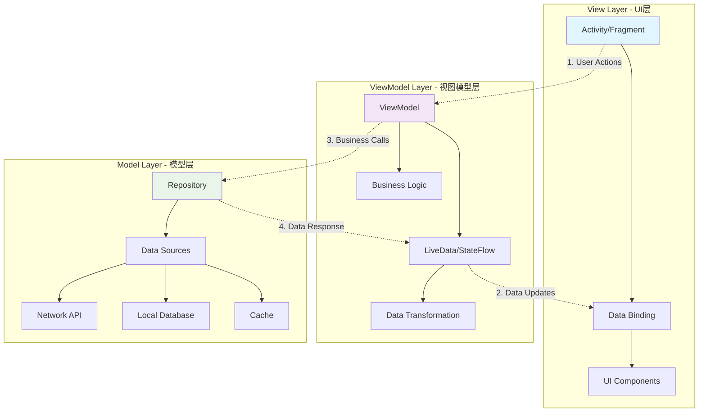

# 第28章：MVVM架构模式

MVVM（Model-View-ViewModel）是一种软件架构模式，特别适用于现代UI框架的开发。它将应用程序分为三个主要部分：Model（模型）、View（视图）和ViewModel（视图模型），实现了UI与业务逻辑的分离。本章将详细介绍MVVM架构模式的原理、实现和最佳实践。

## 28.1 MVVM架构概述

MVVM架构模式通过数据绑定和命令模式实现了View与ViewModel的分离，使代码更加清晰、可测试和可维护。

### 28.1.1 MVVM架构组件关系



### 28.1.2 MVVM架构特点

```java
public class MVVMArchitectureFeatures {
    // 核心特点
    public static final String SEPARATION_OF_CONCERNS = "关注点分离";
    public static final String DATA_BINDING = "数据绑定";
    public static final String TESTABILITY = "可测试性";
    public static final String REACTIVITY = "响应式编程";
    public static final String LIFECYCLE_AWARE = "生命周期感知";

    // 优势
    public static final String MAINTAINABILITY = "易维护";
    public static final String REUSABILITY = "可重用";
    public static final String COLLABORATION = "便于协作开发";
    public static final String UI_LOGIC_SEPARATION = "UI逻辑分离";
    public static final String AUTOMATIC_UI_UPDATES = "自动UI更新";

    // 挑战
    public static final String LEARNING_CURVE = "学习曲线";
    public static final String OVER_ENGINEERING = "过度工程化";
    public static final String DEBUGGING_COMPLEXITY = "调试复杂性";
    public static final String MEMORY_MANAGEMENT = "内存管理";
}
```

## 28.2 Model层设计与实现

Model层负责数据管理和业务逻辑，是MVVM架构的数据中心。

### 28.2.1 Repository模式实现

```java
public interface UserRepository {
    // 基础CRUD操作
    Flow<User> getUserById(String userId);
    Flow<List<User>> getAllUsers();
    suspend fun insertUser(user: User): Long
    suspend fun updateUser(user: User): Int
    suspend fun deleteUser(userId: String): Int

    // 搜索和过滤
    Flow<List<User>> searchUsers(query: String)
    Flow<List<User>> getUsersByRole(role: UserRole)

    // 批量操作
    suspend fun insertUsers(users: List<User>): List<Long>
    suspend fun updateUsers(users: List<User>): Int

    // 数据同步
    suspend fun syncUsersFromNetwork(): Result<List<User>>
    suspend fun refreshUserCache(): Result<Unit>
}

public class UserRepositoryImpl implements UserRepository {
    private static final String TAG = "UserRepositoryImpl";

    private final UserDao userDao;
    private final UserApiService userApiService;
    private final UserCache cache;
    private final NetworkMonitor networkMonitor;

    public UserRepositoryImpl(
            UserDao userDao,
            UserApiService userApiService,
            UserCache cache,
            NetworkMonitor networkMonitor) {
        this.userDao = userDao;
        this.userApiService = userApiService;
        this.cache = cache;
        this.networkMonitor = networkMonitor;
    }

    @Override
    public Flow<User> getUserById(String userId) {
        return userDao.getUserById(userId)
                .distinctUntilChanged()
                .map(user -> {
                    // 缓存用户数据
                    cache.cacheUser(user);
                    return user;
                })
                .catch(throwable -> {
                    Log.e(TAG, "获取用户失败: " + userId, throwable);
                    // 尝试从缓存获取
                    User cachedUser = cache.getCachedUser(userId);
                    if (cachedUser != null) {
                        return flowOf(cachedUser);
                    }
                    throw throwable;
                });
    }

    @Override
    public Flow<List<User>> getAllUsers() {
        return userDao.getAllUsers()
                .distinctUntilChanged()
                .onEach(users -> {
                    Log.d(TAG, "获取用户列表，数量: " + users.size());
                    // 更新缓存
                    cache.cacheUserList(users);
                })
                .catch(throwable -> {
                    Log.e(TAG, "获取用户列表失败", throwable);
                    // 尝试从缓存获取
                    List<User> cachedUsers = cache.getCachedUserList();
                    if (!cachedUsers.isEmpty()) {
                        return flowOf(cachedUsers);
                    }
                    throw throwable;
                });
    }

    @Override
    public suspend Long insertUser(User user) {
        return withContext(Dispatchers.IO) {
            try {
                // 设置创建时间
                user.setCreatedAt(System.currentTimeMillis());
                user.setUpdatedAt(System.currentTimeMillis());

                // 插入本地数据库
                val userId = userDao.insertUser(user);

                // 同步到网络（如果在线）
                if (networkMonitor.isConnected()) {
                    try {
                        val networkUser = userApiService.createUser(user).execute().body();
                        if (networkUser != null) {
                            // 更新本地数据
                            userDao.updateUser(networkUser);
                            userId = networkUser.getId().hashCode().toLong();
                        }
                    } catch (e: Exception) {
                        Log.w(TAG, "网络同步失败，将在后续同步", e);
                    }
                }

                // 清除相关缓存
                cache.invalidateUserCache();

                Log.d(TAG, "用户插入成功: " + user.getId());
                return userId;

            } catch (e: Exception) {
                Log.e(TAG, "插入用户失败: " + user.getId(), e);
                throw e;
            }
        };
    }

    @Override
    public suspend Int updateUser(User user) {
        return withContext(Dispatchers.IO) {
            try {
                // 设置更新时间
                user.setUpdatedAt(System.currentTimeMillis());

                // 更新本地数据库
                val rowsAffected = userDao.updateUser(user);

                // 同步到网络（如果在线）
                if (networkMonitor.isConnected() && rowsAffected > 0) {
                    try {
                        userApiService.updateUser(user.getId(), user).execute();
                    } catch (e: Exception) {
                        Log.w(TAG, "网络同步失败，将在后续同步", e);
                    }
                }

                // 清除相关缓存
                cache.invalidateUserCache();

                Log.d(TAG, "用户更新成功: " + user.getId());
                return rowsAffected;

            } catch (e: Exception) {
                Log.e(TAG, "更新用户失败: " + user.getId(), e);
                throw e;
            }
        };
    }

    @Override
    public suspend Int deleteUser(String userId) {
        return withContext(Dispatchers.IO) {
            try {
                // 从本地数据库删除
                val rowsAffected = userDao.deleteUserById(userId);

                // 从网络删除（如果在线）
                if (networkMonitor.isConnected() && rowsAffected > 0) {
                    try {
                        userApiService.deleteUser(userId).execute();
                    } catch (e: Exception) {
                        Log.w(TAG, "网络删除失败", e);
                    }
                }

                // 清除相关缓存
                cache.removeCachedUser(userId);
                cache.invalidateUserCache();

                Log.d(TAG, "用户删除成功: " + userId);
                return rowsAffected;

            } catch (e: Exception) {
                Log.e(TAG, "删除用户失败: " + userId, e);
                throw e;
            }
        };
    }

    @Override
    public Flow<List<User>> searchUsers(String query) {
        if (query == null || query.trim().isEmpty()) {
            return getAllUsers();
        }

        return userDao.searchUsers(query.trim())
                .distinctUntilChanged()
                .catch(throwable -> {
                    Log.e(TAG, "搜索用户失败: " + query, throwable);
                    throw throwable;
                });
    }

    @Override
    public Flow<List<User>> getUsersByRole(UserRole role) {
        return userDao.getUsersByRole(role)
                .distinctUntilChanged()
                .catch(throwable -> {
                    Log.e(TAG, "按角色获取用户失败: " + role, throwable);
                    throw throwable;
                });
    }

    @Override
    public suspend List<Long> insertUsers(List<User> users) {
        return withContext(Dispatchers.IO) {
            if (users == null || users.isEmpty()) {
                return emptyList();
            }

            try {
                // 设置时间戳
                val currentTime = System.currentTimeMillis();
                users.forEach(user -> {
                    user.setCreatedAt(currentTime);
                    user.setUpdatedAt(currentTime);
                });

                // 批量插入本地数据库
                val userIds = userDao.insertUsers(users);

                // 异步同步到网络
                if (networkMonitor.isConnected()) {
                    GlobalScope.launch(Dispatchers.IO) {
                        try {
                            userApiService.createUsers(users).execute();
                        } catch (e: Exception) {
                            Log.w(TAG, "批量网络同步失败", e);
                        }
                    }
                }

                // 清除缓存
                cache.invalidateUserCache();

                Log.d(TAG, "批量插入用户成功，数量: " + users.size());
                return userIds;

            } catch (e: Exception) {
                Log.e(TAG, "批量插入用户失败", e);
                throw e;
            }
        };
    }

    @Override
    public suspend Int updateUsers(List<User> users) {
        return withContext(Dispatchers.IO) {
            if (users == null || users.isEmpty()) {
                return 0;
            }

            try {
                // 设置更新时间
                val currentTime = System.currentTimeMillis();
                users.forEach(user -> user.setUpdatedAt(currentTime));

                // 批量更新本地数据库
                val rowsAffected = userDao.updateUsers(users);

                // 异步同步到网络
                if (networkMonitor.isConnected()) {
                    GlobalScope.launch(Dispatchers.IO) {
                        try {
                            userApiService.updateUsers(users).execute();
                        } catch (e: Exception) {
                            Log.w(TAG, "批量网络同步失败", e);
                        }
                    }
                }

                // 清除缓存
                cache.invalidateUserCache();

                Log.d(TAG, "批量更新用户成功，数量: " + users.size());
                return rowsAffected;

            } catch (e: Exception) {
                Log.e(TAG, "批量更新用户失败", e);
                throw e;
            }
        };
    }

    @Override
    public suspend Result<List<User>> syncUsersFromNetwork() {
        return withContext(Dispatchers.IO) {
            try {
                if (!networkMonitor.isConnected()) {
                    return Result.failure(Exception("网络不可用"));
                }

                Log.d(TAG, "开始从网络同步用户数据");

                // 从网络获取用户数据
                val response = userApiService.getAllUsers().execute();
                if (response.isSuccessful && response.body() != null) {
                    val networkUsers = response.body()!!;

                    // 保存到本地数据库
                    userDao.insertAllUsers(networkUsers);

                    // 更新缓存
                    cache.cacheUserList(networkUsers);

                    Log.d(TAG, "用户数据同步成功，数量: " + networkUsers.size());
                    Result.success(networkUsers)
                } else {
                    val error = "网络请求失败: " + response.code();
                    Log.e(TAG, error);
                    Result.failure(Exception(error))
                }

            } catch (e: Exception) {
                Log.e(TAG, "同步用户数据失败", e);
                Result.failure(e)
            }
        };
    }

    @Override
    public suspend Result<Unit> refreshUserCache() {
        return withContext(Dispatchers.IO) {
            try {
                Log.d(TAG, "刷新用户缓存");

                // 清除缓存
                cache.clearAllCache();

                // 强制重新加载数据
                val users = userDao.getAllUsers().first();
                cache.cacheUserList(users);

                Log.d(TAG, "用户缓存刷新完成");
                Result.success(Unit)

            } catch (e: Exception) {
                Log.e(TAG, "刷新用户缓存失败", e);
                Result.failure(e)
            }
        };
    }
}
```

### 28.2.2 数据缓存实现

```java
public class UserCache {
    private static final String TAG = "UserCache";

    private final LruCache<String, User> userCache;
    private final SharedPreferences preferences;
    private final Gson gson;

    private static final int MAX_CACHE_SIZE = 100;
    private static final String CACHE_KEY_USER_PREFIX = "user_";
    private static final String CACHE_KEY_USER_LIST = "user_list";
    private static final String CACHE_KEY_TIMESTAMP = "cache_timestamp";

    public UserCache(Context context) {
        this.userCache = new LruCache<>(MAX_CACHE_SIZE);
        this.preferences = context.getSharedPreferences("user_cache", Context.MODE_PRIVATE);
        this.gson = new Gson();
    }

    /**
     * 缓存单个用户
     */
    public void cacheUser(User user) {
        if (user == null || user.getId() == null) {
            return;
        }

        String key = CACHE_KEY_USER_PREFIX + user.getId();
        userCache.put(key, user);

        // 持久化到SharedPreferences
        String json = gson.toJson(user);
        preferences.edit().putString(key, json).apply();

        Log.d(TAG, "用户已缓存: " + user.getId());
    }

    /**
     * 获取缓存用户
     */
    public User getCachedUser(String userId) {
        if (userId == null) {
            return null;
        }

        String key = CACHE_KEY_USER_PREFIX + userId;

        // 先从内存缓存获取
        User user = userCache.get(key);
        if (user != null) {
            return user;
        }

        // 从SharedPreferences获取
        String json = preferences.getString(key, null);
        if (json != null) {
            try {
                user = gson.fromJson(json, User.class);
                if (user != null) {
                    userCache.put(key, user);
                }
                return user;
            } catch (Exception e) {
                Log.e(TAG, "解析缓存用户失败: " + userId, e);
            }
        }

        return null;
    }

    /**
     * 缓存用户列表
     */
    public void cacheUserList(List<User> users) {
        if (users == null) {
            return;
        }

        try {
            String json = gson.toJson(users);
            preferences.edit()
                    .putString(CACHE_KEY_USER_LIST, json)
                    .putLong(CACHE_KEY_TIMESTAMP, System.currentTimeMillis())
                    .apply();

            // 缓存每个用户
            for (User user : users) {
                cacheUser(user);
            }

            Log.d(TAG, "用户列表已缓存，数量: " + users.size());

        } catch (Exception e) {
            Log.e(TAG, "缓存用户列表失败", e);
        }
    }

    /**
     * 获取缓存用户列表
     */
    public List<User> getCachedUserList() {
        try {
            String json = preferences.getString(CACHE_KEY_USER_LIST, null);
            if (json != null) {
                Type listType = new TypeToken<List<User>>() {}.getType();
                List<User> users = gson.fromJson(json, listType);

                if (users != null) {
                    // 更新内存缓存
                    for (User user : users) {
                        if (user.getId() != null) {
                            userCache.put(CACHE_KEY_USER_PREFIX + user.getId(), user);
                        }
                    }
                    return users;
                }
            }
        } catch (Exception e) {
            Log.e(TAG, "获取缓存用户列表失败", e);
        }

        return new ArrayList<>();
    }

    /**
     * 移除缓存用户
     */
    public void removeCachedUser(String userId) {
        if (userId == null) {
            return;
        }

        String key = CACHE_KEY_USER_PREFIX + userId;
        userCache.remove(key);
        preferences.edit().remove(key).apply();

        Log.d(TAG, "缓存用户已移除: " + userId);
    }

    /**
     * 清除用户缓存
     */
    public void invalidateUserCache() {
        userCache.evictAll();
        preferences.edit()
                .remove(CACHE_KEY_USER_LIST)
                .remove(CACHE_KEY_TIMESTAMP)
                .apply();

        Log.d(TAG, "用户缓存已清除");
    }

    /**
     * 清除所有缓存
     */
    public void clearAllCache() {
        userCache.evictAll();
        preferences.edit().clear().apply();

        Log.d(TAG, "所有缓存已清除");
    }

    /**
     * 检查缓存是否过期
     */
    public boolean isCacheExpired() {
        long timestamp = preferences.getLong(CACHE_KEY_TIMESTAMP, 0);
        long currentTime = System.currentTimeMillis();
        long maxAge = 5 * 60 * 1000; // 5分钟

        return (currentTime - timestamp) > maxAge;
    }

    /**
     * 获取缓存大小
     */
    public int getCacheSize() {
        return userCache.size();
    }

    /**
     * 获取缓存统计信息
     */
    public String getCacheStats() {
        return "内存缓存: " + userCache.size() + "/" + MAX_CACHE_SIZE +
               ", 持久化缓存: " + (preferences.contains(CACHE_KEY_USER_LIST) ? "存在" : "不存在") +
               ", 过期状态: " + (isCacheExpired() ? "已过期" : "有效");
    }
}
```

## 28.3 ViewModel层设计与实现

ViewModel层是MVVM架构的核心，负责处理UI相关的业务逻辑和数据状态管理。

### 28.3.1 基础ViewModel实现

```java
public class UserListViewModel extends ViewModel {
    private static final String TAG = "UserListViewModel";

    // 数据流
    private final Flow<ViewState<List<User>>> viewStateFlow;
    private final StateFlow<String> searchQuery;
    private final StateFlow<UserRole> selectedRole;
    private final StateFlow<SortOption> sortOption;

    // 业务逻辑
    private final UserRepository userRepository;
    private final NavigationManager navigationManager;

    // 分页数据
    private final Pager<Integer, User> pager;
    private final Flow<PagingData<User>> pagingDataFlow;

    // 网络状态
    private final StateFlow<Boolean> isRefreshing;
    private final StateFlow<Boolean> isOnline;

    public UserListViewModel(
            UserRepository userRepository,
            NavigationManager navigationManager,
            NetworkMonitor networkMonitor) {
        this.userRepository = userRepository;
        this.navigationManager = navigationManager;

        // 初始化状态流
        this.searchQuery = MutableStateFlow("");
        this.selectedRole = MutableStateFlow(UserRole.ALL);
        this.sortOption = MutableStateFlow(SortOption.NAME_ASC);
        this.isRefreshing = MutableStateFlow(false);
        this.isOnline = networkMonitor.isOnlineFlow()
                .stateIn(
                    viewModelScope,
                    SharingStarted.WhileSubscribed(5000),
                    true
                );

        // 创建视图状态流
        this.viewStateFlow = combine(
            userRepository.getAllUsers(),
            searchQuery,
            selectedRole,
            sortOption,
            isRefreshing,
            isOnline
        ) { users, query, role, sort, refreshing, online ->
            val filteredUsers = filterUsers(users, query, role)
            val sortedUsers = sortUsers(filteredUsers, sort)

            ViewState(
                data = sortedUsers,
                isLoading = false,
                isRefreshing = refreshing,
                isOnline = online,
                error = null,
                searchQuery = query,
                selectedRole = role,
                sortOption = sort
            )
        }.catch { throwable ->
            emit(ViewState.error("加载用户列表失败: " + throwable.message))
        }.stateIn(
            viewModelScope,
            SharingStarted.WhileSubscribed(5000),
            ViewState.loading()
        );

        // 创建分页数据流
        this.pagingDataFlow = createPagingDataFlow();

        // 创建分页器
        this.pager = Pager(
            config = PagingConfig(
                pageSize = 20,
                enablePlaceholders = false,
                initialLoadSize = 40
            ),
            remoteMediator = UserRemoteMediator(userRepository, networkMonitor),
            pagingSourceFactory = { userDao.getAllUsersPaged() }
        );
    }

    /**
     * 获取视图状态流
     */
    public Flow<ViewState<List<User>>> getViewState() {
        return viewStateFlow;
    }

    /**
     * 获取分页数据流
     */
    public Flow<PagingData<User>> getPagingData() {
        return pagingDataFlow;
    }

    /**
     * 获取搜索查询流
     */
    public StateFlow<String> getSearchQuery() {
        return searchQuery;
    }

    /**
     * 获取选中角色流
     */
    public StateFlow<UserRole> getSelectedRole() {
        return selectedRole;
    }

    /**
     * 获取排序选项流
     */
    public StateFlow<SortOption> getSortOption() {
        return sortOption;
    }

    /**
     * 获取刷新状态流
     */
    public StateFlow<Boolean> getIsRefreshing() {
        return isRefreshing;
    }

    /**
     * 获取网络状态流
     */
    public StateFlow<Boolean> getIsOnline() {
        return isOnline;
    }

    /**
     * 更新搜索查询
     */
    public void updateSearchQuery(String query) {
        viewModelScope.launch {
            searchQuery.emit(query.orEmpty())
        }
    }

    /**
     * 更新选中角色
     */
    public void updateSelectedRole(UserRole role) {
        viewModelScope.launch {
            selectedRole.emit(role)
        }
    }

    /**
     * 更新排序选项
     */
    public void updateSortOption(SortOption sortOption) {
        viewModelScope.launch {
            this.sortOption.emit(sortOption)
        }
    }

    /**
     * 刷新数据
     */
    public fun refresh() {
        viewModelScope.launch {
            isRefreshing.emit(true)

            try {
                val result = userRepository.syncUsersFromNetwork()
                if (result.isSuccess) {
                    Log.d(TAG, "数据刷新成功")
                } else {
                    Log.e(TAG, "数据刷新失败: ${result.exceptionOrNull()?.message}")
                }
            } catch (e: Exception) {
                Log.e(TAG, "数据刷新异常", e)
            } finally {
                isRefreshing.emit(false)
            }
        }
    }

    /**
     * 导航到用户详情
     */
    public void navigateToUserDetail(String userId) {
        navigationManager.navigateToUserDetail(userId)
    }

    /**
     * 导航到添加用户
     */
    public void navigateToAddUser() {
        navigationManager.navigateToAddUser()
    }

    /**
     * 删除用户
     */
    public fun deleteUser(User user) {
        viewModelScope.launch {
            try {
                val rowsAffected = userRepository.deleteUser(user.getId())
                if (rowsAffected > 0) {
                    Log.d(TAG, "用户删除成功: ${user.getId()}")
                } else {
                    Log.w(TAG, "用户删除失败: ${user.getId()}")
                }
            } catch (e: Exception) {
                Log.e(TAG, "删除用户异常: ${user.getId()}", e)
            }
        }
    }

    /**
     * 过滤用户
     */
    private List<User> filterUsers(List<User> users, String query, UserRole role) {
        var filteredUsers = users

        // 按角色过滤
        if (role != UserRole.ALL) {
            filteredUsers = filteredUsers.filter { it.getRole() == role }
        }

        // 按搜索查询过滤
        if (!query.trim().isEmpty()) {
            val trimmedQuery = query.trim().lowercase()
            filteredUsers = filteredUsers.filter { user ->
                user.getFirstName().lowercase().contains(trimmedQuery) ||
                user.getLastName().lowercase().contains(trimmedQuery) ||
                user.getEmail().lowercase().contains(trimmedQuery)
            }
        }

        return filteredUsers
    }

    /**
     * 排序用户
     */
    private List<User> sortUsers(List<User> users, SortOption sortOption) {
        return when (sortOption) {
            SortOption.NAME_ASC -> users.sortedBy { it.getFirstName() + it.getLastName() }
            SortOption.NAME_DESC -> users.sortedByDescending { it.getFirstName() + it.getLastName() }
            SortOption.EMAIL_ASC -> users.sortedBy { it.getEmail() }
            SortOption.EMAIL_DESC -> users.sortedByDescending { it.getEmail() }
            SortOption.CREATED_ASC -> users.sortedBy { it.getCreatedAt() }
            SortOption.CREATED_DESC -> users.sortedByDescending { it.getCreatedAt() }
        }
    }

    /**
     * 创建分页数据流
     */
    private Flow<PagingData<User>> createPagingDataFlow() {
        return pager.flow
                .cachedIn(viewModelScope)
                .map { pagingData ->
                    // 应用过滤和排序
                    pagingData.map { user ->
                        // 这里可以添加额外的数据转换
                        user
                    }
                }
    }

    /**
     * 视图状态类
     */
    public static class ViewState<T> {
        public final List<T> data;
        public final boolean isLoading;
        public final boolean isRefreshing;
        public final boolean isOnline;
        public final String error;
        public final String searchQuery;
        public final UserRole selectedRole;
        public final SortOption sortOption;

        private ViewState(List<T> data, boolean isLoading, boolean isRefreshing,
                         boolean isOnline, String error, String searchQuery,
                         UserRole selectedRole, SortOption sortOption) {
            this.data = data != null ? data : new ArrayList<>();
            this.isLoading = isLoading;
            this.isRefreshing = isRefreshing;
            this.isOnline = isOnline;
            this.error = error;
            this.searchQuery = searchQuery;
            this.selectedRole = selectedRole;
            this.sortOption = sortOption;
        }

        public static <T> ViewState<T> loading() {
            return new ViewState<>(null, true, false, false, null, "", UserRole.ALL, SortOption.NAME_ASC);
        }

        public static <T> ViewState<T> error(String error) {
            return new ViewState<>(null, false, false, false, error, "", UserRole.ALL, SortOption.NAME_ASC);
        }

        public static <T> ViewState<T> success(List<T> data) {
            return new ViewState<>(data, false, false, true, null, "", UserRole.ALL, SortOption.NAME_ASC);
        }

        public boolean hasError() {
            return error != null && !error.trim().isEmpty();
        }

        public boolean isEmpty() {
            return data.isEmpty() && !isLoading;
        }

        @Override
        public String toString() {
            return "ViewState{" +
                   "data.size=" + data.size() +
                   ", isLoading=" + isLoading +
                   ", isRefreshing=" + isRefreshing +
                   ", isOnline=" + isOnline +
                   ", error='" + error + '\'' +
                   ", searchQuery='" + searchQuery + '\'' +
                   ", selectedRole=" + selectedRole +
                   ", sortOption=" + sortOption +
                   '}';
        }
    }

    /**
     * 排序选项枚举
     */
    public enum SortOption {
        NAME_ASC("姓名升序"),
        NAME_DESC("姓名降序"),
        EMAIL_ASC("邮箱升序"),
        EMAIL_DESC("邮箱降序"),
        CREATED_ASC("创建时间升序"),
        CREATED_DESC("创建时间降序");

        private final String displayName;

        SortOption(String displayName) {
            this.displayName = displayName;
        }

        public String getDisplayName() {
            return displayName;
        }
    }
}
```

### 28.3.2 ViewModel工厂模式

```java
public class ViewModelFactory implements ViewModelProvider.Factory {
    private static final String TAG = "ViewModelFactory";

    private final Application application;
    private final UserRepository userRepository;
    private final NavigationManager navigationManager;
    private final NetworkMonitor networkMonitor;

    public ViewModelFactory(Application application, UserRepository userRepository,
                           NavigationManager navigationManager, NetworkMonitor networkMonitor) {
        this.application = application;
        this.userRepository = userRepository;
        this.navigationManager = navigationManager;
        this.networkMonitor = networkMonitor;
    }

    @NonNull
    @Override
    public <T extends ViewModel> T create(@NonNull Class<T> modelClass) {
        if (modelClass.isAssignableFrom(UserListViewModel.class)) {
            return (T) new UserListViewModel(userRepository, navigationManager, networkMonitor);
        } else if (modelClass.isAssignableFrom(UserDetailViewModel.class)) {
            return (T) new UserDetailViewModel(userRepository, navigationManager, networkMonitor);
        } else if (modelClass.isAssignableFrom(AddUserViewModel.class)) {
            return (T) new AddUserViewModel(userRepository, navigationManager);
        } else if (modelClass.isAssignableFrom(EditUserViewModel.class)) {
            return (T) new EditUserViewModel(userRepository, navigationManager);
        } else {
            throw new IllegalArgumentException("Unknown ViewModel class: " + modelClass.getName());
        }
    }

    /**
     * 单例工厂
     */
    public static class Singleton {
        private static volatile ViewModelFactory instance;
        private static final Object lock = new Object();

        public static ViewModelFactory getInstance(Application application) {
            if (instance == null) {
                synchronized (lock) {
                    if (instance == null) {
                        // 创建依赖
                        AppDatabase database = AppDatabase.getDatabase(application);
                        UserDao userDao = database.userDao();
                        UserApiService userApiService = ApiClient.getInstance().getUserApiService();
                        UserCache userCache = new UserCache(application);
                        NetworkMonitor networkMonitor = new NetworkMonitor(application);

                        // 创建Repository
                        UserRepository userRepository = new UserRepositoryImpl(
                            userDao, userApiService, userCache, networkMonitor);

                        // 创建导航管理器
                        NavigationManager navigationManager = new NavigationManager(application);

                        instance = new ViewModelFactory(
                            application, userRepository, navigationManager, networkMonitor);
                    }
                }
            }
            return instance;
        }

        public static void clearInstance() {
            instance = null;
        }
    }
}

/**
 * 简化的ViewModel工厂，使用Kotlin
 */
class KViewModelFactory : ViewModelProvider.Factory {
    private val creators: Map<Class<out ViewModel>, Provider<ViewModel>>

    @Suppress("UNCHECKED_CAST")
    constructor(vararg creators: Pair<Class<out ViewModel>, Provider<ViewModel>>) {
        this.creators = creators.associateBy({ it.first }, { it.second })
    }

    override fun <T : ViewModel> create(modelClass: Class<T>): T {
        val creator = creators[modelClass] ?: creators.entries.firstOrNull {
            modelClass.isAssignableFrom(it.key)
        }?.value ?: throw IllegalArgumentException("Unknown ViewModel class: $modelClass")

        return try {
            creator.get() as T
        } catch (e: Exception) {
            throw RuntimeException(e)
        }
    }
}

/**
 * 依赖注入ViewModel工厂（配合Hilt）
 */
@HiltViewModel
class UserListViewModel @Inject constructor(
    private val userRepository: UserRepository,
    private val navigationManager: NavigationManager,
    private val networkMonitor: NetworkMonitor
) : ViewModel() {

    // ViewModel实现
}
```

## 28.4 View层设计与实现

View层负责展示UI和处理用户交互，通过数据绑定与ViewModel进行通信。

### 28.4.1 Fragment实现

```java
public class UserListFragment extends Fragment {
    private static final String TAG = "UserListFragment";

    private FragmentUserListBinding binding;
    private UserListViewModel viewModel;
    private UserListAdapter adapter;

    // 状态保存
    private static final String ARG_SEARCH_QUERY = "search_query";
    private static final String ARG_SELECTED_ROLE = "selected_role";
    private static final String ARG_SORT_OPTION = "sort_option";

    public UserListFragment() {
        // Required empty public constructor
    }

    public static UserListFragment newInstance() {
        return new UserListFragment();
    }

    @Override
    public void onCreate(Bundle savedInstanceState) {
        super.onCreate(savedInstanceState);

        // 设置ViewModel
        ViewModelFactory factory = ViewModelFactory.Singleton.getInstance(requireActivity().getApplication());
        viewModel = new ViewModelProvider(this, factory).get(UserListViewModel.class);

        // 设置菜单
        setHasOptionsMenu(true);
    }

    @Override
    public View onCreateView(@NonNull LayoutInflater inflater, ViewGroup container,
                           Bundle savedInstanceState) {
        binding = FragmentUserListBinding.inflate(inflater, container, false);
        return binding.getRoot();
    }

    @Override
    public void onViewCreated(@NonNull View view, @Nullable Bundle savedInstanceState) {
        super.onViewCreated(view, savedInstanceState);

        setupRecyclerView();
        setupSwipeRefresh();
        setupSearchView();
        setupFilterAndSort();
        observeViewModel();
        restoreInstanceState(savedInstanceState);
    }

    /**
     * 设置RecyclerView
     */
    private void setupRecyclerView() {
        adapter = new UserListAdapter(new UserDiffCallback(), userCallback);

        binding.recyclerView.setLayoutManager(new LinearLayoutManager(requireContext()));
        binding.recyclerView.setAdapter(adapter);

        // 添加分割线
        DividerItemDecoration dividerItemDecoration = new DividerItemDecoration(
            requireContext(), DividerItemDecoration.VERTICAL);
        binding.recyclerView.addItemDecoration(dividerItemDecoration);

        // 设置动画
        DefaultItemAnimator animator = new DefaultItemAnimator();
        animator.setAddDuration(200);
        animator.setRemoveDuration(200);
        binding.recyclerView.setItemAnimator(animator);
    }

    /**
     * 设置下拉刷新
     */
    private void setupSwipeRefresh() {
        binding.swipeRefreshLayout.setOnRefreshListener(() -> {
            viewModel.refresh();
        });

        binding.swipeRefreshLayout.setColorSchemeColors(
            ContextCompat.getColor(requireContext(), R.color.colorPrimary),
            ContextCompat.getColor(requireContext(), R.color.colorAccent)
        );
    }

    /**
     * 设置搜索视图
     */
    private void setupSearchView() {
        binding.searchView.setOnQueryTextListener(new SearchView.OnQueryTextListener() {
            @Override
            public boolean onQueryTextSubmit(String query) {
                viewModel.updateSearchQuery(query);
                binding.searchView.clearFocus();
                return true;
            }

            @Override
            public boolean onQueryTextChange(String newText) {
                viewModel.updateSearchQuery(newText);
                return true;
            }
        });

        binding.searchView.setOnCloseListener(() -> {
            viewModel.updateSearchQuery("");
            return true;
        });
    }

    /**
     * 设置过滤和排序
     */
    private void setupFilterAndSort() {
        // 角色过滤
        binding.roleSpinner.setAdapter(new ArrayAdapter<>(
            requireContext(),
            android.R.layout.simple_spinner_dropdown_item,
            UserRole.getAllRoles()
        ));

        binding.roleSpinner.setOnItemSelectedListener(new AdapterView.OnItemSelectedListener() {
            @Override
            public void onItemSelected(AdapterView<?> parent, View view, int position, long id) {
                UserRole role = (UserRole) parent.getItemAtPosition(position);
                viewModel.updateSelectedRole(role);
            }

            @Override
            public void onNothingSelected(AdapterView<?> parent) {}
        });

        // 排序选项
        binding.sortSpinner.setAdapter(new ArrayAdapter<>(
            requireContext(),
            android.R.layout.simple_spinner_dropdown_item,
            Arrays.asList(UserListViewModel.SortOption.values())
        ));

        binding.sortSpinner.setOnItemSelectedListener(new AdapterView.OnItemSelectedListener() {
            @Override
            public void onItemSelected(AdapterView<?> parent, View view, int position, long id) {
                UserListViewModel.SortOption sortOption =
                    (UserListViewModel.SortOption) parent.getItemAtPosition(position);
                viewModel.updateSortOption(sortOption);
            }

            @Override
            public void onNothingSelected(AdapterView<?> parent) {}
        });
    }

    /**
     * 观察ViewModel数据
     */
    private void observeViewModel() {
        // 观察视图状态
        viewModel.getViewState().observe(getViewLifecycleOwner(), viewState -> {
            updateUI(viewState);
        });

        // 观察分页数据
        viewModel.getPagingData().observe(getViewLifecycleOwner(), pagingData -> {
            adapter.submitData(getViewLifecycleOwner().getLifecycle(), pagingData);
        });

        // 观察搜索查询
        viewModel.getSearchQuery().observe(getViewLifecycleOwner(), query -> {
            if (binding.searchView.getQuery().toString().equals(query)) {
                return;
            }
            binding.searchView.setQuery(query, false);
        });

        // 观察刷新状态
        viewModel.getIsRefreshing().observe(getViewLifecycleOwner(), isRefreshing -> {
            binding.swipeRefreshLayout.setRefreshing(isRefreshing);
        });

        // 观察网络状态
        viewModel.getIsOnline().observe(getViewLifecycleOwner(), isOnline -> {
            updateNetworkStatus(isOnline);
        });
    }

    /**
     * 更新UI
     */
    private void updateUI(UserListViewModel.ViewState<List<User>> viewState) {
        // 更新加载状态
        if (viewState.isLoading) {
            showLoadingState();
        } else {
            hideLoadingState();
        }

        // 更新错误状态
        if (viewState.hasError()) {
            showErrorState(viewState.error);
        } else {
            hideErrorState();
        }

        // 更新空状态
        if (viewState.isEmpty()) {
            showEmptyState();
        } else {
            hideEmptyState();
        }

        // 更新统计信息
        updateStats(viewState.data.size(), viewState.searchQuery, viewState.selectedRole);
    }

    /**
     * 显示加载状态
     */
    private void showLoadingState() {
        binding.progressBar.setVisibility(View.VISIBLE);
        binding.recyclerView.setVisibility(View.GONE);
        binding.emptyStateLayout.setVisibility(View.GONE);
        binding.errorLayout.setVisibility(View.GONE);
    }

    /**
     * 隐藏加载状态
     */
    private void hideLoadingState() {
        binding.progressBar.setVisibility(View.GONE);
        binding.recyclerView.setVisibility(View.VISIBLE);
    }

    /**
     * 显示错误状态
     */
    private void showErrorState(String error) {
        binding.errorLayout.setVisibility(View.VISIBLE);
        binding.recyclerView.setVisibility(View.GONE);
        binding.emptyStateLayout.setVisibility(View.GONE);

        binding.errorMessageTextView.setText(error);
        binding.retryButton.setOnClickListener(v -> viewModel.refresh());
    }

    /**
     * 隐藏错误状态
     */
    private void hideErrorState() {
        binding.errorLayout.setVisibility(View.GONE);
    }

    /**
     * 显示空状态
     */
    private void showEmptyState() {
        binding.emptyStateLayout.setVisibility(View.VISIBLE);
        binding.recyclerView.setVisibility(View.GONE);
        binding.errorLayout.setVisibility(View.GONE);

        binding.emptyMessageTextView.setText("没有找到用户");
        binding.emptyActionButton.setOnClickListener(v -> viewModel.navigateToAddUser());
    }

    /**
     * 隐藏空状态
     */
    private void hideEmptyState() {
        binding.emptyStateLayout.setVisibility(View.GONE);
    }

    /**
     * 更新网络状态
     */
    private void updateNetworkStatus(boolean isOnline) {
        binding.networkStatusTextView.setVisibility(isOnline ? View.GONE : View.VISIBLE);
        binding.networkStatusTextView.setText(isOnline ? "" : "网络不可用");

        // 禁用/启用离线不可用的功能
        binding.refreshButton.setEnabled(isOnline);
    }

    /**
     * 更新统计信息
     */
    private void updateStats(int userCount, String searchQuery, UserRole selectedRole) {
        String stats = String.format("共 %d 位用户", userCount);
        if (!searchQuery.trim().isEmpty()) {
            stats += String.format(" (搜索: %s)", searchQuery);
        }
        if (selectedRole != UserRole.ALL) {
            stats += String.format(" (角色: %s)", selectedRole.getDisplayName());
        }

        binding.statsTextView.setText(stats);
    }

    /**
     * 用户回调
     */
    private final UserListAdapter.UserCallback userCallback = new UserListAdapter.UserCallback() {
        @Override
        public void onUserClick(User user) {
            viewModel.navigateToUserDetail(user.getId());
        }

        @Override
        public void onUserDelete(User user) {
            showDeleteConfirmationDialog(user);
        }

        @Override
        public void onUserEdit(User user) {
            // 可以实现编辑功能
        }
    };

    /**
     * 显示删除确认对话框
     */
    private void showDeleteConfirmationDialog(User user) {
        new AlertDialog.Builder(requireContext())
                .setTitle("删除用户")
                .setMessage("确定要删除用户 " + user.getFirstName() + " " + user.getLastName() + " 吗？")
                .setPositiveButton("删除", (dialog, which) -> {
                    viewModel.deleteUser(user);
                })
                .setNegativeButton("取消", null)
                .show();
    }

    /**
     * 保存实例状态
     */
    @Override
    public void onSaveInstanceState(@NonNull Bundle outState) {
        super.onSaveInstanceState(outState);

        outState.putString(ARG_SEARCH_QUERY, viewModel.getSearchQuery().getValue());
        outState.putSerializable(ARG_SELECTED_ROLE, viewModel.getSelectedRole().getValue());
        outState.putSerializable(ARG_SORT_OPTION, viewModel.getSortOption().getValue());
    }

    /**
     * 恢复实例状态
     */
    private void restoreInstanceState(Bundle savedInstanceState) {
        if (savedInstanceState != null) {
            String searchQuery = savedInstanceState.getString(ARG_SEARCH_QUERY, "");
            UserRole selectedRole = (UserRole) savedInstanceState.getSerializable(ARG_SELECTED_ROLE);
            UserListViewModel.SortOption sortOption =
                (UserListViewModel.SortOption) savedInstanceState.getSerializable(ARG_SORT_OPTION);

            // 恢复状态
            viewModel.updateSearchQuery(searchQuery);
            if (selectedRole != null) {
                viewModel.updateSelectedRole(selectedRole);
            }
            if (sortOption != null) {
                viewModel.updateSortOption(sortOption);
            }

            // 更新UI控件状态
            binding.searchView.setQuery(searchQuery, false);
            if (selectedRole != null) {
                int position = Arrays.asList(UserRole.getAllRoles()).indexOf(selectedRole);
                if (position >= 0) {
                    binding.roleSpinner.setSelection(position);
                }
            }
            if (sortOption != null) {
                int position = Arrays.asList(UserListViewModel.SortOption.values()).indexOf(sortOption);
                if (position >= 0) {
                    binding.sortSpinner.setSelection(position);
                }
            }
        }
    }

    @Override
    public void onCreateOptionsMenu(@NonNull Menu menu, @NonNull MenuInflater inflater) {
        inflater.inflate(R.menu.menu_user_list, menu);
        super.onCreateOptionsMenu(menu, inflater);
    }

    @Override
    public boolean onOptionsItemSelected(@NonNull MenuItem item) {
        switch (item.getItemId()) {
            case R.id.action_add_user:
                viewModel.navigateToAddUser();
                return true;
            case R.id.action_refresh:
                viewModel.refresh();
                return true;
            case R.id.action_settings:
                // 导航到设置页面
                return true;
            default:
                return super.onOptionsItemSelected(item);
        }
    }

    @Override
    public void onDestroyView() {
        super.onDestroyView();
        binding = null;
    }
}
```

### 28.4.2 RecyclerView适配器

```java
public class UserListAdapter extends PagingDataAdapter<User, UserListAdapter.UserViewHolder> {

    private static final String TAG = "UserListAdapter";

    private final UserCallback userCallback;
    private final ViewType viewType;

    public UserListAdapter(@NonNull DiffUtil.ItemCallback<User> diffCallback, UserCallback userCallback) {
        this(diffCallback, userCallback, ViewType.LIST);
    }

    public UserListAdapter(@NonNull DiffUtil.ItemCallback<User> diffCallback,
                          UserCallback userCallback, ViewType viewType) {
        super(diffCallback);
        this.userCallback = userCallback;
        this.viewType = viewType;
    }

    @NonNull
    @Override
    public UserViewHolder onCreateViewHolder(@NonNull ViewGroup parent, int viewType) {
        LayoutInflater inflater = LayoutInflater.from(parent.getContext());

        if (this.viewType == ViewType.GRID) {
            ItemUserGridBinding binding = ItemUserGridBinding.inflate(inflater, parent, false);
            return new UserViewHolder(binding);
        } else {
            ItemUserListBinding binding = ItemUserListBinding.inflate(inflater, parent, false);
            return new UserViewHolder(binding);
        }
    }

    @Override
    public void onBindViewHolder(@NonNull UserViewHolder holder, int position) {
        User user = getItem(position);
        if (user != null) {
            holder.bind(user, userCallback);
        }
    }

    @Override
    public int getItemViewType(int position) {
        return viewType.ordinal();
    }

    /**
     * ViewHolder
     */
    static class UserViewHolder extends RecyclerView.ViewHolder {
        private final ItemUserListBinding listBinding;
        private final ItemUserGridBinding gridBinding;
        private final boolean isGridView;

        UserViewHolder(ItemUserListBinding binding) {
            super(binding.getRoot());
            this.listBinding = binding;
            this.gridBinding = null;
            this.isGridView = false;
        }

        UserViewHolder(ItemUserGridBinding binding) {
            super(binding.getRoot());
            this.listBinding = null;
            this.gridBinding = binding;
            this.isGridView = true;
        }

        void bind(User user, UserCallback callback) {
            if (isGridView) {
                bindGridView(user, callback);
            } else {
                bindListView(user, callback);
            }
        }

        private void bindListView(User user, UserCallback callback) {
            // 绑定数据
            listBinding.setUser(user);
            listBinding.setCallback(callback);

            // 设置点击事件
            listBinding.getRoot().setOnClickListener(v -> {
                if (callback != null) {
                    callback.onUserClick(user);
                }
            });

            // 设置删除按钮点击事件
            listBinding.deleteButton.setOnClickListener(v -> {
                if (callback != null) {
                    callback.onUserDelete(user);
                }
            });

            // 设置编辑按钮点击事件
            listBinding.editButton.setOnClickListener(v -> {
                if (callback != null) {
                    callback.onUserEdit(user);
                }
            });

            // 执行数据绑定
            listBinding.executePendingBindings();
        }

        private void bindGridView(User user, UserCallback callback) {
            // 绑定数据
            gridBinding.setUser(user);
            gridBinding.setCallback(callback);

            // 设置点击事件
            gridBinding.getRoot().setOnClickListener(v -> {
                if (callback != null) {
                    callback.onUserClick(user);
                }
            });

            // 设置删除按钮点击事件
            gridBinding.deleteButton.setOnClickListener(v -> {
                if (callback != null) {
                    callback.onUserDelete(user);
                }
            });

            // 执行数据绑定
            gridBinding.executePendingBindings();
        }
    }

    /**
     * 用户回调接口
     */
    public interface UserCallback {
        void onUserClick(User user);
        void onUserDelete(User user);
        void onUserEdit(User user);
    }

    /**
     * 视图类型枚举
     */
    public enum ViewType {
        LIST, GRID
    }
}

/**
 * DiffUtil回调
 */
class UserDiffCallback extends DiffUtil.ItemCallback<User> {
    @Override
    public boolean areItemsTheSame(@NonNull User oldItem, @NonNull User newItem) {
        return oldItem.getId().equals(newItem.getId());
    }

    @Override
    public boolean areContentsTheSame(@NonNull User oldItem, @NonNull User newItem) {
        return oldItem.getFirstName().equals(newItem.getFirstName()) &&
               oldItem.getLastName().equals(newItem.getLastName()) &&
               oldItem.getEmail().equals(newItem.getEmail()) &&
               oldItem.isAdmin() == newItem.isAdmin() &&
               oldItem.getUpdatedAt() == newItem.getUpdatedAt();
    }

    @Nullable
    @Override
    public Object getChangePayload(@NonNull User oldItem, @NonNull User newItem) {
        Bundle diff = new Bundle();

        if (!oldItem.getFirstName().equals(newItem.getFirstName())) {
            diff.putString("firstName", newItem.getFirstName());
        }
        if (!oldItem.getLastName().equals(newItem.getLastName())) {
            diff.putString("lastName", newItem.getLastName());
        }
        if (!oldItem.getEmail().equals(newItem.getEmail())) {
            diff.putString("email", newItem.getEmail());
        }
        if (oldItem.isAdmin() != newItem.isAdmin()) {
            diff.putBoolean("isAdmin", newItem.isAdmin());
        }
        if (oldItem.getAvatarUrl() != null && !oldItem.getAvatarUrl().equals(newItem.getAvatarUrl())) {
            diff.putString("avatarUrl", newItem.getAvatarUrl());
        }

        return diff.isEmpty() ? null : diff;
    }
}
```

## 28.5 数据绑定和响应式编程

数据绑定和响应式编程是MVVM架构的核心特性，实现了数据与UI的自动同步。

### 28.5.1 自定义Binding Adapter

```java
public class UserBindingAdapters {

    /**
     * 加载用户头像
     */
    @BindingAdapter("userAvatar")
    public static void loadUserAvatar(ImageView imageView, String avatarUrl) {
        Context context = imageView.getContext();

        if (avatarUrl != null && !avatarUrl.trim().isEmpty()) {
            Glide.with(context)
                    .load(avatarUrl)
                    .placeholder(R.drawable.ic_person_placeholder)
                    .error(R.drawable.ic_person_error)
                    .circleCrop()
                    .into(imageView);
        } else {
            // 使用姓名首字母作为头像
            imageView.setImageResource(R.drawable.ic_person_placeholder);
        }
    }

    /**
     * 设置用户状态徽章
     */
    @BindingAdapter("userStatus")
    public static void setUserStatus(View view, boolean isAdmin) {
        Context context = view.getContext();

        if (view instanceof TextView) {
            TextView textView = (TextView) view;
            if (isAdmin) {
                textView.setText("管理员");
                textView.setBackgroundColor(ContextCompat.getColor(context, R.color.admin_badge_color));
                textView.setTextColor(ContextCompat.getColor(context, android.R.color.white));
                textView.setVisibility(View.VISIBLE);
            } else {
                textView.setVisibility(View.GONE);
            }
        } else if (view instanceof View) {
            if (isAdmin) {
                view.setBackgroundColor(ContextCompat.getColor(context, R.color.admin_background_color));
            } else {
                view.setBackgroundColor(ContextCompat.getColor(context, android.R.color.transparent));
            }
        }
    }

    /**
     * 格式化用户全名
     */
    @BindingAdapter("userName")
    public static void setUserName(TextView textView, User user) {
        if (user != null) {
            String fullName = user.getFirstName() + " " + user.getLastName();
            textView.setText(fullName.trim());
        } else {
            textView.setText("");
        }
    }

    /**
     * 格式化用户邮箱
     */
    @BindingAdapter("userEmail")
    public static void setUserEmail(TextView textView, String email) {
        if (email != null && !email.trim().isEmpty()) {
            textView.setText(email);
            textView.setVisibility(View.VISIBLE);
        } else {
            textView.setVisibility(View.GONE);
        }
    }

    /**
     * 设置点击动画效果
     */
    @BindingAdapter("clickAnimation")
    public static void setClickAnimation(View view, boolean enabled) {
        if (enabled) {
            view.setOnClickListener(v -> {
                v.animate()
                        .scaleX(0.95f)
                        .scaleY(0.95f)
                        .setDuration(100)
                        .withEndAction(() -> {
                            v.animate()
                                    .scaleX(1.0f)
                                    .scaleY(1.0f)
                                    .setDuration(100)
                                    .start();
                        })
                        .start();
            });
        }
    }

    /**
     * 设置列表加载状态
     */
    @BindingAdapter("loadingState")
    public static void setLoadingState(ProgressIndicator progressIndicator, boolean isLoading) {
        if (isLoading) {
            progressIndicator.setVisibility(View.VISIBLE);
            progressIndicator.show();
        } else {
            progressIndicator.hide();
            progressIndicator.setVisibility(View.GONE);
        }
    }

    /**
     * 设置错误状态
     */
    @BindingAdapter("errorState")
    public static void setErrorState(TextView errorTextView, String error) {
        if (error != null && !error.trim().isEmpty()) {
            errorTextView.setText(error);
            errorTextView.setVisibility(View.VISIBLE);
        } else {
            errorTextView.setVisibility(View.GONE);
        }
    }

    /**
     * 设置空状态
     */
    @BindingAdapter("emptyState")
    public static void setEmptyState(View emptyView, boolean isEmpty) {
        emptyView.setVisibility(isEmpty ? View.VISIBLE : View.GONE);
    }

    /**
     * 设置网络状态指示器
     */
    @BindingAdapter("networkStatus")
    public static void setNetworkStatus(View statusView, boolean isOnline) {
        Context context = statusView.getContext();

        if (statusView instanceof TextView) {
            TextView textView = (TextView) statusView;
            if (isOnline) {
                textView.setText("网络连接正常");
                textView.setTextColor(ContextCompat.getColor(context, R.color.online_color));
                textView.setVisibility(View.GONE); // 正常时隐藏
            } else {
                textView.setText("网络连接不可用");
                textView.setTextColor(ContextCompat.getColor(context, R.color.offline_color));
                textView.setVisibility(View.VISIBLE);
            }
        }
    }

    /**
     * 格式化时间
     */
    @BindingAdapter("formatTime")
    public static void setFormatTime(TextView textView, long timestamp) {
        if (timestamp > 0) {
            String formattedTime = DateUtils.getRelativeTimeSpanString(
                    timestamp,
                    System.currentTimeMillis(),
                    DateUtils.MINUTE_IN_MILLIS,
                    DateUtils.FORMAT_ABBREV_RELATIVE
            ).toString();
            textView.setText(formattedTime);
        } else {
            textView.setText("");
        }
    }

    /**
     * 设置用户在线状态
     */
    @BindingAdapter("onlineStatus")
    public static void setOnlineStatus(View statusView, boolean isOnline) {
        Context context = statusView.getContext();
        int color = ContextCompat.getColor(
                context,
                isOnline ? R.color.online_status_color : R.color.offline_status_color
        );

        if (statusView instanceof TextView) {
            TextView textView = (TextView) statusView;
            textView.setText(isOnline ? "在线" : "离线");
            textView.setTextColor(color);
        } else {
            statusView.setBackgroundColor(color);
        }
    }

    /**
     * 设置列表项选中状态
     */
    @BindingAdapter("selected")
    public static void setSelected(View view, boolean selected) {
        view.setSelected(selected);

        // 更新背景
        Context context = view.getContext();
        int backgroundRes = selected ?
                R.drawable.bg_item_selected :
                R.drawable.bg_item_normal;
        view.setBackground(ContextCompat.getDrawable(context, backgroundRes));
    }

    /**
     * 设置列表项启用状态
     */
    @BindingAdapter("enabled")
    public static void setEnabledState(View view, boolean enabled) {
        view.setEnabled(enabled);
        view.setAlpha(enabled ? 1.0f : 0.5f);

        if (!enabled) {
            // 禁用点击事件
            view.setOnClickListener(null);
        }
    }

    /**
     * 设置用户角色徽章
     */
    @BindingAdapter("userRoleBadge")
    public static void setUserRoleBadge(TextView badgeView, UserRole role) {
        Context context = badgeView.getContext();

        if (role != null && role != UserRole.ALL) {
            badgeView.setText(role.getDisplayName());
            badgeView.setVisibility(View.VISIBLE);

            // 根据角色设置不同颜色
            int colorRes;
            switch (role) {
                case ADMIN:
                    colorRes = R.color.admin_role_color;
                    break;
                case MODERATOR:
                    colorRes = R.color.moderator_role_color;
                    break;
                case USER:
                    colorRes = R.color.user_role_color;
                    break;
                default:
                    colorRes = R.color.default_role_color;
                    break;
            }

            badgeView.setBackgroundColor(ContextCompat.getColor(context, colorRes));
        } else {
            badgeView.setVisibility(View.GONE);
        }
    }
}
```

### 28.5.2 StateFlow和LiveData集成

```java
public class ReactiveDataHandler {
    private static final String TAG = "ReactiveDataHandler";

    /**
     * 将StateFlow转换为LiveData
     */
    public static <T> LiveData<T> stateFlowToLiveData(StateFlow<T> stateFlow) {
        return new MutableLiveData<T>() {
            private final Observer<T> observer = value -> setValue(value);

            @Override
            protected void onActive() {
                super.onActive();
                // 订阅StateFlow
                stateFlow.asLiveData().observeForever(observer);
            }

            @Override
            protected void onInactive() {
                super.onInactive();
                // 取消订阅
                stateFlow.asLiveData().removeObserver(observer);
            }
        };
    }

    /**
     * 创建响应式UI状态
     */
    public static class UIState<T> {
        private final MutableLiveData<T> data = new MutableLiveData<>();
        private final MutableLiveData<Boolean> loading = new MutableLiveData<>(false);
        private final MutableLiveData<String> error = new MutableLiveData<>();
        private final MutableLiveData<Boolean> refresh = new MutableLiveData<>(false);

        public LiveData<T> getData() {
            return data;
        }

        public LiveData<Boolean> getLoading() {
            return loading;
        }

        public LiveData<String> getError() {
            return error;
        }

        public LiveData<Boolean> getRefresh() {
            return refresh;
        }

        public void setData(T value) {
            data.setValue(value);
            loading.setValue(false);
            error.setValue(null);
        }

        public void setLoading(boolean isLoading) {
            loading.setValue(isLoading);
            if (isLoading) {
                error.setValue(null);
            }
        }

        public void setError(String errorMessage) {
            error.setValue(errorMessage);
            loading.setValue(false);
        }

        public void setRefresh(boolean isRefreshing) {
            refresh.setValue(isRefreshing);
        }

        public void clearError() {
            error.setValue(null);
        }

        public boolean hasError() {
            String errorValue = error.getValue();
            return errorValue != null && !errorValue.trim().isEmpty();
        }

        public boolean isLoading() {
            Boolean loadingValue = loading.getValue();
            return loadingValue != null && loadingValue;
        }
    }

    /**
     * 响应式数据转换器
     */
    public static class ReactiveTransformer {

        /**
         * 组合多个LiveData
         */
        public static <T1, T2, R> LiveData<R> combineLatest(
                LiveData<T1> source1,
                LiveData<T2> source2,
                BiFunction<T1, T2, R> combiner) {

            return new MediatorLiveData<R>() {
                {
                    addSource(source1, value1 -> {
                        T2 value2 = source2.getValue();
                        if (value1 != null && value2 != null) {
                            setValue(combiner.apply(value1, value2));
                        }
                    });

                    addSource(source2, value2 -> {
                        T1 value1 = source1.getValue();
                        if (value1 != null && value2 != null) {
                            setValue(combiner.apply(value1, value2));
                        }
                    });
                }
            };
        }

        /**
         * 防抖处理
         */
        public static <T> LiveData<T> debounce(LiveData<T> source, long timeoutMillis) {
            return new MediatorLiveData<T>() {
                private final Handler handler = new Handler(Looper.getMainLooper());
                private Runnable runnable;

                {
                    addSource(source, value -> {
                        if (runnable != null) {
                            handler.removeCallbacks(runnable);
                        }

                        runnable = () -> setValue(value);
                        handler.postDelayed(runnable, timeoutMillis);
                    });
                }
            };
        }

        /**
         * 节流处理
         */
        public static <T> LiveData<T> throttle(LiveData<T> source, long intervalMillis) {
            return new MediatorLiveData<T>() {
                private long lastEmitTime = 0;

                {
                    addSource(source, value -> {
                        long currentTime = System.currentTimeMillis();
                        if (currentTime - lastEmitTime >= intervalMillis) {
                            setValue(value);
                            lastEmitTime = currentTime;
                        }
                    });
                }
            };
        }

        /**
         * 错误重试机制
         */
        public static <T> LiveData<Result<T>> retryWhenError(
                LiveData<Result<T>> source,
                int maxRetries,
                long delayMillis) {

            return new MediatorLiveData<Result<T>>() {
                private int retryCount = 0;
                private final Handler handler = new Handler(Looper.getMainLooper());

                {
                    addSource(source, result -> {
                        if (result.isFailure() && retryCount < maxRetries) {
                            retryCount++;
                            handler.postDelayed(() -> {
                                // 触发重新加载
                                setValue(Result.failure(result.exceptionOrNull()!!));
                            }, delayMillis);
                        } else {
                            setValue(result);
                            retryCount = 0;
                        }
                    });
                }
            };
        }

        /**
         * 缓存最近的值
         */
        public static <T> LiveData<T> cache(LiveData<T> source, int size) {
            return new MediatorLiveData<T>() {
                private final Queue<T> cache = new LinkedList<>();

                {
                    addSource(source, value -> {
                        if (cache.size() >= size) {
                            cache.poll();
                        }
                        cache.offer(value);
                        setValue(value);
                    });
                }

                public List<T> getCachedValues() {
                    return new ArrayList<>(cache);
                }
            };
        }
    }

    /**
     * 响应式事件总线
     */
    public static class ReactiveEventBus {
        private static final ReactiveEventBus INSTANCE = new ReactiveEventBus();

        private final ConcurrentHashMap<Class<?>, MutableLiveData<Object>> events = new ConcurrentHashMap<>();

        private ReactiveEventBus() {}

        public static ReactiveEventBus getInstance() {
            return INSTANCE;
        }

        /**
         * 发送事件
         */
        public <T> void post(T event) {
            Class<?> eventType = event.getClass();
            MutableLiveData<Object> liveData = events.get(eventType);

            if (liveData == null) {
                liveData = new MutableLiveData<>();
                events.put(eventType, liveData);
            }

            liveData.setValue(event);
        }

        /**
         * 订阅事件
         */
        public <T> LiveData<T> on(Class<T> eventType) {
            MutableLiveData<Object> liveData = events.get(eventType);

            if (liveData == null) {
                liveData = new MutableLiveData<>();
                events.put(eventType, liveData);
            }

            //noinspection unchecked
            return (LiveData<T>) liveData;
        }

        /**
         * 清除所有事件
         */
        public void clear() {
            events.clear();
        }

        /**
         * 清除特定类型事件
         */
        public <T> void clear(Class<T> eventType) {
            events.remove(eventType);
        }
    }
}
```

## 28.6 MVVM最佳实践和优化

### 28.6.1 错误处理和日志记录

```java
public class MVVMErrorHandler {
    private static final String TAG = "MVVMErrorHandler";

    /**
     * 全局错误处理器
     */
    public static class GlobalErrorHandler {
        private final Context context;
        private final ToastManager toastManager;

        public GlobalErrorHandler(Context context, ToastManager toastManager) {
            this.context = context;
            this.toastManager = toastManager;
        }

        /**
         * 处理错误
         */
        public void handleError(Throwable throwable, String context) {
            Log.e(TAG, "Error in " + context, throwable);

            String errorMessage = getErrorMessage(throwable);

            // 显示用户友好的错误信息
            toastManager.showShortToast(errorMessage);

            // 记录错误到日志系统
            logError(throwable, context);

            // 发送错误报告（可选）
            sendErrorReport(throwable, context);
        }

        /**
         * 获取用户友好的错误信息
         */
        private String getErrorMessage(Throwable throwable) {
            if (throwable instanceof IOException) {
                return "网络连接失败，请检查网络设置";
            } else if (throwable instanceof JsonSyntaxException) {
                return "数据格式错误";
            } else if (throwable instanceof TimeoutException) {
                return "请求超时，请重试";
            } else if (throwable instanceof UnknownHostException) {
                return "无法连接到服务器";
            } else if (throwable instanceof SecurityException) {
                return "权限不足";
            } else {
                return "操作失败：" + throwable.getMessage();
            }
        }

        /**
         * 记录错误
         */
        private void logError(Throwable throwable, String context) {
            // 实现日志记录逻辑
            // 可以使用Crashlytics、Firebase Crashlytics等
        }

        /**
         * 发送错误报告
         */
        private void sendErrorReport(Throwable throwable, String context) {
            // 实现错误报告发送逻辑
        }
    }

    /**
     * ViewModel错误处理
     */
    public static class ViewModelErrorHandler {
        private final MutableLiveData<String> errorLiveData = new MutableLiveData<>();
        private final MutableLiveData<Boolean> hasError = new MutableLiveData<>(false);

        public LiveData<String> getErrorLiveData() {
            return errorLiveData;
        }

        public LiveData<Boolean> getHasError() {
            return hasError;
        }

        /**
         * 处理错误
         */
        public void handleError(Throwable throwable, String operation) {
            Log.e(TAG, "Error in " + operation, throwable);

            String errorMessage = getErrorMessage(throwable);
            errorLiveData.setValue(errorMessage);
            hasError.setValue(true);

            // 自动清除错误（可选）
            clearErrorAfterDelay();
        }

        /**
         * 清除错误
         */
        public void clearError() {
            errorLiveData.setValue(null);
            hasError.setValue(false);
        }

        /**
         * 延迟清除错误
         */
        private void clearErrorAfterDelay() {
            new Handler(Looper.getMainLooper()).postDelayed(() -> {
                clearError();
            }, 5000); // 5秒后自动清除
        }

        private String getErrorMessage(Throwable throwable) {
            // 实现错误信息转换逻辑
            return throwable.getMessage();
        }
    }

    /**
     * 网络错误处理
     */
    public static class NetworkErrorHandler {

        /**
         * 处理网络错误
         */
        public static void handleNetworkError(Throwable throwable, NetworkErrorCallback callback) {
            if (throwable instanceof UnknownHostException) {
                callback.onUnknownHostException();
            } else if (throwable instanceof SocketTimeoutException) {
                callback.onTimeoutException();
            } else if (throwable instanceof ConnectException) {
                callback.onConnectException();
            } else if (throwable instanceof SSLHandshakeException) {
                callback.onSSLException();
            } else {
                callback.onGenericNetworkError(throwable.getMessage());
            }
        }

        public interface NetworkErrorCallback {
            void onUnknownHostException();
            void onTimeoutException();
            void onConnectException();
            void onSSLException();
            void onGenericNetworkError(String message);
        }
    }

    /**
     * 数据库错误处理
     */
    public static class DatabaseErrorHandler {

        /**
         * 处理数据库错误
         */
        public static void handleDatabaseError(Throwable throwable, DatabaseErrorCallback callback) {
            if (throwable instanceof SQLiteConstraintException) {
                callback.onConstraintException();
            } else if (throwable instanceof SQLiteDiskIOException) {
                callback.onDiskIOException();
            } else if (throwable instanceof SQLiteFullException) {
                callback.onFullException();
            } else {
                callback.onGenericDatabaseError(throwable.getMessage());
            }
        }

        public interface DatabaseErrorCallback {
            void onConstraintException();
            void onDiskIOException();
            void onFullException();
            void onGenericDatabaseError(String message);
        }
    }
}
```

### 28.6.2 性能优化和内存管理

```java
public class MVVMOptimizer {
    private static final String TAG = "MVVMOptimizer";

    /**
     * 内存优化工具
     */
    public static class MemoryOptimizer {
        private static final long MEMORY_THRESHOLD = 50 * 1024 * 1024; // 50MB

        /**
         * 检查内存使用情况
         */
        public static void checkMemoryUsage() {
            Runtime runtime = Runtime.getRuntime();
            long totalMemory = runtime.totalMemory();
            long freeMemory = runtime.freeMemory();
            long usedMemory = totalMemory - freeMemory;

            Log.d(TAG, String.format("Memory Usage: %d KB / %d KB",
                usedMemory / 1024, totalMemory / 1024));

            if (usedMemory > MEMORY_THRESHOLD) {
                Log.w(TAG, "Memory usage is high, consider optimization");
                performMemoryCleanup();
            }
        }

        /**
         * 执行内存清理
         */
        private static void performMemoryCleanup() {
            // 清理缓存
            // 清理不必要的资源
            // 建议垃圾回收
            System.gc();
        }

        /**
         * 优化图片加载
         */
        public static void optimizeImageLoading(Context context) {
            // 配置Glide内存优化
            Glide.get(context).clearMemory();

            // 设置合适的内存缓存大小
            int memoryCacheSize = (int) (Runtime.getRuntime().maxMemory() / 8);
            Glide.get(context).setMemoryCategory(MemoryCategory.NORMAL);
        }
    }

    /**
     * 网络请求优化
     */
    public static class NetworkOptimizer {

        /**
         * 配置OkHttp优化
         */
        public static OkHttpClient optimizeOkHttp(Context context) {
            return new OkHttpClient.Builder()
                    .cache(new Cache(new File(context.getCacheDir(), "http_cache"), 10 * 1024 * 1024)) // 10MB缓存
                    .connectTimeout(30, TimeUnit.SECONDS)
                    .readTimeout(30, TimeUnit.SECONDS)
                    .writeTimeout(30, TimeUnit.SECONDS)
                    .retryOnConnectionFailure(true)
                    .addInterceptor(new CacheInterceptor())
                    .addNetworkInterceptor(new NetworkCacheInterceptor())
                    .build();
        }

        /**
         * 缓存拦截器
         */
        private static class CacheInterceptor implements Interceptor {
            @Override
            public Response intercept(Chain chain) throws IOException {
                Request request = chain.request();
                Response response = chain.proceed(request);

                // 缓存响应5分钟
                CacheControl cacheControl = new CacheControl.Builder()
                        .maxAge(5, TimeUnit.MINUTES)
                        .build();

                return response.newBuilder()
                        .header("Cache-Control", cacheControl.toString())
                        .build();
            }
        }

        /**
         * 网络缓存拦截器
         */
        private static class NetworkCacheInterceptor implements Interceptor {
            @Override
            public Response intercept(Chain chain) throws IOException {
                Request request = chain.request();

                // 在没有网络时使用缓存（1小时内有效）
                CacheControl cacheControl = new CacheControl.Builder()
                        .maxStale(1, TimeUnit.HOURS)
                        .build();

                Request cacheRequest = request.newBuilder()
                        .cacheControl(cacheControl)
                        .build();

                return chain.proceed(cacheRequest);
            }
        }
    }

    /**
     * 数据库优化
     */
    public static class DatabaseOptimizer {

        /**
         * 优化数据库配置
         */
        public static AppDatabase optimizeDatabase(Context context) {
            return Room.databaseBuilder(context.getApplicationContext(),
                    AppDatabase.class, "app_database")
                    .setJournalMode(RoomDatabase.JournalMode.WAL) // 使用WAL模式
                    .enableMultiInstanceInvalidation() // 启用多实例失效
                    .setTransactionExecutor(Executors.newSingleThreadExecutor()) // 配置事务执行器
                    .fallbackToDestructiveMigration() // 允许破坏性迁移
                    .build();
        }

        /**
         * 批量操作优化
         */
        public static void performBatchOperation(AppDatabase database, BatchOperation operation) {
            database.getOpenHelper().getWritableDatabase().beginTransaction();
            try {
                operation.execute();
                database.getOpenHelper().getWritableDatabase().setTransactionSuccessful();
            } finally {
                database.getOpenHelper().getWritableDatabase().endTransaction();
            }
        }

        public interface BatchOperation {
            void execute() throws Exception;
        }
    }

    /**
     * UI渲染优化
     */
    public static class UIOptimizer {

        /**
         * 优化RecyclerView
         */
        public static void optimizeRecyclerView(RecyclerView recyclerView) {
            recyclerView.setHasFixedSize(true);
            recyclerView.setItemViewCacheSize(20);
            recyclerView.setDrawingCacheEnabled(true);
            recyclerView.setDrawingCacheQuality(View.DRAWING_CACHE_QUALITY_HIGH);

            // 设置预加载
            if (recyclerView.getLayoutManager() instanceof LinearLayoutManager) {
                LinearLayoutManager layoutManager = (LinearLayoutManager) recyclerView.getLayoutManager();
                layoutManager.setInitialPrefetchItemCount(4);
            }
        }

        /**
         * 优化列表项布局
         */
        public static void optimizeListItemLayout(View itemView) {
            // 避免过度绘制
            itemView.setBackground(null);

            // 优化布局层次
            if (itemView instanceof ViewGroup) {
                optimizeViewGroup((ViewGroup) itemView);
            }
        }

        private static void optimizeViewGroup(ViewGroup viewGroup) {
            for (int i = 0; i < viewGroup.getChildCount(); i++) {
                View child = viewGroup.getChildAt(i);

                // 优化视图性能
                child.setWillNotDraw(true);

                if (child instanceof ViewGroup) {
                    optimizeViewGroup((ViewGroup) child);
                }
            }
        }
    }

    /**
     * 后台任务优化
     */
    public static class BackgroundTaskOptimizer {

        /**
         * 优化协程配置
         */
        public static CoroutineScope getOptimizedScope() {
            val dispatcher = Dispatchers.IO.limitedParallelism(4) // 限制并发数
            return CoroutineScope(SupervisorJob() + dispatcher)
        }

        /**
         * 智能任务调度
         */
        public static void scheduleSmartTask(Runnable task, TaskPriority priority) {
            switch (priority) {
                case HIGH:
                    // 立即执行
                    task.run();
                    break;
                case NORMAL:
                    // 延迟执行
                    new Handler(Looper.getMainLooper()).postDelayed(task, 100);
                    break;
                case LOW:
                    // 后台执行
                    Executors.newSingleThreadExecutor().execute(task);
                    break;
            }
        }

        public enum TaskPriority {
            HIGH, NORMAL, LOW
        }
    }
}
```

## 28.7 测试MVVM架构

### 28.7.1 ViewModel单元测试

```java
@RunWith(MockitoJUnitRunner.class)
public class UserListViewModelTest {

    @Mock
    private UserRepository userRepository;

    @Mock
    private NavigationManager navigationManager;

    @Mock
    private NetworkMonitor networkMonitor;

    private UserListViewModel viewModel;
    private TestDispatcher testDispatcher;

    @Before
    public void setUp() {
        // 设置测试协程调度器
        testDispatcher = new StandardTestDispatcher();
        Dispatchers.setMain(testDispatcher);

        // 创建ViewModel
        viewModel = new UserListViewModel(userRepository, navigationManager, networkMonitor);
    }

    @After
    public void tearDown() {
        Dispatchers.resetMain();
    }

    @Test
    public void testRefresh_usersUpdated() {
        // Given
        List<User> mockUsers = Arrays.asList(
            new User("1", "张", "三", "zhangsan@example.com"),
            new User("2", "李", "四", "lisi@example.com")
        );

        when(userRepository.syncUsersFromNetwork())
            .thenReturn(Result.success(mockUsers));
        when(networkMonitor.isOnlineFlow())
            .thenReturn(flowOf(true));

        // When
        viewModel.refresh();
        testDispatcher.scheduler.advanceUntilIdle();

        // Then
        verify(userRepository).syncUsersFromNetwork();

        // 验证视图状态
        UserListViewModel.ViewState<List<User>> viewState =
            viewModel.getViewState().take(1).blockingFirst();

        assertFalse(viewState.isLoading);
        assertFalse(viewState.isRefreshing);
        assertTrue(viewState.isOnline);
        assertFalse(viewState.hasError());
    }

    @Test
    public void testRefresh_networkError_errorState() {
        // Given
        when(userRepository.syncUsersFromNetwork())
            .thenReturn(Result.failure(new IOException("网络错误")));
        when(networkMonitor.isOnlineFlow())
            .thenReturn(flowOf(true));

        // When
        viewModel.refresh();
        testDispatcher.scheduler.advanceUntilIdle();

        // Then
        verify(userRepository).syncUsersFromNetwork();

        // 验证错误状态
        UserListViewModel.ViewState<List<User>> viewState =
            viewModel.getViewState().take(1).blockingFirst();

        assertFalse(viewState.isLoading);
        assertFalse(viewState.isRefreshing);
        assertTrue(viewState.hasError());
        assertNotNull(viewState.error);
    }

    @Test
    public void testUpdateSearchQuery_filterApplied() {
        // Given
        List<User> allUsers = Arrays.asList(
            new User("1", "张", "三", "zhangsan@example.com"),
            new User("2", "李", "四", "lisi@example.com"),
            new User("3", "王", "五", "wangwu@example.com")
        );

        when(userRepository.getAllUsers())
            .thenReturn(flowOf(allUsers));
        when(networkMonitor.isOnlineFlow())
            .thenReturn(flowOf(true));

        // When
        viewModel.updateSearchQuery("张");
        testDispatcher.scheduler.advanceUntilIdle();

        // Then
        UserListViewModel.ViewState<List<User>> viewState =
            viewModel.getViewState().take(1).blockingFirst();

        assertEquals(1, viewState.data.size());
        assertEquals("张", viewState.data.get(0).getFirstName());
        assertEquals("张", viewState.searchQuery);
    }

    @Test
    public void testNavigateToUserDetail_navigationCalled() {
        // Given
        String userId = "1";

        // When
        viewModel.navigateToUserDetail(userId);

        // Then
        verify(navigationManager).navigateToUserDetail(userId);
    }

    @Test
    public void testDeleteUser_repositoryCalled() {
        // Given
        User user = new User("1", "张", "三", "zhangsan@example.com");
        when(userRepository.deleteUser("1"))
            .thenReturn(1);

        // When
        viewModel.deleteUser(user);
        testDispatcher.scheduler.advanceUntilIdle();

        // Then
        verify(userRepository).deleteUser("1");
    }

    @Test
    public void testUpdateSelectedRole_filterApplied() {
        // Given
        List<User> allUsers = Arrays.asList(
            new User("1", "张", "三", "zhangsan@example.com", UserRole.USER),
            new User("2", "李", "四", "lisi@example.com", UserRole.ADMIN),
            new User("3", "王", "五", "wangwu@example.com", UserRole.USER)
        );

        when(userRepository.getAllUsers())
            .thenReturn(flowOf(allUsers));
        when(networkMonitor.isOnlineFlow())
            .thenReturn(flowOf(true));

        // When
        viewModel.updateSelectedRole(UserRole.ADMIN);
        testDispatcher.scheduler.advanceUntilIdle();

        // Then
        UserListViewModel.ViewState<List<User>> viewState =
            viewModel.getViewState().take(1).blockingFirst();

        assertEquals(1, viewState.data.size());
        assertEquals(UserRole.ADMIN, viewState.selectedRole);
    }

    @Test
    public void testUpdateSortOption_sortApplied() {
        // Given
        List<User> allUsers = Arrays.asList(
            new User("1", "张", "三", "zhangsan@example.com"),
            new User("2", "李", "四", "lisi@example.com"),
            new User("3", "王", "五", "wangwu@example.com")
        );

        when(userRepository.getAllUsers())
            .thenReturn(flowOf(allUsers));
        when(networkMonitor.isOnlineFlow())
            .thenReturn(flowOf(true));

        // When
        viewModel.updateSortOption(UserListViewModel.SortOption.NAME_DESC);
        testDispatcher.scheduler.advanceUntilIdle();

        // Then
        UserListViewModel.ViewState<List<User>> viewState =
            viewModel.getViewState().take(1).blockingFirst();

        assertEquals(3, viewState.data.size());
        assertEquals("王", viewState.data.get(0).getFirstName()); // 降序排列
        assertEquals(UserListViewModel.SortOption.NAME_DESC, viewState.sortOption);
    }
}
```

### 28.7.2 Repository集成测试

```java
@RunWith(AndroidJUnit4.class)
public class UserRepositoryIntegrationTest {

    private AppDatabase database;
    private UserDao userDao;
    private UserRepository userRepository;
    private UserApiService mockApiService;
    private UserCache userCache;
    private NetworkMonitor networkMonitor;

    @Before
    public void setUp() {
        // 创建内存数据库
        Context context = InstrumentationRegistry.getInstrumentation().getTargetContext();
        database = Room.inMemoryDatabaseBuilder(context, AppDatabase.class)
                .allowMainThreadQueries()
                .build();
        userDao = database.userDao();

        // 创建模拟对象
        mockApiService = mock(UserApiService.class);
        userCache = new UserCache(context);
        networkMonitor = mock(NetworkMonitor.class);

        // 创建Repository
        userRepository = new UserRepositoryImpl(
            userDao, mockApiService, userCache, networkMonitor);
    }

    @After
    public void tearDown() {
        database.close();
    }

    @Test
    public void testInsertAndGetUser() throws Exception {
        // Given
        User user = new User("1", "张", "三", "zhangsan@example.com");

        // When
        Long userId = userRepository.insertUser(user);
        testDispatcher.scheduler.advanceUntilIdle();

        // Then
        assertNotNull(userId);

        // 获取用户
        User retrievedUser = userRepository.getUserById("1").first();
        assertNotNull(retrievedUser);
        assertEquals("张", retrievedUser.getFirstName());
        assertEquals("三", retrievedUser.getLastName());
        assertEquals("zhangsan@example.com", retrievedUser.getEmail());
    }

    @Test
    public void testUpdateUser() throws Exception {
        // Given
        User user = new User("1", "张", "三", "zhangsan@example.com");
        userRepository.insertUser(user);
        testDispatcher.scheduler.advanceUntilIdle();

        // When
        user.setLastName("三丰");
        int rowsAffected = userRepository.updateUser(user);
        testDispatcher.scheduler.advanceUntilIdle();

        // Then
        assertEquals(1, rowsAffected);

        User updatedUser = userRepository.getUserById("1").first();
        assertEquals("三丰", updatedUser.getLastName());
    }

    @Test
    public void testDeleteUser() throws Exception {
        // Given
        User user = new User("1", "张", "三", "zhangsan@example.com");
        userRepository.insertUser(user);
        testDispatcher.scheduler.advanceUntilIdle();

        // When
        int rowsAffected = userRepository.deleteUser("1");
        testDispatcher.scheduler.advanceUntilIdle();

        // Then
        assertEquals(1, rowsAffected);

        // 验证用户已删除
        User deletedUser = userRepository.getUserById("1").first();
        assertNull(deletedUser);
    }

    @Test
    public void testSearchUsers() throws Exception {
        // Given
        List<User> users = Arrays.asList(
            new User("1", "张", "三", "zhangsan@example.com"),
            new User("2", "李", "四", "lisi@example.com"),
            new User("3", "张", "五", "zhangwu@example.com")
        );

        for (User user : users) {
            userRepository.insertUser(user);
        }
        testDispatcher.scheduler.advanceUntilIdle();

        // When
        List<User> searchResults = userRepository.searchUsers("张").first();

        // Then
        assertEquals(2, searchResults.size());
        assertTrue(searchResults.stream().allMatch(user ->
            user.getFirstName().contains("张")));
    }

    @Test
    public void testSyncFromNetwork_success() throws Exception {
        // Given
        List<User> networkUsers = Arrays.asList(
            new User("1", "张", "三", "zhangsan@example.com"),
            new User("2", "李", "四", "lisi@example.com")
        );

        when(mockApiService.getAllUsers()).thenReturn(Response.success(networkUsers));
        when(networkMonitor.isConnected()).thenReturn(true);

        // When
        Result<List<User>> result = userRepository.syncUsersFromNetwork();
        testDispatcher.scheduler.advanceUntilIdle();

        // Then
        assertTrue(result.isSuccess());
        assertEquals(2, result.getOrNull().size());

        // 验证数据已保存到本地
        List<User> localUsers = userRepository.getAllUsers().first();
        assertEquals(2, localUsers.size());
    }

    @Test
    public void testSyncFromNetwork_networkError() throws Exception {
        // Given
        when(networkMonitor.isConnected()).thenReturn(false);

        // When
        Result<List<User>> result = userRepository.syncUsersFromNetwork();
        testDispatcher.scheduler.advanceUntilIdle();

        // Then
        assertTrue(result.isFailure());
        assertNotNull(result.exceptionOrNull());
    }

    @Test
    public void testGetUsersByRole() throws Exception {
        // Given
        List<User> users = Arrays.asList(
            new User("1", "张", "三", "zhangsan@example.com", UserRole.USER),
            new User("2", "李", "四", "lisi@example.com", UserRole.ADMIN),
            new User("3", "王", "五", "wangwu@example.com", UserRole.USER)
        );

        for (User user : users) {
            userRepository.insertUser(user);
        }
        testDispatcher.scheduler.advanceUntilIdle();

        // When
        List<User> adminUsers = userRepository.getUsersByRole(UserRole.ADMIN).first();

        // Then
        assertEquals(1, adminUsers.size());
        assertEquals("李", adminUsers.get(0).getFirstName());
        assertEquals(UserRole.ADMIN, adminUsers.get(0).getRole());
    }
}
```

## 28.8 总结

本章详细介绍了MVVM架构模式的完整实现，包括：

### 28.8.1 主要内容回顾

1. **MVVM架构概述**
   - MVVM的组件关系和特点
   - 与其他架构模式的比较
   - 适用场景和优势分析

2. **Model层设计**
   - Repository模式的实现
   - 数据缓存机制
   - 网络和本地数据源的协调

3. **ViewModel层设计**
   - ViewModel的生命周期管理
   - 状态管理和数据流
   - 业务逻辑的封装

4. **View层设计**
   - Fragment和Activity的实现
   - 数据绑定的使用
   - 用户交互的处理

5. **数据绑定和响应式编程**
   - 自定义Binding Adapter
   - StateFlow和LiveData的集成
   - 响应式事件总线

6. **最佳实践和优化**
   - 错误处理机制
   - 性能优化策略
   - 内存管理技巧

7. **测试策略**
   - ViewModel单元测试
   - Repository集成测试
   - UI测试方法

### 28.8.2 MVVM架构优势

1. **关注点分离** - 清晰的分层结构便于维护和扩展
2. **可测试性** - 业务逻辑与UI分离，便于单元测试
3. **响应式编程** - 自动数据同步，减少手动UI更新
4. **生命周期感知** - 自动处理生命周期相关的资源管理
5. **代码复用** - ViewModel可以在多个View之间共享

### 28.8.3 最佳实践总结

1. **架构设计**
   - 保持单一数据源原则
   - 使用Repository隔离数据源
   - 合理划分业务逻辑层次

2. **状态管理**
   - 使用LiveData/StateFlow管理状态
   - 避免在ViewModel中持有View的引用
   - 合理使用数据转换和组合

3. **性能优化**
   - 优化数据流和缓存策略
   - 合理使用协程和线程调度
   - 避免内存泄漏和过度绘制

4. **错误处理**
   - 实现统一的错误处理机制
   - 提供用户友好的错误信息
   - 建立完善的日志系统

### 28.8.4 下一步学习

掌握了MVVM架构模式后，读者可以继续学习：
- 依赖注入框架（Hilt/Dagger）
- 协程和Flow异步编程
- Compose现代UI开发
- 模块化和组件化架构
- CI/CD和自动化测试

通过本章的学习，读者应该能够设计和实现完整的MVVM架构应用，掌握现代Android开发的最佳实践。下一章将详细介绍依赖注入和数据流管理。