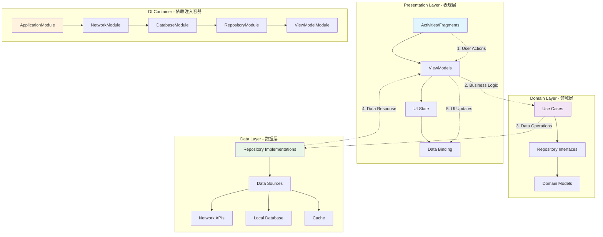

# 第29章：依赖注入和数据流

依赖注入（Dependency Injection，DI）是一种设计模式，用于实现控制反转（Inversion of Control，IoC），通过外部容器来管理组件之间的依赖关系。数据流管理则是现代Android应用开发中的核心技术，确保数据在各层之间正确流动。本章将详细介绍Android中依赖注入框架的使用和数据流管理最佳实践。

## 29.1 依赖注入概述

依赖注入是一种重要的设计模式，它可以降低代码的耦合度，提高代码的可测试性和可维护性。

### 29.1.1 依赖注入原理和优势

```java
public class DependencyInjectionOverview {
    // 传统依赖方式
    public class TraditionalUserManager {
        private final UserRepository userRepository;
        private final NetworkClient networkClient;
        private final DatabaseHelper databaseHelper;

        public TraditionalUserManager() {
            // 硬编码依赖，耦合度高
            this.userRepository = new UserRepository();
            this.networkClient = new NetworkClient();
            this.databaseHelper = new DatabaseHelper();
        }

        public void createUser(User user) {
            // 业务逻辑实现
        }
    }

    // 依赖注入方式
    public class DIModuleUserManager {
        private final UserRepository userRepository;
        private final NetworkClient networkClient;
        private final DatabaseHelper databaseHelper;

        // 通过构造函数注入依赖
        public DIModuleUserManager(
                UserRepository userRepository,
                NetworkClient networkClient,
                DatabaseHelper databaseHelper) {
            this.userRepository = userRepository;
            this.networkClient = networkClient;
            this.databaseHelper = databaseHelper;
        }

        public void createUser(User user) {
            // 业务逻辑实现
        }
    }

    // 依赖注入的优势
    public static final String[] DI_ADVANTAGES = {
        "降低代码耦合度",
        "提高代码可测试性",
        "便于代码维护和重构",
        "支持模块化开发",
        "自动管理依赖生命周期",
        "减少样板代码",
        "支持配置化管理",
        "便于团队协作开发"
    };

    // 依赖注入的类型
    public enum InjectionType {
        CONSTRUCTOR_INJECTION("构造函数注入"),
        FIELD_INJECTION("字段注入"),
        METHOD_INJECTION("方法注入"),
        INTERFACE_INJECTION("接口注入");

        private final String description;

        InjectionType(String description) {
            this.description = description;
        }

        public String getDescription() {
            return description;
        }
    }
}
```

### 29.1.2 手动依赖注入实现

```java
public class ManualDependencyInjection {
    private static final String TAG = "ManualDI";

    /**
     * 依赖容器
     */
    public static class DIContainer {
        private final Map<Class<?>, Object> instances = new HashMap<>();
        private final Map<Class<?>, Provider<?>> providers = new HashMap<>();

        /**
         * 注册单例
         */
        public <T> void registerSingleton(Class<T> type, T instance) {
            instances.put(type, instance);
        }

        /**
         * 注册提供者
         */
        public <T> void registerProvider(Class<T> type, Provider<T> provider) {
            providers.put(type, provider);
        }

        /**
         * 获取实例
         */
        @SuppressWarnings("unchecked")
        public <T> T getInstance(Class<T> type) {
            // 先检查单例
            Object instance = instances.get(type);
            if (instance != null) {
                return (T) instance;
            }

            // 检查提供者
            Provider<?> provider = providers.get(type);
            if (provider != null) {
                return (T) provider.get();
            }

            // 尝试创建实例
            try {
                Constructor<T> constructor = type.getDeclaredConstructor();
                constructor.setAccessible(true);
                T newInstance = constructor.newInstance();
                instances.put(type, newInstance);
                return newInstance;
            } catch (Exception e) {
                Log.e(TAG, "创建实例失败: " + type.getName(), e);
                throw new RuntimeException("无法创建实例: " + type.getName(), e);
            }
        }

        /**
         * 清理资源
         */
        public void cleanup() {
            for (Object instance : instances.values()) {
                if (instance instanceof Closeable) {
                    try {
                        ((Closeable) instance).close();
                    } catch (IOException e) {
                        Log.e(TAG, "关闭资源失败", e);
                    }
                }
            }
            instances.clear();
            providers.clear();
        }
    }

    /**
     * 依赖工厂
     */
    public static class DependencyFactory {
        private static DIContainer container;

        public static void initialize(Context context) {
            container = new DIContainer();

            // 注册核心依赖
            registerCoreDependencies(context);

            // 注册网络依赖
            registerNetworkDependencies();

            // 注册数据库依赖
            registerDatabaseDependencies(context);

            // 注册Repository依赖
            registerRepositoryDependencies();

            // 注册ViewModel依赖
            registerViewModelDependencies();
        }

        private static void registerCoreDependencies(Context context) {
            // 注册Application Context
            container.registerSingleton(Context.class, context.getApplicationContext());

            // 注册SharedPreferences
            container.registerProvider(SharedPreferences.class, () ->
                context.getSharedPreferences("app_prefs", Context.MODE_PRIVATE));

            // 注册ToastManager
            container.registerSingleton(ToastManager.class, new ToastManager(context));
        }

        private static void registerNetworkDependencies() {
            // 注册OkHttpClient
            container.registerProvider(OkHttpClient.class, () ->
                new OkHttpClient.Builder()
                        .connectTimeout(30, TimeUnit.SECONDS)
                        .readTimeout(30, TimeUnit.SECONDS)
                        .build());

            // 注册Retrofit
            container.registerProvider(Retrofit.class, () -> {
                OkHttpClient client = container.getInstance(OkHttpClient.class);
                return new Retrofit.Builder()
                        .baseUrl("https://api.example.com/")
                        .client(client)
                        .addConverterFactory(GsonConverterFactory.create())
                        .build();
            });

            // 注册ApiService
            container.registerProvider(ApiService.class, () -> {
                Retrofit retrofit = container.getInstance(Retrofit.class);
                return retrofit.create(ApiService.class);
            });
        }

        private static void registerDatabaseDependencies(Context context) {
            // 注册AppDatabase
            container.registerProvider(AppDatabase.class, () ->
                Room.databaseBuilder(context.getApplicationContext(),
                        AppDatabase.class, "app_database")
                        .build());

            // 注册DAO
            container.registerProvider(UserDao.class, () -> {
                AppDatabase database = container.getInstance(AppDatabase.class);
                return database.userDao();
            });
        }

        private static void registerRepositoryDependencies() {
            // 注册UserRepository
            container.registerProvider(UserRepository.class, () -> {
                UserDao userDao = container.getInstance(UserDao.class);
                ApiService apiService = container.getInstance(ApiService.class);
                Context context = container.getInstance(Context.class);

                return new UserRepositoryImpl(userDao, apiService, context);
            });
        }

        private static void registerViewModelDependencies() {
            // 注册ViewModelFactory
            container.registerSingleton(ViewModelFactory.class, () -> {
                UserRepository userRepository = container.getInstance(UserRepository.class);
                Context context = container.getInstance(Context.class);
                return new ViewModelFactory(userRepository, context);
            });
        }

        public static <T> T get(Class<T> type) {
            if (container == null) {
                throw new IllegalStateException("DI容器未初始化");
            }
            return container.getInstance(type);
        }

        public static void cleanup() {
            if (container != null) {
                container.cleanup();
                container = null;
            }
        }
    }

    /**
     * 提供者接口
     */
    public interface Provider<T> {
        T get();
    }

    /**
     * 应用初始化类
     */
    public static class DIApplication extends Application {
        @Override
        public void onCreate() {
            super.onCreate();
            DependencyFactory.initialize(this);
        }

        @Override
        public void onTerminate() {
            super.onTerminate();
            DependencyFactory.cleanup();
        }
    }
}
```

## 29.2 Dagger2依赖注入框架

Dagger2是Google开发的依赖注入框架，通过注解处理器在编译时生成依赖注入代码。

### 29.2.1 Dagger2基础配置

```java
// 应用级别的Component
@Singleton
@Component(modules = {
    AppModule.class,
    NetworkModule.class,
    DatabaseModule.class,
    RepositoryModule.class,
    ViewModelModule.class
})
public interface ApplicationComponent {
    void inject(MyApplication application);

    @Component.Builder
    interface Builder {
        @BindsInstance
        Builder application(Application application);

        ApplicationComponent build();
    }
}

// AppModule
@Module
public class AppModule {
    @Provides
    @Singleton
    Context provideContext(Application application) {
        return application;
    }

    @Provides
    @Singleton
    SharedPreferences provideSharedPreferences(Context context) {
        return context.getSharedPreferences("app_prefs", Context.MODE_PRIVATE);
    }

    @Provides
    @Singleton
    ToastManager provideToastManager(Context context) {
        return new ToastManager(context);
    }

    @Provides
    @Singleton
    ResourceManager provideResourceManager(Context context) {
        return new ResourceManager(context);
    }
}

// NetworkModule
@Module
public class NetworkModule {
    @Provides
    @Singleton
    OkHttpClient provideOkHttpClient() {
        return new OkHttpClient.Builder()
                .connectTimeout(30, TimeUnit.SECONDS)
                .readTimeout(30, TimeUnit.SECONDS)
                .writeTimeout(30, TimeUnit.SECONDS)
                .addInterceptor(new HttpLoggingInterceptor()
                        .setLevel(HttpLoggingInterceptor.Level.BODY))
                .addInterceptor(new AuthInterceptor())
                .cache(new Cache(new File("http_cache"), 10 * 1024 * 1024)) // 10MB
                .build();
    }

    @Provides
    @Singleton
    Gson provideGson() {
        return new GsonBuilder()
                .setDateFormat("yyyy-MM-dd HH:mm:ss")
                .setLenient()
                .create();
    }

    @Provides
    @Singleton
    Retrofit provideRetrofit(OkHttpClient okHttpClient, Gson gson) {
        return new Retrofit.Builder()
                .baseUrl("https://api.example.com/")
                .client(okHttpClient)
                .addConverterFactory(GsonConverterFactory.create(gson))
                .addCallAdapterFactory(RxJava2CallAdapterFactory.create())
                .build();
    }

    @Provides
    @Singleton
    ApiService provideApiService(Retrofit retrofit) {
        return retrofit.create(ApiService.class);
    }

    @Provides
    @Singleton
    NetworkManager provideNetworkManager(Context context) {
        return new NetworkManager(context);
    }
}

// DatabaseModule
@Module
public class DatabaseModule {
    @Provides
    @Singleton
    AppDatabase provideAppDatabase(Context context) {
        return Room.databaseBuilder(context.getApplicationContext(),
                AppDatabase.class, "app_database")
                .fallbackToDestructiveMigration()
                .build();
    }

    @Provides
    @Singleton
    UserDao provideUserDao(AppDatabase database) {
        return database.userDao();
    }

    @Provides
    @Singleton
    ProductDao provideProductDao(AppDatabase database) {
        return database.productDao();
    }
}

// RepositoryModule
@Module
public abstract class RepositoryModule {
    @Binds
    abstract UserRepository bindUserRepository(UserRepositoryImpl userRepository);

    @Binds
    abstract ProductRepository bindProductRepository(ProductRepositoryImpl productRepository);

    @Provides
    @Singleton
    UserCache provideUserCache(Context context) {
        return new UserCache(context);
    }

    @Provides
    @Singleton
    ProductCache provideProductCache(Context context) {
        return new ProductCache(context);
    }
}

// ViewModelModule
@Module
public abstract class ViewModelModule {
    @Binds
    abstract ViewModelProvider.Factory bindViewModelFactory(ViewModelFactory factory);

    @Provides
    @IntoMap
    @ViewModelKey(UserListViewModel.class)
    @Singleton
    ViewModel provideUserListViewModel(UserRepository userRepository, NetworkManager networkManager) {
        return new UserListViewModel(userRepository, networkManager);
    }

    @Provides
    @IntoMap
    @ViewModelKey(UserDetailViewModel.class)
    @Singleton
    ViewModel provideUserDetailViewModel(UserRepository userRepository) {
        return new UserDetailViewModel(userRepository);
    }

    @Provides
    @IntoMap
    @ViewModelKey(ProductListViewModel.class)
    @Singleton
    ViewModel provideProductListViewModel(ProductRepository productRepository) {
        return new ProductListViewModel(productRepository);
    }
}

// ViewModelKey注解
@Target(ElementType.METHOD)
@Retention(RetentionPolicy.RUNTIME)
@MapKey
@interface ViewModelKey {
    Class<? extends ViewModel> value();
}
```

### 29.2.2 自定义Scope和限定符

```java
// 自定义Scope注解
@Scope
@Retention(RetentionPolicy.RUNTIME)
public @interface UserScope {
}

@Scope
@Retention(RetentionPolicy.RUNTIME)
public @interface ActivityScope {
}

@Scope
@Retention(RetentionPolicy.RUNTIME)
public @interface FragmentScope {
}

// 限定符注解
@Qualifier
@Retention(RetentionPolicy.BINARY)
public @interface BaseUrl {
    String value();
}

@Qualifier
@Retention(RetentionPolicy.BINARY)
public @interface CacheDirectory {
    String value();
}

@Qualifier
@Retention(RetentionPolicy.BINARY)
public @interface LogLevel {
    String value();
}

@Qualifier
@Retention(RetentionPolicy.BINARY)
public @interface ThreadExecutor {
    String value();
}

// 使用限定符的Module
@Module
public class NetworkModuleWithQualifiers {
    @Provides
    @Singleton
    @BaseUrl("api")
    Retrofit provideApiRetrofit(@BaseUrl("api") String baseUrl, OkHttpClient client) {
        return new Retrofit.Builder()
                .baseUrl(baseUrl)
                .client(client)
                .addConverterFactory(GsonConverterFactory.create())
                .build();
    }

    @Provides
    @Singleton
    @BaseUrl("auth")
    Retrofit provideAuthRetrofit(@BaseUrl("auth") String baseUrl, OkHttpClient client) {
        return new Retrofit.Builder()
                .baseUrl(baseUrl)
                .client(client)
                .addConverterFactory(GsonConverterFactory.create())
                .build();
    }

    @Provides
    @Singleton
    @BaseUrl("api")
    String provideApiBaseUrl() {
        return "https://api.example.com/";
    }

    @Provides
    @Singleton
    @BaseUrl("auth")
    String provideAuthBaseUrl() {
        return "https://auth.example.com/";
    }

    @Provides
    @Singleton
    @ThreadExecutor("io")
    Executor provideIOExecutor() {
        return Executors.newFixedThreadPool(4);
    }

    @Provides
    @Singleton
    @ThreadExecutor("main")
    Executor provideMainExecutor() {
        return new MainThreadExecutor();
    }

    @Provides
    @Singleton
    @CacheDirectory("http")
    File provideHttpCacheDirectory(Context context) {
        return new File(context.getCacheDir(), "http_cache");
    }

    @Provides
    @Singleton
    @CacheDirectory("image")
    File provideImageCacheDirectory(Context context) {
        return new File(context.getCacheDir(), "image_cache");
    }
}

// Activity级别的Component
@ActivityScope
@Component(
    dependencies = ApplicationComponent.class,
    modules = {ActivityModule.class, UserModule.class}
)
public interface UserActivityComponent {
    void inject(UserListActivity activity);

    @Component.Builder
    interface Builder {
        Builder applicationComponent(ApplicationComponent component);
        UserActivityComponent build();
    }
}

// ActivityModule
@Module
public class ActivityModule {
    @Provides
    @ActivityScope
    ActivityNavigator provideActivityNavigator(Activity activity) {
        return new ActivityNavigator(activity);
    }

    @Provides
    @ActivityScope
    ActivityViewModelFactory provideActivityViewModelFactory(Activity activity, ViewModelProvider.Factory factory) {
        return new ActivityViewModelFactory(activity, factory);
    }
}

// UserModule
@Module
public class UserModule {
    @Provides
    @UserScope
    UserManager provideUserManager(Context context, @BaseUserId String userId) {
        return new UserManager(context, userId);
    }

    @Provides
    @UserScope
    UserProfileProvider provideUserProfileProvider(UserRepository repository, @BaseUserId String userId) {
        return new UserProfileProvider(repository, userId);
    }

    @Provides
    @BaseUserId
    String provideBaseUserId() {
        return "default_user_id";
    }
}

// BaseUserId限定符
@Qualifier
@Retention(RetentionPolicy.BINARY)
public @interface BaseUserId {
}
```

## 29.3 Hilt依赖注入框架

Hilt是Google推荐的现代依赖注入框架，基于Dagger2构建，简化了Android应用中的依赖注入。

### 29.3.1 Hilt基础配置

```java
// Application类
@HiltAndroidApp
public class MyApplication extends Application {
    @Override
    public void onCreate() {
        super.onCreate();
        // 应用初始化
    }
}

// Application级别Module
@Module
@InstallIn(SingletonComponent.class)
public class ApplicationModule {

    @Provides
    @Singleton
    Context provideContext(@ApplicationContext Context context) {
        return context;
    }

    @Provides
    @Singleton
    SharedPreferences provideSharedPreferences(@ApplicationContext Context context) {
        return context.getSharedPreferences("app_prefs", Context.MODE_PRIVATE);
    }

    @Provides
    @Singleton
    Gson provideGson() {
        return new GsonBuilder()
                .setDateFormat("yyyy-MM-dd HH:mm:ss")
                .setLenient()
                .create();
    }

    @Provides
    @Singleton
    ResourceManager provideResourceManager(@ApplicationContext Context context) {
        return new ResourceManager(context);
    }

    @Provides
    @Singleton
    ToastManager provideToastManager(@ApplicationContext Context context) {
        return new ToastManager(context);
    }
}

// 网络Module
@Module
@InstallIn(SingletonComponent.class)
public class NetworkModule {

    @Provides
    @Singleton
    @Named("http_cache")
    File provideHttpCacheFile(@ApplicationContext Context context) {
        return new File(context.getCacheDir(), "http_cache");
    }

    @Provides
    @Singleton
    Cache provideHttpCache(@Named("http_cache") File cacheFile) {
        return new Cache(cacheFile, 10 * 1024 * 1024); // 10MB
    }

    @Provides
    @Singleton
    OkHttpClient provideOkHttpClient(Cache cache, AuthInterceptor authInterceptor) {
        return new OkHttpClient.Builder()
                .connectTimeout(30, TimeUnit.SECONDS)
                .readTimeout(30, TimeUnit.SECONDS)
                .writeTimeout(30, TimeUnit.SECONDS)
                .cache(cache)
                .addInterceptor(authInterceptor)
                .addInterceptor(new HttpLoggingInterceptor()
                        .setLevel(HttpLoggingInterceptor.Level.BODY))
                .build();
    }

    @Provides
    @Singleton
    Retrofit provideRetrofit(OkHttpClient okHttpClient, Gson gson) {
        return new Retrofit.Builder()
                .baseUrl("https://api.example.com/")
                .client(okHttpClient)
                .addConverterFactory(GsonConverterFactory.create(gson))
                .addCallAdapterFactory(RxJava3CallAdapterFactory.create())
                .build();
    }

    @Provides
    @Singleton
    ApiService provideApiService(Retrofit retrofit) {
        return retrofit.create(ApiService.class);
    }

    @Provides
    @Singleton
    AuthInterceptor provideAuthInterceptor(TokenManager tokenManager) {
        return new AuthInterceptor(tokenManager);
    }
}

// 数据库Module
@Module
@InstallIn(SingletonComponent.class)
public class DatabaseModule {

    @Provides
    @Singleton
    AppDatabase provideAppDatabase(@ApplicationContext Context context) {
        return Room.databaseBuilder(context.getApplicationContext(),
                AppDatabase.class, "app_database")
                .fallbackToDestructiveMigration()
                .build();
    }

    @Provides
    @Singleton
    UserDao provideUserDao(AppDatabase database) {
        return database.userDao();
    }

    @Provides
    @Singleton
    ProductDao provideProductDao(AppDatabase database) {
        return database.productDao();
    }
}

// Repository Module
@Module
@InstallIn(SingletonComponent.class)
public abstract class RepositoryModule {

    @Binds
    abstract UserRepository bindUserRepository(UserRepositoryImpl userRepository);

    @Binds
    abstract ProductRepository bindProductRepository(ProductRepositoryImpl productRepository);

    @Provides
    @Singleton
    UserCache provideUserCache(@ApplicationContext Context context) {
        return new UserCache(context);
    }

    @Provides
    @Singleton
    ProductCache provideProductCache(@ApplicationContext Context context) {
        return new ProductCache(context);
    }
}

// ViewModel Module
@Module
@InstallIn(ViewModelComponent.class)
public abstract class ViewModelModule {

    @Binds
    abstract ViewModelProvider.Factory bindViewModelFactory(HiltViewModelFactory factory);
}

// 注入的ViewModel示例
@HiltViewModel
public class UserListViewModel extends ViewModel {
    private final UserRepository userRepository;
    private final NetworkManager networkManager;
    private final SavedStateHandle savedStateHandle;

    @Inject
    public UserListViewModel(
            UserRepository userRepository,
            NetworkManager networkManager,
            SavedStateHandle savedStateHandle) {
        this.userRepository = userRepository;
        this.networkManager = networkManager;
        this.savedStateHandle = savedStateHandle;
    }

    // ViewModel实现
}

// 注入的Activity
@AndroidEntryPoint
public class UserListActivity extends AppCompatActivity {

    @Inject
    UserListViewModel userListViewModel;

    @Inject
    ActivityNavigator activityNavigator;

    @Inject
    ToastManager toastManager;

    @Override
    protected void onCreate(Bundle savedInstanceState) {
        super.onCreate(savedInstanceState);
        setContentView(R.layout.activity_user_list);

        // 使用注入的依赖
        setupViewModel();
    }

    private void setupViewModel() {
        // ViewModel已经通过@Inject注入，可以直接使用
    }
}

// 注入的Fragment
@AndroidEntryPoint
public class UserListFragment extends Fragment {

    @Inject
    UserListViewModel userListViewModel;

    @Inject
    FragmentNavigator fragmentNavigator;

    @Override
    public void onCreate(@Nullable Bundle savedInstanceState) {
        super.onCreate(savedInstanceState);
        // 使用注入的依赖
    }
}
```

### 29.3.2 Hilt高级特性

```java
// 自定义限定符
@Qualifier
@Retention(RetentionPolicy.BINARY)
public @interface IOExecutor {
}

@Qualifier
@Retention(RetentionPolicy.BINARY)
public @interface MainExecutor {
}

@Qualifier
@Retention(RetentionPolicy.BINARY)
public @interface BaseUrl {
    String value();
}

@Qualifier
@Retention(RetentionPolicy.BINARY)
public @interface LogLevel {
    String value();
}

// 自定义Scope
@Scope
@Retention(RetentionPolicy.RUNTIME)
public @interface UserScope {
}

@Scope
@Retention(RetentionPolicy.RUNTIME)
public @interface SessionScope {
}

// 配置Module
@Module
@InstallIn(SingletonComponent.class)
public class ExecutorModule {

    @Provides
    @Singleton
    @IOExecutor
    Executor provideIOExecutor() {
        return Executors.newFixedThreadPool(4);
    }

    @Provides
    @Singleton
    @MainExecutor
    Executor provideMainExecutor() {
        return new MainThreadExecutor();
    }
}

// 多环境配置Module
@Module
@InstallIn(SingletonComponent.class)
public class NetworkConfigModule {

    @Provides
    @Singleton
    @BaseUrl("api")
    String provideApiBaseUrl() {
        return BuildConfig.API_BASE_URL;
    }

    @Provides
    @Singleton
    @BaseUrl("cdn")
    String provideCdnBaseUrl() {
        return BuildConfig.CDN_BASE_URL;
    }

    @Provides
    @Singleton
    @LogLevel("network")
    HttpLoggingInterceptor.Level provideNetworkLogLevel() {
        return BuildConfig.DEBUG ?
                HttpLoggingInterceptor.Level.BODY :
                HttpLoggingInterceptor.Level.NONE;
    }
}

// 用户相关Module
@Module
@InstallIn(UserScope.class)
public class UserModule {

    @Provides
    @UserScope
    UserProfileManager provideUserProfileManager(
            UserRepository repository,
            @Named("current_user_id") String userId) {
        return new UserProfileManager(repository, userId);
    }

    @Provides
    @UserScope
    @Named("current_user_id")
    String provideCurrentUserId(@ActivityContext Context context) {
        SharedPreferences prefs = context.getSharedPreferences("user_prefs", Context.MODE_PRIVATE);
        return prefs.getString("current_user_id", "");
    }
}

// 用户作用域Component
@UserScope
@DefineComponent(parent = SingletonComponent.class)
interface UserComponent {
    @DefineComponent.Builder
    interface Builder {
        Builder userId(@BindsInstance String userId);
        UserComponent build();
    }

    UserListActivityComponent activityComponent();
}

// Activity级别Component
@ActivityScope
@DefineComponent(dependencies = UserComponent.class, modules = ActivityModule.class)
interface UserListActivityComponent {
    void inject(UserListActivity activity);
}

// 使用作用域的Activity
public class ScopedUserListActivity extends AppCompatActivity {

    private UserComponent userComponent;
    private UserListActivityComponent activityComponent;

    @Override
    protected void onCreate(@Nullable Bundle savedInstanceState) {
        super.onCreate(savedInstanceState);

        String userId = getUserId();
        userComponent = DaggerUserComponent.builder()
                .userId(userId)
                .build();

        activityComponent = userComponent.activityComponent()
                .activity(this)
                .build();

        activityComponent.inject(this);
    }

    private String getUserId() {
        // 获取用户ID逻辑
        return "user_123";
    }

    @Override
    protected void onDestroy() {
        super.onDestroy();
        activityComponent = null;
        userComponent = null;
    }
}

// 使用AssistedInject的ViewModel
@HiltViewModel
public class AssistedViewModel extends ViewModel {
    private final UserRepository userRepository;
    private final String userId;
    private final String sessionId;

    @Inject
    public AssistedViewModel(
            UserRepository userRepository,
            @Assisted String userId,
            @Assisted String sessionId) {
        this.userRepository = userRepository;
        this.userId = userId;
        this.sessionId = sessionId;
    }

    @AssistedFactory
    public interface Factory {
        AssistedViewModel create(String userId, String sessionId);
    }
}

// ViewModel Assisted Factory Module
@Module
@InstallIn(ViewModelComponent.class)
public interface AssistedInjectModule {
    @Binds
    ViewModelProvider.Factory bindFactory(AssistedViewModel.Factory factory);
}

// 数据绑定适配器注入
@Module
@InstallIn(SingletonComponent.class)
public class BindingAdapterModule {

    @Provides
    @Singleton
    ImageLoader provideImageLoader(@ApplicationContext Context context) {
        return new GlideImageLoader(context);
    }

    @Provides
    @Singleton
    DateFormatter provideDateFormatter(@ApplicationContext Context context) {
        return new DateFormatter(context);
    }
}

// 注入的数据绑定适配器
public class UserBindingAdapters {
    @Inject
    public UserBindingAdapters(ImageLoader imageLoader, DateFormatter dateFormatter) {
        this.imageLoader = imageLoader;
        this.dateFormatter = dateFormatter;
    }

    private final ImageLoader imageLoader;
    private final DateFormatter dateFormatter;

    @BindingAdapter("userAvatar")
    public void loadUserAvatar(ImageView imageView, String avatarUrl) {
        imageLoader.load(avatarUrl)
                .placeholder(R.drawable.ic_person_placeholder)
                .error(R.drawable.ic_person_error)
                .circleCrop()
                .into(imageView);
    }

    @BindingAdapter("formatDate")
    public void formatDate(TextView textView, long timestamp) {
        String formattedDate = dateFormatter.format(timestamp);
        textView.setText(formattedDate);
    }
}

// 测试配置
@TestInstallIn(
    components = SingletonComponent.class,
    replaces = NetworkModule.class
)
@Module
public class TestNetworkModule {

    @Provides
    @Singleton
    ApiService provideFakeApiService() {
        return new FakeApiService();
    }

    @Provides
    @Singleton
    OkHttpClient provideTestOkHttpClient() {
        return new OkHttpClient.Builder()
                .build();
    }
}

// 测试用的Application
@HiltAndroidTest
public class TestApplication extends MyApplication {
    @Override
    public void onCreate() {
        super.onCreate();
        // 测试环境初始化
    }
}
```

## 29.4 Kotlin协程和数据流

Kotlin协程是现代Android开发中的重要技术，提供了简洁高效的异步编程方式。

### 29.4.1 协程基础使用

```java
public class CoroutineBasics {
    private static final String TAG = "CoroutineBasics";

    /**
     * 协程调度器管理
     */
    public static class CoroutineDispatchers {
        private final Dispatcher main;
        private final Dispatcher io;
        private final Dispatcher default;
        private final Dispatcher unconfined;

        public CoroutineDispatchers() {
            this.main = Dispatchers.Main;
            this.io = Dispatchers.IO;
            this.default = Dispatchers.Default;
            this.unconfined = Dispatchers.Unconfined;
        }

        public Dispatcher getMain() { return main; }
        public Dispatcher getIo() { return io; }
        public Dispatcher getDefault() { return default; }
        public Dispatcher getUnconfined() { return unconfined; }
    }

    /**
     * 协程作用域管理器
     */
    public static class CoroutineScopeManager {
        private final CoroutineScope scope;
        private final List<Job> jobs = new ArrayList<>();

        public CoroutineScopeManager(Dispatcher dispatcher) {
            this.scope = CoroutineScope(SupervisorJob() + dispatcher);
        }

        /**
         * 启动协程
         */
        public Job launch(Dispatcher dispatcher, suspend () -> Unit block) {
            Job job = scope.launch(dispatcher) {
                try {
                    block.invoke();
                } catch (Exception e) {
                    Log.e(TAG, "协程执行异常", e);
                    handleException(e);
                }
            };
            jobs.add(job);
            return job;
        }

        /**
         * 异步执行并返回结果
         */
        public <T> Deferred<T> async(Dispatcher dispatcher, suspend () -> T block) {
            return scope.async(dispatcher) {
                try {
                    return block.invoke();
                } catch (Exception e) {
                    Log.e(TAG, "异步执行异常", e);
                    handleException(e);
                    throw e;
                }
            };
        }

        /**
         * 取消所有协程
         */
        public void cancelAll() {
            for (Job job : jobs) {
                if (job.isActive()) {
                    job.cancel();
                }
            }
            jobs.clear();
            scope.cancel();
        }

        /**
         * 处理异常
         */
        private void handleException(Exception e) {
            // 异常处理逻辑
        }

        public boolean isActive() {
            return scope.isActive();
        }
    }

    /**
     * 协程工具类
     */
    public static class CoroutineUtils {

        /**
         * 延迟执行
         */
        public static void delay(long timeMillis, Continuation<Unit> continuation) {
            // 实现延迟逻辑
        }

        /**
         * 超时执行
         */
        public static <T> T withTimeout(long timeoutMillis, suspend () -> T block) {
            // 实现超时逻辑
            return null;
        }

        /**
         * 重试机制
         */
        public static suspend fun <T> retry(
            times: Int,
            delay: Long = 1000,
            block: suspend () -> T
        ): T {
            repeat(times - 1) {
                try {
                    return block()
                } catch (e: Exception) {
                    Log.w(TAG, "重试第${it + 1}次", e)
                    kotlinx.coroutines.delay(delay)
                }
            }
            return block() // 最后一次不捕获异常
        }

        /**
         * 并发执行
         */
        public suspend fun <T> awaitAll(vararg blocks: suspend () -> T): List<T> {
            return blocks.map { async(Dispatchers.IO) { it() } }.awaitAll()
        }

        /**
         * 防抖执行
         */
        public class Debouncer<T> {
            private var job: Job? = null
            private val scope = CoroutineScope(Dispatchers.Main)

            fun debounce(delay: Long, action: (T) -> Unit): (T) -> Unit {
                return { value: T ->
                    job?.cancel()
                    job = scope.launch {
                        delay(delay)
                        action(value)
                    }
                }
            }
        }

        /**
         * 节流执行
         */
        public class Throttler<T> {
            private var lastTime = 0L
            private val lock = Any()

            fun throttle(delay: Long, action: (T) -> Unit): (T) -> Unit {
                return { value: T ->
                    synchronized(lock) {
                        val currentTime = System.currentTimeMillis()
                        if (currentTime - lastTime > delay) {
                            lastTime = currentTime
                            action(value)
                        }
                    }
                }
            }
        }
    }

    /**
     * 协程异常处理
     */
    public static class CoroutineExceptionHandler {
        private static final String TAG = "CoroutineException";

        /**
         * 全局异常处理器
         */
        public static val globalExceptionHandler = CoroutineExceptionHandler { _, throwable ->
            Log.e(TAG, "全局协程异常", throwable)
            // 发送错误报告
            // 记录日志
        }

        /**
         * 创建带有异常处理的协程作用域
         */
        public static CoroutineScope createSafeScope(Dispatcher dispatcher) {
            return CoroutineScope(SupervisorJob() + dispatcher)
        }

        /**
         * 安全启动协程
         */
        public static Job launchSafely(
            CoroutineScope scope,
            Dispatcher dispatcher,
            CoroutineExceptionHandler exceptionHandler,
            suspend () -> Unit block
        ) {
            return scope.launch(dispatcher + exceptionHandler) {
                try {
                    block.invoke()
                } catch (e: Exception) {
                    Log.e(TAG, "协程执行异常", e)
                    throw e
                }
            }
        }

        /**
         * 安全异步执行
         */
        public static <T> Deferred<T> asyncSafely(
            CoroutineScope scope,
            Dispatcher dispatcher,
            CoroutineExceptionHandler exceptionHandler,
            suspend () -> T block
        ) {
            return scope.async(dispatcher + exceptionHandler) {
                try {
                    return block.invoke()
                } catch (e: Exception) {
                    Log.e(TAG, "异步执行异常", e)
                    throw e
                }
            }
        }
    }
}
```

### 29.4.2 Flow数据流实现

```java
public class FlowDataManagement {
    private static final String TAG = "FlowDataManagement";

    /**
     * 数据流管理器
     */
    public static class FlowManager {
        private final CoroutineScope scope;
        private final Map<String, MutableStateFlow<?>> stateFlows = new HashMap<>();
        private final Map<String, MutableSharedFlow<?>> sharedFlows = new HashMap<>();

        public FlowManager(CoroutineScope scope) {
            this.scope = scope;
        }

        /**
         * 创建StateFlow
         */
        public <T> StateFlow<T> createStateFlow(String key, T initialValue) {
            @SuppressWarnings("unchecked")
            MutableStateFlow<T> flow = (MutableStateFlow<T>) stateFlows.get(key);
            if (flow == null) {
                flow = new MutableStateFlow<>(initialValue);
                stateFlows.put(key, flow);
            }
            return flow;
        }

        /**
         * 创建SharedFlow
         */
        public <T> SharedFlow<T> createSharedFlow(
                String key,
                int replayCount,
                BufferOverflow bufferOverflow
        ) {
            @SuppressWarnings("unchecked")
            MutableSharedFlow<T> flow = (MutableSharedFlow<T>) sharedFlows.get(key);
            if (flow == null) {
                flow = new MutableSharedFlow<>(
                        replayCount,
                        onBufferOverflow = bufferOverflow
                );
                sharedFlows.put(key, flow);
            }
            return flow;
        }

        /**
         * 更新StateFlow值
         */
        public <T> void updateStateFlow(String key, T value) {
            @SuppressWarnings("unchecked")
            MutableStateFlow<T> flow = (MutableStateFlow<T>) stateFlows.get(key);
            if (flow != null) {
                flow.setValue(value);
            }
        }

        /**
         * 发送到SharedFlow
         */
        public <T> void emitToSharedFlow(String key, T value) {
            @SuppressWarnings("unchecked")
            MutableSharedFlow<T> flow = (MutableSharedFlow<T>) sharedFlows.get(key);
            if (flow != null) {
                scope.launch {
                    flow.emit(value);
                }
            }
        }

        /**
         * 清理资源
         */
        public void cleanup() {
            stateFlows.clear();
            sharedFlows.clear();
        }
    }

    /**
     * 响应式数据仓库
     */
    public static class ReactiveDataRepository {
        private final UserDao userDao;
        private final ApiService apiService;
        private final CoroutineScope scope;

        public ReactiveDataRepository(UserDao userDao, ApiService apiService, CoroutineScope scope) {
            this.userDao = userDao;
            this.apiService = apiService;
            this.scope = scope;
        }

        /**
         * 获取用户数据流
         */
        public Flow<User> getUserFlow(String userId) {
            return userDao.getUserById(userId)
                    .distinctUntilChanged()
                    .map { user ->
                        // 数据转换
                        enrichUserData(user)
                    }
                    .catch { throwable ->
                        Log.e(TAG, "获取用户数据失败: $userId", throwable)
                        // 返回默认值或重试
                        flowOf(User.getDefaultUser())
                    }
                    .flowOn(Dispatchers.IO);
        }

        /**
         * 获取用户列表数据流
         */
        public Flow<List<User>> getUserListFlow() {
            return userDao.getAllUsers()
                    .distinctUntilChanged()
                    .combine(_networkStatusFlow) { users, isOnline ->
                        if (isOnline) {
                            // 在线时刷新数据
                            refreshUsersFromNetwork()
                        }
                        users
                    }
                    .catch { throwable ->
                        Log.e(TAG, "获取用户列表失败", throwable)
                        emptyList()
                    }
                    .flowOn(Dispatchers.IO);
        }

        /**
         * 搜索用户数据流
         */
        public Flow<List<User>> searchUsersFlow(String query) {
            return channelFlow {
                // 防抖处理
                val debounceFlow = MutableStateFlow(query)
                debounceFlow
                    .debounce(300)
                    .distinctUntilChanged()
                    .collect { searchQuery ->
                        if (searchQuery.isBlank()) {
                            send(userDao.getAllUsers().first())
                        } else {
                            val results = userDao.searchUsers(searchQuery.trim())
                            send(results)
                        }
                    }

                awaitClose { close() }
            }.flowOn(Dispatchers.IO);
        }

        /**
         * 分页数据流
         */
        public Flow<PagingData<User>> getUserPagingFlow() {
            return Pager(
                config = PagingConfig(
                    pageSize = 20,
                    enablePlaceholders = false,
                    initialLoadSize = 40
                ),
                remoteMediator = UserRemoteMediator(userDao, apiService),
                pagingSourceFactory = { userDao.getAllUsersPaged() }
            ).flow
                .cachedIn(scope)
                .flowOn(Dispatchers.IO);
        }

        /**
         * 网络状态数据流
         */
        private final StateFlow<Boolean> _networkStatusFlow = MutableStateFlow(false);
        public StateFlow<Boolean> getNetworkStatusFlow() {
            return _networkStatusFlow;
        }

        /**
         * 更新网络状态
         */
        public void updateNetworkStatus(boolean isOnline) {
            _networkStatusFlow.setValue(isOnline);
        }

        /**
         * 刷新网络数据
         */
        private suspend void refreshUsersFromNetwork() {
            try {
                val response = apiService.getAllUsers()
                if (response.isSuccessful && response.body() != null) {
                    userDao.insertAllUsers(response.body()!!)
                }
            } catch (e: Exception) {
                Log.e(TAG, "刷新网络数据失败", e)
            }
        }

        /**
         * 丰富用户数据
         */
        private User enrichUserData(User user) {
            // 添加额外的数据或计算属性
            return user
        }
    }

    /**
     * 数据流转换器
     */
    public static class FlowTransformers {

        /**
         * 防抖转换
         */
        public static <T> Flow<T> debounce(Flow<T> upstream, long timeoutMillis) {
            return upstream
                    .conflate()
                    .transformLatest { value ->
                        delay(timeoutMillis)
                        emit(value)
                    }
        }

        /**
         * 节流转换
         */
        public static <T> Flow<T> throttle(Flow<T> upstream, long intervalMillis) {
            return upstream
                    .transformLatest { value ->
                        emit(value)
                        delay(intervalMillis)
                    }
        }

        /**
         * 缓存转换
         */
        public static <T> Flow<T> cache(Flow<T> upstream, long cacheTimeoutMillis) {
            return upstream
                    .cachedIn(CoroutineScope(SupervisorJob() + Dispatchers.IO))
        }

        /**
         * 重试转换
         */
        public static <T> Flow<T> retry(Flow<T> upstream, int maxRetries) {
            return upstream
                    .retryWhen { cause, attempt ->
                        if (attempt < maxRetries && cause is IOException) {
                            delay(1000L * (attempt + 1)) // 指数退避
                            true
                        } else {
                            false
                        }
                    }
        }

        /**
         * 错误恢复转换
         */
        public static <T> Flow<T> withFallback(
                Flow<T> upstream,
                suspend (Throwable) -> T fallback
        ) {
            return upstream
                    .catch { throwable ->
                        val fallbackValue = fallback(throwable)
                        if (fallbackValue != null) {
                            emit(fallbackValue)
                        }
                    }
        }

        /**
         * 组合多个Flow
         */
        public static <T1, T2, R> Flow<R> combine(
                Flow<T1> flow1,
                Flow<T2> flow2,
                suspend (T1, T2) -> R transform
        ) {
            return flow1.combine(flow2) { value1, value2 ->
                transform(value1, value2)
            }
        }

        /**
         * 合并多个Flow
         */
        @SafeVarargs
        public static <T> Flow<T> merge(Flow<T>... flows) {
            return flowOf(*flows).flattenMerge()
        }

        /**
         * 条件执行
         */
        public static <T> Flow<T> takeWhile(Flow<T> upstream, suspend (T) -> Boolean predicate) {
            return upstream.takeWhile(predicate)
        }

        /**
         * 映射并过滤
         */
        public static <T, R> Flow<R> mapFilter(
                Flow<T> upstream,
                suspend (T) -> R? transform
        ) {
            return upstream.mapNotNull(transform)
        }
    }

    /**
     * 事件总线实现
     */
    public static class EventBus {
        private final Map<Class<*>, MutableSharedFlow<*>> events = new ConcurrentHashMap<>();
        private final CoroutineScope scope;

        public EventBus(CoroutineScope scope) {
            this.scope = scope;
        }

        /**
         * 发布事件
         */
        public <T> void publish(T event) {
            Class<?> eventType = event.getClass();
            MutableSharedFlow<T> eventFlow = getOrCreateEventFlow(eventType);
            scope.launch {
                eventFlow.emit(event);
            }
        }

        /**
         * 订阅事件
         */
        public <T> Flow<T> subscribe(Class<T> eventType) {
            return getOrCreateEventFlow(eventType).asSharedFlow();
        }

        /**
         * 订阅粘性事件
         */
        public <T> Flow<T> subscribeSticky(Class<T> eventType) {
            return getOrCreateEventFlow(eventType).asSharedFlow();
        }

        /**
         * 获取或创建事件流
         */
        @SuppressWarnings("unchecked")
        private <T> MutableSharedFlow<T> getOrCreateEventFlow(Class<T> eventType) {
            MutableSharedFlow<?> flow = events.get(eventType);
            if (flow == null) {
                flow = new MutableSharedFlow<>(
                        replay = 1,
                        onBufferOverflow = BufferOverflow.DROP_OLDEST
                );
                events.put(eventType, flow);
            }
            return (MutableSharedFlow<T>) flow;
        }

        /**
         * 清理事件
         */
        public void clear() {
            events.clear();
        }

        /**
         * 清除特定类型事件
         */
        public <T> void clear(Class<T> eventType) {
            events.remove(eventType);
        }
    }
}
```

## 29.5 响应式编程模式

响应式编程是一种基于数据流和变化传播的编程范式，非常适合现代Android应用开发。

### 29.5.1 响应式状态管理

```java
public class ReactiveStateManager {
    private static final String TAG = "ReactiveStateManager";

    /**
     * 状态容器
     */
    public static class StateContainer<T> {
        private final MutableStateFlow<T> _state;
        private final StateFlow<T> state;

        public StateContainer(T initialValue) {
            this._state = new MutableStateFlow<>(initialValue);
            this.state = _state.asStateFlow();
        }

        /**
         * 获取状态流
         */
        public StateFlow<T> getState() {
            return state;
        }

        /**
         * 获取当前状态
         */
        public T getCurrentState() {
            return _state.getValue();
        }

        /**
         * 更新状态
         */
        public void updateState(T newState) {
            _state.setValue(newState);
        }

        /**
         * 异步更新状态
         */
        public suspend fun updateStateAsync(update: (T) -> T) {
            val currentState = _state.value
            val newState = update(currentState)
            _state.emit(newState)
        }

        /**
         * 条件更新状态
         */
        public void updateStateIf(predicate: (T) -> Boolean, update: (T) -> T) {
            val currentState = _state.value
            if (predicate(currentState)) {
                _state.value = update(currentState)
            }
        }

        /**
         * 映射状态
         */
        public <R> StateFlow<R> map(transform: (T) -> R) {
            return state.map(transform)
        }

        /**
         * 过滤状态
         */
        public StateFlow<T> filter(predicate: (T) -> Boolean) {
            return state.filter(predicate)
        }

        /**
         * 组合状态
         */
        public <U, R> StateFlow<R> combine(
                StateFlow<U> otherState,
                transform: (T, U) -> R
        ) {
            return state.combine(otherState) { t, u -> transform(t, u) }
        }
    }

    /**
     * UI状态管理器
     */
    public static class UIStateManager {
        private final StateContainer<UIState> stateContainer;
        private final CoroutineScope scope;

        public UIStateManager(CoroutineScope scope) {
            this.scope = scope;
            this.stateContainer = new StateContainer<>(UIState.Idle);
        }

        /**
         * 获取UI状态流
         */
        public StateFlow<UIState> getUIState() {
            return stateContainer.getState();
        }

        /**
         * 设置加载状态
         */
        public void setLoading(String message) {
            stateContainer.updateState(new UIState.Loading(message));
        }

        /**
         * 设置成功状态
         */
        public void setSuccess(Object data) {
            stateContainer.updateState(new UIState.Success(data));
        }

        /**
         * 设置错误状态
         */
        public void setError(String error, boolean canRetry) {
            stateContainer.updateState(new UIState.Error(error, canRetry));
        }

        /**
         * 设置空闲状态
         */
        public void setIdle() {
            stateContainer.updateState(UIState.Idle);
        }

        /**
         * 执行异步操作
         */
        public suspend fun <T> executeOperation(
            loadingMessage: String,
            operation: suspend () -> T
        ): T? {
            return try {
                setLoading(loadingMessage)
                val result = operation()
                setSuccess(result)
                result
            } catch (e: Exception) {
                setError(e.message ?: "操作失败", true)
                null
            }
        }

        /**
         * 重试操作
         */
        public suspend fun <T> retryOperation(
            maxRetries: Int,
            loadingMessage: String,
            operation: suspend () -> T
        ): T? {
            repeat(maxRetries) { attempt ->
                try {
                    setLoading(loadingMessage)
                    val result = operation()
                    setSuccess(result)
                    return result
                } catch (e: Exception) {
                    if (attempt == maxRetries - 1) {
                        setError("重试失败: ${e.message}", true)
                        return null
                    } else {
                        // 等待后重试
                        delay(1000L * (attempt + 1))
                    }
                }
            }
            return null
        }

        /**
         * UI状态基类
         */
        public static abstract class UIState {
            public static final UIState Idle = new UIState() {};
            public static class Loading extends UIState {
                private final String message;
                public Loading(String message) { this.message = message; }
                public String getMessage() { return message; }
            }
            public static class Success extends UIState {
                private final Object data;
                public Success(Object data) { this.data = data; }
                public Object getData() { return data; }
            }
            public static class Error extends UIState {
                private final String error;
                private final boolean canRetry;
                public Error(String error, boolean canRetry) {
                    this.error = error; this.canRetry = canRetry;
                }
                public String getError() { return error; }
                public boolean canRetry() { return canRetry; }
            }
        }
    }

    /**
     * 响应式数据管理器
     */
    public static class ReactiveDataManager {
        private final Map<String, StateContainer<?>> stateContainers = new HashMap<>();
        private final EventBus eventBus;
        private final CoroutineScope scope;

        public ReactiveDataManager(CoroutineScope scope) {
            this.scope = scope;
            this.eventBus = new EventBus(scope);
        }

        /**
         * 获取或创建状态容器
         */
        @SuppressWarnings("unchecked")
        public <T> StateContainer<T> getStateContainer(String key, T initialValue) {
            StateContainer<T> container = (StateContainer<T>) stateContainers.get(key);
            if (container == null) {
                container = new StateContainer<>(initialValue);
                stateContainers.put(key, container);
            }
            return container;
        }

        /**
         * 发布事件
         */
        public <T> void publishEvent(T event) {
            eventBus.publish(event);
        }

        /**
         * 订阅事件
         */
        public <T> Flow<T> subscribeEvent(Class<T> eventType) {
            return eventBus.subscribe(eventType);
        }

        /**
         * 创建响应式数据流
         */
        public <T> Flow<T> createReactiveFlow(
                String key,
                T initialValue,
                Flow<T> dataSource
        ) {
            StateContainer<T> container = getStateContainer(key, initialValue);

            return scope.launch {
                dataSource
                    .catch { throwable ->
                        Log.e(TAG, "数据流异常: $key", throwable)
                        // 发布错误事件
                        publishEvent(new DataErrorEvent(key, throwable))
                    }
                    .collect { data ->
                        container.updateState(data)
                        // 发布数据更新事件
                        publishEvent(new DataUpdateEvent(key, data))
                    }
            }

            return container.getState();
        }

        /**
         * 清理资源
         */
        public void cleanup() {
            stateContainers.clear();
            eventBus.clear();
        }

        /**
         * 数据更新事件
         */
        public static class DataUpdateEvent {
            private final String key;
            private final Object data;

            public DataUpdateEvent(String key, Object data) {
                this.key = key;
                this.data = data;
            }

            public String getKey() { return key; }
            public Object getData() { return data; }
        }

        /**
         * 数据错误事件
         */
        public static class DataErrorEvent {
            private final String key;
            private final Throwable error;

            public DataErrorEvent(String key, Throwable error) {
                this.key = key;
                this.error = error;
            }

            public String getKey() { return key; }
            public Throwable getError() { return error; }
        }
    }

    /**
     * 响应式缓存管理器
     */
    public static class ReactiveCacheManager {
        private final Map<String, CacheEntry> cache = new ConcurrentHashMap<>();
        private final CoroutineScope scope;
        private final long defaultTtlMillis;

        public ReactiveCacheManager(CoroutineScope scope, long defaultTtlMillis) {
            this.scope = scope;
            this.defaultTtlMillis = defaultTtlMillis;

            // 启动清理任务
            scope.launch {
                while (isActive()) {
                    delay(60000) // 每分钟清理一次
                    cleanupExpiredEntries()
                }
            }
        }

        /**
         * 缓存条目
         */
        private static class CacheEntry {
            private final Object value;
            private final long timestamp;
            private final long ttlMillis;

            public CacheEntry(Object value, long ttlMillis) {
                this.value = value;
                this.timestamp = System.currentTimeMillis();
                this.ttlMillis = ttlMillis;
            }

            public Object getValue() { return value; }
            public boolean isExpired() {
                return System.currentTimeMillis() - timestamp > ttlMillis;
            }
        }

        /**
         * 缓存数据
         */
        public <T> void cache(String key, T value, long ttlMillis) {
            cache.put(key, new CacheEntry(value, ttlMillis));
        }

        /**
         * 缓存数据（使用默认TTL）
         */
        public <T> void cache(String key, T value) {
            cache(key, value, defaultTtlMillis);
        }

        /**
         * 获取缓存数据
         */
        @SuppressWarnings("unchecked")
        public <T> T get(String key) {
            CacheEntry entry = cache.get(key);
            if (entry != null && !entry.isExpired()) {
                return (T) entry.getValue();
            }
            cache.remove(key);
            return null;
        }

        /**
         * 获取或创建缓存数据
         */
        public <T> T getOrCreate(String key, suspend () -> T factory) {
            T cachedValue = get(key);
            if (cachedValue != null) {
                return cachedValue;
            }

            scope.launch {
                val newValue = factory()
                cache(key, newValue)
            }

            return null; // 或者返回默认值
        }

        /**
         * 获取缓存数据流
         */
        public <T> Flow<T> getFlow(String key) {
            return flow {
                while (currentCoroutineContext().isActive()) {
                    T value = get(key);
                    if (value != null) {
                        emit(value)
                    }
                    delay(1000) // 每秒检查一次
                }
            }
        }

        /**
         * 清理过期条目
         */
        private void cleanupExpiredEntries() {
            cache.entrySet().removeIf { entry ->
                entry.getValue().isExpired()
            }
        }

        /**
         * 清除特定缓存
         */
        public void evict(String key) {
            cache.remove(key);
        }

        /**
         * 清除所有缓存
         */
        public void clear() {
            cache.clear();
        }
    }
}
```

## 29.6 综合应用：现代架构设计

结合依赖注入、协程和响应式编程，构建一个完整的现代Android应用架构。

### 29.6.1 应用架构设计



### 29.6.2 完整实现示例

```java
// 应用入口
@HiltAndroidApp
public class ModernApplication extends Application {
    @Inject
    EventTracker eventTracker;

    @Inject
    CrashReporter crashReporter;

    @Override
    public void onCreate() {
        super.onCreate();

        // 初始化分析工具
        eventTracker.initialize();
        crashReporter.initialize();
    }
}

// 应用级别Module
@Module
@InstallIn(SingletonComponent.class)
public class ApplicationModule {

    @Provides
    @Singleton
    CoroutineScope provideApplicationScope() {
        return CoroutineScope(SupervisorJob() + Dispatchers.Main.immediate);
    }

    @Provides
    @Singleton
    CoroutineDispatchers provideCoroutineDispatchers() {
        return new CoroutineDispatchers();
    }

    @Provides
    @Singleton
    EventBus provideEventBus(@ApplicationContext Context context) {
        return new EventBus(context);
    }

    @Provides
    @Singleton
    ReactiveDataManager provideReactiveDataManager(
            CoroutineScope scope,
            EventBus eventBus) {
        return new ReactiveDataManager(scope, eventBus);
    }

    @Provides
    @Singleton
    ReactiveCacheManager provideReactiveCacheManager(CoroutineScope scope) {
        return new ReactiveCacheManager(scope, 300000); // 5分钟TTL
    }
}

// 用户管理Module
@Module
@InstallIn(SingletonComponent.class)
public class UserManagementModule {

    @Provides
    @Singleton
    UserCache provideUserCache(@ApplicationContext Context context) {
        return new UserCache(context);
    }

    @Provides
    @Singleton
    UserProfileManager provideUserProfileManager(
            UserRepository userRepository,
            UserCache userCache,
            ReactiveDataManager reactiveDataManager) {
        return new UserProfileManager(userRepository, userCache, reactiveDataManager);
    }

    @Provides
    @Singleton
    UserStateManager provideUserStateManager(
            CoroutineScope scope,
            ReactiveDataManager reactiveDataManager) {
        return new UserStateManager(scope, reactiveDataManager);
    }
}

// 用户状态管理器
public class UserStateManager {
    private static final String TAG = "UserStateManager";

    private final StateContainer<UserState> stateContainer;
    private final ReactiveDataManager reactiveDataManager;
    private final CoroutineScope scope;

    public UserStateManager(CoroutineScope scope, ReactiveDataManager reactiveDataManager) {
        this.scope = scope;
        this.reactiveDataManager = reactiveDataManager;
        this.stateContainer = new StateContainer<>(UserState.LoggedOut);
    }

    /**
     * 获取用户状态流
     */
    public StateFlow<UserState> getUserState() {
        return stateContainer.getState();
    }

    /**
     * 登录
     */
    public suspend fun login(email: String, password: String): Result<User> {
        return try {
            stateContainer.updateState(UserState.Loading("正在登录..."))

            // 模拟登录过程
            delay(2000)

            val user = authenticateUser(email, password)
            if (user != null) {
                stateContainer.updateState(UserState.LoggedIn(user))

                // 发布登录事件
                reactiveDataManager.publishEvent(new UserLoggedInEvent(user))

                Result.success(user)
            } else {
                stateContainer.updateState(UserState.Error("登录失败", true))
                Result.failure(Exception("用户名或密码错误"))
            }

        } catch (e: Exception) {
            stateContainer.updateState(UserState.Error("登录异常: ${e.message}", true))
            Result.failure(e)
        }
    }

    /**
     * 登出
     */
    public suspend fun logout() {
        try {
            stateContainer.updateState(UserState.Loading("正在登出..."))

            // 清理用户数据
            clearUserData()

            stateContainer.updateState(UserState.LoggedOut)

            // 发布登出事件
            reactiveDataManager.publishEvent(new UserLoggedOutEvent())

        } catch (e: Exception) {
            Log.e(TAG, "登出失败", e)
            stateContainer.updateState(UserState.Error("登出失败", false))
        }
    }

    /**
     * 更新用户信息
     */
    public suspend fun updateUserProfile(updates: suspend (User) -> User): Result<User> {
        return try {
            val currentState = stateContainer.getCurrentState()
            if (currentState is UserState.LoggedIn) {
                val updatedUser = updates(currentState.user)
                stateContainer.updateState(UserState.LoggedIn(updatedUser))

                // 发布用户更新事件
                reactiveDataManager.publishEvent(new UserProfileUpdatedEvent(updatedUser))

                Result.success(updatedUser)
            } else {
                Result.failure(Exception("用户未登录"))
            }

        } catch (e: Exception) {
            Log.e(TAG, "更新用户信息失败", e)
            Result.failure(e)
        }
    }

    /**
     * 监听用户状态变化
     */
    public fun observeUserState(): Flow<UserState> {
        return stateContainer.getState()
    }

    /**
     * 获取当前用户
     */
    public User getCurrentUser() {
        val currentState = stateContainer.getCurrentState()
        return if (currentState is UserState.LoggedIn) {
            currentState.user
        } else {
            null
        }
    }

    private suspend User authenticateUser(String email, String password): User? {
        // 实际的认证逻辑
        return if (email == "admin@example.com" && password == "password") {
            new User("1", "管理员", "用户", email)
        } else {
            null
        }
    }

    private suspend fun clearUserData() {
        // 清理用户相关数据
        delay(500)
    }

    /**
     * 用户状态密封类
     */
    public static abstract class UserState {
        public static final UserState LoggedOut = new UserState() {};
        public static class Loading extends UserState {
            private final String message;
            public Loading(String message) { this.message = message; }
            public String getMessage() { return message; }
        }
        public static class LoggedIn extends UserState {
            private final User user;
            public LoggedIn(User user) { this.user = user; }
            public User getUser() { return user; }
        }
        public static class Error extends UserState {
            private final String message;
            private final boolean canRetry;
            public Error(String message, boolean canRetry) {
                this.message = message; this.canRetry = canRetry;
            }
            public String getMessage() { return message; }
            public boolean canRetry() { return canRetry; }
        }
    }
}

// 注入的ViewModel
@HiltViewModel
public class ModernUserViewModel extends ViewModel {
    private final UserRepository userRepository;
    private final UserStateManager userStateManager;
    private final ReactiveDataManager reactiveDataManager;
    private final UIStateManager uiStateManager;

    private final StateFlow<List<User>> userList;
    private final StateFlow<UserSearchState> searchState;

    @Inject
    public ModernUserViewModel(
            UserRepository userRepository,
            UserStateManager userStateManager,
            ReactiveDataManager reactiveDataManager,
            UIStateManager uiStateManager) {
        this.userRepository = userRepository;
        this.userStateManager = userStateManager;
        this.reactiveDataManager = reactiveDataManager;
        this.uiStateManager = uiStateManager;

        // 初始化数据流
        this.userList = initializeUserList();
        this.searchState = initializeSearchState();

        // 订阅事件
        subscribeToEvents();
    }

    private StateFlow<List<User>> initializeUserList() {
        return reactiveDataManager.createReactiveFlow(
            "user_list",
            new ArrayList<>(),
            userRepository.getAllUsers()
                .map { users -> users.sortedBy { it.getFirstName() } }
                .flowOn(Dispatchers.IO)
        );
    }

    private StateFlow<UserSearchState> initializeSearchState() {
        val mutableState = MutableStateFlow(UserSearchState.Idle)

        viewModelScope.launch {
            reactiveDataManager.subscribeEvent(UserSearchEvent.class)
                .collect { event ->
                    when (event.getType()) {
                        SEARCH_START -> {
                            mutableState.value = UserSearchState.Searching(event.getQuery())
                        }
                        SEARCH_SUCCESS -> {
                            mutableState.value = UserSearchState.Success(event.getResults())
                        }
                        SEARCH_ERROR -> {
                            mutableState.value = UserSearchState.Error(event.getError())
                        }
                    }
                }
        }

        return mutableState.asStateFlow()
    }

    private void subscribeToEvents() {
        viewModelScope.launch {
            reactiveDataManager.subscribeEvent(UserLoggedInEvent.class)
                .collect { event ->
                    // 处理用户登录事件
                    refreshUserList()
                }
        }

        viewModelScope.launch {
            reactiveDataManager.subscribeEvent(UserLoggedOutEvent.class)
                .collect { event ->
                    // 处理用户登出事件
                    clearUserData()
                }
        }
    }

    public StateFlow<List<User>> getUserList() {
        return userList;
    }

    public StateFlow<UserSearchState> getSearchState() {
        return searchState;
    }

    public StateFlow<UserState> getUserState() {
        return userStateManager.observeUserState();
    }

    public void refreshUserList() {
        viewModelScope.launch {
            uiStateManager.executeOperation("刷新用户列表") {
                userRepository.syncUsersFromNetwork()
                userList.first()
            }
        }
    }

    public void searchUsers(String query) {
        viewModelScope.launch {
            if (query.isBlank()) {
                reactiveDataManager.publishEvent(
                    new UserSearchEvent(UserSearchEvent.Type.SEARCH_SUCCESS, "", userList.first())
                )
                return
            }

            reactiveDataManager.publishEvent(
                new UserSearchEvent(UserSearchEvent.Type.SEARCH_START, query, null)
            )

            try {
                val results = userRepository.searchUsers(query.trim())
                reactiveDataManager.publishEvent(
                    new UserSearchEvent(UserSearchEvent.Type.SEARCH_SUCCESS, query, results)
                )
            } catch (e: Exception) {
                reactiveDataManager.publishEvent(
                    new UserSearchEvent(UserSearchEvent.Type.SEARCH_ERROR, query, e)
                )
            }
        }
    }

    private suspend fun clearUserData() {
        // 清理数据
    }

    @Override
    protected void onCleared() {
        super.onCleared();
        // 清理资源
    }

    /**
     * 用户搜索状态
     */
    public static abstract class UserSearchState {
        public static final UserSearchState Idle = new UserSearchState() {};
        public static class Searching extends UserSearchState {
            private final String query;
            public Searching(String query) { this.query = query; }
            public String getQuery() { return query; }
        }
        public static class Success extends UserSearchState {
            private final List<User> results;
            public Success(List<User> results) { this.results = results; }
            public List<User> getResults() { return results; }
        }
        public static class Error extends UserSearchState {
            private final String error;
            public Error(String error) { this.error = error; }
            public String getError() { return error; }
        }
    }
}
```

## 29.7 测试策略

### 29.7.1 依赖注入测试

```java
@RunWith(AndroidJUnit4.class)
public class DependencyInjectionTest {

    @Rule
    public HiltAndroidRule hiltRule = new HiltAndroidRule(this);

    @Inject
    UserRepository userRepository;

    @Inject
    NetworkManager networkManager;

    @Before
    public void setUp() {
        hiltRule.inject();
    }

    @Test
    public void testUserRepositoryInjection() {
        assertNotNull(userRepository);
        assertTrue(userRepository instanceof UserRepositoryImpl);
    }

    @Test
    public void testNetworkManagerInjection() {
        assertNotNull(networkManager);
    }
}

// 测试Module
@TestInstallIn(
    components = SingletonComponent.class,
    replaces = NetworkModule.class
)
@Module
public class TestNetworkModule {

    @Provides
    @Singleton
    ApiService provideFakeApiService() {
        return mock(ApiService.class);
    }

    @Provides
    @Singleton
    NetworkManager provideFakeNetworkManager() {
        NetworkManager networkManager = mock(NetworkManager.class);
        when(networkManager.isOnline()).thenReturn(true);
        return networkManager;
    }
}

// ViewModel测试
@HiltAndroidTest
public class ModernUserViewModelTest {

    @Rule
    public HiltAndroidRule hiltRule = new HiltAndroidRule(this);

    @Rule
    public InstantTaskExecutorRule instantTaskExecutorRule = new InstantTaskExecutorRule();

    @Inject
    UserRepository userRepository;

    @Inject
    UserStateManager userStateManager;

    @Inject
    ReactiveDataManager reactiveDataManager;

    @Inject
    UIStateManager uiStateManager;

    private ModernUserViewModel viewModel;

    @Before
    public void setUp() {
        hiltRule.inject();

        viewModel = new ModernUserViewModel(
            userRepository,
            userStateManager,
            reactiveDataManager,
            uiStateManager
        );
    }

    @Test
    public void testRefreshUserList() throws Exception {
        // Given
        List<User> mockUsers = Arrays.asList(
            new User("1", "张", "三", "zhangsan@example.com"),
            new User("2", "李", "四", "lisi@example.com")
        );

        when(userRepository.getAllUsers())
            .thenReturn(flowOf(mockUsers));
        when(userRepository.syncUsersFromNetwork())
            .thenReturn(Result.success(mockUsers));

        // When
        viewModel.refreshUserList();

        // Then
        verify(userRepository).syncUsersFromNetwork();

        // 验证状态更新
        StateFlow<List<User>> userList = viewModel.getUserList();
        List<User> result = userList.getValue();
        assertNotNull(result);
        assertEquals(2, result.size());
    }

    @Test
    public void testSearchUsers() throws Exception {
        // Given
        String query = "张";
        List<User> searchResults = Arrays.asList(
            new User("1", "张", "三", "zhangsan@example.com")
        );

        when(userRepository.searchUsers(query))
            .thenReturn(searchResults);

        // When
        viewModel.searchUsers(query);

        // Then
        verify(userRepository).searchUsers(query);

        // 验证搜索状态
        StateFlow<ModernUserViewModel.UserSearchState> searchState = viewModel.getSearchState();
        assertTrue(searchState.getValue() instanceof ModernUserViewModel.UserSearchState.Success);
    }
}
```

## 29.8 总结

本章详细介绍了依赖注入和数据流管理的核心技术，包括：

### 29.8.1 主要内容回顾

1. **依赖注入概述**
   - 依赖注入的原理和优势
   - 手动依赖注入实现
   - 依赖注入类型和最佳实践

2. **Dagger2框架**
   - Dagger2基础配置和使用
   - 自定义Scope和限定符
   - 组件化依赖注入设计

3. **Hilt框架**
   - Hilt基础配置和高级特性
   - Android组件注入
   - 测试环境配置

4. **Kotlin协程**
   - 协程基础使用和调度器管理
   - 异常处理和资源管理
   - 协程工具类和最佳实践

5. **Flow数据流**
   - Flow数据流实现和管理
   - 响应式数据仓库设计
   - 数据流转换和组合

6. **响应式编程**
   - 响应式状态管理
   - UI状态管理器实现
   - 事件总线设计

7. **综合应用**
   - 现代架构设计
   - 完整实现示例
   - 最佳实践总结

8. **测试策略**
   - 依赖注入测试
   - 协程测试
   - 数据流测试

### 29.8.2 最佳实践总结

1. **依赖注入**
   - 优先使用构造函数注入
   - 合理使用Scope管理生命周期
   - 避免过度注入和循环依赖

2. **协程使用**
   - 正确选择调度器
   - 合理管理协程作用域
   - 完善异常处理机制

3. **数据流管理**
   - 使用StateFlow管理状态
   - 使用SharedFlow处理事件
   - 实现数据缓存和同步机制

4. **架构设计**
   - 遵循单一职责原则
   - 保持层次清晰
   - 支持测试和维护

### 29.8.3 下一步学习

掌握了依赖注入和数据流管理后，读者可以继续学习：
- 协程和Flow高级用法
- Compose现代UI开发
- 模块化和组件化架构
- CI/CD和自动化测试
- 性能优化和监控

通过本章的学习，读者应该能够熟练使用现代Android开发技术，构建高质量、可维护的应用程序。下一章将详细介绍协程和异步编程的高级用法。