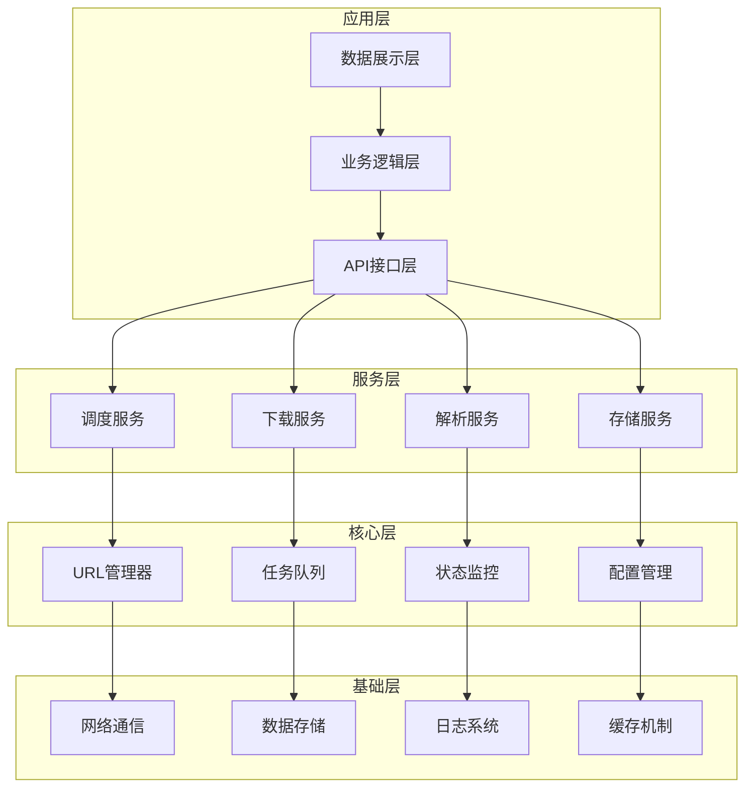
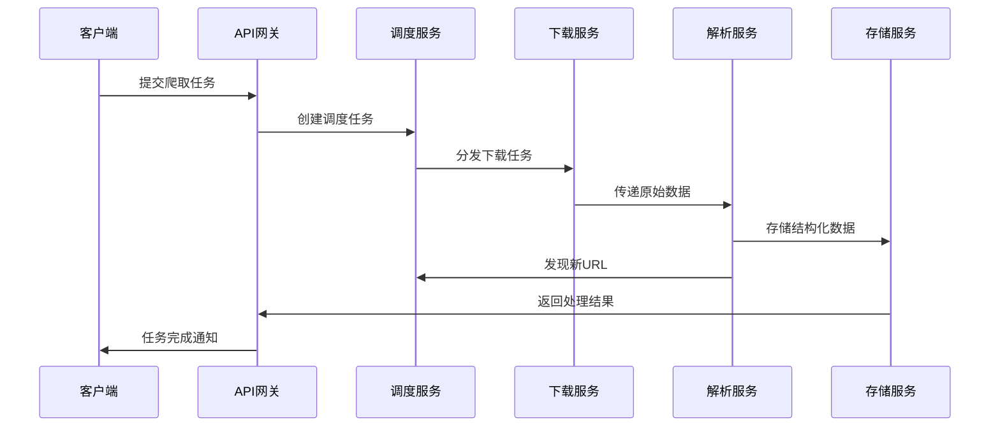
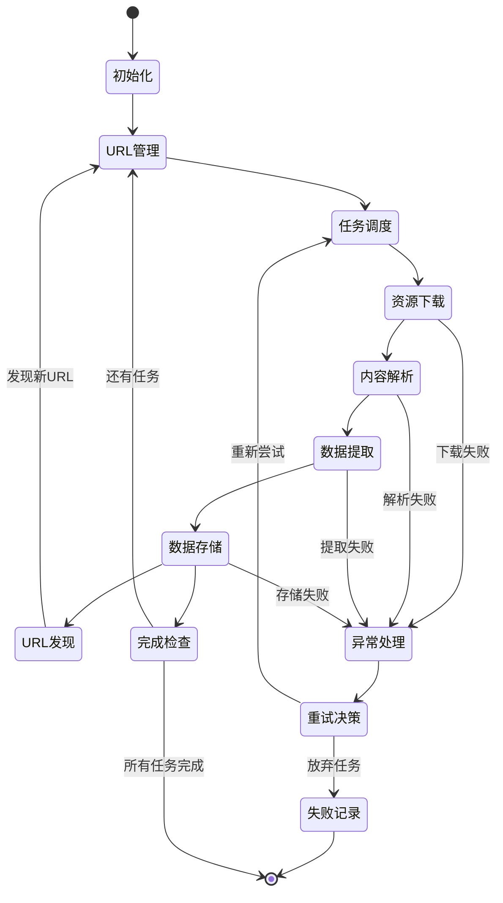
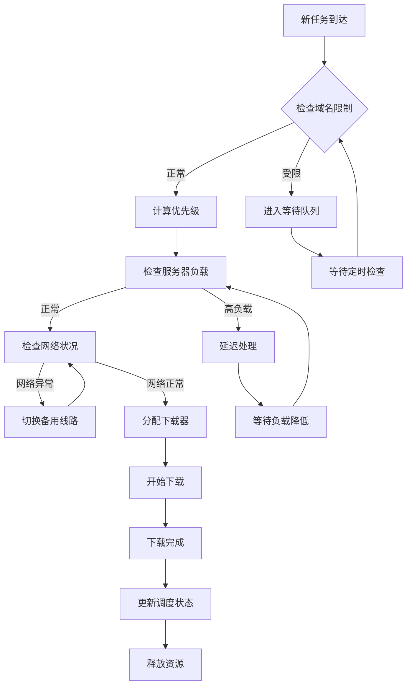
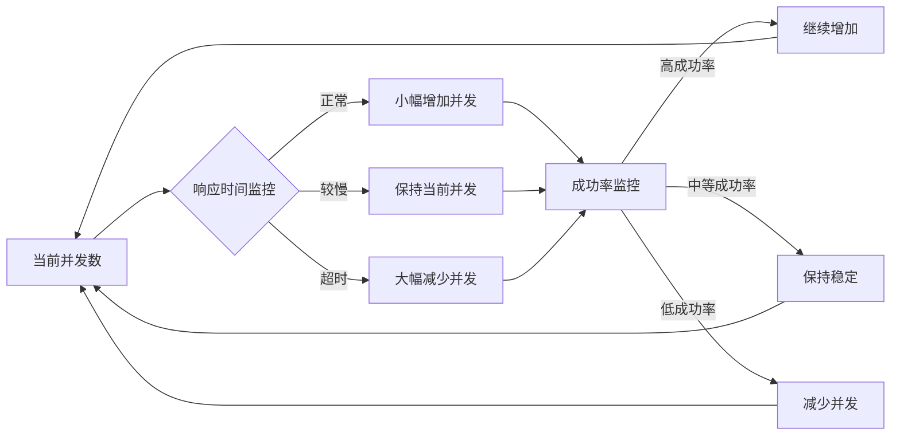
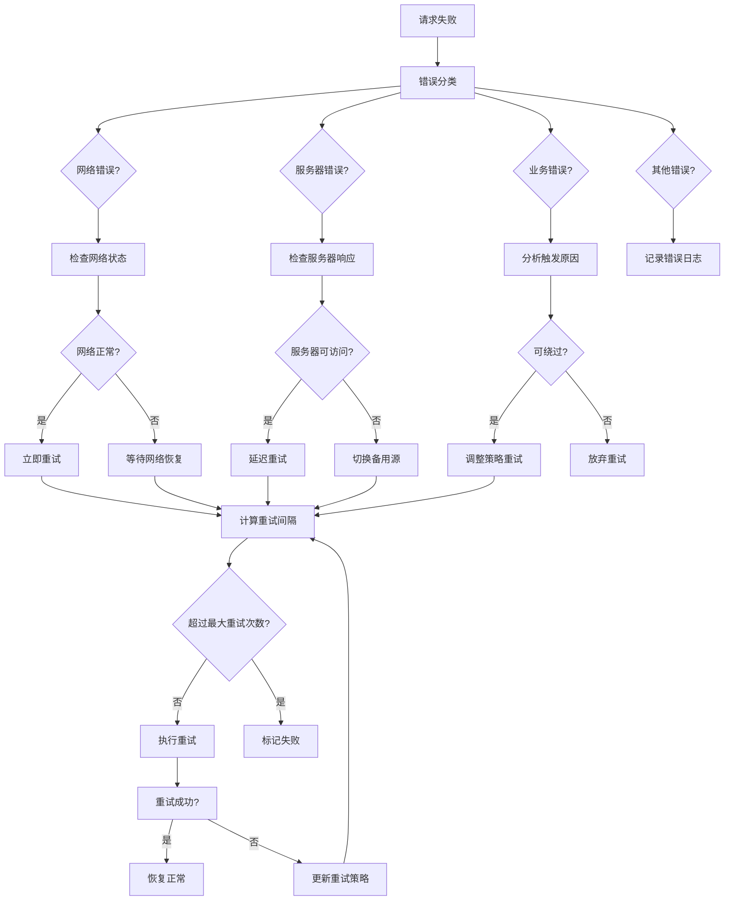
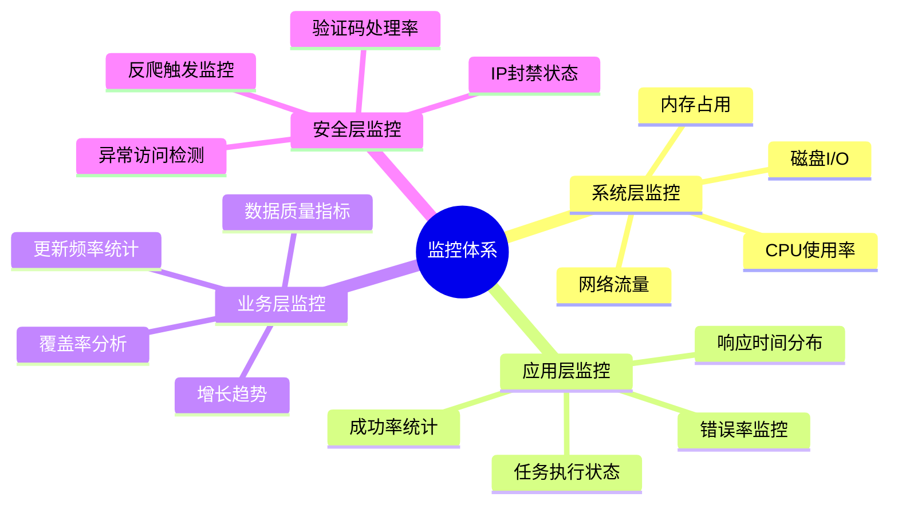
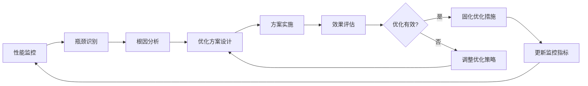

# 第1章：现代爬虫架构设计原理

## 引言：网络爬虫架构演进历程

网络爬虫技术从早期的简单脚本发展到今天的企业级分布式系统，经历了多个重要阶段。从单线程爬虫到多线程并发，从单一进程到分布式集群，从规则驱动到智能调度，爬虫架构的演进始终围绕着效率、可扩展性和可靠性的提升。

现代爬虫系统面临着前所未有的挑战：海量数据处理需求、复杂的反爬虫机制、实时性要求、以及合规性约束。这些挑战推动着爬虫架构向着更加智能化、模块化和可扩展的方向发展。

本章将从架构设计的角度，深入剖析现代爬虫系统的核心原理，为后续学习打下坚实的理论基础。

## 1.1 现代爬虫系统的核心架构

### 1.1.1 爬虫系统的分层设计理念

现代爬虫系统采用分层架构，每一层承担特定的职责，层与层之间通过明确的接口进行通信。这种设计理念源于软件工程中的"关注点分离"原则，确保系统的可维护性和可扩展性。



### 1.1.2 微服务架构在爬虫中的应用

随着爬虫系统规模的扩大，单体架构逐渐暴露出维护困难、扩展性差的问题。微服务架构通过将系统拆分为多个独立的服务单元，每个服务专注于特定的业务功能，从而提高了系统的灵活性和可扩展性。

**服务拆分策略：**

- **调度服务**（Scheduler Service）：负责任务分发和优先级管理
- **下载服务**（Downloader Service）：处理HTTP请求和响应
- **解析服务**（Parser Service）：数据提取和结构化处理
- **存储服务**（Storage Service）：数据持久化和缓存管理
- **监控服务**（Monitor Service）：系统健康检查和性能监控

**服务间通信模式：**



## 1.2 爬虫系统的核心工作流程

### 1.2.1 标准爬虫生命周期

现代爬虫系统的工作流程可以抽象为一个完整的生命周期，从任务初始化到数据存储，每个环节都有其特定的技术要求和实现难点。

**爬虫生命周期概览：**



### 1.2.2 智能调度与优先级管理

在大规模爬虫系统中，任务调度是决定系统效率的关键因素。现代调度器需要考虑多个维度：URL优先级、域名访问频率、服务器负载、网络状况等。

**调度决策算法流程：**



## 1.3 异步编程与并发控制

### 1.3.1 异步编程模型的选择

现代爬虫系统必须处理大量的网络I/O操作，传统的同步模型会导致资源利用率低下。异步编程模型通过非阻塞I/O和事件驱动的方式，显著提高了系统的并发能力。

**异步模型对比分析：**

| 模型类型 | 优势 | 劣势 | 适用场景 |
|---------|------|------|---------|
| 回调模型 | 资源占用少 | 回调地狱问题 | 简单的异步操作 |
| Promise/async-await | 代码结构清晰 | 需要语言支持 | 中等复杂度应用 |
| Actor模型 | 天然分布式 | 实现复杂度高 | 大规模分布式系统 |
| 协程模型 | 轻量级线程 | 需要运行时支持 | 高并发场景 |

### 1.3.2 并发控制策略

并发控制是爬虫系统稳定运行的保障。过高的并发会导致目标服务器压力过大，甚至触发反爬机制；过低的并发则影响爬取效率。

**自适应并发控制机制：**



## 1.4 错误处理与容错机制

### 1.4.1 多层次错误处理体系

现代爬虫系统必须具备完善的错误处理机制，能够应对各种异常情况：网络中断、服务器错误、数据格式变化、反爬触发等。一个健壮的错误处理体系应该包含多个层次。

**错误处理层次结构：**

```mermaid
pyramid
    title 错误处理层次结构

    "应用层错误处理" : 10%
    "业务逻辑错误处理" : 20%
    "网络层错误处理" : 30%
    "系统层错误处理" : 40%
```

**错误分类与处理策略：**

1. **网络错误**：连接超时、DNS解析失败、SSL证书问题等
2. **协议错误**：HTTP状态码异常、响应头缺失、内容长度不符等
3. **内容错误**：数据格式变化、编码问题、内容为空等
4. **业务错误**：反爬触发、访问频率限制、账号被封等
5. **系统错误**：内存不足、磁盘空间不足、进程崩溃等

### 1.4.2 智能重试机制

重试机制是爬虫系统容错性的重要体现，但简单的固定重试往往效果不佳。智能重试机制需要根据错误类型、历史成功率、目标网站特性等因素动态调整重试策略。

**动态重试决策流程：**



## 1.5 监控体系与性能优化

### 1.5.1 全方位监控体系设计

一个完善的监控系统是爬虫系统稳定运行的基础。现代监控体系需要覆盖系统各个层面，从硬件资源到业务指标，从实时状态到历史趋势。

**监控维度与指标：**



### 1.5.2 性能优化策略

爬虫系统的性能优化是一个持续的过程，需要从算法、架构、资源配置等多个维度进行优化。现代爬虫系统的优化策略应该基于实际监控数据，采用数据驱动的方法。

**性能优化闭环流程：**



## 总结

现代爬虫架构设计是一门综合性的技术学科，它融合了分布式系统、网络编程、数据挖掘、机器学习等多个领域的知识。本章从架构设计的角度，系统地介绍了现代爬虫系统的核心原理和最佳实践。

### 关键要点回顾：

1. **分层架构设计**：通过清晰的层次划分，实现关注点分离，提高系统的可维护性
2. **微服务化趋势**：将复杂系统拆分为独立的服务单元，提升灵活性和可扩展性
3. **智能调度机制**：基于多维度指标的动态调度，最大化系统效率
4. **异步编程模型**：通过非阻塞I/O和事件驱动，提高并发处理能力
5. **完善的容错机制**：多层次错误处理和智能重试，确保系统稳定性
6. **全方位监控体系**：覆盖系统、应用、业务、安全等多个维度的监控
7. **持续性能优化**：基于数据驱动的优化闭环，不断提升系统性能

### 技术发展趋势：

- **智能化调度**：机器学习算法在任务调度中的应用
- **云原生架构**：容器化和微服务的深度融合
- **边缘计算**：将部分计算任务下沉到网络边缘
- **自适应优化**：基于实时反馈的自动调优机制
- **绿色计算**：能效优化的爬虫系统设计

下一章将深入探讨DOM操作与数据提取的核心技术，这是爬虫系统获取网页数据的基础。