# 第2章：DOM操作与数据提取核心技术

## 引言：从HTML文档到结构化数据的转换艺术

在现代Web爬虫技术体系中，DOM操作与数据提取是将原始HTML转换为有价值结构化数据的核心环节。随着Web技术的飞速发展，现代网页已经从简单的静态文档演变为复杂的动态应用，这给数据提取技术带来了前所未有的挑战。

传统的文本处理方法已无法应对现代复杂的网页结构，爬虫开发者需要深入理解浏览器渲染机制、DOM树构建原理、以及现代前端框架的数据流模式。本章将从技术原理的角度，系统性地介绍DOM操作与数据提取的核心技术和最佳实践。

## 2.1 浏览器渲染引擎与DOM树构建原理

### 2.1.1 现代浏览器的渲染管线

理解浏览器如何将HTML文档转换为可视化的网页，对于爬虫开发者来说至关重要。这个过程中的每个阶段都可能影响数据提取的策略和效果。

**完整渲染管线流程：**

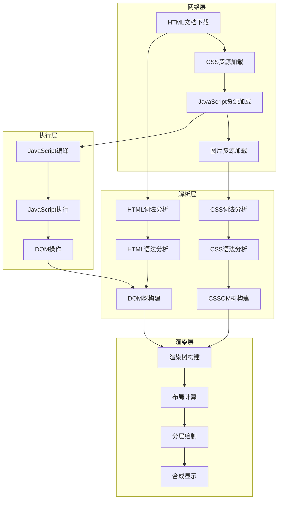

### 2.1.2 DOM树构建的详细机制

DOM（Document Object Model）树的构建是一个复杂的过程，涉及词法分析、语法分析、节点创建等多个步骤。每个步骤都可能影响爬虫的数据提取策略。

**DOM树构建阶段详解：**

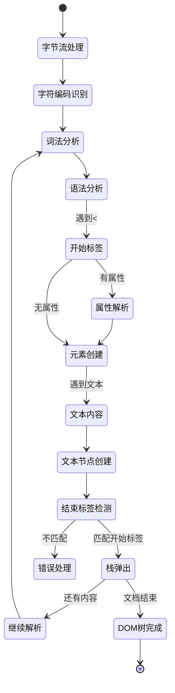

### 2.1.3 关键渲染路径优化对爬虫的影响

现代浏览器为了提升性能，会对关键渲染路径进行各种优化。这些优化机制可能会影响爬虫获取完整DOM的能力。

**渲染路径优化策略：**

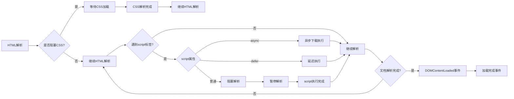

## 2.2 CSS选择器与XPath高级应用

### 2.2.1 选择器引擎的工作原理

CSS选择器和XPath是现代爬虫数据提取的核心工具。深入理解选择器引擎的工作原理，可以帮助我们编写更高效、更精确的数据提取规则。

**选择器解析与执行流程：**

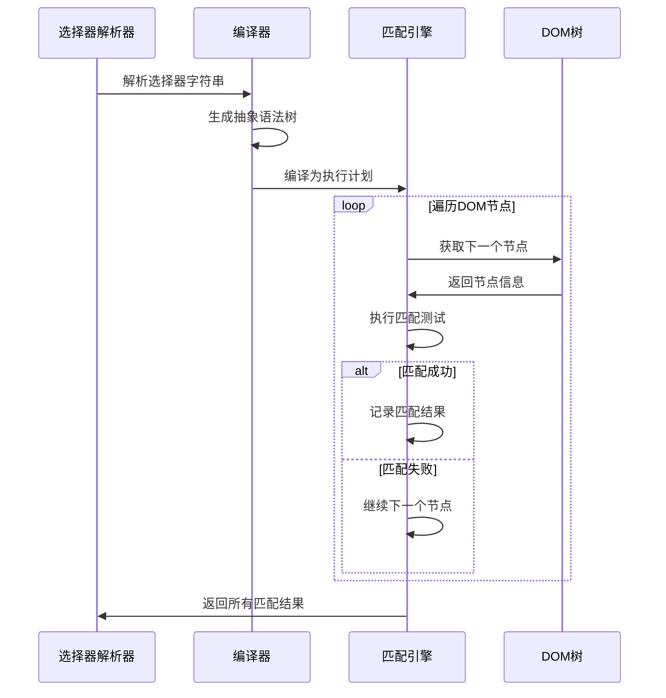

### 2.2.2 选择器性能优化策略

在大规模网页处理中，选择器的性能直接影响爬虫的整体效率。了解不同选择器的性能特征，可以帮助我们优化数据提取策略。

**选择器性能对比分析：**

| 选择器类型 | 性能等级 | 推荐场景 | 优化建议 |
|-----------|---------|---------|---------|
| ID选择器 | ⭐⭐⭐⭐⭐ | 唯一元素定位 | 优先使用，性能最佳 |
| 类选择器 | ⭐⭐⭐⭐ | 相似元素批量获取 | 避免过于复杂的类组合 |
| 标签选择器 | ⭐⭐⭐ | 通用元素筛选 | 配合其他条件使用 |
| 属性选择器 | ⭐⭐ | 特定属性元素 | 谨慎使用正则表达式 |
| 伪类选择器 | ⭐⭐ | 位置和状态元素 | 避免复杂伪类嵌套 |
| XPath表达式 | ⭐ | 复杂条件查询 | 简化路径表达式 |

**优化选择器的决策流程：**

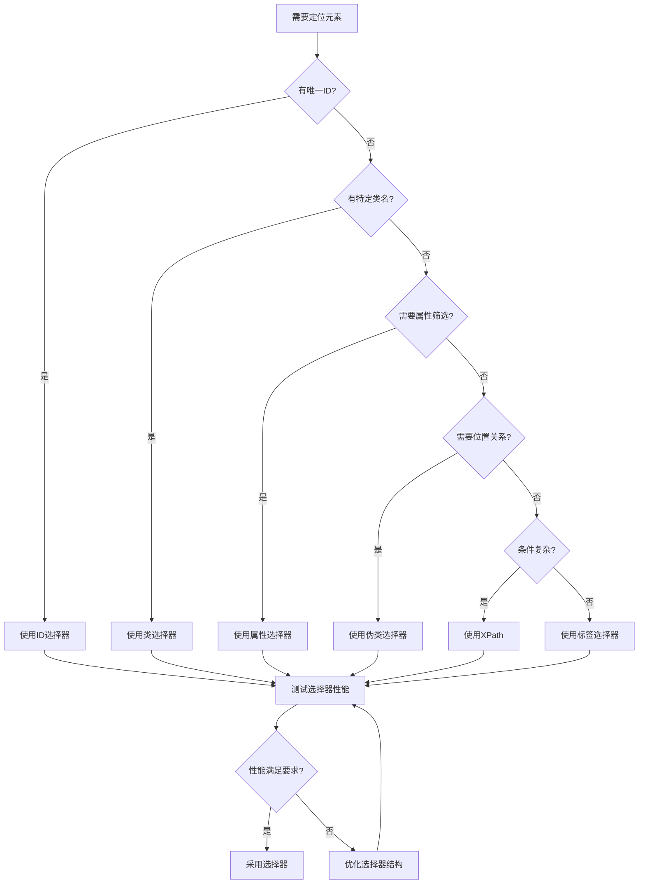

### 2.2.3 动态内容中的选择器策略

现代网页大量使用动态内容，这给传统的CSS选择器带来了挑战。需要采用更加灵活和健壮的选择器策略来应对动态变化。

**动态内容选择器策略矩阵：**

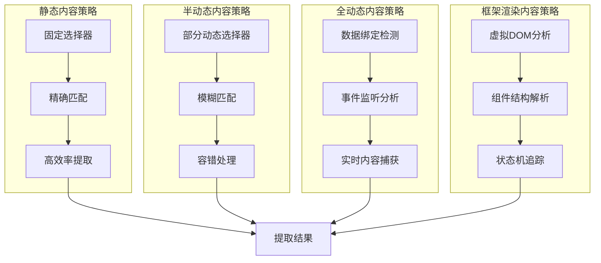

## 2.3 JavaScript动态执行与数据提取

### 2.3.1 现代JavaScript执行环境

现代网页的JavaScript执行环境极其复杂，涉及多线程、事件循环、异步编程等概念。理解这些概念对于处理动态内容至关重要。

**JavaScript事件循环机制：**

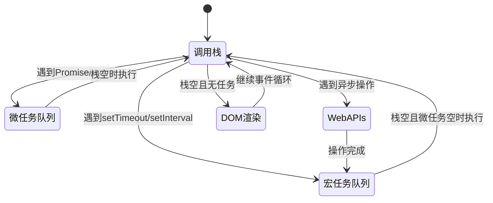

### 2.3.2 动态内容加载模式分析

现代网页使用多种动态内容加载模式，每种模式都有其特征和应对策略。识别这些模式是成功提取动态数据的关键。

**动态加载模式分类：**

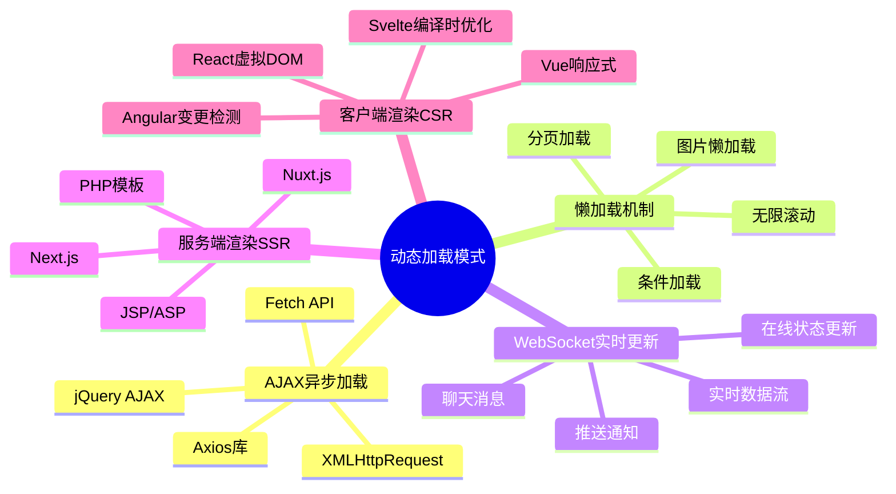

### 2.3.3 异步数据捕获策略

捕获异步加载的数据是现代爬虫的核心挑战。需要采用多种策略来确保获取完整的页面数据。

**异步数据捕获策略矩阵：**

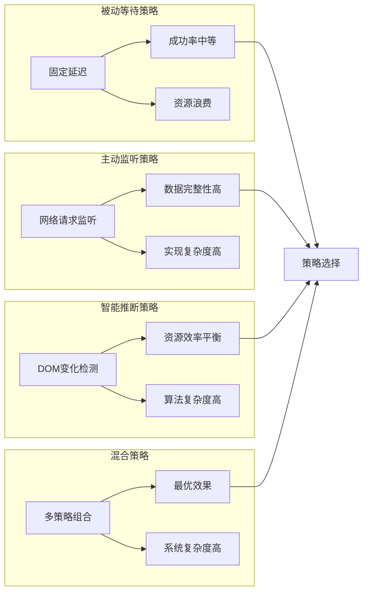

## 2.4 前端框架数据获取技术

### 2.4.1 React框架的数据流分析

React作为最流行的前端框架之一，其虚拟DOM和数据绑定机制对爬虫数据提取提出了新的挑战。

**React数据流与更新机制：**

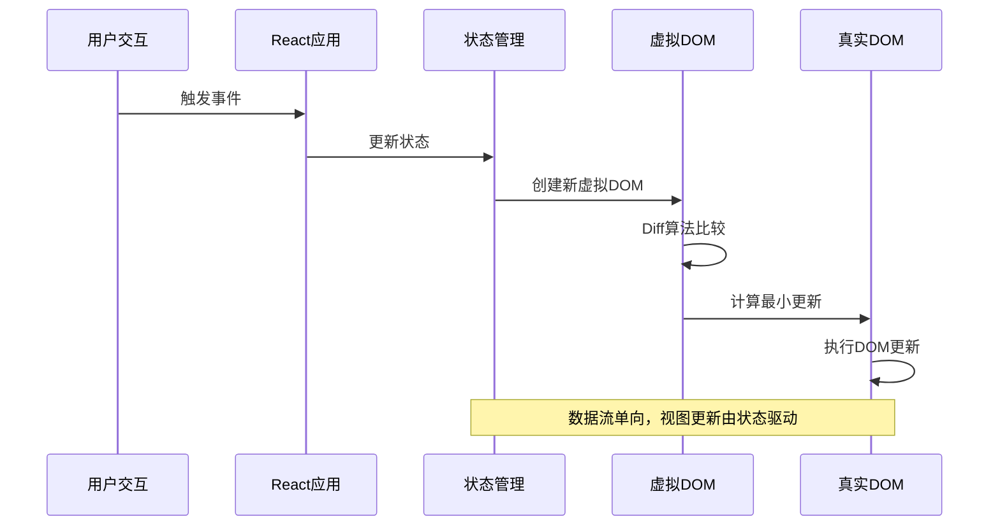

**React爬虫策略决策树：**

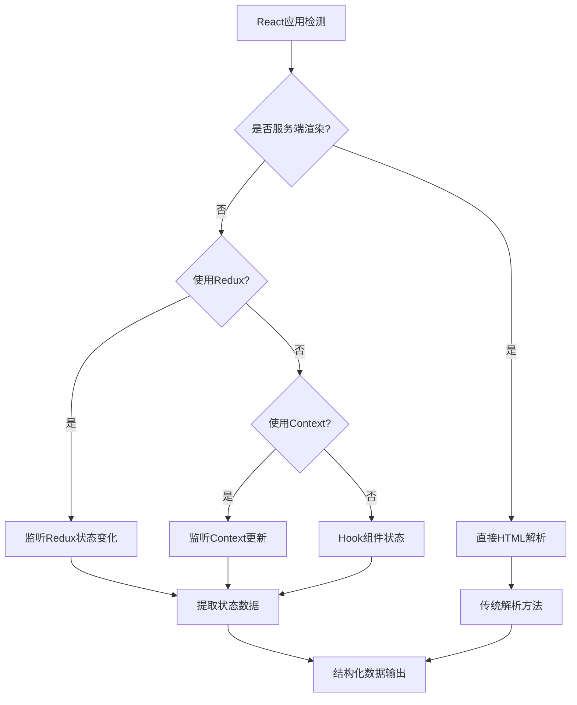

### 2.4.2 Vue框架响应式原理分析

Vue的响应式系统通过数据劫持和依赖收集实现了自动的视图更新，这给爬虫数据提取带来了独特的挑战。

**Vue响应式系统工作原理：**

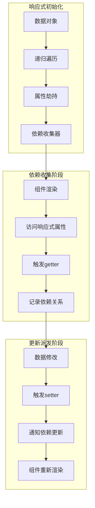

### 2.4.3 Angular框架变更检测机制

Angular的变更检测机制通过Zone.js实现了异步操作的统一管理，理解这个机制对于爬虫获取Angular应用数据很重要。

**Angular变更检测流程：**

```mermaid
stateDiagram-v2
    [*] --> 初始化应用
    初始化应用 --> 启动Zone.js
    启动Zone.js --> 等待异步操作

    等待异步操作 --> 异步任务触发
    异步任务触发 --> 变更检测开始
    变更检测开始 --> 检查组件状态
    检查组件状态 --> {状态有变化?}

    状态有变化 -->|是| 更新视图
    状态有变化 -->|否| 变更检测结束
    更新视图 --> 变更检测结束
    变更检测结束 --> 等待异步操作

    异步任务触发 --> 错误处理: 发生异常
    错误处理 --> 变更检测结束
```

## 2.5 Shadow DOM与Web Components处理

### 2.5.1 Shadow DOM的隔离机制

Shadow DOM提供了强大的样式和行为封装，但同时也给数据提取带来了新的挑战。理解Shadow DOM的工作原理是处理Web Components的基础。

**Shadow DOM层级结构：**

```mermaid
graph TB
    subgraph "主文档DOM"
        A[Document] --> B[Host Element]
    end

    subgraph "Shadow DOM"
        C[Shadow Root] --> D[Shadow Tree]
        D --> E[Slot元素]
        E --> F[分布式节点]
    end

    B -.-> C: Shadow边界
    F -.-> B: Light DOM内容

    style Shadow DOM fill:#f9f,stroke:#333,stroke-width:2px
    style A fill:#bbf,stroke:#333,stroke-width:2px
```

### 2.5.2 Web Components数据提取策略

Web Components的封装性使得传统DOM操作方法失效，需要采用特殊的策略来获取组件内部数据。

**Web Components渗透策略：**

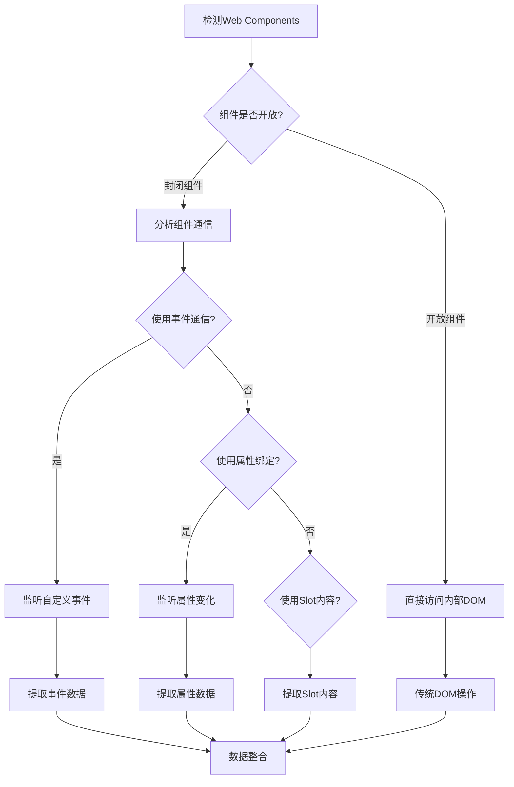

### 2.5.3 现代组件库的特殊处理

现代前端组件库（如Material-UI、Ant Design等）大量使用Web Components技术，需要特殊的处理策略。

**组件库识别与处理流程：**

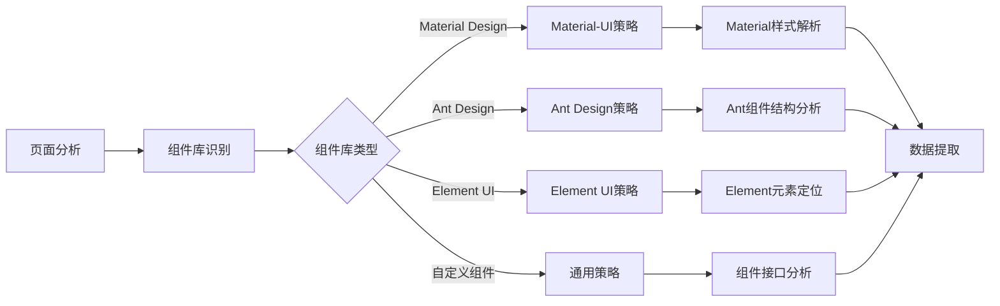

## 2.6 数据提取的容错与优化策略

### 2.6.1 鲁棒性数据提取设计

现代网页结构经常发生变化，鲁棒的数据提取策略需要能够适应这些变化而不失效。

**容错机制设计原则：**

```mermaid
pyramid
    title 数据提取容错层次

    "多策略备用" : 15%
    "模糊匹配机制" : 25%
    "结构化容错" : 30%
    "基础异常处理" : 30%
```

**多层级容错处理流程：**

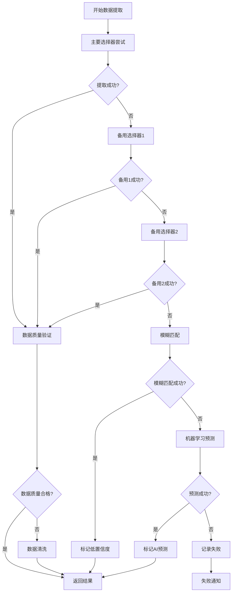

### 2.6.2 性能优化与资源管理

大规模数据提取需要考虑性能优化和资源管理，避免内存泄漏和性能瓶颈。

**性能优化策略矩阵：**

| 优化维度 | 策略类型 | 实施难度 | 效果评估 | 推荐指数 |
|---------|---------|---------|---------|---------|
| 选择器优化 | 简化CSS选择器 | 低 | 高 | ⭐⭐⭐⭐⭐ |
| DOM操作 | 批量处理节点 | 中 | 高 | ⭐⭐⭐⭐ |
| 内存管理 | 及时清理引用 | 中 | 中 | ⭐⭐⭐⭐ |
| 并发控制 | 合理设置并发 | 高 | 高 | ⭐⭐⭐ |
| 缓存策略 | 智能缓存DOM | 低 | 中 | ⭐⭐⭐⭐ |

**资源管理生命周期：**

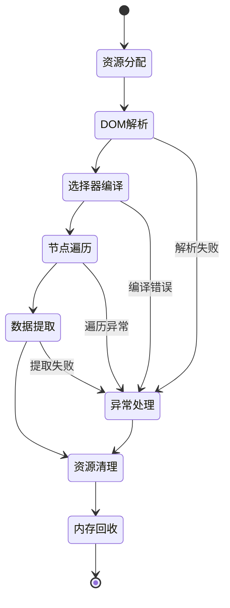

## 总结

DOM操作与数据提取是现代爬虫技术的核心环节，它融合了浏览器原理、前端框架、JavaScript技术等多个领域的知识。本章从技术原理的角度，系统性地介绍了DOM操作与数据提取的核心技术。

### 关键要点回顾：

1. **渲染管线理解**：深入理解浏览器渲染过程，有助于选择最佳的数据提取时机
2. **选择器优化**：合理选择和优化CSS选择器与XPath，提升数据提取效率
3. **动态内容处理**：掌握多种动态内容的捕获策略，应对现代网页的异步加载
4. **框架适配技术**：理解主流前端框架的工作原理，制定针对性的数据获取策略
5. **Web Components处理**：掌握Shadow DOM的穿透技术，处理组件化页面
6. **容错机制设计**：构建多层次容错体系，提高数据提取的鲁棒性
7. **性能优化策略**：合理管理资源，优化数据提取的性能表现

### 技术发展趋势：

- **智能化提取**：机器学习在DOM结构理解和数据提取中的应用
- **实时适配**：自动适应网页结构变化的智能提取系统
- **跨框架统一**：统一的框架抽象层，简化多框架页面处理
- **可视化调试**：图形化的DOM分析和选择器调试工具
- **自动化维护**：自修复的数据提取规则和持续集成机制

下一章将深入探讨静态网页抓取技术，这是爬虫技术体系中的重要基础。