# 第3章：静态网页抓取技术深度

## 引言：从简单HTTP请求到智能数据提取的艺术

静态网页抓取是网络爬虫技术的基石，但其真正的复杂性和深度往往被低估。现代Web生态中，即便是看似"静态"的网页，也蕴含着复杂的技术架构和数据传输模式。本章将从技术原理的角度，深入剖析静态网页抓取的核心技术和最佳实践，帮助读者建立系统化的技术认知体系。

### 静态网页的重新定义

传统意义上，静态网页指的是服务器直接返回完整HTML内容的页面。但在现代Web架构中，"静态"概念已经演变为一个相对性的技术范畴。我们需要从多个维度来理解静态网页的特征和边界。

**静态网页技术特征谱系：**

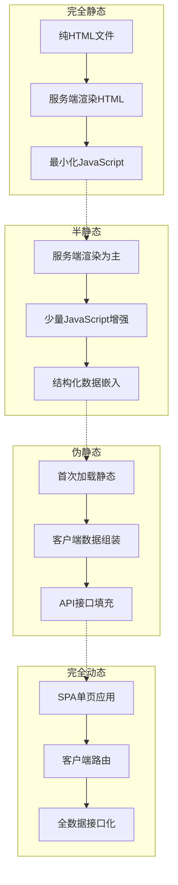

### 3.1 静态网页特征识别的系统性方法

识别静态网页特征不仅是技术判断，更是制定后续抓取策略的关键决策点。错误的识别会导致技术路线选择错误，从而影响整个抓取项目的效率和成功率。

#### 3.1.1 多维度特征分析框架

**静态网页识别决策树：**

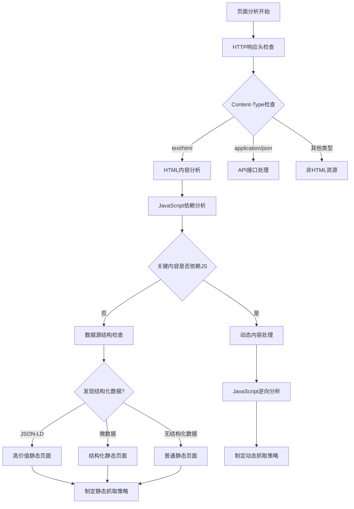

#### 3.1.2 技术特征的层次化分析

**静态性评估矩阵：**

| 评估维度 | 强静态指标 | 弱静态指标 | 非静态指标 | 权重 |
|---------|-----------|-----------|------------|------|
| **HTML结构完整性** | title/meta完整 | 缺少重要meta | 只有框架结构 | 25% |
| **内容呈现方式** | 纯HTML文本 | 少量JS增强 | 完全JS渲染 | 30% |
| **数据来源** | 服务端直出 | 嵌入JSON数据 | 完全API驱动 | 20% |
| **链接可达性** | 所有链接可爬取 | 部分需要JS生成 | 主要靠JS生成 | 15% |
| **脚本依赖性** | 无关键依赖 | 装饰性脚本 | 核心功能依赖 | 10% |

**静态性评分算法流程：**

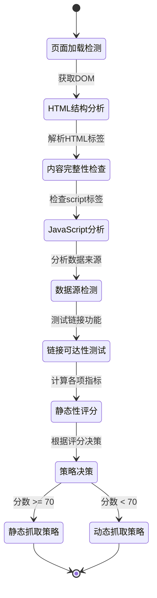

### 3.2 正则表达式在文本处理中的深度应用

正则表达式是静态网页抓取中的瑞士军刀，但其威力远不止简单的模式匹配。在高阶应用中，正则表达式是实现智能文本处理、数据提取和内容理解的核心工具。

#### 3.2.1 HTML文本的结构化解析原理

HTML文档虽然本质上是文本，但其具有内在的层次结构和语法规则。理解这些规则是编写高效正则表达式的基础。

**HTML解析的语法树概念：**

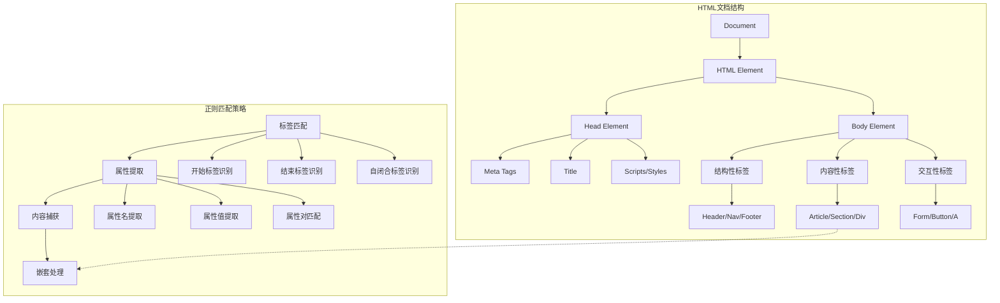

#### 3.2.2 智能模式匹配的层次化策略

在实际应用中，正则表达式的威力来自于层次化的匹配策略。从粗粒度的结构识别到精细的数据提取，每一层都有其特定的技术要点和应用场景。

**正则表达式匹配策略金字塔：**

```mermaid
pyramid
    title 正则表达式应用层次

    "语义层匹配（AI增强）" : 5%
    "上下文层匹配（环境感知）" : 15%
    "结构层匹配（DOM感知）" : 25%
    "模式层匹配（复合规则）" : 30%
    "基础层匹配（单模式）" : 25%
```

**智能文本处理流水线：**

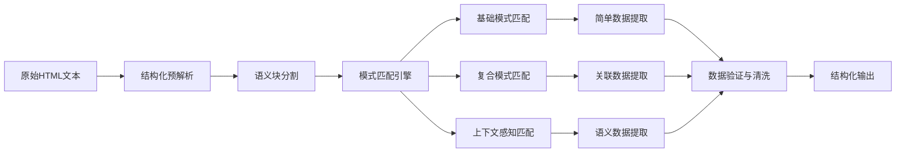

#### 3.2.3 复杂数据类型的识别与验证

现代网页中包含的数据类型极其丰富，从基础的联系方式到复杂的金融数据，每一种都有其特定的格式特征和验证规则。

**数据类型识别的决策流程：**

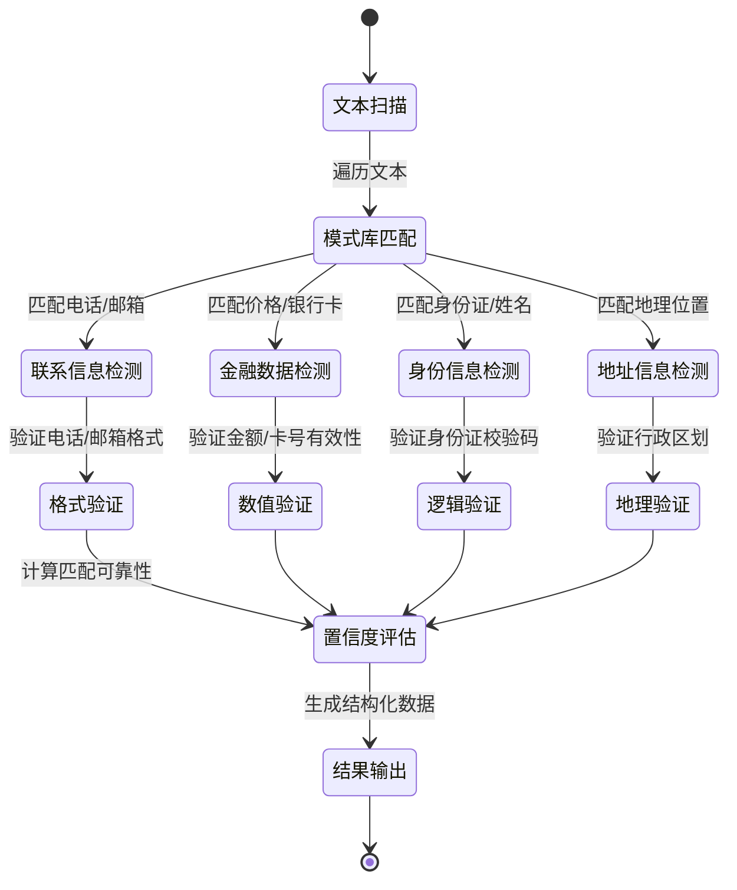

### 3.3 HTML解析技术的深度对比与选择

HTML解析是静态网页抓取的核心技术环节。不同的解析器有着不同的性能特征、适用场景和局限性。理解这些差异对于选择合适的技术方案至关重要。

#### 3.3.1 主流解析器的技术原理对比

**解析器性能特征矩阵：**

| 解析器类型 | 解析速度 | 内存占用 | 容错性 | XPath支持 | CSS选择器 | 学习曲线 | 适用场景 |
|-----------|---------|---------|--------|-----------|-----------|---------|---------|
| **BeautifulSoup** | 中等 | 中等 | 优秀 | 基础 | 优秀 | 平缓 | 快速原型、中小项目 |
| **lxml** | 最快 | 较低 | 良好 | 完整 | 完整 | 陡峭 | 高性能需求、大型项目 |
| **html5lib** | 最慢 | 最高 | 最佳 | 基础 | 基础 | 平缓 | 严格HTML5合规性需求 |
| **正则表达式** | 最快 | 最低 | 差 | 不支持 | 不支持 | 简单 | 简单文本提取、性能敏感 |

**解析器选择决策树：**

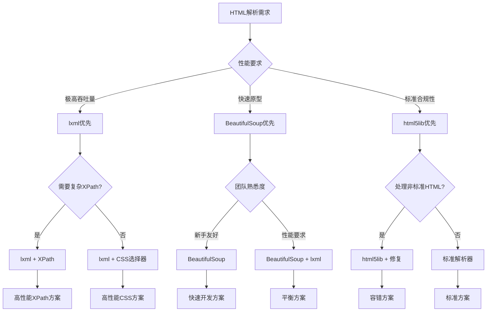

#### 3.3.2 结构化数据提取的框架化思维

结构化数据提取不是简单的信息收集，而是一个系统化的工程过程。需要建立统一的框架来处理不同类型的数据源和输出格式。

**数据提取框架的核心组件：**

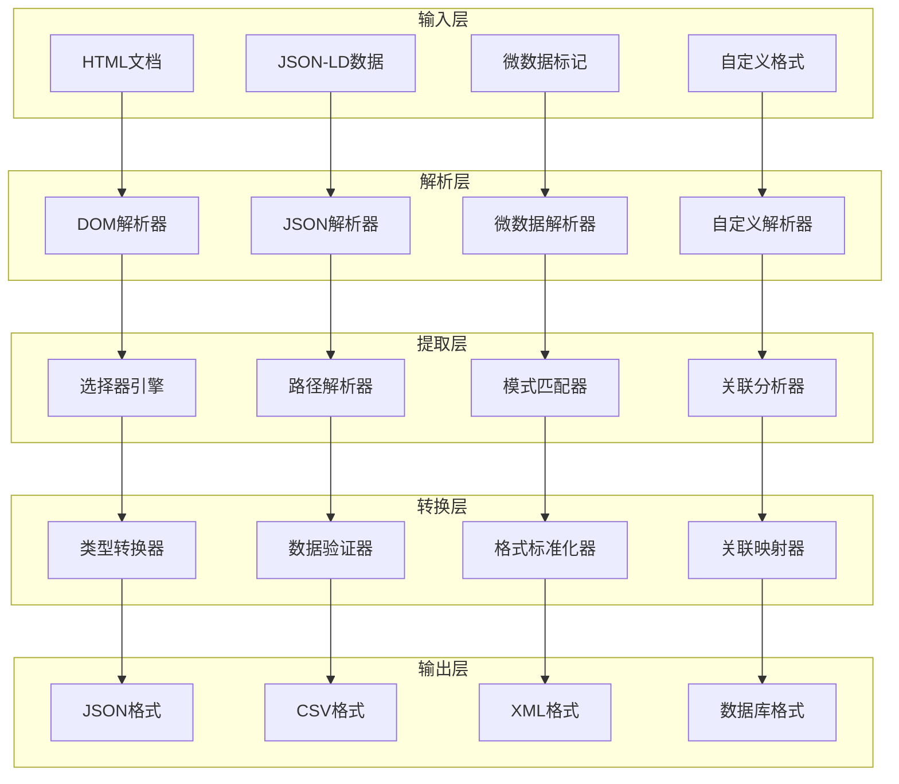

### 3.4 分页技术的智能化处理

分页是Web应用中处理大量数据的通用机制。对于爬虫系统而言，能够智能识别和处理各种分页模式是实现完整数据抓取的关键能力。

#### 3.4.1 分页模式的技术分类体系

现代Web应用的分页技术呈现出多样化的特征，从传统的URL参数分页到现代的无限滚动加载，每种技术都有其特定的识别和处理方法。

**分页技术分类谱系：**

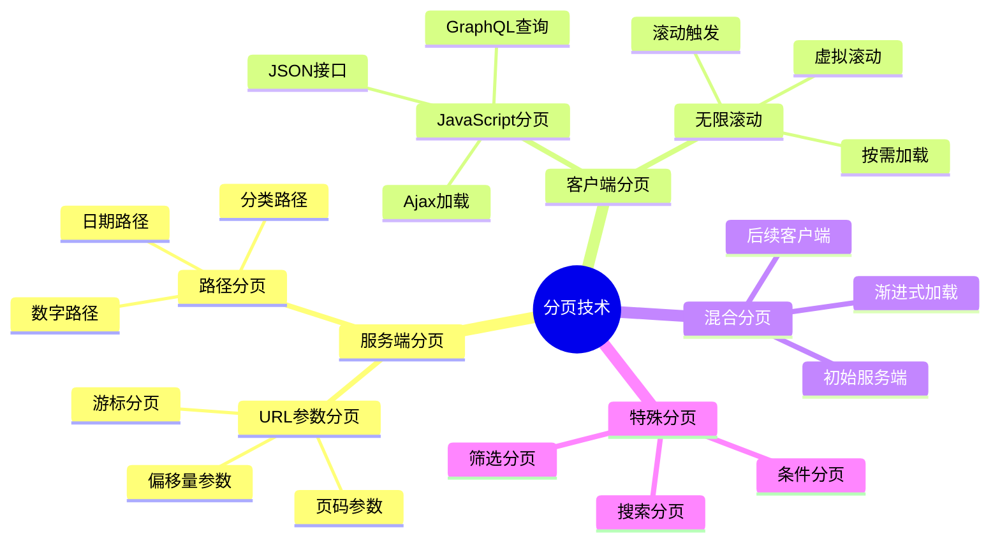

#### 3.4.2 分页模式识别的算法框架

**分页识别的智能算法流程：**

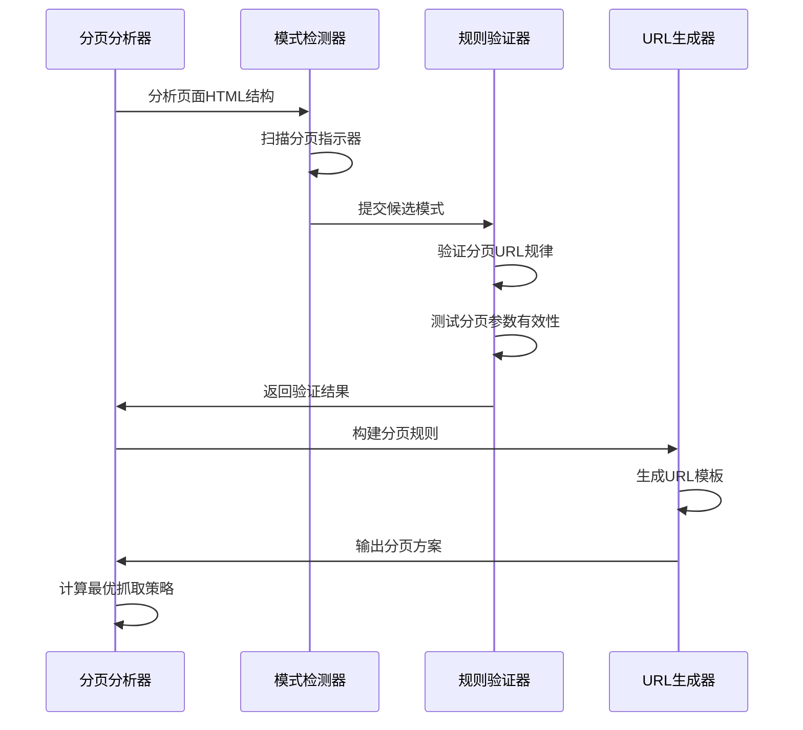

**分页URL规律发现的启发式算法：**

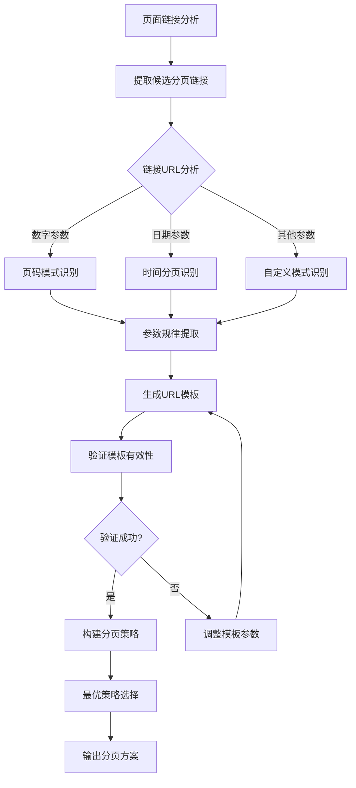

### 3.5 API接口逆向工程的技术方法论

现代Web应用的架构日益复杂，大量的数据通过API接口进行传输。掌握API逆向工程技术，是实现高效数据抓取的核心竞争力。

#### 3.5.1 API接口发现的多维度策略

API接口的发现不是简单的代码扫描，而是一个系统性的分析过程。需要从多个维度进行综合分析，才能构建完整的接口图谱。

**API发现的技术维度矩阵：**

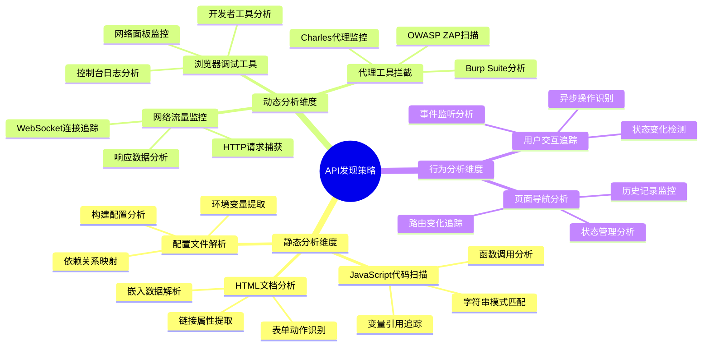

#### 3.5.2 API接口分析的智能化流程

**API逆向工程的系统化流程：**

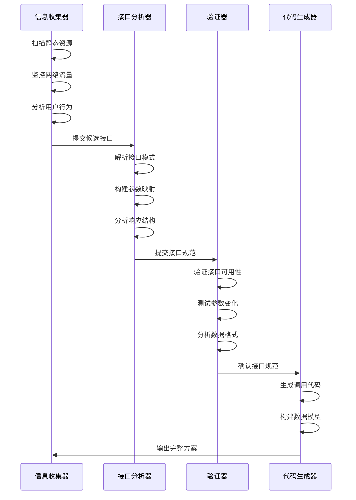

**API接口模式识别的关键技术：**

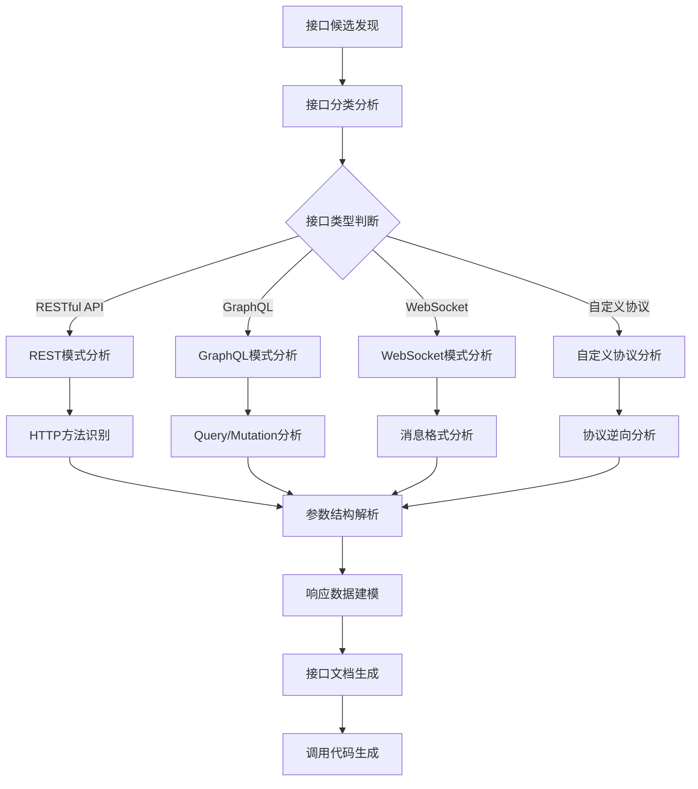

### 3.6 数据归一化与清洗的工程化实践

原始数据的清洗和归一化是决定最终数据质量的关键环节。需要建立系统化的清洗框架，确保数据的一致性、准确性和可用性。

#### 3.6.1 数据清洗的分层架构

现代数据清洗不是单一的步骤，而是一个多层次的系统工程。每一层都有其特定的职责和技术要点。

**数据清洗架构的层次模型：**

```mermaid
pyramid
    title 数据清洗架构层次

    "业务规则层（领域知识）" : 10%
    "智能验证层（AI增强）" : 15%
    "标准化层（格式统一）" : 25%
    "清洗层（错误修正）" : 30%
    "预处理层（基础清理）" : 20%
```

**数据清洗流水线的核心组件：**

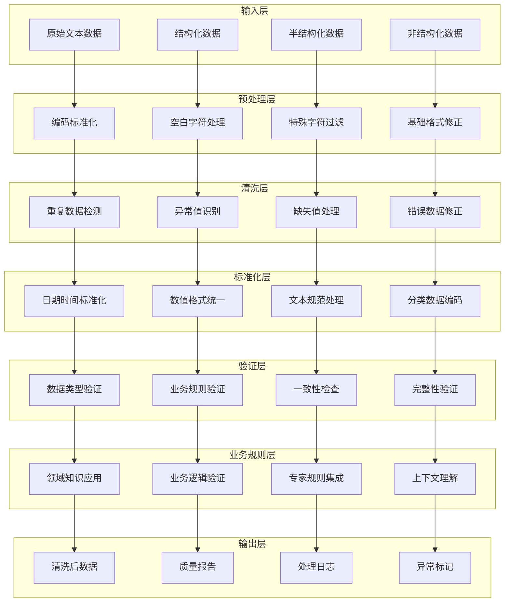

#### 3.6.2 智能数据质量评估体系

数据质量评估不是简单的正确性判断，而是一个多维度的综合评价体系。需要建立科学的评估模型，确保数据的可信度和可用性。

**数据质量评估的多维模型：**


**智能质量检测的决策流程：**

```mermaid
stateDiagram-v2
    [*] --> 数据接收
    数据接收 --> 基础检测: 格式/类型检查

    基础检测 --> 统计分析: 分布特征分析
    统计分析 --> 异常检测: 离群值识别

    异常检测 --> 业务验证: 业务规则检查
    业务验证 --> 一致性验证: 跨数据源比对

    一致性验证 --> 质量评分: 综合质量评估
    质量评分 --> {质量达标?}

    质量达标? -->|是| 数据入库: 标记高质量
    质量达标? -->|否| 问题诊断: 分析质量问题

    问题诊断 --> 自动修复: 可修复问题
    问题诊断 --> 人工审核: 复杂问题

    自动修复 --> 质量评分: 重新评估
    人工审核 --> 质量评分: 人工确认后

    数据入库 --> [*]
```

### 3.7 静态网页抓取的最佳实践与技术趋势

在掌握了核心技术的基础上，我们需要建立系统化的最佳实践方法论，并关注技术发展的趋势，以确保我们的技术方案能够适应不断变化的Web生态环境。

#### 3.7.1 现代静态网页抓取的技术栈选择

**技术栈选择的决策矩阵：**

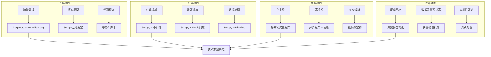

#### 3.7.2 性能优化的系统性策略

静态网页抓取的性能优化是一个系统工程，需要从网络、解析、存储等多个维度进行综合优化。

**性能优化的多维度框架：**

```mermaid
radar-beta
    title 性能优化维度

    "网络优化" : 90
    "解析优化" : 85
    "并发优化" : 95
    "内存优化" : 80
    "存储优化" : 75
    "算法优化" : 88
    "架构优化" : 92
```

**智能性能监控体系：**

```mermaid
flowchart LR
    A[性能监控启动] --> B[实时指标采集]

    B --> C[网络性能监控]
    B --> D[解析性能监控]
    B --> E[系统资源监控]
    B --> F[业务指标监控]

    C --> G[性能数据分析]
    D --> G
    E --> G
    F --> G

    G --> H{性能异常检测}
    H -->|正常| I[持续监控]
    H -->|异常| J[根因分析]

    J --> K[优化建议生成]
    K --> L[自动优化执行]

    L --> M[效果验证]
    M --> I

    I --> N{达到SLO?}
    N -->|是| O[监控完成]
    N -->|否| P[优化调整]
    P --> K
```

## 总结

静态网页抓取技术虽然看似基础，但其背后蕴含着深厚的技术原理和复杂的工程实践。通过本章的深入学习，我们建立了完整的静态网页抓取技术体系。

### 核心技术要点回顾：

1. **静态性识别的科学方法论**：
   - 建立了多维度、层次化的静态网页识别框架
   - 掌握了基于技术特征谱系的分类方法
   - 构建了定量化的静态性评估模型

2. **正则表达式的深度应用**：
   - 理解了HTML文档的内在结构和语法规则
   - 掌握了层次化的智能模式匹配策略
   - 建立了复杂数据类型的识别与验证体系

3. **HTML解析技术的系统性对比**：
   - 深入分析了主流解析器的技术原理和性能特征
   - 建立了科学的选择决策框架
   - 掌握了结构化数据提取的框架化思维

4. **分页技术的智能化处理**：
   - 理解了现代分页技术的分类体系
   - 掌握了基于启发式算法的分页模式识别
   - 建立了系统化的分页URL生成策略

5. **API逆向工程的技术方法论**：
   - 建立了多维度的API接口发现策略
   - 掌握了智能化的API分析流程
   - 理解了接口模式识别的关键技术

6. **数据清洗的工程化实践**：
   - 建立了分层架构的数据清洗体系
   - 掌握了智能数据质量评估方法
   - 构建了完整的清洗流水线框架

### 技术发展趋势与展望：

- **智能化趋势**：AI技术在数据提取和清洗中的应用将越来越广泛
- **实时化发展**：从批量处理向实时流处理的转变
- **标准化进程**：行业标准和最佳实践的逐步形成
- **工程化成熟**：从技术探索向工程化实践的演进
- **生态化建设**：工具链和平台生态的不断完善

静态网页抓取技术作为整个爬虫技术体系的基石，其重要性不言而喻。掌握本章的核心技术，不仅为后续学习动态网页抓取和反爬虫对抗技术奠定了坚实基础，更为构建高效、稳定、可扩展的数据获取系统提供了核心支撑。

在接下来的章节中，我们将基于本章建立的技术基础，深入探讨更复杂的动态网页抓取技术和反爬虫对抗策略，逐步构建完整的现代爬虫技术知识体系。