# 第4章：动态网页渲染与JavaScript逆向（一）

## 4.1 浏览器引擎与JavaScript执行环境深度解析

### 4.1.1 现代浏览器架构的层次化理解

现代浏览器已经发展为一个极其复杂的系统，远不止简单的HTML渲染工具。深入理解浏览器架构对于JavaScript逆向和动态内容抓取至关重要。浏览器采用多进程架构设计，每个进程承担特定职责，相互配合完成网页的完整渲染过程。

**浏览器进程架构全景：**

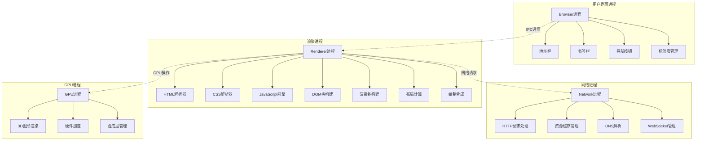

这种多进程架构带来了显著的安全性和稳定性优势。每个渲染进程运行在沙箱环境中，即使恶意代码攻破了一个网页，也无法直接访问系统资源。进程间的通信通过IPC（Inter-Process Communication）机制实现，确保了数据的安全传输。

### 4.1.2 JavaScript执行引擎的核心机制

JavaScript引擎作为浏览器的核心组件，负责解释和执行JavaScript代码。现代JavaScript引擎采用即时编译（JIT）技术，能够在运行时将JavaScript代码编译为高效的机器码，大大提升执行性能。

**JIT编译工作流程：**

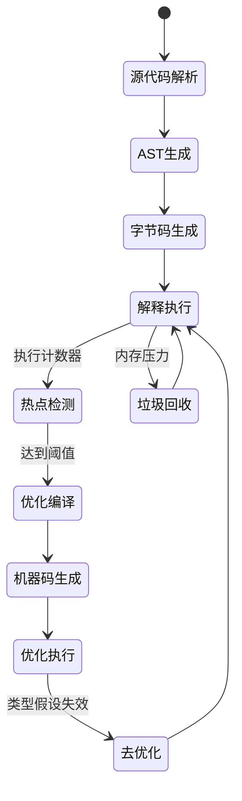

JavaScript引擎的这种多层次优化策略，使得代码在执行过程中能够动态调整性能表现。解释器负责快速启动和执行，编译器则针对热点代码进行深度优化。这种自适应机制对于理解动态网页的行为模式至关重要，特别是在分析复杂的JavaScript应用时。

**JavaScript执行上下文的生命周期：**

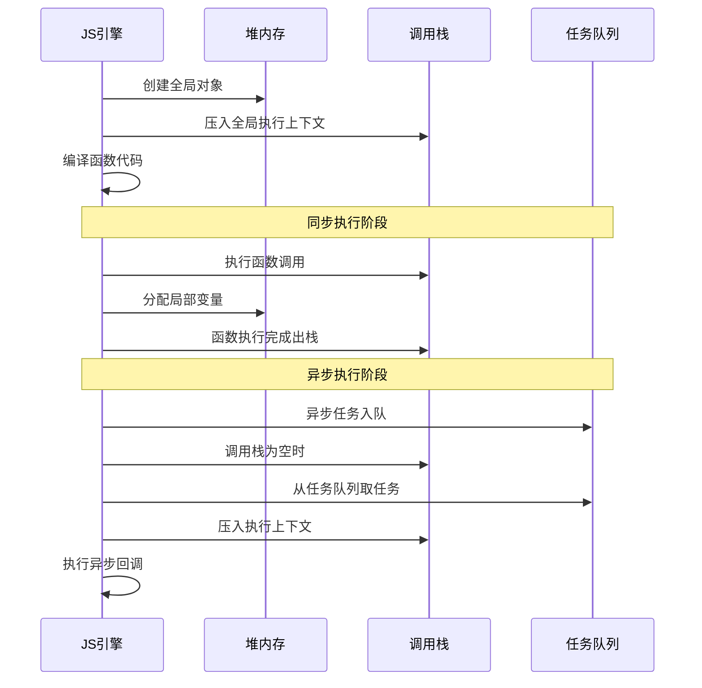

### 4.1.3 渲染管线与JavaScript执行的交互机制

JavaScript代码的执行会直接影响DOM的构建和渲染过程，理解这种交互机制对于掌握动态网页的行为模式至关重要。浏览器通过精妙的调度机制，确保JavaScript执行与渲染过程的协调一致。

**渲染管线与JavaScript交互时序：**

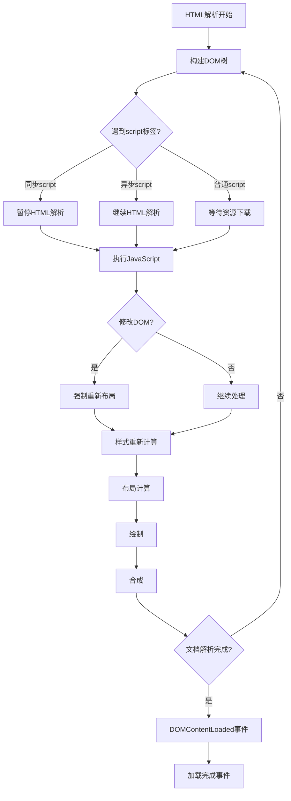

这种精巧的调度机制确保了JavaScript代码能够在正确的时机执行，同时避免不必要的重复渲染。对于逆向工程而言，理解这种交互模式有助于推断网页的加载逻辑和动态内容的生成时机。

### 4.1.4 内存管理与垃圾回收机制

JavaScript的自动内存管理机制隐藏了复杂的内存分配和回收过程。对于逆向工程而言，理解垃圾回收机制有助于分析对象的生存周期和内存使用模式，从而推断程序的执行逻辑。

**V8垃圾回收机制详解：**

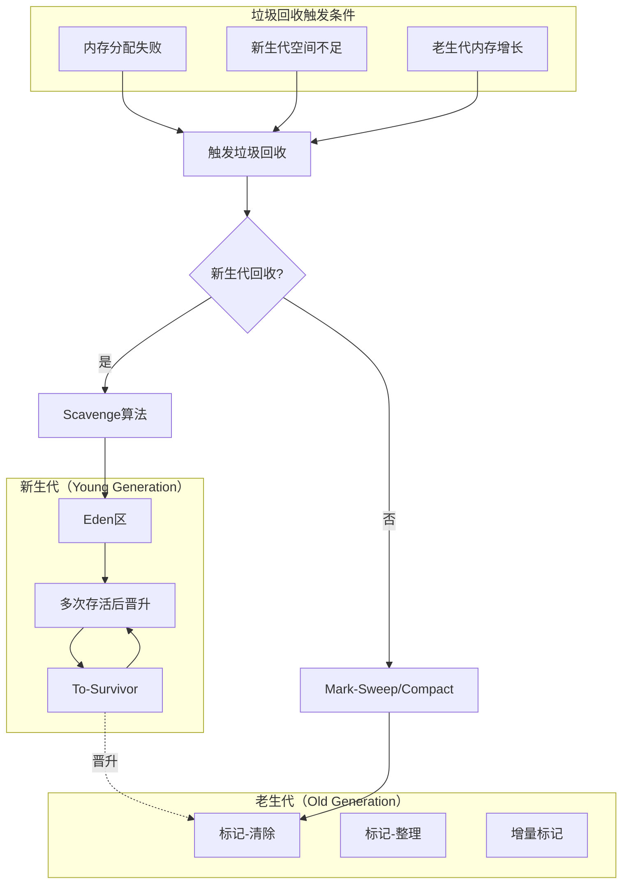

V8的垃圾回收机制采用分代策略，新生代对象通过Scavenge算法快速回收，老生代对象则使用标记-清除和标记-整理算法。这种设计平衡了回收效率和内存使用，为JavaScript应用的长期运行提供了保障。

### 4.1.5 事件循环与异步编程模型

JavaScript的事件循环机制是理解异步编程的基础。现代网页大量使用异步操作，掌握事件循环的工作原理对于分析动态内容的生成过程至关重要。

**事件循环的完整周期：**

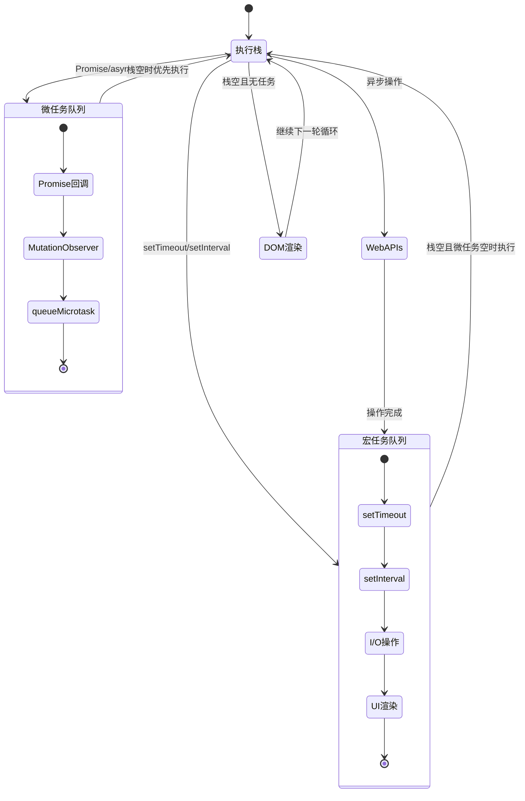

事件循环的这种优先级机制确保了微任务（如Promise回调）能够及时执行，而宏任务（如定时器）则在适当的时机处理。理解这种调度模式对于分析异步操作的执行顺序和时序关系具有重要意义。

### 4.1.6 安全沙箱与权限控制机制

为了防止恶意代码的危害，浏览器实现了复杂的安全沙箱机制。了解这些限制有助于在逆向工程时选择合适的绕过策略。

**浏览器安全沙箱层次结构：**

```mermaid
pyramid
    title 浏览器安全沙箱层次

    "内容安全策略CSP" : 10%
    "同源策略SOP" : 20%
    "跨域资源共享CORS" : 25%
    "进程隔离" : 25%
    "操作系统权限" : 20%
```

**跨域访问控制流程：**

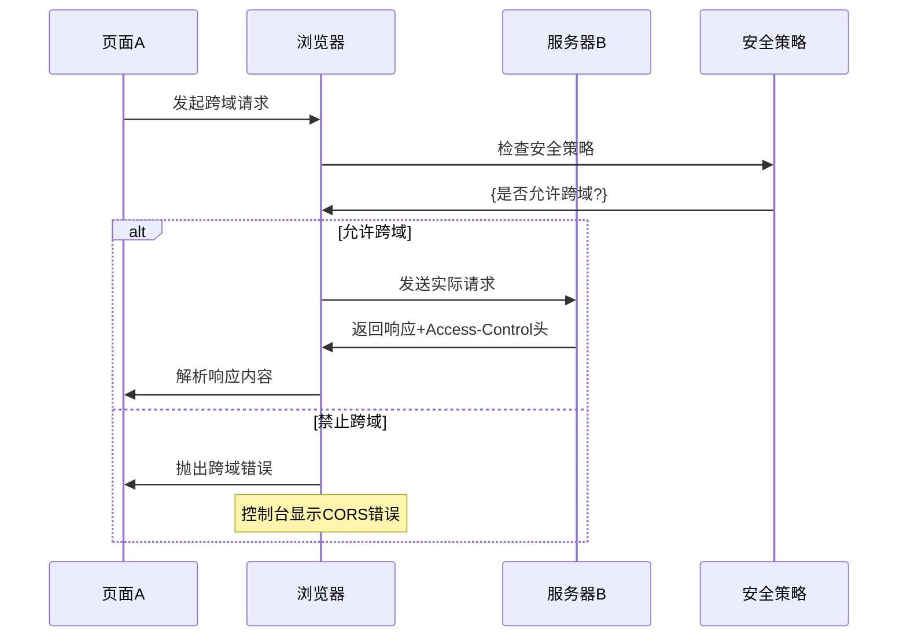

### 4.1.7 开发者工具与调试接口深度剖析

Chrome开发者工具提供了强大的调试和分析能力，深入理解这些工具的工作原理，有助于在逆向工程中获取关键信息。

**Chrome DevTools Protocol (CDP) 架构：**

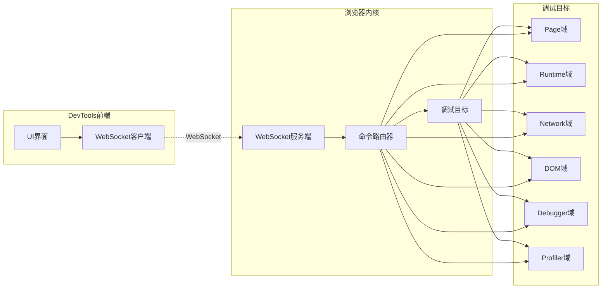

**调试命令的执行流程：**

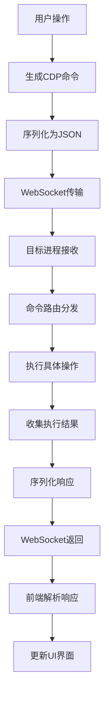

### 4.1.8 渲染进程与JavaScript引擎的协同机制

JavaScript的执行不仅影响数据逻辑，还会触发复杂的渲染过程。理解这种协同机制，有助于分析动态内容的生成时序和性能特征。

**JavaScript触发重排重绘的决策树：**

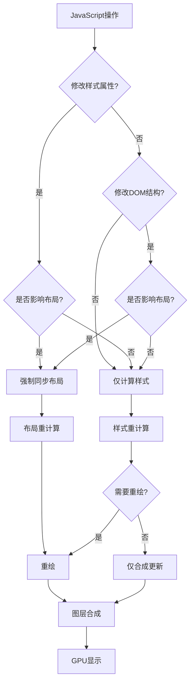

**批量更新机制的工作原理：**

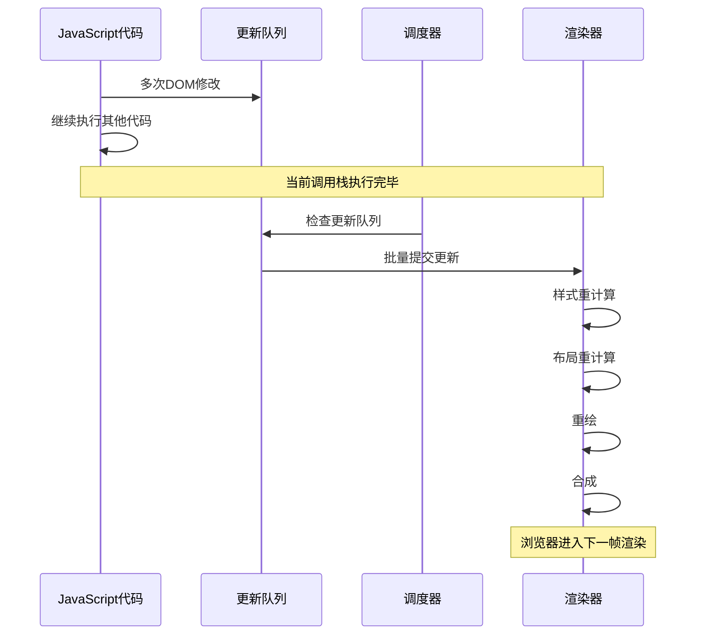

## 总结

浏览器引擎与JavaScript执行环境的深度理解，是掌握动态网页逆向分析的基础。本章从架构层面剖析了现代浏览器的核心机制，包括多进程架构、JIT编译、事件循环、内存管理、安全沙箱等关键技术。这些知识为后续的JavaScript代码分析和逆向工程提供了坚实的理论基础。

### 关键洞察：

1. **架构理解**：现代浏览器的多进程架构为JavaScript执行提供了隔离和安全保障
2. **执行机制**：JIT编译技术大幅提升了JavaScript的执行效率，但也增加了逆向分析的复杂性
3. **时序控制**：事件循环机制决定了异步代码的执行顺序，理解这一点对分析动态内容至关重要
4. **内存模型**：垃圾回收机制影响着对象的生命周期，为推断程序逻辑提供了线索
5. **安全限制**：浏览器沙箱机制限制了很多操作，但在特定条件下可以通过合理策略绕过
6. **调试接口**：Chrome DevTools Protocol提供了强大的调试能力，是逆向分析的重要工具
7. **渲染协同**：JavaScript与渲染过程的复杂交互关系，是分析动态内容生成过程的关键

下一部分将深入探讨JavaScript代码混淆与反混淆技术，这是现代网站保护核心逻辑的重要手段。