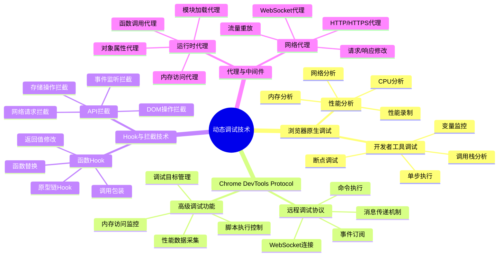
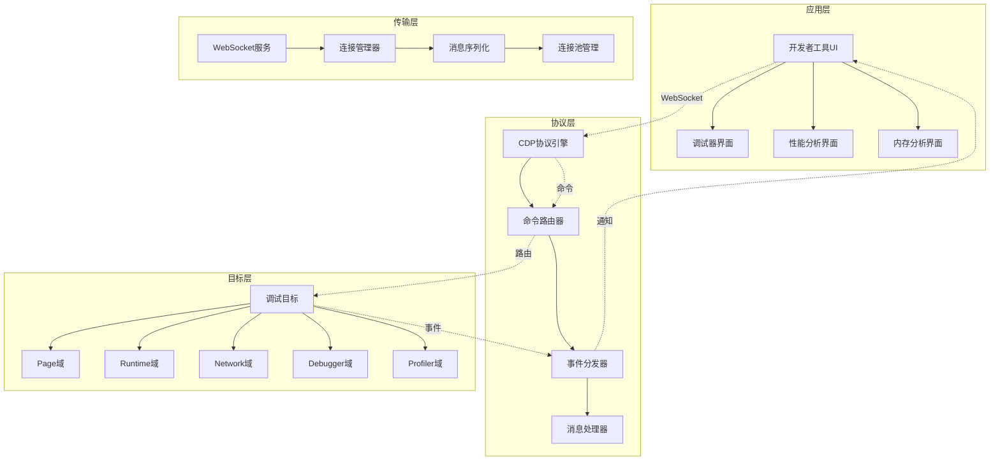
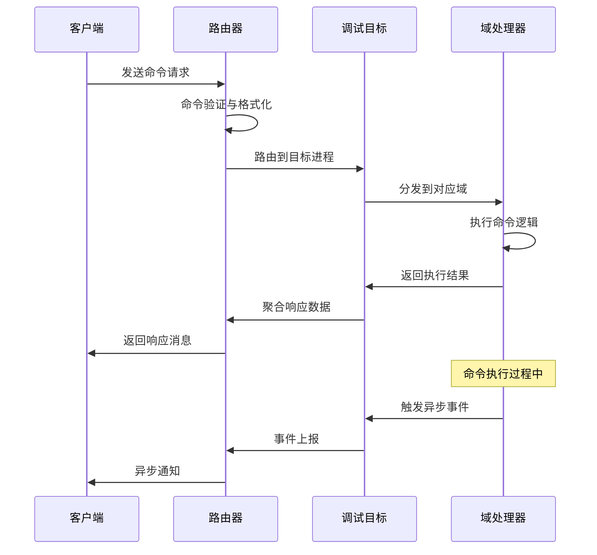
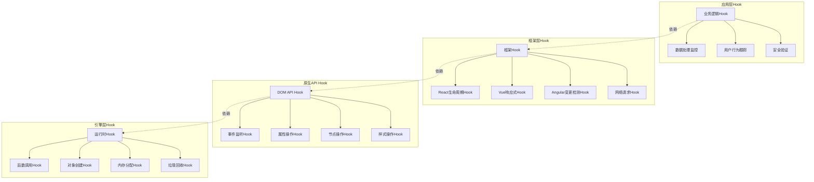
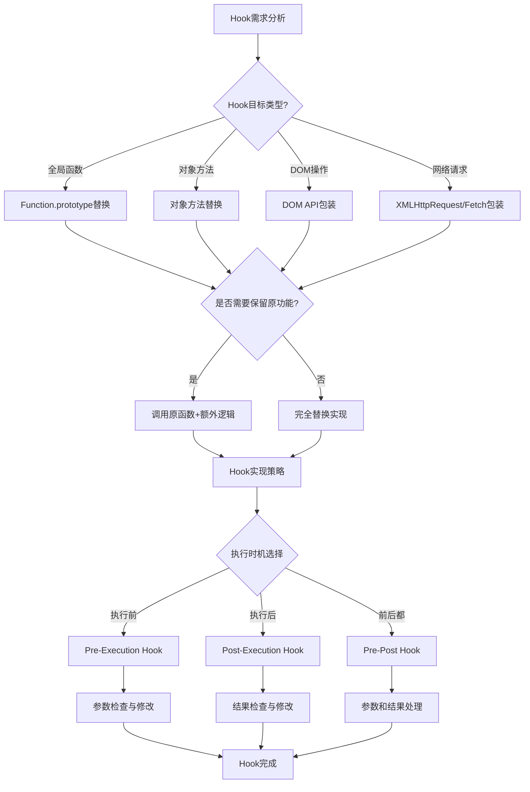
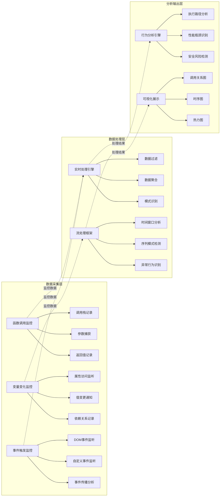
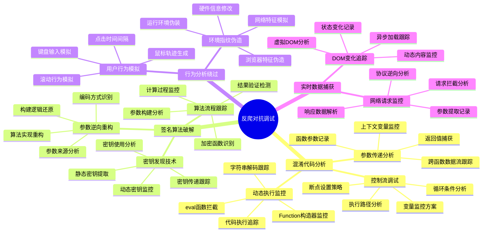
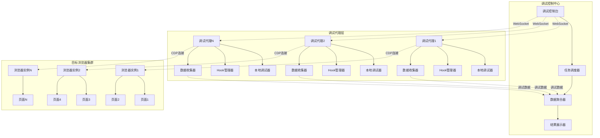
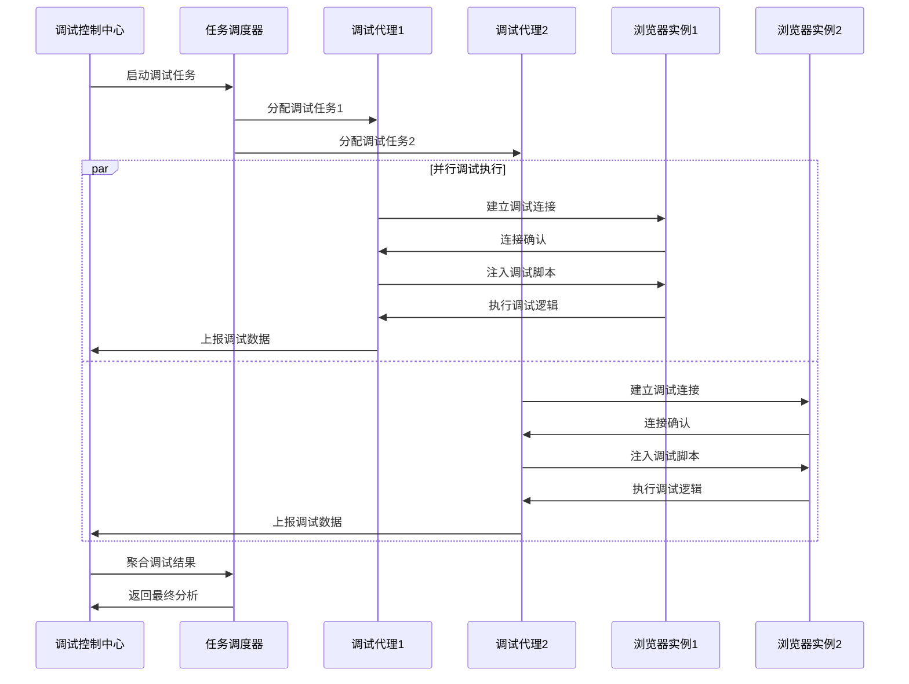
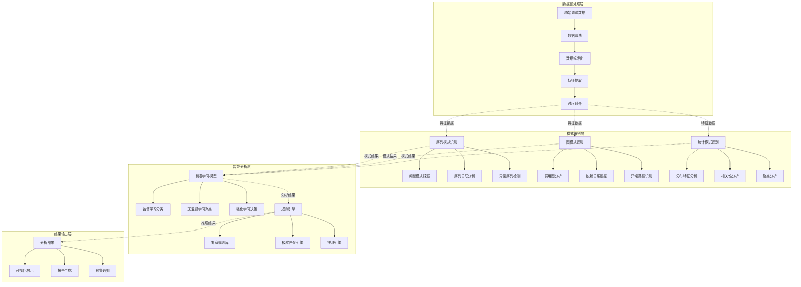

# 第4章：动态网页渲染与JavaScript逆向（三）

## 4.3 动态调试与Hook技术深度应用

### 4.3.1 现代动态调试技术的理论基础

动态调试是JavaScript逆向分析的核心手段，它允许我们在代码执行过程中实时监控、修改和分析程序行为。与静态分析相比，动态调试能够获取运行时的真实数据流，这对于理解复杂的混淆逻辑至关重要。

**动态调试技术的分类体系：**



### 4.3.2 Chrome DevTools Protocol的架构与原理

Chrome DevTools Protocol（CDP）是现代动态调试的基石，它提供了对浏览器内部状态的完整访问能力。理解CDP的架构原理，有助于构建高级调试和分析工具。

**CDP的分层架构设计：**



**CDP消息流转机制：**



### 4.3.3 JavaScript Hook技术的机制与应用

Hook技术是动态调试的核心，通过拦截和修改函数调用，我们可以监控代码执行流程、修改程序行为，甚至注入自定义逻辑。

**Hook技术的实现层次：**



**Hook注入时机的决策树：**



### 4.3.4 运行时行为监控与分析

运行时行为监控是理解JavaScript程序执行模式的重要手段。通过监控函数调用、变量变化、事件触发等，我们可以构建程序的完整行为画像。

**行为监控的数据流架构：**



**监控事件的生命周期管理：**

```mermaid
stateDiagram-v2
    [*] --> 监控初始化
    监控初始化 --> 目标识别: 发现监控目标
    目标识别 --> 监控器注册: 注册Hook点
    监控器注册 --> 数据采集: 开始收集数据

    数据采集 --> 事件过滤: 过滤无关事件
    事件过滤 --> 数据处理: 处理有效事件
    数据处理 --> 模式识别: 识别行为模式

    模式识别 --> {发现异常?}
    发现异常 -->|是| 异常处理: 记录异常事件
    发现异常 -->|否| 数据聚合: 聚合统计信息

    异常处理 --> 数据聚合
    数据聚合 --> 结果输出: 输出分析结果
    结果输出 --> 持续监控: 继续监控

    持续监控 --> 数据采集
    数据采集 --> 监控器清理: 清理Hook点
    监控器清理 --> [*]
```

### 4.3.5 动态调试在反爬对抗中的应用

动态调试技术在反爬对抗中发挥着关键作用。通过实时监控和修改程序行为，我们可以绕过各种反爬机制，获取目标数据。

**反爬对抗的调试策略矩阵：**



### 4.3.6 高级调试技术：远程调试与分布式分析

随着爬虫系统规模的扩大，传统的单机调试已经无法满足需求。远程调试和分布式分析技术允许我们在多个节点上同时进行调试分析，大大提高了调试效率。

**远程调试架构设计：**



**分布式调试的协调机制：**



### 4.3.7 调试数据的智能分析与模式识别

现代调试系统不仅仅是收集数据，更重要的是能够智能分析这些数据，识别出有价值的行为模式和异常情况。

**智能分析的技术架构：**



**异常检测的多层机制：**

```mermaid
pyramid
    title 异常检测层次结构

    "业务异常检测" : 15%
    "行为异常检测" : 25%
    "性能异常检测" : 30%
    "技术异常检测" : 30%
```

## 总结

动态调试与Hook技术是现代JavaScript逆向工程的核心竞争力。本章从理论基础到实际应用，系统性地介绍了这些技术的原理和应用方法。

### 关键洞察：

1. **动态调试的本质**：通过在代码执行过程中实时监控和修改程序行为，获取静态分析无法获得的信息

2. **CDP的强大能力**：Chrome DevTools Protocol提供了对浏览器内部状态的完整访问，是构建高级调试工具的基础

3. **Hook技术的灵活性**：通过在不同层次上实现Hook，可以精确监控和修改程序的各种行为

4. **行为监控的价值**：通过运行时行为监控，可以构建程序的完整行为画像，识别异常模式和安全风险

5. **分布式调试的必要性**：随着系统规模扩大，远程调试和分布式分析成为提高效率的必然选择

6. **智能分析的增强作用**：机器学习和规则引擎的结合，能够从海量调试数据中发现有价值的模式和异常

7. **反爬对抗的实战应用**：动态调试技术在破解各种反爬机制中发挥着不可替代的作用

下一章将深入探讨WebAssembly保护技术的逆向分析，这是现代JavaScript保护的前沿技术领域。